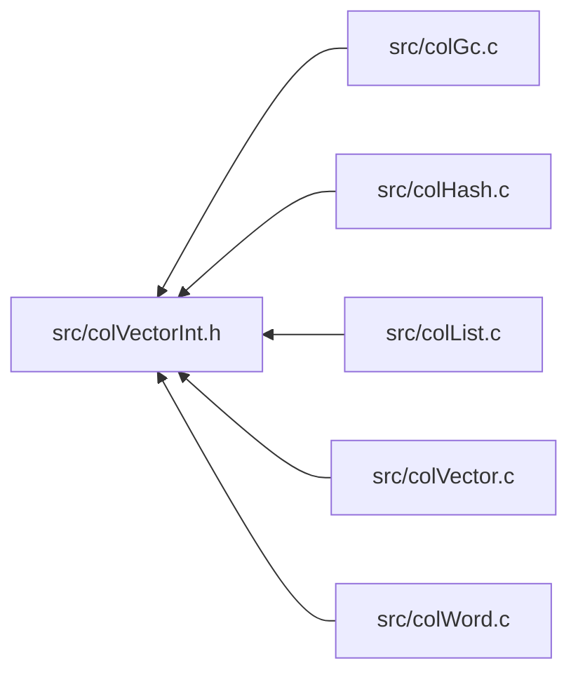
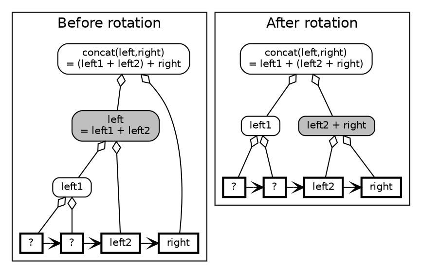
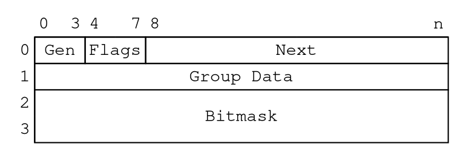

# Colibri: A fast and lightweight garbage-collected datatype library

Colibri is an abstract datatype/in-memory storage infrastructure for the C
language. It features:

- An extensible data type system dubbed "words"
- A fast and efficient cell-based allocator
- An exact (AKA accurate or precise), generational, copying, mark-and-sweep
  garbage collector for automatic memory management

Colibri is written in plain C and is free of any dependency besides system
libraries. The compiled binary DLL on Windows is about 85kB. The source code is
heavily commented using the [Doxygen] syntax.

## License

Colibri is released under the terms of the 3-Clause BSD License:

https://opensource.org/licenses/BSD-3-Clause

## History

I began working on Colibri around 2008 while thinking about the future of the
[Tcl] language. Tcl is a string-based language on the
outside, and although it uses more elaborate data types on the inside for
performance, its string implementation still relies on flat arrays of
characters. Colibri started as an experiment with ropes, a string data structure
based on self-balancing binary trees, along with automatic memory management
thanks to a garbage collector. Nowadays Colibri supports a wide variety of
primitive data types and structures for general purpose application development,
with emphasis on performance, frugality, and simplicity.

## What are colibris?

Colibris, known in English as hummingbirds, are a family of birds known for
their small size and high wing speed. The bee hummingbird (_Mellisuga helenae_),
found in Cuba, is the smallest of all birds, with a mass of 1.8g and a total
length of about 5cm. They are renown for their stationary and backward flight
abilities on par with flying insects, which allow them to feed on the nectar of
plants and flowers in-flight.

[![mellisuga_helenae]][mellisuga_helenae_link]

I've chosen this name for this project because its goal is to be fast and
lightweight, and also to follow the feather and bird theme shared with Tcl and
many related projects.

## Features

### Words

Words are a generic abstract datatype framework. Colibri supports the following
word types:

- Immutable primitives:

  - Nil: the nil singleton
  - Booleans: true or false singletons
  - Integer numbers
  - Floating point numbers
  - Unicode Characters

- Immutable Unicode strings:

  - Regular strings: flat arrays of characters using 1/2/4-byte fixed width or
    UTF-8/16 variable width encodings
  - [Ropes]: self-balancing binary trees of strings

- String buffers for efficient dynamic string building

- Linear collections:

  - Immutable vectors: fixed-length, flat arrays of words
  - Mutable words: flat arrays of words with a preallocated capacity
  - Immutable lists: self-balancing binary trees of vectors; lists can be cyclic
  - Mutable lists: modifiable lists with efficient copy-on-write semantics and
    conversion to immutable form; large mutable lists can be sparsely allocated
  - Custom lists: collections implemented with custom code

- Mutable associative arrays:

  - Hash maps: randomized associative arrays with integer, string or custom keys
  - Trie maps: self-sorting associative arrays with integer, string or custom
    keys
  - Custom maps: associative arrays implemented with custom code

- Custom word types: dynamic datatypes implemented with custom code, with all
  the benefits of automatic memory management

Strings, linear collections and associative arrays come with generic iterators.

### Word synonyms

In [duck-typed][duck-typing] languages like Tcl, the type of a value depends on
the way it is used, which can vary over time. For example, the literal `123` can
represent:

- the string "123"
- the integer 123, in its various binary forms (8, 16, 32 bits...)
- the floating point number 123.0
- some internal type (e.g. a bucket index in a hash map)
- etc.

High-level language implementations typically associate such values with an
internal structure that represent the underlying type at a given time. This
technique avoids repeated data conversions, a typically expensive operation, and
hence gives a performance boost when a value is used repeatedly (in a loop for
example). However, in some cases the type may alternate between two or more
internal representations; for example the above string may switch several times
between integer and float representations. In the Tcl world this phenomenon is
known as "shimmering". In such occurrences, the previous internal representation
is lost and will have to be computed again shall the value be used with the same
apparent type later on.

Shimmering happens when an external representation can only have one internal
representation. However, in Colibri any word can have an arbitrary number of
synonyms, other words that share common characteristics but use different
datatypes: they could for example convey the same semantics or simply have the
same external representation (a string, like in the above example). Words can
form circular chains of synonyms; circular structures are notoriously
troublesome when it comes to memory management, causing memory leaks or
excessive bookkeeping, but fortunately a garbage collector is an elegant way to
avoid this class of problems altogether.

### Cell-based pool allocator

Words are either immediate or allocated.

Most primitives are represented as immediate values whenever possible: the value
is stored directly in the pointer rather than in an allocated structure. In
effect, this means that collections of such words need no extra storage space
besides the collection itself.

Allocated words are stored in cells. Each cell is made of 4 machine words, i.e.
16 bytes on 32-bit architectures, and 32 bytes on 64-bits. Predefined datatypes
make the most use of single-cell storage to minimize overhead. Custom types can
store a minimum of 2 machine words with no upper limit.

Low-level memory allocation uses system pages, usually 4 kilobytes, themselves
divided into logical pages. The cell allocation algorithm is a simple pool
allocator over logical pages. The overhead is very small: only 2 bits per cell.

Allocation is performed on a per-thread basis for maximum performances and
minimum contention. Page-based pool allocation also improves locality of
reference and cache use.

### Garbage collector

Memory management relies on an exact (AKA accurate or precise), generational,
copying, mark-and-sweep, garbage collector.

#### Exact

Contrary to conservative garbage collectors such as the [Boehm GC][boehm-gc], an
exact garbage collector doesn't rely on heuristics to know when and where to
follow a pointer to reachable memory. This ensures that no memory will leak or
be freed accidentally.

Colibri words are designed with that goal in mind. All predefined word types are
automatically garbage-collected. Custom types can define a finalizer that is
called at deletion time for cleanup, and can declare nested structures as well.
That way, it is perfectly acceptable to mix words with regular malloc'ed memory
blocks, or to not use the predefined word typesystem at all and still get all
the benefits of the garbage collector.

#### Generational

Generational GC is a form of incremental GC where memory areas are gathered in
memory pools depending on their age. Colibri implements the following policy:

- Cell allocation is done in the 'eden' memory pool
- GC occurs on a memory pool when its size reaches a given threshold
- GC is performed in the generational order, from newer to older pools,
  following a logarithmic frequency: newer pools are collected more frequently
  than older pools
- Surviving cells are promoted to the next generation

This policy ensures that long-lived cells are collected less often as they get
promoted to older generations, whereas short-lived cells are less likely to
survive the next GC.

#### Copying

In the general case, memory promotion is done by moving whole pages from older
to newer memory pools. This minimizes CPU overhead but may lead to memory
fragmentation over time. So when fragmentation exceeds a certain threshold,
cells are instead moved to a new, compact page in the target pool. This improves
locality of reference and cache use over time.

#### Mark-and-sweep

Colibri uses a mark-and-sweep algorithm to mark reachable cells and eventually
sweep unreachable ones. The marking phase starts at root cells and follow all
references recursively; at the end of this phase, marked cells are promoted, and
unmarked cells are discarded.

Roots must be explicitly declared by the application using a simple API.

Mutations in older generations are detected automatically thanks to write
barriers. Modified cells from uncollected pool will be traversed during the
marking phase in case they refer to cells that belong to a collected pool.

#### Threading model

The GC process is fully controllable (pause/resume) so that applications don't
get interrupted unexpectedly. To allocate cells, the client code must pause the
GC first (enter a GC-protected section), and must resume the GC when done (leave
the GC-protected section).

Colibri supports several threading models:

- **Single**: Strict appartment, single-threaded model + stop-the-world GC.
  Allocated memory is thread-local. GC is performed synchronously in the calling
  thread when it resumes the GC.

- **Asynchronous**: Strict appartment, single-threaded model + asynchronous GC.
  Allocated memory is thread-local, but GC is performed in a separate thread so
  that the main thread can perform other tasks in the meantime (I/O, event
  handling...).

- **Shared**: Multithreaded model + asynchronous GC. Each thread has its own
  eden pool for better performance, however memory is shared by all threads of
  the group. GC is performed in a separate thread when no working thread is
  paused.

A thread can only belong to one thread group of the above models. However there
can be several distinct groups in the same process.

References cannot cross group boundaries; a word from one group cannot reference
a word from another group. Among the predefined word types, immutable words are
thread-safe, but mutable words are not, and thus cannot be used concurrently by
several threads of the same group without explicit synchronization. Custom words
can implement their own thread-safe data structures though.

## Portability

The code is fairly portable on 32-bit and 64-bit systems: all public and
internal types are based on portable C-99 types such as `intptr_t`.

The only parts that need platform-specific code are low-level page allocation,
memory protection and related exception/signal handling, and GC-related
synchronization. Colibri needs system calls that allocate boundary-aligned
pages, as well as synchronization primitives such as mutexes and condition
variables, and write barriers for change detection. At present both Windows and
Unix (Linux) versions are provided, the latter using `mmap`. Porting to other
systems should require minimal effort as long as they provide the necessary
features; the platform-specific code is limited to a handful of functions
gathered in dedicated source subtrees. Platform-specific peculiarities should
not impact the overall architecture. Indeed, Windows and Unix platforms are
different enough to be confident on this point.

A medium-term goal is to support the [WebAssembly] target. For now there remains
some roadblocks that prevent Colibri from being compiled to WASM using the usual
methods ([clang] or [Emscripten])

## Build & install

```graphdown
++ +-+ +------+  +--+---+    +------+    +------+
|| | | |      |  |      |----|      +----|      |
|| | | |      |  +      |----|      |----+      |
|| | | |      +  |      |----|      +----|      |
++ +-+ +------+  +----+-+    +------+    +------+
                                                    .>
                       1 1 1 1 1 1                 /         \
   0 1 2 3 4 5 6 7 8 9 0 1 2 3 4 5             -+-    .>  <.  '>  <'
  +-+-+-+-+-+-+-+-+-+-+-+-+-+-+-+-+    >   |  ^ ^ ^                 +     +
0 |0|P|   FLAGS   |  {          } | <- < ->+  | |    | |    ^ ^ ^   ^     ^
  +-+-+-----------+  { PAYLOAD  } +<---    |         v v v   \|/   /     /|\
1 |                  {          } |<- ->|    +< >+    -+-     v   v     v v v
  +-+-+-+-+-+-+-+-+-+-+-+-+-+-+-+-+           <->             +   +

    ^ ^ ^     ^   \  |  /   \|/     ^^^ |||  ^^^ ^^^ \\\   ///
   /  |  \   /|\   v v v     v      ||| vvv ///   \\\ vvv vvv


    + + +     +                     +++      +++ +++
    ^ ^ ^     ^   \  |  /   \|/     ^^^ |||  ^^^ ^^^ \\\   ///
   /  |  \   /|\   v v v     v      ||| vvv ///   \\\ vvv vvv
                   + + +     +          +++           +++ +++


dgfdgdfgfddsfdfg  a-> dgdfgfd <--- fdfg dg f  --> dfdsf -> dgfdgf
a-> b
a-->b
sdfdsg rd-> fg


  >+  >+<  +<  | |
               v v   v v
 ->+ ->+<- +<- + + + + + +
                 ^ ^   ^ ^
                 | |

                                                   |
o--o    *--o     /  /   *  o  o o o o   * * * *    *
o--*    *--*    v  v   ^  ^   | | | |   | | | |   ^^^
o-->    *-->   *  o   /  /    o * v '   o * v '  / | \
o---    *---
                              ^ ^ ^ ^   . . . .
|  |   *  o  \  \   *  o      | | | |   | | | |
v  v   ^  ^   v  v   ^  ^     o * v '   o * v '
*  o   |  |    *  o   \  \

 o o o o   * * * *      o o o o   * * * *
  \ \ \ \   \ \ \ \    / / / /   / / / /
   o * v \   o * v \  o * v /   o * v /

 ^ ^ ^ ^   \ \ \ \      ^ ^ ^ ^   / / / /
  \ \ \ \   \ \ \ \    / / / /   / / / /
   o * v \   o * v \  o * v /   o * v /


<--o   <--*   <-->   <---   ---o   ---*

--->   ----   *<--   o<--   -->o   -->*

```







```graphdown
           0     3 4     7 8                                             n
          +-------+-------+-----------------------------------------------+
        0 |  Gen  | Flags |                     Next                      |
          +-------+-------+-----------------------------------------------+
        1 |                           Group Data                          |
          +---------------------------------------------------------------+
        2 |                                                               |
          +                            Bitmask                            +
        3 |                                                               |
          +---------------------------------------------------------------+

           0                                                             n
          +---------------------------------------------------------------+
        0 |                           Type info                           |
          +---------------------------------------------------------------+
        1 |                            Synonym                            |
          +---------------------------------------------------------------+
        2 |                             Size                              |
          +---------------------------------------------------------------+
        3 |                            Buckets                            |
          +---------------------------------------------------------------+
          :                                                               :
          :                        Static buckets                         :
        N |                                                               |
          +---------------------------------------------------------------+
```

```graphdown
    Before rotation:
            .--------------------------------.
           ({concat = (left1 + left2) + right})
            '-+----+-------------------------'
             /      \
          .-+--.   +-+---+
         | left |  |right|
          '+--+'   +-----+
          /    \
      +--+--+ +-+---+
      |left1| |left2|
      ++---++ +-----+
      /     \
     ?       ?


    After rotation:
           .--------------------------------.
          ({concat = left1 + (left2 + right)})
           '-+----+-------------------------'
            /      \
      +----++      .+-----.
      |left1|     ( concat )
      +-----+      '+----+'
      /     \      /      \
     ?       ?  +-+---+ +--+--+
                |left2| |right|
                +-----+ +-----+
```

The build process depends on [CMake]. You also have to install a toolchain for
your platform if needed.

### Windows

The easiest and recommended way to build Colibri on Windows is to install the
Microsoft Visual Studio build tools. You can either download and install them
manually, or use the package manager [Chocolatey]:

```bat
choco install visualstudio2017buildtools
```

CMake will then find and select the toolchain automatically.

Note that you can install CMake with Chocolatey as well:

```bat
choco install cmake
```

To build the release version of Colibri, first go to the source directory and
generate the build system:

```bat
cmake -S . -B build
```

You can then launch the build process:

```bat
cmake --build build --config release
```

This should build the binaries in the `build\Release` directory.

### Unix

To build Colibri on Unix systems with the default toolchain, go to the source
directory and generate the build system:

```sh
cmake -S . -B build
```

You can then launch the build process:

```sh
cmake --build build --config release
```

This should build the binaries in the `build` directory.

## Tests

Colibri requires [PicoTest] for testing. The test suite is enabled when CMake
detects the PicoTest package. The simplest way to do so is to give CMake the
path to PicoTest when generating the build system, like so:

```sh
cmake -S . -B build -DCMAKE_MODULE_PATH=</path/to/picotest>
```

To run the test suite, simply run `ctest` from within the `build` directory.

## Documentation

The complete documentation is available here:

https://fredericbonnet.github.io/colibri

The documentation site was built using these great tools:

- [Doxygen] extracts the documentation from the source code as both HTML and XML
  formats
- [seaborg] converts the XML files to Markdown (full disclosure: I'm the author
  of this tool!)
- [docsify] generates the documentation site from the Markdown files

To rebuild the documentation you'll need the following tools:

- [Doxygen] to process the provided `Doxyfile` and parse the source code
- [Node.js] to run the build scripts:

```sh
npm run docs
```

If you want to serve the documentation locally you can use the provided script:

```sh
npm run docsify
```

[docs]: https://fredericbonnet.github.io/colibri
[htmldocs]: https://fredericbonnet.github.io/colibri/public/html/index.html
[doxygen]: http://www.stack.nl/~dimitri/doxygen/
[seaborg]: https://github.com/fredericbonnet/seaborg
[docsify]: https://docsify.js.org/
[node.js]: https://nodejs.org/
[picotest]: https://github.com/fredericbonnet/picotest
[chocolatey]: https://chocolatey.org
[cmake]: https://cmake.org
[webassembly]: https://webassembly.org
[clang]: https://clang.llvm.org
[emscripten]: https://emscripten.org/
[tcl]: https://www.tcl-lang.org
[boehm-gc]: https://en.wikipedia.org/wiki/Boehm_garbage_collector
[ropes]: https://en.wikipedia.org/wiki/Rope_(data_structure)
[duck-typing]: https://en.wikipedia.org/wiki/Duck_typing
[mellisuga_helenae_link]: https://commons.wikimedia.org/wiki/File:Bee_hummingbird_(Mellisuga_helenae)_adult_male_in_flight.jpg ":target=_blank"
[mellisuga_helenae]: https://upload.wikimedia.org/wikipedia/commons/thumb/c/ca/Bee_hummingbird_%28Mellisuga_helenae%29_adult_male_in_flight.jpg/1024px-Bee_hummingbird_%28Mellisuga_helenae%29_adult_male_in_flight.jpg "Bee hummingbird (Melisuga helenae) adult male, Cuba"
