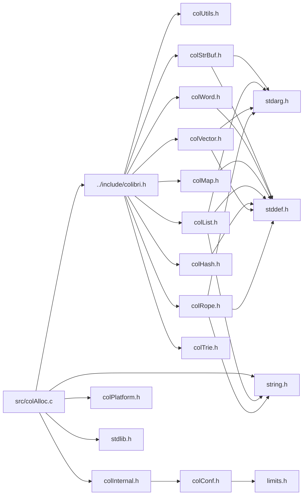

<a id="col_alloc_8c"></a>
# File colAlloc.c

![][C++]

**Location**: `src/colAlloc.c`

This file implements the memory allocation features of Colibri.


## Classes

* [AddressRange](struct_address_range.md#struct_address_range)

## Includes

* [../include/colibri.h](colibri_8h.md#colibri_8h)
* [colInternal.h](col_internal_8h.md#col_internal_8h)
* [colPlatform.h](col_platform_8h.md#col_platform_8h)
* <stdlib.h>
* <string.h>



## Bit Handling

<a id="group__alloc_1gaee6b78438aa7f935582f7eefb28e63bf"></a>
### Variable firstZeroBitSequence

![][private]
![][static]

**Definition**: `src/colAlloc.c` (line 84)

```cpp
const char firstZeroBitSequence[7][256][7][256]
```

Position of the first zero-bit sequence of a given length in byte.

First index is length of zero-bit sequence to look for, minus 1. Second index is value of byte in which to search. Result is index of the first bit in matching zero-bit sequence, or -1 if none.


**Type**: const char

**Referenced by**:

* [FindFreeCells](col_alloc_8c.md#group__alloc_1ga36d583de9ab3c9da67c3da5bef92d135)

<a id="group__alloc_1gab2440050425db6a793ac535b9c4ef432"></a>
### Variable longestLeadingZeroBitSequence

![][private]
![][static]

**Definition**: `src/colAlloc.c` (line 218)

```cpp
const char longestLeadingZeroBitSequence[256][256] = {
    8, 7, 6, 6, 5, 5, 5, 5, 4, 4, 4, 4, 4, 4, 4, 4,
    3, 3, 3, 3, 3, 3, 3, 3, 3, 3, 3, 3, 3, 3, 3, 3,
    2, 2, 2, 2, 2, 2, 2, 2, 2, 2, 2, 2, 2, 2, 2, 2,
    2, 2, 2, 2, 2, 2, 2, 2, 2, 2, 2, 2, 2, 2, 2, 2,
    1, 1, 1, 1, 1, 1, 1, 1, 1, 1, 1, 1, 1, 1, 1, 1,
    1, 1, 1, 1, 1, 1, 1, 1, 1, 1, 1, 1, 1, 1, 1, 1,
    1, 1, 1, 1, 1, 1, 1, 1, 1, 1, 1, 1, 1, 1, 1, 1,
    1, 1, 1, 1, 1, 1, 1, 1, 1, 1, 1, 1, 1, 1, 1, 1,
    0, 0, 0, 0, 0, 0, 0, 0, 0, 0, 0, 0, 0, 0, 0, 0,
    0, 0, 0, 0, 0, 0, 0, 0, 0, 0, 0, 0, 0, 0, 0, 0,
    0, 0, 0, 0, 0, 0, 0, 0, 0, 0, 0, 0, 0, 0, 0, 0,
    0, 0, 0, 0, 0, 0, 0, 0, 0, 0, 0, 0, 0, 0, 0, 0,
    0, 0, 0, 0, 0, 0, 0, 0, 0, 0, 0, 0, 0, 0, 0, 0,
    0, 0, 0, 0, 0, 0, 0, 0, 0, 0, 0, 0, 0, 0, 0, 0,
    0, 0, 0, 0, 0, 0, 0, 0, 0, 0, 0, 0, 0, 0, 0, 0,
    0, 0, 0, 0, 0, 0, 0, 0, 0, 0, 0, 0, 0, 0, 0, 0
}
```

Longest leading zero-bit sequence in byte.

Index is value of byte. Result is number of consecutive cleared bytes starting at MSB.


**Type**: const char

**Referenced by**:

* [FindFreeCells](col_alloc_8c.md#group__alloc_1ga36d583de9ab3c9da67c3da5bef92d135)

<a id="group__alloc_1ga8c45e7d296e78baadc741c63954c38cc"></a>
### Variable nbBitsSet

![][private]
![][static]

**Definition**: `src/colAlloc.c` (line 241)

```cpp
const char nbBitsSet[256][256] = {
    0, 1, 1, 2, 1, 2, 2, 3, 1, 2, 2, 3, 2, 3, 3, 4,
    1, 2, 2, 3, 2, 3, 3, 4, 2, 3, 3, 4, 3, 4, 4, 5,
    1, 2, 2, 3, 2, 3, 3, 4, 2, 3, 3, 4, 3, 4, 4, 5,
    2, 3, 3, 4, 3, 4, 4, 5, 3, 4, 4, 5, 4, 5, 5, 6,
    1, 2, 2, 3, 2, 3, 3, 4, 2, 3, 3, 4, 3, 4, 4, 5,
    2, 3, 3, 4, 3, 4, 4, 5, 3, 4, 4, 5, 4, 5, 5, 6,
    2, 3, 3, 4, 3, 4, 4, 5, 3, 4, 4, 5, 4, 5, 5, 6,
    3, 4, 4, 5, 4, 5, 5, 6, 4, 5, 5, 6, 5, 6, 6, 7,
    1, 2, 2, 3, 2, 3, 3, 4, 2, 3, 3, 4, 3, 4, 4, 5,
    2, 3, 3, 4, 3, 4, 4, 5, 3, 4, 4, 5, 4, 5, 5, 6,
    2, 3, 3, 4, 3, 4, 4, 5, 3, 4, 4, 5, 4, 5, 5, 6,
    3, 4, 4, 5, 4, 5, 5, 6, 4, 5, 5, 6, 5, 6, 6, 7,
    2, 3, 3, 4, 3, 4, 4, 5, 3, 4, 4, 5, 4, 5, 5, 6,
    3, 4, 4, 5, 4, 5, 5, 6, 4, 5, 5, 6, 5, 6, 6, 7,
    3, 4, 4, 5, 4, 5, 5, 6, 4, 5, 5, 6, 5, 6, 6, 7,
    4, 5, 5, 6, 5, 6, 6, 7, 5, 6, 6, 7, 6, 7, 7, 8
}
```

Number of bits set in byte.

Index is value of byte. Result is number of set bits.


**Type**: const char

**Referenced by**:

* [NbSetCells](col_alloc_8c.md#group__alloc_1ga356ad642b33dca80bcf2865b1f93c039)

## Address Reservation And Allocation

Granularity-free system page allocation based on address range reservation.


Some systems allow single system page allocations (e.g. POSIX mmap), while others require coarser grained schemes (e.g. Windows VirtualAlloc). However in both cases we have to keep track of allocated pages, especially for generational page write monitoring. So address ranges are reserved, and individual pages can be allocated and freed within these ranges. From a higher level this allows for per-page allocation, while at the same time providing enough metadata for memory introspection.


When the number of pages to allocate exceeds a certain size (defined as [LARGE\_PAGE\_SIZE](col_conf_8h.md#group__alloc_1ga5e794872b12686cc064052cdf6b38f9f)), a dedicated address range is reserved and allocated, which must be freed all at once. Else, pages are allocated within larger address ranges using the following scheme:


Address ranges are reserved in geometrically increasing sizes up to a maximum size (the first being a multiple of the allocation granularity). Ranges form a singly-linked list in allocation order (so that search times are geometrically increasing too). A descriptor structure is malloc'd along with the range and consists of a pointer to the next descriptor, the base address of the range, the total and free numbers of pages and the index of the first free page in range, and a page alloc info table indicating:


* For free pages, zero.

* For first page in group, the negated size of the group.

* For remaining pages, the index in group.


That way, page group info can be known via direct access from the page index in range:


* When alloc info is zero, the page is free.

* When negative, the page is the first in a group of the given negated size.

* When positive, the page is the n-th in a group whose first page is the n-th previous one.


To allocate a group of pages in an address range, the alloc info table is scanned until a large enough group of free pages is found.


To free a group of pages, the containing address range is found by scanning all ranges in order (this is fast, as this only involves address comparison and the ranges grow geometrically). In either cases the descriptor is updated accordingly. If a containing range is not found we assume that it was a dedicated range and we attempt to release it at once.


Just following this alloc info table is a bitmask table used for write tracking. With our generational GC, pages of older generations are write-protected so that references pointing to younger cells can be tracked during the mark phase: such modified pages contain potential parent cells that must be followed along with roots. Regular ranges use a bitmask array, while dedicated ranges only have to store one value for the whole range.


This allocation scheme may not look optimal at first sight (especially the alloc info table scanning step), but keep in mind that the typical use case only involves single page allocations. Multiple page allocations only occur when allocating large, multiple cell-based structures, and most structures are single cell sized. And very large pages will end up in their own dedicated range with no group management. Moreover stress tests have shown that this scheme yielded similar or better performances than the previous schemes.

<a id="group__alloc_1gaf947156938f941bb8251459e8bfc1021"></a>
### Macro FIRST\_RANGE\_SIZE

![][public]

```cpp
#define FIRST_RANGE_SIZE 256     /* 1 MB */
```

Size of first reserved range.


<a id="group__alloc_1gab4949f1d9f3dae07dd371a5b01f46c26"></a>
### Macro MAX\_RANGE\_SIZE

![][public]

```cpp
#define MAX_RANGE_SIZE 32768   /* 128 MB */
```

Maximum size of ranges.


<a id="group__alloc_1ga9ac4c516a0888195d1f2ca4721f633f8"></a>
### Variable ranges

![][private]
![][static]

**Definition**: `src/colAlloc.c` (line 411)

```cpp
AddressRange* ranges = NULL
```

Reserved address ranges for general purpose.

**See also**: [SysPageAlloc](col_alloc_8c.md#group__alloc_1ga9318fd94abe19ee6d962cacb9d08830f), [SysPageFree](col_alloc_8c.md#group__alloc_1gae87fa6ec29c10f180f511dfd1213fe5f)


**Type**: [AddressRange](struct_address_range.md#struct_address_range) *

**Referenced by**:

* [SysPageAlloc](col_alloc_8c.md#group__alloc_1ga9318fd94abe19ee6d962cacb9d08830f)
* [SysPageFree](col_alloc_8c.md#group__alloc_1gae87fa6ec29c10f180f511dfd1213fe5f)
* [SysPageProtect](col_alloc_8c.md#group__alloc_1ga35a37fb9d22a879405b65f3e90d09358)
* [SysPageTrim](col_alloc_8c.md#group__alloc_1ga16a9361484b90e5202862b29a03cb958)
* [UpdateParents](col_alloc_8c.md#group__gc__parents_1gaa3d85dc993fb1b9831f82c25b8c07d3c)

<a id="group__alloc_1ga09e3f1c0494d23d9f93481ed4f228a4c"></a>
### Variable dedicatedRanges

![][private]
![][static]

**Definition**: `src/colAlloc.c` (line 419)

```cpp
AddressRange* dedicatedRanges = NULL
```

Dedicated address ranges for large pages.

**See also**: [SysPageAlloc](col_alloc_8c.md#group__alloc_1ga9318fd94abe19ee6d962cacb9d08830f), [SysPageFree](col_alloc_8c.md#group__alloc_1gae87fa6ec29c10f180f511dfd1213fe5f)


**Type**: [AddressRange](struct_address_range.md#struct_address_range) *

**Referenced by**:

* [SysPageAlloc](col_alloc_8c.md#group__alloc_1ga9318fd94abe19ee6d962cacb9d08830f)
* [SysPageFree](col_alloc_8c.md#group__alloc_1gae87fa6ec29c10f180f511dfd1213fe5f)
* [SysPageProtect](col_alloc_8c.md#group__alloc_1ga35a37fb9d22a879405b65f3e90d09358)
* [UpdateParents](col_alloc_8c.md#group__gc__parents_1gaa3d85dc993fb1b9831f82c25b8c07d3c)

<a id="group__alloc_1ga36b4e5e8a0a88ada5fa956cadbe83460"></a>
### Function FindFreePagesInRange

![][private]
![][static]

```cpp
static size_t FindFreePagesInRange(AddressRange *range, size_t number, size_t index)
```

Find given number of free consecutive pages in alloc info table.

**Return values**:

* **index**: of first page of sequence if found.
* **-1**: otherwise.


**Parameters**:

* [AddressRange](struct_address_range.md#struct_address_range) * **range**: Address range to look into.
* size_t **number**: Number of free consecutive entries to find.
* size_t **index**: First entry to consider.

**Return type**: size_t

**References**:

* [AddressRange::allocInfo](struct_address_range.md#struct_address_range_1ae789f37dab3d981ccf15a020993bfd2e)
* [AddressRange::first](struct_address_range.md#struct_address_range_1aa8ee3a687b3f1fc91257feb0bd8704cf)
* [AddressRange::size](struct_address_range.md#struct_address_range_1a80783f530919686945d93eb7b1e25623)

**Referenced by**:

* [SysPageAlloc](col_alloc_8c.md#group__alloc_1ga9318fd94abe19ee6d962cacb9d08830f)

<a id="group__alloc_1ga9318fd94abe19ee6d962cacb9d08830f"></a>
### Function SysPageAlloc

![][private]
![][static]

```cpp
static void* SysPageAlloc(size_t number, int written)
```

Allocate system pages.

**Returns**:

The allocated system pages' base address.


**Side Effect**:

May reserve new address ranges.


**See also**: [SysPageFree](col_alloc_8c.md#group__alloc_1gae87fa6ec29c10f180f511dfd1213fe5f)

**Exceptions**:

* **[COL\_ERROR\_MEMORY](colibri_8h.md#group__error_1gga729084542ed9eae62009a84d3379ef35aaf4bfe66f629e9292b3de0089a891de3)**: [[F]](colibri_8h.md#group__error_1gga6dab009a0b8c4b4fa080cb9ba1859e9ea47572f7e362007f7b266dbe79e778b27) Memory error. (_Address range allocation failed_)
* **[COL\_ERROR\_MEMORY](colibri_8h.md#group__error_1gga729084542ed9eae62009a84d3379ef35aaf4bfe66f629e9292b3de0089a891de3)**: [[F]](colibri_8h.md#group__error_1gga6dab009a0b8c4b4fa080cb9ba1859e9ea47572f7e362007f7b266dbe79e778b27) Memory error. (_Address range reservation failed_)
* **[COL\_ERROR\_MEMORY](colibri_8h.md#group__error_1gga729084542ed9eae62009a84d3379ef35aaf4bfe66f629e9292b3de0089a891de3)**: [[F]](colibri_8h.md#group__error_1gga6dab009a0b8c4b4fa080cb9ba1859e9ea47572f7e362007f7b266dbe79e778b27) Memory error. (_Page allocation failed_)

**Parameters**:

* size_t **number**: Number of system pages to alloc.
* int **written**: Initial write tracking flag value.

**Return type**: void *

**References**:

* [allocGranularity](col_alloc_8c.md#group__arch_1ga9fdf03be3e1742b0fbc71f3445d83c48)
* [AddressRange::allocInfo](struct_address_range.md#struct_address_range_1ae789f37dab3d981ccf15a020993bfd2e)
* [ASSERT](col_internal_8h.md#group__error_1gac22830a985e1daed0c9eadba8c6f606e)
* [AddressRange::base](struct_address_range.md#struct_address_range_1a08fc12a83b7988aa0cb8fb45c1736076)
* [Col\_Error](colibri_8h.md#group__error_1ga9a9a9c96b23c489cf8a19a6248fc77b8)
* [COL\_ERROR\_MEMORY](colibri_8h.md#group__error_1gga729084542ed9eae62009a84d3379ef35aaf4bfe66f629e9292b3de0089a891de3)
* [COL\_FATAL](colibri_8h.md#group__error_1gga6dab009a0b8c4b4fa080cb9ba1859e9ea47572f7e362007f7b266dbe79e778b27)
* [ColibriDomain](colibri_8c.md#group__error_1gadf9c5202f89dd2ecc2aeee560f04ee4d)
* [dedicatedRanges](col_alloc_8c.md#group__alloc_1ga09e3f1c0494d23d9f93481ed4f228a4c)
* [FindFreePagesInRange](col_alloc_8c.md#group__alloc_1ga36b4e5e8a0a88ada5fa956cadbe83460)
* [AddressRange::first](struct_address_range.md#struct_address_range_1aa8ee3a687b3f1fc91257feb0bd8704cf)
* [FIRST\_RANGE\_SIZE](col_alloc_8c.md#group__alloc_1gaf947156938f941bb8251459e8bfc1021)
* [AddressRange::free](struct_address_range.md#struct_address_range_1ac7a3b5515ce98c3274f41566e880647e)
* [LARGE\_PAGE\_SIZE](col_conf_8h.md#group__alloc_1ga5e794872b12686cc064052cdf6b38f9f)
* [MAX\_RANGE\_SIZE](col_alloc_8c.md#group__alloc_1gab4949f1d9f3dae07dd371a5b01f46c26)
* [AddressRange::next](struct_address_range.md#struct_address_range_1a29b3c1f7a257bab2afa0a4ee5c63e60d)
* [PlatAllocPages](col_platform_8h.md#group__arch_1gab258be1bc40313f7c0a4c8bcab840243)
* [PlatEnterProtectAddressRanges](col_unix_platform_8h.md#group__arch__unix_1ga0d52de05fb3a0897f54579ab12519159)
* [PlatLeaveProtectAddressRanges](col_unix_platform_8h.md#group__arch__unix_1gab6be4d622dd8c6bc4c283a1039962e5a)
* [PlatReserveRange](col_platform_8h.md#group__arch_1ga7d63e9c0de11a4c0954aab0efbc09c09)
* [ranges](col_alloc_8c.md#group__alloc_1ga9ac4c516a0888195d1f2ca4721f633f8)
* [shiftPage](col_alloc_8c.md#group__arch_1gacfb643d4c365f92c1ea93d0f1b1b71e5)
* [AddressRange::size](struct_address_range.md#struct_address_range_1a80783f530919686945d93eb7b1e25623)

**Referenced by**:

* [PoolAllocPages](col_alloc_8c.md#group__alloc_1ga45316be86459e993b67bf27efbb8bf5f)

<a id="group__alloc_1gae87fa6ec29c10f180f511dfd1213fe5f"></a>
### Function SysPageFree

![][private]
![][static]

```cpp
static void SysPageFree(void *base)
```

Free system pages.

**Side Effect**:

May release address ranges.


**See also**: [SysPageAlloc](col_alloc_8c.md#group__alloc_1ga9318fd94abe19ee6d962cacb9d08830f)

**Exceptions**:

* **[COL\_ERROR\_MEMORY](colibri_8h.md#group__error_1gga729084542ed9eae62009a84d3379ef35aaf4bfe66f629e9292b3de0089a891de3)**: [[F]](colibri_8h.md#group__error_1gga6dab009a0b8c4b4fa080cb9ba1859e9ea47572f7e362007f7b266dbe79e778b27) Memory error. (_Page not found_)
* **[COL\_ERROR\_MEMORY](colibri_8h.md#group__error_1gga729084542ed9eae62009a84d3379ef35aaf4bfe66f629e9292b3de0089a891de3)**: [[F]](colibri_8h.md#group__error_1gga6dab009a0b8c4b4fa080cb9ba1859e9ea47572f7e362007f7b266dbe79e778b27) Memory error. (_Address range release failed_)
* **[COL\_ERROR\_MEMORY](colibri_8h.md#group__error_1gga729084542ed9eae62009a84d3379ef35aaf4bfe66f629e9292b3de0089a891de3)**: [[F]](colibri_8h.md#group__error_1gga6dab009a0b8c4b4fa080cb9ba1859e9ea47572f7e362007f7b266dbe79e778b27) Memory error. (_Page deallocation failed_)

**Parameters**:

* void * **base**: Base address of the pages to free.

**Return type**: void

**References**:

* [AddressRange::allocInfo](struct_address_range.md#struct_address_range_1ae789f37dab3d981ccf15a020993bfd2e)
* [ASSERT](col_internal_8h.md#group__error_1gac22830a985e1daed0c9eadba8c6f606e)
* [AddressRange::base](struct_address_range.md#struct_address_range_1a08fc12a83b7988aa0cb8fb45c1736076)
* [Col\_Error](colibri_8h.md#group__error_1ga9a9a9c96b23c489cf8a19a6248fc77b8)
* [COL\_ERROR\_MEMORY](colibri_8h.md#group__error_1gga729084542ed9eae62009a84d3379ef35aaf4bfe66f629e9292b3de0089a891de3)
* [COL\_FATAL](colibri_8h.md#group__error_1gga6dab009a0b8c4b4fa080cb9ba1859e9ea47572f7e362007f7b266dbe79e778b27)
* [ColibriDomain](colibri_8c.md#group__error_1gadf9c5202f89dd2ecc2aeee560f04ee4d)
* [dedicatedRanges](col_alloc_8c.md#group__alloc_1ga09e3f1c0494d23d9f93481ed4f228a4c)
* [AddressRange::first](struct_address_range.md#struct_address_range_1aa8ee3a687b3f1fc91257feb0bd8704cf)
* [AddressRange::free](struct_address_range.md#struct_address_range_1ac7a3b5515ce98c3274f41566e880647e)
* [AddressRange::next](struct_address_range.md#struct_address_range_1a29b3c1f7a257bab2afa0a4ee5c63e60d)
* [PlatEnterProtectAddressRanges](col_unix_platform_8h.md#group__arch__unix_1ga0d52de05fb3a0897f54579ab12519159)
* [PlatFreePages](col_platform_8h.md#group__arch_1ga3af1cd9d798457114f4bf563c10f9875)
* [PlatLeaveProtectAddressRanges](col_unix_platform_8h.md#group__arch__unix_1gab6be4d622dd8c6bc4c283a1039962e5a)
* [PlatReleaseRange](col_platform_8h.md#group__arch_1ga7ca830366dd1fb4e114a2f912ef5ed6c)
* [ranges](col_alloc_8c.md#group__alloc_1ga9ac4c516a0888195d1f2ca4721f633f8)
* [shiftPage](col_alloc_8c.md#group__arch_1gacfb643d4c365f92c1ea93d0f1b1b71e5)
* [AddressRange::size](struct_address_range.md#struct_address_range_1a80783f530919686945d93eb7b1e25623)

**Referenced by**:

* [PoolCleanup](col_alloc_8c.md#group__alloc_1ga3ce5b284fd4b0c1f9efa518150268b81)
* [PoolFreeEmptyPages](col_alloc_8c.md#group__alloc_1ga0c80585c5110f75f1bf723c9b93df073)

<a id="group__alloc_1ga16a9361484b90e5202862b29a03cb958"></a>
### Function SysPageTrim

![][private]
![][static]

```cpp
static void SysPageTrim(void *base)
```

Free trailing pages of system page groups, keeping only the first page.

**See also**: [SysPageFree](col_alloc_8c.md#group__alloc_1gae87fa6ec29c10f180f511dfd1213fe5f)

**Exceptions**:

* **[COL\_ERROR\_MEMORY](colibri_8h.md#group__error_1gga729084542ed9eae62009a84d3379ef35aaf4bfe66f629e9292b3de0089a891de3)**: [[F]](colibri_8h.md#group__error_1gga6dab009a0b8c4b4fa080cb9ba1859e9ea47572f7e362007f7b266dbe79e778b27) Memory error. (_Page not found_)
* **[COL\_ERROR\_MEMORY](colibri_8h.md#group__error_1gga729084542ed9eae62009a84d3379ef35aaf4bfe66f629e9292b3de0089a891de3)**: [[F]](colibri_8h.md#group__error_1gga6dab009a0b8c4b4fa080cb9ba1859e9ea47572f7e362007f7b266dbe79e778b27) Memory error. (_Page deallocation failed_)

**Parameters**:

* void * **base**: Base address of the pages to free.

**Return type**: void

**References**:

* [AddressRange::allocInfo](struct_address_range.md#struct_address_range_1ae789f37dab3d981ccf15a020993bfd2e)
* [ASSERT](col_internal_8h.md#group__error_1gac22830a985e1daed0c9eadba8c6f606e)
* [AddressRange::base](struct_address_range.md#struct_address_range_1a08fc12a83b7988aa0cb8fb45c1736076)
* [Col\_Error](colibri_8h.md#group__error_1ga9a9a9c96b23c489cf8a19a6248fc77b8)
* [COL\_ERROR\_MEMORY](colibri_8h.md#group__error_1gga729084542ed9eae62009a84d3379ef35aaf4bfe66f629e9292b3de0089a891de3)
* [COL\_FATAL](colibri_8h.md#group__error_1gga6dab009a0b8c4b4fa080cb9ba1859e9ea47572f7e362007f7b266dbe79e778b27)
* [ColibriDomain](colibri_8c.md#group__error_1gadf9c5202f89dd2ecc2aeee560f04ee4d)
* [AddressRange::first](struct_address_range.md#struct_address_range_1aa8ee3a687b3f1fc91257feb0bd8704cf)
* [AddressRange::free](struct_address_range.md#struct_address_range_1ac7a3b5515ce98c3274f41566e880647e)
* [AddressRange::next](struct_address_range.md#struct_address_range_1a29b3c1f7a257bab2afa0a4ee5c63e60d)
* [PlatEnterProtectAddressRanges](col_unix_platform_8h.md#group__arch__unix_1ga0d52de05fb3a0897f54579ab12519159)
* [PlatFreePages](col_platform_8h.md#group__arch_1ga3af1cd9d798457114f4bf563c10f9875)
* [PlatLeaveProtectAddressRanges](col_unix_platform_8h.md#group__arch__unix_1gab6be4d622dd8c6bc4c283a1039962e5a)
* [ranges](col_alloc_8c.md#group__alloc_1ga9ac4c516a0888195d1f2ca4721f633f8)
* [shiftPage](col_alloc_8c.md#group__arch_1gacfb643d4c365f92c1ea93d0f1b1b71e5)
* [AddressRange::size](struct_address_range.md#struct_address_range_1a80783f530919686945d93eb7b1e25623)
* [systemPageSize](col_alloc_8c.md#group__arch_1gacfca316efccddeee528c309c490c3f90)

**Referenced by**:

* [PoolFreeEmptyPages](col_alloc_8c.md#group__alloc_1ga0c80585c5110f75f1bf723c9b93df073)

## Memory Pools

<a id="group__alloc_1gab08d29a35a3b57dff2e79468a569ad81"></a>
### Function PoolInit

![][private]

```cpp
void PoolInit(MemoryPool *pool, unsigned int generation)
```

Initialize memory pool.


**Parameters**:

* [MemoryPool](struct_memory_pool.md#struct_memory_pool) * **pool**: Pool to initialize.
* unsigned int **generation**: Generation number; 0 = youngest.

**Return type**: void

**References**:

* [MemoryPool::generation](struct_memory_pool.md#struct_memory_pool_1a0d3c5d41525ad009c79ca65f07799ce6)

**Referenced by**:

* [GcInitGroup](col_gc_8c.md#group__gc_1ga4183a56fec06c1ff8176f90c31248d68)
* [GcInitThread](col_gc_8c.md#group__gc_1gad46e288d322683c434e6efa30e3edc22)

<a id="group__alloc_1ga3ce5b284fd4b0c1f9efa518150268b81"></a>
### Function PoolCleanup

![][private]

```cpp
void PoolCleanup(MemoryPool *pool)
```

Cleanup memory pool.

**See also**: [SysPageFree](col_alloc_8c.md#group__alloc_1gae87fa6ec29c10f180f511dfd1213fe5f)


**Parameters**:

* [MemoryPool](struct_memory_pool.md#struct_memory_pool) * **pool**: Pool to cleanup.

**Return type**: void

**References**:

* [ASSERT](col_internal_8h.md#group__error_1gac22830a985e1daed0c9eadba8c6f606e)
* [AddressRange::base](struct_address_range.md#struct_address_range_1a08fc12a83b7988aa0cb8fb45c1736076)
* [CleanupSweepables](col_gc_8c.md#group__gc_1ga6a8b4c25c3dbf786bfe56975efba86e0)
* [AddressRange::next](struct_address_range.md#struct_address_range_1a29b3c1f7a257bab2afa0a4ee5c63e60d)
* [PAGE\_FLAG](col_internal_8h.md#group__pages__cells_1ga3ccf282a118bd7b9101e38f4228e8853)
* [PAGE\_FLAG\_FIRST](col_internal_8h.md#group__pages__cells_1gace2cf8cd83ae1a8cc646bbd367cd5a86)
* [PAGE\_FLAG\_LAST](col_internal_8h.md#group__pages__cells_1ga011eeac135e2e667ae1356b0abf9c727)
* [PAGE\_NEXT](col_internal_8h.md#group__pages__cells_1ga0ed08f16e66e86cbed58b86203c7fd38)
* [MemoryPool::pages](struct_memory_pool.md#struct_memory_pool_1afca03b46fe1276b29fdd398ff07dfc41)
* [SysPageFree](col_alloc_8c.md#group__alloc_1gae87fa6ec29c10f180f511dfd1213fe5f)

**Referenced by**:

* [GcCleanupGroup](col_gc_8c.md#group__gc_1ga8e6fd33d04cb870d9d4b64eb34ab2ebc)
* [GcCleanupThread](col_gc_8c.md#group__gc_1gacbea8d94b2fdf7366fbe4ad8b8298a91)

## System Page Allocation

<a id="group__alloc_1ga35a37fb9d22a879405b65f3e90d09358"></a>
### Function SysPageProtect

![][private]

```cpp
void SysPageProtect(void *page, int protect)
```

Write-protect system page group.


**Exceptions**:

* **[COL\_ERROR\_MEMORY](colibri_8h.md#group__error_1gga729084542ed9eae62009a84d3379ef35aaf4bfe66f629e9292b3de0089a891de3)**: [[F]](colibri_8h.md#group__error_1gga6dab009a0b8c4b4fa080cb9ba1859e9ea47572f7e362007f7b266dbe79e778b27) Memory error. (_Page not found_)

**Parameters**:

* void * **page**: Page belonging to page group to protect.
* int **protect**: Whether to protect or unprotect page group.

**Return type**: void

**References**:

* [AddressRange::allocInfo](struct_address_range.md#struct_address_range_1ae789f37dab3d981ccf15a020993bfd2e)
* [ASSERT](col_internal_8h.md#group__error_1gac22830a985e1daed0c9eadba8c6f606e)
* [AddressRange::base](struct_address_range.md#struct_address_range_1a08fc12a83b7988aa0cb8fb45c1736076)
* [Col\_Error](colibri_8h.md#group__error_1ga9a9a9c96b23c489cf8a19a6248fc77b8)
* [COL\_ERROR\_MEMORY](colibri_8h.md#group__error_1gga729084542ed9eae62009a84d3379ef35aaf4bfe66f629e9292b3de0089a891de3)
* [COL\_FATAL](colibri_8h.md#group__error_1gga6dab009a0b8c4b4fa080cb9ba1859e9ea47572f7e362007f7b266dbe79e778b27)
* [ColibriDomain](colibri_8c.md#group__error_1gadf9c5202f89dd2ecc2aeee560f04ee4d)
* [dedicatedRanges](col_alloc_8c.md#group__alloc_1ga09e3f1c0494d23d9f93481ed4f228a4c)
* [AddressRange::next](struct_address_range.md#struct_address_range_1a29b3c1f7a257bab2afa0a4ee5c63e60d)
* [PlatEnterProtectAddressRanges](col_unix_platform_8h.md#group__arch__unix_1ga0d52de05fb3a0897f54579ab12519159)
* [PlatLeaveProtectAddressRanges](col_unix_platform_8h.md#group__arch__unix_1gab6be4d622dd8c6bc4c283a1039962e5a)
* [PlatProtectPages](col_platform_8h.md#group__arch_1gaafe939448070a0b389fc64dcd009ac9e)
* [ranges](col_alloc_8c.md#group__alloc_1ga9ac4c516a0888195d1f2ca4721f633f8)
* [shiftPage](col_alloc_8c.md#group__arch_1gacfb643d4c365f92c1ea93d0f1b1b71e5)
* [AddressRange::size](struct_address_range.md#struct_address_range_1a80783f530919686945d93eb7b1e25623)

**Referenced by**:

* [ClearPoolBitmasks](col_gc_8c.md#group__gc_1gac78e83c9cbbb1fcbc175aed53353decf)
* [PageProtectSigAction](col_unix_platform_8c.md#group__arch__unix_1ga4e30b30c96c05d605c05e40613e6dc5a)
* [PageProtectVectoredHandler](col_win32_platform_8c.md#group__arch__win32_1ga1a9939ca3576553f6bd29f80af62c862)
* [PromotePages](col_gc_8c.md#group__gc_1ga09e7926c400756068d91140da241934f)
* [PurgeParents](col_gc_8c.md#group__gc_1gae851dc24a0065a16f7149b2f10147b52)

## Page Allocation

<a id="group__alloc_1ga45316be86459e993b67bf27efbb8bf5f"></a>
### Function PoolAllocPages

![][private]

```cpp
void PoolAllocPages(MemoryPool *pool, size_t number)
```

Allocate pages in pool.

Pages are inserted after the given page. This guarantees better performances by avoiding the traversal of previous pages.


**See also**: [SysPageAlloc](col_alloc_8c.md#group__alloc_1ga9318fd94abe19ee6d962cacb9d08830f)


**Parameters**:

* [MemoryPool](struct_memory_pool.md#struct_memory_pool) * **pool**: Pool to allocate pages into.
* size_t **number**: Number of pages to allocate.

**Return type**: void

**References**:

* [AVAILABLE\_CELLS](col_internal_8h.md#group__pages__cells_1ga524e5a52183dcc7088644df29ef766bf)
* [AddressRange::base](struct_address_range.md#struct_address_range_1a08fc12a83b7988aa0cb8fb45c1736076)
* [ClearAllCells](col_alloc_8c.md#group__alloc_1gaad7a90e68f1bfd00a40c626c7bfe5c5f)
* [MemoryPool::generation](struct_memory_pool.md#struct_memory_pool_1a0d3c5d41525ad009c79ca65f07799ce6)
* [ThreadData::groupData](struct_thread_data.md#struct_thread_data_1aefbdf49c641476274db5326c60853022)
* [LARGE\_PAGE\_SIZE](col_conf_8h.md#group__alloc_1ga5e794872b12686cc064052cdf6b38f9f)
* [MemoryPool::lastFreeCell](struct_memory_pool.md#struct_memory_pool_1aea8d38c1c90f937e7819b2ab0222ace1)
* [MemoryPool::lastPage](struct_memory_pool.md#struct_memory_pool_1a933a8d62099891367279a8486ae81d3e)
* [MemoryPool::nbAlloc](struct_memory_pool.md#struct_memory_pool_1a78090a0d29a65f47f1237fd99ee33316)
* [MemoryPool::nbPages](struct_memory_pool.md#struct_memory_pool_1ab4fba4fd762f5a04c124cfafd6577744)
* [MemoryPool::nbSetCells](struct_memory_pool.md#struct_memory_pool_1a69b3504fcae96ab4a89e3a0c077ec2ea)
* [PAGE\_CELL](col_internal_8h.md#group__pages__cells_1ga2fb20c83455d53df390ae692b500cb5f)
* [PAGE\_CLEAR\_FLAG](col_internal_8h.md#group__pages__cells_1gad96556885fb99327d9e9c677043584f5)
* [PAGE\_FLAG\_FIRST](col_internal_8h.md#group__pages__cells_1gace2cf8cd83ae1a8cc646bbd367cd5a86)
* [PAGE\_FLAG\_LAST](col_internal_8h.md#group__pages__cells_1ga011eeac135e2e667ae1356b0abf9c727)
* [PAGE\_FLAGS\_MASK](col_internal_8h.md#group__pages__cells_1gaf5f12024480e802312d785501f55b443)
* [PAGE\_GROUPDATA](col_internal_8h.md#group__pages__cells_1gacb4ea8da3119e9c387474afde87569dc)
* [PAGE\_SET\_FLAG](col_internal_8h.md#group__pages__cells_1ga6bfd878f32448ca9487ecfedfabdaed6)
* [PAGE\_SET\_GENERATION](col_internal_8h.md#group__pages__cells_1ga29860aee271faab1c7c7c4b16d8a3da1)
* [PAGE\_SET\_NEXT](col_internal_8h.md#group__pages__cells_1ga8ecae0f26c64c6971edbe344eb117665)
* [PAGE\_SIZE](col_conf_8h.md#group__alloc_1ga7d467c1d283fdfa1f2081ba1e0d01b6e)
* [MemoryPool::pages](struct_memory_pool.md#struct_memory_pool_1afca03b46fe1276b29fdd398ff07dfc41)
* [PlatGetThreadData](col_unix_platform_8h.md#group__arch__unix_1ga6964b3c4d4787a9defb7aae57825d92c)
* [RESERVED\_CELLS](col_internal_8h.md#group__pages__cells_1ga2e2387471157b525133bb3d9ddc02bde)
* [SysPageAlloc](col_alloc_8c.md#group__alloc_1ga9318fd94abe19ee6d962cacb9d08830f)
* [systemPageSize](col_alloc_8c.md#group__arch_1gacfca316efccddeee528c309c490c3f90)

**Referenced by**:

* [PoolAllocCells](col_alloc_8c.md#group__alloc_1gafd84f35bab195e5e45a3338903dbd837)

<a id="group__alloc_1ga0c80585c5110f75f1bf723c9b93df073"></a>
### Function PoolFreeEmptyPages

![][private]

```cpp
void PoolFreeEmptyPages(MemoryPool *pool)
```

Free empty system pages in pool.

Refresh page count in the process.


**See also**: [SysPageFree](col_alloc_8c.md#group__alloc_1gae87fa6ec29c10f180f511dfd1213fe5f)


**Parameters**:

* [MemoryPool](struct_memory_pool.md#struct_memory_pool) * **pool**: Pool with pages to free.

**Return type**: void

**References**:

* [ASSERT](col_internal_8h.md#group__error_1gac22830a985e1daed0c9eadba8c6f606e)
* [AddressRange::base](struct_address_range.md#struct_address_range_1a08fc12a83b7988aa0cb8fb45c1736076)
* [CELLS\_PER\_PAGE](col_conf_8h.md#group__alloc_1gae8f0d88b8c73d3fb1bc64a0e2ef68faa)
* [ClearAllCells](col_alloc_8c.md#group__alloc_1gaad7a90e68f1bfd00a40c626c7bfe5c5f)
* [MemoryPool::generation](struct_memory_pool.md#struct_memory_pool_1a0d3c5d41525ad009c79ca65f07799ce6)
* [ThreadData::groupData](struct_thread_data.md#struct_thread_data_1aefbdf49c641476274db5326c60853022)
* [MemoryPool::lastPage](struct_memory_pool.md#struct_memory_pool_1a933a8d62099891367279a8486ae81d3e)
* [MemoryPool::nbPages](struct_memory_pool.md#struct_memory_pool_1ab4fba4fd762f5a04c124cfafd6577744)
* [NbSetCells](col_alloc_8c.md#group__alloc_1ga356ad642b33dca80bcf2865b1f93c039)
* [MemoryPool::nbSetCells](struct_memory_pool.md#struct_memory_pool_1a69b3504fcae96ab4a89e3a0c077ec2ea)
* [AddressRange::next](struct_address_range.md#struct_address_range_1a29b3c1f7a257bab2afa0a4ee5c63e60d)
* [PAGE\_CLEAR\_FLAG](col_internal_8h.md#group__pages__cells_1gad96556885fb99327d9e9c677043584f5)
* [PAGE\_FLAG](col_internal_8h.md#group__pages__cells_1ga3ccf282a118bd7b9101e38f4228e8853)
* [PAGE\_FLAG\_FIRST](col_internal_8h.md#group__pages__cells_1gace2cf8cd83ae1a8cc646bbd367cd5a86)
* [PAGE\_FLAG\_LAST](col_internal_8h.md#group__pages__cells_1ga011eeac135e2e667ae1356b0abf9c727)
* [PAGE\_FLAGS\_MASK](col_internal_8h.md#group__pages__cells_1gaf5f12024480e802312d785501f55b443)
* [PAGE\_GROUPDATA](col_internal_8h.md#group__pages__cells_1gacb4ea8da3119e9c387474afde87569dc)
* [PAGE\_NEXT](col_internal_8h.md#group__pages__cells_1ga0ed08f16e66e86cbed58b86203c7fd38)
* [PAGE\_SET\_FLAG](col_internal_8h.md#group__pages__cells_1ga6bfd878f32448ca9487ecfedfabdaed6)
* [PAGE\_SET\_GENERATION](col_internal_8h.md#group__pages__cells_1ga29860aee271faab1c7c7c4b16d8a3da1)
* [PAGE\_SET\_NEXT](col_internal_8h.md#group__pages__cells_1ga8ecae0f26c64c6971edbe344eb117665)
* [PAGE\_SIZE](col_conf_8h.md#group__alloc_1ga7d467c1d283fdfa1f2081ba1e0d01b6e)
* [MemoryPool::pages](struct_memory_pool.md#struct_memory_pool_1afca03b46fe1276b29fdd398ff07dfc41)
* [PlatGetThreadData](col_unix_platform_8h.md#group__arch__unix_1ga6964b3c4d4787a9defb7aae57825d92c)
* [RESERVED\_CELLS](col_internal_8h.md#group__pages__cells_1ga2e2387471157b525133bb3d9ddc02bde)
* [SysPageFree](col_alloc_8c.md#group__alloc_1gae87fa6ec29c10f180f511dfd1213fe5f)
* [SysPageTrim](col_alloc_8c.md#group__alloc_1ga16a9361484b90e5202862b29a03cb958)
* [systemPageSize](col_alloc_8c.md#group__arch_1gacfca316efccddeee528c309c490c3f90)
* [TestCell](col_alloc_8c.md#group__alloc_1gade7bbd62a937c3b2ed2f32c34c6c60a6)

**Referenced by**:

* [PerformGC](col_gc_8c.md#group__gc_1ga5688ae9d7f658650ca8dfa66f4102f62)

## Cell Allocation

<a id="group__alloc_1gafd84f35bab195e5e45a3338903dbd837"></a>
### Function PoolAllocCells

![][private]

```cpp
Cell * PoolAllocCells(MemoryPool *pool, size_t number)
```

Allocate cells in a pool, allocating new pages if needed.

Traverse and search all existing pages for a free cell sequence of the given length, and if none is found, allocate new pages.


**Return values**:

* **pointer**: to the first allocated cell if successful
* **NULL**: otherwise


**Side Effect**:

Memory pages may be allocated. This may trigger the GC later once we leave the GC-protected section.


**See also**: [PageAllocCells](col_alloc_8c.md#group__alloc_1ga40aaa69883691c7f291a07375ece72ec), [PoolAllocPages](col_alloc_8c.md#group__alloc_1ga45316be86459e993b67bf27efbb8bf5f)

**Exceptions**:

* **[COL\_ERROR\_MEMORY](colibri_8h.md#group__error_1gga729084542ed9eae62009a84d3379ef35aaf4bfe66f629e9292b3de0089a891de3)**: [[F]](colibri_8h.md#group__error_1gga6dab009a0b8c4b4fa080cb9ba1859e9ea47572f7e362007f7b266dbe79e778b27) Memory error. (_Page allocation failed_)
* **[COL\_ERROR\_MEMORY](colibri_8h.md#group__error_1gga729084542ed9eae62009a84d3379ef35aaf4bfe66f629e9292b3de0089a891de3)**: [[F]](colibri_8h.md#group__error_1gga6dab009a0b8c4b4fa080cb9ba1859e9ea47572f7e362007f7b266dbe79e778b27) Memory error. (_Page allocation failed_)

**Parameters**:

* [MemoryPool](struct_memory_pool.md#struct_memory_pool) * **pool**: Pool to allocate cells into.
* size_t **number**: Number of cells to allocate.

**Return type**: [Cell](col_internal_8h.md#group__pages__cells_1ga4eabbd6c7c650aaf998aefac3c78448f) *

**References**:

* [ASSERT](col_internal_8h.md#group__error_1gac22830a985e1daed0c9eadba8c6f606e)
* [AVAILABLE\_CELLS](col_internal_8h.md#group__pages__cells_1ga524e5a52183dcc7088644df29ef766bf)
* [CELLS\_PER\_PAGE](col_conf_8h.md#group__alloc_1gae8f0d88b8c73d3fb1bc64a0e2ef68faa)
* [Col\_Error](colibri_8h.md#group__error_1ga9a9a9c96b23c489cf8a19a6248fc77b8)
* [COL\_ERROR\_MEMORY](colibri_8h.md#group__error_1gga729084542ed9eae62009a84d3379ef35aaf4bfe66f629e9292b3de0089a891de3)
* [COL\_FATAL](colibri_8h.md#group__error_1gga6dab009a0b8c4b4fa080cb9ba1859e9ea47572f7e362007f7b266dbe79e778b27)
* [ColibriDomain](colibri_8c.md#group__error_1gadf9c5202f89dd2ecc2aeee560f04ee4d)
* [AddressRange::first](struct_address_range.md#struct_address_range_1aa8ee3a687b3f1fc91257feb0bd8704cf)
* [LARGE\_PAGE\_SIZE](col_conf_8h.md#group__alloc_1ga5e794872b12686cc064052cdf6b38f9f)
* [MemoryPool::lastFreeCell](struct_memory_pool.md#struct_memory_pool_1aea8d38c1c90f937e7819b2ab0222ace1)
* [MemoryPool::lastPage](struct_memory_pool.md#struct_memory_pool_1a933a8d62099891367279a8486ae81d3e)
* [PAGE\_CELL](col_internal_8h.md#group__pages__cells_1ga2fb20c83455d53df390ae692b500cb5f)
* [PAGE\_NEXT](col_internal_8h.md#group__pages__cells_1ga0ed08f16e66e86cbed58b86203c7fd38)
* [PageAllocCells](col_alloc_8c.md#group__alloc_1ga40aaa69883691c7f291a07375ece72ec)
* [MemoryPool::pages](struct_memory_pool.md#struct_memory_pool_1afca03b46fe1276b29fdd398ff07dfc41)
* [PoolAllocPages](col_alloc_8c.md#group__alloc_1ga45316be86459e993b67bf27efbb8bf5f)
* [SetCells](col_alloc_8c.md#group__alloc_1ga9eee2c912dd9c4dc461b8fa760204b5b)

**Referenced by**:

* [AllocCells](col_gc_8c.md#group__alloc_1gaeec69115deeb3321bdfbb4e42119f806)
* [Col\_WordPreserve](col_word_8h.md#group__words_1gab55f452e6b0856f7bd7b34e04fae2aa2)
* [MarkWord](col_gc_8c.md#group__gc_1gaf54093bb37e6a4aaaf718fb1a791d56c)
* [UpdateParents](col_alloc_8c.md#group__gc__parents_1gaa3d85dc993fb1b9831f82c25b8c07d3c)

<a id="group__alloc_1ga9eee2c912dd9c4dc461b8fa760204b5b"></a>
### Function SetCells

![][private]

```cpp
void SetCells(Page *page, size_t first, size_t number)
```

Set the page bitmask for a given sequence of cells.


**Parameters**:

* [Page](col_internal_8h.md#group__pages__cells_1ga876f63acb28a01cd6d79f2a23b5a9bed) * **page**: The page.
* size_t **first**: Index of first cell.
* size_t **number**: Number of cells in sequence.

**Return type**: void

**References**:

* [AddressRange::first](struct_address_range.md#struct_address_range_1aa8ee3a687b3f1fc91257feb0bd8704cf)
* [PAGE\_BITMASK](col_internal_8h.md#group__pages__cells_1ga00782a3620010f5d871ea505e6ca3abe)

**Referenced by**:

* [ClearAllCells](col_alloc_8c.md#group__alloc_1gaad7a90e68f1bfd00a40c626c7bfe5c5f)
* [MarkWord](col_gc_8c.md#group__gc_1gaf54093bb37e6a4aaaf718fb1a791d56c)
* [PageAllocCells](col_alloc_8c.md#group__alloc_1ga40aaa69883691c7f291a07375ece72ec)
* [PoolAllocCells](col_alloc_8c.md#group__alloc_1gafd84f35bab195e5e45a3338903dbd837)

<a id="group__alloc_1ga5d95195ed024066e939d0564549e865d"></a>
### Function ClearCells

![][private]

```cpp
void ClearCells(Page *page, size_t first, size_t number)
```

Clear the page bitmask for a given sequence of cells.


**Parameters**:

* [Page](col_internal_8h.md#group__pages__cells_1ga876f63acb28a01cd6d79f2a23b5a9bed) * **page**: The page.
* size_t **first**: Index of first cell.
* size_t **number**: Number of cells in sequence.

**Return type**: void

**References**:

* [AddressRange::first](struct_address_range.md#struct_address_range_1aa8ee3a687b3f1fc91257feb0bd8704cf)
* [PAGE\_BITMASK](col_internal_8h.md#group__pages__cells_1ga00782a3620010f5d871ea505e6ca3abe)

**Referenced by**:

* [Col\_WordRelease](col_word_8h.md#group__words_1gad93112f81ce6511d6d0ece0db4d38598)
* [MarkReachableCellsFromParents](col_gc_8c.md#group__gc_1ga49eb8981c888c90530906952e2869000)
* [MarkWord](col_gc_8c.md#group__gc_1gaf54093bb37e6a4aaaf718fb1a791d56c)
* [PurgeParents](col_gc_8c.md#group__gc_1gae851dc24a0065a16f7149b2f10147b52)

<a id="group__alloc_1gaad7a90e68f1bfd00a40c626c7bfe5c5f"></a>
### Function ClearAllCells

![][private]

```cpp
void ClearAllCells(Page *page)
```

Clear the page bitmask.


**Parameters**:

* [Page](col_internal_8h.md#group__pages__cells_1ga876f63acb28a01cd6d79f2a23b5a9bed) * **page**: The page.

**Return type**: void

**References**:

* [CELLS\_PER\_PAGE](col_conf_8h.md#group__alloc_1gae8f0d88b8c73d3fb1bc64a0e2ef68faa)
* [PAGE\_BITMASK](col_internal_8h.md#group__pages__cells_1ga00782a3620010f5d871ea505e6ca3abe)
* [RESERVED\_CELLS](col_internal_8h.md#group__pages__cells_1ga2e2387471157b525133bb3d9ddc02bde)
* [SetCells](col_alloc_8c.md#group__alloc_1ga9eee2c912dd9c4dc461b8fa760204b5b)

**Referenced by**:

* [ClearPoolBitmasks](col_gc_8c.md#group__gc_1gac78e83c9cbbb1fcbc175aed53353decf)
* [PoolAllocPages](col_alloc_8c.md#group__alloc_1ga45316be86459e993b67bf27efbb8bf5f)
* [PoolFreeEmptyPages](col_alloc_8c.md#group__alloc_1ga0c80585c5110f75f1bf723c9b93df073)

<a id="group__alloc_1gade7bbd62a937c3b2ed2f32c34c6c60a6"></a>
### Function TestCell

![][private]

```cpp
int TestCell(Page *page, size_t index)
```

Test the page bitmap for a given cell.

**Returns**:

Whether the cell is set.


**Parameters**:

* [Page](col_internal_8h.md#group__pages__cells_1ga876f63acb28a01cd6d79f2a23b5a9bed) * **page**: The page.
* size_t **index**: Index of cell.

**Return type**: int

**References**:

* [PAGE\_BITMASK](col_internal_8h.md#group__pages__cells_1ga00782a3620010f5d871ea505e6ca3abe)

**Referenced by**:

* [Col\_WordRelease](col_word_8h.md#group__words_1gad93112f81ce6511d6d0ece0db4d38598)
* [MarkReachableCellsFromParents](col_gc_8c.md#group__gc_1ga49eb8981c888c90530906952e2869000)
* [MarkReachableCellsFromRoots](col_gc_8c.md#group__gc_1ga246db5ae65938d3efa2b04b2b5cb2021)
* [MarkWord](col_gc_8c.md#group__gc_1gaf54093bb37e6a4aaaf718fb1a791d56c)
* [PoolFreeEmptyPages](col_alloc_8c.md#group__alloc_1ga0c80585c5110f75f1bf723c9b93df073)
* [PurgeParents](col_gc_8c.md#group__gc_1gae851dc24a0065a16f7149b2f10147b52)
* [SweepUnreachableCells](col_gc_8c.md#group__gc_1ga911d254f51c4e0b4475330147fbbc545)
* [UpdateParents](col_alloc_8c.md#group__gc__parents_1gaa3d85dc993fb1b9831f82c25b8c07d3c)

<a id="group__alloc_1ga356ad642b33dca80bcf2865b1f93c039"></a>
### Function NbSetCells

![][private]

```cpp
size_t NbSetCells(Page *page)
```

Get the number of cells set in a page.

**Returns**:

Number of set cells.


**Parameters**:

* [Page](col_internal_8h.md#group__pages__cells_1ga876f63acb28a01cd6d79f2a23b5a9bed) * **page**: The page.

**Return type**: size_t

**References**:

* [CELLS\_PER\_PAGE](col_conf_8h.md#group__alloc_1gae8f0d88b8c73d3fb1bc64a0e2ef68faa)
* [nbBitsSet](col_alloc_8c.md#group__alloc_1ga8c45e7d296e78baadc741c63954c38cc)
* [PAGE\_BITMASK](col_internal_8h.md#group__pages__cells_1ga00782a3620010f5d871ea505e6ca3abe)

**Referenced by**:

* [PoolFreeEmptyPages](col_alloc_8c.md#group__alloc_1ga0c80585c5110f75f1bf723c9b93df073)

## Variables

<a id="group__arch_1gacfca316efccddeee528c309c490c3f90"></a>
### Variable systemPageSize

![][private]

**Definition**: `src/colAlloc.c` (line 47)

```cpp
size_t systemPageSize
```

System page size in bytes.


**Type**: size_t

**Referenced by**:

* [Init](col_unix_platform_8c.md#group__arch__unix_1ga1716946dffd7f7f6a9c8f46406ab0732)
* [PoolAllocPages](col_alloc_8c.md#group__alloc_1ga45316be86459e993b67bf27efbb8bf5f)
* [PoolFreeEmptyPages](col_alloc_8c.md#group__alloc_1ga0c80585c5110f75f1bf723c9b93df073)
* [SysPageTrim](col_alloc_8c.md#group__alloc_1ga16a9361484b90e5202862b29a03cb958)

<a id="group__arch_1ga9fdf03be3e1742b0fbc71f3445d83c48"></a>
### Variable allocGranularity

![][private]

**Definition**: `src/colAlloc.c` (line 52)

```cpp
size_t allocGranularity
```

Allocation granularity of address ranges.


**Type**: size_t

**Referenced by**:

* [Init](col_unix_platform_8c.md#group__arch__unix_1ga1716946dffd7f7f6a9c8f46406ab0732)
* [SysPageAlloc](col_alloc_8c.md#group__alloc_1ga9318fd94abe19ee6d962cacb9d08830f)

<a id="group__arch_1gacfb643d4c365f92c1ea93d0f1b1b71e5"></a>
### Variable shiftPage

![][private]

**Definition**: `src/colAlloc.c` (line 57)

```cpp
size_t shiftPage
```

Bits to shift to convert between pages and bytes.


**Type**: size_t

**Referenced by**:

* [Init](col_unix_platform_8c.md#group__arch__unix_1ga1716946dffd7f7f6a9c8f46406ab0732)
* [PlatAllocPages](col_unix_platform_8c.md#group__arch__unix_1gab258be1bc40313f7c0a4c8bcab840243)
* [PlatFreePages](col_unix_platform_8c.md#group__arch__unix_1ga3af1cd9d798457114f4bf563c10f9875)
* [PlatProtectPages](col_unix_platform_8c.md#group__arch__unix_1gaafe939448070a0b389fc64dcd009ac9e)
* [PlatReleaseRange](col_unix_platform_8c.md#group__arch__unix_1ga7ca830366dd1fb4e114a2f912ef5ed6c)
* [PlatReserveRange](col_unix_platform_8c.md#group__arch__unix_1ga7d63e9c0de11a4c0954aab0efbc09c09)
* [SysPageAlloc](col_alloc_8c.md#group__alloc_1ga9318fd94abe19ee6d962cacb9d08830f)
* [SysPageFree](col_alloc_8c.md#group__alloc_1gae87fa6ec29c10f180f511dfd1213fe5f)
* [SysPageProtect](col_alloc_8c.md#group__alloc_1ga35a37fb9d22a879405b65f3e90d09358)
* [SysPageTrim](col_alloc_8c.md#group__alloc_1ga16a9361484b90e5202862b29a03cb958)
* [UpdateParents](col_alloc_8c.md#group__gc__parents_1gaa3d85dc993fb1b9831f82c25b8c07d3c)

## Functions

<a id="group__alloc_1ga40aaa69883691c7f291a07375ece72ec"></a>
### Function PageAllocCells

![][private]
![][static]

```cpp
static Cell* PageAllocCells(size_t number, Cell *firstCell)
```

Allocate cells in existing pages.

Traverse and search all existing pages for a free cell sequence of the given length, and if found, set cells.


**Return values**:

* **pointer**: to the first allocated cell if successful
* **NULL**: otherwise


**See also**: [FindFreeCells](col_alloc_8c.md#group__alloc_1ga36d583de9ab3c9da67c3da5bef92d135)


**Parameters**:

* size_t **number**: Number of cells to allocate.
* [Cell](col_internal_8h.md#group__pages__cells_1ga4eabbd6c7c650aaf998aefac3c78448f) * **firstCell**: First cell to consider.

**Return type**: [Cell](col_internal_8h.md#group__pages__cells_1ga4eabbd6c7c650aaf998aefac3c78448f) *

**References**:

* [ASSERT](col_internal_8h.md#group__error_1gac22830a985e1daed0c9eadba8c6f606e)
* [CELL\_INDEX](col_internal_8h.md#group__pages__cells_1gaa6e93c045bc319412f36118ea1cfbb05)
* [CELL\_PAGE](col_internal_8h.md#group__pages__cells_1gabe4fc1fd7a45bf2858948e3a06710a2b)
* [FindFreeCells](col_alloc_8c.md#group__alloc_1ga36d583de9ab3c9da67c3da5bef92d135)
* [AddressRange::first](struct_address_range.md#struct_address_range_1aa8ee3a687b3f1fc91257feb0bd8704cf)
* [PAGE\_NEXT](col_internal_8h.md#group__pages__cells_1ga0ed08f16e66e86cbed58b86203c7fd38)
* [SetCells](col_alloc_8c.md#group__alloc_1ga9eee2c912dd9c4dc461b8fa760204b5b)

**Referenced by**:

* [PoolAllocCells](col_alloc_8c.md#group__alloc_1gafd84f35bab195e5e45a3338903dbd837)

<a id="group__alloc_1ga36d583de9ab3c9da67c3da5bef92d135"></a>
### Function FindFreeCells

![][private]
![][static]

```cpp
static size_t FindFreeCells(void *page, size_t number, size_t index)
```

Find sequence of free cells in page.

**Return values**:

* **index**: of first cell of sequence if found
* **-1**: if none found


**Parameters**:

* void * **page**: Page to look into.
* size_t **number**: Number of cells to look for.
* size_t **index**: First cell to consider.

**Return type**: size_t

**References**:

* [ASSERT](col_internal_8h.md#group__error_1gac22830a985e1daed0c9eadba8c6f606e)
* [AVAILABLE\_CELLS](col_internal_8h.md#group__pages__cells_1ga524e5a52183dcc7088644df29ef766bf)
* [CELLS\_PER\_PAGE](col_conf_8h.md#group__alloc_1gae8f0d88b8c73d3fb1bc64a0e2ef68faa)
* [AddressRange::first](struct_address_range.md#struct_address_range_1aa8ee3a687b3f1fc91257feb0bd8704cf)
* [firstZeroBitSequence](col_alloc_8c.md#group__alloc_1gaee6b78438aa7f935582f7eefb28e63bf)
* [longestLeadingZeroBitSequence](col_alloc_8c.md#group__alloc_1gab2440050425db6a793ac535b9c4ef432)
* [PAGE\_BITMASK](col_internal_8h.md#group__pages__cells_1ga00782a3620010f5d871ea505e6ca3abe)

**Referenced by**:

* [PageAllocCells](col_alloc_8c.md#group__alloc_1ga40aaa69883691c7f291a07375ece72ec)

<a id="group__gc__parents_1gaa3d85dc993fb1b9831f82c25b8c07d3c"></a>
### Function UpdateParents

![][private]

```cpp
void UpdateParents(GroupData *data)
```

Add pages written since the last GC to parent tracking structures.

Then each page's parent flag is cleared for the mark phase.


**Parameters**:

* [GroupData](struct_group_data.md#struct_group_data) * **data**: Group-specific data.

**Return type**: void

**References**:

* [AddressRange::allocInfo](struct_address_range.md#struct_address_range_1ae789f37dab3d981ccf15a020993bfd2e)
* [ASSERT](col_internal_8h.md#group__error_1gac22830a985e1daed0c9eadba8c6f606e)
* [AddressRange::base](struct_address_range.md#struct_address_range_1a08fc12a83b7988aa0cb8fb45c1736076)
* [CELL\_INDEX](col_internal_8h.md#group__pages__cells_1gaa6e93c045bc319412f36118ea1cfbb05)
* [CELL\_PAGE](col_internal_8h.md#group__pages__cells_1gabe4fc1fd7a45bf2858948e3a06710a2b)
* [dedicatedRanges](col_alloc_8c.md#group__alloc_1ga09e3f1c0494d23d9f93481ed4f228a4c)
* [AddressRange::next](struct_address_range.md#struct_address_range_1a29b3c1f7a257bab2afa0a4ee5c63e60d)
* [PAGE\_CLEAR\_FLAG](col_internal_8h.md#group__pages__cells_1gad96556885fb99327d9e9c677043584f5)
* [PAGE\_FLAG](col_internal_8h.md#group__pages__cells_1ga3ccf282a118bd7b9101e38f4228e8853)
* [PAGE\_FLAG\_FIRST](col_internal_8h.md#group__pages__cells_1gace2cf8cd83ae1a8cc646bbd367cd5a86)
* [PAGE\_FLAG\_LAST](col_internal_8h.md#group__pages__cells_1ga011eeac135e2e667ae1356b0abf9c727)
* [PAGE\_FLAG\_PARENT](col_internal_8h.md#group__pages__cells_1gae404cde02792c18aea29d89cd7017e80)
* [PAGE\_GROUPDATA](col_internal_8h.md#group__pages__cells_1gacb4ea8da3119e9c387474afde87569dc)
* [PAGE\_NEXT](col_internal_8h.md#group__pages__cells_1ga0ed08f16e66e86cbed58b86203c7fd38)
* [PARENT\_INIT](col_internal_8h.md#group__gc__parents_1gac7a1ff3c395ce8cce66913868d130367)
* [PARENT\_NEXT](col_internal_8h.md#group__gc__parents_1gafe78ceffb7ad8783c023adf478a84bf4)
* [PARENT\_PAGE](col_internal_8h.md#group__gc__parents_1gafeb8092a81b91dcf8383c6a488dfae2a)
* [GroupData::parents](struct_group_data.md#struct_group_data_1aa17cb04fecebc17f5f9ff130388887ef)
* [PlatEnterProtectAddressRanges](col_unix_platform_8h.md#group__arch__unix_1ga0d52de05fb3a0897f54579ab12519159)
* [PlatLeaveProtectAddressRanges](col_unix_platform_8h.md#group__arch__unix_1gab6be4d622dd8c6bc4c283a1039962e5a)
* [PoolAllocCells](col_alloc_8c.md#group__alloc_1gafd84f35bab195e5e45a3338903dbd837)
* [ranges](col_alloc_8c.md#group__alloc_1ga9ac4c516a0888195d1f2ca4721f633f8)
* [GroupData::rootPool](struct_group_data.md#struct_group_data_1a81941409b9917b41bb20d3572b2b4ec7)
* [shiftPage](col_alloc_8c.md#group__arch_1gacfb643d4c365f92c1ea93d0f1b1b71e5)
* [AddressRange::size](struct_address_range.md#struct_address_range_1a80783f530919686945d93eb7b1e25623)
* [TestCell](col_alloc_8c.md#group__alloc_1gade7bbd62a937c3b2ed2f32c34c6c60a6)

**Referenced by**:

* [PerformGC](col_gc_8c.md#group__gc_1ga5688ae9d7f658650ca8dfa66f4102f62)

## Source

```cpp
/**
 * @file colAlloc.c
 *
 * This file implements the memory allocation features of Colibri.
 *
 * @beginprivate @cond PRIVATE
 */

#include "../include/colibri.h"
#include "colInternal.h"
#include "colPlatform.h"

#include <stdlib.h>
#include <string.h>

/*
 * Prototypes for functions used only in this file.
 */

/*! \cond IGNORE */
typedef struct AddressRange *pAddressRange;
static size_t           FindFreePagesInRange(struct AddressRange *range,
                            size_t number, size_t index);
static void *           SysPageAlloc(size_t number, int written);
static void             SysPageFree(void * base);
static void             SysPageTrim(void * base);
static Cell *           PageAllocCells(size_t number, Cell *firstCell);
static size_t           FindFreeCells(void *page, size_t number, size_t index);
/*! \endcond *//* IGNORE */


/*
===========================================================================*//*!
\internal \weakgroup arch System and Architecture
\{*//*==========================================================================
*/

/*******************************************************************************
 * System Page Allocation
 ******************************************************************************/

/** @beginprivate @cond PRIVATE */

/**
 * System page size in bytes.
 */
size_t systemPageSize;

/**
 * Allocation granularity of address ranges.
 */
size_t allocGranularity;

/**
 * Bits to shift to convert between pages and bytes.
 */
size_t shiftPage;

/** @endcond @endprivate */

/* End of System Page Allocation */

/* End of System and Architecture *//*!\}*/


/*
===========================================================================*//*!
\internal \weakgroup alloc Memory Allocation
\{*//*==========================================================================
*/

/***************************************************************************//*!
 * \name Bit Handling
 ***************************************************************************\{*/

/** @beginprivate @cond PRIVATE */

/**
 * Position of the first zero-bit sequence of a given length in byte.
 * First index is length of zero-bit sequence to look for, minus 1. Second
 * index is value of byte in which to search. Result is index of the first
 * bit in matching zero-bit sequence, or -1 if none.
 */
static const char firstZeroBitSequence[7][256] = {
    { /* single bit */
         0,  1,  0,  2,  0,  1,  0,  3,  0,  1,  0,  2,  0,  1,  0,  4,
         0,  1,  0,  2,  0,  1,  0,  3,  0,  1,  0,  2,  0,  1,  0,  5,
         0,  1,  0,  2,  0,  1,  0,  3,  0,  1,  0,  2,  0,  1,  0,  4,
         0,  1,  0,  2,  0,  1,  0,  3,  0,  1,  0,  2,  0,  1,  0,  6,
         0,  1,  0,  2,  0,  1,  0,  3,  0,  1,  0,  2,  0,  1,  0,  4,
         0,  1,  0,  2,  0,  1,  0,  3,  0,  1,  0,  2,  0,  1,  0,  5,
         0,  1,  0,  2,  0,  1,  0,  3,  0,  1,  0,  2,  0,  1,  0,  4,
         0,  1,  0,  2,  0,  1,  0,  3,  0,  1,  0,  2,  0,  1,  0,  7,
         0,  1,  0,  2,  0,  1,  0,  3,  0,  1,  0,  2,  0,  1,  0,  4,
         0,  1,  0,  2,  0,  1,  0,  3,  0,  1,  0,  2,  0,  1,  0,  5,
         0,  1,  0,  2,  0,  1,  0,  3,  0,  1,  0,  2,  0,  1,  0,  4,
         0,  1,  0,  2,  0,  1,  0,  3,  0,  1,  0,  2,  0,  1,  0,  6,
         0,  1,  0,  2,  0,  1,  0,  3,  0,  1,  0,  2,  0,  1,  0,  4,
         0,  1,  0,  2,  0,  1,  0,  3,  0,  1,  0,  2,  0,  1,  0,  5,
         0,  1,  0,  2,  0,  1,  0,  3,  0,  1,  0,  2,  0,  1,  0,  4,
         0,  1,  0,  2,  0,  1,  0,  3,  0,  1,  0,  2,  0,  1,  0, -1
    },
    { /*  2-bit sequence */
         0,  1,  2,  2,  0,  3,  3,  3,  0,  1,  4,  4,  0,  4,  4,  4,
         0,  1,  2,  2,  0,  5,  5,  5,  0,  1,  5,  5,  0,  5,  5,  5,
         0,  1,  2,  2,  0,  3,  3,  3,  0,  1,  6,  6,  0,  6,  6,  6,
         0,  1,  2,  2,  0,  6,  6,  6,  0,  1,  6,  6,  0,  6,  6,  6,
         0,  1,  2,  2,  0,  3,  3,  3,  0,  1,  4,  4,  0,  4,  4,  4,
         0,  1,  2,  2,  0, -1, -1, -1,  0,  1, -1, -1,  0, -1, -1, -1,
         0,  1,  2,  2,  0,  3,  3,  3,  0,  1, -1, -1,  0, -1, -1, -1,
         0,  1,  2,  2,  0, -1, -1, -1,  0,  1, -1, -1,  0, -1, -1, -1,
         0,  1,  2,  2,  0,  3,  3,  3,  0,  1,  4,  4,  0,  4,  4,  4,
         0,  1,  2,  2,  0,  5,  5,  5,  0,  1,  5,  5,  0,  5,  5,  5,
         0,  1,  2,  2,  0,  3,  3,  3,  0,  1, -1, -1,  0, -1, -1, -1,
         0,  1,  2,  2,  0, -1, -1, -1,  0,  1, -1, -1,  0, -1, -1, -1,
         0,  1,  2,  2,  0,  3,  3,  3,  0,  1,  4,  4,  0,  4,  4,  4,
         0,  1,  2,  2,  0, -1, -1, -1,  0,  1, -1, -1,  0, -1, -1, -1,
         0,  1,  2,  2,  0,  3,  3,  3,  0,  1, -1, -1,  0, -1, -1, -1,
         0,  1,  2,  2,  0, -1, -1, -1,  0,  1, -1, -1,  0, -1, -1, -1
    },
    { /*  3-bit sequence */
         0,  1,  2,  2,  3,  3,  3,  3,  0,  4,  4,  4,  4,  4,  4,  4,
         0,  1,  5,  5,  5,  5,  5,  5,  0,  5,  5,  5,  5,  5,  5,  5,
         0,  1,  2,  2, -1, -1, -1, -1,  0, -1, -1, -1, -1, -1, -1, -1,
         0,  1, -1, -1, -1, -1, -1, -1,  0, -1, -1, -1, -1, -1, -1, -1,
         0,  1,  2,  2,  3,  3,  3,  3,  0, -1, -1, -1, -1, -1, -1, -1,
         0,  1, -1, -1, -1, -1, -1, -1,  0, -1, -1, -1, -1, -1, -1, -1,
         0,  1,  2,  2, -1, -1, -1, -1,  0, -1, -1, -1, -1, -1, -1, -1,
         0,  1, -1, -1, -1, -1, -1, -1,  0, -1, -1, -1, -1, -1, -1, -1,
         0,  1,  2,  2,  3,  3,  3,  3,  0,  4,  4,  4,  4,  4,  4,  4,
         0,  1, -1, -1, -1, -1, -1, -1,  0, -1, -1, -1, -1, -1, -1, -1,
         0,  1,  2,  2, -1, -1, -1, -1,  0, -1, -1, -1, -1, -1, -1, -1,
         0,  1, -1, -1, -1, -1, -1, -1,  0, -1, -1, -1, -1, -1, -1, -1,
         0,  1,  2,  2,  3,  3,  3,  3,  0, -1, -1, -1, -1, -1, -1, -1,
         0,  1, -1, -1, -1, -1, -1, -1,  0, -1, -1, -1, -1, -1, -1, -1,
         0,  1,  2,  2, -1, -1, -1, -1,  0, -1, -1, -1, -1, -1, -1, -1,
         0,  1, -1, -1, -1, -1, -1, -1,  0, -1, -1, -1, -1, -1, -1, -1
    },
    { /*  4-bit sequence */
         0,  1,  2,  2,  3,  3,  3,  3,  4,  4,  4,  4,  4,  4,  4,  4,
         0, -1, -1, -1, -1, -1, -1, -1, -1, -1, -1, -1, -1, -1, -1, -1,
         0,  1, -1, -1, -1, -1, -1, -1, -1, -1, -1, -1, -1, -1, -1, -1,
         0, -1, -1, -1, -1, -1, -1, -1, -1, -1, -1, -1, -1, -1, -1, -1,
         0,  1,  2,  2, -1, -1, -1, -1, -1, -1, -1, -1, -1, -1, -1, -1,
         0, -1, -1, -1, -1, -1, -1, -1, -1, -1, -1, -1, -1, -1, -1, -1,
         0,  1, -1, -1, -1, -1, -1, -1, -1, -1, -1, -1, -1, -1, -1, -1,
         0, -1, -1, -1, -1, -1, -1, -1, -1, -1, -1, -1, -1, -1, -1, -1,
         0,  1,  2,  2,  3,  3,  3,  3, -1, -1, -1, -1, -1, -1, -1, -1,
         0, -1, -1, -1, -1, -1, -1, -1, -1, -1, -1, -1, -1, -1, -1, -1,
         0,  1, -1, -1, -1, -1, -1, -1, -1, -1, -1, -1, -1, -1, -1, -1,
         0, -1, -1, -1, -1, -1, -1, -1, -1, -1, -1, -1, -1, -1, -1, -1,
         0,  1,  2,  2, -1, -1, -1, -1, -1, -1, -1, -1, -1, -1, -1, -1,
         0, -1, -1, -1, -1, -1, -1, -1, -1, -1, -1, -1, -1, -1, -1, -1,
         0,  1, -1, -1, -1, -1, -1, -1, -1, -1, -1, -1, -1, -1, -1, -1,
         0, -1, -1, -1, -1, -1, -1, -1, -1, -1, -1, -1, -1, -1, -1, -1
    },
    { /*  5-bit sequence */
         0,  1,  2,  2,  3,  3,  3,  3, -1, -1, -1, -1, -1, -1, -1, -1,
        -1, -1, -1, -1, -1, -1, -1, -1, -1, -1, -1, -1, -1, -1, -1, -1,
         0, -1, -1, -1, -1, -1, -1, -1, -1, -1, -1, -1, -1, -1, -1, -1,
        -1, -1, -1, -1, -1, -1, -1, -1, -1, -1, -1, -1, -1, -1, -1, -1,
         0,  1, -1, -1, -1, -1, -1, -1, -1, -1, -1, -1, -1, -1, -1, -1,
        -1, -1, -1, -1, -1, -1, -1, -1, -1, -1, -1, -1, -1, -1, -1, -1,
         0, -1, -1, -1, -1, -1, -1, -1, -1, -1, -1, -1, -1, -1, -1, -1,
        -1, -1, -1, -1, -1, -1, -1, -1, -1, -1, -1, -1, -1, -1, -1, -1,
         0,  1,  2,  2, -1, -1, -1, -1, -1, -1, -1, -1, -1, -1, -1, -1,
        -1, -1, -1, -1, -1, -1, -1, -1, -1, -1, -1, -1, -1, -1, -1, -1,
         0, -1, -1, -1, -1, -1, -1, -1, -1, -1, -1, -1, -1, -1, -1, -1,
        -1, -1, -1, -1, -1, -1, -1, -1, -1, -1, -1, -1, -1, -1, -1, -1,
         0,  1, -1, -1, -1, -1, -1, -1, -1, -1, -1, -1, -1, -1, -1, -1,
        -1, -1, -1, -1, -1, -1, -1, -1, -1, -1, -1, -1, -1, -1, -1, -1,
         0, -1, -1, -1, -1, -1, -1, -1, -1, -1, -1, -1, -1, -1, -1, -1,
        -1, -1, -1, -1, -1, -1, -1, -1, -1, -1, -1, -1, -1, -1, -1, -1
    },
    { /*  6-bit sequence */
         0,  1,  2,  2, -1, -1, -1, -1, -1, -1, -1, -1, -1, -1, -1, -1,
        -1, -1, -1, -1, -1, -1, -1, -1, -1, -1, -1, -1, -1, -1, -1, -1,
        -1, -1, -1, -1, -1, -1, -1, -1, -1, -1, -1, -1, -1, -1, -1, -1,
        -1, -1, -1, -1, -1, -1, -1, -1, -1, -1, -1, -1, -1, -1, -1, -1,
         0, -1, -1, -1, -1, -1, -1, -1, -1, -1, -1, -1, -1, -1, -1, -1,
        -1, -1, -1, -1, -1, -1, -1, -1, -1, -1, -1, -1, -1, -1, -1, -1,
        -1, -1, -1, -1, -1, -1, -1, -1, -1, -1, -1, -1, -1, -1, -1, -1,
        -1, -1, -1, -1, -1, -1, -1, -1, -1, -1, -1, -1, -1, -1, -1, -1,
         0,  1, -1, -1, -1, -1, -1, -1, -1, -1, -1, -1, -1, -1, -1, -1,
        -1, -1, -1, -1, -1, -1, -1, -1, -1, -1, -1, -1, -1, -1, -1, -1,
        -1, -1, -1, -1, -1, -1, -1, -1, -1, -1, -1, -1, -1, -1, -1, -1,
        -1, -1, -1, -1, -1, -1, -1, -1, -1, -1, -1, -1, -1, -1, -1, -1,
         0, -1, -1, -1, -1, -1, -1, -1, -1, -1, -1, -1, -1, -1, -1, -1,
        -1, -1, -1, -1, -1, -1, -1, -1, -1, -1, -1, -1, -1, -1, -1, -1,
        -1, -1, -1, -1, -1, -1, -1, -1, -1, -1, -1, -1, -1, -1, -1, -1,
        -1, -1, -1, -1, -1, -1, -1, -1, -1, -1, -1, -1, -1, -1, -1, -1
    },
    { /*  7-bit sequence */
         0,  1, -1, -1, -1, -1, -1, -1, -1, -1, -1, -1, -1, -1, -1, -1,
        -1, -1, -1, -1, -1, -1, -1, -1, -1, -1, -1, -1, -1, -1, -1, -1,
        -1, -1, -1, -1, -1, -1, -1, -1, -1, -1, -1, -1, -1, -1, -1, -1,
        -1, -1, -1, -1, -1, -1, -1, -1, -1, -1, -1, -1, -1, -1, -1, -1,
        -1, -1, -1, -1, -1, -1, -1, -1, -1, -1, -1, -1, -1, -1, -1, -1,
        -1, -1, -1, -1, -1, -1, -1, -1, -1, -1, -1, -1, -1, -1, -1, -1,
        -1, -1, -1, -1, -1, -1, -1, -1, -1, -1, -1, -1, -1, -1, -1, -1,
        -1, -1, -1, -1, -1, -1, -1, -1, -1, -1, -1, -1, -1, -1, -1, -1,
         0, -1, -1, -1, -1, -1, -1, -1, -1, -1, -1, -1, -1, -1, -1, -1,
        -1, -1, -1, -1, -1, -1, -1, -1, -1, -1, -1, -1, -1, -1, -1, -1,
        -1, -1, -1, -1, -1, -1, -1, -1, -1, -1, -1, -1, -1, -1, -1, -1,
        -1, -1, -1, -1, -1, -1, -1, -1, -1, -1, -1, -1, -1, -1, -1, -1,
        -1, -1, -1, -1, -1, -1, -1, -1, -1, -1, -1, -1, -1, -1, -1, -1,
        -1, -1, -1, -1, -1, -1, -1, -1, -1, -1, -1, -1, -1, -1, -1, -1,
        -1, -1, -1, -1, -1, -1, -1, -1, -1, -1, -1, -1, -1, -1, -1, -1,
        -1, -1, -1, -1, -1, -1, -1, -1, -1, -1, -1, -1, -1, -1, -1, -1
    }
    /* 8-bit sequences need no table, just test for zero byte */
};

/**
 * Longest leading zero-bit sequence in byte. Index is value of byte.
 * Result is number of consecutive cleared bytes starting at MSB.
 */
static const char longestLeadingZeroBitSequence[256] = {
    8, 7, 6, 6, 5, 5, 5, 5, 4, 4, 4, 4, 4, 4, 4, 4,
    3, 3, 3, 3, 3, 3, 3, 3, 3, 3, 3, 3, 3, 3, 3, 3,
    2, 2, 2, 2, 2, 2, 2, 2, 2, 2, 2, 2, 2, 2, 2, 2,
    2, 2, 2, 2, 2, 2, 2, 2, 2, 2, 2, 2, 2, 2, 2, 2,
    1, 1, 1, 1, 1, 1, 1, 1, 1, 1, 1, 1, 1, 1, 1, 1,
    1, 1, 1, 1, 1, 1, 1, 1, 1, 1, 1, 1, 1, 1, 1, 1,
    1, 1, 1, 1, 1, 1, 1, 1, 1, 1, 1, 1, 1, 1, 1, 1,
    1, 1, 1, 1, 1, 1, 1, 1, 1, 1, 1, 1, 1, 1, 1, 1,
    0, 0, 0, 0, 0, 0, 0, 0, 0, 0, 0, 0, 0, 0, 0, 0,
    0, 0, 0, 0, 0, 0, 0, 0, 0, 0, 0, 0, 0, 0, 0, 0,
    0, 0, 0, 0, 0, 0, 0, 0, 0, 0, 0, 0, 0, 0, 0, 0,
    0, 0, 0, 0, 0, 0, 0, 0, 0, 0, 0, 0, 0, 0, 0, 0,
    0, 0, 0, 0, 0, 0, 0, 0, 0, 0, 0, 0, 0, 0, 0, 0,
    0, 0, 0, 0, 0, 0, 0, 0, 0, 0, 0, 0, 0, 0, 0, 0,
    0, 0, 0, 0, 0, 0, 0, 0, 0, 0, 0, 0, 0, 0, 0, 0,
    0, 0, 0, 0, 0, 0, 0, 0, 0, 0, 0, 0, 0, 0, 0, 0
};

/**
 * Number of bits set in byte. Index is value of byte. Result is number of
 * set bits.
 */
static const char nbBitsSet[256] = {
    0, 1, 1, 2, 1, 2, 2, 3, 1, 2, 2, 3, 2, 3, 3, 4,
    1, 2, 2, 3, 2, 3, 3, 4, 2, 3, 3, 4, 3, 4, 4, 5,
    1, 2, 2, 3, 2, 3, 3, 4, 2, 3, 3, 4, 3, 4, 4, 5,
    2, 3, 3, 4, 3, 4, 4, 5, 3, 4, 4, 5, 4, 5, 5, 6,
    1, 2, 2, 3, 2, 3, 3, 4, 2, 3, 3, 4, 3, 4, 4, 5,
    2, 3, 3, 4, 3, 4, 4, 5, 3, 4, 4, 5, 4, 5, 5, 6,
    2, 3, 3, 4, 3, 4, 4, 5, 3, 4, 4, 5, 4, 5, 5, 6,
    3, 4, 4, 5, 4, 5, 5, 6, 4, 5, 5, 6, 5, 6, 6, 7,
    1, 2, 2, 3, 2, 3, 3, 4, 2, 3, 3, 4, 3, 4, 4, 5,
    2, 3, 3, 4, 3, 4, 4, 5, 3, 4, 4, 5, 4, 5, 5, 6,
    2, 3, 3, 4, 3, 4, 4, 5, 3, 4, 4, 5, 4, 5, 5, 6,
    3, 4, 4, 5, 4, 5, 5, 6, 4, 5, 5, 6, 5, 6, 6, 7,
    2, 3, 3, 4, 3, 4, 4, 5, 3, 4, 4, 5, 4, 5, 5, 6,
    3, 4, 4, 5, 4, 5, 5, 6, 4, 5, 5, 6, 5, 6, 6, 7,
    3, 4, 4, 5, 4, 5, 5, 6, 4, 5, 5, 6, 5, 6, 6, 7,
    4, 5, 5, 6, 5, 6, 6, 7, 5, 6, 6, 7, 6, 7, 7, 8
};

/** @endcond @endprivate */

/* End of Bit Handling *//*!\}*/


/*******************************************************************************
 * Memory Pools
 ******************************************************************************/

/** @beginprivate @cond PRIVATE */

/**
 * Initialize memory pool.
 */
void
PoolInit(
    MemoryPool *pool,           /*!< Pool to initialize. */
    unsigned int generation)    /*!< Generation number; 0 = youngest. */
{
    memset(pool, 0, sizeof(*pool));
    pool->generation = generation;
}

/**
 * Cleanup memory pool.
 *
 * @see SysPageFree
 */
void
PoolCleanup(
    MemoryPool *pool)   /*!< Pool to cleanup. */
{
    Page *base, *next, *page;

    /*
     * Cleanup sweepable custom ropes (those with a freeProc).
     */

    CleanupSweepables(pool);

    /*
     * Free all system pages.
     */

    for (base = pool->pages; base; base = next) {
        for (page = base; !PAGE_FLAG(page, PAGE_FLAG_LAST);
                page = PAGE_NEXT(page));
        next = PAGE_NEXT(page);
        ASSERT(PAGE_FLAG(base, PAGE_FLAG_FIRST));
        SysPageFree(base);
    }
}

/** @endcond @endprivate */

/* End of Memory Pools */


/***************************************************************************//*!
 * \name Address Reservation And Allocation
 *
 * Granularity-free system page allocation based on address range
 * reservation.
 *
 * Some systems allow single system page allocations (e.g. POSIX mmap),
 * while others require coarser grained schemes (e.g. Windows
 * VirtualAlloc). However in both cases we have to keep track of allocated
 * pages, especially for generational page write monitoring. So address
 * ranges are reserved, and individual pages can be allocated and freed
 * within these ranges. From a higher level this allows for per-page
 * allocation, while at the same time providing enough metadata for memory
 * introspection.
 *
 * When the number of pages to allocate exceeds a certain size (defined as
 * #LARGE_PAGE_SIZE), a dedicated address range is reserved and allocated,
 * which must be freed all at once. Else, pages are allocated within larger
 * address ranges using the following scheme:
 *
 * Address ranges are reserved in geometrically increasing sizes up to a
 * maximum size (the first being a multiple of the allocation granularity).
 * Ranges form a singly-linked list in allocation order (so that search
 * times are geometrically increasing too). A descriptor structure is
 * malloc'd along with the range and consists of a pointer to the next
 * descriptor, the base address of the range, the total and free numbers of
 * pages and the index of the first free page in range, and a page alloc
 * info table indicating:
 *
 * - For free pages, zero.
 * - For first page in group, the negated size of the group.
 * - For remaining pages, the index in group.
 *
 * That way, page group info can be known via direct access from the page
 * index in range:
 *
 * - When alloc info is zero, the page is free.
 * - When negative, the page is the first in a group of the given
 *   negated size.
 * - When positive, the page is the n-th in a group whose first
 *   page is the n-th previous one.
 *
 * To allocate a group of pages in an address range, the alloc info table
 * is scanned until a large enough group of free pages is found.
 *
 * To free a group of pages, the containing address range is found by
 * scanning all ranges in order (this is fast, as this only involves
 * address comparison and the ranges grow geometrically). In either cases
 * the descriptor is updated accordingly. If a containing range is not
 * found we assume that it was a dedicated range and we attempt to release
 * it at once.
 *
 * Just following this alloc info table is a bitmask table used for write
 * tracking. With our generational GC, pages of older generations are
 * write-protected so that references pointing to younger cells can be
 * tracked during the mark phase: such modified pages contain potential
 * parent cells that must be followed along with roots. Regular ranges use
 * a bitmask array, while dedicated ranges only have to store one value
 * for the whole range.
 *
 * This allocation scheme may not look optimal at first sight (especially
 * the alloc info table scanning step), but keep in mind that the typical
 * use case only involves single page allocations. Multiple page
 * allocations only occur when allocating large, multiple cell-based
 * structures, and most structures are single cell sized. And very large
 * pages will end up in their own dedicated range with no group management.
 * Moreover stress tests have shown that this scheme yielded similar or
 * better performances than the previous schemes.
 ***************************************************************************\{*/

/** @beginprivate @cond PRIVATE */

/**
 * Address range descriptor for allocated system pages.
 *
 * @see SysPageAlloc
 * @see SysPageFree
 */
typedef struct AddressRange {
    struct AddressRange *next;  /*!< Next descriptor in list. */
    void *base;                 /*!< Base address. */
    size_t size;                /*!< Size in pages. */
    size_t free;                /*!< Number of free pages in range. */
    size_t first;               /*!< First free page in range. */
    char allocInfo[0];          /*!< Info about allocated pages in range. */
} AddressRange;

/**
 * Reserved address ranges for general purpose.
 *
 * @see SysPageAlloc
 * @see SysPageFree
 */
static AddressRange *ranges = NULL;

/**
 * Dedicated address ranges for large pages.
 *
 * @see SysPageAlloc
 * @see SysPageFree
 */
static AddressRange *dedicatedRanges = NULL;

/**
 * Size of first reserved range.
 */
#define FIRST_RANGE_SIZE    256     /* 1 MB */

/**
 * Maximum size of ranges.
 */
#define MAX_RANGE_SIZE      32768   /* 128 MB */

/**
 * Find given number of free consecutive pages in alloc info table.
 *
 * @retval index   of first page of sequence if found.
 * @retval -1      otherwise.
 */
static size_t
FindFreePagesInRange(
    AddressRange *range,    /*!< Address range to look into. */
    size_t number,          /*!< Number of free consecutive entries to find. */
    size_t index)           /*!< First entry to consider. */
{
    size_t i, first = (size_t)-1, remaining;

    /*
     * Iterate over alloc info table to find a chain of <number> zero entries.
     */

    remaining = number;
    for (i = index; i < range->size; i++) {
        if (range->allocInfo[i] == 0) {
            if (remaining == number) {
                /*
                 * Beginning of sequence.
                 */

                first = i;
            }

            remaining--;
            if (remaining == 0) {
                /*
                 * End of sequence reached.
                 */

                return first;
            }

        } else {
            /*
             * Sequence interrupted, restart.
             */

            remaining = number;
        }
    }

    /*
     * None found.
     */

    return (size_t) -1;
}

/**
 * Allocate system pages.
 *
 * @return The allocated system pages' base address.
 *
 * @sideeffect
 *      May reserve new address ranges.
 *
 * @see SysPageFree
 */
static void *
SysPageAlloc(
    size_t number,  /*!< Number of system pages to alloc. */
    int written)    /*!< Initial write tracking flag value. */
{
    void *addr = NULL;
    AddressRange *range, **prevPtr;
    size_t first, size, i;

    if (number > LARGE_PAGE_SIZE || !(number
            & ((allocGranularity >> shiftPage)-1))) {
        /*
         * Length exceeds a certain threshold or is a multiple of the allocation
         * granularity, allocate dedicated address range.
         */

        addr = PlatReserveRange(number, 1);
        if (!addr) {
            /*
             * Fatal error!
             */

            /*! @fatal{COL_ERROR_MEMORY,Address range allocation failed} */
            Col_Error(COL_FATAL, ColibriDomain, COL_ERROR_MEMORY,
                    "Address range allocation failed");
            return NULL;
        }

        /*
         * Create descriptor without page alloc table and insert at head.
         */

        PlatEnterProtectAddressRanges();
        {
            range = (AddressRange *) (malloc(sizeof(AddressRange)+1));
            range->next = dedicatedRanges;
            range->base = addr;
            range->size = number;
            range->free = 0;
            range->first = number;
            range->allocInfo[0] = written;
            dedicatedRanges = range;
        }
        PlatLeaveProtectAddressRanges();

        return addr;
    }

    /*
     * Try to find address range with enough consecutive pages.
     */

    PlatEnterProtectAddressRanges();
    {
        first = (size_t)-1;
        prevPtr = &ranges;
        range = ranges;
        while (range) {
            size = range->size;
            if (range->free >= number) {
                /*
                 * Range has the required number of pages.
                 */

                first = range->first;

                if (number == 1 && !range->allocInfo[first]) {
                    /*
                     * Fast-track the most common case: allocate the first free
                     * page.
                     */

                    break;
                }

                /*
                 * Find the first available bit sequence.
                 */

                first = FindFreePagesInRange(range, number, first);
                if (first != (size_t)-1) {
                    break;
                }
            }

            /*
             * Not found, try next range.
             */

            prevPtr = &range->next;
            range = range->next;
        }

        if (!range) {
            /*
             * No range was found with available pages. Create a new one.
             */

            if (!ranges) {
                size = FIRST_RANGE_SIZE;
            } else {
                /*
                 * New range size is double that of the previous one.
                 */

                size <<= 1;
                if (size > MAX_RANGE_SIZE) size = MAX_RANGE_SIZE;
            }
            ASSERT(number <= size-1);

            /*
             * Reserve address range.
             */

            addr = PlatReserveRange(size, 0);
            if (!addr) {
                /*
                 * Fatal error!
                 */

                /*! @fatal{COL_ERROR_MEMORY,Address range reservation failed} */
                Col_Error(COL_FATAL, ColibriDomain, COL_ERROR_MEMORY,
                        "Address range reservation failed");
                goto end;
            }

            /*
             * Create descriptor.
             */

            range = (AddressRange *) (malloc(sizeof(AddressRange) + size
                        + ((size+7)>>3)));
            *prevPtr = range;
            range->base = addr;
            range->next = NULL;
            range->size = size;
            range->free = size;
            range->first = 0;
            memset(range->allocInfo, 0, size + ((size+7)>>3));
            first = 0;
        }

        /*
         * Allocate pages.
         */

        ASSERT(first+number <= size);
        ASSERT(number <= range->free);
        addr = (char *) range->base + (first << shiftPage);
        if (!PlatAllocPages(addr, number)) {
            /*
             * Fatal error!
             */

            /*! @fatal{COL_ERROR_MEMORY,Page allocation failed} */
            Col_Error(COL_FATAL, ColibriDomain, COL_ERROR_MEMORY,
                    "Page allocation failed");
            goto end;
        }

        /*
         * Update metadata. Only clear first page's written flag.
         */

        ASSERT(number < LARGE_PAGE_SIZE && number-1 <= CHAR_MAX && -(char) number >= CHAR_MIN);
        range->allocInfo[first] = -(char) number;
        for (i=1; i < number; i++) {
            range->allocInfo[first+i] = (char) i;
        }
        if (written) {
            range->allocInfo[range->size+(first>>3)] |= (1<<(first&7));
        } else {
            range->allocInfo[range->size+(first>>3)] &= ~(1<<(first&7));
        }
        range->free -= number;
        if (first == range->first) {
            /*
             * Simply increase the first free page index, the actual index will
             * be updated on next allocation.
             */

            range->first += number;
        }
    }
end:
    PlatLeaveProtectAddressRanges();
    return addr;
}

/**
 * Free system pages.
 *
 * @sideeffect
 *      May release address ranges.
 *
 * @see SysPageAlloc
 */
static void
SysPageFree(
    void * base)    /*!< Base address of the pages to free. */
{
    size_t index, size, i;
    AddressRange * range;

    PlatEnterProtectAddressRanges();
    {
        /*
         * Get range info for page.
         */

        range = ranges;
        while (range) {
            if (base >= range->base && (char *) base < (char *) range->base
                    + (range->size << shiftPage)) {
                break;
            }
            range = range->next;
        }
        if (!range) {
            /*
             * Likely dedicated address range.
             */

            AddressRange **prevPtr = &dedicatedRanges;
            range = dedicatedRanges;
            while (range) {
                if (base >= range->base && (char *) base < (char *) range->base
                        + (range->size << shiftPage)) {
                    break;
                }
                prevPtr = &range->next;
                range = range->next;
            }
            if (!range) {
                /*
                 * Not found.
                 */

                /*! @fatal{COL_ERROR_MEMORY,Page not found} */
                Col_Error(COL_FATAL, ColibriDomain, COL_ERROR_MEMORY,
                        "Page not found");
                goto end;
            }

            /*
             * Release whole range.
             */

            if (!PlatReleaseRange(range->base, range->size)) {
                /*
                 * Fatal error!
                 */

                /*! @fatal{COL_ERROR_MEMORY,Address range release failed} */
                Col_Error(COL_FATAL, ColibriDomain, COL_ERROR_MEMORY,
                        "Address range release failed");
                goto end;
            }

            /*
             * Remove from dedicated range list.
             */

            *prevPtr = range->next;
            free(range);
            goto end;
        }

        index = ((char *) base - (char *) range->base) >> shiftPage;
        size = -range->allocInfo[index];
        ASSERT(size > 0);
        ASSERT(index+size <= range->size);

        /*
         * Free pages.
         */

        if (!PlatFreePages(base, size)) {
            /*
             * Fatal error!
             */

            /*! @fatal{COL_ERROR_MEMORY,Page deallocation failed} */
            Col_Error(COL_FATAL, ColibriDomain, COL_ERROR_MEMORY,
                    "Page deallocation failed");
            goto end;
        }

        /*
         * Update metadata.
         */

        for (i=index; i < index+size; i++) {
            range->allocInfo[i] = 0;
        }
        range->free += size;
        ASSERT(range->free <= range->size);
        if (range->first > index) {
            /*
             * Old first free page is beyond the one we just freed, update.
             */

            range->first = index;
        }
    }
end:
    PlatLeaveProtectAddressRanges();
}

/**
 * Free trailing pages of system page groups, keeping only the first page.
 *
 * @see SysPageFree
 */
static void
SysPageTrim(
    void * base)    /*!< Base address of the pages to free. */
{
    size_t index, size, i;
    AddressRange * range;

    PlatEnterProtectAddressRanges();
    {
        /*
         * Get range info for page.
         */

        range = ranges;
        while (range) {
            if (base >= range->base && (char *) base < (char *) range->base
                    + (range->size << shiftPage)) {
                break;
            }
            range = range->next;
        }
        if (!range) {
            /*
             * Not found. Cannot trim dedicated ranges.
             */

            /*! @fatal{COL_ERROR_MEMORY,Page not found} */
            Col_Error(COL_FATAL, ColibriDomain, COL_ERROR_MEMORY,
                    "Page not found");
            goto end;
        }

        index = ((char *) base - (char *) range->base) >> shiftPage;
        size = -range->allocInfo[index];
        ASSERT(size > 0);
        ASSERT(index+size <= range->size);

        if (size == 1) {
            /*
             * No trailing page.
             */

            goto end;
        }

        /*
         * Free trailing pages.
         */

        if (!PlatFreePages((char *) base + systemPageSize, size-1)) {
            /*
             * Fatal error!
             */

            /*! @fatal{COL_ERROR_MEMORY,Page deallocation failed} */
            Col_Error(COL_FATAL, ColibriDomain, COL_ERROR_MEMORY,
                    "Page deallocation failed");
            goto end;
        }

        /*
         * Update metadata.
         */

        range->allocInfo[index] = -1;
        for (i=index+1; i < index+size; i++) {
            range->allocInfo[i] = 0;
        }
        range->free += size-1;
        ASSERT(range->free <= range->size);
        if (range->first > index) {
            /*
             * Old first free page is beyond the one we just freed, update.
             */

            range->first = index;
        }
    }
end:
    PlatLeaveProtectAddressRanges();
}

/** @endcond @endprivate */

/* End of Address Reservation And Allocation *//*!\}*/


/*******************************************************************************
 * System Page Allocation
 ******************************************************************************/

/** @beginprivate @cond PRIVATE */

/**
 * Write-protect system page group.
 */
void
SysPageProtect(
    void * page,    /*!< Page belonging to page group to protect. */
    int protect)    /*!< Whether to protect or unprotect page group. */
{
    size_t index, size;
    AddressRange * range;

    PlatEnterProtectAddressRanges();
    {
        /*
         * Get range info for page.
         */

        range = ranges;
        while (range) {
            if (page >= range->base && (char *) page < (char *) range->base
                    + (range->size << shiftPage)) {
                break;
            }
            range = range->next;
        }
        if (!range) {
            /*
             * Likely dedicated address range.
             */

            range = dedicatedRanges;
            while (range) {
                if (page >= range->base && (char *) page < (char *) range->base
                        + (range->size << shiftPage)) {
                    break;
                }
                range = range->next;
            }
            if (!range) {
                /*
                 * Not found.
                 */

                /*! @fatal{COL_ERROR_MEMORY,Page not found} */
                Col_Error(COL_FATAL, ColibriDomain, COL_ERROR_MEMORY,
                        "Page not found");
                goto end;
            }

            /*
             * Update protection & write tracking flag for whole range.
             */

            PlatProtectPages(range->base, range->size, protect);
            range->allocInfo[0] = !protect;
            goto end;
        }

        index = ((char *) page - (char *) range->base) >> shiftPage;
        ASSERT(range->allocInfo[index] != 0);
        if (range->allocInfo[index] > 0) index -= range->allocInfo[index];
        size = -range->allocInfo[index];
        ASSERT(size > 0);
        ASSERT(index+size <= range->size);

        /*
         * Update protection & write tracking flag for page group (only mark
         * first one in page group).
         */

        PlatProtectPages((char *) range->base + (index << shiftPage), size,
                protect);
        if (protect) {
            range->allocInfo[range->size+(index>>3)] &= ~(1<<(index&7));
        } else {
            range->allocInfo[range->size+(index>>3)] |= (1<<(index&7));
        }
    }
end:
    PlatLeaveProtectAddressRanges();
}

/** @endcond @endprivate */

/* End of System Page Allocation */


/*******************************************************************************
 * Page Allocation
 ******************************************************************************/

/** @beginprivate @cond PRIVATE */

/**
 * Allocate pages in pool. Pages are inserted after the given page. This
 * guarantees better performances by avoiding the traversal of previous pages.
 *
 * @see SysPageAlloc
 */
void
PoolAllocPages(
    MemoryPool *pool,   /*!< Pool to allocate pages into. */
    size_t number)      /*!< Number of pages to allocate. */
{
    ThreadData *data = PlatGetThreadData();
    Page *base, *page, *prev;
    const size_t nbPagesPerSysPage = systemPageSize/PAGE_SIZE;
    size_t nbSysPages, nbPages;
    size_t i;

    if (number == 1) {
        /*
         * Regular case: allocate one physical page divided into equally sized
         * logical pages.
         */

        nbSysPages = 1;
        nbPages = nbPagesPerSysPage;
    } else {
        /*
         * Allocate enough physical pages for the given number of logical pages.
         */

        lldiv_t d = lldiv(number, nbPagesPerSysPage);
        nbSysPages = d.quot + (d.rem?1:0);
        if (nbSysPages >= LARGE_PAGE_SIZE) {
            /*
             * Pages are in their own dedicated range.
             */

            nbPages = 1;
        } else {
            nbPages = (nbSysPages * nbPagesPerSysPage) - number + 1;
        }
    }

    /*
     * Allocate system pages. Make sure to mark pages as written for older
     * generations for proper parent tracking.
     */

    base = (Page *) SysPageAlloc(nbSysPages, (pool->generation >= 2));

    if (!pool->pages) {
        pool->pages = base;
        for (i = 0; i < AVAILABLE_CELLS; i++) {
            pool->lastFreeCell[i] = PAGE_CELL(base, 0);
        }
    }

    pool->nbPages += nbPages;
    pool->nbAlloc += nbPages;
    pool->nbSetCells += RESERVED_CELLS*nbPages;

    /*
     * Initialize pages.
     */

    prev = pool->lastPage;
    for (i = 0, page = base; i < nbPages; i++, page++) {
        /*
         * Pages are linked in order.
         */

        if (prev) {
            PAGE_SET_NEXT(prev, page);
        }
        prev = page;

        PAGE_SET_GENERATION(page, pool->generation);
        PAGE_CLEAR_FLAG(page, PAGE_FLAGS_MASK);
        PAGE_GROUPDATA(page) = data->groupData;

        /* Initialize bit mask for allocated cells. */
        ClearAllCells(page);
    }
    pool->lastPage = prev;
    PAGE_SET_FLAG(base, PAGE_FLAG_FIRST);
    PAGE_SET_NEXT(prev, NULL);
    PAGE_SET_FLAG(prev, PAGE_FLAG_LAST);
}

/**
 * Free empty system pages in pool. Refresh page count in the process.
 *
 * @see SysPageFree
 */
void
PoolFreeEmptyPages(
    MemoryPool *pool)   /*!< Pool with pages to free. */
{
    ThreadData *data = PlatGetThreadData();
    Page *page, *base, *prev, *next;
    const size_t nbPagesPerSysPage = systemPageSize/PAGE_SIZE;
    size_t nbSetCells, nbPages, i;

    pool->nbPages = 0;
    pool->nbSetCells = 0;

    /*
     * Iterate over system pages...
     */

    for (prev = NULL, base = pool->pages; base; base = next) {
        /*
         * ... then over logical pages within the system page.
         */

        nbPages = 0;
        nbSetCells = 0;
        ASSERT(PAGE_FLAG(base, PAGE_FLAG_FIRST));
        for (page = base; ; page = PAGE_NEXT(page)) {
            nbPages++;
            nbSetCells += NbSetCells(page);
            if (PAGE_FLAG(page, PAGE_FLAG_LAST)) break;
        }
        next = PAGE_NEXT(page);
        if (nbSetCells > RESERVED_CELLS * nbPages) {
            /*
             * At least one page contains allocated cells.
             */

            if (!TestCell(page, CELLS_PER_PAGE-1)) {
                /*
                 * If there was a trailing large cell group, it is unused now.
                 */

                SysPageTrim(base);

                if (nbPages < nbPagesPerSysPage) {
                    /*
                     * Rebuild & relink logical pages that were used by the
                     * trailing cells.
                     */

                    PAGE_CLEAR_FLAG(page, PAGE_FLAG_LAST);
                    for (i = nbPages; i < nbPagesPerSysPage; i++) {
                        PAGE_SET_NEXT(page, page+1);
                        page++;

                        PAGE_SET_GENERATION(page, pool->generation);
                        PAGE_CLEAR_FLAG(page, PAGE_FLAGS_MASK);
                        PAGE_GROUPDATA(page) = data->groupData;

                        /* Initialize bit mask for allocated cells. */
                        ClearAllCells(page);

                        nbPages++;
                        nbSetCells++;
                    }
                    PAGE_SET_FLAG(page, PAGE_FLAG_LAST);
                    PAGE_SET_NEXT(page, next);
                }
            }
            prev = page;
            pool->nbPages += nbPages;
            pool->nbSetCells += nbSetCells;
        } else {
            /*
             * All logical pages in system page are empty.
             */

            if (prev) {
                /*
                 * Middle of list.
                 */

                PAGE_SET_NEXT(prev, next);
            } else {
                /*
                 * Head of list.
                 */

                pool->pages = next;
            }

            /*
             * Free the system page.
             */

            SysPageFree(base);
        }
    }
    ASSERT(!prev||!PAGE_NEXT(prev));
    pool->lastPage = prev;
}

/** @endcond @endprivate */

/* End of Page Allocation */


/*******************************************************************************
 * Cell Allocation
 ******************************************************************************/

/** @beginprivate @cond PRIVATE */

/**
 * Allocate cells in a pool, allocating new pages if needed. Traverse and
 * search all existing pages for a free cell sequence of the given length,
 * and if none is found, allocate new pages.
 *
 * @retval pointer  to the first allocated cell if successful
 * @retval NULL     otherwise
 *
 * @sideeffect
 *      Memory pages may be allocated. This may trigger the GC later once we
 *      leave the GC-protected section.
 *
 * @see PageAllocCells
 * @see PoolAllocPages
 */
Cell *
PoolAllocCells(
    MemoryPool *pool,   /*!< Pool to allocate cells into. */
    size_t number)      /*!< Number of cells to allocate. */
{
    Cell *cells;
    Page *tail;
    size_t i;

    if (number > AVAILABLE_CELLS) {
        /*
         * Cells span several pages. Always allocate new pages, and allocate
         * cells in the last page.
         */

        lldiv_t d;
        size_t nbPages, nbFirst, first;

        /*
         * Allocate needed pages.
         */

        d = lldiv(number-AVAILABLE_CELLS, CELLS_PER_PAGE);
        nbPages = 1 + d.quot + (d.rem?1:0);
        PoolAllocPages(pool, nbPages);
        if (!pool->lastPage) {
            /*
             * Fatal error!
             */

            /*! @fatal{COL_ERROR_MEMORY,Page allocation failed} */
            Col_Error(COL_FATAL, ColibriDomain, COL_ERROR_MEMORY,
                    "Page allocation failed");
            return NULL;
        }

        if (nbPages >= LARGE_PAGE_SIZE) {
            /*
             * Allocate cells in their own dedicated range, leaving no free
             * cell, so that freeing this cell group end up in freeing the
             * whole page range.
             */

            nbFirst = AVAILABLE_CELLS;
        } else {
            /*
             * Allocate cells at the end of the last page, leaving first cells
             * at the beginning of the first page.
             */

            nbFirst = number - ((nbPages-1) * CELLS_PER_PAGE);
            if (nbFirst == 0) {
                /*
                 * Allocate at least one cell in the last page.
                 */

                nbFirst = 1;
            }
        }
        first = CELLS_PER_PAGE - nbFirst;
        SetCells(pool->lastPage, first, nbFirst);
        return (Cell *) pool->lastPage + first;
    }

    if (!pool->pages) {
        /*
         * Alloc first pages in pool.
         */

        PoolAllocPages(pool, 1);
    }
    cells = PageAllocCells(number, pool->lastFreeCell[number-1]);
    if (cells) {
        /*
         * Remember the cell page as the last one where a sequence of <number>
         * cells was found. This avoids having to search into previous pages.
         */

        pool->lastFreeCell[number-1] = cells;
        return cells;
    }

    /*
     * Allocate new pages then retry.
     */

    tail = pool->lastPage;
    PoolAllocPages(pool, 1);
    if (!PAGE_NEXT(tail)) {
        /*
         * Fatal error!
         */

        /*! @fatal{COL_ERROR_MEMORY,Page allocation failed} */
        Col_Error(COL_FATAL, ColibriDomain, COL_ERROR_MEMORY,
                "Page allocation failed");
        return NULL;
    }
    cells = PageAllocCells(number, PAGE_CELL(PAGE_NEXT(tail), 0));
    ASSERT(cells);

    /*
     * Cell sequences equal to or larger than <number> cannot be found before
     * this one.
     */

    for (i = number-1; i < AVAILABLE_CELLS; i++) {
        pool->lastFreeCell[i] = cells;
    }

    return cells;
}

/**
 * Allocate cells in existing pages. Traverse and search all existing pages
 * for a free cell sequence of the given length, and if found, set cells.
 *
 * @retval pointer  to the first allocated cell if successful
 * @retval NULL     otherwise
 *
 * @see FindFreeCells
 */
static Cell *
PageAllocCells(
    size_t number,      /*!< Number of cells to allocate. */
    Cell *firstCell)    /*!< First cell to consider. */
{
    Page *page;
    size_t first;

    /*
     * First search in cell's page.
     */

    page = CELL_PAGE(firstCell);
    first = FindFreeCells(page, number, CELL_INDEX(firstCell));
    if (first == (size_t)-1) {
        /*
         * Not found, search in next pages.
         */

        for (;;) {
            page = PAGE_NEXT(page);
            if (!page) {
                /*
                 * No room available.
                 */

                return NULL;
            }
            first = FindFreeCells(page, number, 0);
            if (first != (size_t)-1) {
                /*
                 * Found!
                 */

                break;
            }
        }
    }

    /*
     * Mark cells.
     */

    ASSERT(first != (size_t)-1);
    SetCells(page, first, number);

    /*
     * Return address of first cell.
     */

    return (Cell *) page + first;
}

/**
 * Find sequence of free cells in page.
 *
 * @retval index    of first cell of sequence if found
 * @retval -1       if none found
 */
static size_t
FindFreeCells(
    void *page,     /*!< Page to look into. */
    size_t number,  /*!< Number of cells to look for. */
    size_t index)   /*!< First cell to consider. */
{
    size_t i, first = (size_t)-1, remaining;
    char seq;
    unsigned char *mask = PAGE_BITMASK(page);

    /*
     * Iterate over bytes of the bitmask to find a chain of <number> zero bits.
     */

    ASSERT(number <= AVAILABLE_CELLS);
    remaining = number;
    for (i = (index>>3); i < (CELLS_PER_PAGE>>3); i++) {
        if (remaining <= 7) {
            /*
             * End of sequence, or whole sequence for number < 8.
             * Find sequence in byte.
             */

            seq = firstZeroBitSequence[remaining-1][mask[i]];
            if (seq != -1) {
                if (remaining == number) {
                    /*
                     * Sequence fits into one byte.
                     */

                    return (i<<3) + seq;
                }

                /*
                 * Sequence spans over several bytes.
                 */

                if (seq == 0) {
                    /*
                     * Sequence is contiguous.
                     */

                    return first;
                }
            }

            /*
             * Sequence interrupted, restart.
             */

            remaining = number;
        }

        /*
         * Sequence may span over several bytes.
         */

        if (remaining == number) {
            /*
             * Beginning of sequence.
             *
             * @note leading bits actually denote trailing cells: bit 0 (LSB) is
             * first cell, bit 7 (MSB) is last.
             */

            seq = longestLeadingZeroBitSequence[mask[i]];
            if (seq) {
                first = (i<<3) + (8-seq);
                remaining -= seq;
            }
        } else {
            /*
             * Middle of sequence, look for 8 bits cleared = zero byte.
             */

            if (mask[i] == 0) {
                /*
                 * Continue sequence.
                 */

                remaining -= 8;
            } else {
                /*
                 * Sequence interrupted, restart.
                 */

                remaining = number;
            }
        }
        if (remaining == 0) {
            /*
             * End of sequence reached.
             */

            return first;
        }
    }

    /*
     * None found.
     */

    return (size_t)-1;
}

/**
 * Set the page bitmask for a given sequence of cells.
 */
void
SetCells(
    Page *page,     /*!< The page. */
    size_t first,   /*!< Index of first cell. */
    size_t number)  /*!< Number of cells in sequence. */
{
#if CELLS_PER_PAGE == 64
#   ifdef COL_BIGENDIAN
        *(uint64_t *) PAGE_BITMASK(page) |= (((((uint64_t)1)<<number)-1)<<(64-number-first);
#   else
        *(uint64_t *) PAGE_BITMASK(page) |= (((((uint64_t)1)<<number)-1)<<first);
#   endif
#else
    unsigned char *mask = PAGE_BITMASK(page);
    size_t i;
    for (i=first; i < first+number; i++) {
        mask[i>>3] |= 1<<(i&7);
    }
#endif
}

/**
 * Clear the page bitmask for a given sequence of cells.
 */
void
ClearCells(
    Page *page,     /*!< The page. */
    size_t first,   /*!< Index of first cell. */
    size_t number)  /*!< Number of cells in sequence. */
{
#if CELLS_PER_PAGE == 64
#   ifdef COL_BIGENDIAN
        *(uint64_t*) PAGE_BITMASK(page) &= ~(((((uint64_t)1)<<number)-1)<<(64-number-first));
#   else
        *(uint64_t*) PAGE_BITMASK(page) &= ~(((((uint64_t)1)<<number)-1)<<first);
#   endif
#else
    unsigned char *mask = PAGE_BITMASK(page);
    size_t i;
    for (i=first; i < first+number; i++) {
        mask[i>>3] &= ~(1<<(i&7));
    }
#endif
}

/**
 * Clear the page bitmask.
 */
void
ClearAllCells(
    Page *page) /*!< The page. */
{
#if CELLS_PER_PAGE == 64
#   ifdef COL_BIGENDIAN
        *(uint64_t*) PAGE_BITMASK(page) = ((((uint64_t)1)<<RESERVED_CELLS)-1)<<(64-RESERVED_CELLS);
#   else
        *(uint64_t*) PAGE_BITMASK(page) = (((uint64_t)1)<<RESERVED_CELLS)-1;
#   endif
#else
    unsigned char *mask = PAGE_BITMASK(page);
    size_t i;
    for (i=0; i < (CELLS_PER_PAGE>>3); i++) {
        mask[i] = 0;
    }

    /*
     * Don't clear reserved cells.
     */

    SetCells(page, 0, RESERVED_CELLS);
#endif
}

/**
 * Test the page bitmap for a given cell.
 *
 * @return Whether the cell is set.
 */
int
TestCell(
    Page *page,     /*!< The page. */
    size_t index)   /*!< Index of cell. */
{
#if CELLS_PER_PAGE == 64
#   ifdef COL_BIGENDIAN
        return (*(uint64_t*) PAGE_BITMASK(page) & (((uint64_t)1)<<(63-index))?1:0;
#   else
        return (*(uint64_t*) PAGE_BITMASK(page) & (((uint64_t)1)<<index))?1:0;
#   endif
#else
    unsigned char *mask = PAGE_BITMASK(page);
    return mask[index>>3] & (1<<(index&7));
#endif
}

/**
 * Get the number of cells set in a page.
 *
 * @return Number of set cells.
 */
size_t
NbSetCells(
    Page *page) /*!< The page. */
{
#if 0 && CELLS_PER_PAGE == 64 //FIXME?
    /*
     * Hamming weight on bitstring.
     *
     * See http://en.wikipedia.org/wiki/Hamming_weight
     *
     * " This uses fewer arithmetic operations than any other known
     * implementation on machines with fast multiplication.
     * It uses 12 arithmetic operations, one of which is a multiply. "
     */

    const uint64_t m1  = 0x5555555555555555; /* binary: 0101... */
    const uint64_t m2  = 0x3333333333333333; /* binary: 00110011..  */
    const uint64_t m4  = 0x0f0f0f0f0f0f0f0f; /* binary:  4 zeros,  4 ones ...  */
    const uint64_t m8  = 0x00ff00ff00ff00ff; /* binary:  8 zeros,  8 ones ...  */
    const uint64_t m16 = 0x0000ffff0000ffff; /* binary: 16 zeros, 16 ones ...  */
    const uint64_t m32 = 0x00000000ffffffff; /* binary: 32 zeros, 32 ones */
    const uint64_t hff = 0xffffffffffffffff; /* binary: all ones */
    const uint64_t h01 = 0x0101010101010101; /* the sum of 256 to the power of 0,1,2,3...  */
    uint64_t x = PAGE_BITMASK(page);
    x -= (x >> 1) & m1;             /* put count of each 2 bits into those 2 bits */
    x = (x & m2) + ((x >> 2) & m2); /* put count of each 4 bits into those 4 bits */
    x = (x + (x >> 4)) & m4;        /* put count of each 8 bits into those 8 bits */
    return (x * h01)>>56;  /* returns left 8 bits of x + (x<<8) + (x<<16) + (x<<24) + ...  */
#else
    unsigned char *mask = PAGE_BITMASK(page);
    size_t i, nb = 0;
    for (i=0; i < (CELLS_PER_PAGE>>3); i++) {
        nb += nbBitsSet[mask[i]];
    }
    return nb;
#endif
}

/** @endcond @endprivate */

/* End of Cell Allocation */

/* End of Memory Allocation *//*!\}*/


/*
===========================================================================*//*!
\internal \weakgroup gc_parents Parents
\{*//*==========================================================================
*/

/** @beginprivate @cond PRIVATE */

/**
 * Add pages written since the last GC to parent tracking structures. Then
 * each page's parent flag is cleared for the mark phase.
 */
void
UpdateParents(
    GroupData *data)    /*!< Group-specific data. */
{
    Page *page;
    size_t i, size;
    AddressRange * range;
    Cell *cell;

    /*
     * First clear parent flags for existing parents.
     */

    for (cell = data->parents; cell; cell = PARENT_NEXT(cell)) {
        ASSERT(TestCell(CELL_PAGE(cell), CELL_INDEX(cell)));
        ASSERT(PAGE_FLAG(PARENT_PAGE(cell), PAGE_FLAG_FIRST));
        for (page = PARENT_PAGE(cell); page; page = PAGE_NEXT(page)) {
            PAGE_CLEAR_FLAG(page, PAGE_FLAG_PARENT);
            if (PAGE_FLAG(page, PAGE_FLAG_LAST)) break;
        }
    }

    /*
     * Iterate over ranges and find modified page groups belonging to the given
     * thread group, adding them to its parent list.
     */

    PlatEnterProtectAddressRanges();
    {
        /*
         * First iterate over regular ranges.
         */

        for (range = ranges; range ; range = range->next) {
            /*
             * Iterate over modified page groups.
             */

            for (i = 0; i < range->size; /* increment within loop */) {
                if (!range->allocInfo[i]) {
                    /*
                     * Free page.
                     */

                    i++;
                    continue;
                }

                size = -range->allocInfo[i];
                if (!(range->allocInfo[range->size+(i>>3)] & 1<<(i&7))) {
                    /*
                     * Not modified.
                     */

                    i += size;
                    continue;
                }

                page = (Page *) ((char *) range->base + (i << shiftPage));
                if (PAGE_GROUPDATA(page) != data) {
                    /*
                     * Page belongs to another thread group.
                     */

                    i += size;
                    continue;
                }

                /*
                 * Clear write tracking flag.
                 */

                range->allocInfo[range->size+(i>>3)] &= ~(1<<(i&7));

                /*
                 * Add first page to the thread group's parent list.
                 */

                cell = PoolAllocCells(&data->rootPool, 1);
                PARENT_INIT(cell, data->parents, page);
                data->parents = cell;
                for (; page; page = PAGE_NEXT(page)) {
                    PAGE_CLEAR_FLAG(page, PAGE_FLAG_PARENT);
                    if (PAGE_FLAG(page, PAGE_FLAG_LAST)) break;
                }

                i += size;
            }
        }

        /*
         * Now iterate over dedicated ranges.
         */

        for (range = dedicatedRanges; range; range= range->next) {
            if (!range->allocInfo[0]) {
                /*
                 * Not modified.
                 */

                continue;
            }

            page = (Page *) range->base;
            if (PAGE_GROUPDATA(page) != data) {
                /*
                 * Page belongs to another thread group.
                 */

                continue;
            }

            /*
             * Clear write tracking flag.
             */

            range->allocInfo[0] = 0;

            /*
             * Add first page to the thread group's parent list.
             */

            cell = PoolAllocCells(&data->rootPool, 1);
            PARENT_INIT(cell, data->parents, page);
            data->parents = cell;
        }
    }
    PlatLeaveProtectAddressRanges();
}

/** @endcond @endprivate */

/* End of Parents *//*!\}*/
/*! @endcond @endprivate */
```

[public]: https://img.shields.io/badge/-public-brightgreen (public)
[C++]: https://img.shields.io/badge/language-C%2B%2B-blue (C++)
[private]: https://img.shields.io/badge/-private-red (private)
[Markdown]: https://img.shields.io/badge/language-Markdown-blue (Markdown)
[static]: https://img.shields.io/badge/-static-lightgrey (static)