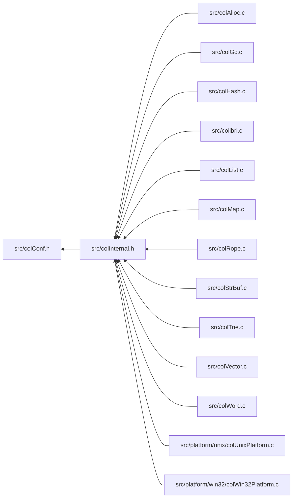

<a id="col_conf_8h"></a>
# File colConf.h

![][C++]

**Location**: `src/colConf.h`

This header file defines configuration macros.


## Includes

* <limits.h>


## Included by

* [src/colInternal.h](col_internal_8h.md#col_internal_8h)



## Machine-Dependent Constants

<a id="group__arch_1ga35f9164d26d6049e3111fe0c02f20c30"></a>
### Macro COL\_BIGENDIAN

![][public]

```cpp
#define COL_BIGENDIAN 1
```

Machine endianness.

When defined, we are on a big-endian machine (PowerPC, ...), else we are on a little-endian machine (Intel, ...).


**remark**\
This code was taken from Tcl.


<a id="group__arch_1gae4bd4dcc79eefdf41258b6ddf09133f3"></a>
### Macro SIZE\_BIT

![][public]

```cpp
#define SIZE_BIT 32
```

Machine word size.

?> Comparing UINT_MAX and SIZE_MAX is a reasonable heuristics when discriminating 32-bit systems vs. 64-bit.


## GC-Related Configuration Settings

<a id="group__gc_1gab203ff01512f39769443cf23c24c1234"></a>
### Macro GC\_MAX\_GENERATIONS

![][public]

```cpp
#define GC_MAX_GENERATIONS 6
```

Maximum number of generations.

With a generational factor of 10, and 6 generations, the oldest generation would be collected 10^5 = 1,000,000 times less frequently than the youngest generation. With one GC every 1/10th of second, that would mean about 1 major GC a day.


!> **Attention** \
Value should not exceed 15 (see [PAGE\_GENERATION](col_internal_8h.md#group__pages__cells_1gaa7215b15e159db56ed2bc30d66488fd8)).


**See also**: [GC\_GEN\_FACTOR](col_conf_8h.md#group__gc_1gaa629b54777cadaf944d1830310ae91f0)


<a id="group__gc_1gaa629b54777cadaf944d1830310ae91f0"></a>
### Macro GC\_GEN\_FACTOR

![][public]

```cpp
#define GC_GEN_FACTOR 10
```

Generational factor, i.e. number of GCs between generations.


<a id="group__gc_1gabfe8006c7310448a1d33027d30a59fe4"></a>
### Macro PROMOTE\_COMPACT

![][public]

```cpp
#define PROMOTE_COMPACT
```

Control how cells are promoted to the next generation during GC.

Promotion is generally done by moving whole pages across generations, which is fast and non-moving (it preserves cell addresses). However it can generate fragmentation if pages contain a mix of reachable and collected cells. To avoid that, we can promote cells of the last collected generation individually by moving them to the next generation, i.e. the first uncollected generation. This is slightly slower and causes the address of cells to change (unless they are pinned), however it lowers overall memory consumption and may improve locality of reference over time.


When defined, enables promotion/compaction during GC. Else, whole pages are promoted across generations.


**See also**: [PerformGC](col_gc_8c.md#group__gc_1ga5688ae9d7f658650ca8dfa66f4102f62), [MarkWord](col_gc_8c.md#group__gc_1gaf54093bb37e6a4aaaf718fb1a791d56c), [PROMOTE\_PAGE\_FILL\_RATIO](col_conf_8h.md#group__gc_1ga9d78d9318aadc0671b1a74f32d6ede0a)


<a id="group__gc_1ga9d78d9318aadc0671b1a74f32d6ede0a"></a>
### Macro PROMOTE\_PAGE\_FILL\_RATIO

![][public]

```cpp
#define PROMOTE_PAGE_FILL_RATIO 0.90
```

Threshold value on a pool's fill ratio to decide whether to activate compaction.

**See also**: [PerformGC](col_gc_8c.md#group__gc_1ga5688ae9d7f658650ca8dfa66f4102f62), [MarkWord](col_gc_8c.md#group__gc_1gaf54093bb37e6a4aaaf718fb1a791d56c), [PROMOTE\_COMPACT](col_conf_8h.md#group__gc_1gabfe8006c7310448a1d33027d30a59fe4)


<a id="group__gc_1ga8f7ee9569524cfe8a12b86998ad3b046"></a>
### Macro GC\_MIN\_PAGE\_ALLOC

![][public]

```cpp
#define GC_MIN_PAGE_ALLOC 64
```

Minimum number of page allocations in a pool since last GC before triggering a new one.

**See also**: [Col\_ResumeGC](colibri_8h.md#group__gc_1gaf7d4f0dd1996dde366af3f29e9bcc517), [PerformGC](col_gc_8c.md#group__gc_1ga5688ae9d7f658650ca8dfa66f4102f62), [GC\_THRESHOLD](col_conf_8h.md#group__gc_1ga9411731734c0e1de71bda0293f9ee0ce)


<a id="group__gc_1ga64c29713a0525d56417df4a2bc2c33d7"></a>
### Macro GC\_MAX\_PAGE\_ALLOC

![][public]

```cpp
#define GC_MAX_PAGE_ALLOC 1024
```

Number of page allocations in a pool since last GC above which to always trigger a new one.

**See also**: [Col\_ResumeGC](colibri_8h.md#group__gc_1gaf7d4f0dd1996dde366af3f29e9bcc517), [PerformGC](col_gc_8c.md#group__gc_1ga5688ae9d7f658650ca8dfa66f4102f62), [GC\_THRESHOLD](col_conf_8h.md#group__gc_1ga9411731734c0e1de71bda0293f9ee0ce)


<a id="group__gc_1ga9411731734c0e1de71bda0293f9ee0ce"></a>
### Macro GC\_THRESHOLD

![][public]

```cpp
#define GC_THRESHOLD     ((threshold)<[GC\_MIN\_PAGE\_ALLOC](col_conf_8h.md#group__gc_1ga8f7ee9569524cfe8a12b86998ad3b046) ?    [GC\_MIN\_PAGE\_ALLOC](col_conf_8h.md#group__gc_1ga8f7ee9569524cfe8a12b86998ad3b046) \
    :(threshold)>[GC\_MAX\_PAGE\_ALLOC](col_conf_8h.md#group__gc_1ga64c29713a0525d56417df4a2bc2c33d7) ?    [GC\_MAX\_PAGE\_ALLOC](col_conf_8h.md#group__gc_1ga64c29713a0525d56417df4a2bc2c33d7) \
    :                                   (threshold))( threshold )
```

Utility macro that combines both min and max page allocation numbers for GC trigger control.

**Parameters**:

* **threshold**: Threshold value.


**Returns**:

Actual threshold value compared to number of allocations.


**See also**: [Col\_ResumeGC](colibri_8h.md#group__gc_1gaf7d4f0dd1996dde366af3f29e9bcc517), [PerformGC](col_gc_8c.md#group__gc_1ga5688ae9d7f658650ca8dfa66f4102f62), [GC\_MIN\_PAGE\_ALLOC](col_conf_8h.md#group__gc_1ga8f7ee9569524cfe8a12b86998ad3b046), [GC\_MAX\_PAGE\_ALLOC](col_conf_8h.md#group__gc_1ga64c29713a0525d56417df4a2bc2c33d7)


## Page and Cell Allocation-Related Configuration Settings

<a id="group__alloc_1ga5e794872b12686cc064052cdf6b38f9f"></a>
### Macro LARGE\_PAGE\_SIZE

![][public]

```cpp
#define LARGE_PAGE_SIZE 128 /* 512 KB on 64-bit */
```

Large page size.

This is the number of pages above which cell groups are allocated in their own dedicated page range, i.e. no free cell remains after allocation.


?> Value should not exceed 128 (see [AddressRange](struct_address_range.md#struct_address_range)).


**See also**: [PoolAllocPages](col_alloc_8c.md#group__alloc_1ga45316be86459e993b67bf27efbb8bf5f)


<a id="group__alloc_1ga7d467c1d283fdfa1f2081ba1e0d01b6e"></a>
### Macro PAGE\_SIZE

![][public]

```cpp
#define PAGE_SIZE 1024
```

Page size in bytes.


<a id="group__alloc_1ga7a4127f14f16563da90eb3c836bc404f"></a>
### Macro CELL\_SIZE

![][public]

```cpp
#define CELL_SIZE 16 /* 4*4 */
```

Cell size in bytes.


<a id="group__alloc_1gae8f0d88b8c73d3fb1bc64a0e2ef68faa"></a>
### Macro CELLS\_PER\_PAGE

![][public]

```cpp
#define CELLS_PER_PAGE 64 /* [PAGE\_SIZE](col_conf_8h.md#group__alloc_1ga7d467c1d283fdfa1f2081ba1e0d01b6e)/[CELL\_SIZE](col_conf_8h.md#group__alloc_1ga7a4127f14f16563da90eb3c836bc404f) */
```

Number of cells per page.


## Source

```cpp
/**
 * @file colConf.h
 *
 * This header file defines configuration macros.
 *
 * @beginprivate @cond PRIVATE
 */

#ifndef _COLIBRI_CONFIGURATION
#define _COLIBRI_CONFIGURATION

/*
===========================================================================*//*!
\internal \addtogroup arch System and Architecture
\{*//*==========================================================================
*/

/***************************************************************************//*!
 * \name Machine-Dependent Constants
 ***************************************************************************\{*/

/**
 * \def COL_BIGENDIAN
 *      Machine endianness. When defined, we are on a big-endian machine
 *      (PowerPC, ...), else we are on a little-endian machine (Intel, ...).
 *
 * @remark
 *      This code was taken from Tcl.
 */
#ifdef HAVE_SYS_TYPES_H
#    include <sys/types.h>
#endif
#ifdef HAVE_SYS_PARAM_H
#    include <sys/param.h>
#endif
#ifdef BYTE_ORDER
#    ifdef BIG_ENDIAN
#        if BYTE_ORDER == BIG_ENDIAN
#            undef COL_BIGENDIAN
#            define COL_BIGENDIAN 1
#        endif
#    endif
#    ifdef LITTLE_ENDIAN
#        if BYTE_ORDER == LITTLE_ENDIAN
#            undef COL_BIGENDIAN
#        endif
#    endif
#endif

/**
 * Machine word size.
 *
 * @note
 *      Comparing UINT_MAX and SIZE_MAX is a reasonable heuristics when
 *      discriminating 32-bit systems vs. 64-bit.
 */
#include <limits.h>
#if UINT_MAX == SIZE_MAX
#   define SIZE_BIT             32
#else
#   define SIZE_BIT             64
#endif

/* End of Machine-Dependent Constants *//*!\}*/

/* End of System and Architecture *//*!\}*/


/*
===========================================================================*//*!
\internal \addtogroup gc Garbage Collection
\{*//*==========================================================================
*/

/***************************************************************************//*!
 * \name GC-Related Configuration Settings
 ***************************************************************************\{*/

/**
 * Maximum number of generations. With a generational factor of 10, and 6
 * generations, the oldest generation would be collected 10^5 = 1,000,000
 * times less frequently than the youngest generation. With one GC every
 * 1/10th of second, that would mean about 1 major GC a day.
 *
 * @attention
 *      Value should not exceed 15 (see #PAGE_GENERATION).
 *
 * @see GC_GEN_FACTOR
 */
#define GC_MAX_GENERATIONS      6

/**
 * Generational factor, i.e.\ number of GCs between generations.
 */
#define GC_GEN_FACTOR           10

/**
 * Control how cells are promoted to the next generation during GC.
 * Promotion is generally done by moving whole pages across generations,
 * which is fast and non-moving (it preserves cell addresses). However it
 * can generate fragmentation if pages contain a mix of reachable and
 * collected cells. To avoid that, we can promote cells of the last
 * collected generation individually by moving them to the next generation,
 * i.e. the first uncollected generation. This is slightly slower and
 * causes the address of cells to change (unless they are pinned), however
 * it lowers overall memory consumption and may improve locality of
 * reference over time.
 *
 * When defined, enables promotion/compaction during GC. Else, whole pages
 * are promoted across generations.
 *
 * @see PerformGC
 * @see MarkWord
 * @see PROMOTE_PAGE_FILL_RATIO
 */
#define PROMOTE_COMPACT

/**
 * Threshold value on a pool's fill ratio to decide whether to activate
 * compaction.
 *
 * @see PerformGC
 * @see MarkWord
 * @see PROMOTE_COMPACT
 */
#define PROMOTE_PAGE_FILL_RATIO 0.90

/*---------------------------------------------------------------------------
 * Control when garbage collection are performed.
 *--------------------------------------------------------------------------*/

/**
 * Minimum number of page allocations in a pool since last GC before
 * triggering a new one.
 *
 * @see Col_ResumeGC
 * @see PerformGC
 * @see GC_THRESHOLD
 */
#define GC_MIN_PAGE_ALLOC       64

/**
 * Number of page allocations in a pool since last GC above which to always
 * trigger a new one.
 *
 * @see Col_ResumeGC
 * @see PerformGC
 * @see GC_THRESHOLD
 */
#define GC_MAX_PAGE_ALLOC       1024

/**
 * Utility macro that combines both min and max page allocation numbers
 * for GC trigger control.
 *
 * @param threshold     Threshold value.
 *
 * @return Actual threshold value compared to number of allocations.
 *
 * @see Col_ResumeGC
 * @see PerformGC
 * @see GC_MIN_PAGE_ALLOC
 * @see GC_MAX_PAGE_ALLOC
 */
#define GC_THRESHOLD(threshold) \
    ((threshold)<GC_MIN_PAGE_ALLOC ?    GC_MIN_PAGE_ALLOC \
    :(threshold)>GC_MAX_PAGE_ALLOC ?    GC_MAX_PAGE_ALLOC \
    :                                   (threshold))

/* End of GC-Related Configuration Settings *//*!\}*/

/* End of Garbage Collection *//*!\}*/


/*
===========================================================================*//*!
\internal \addtogroup alloc Memory Allocation
\{*//*==========================================================================
*/

/***************************************************************************//*!
 * \name Page and Cell Allocation-Related Configuration Settings
 ***************************************************************************\{*/

/**
 * Large page size. This is the number of pages above which cell groups are
 * allocated in their own dedicated page range, i.e. no free cell remains
 * after allocation.
 *
 * @note
 *      Value should not exceed 128 (see #AddressRange).
 *
 * @see PoolAllocPages
 */
#define LARGE_PAGE_SIZE         128 /* 512 KB on 64-bit */

/*---------------------------------------------------------------------------
 * Page and Cell Size Constants
 *--------------------------------------------------------------------------*/

/**
 * \def PAGE_SIZE
 *      Page size in bytes.
 *
 * \def CELL_SIZE
 *      Cell size in bytes.
 *
 * \def CELLS_PER_PAGE
 *      Number of cells per page.
 */
#if SIZE_BIT == 32
#   define PAGE_SIZE            1024
#   define CELL_SIZE            16 /* 4*4 */
#   define CELLS_PER_PAGE       64 /* PAGE_SIZE/CELL_SIZE */
#elif SIZE_BIT == 64
#   define PAGE_SIZE            4096
#   define CELL_SIZE            32 /* 4*8 */
#   define CELLS_PER_PAGE       128 /* PAGE_SIZE/CELL_SIZE */
#endif

/* End of Page and Cell Allocation-Related Configuration Settings *//*!\}*/

/* End of Memory Allocation *//*!\}*/

#endif /* _COLIBRI_CONFIGURATION */
/*! @endcond @endprivate */
```

[public]: https://img.shields.io/badge/-public-brightgreen (public)
[C++]: https://img.shields.io/badge/language-C%2B%2B-blue (C++)
[private]: https://img.shields.io/badge/-private-red (private)
[Markdown]: https://img.shields.io/badge/language-Markdown-blue (Markdown)