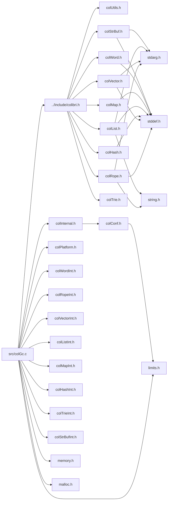

<a id="col_gc_8c"></a>
# File colGc.c

![][C++]

**Location**: `src/colGc.c`

This file implements the mark-and-sweep, generational, exact GC that is at the heart of Colibri.

Newer cells are born in "Eden", i.e. generation 1 pool, and are promoted to older pools when they survive more than one collection.


A GC is triggered after a number of page allocations have been made resulting from cell allocation failures. They are only triggered outside of GC-protected sections to avoid collecting the newly allocated cells.


Younger pools are collected more often than older ones. Completing a given number of GCs on a pool will include the previous generation to the next GC. For example, if this generational factor is 10, then generation x will be collected every 10 collections of generation x-1. So gen-x collections will occur every 10 gen-(x-1) collection, i.e. every 10^x gen-0 collection.

## Includes

* [../include/colibri.h](colibri_8h.md#colibri_8h)
* [colInternal.h](col_internal_8h.md#col_internal_8h)
* [colPlatform.h](col_platform_8h.md#col_platform_8h)
* [colWordInt.h](col_word_int_8h.md#col_word_int_8h)
* [colRopeInt.h](col_rope_int_8h.md#col_rope_int_8h)
* [colVectorInt.h](col_vector_int_8h.md#col_vector_int_8h)
* [colListInt.h](col_list_int_8h.md#col_list_int_8h)
* [colMapInt.h](col_map_int_8h.md#col_map_int_8h)
* [colHashInt.h](col_hash_int_8h.md#col_hash_int_8h)
* [colTrieInt.h](col_trie_int_8h.md#col_trie_int_8h)
* [colStrBufInt.h](col_str_buf_int_8h.md#col_str_buf_int_8h)
* <memory.h>
* <limits.h>
* <malloc.h>



## Word Lifetime Management

<a id="group__words_1gab55f452e6b0856f7bd7b34e04fae2aa2"></a>
### Function Col\_WordPreserve

![][public]

```cpp
void Col_WordPreserve(Col_Word word)
```

Preserve a persistent reference to a word, making it a root.

This allows words to be safely stored in external structures regardless of memory management cycles. More specifically, they can't be collected and their address remains constant.


Calls can be nested. A reference count is updated accordingly.


Roots are stored in a trie indexed by the root source addresses.


**pre**\
Must be called within a GC-protected section.


**Side Effect**:

May allocate memory cells. Marks word as pinned.


**See also**: [Col\_WordRelease](col_word_8h.md#group__words_1gad93112f81ce6511d6d0ece0db4d38598)

**Exceptions**:

* **[COL\_ERROR\_GCPROTECT](colibri_8h.md#group__error_1gga729084542ed9eae62009a84d3379ef35a33f3b4f6762491c50375359e5ffa02f8)**: [[E]](colibri_8h.md#group__error_1gga6dab009a0b8c4b4fa080cb9ba1859e9eae8345daddd8d5e83225f9f88d302f1a0) Outside of a GC-protected section.

**Parameters**:

* [Col\_Word](col_word_8h.md#group__words_1gadb626f9e195212e4fdfba7df154ad043) **word**: The word to preserve.

**Return type**: EXTERN void

**References**:

* [ASSERT](col_internal_8h.md#group__error_1gac22830a985e1daed0c9eadba8c6f606e)
* [CELL\_PAGE](col_internal_8h.md#group__pages__cells_1gabe4fc1fd7a45bf2858948e3a06710a2b)
* [EnterProtectRoots](col_platform_8h.md#group__arch_1ga037203dea1294535ac25be8712d708d6)
* [ThreadData::groupData](struct_thread_data.md#struct_thread_data_1aefbdf49c641476274db5326c60853022)
* [LeaveProtectRoots](col_platform_8h.md#group__arch_1gaee9721bdb7cc0ecca4a8ee295eadd446)
* [PAGE\_GENERATION](col_internal_8h.md#group__pages__cells_1gaa7215b15e159db56ed2bc30d66488fd8)
* [PlatGetThreadData](col_unix_platform_8h.md#group__arch__unix_1ga6964b3c4d4787a9defb7aae57825d92c)
* [PoolAllocCells](col_alloc_8c.md#group__alloc_1gafd84f35bab195e5e45a3338903dbd837)
* [PRECONDITION\_GCPROTECTED](col_gc_8c.md#group__gc_1ga1ce49cbb2ef788b5e3d501b57b903289)
* [ROOT\_GET\_LEAF](col_internal_8h.md#group__gc__roots_1gaf093eb2c5ec8150f06a69bd10df6be6a)
* [ROOT\_GET\_NODE](col_internal_8h.md#group__gc__roots_1ga33fa98f95a7bab38652b351e60d60bae)
* [ROOT\_IS\_LEAF](col_internal_8h.md#group__gc__roots_1gaa8c5f8c118fe2e0c3c0bcfb0d8be9a08)
* [ROOT\_LEAF\_INIT](col_internal_8h.md#group__gc__roots_1ga283423b988b4f6979e2f6e8d2b8a8ba9)
* [ROOT\_LEAF\_REFCOUNT](col_internal_8h.md#group__gc__roots_1gaef6c67ed97c9ceace9b0818bed0110b2)
* [ROOT\_LEAF\_SOURCE](col_internal_8h.md#group__gc__roots_1gae634c20d504ac8bd99ab26f4ddc3ee12)
* [ROOT\_NODE\_INIT](col_internal_8h.md#group__gc__roots_1ga9e5b5f33b34e01b54b6addaaaa9ace5e)
* [ROOT\_NODE\_LEFT](col_internal_8h.md#group__gc__roots_1ga27676041bc270c4dfc8c7caea4e64274)
* [ROOT\_NODE\_MASK](col_internal_8h.md#group__gc__roots_1gaa1f0481c45b7c14cf933b91d9f27a541)
* [ROOT\_NODE\_RIGHT](col_internal_8h.md#group__gc__roots_1gaf86512b7113a6afaea849d480070dd33)
* [ROOT\_PARENT](col_internal_8h.md#group__gc__roots_1gadd16c38bcc5016a0c43a17442c232ffa)
* [GroupData::rootPool](struct_group_data.md#struct_group_data_1a81941409b9917b41bb20d3572b2b4ec7)
* [GroupData::roots](struct_group_data.md#struct_group_data_1af753ea77322dc01776c856b584b219e7)
* [WORD\_CIRCLIST\_CORE](col_word_int_8h.md#group__circlist__words_1ga736b51bba4c6bf3ca55f43d942390d36)
* [WORD\_PINNED](col_word_int_8h.md#group__regular__words_1gad20cf13be09a354418d8615e6f2f2193)
* [WORD\_SET\_PINNED](col_word_int_8h.md#group__regular__words_1ga7ae30ab27827ba70ae1265b5f637101a)
* [WORD\_TYPE](col_word_int_8h.md#group__words_1ga014e27ea4160eb3845ac495a22c232f5)
* [WORD\_TYPE\_CHARBOOL](col_word_int_8h.md#group__words_1ga1422c37e0c7d668fad81b0710863dad5)
* [WORD\_TYPE\_CIRCLIST](col_word_int_8h.md#group__words_1ga5986ba88af901948fd9a78f422001650)
* [WORD\_TYPE\_NIL](col_word_int_8h.md#group__words_1ga1f4d1db7619649bb51aeddd67c8b242f)
* [WORD\_TYPE\_SMALLFP](col_word_int_8h.md#group__words_1gaf5bde441039615017c30996b222a55c8)
* [WORD\_TYPE\_SMALLINT](col_word_int_8h.md#group__words_1gacaa5b57dfa5151a5852a1616bad80d3d)
* [WORD\_TYPE\_SMALLSTR](col_word_int_8h.md#group__words_1ga4148e4b4a03bff2e7715274ae4b126eb)
* [WORD\_TYPE\_VOIDLIST](col_word_int_8h.md#group__words_1gad13a9d2efd54cfe0f381fb9c85c4bebb)

<a id="group__words_1gad93112f81ce6511d6d0ece0db4d38598"></a>
### Function Col\_WordRelease

![][public]

```cpp
void Col_WordRelease(Col_Word word)
```

Release a root word previously made by [Col\_WordPreserve()](col_word_8h.md#group__words_1gab55f452e6b0856f7bd7b34e04fae2aa2).

Calls can be nested. A reference count is updated accordingly. Once the count drops below 1, the root becomes stale.


**pre**\
Must be called within a GC-protected section.


**Side Effect**:

May release memory cells. Unpin word.


**See also**: [Col\_WordPreserve](col_word_8h.md#group__words_1gab55f452e6b0856f7bd7b34e04fae2aa2)

**Exceptions**:

* **[COL\_ERROR\_GCPROTECT](colibri_8h.md#group__error_1gga729084542ed9eae62009a84d3379ef35a33f3b4f6762491c50375359e5ffa02f8)**: [[E]](colibri_8h.md#group__error_1gga6dab009a0b8c4b4fa080cb9ba1859e9eae8345daddd8d5e83225f9f88d302f1a0) Outside of a GC-protected section.

**Parameters**:

* [Col\_Word](col_word_8h.md#group__words_1gadb626f9e195212e4fdfba7df154ad043) **word**: The root word to release.

**Return type**: EXTERN void

**References**:

* [ASSERT](col_internal_8h.md#group__error_1gac22830a985e1daed0c9eadba8c6f606e)
* [CELL\_INDEX](col_internal_8h.md#group__pages__cells_1gaa6e93c045bc319412f36118ea1cfbb05)
* [CELL\_PAGE](col_internal_8h.md#group__pages__cells_1gabe4fc1fd7a45bf2858948e3a06710a2b)
* [ClearCells](col_alloc_8c.md#group__alloc_1ga5d95195ed024066e939d0564549e865d)
* [EnterProtectRoots](col_platform_8h.md#group__arch_1ga037203dea1294535ac25be8712d708d6)
* [ThreadData::groupData](struct_thread_data.md#struct_thread_data_1aefbdf49c641476274db5326c60853022)
* [LeaveProtectRoots](col_platform_8h.md#group__arch_1gaee9721bdb7cc0ecca4a8ee295eadd446)
* [PlatGetThreadData](col_unix_platform_8h.md#group__arch__unix_1ga6964b3c4d4787a9defb7aae57825d92c)
* [PRECONDITION\_GCPROTECTED](col_gc_8c.md#group__gc_1ga1ce49cbb2ef788b5e3d501b57b903289)
* [ROOT\_GET\_NODE](col_internal_8h.md#group__gc__roots_1ga33fa98f95a7bab38652b351e60d60bae)
* [ROOT\_IS\_LEAF](col_internal_8h.md#group__gc__roots_1gaa8c5f8c118fe2e0c3c0bcfb0d8be9a08)
* [ROOT\_LEAF\_REFCOUNT](col_internal_8h.md#group__gc__roots_1gaef6c67ed97c9ceace9b0818bed0110b2)
* [ROOT\_LEAF\_SOURCE](col_internal_8h.md#group__gc__roots_1gae634c20d504ac8bd99ab26f4ddc3ee12)
* [ROOT\_NODE\_LEFT](col_internal_8h.md#group__gc__roots_1ga27676041bc270c4dfc8c7caea4e64274)
* [ROOT\_NODE\_MASK](col_internal_8h.md#group__gc__roots_1gaa1f0481c45b7c14cf933b91d9f27a541)
* [ROOT\_NODE\_RIGHT](col_internal_8h.md#group__gc__roots_1gaf86512b7113a6afaea849d480070dd33)
* [ROOT\_PARENT](col_internal_8h.md#group__gc__roots_1gadd16c38bcc5016a0c43a17442c232ffa)
* [GroupData::roots](struct_group_data.md#struct_group_data_1af753ea77322dc01776c856b584b219e7)
* [TestCell](col_alloc_8c.md#group__alloc_1gade7bbd62a937c3b2ed2f32c34c6c60a6)
* [WORD\_CIRCLIST\_CORE](col_word_int_8h.md#group__circlist__words_1ga736b51bba4c6bf3ca55f43d942390d36)
* [WORD\_CLEAR\_PINNED](col_word_int_8h.md#group__regular__words_1ga04a19fb132382d52fa42d3d3e4237f2f)
* [WORD\_PINNED](col_word_int_8h.md#group__regular__words_1gad20cf13be09a354418d8615e6f2f2193)
* [WORD\_TYPE](col_word_int_8h.md#group__words_1ga014e27ea4160eb3845ac495a22c232f5)
* [WORD\_TYPE\_CHARBOOL](col_word_int_8h.md#group__words_1ga1422c37e0c7d668fad81b0710863dad5)
* [WORD\_TYPE\_CIRCLIST](col_word_int_8h.md#group__words_1ga5986ba88af901948fd9a78f422001650)
* [WORD\_TYPE\_NIL](col_word_int_8h.md#group__words_1ga1f4d1db7619649bb51aeddd67c8b242f)
* [WORD\_TYPE\_SMALLFP](col_word_int_8h.md#group__words_1gaf5bde441039615017c30996b222a55c8)
* [WORD\_TYPE\_SMALLINT](col_word_int_8h.md#group__words_1gacaa5b57dfa5151a5852a1616bad80d3d)
* [WORD\_TYPE\_SMALLSTR](col_word_int_8h.md#group__words_1ga4148e4b4a03bff2e7715274ae4b126eb)
* [WORD\_TYPE\_VOIDLIST](col_word_int_8h.md#group__words_1gad13a9d2efd54cfe0f381fb9c85c4bebb)

## GC Exceptions

<a id="group__gc_1ga1ce49cbb2ef788b5e3d501b57b903289"></a>
### Macro PRECONDITION\_GCPROTECTED

![][public]

```cpp
#define PRECONDITION_GCPROTECTED( data )
```

Precondition macro checking that the call is performed within a GC-protected section (i.e. between [Col\_PauseGC()](colibri_8h.md#group__gc_1gae703ee3215a4724ebed8e5a2824e7a7b) / [Col\_TryPauseGC()](colibri_8h.md#group__gc_1ga54eefaa11ad5a79b8665fef5cc24c26f) and [Col\_ResumeGC()](colibri_8h.md#group__gc_1gaf7d4f0dd1996dde366af3f29e9bcc517)).

May be followed by a return block.


**Parameters**:

* **data**: [ThreadData](struct_thread_data.md#struct_thread_data)


**Exceptions**:

* **[COL\_ERROR\_GCPROTECT](colibri_8h.md#group__error_1gga729084542ed9eae62009a84d3379ef35a33f3b4f6762491c50375359e5ffa02f8)**: [[E]](colibri_8h.md#group__error_1gga6dab009a0b8c4b4fa080cb9ba1859e9eae8345daddd8d5e83225f9f88d302f1a0) Outside of a GC-protected section.


**Todo**:

rewrite with [COL\_RUNTIMECHECK](col_utils_8h.md#group__error_1ga600cfacb45fb8cb723df850444b5b87e)

**See also**: [Col\_Error](colibri_8h.md#group__error_1ga9a9a9c96b23c489cf8a19a6248fc77b8), [ThreadData](struct_thread_data.md#struct_thread_data)


## GC-Protected Sections

<a id="group__gc_1gae703ee3215a4724ebed8e5a2824e7a7b"></a>
### Function Col\_PauseGC

![][public]

```cpp
void Col_PauseGC()
```

Pause the automatic garbage collection.

Calls can be nested. Code between the outermost pause and resume calls define a GC-protected section.


When the threading model isn't [COL\_SINGLE](colibri_8h.md#group__init_1gaaecbd3c0ddf9f5684b97db76e7338731), blocks as long as a GC is underway.


**See also**: [Col\_TryPauseGC](colibri_8h.md#group__gc_1ga54eefaa11ad5a79b8665fef5cc24c26f), [Col\_ResumeGC](colibri_8h.md#group__gc_1gaf7d4f0dd1996dde366af3f29e9bcc517)


**Parameters**:

* void

**Return type**: EXTERN void

**References**:

* [ThreadData::groupData](struct_thread_data.md#struct_thread_data_1aefbdf49c641476274db5326c60853022)
* [ThreadData::pauseGC](struct_thread_data.md#struct_thread_data_1a09349f3ddfda58e5a43c3c6962e88da7)
* [PlatGetThreadData](col_unix_platform_8h.md#group__arch__unix_1ga6964b3c4d4787a9defb7aae57825d92c)
* [SyncPauseGC](col_platform_8h.md#group__arch_1ga24722ffc116af10635061f365d59f877)

<a id="group__gc_1ga54eefaa11ad5a79b8665fef5cc24c26f"></a>
### Function Col\_TryPauseGC

![][public]

```cpp
int Col_TryPauseGC()
```

Try to pause the automatic garbage collection.

Calls can be nested.


**Return values**:

* **1**: if successful
* **0**: if a GC is underway (this implies the threading model isn't [COL\_SINGLE](colibri_8h.md#group__init_1gaaecbd3c0ddf9f5684b97db76e7338731)). In this case the caller must try again later or use the blocking version.


**See also**: [Col\_PauseGC](colibri_8h.md#group__gc_1gae703ee3215a4724ebed8e5a2824e7a7b), [Col\_ResumeGC](colibri_8h.md#group__gc_1gaf7d4f0dd1996dde366af3f29e9bcc517)


**Parameters**:

* void

**Return type**: EXTERN int

**References**:

* [ThreadData::groupData](struct_thread_data.md#struct_thread_data_1aefbdf49c641476274db5326c60853022)
* [ThreadData::pauseGC](struct_thread_data.md#struct_thread_data_1a09349f3ddfda58e5a43c3c6962e88da7)
* [PlatGetThreadData](col_unix_platform_8h.md#group__arch__unix_1ga6964b3c4d4787a9defb7aae57825d92c)
* [TrySyncPauseGC](col_platform_8h.md#group__arch_1gaaab49fa9044c9543c52236f55c750ce7)

<a id="group__gc_1gaf7d4f0dd1996dde366af3f29e9bcc517"></a>
### Function Col\_ResumeGC

![][public]

```cpp
void Col_ResumeGC()
```

Resume the automatic garbage collection.

Calls can be nested.


Leaving a GC-protected section potentially triggers a GC.


**pre**\
Must be called within a GC-protected section.


**Side Effect**:

May trigger the garbage collection.


**See also**: [Col\_PauseGC](colibri_8h.md#group__gc_1gae703ee3215a4724ebed8e5a2824e7a7b), [Col\_TryPauseGC](colibri_8h.md#group__gc_1ga54eefaa11ad5a79b8665fef5cc24c26f)

**Exceptions**:

* **[COL\_ERROR\_GCPROTECT](colibri_8h.md#group__error_1gga729084542ed9eae62009a84d3379ef35a33f3b4f6762491c50375359e5ffa02f8)**: [[E]](colibri_8h.md#group__error_1gga6dab009a0b8c4b4fa080cb9ba1859e9eae8345daddd8d5e83225f9f88d302f1a0) Outside of a GC-protected section.

**Parameters**:

* void

**Return type**: EXTERN void

**References**:

* [ASSERT](col_internal_8h.md#group__error_1gac22830a985e1daed0c9eadba8c6f606e)
* [ThreadData::eden](struct_thread_data.md#struct_thread_data_1ac4e14d59d12e49f808e8631fea374297)
* [GC\_GEN\_FACTOR](col_conf_8h.md#group__gc_1gaa629b54777cadaf944d1830310ae91f0)
* [GC\_THRESHOLD](col_conf_8h.md#group__gc_1ga9411731734c0e1de71bda0293f9ee0ce)
* [ThreadData::groupData](struct_thread_data.md#struct_thread_data_1aefbdf49c641476274db5326c60853022)
* [MemoryPool::nbAlloc](struct_memory_pool.md#struct_memory_pool_1a78090a0d29a65f47f1237fd99ee33316)
* [MemoryPool::nbPages](struct_memory_pool.md#struct_memory_pool_1ab4fba4fd762f5a04c124cfafd6577744)
* [ThreadData::pauseGC](struct_thread_data.md#struct_thread_data_1a09349f3ddfda58e5a43c3c6962e88da7)
* [PlatGetThreadData](col_unix_platform_8h.md#group__arch__unix_1ga6964b3c4d4787a9defb7aae57825d92c)
* [GroupData::pools](struct_group_data.md#struct_group_data_1a1db77277f7db550bc190771614fe2dbc)
* [PRECONDITION\_GCPROTECTED](col_gc_8c.md#group__gc_1ga1ce49cbb2ef788b5e3d501b57b903289)
* [SyncResumeGC](col_platform_8h.md#group__arch_1gaeda9d3a189fb79d5dc53d2638ca42b35)

## Cell Allocation

<a id="group__alloc_1gaeec69115deeb3321bdfbb4e42119f806"></a>
### Function AllocCells

![][private]

```cpp
Cell * AllocCells(size_t number)
```

Allocate cells in the eden pool.

**pre**\
Must be called within a GC-protected section.


**Return values**:

* **pointer**: to the first allocated cell if successful.
* **NULL**: otherwise.


**See also**: [PoolAllocCells](col_alloc_8c.md#group__alloc_1gafd84f35bab195e5e45a3338903dbd837)

**Exceptions**:

* **[COL\_ERROR\_GCPROTECT](colibri_8h.md#group__error_1gga729084542ed9eae62009a84d3379ef35a33f3b4f6762491c50375359e5ffa02f8)**: [[E]](colibri_8h.md#group__error_1gga6dab009a0b8c4b4fa080cb9ba1859e9eae8345daddd8d5e83225f9f88d302f1a0) Outside of a GC-protected section.

**Parameters**:

* size_t **number**: Number of cells to allocate.

**Return type**: [Cell](col_internal_8h.md#group__pages__cells_1ga4eabbd6c7c650aaf998aefac3c78448f) *

**References**:

* [ThreadData::eden](struct_thread_data.md#struct_thread_data_1ac4e14d59d12e49f808e8631fea374297)
* [PlatGetThreadData](col_unix_platform_8h.md#group__arch__unix_1ga6964b3c4d4787a9defb7aae57825d92c)
* [PoolAllocCells](col_alloc_8c.md#group__alloc_1gafd84f35bab195e5e45a3338903dbd837)
* [PRECONDITION\_GCPROTECTED](col_gc_8c.md#group__gc_1ga1ce49cbb2ef788b5e3d501b57b903289)

**Referenced by**:

* [AddSynonymField](col_word_8c.md#group__words_1ga058a6e96bd5370d04936b59a3d3c48c9)
* [Col\_ConcatLists](col_list_8h.md#group__list__words_1ga73c0f71ee367af68bbad4a4738dfac3b)
* [Col\_ConcatRopes](col_rope_8h.md#group__rope__words_1gaafab3ef159c0b11402cc50c91fc59700)
* [Col\_CopyHashMap](col_hash_8h.md#group__hashmap__words_1ga9ebda3b577662e8b1dcf9a227d106f22)
* [Col\_CopyTrieMap](col_trie_8h.md#group__triemap__words_1ga34e494c0bafde72774a578643bb84a68)
* [Col\_NewCustomHashMap](col_hash_8h.md#group__customhashmap__words_1gad516fa9041eb514e2c5193eb5d958f0e)
* [Col\_NewCustomTrieMap](col_trie_8h.md#group__customtriemap__words_1ga18de761037e23e723d8d62aef7d6246c)
* [Col\_NewCustomWord](col_word_8h.md#group__custom__words_1gaf9a6d324967159ae7abeb41a3d59cc79)
* [Col\_NewFloatWord](col_word_8h.md#group__words_1gab8a1c82145210cc626b90a3c8dc3b4b7)
* [Col\_NewIntHashMap](col_hash_8h.md#group__hashmap__words_1ga21868cc2f614fe73e31690d5d233e0c9)
* [Col\_NewIntTrieMap](col_trie_8h.md#group__triemap__words_1ga774d1c17ace439ef92703934652ccec0)
* [Col\_NewIntWord](col_word_8h.md#group__words_1gaba67c33e1004d5db691cb5834b77645e)
* [Col\_NewMList](col_list_8h.md#group__mlist__words_1ga3b048f22f88eb07685a0d6e12960ca91)
* [Col\_NewMVector](col_vector_8h.md#group__mvector__words_1ga5409a9871105f346b35ecd06d857e271)
* [Col\_NewRope](col_rope_8h.md#group__rope__words_1gadf89e360729ba5052887cd4897b0167f)
* [Col\_NewStringBuffer](col_str_buf_8h.md#group__strbuf__words_1ga8c3ba7df2adb643c5da323d7fd013cfb)
* [Col\_NewStringHashMap](col_hash_8h.md#group__hashmap__words_1ga83815df8c509dbf24974ed447ed5ad75)
* [Col\_NewStringTrieMap](col_trie_8h.md#group__triemap__words_1ga41fcb3cc5b729930b9a9c405f4fabc25)
* [Col\_NewVector](col_vector_8h.md#group__vector__words_1ga6ef7d35d75fdc6a6781f0a32e9c7efc1)
* [Col\_NewVectorNV](col_vector_8h.md#group__vector__words_1gaa56f743590ca8867765f48e31e8a4df9)
* [Col\_NormalizeRope](col_rope_8h.md#group__rope__words_1gad8e0ed73e9d579e9aac9bd5ee7603319)
* [Col\_Sublist](col_list_8h.md#group__list__words_1gaa26702b61fabf55805c9ef1b2783e7f1)
* [Col\_Subrope](col_rope_8h.md#group__rope__words_1ga688a99f26c500c1f65f4141e97de0335)
* [ConvertEntryToMutable](col_hash_8c.md#group__hashmap__words_1ga12e2f90ca22da78efd1d3e42d442a3e3)
* [ConvertIntEntryToMutable](col_hash_8c.md#group__hashmap__words_1gace9fa4c1e18e28528ecbd57dc858cdda)
* [ConvertIntNodeToMutable](col_trie_8c.md#group__triemap__words_1gaaa5e678151930128e95296f7d2abf23c)
* [ConvertNodeToMutable](col_trie_8c.md#group__triemap__words_1ga875d493095b92897563a377cf810aaa2)
* [ConvertStringNodeToMutable](col_trie_8c.md#group__triemap__words_1ga99dfbb25b22d51753f941a244aad50b1)
* [HashMapFindEntry](col_hash_8c.md#group__hashmap__words_1ga0c88b84075dfbde40bfc894ea158bdc8)
* [IntHashMapFindEntry](col_hash_8c.md#group__hashmap__words_1ga1ddc6ccf9196e70ad14895d5bc32ad2d)
* [IntTrieMapFindEntry](col_trie_8c.md#group__triemap__words_1ga15570e9b8e1e48b2ea26b6ea369a95fb)
* [MergeListChunksProc](col_list_8c.md#group__list__words_1ga2daef27844161dd9c5b16f571bb2e01a)
* [NewMConcatList](col_list_8c.md#group__mlist__words_1ga0cf94fe0b5f417772755b0bd02851e5a)
* [StringTrieMapFindEntry](col_trie_8c.md#group__triemap__words_1ga22228c8cc05e205425dd3f6bba64c759)
* [TrieMapFindEntry](col_trie_8c.md#group__triemap__words_1ga927988459b3b6759f775b0c4af8f3c5e)

## Process & Threads

<a id="group__gc_1gad46e288d322683c434e6efa30e3edc22"></a>
### Function GcInitThread

![][private]

```cpp
void GcInitThread(ThreadData *data)
```

Per-thread GC-related initialization.

**Side Effect**:

Initialize the eden pool (which is always thread-specific).


**See also**: [ThreadData](struct_thread_data.md#struct_thread_data)


**Parameters**:

* [ThreadData](struct_thread_data.md#struct_thread_data) * **data**: Thread-specific data.

**Return type**: void

**References**:

* [ThreadData::eden](struct_thread_data.md#struct_thread_data_1ac4e14d59d12e49f808e8631fea374297)
* [PoolInit](col_alloc_8c.md#group__alloc_1gab08d29a35a3b57dff2e79468a569ad81)

**Referenced by**:

* [PlatEnter](col_unix_platform_8c.md#group__arch__unix_1gaa42fe97b4b462c9483110a715c1eb1d1)

<a id="group__gc_1ga4183a56fec06c1ff8176f90c31248d68"></a>
### Function GcInitGroup

![][private]

```cpp
void GcInitGroup(GroupData *data)
```

Per-group GC-related initialization.

**Side Effect**:

Initialize all memory pools but eden.


**See also**: [GroupData](struct_group_data.md#struct_group_data)


**Parameters**:

* [GroupData](struct_group_data.md#struct_group_data) * **data**: Group-specific data.

**Return type**: void

**References**:

* [GC\_MAX\_GENERATIONS](col_conf_8h.md#group__gc_1gab203ff01512f39769443cf23c24c1234)
* [PoolInit](col_alloc_8c.md#group__alloc_1gab08d29a35a3b57dff2e79468a569ad81)
* [GroupData::pools](struct_group_data.md#struct_group_data_1a1db77277f7db550bc190771614fe2dbc)
* [GroupData::rootPool](struct_group_data.md#struct_group_data_1a81941409b9917b41bb20d3572b2b4ec7)

**Referenced by**:

* [AllocGroupData](col_unix_platform_8c.md#group__arch__unix_1gada67280be3d6df8cf250ba65d46d176e)

<a id="group__gc_1gacbea8d94b2fdf7366fbe4ad8b8298a91"></a>
### Function GcCleanupThread

![][private]

```cpp
void GcCleanupThread(ThreadData *data)
```

Per-thread GC-related cleanup.

**Side Effect**:

Cleanup the eden pool (which is always thread-specific).


**See also**: [ThreadData](struct_thread_data.md#struct_thread_data)


**Parameters**:

* [ThreadData](struct_thread_data.md#struct_thread_data) * **data**: Thread-specific data.

**Return type**: void

**References**:

* [ThreadData::eden](struct_thread_data.md#struct_thread_data_1ac4e14d59d12e49f808e8631fea374297)
* [PoolCleanup](col_alloc_8c.md#group__alloc_1ga3ce5b284fd4b0c1f9efa518150268b81)

**Referenced by**:

* [PlatLeave](col_unix_platform_8c.md#group__arch__unix_1ga445bf6b3cd4afc09367a6d9fce001a2e)

<a id="group__gc_1ga8e6fd33d04cb870d9d4b64eb34ab2ebc"></a>
### Function GcCleanupGroup

![][private]

```cpp
void GcCleanupGroup(GroupData *data)
```

Per-group GC-related cleanup.

**Side Effect**:

Cleanup all memory pools but eden.


**See also**: [GroupData](struct_group_data.md#struct_group_data)


**Parameters**:

* [GroupData](struct_group_data.md#struct_group_data) * **data**: Group-specific data.

**Return type**: void

**References**:

* [GC\_MAX\_GENERATIONS](col_conf_8h.md#group__gc_1gab203ff01512f39769443cf23c24c1234)
* [PoolCleanup](col_alloc_8c.md#group__alloc_1ga3ce5b284fd4b0c1f9efa518150268b81)
* [GroupData::pools](struct_group_data.md#struct_group_data_1a1db77277f7db550bc190771614fe2dbc)
* [GroupData::rootPool](struct_group_data.md#struct_group_data_1a81941409b9917b41bb20d3572b2b4ec7)

**Referenced by**:

* [FreeGroupData](col_unix_platform_8c.md#group__arch__unix_1ga721b5c30cbc3d79ced480bf39efcf5aa)

## Mark & Sweep Algorithm

<a id="group__gc_1ga5688ae9d7f658650ca8dfa66f4102f62"></a>
### Function PerformGC

![][private]

```cpp
void PerformGC(GroupData *data)
```

Perform a garbage collection.

**Side Effect**:

May free cells or pages, promote words across pools, or allocate new pages during promotion.


**See also**: [ClearPoolBitmasks](col_gc_8c.md#group__gc_1gac78e83c9cbbb1fcbc175aed53353decf), [MarkReachableCellsFromRoots](col_gc_8c.md#group__gc_1ga246db5ae65938d3efa2b04b2b5cb2021), [MarkReachableCellsFromParents](col_gc_8c.md#group__gc_1ga49eb8981c888c90530906952e2869000), [SweepUnreachableCells](col_gc_8c.md#group__gc_1ga911d254f51c4e0b4475330147fbbc545), [PromotePages](col_gc_8c.md#group__gc_1ga09e7926c400756068d91140da241934f), [ResetPool](col_gc_8c.md#group__gc_1gaa6d1c2ce1d8343c3542c209187b7a47b)


**Parameters**:

* [GroupData](struct_group_data.md#struct_group_data) * **data**: Group-specific data.

**Return type**: void

**References**:

* [CELLS\_PER\_PAGE](col_conf_8h.md#group__alloc_1gae8f0d88b8c73d3fb1bc64a0e2ef68faa)
* [ClearPoolBitmasks](col_gc_8c.md#group__gc_1gac78e83c9cbbb1fcbc175aed53353decf)
* [GroupData::compactGeneration](struct_group_data.md#struct_group_data_1a19fe0bfacbbb85c6d4545b83d10e4cb7)
* [ThreadData::eden](struct_thread_data.md#struct_thread_data_1ac4e14d59d12e49f808e8631fea374297)
* [GroupData::first](struct_group_data.md#struct_group_data_1af58eb628d2c2bb11f4bfa161c7e93318)
* [MemoryPool::gc](struct_memory_pool.md#struct_memory_pool_1a2273b16be4a0e84a1d54df9caa74ddd6)
* [GC\_GEN\_FACTOR](col_conf_8h.md#group__gc_1gaa629b54777cadaf944d1830310ae91f0)
* [GC\_MAX\_GENERATIONS](col_conf_8h.md#group__gc_1gab203ff01512f39769443cf23c24c1234)
* [GC\_MAX\_PAGE\_ALLOC](col_conf_8h.md#group__gc_1ga64c29713a0525d56417df4a2bc2c33d7)
* [GC\_THRESHOLD](col_conf_8h.md#group__gc_1ga9411731734c0e1de71bda0293f9ee0ce)
* [MarkReachableCellsFromParents](col_gc_8c.md#group__gc_1ga49eb8981c888c90530906952e2869000)
* [MarkReachableCellsFromRoots](col_gc_8c.md#group__gc_1ga246db5ae65938d3efa2b04b2b5cb2021)
* [GroupData::maxCollectedGeneration](struct_group_data.md#struct_group_data_1a23653b17e9904b4b5441c2e95b2d7a99)
* [MemoryPool::nbAlloc](struct_memory_pool.md#struct_memory_pool_1a78090a0d29a65f47f1237fd99ee33316)
* [MemoryPool::nbPages](struct_memory_pool.md#struct_memory_pool_1ab4fba4fd762f5a04c124cfafd6577744)
* [MemoryPool::nbSetCells](struct_memory_pool.md#struct_memory_pool_1a69b3504fcae96ab4a89e3a0c077ec2ea)
* [ThreadData::next](struct_thread_data.md#struct_thread_data_1aee56668363c15f17454a3bab5f63b4a4)
* [PoolFreeEmptyPages](col_alloc_8c.md#group__alloc_1ga0c80585c5110f75f1bf723c9b93df073)
* [GroupData::pools](struct_group_data.md#struct_group_data_1a1db77277f7db550bc190771614fe2dbc)
* [PROMOTE\_PAGE\_FILL\_RATIO](col_conf_8h.md#group__gc_1ga9d78d9318aadc0671b1a74f32d6ede0a)
* [PromotePages](col_gc_8c.md#group__gc_1ga09e7926c400756068d91140da241934f)
* [PurgeParents](col_gc_8c.md#group__gc_1gae851dc24a0065a16f7149b2f10147b52)
* [ResetPool](col_gc_8c.md#group__gc_1gaa6d1c2ce1d8343c3542c209187b7a47b)
* [GroupData::rootPool](struct_group_data.md#struct_group_data_1a81941409b9917b41bb20d3572b2b4ec7)
* [SweepUnreachableCells](col_gc_8c.md#group__gc_1ga911d254f51c4e0b4475330147fbbc545)
* [UpdateParents](col_alloc_8c.md#group__gc__parents_1gaa3d85dc993fb1b9831f82c25b8c07d3c)

**Referenced by**:

* [GcThreadProc](col_unix_platform_8c.md#group__arch__unix_1ga74665cfa1a2c8827d87315985197ee41)

<a id="group__gc_1ga23c84fc6b7da85d87751fa5788e3f002"></a>
### Function RememberSweepable

![][private]

```cpp
void RememberSweepable(Col_Word word, Col_CustomWordType *type)
```

Remember custom words needing cleanup upon deletion.

Such words are chained in their order of creation, latest being inserted at the head of the list. This implies that cleanup can stop traversing the list at the first custom word that belongs to a non GC'd pool.


**See also**: [Col\_CustomWordType](struct_col___custom_word_type.md#struct_col___custom_word_type), [Col\_CustomWordFreeProc](col_word_8h.md#group__custom__words_1ga73db405afd10df91bf70e5507fd63584), [Col\_NewCustomWord](col_word_8h.md#group__custom__words_1gaf9a6d324967159ae7abeb41a3d59cc79)


**Parameters**:

* [Col\_Word](col_word_8h.md#group__words_1gadb626f9e195212e4fdfba7df154ad043) **word**: The word to declare.
* [Col\_CustomWordType](struct_col___custom_word_type.md#struct_col___custom_word_type) * **type**: The word type.

**Return type**: void

**References**:

* [ASSERT](col_internal_8h.md#group__error_1gac22830a985e1daed0c9eadba8c6f606e)
* [CELL\_PAGE](col_internal_8h.md#group__pages__cells_1gabe4fc1fd7a45bf2858948e3a06710a2b)
* [COL\_HASHMAP](col_word_8h.md#group__words_1gae3509634e52a76014e96c2575b5d8092)
* [COL\_TRIEMAP](col_word_8h.md#group__words_1ga7922babbc856f5670805da2267d72ff0)
* [CUSTOM\_HEADER\_SIZE](col_word_int_8h.md#group__custom__words_1gafc60bf09c25a9eaed4d5271ebc675b80)
* [CUSTOMHASHMAP\_HEADER\_SIZE](col_hash_int_8h.md#group__customhashmap__words_1ga983e7c0095b8a45a118d43878c885814)
* [CUSTOMTRIEMAP\_HEADER\_SIZE](col_trie_int_8h.md#group__customtriemap__words_1gab1b1757562f39ce72387cd26b4ae8f2a)
* [ThreadData::eden](struct_thread_data.md#struct_thread_data_1ac4e14d59d12e49f808e8631fea374297)
* [Col\_CustomWordType::freeProc](struct_col___custom_word_type.md#struct_col___custom_word_type_1a15e8e2dd2cb2eedf153d89925a359712)
* [PAGE\_GENERATION](col_internal_8h.md#group__pages__cells_1gaa7215b15e159db56ed2bc30d66488fd8)
* [PlatGetThreadData](col_unix_platform_8h.md#group__arch__unix_1ga6964b3c4d4787a9defb7aae57825d92c)
* [MemoryPool::sweepables](struct_memory_pool.md#struct_memory_pool_1ab449566340991fe03f4b917516116958)
* [Col\_CustomWordType::type](struct_col___custom_word_type.md#struct_col___custom_word_type_1af9482efe5a6408bc622320619c3ccf9f)
* [WORD\_CUSTOM\_NEXT](col_word_int_8h.md#group__custom__words_1ga0d40b7c193abd59149d3c4f56b8c343e)
* [WORD\_TYPE](col_word_int_8h.md#group__words_1ga014e27ea4160eb3845ac495a22c232f5)
* [WORD\_TYPE\_CUSTOM](col_word_int_8h.md#group__words_1ga8babfbc77291680db519873c91efdd4c)

**Referenced by**:

* [Col\_NewCustomWord](col_word_8h.md#group__custom__words_1gaf9a6d324967159ae7abeb41a3d59cc79)

<a id="group__gc_1ga6a8b4c25c3dbf786bfe56975efba86e0"></a>
### Function CleanupSweepables

![][private]

```cpp
void CleanupSweepables(MemoryPool *pool)
```

Perform cleanup for all custom words that need sweeping.

Called during global cleanup.


**Side Effect**:

Calls each cleaned word's freeProc.


**See also**: [Col\_CustomWordType](struct_col___custom_word_type.md#struct_col___custom_word_type), [Col\_CustomWordFreeProc](col_word_8h.md#group__custom__words_1ga73db405afd10df91bf70e5507fd63584), [WORD\_CUSTOM\_NEXT](col_word_int_8h.md#group__custom__words_1ga0d40b7c193abd59149d3c4f56b8c343e), [PoolCleanup](col_alloc_8c.md#group__alloc_1ga3ce5b284fd4b0c1f9efa518150268b81)


**Parameters**:

* [MemoryPool](struct_memory_pool.md#struct_memory_pool) * **pool**: The pool to cleanup.

**Return type**: void

**References**:

* [ASSERT](col_internal_8h.md#group__error_1gac22830a985e1daed0c9eadba8c6f606e)
* [COL\_HASHMAP](col_word_8h.md#group__words_1gae3509634e52a76014e96c2575b5d8092)
* [COL\_TRIEMAP](col_word_8h.md#group__words_1ga7922babbc856f5670805da2267d72ff0)
* [CUSTOM\_HEADER\_SIZE](col_word_int_8h.md#group__custom__words_1gafc60bf09c25a9eaed4d5271ebc675b80)
* [CUSTOMHASHMAP\_HEADER\_SIZE](col_hash_int_8h.md#group__customhashmap__words_1ga983e7c0095b8a45a118d43878c885814)
* [CUSTOMTRIEMAP\_HEADER\_SIZE](col_trie_int_8h.md#group__customtriemap__words_1gab1b1757562f39ce72387cd26b4ae8f2a)
* [Col\_CustomWordType::freeProc](struct_col___custom_word_type.md#struct_col___custom_word_type_1a15e8e2dd2cb2eedf153d89925a359712)
* [MemoryPool::sweepables](struct_memory_pool.md#struct_memory_pool_1ab449566340991fe03f4b917516116958)
* [Col\_CustomWordType::type](struct_col___custom_word_type.md#struct_col___custom_word_type_1af9482efe5a6408bc622320619c3ccf9f)
* [WORD\_CUSTOM\_NEXT](col_word_int_8h.md#group__custom__words_1ga0d40b7c193abd59149d3c4f56b8c343e)
* [WORD\_TYPE](col_word_int_8h.md#group__words_1ga014e27ea4160eb3845ac495a22c232f5)
* [WORD\_TYPE\_CUSTOM](col_word_int_8h.md#group__words_1ga8babfbc77291680db519873c91efdd4c)
* [WORD\_TYPEINFO](col_word_int_8h.md#group__custom__words_1gafc962791c45a5dd5bb034050444084be)

**Referenced by**:

* [PoolCleanup](col_alloc_8c.md#group__alloc_1ga3ce5b284fd4b0c1f9efa518150268b81)

## Functions

<a id="group__gc_1ga0c15f058185926a533dc21cea927e384"></a>
### Function GetNbCells

![][private]
![][static]

```cpp
static size_t GetNbCells(Col_Word word)
```

Get the number of cells taken by a word.

**Returns**:

The number of cells.


**Parameters**:

* [Col\_Word](col_word_8h.md#group__words_1gadb626f9e195212e4fdfba7df154ad043) **word**: The word.

**Return type**: size_t

**References**:

* [CHAR\_WIDTH](col_internal_8h.md#group__strings_1gaf5aa639fca28d7d2fa2ab575d2aa9612)
* [COL\_HASHMAP](col_word_8h.md#group__words_1gae3509634e52a76014e96c2575b5d8092)
* [COL\_TRIEMAP](col_word_8h.md#group__words_1ga7922babbc856f5670805da2267d72ff0)
* [CUSTOM\_HEADER\_SIZE](col_word_int_8h.md#group__custom__words_1gafc60bf09c25a9eaed4d5271ebc675b80)
* [CUSTOMHASHMAP\_HEADER\_SIZE](col_hash_int_8h.md#group__customhashmap__words_1ga983e7c0095b8a45a118d43878c885814)
* [CUSTOMTRIEMAP\_HEADER\_SIZE](col_trie_int_8h.md#group__customtriemap__words_1gab1b1757562f39ce72387cd26b4ae8f2a)
* [HASHMAP\_NBCELLS](col_hash_int_8h.md#group__hashmap__words_1ga3d9cbe4590e682edade0bff62397c5e5)
* [Col\_CustomWordType::sizeProc](struct_col___custom_word_type.md#struct_col___custom_word_type_1a19986fa33336cd268de17eba5412605c)
* [Col\_CustomWordType::type](struct_col___custom_word_type.md#struct_col___custom_word_type_1af9482efe5a6408bc622320619c3ccf9f)
* [UCSSTR\_SIZE](col_rope_int_8h.md#group__ucsstr__words_1gaaac90786862f40e08eac7734465ec132)
* [UTFSTR\_SIZE](col_rope_int_8h.md#group__utfstr__words_1ga00f51041c27e8cfcfe2da5e22795cb0c)
* [VECTOR\_SIZE](col_vector_int_8h.md#group__vector__words_1ga3859b99c15ff0bc766748dc0042ea026)
* [WORD\_CUSTOM\_SIZE](col_word_int_8h.md#group__custom__words_1ga2610704afbab6a5ec38e561f17dde6ea)
* [WORD\_MVECTOR\_SIZE](col_vector_int_8h.md#group__mvector__words_1gae997d6e38dc29b20339e997afd28f168)
* [WORD\_STRBUF\_SIZE](col_str_buf_int_8h.md#group__strbuf__words_1ga9273c95e47384885fc2340c2f6e12bcc)
* [WORD\_TYPE](col_word_int_8h.md#group__words_1ga014e27ea4160eb3845ac495a22c232f5)
* [WORD\_TYPE\_CUSTOM](col_word_int_8h.md#group__words_1ga8babfbc77291680db519873c91efdd4c)
* [WORD\_TYPE\_INTHASHMAP](col_word_int_8h.md#group__words_1ga230c3d50685afa970c1e0da69feb5811)
* [WORD\_TYPE\_MVECTOR](col_word_int_8h.md#group__words_1ga22d76782e9dfd28846b6eeac3547280f)
* [WORD\_TYPE\_STRBUF](col_word_int_8h.md#group__words_1ga31e3979e5f5419111f813131cd508768)
* [WORD\_TYPE\_STRHASHMAP](col_word_int_8h.md#group__words_1ga4b4fdf9a2320675d8dd1dc29d0007564)
* [WORD\_TYPE\_UCSSTR](col_word_int_8h.md#group__words_1ga3a96c4366162e66944451d0b2ddb9221)
* [WORD\_TYPE\_UTFSTR](col_word_int_8h.md#group__words_1gaed71812c790125f3aeb204e6ba4f55b4)
* [WORD\_TYPE\_VECTOR](col_word_int_8h.md#group__words_1gadf6c66e5c2f9fcdf213ae40d253c153f)
* [WORD\_TYPEINFO](col_word_int_8h.md#group__custom__words_1gafc962791c45a5dd5bb034050444084be)
* [WORD\_UCSSTR\_FORMAT](col_rope_int_8h.md#group__ucsstr__words_1gab71309e620c0b5eb4f3ade931103223f)
* [WORD\_UCSSTR\_LENGTH](col_rope_int_8h.md#group__ucsstr__words_1ga2de5d82b197dbd067fdd323532fc353d)
* [WORD\_UTFSTR\_BYTELENGTH](col_rope_int_8h.md#group__utfstr__words_1ga837308f56ffc081bf15248ecd7adda9a)
* [WORD\_VECTOR\_LENGTH](col_vector_int_8h.md#group__vector__words_1ga926467c6e28cbec0b62107c2d17bb06c)

**Referenced by**:

* [MarkReachableCellsFromParents](col_gc_8c.md#group__gc_1ga49eb8981c888c90530906952e2869000)
* [MarkWord](col_gc_8c.md#group__gc_1gaf54093bb37e6a4aaaf718fb1a791d56c)

<a id="group__gc_1gac78e83c9cbbb1fcbc175aed53353decf"></a>
### Function ClearPoolBitmasks

![][private]
![][static]

```cpp
static void ClearPoolBitmasks(MemoryPool *pool)
```

Unprotect and clear all bitmasks in the pool's pages.


**Parameters**:

* [MemoryPool](struct_memory_pool.md#struct_memory_pool) * **pool**: The pool to traverse.

**Return type**: void

**References**:

* [ASSERT](col_internal_8h.md#group__error_1gac22830a985e1daed0c9eadba8c6f606e)
* [ClearAllCells](col_alloc_8c.md#group__alloc_1gaad7a90e68f1bfd00a40c626c7bfe5c5f)
* [MemoryPool::generation](struct_memory_pool.md#struct_memory_pool_1a0d3c5d41525ad009c79ca65f07799ce6)
* [PAGE\_FLAG](col_internal_8h.md#group__pages__cells_1ga3ccf282a118bd7b9101e38f4228e8853)
* [PAGE\_FLAG\_FIRST](col_internal_8h.md#group__pages__cells_1gace2cf8cd83ae1a8cc646bbd367cd5a86)
* [PAGE\_GENERATION](col_internal_8h.md#group__pages__cells_1gaa7215b15e159db56ed2bc30d66488fd8)
* [PAGE\_NEXT](col_internal_8h.md#group__pages__cells_1ga0ed08f16e66e86cbed58b86203c7fd38)
* [MemoryPool::pages](struct_memory_pool.md#struct_memory_pool_1afca03b46fe1276b29fdd398ff07dfc41)
* [SysPageProtect](col_alloc_8c.md#group__alloc_1ga35a37fb9d22a879405b65f3e90d09358)

**Referenced by**:

* [PerformGC](col_gc_8c.md#group__gc_1ga5688ae9d7f658650ca8dfa66f4102f62)

<a id="group__gc_1ga246db5ae65938d3efa2b04b2b5cb2021"></a>
### Function MarkReachableCellsFromRoots

![][private]
![][static]

```cpp
static void MarkReachableCellsFromRoots(GroupData *data)
```

Mark all cells reachable from the valid roots.

Traversal will stop at cells from uncollected pools. Cells from these pools having children in collected pools will be traversed in the next phase ([MarkReachableCellsFromParents()](col_gc_8c.md#group__gc_1ga49eb8981c888c90530906952e2869000)).


**See also**: [MarkWord](col_gc_8c.md#group__gc_1gaf54093bb37e6a4aaaf718fb1a791d56c)


**Parameters**:

* [GroupData](struct_group_data.md#struct_group_data) * **data**: Group-specific data.

**Return type**: void

**References**:

* [ASSERT](col_internal_8h.md#group__error_1gac22830a985e1daed0c9eadba8c6f606e)
* [CELL\_INDEX](col_internal_8h.md#group__pages__cells_1gaa6e93c045bc319412f36118ea1cfbb05)
* [CELL\_PAGE](col_internal_8h.md#group__pages__cells_1gabe4fc1fd7a45bf2858948e3a06710a2b)
* [GC\_MAX\_GENERATIONS](col_conf_8h.md#group__gc_1gab203ff01512f39769443cf23c24c1234)
* [MarkWord](col_gc_8c.md#group__gc_1gaf54093bb37e6a4aaaf718fb1a791d56c)
* [GroupData::maxCollectedGeneration](struct_group_data.md#struct_group_data_1a23653b17e9904b4b5441c2e95b2d7a99)
* [ROOT\_GET\_NODE](col_internal_8h.md#group__gc__roots_1ga33fa98f95a7bab38652b351e60d60bae)
* [ROOT\_IS\_LEAF](col_internal_8h.md#group__gc__roots_1gaa8c5f8c118fe2e0c3c0bcfb0d8be9a08)
* [ROOT\_LEAF\_GENERATION](col_internal_8h.md#group__gc__roots_1gae5cec2c280c8e0dd0beb3b5c8ba5f0da)
* [ROOT\_LEAF\_SOURCE](col_internal_8h.md#group__gc__roots_1gae634c20d504ac8bd99ab26f4ddc3ee12)
* [ROOT\_NODE\_LEFT](col_internal_8h.md#group__gc__roots_1ga27676041bc270c4dfc8c7caea4e64274)
* [ROOT\_NODE\_MASK](col_internal_8h.md#group__gc__roots_1gaa1f0481c45b7c14cf933b91d9f27a541)
* [ROOT\_NODE\_RIGHT](col_internal_8h.md#group__gc__roots_1gaf86512b7113a6afaea849d480070dd33)
* [ROOT\_PARENT](col_internal_8h.md#group__gc__roots_1gadd16c38bcc5016a0c43a17442c232ffa)
* [GroupData::roots](struct_group_data.md#struct_group_data_1af753ea77322dc01776c856b584b219e7)
* [TestCell](col_alloc_8c.md#group__alloc_1gade7bbd62a937c3b2ed2f32c34c6c60a6)

**Referenced by**:

* [PerformGC](col_gc_8c.md#group__gc_1ga5688ae9d7f658650ca8dfa66f4102f62)

<a id="group__gc_1ga49eb8981c888c90530906952e2869000"></a>
### Function MarkReachableCellsFromParents

![][private]
![][static]

```cpp
static void MarkReachableCellsFromParents(GroupData *data)
```

Mark all cells reachable from cells in pages with potentially younger children.

**See also**: [MarkWord](col_gc_8c.md#group__gc_1gaf54093bb37e6a4aaaf718fb1a791d56c)


**Parameters**:

* [GroupData](struct_group_data.md#struct_group_data) * **data**: Group-specific data.

**Return type**: void

**References**:

* [ASSERT](col_internal_8h.md#group__error_1gac22830a985e1daed0c9eadba8c6f606e)
* [CELL\_INDEX](col_internal_8h.md#group__pages__cells_1gaa6e93c045bc319412f36118ea1cfbb05)
* [CELL\_PAGE](col_internal_8h.md#group__pages__cells_1gabe4fc1fd7a45bf2858948e3a06710a2b)
* [CELLS\_PER\_PAGE](col_conf_8h.md#group__alloc_1gae8f0d88b8c73d3fb1bc64a0e2ef68faa)
* [ClearCells](col_alloc_8c.md#group__alloc_1ga5d95195ed024066e939d0564549e865d)
* [GetNbCells](col_gc_8c.md#group__gc_1ga0c15f058185926a533dc21cea927e384)
* [MarkWord](col_gc_8c.md#group__gc_1gaf54093bb37e6a4aaaf718fb1a791d56c)
* [GroupData::maxCollectedGeneration](struct_group_data.md#struct_group_data_1a23653b17e9904b4b5441c2e95b2d7a99)
* [PAGE\_CELL](col_internal_8h.md#group__pages__cells_1ga2fb20c83455d53df390ae692b500cb5f)
* [PAGE\_FLAG](col_internal_8h.md#group__pages__cells_1ga3ccf282a118bd7b9101e38f4228e8853)
* [PAGE\_FLAG\_FIRST](col_internal_8h.md#group__pages__cells_1gace2cf8cd83ae1a8cc646bbd367cd5a86)
* [PAGE\_FLAG\_LAST](col_internal_8h.md#group__pages__cells_1ga011eeac135e2e667ae1356b0abf9c727)
* [PAGE\_GENERATION](col_internal_8h.md#group__pages__cells_1gaa7215b15e159db56ed2bc30d66488fd8)
* [PAGE\_NEXT](col_internal_8h.md#group__pages__cells_1ga0ed08f16e66e86cbed58b86203c7fd38)
* [PARENT\_NEXT](col_internal_8h.md#group__gc__parents_1gafe78ceffb7ad8783c023adf478a84bf4)
* [PARENT\_PAGE](col_internal_8h.md#group__gc__parents_1gafeb8092a81b91dcf8383c6a488dfae2a)
* [GroupData::parents](struct_group_data.md#struct_group_data_1aa17cb04fecebc17f5f9ff130388887ef)
* [RESERVED\_CELLS](col_internal_8h.md#group__pages__cells_1ga2e2387471157b525133bb3d9ddc02bde)
* [TestCell](col_alloc_8c.md#group__alloc_1gade7bbd62a937c3b2ed2f32c34c6c60a6)

**Referenced by**:

* [PerformGC](col_gc_8c.md#group__gc_1ga5688ae9d7f658650ca8dfa66f4102f62)

<a id="group__gc_1gae851dc24a0065a16f7149b2f10147b52"></a>
### Function PurgeParents

![][private]
![][static]

```cpp
static void PurgeParents(GroupData *data)
```

Purge all parent nodes whose page is not marked as parent.


**Parameters**:

* [GroupData](struct_group_data.md#struct_group_data) * **data**: Group-specific data.

**Return type**: void

**References**:

* [ASSERT](col_internal_8h.md#group__error_1gac22830a985e1daed0c9eadba8c6f606e)
* [CELL\_INDEX](col_internal_8h.md#group__pages__cells_1gaa6e93c045bc319412f36118ea1cfbb05)
* [CELL\_PAGE](col_internal_8h.md#group__pages__cells_1gabe4fc1fd7a45bf2858948e3a06710a2b)
* [ClearCells](col_alloc_8c.md#group__alloc_1ga5d95195ed024066e939d0564549e865d)
* [GroupData::maxCollectedGeneration](struct_group_data.md#struct_group_data_1a23653b17e9904b4b5441c2e95b2d7a99)
* [AddressRange::next](struct_address_range.md#struct_address_range_1a29b3c1f7a257bab2afa0a4ee5c63e60d)
* [PAGE\_FLAG](col_internal_8h.md#group__pages__cells_1ga3ccf282a118bd7b9101e38f4228e8853)
* [PAGE\_FLAG\_FIRST](col_internal_8h.md#group__pages__cells_1gace2cf8cd83ae1a8cc646bbd367cd5a86)
* [PAGE\_FLAG\_LAST](col_internal_8h.md#group__pages__cells_1ga011eeac135e2e667ae1356b0abf9c727)
* [PAGE\_FLAG\_PARENT](col_internal_8h.md#group__pages__cells_1gae404cde02792c18aea29d89cd7017e80)
* [PAGE\_GENERATION](col_internal_8h.md#group__pages__cells_1gaa7215b15e159db56ed2bc30d66488fd8)
* [PAGE\_NEXT](col_internal_8h.md#group__pages__cells_1ga0ed08f16e66e86cbed58b86203c7fd38)
* [PARENT\_NEXT](col_internal_8h.md#group__gc__parents_1gafe78ceffb7ad8783c023adf478a84bf4)
* [PARENT\_PAGE](col_internal_8h.md#group__gc__parents_1gafeb8092a81b91dcf8383c6a488dfae2a)
* [GroupData::parents](struct_group_data.md#struct_group_data_1aa17cb04fecebc17f5f9ff130388887ef)
* [SysPageProtect](col_alloc_8c.md#group__alloc_1ga35a37fb9d22a879405b65f3e90d09358)
* [TestCell](col_alloc_8c.md#group__alloc_1gade7bbd62a937c3b2ed2f32c34c6c60a6)

**Referenced by**:

* [PerformGC](col_gc_8c.md#group__gc_1ga5688ae9d7f658650ca8dfa66f4102f62)

<a id="group__gc_1gaba65becd298ea9bd38734eddefbe9bad"></a>
### Function MarkWordChild

![][private]
![][static]

```cpp
static void MarkWordChild(Col_Word word, Col_Word *childPtr, Col_ClientData clientData)
```

Word children enumeration function used to follow all children of a reachable word during GC.

Follows [Col\_CustomWordChildEnumProc()](col_word_8h.md#group__custom__words_1ga571dc0dc48421f8e7c6578c6f5f0e827) signature.


**See also**: [Col\_CustomWordType](struct_col___custom_word_type.md#struct_col___custom_word_type), [Col\_CustomWordChildrenProc](col_word_8h.md#group__custom__words_1ga8806c7822f400375ca69bb879aece079), [MarkWord](col_gc_8c.md#group__gc_1gaf54093bb37e6a4aaaf718fb1a791d56c)


**Parameters**:

* [Col\_Word](col_word_8h.md#group__words_1gadb626f9e195212e4fdfba7df154ad043) **word**: Custom word whose child is being followed.
* [Col\_Word](col_word_8h.md#group__words_1gadb626f9e195212e4fdfba7df154ad043) * **childPtr**: Pointer to child, may be overwritten if moved.
* [Col\_ClientData](colibri_8h.md#group__basic__types_1ga52e127a5c635bcb88f252efd210ca1a5) **clientData**: Points to [GroupData](struct_group_data.md#struct_group_data)

**Return type**: void

**References**:

* [CELL\_PAGE](col_internal_8h.md#group__pages__cells_1gabe4fc1fd7a45bf2858948e3a06710a2b)
* [MarkWord](col_gc_8c.md#group__gc_1gaf54093bb37e6a4aaaf718fb1a791d56c)

**Referenced by**:

* [MarkWord](col_gc_8c.md#group__gc_1gaf54093bb37e6a4aaaf718fb1a791d56c)

<a id="group__gc_1gaf54093bb37e6a4aaaf718fb1a791d56c"></a>
### Function MarkWord

![][private]
![][static]

```cpp
static void MarkWord(GroupData *data, Col_Word *wordPtr, Page *parentPage)
```

Mark word and all its children as reachable.

The algorithm is recursive and stops when it reaches an already set cell. This handles loops and references to older pools, where cells are already set.


To limit stack growth, tail recurses when possible using an infinite loop with conditional return.


**Parameters**:

* [GroupData](struct_group_data.md#struct_group_data) * **data**: Group-specific data.
* [Col\_Word](col_word_8h.md#group__words_1gadb626f9e195212e4fdfba7df154ad043) * **wordPtr**: Word to mark and follow, overwritten if promoted.
* [Page](col_internal_8h.md#group__pages__cells_1ga876f63acb28a01cd6d79f2a23b5a9bed) * **parentPage**: Page containing wordPtr, will be set as modified if overwritten.

**Return type**: void

**References**:

* [ASSERT](col_internal_8h.md#group__error_1gac22830a985e1daed0c9eadba8c6f606e)
* [CELL\_INDEX](col_internal_8h.md#group__pages__cells_1gaa6e93c045bc319412f36118ea1cfbb05)
* [CELL\_PAGE](col_internal_8h.md#group__pages__cells_1gabe4fc1fd7a45bf2858948e3a06710a2b)
* [CELL\_SIZE](col_conf_8h.md#group__alloc_1ga7a4127f14f16563da90eb3c836bc404f)
* [CELLS\_PER\_PAGE](col_conf_8h.md#group__alloc_1gae8f0d88b8c73d3fb1bc64a0e2ef68faa)
* [Col\_CustomWordType::childrenProc](struct_col___custom_word_type.md#struct_col___custom_word_type_1a5ea9bcfcae2ebadc971e394ba3c2be0f)
* [ClearCells](col_alloc_8c.md#group__alloc_1ga5d95195ed024066e939d0564549e865d)
* [COL\_FLOAT](col_word_8h.md#group__words_1gaf129d60ea367bc8f58d1a060d0fdba30)
* [COL\_HASHMAP](col_word_8h.md#group__words_1gae3509634e52a76014e96c2575b5d8092)
* [COL\_INT](col_word_8h.md#group__words_1gaf0ec1d910f6ba19ede429284179b81fd)
* [COL\_TRIEMAP](col_word_8h.md#group__words_1ga7922babbc856f5670805da2267d72ff0)
* [GroupData::compactGeneration](struct_group_data.md#struct_group_data_1a19fe0bfacbbb85c6d4545b83d10e4cb7)
* [GetNbCells](col_gc_8c.md#group__gc_1ga0c15f058185926a533dc21cea927e384)
* [HASHMAP\_STATICBUCKETS\_SIZE](col_hash_int_8h.md#group__hashmap__words_1ga8f0861287a80e3337ce82e4b8b9654b5)
* [MarkWordChild](col_gc_8c.md#group__gc_1gaba65becd298ea9bd38734eddefbe9bad)
* [PAGE\_FLAG](col_internal_8h.md#group__pages__cells_1ga3ccf282a118bd7b9101e38f4228e8853)
* [PAGE\_FLAG\_PARENT](col_internal_8h.md#group__pages__cells_1gae404cde02792c18aea29d89cd7017e80)
* [PAGE\_GENERATION](col_internal_8h.md#group__pages__cells_1gaa7215b15e159db56ed2bc30d66488fd8)
* [PAGE\_SET\_FLAG](col_internal_8h.md#group__pages__cells_1ga6bfd878f32448ca9487ecfedfabdaed6)
* [PoolAllocCells](col_alloc_8c.md#group__alloc_1gafd84f35bab195e5e45a3338903dbd837)
* [GroupData::pools](struct_group_data.md#struct_group_data_1a1db77277f7db550bc190771614fe2dbc)
* [SetCells](col_alloc_8c.md#group__alloc_1ga9eee2c912dd9c4dc461b8fa760204b5b)
* [TestCell](col_alloc_8c.md#group__alloc_1gade7bbd62a937c3b2ed2f32c34c6c60a6)
* [Col\_CustomWordType::type](struct_col___custom_word_type.md#struct_col___custom_word_type_1af9482efe5a6408bc622320619c3ccf9f)
* [WORD\_CIRCLIST\_CORE](col_word_int_8h.md#group__circlist__words_1ga736b51bba4c6bf3ca55f43d942390d36)
* [WORD\_CIRCLIST\_NEW](col_word_int_8h.md#group__circlist__words_1ga51827e999fb41c560624c93dd2a8770b)
* [WORD\_CONCATLIST\_LEFT](col_list_int_8h.md#group__concatlist__words_1ga6b758463af55b736f2585d4ebc9d57f3)
* [WORD\_CONCATLIST\_RIGHT](col_list_int_8h.md#group__concatlist__words_1gaaec42f5b15639059d8422083c596af4e)
* [WORD\_CONCATROPE\_LEFT](col_rope_int_8h.md#group__concatrope__words_1ga2af5901b1cf501c31b3f5593332bb68f)
* [WORD\_CONCATROPE\_RIGHT](col_rope_int_8h.md#group__concatrope__words_1ga587823d297e401d584898411bc44d8d3)
* [WORD\_HASHENTRY\_NEXT](col_hash_int_8h.md#group__mhashentry__words_1ga9f087b8c13513115c5e1b19c86fbe145)
* [WORD\_HASHMAP\_BUCKETS](col_hash_int_8h.md#group__hashmap__words_1gaa3913885cb3625fe8ba8582eb3323315)
* [WORD\_HASHMAP\_STATICBUCKETS](col_hash_int_8h.md#group__hashmap__words_1gaddefb58fdb19b68150e80719df52579a)
* [WORD\_MAPENTRY\_KEY](col_map_int_8h.md#group__mapentry__words_1ga8664d15fae4553b47b658ac7ceb1443a)
* [WORD\_MAPENTRY\_VALUE](col_map_int_8h.md#group__mapentry__words_1gabad6806f2947f508a9786948c1663064)
* [WORD\_PINNED](col_word_int_8h.md#group__regular__words_1gad20cf13be09a354418d8615e6f2f2193)
* [WORD\_REDIRECT\_INIT](col_word_int_8h.md#group__redirect__words_1gae3fd7eacc3ffa9eb2362d23144b9cb86)
* [WORD\_REDIRECT\_SOURCE](col_word_int_8h.md#group__redirect__words_1ga674cd2f9b410ff99a526a720bb20c981)
* [WORD\_STRBUF\_ROPE](col_str_buf_int_8h.md#group__strbuf__words_1gab4991b12f32c9e890f71a8dd16701f83)
* [WORD\_SUBLIST\_SOURCE](col_list_int_8h.md#group__sublist__words_1ga448ba72120af1a5d655107b05479424c)
* [WORD\_SUBROPE\_SOURCE](col_rope_int_8h.md#group__subrope__words_1ga78e40e3bc8f132eb513198bffd78b644)
* [WORD\_SYNONYM](col_word_int_8h.md#group__regular__words_1ga19cfddbcf0127f5088803cc68ddb8eaa)
* [WORD\_TRIEMAP\_ROOT](col_trie_int_8h.md#group__triemap__words_1ga62ce82c870c8e6905dd22b1df72f08f3)
* [WORD\_TRIENODE\_LEFT](col_trie_int_8h.md#group__mtrienode__words_1ga96a098f14e33a0759a9962e567084a0a)
* [WORD\_TRIENODE\_RIGHT](col_trie_int_8h.md#group__mtrienode__words_1gaf58f69b75b276cb0b1dbdc54e94e31ad)
* [WORD\_TYPE](col_word_int_8h.md#group__words_1ga014e27ea4160eb3845ac495a22c232f5)
* [WORD\_TYPE\_CHARBOOL](col_word_int_8h.md#group__words_1ga1422c37e0c7d668fad81b0710863dad5)
* [WORD\_TYPE\_CIRCLIST](col_word_int_8h.md#group__words_1ga5986ba88af901948fd9a78f422001650)
* [WORD\_TYPE\_CONCATLIST](col_word_int_8h.md#group__words_1ga8f0a60698d7b383460fe868b1c043f19)
* [WORD\_TYPE\_CONCATROPE](col_word_int_8h.md#group__words_1ga677525993a1e4a934e98042c53021c3a)
* [WORD\_TYPE\_CUSTOM](col_word_int_8h.md#group__words_1ga8babfbc77291680db519873c91efdd4c)
* [WORD\_TYPE\_HASHENTRY](col_word_int_8h.md#group__words_1ga0ccfe6bc407371b3c2cde0a2da83f9fa)
* [WORD\_TYPE\_INTHASHENTRY](col_word_int_8h.md#group__words_1gab1a5b3b65a05c74cd3973db9dce4a781)
* [WORD\_TYPE\_INTHASHMAP](col_word_int_8h.md#group__words_1ga230c3d50685afa970c1e0da69feb5811)
* [WORD\_TYPE\_INTTRIELEAF](col_word_int_8h.md#group__words_1ga896310a96176f87d4ec0bd06eabf55f7)
* [WORD\_TYPE\_INTTRIEMAP](col_word_int_8h.md#group__words_1ga9da4310532cf6307f784bd6f33471218)
* [WORD\_TYPE\_INTTRIENODE](col_word_int_8h.md#group__words_1gac4adeeed11aa6a07235dfe4099c18074)
* [WORD\_TYPE\_MCONCATLIST](col_word_int_8h.md#group__words_1ga0c4f44385c099ed03aec5db8ff98c4ee)
* [WORD\_TYPE\_MHASHENTRY](col_word_int_8h.md#group__words_1ga4c79463f98f0ec9296451862e5d0b76c)
* [WORD\_TYPE\_MINTHASHENTRY](col_word_int_8h.md#group__words_1ga1758f2fa0c44200f5782e548c5b33c7e)
* [WORD\_TYPE\_MINTTRIELEAF](col_word_int_8h.md#group__words_1ga81a397c929cd0fa5f89c5a01ce2a1487)
* [WORD\_TYPE\_MINTTRIENODE](col_word_int_8h.md#group__words_1gac0b62fa5b054dc6713a5fc7fd69298da)
* [WORD\_TYPE\_MSTRTRIENODE](col_word_int_8h.md#group__words_1ga82e8b6ff4abcd49f5ffa67cc45b17358)
* [WORD\_TYPE\_MTRIELEAF](col_word_int_8h.md#group__words_1ga4c7f02b7545a17f527d59a2c66e9d0fa)
* [WORD\_TYPE\_MTRIENODE](col_word_int_8h.md#group__words_1ga20d128dd2702743f2027be54817f2275)
* [WORD\_TYPE\_MVECTOR](col_word_int_8h.md#group__words_1ga22d76782e9dfd28846b6eeac3547280f)
* [WORD\_TYPE\_NIL](col_word_int_8h.md#group__words_1ga1f4d1db7619649bb51aeddd67c8b242f)
* [WORD\_TYPE\_REDIRECT](col_word_int_8h.md#group__words_1ga2c7094c849fb96cd773345ef34fa3e34)
* [WORD\_TYPE\_SMALLFP](col_word_int_8h.md#group__words_1gaf5bde441039615017c30996b222a55c8)
* [WORD\_TYPE\_SMALLINT](col_word_int_8h.md#group__words_1gacaa5b57dfa5151a5852a1616bad80d3d)
* [WORD\_TYPE\_SMALLSTR](col_word_int_8h.md#group__words_1ga4148e4b4a03bff2e7715274ae4b126eb)
* [WORD\_TYPE\_STRBUF](col_word_int_8h.md#group__words_1ga31e3979e5f5419111f813131cd508768)
* [WORD\_TYPE\_STRHASHMAP](col_word_int_8h.md#group__words_1ga4b4fdf9a2320675d8dd1dc29d0007564)
* [WORD\_TYPE\_STRTRIEMAP](col_word_int_8h.md#group__words_1gae4ef7e39bd92ee96414ee98c844065ec)
* [WORD\_TYPE\_STRTRIENODE](col_word_int_8h.md#group__words_1ga9ff5e124f29796ce3b1dd377f7d6d59f)
* [WORD\_TYPE\_SUBLIST](col_word_int_8h.md#group__words_1gab019a30aca48483424886bf08f7b7cac)
* [WORD\_TYPE\_SUBROPE](col_word_int_8h.md#group__words_1gaadd34ba690f1e2711ee1b6ae965fd8e7)
* [WORD\_TYPE\_TRIELEAF](col_word_int_8h.md#group__words_1ga2a17ea1e39ad925fc0057cd928cdd49c)
* [WORD\_TYPE\_TRIENODE](col_word_int_8h.md#group__words_1gae52162432efdceb0ac49e6332b213401)
* [WORD\_TYPE\_UCSSTR](col_word_int_8h.md#group__words_1ga3a96c4366162e66944451d0b2ddb9221)
* [WORD\_TYPE\_UTFSTR](col_word_int_8h.md#group__words_1gaed71812c790125f3aeb204e6ba4f55b4)
* [WORD\_TYPE\_VECTOR](col_word_int_8h.md#group__words_1gadf6c66e5c2f9fcdf213ae40d253c153f)
* [WORD\_TYPE\_VOIDLIST](col_word_int_8h.md#group__words_1gad13a9d2efd54cfe0f381fb9c85c4bebb)
* [WORD\_TYPE\_WRAP](col_word_int_8h.md#group__words_1ga3c604da44ba72f4661d0ac28f6718cac)
* [WORD\_TYPEINFO](col_word_int_8h.md#group__custom__words_1gafc962791c45a5dd5bb034050444084be)
* [WORD\_VECTOR\_ELEMENTS](col_vector_int_8h.md#group__vector__words_1ga3a15150382d791225479cfbcad0c0e33)
* [WORD\_VECTOR\_LENGTH](col_vector_int_8h.md#group__vector__words_1ga926467c6e28cbec0b62107c2d17bb06c)
* [WORD\_WRAP\_SOURCE](col_word_int_8h.md#group__word__wrappers_1ga653feef2b80b11d5c3aae03bddbd422d)
* [WORD\_WRAP\_TYPE](col_word_int_8h.md#group__wrap__words_1ga6f350f679e04dbdc05e08f193bad9d1f)

**Referenced by**:

* [MarkReachableCellsFromParents](col_gc_8c.md#group__gc_1ga49eb8981c888c90530906952e2869000)
* [MarkReachableCellsFromRoots](col_gc_8c.md#group__gc_1ga246db5ae65938d3efa2b04b2b5cb2021)
* [MarkWordChild](col_gc_8c.md#group__gc_1gaba65becd298ea9bd38734eddefbe9bad)

<a id="group__gc_1ga911d254f51c4e0b4475330147fbbc545"></a>
### Function SweepUnreachableCells

![][private]
![][static]

```cpp
static void SweepUnreachableCells(GroupData *data, MemoryPool *pool)
```

Perform cleanup for all collected custom words that need sweeping.

**Side Effect**:

Calls each cleaned word's freeProc.


**See also**: [Col\_CustomWordType](struct_col___custom_word_type.md#struct_col___custom_word_type), [Col\_CustomWordFreeProc](col_word_8h.md#group__custom__words_1ga73db405afd10df91bf70e5507fd63584), [WORD\_CUSTOM\_NEXT](col_word_int_8h.md#group__custom__words_1ga0d40b7c193abd59149d3c4f56b8c343e)


**Parameters**:

* [GroupData](struct_group_data.md#struct_group_data) * **data**: Group-specific data.
* [MemoryPool](struct_memory_pool.md#struct_memory_pool) * **pool**: The pool to sweep.

**Return type**: void

**References**:

* [ASSERT](col_internal_8h.md#group__error_1gac22830a985e1daed0c9eadba8c6f606e)
* [CELL\_INDEX](col_internal_8h.md#group__pages__cells_1gaa6e93c045bc319412f36118ea1cfbb05)
* [CELL\_PAGE](col_internal_8h.md#group__pages__cells_1gabe4fc1fd7a45bf2858948e3a06710a2b)
* [COL\_HASHMAP](col_word_8h.md#group__words_1gae3509634e52a76014e96c2575b5d8092)
* [COL\_TRIEMAP](col_word_8h.md#group__words_1ga7922babbc856f5670805da2267d72ff0)
* [GroupData::compactGeneration](struct_group_data.md#struct_group_data_1a19fe0bfacbbb85c6d4545b83d10e4cb7)
* [CUSTOM\_HEADER\_SIZE](col_word_int_8h.md#group__custom__words_1gafc60bf09c25a9eaed4d5271ebc675b80)
* [CUSTOMHASHMAP\_HEADER\_SIZE](col_hash_int_8h.md#group__customhashmap__words_1ga983e7c0095b8a45a118d43878c885814)
* [CUSTOMTRIEMAP\_HEADER\_SIZE](col_trie_int_8h.md#group__customtriemap__words_1gab1b1757562f39ce72387cd26b4ae8f2a)
* [Col\_CustomWordType::freeProc](struct_col___custom_word_type.md#struct_col___custom_word_type_1a15e8e2dd2cb2eedf153d89925a359712)
* [GC\_MAX\_GENERATIONS](col_conf_8h.md#group__gc_1gab203ff01512f39769443cf23c24c1234)
* [MemoryPool::generation](struct_memory_pool.md#struct_memory_pool_1a0d3c5d41525ad009c79ca65f07799ce6)
* [GroupData::maxCollectedGeneration](struct_group_data.md#struct_group_data_1a23653b17e9904b4b5441c2e95b2d7a99)
* [GroupData::pools](struct_group_data.md#struct_group_data_1a1db77277f7db550bc190771614fe2dbc)
* [MemoryPool::sweepables](struct_memory_pool.md#struct_memory_pool_1ab449566340991fe03f4b917516116958)
* [TestCell](col_alloc_8c.md#group__alloc_1gade7bbd62a937c3b2ed2f32c34c6c60a6)
* [Col\_CustomWordType::type](struct_col___custom_word_type.md#struct_col___custom_word_type_1af9482efe5a6408bc622320619c3ccf9f)
* [WORD\_CUSTOM\_NEXT](col_word_int_8h.md#group__custom__words_1ga0d40b7c193abd59149d3c4f56b8c343e)
* [WORD\_NIL](col_word_8h.md#group__words_1ga29e370264f4e5659ccc5be4de209f065)
* [WORD\_REDIRECT\_SOURCE](col_word_int_8h.md#group__redirect__words_1ga674cd2f9b410ff99a526a720bb20c981)
* [WORD\_TYPE](col_word_int_8h.md#group__words_1ga014e27ea4160eb3845ac495a22c232f5)
* [WORD\_TYPE\_CUSTOM](col_word_int_8h.md#group__words_1ga8babfbc77291680db519873c91efdd4c)
* [WORD\_TYPE\_REDIRECT](col_word_int_8h.md#group__words_1ga2c7094c849fb96cd773345ef34fa3e34)
* [WORD\_TYPEINFO](col_word_int_8h.md#group__custom__words_1gafc962791c45a5dd5bb034050444084be)

**Referenced by**:

* [PerformGC](col_gc_8c.md#group__gc_1ga5688ae9d7f658650ca8dfa66f4102f62)

<a id="group__gc_1ga09e7926c400756068d91140da241934f"></a>
### Function PromotePages

![][private]
![][static]

```cpp
static void PromotePages(GroupData *data, MemoryPool *pool)
```

Promote non-empty pages to the next pool.

This simply move the pool's pages to the target pool.


**Parameters**:

* [GroupData](struct_group_data.md#struct_group_data) * **data**: Group-specific data.
* [MemoryPool](struct_memory_pool.md#struct_memory_pool) * **pool**: The pool to promote page for.

**Return type**: void

**References**:

* [ASSERT](col_internal_8h.md#group__error_1gac22830a985e1daed0c9eadba8c6f606e)
* [AVAILABLE\_CELLS](col_internal_8h.md#group__pages__cells_1ga524e5a52183dcc7088644df29ef766bf)
* [GC\_MAX\_GENERATIONS](col_conf_8h.md#group__gc_1gab203ff01512f39769443cf23c24c1234)
* [MemoryPool::generation](struct_memory_pool.md#struct_memory_pool_1a0d3c5d41525ad009c79ca65f07799ce6)
* [MemoryPool::lastFreeCell](struct_memory_pool.md#struct_memory_pool_1aea8d38c1c90f937e7819b2ab0222ace1)
* [MemoryPool::lastPage](struct_memory_pool.md#struct_memory_pool_1a933a8d62099891367279a8486ae81d3e)
* [GroupData::maxCollectedGeneration](struct_group_data.md#struct_group_data_1a23653b17e9904b4b5441c2e95b2d7a99)
* [MemoryPool::nbAlloc](struct_memory_pool.md#struct_memory_pool_1a78090a0d29a65f47f1237fd99ee33316)
* [MemoryPool::nbPages](struct_memory_pool.md#struct_memory_pool_1ab4fba4fd762f5a04c124cfafd6577744)
* [MemoryPool::nbSetCells](struct_memory_pool.md#struct_memory_pool_1a69b3504fcae96ab4a89e3a0c077ec2ea)
* [PAGE\_CELL](col_internal_8h.md#group__pages__cells_1ga2fb20c83455d53df390ae692b500cb5f)
* [PAGE\_FLAG](col_internal_8h.md#group__pages__cells_1ga3ccf282a118bd7b9101e38f4228e8853)
* [PAGE\_FLAG\_LAST](col_internal_8h.md#group__pages__cells_1ga011eeac135e2e667ae1356b0abf9c727)
* [PAGE\_FLAG\_PARENT](col_internal_8h.md#group__pages__cells_1gae404cde02792c18aea29d89cd7017e80)
* [PAGE\_GENERATION](col_internal_8h.md#group__pages__cells_1gaa7215b15e159db56ed2bc30d66488fd8)
* [PAGE\_NEXT](col_internal_8h.md#group__pages__cells_1ga0ed08f16e66e86cbed58b86203c7fd38)
* [PAGE\_SET\_GENERATION](col_internal_8h.md#group__pages__cells_1ga29860aee271faab1c7c7c4b16d8a3da1)
* [PAGE\_SET\_NEXT](col_internal_8h.md#group__pages__cells_1ga8ecae0f26c64c6971edbe344eb117665)
* [MemoryPool::pages](struct_memory_pool.md#struct_memory_pool_1afca03b46fe1276b29fdd398ff07dfc41)
* [GroupData::pools](struct_group_data.md#struct_group_data_1a1db77277f7db550bc190771614fe2dbc)
* [SysPageProtect](col_alloc_8c.md#group__alloc_1ga35a37fb9d22a879405b65f3e90d09358)

**Referenced by**:

* [PerformGC](col_gc_8c.md#group__gc_1ga5688ae9d7f658650ca8dfa66f4102f62)

<a id="group__gc_1gaa6d1c2ce1d8343c3542c209187b7a47b"></a>
### Function ResetPool

![][private]
![][static]

```cpp
static void ResetPool(MemoryPool *pool)
```

Reset GC-related info and fast cell pointers.


**Parameters**:

* [MemoryPool](struct_memory_pool.md#struct_memory_pool) * **pool**: The pool to reset fields for.

**Return type**: void

**References**:

* [AVAILABLE\_CELLS](col_internal_8h.md#group__pages__cells_1ga524e5a52183dcc7088644df29ef766bf)
* [MemoryPool::gc](struct_memory_pool.md#struct_memory_pool_1a2273b16be4a0e84a1d54df9caa74ddd6)
* [MemoryPool::lastFreeCell](struct_memory_pool.md#struct_memory_pool_1aea8d38c1c90f937e7819b2ab0222ace1)
* [MemoryPool::nbAlloc](struct_memory_pool.md#struct_memory_pool_1a78090a0d29a65f47f1237fd99ee33316)
* [PAGE\_CELL](col_internal_8h.md#group__pages__cells_1ga2fb20c83455d53df390ae692b500cb5f)
* [MemoryPool::pages](struct_memory_pool.md#struct_memory_pool_1afca03b46fe1276b29fdd398ff07dfc41)

**Referenced by**:

* [PerformGC](col_gc_8c.md#group__gc_1ga5688ae9d7f658650ca8dfa66f4102f62)

## Source

```cpp
/**
 * @file colGc.c
 *
 * This file implements the mark-and-sweep, generational, exact GC that is
 * at the heart of Colibri.
 *
 * Newer cells are born in "Eden", i.e. generation 1 pool, and are promoted
 * to older pools when they survive more than one collection.
 *
 * A GC is triggered after a number of page allocations have been made
 * resulting from cell allocation failures. They are only triggered outside
 * of GC-protected sections to avoid collecting the newly allocated cells.
 *
 * Younger pools are collected more often than older ones. Completing a
 * given number of GCs on a pool will include the previous generation to
 * the next GC. For example, if this generational factor is 10, then
 * generation x will be collected every 10 collections of generation x-1.
 * So gen-x collections will occur every 10 gen-(x-1) collection, i.e.
 * every 10^x gen-0 collection.
 */

#include "../include/colibri.h"
#include "colInternal.h"
#include "colPlatform.h"

#include "colWordInt.h"
#include "colRopeInt.h"
#include "colVectorInt.h"
#include "colListInt.h"
#include "colMapInt.h"
#include "colHashInt.h"
#include "colTrieInt.h"
#include "colStrBufInt.h"

#include <memory.h>
#include <limits.h>
#include <malloc.h>

/*
 * Prototypes for functions used only in this file.
 */

/*! \cond IGNORE */
static size_t           GetNbCells(Col_Word word);
static void             ClearPoolBitmasks(MemoryPool *pool);
static void             MarkReachableCellsFromRoots(GroupData *data);
static void             MarkReachableCellsFromParents(GroupData *data);
static void             PurgeParents(GroupData *data);
static void             MarkWord(GroupData *data, Col_Word *wordPtr,
                            Page *parentPage);
static void             SweepUnreachableCells(GroupData *data,
                            MemoryPool *pool);
static void             PromotePages(GroupData *data, MemoryPool *pool);
static void             ResetPool(MemoryPool *pool);
static Col_CustomWordChildEnumProc MarkWordChild;
/*! \endcond *//* IGNORE */


/*
===========================================================================*//*!
\weakgroup gc Garbage Collection
\{*//*==========================================================================
*/

/***************************************************************************//*!
 * \name GC Exceptions
 ***************************************************************************\{*/

/** @beginprivate @cond PRIVATE */

/**
 * Precondition macro checking that the call is performed within a
 * GC-protected section (i.e.\ between Col_PauseGC() / Col_TryPauseGC() and
 * Col_ResumeGC()).
 *
 * May be followed by a return block.
 *
 * @param data  #ThreadData
 *
 * @error{COL_ERROR_GCPROTECT}
 *
 * @see Col_Error
 * @see ThreadData
 *
 * @todo rewrite with #COL_RUNTIMECHECK
 * @hideinitializer
 */
#define PRECONDITION_GCPROTECTED(data) \
    if (!(data)->pauseGC) { \
        Col_Error(COL_ERROR, ColibriDomain, COL_ERROR_GCPROTECT); \
        goto PRECONDITION_GCPROTECTED_FAILED; \
    } \
    if (0) \
PRECONDITION_GCPROTECTED_FAILED:

/** @endcond @endprivate */

/* End of GC Exceptions *//*!\}*/


/*******************************************************************************
 * Process & Threads
 ******************************************************************************/

/** @beginprivate @cond PRIVATE */

/**
 * Per-thread GC-related initialization.
 *
 * @sideeffect
 *      Initialize the eden pool (which is always thread-specific).
 *
 * @see ThreadData
 */
void
GcInitThread(
    ThreadData *data)   /*!< Thread-specific data. */
{
    PoolInit(&data->eden, 1);
}

/**
 * Per-group GC-related initialization.
 *
 * @sideeffect
 *      Initialize all memory pools but eden.
 *
 * @see GroupData
 */
void
GcInitGroup(
    GroupData *data)    /*!< Group-specific data. */
{
    unsigned int generation;
    PoolInit(&data->rootPool, 0);
    for (generation = 2; generation < GC_MAX_GENERATIONS; generation++) {
        PoolInit(&data->pools[generation-2], generation);
    }
}

/**
 * Per-thread GC-related cleanup.
 *
 * @sideeffect
 *      Cleanup the eden pool (which is always thread-specific).
 *
 * @see ThreadData
 */
void
GcCleanupThread(
    ThreadData *data)   /*!< Thread-specific data. */
{
    PoolCleanup(&data->eden);
}

/**
 * Per-group GC-related cleanup.
 *
 * @sideeffect
 *      Cleanup all memory pools but eden.
 *
 * @see GroupData
 */
void
GcCleanupGroup(
    GroupData *data)    /*!< Group-specific data. */
{
    unsigned int generation;
    PoolCleanup(&data->rootPool);
    for (generation = 2; generation < GC_MAX_GENERATIONS; generation++) {
        PoolCleanup(&data->pools[generation-2]);
    }
}

/** @endcond @endprivate */

/* End of Process & Threads */


/***************************************************************************//*!
 * \name GC-Protected Sections
 ***************************************************************************\{*/

/**
 * Pause the automatic garbage collection. Calls can be nested. Code
 * between the outermost pause and resume calls define a GC-protected
 * section.
 *
 * When the threading model isn't #COL_SINGLE, blocks as long as a GC is
 * underway.
 *
 * @see Col_TryPauseGC
 * @see Col_ResumeGC
 */
void
Col_PauseGC()
{
    ThreadData *data = PlatGetThreadData();
    if (data->pauseGC == 0) {
        SyncPauseGC(data->groupData);
    }
    data->pauseGC++;
}

/**
 * Try to pause the automatic garbage collection. Calls can be nested.
 *
 * @retval 1    if successful
 * @retval 0    if a GC is underway (this implies the threading model isn't
 *              #COL_SINGLE). In this case the caller must try again later
 *              or use the blocking version.
 *
 * @see Col_PauseGC
 * @see Col_ResumeGC
 */
int
Col_TryPauseGC()
{
    ThreadData *data = PlatGetThreadData();
    if (data->pauseGC || TrySyncPauseGC(data->groupData)) {
        data->pauseGC++;
        return 1;
    } else {
        return 0;
    }
}

/**
 * Resume the automatic garbage collection. Calls can be nested.
 *
 * Leaving a GC-protected section potentially triggers a GC.
 *
 * @pre
 *      Must be called within a GC-protected section.
 *
 * @sideeffect
 *      May trigger the garbage collection.
 *
 * @see Col_PauseGC
 * @see Col_TryPauseGC
 */
void
Col_ResumeGC()
{
    ThreadData *data = PlatGetThreadData();

    /*
     * Check preconditions.
     */

    /*! @error{COL_ERROR_GCPROTECT} */
    PRECONDITION_GCPROTECTED(data) return;

    if (data->pauseGC > 1) {
        /*
         * Within nested sections.
         */

        data->pauseGC--;
        return;
    } else {
        /*
         * Leaving protected section.
         */

        size_t threshold = data->groupData->pools[0].nbPages / GC_GEN_FACTOR;

        /*
         * GC is needed when the number of pages allocated since the last GC
         * exceed a given threshold.
         */

        int performGc = (data->eden.nbAlloc >= GC_THRESHOLD(threshold));
        ASSERT(data->pauseGC == 1);
        SyncResumeGC(data->groupData, performGc);
        data->pauseGC = 0;
    }
}

/* End of GC-Protected Sections *//*!\}*/


/*******************************************************************************
 * Mark & Sweep Algorithm
 ******************************************************************************/

/** @beginprivate @cond PRIVATE */

/**
 * Get the number of cells taken by a word.
 *
 * @return The number of cells.
 */
static size_t
GetNbCells(
    Col_Word word)  /*!< The word. */
{
    /*
     * Get number of cells taken by word.
     * @note word is not immediate.
     */

    switch (WORD_TYPE(word)) {
    case WORD_TYPE_UCSSTR:
        return UCSSTR_SIZE(WORD_UCSSTR_LENGTH(word)
                * CHAR_WIDTH(WORD_UCSSTR_FORMAT(word)));

    case WORD_TYPE_UTFSTR:
        return UTFSTR_SIZE(WORD_UTFSTR_BYTELENGTH(word));

    case WORD_TYPE_VECTOR:
        return VECTOR_SIZE(WORD_VECTOR_LENGTH(word));

    case WORD_TYPE_MVECTOR:
        return WORD_MVECTOR_SIZE(word);

    case WORD_TYPE_CUSTOM: {
        Col_CustomWordType *typeInfo = WORD_TYPEINFO(word);
        size_t headerSize;
        switch (typeInfo->type) {
        case COL_HASHMAP: headerSize = CUSTOMHASHMAP_HEADER_SIZE;
        case COL_TRIEMAP: headerSize = CUSTOMTRIEMAP_HEADER_SIZE;
        default:          headerSize = CUSTOM_HEADER_SIZE;
        }
        return WORD_CUSTOM_SIZE(typeInfo, headerSize,
                typeInfo->sizeProc(word));
        }

    case WORD_TYPE_STRHASHMAP:
    case WORD_TYPE_INTHASHMAP:
        return HASHMAP_NBCELLS;

    case WORD_TYPE_STRBUF:
        return WORD_STRBUF_SIZE(word);

    /* WORD_TYPE_UNKNOWN */

    default:
        return 1;
    }
}

/**
 * Perform a garbage collection.
 *
 * @sideeffect
 *      May free cells or pages, promote words across pools, or allocate new
 *      pages during promotion.
 *
 * @see ClearPoolBitmasks
 * @see MarkReachableCellsFromRoots
 * @see MarkReachableCellsFromParents
 * @see SweepUnreachableCells
 * @see PromotePages
 * @see ResetPool
 */
void
PerformGC(
    GroupData *data)    /*!< Group-specific data. */
{
    unsigned int generation;
    ThreadData *threadData;

    /*
     * Traverse pools to check whether they must be collected. Eden pool is
     * always collected. Root pool uses explicit lifetime management.
     */

    threadData = data->first;
    do {
        ClearPoolBitmasks(&threadData->eden);
        threadData = threadData->next;
    } while (threadData != data->first);
    data->maxCollectedGeneration = 1;

    for (generation = 2; generation < GC_MAX_GENERATIONS; generation++) {
        MemoryPool *pool = &data->pools[generation-2];

        if (generation+1 < GC_MAX_GENERATIONS) {
            /*
             * Intermediary generations.
             */

            size_t  threshold = data->pools[generation-1].nbPages
                    / GC_GEN_FACTOR;
            if (pool->nbAlloc < GC_THRESHOLD(threshold)) {
                /*
                 * Stop if number of allocations is less than the threshold.
                 */

                break;
            }
            if (++pool->gc < GC_GEN_FACTOR) {
                /*
                 * Collection frequency is logarithmic.
                 */

                break;
            }
        } else {
            /*
             * Ultimate generation.
             */

            if (pool->nbAlloc < GC_MAX_PAGE_ALLOC) {
                break;
            }
        }

        data->maxCollectedGeneration = generation;

        /*
         * Clear bitmasks on pool. Reachable words will be marked again in the
         * next step.
         */

        ClearPoolBitmasks(pool);
    }

#ifdef PROMOTE_COMPACT
    if (data->maxCollectedGeneration+1 < GC_MAX_GENERATIONS
            && data->pools[data->maxCollectedGeneration-1].nbPages > 0
            && data->pools[data->maxCollectedGeneration-1].nbSetCells
                    < (data->pools[data->maxCollectedGeneration-1].nbPages
                            * CELLS_PER_PAGE)
                    * PROMOTE_PAGE_FILL_RATIO) {
        data->compactGeneration = data->maxCollectedGeneration;
    } else {
        data->compactGeneration = UINT_MAX;
    }
#endif

    /*
     * Refresh parent list by adding pages written since the last GC.
     */

    UpdateParents(data);

    /*
     * Mark all cells that are reachable from roots of collected pools, and from
     * parent pages of uncollected pools. This also marks still valid roots and
     * parents in the process.
     */

    MarkReachableCellsFromRoots(data);
    MarkReachableCellsFromParents(data);

    /*
     * Purge stale parents.
     */

    PurgeParents(data);

    /*
     * Perform cleanup on all custom words that need sweeping.
     */

    for (generation = data->maxCollectedGeneration; generation >= 2;
            generation--) {
        SweepUnreachableCells(data, &data->pools[generation-2]);
    }
    threadData = data->first;
    do {
        SweepUnreachableCells(data, &threadData->eden);
        threadData = threadData->next;
    } while (threadData != data->first);

    /*
     * Free empty pages from collected pools before promoting them.
     */

    PoolFreeEmptyPages(&data->rootPool);
    threadData = data->first;
    do {
        PoolFreeEmptyPages(&threadData->eden);
        threadData = threadData->next;
    } while (threadData != data->first);
    for (generation = 2; generation <= data->maxCollectedGeneration;
            generation++) {
        PoolFreeEmptyPages(&data->pools[generation-2]);
    }

    /*
     * At this point all reachable cells are set, and unreachable cells are
     * cleared. Now promote whole pages the next generation. Older pools are
     * promoted first so that newer ones are correctly merged when promoted.
     */

    for (generation = data->maxCollectedGeneration; generation >= 2;
            generation--) {
        PromotePages(data, &data->pools[generation-2]);
    }
    threadData = data->first;
    do {
        PromotePages(data, &threadData->eden);
        threadData = threadData->next;
    } while (threadData != data->first);

    /*
     * Finally, reset pools (GC counters, etc.).
     */

    ResetPool(&data->rootPool);
    threadData = data->first;
    do {
        ResetPool(&threadData->eden);
        threadData = threadData->next;
    } while (threadData != data->first);
    for (generation = 2; generation <= data->maxCollectedGeneration;
            generation++) {
        ResetPool(&data->pools[generation-2]);
    }
}

/**
 * Unprotect and clear all bitmasks in the pool's pages.
 */
static void
ClearPoolBitmasks(
    MemoryPool *pool)   /*!< The pool to traverse. */
{
    void * page;

    for (page = pool->pages; page; page = PAGE_NEXT(page)) {
        ASSERT(PAGE_GENERATION(page) == pool->generation);
        if (pool->generation > 1 && PAGE_FLAG(page, PAGE_FLAG_FIRST)) {
            SysPageProtect(page, 0);
        }
        ClearAllCells(page);
    }
}

/**
 * Mark all cells reachable from the valid roots.
 *
 * Traversal will stop at cells from uncollected pools. Cells from these
 * pools having children in collected pools will be traversed in the
 * next phase (MarkReachableCellsFromParents()).
 *
 * @see MarkWord
 */
static void
MarkReachableCellsFromRoots(
    GroupData *data)    /*!< Group-specific data. */
{
    Cell *node, *leaf, *parent;
    Col_Word source;

    node = data->roots;
    while (node) {
        ASSERT(TestCell(CELL_PAGE(node), CELL_INDEX(node)));
        if (!ROOT_IS_LEAF(node)) {
            /*
             * Descend into left subtrie.
             */

            node = ROOT_NODE_LEFT(node);
            continue;
        }

        leaf = ROOT_GET_NODE(node);
        source = ROOT_LEAF_SOURCE(leaf);
        if (ROOT_LEAF_GENERATION(leaf) <= data->maxCollectedGeneration) {
            /*
             * Follow root from collected generation.
             */

            MarkWord(data, &source, CELL_PAGE(source));
            if (ROOT_LEAF_GENERATION(leaf)+1 < GC_MAX_GENERATIONS) {
                ROOT_LEAF_GENERATION(leaf)++;
            }
        }

        /*
         * Find next branch.
         */

        parent = ROOT_PARENT(leaf);
        while (parent && ((uintptr_t) source & ROOT_NODE_MASK(parent))) {
            parent = ROOT_PARENT(parent);
        }
        if (!parent) {
            /*
             * Reached end.
             */

            break;
        }
        node = ROOT_NODE_RIGHT(parent);
    }
}

/**
 * Mark all cells reachable from cells in pages with potentially younger
 * children.
 *
 * @see MarkWord
 */
static void
MarkReachableCellsFromParents(
    GroupData *data)    /*!< Group-specific data. */
{
    Col_Word word;
    Page *page;
    Cell *cell;
    size_t index, nbCells;

    /*
     * Follow cells in parent pages from uncollected generations.
     */

    for (cell = data->parents; cell; cell = PARENT_NEXT(cell)) {
        ASSERT(TestCell(CELL_PAGE(cell), CELL_INDEX(cell)));

        page = PARENT_PAGE(cell);
        if (PAGE_GENERATION(page) <= data->maxCollectedGeneration) {
            continue;
        }

        /*
         * Iterate over logical pages in page group.
         */

        ASSERT(PAGE_FLAG(page, PAGE_FLAG_FIRST));
        for (; page; page = PAGE_NEXT(page)) {
            /*
             * Iterate over cells in page.
             */

            for (index = RESERVED_CELLS; index < CELLS_PER_PAGE;
                    index += nbCells) {
                if (!TestCell(page, index)) {
                    nbCells = 1;
                    continue;
                }

                word = (Col_Word) PAGE_CELL(page, index);
                nbCells = GetNbCells(word);

                /*
                 * Follow word. Clearing the first cell is sufficient, as it
                 * will be set again during the mark phase.
                 */

                ClearCells(page, index, 1);
                MarkWord(data, &word, page);
            }

            if (PAGE_FLAG(page, PAGE_FLAG_LAST)) break;
        }
    }
}

/**
 * Purge all parent nodes whose page is not marked as parent.
 */
static void
PurgeParents(
    GroupData *data)    /*!< Group-specific data. */
{
    Page *page;
    Cell *cell, *next, *stale;
    int parent;

    for (cell = data->parents, data->parents = NULL, stale = NULL; cell;
            cell = next) {
        ASSERT(TestCell(CELL_PAGE(cell), CELL_INDEX(cell)));

        next = PARENT_NEXT(cell);
        parent = 0;
        ASSERT(PAGE_FLAG(PARENT_PAGE(cell), PAGE_FLAG_FIRST));
        for (page = PARENT_PAGE(cell); page; page = PAGE_NEXT(page)) {
            parent |= PAGE_FLAG(page, PAGE_FLAG_PARENT);
            if (PAGE_FLAG(page, PAGE_FLAG_LAST)) break;
        }
        if (parent) {
            /*
             * Keep parent.
             */

            PARENT_NEXT(cell) = data->parents;
            data->parents = cell;
        } else {
            /*
             * Forget parent.
             */

            PARENT_NEXT(cell) = stale;
            stale = cell;
        }
    }

    /*
     * Now drop stale parents.
     */

    for (cell = stale; cell; cell = PARENT_NEXT(cell)) {
        ASSERT(TestCell(CELL_PAGE(cell), CELL_INDEX(cell)));
        ClearCells(CELL_PAGE(cell), CELL_INDEX(cell), 1);

        /*
         * Protect pages from uncollected generations. Those from collected
         * generations will be protected when promoted.
         */

        page = PARENT_PAGE(cell);
        ASSERT(PAGE_FLAG(page, PAGE_FLAG_FIRST));
        if (PAGE_GENERATION(page) > data->maxCollectedGeneration) {
            SysPageProtect(page, 1);
        }
    }
}

/**
 * Word children enumeration function used to follow all children of a
 * reachable word during GC. Follows Col_CustomWordChildEnumProc()
 * signature.
 *
 * @see Col_CustomWordType
 * @see Col_CustomWordChildrenProc
 * @see MarkWord
 */
static void
MarkWordChild(
    Col_Word word,              /*!< Custom word whose child is being
                                     followed. */
    Col_Word *childPtr,         /*!< Pointer to child, may be overwritten if
                                     moved. */
    Col_ClientData clientData)  /*!< Points to #GroupData */
{
    MarkWord((GroupData *) clientData, childPtr, CELL_PAGE(word));
}

/**
 * Mark word and all its children as reachable.
 *
 * The algorithm is recursive and stops when it reaches an already set
 * cell. This handles loops and references to older pools, where cells are
 * already set.
 *
 * To limit stack growth, tail recurses when possible using an infinite
 * loop with conditional return.
 */
static void
MarkWord(
    GroupData *data,    /*!< Group-specific data. */
    Col_Word *wordPtr,  /*!< Word to mark and follow, overwritten if
                             promoted. */
    Page *parentPage)   /*!< Page containing wordPtr, will be set as modified
                             if overwritten. */
{
/*! \cond IGNORE */
    int type;
    size_t nbCells, index;
    Page *page;

    /*
     * Entry point for tail recursive calls.
     */

#define TAIL_RECURSE(_wordPtr, _parentPage) \
    wordPtr = (_wordPtr); parentPage = (_parentPage); goto start;

start:

    type = WORD_TYPE(*wordPtr);
    switch (type) {
    case WORD_TYPE_NIL:
    case WORD_TYPE_SMALLINT:
    case WORD_TYPE_SMALLFP:
    case WORD_TYPE_CHARBOOL:
    case WORD_TYPE_SMALLSTR:
    case WORD_TYPE_VOIDLIST:
        /*
         * No cell to mark nor child to follow.
         */

        return;

    case WORD_TYPE_CIRCLIST: {
        /*
         * Recurse on core list and update immediate word if needed.
         */

        Col_Word core = WORD_CIRCLIST_CORE(*wordPtr);
        MarkWord(data, &core, parentPage);
        *wordPtr = WORD_CIRCLIST_NEW(core);
        return;
    }

#ifdef PROMOTE_COMPACT
    case WORD_TYPE_REDIRECT:
        /*
         * Overwrite reference and tail recurse on source.
         */

        *wordPtr = WORD_REDIRECT_SOURCE(*wordPtr);
        TAIL_RECURSE(wordPtr, parentPage);
#endif /* PROMOTE_COMPACT */

    /* WORD_TYPE_UNKNOWN */
    }

    page = CELL_PAGE(*wordPtr);
    if (PAGE_GENERATION(page) < PAGE_GENERATION(parentPage)
            && !PAGE_FLAG(parentPage, PAGE_FLAG_PARENT)) {
        /*
         * Mark page as parent.
         */

        PAGE_SET_FLAG(parentPage, PAGE_FLAG_PARENT);
    }

    /*
     * Stop if cell is already marked.
     */

    index = CELL_INDEX(*wordPtr);
    if (TestCell(page, index)) {
        return;
    }

    nbCells = GetNbCells(*wordPtr);

#ifdef PROMOTE_COMPACT
    if (PAGE_GENERATION(page) == data->compactGeneration
            && !WORD_PINNED(*wordPtr)) {
        /*
         * Unpinned words are moved to the next generation.
         */

        Col_Word promoted = (Col_Word) PoolAllocCells(
                &data->pools[data->compactGeneration-1], nbCells);
        memcpy((void *) promoted, (const void *) *wordPtr, nbCells * CELL_SIZE);

        /*
         * Replace original by redirect.
         */

    WORD_REDIRECT_INIT(*wordPtr, promoted);

        /*
         * Tail recurse on promoted. Clearing the first cell is sufficient, as
         * it will be set again during the mark phase.
         */

        ClearCells(CELL_PAGE(promoted), CELL_INDEX(promoted), 1);
        ASSERT(!TestCell(CELL_PAGE(promoted), CELL_INDEX(promoted)));
        *wordPtr = promoted;
        TAIL_RECURSE(wordPtr, parentPage);
    }
#endif

    ASSERT(!TestCell(page, index));
    SetCells(page, index, (index+nbCells < CELLS_PER_PAGE ? nbCells
            : CELLS_PER_PAGE-index));
    ASSERT(TestCell(page, index));

    /*
     * Follow children.
     */

    switch (type) {
    case WORD_TYPE_WRAP:
        if (!(WORD_WRAP_TYPE(*wordPtr) & (COL_INT | COL_FLOAT))) {
            /*
             * Follow source word.
             */

            MarkWord(data, &WORD_WRAP_SOURCE(*wordPtr), page);
        }

        /*
         * Tail recurse on synonym.
         */

        TAIL_RECURSE(&WORD_SYNONYM(*wordPtr), page);

    case WORD_TYPE_UCSSTR:
    case WORD_TYPE_UTFSTR:
        return;

    case WORD_TYPE_SUBROPE:
        /*
         * Tail recurse on source.
         */

        TAIL_RECURSE(&WORD_SUBROPE_SOURCE(*wordPtr), page);

    case WORD_TYPE_CONCATROPE:
        /*
         * Follow left arm and tail recurse on right.
         */

        MarkWord(data, &WORD_CONCATROPE_LEFT(*wordPtr), page);
        TAIL_RECURSE(&WORD_CONCATROPE_RIGHT(*wordPtr), page);

    case WORD_TYPE_VECTOR:
    case WORD_TYPE_MVECTOR: {
        /*
         * Follow elements.
         */

        size_t i, length = WORD_VECTOR_LENGTH(*wordPtr);
        Col_Word *elements = WORD_VECTOR_ELEMENTS(*wordPtr);
        for (i = 0; i < length; i++) {
            MarkWord(data, elements+i, page);
        }
        return;
        }

    case WORD_TYPE_SUBLIST:
        /*
         * Tail recurse on source.
         */

        TAIL_RECURSE(&WORD_SUBLIST_SOURCE(*wordPtr), page);

    case WORD_TYPE_CONCATLIST:
    case WORD_TYPE_MCONCATLIST:
        /*
         * Follow left arm and tail recurse on right.
         */

        MarkWord(data, &WORD_CONCATLIST_LEFT(*wordPtr), page);
        TAIL_RECURSE(&WORD_CONCATLIST_RIGHT(*wordPtr), page);

    case WORD_TYPE_STRHASHMAP:
    case WORD_TYPE_INTHASHMAP:
        if (WORD_HASHMAP_BUCKETS(*wordPtr)) {
            /*
             * Buckets are stored in a separate word.
             */

            MarkWord(data, &WORD_HASHMAP_BUCKETS(*wordPtr), page);
        } else {
            /*
             * Buckets are stored inline.
             */

            size_t i;
            Col_Word *buckets = WORD_HASHMAP_STATICBUCKETS(*wordPtr);
            for (i = 0; i < HASHMAP_STATICBUCKETS_SIZE; i++) {
                MarkWord(data, buckets+i, page);
            }
        }

        /*
         * Tail recurse on synonym.
         */

        TAIL_RECURSE(&WORD_SYNONYM(*wordPtr), page);

    case WORD_TYPE_HASHENTRY:
    case WORD_TYPE_MHASHENTRY:
        /*
         * Follow key.
         */

        MarkWord(data, &WORD_MAPENTRY_KEY(*wordPtr), page);
        /* continued. */
    case WORD_TYPE_INTHASHENTRY:
    case WORD_TYPE_MINTHASHENTRY:
        /*
         * Follow value and tail recurse on next.
         */

        MarkWord(data, &WORD_MAPENTRY_VALUE(*wordPtr), page);
        TAIL_RECURSE(&WORD_HASHENTRY_NEXT(*wordPtr), page);

    case WORD_TYPE_STRTRIEMAP:
    case WORD_TYPE_INTTRIEMAP:
        /*
         * Follow trie root and tail recurse on synonym.
         */

        MarkWord(data, &WORD_TRIEMAP_ROOT(*wordPtr), page);
        TAIL_RECURSE(&WORD_SYNONYM(*wordPtr), page);

    case WORD_TYPE_STRTRIENODE:
    case WORD_TYPE_MSTRTRIENODE:
    case WORD_TYPE_INTTRIENODE:
    case WORD_TYPE_MINTTRIENODE:
    case WORD_TYPE_TRIENODE:
    case WORD_TYPE_MTRIENODE:
        /*
         * Follow left arm and tail recurse on right.
         */

        MarkWord(data, &WORD_TRIENODE_LEFT(*wordPtr), page);
        TAIL_RECURSE(&WORD_TRIENODE_RIGHT(*wordPtr), page);

    case WORD_TYPE_TRIELEAF:
    case WORD_TYPE_MTRIELEAF:
        /*
         * Follow key.
         */

        MarkWord(data, &WORD_MAPENTRY_KEY(*wordPtr), page);
        /* continued. */
    case WORD_TYPE_INTTRIELEAF:
    case WORD_TYPE_MINTTRIELEAF:
        /*
         * Tail recurse on value.
         */

        TAIL_RECURSE(&WORD_MAPENTRY_VALUE(*wordPtr), page);

    case WORD_TYPE_STRBUF:
        /*
         * Tail recurse on rope.
         */

        TAIL_RECURSE(&WORD_STRBUF_ROPE(*wordPtr), page);

    case WORD_TYPE_CUSTOM: {
        Col_CustomWordType *typeInfo = WORD_TYPEINFO(*wordPtr);

        /*
         * Handle type-specific children.
         */

        switch (typeInfo->type) {
        case COL_HASHMAP:
            if (WORD_HASHMAP_BUCKETS(*wordPtr)) {
                /*
                 * Buckets are stored in a separate word.
                 */

                MarkWord(data, &WORD_HASHMAP_BUCKETS(*wordPtr), page);
            } else {
                /*
                 * Buckets are stored inline.
                 */

                size_t i;
                Col_Word *buckets = WORD_HASHMAP_STATICBUCKETS(*wordPtr);
                for (i = 0; i < HASHMAP_STATICBUCKETS_SIZE; i++) {
                    MarkWord(data, buckets+i, page);
                }
            }
            break;

        case COL_TRIEMAP:
            /*
             * Follow trie root.
             */

            MarkWord(data, &WORD_TRIEMAP_ROOT(*wordPtr), page);
            break;
        }

        if (typeInfo->childrenProc) {
            /*
             * Follow children.
             */

            typeInfo->childrenProc(*wordPtr, MarkWordChild, data);
        }

        /*
         * Tail recurse on synonym.
         */

        TAIL_RECURSE(&WORD_SYNONYM(*wordPtr), page);
        }

    /* WORD_TYPE_UNKNOWN */

    default:
        /* CANTHAPPEN */
        ASSERT(0);
        return;
    }

#undef TAIL_RECURSE
/*! \endcond *//* IGNORE */
}

/**
 * Remember custom words needing cleanup upon deletion. Such words are
 * chained in their order of creation, latest being inserted at the head of
 * the list. This implies that cleanup can stop traversing the list at the
 * first custom word that belongs to a non GC'd pool.
 *
 * @see Col_CustomWordType
 * @see Col_CustomWordFreeProc
 * @see Col_NewCustomWord
 */
void
RememberSweepable(
    Col_Word word,              /*!< The word to declare. */
    Col_CustomWordType *type)   /*!< The word type. */
{
    ThreadData *data = PlatGetThreadData();
    size_t headerSize;

    ASSERT(PAGE_GENERATION(CELL_PAGE(word)) == 1);
    ASSERT(WORD_TYPE(word) == WORD_TYPE_CUSTOM);
    ASSERT(type->freeProc);
    switch (type->type) {
    case COL_HASHMAP: headerSize = CUSTOMHASHMAP_HEADER_SIZE;
    case COL_TRIEMAP: headerSize = CUSTOMTRIEMAP_HEADER_SIZE;
    default:          headerSize = CUSTOM_HEADER_SIZE;
    }
    WORD_CUSTOM_NEXT(word, type, headerSize) = data->eden.sweepables;
    data->eden.sweepables = word;
}

/**
 * Perform cleanup for all collected custom words that need sweeping.
 *
 * @sideeffect
 *      Calls each cleaned word's freeProc.
 *
 * @see Col_CustomWordType
 * @see Col_CustomWordFreeProc
 * @see WORD_CUSTOM_NEXT
 */
static void
SweepUnreachableCells(
    GroupData *data,    /*!< Group-specific data. */
    MemoryPool *pool)   /*!< The pool to sweep. */
{
    Col_Word word, *previousPtr;
    Col_CustomWordType *type;
    size_t headerSize;

    ASSERT(pool->generation <= data->maxCollectedGeneration);
    for (previousPtr = &pool->sweepables, word = pool->sweepables; word;
            word = *previousPtr) {
        /*
         * @note by construction, freeable words are custom words (i.e.
         * with a type pointer).
         */

#ifdef PROMOTE_COMPACT
        if (pool->generation == data->compactGeneration
                && WORD_TYPE(word) == WORD_TYPE_REDIRECT) {
            /*
             * Word was redirected.
             */

            word = WORD_REDIRECT_SOURCE(word);
        }
#endif
        ASSERT(WORD_TYPE(word) == WORD_TYPE_CUSTOM);
        type = WORD_TYPEINFO(word);
        ASSERT(type->freeProc);
        switch (type->type) {
        case COL_HASHMAP: headerSize = CUSTOMHASHMAP_HEADER_SIZE;
        case COL_TRIEMAP: headerSize = CUSTOMTRIEMAP_HEADER_SIZE;
        default:          headerSize = CUSTOM_HEADER_SIZE;
        }

        if (!TestCell(CELL_PAGE(word), CELL_INDEX(word))) {
            /*
             * Cleanup.
             */

            type->freeProc(word);

            /*
             * Remove from list.
             */

            *previousPtr = WORD_CUSTOM_NEXT(word, type, headerSize);
        } else {
            /*
             * Keep, updating reference in case of redirection.
             */

            *previousPtr = word;

            previousPtr = &WORD_CUSTOM_NEXT(word, type, headerSize);
        }
    }

    if (pool->generation+1 < GC_MAX_GENERATIONS) {
        /*
         * Move still valid freeable words to the next generation: add to front.
         */

        MemoryPool *nextPool = &data->pools[pool->generation-1];
        *previousPtr = nextPool->sweepables;
        nextPool->sweepables = pool->sweepables;
        pool->sweepables = WORD_NIL;
    }
}

/**
 * Perform cleanup for all custom words that need sweeping. Called during
 * global cleanup.
 *
 * @sideeffect
 *      Calls each cleaned word's freeProc.
 *
 * @see Col_CustomWordType
 * @see Col_CustomWordFreeProc
 * @see WORD_CUSTOM_NEXT
 * @see PoolCleanup
 */
void
CleanupSweepables(
    MemoryPool *pool)   /*!< The pool to cleanup. */
{
    Col_Word word;
    Col_CustomWordType *type;
    size_t headerSize;

    /*
     * Perform cleanup on all custom words that need sweeping.
     */

    for (word = pool->sweepables; word;
            word = WORD_CUSTOM_NEXT(word, type, headerSize)) {
        ASSERT(WORD_TYPE(word) == WORD_TYPE_CUSTOM);
        type = WORD_TYPEINFO(word);
        ASSERT(type->freeProc);
        switch (type->type) {
        case COL_HASHMAP: headerSize = CUSTOMHASHMAP_HEADER_SIZE;
        case COL_TRIEMAP: headerSize = CUSTOMTRIEMAP_HEADER_SIZE;
        default:          headerSize = CUSTOM_HEADER_SIZE;
        }
        type->freeProc(word);
    }
}

/**
 * Promote non-empty pages to the next pool. This simply move the pool's
 * pages to the target pool.
 */
static void
PromotePages(
    GroupData *data,    /*!< Group-specific data. */
    MemoryPool *pool)   /*!< The pool to promote page for. */
{
    Page *page;
    size_t i;
    MemoryPool *nextPool;
    int parent;

    ASSERT(pool->generation <= data->maxCollectedGeneration);
    if (pool->generation+1 >= GC_MAX_GENERATIONS) {
        /*
         * Can't promote past the last possible generation.
         */

        return;
    }

    if (!pool->pages) {
        /*
         * Nothing to promote.
         */

        return;
    }

    /*
     * Update promoted pages' generation, and protect pages without parents.
     */

    parent = 0;
    for (page = pool->pages; page; page = PAGE_NEXT(page)) {
        ASSERT(PAGE_GENERATION(page) == pool->generation);
        PAGE_SET_GENERATION(page, pool->generation+1);
        parent |= PAGE_FLAG(page, PAGE_FLAG_PARENT);
        if (PAGE_FLAG(page, PAGE_FLAG_LAST)) {
            if (!PAGE_NEXT(page)) {
                /*
                 * Stop there. This avoids protecting the last page before
                 * updating its next pointer (see below).
                 */

                ASSERT(page == pool->lastPage);
                break;
            }
            if (!parent) SysPageProtect(page, 1);
            parent = 0;
        }
    }

    /*
     * Move the promoted pages to the head of the target pool's page list.
     * Note that root & parent lists are already updated at this point.
     */

    ASSERT(pool->lastPage);
    nextPool = &data->pools[pool->generation-1];
    PAGE_SET_NEXT(pool->lastPage, nextPool->pages);
    if (!parent) SysPageProtect(pool->lastPage, 1);
    nextPool->pages = pool->pages;
    if (!nextPool->lastPage) {
        nextPool->lastPage = pool->lastPage;
    }
    nextPool->nbPages += pool->nbPages;
    nextPool->nbAlloc += pool->nbPages;
    nextPool->nbSetCells += pool->nbSetCells;
    for (i = 0; i < AVAILABLE_CELLS; i++) {
        nextPool->lastFreeCell[i] = PAGE_CELL(nextPool->pages, 0);
    }

    pool->pages = NULL;
    pool->lastPage = NULL;
    pool->nbPages = 0;
    pool->nbAlloc = 0;
    pool->nbSetCells = 0;
}

/**
 * Reset GC-related info and fast cell pointers.
 */
static void
ResetPool(
    MemoryPool *pool)   /*!< The pool to reset fields for. */
{
    size_t i;

    pool->nbAlloc = 0;
    pool->gc = 0;
    for (i = 0; i < AVAILABLE_CELLS; i++) {
        pool->lastFreeCell[i] = PAGE_CELL(pool->pages, 0);
    }
}

/** @endcond @endprivate */

/* End of Mark & Sweep Algorithm */

/* End of Garbage Collection *//*!\}*/


/*
===========================================================================*//*!
\weakgroup words Words
\{*//*==========================================================================
*/

/*******************************************************************************
 * Word Lifetime Management
 ******************************************************************************/

/**
 * Preserve a persistent reference to a word, making it a root. This allows
 * words to be safely stored in external structures regardless of memory
 * management cycles. More specifically, they can't be collected and their
 * address remains constant.
 *
 * Calls can be nested. A reference count is updated accordingly.
 *
 * Roots are stored in a trie indexed by the root source addresses.
 *
 * @pre
 *      Must be called within a GC-protected section.
 *
 * @sideeffect
 *      May allocate memory cells. Marks word as pinned.
 *
 * @see Col_WordRelease
 */
void
Col_WordPreserve(
    Col_Word word)  /*!< The word to preserve. */
{
    ThreadData *data = PlatGetThreadData();
    Cell *node, *leaf, *parent, *newParent;
    Col_Word leafSource;
    uintptr_t mask;

    /*
     * Check preconditions.
     */

    /*! @error{COL_ERROR_GCPROTECT} */
    PRECONDITION_GCPROTECTED(data) return;

    /*
     * Rule out immediate values.
     */

    switch (WORD_TYPE(word)) {
    case WORD_TYPE_NIL:
    case WORD_TYPE_SMALLINT:
    case WORD_TYPE_SMALLFP:
    case WORD_TYPE_CHARBOOL:
    case WORD_TYPE_SMALLSTR:
    case WORD_TYPE_VOIDLIST:
        /*
         * Immediate values.
         */

        return;

    case WORD_TYPE_CIRCLIST:
        /*
         * Preserve core list.
         */

        Col_WordPreserve(WORD_CIRCLIST_CORE(word));
        return;

        /* WORD_TYPE_UNKNOWN */
    }

    /*
     * Search for matching entry in root trie.
     */

    EnterProtectRoots(data->groupData);
    {
        node = data->groupData->roots;
        while (node) {
            if (!ROOT_IS_LEAF(node)) {
                if ((uintptr_t) word & ROOT_NODE_MASK(node)) {
                    /*
                     * Recurse on right.
                     */

                    node = ROOT_NODE_RIGHT(node);
                } else {
                    /*
                     * Recurse on left.
                     */

                    node = ROOT_NODE_LEFT(node);
                }
                continue;
            }

            /*
             * Leaf node.
             */

            ASSERT(ROOT_IS_LEAF(node));
            node = ROOT_GET_NODE(node);
            leafSource = ROOT_LEAF_SOURCE(node);
            if (word == leafSource) {
                /*
                 * Found! Increment reference count.
                 */

                ASSERT(WORD_PINNED(word));
                ROOT_LEAF_REFCOUNT(node)++;
                goto end;
            }
            break;
        }

        /*
         * Not found, insert. Pin the word so that its address doesn't change
         * during compaction.
         */

        WORD_SET_PINNED(word);

        leaf = PoolAllocCells(&data->groupData->rootPool, 1);
        ROOT_LEAF_INIT(leaf, NULL, PAGE_GENERATION(CELL_PAGE(word)), 1, word);

        if (!data->groupData->roots) {
            /*
             * First leaf.
             */

            data->groupData->roots = ROOT_GET_LEAF(leaf);
            goto end;
        }

        /*
         * Get diff mask between inserted key and existing leaf key, i.e. only
         * keep the highest bit set.
         * See: http://graphics.stanford.edu/~seander/bithacks.html#RoundUpPowerOf2
         */

        mask = (uintptr_t) word ^ (uintptr_t) leafSource;
        ASSERT(mask);
        mask |= mask >> 1;
        mask |= mask >> 2;
        mask |= mask >> 4;
        mask |= mask >> 8;
        mask |= mask >> 16;
        mask >>= 1;
        mask++;
        ASSERT(mask);

        /*
         * Find insertion point.
         */

        node = data->groupData->roots;
        while (node) {
            if (!ROOT_IS_LEAF(node) && mask < ROOT_NODE_MASK(node)) {
                if ((uintptr_t) word & ROOT_NODE_MASK(node)) {
                    /*
                     * Recurse on right.
                     */

                    node = ROOT_NODE_RIGHT(node);
                } else {
                    /*
                     * Recurse on left.
                     */

                    node = ROOT_NODE_LEFT(node);
                }
                continue;
            }
            break;
        }
        ASSERT(node);

        /*
         * Insert leaf here.
         */

        parent = ROOT_PARENT(ROOT_GET_NODE(node));
        newParent = PoolAllocCells(&data->groupData->rootPool, 1);
        if ((uintptr_t) word & mask) {
            /*
             * Leaf is right.
             */

            ROOT_NODE_INIT(newParent, parent, mask, node, ROOT_GET_LEAF(leaf));
        } else {
            /*
             * Leaf is left.
             */

            ROOT_NODE_INIT(newParent, parent, mask, ROOT_GET_LEAF(leaf), node);
        }
        ROOT_PARENT(leaf) = newParent;
        ROOT_PARENT(ROOT_GET_NODE(node)) = newParent;
        if (!parent) {
            /*
             * Leaf was trie root.
             */

            data->groupData->roots = newParent;
        } else if ((uintptr_t) word & ROOT_NODE_MASK(parent)) {
            ROOT_NODE_RIGHT(parent) = newParent;
        } else {
            ROOT_NODE_LEFT(parent) = newParent;
        }
    }
end:
    LeaveProtectRoots(data->groupData);
}

/**
 * Release a root word previously made by Col_WordPreserve().
 *
 * Calls can be nested. A reference count is updated accordingly. Once the
 * count drops below 1, the root becomes stale.
 *
 * @pre
 *      Must be called within a GC-protected section.
 *
 * @sideeffect
 *      May release memory cells. Unpin word.
 *
 * @see Col_WordPreserve
 */
void
Col_WordRelease(
    Col_Word word)  /*!< The root word to release. */
{
    ThreadData *data = PlatGetThreadData();
    Cell *node, *sibling, *parent, *grandParent;

    /*
     * Check preconditions.
     */

    /*! @error{COL_ERROR_GCPROTECT} */
    PRECONDITION_GCPROTECTED(data) return;

    /*
     * Rule out immediate values.
     */

    switch (WORD_TYPE(word)) {
    case WORD_TYPE_NIL:
    case WORD_TYPE_SMALLINT:
    case WORD_TYPE_SMALLFP:
    case WORD_TYPE_CHARBOOL:
    case WORD_TYPE_SMALLSTR:
    case WORD_TYPE_VOIDLIST:
        /*
         * Immediate values.
         */

        return;

    case WORD_TYPE_CIRCLIST:
        /*
         * Release core list.
         */

        Col_WordRelease(WORD_CIRCLIST_CORE(word));
        return;

        /* WORD_TYPE_UNKNOWN */
    }

    EnterProtectRoots(data->groupData);
    {
        if (!WORD_PINNED(word)) {
            /*
             * Roots are always pinned.
             */

            goto end;
        }

        /*
         * Search for matching entry.
         */

        if (!data->groupData->roots) {
            goto end;
        }
        node = data->groupData->roots;
        while (node) {
            if (!ROOT_IS_LEAF(node)) {
                if ((uintptr_t) word & ROOT_NODE_MASK(node)) {
                    /*
                     * Recurse on right.
                     */

                    node = ROOT_NODE_RIGHT(node);
                } else {
                    /*
                     * Recurse on left.
                     */

                    node = ROOT_NODE_LEFT(node);
                }
                continue;
            }

            /*
             * Leaf node.
             */

            ASSERT(ROOT_IS_LEAF(node));
            node = ROOT_GET_NODE(node);
            if (word != ROOT_LEAF_SOURCE(node)) {
                /*
                 * Source doesn't match.
                 */

                goto end;
            }
            break;
        }
        ASSERT(node);

        /*
         * Decrement reference count.
         */

        if (--ROOT_LEAF_REFCOUNT(node)) {
            /*
             * Root is still valid.
             */

            goto end;
        }

        /*
         * Remove leaf. Unpin word as well.
         */

        ASSERT(TestCell(CELL_PAGE(node), CELL_INDEX(node)));
        ClearCells(CELL_PAGE(node), CELL_INDEX(node), 1);
        WORD_CLEAR_PINNED(word);

        parent = ROOT_PARENT(node);
        if (!parent) {
            /*
             * Leaf was trie root.
             */

            data->groupData->roots = NULL;
            goto end;
        }

        /*
         * Remove parent and replace by sibling.
         */

        ASSERT(TestCell(CELL_PAGE(parent), CELL_INDEX(parent)));
        ClearCells(CELL_PAGE(parent), CELL_INDEX(parent), 1);
        if ((uintptr_t) word & ROOT_NODE_MASK(parent)) {
            sibling = ROOT_NODE_LEFT(parent);
        } else {
            sibling = ROOT_NODE_RIGHT(parent);
        }

        grandParent = ROOT_PARENT(parent);
        if (!grandParent) {
            /*
             * Parent was trie root.
             */

            data->groupData->roots = sibling;
        } else if ((uintptr_t) word & ROOT_NODE_MASK(grandParent)) {
            ROOT_NODE_RIGHT(grandParent) = sibling;
        } else {
            ROOT_NODE_LEFT(grandParent) = sibling;
        }
        ROOT_PARENT(ROOT_GET_NODE(sibling)) = grandParent;
    }
end:
    LeaveProtectRoots(data->groupData);
}

/* End of Word Lifetime Management */

/* End of Words *//*!\}*/


/*
===========================================================================*//*!
\internal \weakgroup alloc Memory Allocation
\{*//*==========================================================================
*/

/** @beginprivate @cond PRIVATE */

/*******************************************************************************
 * Cell Allocation
 ******************************************************************************/

/**
 * Allocate cells in the eden pool.
 *
 * @pre
 *      Must be called within a GC-protected section.
 *
 * @retval pointer  to the first allocated cell if successful.
 * @retval NULL     otherwise.
 *
 * @see PoolAllocCells
 */
Cell *
AllocCells(
    size_t number)  /*!< Number of cells to allocate. */
{
    ThreadData *data = PlatGetThreadData();

    /*
     * Check preconditions.
     */

    /*! @error{COL_ERROR_GCPROTECT} */
    PRECONDITION_GCPROTECTED(data) return NULL;

    /*
     * Alloc cells; alloc pages if needed.
     */

    return PoolAllocCells(&data->eden, number);
}

/* End of Cell Allocation */

/** @endcond @endprivate */

/* End of Memory Allocation *//*!\}*/
```

[public]: https://img.shields.io/badge/-public-brightgreen (public)
[C++]: https://img.shields.io/badge/language-C%2B%2B-blue (C++)
[private]: https://img.shields.io/badge/-private-red (private)
[Markdown]: https://img.shields.io/badge/language-Markdown-blue (Markdown)
[static]: https://img.shields.io/badge/-static-lightgrey (static)