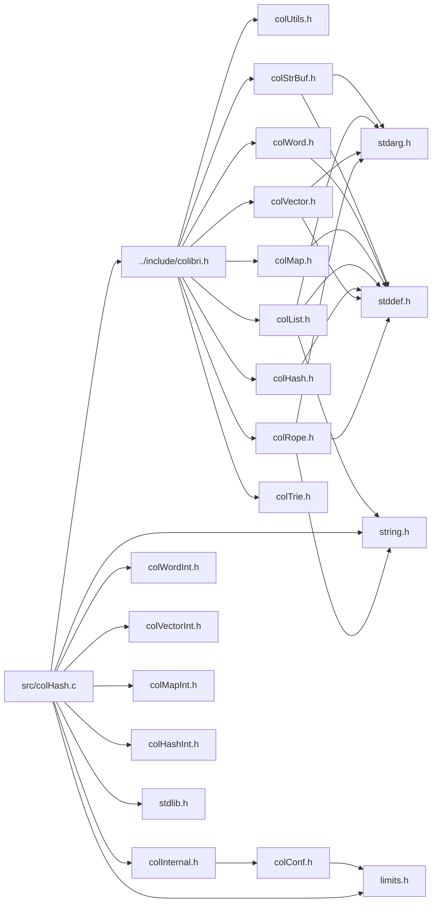

<a id="col_hash_8c"></a>
# File colHash.c

![][C++]

**Location**: `src/colHash.c`

This file implements the hash map handling features of Colibri.

Hash maps are an implementation of generic [Maps](group__map__words.md#group__map__words) that use key hashing and flat bucket arrays for string, integer and custom keys.


They are always mutable.


**See also**: [colHash.h](col_hash_8h.md#col_hash_8h), [colMap.h](col_map_8h.md#col_map_8h)

## Includes

* [../include/colibri.h](colibri_8h.md#colibri_8h)
* [colInternal.h](col_internal_8h.md#col_internal_8h)
* [colWordInt.h](col_word_int_8h.md#col_word_int_8h)
* [colVectorInt.h](col_vector_int_8h.md#col_vector_int_8h)
* [colMapInt.h](col_map_int_8h.md#col_map_int_8h)
* [colHashInt.h](col_hash_int_8h.md#col_hash_int_8h)
* <stdlib.h>
* <limits.h>
* <string.h>



## Hash Map Creation

<a id="group__hashmap__words_1ga83815df8c509dbf24974ed447ed5ad75"></a>
### Function Col\_NewStringHashMap

![][public]

```cpp
Col_Word Col_NewStringHashMap(size_t capacity)
```

Create a new string hash map word.

**Returns**:

The new word.


**Parameters**:

* size_t **capacity**: Initial bucket size. Rounded up to the next power of 2.

**Return type**: EXTERN [Col\_Word](col_word_8h.md#group__words_1gadb626f9e195212e4fdfba7df154ad043)

**References**:

* [AllocBuckets](col_hash_8c.md#group__hashmap__words_1ga19e08b164be41d9b09cd4e10ba33ae27)
* [AllocCells](col_gc_8c.md#group__alloc_1gaeec69115deeb3321bdfbb4e42119f806)
* [HASHMAP\_NBCELLS](col_hash_int_8h.md#group__hashmap__words_1ga3d9cbe4590e682edade0bff62397c5e5)
* [WORD\_STRHASHMAP\_INIT](col_hash_int_8h.md#group__strhashmap__words_1ga251196179071b3d43a2195f5a4063373)

<a id="group__hashmap__words_1ga21868cc2f614fe73e31690d5d233e0c9"></a>
### Function Col\_NewIntHashMap

![][public]

```cpp
Col_Word Col_NewIntHashMap(size_t capacity)
```

Create a new integer hash map word.

**Returns**:

The new word.


**Parameters**:

* size_t **capacity**: Initial bucket size. Rounded up to the next power of 2.

**Return type**: EXTERN [Col\_Word](col_word_8h.md#group__words_1gadb626f9e195212e4fdfba7df154ad043)

**References**:

* [AllocBuckets](col_hash_8c.md#group__hashmap__words_1ga19e08b164be41d9b09cd4e10ba33ae27)
* [AllocCells](col_gc_8c.md#group__alloc_1gaeec69115deeb3321bdfbb4e42119f806)
* [HASHMAP\_NBCELLS](col_hash_int_8h.md#group__hashmap__words_1ga3d9cbe4590e682edade0bff62397c5e5)
* [WORD\_INTHASHMAP\_INIT](col_hash_int_8h.md#group__inthashmap__words_1ga53503676dc5f75eb7894087cf53d8252)

<a id="group__hashmap__words_1ga9ebda3b577662e8b1dcf9a227d106f22"></a>
### Function Col\_CopyHashMap

![][public]

```cpp
Col_Word Col_CopyHashMap(Col_Word map)
```

Create a new hash map word from an existing one.

?> Only the hash map structure is copied, the contained words are not (i.e. this is not a deep copy).


**Returns**:

The new word.


**Side Effect**:

Source map content is frozen.

**Exceptions**:

* **[COL\_ERROR\_HASHMAP](colibri_8h.md#group__error_1gga729084542ed9eae62009a84d3379ef35aa2ae78a1c25af13ee9ba866d5cb501a1)**: [[T]](colibri_8h.md#group__error_1gga6dab009a0b8c4b4fa080cb9ba1859e9ea603a58b9d5bb16fde0708eb0767e4904) **map**: Not a hash map.

**Parameters**:

* [Col\_Word](col_word_8h.md#group__words_1gadb626f9e195212e4fdfba7df154ad043) **map**: Hash map to copy.

**Return type**: EXTERN [Col\_Word](col_word_8h.md#group__words_1gadb626f9e195212e4fdfba7df154ad043)

**References**:

* [AllocCells](col_gc_8c.md#group__alloc_1gaeec69115deeb3321bdfbb4e42119f806)
* [ASSERT](col_internal_8h.md#group__error_1gac22830a985e1daed0c9eadba8c6f606e)
* [Col\_MVectorFreeze](col_vector_8h.md#group__mvector__words_1ga1d93d2437dc1066b87d82d49aec779f1)
* [GET\_BUCKETS](col_hash_8c.md#group__hashmap__words_1ga51ac8e6197ed0e1100976539ca9c62b9)
* [HASHMAP\_NBCELLS](col_hash_int_8h.md#group__hashmap__words_1ga3d9cbe4590e682edade0bff62397c5e5)
* [TYPECHECK\_HASHMAP](col_hash_int_8h.md#group__hashmap__words_1gaabaaa46325ec29e8882ef1ec569687d2)
* [WORD\_CLEAR\_PINNED](col_word_int_8h.md#group__regular__words_1ga04a19fb132382d52fa42d3d3e4237f2f)
* [WORD\_HASHENTRY\_NEXT](col_hash_int_8h.md#group__mhashentry__words_1ga9f087b8c13513115c5e1b19c86fbe145)
* [WORD\_HASHMAP\_BUCKETS](col_hash_int_8h.md#group__hashmap__words_1gaa3913885cb3625fe8ba8582eb3323315)
* [WORD\_NIL](col_word_8h.md#group__words_1ga29e370264f4e5659ccc5be4de209f065)
* [WORD\_PINNED](col_word_int_8h.md#group__regular__words_1gad20cf13be09a354418d8615e6f2f2193)
* [WORD\_SET\_TYPEID](col_word_int_8h.md#group__predefined__words_1ga52822cf424704829e60b112fe03614b6)
* [WORD\_SYNONYM](col_word_int_8h.md#group__regular__words_1ga19cfddbcf0127f5088803cc68ddb8eaa)
* [WORD\_TYPE](col_word_int_8h.md#group__words_1ga014e27ea4160eb3845ac495a22c232f5)
* [WORD\_TYPE\_CUSTOM](col_word_int_8h.md#group__words_1ga8babfbc77291680db519873c91efdd4c)
* [WORD\_TYPE\_HASHENTRY](col_word_int_8h.md#group__words_1ga0ccfe6bc407371b3c2cde0a2da83f9fa)
* [WORD\_TYPE\_INTHASHENTRY](col_word_int_8h.md#group__words_1gab1a5b3b65a05c74cd3973db9dce4a781)
* [WORD\_TYPE\_INTHASHMAP](col_word_int_8h.md#group__words_1ga230c3d50685afa970c1e0da69feb5811)
* [WORD\_TYPE\_STRHASHMAP](col_word_int_8h.md#group__words_1ga4b4fdf9a2320675d8dd1dc29d0007564)
* [WORD\_TYPE\_VECTOR](col_word_int_8h.md#group__words_1gadf6c66e5c2f9fcdf213ae40d253c153f)

## Hash Map Accessors

<a id="group__hashmap__words_1ga7fe5b8f4de905e324ada5177527d483e"></a>
### Function Col\_HashMapGet

![][public]

```cpp
int Col_HashMapGet(Col_Word map, Col_Word key, Col_Word *valuePtr)
```

Get value mapped to the given key if present.

**Return values**:

* **0**: if the key wasn't found.
* **<>0**: if the key was found, in this case the value is returned through **valuePtr**.


**See also**: [Col\_MapGet](col_map_8h.md#group__map__words_1gabd075578f35ec7a706654e94aba281d9)

**Exceptions**:

* **[COL\_ERROR\_WORDHASHMAP](colibri_8h.md#group__error_1gga729084542ed9eae62009a84d3379ef35a5bc15b91b43b981992b031a43e8c3e8d)**: [[T]](colibri_8h.md#group__error_1gga6dab009a0b8c4b4fa080cb9ba1859e9ea603a58b9d5bb16fde0708eb0767e4904) **map**: Not a string or word-keyed hash map.

**Parameters**:

* [Col\_Word](col_word_8h.md#group__words_1gadb626f9e195212e4fdfba7df154ad043) **map**: Hash map to get entry for.
* [Col\_Word](col_word_8h.md#group__words_1gadb626f9e195212e4fdfba7df154ad043) **key**: Entry key. Can be any word type, including string, however it must match the actual type used by the map.
* [Col\_Word](col_word_8h.md#group__words_1gadb626f9e195212e4fdfba7df154ad043) * **valuePtr**: [out] Returned entry value, if found.

**Return type**: EXTERN int

**References**:

* [ASSERT](col_internal_8h.md#group__error_1gac22830a985e1daed0c9eadba8c6f606e)
* [COL\_HASHMAP](col_word_8h.md#group__words_1gae3509634e52a76014e96c2575b5d8092)
* [Col\_CustomHashMapType::compareKeysProc](struct_col___custom_hash_map_type.md#struct_col___custom_hash_map_type_1adecb961bbf29ef0ff4b37ed97309d59d)
* [CompareStrings](col_hash_8c.md#group__hashmap__words_1gacd46dc7644f9fb2e0a56e8a0b85c6763)
* [HashMapFindEntry](col_hash_8c.md#group__hashmap__words_1ga0c88b84075dfbde40bfc894ea158bdc8)
* [Col\_CustomHashMapType::hashProc](struct_col___custom_hash_map_type.md#struct_col___custom_hash_map_type_1a571294a9fa0b5e0241986efaf50f5b37)
* [HashString](col_hash_8c.md#group__hashmap__words_1ga5a354bdba1e95d6747bc07725902275c)
* [Col\_CustomHashMapType::type](struct_col___custom_hash_map_type.md#struct_col___custom_hash_map_type_1aea81519da7ec0622ec1a598637c4e488)
* [Col\_CustomWordType::type](struct_col___custom_word_type.md#struct_col___custom_word_type_1af9482efe5a6408bc622320619c3ccf9f)
* [TYPECHECK\_WORDHASHMAP](col_hash_int_8h.md#group__hashmap__words_1ga289fc116a48446f5acf7c8e24e6a4ac4)
* [WORD\_MAPENTRY\_VALUE](col_map_int_8h.md#group__mapentry__words_1gabad6806f2947f508a9786948c1663064)
* [WORD\_TYPE](col_word_int_8h.md#group__words_1ga014e27ea4160eb3845ac495a22c232f5)
* [WORD\_TYPE\_CUSTOM](col_word_int_8h.md#group__words_1ga8babfbc77291680db519873c91efdd4c)
* [WORD\_TYPE\_HASHENTRY](col_word_int_8h.md#group__words_1ga0ccfe6bc407371b3c2cde0a2da83f9fa)
* [WORD\_TYPE\_MHASHENTRY](col_word_int_8h.md#group__words_1ga4c79463f98f0ec9296451862e5d0b76c)
* [WORD\_TYPE\_STRHASHMAP](col_word_int_8h.md#group__words_1ga4b4fdf9a2320675d8dd1dc29d0007564)
* [WORD\_TYPEINFO](col_word_int_8h.md#group__custom__words_1gafc962791c45a5dd5bb034050444084be)

**Referenced by**:

* [Col\_MapGet](col_map_8h.md#group__map__words_1gabd075578f35ec7a706654e94aba281d9)

<a id="group__hashmap__words_1ga9c83b74f8b6dd17750f0c9be778bdc95"></a>
### Function Col\_IntHashMapGet

![][public]

```cpp
int Col_IntHashMapGet(Col_Word map, intptr_t key, Col_Word *valuePtr)
```

Get value mapped to the given integer key if present.

**Return values**:

* **0**: if the key wasn't found.
* **<>0**: if the key was found, in this case the value is returned through **valuePtr**.


**See also**: [Col\_IntMapGet](col_map_8h.md#group__map__words_1ga4f96f7436cc66537b05841c5b088eef2)

**Exceptions**:

* **[COL\_ERROR\_INTHASHMAP](colibri_8h.md#group__error_1gga729084542ed9eae62009a84d3379ef35a6adf7197e12916d0bdb78d890b43cf3d)**: [[T]](colibri_8h.md#group__error_1gga6dab009a0b8c4b4fa080cb9ba1859e9ea603a58b9d5bb16fde0708eb0767e4904) **map**: Not an integer-keyed hash map.

**Parameters**:

* [Col\_Word](col_word_8h.md#group__words_1gadb626f9e195212e4fdfba7df154ad043) **map**: Integer hash map to get entry for.
* intptr_t **key**: Integer entry key
* [Col\_Word](col_word_8h.md#group__words_1gadb626f9e195212e4fdfba7df154ad043) * **valuePtr**: [out] Returned entry value, if found.

**Return type**: EXTERN int

**References**:

* [ASSERT](col_internal_8h.md#group__error_1gac22830a985e1daed0c9eadba8c6f606e)
* [IntHashMapFindEntry](col_hash_8c.md#group__hashmap__words_1ga1ddc6ccf9196e70ad14895d5bc32ad2d)
* [TYPECHECK\_INTHASHMAP](col_hash_int_8h.md#group__inthashmap__words_1gab451eefab69078045d4b5e92c07350f1)
* [WORD\_MAPENTRY\_VALUE](col_map_int_8h.md#group__mapentry__words_1gabad6806f2947f508a9786948c1663064)
* [WORD\_TYPE](col_word_int_8h.md#group__words_1ga014e27ea4160eb3845ac495a22c232f5)
* [WORD\_TYPE\_INTHASHENTRY](col_word_int_8h.md#group__words_1gab1a5b3b65a05c74cd3973db9dce4a781)
* [WORD\_TYPE\_MINTHASHENTRY](col_word_int_8h.md#group__words_1ga1758f2fa0c44200f5782e548c5b33c7e)

**Referenced by**:

* [Col\_IntMapGet](col_map_8h.md#group__map__words_1ga4f96f7436cc66537b05841c5b088eef2)

<a id="group__hashmap__words_1ga5290a8ca2aeccdb481e46ca161dbafdf"></a>
### Function Col\_HashMapSet

![][public]

```cpp
int Col_HashMapSet(Col_Word map, Col_Word key, Col_Word value)
```

Map the value to the key, replacing any existing.

**Return values**:

* **0**: if an existing entry was updated with **value**.
* **<>0**: if a new entry was created with **key** and **value**.


**See also**: [Col\_MapSet](col_map_8h.md#group__map__words_1ga82b31e62df46ff382e18241bdcde49e3)

**Exceptions**:

* **[COL\_ERROR\_WORDHASHMAP](colibri_8h.md#group__error_1gga729084542ed9eae62009a84d3379ef35a5bc15b91b43b981992b031a43e8c3e8d)**: [[T]](colibri_8h.md#group__error_1gga6dab009a0b8c4b4fa080cb9ba1859e9ea603a58b9d5bb16fde0708eb0767e4904) **map**: Not a string or word-keyed hash map.

**Parameters**:

* [Col\_Word](col_word_8h.md#group__words_1gadb626f9e195212e4fdfba7df154ad043) **map**: Hash map to insert entry into.
* [Col\_Word](col_word_8h.md#group__words_1gadb626f9e195212e4fdfba7df154ad043) **key**: Entry key. Can be any word type, including string, however it must match the actual type used by the map.
* [Col\_Word](col_word_8h.md#group__words_1gadb626f9e195212e4fdfba7df154ad043) **value**: Entry value.

**Return type**: EXTERN int

**References**:

* [ASSERT](col_internal_8h.md#group__error_1gac22830a985e1daed0c9eadba8c6f606e)
* [COL\_HASHMAP](col_word_8h.md#group__words_1gae3509634e52a76014e96c2575b5d8092)
* [Col\_CustomHashMapType::compareKeysProc](struct_col___custom_hash_map_type.md#struct_col___custom_hash_map_type_1adecb961bbf29ef0ff4b37ed97309d59d)
* [CompareStrings](col_hash_8c.md#group__hashmap__words_1gacd46dc7644f9fb2e0a56e8a0b85c6763)
* [HashMapFindEntry](col_hash_8c.md#group__hashmap__words_1ga0c88b84075dfbde40bfc894ea158bdc8)
* [Col\_CustomHashMapType::hashProc](struct_col___custom_hash_map_type.md#struct_col___custom_hash_map_type_1a571294a9fa0b5e0241986efaf50f5b37)
* [HashString](col_hash_8c.md#group__hashmap__words_1ga5a354bdba1e95d6747bc07725902275c)
* [Col\_CustomHashMapType::type](struct_col___custom_hash_map_type.md#struct_col___custom_hash_map_type_1aea81519da7ec0622ec1a598637c4e488)
* [Col\_CustomWordType::type](struct_col___custom_word_type.md#struct_col___custom_word_type_1af9482efe5a6408bc622320619c3ccf9f)
* [TYPECHECK\_WORDHASHMAP](col_hash_int_8h.md#group__hashmap__words_1ga289fc116a48446f5acf7c8e24e6a4ac4)
* [WORD\_MAPENTRY\_VALUE](col_map_int_8h.md#group__mapentry__words_1gabad6806f2947f508a9786948c1663064)
* [WORD\_TYPE](col_word_int_8h.md#group__words_1ga014e27ea4160eb3845ac495a22c232f5)
* [WORD\_TYPE\_CUSTOM](col_word_int_8h.md#group__words_1ga8babfbc77291680db519873c91efdd4c)
* [WORD\_TYPE\_MHASHENTRY](col_word_int_8h.md#group__words_1ga4c79463f98f0ec9296451862e5d0b76c)
* [WORD\_TYPE\_STRHASHMAP](col_word_int_8h.md#group__words_1ga4b4fdf9a2320675d8dd1dc29d0007564)
* [WORD\_TYPEINFO](col_word_int_8h.md#group__custom__words_1gafc962791c45a5dd5bb034050444084be)

**Referenced by**:

* [Col\_MapSet](col_map_8h.md#group__map__words_1ga82b31e62df46ff382e18241bdcde49e3)

<a id="group__hashmap__words_1ga73aa4d8fc75a6f152c385e3a4bcdcb1c"></a>
### Function Col\_IntHashMapSet

![][public]

```cpp
int Col_IntHashMapSet(Col_Word map, intptr_t key, Col_Word value)
```

Map the value to the integer key, replacing any existing.

**Return values**:

* **0**: if an existing entry was updated with **value**.
* **<>0**: if a new entry was created with **key** and **value**.


**See also**: [Col\_IntMapSet](col_map_8h.md#group__map__words_1ga27a694b6de40e1a3af81379a7056754d)

**Exceptions**:

* **[COL\_ERROR\_INTHASHMAP](colibri_8h.md#group__error_1gga729084542ed9eae62009a84d3379ef35a6adf7197e12916d0bdb78d890b43cf3d)**: [[T]](colibri_8h.md#group__error_1gga6dab009a0b8c4b4fa080cb9ba1859e9ea603a58b9d5bb16fde0708eb0767e4904) **map**: Not an integer-keyed hash map.

**Parameters**:

* [Col\_Word](col_word_8h.md#group__words_1gadb626f9e195212e4fdfba7df154ad043) **map**: Integer hash map to insert entry into.
* intptr_t **key**: Integer entry key.
* [Col\_Word](col_word_8h.md#group__words_1gadb626f9e195212e4fdfba7df154ad043) **value**: Entry value.

**Return type**: EXTERN int

**References**:

* [ASSERT](col_internal_8h.md#group__error_1gac22830a985e1daed0c9eadba8c6f606e)
* [IntHashMapFindEntry](col_hash_8c.md#group__hashmap__words_1ga1ddc6ccf9196e70ad14895d5bc32ad2d)
* [TYPECHECK\_INTHASHMAP](col_hash_int_8h.md#group__inthashmap__words_1gab451eefab69078045d4b5e92c07350f1)
* [WORD\_MAPENTRY\_VALUE](col_map_int_8h.md#group__mapentry__words_1gabad6806f2947f508a9786948c1663064)
* [WORD\_TYPE](col_word_int_8h.md#group__words_1ga014e27ea4160eb3845ac495a22c232f5)
* [WORD\_TYPE\_MINTHASHENTRY](col_word_int_8h.md#group__words_1ga1758f2fa0c44200f5782e548c5b33c7e)

**Referenced by**:

* [Col\_IntMapSet](col_map_8h.md#group__map__words_1ga27a694b6de40e1a3af81379a7056754d)

<a id="group__hashmap__words_1ga4319b874a1524fcd008125db503a7f9c"></a>
### Function Col\_HashMapUnset

![][public]

```cpp
int Col_HashMapUnset(Col_Word map, Col_Word key)
```

Remove any value mapped to the given key.

**Return values**:

* **0**: if no entry matching **key** was found.
* **<>0**: if the existing entry was removed.


**See also**: [Col\_MapUnset](col_map_8h.md#group__map__words_1ga1f48ed3390f9a53cde268533a763e638)

**Exceptions**:

* **[COL\_ERROR\_WORDHASHMAP](colibri_8h.md#group__error_1gga729084542ed9eae62009a84d3379ef35a5bc15b91b43b981992b031a43e8c3e8d)**: [[T]](colibri_8h.md#group__error_1gga6dab009a0b8c4b4fa080cb9ba1859e9ea603a58b9d5bb16fde0708eb0767e4904) **map**: Not a string or word-keyed hash map.

**Parameters**:

* [Col\_Word](col_word_8h.md#group__words_1gadb626f9e195212e4fdfba7df154ad043) **map**: Hash map to remove entry from.
* [Col\_Word](col_word_8h.md#group__words_1gadb626f9e195212e4fdfba7df154ad043) **key**: Entry key. Can be any word type, including string, however it must match the actual type used by the map.

**Return type**: EXTERN int

**References**:

* [ASSERT](col_internal_8h.md#group__error_1gac22830a985e1daed0c9eadba8c6f606e)
* [COL\_HASHMAP](col_word_8h.md#group__words_1gae3509634e52a76014e96c2575b5d8092)
* [Col\_CustomHashMapType::compareKeysProc](struct_col___custom_hash_map_type.md#struct_col___custom_hash_map_type_1adecb961bbf29ef0ff4b37ed97309d59d)
* [CompareStrings](col_hash_8c.md#group__hashmap__words_1gacd46dc7644f9fb2e0a56e8a0b85c6763)
* [ConvertEntryToMutable](col_hash_8c.md#group__hashmap__words_1ga12e2f90ca22da78efd1d3e42d442a3e3)
* [GET\_BUCKETS](col_hash_8c.md#group__hashmap__words_1ga51ac8e6197ed0e1100976539ca9c62b9)
* [HASHENTRY\_HASH\_MASK](col_hash_int_8h.md#group__mhashentry__words_1ga1f31f4326456a1511d32accb096baa63)
* [Col\_CustomHashMapType::hashProc](struct_col___custom_hash_map_type.md#struct_col___custom_hash_map_type_1a571294a9fa0b5e0241986efaf50f5b37)
* [HashString](col_hash_8c.md#group__hashmap__words_1ga5a354bdba1e95d6747bc07725902275c)
* [Col\_CustomHashMapType::type](struct_col___custom_hash_map_type.md#struct_col___custom_hash_map_type_1aea81519da7ec0622ec1a598637c4e488)
* [Col\_CustomWordType::type](struct_col___custom_word_type.md#struct_col___custom_word_type_1af9482efe5a6408bc622320619c3ccf9f)
* [TYPECHECK\_WORDHASHMAP](col_hash_int_8h.md#group__hashmap__words_1ga289fc116a48446f5acf7c8e24e6a4ac4)
* [WORD\_HASHENTRY\_HASH](col_hash_int_8h.md#group__mhashentry__words_1ga54cafd113b5788e58294047e3e3cbe7c)
* [WORD\_HASHENTRY\_NEXT](col_hash_int_8h.md#group__mhashentry__words_1ga9f087b8c13513115c5e1b19c86fbe145)
* [WORD\_HASHMAP\_SIZE](col_hash_int_8h.md#group__hashmap__words_1gac639d1878d96d8bb8d825822bc104b8c)
* [WORD\_MAPENTRY\_KEY](col_map_int_8h.md#group__mapentry__words_1ga8664d15fae4553b47b658ac7ceb1443a)
* [WORD\_NIL](col_word_8h.md#group__words_1ga29e370264f4e5659ccc5be4de209f065)
* [WORD\_TYPE](col_word_int_8h.md#group__words_1ga014e27ea4160eb3845ac495a22c232f5)
* [WORD\_TYPE\_CUSTOM](col_word_int_8h.md#group__words_1ga8babfbc77291680db519873c91efdd4c)
* [WORD\_TYPE\_HASHENTRY](col_word_int_8h.md#group__words_1ga0ccfe6bc407371b3c2cde0a2da83f9fa)
* [WORD\_TYPE\_MHASHENTRY](col_word_int_8h.md#group__words_1ga4c79463f98f0ec9296451862e5d0b76c)
* [WORD\_TYPE\_NIL](col_word_int_8h.md#group__words_1ga1f4d1db7619649bb51aeddd67c8b242f)
* [WORD\_TYPE\_STRHASHMAP](col_word_int_8h.md#group__words_1ga4b4fdf9a2320675d8dd1dc29d0007564)
* [WORD\_TYPEINFO](col_word_int_8h.md#group__custom__words_1gafc962791c45a5dd5bb034050444084be)

**Referenced by**:

* [Col\_MapUnset](col_map_8h.md#group__map__words_1ga1f48ed3390f9a53cde268533a763e638)

<a id="group__hashmap__words_1gab060852e2fc2e645aee2179e678cbeb3"></a>
### Function Col\_IntHashMapUnset

![][public]

```cpp
int Col_IntHashMapUnset(Col_Word map, intptr_t key)
```

Remove any value mapped to the given integer key.

**Return values**:

* **0**: if no entry matching **key** was found.
* **<>0**: if the existing entry was removed.


**See also**: [Col\_IntMapUnset](col_map_8h.md#group__map__words_1gac2ae366ebe1ec3a4495128cb1400d1cf)

**Exceptions**:

* **[COL\_ERROR\_INTHASHMAP](colibri_8h.md#group__error_1gga729084542ed9eae62009a84d3379ef35a6adf7197e12916d0bdb78d890b43cf3d)**: [[T]](colibri_8h.md#group__error_1gga6dab009a0b8c4b4fa080cb9ba1859e9ea603a58b9d5bb16fde0708eb0767e4904) **map**: Not an integer-keyed hash map.

**Parameters**:

* [Col\_Word](col_word_8h.md#group__words_1gadb626f9e195212e4fdfba7df154ad043) **map**: Integer hash map to remove entry from.
* intptr_t **key**: Integer entry key.

**Return type**: EXTERN int

**References**:

* [ASSERT](col_internal_8h.md#group__error_1gac22830a985e1daed0c9eadba8c6f606e)
* [ConvertIntEntryToMutable](col_hash_8c.md#group__hashmap__words_1gace9fa4c1e18e28528ecbd57dc858cdda)
* [GET\_BUCKETS](col_hash_8c.md#group__hashmap__words_1ga51ac8e6197ed0e1100976539ca9c62b9)
* [RANDOMIZE\_KEY](col_hash_8c.md#group__hashmap__words_1ga8c37ced5912c36864e4c98eb4e7c5f4a)
* [TYPECHECK\_INTHASHMAP](col_hash_int_8h.md#group__inthashmap__words_1gab451eefab69078045d4b5e92c07350f1)
* [WORD\_HASHENTRY\_NEXT](col_hash_int_8h.md#group__mhashentry__words_1ga9f087b8c13513115c5e1b19c86fbe145)
* [WORD\_HASHMAP\_SIZE](col_hash_int_8h.md#group__hashmap__words_1gac639d1878d96d8bb8d825822bc104b8c)
* [WORD\_INTMAPENTRY\_KEY](col_map_int_8h.md#group__intmapentry__words_1ga89e26360d76aaad985afd89da56d1539)
* [WORD\_NIL](col_word_8h.md#group__words_1ga29e370264f4e5659ccc5be4de209f065)
* [WORD\_TYPE](col_word_int_8h.md#group__words_1ga014e27ea4160eb3845ac495a22c232f5)
* [WORD\_TYPE\_INTHASHENTRY](col_word_int_8h.md#group__words_1gab1a5b3b65a05c74cd3973db9dce4a781)
* [WORD\_TYPE\_MINTHASHENTRY](col_word_int_8h.md#group__words_1ga1758f2fa0c44200f5782e548c5b33c7e)
* [WORD\_TYPE\_NIL](col_word_int_8h.md#group__words_1ga1f4d1db7619649bb51aeddd67c8b242f)

**Referenced by**:

* [Col\_IntMapUnset](col_map_8h.md#group__map__words_1gac2ae366ebe1ec3a4495128cb1400d1cf)

## Hash Map Iteration

<a id="group__hashmap__words_1gac4de92fb8d4ed572c26f6907a6108005"></a>
### Function Col\_HashMapIterBegin

![][public]

```cpp
void Col_HashMapIterBegin(Col_MapIterator it, Col_Word map)
```

Initialize the map iterator so that it points to the first entry within the hash map.

**See also**: [Col\_MapIterBegin](col_map_8h.md#group__map__words_1gab8f4a0de6b264bbe59c332b41a22866a)

**Exceptions**:

* **[COL\_ERROR\_HASHMAP](colibri_8h.md#group__error_1gga729084542ed9eae62009a84d3379ef35aa2ae78a1c25af13ee9ba866d5cb501a1)**: [[T]](colibri_8h.md#group__error_1gga6dab009a0b8c4b4fa080cb9ba1859e9ea603a58b9d5bb16fde0708eb0767e4904) **map**: Not a hash map.

**Parameters**:

* [Col\_MapIterator](col_map_8h.md#group__map__words_1ga33d331116aff3f3d03a231ccbbce40c2) **it**: Iterator to initialize.
* [Col\_Word](col_word_8h.md#group__words_1gadb626f9e195212e4fdfba7df154ad043) **map**: Hash map to iterate over.

**Return type**: EXTERN void

**References**:

* [ASSERT](col_internal_8h.md#group__error_1gac22830a985e1daed0c9eadba8c6f606e)
* [Col\_MapIterSetNull](col_map_8h.md#group__map__words_1ga3629bc2a457ae5a9ab57ab1f74ee0223)
* [Col\_MapSize](col_map_8h.md#group__map__words_1gaae4f3cbf8a5aedc78929bc2364440aac)
* [GET\_BUCKETS](col_hash_8c.md#group__hashmap__words_1ga51ac8e6197ed0e1100976539ca9c62b9)
* [TYPECHECK\_HASHMAP](col_hash_int_8h.md#group__hashmap__words_1gaabaaa46325ec29e8882ef1ec569687d2)
* [WORD\_NIL](col_word_8h.md#group__words_1ga29e370264f4e5659ccc5be4de209f065)

**Referenced by**:

* [Col\_MapIterBegin](col_map_8h.md#group__map__words_1gab8f4a0de6b264bbe59c332b41a22866a)

<a id="group__hashmap__words_1ga7f4cdf033cec55efd5d6c7704176dfc5"></a>
### Function Col\_HashMapIterFind

![][public]

```cpp
void Col_HashMapIterFind(Col_MapIterator it, Col_Word map, Col_Word key, int *createPtr)
```

Initialize the map iterator so that it points to the entry with the given key within the hash map.

**See also**: [Col\_MapIterFind](col_map_8h.md#group__map__words_1gaa925d7d32221bc826e9717930c2602e1)

**Exceptions**:

* **[COL\_ERROR\_WORDHASHMAP](colibri_8h.md#group__error_1gga729084542ed9eae62009a84d3379ef35a5bc15b91b43b981992b031a43e8c3e8d)**: [[T]](colibri_8h.md#group__error_1gga6dab009a0b8c4b4fa080cb9ba1859e9ea603a58b9d5bb16fde0708eb0767e4904) **map**: Not a string or word-keyed hash map.

**Parameters**:

* [Col\_MapIterator](col_map_8h.md#group__map__words_1ga33d331116aff3f3d03a231ccbbce40c2) **it**: Iterator to initialize.
* [Col\_Word](col_word_8h.md#group__words_1gadb626f9e195212e4fdfba7df154ad043) **map**: Hash map to iterate over.
* [Col\_Word](col_word_8h.md#group__words_1gadb626f9e195212e4fdfba7df154ad043) **key**: Entry key. Can be any word type, including string, however it must match the actual type used by the map.
* int * **createPtr**: [in,out] If non-NULL, whether to create entry if absent on input, and whether an entry was created on output.

**Return type**: EXTERN void

**References**:

* [ASSERT](col_internal_8h.md#group__error_1gac22830a985e1daed0c9eadba8c6f606e)
* [COL\_HASHMAP](col_word_8h.md#group__words_1gae3509634e52a76014e96c2575b5d8092)
* [Col\_MapIterSetNull](col_map_8h.md#group__map__words_1ga3629bc2a457ae5a9ab57ab1f74ee0223)
* [Col\_CustomHashMapType::compareKeysProc](struct_col___custom_hash_map_type.md#struct_col___custom_hash_map_type_1adecb961bbf29ef0ff4b37ed97309d59d)
* [CompareStrings](col_hash_8c.md#group__hashmap__words_1gacd46dc7644f9fb2e0a56e8a0b85c6763)
* [HashMapFindEntry](col_hash_8c.md#group__hashmap__words_1ga0c88b84075dfbde40bfc894ea158bdc8)
* [Col\_CustomHashMapType::hashProc](struct_col___custom_hash_map_type.md#struct_col___custom_hash_map_type_1a571294a9fa0b5e0241986efaf50f5b37)
* [HashString](col_hash_8c.md#group__hashmap__words_1ga5a354bdba1e95d6747bc07725902275c)
* [Col\_CustomHashMapType::type](struct_col___custom_hash_map_type.md#struct_col___custom_hash_map_type_1aea81519da7ec0622ec1a598637c4e488)
* [Col\_CustomWordType::type](struct_col___custom_word_type.md#struct_col___custom_word_type_1af9482efe5a6408bc622320619c3ccf9f)
* [TYPECHECK\_WORDHASHMAP](col_hash_int_8h.md#group__hashmap__words_1ga289fc116a48446f5acf7c8e24e6a4ac4)
* [WORD\_TYPE](col_word_int_8h.md#group__words_1ga014e27ea4160eb3845ac495a22c232f5)
* [WORD\_TYPE\_CUSTOM](col_word_int_8h.md#group__words_1ga8babfbc77291680db519873c91efdd4c)
* [WORD\_TYPE\_STRHASHMAP](col_word_int_8h.md#group__words_1ga4b4fdf9a2320675d8dd1dc29d0007564)
* [WORD\_TYPEINFO](col_word_int_8h.md#group__custom__words_1gafc962791c45a5dd5bb034050444084be)

**Referenced by**:

* [Col\_MapIterFind](col_map_8h.md#group__map__words_1gaa925d7d32221bc826e9717930c2602e1)

<a id="group__hashmap__words_1ga6ffef52a7e4127f837ac680cfd08a855"></a>
### Function Col\_IntHashMapIterFind

![][public]

```cpp
void Col_IntHashMapIterFind(Col_MapIterator it, Col_Word map, intptr_t key, int *createPtr)
```

Initialize the map iterator so that it points to the entry with the given integer key within the integer hash map.

**See also**: [Col\_IntMapIterFind](col_map_8h.md#group__map__words_1ga8c332381607b0dc828b4aa96fa8f1a12)

**Exceptions**:

* **[COL\_ERROR\_INTHASHMAP](colibri_8h.md#group__error_1gga729084542ed9eae62009a84d3379ef35a6adf7197e12916d0bdb78d890b43cf3d)**: [[T]](colibri_8h.md#group__error_1gga6dab009a0b8c4b4fa080cb9ba1859e9ea603a58b9d5bb16fde0708eb0767e4904) **map**: Not an integer-keyed hash map.

**Parameters**:

* [Col\_MapIterator](col_map_8h.md#group__map__words_1ga33d331116aff3f3d03a231ccbbce40c2) **it**: Iterator to initialize.
* [Col\_Word](col_word_8h.md#group__words_1gadb626f9e195212e4fdfba7df154ad043) **map**: Integer hash map to iterate over.
* intptr_t **key**: Integer entry key.
* int * **createPtr**: [in,out] If non-NULL, whether to create entry if absent on input, and whether an entry was created on output.

**Return type**: EXTERN void

**References**:

* [Col\_MapIterSetNull](col_map_8h.md#group__map__words_1ga3629bc2a457ae5a9ab57ab1f74ee0223)
* [IntHashMapFindEntry](col_hash_8c.md#group__hashmap__words_1ga1ddc6ccf9196e70ad14895d5bc32ad2d)
* [TYPECHECK\_INTHASHMAP](col_hash_int_8h.md#group__inthashmap__words_1gab451eefab69078045d4b5e92c07350f1)

**Referenced by**:

* [Col\_IntMapIterFind](col_map_8h.md#group__map__words_1ga8c332381607b0dc828b4aa96fa8f1a12)

<a id="group__hashmap__words_1ga828aeae1d46d8fe91fa344bf0fac3265"></a>
### Function Col\_HashMapIterSetValue

![][public]

```cpp
void Col_HashMapIterSetValue(Col_MapIterator it, Col_Word value)
```

Set value of hash map iterator.

**See also**: [Col\_MapIterSetValue](col_map_8h.md#group__map__words_1ga8c5d3a82b6cb5b7af6f16ebed863736f)

**Exceptions**:

* **[COL\_ERROR\_MAPITER](colibri_8h.md#group__error_1gga729084542ed9eae62009a84d3379ef35aa66f57346b0a9eac571308e75fb1f8ec)**: [[T]](colibri_8h.md#group__error_1gga6dab009a0b8c4b4fa080cb9ba1859e9ea603a58b9d5bb16fde0708eb0767e4904) **it**: Invalid map iterator.
* **[COL\_ERROR\_HASHMAP](colibri_8h.md#group__error_1gga729084542ed9eae62009a84d3379ef35aa2ae78a1c25af13ee9ba866d5cb501a1)**: [[T]](colibri_8h.md#group__error_1gga6dab009a0b8c4b4fa080cb9ba1859e9ea603a58b9d5bb16fde0708eb0767e4904) **[Col\_MapIterMap(it)](col_map_8h.md#group__map__words_1gac6f818f3c753f4e2668367155fa42686)**: Not a hash map.
* **[COL\_ERROR\_MAPITER\_END](colibri_8h.md#group__error_1gga729084542ed9eae62009a84d3379ef35a1a834ed5a623ccf3120ccec5d0d60653)**: [[V]](colibri_8h.md#group__error_1gga6dab009a0b8c4b4fa080cb9ba1859e9ea65d5e7232c82ae6972ac56f386a32fc9) **it**: Map iterator at end.

**Parameters**:

* [Col\_MapIterator](col_map_8h.md#group__map__words_1ga33d331116aff3f3d03a231ccbbce40c2) **it**: Map iterator to set value for.
* [Col\_Word](col_word_8h.md#group__words_1gadb626f9e195212e4fdfba7df154ad043) **value**: Value to set.

**Return type**: EXTERN void

**References**:

* [ASSERT](col_internal_8h.md#group__error_1gac22830a985e1daed0c9eadba8c6f606e)
* [ConvertEntryToMutable](col_hash_8c.md#group__hashmap__words_1ga12e2f90ca22da78efd1d3e42d442a3e3)
* [ConvertIntEntryToMutable](col_hash_8c.md#group__hashmap__words_1gace9fa4c1e18e28528ecbd57dc858cdda)
* [GET\_BUCKETS](col_hash_8c.md#group__hashmap__words_1ga51ac8e6197ed0e1100976539ca9c62b9)
* [TYPECHECK\_HASHMAP](col_hash_int_8h.md#group__hashmap__words_1gaabaaa46325ec29e8882ef1ec569687d2)
* [TYPECHECK\_MAPITER](col_map_int_8h.md#group__mapentry__words_1ga1ac9e9b70a28fd5385c1c5fb95494a2b)
* [VALUECHECK\_MAPITER](col_map_int_8h.md#group__mapentry__words_1ga4e477eb4ded0e97fcfa10c0e01eb7ead)
* [WORD\_MAPENTRY\_VALUE](col_map_int_8h.md#group__mapentry__words_1gabad6806f2947f508a9786948c1663064)
* [WORD\_TYPE](col_word_int_8h.md#group__words_1ga014e27ea4160eb3845ac495a22c232f5)
* [WORD\_TYPE\_CUSTOM](col_word_int_8h.md#group__words_1ga8babfbc77291680db519873c91efdd4c)
* [WORD\_TYPE\_HASHENTRY](col_word_int_8h.md#group__words_1ga0ccfe6bc407371b3c2cde0a2da83f9fa)
* [WORD\_TYPE\_INTHASHENTRY](col_word_int_8h.md#group__words_1gab1a5b3b65a05c74cd3973db9dce4a781)
* [WORD\_TYPE\_INTHASHMAP](col_word_int_8h.md#group__words_1ga230c3d50685afa970c1e0da69feb5811)
* [WORD\_TYPE\_MHASHENTRY](col_word_int_8h.md#group__words_1ga4c79463f98f0ec9296451862e5d0b76c)
* [WORD\_TYPE\_MINTHASHENTRY](col_word_int_8h.md#group__words_1ga1758f2fa0c44200f5782e548c5b33c7e)
* [WORD\_TYPE\_STRHASHMAP](col_word_int_8h.md#group__words_1ga4b4fdf9a2320675d8dd1dc29d0007564)

**Referenced by**:

* [Col\_MapIterSetValue](col_map_8h.md#group__map__words_1ga8c5d3a82b6cb5b7af6f16ebed863736f)

<a id="group__hashmap__words_1gaedf119c614a8b135c7cd418a3994c184"></a>
### Function Col\_HashMapIterNext

![][public]

```cpp
void Col_HashMapIterNext(Col_MapIterator it)
```

Move the iterator to the next element.

**See also**: [Col\_MapIterNext](col_map_8h.md#group__map__words_1ga961449849237659a09dbf4cae436e38c)

**Exceptions**:

* **[COL\_ERROR\_MAPITER](colibri_8h.md#group__error_1gga729084542ed9eae62009a84d3379ef35aa66f57346b0a9eac571308e75fb1f8ec)**: [[T]](colibri_8h.md#group__error_1gga6dab009a0b8c4b4fa080cb9ba1859e9ea603a58b9d5bb16fde0708eb0767e4904) **it**: Invalid map iterator.
* **[COL\_ERROR\_HASHMAP](colibri_8h.md#group__error_1gga729084542ed9eae62009a84d3379ef35aa2ae78a1c25af13ee9ba866d5cb501a1)**: [[T]](colibri_8h.md#group__error_1gga6dab009a0b8c4b4fa080cb9ba1859e9ea603a58b9d5bb16fde0708eb0767e4904) **[Col\_MapIterMap(it)](col_map_8h.md#group__map__words_1gac6f818f3c753f4e2668367155fa42686)**: Not a hash map.
* **[COL\_ERROR\_MAPITER\_END](colibri_8h.md#group__error_1gga729084542ed9eae62009a84d3379ef35a1a834ed5a623ccf3120ccec5d0d60653)**: [[V]](colibri_8h.md#group__error_1gga6dab009a0b8c4b4fa080cb9ba1859e9ea65d5e7232c82ae6972ac56f386a32fc9) **it**: Map iterator at end.

**Parameters**:

* [Col\_MapIterator](col_map_8h.md#group__map__words_1ga33d331116aff3f3d03a231ccbbce40c2) **it**: The iterator to move.

**Return type**: EXTERN void

**References**:

* [ASSERT](col_internal_8h.md#group__error_1gac22830a985e1daed0c9eadba8c6f606e)
* [GET\_BUCKETS](col_hash_8c.md#group__hashmap__words_1ga51ac8e6197ed0e1100976539ca9c62b9)
* [TYPECHECK\_HASHMAP](col_hash_int_8h.md#group__hashmap__words_1gaabaaa46325ec29e8882ef1ec569687d2)
* [TYPECHECK\_MAPITER](col_map_int_8h.md#group__mapentry__words_1ga1ac9e9b70a28fd5385c1c5fb95494a2b)
* [VALUECHECK\_MAPITER](col_map_int_8h.md#group__mapentry__words_1ga4e477eb4ded0e97fcfa10c0e01eb7ead)
* [WORD\_HASHENTRY\_NEXT](col_hash_int_8h.md#group__mhashentry__words_1ga9f087b8c13513115c5e1b19c86fbe145)
* [WORD\_NIL](col_word_8h.md#group__words_1ga29e370264f4e5659ccc5be4de209f065)
* [WORD\_TYPE](col_word_int_8h.md#group__words_1ga014e27ea4160eb3845ac495a22c232f5)
* [WORD\_TYPE\_HASHENTRY](col_word_int_8h.md#group__words_1ga0ccfe6bc407371b3c2cde0a2da83f9fa)
* [WORD\_TYPE\_INTHASHENTRY](col_word_int_8h.md#group__words_1gab1a5b3b65a05c74cd3973db9dce4a781)
* [WORD\_TYPE\_MHASHENTRY](col_word_int_8h.md#group__words_1ga4c79463f98f0ec9296451862e5d0b76c)
* [WORD\_TYPE\_MINTHASHENTRY](col_word_int_8h.md#group__words_1ga1758f2fa0c44200f5782e548c5b33c7e)

**Referenced by**:

* [Col\_MapIterNext](col_map_8h.md#group__map__words_1ga961449849237659a09dbf4cae436e38c)

## Custom Hash Map Creation

<a id="group__customhashmap__words_1gad516fa9041eb514e2c5193eb5d958f0e"></a>
### Function Col\_NewCustomHashMap

![][public]

```cpp
Col_Word Col_NewCustomHashMap(Col_CustomHashMapType *type, size_t capacity, size_t size, void **dataPtr)
```

Create a new custom hash map word.

**Returns**:

A new custom hash map word of the given size and capacity.


**Parameters**:

* [Col\_CustomHashMapType](struct_col___custom_hash_map_type.md#struct_col___custom_hash_map_type) * **type**: The hash map word type.
* size_t **capacity**: Initial bucket size. Rounded up to the next power of 2.
* size_t **size**: Size of custom data.
* void ** **dataPtr**: [out] Points to the allocated custom data.

**Return type**: EXTERN [Col\_Word](col_word_8h.md#group__words_1gadb626f9e195212e4fdfba7df154ad043)

**References**:

* [AllocBuckets](col_hash_8c.md#group__hashmap__words_1ga19e08b164be41d9b09cd4e10ba33ae27)
* [AllocCells](col_gc_8c.md#group__alloc_1gaeec69115deeb3321bdfbb4e42119f806)
* [ASSERT](col_internal_8h.md#group__error_1gac22830a985e1daed0c9eadba8c6f606e)
* [COL\_HASHMAP](col_word_8h.md#group__words_1gae3509634e52a76014e96c2575b5d8092)
* [CUSTOMHASHMAP\_HEADER\_SIZE](col_hash_int_8h.md#group__customhashmap__words_1ga983e7c0095b8a45a118d43878c885814)
* [AddressRange::size](struct_address_range.md#struct_address_range_1a80783f530919686945d93eb7b1e25623)
* [Col\_CustomHashMapType::type](struct_col___custom_hash_map_type.md#struct_col___custom_hash_map_type_1aea81519da7ec0622ec1a598637c4e488)
* [Col\_CustomWordType::type](struct_col___custom_word_type.md#struct_col___custom_word_type_1af9482efe5a6408bc622320619c3ccf9f)
* [WORD\_CUSTOM\_SIZE](col_word_int_8h.md#group__custom__words_1ga2610704afbab6a5ec38e561f17dde6ea)
* [WORD\_HASHMAP\_INIT](col_hash_int_8h.md#group__customhashmap__words_1gaed8104676b6b22313024cdc8c93bfe7f)

**Referenced by**:

* [Col\_NewCustomWord](col_word_8h.md#group__custom__words_1gaf9a6d324967159ae7abeb41a3d59cc79)

## Key Hashing

For each entry in a hash map, an integer hash value is computed from the key, and this hash value is used to select a "bucket", i.e. an insertion point in a dynamic array. As several entries with distinct keys can share a single bucket, their keys are compared against the searched key until the correct entry is found or not.


The choice of a good hashing algorithm is crucial for hash table performances. This algorithm must minimize collisions. A collision occurs when two distinct keys give the same hash value or end up in the same bucket.


**Integer keys**:

Integer keys are hashed by multiplying to a large prime number to get a pseudorandom distribution (see [RANDOMIZE\_KEY](col_hash_8c.md#group__hashmap__words_1ga8c37ced5912c36864e4c98eb4e7c5f4a)).


**String keys**:

String keys are hashed using the same algorithm as Tcl, i.e. a cumulative shift+add of character codepoints (see [STRING\_HASH](col_hash_8c.md#group__hashmap__words_1ga641a46d20b8a54f4b76d72a5263c4df5), [HashChunkProc()](col_hash_8c.md#group__hashmap__words_1gad45bb2e3e346da8b00d4f4c2ac852877), [HashString()](col_hash_8c.md#group__hashmap__words_1ga5a354bdba1e95d6747bc07725902275c)).


**Custom keys**:

Custom keys are hashed using a custom hash proc as well as a custom key comparison proc (see [Col\_CustomHashMapType()](struct_col___custom_hash_map_type.md#struct_col___custom_hash_map_type), [Col\_HashProc()](col_hash_8h.md#group__customhashmap__words_1gac6b7003867d2534bcc1848e410c05458), [Col\_HashCompareKeysProc()](col_hash_8h.md#group__customhashmap__words_1gae157152eec296221c971af03b35d39fa)).

<a id="group__hashmap__words_1ga8c37ced5912c36864e4c98eb4e7c5f4a"></a>
### Macro RANDOMIZE\_KEY

![][public]

```cpp
#define RANDOMIZE_KEY (((uintptr_t) (i))*1610612741)( i )
```

Integer key "randomization" by multiplication with a large prime.

Given that multiplication by an odd number is reversible on 2's complement integer representations, this guarantees no collision.


**Parameters**:

* **i**: Integer value to randomize.


<a id="group__hashmap__words_1ga641a46d20b8a54f4b76d72a5263c4df5"></a>
### Macro STRING\_HASH

![][public]

```cpp
#define STRING_HASH     (hash) += ((hash)<<3)+(c)( hash ,c )
```

String hash value computation.

Uses the same algorithm as Tcl's string hash tables (HashStringKey).


**Parameters**:

* **hash**: Hash value.
* **c**: Character codepoint.


**Side Effect**:

Value of variable **hash** is modified.


**See also**: [HashChunkProc](col_hash_8c.md#group__hashmap__words_1gad45bb2e3e346da8b00d4f4c2ac852877)


<a id="group__hashmap__words_1gad45bb2e3e346da8b00d4f4c2ac852877"></a>
### Function HashChunkProc

![][private]
![][static]

```cpp
static int HashChunkProc(size_t index, size_t length, size_t number, const Col_RopeChunk *chunks, Col_ClientData clientData)
```

Rope traversal proc that computes its hash value.

Called on [Col\_TraverseRopeChunks()](col_rope_8h.md#group__rope__words_1ga1a0bffff5bb042717914fadb3e8501bb) by [HashString()](col_hash_8c.md#group__hashmap__words_1ga5a354bdba1e95d6747bc07725902275c). Follows [Col\_RopeChunksTraverseProc()](col_rope_8h.md#group__rope__words_1ga8a4ef8b6e6f6aa8d863dad85c2f1b2bd) signature.


**Returns**:

Always 0.


**See also**: [STRING\_HASH](col_hash_8c.md#group__hashmap__words_1ga641a46d20b8a54f4b76d72a5263c4df5), [HashString](col_hash_8c.md#group__hashmap__words_1ga5a354bdba1e95d6747bc07725902275c)


**Parameters**:

* size_t **index**: Rope-relative index where chunks begin.
* size_t **length**: Length of chunks.
* size_t **number**: Number of chunks. Always 1.
* const [Col\_RopeChunk](struct_col___rope_chunk.md#struct_col___rope_chunk) * **chunks**: Array of chunks. First chunk never NULL.
* [Col\_ClientData](colibri_8h.md#group__basic__types_1ga52e127a5c635bcb88f252efd210ca1a5) **clientData**: [in,out] Points to the **uintptr_t** hash value.

**Return type**: int

**References**:

* [ASSERT](col_internal_8h.md#group__error_1gac22830a985e1daed0c9eadba8c6f606e)
* [COL\_CHAR\_GET](colibri_8h.md#group__strings_1ga9ac1e66190e6ee8fe700d14e0f47e45c)
* [COL\_CHAR\_NEXT](colibri_8h.md#group__strings_1gaf2cdba8d2bfb4a403ef3acc98da01b51)
* [Col\_RopeChunk::data](struct_col___rope_chunk.md#struct_col___rope_chunk_1a625062993f256bd911a0341dbb4c495f)
* [Col\_RopeChunk::format](struct_col___rope_chunk.md#struct_col___rope_chunk_1ac5170cd8ca17351bbe1b3e5c70317084)
* [STRING\_HASH](col_hash_8c.md#group__hashmap__words_1ga641a46d20b8a54f4b76d72a5263c4df5)

**Referenced by**:

* [HashString](col_hash_8c.md#group__hashmap__words_1ga5a354bdba1e95d6747bc07725902275c)

<a id="group__hashmap__words_1ga5a354bdba1e95d6747bc07725902275c"></a>
### Function HashString

![][private]
![][static]

```cpp
static uintptr_t HashString(Col_Word map, Col_Word key)
```

Compute a string key hash value.

Uses [Col\_TraverseRopeChunks()](col_rope_8h.md#group__rope__words_1ga1a0bffff5bb042717914fadb3e8501bb) with traversal proc [HashChunkProc()](col_hash_8c.md#group__hashmap__words_1gad45bb2e3e346da8b00d4f4c2ac852877). Follows [Col\_HashProc()](col_hash_8h.md#group__customhashmap__words_1gac6b7003867d2534bcc1848e410c05458) signature.


**Returns**:

The key hash value.


**See also**: [HashChunkProc](col_hash_8c.md#group__hashmap__words_1gad45bb2e3e346da8b00d4f4c2ac852877)


**Parameters**:

* [Col\_Word](col_word_8h.md#group__words_1gadb626f9e195212e4fdfba7df154ad043) **map**: Hash map the key belongs to.
* [Col\_Word](col_word_8h.md#group__words_1gadb626f9e195212e4fdfba7df154ad043) **key**: String key to generate hash value for.

**Return type**: uintptr_t

**References**:

* [ASSERT](col_internal_8h.md#group__error_1gac22830a985e1daed0c9eadba8c6f606e)
* [COL\_STRING](col_word_8h.md#group__words_1ga656318950fbb10969668166b3f8d6c1c)
* [Col\_TraverseRopeChunks](col_rope_8h.md#group__rope__words_1ga1a0bffff5bb042717914fadb3e8501bb)
* [Col\_WordType](col_word_8h.md#group__words_1gab0f27c794b1e7ed60b537e2ce94b4408)
* [HashChunkProc](col_hash_8c.md#group__hashmap__words_1gad45bb2e3e346da8b00d4f4c2ac852877)

**Referenced by**:

* [Col\_HashMapGet](col_hash_8h.md#group__hashmap__words_1ga7fe5b8f4de905e324ada5177527d483e)
* [Col\_HashMapIterFind](col_hash_8h.md#group__hashmap__words_1ga7f4cdf033cec55efd5d6c7704176dfc5)
* [Col\_HashMapSet](col_hash_8h.md#group__hashmap__words_1ga5290a8ca2aeccdb481e46ca161dbafdf)
* [Col\_HashMapUnset](col_hash_8h.md#group__hashmap__words_1ga4319b874a1524fcd008125db503a7f9c)

<a id="group__hashmap__words_1gacd46dc7644f9fb2e0a56e8a0b85c6763"></a>
### Function CompareStrings

![][private]
![][static]

```cpp
static int CompareStrings(Col_Word map, Col_Word key1, Col_Word key2)
```

Compare string hash keys.

Follows [Col\_HashCompareKeysProc()](col_hash_8h.md#group__customhashmap__words_1gae157152eec296221c971af03b35d39fa) signature.


**Return values**:

* **<0**: if **key1** is less than **key2**.
* **>0**: if **key1** is greater than **key2**.
* **0**: if both keys are equal.


**Parameters**:

* [Col\_Word](col_word_8h.md#group__words_1gadb626f9e195212e4fdfba7df154ad043) **map**: Hash map the keys belong to.
* [Col\_Word](col_word_8h.md#group__words_1gadb626f9e195212e4fdfba7df154ad043) **key1**: First string key to compare.
* [Col\_Word](col_word_8h.md#group__words_1gadb626f9e195212e4fdfba7df154ad043) **key2**: Second string key to compare.

**Return type**: int

**References**:

* [ASSERT](col_internal_8h.md#group__error_1gac22830a985e1daed0c9eadba8c6f606e)
* [Col\_CompareRopes](col_rope_8h.md#group__rope__words_1ga48f2eb5b9cc86ff959c7b85827c3e1b7)
* [COL\_STRING](col_word_8h.md#group__words_1ga656318950fbb10969668166b3f8d6c1c)
* [Col\_WordType](col_word_8h.md#group__words_1gab0f27c794b1e7ed60b537e2ce94b4408)

**Referenced by**:

* [Col\_HashMapGet](col_hash_8h.md#group__hashmap__words_1ga7fe5b8f4de905e324ada5177527d483e)
* [Col\_HashMapIterFind](col_hash_8h.md#group__hashmap__words_1ga7f4cdf033cec55efd5d6c7704176dfc5)
* [Col\_HashMapSet](col_hash_8h.md#group__hashmap__words_1ga5290a8ca2aeccdb481e46ca161dbafdf)
* [Col\_HashMapUnset](col_hash_8h.md#group__hashmap__words_1ga4319b874a1524fcd008125db503a7f9c)

## Buckets

**Bucket storage**:

Buckets are stored as flat arrays. The bucket index is computed from the hash value. Bucket size is always a power of 2, so we use the lower bits of the hash value to select the bucket index.


**Growth and rehashing**:

When two entries end up in the same bucket, there is a collision. When the map exceeds a certain size (see [LOAD\_FACTOR](col_hash_8c.md#group__hashmap__words_1ga846f78d98a30c431ef3a4d570e657913)), the table is resized (see [GROW\_FACTOR](col_hash_8c.md#group__hashmap__words_1gad4269d63d4c2964653f5c03689ac3799)) and entries are rehashed (all entries are moved from the old bucket container to the new one according to their hash value, see [GrowHashMap()](col_hash_8c.md#group__hashmap__words_1ga695416e52176dc22863ffc2e36f9d9bb) and [GrowIntHashMap()](col_hash_8c.md#group__hashmap__words_1ga65bb60fab52dac94df55edd80a5300de)).


Given that hash entries store high order bits of the hash value (all but the lower byte), this means that we can get back the full hash value by combining these high bits with the bucket index when the bucket size is at least one byte wide (see [WORD\_HASHENTRY\_HASH](col_hash_int_8h.md#group__mhashentry__words_1ga54cafd113b5788e58294047e3e3cbe7c)). This saves having to recompute the hash value during rehashing.

<a id="group__hashmap__words_1ga846f78d98a30c431ef3a4d570e657913"></a>
### Macro LOAD\_FACTOR

![][public]

```cpp
#define LOAD_FACTOR 1
```

Grow bucket container when size exceeds bucket size times this load factor.

**See also**: [GrowHashMap](col_hash_8c.md#group__hashmap__words_1ga695416e52176dc22863ffc2e36f9d9bb), [GrowIntHashMap](col_hash_8c.md#group__hashmap__words_1ga65bb60fab52dac94df55edd80a5300de)


<a id="group__hashmap__words_1gad4269d63d4c2964653f5c03689ac3799"></a>
### Macro GROW\_FACTOR

![][public]

```cpp
#define GROW_FACTOR 4
```

When growing bucket container, multiply current size by this grow factor.

**See also**: [GrowHashMap](col_hash_8c.md#group__hashmap__words_1ga695416e52176dc22863ffc2e36f9d9bb), [GrowIntHashMap](col_hash_8c.md#group__hashmap__words_1ga65bb60fab52dac94df55edd80a5300de)


<a id="group__hashmap__words_1ga51ac8e6197ed0e1100976539ca9c62b9"></a>
### Macro GET\_BUCKETS

![][public]

```cpp
#define GET_BUCKETS( map ,mutable ,nbBuckets ,buckets )
```

Bucket access.

Get bucket array regardless of whether it is stored in static space or in a separate vector word.


**Parameters**:

* **map**: Hash map to get bucket array for.
* **mutable**: If true, ensure that entry is mutable.
* **nbBuckets**: Size of bucket array.
* **buckets**: Bucket array.


<a id="group__hashmap__words_1ga695416e52176dc22863ffc2e36f9d9bb"></a>
### Function GrowHashMap

![][private]
![][static]

```cpp
static int GrowHashMap(Col_Word map, Col_HashProc hashProc)
```

Resize a hash map bucket container.

Size won't grow past a given limit. As the bucket container is a mutable vector, this limit matches the maximum mutable vector length.


**Return values**:

* **<>0**: if bucket container was resised.
* **0**: otherwise.


**Parameters**:

* [Col\_Word](col_word_8h.md#group__words_1gadb626f9e195212e4fdfba7df154ad043) **map**: Hash map to grow.
* [Col\_HashProc](col_hash_8h.md#group__customhashmap__words_1gac6b7003867d2534bcc1848e410c05458) **hashProc**: Hash proc called on each key.

**Return type**: int

**References**:

* [ASSERT](col_internal_8h.md#group__error_1gac22830a985e1daed0c9eadba8c6f606e)
* [CELL\_SIZE](col_conf_8h.md#group__alloc_1ga7a4127f14f16563da90eb3c836bc404f)
* [Col\_NewMVector](col_vector_8h.md#group__mvector__words_1ga5409a9871105f346b35ecd06d857e271)
* [ConvertEntryToMutable](col_hash_8c.md#group__hashmap__words_1ga12e2f90ca22da78efd1d3e42d442a3e3)
* [GET\_BUCKETS](col_hash_8c.md#group__hashmap__words_1ga51ac8e6197ed0e1100976539ca9c62b9)
* [GROW\_FACTOR](col_hash_8c.md#group__hashmap__words_1gad4269d63d4c2964653f5c03689ac3799)
* [HASHENTRY\_HASH\_MASK](col_hash_int_8h.md#group__mhashentry__words_1ga1f31f4326456a1511d32accb096baa63)
* [MVECTOR\_MAX\_SIZE](col_vector_int_8h.md#group__mvector__words_1ga0833fb1bfe926c016c3e00ee41120baf)
* [AddressRange::next](struct_address_range.md#struct_address_range_1a29b3c1f7a257bab2afa0a4ee5c63e60d)
* [VECTOR\_MAX\_LENGTH](col_vector_int_8h.md#group__vector__words_1ga2ccb6254308d96069f8187e7b55908d2)
* [WORD\_HASHENTRY\_HASH](col_hash_int_8h.md#group__mhashentry__words_1ga54cafd113b5788e58294047e3e3cbe7c)
* [WORD\_HASHENTRY\_NEXT](col_hash_int_8h.md#group__mhashentry__words_1ga9f087b8c13513115c5e1b19c86fbe145)
* [WORD\_HASHMAP\_BUCKETS](col_hash_int_8h.md#group__hashmap__words_1gaa3913885cb3625fe8ba8582eb3323315)
* [WORD\_MAPENTRY\_KEY](col_map_int_8h.md#group__mapentry__words_1ga8664d15fae4553b47b658ac7ceb1443a)
* [WORD\_NIL](col_word_8h.md#group__words_1ga29e370264f4e5659ccc5be4de209f065)
* [WORD\_TYPE](col_word_int_8h.md#group__words_1ga014e27ea4160eb3845ac495a22c232f5)
* [WORD\_TYPE\_HASHENTRY](col_word_int_8h.md#group__words_1ga0ccfe6bc407371b3c2cde0a2da83f9fa)
* [WORD\_TYPE\_MHASHENTRY](col_word_int_8h.md#group__words_1ga4c79463f98f0ec9296451862e5d0b76c)
* [WORD\_TYPE\_MVECTOR](col_word_int_8h.md#group__words_1ga22d76782e9dfd28846b6eeac3547280f)
* [WORD\_VECTOR\_ELEMENTS](col_vector_int_8h.md#group__vector__words_1ga3a15150382d791225479cfbcad0c0e33)

**Referenced by**:

* [HashMapFindEntry](col_hash_8c.md#group__hashmap__words_1ga0c88b84075dfbde40bfc894ea158bdc8)

<a id="group__hashmap__words_1ga65bb60fab52dac94df55edd80a5300de"></a>
### Function GrowIntHashMap

![][private]
![][static]

```cpp
static int GrowIntHashMap(Col_Word map)
```

Resize an integer hash map bucket container.

Size won't grow past a given limit. As the bucket container is a mutable vector, this limit matches the maximum mutable vector length.


**Return values**:

* **<>0**: if bucket container was resised.
* **0**: otherwise.


**Parameters**:

* [Col\_Word](col_word_8h.md#group__words_1gadb626f9e195212e4fdfba7df154ad043) **map**: Integer hash map to grow.

**Return type**: int

**References**:

* [ASSERT](col_internal_8h.md#group__error_1gac22830a985e1daed0c9eadba8c6f606e)
* [CELL\_SIZE](col_conf_8h.md#group__alloc_1ga7a4127f14f16563da90eb3c836bc404f)
* [Col\_NewMVector](col_vector_8h.md#group__mvector__words_1ga5409a9871105f346b35ecd06d857e271)
* [ConvertIntEntryToMutable](col_hash_8c.md#group__hashmap__words_1gace9fa4c1e18e28528ecbd57dc858cdda)
* [GET\_BUCKETS](col_hash_8c.md#group__hashmap__words_1ga51ac8e6197ed0e1100976539ca9c62b9)
* [GROW\_FACTOR](col_hash_8c.md#group__hashmap__words_1gad4269d63d4c2964653f5c03689ac3799)
* [MVECTOR\_MAX\_SIZE](col_vector_int_8h.md#group__mvector__words_1ga0833fb1bfe926c016c3e00ee41120baf)
* [AddressRange::next](struct_address_range.md#struct_address_range_1a29b3c1f7a257bab2afa0a4ee5c63e60d)
* [RANDOMIZE\_KEY](col_hash_8c.md#group__hashmap__words_1ga8c37ced5912c36864e4c98eb4e7c5f4a)
* [VECTOR\_MAX\_LENGTH](col_vector_int_8h.md#group__vector__words_1ga2ccb6254308d96069f8187e7b55908d2)
* [WORD\_HASHENTRY\_NEXT](col_hash_int_8h.md#group__mhashentry__words_1ga9f087b8c13513115c5e1b19c86fbe145)
* [WORD\_HASHMAP\_BUCKETS](col_hash_int_8h.md#group__hashmap__words_1gaa3913885cb3625fe8ba8582eb3323315)
* [WORD\_INTMAPENTRY\_KEY](col_map_int_8h.md#group__intmapentry__words_1ga89e26360d76aaad985afd89da56d1539)
* [WORD\_NIL](col_word_8h.md#group__words_1ga29e370264f4e5659ccc5be4de209f065)
* [WORD\_TYPE](col_word_int_8h.md#group__words_1ga014e27ea4160eb3845ac495a22c232f5)
* [WORD\_TYPE\_INTHASHENTRY](col_word_int_8h.md#group__words_1gab1a5b3b65a05c74cd3973db9dce4a781)
* [WORD\_TYPE\_MINTHASHENTRY](col_word_int_8h.md#group__words_1ga1758f2fa0c44200f5782e548c5b33c7e)
* [WORD\_TYPE\_MVECTOR](col_word_int_8h.md#group__words_1ga22d76782e9dfd28846b6eeac3547280f)
* [WORD\_VECTOR\_ELEMENTS](col_vector_int_8h.md#group__vector__words_1ga3a15150382d791225479cfbcad0c0e33)

**Referenced by**:

* [IntHashMapFindEntry](col_hash_8c.md#group__hashmap__words_1ga1ddc6ccf9196e70ad14895d5bc32ad2d)

## Entries

<a id="group__hashmap__words_1ga0c88b84075dfbde40bfc894ea158bdc8"></a>
### Function HashMapFindEntry

![][private]
![][static]

```cpp
static Col_Word HashMapFindEntry(Col_Word map, Col_HashProc hashProc, Col_HashCompareKeysProc compareKeysProc, Col_Word key, int mutable, int *createPtr, size_t *bucketPtr)
```

Find or create in hash map the entry mapped to the given key.

**Return values**:

* **entry**: if found or created, in this case the bucket is returned through **bucketPtr**.
* **nil**: otherwise.


**Parameters**:

* [Col\_Word](col_word_8h.md#group__words_1gadb626f9e195212e4fdfba7df154ad043) **map**: Hash map to find or create entry into.
* [Col\_HashProc](col_hash_8h.md#group__customhashmap__words_1gac6b7003867d2534bcc1848e410c05458) **hashProc**: Key hashing proc.
* [Col\_HashCompareKeysProc](col_hash_8h.md#group__customhashmap__words_1gae157152eec296221c971af03b35d39fa) **compareKeysProc**: Key comparison proc.
* [Col\_Word](col_word_8h.md#group__words_1gadb626f9e195212e4fdfba7df154ad043) **key**: Entry key to find or create.
* int **mutable**: If true, ensure that entry is mutable.
* int * **createPtr**: [in,out] If non-NULL, whether to create entry if absent on input, and whether an entry was created on output.
* size_t * **bucketPtr**: [out] If non-NULL, bucket containing the entry if found.

**Return type**: [Col\_Word](col_word_8h.md#group__words_1gadb626f9e195212e4fdfba7df154ad043)

**References**:

* [AllocCells](col_gc_8c.md#group__alloc_1gaeec69115deeb3321bdfbb4e42119f806)
* [ASSERT](col_internal_8h.md#group__error_1gac22830a985e1daed0c9eadba8c6f606e)
* [ConvertEntryToMutable](col_hash_8c.md#group__hashmap__words_1ga12e2f90ca22da78efd1d3e42d442a3e3)
* [GET\_BUCKETS](col_hash_8c.md#group__hashmap__words_1ga51ac8e6197ed0e1100976539ca9c62b9)
* [GrowHashMap](col_hash_8c.md#group__hashmap__words_1ga695416e52176dc22863ffc2e36f9d9bb)
* [HASHENTRY\_HASH\_MASK](col_hash_int_8h.md#group__mhashentry__words_1ga1f31f4326456a1511d32accb096baa63)
* [LOAD\_FACTOR](col_hash_8c.md#group__hashmap__words_1ga846f78d98a30c431ef3a4d570e657913)
* [WORD\_HASHENTRY\_HASH](col_hash_int_8h.md#group__mhashentry__words_1ga54cafd113b5788e58294047e3e3cbe7c)
* [WORD\_HASHENTRY\_NEXT](col_hash_int_8h.md#group__mhashentry__words_1ga9f087b8c13513115c5e1b19c86fbe145)
* [WORD\_HASHMAP\_SIZE](col_hash_int_8h.md#group__hashmap__words_1gac639d1878d96d8bb8d825822bc104b8c)
* [WORD\_MAPENTRY\_KEY](col_map_int_8h.md#group__mapentry__words_1ga8664d15fae4553b47b658ac7ceb1443a)
* [WORD\_MHASHENTRY\_INIT](col_hash_int_8h.md#group__mhashentry__words_1ga467a83e27fa5bfd5eca35e6312d5fe5e)
* [WORD\_NIL](col_word_8h.md#group__words_1ga29e370264f4e5659ccc5be4de209f065)
* [WORD\_TYPE](col_word_int_8h.md#group__words_1ga014e27ea4160eb3845ac495a22c232f5)
* [WORD\_TYPE\_HASHENTRY](col_word_int_8h.md#group__words_1ga0ccfe6bc407371b3c2cde0a2da83f9fa)
* [WORD\_TYPE\_MHASHENTRY](col_word_int_8h.md#group__words_1ga4c79463f98f0ec9296451862e5d0b76c)

**Referenced by**:

* [Col\_HashMapGet](col_hash_8h.md#group__hashmap__words_1ga7fe5b8f4de905e324ada5177527d483e)
* [Col\_HashMapIterFind](col_hash_8h.md#group__hashmap__words_1ga7f4cdf033cec55efd5d6c7704176dfc5)
* [Col\_HashMapSet](col_hash_8h.md#group__hashmap__words_1ga5290a8ca2aeccdb481e46ca161dbafdf)

<a id="group__hashmap__words_1ga1ddc6ccf9196e70ad14895d5bc32ad2d"></a>
### Function IntHashMapFindEntry

![][private]
![][static]

```cpp
static Col_Word IntHashMapFindEntry(Col_Word map, intptr_t key, int mutable, int *createPtr, size_t *bucketPtr)
```

Find or create in integer hash map the entry mapped to the given key.

**Return values**:

* **entry**: if found or created, in this case the bucket is returned through **bucketPtr**.
* **nil**: otherwise.


**Parameters**:

* [Col\_Word](col_word_8h.md#group__words_1gadb626f9e195212e4fdfba7df154ad043) **map**: Integer hash map to find or create entry into.
* intptr_t **key**: Integer entry key.
* int **mutable**: If true, ensure that entry is mutable.
* int * **createPtr**: [in,out] If non-NULL, whether to create entry if absent on input, and whether an entry was created on output.
* size_t * **bucketPtr**: [out] If non-NULL, bucket containing the entry if found.

**Return type**: [Col\_Word](col_word_8h.md#group__words_1gadb626f9e195212e4fdfba7df154ad043)

**References**:

* [AllocCells](col_gc_8c.md#group__alloc_1gaeec69115deeb3321bdfbb4e42119f806)
* [ASSERT](col_internal_8h.md#group__error_1gac22830a985e1daed0c9eadba8c6f606e)
* [ConvertIntEntryToMutable](col_hash_8c.md#group__hashmap__words_1gace9fa4c1e18e28528ecbd57dc858cdda)
* [GET\_BUCKETS](col_hash_8c.md#group__hashmap__words_1ga51ac8e6197ed0e1100976539ca9c62b9)
* [GrowIntHashMap](col_hash_8c.md#group__hashmap__words_1ga65bb60fab52dac94df55edd80a5300de)
* [LOAD\_FACTOR](col_hash_8c.md#group__hashmap__words_1ga846f78d98a30c431ef3a4d570e657913)
* [RANDOMIZE\_KEY](col_hash_8c.md#group__hashmap__words_1ga8c37ced5912c36864e4c98eb4e7c5f4a)
* [WORD\_HASHENTRY\_NEXT](col_hash_int_8h.md#group__mhashentry__words_1ga9f087b8c13513115c5e1b19c86fbe145)
* [WORD\_HASHMAP\_SIZE](col_hash_int_8h.md#group__hashmap__words_1gac639d1878d96d8bb8d825822bc104b8c)
* [WORD\_INTMAPENTRY\_KEY](col_map_int_8h.md#group__intmapentry__words_1ga89e26360d76aaad985afd89da56d1539)
* [WORD\_MINTHASHENTRY\_INIT](col_hash_int_8h.md#group__minthashentry__words_1ga0d1fde498a4661bd712715552c7fc675)
* [WORD\_NIL](col_word_8h.md#group__words_1ga29e370264f4e5659ccc5be4de209f065)
* [WORD\_TYPE](col_word_int_8h.md#group__words_1ga014e27ea4160eb3845ac495a22c232f5)
* [WORD\_TYPE\_INTHASHENTRY](col_word_int_8h.md#group__words_1gab1a5b3b65a05c74cd3973db9dce4a781)
* [WORD\_TYPE\_MINTHASHENTRY](col_word_int_8h.md#group__words_1ga1758f2fa0c44200f5782e548c5b33c7e)

**Referenced by**:

* [Col\_IntHashMapGet](col_hash_8h.md#group__hashmap__words_1ga9c83b74f8b6dd17750f0c9be778bdc95)
* [Col\_IntHashMapIterFind](col_hash_8h.md#group__hashmap__words_1ga6ffef52a7e4127f837ac680cfd08a855)
* [Col\_IntHashMapSet](col_hash_8h.md#group__hashmap__words_1ga73aa4d8fc75a6f152c385e3a4bcdcb1c)

## Mutability

From an external point of view, hash maps, like generic maps, are a naturally mutable data type. However, internal structures like bucket containers or entries are usually mutable but can become immutable through shared copying (see [Col\_CopyHashMap()](col_hash_8h.md#group__hashmap__words_1ga9ebda3b577662e8b1dcf9a227d106f22)). This means that we have to turn immutable data mutable using copy-on-write semantics.


Small hash tables store their buckets inline and so don't share them. Larger hash tables store their buckets in a vector, which can be shared when copied. Turning an immutable vector again mutable only implies creating a new mutable copy of this vector. This is done transparently by [GET\_BUCKETS()](col_hash_8c.md#group__hashmap__words_1ga51ac8e6197ed0e1100976539ca9c62b9) when passed a true **mutable** parameter.


As entries form linked lists in each bucket, turning an immutable entry mutable again implies that all its predecessors are turned mutable before. The trailing entries can remain immutable. This is the role of [ConvertEntryToMutable()](col_hash_8c.md#group__hashmap__words_1ga12e2f90ca22da78efd1d3e42d442a3e3) and [ConvertIntEntryToMutable()](col_hash_8c.md#group__hashmap__words_1gace9fa4c1e18e28528ecbd57dc858cdda).


This ensures that modified data is always mutable and that unmodified data remains shared as long as possible.

<a id="group__hashmap__words_1ga12e2f90ca22da78efd1d3e42d442a3e3"></a>
### Function ConvertEntryToMutable

![][private]
![][static]

```cpp
static Col_Word ConvertEntryToMutable(Col_Word entry, Col_Word *prevPtr)
```

Convert immutable entry and all all its predecessors to mutable.

**Returns**:

The converted mutable entry.


**Parameters**:

* [Col\_Word](col_word_8h.md#group__words_1gadb626f9e195212e4fdfba7df154ad043) **entry**: Entry to convert (inclusive).
* [Col\_Word](col_word_8h.md#group__words_1gadb626f9e195212e4fdfba7df154ad043) * **prevPtr**: Points to first entry in chain containing entry.

**Return type**: [Col\_Word](col_word_8h.md#group__words_1gadb626f9e195212e4fdfba7df154ad043)

**References**:

* [AllocCells](col_gc_8c.md#group__alloc_1gaeec69115deeb3321bdfbb4e42119f806)
* [ASSERT](col_internal_8h.md#group__error_1gac22830a985e1daed0c9eadba8c6f606e)
* [WORD\_HASHENTRY\_NEXT](col_hash_int_8h.md#group__mhashentry__words_1ga9f087b8c13513115c5e1b19c86fbe145)
* [WORD\_PINNED](col_word_int_8h.md#group__regular__words_1gad20cf13be09a354418d8615e6f2f2193)
* [WORD\_SET\_TYPEID](col_word_int_8h.md#group__predefined__words_1ga52822cf424704829e60b112fe03614b6)
* [WORD\_TYPE](col_word_int_8h.md#group__words_1ga014e27ea4160eb3845ac495a22c232f5)
* [WORD\_TYPE\_HASHENTRY](col_word_int_8h.md#group__words_1ga0ccfe6bc407371b3c2cde0a2da83f9fa)
* [WORD\_TYPE\_MHASHENTRY](col_word_int_8h.md#group__words_1ga4c79463f98f0ec9296451862e5d0b76c)

**Referenced by**:

* [Col\_HashMapIterSetValue](col_hash_8h.md#group__hashmap__words_1ga828aeae1d46d8fe91fa344bf0fac3265)
* [Col\_HashMapUnset](col_hash_8h.md#group__hashmap__words_1ga4319b874a1524fcd008125db503a7f9c)
* [GrowHashMap](col_hash_8c.md#group__hashmap__words_1ga695416e52176dc22863ffc2e36f9d9bb)
* [HashMapFindEntry](col_hash_8c.md#group__hashmap__words_1ga0c88b84075dfbde40bfc894ea158bdc8)

<a id="group__hashmap__words_1gace9fa4c1e18e28528ecbd57dc858cdda"></a>
### Function ConvertIntEntryToMutable

![][private]
![][static]

```cpp
static Col_Word ConvertIntEntryToMutable(Col_Word entry, Col_Word *prevPtr)
```

Convert immutable integer entry and all all its predecessors to mutable.

**Returns**:

The converted mutable entry.


**Parameters**:

* [Col\_Word](col_word_8h.md#group__words_1gadb626f9e195212e4fdfba7df154ad043) **entry**: Integer entry to convert (inclusive).
* [Col\_Word](col_word_8h.md#group__words_1gadb626f9e195212e4fdfba7df154ad043) * **prevPtr**: Points to first entry in chain containing entry.

**Return type**: [Col\_Word](col_word_8h.md#group__words_1gadb626f9e195212e4fdfba7df154ad043)

**References**:

* [AllocCells](col_gc_8c.md#group__alloc_1gaeec69115deeb3321bdfbb4e42119f806)
* [ASSERT](col_internal_8h.md#group__error_1gac22830a985e1daed0c9eadba8c6f606e)
* [WORD\_HASHENTRY\_NEXT](col_hash_int_8h.md#group__mhashentry__words_1ga9f087b8c13513115c5e1b19c86fbe145)
* [WORD\_PINNED](col_word_int_8h.md#group__regular__words_1gad20cf13be09a354418d8615e6f2f2193)
* [WORD\_SET\_TYPEID](col_word_int_8h.md#group__predefined__words_1ga52822cf424704829e60b112fe03614b6)
* [WORD\_TYPE](col_word_int_8h.md#group__words_1ga014e27ea4160eb3845ac495a22c232f5)
* [WORD\_TYPE\_INTHASHENTRY](col_word_int_8h.md#group__words_1gab1a5b3b65a05c74cd3973db9dce4a781)
* [WORD\_TYPE\_MINTHASHENTRY](col_word_int_8h.md#group__words_1ga1758f2fa0c44200f5782e548c5b33c7e)

**Referenced by**:

* [Col\_HashMapIterSetValue](col_hash_8h.md#group__hashmap__words_1ga828aeae1d46d8fe91fa344bf0fac3265)
* [Col\_IntHashMapUnset](col_hash_8h.md#group__hashmap__words_1gab060852e2fc2e645aee2179e678cbeb3)
* [GrowIntHashMap](col_hash_8c.md#group__hashmap__words_1ga65bb60fab52dac94df55edd80a5300de)
* [IntHashMapFindEntry](col_hash_8c.md#group__hashmap__words_1ga1ddc6ccf9196e70ad14895d5bc32ad2d)

## Functions

<a id="group__hashmap__words_1ga19e08b164be41d9b09cd4e10ba33ae27"></a>
### Function AllocBuckets

![][private]
![][static]

```cpp
static void AllocBuckets(Col_Word map, size_t capacity)
```

Allocate bucket container having the given minimum capacity, rounded up to a power of 2.


**Parameters**:

* [Col\_Word](col_word_8h.md#group__words_1gadb626f9e195212e4fdfba7df154ad043) **map**: Map to allocate buckets for.
* size_t **capacity**: Initial bucket size.

**Return type**: void

**References**:

* [ASSERT](col_internal_8h.md#group__error_1gac22830a985e1daed0c9eadba8c6f606e)
* [Col\_MaxMVectorLength](col_vector_8h.md#group__mvector__words_1ga06679e6bd1bf66e8ed03a459c1bdf4fc)
* [Col\_NewMVector](col_vector_8h.md#group__mvector__words_1ga5409a9871105f346b35ecd06d857e271)
* [HASHMAP\_STATICBUCKETS\_SIZE](col_hash_int_8h.md#group__hashmap__words_1ga8f0861287a80e3337ce82e4b8b9654b5)
* [WORD\_HASHMAP\_BUCKETS](col_hash_int_8h.md#group__hashmap__words_1gaa3913885cb3625fe8ba8582eb3323315)
* [WORD\_HASHMAP\_STATICBUCKETS](col_hash_int_8h.md#group__hashmap__words_1gaddefb58fdb19b68150e80719df52579a)
* [WORD\_TYPE](col_word_int_8h.md#group__words_1ga014e27ea4160eb3845ac495a22c232f5)
* [WORD\_TYPE\_MVECTOR](col_word_int_8h.md#group__words_1ga22d76782e9dfd28846b6eeac3547280f)

**Referenced by**:

* [Col\_NewCustomHashMap](col_hash_8h.md#group__customhashmap__words_1gad516fa9041eb514e2c5193eb5d958f0e)
* [Col\_NewIntHashMap](col_hash_8h.md#group__hashmap__words_1ga21868cc2f614fe73e31690d5d233e0c9)
* [Col\_NewStringHashMap](col_hash_8h.md#group__hashmap__words_1ga83815df8c509dbf24974ed447ed5ad75)

## Source

```cpp
/**
 * @file colHash.c
 *
 * This file implements the hash map handling features of Colibri.
 *
 * Hash maps are an implementation of generic @ref map_words that use key
 * hashing and flat bucket arrays for string, integer and custom keys.
 *
 * They are always mutable.
 *
 * @see colHash.h
 * @see colMap.h
 */

#include "../include/colibri.h"
#include "colInternal.h"

#include "colWordInt.h"
#include "colVectorInt.h"
#include "colMapInt.h"
#include "colHashInt.h"

#include <stdlib.h>
#include <limits.h>
#include <string.h>

/*
 * Prototypes for functions used only in this file.
 */

/*! \cond IGNORE */
static Col_RopeChunksTraverseProc HashChunkProc;
static Col_HashProc HashString;
static Col_HashCompareKeysProc CompareStrings;
static void             AllocBuckets(Col_Word map, size_t capacity);
static int              GrowHashMap(Col_Word map, Col_HashProc hashProc);
static int              GrowIntHashMap(Col_Word map);
static Col_Word         HashMapFindEntry(Col_Word map, Col_HashProc hashProc,
                            Col_HashCompareKeysProc compareKeysProc,
                            Col_Word key, int mutable, int *createPtr,
                            size_t *bucketPtr);
static Col_Word         IntHashMapFindEntry(Col_Word map, intptr_t key,
                            int mutable, int *createPtr, size_t *bucketPtr);
static Col_Word         ConvertEntryToMutable(Col_Word entry,
                            Col_Word *prevPtr);
static Col_Word         ConvertIntEntryToMutable(Col_Word entry,
                            Col_Word *prevPtr);
/*! \endcond *//* IGNORE */


/*
===========================================================================*//*!
\weakgroup hashmap_words Hash Maps
\{*//*==========================================================================
*/

/***************************************************************************//*!
 * \name Key Hashing
 *
 * \internal
 *
 * ### Hashing Algorithms
 *
 * For each entry in a hash map, an integer hash value is computed from
 * the key, and this hash value is used to select a "bucket", i.e. an
 * insertion point in a dynamic array. As several entries with distinct
 * keys can share a single bucket, their keys are compared against the
 * searched key until the correct entry is found or not.
 *
 * The choice of a good hashing algorithm is crucial for hash table
 * performances. This algorithm must minimize collisions. A collision
 * occurs when two distinct keys give the same hash value or end up in the
 * same bucket.
 *
 * @par Integer keys
 *
 * Integer keys are hashed by multiplying to a large prime number to get
 * a pseudorandom distribution (see #RANDOMIZE_KEY).
 *
 * @par String keys
 *
 * String keys are hashed using the same algorithm as Tcl, i.e. a
 * cumulative shift+add of character codepoints (see #STRING_HASH,
 * HashChunkProc(), HashString()).
 *
 * @par Custom keys
 *
 * Custom keys are hashed using a custom hash proc as well as a custom key
 * comparison proc (see Col_CustomHashMapType(), Col_HashProc(),
 * Col_HashCompareKeysProc()).
 ***************************************************************************\{*/

/** @beginprivate @cond PRIVATE */

/**
 * Integer key "randomization" by multiplication with a large prime. Given
 * that multiplication by an odd number is reversible on 2's complement
 * integer representations, this guarantees no collision.
 *
 * @param i     Integer value to randomize.
 */
#define RANDOMIZE_KEY(i)        (((uintptr_t) (i))*1610612741)

/**
 * String hash value computation. Uses the same algorithm as Tcl's string
 * hash tables (HashStringKey).
 *
 * @param[in,out] hash  Hash value.
 * @param c             Character codepoint.
 *
 * @sideeffect
 *      Value of variable **hash** is modified.
 *
 * @see HashChunkProc
 */
#define STRING_HASH(hash, c) \
    (hash) += ((hash)<<3)+(c)

/**
 * Rope traversal proc that computes its hash value. Called on
 * Col_TraverseRopeChunks() by HashString(). Follows
 * Col_RopeChunksTraverseProc() signature.
 *
 * @return Always 0.
 *
 * @see STRING_HASH
 * @see HashString
 */
static int
HashChunkProc(
    size_t index,                   /*!< Rope-relative index where chunks
                                         begin. */
    size_t length,                  /*!< Length of chunks. */
    size_t number,                  /*!< Number of chunks. Always 1. */
    const Col_RopeChunk *chunks,    /*!< Array of chunks. First chunk never
                                         NULL. */

    /*! [in,out] Points to the **uintptr_t** hash value. */
    Col_ClientData clientData)
{
    size_t i;
    uintptr_t hash = *(uintptr_t *) clientData;
    const char *data = (const char *) chunks->data;
    Col_Char c;
    ASSERT(number == 1);
    for (i = 0; i < length; i++, COL_CHAR_NEXT(chunks->format, data)) {
        c = COL_CHAR_GET(chunks->format, data);
        STRING_HASH(hash, c);
    }
    *(uintptr_t *) clientData = hash;
    return 0;
}

/**
 * Compute a string key hash value. Uses Col_TraverseRopeChunks() with
 * traversal proc HashChunkProc(). Follows Col_HashProc() signature.
 *
 * @return The key hash value.
 *
 * @see HashChunkProc
 */
static uintptr_t
HashString(
    Col_Word map,   /*!< Hash map the key belongs to. */
    Col_Word key)   /*!< String key to generate hash value for. */
{
    uintptr_t hash = 0;

    ASSERT(Col_WordType(key) & COL_STRING);

    Col_TraverseRopeChunks(key, 0, SIZE_MAX, 0, HashChunkProc, &hash, NULL);
    return hash;
}

/**
 * Compare string hash keys. Follows Col_HashCompareKeysProc() signature.
 *
 * @retval <0   if **key1** is less than **key2**.
 * @retval >0   if **key1** is greater than **key2**.
 * @retval 0    if both keys are equal.
 */
static int
CompareStrings(
    Col_Word map,   /*!< Hash map the keys belong to. */
    Col_Word key1,  /*!< First string key to compare. */
    Col_Word key2)  /*!< Second string key to compare. */
{
    ASSERT(Col_WordType(key1) & COL_STRING);
    ASSERT(Col_WordType(key2) & COL_STRING);

    return Col_CompareRopes(key1, key2);
}

/** @endcond @endprivate */

/* End of Key Hashing *//*!\}*/


/***************************************************************************//*!
 * \name Buckets
 *
 * \internal
 *
 * ### Hash Map Bucket Management
 *
 * @par Bucket storage
 *
 * Buckets are stored as flat arrays. The bucket index is computed from the
 * hash value. Bucket size is always a power of 2, so we use the lower bits
 * of the hash value to select the bucket index.
 *
 * @par Growth and rehashing
 *
 * When two entries end up in the same bucket, there is a collision. When
 * the map exceeds a certain size (see #LOAD_FACTOR), the table is resized
 * (see #GROW_FACTOR) and entries are rehashed (all entries are moved from
 * the old bucket container to the new one according to their hash value,
 * see GrowHashMap() and GrowIntHashMap()).
 *
 * Given that hash entries store high order bits of the hash value (all but
 * the lower byte), this means that we can get back the full hash value by
 * combining these high bits with the bucket index when the bucket size is
 * at least one byte wide (see #WORD_HASHENTRY_HASH). This saves having to
 * recompute the hash value during rehashing.
 ***************************************************************************\{*/

/** @beginprivate @cond PRIVATE */

/**
 * Grow bucket container when size exceeds bucket size times this load factor.
 *
 * @see GrowHashMap
 * @see GrowIntHashMap
 */
#define LOAD_FACTOR             1

/**
 * When growing bucket container, multiply current size by this grow factor.
 *
 * @see GrowHashMap
 * @see GrowIntHashMap
 */
#define GROW_FACTOR             4

/**
 * Bucket access. Get bucket array regardless of whether it is stored in
 * static space or in a separate vector word.
 *
 * @param map               Hash map to get bucket array for.
 * @param mutable           If true, ensure that entry is mutable.
 *
 * @param[out] nbBuckets    Size of bucket array.
 * @param[out] buckets      Bucket array.
 *
 * @hideinitializer
 */
#define GET_BUCKETS(map, mutable, nbBuckets, buckets) \
    switch (WORD_TYPE(WORD_HASHMAP_BUCKETS(map))) { \
    case WORD_TYPE_VECTOR: \
        if (mutable) { \
            WORD_HASHMAP_BUCKETS(map) = Col_NewMVector(0, \
                WORD_VECTOR_LENGTH(WORD_HASHMAP_BUCKETS(map)), \
                WORD_VECTOR_ELEMENTS(WORD_HASHMAP_BUCKETS(map))); \
        }; \
        /* continued. */ \
    case WORD_TYPE_MVECTOR: \
        (nbBuckets) = WORD_VECTOR_LENGTH(WORD_HASHMAP_BUCKETS(map)); \
        (buckets) = WORD_VECTOR_ELEMENTS(WORD_HASHMAP_BUCKETS(map)); \
        break; \
    \
    default: \
        ASSERT(!WORD_HASHMAP_BUCKETS(map)); \
        (nbBuckets) = HASHMAP_STATICBUCKETS_SIZE; \
        (buckets) = WORD_HASHMAP_STATICBUCKETS(map); \
    }

/**
 * Resize a hash map bucket container. Size won't grow past a given limit.
 * As the bucket container is a mutable vector, this limit matches the
 * maximum mutable vector length.
 *
 * @retval <>0  if bucket container was resised.
 * @retval 0    otherwise.
 */
static int
GrowHashMap(
    Col_Word map,           /*!< Hash map to grow. */
    Col_HashProc hashProc)  /*!< Hash proc called on each key. */
{
    Col_Word *buckets, *newBuckets, newBucketContainer, entry, next;
    size_t nbBuckets, newNbBuckets;
    uintptr_t hash, index, newIndex;
    Col_Word key;

    GET_BUCKETS(map, 0, nbBuckets, buckets);
    ASSERT(!(nbBuckets & (nbBuckets-1)));
    newNbBuckets = nbBuckets * GROW_FACTOR;
    if (newNbBuckets > VECTOR_MAX_LENGTH(MVECTOR_MAX_SIZE * CELL_SIZE)) {
        /*
         * Bucket container already too large.
         */

        return 0;
    }

    /*
     * Create a new bucket container.
     *
     * Note: size is always a power of 2.
     */

    ASSERT(!(newNbBuckets & (newNbBuckets-1)));
    newBucketContainer = Col_NewMVector(newNbBuckets, newNbBuckets, NULL);
    ASSERT(WORD_TYPE(newBucketContainer) == WORD_TYPE_MVECTOR);
    newBuckets = WORD_VECTOR_ELEMENTS(newBucketContainer);

    /*
     * Rehash all entries from old to new bucket array.
     */

    for (index=0; index < nbBuckets; index++) {
        entry = buckets[index];
        while (entry) {
            /*
             * Get new index from string key.
             */

            key = WORD_MAPENTRY_KEY(entry);
            if (nbBuckets & ~HASHENTRY_HASH_MASK) {
                /*
                 * Recompute full hash.
                 */

                hash = hashProc(map, key);
            } else {
                /*
                 * Get actual hash by combining entry hash and index.
                 */

                hash = WORD_HASHENTRY_HASH(entry) | index;
                ASSERT(hash == hashProc(map, key));
            }
            newIndex = hash & (newNbBuckets-1);

            switch (WORD_TYPE(entry)) {
                case WORD_TYPE_HASHENTRY:
                    if (!WORD_HASHENTRY_NEXT(entry) && !newBuckets[newIndex]) {
                        /*
                         * Share immutable entry in new bucket.
                         */

                        newBuckets[newIndex] = entry;
                        next = WORD_NIL;
                        break;
                    }

                    /*
                     * Convert to mutable first.
                     */

                    entry = ConvertEntryToMutable(entry, &entry);
                    /* continued. */

                case WORD_TYPE_MHASHENTRY:
                    /*
                     * Move entry at head of new bucket.
                     */

                    next = WORD_HASHENTRY_NEXT(entry);
                    WORD_HASHENTRY_NEXT(entry) = newBuckets[newIndex];
                    newBuckets[newIndex] = entry;
            }

            entry = next;
        }
    }

    WORD_HASHMAP_BUCKETS(map) = newBucketContainer;

    return 1;
}

/**
 * Resize an integer hash map bucket container. Size won't grow past a given
 * limit. As the bucket container is a mutable vector, this limit matches the
 * maximum mutable vector length.
 *
 * @retval <>0  if bucket container was resised.
 * @retval 0    otherwise.
 */
static int
GrowIntHashMap(
    Col_Word map)   /*!< Integer hash map to grow. */
{
    Col_Word *buckets, *newBuckets, newBucketContainer, entry, next;
    size_t nbBuckets, newNbBuckets;
    uintptr_t index, newIndex;
    intptr_t key;

    GET_BUCKETS(map, 0, nbBuckets, buckets);
    ASSERT(!(nbBuckets & (nbBuckets-1)));
    newNbBuckets = nbBuckets * GROW_FACTOR;
    if (newNbBuckets > VECTOR_MAX_LENGTH(MVECTOR_MAX_SIZE * CELL_SIZE)) {
        /*
         * Bucket container already too large.
         */

        return 0;
    }

    ASSERT(!(newNbBuckets & (newNbBuckets-1)));
    newBucketContainer = Col_NewMVector(newNbBuckets, newNbBuckets, NULL);
    ASSERT(WORD_TYPE(newBucketContainer) == WORD_TYPE_MVECTOR);
    newBuckets = WORD_VECTOR_ELEMENTS(newBucketContainer);

    /*
     * Create a new bucket container.
     *
     * Note: size is always a power of 2.
     */

    ASSERT(!(newNbBuckets & (newNbBuckets-1)));
    newBucketContainer = Col_NewMVector(newNbBuckets, newNbBuckets, NULL);
    ASSERT(WORD_TYPE(newBucketContainer) == WORD_TYPE_MVECTOR);
    newBuckets = WORD_VECTOR_ELEMENTS(newBucketContainer);

    /*
     * Rehash all entries from old to new bucket array.
     */

    for (index=0; index < nbBuckets; index++) {
        entry = buckets[index];
        while (entry) {
            /*
             * Get new index from integer key.
             */

            key = WORD_INTMAPENTRY_KEY(entry);
            newIndex = RANDOMIZE_KEY(key) & (newNbBuckets-1);

            switch (WORD_TYPE(entry)) {
                case WORD_TYPE_INTHASHENTRY:
                    if (!WORD_HASHENTRY_NEXT(entry) && !newBuckets[newIndex]) {
                        /*
                         * Share immutable entry in new bucket.
                         */

                        newBuckets[newIndex] = entry;
                        next = WORD_NIL;
                        break;
                    }

                    /*
                     * Convert to mutable first.
                     */

                    entry = ConvertIntEntryToMutable(entry, &entry);
                    /* continued. */

                case WORD_TYPE_MINTHASHENTRY:
                    /*
                     * Move entry at head of new bucket.
                     */

                    next = WORD_HASHENTRY_NEXT(entry);
                    WORD_HASHENTRY_NEXT(entry) = newBuckets[newIndex];
                    newBuckets[newIndex] = entry;
            }

            entry = next;
        }
    }

    WORD_HASHMAP_BUCKETS(map) = newBucketContainer;

    return 1;
}

/** @endcond @endprivate */

/* End of Buckets *//*!\}*/


/***************************************************************************//*!
 * \name Entries
 ***************************************************************************\{*/

/** @beginprivate @cond PRIVATE */

/**
 * Find or create in hash map the entry mapped to the given key.
 *
 * @retval entry    if found or created, in this case the bucket is returned
 *                  through **bucketPtr**.
 * @retval nil      otherwise.
 */
static Col_Word
HashMapFindEntry(
    Col_Word map,               /*!< Hash map to find or create entry into. */
    Col_HashProc hashProc,      /*!< Key hashing proc. */
    Col_HashCompareKeysProc compareKeysProc,
                                /*!< Key comparison proc. */
    Col_Word key,               /*!< Entry key to find or create. */
    int mutable,                /*!< If true, ensure that entry is mutable. */
    int *createPtr,             /*!< [in,out] If non-NULL, whether to create
                                     entry if absent on input, and whether an
                                     entry was created on output. */

    /*! [out] If non-NULL, bucket containing the entry if found. */
    size_t *bucketPtr)
{
    Col_Word *buckets, entry;
    size_t nbBuckets;
    uintptr_t hash, index;

start:
    /*
     * Search for matching entry.
     *
     * Note: bucket size is always a power of 2.
     */

    GET_BUCKETS(map, 0, nbBuckets, buckets);
    ASSERT(!(nbBuckets & (nbBuckets-1)));
    hash = hashProc(map, key);
    index = hash & (nbBuckets-1);
    entry = buckets[index];
    while (entry) {
        ASSERT(WORD_TYPE(entry) == WORD_TYPE_HASHENTRY || WORD_TYPE(entry) == WORD_TYPE_MHASHENTRY);
        if (WORD_HASHENTRY_HASH(entry) == (hash & HASHENTRY_HASH_MASK)
                && compareKeysProc(map, WORD_MAPENTRY_KEY(entry), key) == 0) {
            /*
             * Found!
             */

            if (createPtr) *createPtr = 0;
            if (bucketPtr) *bucketPtr = index;

            if (mutable && WORD_TYPE(entry) != WORD_TYPE_MHASHENTRY) {
                /*
                 * Entry is immutable, convert to mutable.
                 */

                ASSERT(WORD_TYPE(entry) == WORD_TYPE_HASHENTRY);
                GET_BUCKETS(map, 1, nbBuckets, buckets);
                entry = ConvertEntryToMutable(entry, &buckets[index]);
                ASSERT(WORD_TYPE(entry) == WORD_TYPE_MHASHENTRY);
            }
            return entry;
        }

        entry = WORD_HASHENTRY_NEXT(entry);
    }

    /*
     * Not found, create new if asked for.
     */

    if (!createPtr || !*createPtr) {
        return WORD_NIL;
    }
    *createPtr = 1;

    if (WORD_HASHMAP_SIZE(map) >= nbBuckets * LOAD_FACTOR
            && GrowHashMap(map, hashProc)) {
        /*
         * Grow map and insert again.
         */

        goto start;
    }

    /*
     * Insert a new entry at head so that subsequent lookups are faster.
     * Moreover this leaves potentially immutable existing entries untouched.
     */

    GET_BUCKETS(map, 1, nbBuckets, buckets);
    entry = (Col_Word) AllocCells(1);
    WORD_MHASHENTRY_INIT(entry, key, WORD_NIL, buckets[index], hash);
    buckets[index] = entry;

    WORD_HASHMAP_SIZE(map)++;

    if (bucketPtr) *bucketPtr = index;
    return entry;
}

/**
 * Find or create in integer hash map the entry mapped to the given key.
 *
 * @retval entry    if found or created, in this case the bucket is returned
 *                  through **bucketPtr**.
 * @retval nil      otherwise.
 */
static Col_Word
IntHashMapFindEntry(
    Col_Word map,               /*!< Integer hash map to find or create entry
                                     into. */
    intptr_t key,               /*!< Integer entry key. */
    int mutable,                /*!< If true, ensure that entry is mutable. */
    int *createPtr,             /*!< [in,out] If non-NULL, whether to create
                                     entry if absent on input, and whether an
                                     entry was created on output. */

    /*! [out] If non-NULL, bucket containing the entry if found. */
    size_t *bucketPtr)
{
    Col_Word *buckets, entry;
    size_t nbBuckets;
    uintptr_t index;

start:
    /*
     * Search for matching entry.
     *
     * Note: bucket size is always a power of 2.
     */

    GET_BUCKETS(map, 0, nbBuckets, buckets);
    ASSERT(!(nbBuckets & (nbBuckets-1)));
    index = RANDOMIZE_KEY(key) & (nbBuckets-1);
    entry = buckets[index];
    while (entry) {
        ASSERT(WORD_TYPE(entry) == WORD_TYPE_INTHASHENTRY || WORD_TYPE(entry) == WORD_TYPE_MINTHASHENTRY);
        if (WORD_INTMAPENTRY_KEY(entry) == key) {
            /*
             * Found!
             */

            if (createPtr) *createPtr = 0;
            if (bucketPtr) *bucketPtr = index;

            if (mutable && WORD_TYPE(entry) != WORD_TYPE_MINTHASHENTRY) {
                /*
                 * Entry is immutable, convert to mutable.
                 */

                ASSERT(WORD_TYPE(entry) == WORD_TYPE_INTHASHENTRY);
                GET_BUCKETS(map, 1, nbBuckets, buckets);
                entry = ConvertIntEntryToMutable(entry, &buckets[index]);
                ASSERT(WORD_TYPE(entry) == WORD_TYPE_MINTHASHENTRY);
            }
            return entry;
        }

        entry = WORD_HASHENTRY_NEXT(entry);
    }

    /*
     * Not found, create new if asked for.
     */

    if (!createPtr || !*createPtr) {
        return WORD_NIL;
    }
    *createPtr = 1;

    if (WORD_HASHMAP_SIZE(map) >= nbBuckets * LOAD_FACTOR
            && GrowIntHashMap(map)) {
        /*
         * Grow map and insert again.
         */

        goto start;
    }

    /*
     * Insert a new entry at head so that subsequent lookups are faster.
     * Moreover this leaves potentially immutable existing entries untouched.
     */

    GET_BUCKETS(map, 1, nbBuckets, buckets);
    entry = (Col_Word) AllocCells(1);
    WORD_MINTHASHENTRY_INIT(entry, key, WORD_NIL, buckets[index]);
    buckets[index] = entry;

    WORD_HASHMAP_SIZE(map)++;

    if (bucketPtr) *bucketPtr = index;
    return entry;
}

/** @endcond @endprivate */

/* End of Entries *//*!\}*/


/***************************************************************************//*!
 * \name Mutability
 *
 * \internal
 *
 * ### Mutable and Immutable Hash Entries
 *
 * From an external point of view, hash maps, like generic maps, are a
 * naturally mutable data type. However, internal structures like bucket
 * containers or entries are usually mutable but can become immutable
 * through shared copying (see Col_CopyHashMap()). This means that we have
 * to turn immutable data mutable using copy-on-write semantics.
 *
 * Small hash tables store their buckets inline and so don't share them.
 * Larger hash tables store their buckets in a vector, which can be shared
 * when copied. Turning an immutable vector again mutable only implies creating
 * a new mutable copy of this vector. This is done transparently by
 * GET_BUCKETS() when passed a true **mutable** parameter.
 *
 * As entries form linked lists in each bucket, turning an immutable
 * entry mutable again implies that all its predecessors are turned mutable
 * before. The trailing entries can remain immutable. This is the role
 * of ConvertEntryToMutable() and ConvertIntEntryToMutable().
 *
 * This ensures that modified data is always mutable and that unmodified
 * data remains shared as long as possible.
 ***************************************************************************\{*/

/** @beginprivate @cond PRIVATE */

/**
 * Convert immutable entry and all all its predecessors to mutable.
 *
 * @return The converted mutable entry.
* */
static Col_Word
ConvertEntryToMutable(
    Col_Word entry,     /*!< Entry to convert (inclusive). */
    Col_Word *prevPtr)  /*!< Points to first entry in chain containing entry. */
{
    Col_Word converted;

    ASSERT(WORD_TYPE(entry) == WORD_TYPE_HASHENTRY);
    for (;;) {
        int last = (*prevPtr == entry);

        ASSERT(WORD_TYPE(*prevPtr) == WORD_TYPE_HASHENTRY);

        /*
         * Convert entry: copy then change type ID.
         */

        converted = (Col_Word) AllocCells(1);
        memcpy((void *) converted, (void *) *prevPtr, sizeof(Cell));
        ASSERT(!WORD_PINNED(*prevPtr));
        WORD_SET_TYPEID(converted, WORD_TYPE_MHASHENTRY);
        *prevPtr = converted;

        if (last) return converted;

        prevPtr = &WORD_HASHENTRY_NEXT(*prevPtr);
    }
}

/**
 * Convert immutable integer entry and all all its predecessors to mutable.
 *
 * @return The converted mutable entry.
 */
static Col_Word
ConvertIntEntryToMutable(
    Col_Word entry,     /*!< Integer entry to convert (inclusive). */
    Col_Word *prevPtr)  /*!< Points to first entry in chain containing entry. */
{
    Col_Word converted;

    ASSERT(WORD_TYPE(entry) == WORD_TYPE_INTHASHENTRY);
    for (;;) {
        int last = (*prevPtr == entry);

        ASSERT(WORD_TYPE(*prevPtr) == WORD_TYPE_INTHASHENTRY);

        /*
         * Convert entry: copy then change type ID.
         */

        converted = (Col_Word) AllocCells(1);
        memcpy((void *) converted, (void *) *prevPtr, sizeof(Cell));
        ASSERT(!WORD_PINNED(*prevPtr));
        WORD_SET_TYPEID(converted, WORD_TYPE_MINTHASHENTRY);
        *prevPtr = converted;

        if (last) return converted;

        prevPtr = &WORD_HASHENTRY_NEXT(*prevPtr);
    }
}

/** @endcond @endprivate */

/* End of Mutability *//*!\}*/


/*******************************************************************************
 * Hash Map Creation
 ******************************************************************************/

/** @beginprivate @cond PRIVATE */

/**
 * Allocate bucket container having the given minimum capacity, rounded
 * up to a power of 2.
 */
static void
AllocBuckets(
    Col_Word map,       /*!< Map to allocate buckets for. */
    size_t capacity)    /*!< Initial bucket size. */
{
    if (capacity <= HASHMAP_STATICBUCKETS_SIZE) {
        /*
         * Use static buckets.
         */

        Col_Word *buckets = WORD_HASHMAP_STATICBUCKETS(map);
        memset(buckets, 0, sizeof(*buckets) * HASHMAP_STATICBUCKETS_SIZE);
    } else {
        /*
         * Store buckets in mutable vector (round capacity to the next power of
         * 2).
         * See: http://graphics.stanford.edu/~seander/bithacks.html#RoundUpPowerOf2
         */

        size_t max = Col_MaxMVectorLength() / 2;
        if (capacity > max) capacity = max;
        capacity--;
        capacity |= capacity >> 1;
        capacity |= capacity >> 2;
        capacity |= capacity >> 4;
        capacity |= capacity >> 8;
        capacity |= capacity >> 16;
        capacity++;

        WORD_HASHMAP_BUCKETS(map) = Col_NewMVector(capacity, capacity, NULL);
        ASSERT(WORD_TYPE(WORD_HASHMAP_BUCKETS(map)) == WORD_TYPE_MVECTOR);
    }
}

/** @endcond @endprivate */

/**
 * Create a new string hash map word.
 *
 * @return The new word.
 */
Col_Word
Col_NewStringHashMap(
    size_t capacity)    /*!< Initial bucket size. Rounded up to the next power
                             of 2. */
{
    Col_Word map;

    map = (Col_Word) AllocCells(HASHMAP_NBCELLS);
    WORD_STRHASHMAP_INIT(map);
    AllocBuckets(map, capacity);

    return map;
}

/**
 * Create a new integer hash map word.
 *
 * @return The new word.
 */
Col_Word
Col_NewIntHashMap(
    size_t capacity)    /*!< Initial bucket size. Rounded up to the next power
                             of 2. */
{
    Col_Word map;

    map = (Col_Word) AllocCells(HASHMAP_NBCELLS);
    WORD_INTHASHMAP_INIT(map);
    AllocBuckets(map, capacity);

    return map;
}

/**
 * Create a new hash map word from an existing one.
 *
 * @note
 *      Only the hash map structure is copied, the contained words are not
 *      (i.e. this is not a deep copy).
 *
 * @return The new word.
 *
 * @sideeffect
 *      Source map content is frozen.
 */
Col_Word
Col_CopyHashMap(
    Col_Word map)   /*!< Hash map to copy. */
{
    Col_Word newMap;
    Col_Word entry, *buckets;
    size_t nbBuckets, i;
    int entryType;

    /*
     * Check preconditions.
     */

    /*! @typecheck{COL_ERROR_HASHMAP,map} */
    TYPECHECK_HASHMAP(map) return WORD_NIL;

    switch (WORD_TYPE(map)) {
    case WORD_TYPE_STRHASHMAP:
    case WORD_TYPE_CUSTOM:
        entryType = WORD_TYPE_HASHENTRY;
        break;

    case WORD_TYPE_INTHASHMAP:
        entryType = WORD_TYPE_INTHASHENTRY;
        break;

    /* WORD_TYPE_UNKNOWN */

    default:
        /* CANTHAPPEN */
        ASSERT(0);
    }

    /*
     * Copy word first.
     */

    //TODO: provide custom data copy mechanism
    newMap = (Col_Word) AllocCells(HASHMAP_NBCELLS);
    memcpy((void *) newMap, (void *) map, sizeof(Cell) * HASHMAP_NBCELLS);
    WORD_SYNONYM(newMap) = WORD_NIL;
    WORD_CLEAR_PINNED(newMap);

    if (WORD_HASHMAP_BUCKETS(map)) {
        if (WORD_TYPE(WORD_HASHMAP_BUCKETS(map)) == WORD_TYPE_VECTOR) {
            /*
             * Already frozen.
             */

            return newMap;
        }

        /*
         * Freeze bucket container.
         */

        Col_MVectorFreeze(WORD_HASHMAP_BUCKETS(map));
    }

    /*
     * Freeze entries: simply change their type ID.
     */

    GET_BUCKETS(map, 0, nbBuckets, buckets);
    for (i=0; i < nbBuckets; i++) {
        entry = buckets[i];
        while (entry) {
            if (WORD_TYPE(entry) == entryType) {
                /*
                 * Already frozen, skip remaining entries.
                 */

                break;
            }

            ASSERT(!WORD_PINNED(entry));
            WORD_SET_TYPEID(entry, entryType);
            entry = WORD_HASHENTRY_NEXT(entry);
        }
    }

    /*
     * Both maps now share the same immutable structure.
     */

    return newMap;
}

/* End of Hash Map Creation */


/*******************************************************************************
 * Hash Map Accessors
 ******************************************************************************/

/**
 * Get value mapped to the given key if present.
 *
 * @retval 0    if the key wasn't found.
 * @retval <>0  if the key was found, in this case the value is returned 
 *              through **valuePtr**.
 *
 * @see Col_MapGet
 */
int
Col_HashMapGet(
    Col_Word map,       /*!< Hash map to get entry for. */
    Col_Word key,       /*!< Entry key. Can be any word type, including string,
                             however it must match the actual type used by the
                             map. */

    /*! [out] Returned entry value, if found. */
    Col_Word *valuePtr)
{
    Col_HashProc *hashProc;
    Col_HashCompareKeysProc *compareKeysProc;
    Col_Word entry;

    /*
     * Check preconditions.
     */

    /*! @typecheck{COL_ERROR_WORDHASHMAP,map} */
    TYPECHECK_WORDHASHMAP(map) return 0;

    switch (WORD_TYPE(map)) {
    case WORD_TYPE_STRHASHMAP:
        hashProc = HashString;
        compareKeysProc = CompareStrings;
        break;

    case WORD_TYPE_CUSTOM: {
        Col_CustomHashMapType *typeInfo
                = (Col_CustomHashMapType *) WORD_TYPEINFO(map);
        ASSERT(typeInfo->type.type == COL_HASHMAP);
        hashProc = typeInfo->hashProc;
        compareKeysProc = typeInfo->compareKeysProc;
        break;
        }

    /* WORD_TYPE_UNKNOWN */

    default:
        /* CANTHAPPEN */
        ASSERT(0);
    }

    entry = HashMapFindEntry(map, hashProc, compareKeysProc, key, 0, NULL,
            NULL);
    if (entry) {
        ASSERT(WORD_TYPE(entry) == WORD_TYPE_HASHENTRY
                || WORD_TYPE(entry) == WORD_TYPE_MHASHENTRY);
        *valuePtr = WORD_MAPENTRY_VALUE(entry);
        return 1;
    } else {
        return 0;
    }
}

/**
 * Get value mapped to the given integer key if present.
 *
 * @retval 0    if the key wasn't found.
 * @retval <>0  if the key was found, in this case the value is returned
 *              through **valuePtr**.
 *
 * @see Col_IntMapGet
 */
int
Col_IntHashMapGet(
    Col_Word map,       /*!< Integer hash map to get entry for. */
    intptr_t key,       /*!< Integer entry key */

    /*! [out] Returned entry value, if found. */
    Col_Word *valuePtr)
{
    Col_Word entry;

    /*
     * Check preconditions.
     */

    /*! @typecheck{COL_ERROR_INTHASHMAP,map} */
    TYPECHECK_INTHASHMAP(map) return 0;

    entry = IntHashMapFindEntry(map, key, 0, NULL, NULL);
    if (entry) {
        ASSERT(WORD_TYPE(entry) == WORD_TYPE_INTHASHENTRY
                || WORD_TYPE(entry) == WORD_TYPE_MINTHASHENTRY);
        *valuePtr = WORD_MAPENTRY_VALUE(entry);
        return 1;
    } else {
        return 0;
    }
}

/**
 * Map the value to the key, replacing any existing.
 *
 * @retval 0    if an existing entry was updated with **value**.
 * @retval <>0  if a new entry was created with **key** and **value**.
 *
 * @see Col_MapSet
 */
int
Col_HashMapSet(
    Col_Word map,   /*!< Hash map to insert entry into. */
    Col_Word key,   /*!< Entry key. Can be any word type, including string,
                         however it must match the actual type used by the
                         map. */
    Col_Word value) /*!< Entry value. */
{
    Col_HashProc *hashProc;
    Col_HashCompareKeysProc *compareKeysProc;
    int create = 1;
    Col_Word entry;

    /*
     * Check preconditions.
     */

    /*! @typecheck{COL_ERROR_WORDHASHMAP,map} */
    TYPECHECK_WORDHASHMAP(map) return 0;

    switch (WORD_TYPE(map)) {
    case WORD_TYPE_STRHASHMAP:
        hashProc = HashString;
        compareKeysProc = CompareStrings;
        break;

    case WORD_TYPE_CUSTOM: {
        Col_CustomHashMapType *typeInfo
                = (Col_CustomHashMapType *) WORD_TYPEINFO(map);
        ASSERT(typeInfo->type.type == COL_HASHMAP);
        hashProc = typeInfo->hashProc;
        compareKeysProc = typeInfo->compareKeysProc;
        break;
        }

    /* WORD_TYPE_UNKNOWN */

    default:
        /* CANTHAPPEN */
        ASSERT(0);
    }

    entry = HashMapFindEntry(map, hashProc, compareKeysProc, key, 1, &create,
            NULL);
    ASSERT(entry);
    ASSERT(WORD_TYPE(entry) == WORD_TYPE_MHASHENTRY);
    WORD_MAPENTRY_VALUE(entry) = value;
    return create;
}

/**
 * Map the value to the integer key, replacing any existing.
 *
 * @retval 0    if an existing entry was updated with **value**.
 * @retval <>0  if a new entry was created with **key** and **value**.
 *
 * @see Col_IntMapSet
 */
int
Col_IntHashMapSet(
    Col_Word map,   /*!< Integer hash map to insert entry into. */
    intptr_t key,   /*!< Integer entry key. */
    Col_Word value) /*!< Entry value. */
{
    int create = 1;
    Col_Word entry;

    /*
     * Check preconditions.
     */

    /*! @typecheck{COL_ERROR_INTHASHMAP,map} */
    TYPECHECK_INTHASHMAP(map) return 0;

    entry = IntHashMapFindEntry(map, key, 1, &create, NULL);
    ASSERT(entry);
    ASSERT(WORD_TYPE(entry) == WORD_TYPE_MINTHASHENTRY);
    WORD_MAPENTRY_VALUE(entry) = value;
    return create;
}

/**
 * Remove any value mapped to the given key.
 *
 * @retval 0    if no entry matching **key** was found.
 * @retval <>0  if the existing entry was removed.
 *
 * @see Col_MapUnset
 */
int
Col_HashMapUnset(
    Col_Word map,   /*!< Hash map to remove entry from. */
    Col_Word key)   /*!< Entry key. Can be any word type, including string,
                         however it must match the actual type used by the
                         map. */
{
    Col_HashProc *hashProc;
    Col_HashCompareKeysProc *compareKeysProc;
    Col_Word *buckets, prev, entry;
    size_t nbBuckets;
    uintptr_t hash, index;

    /*
     * Check preconditions.
     */

    /*! @typecheck{COL_ERROR_WORDHASHMAP,map} */
    TYPECHECK_WORDHASHMAP(map) return 0;

    switch (WORD_TYPE(map)) {
    case WORD_TYPE_STRHASHMAP:
        hashProc = HashString;
        compareKeysProc = CompareStrings;
        break;

    case WORD_TYPE_CUSTOM: {
        Col_CustomHashMapType *typeInfo
                = (Col_CustomHashMapType *) WORD_TYPEINFO(map);
        ASSERT(typeInfo->type.type == COL_HASHMAP);
        hashProc = typeInfo->hashProc;
        compareKeysProc = typeInfo->compareKeysProc;
        break;
        }

    /* WORD_TYPE_UNKNOWN */

    default:
        /* CANTHAPPEN */
        ASSERT(0);
    }

    /*
     * Search for matching entry.
     *
     * Note: bucket size is always a power of 2.
     */

    GET_BUCKETS(map, 0, nbBuckets, buckets);
    ASSERT(!(nbBuckets & (nbBuckets-1)));
    hash = hashProc(map, key);
    index = hash & (nbBuckets-1);
    prev = WORD_NIL;
    entry = buckets[index];
    while (entry) {
        if (WORD_HASHENTRY_HASH(entry) == (hash & HASHENTRY_HASH_MASK)
                && compareKeysProc(map, WORD_MAPENTRY_KEY(entry), key) == 0) {
            /*
             * Found! Unlink & remove entry.
             */

            switch (WORD_TYPE(prev)) {
            case WORD_TYPE_NIL:
                /*
                 * Removed entry is first in bucket, ensure it is mutable
                 * before pointing to next entry.
                 */

                GET_BUCKETS(map, 1, nbBuckets, buckets);
                buckets[index] = WORD_HASHENTRY_NEXT(entry);
                break;

            case WORD_TYPE_HASHENTRY:
                /*
                 * Previous entry is immutable, convert first.
                 */

                GET_BUCKETS(map, 1, nbBuckets, buckets);
                prev = ConvertEntryToMutable(prev, &buckets[index]);
                ASSERT(WORD_TYPE(prev) == WORD_TYPE_MHASHENTRY);
                /* continued. */

            case WORD_TYPE_MHASHENTRY:
                /*
                 * Skip removed entry.
                 */

                WORD_HASHENTRY_NEXT(prev) = WORD_HASHENTRY_NEXT(entry);
            }
            WORD_HASHMAP_SIZE(map)--;
            return 1;
        }

        prev = entry;
        entry = WORD_HASHENTRY_NEXT(entry);
    }

    /*
     * Not found.
     */

    return 0;
}

/**
 * Remove any value mapped to the given integer key.
 *
 * @retval 0    if no entry matching **key** was found.
 * @retval <>0  if the existing entry was removed.
 *
 * @see Col_IntMapUnset
 */
int
Col_IntHashMapUnset(
    Col_Word map,   /*!< Integer hash map to remove entry from. */
    intptr_t key)   /*!< Integer entry key. */
{
    Col_Word *buckets, prev, entry;
    size_t nbBuckets;
    uintptr_t index;

    /*
     * Check preconditions.
     */

    /*! @typecheck{COL_ERROR_INTHASHMAP,map} */
    TYPECHECK_INTHASHMAP(map) return 0;

    /*
     * Search for matching entry.
     *
     * Note: bucket size is always a power of 2.
     */

    GET_BUCKETS(map, 1, nbBuckets, buckets);
    ASSERT(!(nbBuckets & (nbBuckets-1)));
    index = RANDOMIZE_KEY(key) & (nbBuckets-1);
    prev = WORD_NIL;
    entry = buckets[index];
    while (entry) {
        if (WORD_INTMAPENTRY_KEY(entry) == key) {
            /*
             * Found! Unlink & remove entry.
             */

            switch (WORD_TYPE(prev)) {
            case WORD_TYPE_NIL:
                /*
                 * Removed entry is first in bucket, ensure it is mutable
                 * before pointing to next entry.
                 */

                GET_BUCKETS(map, 1, nbBuckets, buckets);
                buckets[index] = WORD_HASHENTRY_NEXT(entry);
                break;

            case WORD_TYPE_INTHASHENTRY:
                /*
                 * Previous entry is immutable, convert first.
                 */

                GET_BUCKETS(map, 1, nbBuckets, buckets);
                prev = ConvertIntEntryToMutable(prev, &buckets[index]);
                ASSERT(WORD_TYPE(prev) == WORD_TYPE_MINTHASHENTRY);
                /* continued. */

            case WORD_TYPE_MINTHASHENTRY:
                /*
                 * Skip removed entry.
                 */

                WORD_HASHENTRY_NEXT(prev) = WORD_HASHENTRY_NEXT(entry);
            }
            WORD_HASHMAP_SIZE(map)--;
            return 1;
        }

        prev = entry;
        entry = WORD_HASHENTRY_NEXT(entry);
    }

    /*
     * Not found.
     */

    return 0;
}

/* End of Hash Map Accessors */


/*******************************************************************************
 * Hash Map Iteration
 ******************************************************************************/

/**
 * Initialize the map iterator so that it points to the first entry within
 * the hash map.
 *
 * @see Col_MapIterBegin
 */
void
Col_HashMapIterBegin(
    Col_MapIterator it, /*!< Iterator to initialize. */
    Col_Word map)       /*!< Hash map to iterate over. */
{
    Col_Word *buckets;
    size_t nbBuckets, i;

    /*
     * Check preconditions.
     */

    /*! @typecheck{COL_ERROR_HASHMAP,map} */
    TYPECHECK_HASHMAP(map) {
        Col_MapIterSetNull(it);
        return;
    }

    it->map = map;
    if (Col_MapSize(map) == 0) {
        /*
         * Map is empty.
         */

        it->entry = WORD_NIL;
        return;
    }

    /*
     * Get first entry in first non-empty bucket.
     */

    GET_BUCKETS(map, 0, nbBuckets, buckets);
    for (i=0; i < nbBuckets; i++) {
        if (buckets[i]) {
            it->entry = buckets[i];
            it->traversal.hash.bucket = i;
            return;
        }
    }

    /* CANTHAPPEN */
    ASSERT(0);
    Col_MapIterSetNull(it);
}

/**
 * Initialize the map iterator so that it points to the entry with the
 * given key within the hash map.
 *
 * @see Col_MapIterFind
 */
void
Col_HashMapIterFind(
    Col_MapIterator it, /*!< Iterator to initialize. */
    Col_Word map,       /*!< Hash map to iterate over. */
    Col_Word key,       /*!< Entry key. Can be any word type, including string,
                             however it must match the actual type used by the
                             map. */
    int *createPtr)     /*!< [in,out] If non-NULL, whether to create entry if
                             absent on input, and whether an entry was created
                             on output. */
{
    Col_HashProc *hashProc;
    Col_HashCompareKeysProc *compareKeysProc;

    /*
     * Check preconditions.
     */

    /*! @typecheck{COL_ERROR_WORDHASHMAP,map} */
    TYPECHECK_WORDHASHMAP(map) {
        Col_MapIterSetNull(it);
        return;
    }

    switch (WORD_TYPE(map)) {
    case WORD_TYPE_STRHASHMAP:
        hashProc = HashString;
        compareKeysProc = CompareStrings;
        break;

    case WORD_TYPE_CUSTOM: {
        Col_CustomHashMapType *typeInfo
                = (Col_CustomHashMapType *) WORD_TYPEINFO(map);
        ASSERT(typeInfo->type.type == COL_HASHMAP);
        hashProc = typeInfo->hashProc;
        compareKeysProc = typeInfo->compareKeysProc;
        break;
        }
    }

    it->map = map;
    it->entry = HashMapFindEntry(map, hashProc, compareKeysProc, key, 0,
            createPtr, &it->traversal.hash.bucket);
}

/**
 * Initialize the map iterator so that it points to the entry with the
 * given integer key within the integer hash map.
 *
 * @see Col_IntMapIterFind
 */
void
Col_IntHashMapIterFind(
    Col_MapIterator it, /*!< Iterator to initialize. */
    Col_Word map,       /*!< Integer hash map to iterate over. */
    intptr_t key,       /*!< Integer entry key. */
    int *createPtr)     /*!< [in,out] If non-NULL, whether to create entry if
                             absent on input, and whether an entry was created
                             on output. */
{
    /*
     * Check preconditions.
     */

    /*! @typecheck{COL_ERROR_INTHASHMAP,map} */
    TYPECHECK_INTHASHMAP(map) {
        Col_MapIterSetNull(it);
        return;
    }

    it->map = map;
    it->entry = IntHashMapFindEntry(map, key, 0, createPtr,
            &it->traversal.hash.bucket);
}

/**
 * Set value of hash map iterator.
 *
 * @see Col_MapIterSetValue
 */
void
Col_HashMapIterSetValue(
    Col_MapIterator it, /*!< Map iterator to set value for. */
    Col_Word value)     /*!< Value to set. */
{
    Col_Word *buckets;
    size_t nbBuckets;

    /*
     * Check preconditions.
     */

    /*! @typecheck{COL_ERROR_MAPITER,it} */
    TYPECHECK_MAPITER(it) return;
    
    /*! @typecheck{COL_ERROR_HASHMAP,[Col_MapIterMap(it)](@ref Col_MapIterMap)} */
    TYPECHECK_HASHMAP(it->map) return;

    /*! @valuecheck{COL_ERROR_MAPITER_END,it} */
    VALUECHECK_MAPITER(it) return;

    ASSERT(it->entry);

    switch (WORD_TYPE(it->map)) {
    case WORD_TYPE_STRHASHMAP:
    case WORD_TYPE_CUSTOM:
        if (WORD_TYPE(it->entry) != WORD_TYPE_MHASHENTRY) {
            /*
             * Entry is immutable, convert to mutable.
             */

            ASSERT(WORD_TYPE(it->entry) == WORD_TYPE_HASHENTRY);
            GET_BUCKETS(it->map, 1, nbBuckets, buckets);
            it->entry = ConvertEntryToMutable(it->entry,
                    &buckets[it->traversal.hash.bucket]);
        }

        /*
         * Set entry value.
         */

        ASSERT(WORD_TYPE(it->entry) == WORD_TYPE_MHASHENTRY);
        WORD_MAPENTRY_VALUE(it->entry) = value;
        break;

    case WORD_TYPE_INTHASHMAP:
        if (WORD_TYPE(it->entry) != WORD_TYPE_MINTHASHENTRY) {
            /*
             * Entry is immutable, convert to mutable.
             */

            ASSERT(WORD_TYPE(it->entry) == WORD_TYPE_INTHASHENTRY);
            GET_BUCKETS(it->map, 1, nbBuckets, buckets);
            it->entry = ConvertIntEntryToMutable(it->entry,
                    &buckets[it->traversal.hash.bucket]);
        }

        /*
         * Set entry value.
         */

        ASSERT(WORD_TYPE(it->entry) == WORD_TYPE_MINTHASHENTRY);
        WORD_MAPENTRY_VALUE(it->entry) = value;
        break;

    /* WORD_TYPE_UNKNOWN */

    default:
        /* CANTHAPPEN */
        ASSERT(0);
    }
}

/**
 * Move the iterator to the next element.
 *
 * @see Col_MapIterNext
 */
void
Col_HashMapIterNext(
    Col_MapIterator it) /*!< The iterator to move. */
{
    Col_Word *buckets;
    size_t nbBuckets, i;

    /*
     * Check preconditions.
     */

    /*! @typecheck{COL_ERROR_MAPITER,it} */
    TYPECHECK_MAPITER(it) return;
    
    /*! @typecheck{COL_ERROR_HASHMAP,[Col_MapIterMap(it)](@ref Col_MapIterMap)} */
    TYPECHECK_HASHMAP(it->map) return;

    /*! @valuecheck{COL_ERROR_MAPITER_END,it} */
    VALUECHECK_MAPITER(it) return;

    ASSERT(it->entry);

    ASSERT(WORD_TYPE(it->entry) == WORD_TYPE_HASHENTRY
            || WORD_TYPE(it->entry) == WORD_TYPE_MHASHENTRY
            || WORD_TYPE(it->entry) == WORD_TYPE_INTHASHENTRY
            || WORD_TYPE(it->entry) == WORD_TYPE_MINTHASHENTRY);

    /*
     * Get next entry in bucket.
     */

    it->entry = WORD_HASHENTRY_NEXT(it->entry);
    if (it->entry) {
        return;
    }

    /*
     * End of bucket, get first entry in next non-empty bucket.
     */

    GET_BUCKETS(it->map, 0, nbBuckets, buckets);
    for (i=it->traversal.hash.bucket+1; i < nbBuckets; i++) {
        if (buckets[i]) {
            it->entry = buckets[i];
            it->traversal.hash.bucket = i;
            return;
        }
    }

    /*
     * End of map.
     */

    it->entry = WORD_NIL;
}

/* End of Hash Map Iteration */

/* End of Hash Maps *//*!\}*/


/*
===========================================================================*//*!
\weakgroup customhashmap_words Custom Hash Maps
\{*//*==========================================================================
*/

/*******************************************************************************
 * Custom Hash Map Creation
 ******************************************************************************/

/**
 * Create a new custom hash map word.
 *
 * @return A new custom hash map word of the given size and capacity.
 */
Col_Word
Col_NewCustomHashMap(
    Col_CustomHashMapType *type,    /*!< The hash map word type. */
    size_t capacity,                /*!< Initial bucket size. Rounded up to the
                                         next power of 2. */
    size_t size,                    /*!< Size of custom data. */

    /*! [out] Points to the allocated custom data.*/
    void **dataPtr)
{
    Col_Word map;

    ASSERT(type->type.type == COL_HASHMAP);

    map = (Col_Word) AllocCells(WORD_CUSTOM_SIZE(&type->type,
            CUSTOMHASHMAP_HEADER_SIZE, size));
    WORD_HASHMAP_INIT(map, type);
    AllocBuckets(map, capacity);

    return map;
}

/* End of Custom Hash Map Creation */

/* End of Custom Hash Maps *//*!\}*/

```

[public]: https://img.shields.io/badge/-public-brightgreen (public)
[C++]: https://img.shields.io/badge/language-C%2B%2B-blue (C++)
[private]: https://img.shields.io/badge/-private-red (private)
[Markdown]: https://img.shields.io/badge/language-Markdown-blue (Markdown)
[static]: https://img.shields.io/badge/-static-lightgrey (static)