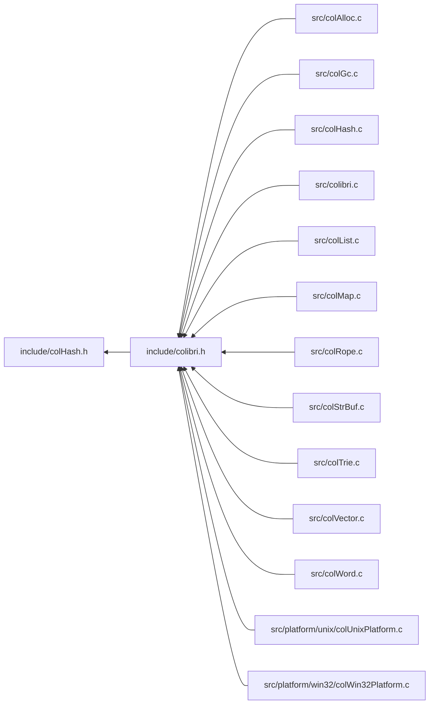

<a id="col_hash_8h"></a>
# File colHash.h

![][C++]

**Location**: `include/colHash.h`

This header file defines the hash map handling features of Colibri.

Hash maps are an implementation of generic [Maps](group__map__words.md#group__map__words) that use key hashing and flat bucket arrays for string, integer and custom keys.


They are always mutable.


**See also**: [colMap.h](col_map_8h.md#col_map_8h)

## Classes

* [Col\_CustomHashMapType](struct_col___custom_hash_map_type.md#struct_col___custom_hash_map_type)

## Includes

* <stddef.h>


## Included by

* [include/colibri.h](colibri_8h.md#colibri_8h)



## Hash Map Creation

<a id="group__hashmap__words_1ga83815df8c509dbf24974ed447ed5ad75"></a>
### Function Col\_NewStringHashMap

![][public]

```cpp
Col_Word Col_NewStringHashMap(size_t capacity)
```

Create a new string hash map word.

**Returns**:

The new word.


**Parameters**:

* size_t **capacity**: Initial bucket size. Rounded up to the next power of 2.

**Return type**: EXTERN [Col\_Word](col_word_8h.md#group__words_1gadb626f9e195212e4fdfba7df154ad043)

**References**:

* [AllocBuckets](col_hash_8c.md#group__hashmap__words_1ga19e08b164be41d9b09cd4e10ba33ae27)
* [AllocCells](col_gc_8c.md#group__alloc_1gaeec69115deeb3321bdfbb4e42119f806)
* [HASHMAP\_NBCELLS](col_hash_int_8h.md#group__hashmap__words_1ga3d9cbe4590e682edade0bff62397c5e5)
* [WORD\_STRHASHMAP\_INIT](col_hash_int_8h.md#group__strhashmap__words_1ga251196179071b3d43a2195f5a4063373)

<a id="group__hashmap__words_1ga21868cc2f614fe73e31690d5d233e0c9"></a>
### Function Col\_NewIntHashMap

![][public]

```cpp
Col_Word Col_NewIntHashMap(size_t capacity)
```

Create a new integer hash map word.

**Returns**:

The new word.


**Parameters**:

* size_t **capacity**: Initial bucket size. Rounded up to the next power of 2.

**Return type**: EXTERN [Col\_Word](col_word_8h.md#group__words_1gadb626f9e195212e4fdfba7df154ad043)

**References**:

* [AllocBuckets](col_hash_8c.md#group__hashmap__words_1ga19e08b164be41d9b09cd4e10ba33ae27)
* [AllocCells](col_gc_8c.md#group__alloc_1gaeec69115deeb3321bdfbb4e42119f806)
* [HASHMAP\_NBCELLS](col_hash_int_8h.md#group__hashmap__words_1ga3d9cbe4590e682edade0bff62397c5e5)
* [WORD\_INTHASHMAP\_INIT](col_hash_int_8h.md#group__inthashmap__words_1ga53503676dc5f75eb7894087cf53d8252)

<a id="group__hashmap__words_1ga9ebda3b577662e8b1dcf9a227d106f22"></a>
### Function Col\_CopyHashMap

![][public]

```cpp
Col_Word Col_CopyHashMap(Col_Word map)
```

Create a new hash map word from an existing one.

?> Only the hash map structure is copied, the contained words are not (i.e. this is not a deep copy).


**Returns**:

The new word.


**Side Effect**:

Source map content is frozen.

**Exceptions**:

* **[COL\_ERROR\_HASHMAP](colibri_8h.md#group__error_1gga729084542ed9eae62009a84d3379ef35aa2ae78a1c25af13ee9ba866d5cb501a1)**: [[T]](colibri_8h.md#group__error_1gga6dab009a0b8c4b4fa080cb9ba1859e9ea603a58b9d5bb16fde0708eb0767e4904) **map**: Not a hash map.

**Parameters**:

* [Col\_Word](col_word_8h.md#group__words_1gadb626f9e195212e4fdfba7df154ad043) **map**: Hash map to copy.

**Return type**: EXTERN [Col\_Word](col_word_8h.md#group__words_1gadb626f9e195212e4fdfba7df154ad043)

**References**:

* [AllocCells](col_gc_8c.md#group__alloc_1gaeec69115deeb3321bdfbb4e42119f806)
* [ASSERT](col_internal_8h.md#group__error_1gac22830a985e1daed0c9eadba8c6f606e)
* [Col\_MVectorFreeze](col_vector_8h.md#group__mvector__words_1ga1d93d2437dc1066b87d82d49aec779f1)
* [GET\_BUCKETS](col_hash_8c.md#group__hashmap__words_1ga51ac8e6197ed0e1100976539ca9c62b9)
* [HASHMAP\_NBCELLS](col_hash_int_8h.md#group__hashmap__words_1ga3d9cbe4590e682edade0bff62397c5e5)
* [TYPECHECK\_HASHMAP](col_hash_int_8h.md#group__hashmap__words_1gaabaaa46325ec29e8882ef1ec569687d2)
* [WORD\_CLEAR\_PINNED](col_word_int_8h.md#group__regular__words_1ga04a19fb132382d52fa42d3d3e4237f2f)
* [WORD\_HASHENTRY\_NEXT](col_hash_int_8h.md#group__mhashentry__words_1ga9f087b8c13513115c5e1b19c86fbe145)
* [WORD\_HASHMAP\_BUCKETS](col_hash_int_8h.md#group__hashmap__words_1gaa3913885cb3625fe8ba8582eb3323315)
* [WORD\_NIL](col_word_8h.md#group__words_1ga29e370264f4e5659ccc5be4de209f065)
* [WORD\_PINNED](col_word_int_8h.md#group__regular__words_1gad20cf13be09a354418d8615e6f2f2193)
* [WORD\_SET\_TYPEID](col_word_int_8h.md#group__predefined__words_1ga52822cf424704829e60b112fe03614b6)
* [WORD\_SYNONYM](col_word_int_8h.md#group__regular__words_1ga19cfddbcf0127f5088803cc68ddb8eaa)
* [WORD\_TYPE](col_word_int_8h.md#group__words_1ga014e27ea4160eb3845ac495a22c232f5)
* [WORD\_TYPE\_CUSTOM](col_word_int_8h.md#group__words_1ga8babfbc77291680db519873c91efdd4c)
* [WORD\_TYPE\_HASHENTRY](col_word_int_8h.md#group__words_1ga0ccfe6bc407371b3c2cde0a2da83f9fa)
* [WORD\_TYPE\_INTHASHENTRY](col_word_int_8h.md#group__words_1gab1a5b3b65a05c74cd3973db9dce4a781)
* [WORD\_TYPE\_INTHASHMAP](col_word_int_8h.md#group__words_1ga230c3d50685afa970c1e0da69feb5811)
* [WORD\_TYPE\_STRHASHMAP](col_word_int_8h.md#group__words_1ga4b4fdf9a2320675d8dd1dc29d0007564)
* [WORD\_TYPE\_VECTOR](col_word_int_8h.md#group__words_1gadf6c66e5c2f9fcdf213ae40d253c153f)

## Hash Map Accessors

<a id="group__hashmap__words_1ga7fe5b8f4de905e324ada5177527d483e"></a>
### Function Col\_HashMapGet

![][public]

```cpp
int Col_HashMapGet(Col_Word map, Col_Word key, Col_Word *valuePtr)
```

Get value mapped to the given key if present.

**Return values**:

* **0**: if the key wasn't found.
* **<>0**: if the key was found, in this case the value is returned through **valuePtr**.


**See also**: [Col\_MapGet](col_map_8h.md#group__map__words_1gabd075578f35ec7a706654e94aba281d9)

**Exceptions**:

* **[COL\_ERROR\_WORDHASHMAP](colibri_8h.md#group__error_1gga729084542ed9eae62009a84d3379ef35a5bc15b91b43b981992b031a43e8c3e8d)**: [[T]](colibri_8h.md#group__error_1gga6dab009a0b8c4b4fa080cb9ba1859e9ea603a58b9d5bb16fde0708eb0767e4904) **map**: Not a string or word-keyed hash map.

**Parameters**:

* [Col\_Word](col_word_8h.md#group__words_1gadb626f9e195212e4fdfba7df154ad043) **map**: Hash map to get entry for.
* [Col\_Word](col_word_8h.md#group__words_1gadb626f9e195212e4fdfba7df154ad043) **key**: Entry key. Can be any word type, including string, however it must match the actual type used by the map.
* [Col\_Word](col_word_8h.md#group__words_1gadb626f9e195212e4fdfba7df154ad043) * **valuePtr**: [out] Returned entry value, if found.

**Return type**: EXTERN int

**References**:

* [ASSERT](col_internal_8h.md#group__error_1gac22830a985e1daed0c9eadba8c6f606e)
* [COL\_HASHMAP](col_word_8h.md#group__words_1gae3509634e52a76014e96c2575b5d8092)
* [Col\_CustomHashMapType::compareKeysProc](struct_col___custom_hash_map_type.md#struct_col___custom_hash_map_type_1adecb961bbf29ef0ff4b37ed97309d59d)
* [CompareStrings](col_hash_8c.md#group__hashmap__words_1gacd46dc7644f9fb2e0a56e8a0b85c6763)
* [HashMapFindEntry](col_hash_8c.md#group__hashmap__words_1ga0c88b84075dfbde40bfc894ea158bdc8)
* [Col\_CustomHashMapType::hashProc](struct_col___custom_hash_map_type.md#struct_col___custom_hash_map_type_1a571294a9fa0b5e0241986efaf50f5b37)
* [HashString](col_hash_8c.md#group__hashmap__words_1ga5a354bdba1e95d6747bc07725902275c)
* [Col\_CustomHashMapType::type](struct_col___custom_hash_map_type.md#struct_col___custom_hash_map_type_1aea81519da7ec0622ec1a598637c4e488)
* [Col\_CustomWordType::type](struct_col___custom_word_type.md#struct_col___custom_word_type_1af9482efe5a6408bc622320619c3ccf9f)
* [TYPECHECK\_WORDHASHMAP](col_hash_int_8h.md#group__hashmap__words_1ga289fc116a48446f5acf7c8e24e6a4ac4)
* [WORD\_MAPENTRY\_VALUE](col_map_int_8h.md#group__mapentry__words_1gabad6806f2947f508a9786948c1663064)
* [WORD\_TYPE](col_word_int_8h.md#group__words_1ga014e27ea4160eb3845ac495a22c232f5)
* [WORD\_TYPE\_CUSTOM](col_word_int_8h.md#group__words_1ga8babfbc77291680db519873c91efdd4c)
* [WORD\_TYPE\_HASHENTRY](col_word_int_8h.md#group__words_1ga0ccfe6bc407371b3c2cde0a2da83f9fa)
* [WORD\_TYPE\_MHASHENTRY](col_word_int_8h.md#group__words_1ga4c79463f98f0ec9296451862e5d0b76c)
* [WORD\_TYPE\_STRHASHMAP](col_word_int_8h.md#group__words_1ga4b4fdf9a2320675d8dd1dc29d0007564)
* [WORD\_TYPEINFO](col_word_int_8h.md#group__custom__words_1gafc962791c45a5dd5bb034050444084be)

**Referenced by**:

* [Col\_MapGet](col_map_8h.md#group__map__words_1gabd075578f35ec7a706654e94aba281d9)

<a id="group__hashmap__words_1ga9c83b74f8b6dd17750f0c9be778bdc95"></a>
### Function Col\_IntHashMapGet

![][public]

```cpp
int Col_IntHashMapGet(Col_Word map, intptr_t key, Col_Word *valuePtr)
```

Get value mapped to the given integer key if present.

**Return values**:

* **0**: if the key wasn't found.
* **<>0**: if the key was found, in this case the value is returned through **valuePtr**.


**See also**: [Col\_IntMapGet](col_map_8h.md#group__map__words_1ga4f96f7436cc66537b05841c5b088eef2)

**Exceptions**:

* **[COL\_ERROR\_INTHASHMAP](colibri_8h.md#group__error_1gga729084542ed9eae62009a84d3379ef35a6adf7197e12916d0bdb78d890b43cf3d)**: [[T]](colibri_8h.md#group__error_1gga6dab009a0b8c4b4fa080cb9ba1859e9ea603a58b9d5bb16fde0708eb0767e4904) **map**: Not an integer-keyed hash map.

**Parameters**:

* [Col\_Word](col_word_8h.md#group__words_1gadb626f9e195212e4fdfba7df154ad043) **map**: Integer hash map to get entry for.
* intptr_t **key**: Integer entry key
* [Col\_Word](col_word_8h.md#group__words_1gadb626f9e195212e4fdfba7df154ad043) * **valuePtr**: [out] Returned entry value, if found.

**Return type**: EXTERN int

**References**:

* [ASSERT](col_internal_8h.md#group__error_1gac22830a985e1daed0c9eadba8c6f606e)
* [IntHashMapFindEntry](col_hash_8c.md#group__hashmap__words_1ga1ddc6ccf9196e70ad14895d5bc32ad2d)
* [TYPECHECK\_INTHASHMAP](col_hash_int_8h.md#group__inthashmap__words_1gab451eefab69078045d4b5e92c07350f1)
* [WORD\_MAPENTRY\_VALUE](col_map_int_8h.md#group__mapentry__words_1gabad6806f2947f508a9786948c1663064)
* [WORD\_TYPE](col_word_int_8h.md#group__words_1ga014e27ea4160eb3845ac495a22c232f5)
* [WORD\_TYPE\_INTHASHENTRY](col_word_int_8h.md#group__words_1gab1a5b3b65a05c74cd3973db9dce4a781)
* [WORD\_TYPE\_MINTHASHENTRY](col_word_int_8h.md#group__words_1ga1758f2fa0c44200f5782e548c5b33c7e)

**Referenced by**:

* [Col\_IntMapGet](col_map_8h.md#group__map__words_1ga4f96f7436cc66537b05841c5b088eef2)

<a id="group__hashmap__words_1ga5290a8ca2aeccdb481e46ca161dbafdf"></a>
### Function Col\_HashMapSet

![][public]

```cpp
int Col_HashMapSet(Col_Word map, Col_Word key, Col_Word value)
```

Map the value to the key, replacing any existing.

**Return values**:

* **0**: if an existing entry was updated with **value**.
* **<>0**: if a new entry was created with **key** and **value**.


**See also**: [Col\_MapSet](col_map_8h.md#group__map__words_1ga82b31e62df46ff382e18241bdcde49e3)

**Exceptions**:

* **[COL\_ERROR\_WORDHASHMAP](colibri_8h.md#group__error_1gga729084542ed9eae62009a84d3379ef35a5bc15b91b43b981992b031a43e8c3e8d)**: [[T]](colibri_8h.md#group__error_1gga6dab009a0b8c4b4fa080cb9ba1859e9ea603a58b9d5bb16fde0708eb0767e4904) **map**: Not a string or word-keyed hash map.

**Parameters**:

* [Col\_Word](col_word_8h.md#group__words_1gadb626f9e195212e4fdfba7df154ad043) **map**: Hash map to insert entry into.
* [Col\_Word](col_word_8h.md#group__words_1gadb626f9e195212e4fdfba7df154ad043) **key**: Entry key. Can be any word type, including string, however it must match the actual type used by the map.
* [Col\_Word](col_word_8h.md#group__words_1gadb626f9e195212e4fdfba7df154ad043) **value**: Entry value.

**Return type**: EXTERN int

**References**:

* [ASSERT](col_internal_8h.md#group__error_1gac22830a985e1daed0c9eadba8c6f606e)
* [COL\_HASHMAP](col_word_8h.md#group__words_1gae3509634e52a76014e96c2575b5d8092)
* [Col\_CustomHashMapType::compareKeysProc](struct_col___custom_hash_map_type.md#struct_col___custom_hash_map_type_1adecb961bbf29ef0ff4b37ed97309d59d)
* [CompareStrings](col_hash_8c.md#group__hashmap__words_1gacd46dc7644f9fb2e0a56e8a0b85c6763)
* [HashMapFindEntry](col_hash_8c.md#group__hashmap__words_1ga0c88b84075dfbde40bfc894ea158bdc8)
* [Col\_CustomHashMapType::hashProc](struct_col___custom_hash_map_type.md#struct_col___custom_hash_map_type_1a571294a9fa0b5e0241986efaf50f5b37)
* [HashString](col_hash_8c.md#group__hashmap__words_1ga5a354bdba1e95d6747bc07725902275c)
* [Col\_CustomHashMapType::type](struct_col___custom_hash_map_type.md#struct_col___custom_hash_map_type_1aea81519da7ec0622ec1a598637c4e488)
* [Col\_CustomWordType::type](struct_col___custom_word_type.md#struct_col___custom_word_type_1af9482efe5a6408bc622320619c3ccf9f)
* [TYPECHECK\_WORDHASHMAP](col_hash_int_8h.md#group__hashmap__words_1ga289fc116a48446f5acf7c8e24e6a4ac4)
* [WORD\_MAPENTRY\_VALUE](col_map_int_8h.md#group__mapentry__words_1gabad6806f2947f508a9786948c1663064)
* [WORD\_TYPE](col_word_int_8h.md#group__words_1ga014e27ea4160eb3845ac495a22c232f5)
* [WORD\_TYPE\_CUSTOM](col_word_int_8h.md#group__words_1ga8babfbc77291680db519873c91efdd4c)
* [WORD\_TYPE\_MHASHENTRY](col_word_int_8h.md#group__words_1ga4c79463f98f0ec9296451862e5d0b76c)
* [WORD\_TYPE\_STRHASHMAP](col_word_int_8h.md#group__words_1ga4b4fdf9a2320675d8dd1dc29d0007564)
* [WORD\_TYPEINFO](col_word_int_8h.md#group__custom__words_1gafc962791c45a5dd5bb034050444084be)

**Referenced by**:

* [Col\_MapSet](col_map_8h.md#group__map__words_1ga82b31e62df46ff382e18241bdcde49e3)

<a id="group__hashmap__words_1ga73aa4d8fc75a6f152c385e3a4bcdcb1c"></a>
### Function Col\_IntHashMapSet

![][public]

```cpp
int Col_IntHashMapSet(Col_Word map, intptr_t key, Col_Word value)
```

Map the value to the integer key, replacing any existing.

**Return values**:

* **0**: if an existing entry was updated with **value**.
* **<>0**: if a new entry was created with **key** and **value**.


**See also**: [Col\_IntMapSet](col_map_8h.md#group__map__words_1ga27a694b6de40e1a3af81379a7056754d)

**Exceptions**:

* **[COL\_ERROR\_INTHASHMAP](colibri_8h.md#group__error_1gga729084542ed9eae62009a84d3379ef35a6adf7197e12916d0bdb78d890b43cf3d)**: [[T]](colibri_8h.md#group__error_1gga6dab009a0b8c4b4fa080cb9ba1859e9ea603a58b9d5bb16fde0708eb0767e4904) **map**: Not an integer-keyed hash map.

**Parameters**:

* [Col\_Word](col_word_8h.md#group__words_1gadb626f9e195212e4fdfba7df154ad043) **map**: Integer hash map to insert entry into.
* intptr_t **key**: Integer entry key.
* [Col\_Word](col_word_8h.md#group__words_1gadb626f9e195212e4fdfba7df154ad043) **value**: Entry value.

**Return type**: EXTERN int

**References**:

* [ASSERT](col_internal_8h.md#group__error_1gac22830a985e1daed0c9eadba8c6f606e)
* [IntHashMapFindEntry](col_hash_8c.md#group__hashmap__words_1ga1ddc6ccf9196e70ad14895d5bc32ad2d)
* [TYPECHECK\_INTHASHMAP](col_hash_int_8h.md#group__inthashmap__words_1gab451eefab69078045d4b5e92c07350f1)
* [WORD\_MAPENTRY\_VALUE](col_map_int_8h.md#group__mapentry__words_1gabad6806f2947f508a9786948c1663064)
* [WORD\_TYPE](col_word_int_8h.md#group__words_1ga014e27ea4160eb3845ac495a22c232f5)
* [WORD\_TYPE\_MINTHASHENTRY](col_word_int_8h.md#group__words_1ga1758f2fa0c44200f5782e548c5b33c7e)

**Referenced by**:

* [Col\_IntMapSet](col_map_8h.md#group__map__words_1ga27a694b6de40e1a3af81379a7056754d)

<a id="group__hashmap__words_1ga4319b874a1524fcd008125db503a7f9c"></a>
### Function Col\_HashMapUnset

![][public]

```cpp
int Col_HashMapUnset(Col_Word map, Col_Word key)
```

Remove any value mapped to the given key.

**Return values**:

* **0**: if no entry matching **key** was found.
* **<>0**: if the existing entry was removed.


**See also**: [Col\_MapUnset](col_map_8h.md#group__map__words_1ga1f48ed3390f9a53cde268533a763e638)

**Exceptions**:

* **[COL\_ERROR\_WORDHASHMAP](colibri_8h.md#group__error_1gga729084542ed9eae62009a84d3379ef35a5bc15b91b43b981992b031a43e8c3e8d)**: [[T]](colibri_8h.md#group__error_1gga6dab009a0b8c4b4fa080cb9ba1859e9ea603a58b9d5bb16fde0708eb0767e4904) **map**: Not a string or word-keyed hash map.

**Parameters**:

* [Col\_Word](col_word_8h.md#group__words_1gadb626f9e195212e4fdfba7df154ad043) **map**: Hash map to remove entry from.
* [Col\_Word](col_word_8h.md#group__words_1gadb626f9e195212e4fdfba7df154ad043) **key**: Entry key. Can be any word type, including string, however it must match the actual type used by the map.

**Return type**: EXTERN int

**References**:

* [ASSERT](col_internal_8h.md#group__error_1gac22830a985e1daed0c9eadba8c6f606e)
* [COL\_HASHMAP](col_word_8h.md#group__words_1gae3509634e52a76014e96c2575b5d8092)
* [Col\_CustomHashMapType::compareKeysProc](struct_col___custom_hash_map_type.md#struct_col___custom_hash_map_type_1adecb961bbf29ef0ff4b37ed97309d59d)
* [CompareStrings](col_hash_8c.md#group__hashmap__words_1gacd46dc7644f9fb2e0a56e8a0b85c6763)
* [ConvertEntryToMutable](col_hash_8c.md#group__hashmap__words_1ga12e2f90ca22da78efd1d3e42d442a3e3)
* [GET\_BUCKETS](col_hash_8c.md#group__hashmap__words_1ga51ac8e6197ed0e1100976539ca9c62b9)
* [HASHENTRY\_HASH\_MASK](col_hash_int_8h.md#group__mhashentry__words_1ga1f31f4326456a1511d32accb096baa63)
* [Col\_CustomHashMapType::hashProc](struct_col___custom_hash_map_type.md#struct_col___custom_hash_map_type_1a571294a9fa0b5e0241986efaf50f5b37)
* [HashString](col_hash_8c.md#group__hashmap__words_1ga5a354bdba1e95d6747bc07725902275c)
* [Col\_CustomHashMapType::type](struct_col___custom_hash_map_type.md#struct_col___custom_hash_map_type_1aea81519da7ec0622ec1a598637c4e488)
* [Col\_CustomWordType::type](struct_col___custom_word_type.md#struct_col___custom_word_type_1af9482efe5a6408bc622320619c3ccf9f)
* [TYPECHECK\_WORDHASHMAP](col_hash_int_8h.md#group__hashmap__words_1ga289fc116a48446f5acf7c8e24e6a4ac4)
* [WORD\_HASHENTRY\_HASH](col_hash_int_8h.md#group__mhashentry__words_1ga54cafd113b5788e58294047e3e3cbe7c)
* [WORD\_HASHENTRY\_NEXT](col_hash_int_8h.md#group__mhashentry__words_1ga9f087b8c13513115c5e1b19c86fbe145)
* [WORD\_HASHMAP\_SIZE](col_hash_int_8h.md#group__hashmap__words_1gac639d1878d96d8bb8d825822bc104b8c)
* [WORD\_MAPENTRY\_KEY](col_map_int_8h.md#group__mapentry__words_1ga8664d15fae4553b47b658ac7ceb1443a)
* [WORD\_NIL](col_word_8h.md#group__words_1ga29e370264f4e5659ccc5be4de209f065)
* [WORD\_TYPE](col_word_int_8h.md#group__words_1ga014e27ea4160eb3845ac495a22c232f5)
* [WORD\_TYPE\_CUSTOM](col_word_int_8h.md#group__words_1ga8babfbc77291680db519873c91efdd4c)
* [WORD\_TYPE\_HASHENTRY](col_word_int_8h.md#group__words_1ga0ccfe6bc407371b3c2cde0a2da83f9fa)
* [WORD\_TYPE\_MHASHENTRY](col_word_int_8h.md#group__words_1ga4c79463f98f0ec9296451862e5d0b76c)
* [WORD\_TYPE\_NIL](col_word_int_8h.md#group__words_1ga1f4d1db7619649bb51aeddd67c8b242f)
* [WORD\_TYPE\_STRHASHMAP](col_word_int_8h.md#group__words_1ga4b4fdf9a2320675d8dd1dc29d0007564)
* [WORD\_TYPEINFO](col_word_int_8h.md#group__custom__words_1gafc962791c45a5dd5bb034050444084be)

**Referenced by**:

* [Col\_MapUnset](col_map_8h.md#group__map__words_1ga1f48ed3390f9a53cde268533a763e638)

<a id="group__hashmap__words_1gab060852e2fc2e645aee2179e678cbeb3"></a>
### Function Col\_IntHashMapUnset

![][public]

```cpp
int Col_IntHashMapUnset(Col_Word map, intptr_t key)
```

Remove any value mapped to the given integer key.

**Return values**:

* **0**: if no entry matching **key** was found.
* **<>0**: if the existing entry was removed.


**See also**: [Col\_IntMapUnset](col_map_8h.md#group__map__words_1gac2ae366ebe1ec3a4495128cb1400d1cf)

**Exceptions**:

* **[COL\_ERROR\_INTHASHMAP](colibri_8h.md#group__error_1gga729084542ed9eae62009a84d3379ef35a6adf7197e12916d0bdb78d890b43cf3d)**: [[T]](colibri_8h.md#group__error_1gga6dab009a0b8c4b4fa080cb9ba1859e9ea603a58b9d5bb16fde0708eb0767e4904) **map**: Not an integer-keyed hash map.

**Parameters**:

* [Col\_Word](col_word_8h.md#group__words_1gadb626f9e195212e4fdfba7df154ad043) **map**: Integer hash map to remove entry from.
* intptr_t **key**: Integer entry key.

**Return type**: EXTERN int

**References**:

* [ASSERT](col_internal_8h.md#group__error_1gac22830a985e1daed0c9eadba8c6f606e)
* [ConvertIntEntryToMutable](col_hash_8c.md#group__hashmap__words_1gace9fa4c1e18e28528ecbd57dc858cdda)
* [GET\_BUCKETS](col_hash_8c.md#group__hashmap__words_1ga51ac8e6197ed0e1100976539ca9c62b9)
* [RANDOMIZE\_KEY](col_hash_8c.md#group__hashmap__words_1ga8c37ced5912c36864e4c98eb4e7c5f4a)
* [TYPECHECK\_INTHASHMAP](col_hash_int_8h.md#group__inthashmap__words_1gab451eefab69078045d4b5e92c07350f1)
* [WORD\_HASHENTRY\_NEXT](col_hash_int_8h.md#group__mhashentry__words_1ga9f087b8c13513115c5e1b19c86fbe145)
* [WORD\_HASHMAP\_SIZE](col_hash_int_8h.md#group__hashmap__words_1gac639d1878d96d8bb8d825822bc104b8c)
* [WORD\_INTMAPENTRY\_KEY](col_map_int_8h.md#group__intmapentry__words_1ga89e26360d76aaad985afd89da56d1539)
* [WORD\_NIL](col_word_8h.md#group__words_1ga29e370264f4e5659ccc5be4de209f065)
* [WORD\_TYPE](col_word_int_8h.md#group__words_1ga014e27ea4160eb3845ac495a22c232f5)
* [WORD\_TYPE\_INTHASHENTRY](col_word_int_8h.md#group__words_1gab1a5b3b65a05c74cd3973db9dce4a781)
* [WORD\_TYPE\_MINTHASHENTRY](col_word_int_8h.md#group__words_1ga1758f2fa0c44200f5782e548c5b33c7e)
* [WORD\_TYPE\_NIL](col_word_int_8h.md#group__words_1ga1f4d1db7619649bb51aeddd67c8b242f)

**Referenced by**:

* [Col\_IntMapUnset](col_map_8h.md#group__map__words_1gac2ae366ebe1ec3a4495128cb1400d1cf)

## Hash Map Iteration

<a id="group__hashmap__words_1gac4de92fb8d4ed572c26f6907a6108005"></a>
### Function Col\_HashMapIterBegin

![][public]

```cpp
void Col_HashMapIterBegin(Col_MapIterator it, Col_Word map)
```

Initialize the map iterator so that it points to the first entry within the hash map.

**See also**: [Col\_MapIterBegin](col_map_8h.md#group__map__words_1gab8f4a0de6b264bbe59c332b41a22866a)

**Exceptions**:

* **[COL\_ERROR\_HASHMAP](colibri_8h.md#group__error_1gga729084542ed9eae62009a84d3379ef35aa2ae78a1c25af13ee9ba866d5cb501a1)**: [[T]](colibri_8h.md#group__error_1gga6dab009a0b8c4b4fa080cb9ba1859e9ea603a58b9d5bb16fde0708eb0767e4904) **map**: Not a hash map.

**Parameters**:

* [Col\_MapIterator](col_map_8h.md#group__map__words_1ga33d331116aff3f3d03a231ccbbce40c2) **it**: Iterator to initialize.
* [Col\_Word](col_word_8h.md#group__words_1gadb626f9e195212e4fdfba7df154ad043) **map**: Hash map to iterate over.

**Return type**: EXTERN void

**References**:

* [ASSERT](col_internal_8h.md#group__error_1gac22830a985e1daed0c9eadba8c6f606e)
* [Col\_MapIterSetNull](col_map_8h.md#group__map__words_1ga3629bc2a457ae5a9ab57ab1f74ee0223)
* [Col\_MapSize](col_map_8h.md#group__map__words_1gaae4f3cbf8a5aedc78929bc2364440aac)
* [GET\_BUCKETS](col_hash_8c.md#group__hashmap__words_1ga51ac8e6197ed0e1100976539ca9c62b9)
* [TYPECHECK\_HASHMAP](col_hash_int_8h.md#group__hashmap__words_1gaabaaa46325ec29e8882ef1ec569687d2)
* [WORD\_NIL](col_word_8h.md#group__words_1ga29e370264f4e5659ccc5be4de209f065)

**Referenced by**:

* [Col\_MapIterBegin](col_map_8h.md#group__map__words_1gab8f4a0de6b264bbe59c332b41a22866a)

<a id="group__hashmap__words_1ga7f4cdf033cec55efd5d6c7704176dfc5"></a>
### Function Col\_HashMapIterFind

![][public]

```cpp
void Col_HashMapIterFind(Col_MapIterator it, Col_Word map, Col_Word key, int *createPtr)
```

Initialize the map iterator so that it points to the entry with the given key within the hash map.

**See also**: [Col\_MapIterFind](col_map_8h.md#group__map__words_1gaa925d7d32221bc826e9717930c2602e1)

**Exceptions**:

* **[COL\_ERROR\_WORDHASHMAP](colibri_8h.md#group__error_1gga729084542ed9eae62009a84d3379ef35a5bc15b91b43b981992b031a43e8c3e8d)**: [[T]](colibri_8h.md#group__error_1gga6dab009a0b8c4b4fa080cb9ba1859e9ea603a58b9d5bb16fde0708eb0767e4904) **map**: Not a string or word-keyed hash map.

**Parameters**:

* [Col\_MapIterator](col_map_8h.md#group__map__words_1ga33d331116aff3f3d03a231ccbbce40c2) **it**: Iterator to initialize.
* [Col\_Word](col_word_8h.md#group__words_1gadb626f9e195212e4fdfba7df154ad043) **map**: Hash map to iterate over.
* [Col\_Word](col_word_8h.md#group__words_1gadb626f9e195212e4fdfba7df154ad043) **key**: Entry key. Can be any word type, including string, however it must match the actual type used by the map.
* int * **createPtr**: [in,out] If non-NULL, whether to create entry if absent on input, and whether an entry was created on output.

**Return type**: EXTERN void

**References**:

* [ASSERT](col_internal_8h.md#group__error_1gac22830a985e1daed0c9eadba8c6f606e)
* [COL\_HASHMAP](col_word_8h.md#group__words_1gae3509634e52a76014e96c2575b5d8092)
* [Col\_MapIterSetNull](col_map_8h.md#group__map__words_1ga3629bc2a457ae5a9ab57ab1f74ee0223)
* [Col\_CustomHashMapType::compareKeysProc](struct_col___custom_hash_map_type.md#struct_col___custom_hash_map_type_1adecb961bbf29ef0ff4b37ed97309d59d)
* [CompareStrings](col_hash_8c.md#group__hashmap__words_1gacd46dc7644f9fb2e0a56e8a0b85c6763)
* [HashMapFindEntry](col_hash_8c.md#group__hashmap__words_1ga0c88b84075dfbde40bfc894ea158bdc8)
* [Col\_CustomHashMapType::hashProc](struct_col___custom_hash_map_type.md#struct_col___custom_hash_map_type_1a571294a9fa0b5e0241986efaf50f5b37)
* [HashString](col_hash_8c.md#group__hashmap__words_1ga5a354bdba1e95d6747bc07725902275c)
* [Col\_CustomHashMapType::type](struct_col___custom_hash_map_type.md#struct_col___custom_hash_map_type_1aea81519da7ec0622ec1a598637c4e488)
* [Col\_CustomWordType::type](struct_col___custom_word_type.md#struct_col___custom_word_type_1af9482efe5a6408bc622320619c3ccf9f)
* [TYPECHECK\_WORDHASHMAP](col_hash_int_8h.md#group__hashmap__words_1ga289fc116a48446f5acf7c8e24e6a4ac4)
* [WORD\_TYPE](col_word_int_8h.md#group__words_1ga014e27ea4160eb3845ac495a22c232f5)
* [WORD\_TYPE\_CUSTOM](col_word_int_8h.md#group__words_1ga8babfbc77291680db519873c91efdd4c)
* [WORD\_TYPE\_STRHASHMAP](col_word_int_8h.md#group__words_1ga4b4fdf9a2320675d8dd1dc29d0007564)
* [WORD\_TYPEINFO](col_word_int_8h.md#group__custom__words_1gafc962791c45a5dd5bb034050444084be)

**Referenced by**:

* [Col\_MapIterFind](col_map_8h.md#group__map__words_1gaa925d7d32221bc826e9717930c2602e1)

<a id="group__hashmap__words_1ga6ffef52a7e4127f837ac680cfd08a855"></a>
### Function Col\_IntHashMapIterFind

![][public]

```cpp
void Col_IntHashMapIterFind(Col_MapIterator it, Col_Word map, intptr_t key, int *createPtr)
```

Initialize the map iterator so that it points to the entry with the given integer key within the integer hash map.

**See also**: [Col\_IntMapIterFind](col_map_8h.md#group__map__words_1ga8c332381607b0dc828b4aa96fa8f1a12)

**Exceptions**:

* **[COL\_ERROR\_INTHASHMAP](colibri_8h.md#group__error_1gga729084542ed9eae62009a84d3379ef35a6adf7197e12916d0bdb78d890b43cf3d)**: [[T]](colibri_8h.md#group__error_1gga6dab009a0b8c4b4fa080cb9ba1859e9ea603a58b9d5bb16fde0708eb0767e4904) **map**: Not an integer-keyed hash map.

**Parameters**:

* [Col\_MapIterator](col_map_8h.md#group__map__words_1ga33d331116aff3f3d03a231ccbbce40c2) **it**: Iterator to initialize.
* [Col\_Word](col_word_8h.md#group__words_1gadb626f9e195212e4fdfba7df154ad043) **map**: Integer hash map to iterate over.
* intptr_t **key**: Integer entry key.
* int * **createPtr**: [in,out] If non-NULL, whether to create entry if absent on input, and whether an entry was created on output.

**Return type**: EXTERN void

**References**:

* [Col\_MapIterSetNull](col_map_8h.md#group__map__words_1ga3629bc2a457ae5a9ab57ab1f74ee0223)
* [IntHashMapFindEntry](col_hash_8c.md#group__hashmap__words_1ga1ddc6ccf9196e70ad14895d5bc32ad2d)
* [TYPECHECK\_INTHASHMAP](col_hash_int_8h.md#group__inthashmap__words_1gab451eefab69078045d4b5e92c07350f1)

**Referenced by**:

* [Col\_IntMapIterFind](col_map_8h.md#group__map__words_1ga8c332381607b0dc828b4aa96fa8f1a12)

<a id="group__hashmap__words_1ga828aeae1d46d8fe91fa344bf0fac3265"></a>
### Function Col\_HashMapIterSetValue

![][public]

```cpp
void Col_HashMapIterSetValue(Col_MapIterator it, Col_Word value)
```

Set value of hash map iterator.

**See also**: [Col\_MapIterSetValue](col_map_8h.md#group__map__words_1ga8c5d3a82b6cb5b7af6f16ebed863736f)

**Exceptions**:

* **[COL\_ERROR\_MAPITER](colibri_8h.md#group__error_1gga729084542ed9eae62009a84d3379ef35aa66f57346b0a9eac571308e75fb1f8ec)**: [[T]](colibri_8h.md#group__error_1gga6dab009a0b8c4b4fa080cb9ba1859e9ea603a58b9d5bb16fde0708eb0767e4904) **it**: Invalid map iterator.
* **[COL\_ERROR\_HASHMAP](colibri_8h.md#group__error_1gga729084542ed9eae62009a84d3379ef35aa2ae78a1c25af13ee9ba866d5cb501a1)**: [[T]](colibri_8h.md#group__error_1gga6dab009a0b8c4b4fa080cb9ba1859e9ea603a58b9d5bb16fde0708eb0767e4904) **[Col\_MapIterMap(it)](col_map_8h.md#group__map__words_1gac6f818f3c753f4e2668367155fa42686)**: Not a hash map.
* **[COL\_ERROR\_MAPITER\_END](colibri_8h.md#group__error_1gga729084542ed9eae62009a84d3379ef35a1a834ed5a623ccf3120ccec5d0d60653)**: [[V]](colibri_8h.md#group__error_1gga6dab009a0b8c4b4fa080cb9ba1859e9ea65d5e7232c82ae6972ac56f386a32fc9) **it**: Map iterator at end.

**Parameters**:

* [Col\_MapIterator](col_map_8h.md#group__map__words_1ga33d331116aff3f3d03a231ccbbce40c2) **it**: Map iterator to set value for.
* [Col\_Word](col_word_8h.md#group__words_1gadb626f9e195212e4fdfba7df154ad043) **value**: Value to set.

**Return type**: EXTERN void

**References**:

* [ASSERT](col_internal_8h.md#group__error_1gac22830a985e1daed0c9eadba8c6f606e)
* [ConvertEntryToMutable](col_hash_8c.md#group__hashmap__words_1ga12e2f90ca22da78efd1d3e42d442a3e3)
* [ConvertIntEntryToMutable](col_hash_8c.md#group__hashmap__words_1gace9fa4c1e18e28528ecbd57dc858cdda)
* [GET\_BUCKETS](col_hash_8c.md#group__hashmap__words_1ga51ac8e6197ed0e1100976539ca9c62b9)
* [TYPECHECK\_HASHMAP](col_hash_int_8h.md#group__hashmap__words_1gaabaaa46325ec29e8882ef1ec569687d2)
* [TYPECHECK\_MAPITER](col_map_int_8h.md#group__mapentry__words_1ga1ac9e9b70a28fd5385c1c5fb95494a2b)
* [VALUECHECK\_MAPITER](col_map_int_8h.md#group__mapentry__words_1ga4e477eb4ded0e97fcfa10c0e01eb7ead)
* [WORD\_MAPENTRY\_VALUE](col_map_int_8h.md#group__mapentry__words_1gabad6806f2947f508a9786948c1663064)
* [WORD\_TYPE](col_word_int_8h.md#group__words_1ga014e27ea4160eb3845ac495a22c232f5)
* [WORD\_TYPE\_CUSTOM](col_word_int_8h.md#group__words_1ga8babfbc77291680db519873c91efdd4c)
* [WORD\_TYPE\_HASHENTRY](col_word_int_8h.md#group__words_1ga0ccfe6bc407371b3c2cde0a2da83f9fa)
* [WORD\_TYPE\_INTHASHENTRY](col_word_int_8h.md#group__words_1gab1a5b3b65a05c74cd3973db9dce4a781)
* [WORD\_TYPE\_INTHASHMAP](col_word_int_8h.md#group__words_1ga230c3d50685afa970c1e0da69feb5811)
* [WORD\_TYPE\_MHASHENTRY](col_word_int_8h.md#group__words_1ga4c79463f98f0ec9296451862e5d0b76c)
* [WORD\_TYPE\_MINTHASHENTRY](col_word_int_8h.md#group__words_1ga1758f2fa0c44200f5782e548c5b33c7e)
* [WORD\_TYPE\_STRHASHMAP](col_word_int_8h.md#group__words_1ga4b4fdf9a2320675d8dd1dc29d0007564)

**Referenced by**:

* [Col\_MapIterSetValue](col_map_8h.md#group__map__words_1ga8c5d3a82b6cb5b7af6f16ebed863736f)

<a id="group__hashmap__words_1gaedf119c614a8b135c7cd418a3994c184"></a>
### Function Col\_HashMapIterNext

![][public]

```cpp
void Col_HashMapIterNext(Col_MapIterator it)
```

Move the iterator to the next element.

**See also**: [Col\_MapIterNext](col_map_8h.md#group__map__words_1ga961449849237659a09dbf4cae436e38c)

**Exceptions**:

* **[COL\_ERROR\_MAPITER](colibri_8h.md#group__error_1gga729084542ed9eae62009a84d3379ef35aa66f57346b0a9eac571308e75fb1f8ec)**: [[T]](colibri_8h.md#group__error_1gga6dab009a0b8c4b4fa080cb9ba1859e9ea603a58b9d5bb16fde0708eb0767e4904) **it**: Invalid map iterator.
* **[COL\_ERROR\_HASHMAP](colibri_8h.md#group__error_1gga729084542ed9eae62009a84d3379ef35aa2ae78a1c25af13ee9ba866d5cb501a1)**: [[T]](colibri_8h.md#group__error_1gga6dab009a0b8c4b4fa080cb9ba1859e9ea603a58b9d5bb16fde0708eb0767e4904) **[Col\_MapIterMap(it)](col_map_8h.md#group__map__words_1gac6f818f3c753f4e2668367155fa42686)**: Not a hash map.
* **[COL\_ERROR\_MAPITER\_END](colibri_8h.md#group__error_1gga729084542ed9eae62009a84d3379ef35a1a834ed5a623ccf3120ccec5d0d60653)**: [[V]](colibri_8h.md#group__error_1gga6dab009a0b8c4b4fa080cb9ba1859e9ea65d5e7232c82ae6972ac56f386a32fc9) **it**: Map iterator at end.

**Parameters**:

* [Col\_MapIterator](col_map_8h.md#group__map__words_1ga33d331116aff3f3d03a231ccbbce40c2) **it**: The iterator to move.

**Return type**: EXTERN void

**References**:

* [ASSERT](col_internal_8h.md#group__error_1gac22830a985e1daed0c9eadba8c6f606e)
* [GET\_BUCKETS](col_hash_8c.md#group__hashmap__words_1ga51ac8e6197ed0e1100976539ca9c62b9)
* [TYPECHECK\_HASHMAP](col_hash_int_8h.md#group__hashmap__words_1gaabaaa46325ec29e8882ef1ec569687d2)
* [TYPECHECK\_MAPITER](col_map_int_8h.md#group__mapentry__words_1ga1ac9e9b70a28fd5385c1c5fb95494a2b)
* [VALUECHECK\_MAPITER](col_map_int_8h.md#group__mapentry__words_1ga4e477eb4ded0e97fcfa10c0e01eb7ead)
* [WORD\_HASHENTRY\_NEXT](col_hash_int_8h.md#group__mhashentry__words_1ga9f087b8c13513115c5e1b19c86fbe145)
* [WORD\_NIL](col_word_8h.md#group__words_1ga29e370264f4e5659ccc5be4de209f065)
* [WORD\_TYPE](col_word_int_8h.md#group__words_1ga014e27ea4160eb3845ac495a22c232f5)
* [WORD\_TYPE\_HASHENTRY](col_word_int_8h.md#group__words_1ga0ccfe6bc407371b3c2cde0a2da83f9fa)
* [WORD\_TYPE\_INTHASHENTRY](col_word_int_8h.md#group__words_1gab1a5b3b65a05c74cd3973db9dce4a781)
* [WORD\_TYPE\_MHASHENTRY](col_word_int_8h.md#group__words_1ga4c79463f98f0ec9296451862e5d0b76c)
* [WORD\_TYPE\_MINTHASHENTRY](col_word_int_8h.md#group__words_1ga1758f2fa0c44200f5782e548c5b33c7e)

**Referenced by**:

* [Col\_MapIterNext](col_map_8h.md#group__map__words_1ga961449849237659a09dbf4cae436e38c)

## Custom Hash Map Type Descriptors

<a id="group__customhashmap__words_1gac6b7003867d2534bcc1848e410c05458"></a>
### Typedef Col\_HashProc

![][public]

**Definition**: `include/colHash.h` (line 105)

```cpp
typedef uintptr_t() Col_HashProc(Col_Word map, Col_Word key)
```

Function signature of custom hash map key hashing function.

**Parameters**:

* **map**: Custom hash map the key belongs to.
* **key**: Key to generate hash value for.


**Returns**:

The key hash value.


**See also**: [Col\_CustomHashMapType](struct_col___custom_hash_map_type.md#struct_col___custom_hash_map_type)


**Return type**: uintptr_t()

<a id="group__customhashmap__words_1gae157152eec296221c971af03b35d39fa"></a>
### Typedef Col\_HashCompareKeysProc

![][public]

**Definition**: `include/colHash.h` (line 119)

```cpp
typedef int() Col_HashCompareKeysProc(Col_Word map, Col_Word key1, Col_Word key2)
```

Function signature of custom hash map key comparison function.

**Parameters**:

* **map**: Custom hash map the keys belong to.
* **key1 key2**: Keys to compare.


**Return values**:

* **negative**: if **key1** is less than **key2**.
* **positive**: if **key1** is greater than **key2**.
* **zero**: if both keys are equal.


**See also**: [Col\_CustomHashMapType](struct_col___custom_hash_map_type.md#struct_col___custom_hash_map_type)


**Return type**: int()

## Custom Hash Map Creation

<a id="group__customhashmap__words_1gad516fa9041eb514e2c5193eb5d958f0e"></a>
### Function Col\_NewCustomHashMap

![][public]

```cpp
Col_Word Col_NewCustomHashMap(Col_CustomHashMapType *type, size_t capacity, size_t size, void **dataPtr)
```

Create a new custom hash map word.

**Returns**:

A new custom hash map word of the given size and capacity.


**Parameters**:

* [Col\_CustomHashMapType](struct_col___custom_hash_map_type.md#struct_col___custom_hash_map_type) * **type**: The hash map word type.
* size_t **capacity**: Initial bucket size. Rounded up to the next power of 2.
* size_t **size**: Size of custom data.
* void ** **dataPtr**: [out] Points to the allocated custom data.

**Return type**: EXTERN [Col\_Word](col_word_8h.md#group__words_1gadb626f9e195212e4fdfba7df154ad043)

**References**:

* [AllocBuckets](col_hash_8c.md#group__hashmap__words_1ga19e08b164be41d9b09cd4e10ba33ae27)
* [AllocCells](col_gc_8c.md#group__alloc_1gaeec69115deeb3321bdfbb4e42119f806)
* [ASSERT](col_internal_8h.md#group__error_1gac22830a985e1daed0c9eadba8c6f606e)
* [COL\_HASHMAP](col_word_8h.md#group__words_1gae3509634e52a76014e96c2575b5d8092)
* [CUSTOMHASHMAP\_HEADER\_SIZE](col_hash_int_8h.md#group__customhashmap__words_1ga983e7c0095b8a45a118d43878c885814)
* [AddressRange::size](struct_address_range.md#struct_address_range_1a80783f530919686945d93eb7b1e25623)
* [Col\_CustomHashMapType::type](struct_col___custom_hash_map_type.md#struct_col___custom_hash_map_type_1aea81519da7ec0622ec1a598637c4e488)
* [Col\_CustomWordType::type](struct_col___custom_word_type.md#struct_col___custom_word_type_1af9482efe5a6408bc622320619c3ccf9f)
* [WORD\_CUSTOM\_SIZE](col_word_int_8h.md#group__custom__words_1ga2610704afbab6a5ec38e561f17dde6ea)
* [WORD\_HASHMAP\_INIT](col_hash_int_8h.md#group__customhashmap__words_1gaed8104676b6b22313024cdc8c93bfe7f)

**Referenced by**:

* [Col\_NewCustomWord](col_word_8h.md#group__custom__words_1gaf9a6d324967159ae7abeb41a3d59cc79)

## Source

```cpp
/**
 * @file colHash.h
 *
 * This header file defines the hash map handling features of Colibri.
 *
 * Hash maps are an implementation of generic @ref map_words that use key
 * hashing and flat bucket arrays for string, integer and custom keys.
 *
 * They are always mutable.
 *
 * @see colMap.h
 */

#ifndef _COLIBRI_HASH
#define _COLIBRI_HASH

#include <stddef.h> /* For size_t */


/*
===========================================================================*//*!
\defgroup hashmap_words Hash Maps
\ingroup words map_words

Hash maps are an implementation of generic @ref map_words that use key
hashing and flat bucket arrays for string, integer and custom keys.

They are always mutable.
\{*//*==========================================================================
*/

/***************************************************************************//*!
 * \name Hash Map Creation
 ***************************************************************************\{*/

EXTERN Col_Word         Col_NewStringHashMap(size_t capacity);
EXTERN Col_Word         Col_NewIntHashMap(size_t capacity);
EXTERN Col_Word         Col_CopyHashMap(Col_Word map);

/* End of Hash Map Creation *//*!\}*/


/***************************************************************************//*!
 * \name Hash Map Accessors
 ***************************************************************************\{*/

EXTERN int              Col_HashMapGet(Col_Word map, Col_Word key,
                            Col_Word *valuePtr);
EXTERN int              Col_IntHashMapGet(Col_Word map, intptr_t key,
                            Col_Word *valuePtr);
EXTERN int              Col_HashMapSet(Col_Word map, Col_Word key,
                            Col_Word value);
EXTERN int              Col_IntHashMapSet(Col_Word map, intptr_t key,
                            Col_Word value);
EXTERN int              Col_HashMapUnset(Col_Word map, Col_Word key);
EXTERN int              Col_IntHashMapUnset(Col_Word map, intptr_t key);

/* End of Hash Map Accessors *//*!\}*/


/***************************************************************************//*!
 * \name Hash Map Iteration
 ***************************************************************************\{*/

EXTERN void             Col_HashMapIterBegin(Col_MapIterator it, Col_Word map);
EXTERN void             Col_HashMapIterFind(Col_MapIterator it, Col_Word map,
                            Col_Word key, int *createPtr);
EXTERN void             Col_IntHashMapIterFind(Col_MapIterator it, Col_Word map,
                            intptr_t key, int *createPtr);
EXTERN void             Col_HashMapIterSetValue(Col_MapIterator it,
                            Col_Word value);
EXTERN void             Col_HashMapIterNext(Col_MapIterator it);

/* End of Hash Map Iteration *//*!\}*/

/* End of Hash Maps *//*!\}*/


/*
===========================================================================*//*!
\defgroup customhashmap_words Custom Hash Maps
\ingroup hashmap_words custom_words

Custom hash maps are @ref custom_words implementing @ref hashmap_words with
applicative code.

@see Col_CustomHashMapType
\{*//*==========================================================================
*/

/***************************************************************************//*!
 * \name Custom Hash Map Type Descriptors
 ***************************************************************************\{*/

/**
 * Function signature of custom hash map key hashing function.
 *
 * @param map   Custom hash map the key belongs to.
 * @param key   Key to generate hash value for.
 *
 * @return The key hash value.
 *
 * @see Col_CustomHashMapType
 */
typedef uintptr_t (Col_HashProc) (Col_Word map, Col_Word key);

/**
 * Function signature of custom hash map key comparison function.
 *
 * @param map           Custom hash map the keys belong to.
 * @param key1, key2    Keys to compare.
 *
 * @retval negative     if **key1** is less than **key2**.
 * @retval positive     if **key1** is greater than **key2**.
 * @retval zero         if both keys are equal.
 *
 * @see Col_CustomHashMapType
 */
typedef int (Col_HashCompareKeysProc) (Col_Word map, Col_Word key1,
    Col_Word key2);

/**
 * Custom hash map type descriptor. Inherits from #Col_CustomWordType.
 *
 * @see Col_NewCustomHashMap
 */
typedef struct Col_CustomHashMapType {
    /*! Generic word type descriptor. Type field must be equal to
        #COL_HASHMAP. */
    Col_CustomWordType type;

    /*! Called to compute the hash value of a key. */
    Col_HashProc *hashProc;

    /*! Called to compare keys. */
    Col_HashCompareKeysProc *compareKeysProc;
} Col_CustomHashMapType;

/* End of Custom Hash Map Type Descriptors *//*!\}*/


/***************************************************************************//*!
 * \name Custom Hash Map Creation
 ***************************************************************************\{*/

EXTERN Col_Word         Col_NewCustomHashMap(Col_CustomHashMapType *type,
                            size_t capacity, size_t size, void **dataPtr);

/* End of Custom Hash Map Creation *//*!\}*/

/* End of Custom Hash Maps *//*!\}*/

#endif /* _COLIBRI_HASH */
```

[public]: https://img.shields.io/badge/-public-brightgreen (public)
[C++]: https://img.shields.io/badge/language-C%2B%2B-blue (C++)
[private]: https://img.shields.io/badge/-private-red (private)