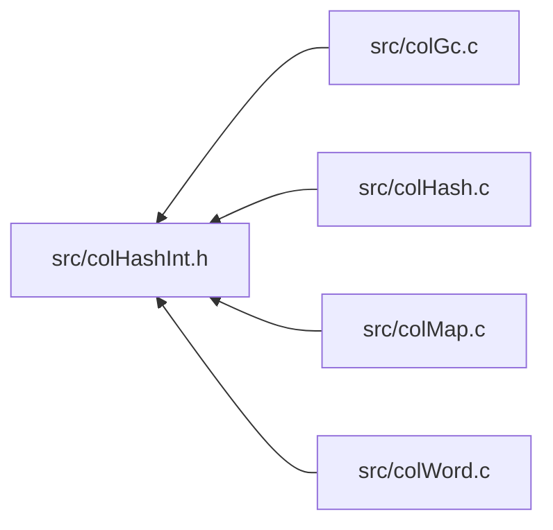

<a id="col_hash_int_8h"></a>
# File colHashInt.h

![][C++]

**Location**: `src/colHashInt.h`

This header file defines the hash map word internals of Colibri.

Hash maps are an implementation of generic [Maps](group__map__words.md#group__map__words) that use key hashing and flat bucket arrays for string, integer and custom keys.


They are always mutable.


**See also**: [colHash.c](col_hash_8c.md#col_hash_8c), [colHash.h](col_hash_8h.md#col_hash_8h), [colMapInt.h](col_map_int_8h.md#col_map_int_8h)

## Included by

* [src/colGc.c](col_gc_8c.md#col_gc_8c)
* [src/colHash.c](col_hash_8c.md#col_hash_8c)
* [src/colMap.c](col_map_8c.md#col_map_8c)
* [src/colWord.c](col_word_8c.md#col_word_8c)



## Hash Map Constants

<a id="group__hashmap__words_1gab5c22c8c77fb80c23a8d3126df5e5c99"></a>
### Macro HASHMAP\_HEADER\_SIZE

![][public]

```cpp
#define HASHMAP_HEADER_SIZE (sizeof([Col\_CustomWordType](struct_col___custom_word_type.md#struct_col___custom_word_type)*)+sizeof([Col\_Word](col_word_8h.md#group__words_1gadb626f9e195212e4fdfba7df154ad043))*2+sizeof(size_t))
```

Byte size of hash map header.


<a id="group__hashmap__words_1ga710819ab1cf311d4de22b99ebbda8dce"></a>
### Macro HASHMAP\_STATICBUCKETS\_NBCELLS

![][public]

```cpp
#define HASHMAP_STATICBUCKETS_NBCELLS 2
```

Number of cells allocated for static bucket array.


<a id="group__hashmap__words_1ga8f0861287a80e3337ce82e4b8b9654b5"></a>
### Macro HASHMAP\_STATICBUCKETS\_SIZE

![][public]

```cpp
#define HASHMAP_STATICBUCKETS_SIZE ([HASHMAP\_STATICBUCKETS\_NBCELLS](col_hash_int_8h.md#group__hashmap__words_1ga710819ab1cf311d4de22b99ebbda8dce)*[CELL\_SIZE](col_conf_8h.md#group__alloc_1ga7a4127f14f16563da90eb3c836bc404f)/sizeof([Col\_Word](col_word_8h.md#group__words_1gadb626f9e195212e4fdfba7df154ad043)))
```

Number of elements in static bucket array.


<a id="group__hashmap__words_1ga3d9cbe4590e682edade0bff62397c5e5"></a>
### Macro HASHMAP\_NBCELLS

![][public]

```cpp
#define HASHMAP_NBCELLS ([HASHMAP\_STATICBUCKETS\_NBCELLS](col_hash_int_8h.md#group__hashmap__words_1ga710819ab1cf311d4de22b99ebbda8dce)+1)
```

Number of cells taken by hash maps.


## Hash Map Accessors

<a id="group__hashmap__words_1gac639d1878d96d8bb8d825822bc104b8c"></a>
### Macro WORD\_HASHMAP\_SIZE

![][public]

```cpp
#define WORD_HASHMAP_SIZE (((size_t *)(word))[2])( word )
```

Get/set number of elements in map.

**Parameters**:

* **word**: Word to access.


?> Macro is L-Value and suitable for both read/write operations.


**See also**: [WORD\_HASHMAP\_INIT](col_hash_int_8h.md#group__customhashmap__words_1gaed8104676b6b22313024cdc8c93bfe7f), [WORD\_STRHASHMAP\_INIT](col_hash_int_8h.md#group__strhashmap__words_1ga251196179071b3d43a2195f5a4063373), [WORD\_INTHASHMAP\_INIT](col_hash_int_8h.md#group__inthashmap__words_1ga53503676dc5f75eb7894087cf53d8252)


<a id="group__hashmap__words_1gaa3913885cb3625fe8ba8582eb3323315"></a>
### Macro WORD\_HASHMAP\_BUCKETS

![][public]

```cpp
#define WORD_HASHMAP_BUCKETS ((([Col\_Word](col_word_8h.md#group__words_1gadb626f9e195212e4fdfba7df154ad043) *)(word))[3])( word )
```

Get/set bucket container.

**Parameters**:

* **word**: Word to access.


?> Macro is L-Value and suitable for both read/write operations.


**See also**: [WORD\_HASHMAP\_INIT](col_hash_int_8h.md#group__customhashmap__words_1gaed8104676b6b22313024cdc8c93bfe7f), [WORD\_STRHASHMAP\_INIT](col_hash_int_8h.md#group__strhashmap__words_1ga251196179071b3d43a2195f5a4063373), [WORD\_INTHASHMAP\_INIT](col_hash_int_8h.md#group__inthashmap__words_1ga53503676dc5f75eb7894087cf53d8252)


<a id="group__hashmap__words_1gaddefb58fdb19b68150e80719df52579a"></a>
### Macro WORD\_HASHMAP\_STATICBUCKETS

![][public]

```cpp
#define WORD_HASHMAP_STATICBUCKETS (([Col\_Word](col_word_8h.md#group__words_1gadb626f9e195212e4fdfba7df154ad043) *)((char *)(word)+[HASHMAP\_HEADER\_SIZE](col_hash_int_8h.md#group__hashmap__words_1gab5c22c8c77fb80c23a8d3126df5e5c99)))( word )
```

Pointer to inline bucket array for small sized maps.


## Hash Map Exceptions

<a id="group__hashmap__words_1gaabaaa46325ec29e8882ef1ec569687d2"></a>
### Macro TYPECHECK\_HASHMAP

![][public]

```cpp
#define TYPECHECK_HASHMAP( word )
```

Type checking macro for hash maps.

**Parameters**:

* **word**: Checked word.


**Exceptions**:

* **[COL\_ERROR\_HASHMAP](colibri_8h.md#group__error_1gga729084542ed9eae62009a84d3379ef35aa2ae78a1c25af13ee9ba866d5cb501a1)**: [[T]](colibri_8h.md#group__error_1gga6dab009a0b8c4b4fa080cb9ba1859e9ea603a58b9d5bb16fde0708eb0767e4904) **word**: Not a hash map.


<a id="group__hashmap__words_1ga289fc116a48446f5acf7c8e24e6a4ac4"></a>
### Macro TYPECHECK\_WORDHASHMAP

![][public]

```cpp
#define TYPECHECK_WORDHASHMAP( word )
```

Type checking macro for word-based hash maps (string or custom).

**Parameters**:

* **word**: Checked word.


**Exceptions**:

* **[COL\_ERROR\_WORDHASHMAP](colibri_8h.md#group__error_1gga729084542ed9eae62009a84d3379ef35a5bc15b91b43b981992b031a43e8c3e8d)**: [[T]](colibri_8h.md#group__error_1gga6dab009a0b8c4b4fa080cb9ba1859e9ea603a58b9d5bb16fde0708eb0767e4904) **word**: Not a string or word-keyed hash map.


## String Hash Map Creation

<a id="group__strhashmap__words_1ga251196179071b3d43a2195f5a4063373"></a>
### Macro WORD\_STRHASHMAP\_INIT

![][public]

```cpp
#define WORD_STRHASHMAP_INIT     [WORD\_SET\_TYPEID](col_word_int_8h.md#group__predefined__words_1ga52822cf424704829e60b112fe03614b6)((word), [WORD\_TYPE\_STRHASHMAP](col_word_int_8h.md#group__words_1ga4b4fdf9a2320675d8dd1dc29d0007564)); \
    [WORD\_SYNONYM](col_word_int_8h.md#group__regular__words_1ga19cfddbcf0127f5088803cc68ddb8eaa)(word) = [WORD\_NIL](col_word_8h.md#group__words_1ga29e370264f4e5659ccc5be4de209f065); \
    [WORD\_HASHMAP\_SIZE](col_hash_int_8h.md#group__hashmap__words_1gac639d1878d96d8bb8d825822bc104b8c)(word) = 0; \
    [WORD\_HASHMAP\_BUCKETS](col_hash_int_8h.md#group__hashmap__words_1gaa3913885cb3625fe8ba8582eb3323315)(word) = [WORD\_NIL](col_word_8h.md#group__words_1ga29e370264f4e5659ccc5be4de209f065);( word )
```

String hash map word initializer.

String hash maps are specialized hash maps using built-in compare and hash procs on string keys.


**Parameters**:

* **word**: Word to initialize.


!> **Warning** \
Argument **word** is referenced several times by the macro. Make sure to avoid any side effect.


**See also**: [WORD\_TYPE\_STRHASHMAP](col_word_int_8h.md#group__words_1ga4b4fdf9a2320675d8dd1dc29d0007564)


## Integer Hash Map Creation

<a id="group__inthashmap__words_1ga53503676dc5f75eb7894087cf53d8252"></a>
### Macro WORD\_INTHASHMAP\_INIT

![][public]

```cpp
#define WORD_INTHASHMAP_INIT     [WORD\_SET\_TYPEID](col_word_int_8h.md#group__predefined__words_1ga52822cf424704829e60b112fe03614b6)((word), [WORD\_TYPE\_INTHASHMAP](col_word_int_8h.md#group__words_1ga230c3d50685afa970c1e0da69feb5811)); \
    [WORD\_SYNONYM](col_word_int_8h.md#group__regular__words_1ga19cfddbcf0127f5088803cc68ddb8eaa)(word) = [WORD\_NIL](col_word_8h.md#group__words_1ga29e370264f4e5659ccc5be4de209f065); \
    [WORD\_HASHMAP\_SIZE](col_hash_int_8h.md#group__hashmap__words_1gac639d1878d96d8bb8d825822bc104b8c)(word) = 0; \
    [WORD\_HASHMAP\_BUCKETS](col_hash_int_8h.md#group__hashmap__words_1gaa3913885cb3625fe8ba8582eb3323315)(word) = [WORD\_NIL](col_word_8h.md#group__words_1ga29e370264f4e5659ccc5be4de209f065);( word )
```

Integer hash map word initializer.

Integer hash maps are specialized hash maps where the hash value is the randomized integer key.


**Parameters**:

* **word**: Word to initialize.


!> **Warning** \
Argument **word** is referenced several times by the macro. Make sure to avoid any side effect.


**See also**: [WORD\_TYPE\_INTHASHMAP](col_word_int_8h.md#group__words_1ga230c3d50685afa970c1e0da69feb5811)


## Integer Hash Map Exceptions

<a id="group__inthashmap__words_1gab451eefab69078045d4b5e92c07350f1"></a>
### Macro TYPECHECK\_INTHASHMAP

![][public]

```cpp
#define TYPECHECK_INTHASHMAP( word )
```

Type checking macro for integer hash maps.

**Parameters**:

* **word**: Checked word.


**Exceptions**:

* **[COL\_ERROR\_INTHASHMAP](colibri_8h.md#group__error_1gga729084542ed9eae62009a84d3379ef35a6adf7197e12916d0bdb78d890b43cf3d)**: [[T]](colibri_8h.md#group__error_1gga6dab009a0b8c4b4fa080cb9ba1859e9ea603a58b9d5bb16fde0708eb0767e4904) **word**: Not an integer-keyed hash map.


## Custom Hash Map Constants

<a id="group__customhashmap__words_1ga983e7c0095b8a45a118d43878c885814"></a>
### Macro CUSTOMHASHMAP\_HEADER\_SIZE

![][public]

```cpp
#define CUSTOMHASHMAP_HEADER_SIZE ([HASHMAP\_NBCELLS](col_hash_int_8h.md#group__hashmap__words_1ga3d9cbe4590e682edade0bff62397c5e5)*[CELL\_SIZE](col_conf_8h.md#group__alloc_1ga7a4127f14f16563da90eb3c836bc404f))
```

Byte size of custom hash map word header.


## Custom Hash Map Creation

<a id="group__customhashmap__words_1gaed8104676b6b22313024cdc8c93bfe7f"></a>
### Macro WORD\_HASHMAP\_INIT

![][public]

```cpp
#define WORD_HASHMAP_INIT     [WORD\_SET\_TYPEINFO](col_word_int_8h.md#group__custom__words_1gad327193f2befdd20bebdd2ee74023310)((word), (typeInfo)); \
    [WORD\_SYNONYM](col_word_int_8h.md#group__regular__words_1ga19cfddbcf0127f5088803cc68ddb8eaa)(word) = [WORD\_NIL](col_word_8h.md#group__words_1ga29e370264f4e5659ccc5be4de209f065); \
    [WORD\_HASHMAP\_SIZE](col_hash_int_8h.md#group__hashmap__words_1gac639d1878d96d8bb8d825822bc104b8c)(word) = 0; \
    [WORD\_HASHMAP\_BUCKETS](col_hash_int_8h.md#group__hashmap__words_1gaa3913885cb3625fe8ba8582eb3323315)(word) = [WORD\_NIL](col_word_8h.md#group__words_1ga29e370264f4e5659ccc5be4de209f065);( word ,typeInfo )
```

Custom hash map word initializer.

Custom hash maps are custom word types of type [COL\_HASHMAP](col_word_8h.md#group__words_1gae3509634e52a76014e96c2575b5d8092).


**Parameters**:

* **word**: Word to initialize.
* **typeInfo**: [WORD\_SET\_TYPEINFO](col_word_int_8h.md#group__custom__words_1gad327193f2befdd20bebdd2ee74023310).


**See also**: [Col\_CustomHashMapType](struct_col___custom_hash_map_type.md#struct_col___custom_hash_map_type)


## Hash Entry Creation

<a id="group__mhashentry__words_1ga467a83e27fa5bfd5eca35e6312d5fe5e"></a>
### Macro WORD\_MHASHENTRY\_INIT

![][public]

```cpp
#define WORD_MHASHENTRY_INIT     [WORD\_SET\_TYPEID](col_word_int_8h.md#group__predefined__words_1ga52822cf424704829e60b112fe03614b6)((word), [WORD\_TYPE\_MHASHENTRY](col_word_int_8h.md#group__words_1ga4c79463f98f0ec9296451862e5d0b76c)); \
    [WORD\_MAPENTRY\_KEY](col_map_int_8h.md#group__mapentry__words_1ga8664d15fae4553b47b658ac7ceb1443a)(word) = (key); \
    [WORD\_MAPENTRY\_VALUE](col_map_int_8h.md#group__mapentry__words_1gabad6806f2947f508a9786948c1663064)(word) = (value); \
    [WORD\_HASHENTRY\_NEXT](col_hash_int_8h.md#group__mhashentry__words_1ga9f087b8c13513115c5e1b19c86fbe145)(word) = (next); \
    [WORD\_HASHENTRY\_SET\_HASH](col_hash_int_8h.md#group__mhashentry__words_1ga6cba1b5e86476a239bc36a7f2818b1df)(word, hash);( word ,key ,value ,next ,hash )
```

Mutable hash entry word initializer.

**Parameters**:

* **word**: Word to initialize.
* **key**: [WORD\_MAPENTRY\_KEY](col_map_int_8h.md#group__mapentry__words_1ga8664d15fae4553b47b658ac7ceb1443a).
* **value**: [WORD\_MAPENTRY\_VALUE](col_map_int_8h.md#group__mapentry__words_1gabad6806f2947f508a9786948c1663064).
* **next**: [WORD\_HASHENTRY\_NEXT](col_hash_int_8h.md#group__mhashentry__words_1ga9f087b8c13513115c5e1b19c86fbe145).
* **hash**: [WORD\_HASHENTRY\_SET\_HASH](col_hash_int_8h.md#group__mhashentry__words_1ga6cba1b5e86476a239bc36a7f2818b1df).


!> **Warning** \
Argument **word** is referenced several times by the macro. Make sure to avoid any side effect.


**See also**: [WORD\_TYPE\_MHASHENTRY](col_word_int_8h.md#group__words_1ga4c79463f98f0ec9296451862e5d0b76c)


## Hash Entry Accessors

<a id="group__mhashentry__words_1ga1f31f4326456a1511d32accb096baa63"></a>
### Macro HASHENTRY\_HASH\_MASK

![][public]

```cpp
#define HASHENTRY_HASH_MASK (UINTPTR_MAX^UCHAR_MAX)
```

Bitmask for hash value.


<a id="group__mhashentry__words_1ga54cafd113b5788e58294047e3e3cbe7c"></a>
### Macro WORD\_HASHENTRY\_HASH

![][public]

```cpp
#define WORD_HASHENTRY_HASH ((((uintptr_t *)(word))[0]<<CHAR_BIT)&[HASHENTRY\_HASH\_MASK](col_hash_int_8h.md#group__mhashentry__words_1ga1f31f4326456a1511d32accb096baa63))( word )
```

Get higher order bits of the hash value.

**Parameters**:

* **word**: Word to access.


**See also**: [WORD\_HASHENTRY\_SET\_HASH](col_hash_int_8h.md#group__mhashentry__words_1ga6cba1b5e86476a239bc36a7f2818b1df)


<a id="group__mhashentry__words_1ga6cba1b5e86476a239bc36a7f2818b1df"></a>
### Macro WORD\_HASHENTRY\_SET\_HASH

![][public]

```cpp
#define WORD_HASHENTRY_SET_HASH ((((uintptr_t *)(word))[0])&=~([HASHENTRY\_HASH\_MASK](col_hash_int_8h.md#group__mhashentry__words_1ga1f31f4326456a1511d32accb096baa63)>>CHAR_BIT),(((uintptr_t *)(word))[0])|=(((hash)&[HASHENTRY\_HASH\_MASK](col_hash_int_8h.md#group__mhashentry__words_1ga1f31f4326456a1511d32accb096baa63))>>CHAR_BIT))( word ,hash )
```

Set hash value.

**Parameters**:

* **word**: Word to access.
* **hash**: Hash value. Only retains the high order bits.


!> **Warning** \
Argument **word** is referenced several times by the macro. Make sure to avoid any side effect.


**See also**: [WORD\_HASHENTRY\_HASH](col_hash_int_8h.md#group__mhashentry__words_1ga54cafd113b5788e58294047e3e3cbe7c), [WORD\_HASHENTRY\_INIT](col_hash_int_8h.md#group__hashentry__words_1ga85cea176e564f2dafee1d93a21e75666), [WORD\_MHASHENTRY\_INIT](col_hash_int_8h.md#group__mhashentry__words_1ga467a83e27fa5bfd5eca35e6312d5fe5e)


<a id="group__mhashentry__words_1ga9f087b8c13513115c5e1b19c86fbe145"></a>
### Macro WORD\_HASHENTRY\_NEXT

![][public]

```cpp
#define WORD_HASHENTRY_NEXT ((([Col\_Word](col_word_8h.md#group__words_1gadb626f9e195212e4fdfba7df154ad043) *)(word))[1])( word )
```

Get/set pointer to next entry in bucket.

**Parameters**:

* **word**: Word to access.


?> Macro is L-Value and suitable for both read/write operations.


**See also**: [WORD\_HASHENTRY\_INIT](col_hash_int_8h.md#group__hashentry__words_1ga85cea176e564f2dafee1d93a21e75666), [WORD\_MHASHENTRY\_INIT](col_hash_int_8h.md#group__mhashentry__words_1ga467a83e27fa5bfd5eca35e6312d5fe5e), [WORD\_INTHASHENTRY\_INIT](col_hash_int_8h.md#group__inthashentry__words_1ga328cd7bfb2227f0d1dce5d93e8252378), [WORD\_MINTHASHENTRY\_INIT](col_hash_int_8h.md#group__minthashentry__words_1ga0d1fde498a4661bd712715552c7fc675)


## Immutable Hash Entry Creation

<a id="group__hashentry__words_1ga85cea176e564f2dafee1d93a21e75666"></a>
### Macro WORD\_HASHENTRY\_INIT

![][public]

```cpp
#define WORD_HASHENTRY_INIT     [WORD\_SET\_TYPEID](col_word_int_8h.md#group__predefined__words_1ga52822cf424704829e60b112fe03614b6)((word), [WORD\_TYPE\_HASHENTRY](col_word_int_8h.md#group__words_1ga0ccfe6bc407371b3c2cde0a2da83f9fa)); \
    [WORD\_MAPENTRY\_KEY](col_map_int_8h.md#group__mapentry__words_1ga8664d15fae4553b47b658ac7ceb1443a)(word) = (key); \
    [WORD\_MAPENTRY\_VALUE](col_map_int_8h.md#group__mapentry__words_1gabad6806f2947f508a9786948c1663064)(word) = (value); \
    [WORD\_HASHENTRY\_NEXT](col_hash_int_8h.md#group__mhashentry__words_1ga9f087b8c13513115c5e1b19c86fbe145)(word) = (next); \
    [WORD\_HASHENTRY\_SET\_HASH](col_hash_int_8h.md#group__mhashentry__words_1ga6cba1b5e86476a239bc36a7f2818b1df)(word, hash);( word ,key ,value ,next ,hash )
```

Immutable hash entry word initializer.

**Parameters**:

* **word**: Word to initialize.
* **key**: [WORD\_MAPENTRY\_KEY](col_map_int_8h.md#group__mapentry__words_1ga8664d15fae4553b47b658ac7ceb1443a).
* **value**: [WORD\_MAPENTRY\_VALUE](col_map_int_8h.md#group__mapentry__words_1gabad6806f2947f508a9786948c1663064).
* **next**: [WORD\_HASHENTRY\_NEXT](col_hash_int_8h.md#group__mhashentry__words_1ga9f087b8c13513115c5e1b19c86fbe145).
* **hash**: [WORD\_HASHENTRY\_SET\_HASH](col_hash_int_8h.md#group__mhashentry__words_1ga6cba1b5e86476a239bc36a7f2818b1df).


!> **Warning** \
Argument **word** is referenced several times by the macro. Make sure to avoid any side effect.


**See also**: [WORD\_TYPE\_HASHENTRY](col_word_int_8h.md#group__words_1ga0ccfe6bc407371b3c2cde0a2da83f9fa)


## Integer Hash Entry Creation

<a id="group__minthashentry__words_1ga0d1fde498a4661bd712715552c7fc675"></a>
### Macro WORD\_MINTHASHENTRY\_INIT

![][public]

```cpp
#define WORD_MINTHASHENTRY_INIT     [WORD\_SET\_TYPEID](col_word_int_8h.md#group__predefined__words_1ga52822cf424704829e60b112fe03614b6)((word), [WORD\_TYPE\_MINTHASHENTRY](col_word_int_8h.md#group__words_1ga1758f2fa0c44200f5782e548c5b33c7e)); \
    [WORD\_INTMAPENTRY\_KEY](col_map_int_8h.md#group__intmapentry__words_1ga89e26360d76aaad985afd89da56d1539)(word) = (key); \
    [WORD\_MAPENTRY\_VALUE](col_map_int_8h.md#group__mapentry__words_1gabad6806f2947f508a9786948c1663064)(word) = (value); \
    [WORD\_HASHENTRY\_NEXT](col_hash_int_8h.md#group__mhashentry__words_1ga9f087b8c13513115c5e1b19c86fbe145)(word) = (next);( word ,key ,value ,next )
```

Mutable integer hash entry word initializer.

**Parameters**:

* **word**: Word to initialize.
* **key**: [WORD\_INTMAPENTRY\_KEY](col_map_int_8h.md#group__intmapentry__words_1ga89e26360d76aaad985afd89da56d1539).
* **value**: [WORD\_MAPENTRY\_VALUE](col_map_int_8h.md#group__mapentry__words_1gabad6806f2947f508a9786948c1663064).
* **next**: [WORD\_HASHENTRY\_NEXT](col_hash_int_8h.md#group__mhashentry__words_1ga9f087b8c13513115c5e1b19c86fbe145).


!> **Warning** \
Argument **word** is referenced several times by the macro. Make sure to avoid any side effect.


**See also**: [WORD\_TYPE\_MINTHASHENTRY](col_word_int_8h.md#group__words_1ga1758f2fa0c44200f5782e548c5b33c7e)


## Immutable Integer Hash Entry Creation

<a id="group__inthashentry__words_1ga328cd7bfb2227f0d1dce5d93e8252378"></a>
### Macro WORD\_INTHASHENTRY\_INIT

![][public]

```cpp
#define WORD_INTHASHENTRY_INIT     [WORD\_SET\_TYPEID](col_word_int_8h.md#group__predefined__words_1ga52822cf424704829e60b112fe03614b6)((word), [WORD\_TYPE\_INTHASHENTRY](col_word_int_8h.md#group__words_1gab1a5b3b65a05c74cd3973db9dce4a781)); \
    [WORD\_INTMAPENTRY\_KEY](col_map_int_8h.md#group__intmapentry__words_1ga89e26360d76aaad985afd89da56d1539)(word) = (key); \
    [WORD\_MAPENTRY\_VALUE](col_map_int_8h.md#group__mapentry__words_1gabad6806f2947f508a9786948c1663064)(word) = (value); \
    [WORD\_HASHENTRY\_NEXT](col_hash_int_8h.md#group__mhashentry__words_1ga9f087b8c13513115c5e1b19c86fbe145)(word) = (next);( word ,key ,value ,next )
```

Immutable integer hash entry word initializer.

**Parameters**:

* **word**: Word to initialize.
* **key**: [WORD\_INTMAPENTRY\_KEY](col_map_int_8h.md#group__intmapentry__words_1ga89e26360d76aaad985afd89da56d1539).
* **value**: [WORD\_MAPENTRY\_VALUE](col_map_int_8h.md#group__mapentry__words_1gabad6806f2947f508a9786948c1663064).
* **next**: [WORD\_HASHENTRY\_NEXT](col_hash_int_8h.md#group__mhashentry__words_1ga9f087b8c13513115c5e1b19c86fbe145).


!> **Warning** \
Argument **word** is referenced several times by the macro. Make sure to avoid any side effect.


**See also**: [WORD\_TYPE\_INTHASHENTRY](col_word_int_8h.md#group__words_1gab1a5b3b65a05c74cd3973db9dce4a781)


## Source

```cpp
/**
 * @file colHashInt.h
 *
 * This header file defines the hash map word internals of Colibri.
 *
 * Hash maps are an implementation of generic @ref map_words that use key
 * hashing and flat bucket arrays for string, integer and custom keys.
 *
 * They are always mutable.
 *
 * @see colHash.c
 * @see colHash.h
 * @see colMapInt.h
 *
 * @beginprivate @cond PRIVATE
 */

#ifndef _COLIBRI_HASH_INT
#define _COLIBRI_HASH_INT


/*
===========================================================================*//*!
\internal \addtogroup hashmap_words Hash Maps

@par Requirements
    - Hash maps can use string or integer keys, but also custom keys. In the
      latter case they need to point to custom word type information. So
      string and integer keyed hash maps use predefined numeric types, and
      custom keyed hash maps use a custom word type.

    - As hash maps are containers they must know their size, i.e. the number
      of entries they contain.

    - Hash maps store entries in buckets according to their hash value.
      Buckets are flat arrays of entries (themselves forming a linked
      list). So hash maps must know the location of their bucket container.
      For small sizes, buckets are stored inline within the word cells. For
      larger sizes we use @ref mvector_words for container.

    - Hash map words use one cell for the header plus several extra cells for
      static buckets (see #HASHMAP_STATICBUCKETS_NBCELLS).

    @param Type             Type descriptor.
    @param Synonym          [Generic word synonym field](@ref WORD_SYNONYM).
    @param Size             Number of elements in map.
    @param Buckets          Bucket container for larger sizes. If nil, buckets
                            are stored in the inline static bucket array. Else
                            they use @ref mvector_words.
    @param Static_buckets   Buckets for smaller sizes.

@par Cell Layout
    On all architectures the cell layout is as follows:

    @dot
    digraph {
        node [fontname="Lucida Console,Courier" fontsize=14];
        hashmap_word [shape=none, label=<
            <table border="0" cellborder="1" cellspacing="0">
            <tr><td border="0"></td>
                <td sides="B" width="160" align="left">0</td><td sides="B" width="160" align="right">n</td>
            </tr>
            <tr><td sides="R">0</td>
                <td href="@ref WORD_TYPEINFO" title="WORD_TYPEINFO" colspan="2" width="320">Type</td>
            </tr>
            <tr><td sides="R">1</td>
                <td href="@ref WORD_SYNONYM" title="WORD_SYNONYM" colspan="2">Synonym</td>
            </tr>
            <tr><td sides="R">2</td>
                <td href="@ref WORD_HASHMAP_SIZE" title="WORD_HASHMAP_SIZE" colspan="2">Size</td>
            </tr>
            <tr><td sides="R">3</td>
                <td href="@ref WORD_HASHMAP_BUCKETS" title="WORD_HASHMAP_BUCKETS" colspan="2">Buckets</td>
            </tr>
            <tr><td sides="R">.</td>
                <td href="@ref WORD_HASHMAP_STATICBUCKETS" title="WORD_HASHMAP_STATICBUCKETS" colspan="2" rowspan="4">Static buckets</td>
            </tr>
            <tr><td sides="R">.</td></tr>
            <tr><td sides="R">N</td></tr>
            </table>
        >]
    }
    @enddot

    @begindiagram
           0                                                             n
          +---------------------------------------------------------------+
        0 |                           Type info                           |
          +---------------------------------------------------------------+
        1 |                            Synonym                            |
          +---------------------------------------------------------------+
        2 |                             Size                              |
          +---------------------------------------------------------------+
        3 |                            Buckets                            |
          +---------------------------------------------------------------+
          .                                                               .
          .                        Static buckets                         .
        N |                                                               |
          +---------------------------------------------------------------+
    @enddiagram

\{*//*==========================================================================
*/

/***************************************************************************//*!
 * \name Hash Map Constants
 ***************************************************************************\{*/

/** Byte size of hash map header. */
#define HASHMAP_HEADER_SIZE             (sizeof(Col_CustomWordType*)+sizeof(Col_Word)*2+sizeof(size_t))

/** Number of cells allocated for static bucket array. */
#define HASHMAP_STATICBUCKETS_NBCELLS   2

/** Number of elements in static bucket array. */
#define HASHMAP_STATICBUCKETS_SIZE      (HASHMAP_STATICBUCKETS_NBCELLS*CELL_SIZE/sizeof(Col_Word))

/** Number of cells taken by hash maps. */
#define HASHMAP_NBCELLS                 (HASHMAP_STATICBUCKETS_NBCELLS+1)

/* End of Hash Map Constants *//*!\}*/


/***************************************************************************//*!
 * \name Hash Map Accessors
 ***************************************************************************\{*/

/**
 * Get/set number of elements in map.
 *
 * @param word  Word to access.
 *
 * @note
 *      Macro is L-Value and suitable for both read/write operations.
 *
 * @see WORD_HASHMAP_INIT
 * @see WORD_STRHASHMAP_INIT
 * @see WORD_INTHASHMAP_INIT
 */
#define WORD_HASHMAP_SIZE(word)         (((size_t *)(word))[2])

/**
 * Get/set bucket container.
 *
 * @param word  Word to access.
 *
 * @note
 *      Macro is L-Value and suitable for both read/write operations.
 *
 * @see WORD_HASHMAP_INIT
 * @see WORD_STRHASHMAP_INIT
 * @see WORD_INTHASHMAP_INIT
 */
#define WORD_HASHMAP_BUCKETS(word)      (((Col_Word *)(word))[3])

/**
 * Pointer to inline bucket array for small sized maps.
 */
#define WORD_HASHMAP_STATICBUCKETS(word) ((Col_Word *)((char *)(word)+HASHMAP_HEADER_SIZE))

/* End of Hash Map Accessors *//*!\}*/


/***************************************************************************//*!
 * \name Hash Map Exceptions
 ***************************************************************************\{*/

/**
 * Type checking macro for hash maps.
 *
 * @param word  Checked word.
 *
 * @typecheck{COL_ERROR_HASHMAP,word}
 * @hideinitializer
 */
#define TYPECHECK_HASHMAP(word) \
    TYPECHECK((Col_WordType(word) & COL_HASHMAP), COL_ERROR_HASHMAP, (word))

/**
 * Type checking macro for word-based hash maps (string or custom).
 *
 * @param word  Checked word.
 *
 * @typecheck{COL_ERROR_WORDHASHMAP,word}
 * @hideinitializer
 */
#define TYPECHECK_WORDHASHMAP(word) \
    TYPECHECK(((Col_WordType(word) & (COL_HASHMAP | COL_INTMAP)) \
            == COL_HASHMAP), COL_ERROR_WORDHASHMAP, (word))

/* End of Hash Map Exceptions *//*!\}*/

/* End of Hash Maps *//*!\}*/


/*
===========================================================================*//*!
\internal \defgroup strhashmap_words String Hash Maps
\ingroup predefined_words strmap_words hashmap_words

String hash maps are @ref hashmap_words with string keys.

@see WORD_TYPE_STRHASHMAP
\{*//*==========================================================================
*/

/***************************************************************************//*!
 * \name String Hash Map Creation
 ***************************************************************************\{*/

/**
 * String hash map word initializer.
 *
 * String hash maps are specialized hash maps using built-in compare and
 * hash procs on string keys.
 *
 * @param word  Word to initialize.
 *
 * @warning
 *      Argument **word** is referenced several times by the macro. Make sure to
 *      avoid any side effect.
 *
 * @see WORD_TYPE_STRHASHMAP
 */
#define WORD_STRHASHMAP_INIT(word) \
    WORD_SET_TYPEID((word), WORD_TYPE_STRHASHMAP); \
    WORD_SYNONYM(word) = WORD_NIL; \
    WORD_HASHMAP_SIZE(word) = 0; \
    WORD_HASHMAP_BUCKETS(word) = WORD_NIL;

/* End of String Hash Map Creation *//*!\}*/

/* End of String Hash Maps *//*!\}*/


/*
===========================================================================*//*!
\internal \defgroup inthashmap_words Integer Hash Maps
\ingroup predefined_words intmap_words hashmap_words

Integer hash maps are @ref hashmap_words with integer keys.

@see WORD_TYPE_INTHASHMAP
\{*//*==========================================================================
*/

/***************************************************************************//*!
 * \name Integer Hash Map Creation
 ***************************************************************************\{*/

/**
 * Integer hash map word initializer.
 *
 * Integer hash maps are specialized hash maps where the hash value is the
 * randomized integer key.
 *
 * @param word  Word to initialize.
 *
 * @warning
 *      Argument **word** is referenced several times by the macro. Make sure to
 *      avoid any side effect.
 *
 * @see WORD_TYPE_INTHASHMAP
 */
#define WORD_INTHASHMAP_INIT(word) \
    WORD_SET_TYPEID((word), WORD_TYPE_INTHASHMAP); \
    WORD_SYNONYM(word) = WORD_NIL; \
    WORD_HASHMAP_SIZE(word) = 0; \
    WORD_HASHMAP_BUCKETS(word) = WORD_NIL;

/* End of Integer Hash Map Creation *//*!\}*/


/***************************************************************************//*!
 * \name Integer Hash Map Exceptions
 ***************************************************************************\{*/

/**
 * Type checking macro for integer hash maps.
 *
 * @param word  Checked word.
 *
 * @typecheck{COL_ERROR_INTHASHMAP,word}
 * @hideinitializer
 */
#define TYPECHECK_INTHASHMAP(word) \
    TYPECHECK(((Col_WordType(word) & (COL_HASHMAP | COL_INTMAP)) \
            == (COL_HASHMAP | COL_INTMAP)), COL_ERROR_INTHASHMAP, (word))

/* End of Integer Hash Map Creation *//*!\}*/

/* End of Integer Hash Maps *//*!\}*/


/*
===========================================================================*//*!
\internal \addtogroup customhashmap_words Custom Hash Maps
\{*//*==========================================================================
*/

/***************************************************************************//*!
 * \name Custom Hash Map Constants
 ***************************************************************************\{*/

/** Byte size of custom hash map word header. */
#define CUSTOMHASHMAP_HEADER_SIZE       (HASHMAP_NBCELLS*CELL_SIZE)

/* End of Custom Hash Map Constants *//*!\}*/


/***************************************************************************//*!
 * \name Custom Hash Map Creation
 ***************************************************************************\{*/

/**
 * Custom hash map word initializer.
 *
 * Custom hash maps are custom word types of type #COL_HASHMAP.
 *
 * @param word      Word to initialize.
 * @param typeInfo  #WORD_SET_TYPEINFO.
 *
 * @see Col_CustomHashMapType
 */
#define WORD_HASHMAP_INIT(word, typeInfo) \
    WORD_SET_TYPEINFO((word), (typeInfo)); \
    WORD_SYNONYM(word) = WORD_NIL; \
    WORD_HASHMAP_SIZE(word) = 0; \
    WORD_HASHMAP_BUCKETS(word) = WORD_NIL;

/* End of Custom Hash Map Creation *//*!\}*/

/* End of Custom Hash Maps *//*!\}*/


/*
===========================================================================*//*!
\internal \defgroup mhashentry_words Hash Entries
\ingroup predefined_words mapentry_words hashmap_words

Hash entries are @ref mapentry_words with hash-specific data.

@par Requirements
    - Hash entry words, like generic @ref mapentry_words, use one single cell.

    - Hash entries sharing the same bucket are chained using a linked list, so
      each entry store must store a pointer to the next entry in chain.

    - In addition we cache part of the hash value in the remaining bytes to
      avoid recomputing in many cases.

    @param Key    [Generic map entry key field](@ref WORD_MAPENTRY_KEY).
    @param Value  [Generic map entry value field](@ref WORD_MAPENTRY_VALUE).
    @param Next   Next entry in bucket. Also used during iteration.
    @param Hash   Higher order bits of the hash value for fast negative test
                  and rehashing. The full value is computed by combining these
                  high order bits and the bucket index whenever possible, else
                  the value is recomputed from the key.

@par Cell Layout
    On all architectures the single-cell layout is as follows:

    @dot
    digraph {
        node [fontname="Lucida Console,Courier" fontsize=14];
        hashentry_word [shape=none, label=<
            <table border="0" cellborder="1" cellspacing="0">
            <tr><td border="0"></td>
                <td sides="B" width="40" align="left">0</td><td sides="B" width="40" align="right">7</td>
                <td sides="B" width="120" align="left">8</td><td sides="B" width="120" align="right">n</td>
            </tr>
            <tr><td sides="R">0</td>
                <td href="@ref WORD_TYPEID" title="WORD_TYPEID" colspan="2">Type</td>
                <td href="@ref WORD_HASHENTRY_HASH" title="WORD_HASHENTRY_HASH" colspan="2">Hash</td>
            </tr>
            <tr><td sides="R">1</td>
                <td href="@ref WORD_HASHENTRY_NEXT" title="WORD_HASHENTRY_NEXT" colspan="4">Next</td>
            </tr>
            <tr><td sides="R">2</td>
                <td href="@ref WORD_MAPENTRY_KEY" title="WORD_MAPENTRY_KEY" colspan="4">Key (Generic)</td>
            </tr>
            <tr><td sides="R">3</td>
                <td href="@ref WORD_MAPENTRY_VALUE" title="WORD_MAPENTRY_VALUE" colspan="4">Value (Generic)</td>
            </tr>
            </table>
        >]
    }
    @enddot

    @begindiagram
           0     7 8                                                     n
          +-------+-------------------------------------------------------+
        0 | Type  |                         Hash                          |
          +-------+-------------------------------------------------------+
        1 |                             Next                              |
          +---------------------------------------------------------------+
        2 |                          Key (Generic)                        |
          +---------------------------------------------------------------+
        3 |                         Value (Generic)                       |
          +---------------------------------------------------------------+
    @enddiagram

@see @ref mapentry_words
@see @ref hashmap_words
\{*//*==========================================================================
*/

/***************************************************************************//*!
 * \name Hash Entry Creation
 ***************************************************************************\{*/

/**
 * Mutable hash entry word initializer.
 *
 * @param word    Word to initialize.
 * @param key     #WORD_MAPENTRY_KEY.
 * @param value   #WORD_MAPENTRY_VALUE.
 * @param next    #WORD_HASHENTRY_NEXT.
 * @param hash    #WORD_HASHENTRY_SET_HASH.
 *
 * @warning
 *      Argument **word** is referenced several times by the macro. Make sure to
 *      avoid any side effect.
 *
 * @see WORD_TYPE_MHASHENTRY
 */
#define WORD_MHASHENTRY_INIT(word, key, value, next, hash) \
    WORD_SET_TYPEID((word), WORD_TYPE_MHASHENTRY); \
    WORD_MAPENTRY_KEY(word) = (key); \
    WORD_MAPENTRY_VALUE(word) = (value); \
    WORD_HASHENTRY_NEXT(word) = (next); \
    WORD_HASHENTRY_SET_HASH(word, hash);

/* End of Custom Hash Map Creation *//*!\}*/


/***************************************************************************//*!
 * \name Hash Entry Accessors
 ***************************************************************************\{*/

/** Bitmask for hash value */
#define HASHENTRY_HASH_MASK             (UINTPTR_MAX^UCHAR_MAX)

/**
 * Get higher order bits of the hash value.
 *
 * @param word  Word to access.
 *
 * @see WORD_HASHENTRY_SET_HASH
 */
#ifdef COL_BIGENDIAN
#   define WORD_HASHENTRY_HASH(word)    ((((uintptr_t *)(word))[0]<<CHAR_BIT)&HASHENTRY_HASH_MASK)
#else
#   define WORD_HASHENTRY_HASH(word)    ((((uintptr_t *)(word))[0])&HASHENTRY_HASH_MASK)
#endif

/**
 * Set hash value.
 *
 * @param word  Word to access.
 * @param hash  Hash value. Only retains the high order bits.
 *
 * @warning
 *      Argument **word** is referenced several times by the macro. Make sure to
 *      avoid any side effect.
 *
 * @see WORD_HASHENTRY_HASH
 * @see WORD_HASHENTRY_INIT
 * @see WORD_MHASHENTRY_INIT
 *
 */
#ifdef COL_BIGENDIAN
#   define WORD_HASHENTRY_SET_HASH(word, hash) ((((uintptr_t *)(word))[0])&=~(HASHENTRY_HASH_MASK>>CHAR_BIT),(((uintptr_t *)(word))[0])|=(((hash)&HASHENTRY_HASH_MASK)>>CHAR_BIT))
#else
#   define WORD_HASHENTRY_SET_HASH(word, hash) ((((uintptr_t *)(word))[0])&=~HASHENTRY_HASH_MASK,(((uintptr_t *)(word))[0])|=((hash)&HASHENTRY_HASH_MASK))
#endif

/**
 * Get/set pointer to next entry in bucket.
 *
 * @param word  Word to access.
 *
 * @note
 *      Macro is L-Value and suitable for both read/write operations.
 *
 * @see WORD_HASHENTRY_INIT
 * @see WORD_MHASHENTRY_INIT
 * @see WORD_INTHASHENTRY_INIT
 * @see WORD_MINTHASHENTRY_INIT
 */
#define WORD_HASHENTRY_NEXT(word)       (((Col_Word *)(word))[1])

/* End of Hash Entry Accessors *//*!\}*/

/* End of Hash Entries *//*!\}*/


/*
===========================================================================*//*!
\internal \defgroup hashentry_words Immutable Hash Entries
\ingroup predefined_words mapentry_words hashmap_words mhashentry_words

Immutable hash entries are @ref mapentry_words with hash-specific data.

They are former @ref mhashentry_words that became immutable as a result of
a copy (see #Col_CopyHashMap): in this case the copy and the original
would share most of their internals (rendered immutable in the process).
Likewise, mutable operations on the copies would use copy-on-write
semantics: immutable structures are copied to new mutable ones before
modification.

@see @ref mapentry_words
@see @ref mhashentry_words
@see @ref hashmap_words
\{*//*==========================================================================
*/

/***************************************************************************//*!
 * \name Immutable Hash Entry Creation
 ***************************************************************************\{*/

/**
 * Immutable hash entry word initializer.
 *
 * @param word    Word to initialize.
 * @param key     #WORD_MAPENTRY_KEY.
 * @param value   #WORD_MAPENTRY_VALUE.
 * @param next    #WORD_HASHENTRY_NEXT.
 * @param hash    #WORD_HASHENTRY_SET_HASH.
 *
 * @warning
 *      Argument **word** is referenced several times by the macro. Make sure to
 *      avoid any side effect.
 *
 * @see WORD_TYPE_HASHENTRY
 */
#define WORD_HASHENTRY_INIT(word, key, value, next, hash) \
    WORD_SET_TYPEID((word), WORD_TYPE_HASHENTRY); \
    WORD_MAPENTRY_KEY(word) = (key); \
    WORD_MAPENTRY_VALUE(word) = (value); \
    WORD_HASHENTRY_NEXT(word) = (next); \
    WORD_HASHENTRY_SET_HASH(word, hash);

/* End of Immutable Hash Entry Creation *//*!\}*/

/* End of Immutable Hash Entries *//*!\}*/


/*
===========================================================================*//*!
\internal \defgroup minthashentry_words Integer Hash Entries
\ingroup predefined_words mapentry_words inthashmap_words

Integer hash entries are @ref intmapentry_words with hash-specific data.

@par Requirements
    - Integer hash entry words, like generic @ref intmapentry_words, use one
      single cell.

    - Integer hash entries sharing the same bucket are chained using a linked
      list, so each entry store must store a pointer to the next entry in chain.

    @param Key    [Generic integer map entry key field](@ref WORD_INTMAPENTRY_KEY).
    @param Value  [Generic map entry value field](@ref WORD_MAPENTRY_VALUE).
    @param Next   Next entry in bucket. Also used during iteration.

@par Cell Layout
    On all architectures the single-cell layout is as follows:

    @dot
    digraph {
        node [fontname="Lucida Console,Courier" fontsize=14];
        inthashentry_word [shape=none, label=<
            <table border="0" cellborder="1" cellspacing="0">
            <tr><td border="0"></td>
                <td sides="B" width="40" align="left">0</td><td sides="B" width="40" align="right">7</td>
                <td sides="B" width="120" align="left">8</td><td sides="B" width="120" align="right">n</td>
            </tr>
            <tr><td sides="R">0</td>
                <td href="@ref WORD_TYPEID" title="WORD_TYPEID" colspan="2">Type</td>
                <td colspan="2" bgcolor="grey75">Unused</td>
            </tr>
            <tr><td sides="R">1</td>
                <td href="@ref WORD_HASHENTRY_NEXT" title="WORD_HASHENTRY_NEXT" colspan="4">Next</td>
            </tr>
            <tr><td sides="R">2</td>
                <td href="@ref WORD_INTMAPENTRY_KEY" title="WORD_INTMAPENTRY_KEY" colspan="4">Key (Generic)</td>
            </tr>
            <tr><td sides="R">3</td>
                <td href="@ref WORD_MAPENTRY_VALUE" title="WORD_MAPENTRY_VALUE" colspan="4">Value (Generic)</td>
            </tr>
            </table>
        >]
    }
    @enddot

    @begindiagram
           0     7 8                                                     n
          +-------+-------------------------------------------------------+
        0 | Type  |                        Unused                         |
          +-------+-------------------------------------------------------+
        1 |                             Next                              |
          +---------------------------------------------------------------+
        2 |                          Key (Generic)                        |
          +---------------------------------------------------------------+
        3 |                         Value (Generic)                       |
          +---------------------------------------------------------------+
    @enddiagram

@see @ref intmapentry_words
@see @ref inthashmap_words
@see @ref inthashentry_words
\{*//*==========================================================================
*/

/***************************************************************************//*!
 * \name Integer Hash Entry Creation
 ***************************************************************************\{*/

/**
 * Mutable integer hash entry word initializer.
 *
 * @param word    Word to initialize.
 * @param key     #WORD_INTMAPENTRY_KEY.
 * @param value   #WORD_MAPENTRY_VALUE.
 * @param next    #WORD_HASHENTRY_NEXT.
 *
 * @warning
 *      Argument **word** is referenced several times by the macro. Make sure to
 *      avoid any side effect.
 *
 * @see WORD_TYPE_MINTHASHENTRY
 */
#define WORD_MINTHASHENTRY_INIT(word, key, value, next) \
    WORD_SET_TYPEID((word), WORD_TYPE_MINTHASHENTRY); \
    WORD_INTMAPENTRY_KEY(word) = (key); \
    WORD_MAPENTRY_VALUE(word) = (value); \
    WORD_HASHENTRY_NEXT(word) = (next);

/* End of Integer Hash Entry Creation *//*!\}*/

/* End of Integer Hash Entries *//*!\}*/


/*
===========================================================================*//*!
\internal \defgroup inthashentry_words Immutable Integer Hash Entries
\ingroup predefined_words mapentry_words inthashmap_words minthashentry_words

Immutable integer hash entries are @ref mapentry_words with hash-specific
data.

They are former @ref minthashentry_words that became immutable as a result of
a copy (see #Col_CopyHashMap): in this case the copy and the original
would share most of their internals (rendered immutable in the process).
Likewise, mutable operations on the copies would use copy-on-write
semantics: immutable structures are copied to new mutable ones before
modification.

@see @ref mapentry_words
@see @ref minthashentry_words
@see @ref hashmap_words
\{*//*==========================================================================
*/

/***************************************************************************//*!
 * \name Immutable Integer Hash Entry Creation
 ***************************************************************************\{*/

/**
 * Immutable integer hash entry word initializer.
 *
 * @param word    Word to initialize.
 * @param key     #WORD_INTMAPENTRY_KEY.
 * @param value   #WORD_MAPENTRY_VALUE.
 * @param next    #WORD_HASHENTRY_NEXT.
 *
 * @warning
 *      Argument **word** is referenced several times by the macro. Make sure to
 *      avoid any side effect.
 *
 * @see WORD_TYPE_INTHASHENTRY
 */
#define WORD_INTHASHENTRY_INIT(word, key, value, next) \
    WORD_SET_TYPEID((word), WORD_TYPE_INTHASHENTRY); \
    WORD_INTMAPENTRY_KEY(word) = (key); \
    WORD_MAPENTRY_VALUE(word) = (value); \
    WORD_HASHENTRY_NEXT(word) = (next);

/* End of Immutable Integer Hash Entry Creation *//*!\}*/

/* End of Immutable Integer Hash Entries *//*!\}*/

#endif /* _COLIBRI_HASH_INT */
/*! @endcond @endprivate */
```

[public]: https://img.shields.io/badge/-public-brightgreen (public)
[C++]: https://img.shields.io/badge/language-C%2B%2B-blue (C++)
[private]: https://img.shields.io/badge/-private-red (private)
[Markdown]: https://img.shields.io/badge/language-Markdown-blue (Markdown)