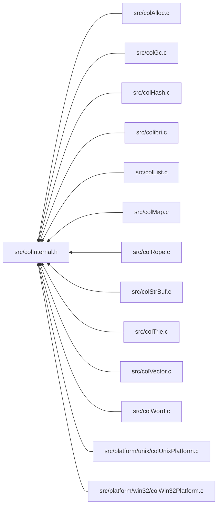

<a id="col_internal_8h"></a>
# File colInternal.h

![][C++]

**Location**: `src/colInternal.h`

This header file defines internal structures and macros.


## Classes

* [MemoryPool](struct_memory_pool.md#struct_memory_pool)
* [GroupData](struct_group_data.md#struct_group_data)
* [ThreadData](struct_thread_data.md#struct_thread_data)

## Includes

* [colConf.h](col_conf_8h.md#col_conf_8h)


## Included by

* [src/colAlloc.c](col_alloc_8c.md#col_alloc_8c)
* [src/colGc.c](col_gc_8c.md#col_gc_8c)
* [src/colHash.c](col_hash_8c.md#col_hash_8c)
* [src/colibri.c](colibri_8c.md#colibri_8c)
* [src/colList.c](col_list_8c.md#col_list_8c)
* [src/colMap.c](col_map_8c.md#col_map_8c)
* [src/colRope.c](col_rope_8c.md#col_rope_8c)
* [src/colStrBuf.c](col_str_buf_8c.md#col_str_buf_8c)
* [src/colTrie.c](col_trie_8c.md#col_trie_8c)
* [src/colVector.c](col_vector_8c.md#col_vector_8c)
* [src/colWord.c](col_word_8c.md#col_word_8c)
* [src/platform/unix/colUnixPlatform.c](col_unix_platform_8c.md#col_unix_platform_8c)
* [src/platform/win32/colWin32Platform.c](col_win32_platform_8c.md#col_win32_platform_8c)



## Page and Cell Types & Constants

<a id="group__pages__cells_1ga2e2387471157b525133bb3d9ddc02bde"></a>
### Macro RESERVED\_CELLS

![][public]

```cpp
#define RESERVED_CELLS 1
```

Number of reserved cells in page.

**See also**: [AVAILABLE\_CELLS](col_internal_8h.md#group__pages__cells_1ga524e5a52183dcc7088644df29ef766bf)


<a id="group__pages__cells_1ga524e5a52183dcc7088644df29ef766bf"></a>
### Macro AVAILABLE\_CELLS

![][public]

```cpp
#define AVAILABLE_CELLS ([CELLS\_PER\_PAGE](col_conf_8h.md#group__alloc_1gae8f0d88b8c73d3fb1bc64a0e2ef68faa)-[RESERVED\_CELLS](col_internal_8h.md#group__pages__cells_1ga2e2387471157b525133bb3d9ddc02bde))
```

Number of available cells in page, i.e. number of cells in page minus number of reserved cells.

**See also**: [CELLS\_PER\_PAGE](col_conf_8h.md#group__alloc_1gae8f0d88b8c73d3fb1bc64a0e2ef68faa), [RESERVED\_CELLS](col_internal_8h.md#group__pages__cells_1ga2e2387471157b525133bb3d9ddc02bde)


<a id="group__pages__cells_1ga6969cfc3c9b2913a913df84f7842ce74"></a>
### Macro NB\_CELLS

![][public]

```cpp
#define NB_CELLS     (((size)+[CELL\_SIZE](col_conf_8h.md#group__alloc_1ga7a4127f14f16563da90eb3c836bc404f)-1)/[CELL\_SIZE](col_conf_8h.md#group__alloc_1ga7a4127f14f16563da90eb3c836bc404f))( size )
```

Number of cells needed to store a given number of bytes.

**Parameters**:

* **size**: Number of raw bytes to store.


**See also**: [CELL\_SIZE](col_conf_8h.md#group__alloc_1ga7a4127f14f16563da90eb3c836bc404f)


<a id="group__pages__cells_1gace2cf8cd83ae1a8cc646bbd367cd5a86"></a>
### Macro PAGE\_FLAG\_FIRST

![][public]

```cpp
#define PAGE_FLAG_FIRST 0x10
```

PAGE_FLAG_FIRST Marks first page in group.

**See also**: [PAGE\_FLAG](col_internal_8h.md#group__pages__cells_1ga3ccf282a118bd7b9101e38f4228e8853), [PAGE\_SET\_FLAG](col_internal_8h.md#group__pages__cells_1ga6bfd878f32448ca9487ecfedfabdaed6), [PAGE\_CLEAR\_FLAG](col_internal_8h.md#group__pages__cells_1gad96556885fb99327d9e9c677043584f5)


<a id="group__pages__cells_1ga011eeac135e2e667ae1356b0abf9c727"></a>
### Macro PAGE\_FLAG\_LAST

![][public]

```cpp
#define PAGE_FLAG_LAST 0x20
```

Marks last page in group.

**See also**: [PAGE\_FLAG](col_internal_8h.md#group__pages__cells_1ga3ccf282a118bd7b9101e38f4228e8853), [PAGE\_SET\_FLAG](col_internal_8h.md#group__pages__cells_1ga6bfd878f32448ca9487ecfedfabdaed6), [PAGE\_CLEAR\_FLAG](col_internal_8h.md#group__pages__cells_1gad96556885fb99327d9e9c677043584f5)


<a id="group__pages__cells_1gae404cde02792c18aea29d89cd7017e80"></a>
### Macro PAGE\_FLAG\_PARENT

![][public]

```cpp
#define PAGE_FLAG_PARENT 0x40
```

Marks pages having parent cells.

**See also**: [PAGE\_FLAG](col_internal_8h.md#group__pages__cells_1ga3ccf282a118bd7b9101e38f4228e8853), [PAGE\_SET\_FLAG](col_internal_8h.md#group__pages__cells_1ga6bfd878f32448ca9487ecfedfabdaed6), [PAGE\_CLEAR\_FLAG](col_internal_8h.md#group__pages__cells_1gad96556885fb99327d9e9c677043584f5)


<a id="group__pages__cells_1ga876f63acb28a01cd6d79f2a23b5a9bed"></a>
### Typedef Page

![][private]

**Definition**: `src/colInternal.h` (line 206)

```cpp
typedef char Page[PAGE_SIZE]
```

Page-sized byte array.

**See also**: [PAGE\_SIZE](col_conf_8h.md#group__alloc_1ga7d467c1d283fdfa1f2081ba1e0d01b6e)


**Return type**: char

<a id="group__pages__cells_1ga4eabbd6c7c650aaf998aefac3c78448f"></a>
### Typedef Cell

![][private]

**Definition**: `src/colInternal.h` (line 213)

```cpp
typedef char Cell[CELL_SIZE]
```

Cell-sized byte array.

**See also**: [CELL\_SIZE](col_conf_8h.md#group__alloc_1ga7a4127f14f16563da90eb3c836bc404f)


**Return type**: char

## Page and Cell Accessors

<a id="group__pages__cells_1ga3d14770b4646c4481b42169342e807e4"></a>
### Macro PAGE\_NEXT\_MASK

![][public]

```cpp
#define PAGE_NEXT_MASK (~([PAGE\_GENERATION\_MASK](col_internal_8h.md#group__pages__cells_1gaaf0eb5eed9f520b4828c5c11401e8d08)|[PAGE\_FLAGS\_MASK](col_internal_8h.md#group__pages__cells_1gaf5f12024480e802312d785501f55b443)))
```

Bitmask for next page.


<a id="group__pages__cells_1gaaf0eb5eed9f520b4828c5c11401e8d08"></a>
### Macro PAGE\_GENERATION\_MASK

![][public]

```cpp
#define PAGE_GENERATION_MASK 0x0F
```

Bitmask for generation.


<a id="group__pages__cells_1gaf5f12024480e802312d785501f55b443"></a>
### Macro PAGE\_FLAGS\_MASK

![][public]

```cpp
#define PAGE_FLAGS_MASK 0xF0
```

Bitmask for flags.


<a id="group__pages__cells_1ga0ed08f16e66e86cbed58b86203c7fd38"></a>
### Macro PAGE\_NEXT

![][public]

```cpp
#define PAGE_NEXT (([Page](col_internal_8h.md#group__pages__cells_1ga876f63acb28a01cd6d79f2a23b5a9bed) *)((*(uintptr_t *)(page)) & [PAGE\_NEXT\_MASK](col_internal_8h.md#group__pages__cells_1ga3d14770b4646c4481b42169342e807e4)))( page )
```

Get next page in pool.

**Parameters**:

* **page**: [Page](col_internal_8h.md#group__pages__cells_1ga876f63acb28a01cd6d79f2a23b5a9bed) to access.


**Returns**:

Next page in pool.


**See also**: [PAGE\_SET\_NEXT](col_internal_8h.md#group__pages__cells_1ga8ecae0f26c64c6971edbe344eb117665)


<a id="group__pages__cells_1ga8ecae0f26c64c6971edbe344eb117665"></a>
### Macro PAGE\_SET\_NEXT

![][public]

```cpp
#define PAGE_SET_NEXT (*(uintptr_t *)(page) &= ~[PAGE\_NEXT\_MASK](col_internal_8h.md#group__pages__cells_1ga3d14770b4646c4481b42169342e807e4), *(uintptr_t *)(page) |= ((uintptr_t)(next)) & [PAGE\_NEXT\_MASK](col_internal_8h.md#group__pages__cells_1ga3d14770b4646c4481b42169342e807e4))( page ,next )
```

Set next page in pool.

**Parameters**:

* **page**: [Page](col_internal_8h.md#group__pages__cells_1ga876f63acb28a01cd6d79f2a23b5a9bed) to access.
* **next**: Next [Page](col_internal_8h.md#group__pages__cells_1ga876f63acb28a01cd6d79f2a23b5a9bed) to link to.


**See also**: [PAGE\_NEXT](col_internal_8h.md#group__pages__cells_1ga0ed08f16e66e86cbed58b86203c7fd38)


<a id="group__pages__cells_1gaa7215b15e159db56ed2bc30d66488fd8"></a>
### Macro PAGE\_GENERATION

![][public]

```cpp
#define PAGE_GENERATION ((*(uintptr_t *)(page)) & [PAGE\_GENERATION\_MASK](col_internal_8h.md#group__pages__cells_1gaaf0eb5eed9f520b4828c5c11401e8d08))( page )
```

Get generation of pool containing this page.

**Parameters**:

* **page**: [Page](col_internal_8h.md#group__pages__cells_1ga876f63acb28a01cd6d79f2a23b5a9bed) to access.


**Returns**:

The page generation.


**See also**: [PAGE\_SET\_GENERATION](col_internal_8h.md#group__pages__cells_1ga29860aee271faab1c7c7c4b16d8a3da1)


<a id="group__pages__cells_1ga29860aee271faab1c7c7c4b16d8a3da1"></a>
### Macro PAGE\_SET\_GENERATION

![][public]

```cpp
#define PAGE_SET_GENERATION (*(uintptr_t *)(page) &= ~[PAGE\_GENERATION\_MASK](col_internal_8h.md#group__pages__cells_1gaaf0eb5eed9f520b4828c5c11401e8d08), *(uintptr_t *)(page) |= (gen) & [PAGE\_GENERATION\_MASK](col_internal_8h.md#group__pages__cells_1gaaf0eb5eed9f520b4828c5c11401e8d08))( page ,gen )
```

Set generation of pool containing this page.

**Parameters**:

* **page**: [Page](col_internal_8h.md#group__pages__cells_1ga876f63acb28a01cd6d79f2a23b5a9bed) to access.
* **gen**: Generation.


**See also**: [PAGE\_GENERATION](col_internal_8h.md#group__pages__cells_1gaa7215b15e159db56ed2bc30d66488fd8)


<a id="group__pages__cells_1gae3787089618c0a4f84e4cb8db4290b66"></a>
### Macro PAGE\_FLAGS

![][public]

```cpp
#define PAGE_FLAGS ((*(uintptr_t *)(page)) & [PAGE\_FLAGS\_MASK](col_internal_8h.md#group__pages__cells_1gaf5f12024480e802312d785501f55b443))( page )
```

Get page flags.

**Parameters**:

* **page**: [Page](col_internal_8h.md#group__pages__cells_1ga876f63acb28a01cd6d79f2a23b5a9bed) to access.


**See also**: [PAGE\_FLAG](col_internal_8h.md#group__pages__cells_1ga3ccf282a118bd7b9101e38f4228e8853), [PAGE\_SET\_FLAG](col_internal_8h.md#group__pages__cells_1ga6bfd878f32448ca9487ecfedfabdaed6), [PAGE\_CLEAR\_FLAG](col_internal_8h.md#group__pages__cells_1gad96556885fb99327d9e9c677043584f5)


<a id="group__pages__cells_1ga3ccf282a118bd7b9101e38f4228e8853"></a>
### Macro PAGE\_FLAG

![][public]

```cpp
#define PAGE_FLAG ((*(uintptr_t *)(page)) & (flag))( page ,flag )
```

Get page flag.

**Parameters**:

* **page**: [Page](col_internal_8h.md#group__pages__cells_1ga876f63acb28a01cd6d79f2a23b5a9bed) to access.
* **flag**: Flag to get.


<a id="group__pages__cells_1ga6bfd878f32448ca9487ecfedfabdaed6"></a>
### Macro PAGE\_SET\_FLAG

![][public]

```cpp
#define PAGE_SET_FLAG ((*(uintptr_t *)(page)) |= (flag))( page ,flag )
```

Set page flag.

**Parameters**:

* **page**: [Page](col_internal_8h.md#group__pages__cells_1ga876f63acb28a01cd6d79f2a23b5a9bed) to access.
* **flag**: Flag to set.


**See also**: [PAGE\_FLAG](col_internal_8h.md#group__pages__cells_1ga3ccf282a118bd7b9101e38f4228e8853)


<a id="group__pages__cells_1gad96556885fb99327d9e9c677043584f5"></a>
### Macro PAGE\_CLEAR\_FLAG

![][public]

```cpp
#define PAGE_CLEAR_FLAG ((*(uintptr_t *)(page)) &= ~(flag))( page ,flag )
```

Clear page flag.

**Parameters**:

* **page**: [Page](col_internal_8h.md#group__pages__cells_1ga876f63acb28a01cd6d79f2a23b5a9bed) to access.
* **flag**: Flag to clear.


**See also**: [PAGE\_FLAG](col_internal_8h.md#group__pages__cells_1ga3ccf282a118bd7b9101e38f4228e8853), [PAGE\_SET\_FLAG](col_internal_8h.md#group__pages__cells_1ga6bfd878f32448ca9487ecfedfabdaed6)


<a id="group__pages__cells_1gacb4ea8da3119e9c387474afde87569dc"></a>
### Macro PAGE\_GROUPDATA

![][public]

```cpp
#define PAGE_GROUPDATA (*(([GroupData](struct_group_data.md#struct_group_data) **)(page)+1))( page )
```

Get/set data for the thread group the page belongs to.

**Parameters**:

* **page**: [Page](col_internal_8h.md#group__pages__cells_1ga876f63acb28a01cd6d79f2a23b5a9bed) to access.


?> Macro is L-Value and suitable for both read/write operations.


<a id="group__pages__cells_1ga00782a3620010f5d871ea505e6ca3abe"></a>
### Macro PAGE\_BITMASK

![][public]

```cpp
#define PAGE_BITMASK ((uint8_t *)(page)+sizeof([Page](col_internal_8h.md#group__pages__cells_1ga876f63acb28a01cd6d79f2a23b5a9bed) *)*2)( page )
```

Get/set bitmask for allocated cells in page.

**Parameters**:

* **page**: [Page](col_internal_8h.md#group__pages__cells_1ga876f63acb28a01cd6d79f2a23b5a9bed) to access.


?> Macro is L-Value and suitable for both read/write operations.


<a id="group__pages__cells_1ga2fb20c83455d53df390ae692b500cb5f"></a>
### Macro PAGE\_CELL

![][public]

```cpp
#define PAGE_CELL     (([Cell](col_internal_8h.md#group__pages__cells_1ga4eabbd6c7c650aaf998aefac3c78448f) *)(page)+(index))( page ,index )
```

Get **index**-th cell in page.

**Parameters**:

* **page**: [Page](col_internal_8h.md#group__pages__cells_1ga876f63acb28a01cd6d79f2a23b5a9bed) containing cell.
* **index**: Index of cell in **page**.


**Returns**:

**index**-th [Cell](col_internal_8h.md#group__pages__cells_1ga4eabbd6c7c650aaf998aefac3c78448f) in page.


**See also**: [Cell](col_internal_8h.md#group__pages__cells_1ga4eabbd6c7c650aaf998aefac3c78448f)


<a id="group__pages__cells_1gabe4fc1fd7a45bf2858948e3a06710a2b"></a>
### Macro CELL\_PAGE

![][public]

```cpp
#define CELL_PAGE     (([Page](col_internal_8h.md#group__pages__cells_1ga876f63acb28a01cd6d79f2a23b5a9bed) *)((uintptr_t)(cell) & ~([PAGE\_SIZE](col_conf_8h.md#group__alloc_1ga7d467c1d283fdfa1f2081ba1e0d01b6e)-1)))( cell )
```

Get page containing the cell.

**Parameters**:

* **cell**: Cell to get page for.


**Returns**:

[Page](col_internal_8h.md#group__pages__cells_1ga876f63acb28a01cd6d79f2a23b5a9bed) containing **cell**.


**See also**: [Page](col_internal_8h.md#group__pages__cells_1ga876f63acb28a01cd6d79f2a23b5a9bed), [PAGE\_SIZE](col_conf_8h.md#group__alloc_1ga7d467c1d283fdfa1f2081ba1e0d01b6e)


<a id="group__pages__cells_1gaa6e93c045bc319412f36118ea1cfbb05"></a>
### Macro CELL\_INDEX

![][public]

```cpp
#define CELL_INDEX     (((uintptr_t)(cell) % [PAGE\_SIZE](col_conf_8h.md#group__alloc_1ga7d467c1d283fdfa1f2081ba1e0d01b6e)) / [CELL\_SIZE](col_conf_8h.md#group__alloc_1ga7a4127f14f16563da90eb3c836bc404f))( cell )
```

Get index of cell in page.

**Parameters**:

* **cell**: Cell to get index for.


**Returns**:

Index of **cell** in its containing page.


**See also**: [PAGE\_SIZE](col_conf_8h.md#group__alloc_1ga7d467c1d283fdfa1f2081ba1e0d01b6e), [CELL\_SIZE](col_conf_8h.md#group__alloc_1ga7a4127f14f16563da90eb3c836bc404f)


## Memory Pools

<a id="group__alloc_1gab08d29a35a3b57dff2e79468a569ad81"></a>
### Function PoolInit

![][private]

```cpp
void PoolInit(MemoryPool *pool, unsigned int generation)
```

Initialize memory pool.


**Parameters**:

* [MemoryPool](struct_memory_pool.md#struct_memory_pool) * **pool**: Pool to initialize.
* unsigned int **generation**: Generation number; 0 = youngest.

**Return type**: void

**References**:

* [MemoryPool::generation](struct_memory_pool.md#struct_memory_pool_1a0d3c5d41525ad009c79ca65f07799ce6)

**Referenced by**:

* [GcInitGroup](col_gc_8c.md#group__gc_1ga4183a56fec06c1ff8176f90c31248d68)
* [GcInitThread](col_gc_8c.md#group__gc_1gad46e288d322683c434e6efa30e3edc22)

<a id="group__alloc_1ga3ce5b284fd4b0c1f9efa518150268b81"></a>
### Function PoolCleanup

![][private]

```cpp
void PoolCleanup(MemoryPool *pool)
```

Cleanup memory pool.

**See also**: [SysPageFree](col_alloc_8c.md#group__alloc_1gae87fa6ec29c10f180f511dfd1213fe5f)


**Parameters**:

* [MemoryPool](struct_memory_pool.md#struct_memory_pool) * **pool**: Pool to cleanup.

**Return type**: void

**References**:

* [ASSERT](col_internal_8h.md#group__error_1gac22830a985e1daed0c9eadba8c6f606e)
* [AddressRange::base](struct_address_range.md#struct_address_range_1a08fc12a83b7988aa0cb8fb45c1736076)
* [CleanupSweepables](col_gc_8c.md#group__gc_1ga6a8b4c25c3dbf786bfe56975efba86e0)
* [AddressRange::next](struct_address_range.md#struct_address_range_1a29b3c1f7a257bab2afa0a4ee5c63e60d)
* [PAGE\_FLAG](col_internal_8h.md#group__pages__cells_1ga3ccf282a118bd7b9101e38f4228e8853)
* [PAGE\_FLAG\_FIRST](col_internal_8h.md#group__pages__cells_1gace2cf8cd83ae1a8cc646bbd367cd5a86)
* [PAGE\_FLAG\_LAST](col_internal_8h.md#group__pages__cells_1ga011eeac135e2e667ae1356b0abf9c727)
* [PAGE\_NEXT](col_internal_8h.md#group__pages__cells_1ga0ed08f16e66e86cbed58b86203c7fd38)
* [MemoryPool::pages](struct_memory_pool.md#struct_memory_pool_1afca03b46fe1276b29fdd398ff07dfc41)
* [SysPageFree](col_alloc_8c.md#group__alloc_1gae87fa6ec29c10f180f511dfd1213fe5f)

**Referenced by**:

* [GcCleanupGroup](col_gc_8c.md#group__gc_1ga8e6fd33d04cb870d9d4b64eb34ab2ebc)
* [GcCleanupThread](col_gc_8c.md#group__gc_1gacbea8d94b2fdf7366fbe4ad8b8298a91)

## System Page Allocation

<a id="group__alloc_1ga35a37fb9d22a879405b65f3e90d09358"></a>
### Function SysPageProtect

![][private]

```cpp
void SysPageProtect(void *page, int protect)
```

Write-protect system page group.


**Exceptions**:

* **[COL\_ERROR\_MEMORY](colibri_8h.md#group__error_1gga729084542ed9eae62009a84d3379ef35aaf4bfe66f629e9292b3de0089a891de3)**: [[F]](colibri_8h.md#group__error_1gga6dab009a0b8c4b4fa080cb9ba1859e9ea47572f7e362007f7b266dbe79e778b27) Memory error. (_Page not found_)

**Parameters**:

* void * **page**: Page belonging to page group to protect.
* int **protect**: Whether to protect or unprotect page group.

**Return type**: void

**References**:

* [AddressRange::allocInfo](struct_address_range.md#struct_address_range_1ae789f37dab3d981ccf15a020993bfd2e)
* [ASSERT](col_internal_8h.md#group__error_1gac22830a985e1daed0c9eadba8c6f606e)
* [AddressRange::base](struct_address_range.md#struct_address_range_1a08fc12a83b7988aa0cb8fb45c1736076)
* [Col\_Error](colibri_8h.md#group__error_1ga9a9a9c96b23c489cf8a19a6248fc77b8)
* [COL\_ERROR\_MEMORY](colibri_8h.md#group__error_1gga729084542ed9eae62009a84d3379ef35aaf4bfe66f629e9292b3de0089a891de3)
* [COL\_FATAL](colibri_8h.md#group__error_1gga6dab009a0b8c4b4fa080cb9ba1859e9ea47572f7e362007f7b266dbe79e778b27)
* [ColibriDomain](colibri_8c.md#group__error_1gadf9c5202f89dd2ecc2aeee560f04ee4d)
* [dedicatedRanges](col_alloc_8c.md#group__alloc_1ga09e3f1c0494d23d9f93481ed4f228a4c)
* [AddressRange::next](struct_address_range.md#struct_address_range_1a29b3c1f7a257bab2afa0a4ee5c63e60d)
* [PlatEnterProtectAddressRanges](col_unix_platform_8h.md#group__arch__unix_1ga0d52de05fb3a0897f54579ab12519159)
* [PlatLeaveProtectAddressRanges](col_unix_platform_8h.md#group__arch__unix_1gab6be4d622dd8c6bc4c283a1039962e5a)
* [PlatProtectPages](col_platform_8h.md#group__arch_1gaafe939448070a0b389fc64dcd009ac9e)
* [ranges](col_alloc_8c.md#group__alloc_1ga9ac4c516a0888195d1f2ca4721f633f8)
* [shiftPage](col_alloc_8c.md#group__arch_1gacfb643d4c365f92c1ea93d0f1b1b71e5)
* [AddressRange::size](struct_address_range.md#struct_address_range_1a80783f530919686945d93eb7b1e25623)

**Referenced by**:

* [ClearPoolBitmasks](col_gc_8c.md#group__gc_1gac78e83c9cbbb1fcbc175aed53353decf)
* [PageProtectSigAction](col_unix_platform_8c.md#group__arch__unix_1ga4e30b30c96c05d605c05e40613e6dc5a)
* [PageProtectVectoredHandler](col_win32_platform_8c.md#group__arch__win32_1ga1a9939ca3576553f6bd29f80af62c862)
* [PromotePages](col_gc_8c.md#group__gc_1ga09e7926c400756068d91140da241934f)
* [PurgeParents](col_gc_8c.md#group__gc_1gae851dc24a0065a16f7149b2f10147b52)

## Page Allocation

<a id="group__alloc_1ga45316be86459e993b67bf27efbb8bf5f"></a>
### Function PoolAllocPages

![][private]

```cpp
void PoolAllocPages(MemoryPool *pool, size_t number)
```

Allocate pages in pool.

Pages are inserted after the given page. This guarantees better performances by avoiding the traversal of previous pages.


**See also**: [SysPageAlloc](col_alloc_8c.md#group__alloc_1ga9318fd94abe19ee6d962cacb9d08830f)


**Parameters**:

* [MemoryPool](struct_memory_pool.md#struct_memory_pool) * **pool**: Pool to allocate pages into.
* size_t **number**: Number of pages to allocate.

**Return type**: void

**References**:

* [AVAILABLE\_CELLS](col_internal_8h.md#group__pages__cells_1ga524e5a52183dcc7088644df29ef766bf)
* [AddressRange::base](struct_address_range.md#struct_address_range_1a08fc12a83b7988aa0cb8fb45c1736076)
* [ClearAllCells](col_alloc_8c.md#group__alloc_1gaad7a90e68f1bfd00a40c626c7bfe5c5f)
* [MemoryPool::generation](struct_memory_pool.md#struct_memory_pool_1a0d3c5d41525ad009c79ca65f07799ce6)
* [ThreadData::groupData](struct_thread_data.md#struct_thread_data_1aefbdf49c641476274db5326c60853022)
* [LARGE\_PAGE\_SIZE](col_conf_8h.md#group__alloc_1ga5e794872b12686cc064052cdf6b38f9f)
* [MemoryPool::lastFreeCell](struct_memory_pool.md#struct_memory_pool_1aea8d38c1c90f937e7819b2ab0222ace1)
* [MemoryPool::lastPage](struct_memory_pool.md#struct_memory_pool_1a933a8d62099891367279a8486ae81d3e)
* [MemoryPool::nbAlloc](struct_memory_pool.md#struct_memory_pool_1a78090a0d29a65f47f1237fd99ee33316)
* [MemoryPool::nbPages](struct_memory_pool.md#struct_memory_pool_1ab4fba4fd762f5a04c124cfafd6577744)
* [MemoryPool::nbSetCells](struct_memory_pool.md#struct_memory_pool_1a69b3504fcae96ab4a89e3a0c077ec2ea)
* [PAGE\_CELL](col_internal_8h.md#group__pages__cells_1ga2fb20c83455d53df390ae692b500cb5f)
* [PAGE\_CLEAR\_FLAG](col_internal_8h.md#group__pages__cells_1gad96556885fb99327d9e9c677043584f5)
* [PAGE\_FLAG\_FIRST](col_internal_8h.md#group__pages__cells_1gace2cf8cd83ae1a8cc646bbd367cd5a86)
* [PAGE\_FLAG\_LAST](col_internal_8h.md#group__pages__cells_1ga011eeac135e2e667ae1356b0abf9c727)
* [PAGE\_FLAGS\_MASK](col_internal_8h.md#group__pages__cells_1gaf5f12024480e802312d785501f55b443)
* [PAGE\_GROUPDATA](col_internal_8h.md#group__pages__cells_1gacb4ea8da3119e9c387474afde87569dc)
* [PAGE\_SET\_FLAG](col_internal_8h.md#group__pages__cells_1ga6bfd878f32448ca9487ecfedfabdaed6)
* [PAGE\_SET\_GENERATION](col_internal_8h.md#group__pages__cells_1ga29860aee271faab1c7c7c4b16d8a3da1)
* [PAGE\_SET\_NEXT](col_internal_8h.md#group__pages__cells_1ga8ecae0f26c64c6971edbe344eb117665)
* [PAGE\_SIZE](col_conf_8h.md#group__alloc_1ga7d467c1d283fdfa1f2081ba1e0d01b6e)
* [MemoryPool::pages](struct_memory_pool.md#struct_memory_pool_1afca03b46fe1276b29fdd398ff07dfc41)
* [PlatGetThreadData](col_unix_platform_8h.md#group__arch__unix_1ga6964b3c4d4787a9defb7aae57825d92c)
* [RESERVED\_CELLS](col_internal_8h.md#group__pages__cells_1ga2e2387471157b525133bb3d9ddc02bde)
* [SysPageAlloc](col_alloc_8c.md#group__alloc_1ga9318fd94abe19ee6d962cacb9d08830f)
* [systemPageSize](col_alloc_8c.md#group__arch_1gacfca316efccddeee528c309c490c3f90)

**Referenced by**:

* [PoolAllocCells](col_alloc_8c.md#group__alloc_1gafd84f35bab195e5e45a3338903dbd837)

<a id="group__alloc_1ga0c80585c5110f75f1bf723c9b93df073"></a>
### Function PoolFreeEmptyPages

![][private]

```cpp
void PoolFreeEmptyPages(MemoryPool *pool)
```

Free empty system pages in pool.

Refresh page count in the process.


**See also**: [SysPageFree](col_alloc_8c.md#group__alloc_1gae87fa6ec29c10f180f511dfd1213fe5f)


**Parameters**:

* [MemoryPool](struct_memory_pool.md#struct_memory_pool) * **pool**: Pool with pages to free.

**Return type**: void

**References**:

* [ASSERT](col_internal_8h.md#group__error_1gac22830a985e1daed0c9eadba8c6f606e)
* [AddressRange::base](struct_address_range.md#struct_address_range_1a08fc12a83b7988aa0cb8fb45c1736076)
* [CELLS\_PER\_PAGE](col_conf_8h.md#group__alloc_1gae8f0d88b8c73d3fb1bc64a0e2ef68faa)
* [ClearAllCells](col_alloc_8c.md#group__alloc_1gaad7a90e68f1bfd00a40c626c7bfe5c5f)
* [MemoryPool::generation](struct_memory_pool.md#struct_memory_pool_1a0d3c5d41525ad009c79ca65f07799ce6)
* [ThreadData::groupData](struct_thread_data.md#struct_thread_data_1aefbdf49c641476274db5326c60853022)
* [MemoryPool::lastPage](struct_memory_pool.md#struct_memory_pool_1a933a8d62099891367279a8486ae81d3e)
* [MemoryPool::nbPages](struct_memory_pool.md#struct_memory_pool_1ab4fba4fd762f5a04c124cfafd6577744)
* [NbSetCells](col_alloc_8c.md#group__alloc_1ga356ad642b33dca80bcf2865b1f93c039)
* [MemoryPool::nbSetCells](struct_memory_pool.md#struct_memory_pool_1a69b3504fcae96ab4a89e3a0c077ec2ea)
* [AddressRange::next](struct_address_range.md#struct_address_range_1a29b3c1f7a257bab2afa0a4ee5c63e60d)
* [PAGE\_CLEAR\_FLAG](col_internal_8h.md#group__pages__cells_1gad96556885fb99327d9e9c677043584f5)
* [PAGE\_FLAG](col_internal_8h.md#group__pages__cells_1ga3ccf282a118bd7b9101e38f4228e8853)
* [PAGE\_FLAG\_FIRST](col_internal_8h.md#group__pages__cells_1gace2cf8cd83ae1a8cc646bbd367cd5a86)
* [PAGE\_FLAG\_LAST](col_internal_8h.md#group__pages__cells_1ga011eeac135e2e667ae1356b0abf9c727)
* [PAGE\_FLAGS\_MASK](col_internal_8h.md#group__pages__cells_1gaf5f12024480e802312d785501f55b443)
* [PAGE\_GROUPDATA](col_internal_8h.md#group__pages__cells_1gacb4ea8da3119e9c387474afde87569dc)
* [PAGE\_NEXT](col_internal_8h.md#group__pages__cells_1ga0ed08f16e66e86cbed58b86203c7fd38)
* [PAGE\_SET\_FLAG](col_internal_8h.md#group__pages__cells_1ga6bfd878f32448ca9487ecfedfabdaed6)
* [PAGE\_SET\_GENERATION](col_internal_8h.md#group__pages__cells_1ga29860aee271faab1c7c7c4b16d8a3da1)
* [PAGE\_SET\_NEXT](col_internal_8h.md#group__pages__cells_1ga8ecae0f26c64c6971edbe344eb117665)
* [PAGE\_SIZE](col_conf_8h.md#group__alloc_1ga7d467c1d283fdfa1f2081ba1e0d01b6e)
* [MemoryPool::pages](struct_memory_pool.md#struct_memory_pool_1afca03b46fe1276b29fdd398ff07dfc41)
* [PlatGetThreadData](col_unix_platform_8h.md#group__arch__unix_1ga6964b3c4d4787a9defb7aae57825d92c)
* [RESERVED\_CELLS](col_internal_8h.md#group__pages__cells_1ga2e2387471157b525133bb3d9ddc02bde)
* [SysPageFree](col_alloc_8c.md#group__alloc_1gae87fa6ec29c10f180f511dfd1213fe5f)
* [SysPageTrim](col_alloc_8c.md#group__alloc_1ga16a9361484b90e5202862b29a03cb958)
* [systemPageSize](col_alloc_8c.md#group__arch_1gacfca316efccddeee528c309c490c3f90)
* [TestCell](col_alloc_8c.md#group__alloc_1gade7bbd62a937c3b2ed2f32c34c6c60a6)

**Referenced by**:

* [PerformGC](col_gc_8c.md#group__gc_1ga5688ae9d7f658650ca8dfa66f4102f62)

## Cell Allocation

<a id="group__alloc_1gafd84f35bab195e5e45a3338903dbd837"></a>
### Function PoolAllocCells

![][private]

```cpp
Cell * PoolAllocCells(MemoryPool *pool, size_t number)
```

Allocate cells in a pool, allocating new pages if needed.

Traverse and search all existing pages for a free cell sequence of the given length, and if none is found, allocate new pages.


**Return values**:

* **pointer**: to the first allocated cell if successful
* **NULL**: otherwise


**Side Effect**:

Memory pages may be allocated. This may trigger the GC later once we leave the GC-protected section.


**See also**: [PageAllocCells](col_alloc_8c.md#group__alloc_1ga40aaa69883691c7f291a07375ece72ec), [PoolAllocPages](col_alloc_8c.md#group__alloc_1ga45316be86459e993b67bf27efbb8bf5f)

**Exceptions**:

* **[COL\_ERROR\_MEMORY](colibri_8h.md#group__error_1gga729084542ed9eae62009a84d3379ef35aaf4bfe66f629e9292b3de0089a891de3)**: [[F]](colibri_8h.md#group__error_1gga6dab009a0b8c4b4fa080cb9ba1859e9ea47572f7e362007f7b266dbe79e778b27) Memory error. (_Page allocation failed_)
* **[COL\_ERROR\_MEMORY](colibri_8h.md#group__error_1gga729084542ed9eae62009a84d3379ef35aaf4bfe66f629e9292b3de0089a891de3)**: [[F]](colibri_8h.md#group__error_1gga6dab009a0b8c4b4fa080cb9ba1859e9ea47572f7e362007f7b266dbe79e778b27) Memory error. (_Page allocation failed_)

**Parameters**:

* [MemoryPool](struct_memory_pool.md#struct_memory_pool) * **pool**: Pool to allocate cells into.
* size_t **number**: Number of cells to allocate.

**Return type**: [Cell](col_internal_8h.md#group__pages__cells_1ga4eabbd6c7c650aaf998aefac3c78448f) *

**References**:

* [ASSERT](col_internal_8h.md#group__error_1gac22830a985e1daed0c9eadba8c6f606e)
* [AVAILABLE\_CELLS](col_internal_8h.md#group__pages__cells_1ga524e5a52183dcc7088644df29ef766bf)
* [CELLS\_PER\_PAGE](col_conf_8h.md#group__alloc_1gae8f0d88b8c73d3fb1bc64a0e2ef68faa)
* [Col\_Error](colibri_8h.md#group__error_1ga9a9a9c96b23c489cf8a19a6248fc77b8)
* [COL\_ERROR\_MEMORY](colibri_8h.md#group__error_1gga729084542ed9eae62009a84d3379ef35aaf4bfe66f629e9292b3de0089a891de3)
* [COL\_FATAL](colibri_8h.md#group__error_1gga6dab009a0b8c4b4fa080cb9ba1859e9ea47572f7e362007f7b266dbe79e778b27)
* [ColibriDomain](colibri_8c.md#group__error_1gadf9c5202f89dd2ecc2aeee560f04ee4d)
* [AddressRange::first](struct_address_range.md#struct_address_range_1aa8ee3a687b3f1fc91257feb0bd8704cf)
* [LARGE\_PAGE\_SIZE](col_conf_8h.md#group__alloc_1ga5e794872b12686cc064052cdf6b38f9f)
* [MemoryPool::lastFreeCell](struct_memory_pool.md#struct_memory_pool_1aea8d38c1c90f937e7819b2ab0222ace1)
* [MemoryPool::lastPage](struct_memory_pool.md#struct_memory_pool_1a933a8d62099891367279a8486ae81d3e)
* [PAGE\_CELL](col_internal_8h.md#group__pages__cells_1ga2fb20c83455d53df390ae692b500cb5f)
* [PAGE\_NEXT](col_internal_8h.md#group__pages__cells_1ga0ed08f16e66e86cbed58b86203c7fd38)
* [PageAllocCells](col_alloc_8c.md#group__alloc_1ga40aaa69883691c7f291a07375ece72ec)
* [MemoryPool::pages](struct_memory_pool.md#struct_memory_pool_1afca03b46fe1276b29fdd398ff07dfc41)
* [PoolAllocPages](col_alloc_8c.md#group__alloc_1ga45316be86459e993b67bf27efbb8bf5f)
* [SetCells](col_alloc_8c.md#group__alloc_1ga9eee2c912dd9c4dc461b8fa760204b5b)

**Referenced by**:

* [AllocCells](col_gc_8c.md#group__alloc_1gaeec69115deeb3321bdfbb4e42119f806)
* [Col\_WordPreserve](col_word_8h.md#group__words_1gab55f452e6b0856f7bd7b34e04fae2aa2)
* [MarkWord](col_gc_8c.md#group__gc_1gaf54093bb37e6a4aaaf718fb1a791d56c)
* [UpdateParents](col_alloc_8c.md#group__gc__parents_1gaa3d85dc993fb1b9831f82c25b8c07d3c)

<a id="group__alloc_1ga9eee2c912dd9c4dc461b8fa760204b5b"></a>
### Function SetCells

![][private]

```cpp
void SetCells(Page *page, size_t first, size_t number)
```

Set the page bitmask for a given sequence of cells.


**Parameters**:

* [Page](col_internal_8h.md#group__pages__cells_1ga876f63acb28a01cd6d79f2a23b5a9bed) * **page**: The page.
* size_t **first**: Index of first cell.
* size_t **number**: Number of cells in sequence.

**Return type**: void

**References**:

* [AddressRange::first](struct_address_range.md#struct_address_range_1aa8ee3a687b3f1fc91257feb0bd8704cf)
* [PAGE\_BITMASK](col_internal_8h.md#group__pages__cells_1ga00782a3620010f5d871ea505e6ca3abe)

**Referenced by**:

* [ClearAllCells](col_alloc_8c.md#group__alloc_1gaad7a90e68f1bfd00a40c626c7bfe5c5f)
* [MarkWord](col_gc_8c.md#group__gc_1gaf54093bb37e6a4aaaf718fb1a791d56c)
* [PageAllocCells](col_alloc_8c.md#group__alloc_1ga40aaa69883691c7f291a07375ece72ec)
* [PoolAllocCells](col_alloc_8c.md#group__alloc_1gafd84f35bab195e5e45a3338903dbd837)

<a id="group__alloc_1ga5d95195ed024066e939d0564549e865d"></a>
### Function ClearCells

![][private]

```cpp
void ClearCells(Page *page, size_t first, size_t number)
```

Clear the page bitmask for a given sequence of cells.


**Parameters**:

* [Page](col_internal_8h.md#group__pages__cells_1ga876f63acb28a01cd6d79f2a23b5a9bed) * **page**: The page.
* size_t **first**: Index of first cell.
* size_t **number**: Number of cells in sequence.

**Return type**: void

**References**:

* [AddressRange::first](struct_address_range.md#struct_address_range_1aa8ee3a687b3f1fc91257feb0bd8704cf)
* [PAGE\_BITMASK](col_internal_8h.md#group__pages__cells_1ga00782a3620010f5d871ea505e6ca3abe)

**Referenced by**:

* [Col\_WordRelease](col_word_8h.md#group__words_1gad93112f81ce6511d6d0ece0db4d38598)
* [MarkReachableCellsFromParents](col_gc_8c.md#group__gc_1ga49eb8981c888c90530906952e2869000)
* [MarkWord](col_gc_8c.md#group__gc_1gaf54093bb37e6a4aaaf718fb1a791d56c)
* [PurgeParents](col_gc_8c.md#group__gc_1gae851dc24a0065a16f7149b2f10147b52)

<a id="group__alloc_1gaad7a90e68f1bfd00a40c626c7bfe5c5f"></a>
### Function ClearAllCells

![][private]

```cpp
void ClearAllCells(Page *page)
```

Clear the page bitmask.


**Parameters**:

* [Page](col_internal_8h.md#group__pages__cells_1ga876f63acb28a01cd6d79f2a23b5a9bed) * **page**: The page.

**Return type**: void

**References**:

* [CELLS\_PER\_PAGE](col_conf_8h.md#group__alloc_1gae8f0d88b8c73d3fb1bc64a0e2ef68faa)
* [PAGE\_BITMASK](col_internal_8h.md#group__pages__cells_1ga00782a3620010f5d871ea505e6ca3abe)
* [RESERVED\_CELLS](col_internal_8h.md#group__pages__cells_1ga2e2387471157b525133bb3d9ddc02bde)
* [SetCells](col_alloc_8c.md#group__alloc_1ga9eee2c912dd9c4dc461b8fa760204b5b)

**Referenced by**:

* [ClearPoolBitmasks](col_gc_8c.md#group__gc_1gac78e83c9cbbb1fcbc175aed53353decf)
* [PoolAllocPages](col_alloc_8c.md#group__alloc_1ga45316be86459e993b67bf27efbb8bf5f)
* [PoolFreeEmptyPages](col_alloc_8c.md#group__alloc_1ga0c80585c5110f75f1bf723c9b93df073)

<a id="group__alloc_1gade7bbd62a937c3b2ed2f32c34c6c60a6"></a>
### Function TestCell

![][private]

```cpp
int TestCell(Page *page, size_t index)
```

Test the page bitmap for a given cell.

**Returns**:

Whether the cell is set.


**Parameters**:

* [Page](col_internal_8h.md#group__pages__cells_1ga876f63acb28a01cd6d79f2a23b5a9bed) * **page**: The page.
* size_t **index**: Index of cell.

**Return type**: int

**References**:

* [PAGE\_BITMASK](col_internal_8h.md#group__pages__cells_1ga00782a3620010f5d871ea505e6ca3abe)

**Referenced by**:

* [Col\_WordRelease](col_word_8h.md#group__words_1gad93112f81ce6511d6d0ece0db4d38598)
* [MarkReachableCellsFromParents](col_gc_8c.md#group__gc_1ga49eb8981c888c90530906952e2869000)
* [MarkReachableCellsFromRoots](col_gc_8c.md#group__gc_1ga246db5ae65938d3efa2b04b2b5cb2021)
* [MarkWord](col_gc_8c.md#group__gc_1gaf54093bb37e6a4aaaf718fb1a791d56c)
* [PoolFreeEmptyPages](col_alloc_8c.md#group__alloc_1ga0c80585c5110f75f1bf723c9b93df073)
* [PurgeParents](col_gc_8c.md#group__gc_1gae851dc24a0065a16f7149b2f10147b52)
* [SweepUnreachableCells](col_gc_8c.md#group__gc_1ga911d254f51c4e0b4475330147fbbc545)
* [UpdateParents](col_alloc_8c.md#group__gc__parents_1gaa3d85dc993fb1b9831f82c25b8c07d3c)

<a id="group__alloc_1ga356ad642b33dca80bcf2865b1f93c039"></a>
### Function NbSetCells

![][private]

```cpp
size_t NbSetCells(Page *page)
```

Get the number of cells set in a page.

**Returns**:

Number of set cells.


**Parameters**:

* [Page](col_internal_8h.md#group__pages__cells_1ga876f63acb28a01cd6d79f2a23b5a9bed) * **page**: The page.

**Return type**: size_t

**References**:

* [CELLS\_PER\_PAGE](col_conf_8h.md#group__alloc_1gae8f0d88b8c73d3fb1bc64a0e2ef68faa)
* [nbBitsSet](col_alloc_8c.md#group__alloc_1ga8c45e7d296e78baadc741c63954c38cc)
* [PAGE\_BITMASK](col_internal_8h.md#group__pages__cells_1ga00782a3620010f5d871ea505e6ca3abe)

**Referenced by**:

* [PoolFreeEmptyPages](col_alloc_8c.md#group__alloc_1ga0c80585c5110f75f1bf723c9b93df073)

<a id="group__alloc_1gaeec69115deeb3321bdfbb4e42119f806"></a>
### Function AllocCells

![][private]

```cpp
Cell * AllocCells(size_t number)
```

Allocate cells in the eden pool.

**pre**\
Must be called within a GC-protected section.


**Return values**:

* **pointer**: to the first allocated cell if successful.
* **NULL**: otherwise.


**See also**: [PoolAllocCells](col_alloc_8c.md#group__alloc_1gafd84f35bab195e5e45a3338903dbd837)

**Exceptions**:

* **[COL\_ERROR\_GCPROTECT](colibri_8h.md#group__error_1gga729084542ed9eae62009a84d3379ef35a33f3b4f6762491c50375359e5ffa02f8)**: [[E]](colibri_8h.md#group__error_1gga6dab009a0b8c4b4fa080cb9ba1859e9eae8345daddd8d5e83225f9f88d302f1a0) Outside of a GC-protected section.

**Parameters**:

* size_t **number**: Number of cells to allocate.

**Return type**: [Cell](col_internal_8h.md#group__pages__cells_1ga4eabbd6c7c650aaf998aefac3c78448f) *

**References**:

* [ThreadData::eden](struct_thread_data.md#struct_thread_data_1ac4e14d59d12e49f808e8631fea374297)
* [PlatGetThreadData](col_unix_platform_8h.md#group__arch__unix_1ga6964b3c4d4787a9defb7aae57825d92c)
* [PoolAllocCells](col_alloc_8c.md#group__alloc_1gafd84f35bab195e5e45a3338903dbd837)
* [PRECONDITION\_GCPROTECTED](col_gc_8c.md#group__gc_1ga1ce49cbb2ef788b5e3d501b57b903289)

**Referenced by**:

* [AddSynonymField](col_word_8c.md#group__words_1ga058a6e96bd5370d04936b59a3d3c48c9)
* [Col\_ConcatLists](col_list_8h.md#group__list__words_1ga73c0f71ee367af68bbad4a4738dfac3b)
* [Col\_ConcatRopes](col_rope_8h.md#group__rope__words_1gaafab3ef159c0b11402cc50c91fc59700)
* [Col\_CopyHashMap](col_hash_8h.md#group__hashmap__words_1ga9ebda3b577662e8b1dcf9a227d106f22)
* [Col\_CopyTrieMap](col_trie_8h.md#group__triemap__words_1ga34e494c0bafde72774a578643bb84a68)
* [Col\_NewCustomHashMap](col_hash_8h.md#group__customhashmap__words_1gad516fa9041eb514e2c5193eb5d958f0e)
* [Col\_NewCustomTrieMap](col_trie_8h.md#group__customtriemap__words_1ga18de761037e23e723d8d62aef7d6246c)
* [Col\_NewCustomWord](col_word_8h.md#group__custom__words_1gaf9a6d324967159ae7abeb41a3d59cc79)
* [Col\_NewFloatWord](col_word_8h.md#group__words_1gab8a1c82145210cc626b90a3c8dc3b4b7)
* [Col\_NewIntHashMap](col_hash_8h.md#group__hashmap__words_1ga21868cc2f614fe73e31690d5d233e0c9)
* [Col\_NewIntTrieMap](col_trie_8h.md#group__triemap__words_1ga774d1c17ace439ef92703934652ccec0)
* [Col\_NewIntWord](col_word_8h.md#group__words_1gaba67c33e1004d5db691cb5834b77645e)
* [Col\_NewMList](col_list_8h.md#group__mlist__words_1ga3b048f22f88eb07685a0d6e12960ca91)
* [Col\_NewMVector](col_vector_8h.md#group__mvector__words_1ga5409a9871105f346b35ecd06d857e271)
* [Col\_NewRope](col_rope_8h.md#group__rope__words_1gadf89e360729ba5052887cd4897b0167f)
* [Col\_NewStringBuffer](col_str_buf_8h.md#group__strbuf__words_1ga8c3ba7df2adb643c5da323d7fd013cfb)
* [Col\_NewStringHashMap](col_hash_8h.md#group__hashmap__words_1ga83815df8c509dbf24974ed447ed5ad75)
* [Col\_NewStringTrieMap](col_trie_8h.md#group__triemap__words_1ga41fcb3cc5b729930b9a9c405f4fabc25)
* [Col\_NewVector](col_vector_8h.md#group__vector__words_1ga6ef7d35d75fdc6a6781f0a32e9c7efc1)
* [Col\_NewVectorNV](col_vector_8h.md#group__vector__words_1gaa56f743590ca8867765f48e31e8a4df9)
* [Col\_NormalizeRope](col_rope_8h.md#group__rope__words_1gad8e0ed73e9d579e9aac9bd5ee7603319)
* [Col\_Sublist](col_list_8h.md#group__list__words_1gaa26702b61fabf55805c9ef1b2783e7f1)
* [Col\_Subrope](col_rope_8h.md#group__rope__words_1ga688a99f26c500c1f65f4141e97de0335)
* [ConvertEntryToMutable](col_hash_8c.md#group__hashmap__words_1ga12e2f90ca22da78efd1d3e42d442a3e3)
* [ConvertIntEntryToMutable](col_hash_8c.md#group__hashmap__words_1gace9fa4c1e18e28528ecbd57dc858cdda)
* [ConvertIntNodeToMutable](col_trie_8c.md#group__triemap__words_1gaaa5e678151930128e95296f7d2abf23c)
* [ConvertNodeToMutable](col_trie_8c.md#group__triemap__words_1ga875d493095b92897563a377cf810aaa2)
* [ConvertStringNodeToMutable](col_trie_8c.md#group__triemap__words_1ga99dfbb25b22d51753f941a244aad50b1)
* [HashMapFindEntry](col_hash_8c.md#group__hashmap__words_1ga0c88b84075dfbde40bfc894ea158bdc8)
* [IntHashMapFindEntry](col_hash_8c.md#group__hashmap__words_1ga1ddc6ccf9196e70ad14895d5bc32ad2d)
* [IntTrieMapFindEntry](col_trie_8c.md#group__triemap__words_1ga15570e9b8e1e48b2ea26b6ea369a95fb)
* [MergeListChunksProc](col_list_8c.md#group__list__words_1ga2daef27844161dd9c5b16f571bb2e01a)
* [NewMConcatList](col_list_8c.md#group__mlist__words_1ga0cf94fe0b5f417772755b0bd02851e5a)
* [StringTrieMapFindEntry](col_trie_8c.md#group__triemap__words_1ga22228c8cc05e205425dd3f6bba64c759)
* [TrieMapFindEntry](col_trie_8c.md#group__triemap__words_1ga927988459b3b6759f775b0c4af8f3c5e)

## Process & Threads

<a id="group__gc_1gad46e288d322683c434e6efa30e3edc22"></a>
### Function GcInitThread

![][private]

```cpp
void GcInitThread(ThreadData *data)
```

Per-thread GC-related initialization.

**Side Effect**:

Initialize the eden pool (which is always thread-specific).


**See also**: [ThreadData](struct_thread_data.md#struct_thread_data)


**Parameters**:

* [ThreadData](struct_thread_data.md#struct_thread_data) * **data**: Thread-specific data.

**Return type**: void

**References**:

* [ThreadData::eden](struct_thread_data.md#struct_thread_data_1ac4e14d59d12e49f808e8631fea374297)
* [PoolInit](col_alloc_8c.md#group__alloc_1gab08d29a35a3b57dff2e79468a569ad81)

**Referenced by**:

* [PlatEnter](col_unix_platform_8c.md#group__arch__unix_1gaa42fe97b4b462c9483110a715c1eb1d1)

<a id="group__gc_1ga4183a56fec06c1ff8176f90c31248d68"></a>
### Function GcInitGroup

![][private]

```cpp
void GcInitGroup(GroupData *data)
```

Per-group GC-related initialization.

**Side Effect**:

Initialize all memory pools but eden.


**See also**: [GroupData](struct_group_data.md#struct_group_data)


**Parameters**:

* [GroupData](struct_group_data.md#struct_group_data) * **data**: Group-specific data.

**Return type**: void

**References**:

* [GC\_MAX\_GENERATIONS](col_conf_8h.md#group__gc_1gab203ff01512f39769443cf23c24c1234)
* [PoolInit](col_alloc_8c.md#group__alloc_1gab08d29a35a3b57dff2e79468a569ad81)
* [GroupData::pools](struct_group_data.md#struct_group_data_1a1db77277f7db550bc190771614fe2dbc)
* [GroupData::rootPool](struct_group_data.md#struct_group_data_1a81941409b9917b41bb20d3572b2b4ec7)

**Referenced by**:

* [AllocGroupData](col_unix_platform_8c.md#group__arch__unix_1gada67280be3d6df8cf250ba65d46d176e)

<a id="group__gc_1gacbea8d94b2fdf7366fbe4ad8b8298a91"></a>
### Function GcCleanupThread

![][private]

```cpp
void GcCleanupThread(ThreadData *data)
```

Per-thread GC-related cleanup.

**Side Effect**:

Cleanup the eden pool (which is always thread-specific).


**See also**: [ThreadData](struct_thread_data.md#struct_thread_data)


**Parameters**:

* [ThreadData](struct_thread_data.md#struct_thread_data) * **data**: Thread-specific data.

**Return type**: void

**References**:

* [ThreadData::eden](struct_thread_data.md#struct_thread_data_1ac4e14d59d12e49f808e8631fea374297)
* [PoolCleanup](col_alloc_8c.md#group__alloc_1ga3ce5b284fd4b0c1f9efa518150268b81)

**Referenced by**:

* [PlatLeave](col_unix_platform_8c.md#group__arch__unix_1ga445bf6b3cd4afc09367a6d9fce001a2e)

<a id="group__gc_1ga8e6fd33d04cb870d9d4b64eb34ab2ebc"></a>
### Function GcCleanupGroup

![][private]

```cpp
void GcCleanupGroup(GroupData *data)
```

Per-group GC-related cleanup.

**Side Effect**:

Cleanup all memory pools but eden.


**See also**: [GroupData](struct_group_data.md#struct_group_data)


**Parameters**:

* [GroupData](struct_group_data.md#struct_group_data) * **data**: Group-specific data.

**Return type**: void

**References**:

* [GC\_MAX\_GENERATIONS](col_conf_8h.md#group__gc_1gab203ff01512f39769443cf23c24c1234)
* [PoolCleanup](col_alloc_8c.md#group__alloc_1ga3ce5b284fd4b0c1f9efa518150268b81)
* [GroupData::pools](struct_group_data.md#struct_group_data_1a1db77277f7db550bc190771614fe2dbc)
* [GroupData::rootPool](struct_group_data.md#struct_group_data_1a81941409b9917b41bb20d3572b2b4ec7)

**Referenced by**:

* [FreeGroupData](col_unix_platform_8c.md#group__arch__unix_1ga721b5c30cbc3d79ced480bf39efcf5aa)

## Mark & Sweep Algorithm

<a id="group__gc_1ga5688ae9d7f658650ca8dfa66f4102f62"></a>
### Function PerformGC

![][private]

```cpp
void PerformGC(GroupData *data)
```

Perform a garbage collection.

**Side Effect**:

May free cells or pages, promote words across pools, or allocate new pages during promotion.


**See also**: [ClearPoolBitmasks](col_gc_8c.md#group__gc_1gac78e83c9cbbb1fcbc175aed53353decf), [MarkReachableCellsFromRoots](col_gc_8c.md#group__gc_1ga246db5ae65938d3efa2b04b2b5cb2021), [MarkReachableCellsFromParents](col_gc_8c.md#group__gc_1ga49eb8981c888c90530906952e2869000), [SweepUnreachableCells](col_gc_8c.md#group__gc_1ga911d254f51c4e0b4475330147fbbc545), [PromotePages](col_gc_8c.md#group__gc_1ga09e7926c400756068d91140da241934f), [ResetPool](col_gc_8c.md#group__gc_1gaa6d1c2ce1d8343c3542c209187b7a47b)


**Parameters**:

* [GroupData](struct_group_data.md#struct_group_data) * **data**: Group-specific data.

**Return type**: void

**References**:

* [CELLS\_PER\_PAGE](col_conf_8h.md#group__alloc_1gae8f0d88b8c73d3fb1bc64a0e2ef68faa)
* [ClearPoolBitmasks](col_gc_8c.md#group__gc_1gac78e83c9cbbb1fcbc175aed53353decf)
* [GroupData::compactGeneration](struct_group_data.md#struct_group_data_1a19fe0bfacbbb85c6d4545b83d10e4cb7)
* [ThreadData::eden](struct_thread_data.md#struct_thread_data_1ac4e14d59d12e49f808e8631fea374297)
* [GroupData::first](struct_group_data.md#struct_group_data_1af58eb628d2c2bb11f4bfa161c7e93318)
* [MemoryPool::gc](struct_memory_pool.md#struct_memory_pool_1a2273b16be4a0e84a1d54df9caa74ddd6)
* [GC\_GEN\_FACTOR](col_conf_8h.md#group__gc_1gaa629b54777cadaf944d1830310ae91f0)
* [GC\_MAX\_GENERATIONS](col_conf_8h.md#group__gc_1gab203ff01512f39769443cf23c24c1234)
* [GC\_MAX\_PAGE\_ALLOC](col_conf_8h.md#group__gc_1ga64c29713a0525d56417df4a2bc2c33d7)
* [GC\_THRESHOLD](col_conf_8h.md#group__gc_1ga9411731734c0e1de71bda0293f9ee0ce)
* [MarkReachableCellsFromParents](col_gc_8c.md#group__gc_1ga49eb8981c888c90530906952e2869000)
* [MarkReachableCellsFromRoots](col_gc_8c.md#group__gc_1ga246db5ae65938d3efa2b04b2b5cb2021)
* [GroupData::maxCollectedGeneration](struct_group_data.md#struct_group_data_1a23653b17e9904b4b5441c2e95b2d7a99)
* [MemoryPool::nbAlloc](struct_memory_pool.md#struct_memory_pool_1a78090a0d29a65f47f1237fd99ee33316)
* [MemoryPool::nbPages](struct_memory_pool.md#struct_memory_pool_1ab4fba4fd762f5a04c124cfafd6577744)
* [MemoryPool::nbSetCells](struct_memory_pool.md#struct_memory_pool_1a69b3504fcae96ab4a89e3a0c077ec2ea)
* [ThreadData::next](struct_thread_data.md#struct_thread_data_1aee56668363c15f17454a3bab5f63b4a4)
* [PoolFreeEmptyPages](col_alloc_8c.md#group__alloc_1ga0c80585c5110f75f1bf723c9b93df073)
* [GroupData::pools](struct_group_data.md#struct_group_data_1a1db77277f7db550bc190771614fe2dbc)
* [PROMOTE\_PAGE\_FILL\_RATIO](col_conf_8h.md#group__gc_1ga9d78d9318aadc0671b1a74f32d6ede0a)
* [PromotePages](col_gc_8c.md#group__gc_1ga09e7926c400756068d91140da241934f)
* [PurgeParents](col_gc_8c.md#group__gc_1gae851dc24a0065a16f7149b2f10147b52)
* [ResetPool](col_gc_8c.md#group__gc_1gaa6d1c2ce1d8343c3542c209187b7a47b)
* [GroupData::rootPool](struct_group_data.md#struct_group_data_1a81941409b9917b41bb20d3572b2b4ec7)
* [SweepUnreachableCells](col_gc_8c.md#group__gc_1ga911d254f51c4e0b4475330147fbbc545)
* [UpdateParents](col_alloc_8c.md#group__gc__parents_1gaa3d85dc993fb1b9831f82c25b8c07d3c)

**Referenced by**:

* [GcThreadProc](col_unix_platform_8c.md#group__arch__unix_1ga74665cfa1a2c8827d87315985197ee41)

<a id="group__gc_1ga23c84fc6b7da85d87751fa5788e3f002"></a>
### Function RememberSweepable

![][private]

```cpp
void RememberSweepable(Col_Word word, Col_CustomWordType *type)
```

Remember custom words needing cleanup upon deletion.

Such words are chained in their order of creation, latest being inserted at the head of the list. This implies that cleanup can stop traversing the list at the first custom word that belongs to a non GC'd pool.


**See also**: [Col\_CustomWordType](struct_col___custom_word_type.md#struct_col___custom_word_type), [Col\_CustomWordFreeProc](col_word_8h.md#group__custom__words_1ga73db405afd10df91bf70e5507fd63584), [Col\_NewCustomWord](col_word_8h.md#group__custom__words_1gaf9a6d324967159ae7abeb41a3d59cc79)


**Parameters**:

* [Col\_Word](col_word_8h.md#group__words_1gadb626f9e195212e4fdfba7df154ad043) **word**: The word to declare.
* [Col\_CustomWordType](struct_col___custom_word_type.md#struct_col___custom_word_type) * **type**: The word type.

**Return type**: void

**References**:

* [ASSERT](col_internal_8h.md#group__error_1gac22830a985e1daed0c9eadba8c6f606e)
* [CELL\_PAGE](col_internal_8h.md#group__pages__cells_1gabe4fc1fd7a45bf2858948e3a06710a2b)
* [COL\_HASHMAP](col_word_8h.md#group__words_1gae3509634e52a76014e96c2575b5d8092)
* [COL\_TRIEMAP](col_word_8h.md#group__words_1ga7922babbc856f5670805da2267d72ff0)
* [CUSTOM\_HEADER\_SIZE](col_word_int_8h.md#group__custom__words_1gafc60bf09c25a9eaed4d5271ebc675b80)
* [CUSTOMHASHMAP\_HEADER\_SIZE](col_hash_int_8h.md#group__customhashmap__words_1ga983e7c0095b8a45a118d43878c885814)
* [CUSTOMTRIEMAP\_HEADER\_SIZE](col_trie_int_8h.md#group__customtriemap__words_1gab1b1757562f39ce72387cd26b4ae8f2a)
* [ThreadData::eden](struct_thread_data.md#struct_thread_data_1ac4e14d59d12e49f808e8631fea374297)
* [Col\_CustomWordType::freeProc](struct_col___custom_word_type.md#struct_col___custom_word_type_1a15e8e2dd2cb2eedf153d89925a359712)
* [PAGE\_GENERATION](col_internal_8h.md#group__pages__cells_1gaa7215b15e159db56ed2bc30d66488fd8)
* [PlatGetThreadData](col_unix_platform_8h.md#group__arch__unix_1ga6964b3c4d4787a9defb7aae57825d92c)
* [MemoryPool::sweepables](struct_memory_pool.md#struct_memory_pool_1ab449566340991fe03f4b917516116958)
* [Col\_CustomWordType::type](struct_col___custom_word_type.md#struct_col___custom_word_type_1af9482efe5a6408bc622320619c3ccf9f)
* [WORD\_CUSTOM\_NEXT](col_word_int_8h.md#group__custom__words_1ga0d40b7c193abd59149d3c4f56b8c343e)
* [WORD\_TYPE](col_word_int_8h.md#group__words_1ga014e27ea4160eb3845ac495a22c232f5)
* [WORD\_TYPE\_CUSTOM](col_word_int_8h.md#group__words_1ga8babfbc77291680db519873c91efdd4c)

**Referenced by**:

* [Col\_NewCustomWord](col_word_8h.md#group__custom__words_1gaf9a6d324967159ae7abeb41a3d59cc79)

<a id="group__gc_1ga6a8b4c25c3dbf786bfe56975efba86e0"></a>
### Function CleanupSweepables

![][private]

```cpp
void CleanupSweepables(MemoryPool *pool)
```

Perform cleanup for all custom words that need sweeping.

Called during global cleanup.


**Side Effect**:

Calls each cleaned word's freeProc.


**See also**: [Col\_CustomWordType](struct_col___custom_word_type.md#struct_col___custom_word_type), [Col\_CustomWordFreeProc](col_word_8h.md#group__custom__words_1ga73db405afd10df91bf70e5507fd63584), [WORD\_CUSTOM\_NEXT](col_word_int_8h.md#group__custom__words_1ga0d40b7c193abd59149d3c4f56b8c343e), [PoolCleanup](col_alloc_8c.md#group__alloc_1ga3ce5b284fd4b0c1f9efa518150268b81)


**Parameters**:

* [MemoryPool](struct_memory_pool.md#struct_memory_pool) * **pool**: The pool to cleanup.

**Return type**: void

**References**:

* [ASSERT](col_internal_8h.md#group__error_1gac22830a985e1daed0c9eadba8c6f606e)
* [COL\_HASHMAP](col_word_8h.md#group__words_1gae3509634e52a76014e96c2575b5d8092)
* [COL\_TRIEMAP](col_word_8h.md#group__words_1ga7922babbc856f5670805da2267d72ff0)
* [CUSTOM\_HEADER\_SIZE](col_word_int_8h.md#group__custom__words_1gafc60bf09c25a9eaed4d5271ebc675b80)
* [CUSTOMHASHMAP\_HEADER\_SIZE](col_hash_int_8h.md#group__customhashmap__words_1ga983e7c0095b8a45a118d43878c885814)
* [CUSTOMTRIEMAP\_HEADER\_SIZE](col_trie_int_8h.md#group__customtriemap__words_1gab1b1757562f39ce72387cd26b4ae8f2a)
* [Col\_CustomWordType::freeProc](struct_col___custom_word_type.md#struct_col___custom_word_type_1a15e8e2dd2cb2eedf153d89925a359712)
* [MemoryPool::sweepables](struct_memory_pool.md#struct_memory_pool_1ab449566340991fe03f4b917516116958)
* [Col\_CustomWordType::type](struct_col___custom_word_type.md#struct_col___custom_word_type_1af9482efe5a6408bc622320619c3ccf9f)
* [WORD\_CUSTOM\_NEXT](col_word_int_8h.md#group__custom__words_1ga0d40b7c193abd59149d3c4f56b8c343e)
* [WORD\_TYPE](col_word_int_8h.md#group__words_1ga014e27ea4160eb3845ac495a22c232f5)
* [WORD\_TYPE\_CUSTOM](col_word_int_8h.md#group__words_1ga8babfbc77291680db519873c91efdd4c)
* [WORD\_TYPEINFO](col_word_int_8h.md#group__custom__words_1gafc962791c45a5dd5bb034050444084be)

**Referenced by**:

* [PoolCleanup](col_alloc_8c.md#group__alloc_1ga3ce5b284fd4b0c1f9efa518150268b81)

## Root Trie Creation

<a id="group__gc__roots_1ga9e5b5f33b34e01b54b6addaaaa9ace5e"></a>
### Macro ROOT\_NODE\_INIT

![][public]

```cpp
#define ROOT_NODE_INIT     [ROOT\_PARENT](col_internal_8h.md#group__gc__roots_1gadd16c38bcc5016a0c43a17442c232ffa)(cell) = parent; \
    [ROOT\_NODE\_MASK](col_internal_8h.md#group__gc__roots_1gaa1f0481c45b7c14cf933b91d9f27a541)(cell) = mask; \
    [ROOT\_NODE\_LEFT](col_internal_8h.md#group__gc__roots_1ga27676041bc270c4dfc8c7caea4e64274)(cell) = left; \
    [ROOT\_NODE\_RIGHT](col_internal_8h.md#group__gc__roots_1gaf86512b7113a6afaea849d480070dd33)(cell) = right;( cell ,parent ,mask ,left ,right )
```

Root trie node initializer.

**Parameters**:

* **cell**: Cell to initialize.
* **parent**: [ROOT\_PARENT](col_internal_8h.md#group__gc__roots_1gadd16c38bcc5016a0c43a17442c232ffa).
* **mask**: [ROOT\_NODE\_MASK](col_internal_8h.md#group__gc__roots_1gaa1f0481c45b7c14cf933b91d9f27a541).
* **left**: [ROOT\_NODE\_LEFT](col_internal_8h.md#group__gc__roots_1ga27676041bc270c4dfc8c7caea4e64274).
* **right**: [ROOT\_NODE\_RIGHT](col_internal_8h.md#group__gc__roots_1gaf86512b7113a6afaea849d480070dd33).


!> **Warning** \
Argument **cell** is referenced several times by the macro. Make sure to avoid any side effect.


<a id="group__gc__roots_1ga283423b988b4f6979e2f6e8d2b8a8ba9"></a>
### Macro ROOT\_LEAF\_INIT

![][public]

```cpp
#define ROOT_LEAF_INIT     [ROOT\_PARENT](col_internal_8h.md#group__gc__roots_1gadd16c38bcc5016a0c43a17442c232ffa)(cell) = parent; \
    [ROOT\_LEAF\_GENERATION](col_internal_8h.md#group__gc__roots_1gae5cec2c280c8e0dd0beb3b5c8ba5f0da)(cell) = generation; \
    [ROOT\_LEAF\_REFCOUNT](col_internal_8h.md#group__gc__roots_1gaef6c67ed97c9ceace9b0818bed0110b2)(cell) = refcount; \
    [ROOT\_LEAF\_SOURCE](col_internal_8h.md#group__gc__roots_1gae634c20d504ac8bd99ab26f4ddc3ee12)(cell) = source;( cell ,parent ,generation ,refcount ,source )
```

Root trie leaf initializer.

**Parameters**:

* **cell**: Cell to initialize.
* **parent**: [ROOT\_PARENT](col_internal_8h.md#group__gc__roots_1gadd16c38bcc5016a0c43a17442c232ffa).
* **generation**: [ROOT\_LEAF\_GENERATION](col_internal_8h.md#group__gc__roots_1gae5cec2c280c8e0dd0beb3b5c8ba5f0da).
* **refcount**: [ROOT\_LEAF\_REFCOUNT](col_internal_8h.md#group__gc__roots_1gaef6c67ed97c9ceace9b0818bed0110b2).
* **source**: [ROOT\_LEAF\_SOURCE](col_internal_8h.md#group__gc__roots_1gae634c20d504ac8bd99ab26f4ddc3ee12).


!> **Warning** \
Argument **cell** is referenced several times by the macro. Make sure to avoid any side effect.


## Root Trie Accessors

<a id="group__gc__roots_1gaa8c5f8c118fe2e0c3c0bcfb0d8be9a08"></a>
### Macro ROOT\_IS\_LEAF

![][public]

```cpp
#define ROOT_IS_LEAF ((uintptr_t)(cell) & 1)( cell )
```

Whether pointed cell is a root trie node or leaf.

To distinguish between both types the least significant bit of leaf pointers is set.


**Parameters**:

* **cell**: Cell to access.


**See also**: [ROOT\_GET\_NODE](col_internal_8h.md#group__gc__roots_1ga33fa98f95a7bab38652b351e60d60bae), [ROOT\_GET\_LEAF](col_internal_8h.md#group__gc__roots_1gaf093eb2c5ec8150f06a69bd10df6be6a)


<a id="group__gc__roots_1ga33fa98f95a7bab38652b351e60d60bae"></a>
### Macro ROOT\_GET\_NODE

![][public]

```cpp
#define ROOT_GET_NODE (([Cell](col_internal_8h.md#group__pages__cells_1ga4eabbd6c7c650aaf998aefac3c78448f) *)((uintptr_t)(cell) & ~1))( cell )
```

Get actual pointer to node.

**Parameters**:

* **cell**: Cell to access.


**See also**: [ROOT\_IS\_LEAF](col_internal_8h.md#group__gc__roots_1gaa8c5f8c118fe2e0c3c0bcfb0d8be9a08)


<a id="group__gc__roots_1gaf093eb2c5ec8150f06a69bd10df6be6a"></a>
### Macro ROOT\_GET\_LEAF

![][public]

```cpp
#define ROOT_GET_LEAF (([Cell](col_internal_8h.md#group__pages__cells_1ga4eabbd6c7c650aaf998aefac3c78448f) *)((uintptr_t)(cell) | 1))( cell )
```

Get actual pointer to leaf.

**Parameters**:

* **cell**: Cell to access.


**See also**: [ROOT\_IS\_LEAF](col_internal_8h.md#group__gc__roots_1gaa8c5f8c118fe2e0c3c0bcfb0d8be9a08)


<a id="group__gc__roots_1gadd16c38bcc5016a0c43a17442c232ffa"></a>
### Macro ROOT\_PARENT

![][public]

```cpp
#define ROOT_PARENT ((([Cell](col_internal_8h.md#group__pages__cells_1ga4eabbd6c7c650aaf998aefac3c78448f) **)(cell))[1])( cell )
```

Get/set parent node in trie.

**Parameters**:

* **cell**: Cell to access.


?> Macro is L-Value and suitable for both read/write operations.


**See also**: [ROOT\_NODE\_INIT](col_internal_8h.md#group__gc__roots_1ga9e5b5f33b34e01b54b6addaaaa9ace5e), [ROOT\_LEAF\_INIT](col_internal_8h.md#group__gc__roots_1ga283423b988b4f6979e2f6e8d2b8a8ba9)


<a id="group__gc__roots_1gaa1f0481c45b7c14cf933b91d9f27a541"></a>
### Macro ROOT\_NODE\_MASK

![][public]

```cpp
#define ROOT_NODE_MASK (((uintptr_t *)(cell))[0])( cell )
```

Get/set bitmask where only the critical bit is set, i.e. the highest bit where left and right subtries differ.

**Parameters**:

* **cell**: Cell to access.


?> Macro is L-Value and suitable for both read/write operations.


**See also**: [ROOT\_NODE\_INIT](col_internal_8h.md#group__gc__roots_1ga9e5b5f33b34e01b54b6addaaaa9ace5e)


<a id="group__gc__roots_1ga27676041bc270c4dfc8c7caea4e64274"></a>
### Macro ROOT\_NODE\_LEFT

![][public]

```cpp
#define ROOT_NODE_LEFT ((([Cell](col_internal_8h.md#group__pages__cells_1ga4eabbd6c7c650aaf998aefac3c78448f) **)(cell))[2])( cell )
```

Get/set left subtrie.

**Parameters**:

* **cell**: Cell to access.


?> Macro is L-Value and suitable for both read/write operations.


**See also**: [ROOT\_NODE\_INIT](col_internal_8h.md#group__gc__roots_1ga9e5b5f33b34e01b54b6addaaaa9ace5e)


<a id="group__gc__roots_1gaf86512b7113a6afaea849d480070dd33"></a>
### Macro ROOT\_NODE\_RIGHT

![][public]

```cpp
#define ROOT_NODE_RIGHT ((([Cell](col_internal_8h.md#group__pages__cells_1ga4eabbd6c7c650aaf998aefac3c78448f) **)(cell))[3])( cell )
```

Get/set right subtrie.

**Parameters**:

* **cell**: Cell to access.


?> Macro is L-Value and suitable for both read/write operations.


**See also**: [ROOT\_NODE\_INIT](col_internal_8h.md#group__gc__roots_1ga9e5b5f33b34e01b54b6addaaaa9ace5e)


<a id="group__gc__roots_1gae5cec2c280c8e0dd0beb3b5c8ba5f0da"></a>
### Macro ROOT\_LEAF\_GENERATION

![][public]

```cpp
#define ROOT_LEAF_GENERATION (((unsigned int *)(cell))[0])( cell )
```

Get/set generation of the source page.

Storing it here saves a pointer dereference.


**Parameters**:

* **cell**: Cell to access.


?> Macro is L-Value and suitable for both read/write operations.


**See also**: [ROOT\_LEAF\_INIT](col_internal_8h.md#group__gc__roots_1ga283423b988b4f6979e2f6e8d2b8a8ba9)


<a id="group__gc__roots_1gaef6c67ed97c9ceace9b0818bed0110b2"></a>
### Macro ROOT\_LEAF\_REFCOUNT

![][public]

```cpp
#define ROOT_LEAF_REFCOUNT (((size_t *)(cell))[2])( cell )
```

Get/set the root's reference count.

**Parameters**:

* **cell**: Cell to access.


?> Macro is L-Value and suitable for both read/write operations.


**See also**: [ROOT\_LEAF\_INIT](col_internal_8h.md#group__gc__roots_1ga283423b988b4f6979e2f6e8d2b8a8ba9)


<a id="group__gc__roots_1gae634c20d504ac8bd99ab26f4ddc3ee12"></a>
### Macro ROOT\_LEAF\_SOURCE

![][public]

```cpp
#define ROOT_LEAF_SOURCE ((([Col\_Word](col_word_8h.md#group__words_1gadb626f9e195212e4fdfba7df154ad043) *)(cell))[3])( cell )
```

Get/set the root's preserved word.

**Parameters**:

* **cell**: Cell to access.


?> Macro is L-Value and suitable for both read/write operations.


**See also**: [ROOT\_LEAF\_INIT](col_internal_8h.md#group__gc__roots_1ga283423b988b4f6979e2f6e8d2b8a8ba9)


## Parent Cell Creation

<a id="group__gc__parents_1gac7a1ff3c395ce8cce66913868d130367"></a>
### Macro PARENT\_INIT

![][public]

```cpp
#define PARENT_INIT     [PARENT\_NEXT](col_internal_8h.md#group__gc__parents_1gafe78ceffb7ad8783c023adf478a84bf4)(cell) = next; \
    [PARENT\_PAGE](col_internal_8h.md#group__gc__parents_1gafeb8092a81b91dcf8383c6a488dfae2a)(cell) = page;( cell ,next ,page )
```

Parent cell initializer.

**Parameters**:

* **cell**: Cell to initialize.
* **next**: [PARENT\_NEXT](col_internal_8h.md#group__gc__parents_1gafe78ceffb7ad8783c023adf478a84bf4).
* **page**: [PARENT\_PAGE](col_internal_8h.md#group__gc__parents_1gafeb8092a81b91dcf8383c6a488dfae2a).


!> **Warning** \
Argument **cell** is referenced several times by the macro. Make sure to avoid any side effect.


**See also**: [MarkReachableCellsFromParents](col_gc_8c.md#group__gc_1ga49eb8981c888c90530906952e2869000)


## Parent Cell Accessors

<a id="group__gc__parents_1gafe78ceffb7ad8783c023adf478a84bf4"></a>
### Macro PARENT\_NEXT

![][public]

```cpp
#define PARENT_NEXT ((([Cell](col_internal_8h.md#group__pages__cells_1ga4eabbd6c7c650aaf998aefac3c78448f) **)(cell))[1])( cell )
```

Parent nodes are linked together in a singly-linked list for traversal during GC.

**Parameters**:

* **cell**: Cell to access.


**See also**: [PARENT\_INIT](col_internal_8h.md#group__gc__parents_1gac7a1ff3c395ce8cce66913868d130367)


<a id="group__gc__parents_1gafeb8092a81b91dcf8383c6a488dfae2a"></a>
### Macro PARENT\_PAGE

![][public]

```cpp
#define PARENT_PAGE ((([Page](col_internal_8h.md#group__pages__cells_1ga876f63acb28a01cd6d79f2a23b5a9bed) **)(cell))[2])( cell )
```

Pointer to source page.

**Parameters**:

* **cell**: Cell to access.


**See also**: [PARENT\_INIT](col_internal_8h.md#group__gc__parents_1gac7a1ff3c395ce8cce66913868d130367)


## Macros

<a id="group__strings_1gaf5aa639fca28d7d2fa2ab575d2aa9612"></a>
### Macro CHAR\_WIDTH

![][public]

```cpp
#define CHAR_WIDTH     ((format) & 0x7)( format )
```

Get character width in buffer from format policy (numeric values are chosen so that the lower 3 bits give the character width).

**Parameters**:

* **format**: Format policy.


**Returns**:

Character width in buffer for given string format.


**See also**: [Col\_StringFormat](colibri_8h.md#group__strings_1ga125054104f6260ea3902e6e46ebfdfa0)


<a id="group__strings_1ga1ab6a0c4fda028e13b3b6d3531538f15"></a>
### Macro FORMAT\_UTF

![][public]

```cpp
#define FORMAT_UTF     ((format) & 0x10)( format )
```

Whether format uses variable-width UTF format.

**Parameters**:

* **format**: Format policy


**Return values**:

* **<>0**: for UTF formats.
* **0**: for non-UTF formats.


**See also**: [Col\_StringFormat](colibri_8h.md#group__strings_1ga125054104f6260ea3902e6e46ebfdfa0)


<a id="group__error_1gac22830a985e1daed0c9eadba8c6f606e"></a>
### Macro ASSERT

![][public]

```cpp
#define ASSERT     [COL\_DEBUGCHECK](col_utils_8h.md#group__error_1gaca6715f571b2b4b0b6cf658167c7ddc8)(condition, [COL\_FATAL](colibri_8h.md#group__error_1gga6dab009a0b8c4b4fa080cb9ba1859e9ea47572f7e362007f7b266dbe79e778b27), [ColibriDomain](colibri_8c.md#group__error_1gadf9c5202f89dd2ecc2aeee560f04ee4d), [COL\_ERROR\_ASSERTION](colibri_8h.md#group__error_1gga729084542ed9eae62009a84d3379ef35aa1f5bae36323ffa3c0f77bb8de011468), __FILE__, __LINE__, #condition);( condition )
```

Check condition at runtime in debug mode.

If failed, generate a fatal error.


In non-debug mode this macro does nothing.


**Parameters**:

* **condition**: Boolean condition.


**Side Effect**:

**condition** is evaluated in debug mode only.


**See also**: [COL\_DEBUGCHECK](col_utils_8h.md#group__error_1gaca6715f571b2b4b0b6cf658167c7ddc8), [REQUIRE](col_internal_8h.md#group__error_1ga3f02e40d250ab819c515702c0e59373c)


<a id="group__error_1ga3f02e40d250ab819c515702c0e59373c"></a>
### Macro REQUIRE

![][public]

```cpp
#define REQUIRE (condition);( condition )
```

In debug mode, same as [ASSERT](col_internal_8h.md#group__error_1gac22830a985e1daed0c9eadba8c6f606e).

In non-debug mode, this simply evaluates the given condition.


**Parameters**:

* **condition**: Boolean condition.


**Side Effect**:

**condition** is always evaluated.


**See also**: [ASSERT](col_internal_8h.md#group__error_1gac22830a985e1daed0c9eadba8c6f606e)


<a id="group__error_1gaa780a70ef44d8ae2fb023777a35ade9a"></a>
### Macro TYPECHECK

![][public]

```cpp
#define TYPECHECK     [COL\_DEBUGCHECK](col_utils_8h.md#group__error_1gaca6715f571b2b4b0b6cf658167c7ddc8)(condition, [COL\_TYPECHECK](colibri_8h.md#group__error_1gga6dab009a0b8c4b4fa080cb9ba1859e9ea603a58b9d5bb16fde0708eb0767e4904), [ColibriDomain](colibri_8c.md#group__error_1gadf9c5202f89dd2ecc2aeee560f04ee4d), code, ## __VA_ARGS__)( condition ,code ,... )
```

Debug-mode runtime type checking.

**Parameters**:

* **condition**: Boolean condition
* **code**: Error code
* **...**: Remaining arguments passed to [COL\_DEBUGCHECK](col_utils_8h.md#group__error_1gaca6715f571b2b4b0b6cf658167c7ddc8)


**See also**: [COL\_DEBUGCHECK](col_utils_8h.md#group__error_1gaca6715f571b2b4b0b6cf658167c7ddc8), [COL\_TYPECHECK](colibri_8h.md#group__error_1gga6dab009a0b8c4b4fa080cb9ba1859e9ea603a58b9d5bb16fde0708eb0767e4904)


<a id="group__error_1ga711949fdb4e6c4bf5218075c1db5439b"></a>
### Macro VALUECHECK

![][public]

```cpp
#define VALUECHECK     [COL\_RUNTIMECHECK](col_utils_8h.md#group__error_1ga600cfacb45fb8cb723df850444b5b87e)(condition, [COL\_VALUECHECK](colibri_8h.md#group__error_1gga6dab009a0b8c4b4fa080cb9ba1859e9ea65d5e7232c82ae6972ac56f386a32fc9), [ColibriDomain](colibri_8c.md#group__error_1gadf9c5202f89dd2ecc2aeee560f04ee4d), code, ## __VA_ARGS__)( condition ,code ,... )
```

Runtime value checking.

Works in both debug and non-debug mode.


**Parameters**:

* **condition**: Boolean condition.
* **code**: Error code.
* **...**: Remaining arguments passed to [COL\_DEBUGCHECK](col_utils_8h.md#group__error_1gaca6715f571b2b4b0b6cf658167c7ddc8).


**See also**: [COL\_RUNTIMECHECK](col_utils_8h.md#group__error_1ga600cfacb45fb8cb723df850444b5b87e), [COL\_VALUECHECK](colibri_8h.md#group__error_1gga6dab009a0b8c4b4fa080cb9ba1859e9ea65d5e7232c82ae6972ac56f386a32fc9)


<a id="group__error_1gab5003eda329d00f9fd2505098f7c873a"></a>
### Macro TRACE

![][public]

```cpp
#define TRACE( format ,... )
```

Output traces to stderr if macro **DO_TRACE** is defined.

**Parameters**:

* **format**: **fprintf** format string.
* **...**: Remaining arguments passed to **fprintf**.


## Variables

<a id="group__error_1gadf9c5202f89dd2ecc2aeee560f04ee4d"></a>
### Variable ColibriDomain

![][private]

**Definition**: `src/colInternal.h` (line 133)

```cpp
const char* const ColibriDomain[][]
```

Domain for Colibri error codes.

Defines a message string for each code.


**See also**: [Col\_ErrorCode](colibri_8h.md#group__error_1ga729084542ed9eae62009a84d3379ef35)


**Type**: const char *const

**Referenced by**:

* [Col\_GetErrorDomain](colibri_8h.md#group__error_1gac5f445b6764ff02059fb14b2fe3eec9c)
* [PoolAllocCells](col_alloc_8c.md#group__alloc_1gafd84f35bab195e5e45a3338903dbd837)
* [SysPageAlloc](col_alloc_8c.md#group__alloc_1ga9318fd94abe19ee6d962cacb9d08830f)
* [SysPageFree](col_alloc_8c.md#group__alloc_1gae87fa6ec29c10f180f511dfd1213fe5f)
* [SysPageProtect](col_alloc_8c.md#group__alloc_1ga35a37fb9d22a879405b65f3e90d09358)
* [SysPageTrim](col_alloc_8c.md#group__alloc_1ga16a9361484b90e5202862b29a03cb958)

## Functions

<a id="group__gc__parents_1gaa3d85dc993fb1b9831f82c25b8c07d3c"></a>
### Function UpdateParents

![][private]

```cpp
void UpdateParents(GroupData *data)
```

Add pages written since the last GC to parent tracking structures.

Then each page's parent flag is cleared for the mark phase.


**Parameters**:

* [GroupData](struct_group_data.md#struct_group_data) * **data**: Group-specific data.

**Return type**: void

**References**:

* [AddressRange::allocInfo](struct_address_range.md#struct_address_range_1ae789f37dab3d981ccf15a020993bfd2e)
* [ASSERT](col_internal_8h.md#group__error_1gac22830a985e1daed0c9eadba8c6f606e)
* [AddressRange::base](struct_address_range.md#struct_address_range_1a08fc12a83b7988aa0cb8fb45c1736076)
* [CELL\_INDEX](col_internal_8h.md#group__pages__cells_1gaa6e93c045bc319412f36118ea1cfbb05)
* [CELL\_PAGE](col_internal_8h.md#group__pages__cells_1gabe4fc1fd7a45bf2858948e3a06710a2b)
* [dedicatedRanges](col_alloc_8c.md#group__alloc_1ga09e3f1c0494d23d9f93481ed4f228a4c)
* [AddressRange::next](struct_address_range.md#struct_address_range_1a29b3c1f7a257bab2afa0a4ee5c63e60d)
* [PAGE\_CLEAR\_FLAG](col_internal_8h.md#group__pages__cells_1gad96556885fb99327d9e9c677043584f5)
* [PAGE\_FLAG](col_internal_8h.md#group__pages__cells_1ga3ccf282a118bd7b9101e38f4228e8853)
* [PAGE\_FLAG\_FIRST](col_internal_8h.md#group__pages__cells_1gace2cf8cd83ae1a8cc646bbd367cd5a86)
* [PAGE\_FLAG\_LAST](col_internal_8h.md#group__pages__cells_1ga011eeac135e2e667ae1356b0abf9c727)
* [PAGE\_FLAG\_PARENT](col_internal_8h.md#group__pages__cells_1gae404cde02792c18aea29d89cd7017e80)
* [PAGE\_GROUPDATA](col_internal_8h.md#group__pages__cells_1gacb4ea8da3119e9c387474afde87569dc)
* [PAGE\_NEXT](col_internal_8h.md#group__pages__cells_1ga0ed08f16e66e86cbed58b86203c7fd38)
* [PARENT\_INIT](col_internal_8h.md#group__gc__parents_1gac7a1ff3c395ce8cce66913868d130367)
* [PARENT\_NEXT](col_internal_8h.md#group__gc__parents_1gafe78ceffb7ad8783c023adf478a84bf4)
* [PARENT\_PAGE](col_internal_8h.md#group__gc__parents_1gafeb8092a81b91dcf8383c6a488dfae2a)
* [GroupData::parents](struct_group_data.md#struct_group_data_1aa17cb04fecebc17f5f9ff130388887ef)
* [PlatEnterProtectAddressRanges](col_unix_platform_8h.md#group__arch__unix_1ga0d52de05fb3a0897f54579ab12519159)
* [PlatLeaveProtectAddressRanges](col_unix_platform_8h.md#group__arch__unix_1gab6be4d622dd8c6bc4c283a1039962e5a)
* [PoolAllocCells](col_alloc_8c.md#group__alloc_1gafd84f35bab195e5e45a3338903dbd837)
* [ranges](col_alloc_8c.md#group__alloc_1ga9ac4c516a0888195d1f2ca4721f633f8)
* [GroupData::rootPool](struct_group_data.md#struct_group_data_1a81941409b9917b41bb20d3572b2b4ec7)
* [shiftPage](col_alloc_8c.md#group__arch_1gacfb643d4c365f92c1ea93d0f1b1b71e5)
* [AddressRange::size](struct_address_range.md#struct_address_range_1a80783f530919686945d93eb7b1e25623)
* [TestCell](col_alloc_8c.md#group__alloc_1gade7bbd62a937c3b2ed2f32c34c6c60a6)

**Referenced by**:

* [PerformGC](col_gc_8c.md#group__gc_1ga5688ae9d7f658650ca8dfa66f4102f62)

## Source

```cpp
/**
 * @file colInternal.h
 *
 * This header file defines internal structures and macros.
 *
 * @beginprivate @cond PRIVATE
 */

#ifndef _COLIBRI_INTERNAL
#define _COLIBRI_INTERNAL

#include "colConf.h"

/*
===========================================================================*//*!
\internal \addtogroup strings Strings
\{*//*==========================================================================
*/

/**
 * Get character width in buffer from format policy (numeric values are
 * chosen so that the lower 3 bits give the character width).
 *
 * @param format    Format policy.
 *
 * @return Character width in buffer for given string format.
 *
 * @see Col_StringFormat
 */
#define CHAR_WIDTH(format) \
    ((format) & 0x7)

/**
 * Whether format uses variable-width UTF format.
 *
 * @param format    Format policy
 *
 * @retval <>0  for UTF formats.
 * @retval 0    for non-UTF formats.
 *
 * @see Col_StringFormat
 */
#define FORMAT_UTF(format) \
    ((format) & 0x10)

/* End of Strings *//*!\}*/


/*
===========================================================================*//*!
\internal \addtogroup error Error Handling & Debugging
\{*//*==========================================================================
*/

/**
 * Check condition at runtime in debug mode. If failed, generate a fatal
 * error.
 *
 * In non-debug mode this macro does nothing.
 *
 * @param condition     Boolean condition.
 *
 * @sideeffect
 *      **condition** is evaluated in debug mode only.
 *
 * @see COL_DEBUGCHECK
 * @see REQUIRE
 */
#define ASSERT(condition) \
    COL_DEBUGCHECK(condition, COL_FATAL, ColibriDomain, COL_ERROR_ASSERTION, __FILE__, __LINE__, #condition);

/**
 * In debug mode, same as #ASSERT.
 *
 * In non-debug mode, this simply evaluates the given condition.
 *
 * @param condition     Boolean condition.
 *
 * @sideeffect
 *      **condition** is always evaluated.
 *
 * @see ASSERT
 */
#ifdef _DEBUG
#   define REQUIRE ASSERT
#else
#   define REQUIRE(condition) (condition);
#endif

/**
 * Debug-mode runtime type checking.
 *
 * @param condition     Boolean condition
 * @param code          Error code
 * @param ...           Remaining arguments passed to #COL_DEBUGCHECK
 *
 * @see COL_DEBUGCHECK
 * @see COL_TYPECHECK
 */
#define TYPECHECK(condition, code, ...) \
    COL_DEBUGCHECK(condition, COL_TYPECHECK, ColibriDomain, code, ## __VA_ARGS__)

/**
 * Runtime value checking. Works in both debug and non-debug mode.
 *
 * @param condition     Boolean condition.
 * @param code          Error code.
 * @param ...           Remaining arguments passed to #COL_DEBUGCHECK.
 *
 * @see COL_RUNTIMECHECK
 * @see COL_VALUECHECK
 */
#define VALUECHECK(condition, code, ...) \
    COL_RUNTIMECHECK(condition, COL_VALUECHECK, ColibriDomain, code, ## __VA_ARGS__)

/**
 * Output traces to stderr if macro **DO_TRACE** is defined.
 *
 * @param format    **fprintf** format string.
 * @param ...       Remaining arguments passed to **fprintf**.
 */
#ifdef DO_TRACE
#   include <stdio.h>
#   define TRACE(format, ...) (fprintf(stderr, format, __VA_ARGS__), fflush(stderr))
#else
#   define TRACE(format, ...)
#endif

/*
 * Remaining declarations.
 */

extern const char * const ColibriDomain[];

/* End of Error Handling & Debugging *//*!\}*/


/*
===========================================================================*//*!
\internal \defgroup pages_cells Pages and Cells
\ingroup alloc

Pages are divided into cells. On a 32-bit system with 1024-byte logical
pages, each page stores 64 16-byte cells. On a 64-bit system with
4096-byte logical pages, each page stores 128 32-byte cells.

Each page has reserved cells that store information about the page. The
remaining cells store word info.

@par First Cell Layout
    On all architectures, the first cell is reserved and is formatted as
    follows:

    @dot
    digraph {
        node [fontname="Lucida Console,Courier" fontsize=14];
        first_cell [shape=none, label=<
            <table border="0" cellborder="1" cellspacing="0">
            <tr><td border="0"></td>
                <td sides="B" width="20" align="left">0</td><td sides="B" width="20" align="right">3</td>
                <td sides="B" width="20" align="left">4</td><td sides="B" width="20" align="right">7</td>
                <td sides="B" width="120" align="left">8</td><td sides="B" width="120" align="right">n</td>
            </tr>
            <tr><td sides="R">0</td>
                <td href="@ref PAGE_GENERATION" title="PAGE_GENERATION" colspan="2">Gen</td>
                <td href="@ref PAGE_FLAGS" title="PAGE_FLAGS" colspan="2">Flags</td>
                <td href="@ref PAGE_NEXT" title="PAGE_NEXT" colspan="2">Next</td>
            </tr>
            <tr><td sides="R">1</td>
                <td href="@ref PAGE_GROUPDATA" title="PAGE_GROUPDATA" colspan="6">Group Data</td>
            </tr>
            <tr><td sides="R">2</td>
                <td href="@ref PAGE_BITMASK" title="PAGE_BITMASK" colspan="6" rowspan="2">Bitmask</td>
            </tr>
            <tr><td sides="R">3</td></tr>
            </table>
        >]
    }
    @enddot

    @begindiagram
           0     3 4     7 8                                             n
          +-------+-------+-----------------------------------------------+
        0 |  Gen  | Flags |                     Next                      |
          +-------+-------+-----------------------------------------------+
        1 |                           Group Data                          |
          +---------------------------------------------------------------+
        2 |                                                               |
          +                            Bitmask                            +
        3 |                                                               |
          +---------------------------------------------------------------+
    @enddiagram

\{*//*==========================================================================
*/

/***************************************************************************//*!
 * \name Page and Cell Types & Constants
 ***************************************************************************\{*/

/**
 * Page-sized byte array.
 *
 * @see PAGE_SIZE
 */
typedef char Page[PAGE_SIZE];

/**
 * Cell-sized byte array.
 *
 * @see CELL_SIZE
 */
typedef char Cell[CELL_SIZE];

/**
 * Number of reserved cells in page.
 *
 * @see AVAILABLE_CELLS
 */
#define RESERVED_CELLS      1

/**
 * Number of available cells in page, i.e.\ number of cells in page minus
 * number of reserved cells.
 *
 * @see CELLS_PER_PAGE
 * @see RESERVED_CELLS
 */
#define AVAILABLE_CELLS     (CELLS_PER_PAGE-RESERVED_CELLS)

/**
 * Number of cells needed to store a given number of bytes.
 *
 * @param size  Number of raw bytes to store.
 *
 * @see CELL_SIZE
 */
#define NB_CELLS(size) \
    (((size)+CELL_SIZE-1)/CELL_SIZE)

/*---------------------------------------------------------------------------
 * Page and Cell Flags
 *--------------------------------------------------------------------------*/

/**
 * PAGE_FLAG_FIRST
 * Marks first page in group.
 *
 * @see PAGE_FLAG
 * @see PAGE_SET_FLAG
 * @see PAGE_CLEAR_FLAG
 */
#define PAGE_FLAG_FIRST         0x10

/**
 * Marks last page in group.
 *
 * @see PAGE_FLAG
 * @see PAGE_SET_FLAG
 * @see PAGE_CLEAR_FLAG
 */
#define PAGE_FLAG_LAST          0x20

/**
 * Marks pages having parent cells.
 *
 * @see PAGE_FLAG
 * @see PAGE_SET_FLAG
 * @see PAGE_CLEAR_FLAG
 */
#define PAGE_FLAG_PARENT        0x40

/* End of Page and Cell Types & Constants *//*!\}*/


/***************************************************************************//*!
 * \name Page and Cell Accessors
 ***************************************************************************\{*/

/** Bitmask for next page */
#define PAGE_NEXT_MASK                  (~(PAGE_GENERATION_MASK|PAGE_FLAGS_MASK))

/** Bitmask for generation */
#define PAGE_GENERATION_MASK            0x0F

/** Bitmask for flags */
#define PAGE_FLAGS_MASK                 0xF0

/**
 * Get next page in pool.
 *
 * @param page  #Page to access.
 *
 * @return Next page in pool.
 *
 * @see PAGE_SET_NEXT
 */
#define PAGE_NEXT(page)                 ((Page *)((*(uintptr_t *)(page)) & PAGE_NEXT_MASK))

/**
 * Set next page in pool.
 *
 * @param page  #Page to access.
 * @param next  Next #Page to link to.
 *
 * @see PAGE_NEXT
 */
#define PAGE_SET_NEXT(page, next)       (*(uintptr_t *)(page) &= ~PAGE_NEXT_MASK, *(uintptr_t *)(page) |= ((uintptr_t)(next)) & PAGE_NEXT_MASK)

/**
 * Get generation of pool containing this page.
 *
 * @param page  #Page to access.
 *
 * @return The page generation.
 *
 * @see PAGE_SET_GENERATION
 */
#define PAGE_GENERATION(page)           ((*(uintptr_t *)(page)) & PAGE_GENERATION_MASK)

/**
 * Set generation of pool containing this page.
 *
 * @param page  #Page to access.
 * @param gen   Generation.
 *
 * @see PAGE_GENERATION
 */
#define PAGE_SET_GENERATION(page, gen)  (*(uintptr_t *)(page) &= ~PAGE_GENERATION_MASK, *(uintptr_t *)(page) |= (gen) & PAGE_GENERATION_MASK)

/**
 * Get page flags.
 *
 * @param page  #Page to access.
 *
 * @see PAGE_FLAG
 * @see PAGE_SET_FLAG
 * @see PAGE_CLEAR_FLAG
 */
#define PAGE_FLAGS(page)                ((*(uintptr_t *)(page)) & PAGE_FLAGS_MASK)

/**
 * Get page flag.
 *
 * @param page  #Page to access.
 * @param flag  Flag to get.
 */
#define PAGE_FLAG(page, flag)           ((*(uintptr_t *)(page)) & (flag))

/**
 * Set page flag.
 *
 * @param page  #Page to access.
 * @param flag  Flag to set.
 *
 * @see PAGE_FLAG
 */
#define PAGE_SET_FLAG(page, flag)       ((*(uintptr_t *)(page)) |= (flag))

/**
 * Clear page flag.
 *
 * @param page  #Page to access.
 * @param flag  Flag to clear.
 *
 * @see PAGE_FLAG
 * @see PAGE_SET_FLAG
 */
#define PAGE_CLEAR_FLAG(page, flag)     ((*(uintptr_t *)(page)) &= ~(flag))

/**
 * Get/set data for the thread group the page belongs to.
 *
 * @param page  #Page to access.
 *
 * @note
 *      Macro is L-Value and suitable for both read/write operations.
 */
#define PAGE_GROUPDATA(page)            (*((GroupData **)(page)+1))

/**
 * Get/set bitmask for allocated cells in page.
 *
 * @param page  #Page to access.
 *
 * @note
 *      Macro is L-Value and suitable for both read/write operations.
 */
#define PAGE_BITMASK(page)              ((uint8_t *)(page)+sizeof(Page *)*2)

/**
 * Get **index**-th cell in page.
 *
 * @param page      #Page containing cell.
 * @param index     Index of cell in **page**.
 *
 * @return **index**-th #Cell in page.
 *
 * @see Cell
 */
#define PAGE_CELL(page, index) \
    ((Cell *)(page)+(index))

/**
 * Get page containing the cell.
 *
 * @param cell  Cell to get page for.
 *
 * @return #Page containing **cell**.
 *
 * @see Page
 * @see PAGE_SIZE
 */
#define CELL_PAGE(cell) \
    ((Page *)((uintptr_t)(cell) & ~(PAGE_SIZE-1)))

/**
 * Get index of cell in page.
 *
 * @param cell  Cell to get index for.
 *
 * @return Index of **cell** in its containing page.
 *
 * @see PAGE_SIZE
 * @see CELL_SIZE
 */
#define CELL_INDEX(cell) \
    (((uintptr_t)(cell) % PAGE_SIZE) / CELL_SIZE)

/* End of Page and Cell Accessors *//*!\}*/

/* End of Pages and Cells *//*!\}*/


/*
===========================================================================*//*!
\internal \defgroup alloc Memory Allocation
\{*//*==========================================================================
*/

/***************************************************************************//*!
 * \name Memory Pools
 ***************************************************************************\{*/

/**
 * Memory pools are a set of pages storing the cells of a given generation.
 *
 * @see Page
 * @see Cell
 */
typedef struct MemoryPool {
    unsigned int generation;            /*!< Generation level; 0 = younger,
                                             1 = eden, 2+ = older. */
    Page *pages;                        /*!< Pages form a singly-linked list. */
    Page *lastPage;                     /*!< Last page in pool. */
    Cell *lastFreeCell[AVAILABLE_CELLS];/*!< Last cell sequence of a given size
                                             found. */
    size_t nbPages;                     /*!< Number of pages in pool. */
    size_t nbAlloc;                     /*!< Number of pages alloc'd since last
                                             GC. */
    size_t nbSetCells;                  /*!< Number of set cells in pool. */
    size_t gc;                          /*!< GC counter. Used for generational
                                             GC. */
    Col_Word sweepables;                /*!< List of cells that need sweeping
                                             when unreachable after a GC. */
} MemoryPool;

/*
 * Remaining declarations.
 */

void                    PoolInit(MemoryPool *pool, unsigned int generation);
void                    PoolCleanup(MemoryPool *pool);

/* End of Memory Pools *//*!\}*/


/***************************************************************************//*!
 * \name System Page Allocation
 ***************************************************************************\{*/

void                    SysPageProtect(void *page, int protect);

/* End of System Page Allocation *//*!\}*/


/***************************************************************************//*!
 * \name Page Allocation
 ***************************************************************************\{*/

void                    PoolAllocPages(MemoryPool *pool, size_t number);
void                    PoolFreeEmptyPages(MemoryPool *pool);

/* End of Page Allocation *//*!\}*/


/***************************************************************************//*!
 * \name Cell Allocation
 ***************************************************************************\{*/

Cell *                  PoolAllocCells(MemoryPool *pool, size_t number);
void                    SetCells(Page *page, size_t first, size_t number);
void                    ClearCells(Page *page, size_t first, size_t number);
void                    ClearAllCells(Page *page);
int                     TestCell(Page *page, size_t index);
size_t                  NbSetCells(Page *page);
Cell *                  AllocCells(size_t number);

/* End of Cell Allocation *//*!\}*/

/* End of Memory Allocation *//*!\}*/


/*
===========================================================================*//*!
\internal \addtogroup gc Garbage Collection
\{*//*==========================================================================
*/

/***************************************************************************//*!
 * \name Process & Threads
 ***************************************************************************\{*/

/**
 * Group-local data.
 *
 * @see @ref threading_models "Threading Model Constants"
 * @see MemoryPool
 * @see ThreadData
 * @see PlatEnter
 * @see PlatLeave
 * @see AllocGroupData
 * @see FreeGroupData
 */
typedef struct GroupData {
    unsigned int model;             /*!< Threading model. */
    MemoryPool rootPool;            /*!< Memory pool used to store root and
                                         parent page descriptor cells. */
    Cell *roots;                    /*!< Root descriptors are stored in a trie
                                         indexed by the root cell address. */
    Cell *parents;                  /*!< Parent descriptors are stored in a
                                         linked list. */
    MemoryPool
        pools[GC_MAX_GENERATIONS-2];/*!< Memory pools used to store words for
                                         generations older than eden (1 <
                                         generation < #GC_MAX_GENERATIONS).*/
    unsigned int
        maxCollectedGeneration;     /*!< Oldest collected generation during
                                         current GC. */
#ifdef PROMOTE_COMPACT
    unsigned int compactGeneration; /*!< Generation on which to perform
                                         compaction during promotion (see
                                         #PROMOTE_COMPACT). */
#endif
    struct ThreadData *first;       /*!< Group member threads form a circular
                                         list. */
} GroupData;

/**
 * Thread-local data.
 *
 * @see @ref threading_models "Threading Model Constants"
 * @see MemoryPool
 * @see GroupData
 * @see PlatEnter
 * @see PlatLeave
 */
typedef struct ThreadData {
    struct ThreadData *next;    /*!< Next in thread group member circular
                                     list. */
    GroupData *groupData;       /*!< Group-local data. */
    size_t nestCount;           /*!< Number of nested calls to Col_Init(). Clear
                                     structures once it drops to zero. */
    Col_ErrorProc *errorProc;   /*!< Error procs are thread-local. */
    size_t pauseGC;             /*!< GC-protected section counter, i.e.\ nb of
                                     nested pause calls. When positive, we are
                                     in a GC-protected section. */
    MemoryPool eden;            /*!< Eden, i.e.\ memory pool for generation 1.
                                     New cells are always created in
                                     thread-local eden pools for minimum
                                     contention. */
} ThreadData;

/*
 * Remaining declarations.
 */

void                    GcInitThread(ThreadData *data);
void                    GcInitGroup(GroupData *data);
void                    GcCleanupThread(ThreadData *data);
void                    GcCleanupGroup(GroupData *data);

/* End of Process & Threads *//*!\}*/


/***************************************************************************//*!
 * \name Mark & Sweep Algorithm
 ***************************************************************************\{*/

void                    PerformGC(GroupData *data);
void                    RememberSweepable(Col_Word word,
                            Col_CustomWordType *type);
void                    CleanupSweepables(MemoryPool *pool);

/* End of Mark & Sweep Algorithm *//*!\}*/

/* End of Garbage Collection *//*!\}*/


/*
===========================================================================*//*!
\internal \defgroup gc_roots Roots
\ingroup gc

Roots are explicitly preserved words, using a reference count.

Roots are stored in a trie indexed by the root source addresses. This
forms an ordered collection that is traversed upon GC and is indexable
and modifiable in O(log(k)) worst-case, k being the bit size of a cell
pointer.

There are two kinds of cells that form the root trie: nodes and leaves.
Nodes are intermediate cells pointing to two children. Leaves are
terminal cells pointing to the preserved word.

@par Common Requirements
    - Root trie cells use one single cell.

    - Root trie cells must know their parent cell for bottom-up traversal.

    - There must be a way to tell nodes and leaves apart.

    @param Parent   Parent node in trie. NULL for trie root.


### Root Trie Nodes

@par Requirements
    - Root trie nodes must know their critical bit, which is the highest bit where
      left and right subtrie keys differ. They store this information as a bitmask
      with this single bit set.
  
    - Root trie nodes must know their left and right subtries.
  
    @param Mask     Bitmask where only the critical bit is set.
    @param Left     Left subtrie. Keys have their critical bit cleared.
    @param Right    Right subtrie. Keys have their critical bit set.

@par Cell Layout
    On all architectures the single-cell layout is as follows:

    @dot
    digraph {
        node [fontname="Lucida Console,Courier" fontsize=14];
        root_node [shape=none, label=<
            <table border="0" cellborder="1" cellspacing="0">
            <tr><td border="0"></td>
                <td sides="B" width="160" align="left">0</td><td sides="B" width="160" align="right">n</td>
            </tr>
            <tr><td sides="R">0</td>
                <td href="@ref ROOT_NODE_MASK" title="ROOT_NODE_MASK" colspan="2" width="320">Mask</td>
            </tr>
            <tr><td sides="R">1</td>
                <td href="@ref ROOT_PARENT" title="ROOT_PARENT" colspan="2">Parent</td>
            </tr>
            <tr><td sides="R">2</td>
                <td href="@ref ROOT_NODE_LEFT" title="ROOT_NODE_LEFT" colspan="2">Left</td>
            </tr>
            <tr><td sides="R">3</td>
                <td href="@ref ROOT_NODE_RIGHT" title="ROOT_NODE_RIGHT" colspan="4">Right</td>
            </tr>
            </table>
        >]
    }
    @enddot

    @begindiagram
           0                                                             n
          +---------------------------------------------------------------+
        0 |                             Mask                              |
          +---------------------------------------------------------------+
        1 |                            Parent                             |
          +---------------------------------------------------------------+
        2 |                             Left                              |
          +---------------------------------------------------------------+
        3 |                             Right                             |
          +---------------------------------------------------------------+
    @enddiagram


### Root Trie Leaves

@par Requirements
    - Root trie leaves must know the root's source word.
  
    - Root trie leaves must know the root's reference count. Once it drops to zero
      the root is removed, however the source may survive if it is referenced
      elsewhere.
  
    @param Generation   Generation of the source page. Storing it here saves a
                        pointer dereference.
    @param Refcount     Reference count.
    @param Source       Preserved word.

@par Cell Layout
    On all architectures the single-cell layout is as follows:

    @dot
    digraph {
        node [fontname="Lucida Console,Courier" fontsize=14];
        root_leaf [shape=none, label=<
            <table border="0" cellborder="1" cellspacing="0">
            <tr><td border="0"></td>
                <td sides="B" width="160" align="left">0</td><td sides="B" width="160" align="right">31</td>
                <td sides="B" align="right">n</td>
            </tr>
            <tr><td sides="R">0</td>
                <td href="@ref ROOT_LEAF_GENERATION" title="ROOT_LEAF_GENERATION" colspan="2">Generation</td>
                <td bgcolor="grey75"> Unused (n &gt; 32) </td>
            </tr>
            <tr><td sides="R">1</td>
                <td href="@ref ROOT_PARENT" title="ROOT_PARENT" colspan="3">Parent</td>
            </tr>
            <tr><td sides="R">2</td>
                <td href="@ref ROOT_LEAF_REFCOUNT" title="ROOT_LEAF_REFCOUNT" colspan="3">Refcount</td>
            </tr>
            <tr><td sides="R">3</td>
                <td href="@ref ROOT_LEAF_SOURCE" title="ROOT_LEAF_SOURCE" colspan="3">Source</td>
            </tr>
            </table>
        >]
    }
    @enddot

    @begindiagram
           0                            31                               n
          +-------------------------------+-------------------------------+
        0 |          Generation           |        Unused (n > 32)        |
          +-------------------------------+-------------------------------+
        1 |                            Parent                             |
          +---------------------------------------------------------------+
        2 |                       Reference count                         |
          +---------------------------------------------------------------+
        3 |                            Source                             |
          +---------------------------------------------------------------+
    @enddiagram

@see Col_WordPreserve
@see Col_WordRelease
\{*//*==========================================================================
*/

/***************************************************************************//*!
 * \name Root Trie Creation
 ***************************************************************************\{*/

 /**
 * Root trie node initializer.
 *
 * @param cell      Cell to initialize.
 * @param parent    #ROOT_PARENT.
 * @param mask      #ROOT_NODE_MASK.
 * @param left      #ROOT_NODE_LEFT.
 * @param right     #ROOT_NODE_RIGHT.
 *
 * @warning
 *      Argument **cell** is referenced several times by the macro. Make sure to
 *      avoid any side effect.
 */
#define ROOT_NODE_INIT(cell, parent, mask, left, right) \
    ROOT_PARENT(cell) = parent; \
    ROOT_NODE_MASK(cell) = mask; \
    ROOT_NODE_LEFT(cell) = left; \
    ROOT_NODE_RIGHT(cell) = right;

/**
 * Root trie leaf initializer.
 *
 * @param cell          Cell to initialize.
 * @param parent        #ROOT_PARENT.
 * @param generation    #ROOT_LEAF_GENERATION.
 * @param refcount      #ROOT_LEAF_REFCOUNT.
 * @param source        #ROOT_LEAF_SOURCE.
 *
 * @warning
 *      Argument **cell** is referenced several times by the macro. Make sure to
 *      avoid any side effect.
 */
#define ROOT_LEAF_INIT(cell, parent, generation, refcount, source) \
    ROOT_PARENT(cell) = parent; \
    ROOT_LEAF_GENERATION(cell) = generation; \
    ROOT_LEAF_REFCOUNT(cell) = refcount; \
    ROOT_LEAF_SOURCE(cell) = source;

/* End of Root Trie Creation *//*!\}*/


/***************************************************************************//*!
 * \name Root Trie Accessors
 ***************************************************************************\{*/

/**
 * Whether pointed cell is a root trie node or leaf. To distinguish between
 * both types the least significant bit of leaf pointers is set.
 *
 * @param cell  Cell to access.
 *
 * @see ROOT_GET_NODE
 * @see ROOT_GET_LEAF
 */
#define ROOT_IS_LEAF(cell)      ((uintptr_t)(cell) & 1)

/**
 * Get actual pointer to node.
 *
 * @param cell  Cell to access.
 *
 * @see ROOT_IS_LEAF
 */
#define ROOT_GET_NODE(cell)     ((Cell *)((uintptr_t)(cell) & ~1))

/**
 * Get actual pointer to leaf.
 *
 * @param cell  Cell to access.
 *
 * @see ROOT_IS_LEAF
 */
#define ROOT_GET_LEAF(cell)     ((Cell *)((uintptr_t)(cell) | 1))

/**
 * Get/set parent node in trie.
 *
 * @param cell  Cell to access.
 *
 * @note
 *      Macro is L-Value and suitable for both read/write operations.
 *
 * @see ROOT_NODE_INIT
 * @see ROOT_LEAF_INIT
 */
#define ROOT_PARENT(cell)       (((Cell **)(cell))[1])

/**
 * Get/set bitmask where only the critical bit is set, i.e.\ the highest bit
 * where left and right subtries differ.
 *
 * @param cell  Cell to access.
 *
 * @note
 *      Macro is L-Value and suitable for both read/write operations.
 *
 * @see ROOT_NODE_INIT
 */
#define ROOT_NODE_MASK(cell)        (((uintptr_t *)(cell))[0])

/**
 * Get/set left subtrie.
 *
 * @param cell  Cell to access.
 *
 * @note
 *      Macro is L-Value and suitable for both read/write operations.
 *
 * @see ROOT_NODE_INIT
 */
#define ROOT_NODE_LEFT(cell)        (((Cell **)(cell))[2])

/**
 * Get/set right subtrie.
 *
 * @param cell  Cell to access.
 *
 * @note
 *      Macro is L-Value and suitable for both read/write operations.
 *
 * @see ROOT_NODE_INIT
 */
#define ROOT_NODE_RIGHT(cell)       (((Cell **)(cell))[3])

/**
 * Get/set generation of the source page. Storing it here saves a pointer
 * dereference.
 *
 * @param cell  Cell to access.
 *
 * @note
 *      Macro is L-Value and suitable for both read/write operations.
 *
 * @see ROOT_LEAF_INIT
 */
#define ROOT_LEAF_GENERATION(cell)  (((unsigned int *)(cell))[0])

/**
 * Get/set the root's reference count.
 *
 * @param cell  Cell to access.
 *
 * @note
 *      Macro is L-Value and suitable for both read/write operations.
 *
 * @see ROOT_LEAF_INIT
 */
#define ROOT_LEAF_REFCOUNT(cell)    (((size_t *)(cell))[2])

/**
 * Get/set the root's preserved word.
 *
 * @param cell  Cell to access.
 *
 * @note
 *      Macro is L-Value and suitable for both read/write operations.
 *
 * @see ROOT_LEAF_INIT
 */
#define ROOT_LEAF_SOURCE(cell)      (((Col_Word *)(cell))[3])

/* End of Root Trie Accessors *//*!\}*/

/* End of Roots *//*!\}*/


/*
===========================================================================*//*!
\internal \defgroup gc_parents Parents
\ingroup gc

Parents are cells pointing to other cells of a newer generation. During
GC, parents from uncollected generations are traversed in addition to
roots from collected generations, and the parent list is updated.

When a page of an older generation is written, this means that it may
contain parents. Such "dirty" pages are added to the parent list at each
GC, and each page is checked for potential parents.

@par Requirements
    - Parent cells use one single cell.
  
    - Parent cells are linked together for traversal.
  
    - Parent cells don't point to parent words directly but instead point to the
      parent's page.
  
    @param Next     Parent nodes are linked together in a singly-linked list for
                    traversal during GC.
    @param Page     Pointer to source page.

@par Cell Layout
    On all architectures the single-cell layout is as follows:

    @dot
    digraph {
        node [fontname="Lucida Console,Courier" fontsize=14];
        parent_cell [shape=none, label=<
            <table border="0" cellborder="1" cellspacing="0">
            <tr><td border="0"></td>
                <td sides="B" width="160" align="left">0</td><td sides="B" width="160" align="right">n</td>
            </tr>
            <tr><td sides="R">0</td>
                <td href="@ref PARENT_NEXT" title="PARENT_NEXT" colspan="2">Next</td>
            </tr>
            <tr><td sides="R">1</td>
                <td href="@ref PARENT_PAGE" title="PARENT_PAGE" colspan="2">Page</td>
            </tr>
            <tr><td sides="R">2</td>
                <td colspan="2" rowspan="2" bgcolor="grey75">Unused</td>
            </tr>
            <tr><td sides="R">3</td></tr>
            </table>
        >]
    }
    @enddot

    @begindiagram
           0                                                             n
          +---------------------------------------------------------------+
        0 |                             Next                              |
          +---------------------------------------------------------------+
        1 |                             Page                              |
          +---------------------------------------------------------------+
        2 |                                                               |
          +                            Unused                             +
        3 |                                                               |
          +---------------------------------------------------------------+
    @enddiagram

\{*//*==========================================================================
*/

/***************************************************************************//*!
 * \name Parent Cell Creation
 ***************************************************************************\{*/

/**
 * Parent cell initializer.
 *
 * @param cell  Cell to initialize.
 * @param next  #PARENT_NEXT.
 * @param page  #PARENT_PAGE.
 *
 * @warning
 *      Argument **cell** is referenced several times by the macro. Make sure to
 *      avoid any side effect.
 *
 * @see MarkReachableCellsFromParents
 */
#define PARENT_INIT(cell, next, page) \
    PARENT_NEXT(cell) = next; \
    PARENT_PAGE(cell) = page;

/* End of Parent Cell Creation *//*!\}*/


/***************************************************************************//*!
 * \name Parent Cell Accessors
 ***************************************************************************\{*/

/**
 * Parent nodes are linked together in a singly-linked list for traversal
 * during GC.
 *
 * @param cell  Cell to access.
 *
 * @see PARENT_INIT
 */
#define PARENT_NEXT(cell)   (((Cell **)(cell))[1])

/**
 * Pointer to source page.
 *
 * @param cell  Cell to access.
 *
 * @see PARENT_INIT
 */
#define PARENT_PAGE(cell)   (((Page **)(cell))[2])

/* End of Parent Cell Accessors *//*!\}*/

/*
 * Remaining declarations.
 */

void                    UpdateParents(GroupData *data);

/* End of Parents *//*!\}*/


#endif /* _COLIBRI_INTERNAL */
/*! @endcond @endprivate */
```

[public]: https://img.shields.io/badge/-public-brightgreen (public)
[C++]: https://img.shields.io/badge/language-C%2B%2B-blue (C++)
[private]: https://img.shields.io/badge/-private-red (private)
[Markdown]: https://img.shields.io/badge/language-Markdown-blue (Markdown)
[static]: https://img.shields.io/badge/-static-lightgrey (static)