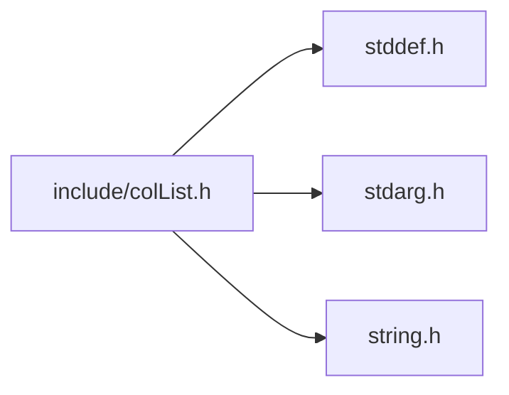
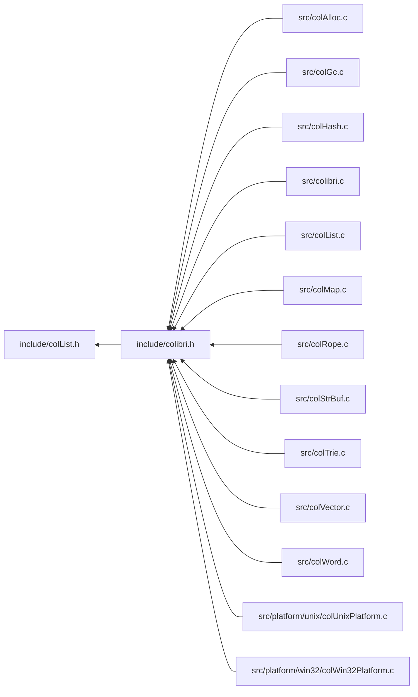

<a id="col_list_8h"></a>
# File colList.h

![][C++]

**Location**: `include/colList.h`

This header file defines the list handling features of Colibri.

Lists are a linear collection datatype that allows for fast insertion, extraction and composition of other lists. Internally they use self-balanced binary trees, like ropes, except that they use vectors as basic containers instead of character arrays.


They come in both immutable and mutable forms.

## Classes

* [ColListIterator](struct_col_list_iterator.md#struct_col_list_iterator)
* [Col\_CustomListType](struct_col___custom_list_type.md#struct_col___custom_list_type)
* [ColListIterator.chunk](struct_col_list_iterator_8chunk.md#struct_col_list_iterator_8chunk)
* [ColListIterator.chunk.current](union_col_list_iterator_8chunk_8current.md#union_col_list_iterator_8chunk_8current)
* [ColListIterator.chunk.current.access](struct_col_list_iterator_8chunk_8current_8access.md#struct_col_list_iterator_8chunk_8current_8access)

## Includes

* <stddef.h>
* <stdarg.h>
* <string.h>



## Included by

* [include/colibri.h](colibri_8h.md#colibri_8h)



## Immutable List Creation

<a id="group__list__words_1gafc53d9d08fb0368e412785b161194b7f"></a>
### Function Col\_EmptyList

![][public]

```cpp
Col_Word Col_EmptyList()
```

Return an empty list.

The returned word is immediate and constant, which means that it consumes no memory and its value can be safely compared and stored in static storage.


**Returns**:

The empty list.


**Return type**: EXTERN [Col\_Word](col_word_8h.md#group__words_1gadb626f9e195212e4fdfba7df154ad043)

**References**:

* [WORD\_LIST\_EMPTY](col_word_int_8h.md#group__voidlist__words_1ga8b7c20d2cdcdf8f3bc58589d757cf53b)

<a id="group__list__words_1ga0dc0d4d58c4e694683753211151b0fc7"></a>
### Function Col\_NewList

![][public]

```cpp
Col_Word Col_NewList(size_t length, const Col_Word *elements)
```

Create a new list word.

Short lists are created as vectors. Larger lists are recursively split in half and assembled in a tree.


**Returns**:

A new list.


**Parameters**:

* size_t **length**: Length of below array.
* const [Col\_Word](col_word_8h.md#group__words_1gadb626f9e195212e4fdfba7df154ad043) * **elements**: Array of words to populate list with. If NULL, build a void list (i.e. whose elements are all nil).

**Return type**: EXTERN [Col\_Word](col_word_8h.md#group__words_1gadb626f9e195212e4fdfba7df154ad043)

**References**:

* [Col\_ConcatLists](col_list_8h.md#group__list__words_1ga73c0f71ee367af68bbad4a4738dfac3b)
* [Col\_NewVector](col_vector_8h.md#group__vector__words_1ga6ef7d35d75fdc6a6781f0a32e9c7efc1)
* [VOIDLIST\_MAX\_LENGTH](col_word_int_8h.md#group__voidlist__words_1gabf4f6876ac71e3f3368c711756459baf)
* [WORD\_LIST\_EMPTY](col_word_int_8h.md#group__voidlist__words_1ga8b7c20d2cdcdf8f3bc58589d757cf53b)
* [WORD\_VOIDLIST\_NEW](col_word_int_8h.md#group__voidlist__words_1ga76a437807f61cfb3d4066867ae82d8d4)

**Referenced by**:

* [Col\_MListSetLength](col_list_8h.md#group__mlist__words_1ga939319b0240b3bd7f0713b09b4dc08dc)

## Immutable List Accessors

?> Works with mutable or immutable lists and vectors.

<a id="group__list__words_1ga5eb1c9ddea940171e18817b90301cc03"></a>
### Function Col\_ListLength

![][public]

```cpp
size_t Col_ListLength(Col_Word list)
```

Get the length of the list.

Also works with vectors. If the list is cyclic, only give the core length.


**Returns**:

The list length.

**Exceptions**:

* **[COL\_ERROR\_LIST](colibri_8h.md#group__error_1gga729084542ed9eae62009a84d3379ef35a88271295a774232492c1ebbdc68d6958)**: [[T]](colibri_8h.md#group__error_1gga6dab009a0b8c4b4fa080cb9ba1859e9ea603a58b9d5bb16fde0708eb0767e4904) **list**: Not a list.

**Parameters**:

* [Col\_Word](col_word_8h.md#group__words_1gadb626f9e195212e4fdfba7df154ad043) **list**: List to get length for.

**Return type**: EXTERN size_t

**References**:

* [ASSERT](col_internal_8h.md#group__error_1gac22830a985e1daed0c9eadba8c6f606e)
* [ListChunkTraverseInfo::list](struct_list_chunk_traverse_info.md#struct_list_chunk_traverse_info_1a20400ffc5ef99dfd4ffd684870cf51f0)
* [TYPECHECK\_LIST](col_list_int_8h.md#group__list__words_1ga50e2794d537901134d3d60e509469fa3)
* [WORD\_CIRCLIST\_CORE](col_word_int_8h.md#group__circlist__words_1ga736b51bba4c6bf3ca55f43d942390d36)
* [WORD\_CONCATLIST\_LENGTH](col_list_int_8h.md#group__concatlist__words_1ga005eedea923258322288f51292f33782)
* [WORD\_SUBLIST\_FIRST](col_list_int_8h.md#group__sublist__words_1ga18e2c99a420ebeabe9f94b4166c44033)
* [WORD\_SUBLIST\_LAST](col_list_int_8h.md#group__sublist__words_1ga4e00a849390732cdf829ce42d9c42417)
* [WORD\_TYPE](col_word_int_8h.md#group__words_1ga014e27ea4160eb3845ac495a22c232f5)
* [WORD\_TYPE\_CIRCLIST](col_word_int_8h.md#group__words_1ga5986ba88af901948fd9a78f422001650)
* [WORD\_TYPE\_CONCATLIST](col_word_int_8h.md#group__words_1ga8f0a60698d7b383460fe868b1c043f19)
* [WORD\_TYPE\_CUSTOM](col_word_int_8h.md#group__words_1ga8babfbc77291680db519873c91efdd4c)
* [WORD\_TYPE\_MCONCATLIST](col_word_int_8h.md#group__words_1ga0c4f44385c099ed03aec5db8ff98c4ee)
* [WORD\_TYPE\_MVECTOR](col_word_int_8h.md#group__words_1ga22d76782e9dfd28846b6eeac3547280f)
* [WORD\_TYPE\_SUBLIST](col_word_int_8h.md#group__words_1gab019a30aca48483424886bf08f7b7cac)
* [WORD\_TYPE\_VECTOR](col_word_int_8h.md#group__words_1gadf6c66e5c2f9fcdf213ae40d253c153f)
* [WORD\_TYPE\_VOIDLIST](col_word_int_8h.md#group__words_1gad13a9d2efd54cfe0f381fb9c85c4bebb)
* [WORD\_TYPEINFO](col_word_int_8h.md#group__custom__words_1gafc962791c45a5dd5bb034050444084be)
* [WORD\_UNWRAP](col_word_int_8h.md#group__word__wrappers_1ga5278e42908e256bb743954bf7745d06c)
* [WORD\_VECTOR\_LENGTH](col_vector_int_8h.md#group__vector__words_1ga926467c6e28cbec0b62107c2d17bb06c)
* [WORD\_VOIDLIST\_LENGTH](col_word_int_8h.md#group__voidlist__words_1gaa336b44598700785e9f948fdd3a0da58)

**Referenced by**:

* [Col\_CircularList](col_list_8h.md#group__list__words_1ga327fd0dc9444ab63bdc30d5f62eee4ea)
* [Col\_ConcatLists](col_list_8h.md#group__list__words_1ga73c0f71ee367af68bbad4a4738dfac3b)
* [Col\_CopyMList](col_list_8h.md#group__mlist__words_1gaff1c8024a9ca1e6a6f33de4fe7344e81)
* [Col\_ListInsert](col_list_8h.md#group__list__words_1ga8ab7ea672c85e35028769758674e26f1)
* [Col\_ListIterBegin](col_list_8h.md#group__list__words_1gab82314e6a85f5b68b646efe5c9fe0200)
* [Col\_ListIterFirst](col_list_8h.md#group__list__words_1ga0f1d7cb546b01d0a346e40a49671d0ec)
* [Col\_ListIterLast](col_list_8h.md#group__list__words_1ga39ef512be590fc88aca2f6d9668c6ddb)
* [Col\_ListLoopLength](col_list_8h.md#group__list__words_1gadf33dcf3fbbb192c17ae521920a14db6)
* [Col\_ListRemove](col_list_8h.md#group__list__words_1gad3a369cfb544159866851398efcf50a8)
* [Col\_ListReplace](col_list_8h.md#group__list__words_1ga7286de8fbf801b507b4dd9ea422153c0)
* [Col\_MListInsert](col_list_8h.md#group__mlist__words_1ga453cc8131623ff7f2981ffe3cca75797)
* [Col\_MListLoop](col_list_8h.md#group__mlist__words_1ga717d5a5fa372406df49ae460436b923e)
* [Col\_MListRemove](col_list_8h.md#group__mlist__words_1ga0ff728019a9d46b0a7c0096007203915)
* [Col\_MListReplace](col_list_8h.md#group__mlist__words_1gaecb4269ea8b60e6f9bb4d0a5eb62fc2a)
* [Col\_MListSetAt](col_list_8h.md#group__mlist__words_1ga5dc6434e4a1ba966bba2c87a58f76cc5)
* [Col\_MListSetLength](col_list_8h.md#group__mlist__words_1ga939319b0240b3bd7f0713b09b4dc08dc)
* [Col\_RepeatList](col_list_8h.md#group__list__words_1ga8eaa742be1b1c2b87f7c850ad71a77bd)
* [Col\_Sublist](col_list_8h.md#group__list__words_1gaa26702b61fabf55805c9ef1b2783e7f1)
* [Col\_TraverseListChunks](col_list_8h.md#group__list__words_1ga95d08cdde802b1411fbbb812412a8861)
* [Col\_TraverseListChunksN](col_list_8h.md#group__list__words_1ga4c20735036c60715f55cfd4e8d96825f)
* [ColListIterUpdateTraversalInfo](col_list_8h.md#group__list__words_1ga65a0551576955013edca89745886b5dd)
* [ConvertToMutableAt](col_list_8c.md#group__mlist__words_1gaa3d6a25f3eb845452f465bb66f67ab51)
* [GetArms](col_list_8c.md#group__list__words_1gae54e7f540a28fbe6f26002e43c9374c7)
* [GetChunk](col_list_8c.md#group__list__words_1ga58a993e823bf134e615c862a546d6d87)
* [MergeListChunksProc](col_list_8c.md#group__list__words_1ga2daef27844161dd9c5b16f571bb2e01a)
* [MListInsert](col_list_8c.md#group__mlist__words_1gaa62fa49dc7f988e33978dbf3e030ebf8)
* [MListRemove](col_list_8c.md#group__mlist__words_1ga7ebc7b3f5a8c87880fa31e51cde19c04)
* [MListSetAt](col_list_8c.md#group__mlist__words_1ga417914bde37aaaa2b6948efe8f157046)
* [NewMConcatList](col_list_8c.md#group__mlist__words_1ga0cf94fe0b5f417772755b0bd02851e5a)
* [NextChunk](col_list_8c.md#group__list__words_1gab2a98e33d9052b36916698a4aa2e276e)
* [SplitMutableAt](col_list_8c.md#group__mlist__words_1ga87232eb482742f39972b97a2f1084fed)
* [UpdateMConcatNode](col_list_8c.md#group__mlist__words_1ga0bd3ec88c86ba531f946c9e1cd271793)

<a id="group__list__words_1gadf33dcf3fbbb192c17ae521920a14db6"></a>
### Function Col\_ListLoopLength

![][public]

```cpp
size_t Col_ListLoopLength(Col_Word list)
```

Get the loop length of the list.

**Return values**:

* **0**: for non-cyclic lists
* **<>0**: length of terminal loop for cyclic lists.

**Exceptions**:

* **[COL\_ERROR\_LIST](colibri_8h.md#group__error_1gga729084542ed9eae62009a84d3379ef35a88271295a774232492c1ebbdc68d6958)**: [[T]](colibri_8h.md#group__error_1gga6dab009a0b8c4b4fa080cb9ba1859e9ea603a58b9d5bb16fde0708eb0767e4904) **list**: Not a list.

**Parameters**:

* [Col\_Word](col_word_8h.md#group__words_1gadb626f9e195212e4fdfba7df154ad043) **list**: List to get loop length for.

**Return type**: EXTERN size_t

**References**:

* [ASSERT](col_internal_8h.md#group__error_1gac22830a985e1daed0c9eadba8c6f606e)
* [Col\_ListLength](col_list_8h.md#group__list__words_1ga5eb1c9ddea940171e18817b90301cc03)
* [ListChunkTraverseInfo::list](struct_list_chunk_traverse_info.md#struct_list_chunk_traverse_info_1a20400ffc5ef99dfd4ffd684870cf51f0)
* [TYPECHECK\_LIST](col_list_int_8h.md#group__list__words_1ga50e2794d537901134d3d60e509469fa3)
* [WORD\_CIRCLIST\_CORE](col_word_int_8h.md#group__circlist__words_1ga736b51bba4c6bf3ca55f43d942390d36)
* [WORD\_CONCATLIST\_RIGHT](col_list_int_8h.md#group__concatlist__words_1gaaec42f5b15639059d8422083c596af4e)
* [WORD\_TYPE](col_word_int_8h.md#group__words_1ga014e27ea4160eb3845ac495a22c232f5)
* [WORD\_TYPE\_CIRCLIST](col_word_int_8h.md#group__words_1ga5986ba88af901948fd9a78f422001650)
* [WORD\_TYPE\_CONCATLIST](col_word_int_8h.md#group__words_1ga8f0a60698d7b383460fe868b1c043f19)
* [WORD\_TYPE\_MCONCATLIST](col_word_int_8h.md#group__words_1ga0c4f44385c099ed03aec5db8ff98c4ee)
* [WORD\_TYPE\_MVECTOR](col_word_int_8h.md#group__words_1ga22d76782e9dfd28846b6eeac3547280f)
* [WORD\_TYPE\_SUBLIST](col_word_int_8h.md#group__words_1gab019a30aca48483424886bf08f7b7cac)
* [WORD\_TYPE\_VECTOR](col_word_int_8h.md#group__words_1gadf6c66e5c2f9fcdf213ae40d253c153f)
* [WORD\_TYPE\_VOIDLIST](col_word_int_8h.md#group__words_1gad13a9d2efd54cfe0f381fb9c85c4bebb)
* [WORD\_UNWRAP](col_word_int_8h.md#group__word__wrappers_1ga5278e42908e256bb743954bf7745d06c)

**Referenced by**:

* [Col\_CircularList](col_list_8h.md#group__list__words_1ga327fd0dc9444ab63bdc30d5f62eee4ea)
* [Col\_ConcatLists](col_list_8h.md#group__list__words_1ga73c0f71ee367af68bbad4a4738dfac3b)
* [Col\_ConcatListsA](col_list_8h.md#group__list__words_1ga964905c5c77b7ccb72a1fe3805cd70c7)
* [Col\_ListInsert](col_list_8h.md#group__list__words_1ga8ab7ea672c85e35028769758674e26f1)
* [Col\_ListIterBegin](col_list_8h.md#group__list__words_1gab82314e6a85f5b68b646efe5c9fe0200)
* [Col\_ListIterForward](col_list_8h.md#group__list__words_1ga12a0d04173010d29d1bf59492b829e7f)
* [Col\_ListRemove](col_list_8h.md#group__list__words_1gad3a369cfb544159866851398efcf50a8)
* [Col\_ListReplace](col_list_8h.md#group__list__words_1ga7286de8fbf801b507b4dd9ea422153c0)
* [Col\_MListInsert](col_list_8h.md#group__mlist__words_1ga453cc8131623ff7f2981ffe3cca75797)
* [Col\_MListLoop](col_list_8h.md#group__mlist__words_1ga717d5a5fa372406df49ae460436b923e)
* [Col\_MListRemove](col_list_8h.md#group__mlist__words_1ga0ff728019a9d46b0a7c0096007203915)
* [Col\_MListReplace](col_list_8h.md#group__mlist__words_1gaecb4269ea8b60e6f9bb4d0a5eb62fc2a)
* [Col\_MListSetAt](col_list_8h.md#group__mlist__words_1ga5dc6434e4a1ba966bba2c87a58f76cc5)
* [Col\_MListSetLength](col_list_8h.md#group__mlist__words_1ga939319b0240b3bd7f0713b09b4dc08dc)
* [Col\_RepeatList](col_list_8h.md#group__list__words_1ga8eaa742be1b1c2b87f7c850ad71a77bd)
* [Col\_Sublist](col_list_8h.md#group__list__words_1gaa26702b61fabf55805c9ef1b2783e7f1)

<a id="group__list__words_1ga825ecbc9aa5b7e650e45b347d8aab253"></a>
### Function Col\_ListDepth

![][public]

```cpp
unsigned char Col_ListDepth(Col_Word list)
```

Get the depth of the list.

**Returns**:

The list depth.

**Exceptions**:

* **[COL\_ERROR\_LIST](colibri_8h.md#group__error_1gga729084542ed9eae62009a84d3379ef35a88271295a774232492c1ebbdc68d6958)**: [[T]](colibri_8h.md#group__error_1gga6dab009a0b8c4b4fa080cb9ba1859e9ea603a58b9d5bb16fde0708eb0767e4904) **list**: Not a list.

**Parameters**:

* [Col\_Word](col_word_8h.md#group__words_1gadb626f9e195212e4fdfba7df154ad043) **list**: List to get depth for.

**Return type**: EXTERN unsigned char

**References**:

* [GetDepth](col_list_8c.md#group__list__words_1ga789c836420f8a8885fa25abd032c4b10)
* [ListChunkTraverseInfo::list](struct_list_chunk_traverse_info.md#struct_list_chunk_traverse_info_1a20400ffc5ef99dfd4ffd684870cf51f0)
* [TYPECHECK\_LIST](col_list_int_8h.md#group__list__words_1ga50e2794d537901134d3d60e509469fa3)
* [WORD\_UNWRAP](col_word_int_8h.md#group__word__wrappers_1ga5278e42908e256bb743954bf7745d06c)

<a id="group__list__words_1ga7550908ac1ceae597c8283afbaa7f813"></a>
### Function Col\_ListAt

![][public]

```cpp
Col_Word Col_ListAt(Col_Word list, size_t index)
```

Get the element of a list at a given position.

**Return values**:

* **nil**: if **index** past end of **list**.
* **element**: at given index otherwise.

**Exceptions**:

* **[COL\_ERROR\_LIST](colibri_8h.md#group__error_1gga729084542ed9eae62009a84d3379ef35a88271295a774232492c1ebbdc68d6958)**: [[T]](colibri_8h.md#group__error_1gga6dab009a0b8c4b4fa080cb9ba1859e9ea603a58b9d5bb16fde0708eb0767e4904) **list**: Not a list.

**Parameters**:

* [Col\_Word](col_word_8h.md#group__words_1gadb626f9e195212e4fdfba7df154ad043) **list**: List to get element from.
* size_t **index**: Element index.

**Return type**: EXTERN [Col\_Word](col_word_8h.md#group__words_1gadb626f9e195212e4fdfba7df154ad043)

**References**:

* [Col\_ListIterAt](col_list_8h.md#group__list__words_1gab3ec4df728a607ea0dd60cf85e8dde1a)
* [Col\_ListIterBegin](col_list_8h.md#group__list__words_1gab82314e6a85f5b68b646efe5c9fe0200)
* [Col\_ListIterEnd](col_list_8h.md#group__list__words_1ga0025ae0a8a58c10285c5c131acd1d9e9)
* [ListChunkTraverseInfo::list](struct_list_chunk_traverse_info.md#struct_list_chunk_traverse_info_1a20400ffc5ef99dfd4ffd684870cf51f0)
* [TYPECHECK\_LIST](col_list_int_8h.md#group__list__words_1ga50e2794d537901134d3d60e509469fa3)
* [WORD\_NIL](col_word_8h.md#group__words_1ga29e370264f4e5659ccc5be4de209f065)

## Immutable List Operations

!> **Warning** \
Works with mutable or immutable lists and vectors, however mutable words may be frozen in the process.

<a id="group__list__words_1ga77aca8145dd519155802b77a89788576"></a>
### Macro Col\_ConcatListsV

![][public]

```cpp
#define Col_ConcatListsV     _Col_ConcatListsV(_, first, ##__VA_ARGS__)( first ,... )
```

Variadic macro version of [Col\_ConcatListsNV()](col_list_8h.md#group__list__words_1ga291672360f258f14e6a92fe0a4232a19) that deduces its number of arguments automatically.

**Parameters**:

* **first**: First list to concatenate.
* **...**: Next lists to concatenate.


**See also**: [COL\_ARGCOUNT](col_utils_8h.md#group__utils_1gabbb0e58841406f54d444d40625a2c4fe)


<a id="group__list__words_1gaa26702b61fabf55805c9ef1b2783e7f1"></a>
### Function Col\_Sublist

![][public]

```cpp
Col_Word Col_Sublist(Col_Word list, size_t first, size_t last)
```

Create a new list that is a sublist of another.

We try to minimize the overhead as much as possible, such as:
* identity.

* create vectors for small sublists.

* sublists of sublists point to original list.

* sublists of concats point to the deepest superset sublist.


**Returns**:

When first is past the end of the (acyclic) list, or **last** is before **first**, an empty list. Else, a list representing the sublist.

In any case the resulting sublist is never cyclic.

**Exceptions**:

* **[COL\_ERROR\_LIST](colibri_8h.md#group__error_1gga729084542ed9eae62009a84d3379ef35a88271295a774232492c1ebbdc68d6958)**: [[T]](colibri_8h.md#group__error_1gga6dab009a0b8c4b4fa080cb9ba1859e9ea603a58b9d5bb16fde0708eb0767e4904) **list**: Not a list.

**Parameters**:

* [Col\_Word](col_word_8h.md#group__words_1gadb626f9e195212e4fdfba7df154ad043) **list**: The list to extract the sublist from.
* size_t **first**: Index of first character in sublist.
* size_t **last**: Index of last character in sublist.

**Return type**: EXTERN [Col\_Word](col_word_8h.md#group__words_1gadb626f9e195212e4fdfba7df154ad043)

**References**:

* [AllocCells](col_gc_8c.md#group__alloc_1gaeec69115deeb3321bdfbb4e42119f806)
* [ASSERT](col_internal_8h.md#group__error_1gac22830a985e1daed0c9eadba8c6f606e)
* [Col\_ConcatLists](col_list_8h.md#group__list__words_1ga73c0f71ee367af68bbad4a4738dfac3b)
* [Col\_ConcatListsV](col_list_8h.md#group__list__words_1ga77aca8145dd519155802b77a89788576)
* [COL\_LIST](col_word_8h.md#group__words_1gafaaad5bdc900622b1387bcb1f32f61c3)
* [Col\_ListLength](col_list_8h.md#group__list__words_1ga5eb1c9ddea940171e18817b90301cc03)
* [Col\_ListLoopLength](col_list_8h.md#group__list__words_1gadf33dcf3fbbb192c17ae521920a14db6)
* [Col\_RepeatList](col_list_8h.md#group__list__words_1ga8eaa742be1b1c2b87f7c850ad71a77bd)
* [Col\_TraverseListChunks](col_list_8h.md#group__list__words_1ga95d08cdde802b1411fbbb812412a8861)
* [FreezeMList](col_list_8c.md#group__mlist__words_1ga095c6e932019c53fc81e4beaddf0334b)
* [MergeListChunksInfo::length](struct_merge_list_chunks_info.md#struct_merge_list_chunks_info_1a1dfa080c13a4eee1fce0bb2c0a2624c8)
* [MAX\_SHORT\_LIST\_LENGTH](col_list_8c.md#group__list__words_1gabe73f76756546f55d2b797a323ab79d5)
* [MAX\_SHORT\_MVECTOR\_LENGTH](col_list_8c.md#group__list__words_1gacd4b42724e38ce4618b6afe3363a3f4c)
* [MergeListChunksProc](col_list_8c.md#group__list__words_1ga2daef27844161dd9c5b16f571bb2e01a)
* [Col\_CustomListType::sublistProc](struct_col___custom_list_type.md#struct_col___custom_list_type_1a431969013f0382f5d3c9d8f9902d07c3)
* [Col\_CustomListType::type](struct_col___custom_list_type.md#struct_col___custom_list_type_1aa5adf5f0d567cbd47a4fe6090e7e88cb)
* [Col\_CustomWordType::type](struct_col___custom_word_type.md#struct_col___custom_word_type_1af9482efe5a6408bc622320619c3ccf9f)
* [TYPECHECK\_LIST](col_list_int_8h.md#group__list__words_1ga50e2794d537901134d3d60e509469fa3)
* [MergeListChunksInfo::vector](struct_merge_list_chunks_info.md#struct_merge_list_chunks_info_1ae40e462380046ec92b2bb08c9172ecd6)
* [VOIDLIST\_MAX\_LENGTH](col_word_int_8h.md#group__voidlist__words_1gabf4f6876ac71e3f3368c711756459baf)
* [WORD\_CIRCLIST\_CORE](col_word_int_8h.md#group__circlist__words_1ga736b51bba4c6bf3ca55f43d942390d36)
* [WORD\_CONCATLIST\_DEPTH](col_list_int_8h.md#group__concatlist__words_1ga6e5dad2a2ae231641e9c8bc89debb338)
* [WORD\_CONCATLIST\_LEFT](col_list_int_8h.md#group__concatlist__words_1ga6b758463af55b736f2585d4ebc9d57f3)
* [WORD\_CONCATLIST\_LEFT\_LENGTH](col_list_int_8h.md#group__concatlist__words_1gab757f4a3117b72ba7ceab9202cf2c2f4)
* [WORD\_CONCATLIST\_RIGHT](col_list_int_8h.md#group__concatlist__words_1gaaec42f5b15639059d8422083c596af4e)
* [WORD\_LIST\_EMPTY](col_word_int_8h.md#group__voidlist__words_1ga8b7c20d2cdcdf8f3bc58589d757cf53b)
* [WORD\_NIL](col_word_8h.md#group__words_1ga29e370264f4e5659ccc5be4de209f065)
* [WORD\_SUBLIST\_FIRST](col_list_int_8h.md#group__sublist__words_1ga18e2c99a420ebeabe9f94b4166c44033)
* [WORD\_SUBLIST\_INIT](col_list_int_8h.md#group__sublist__words_1ga0e3fe32fa3ae20489dc8d38db3148c1b)
* [WORD\_SUBLIST\_SOURCE](col_list_int_8h.md#group__sublist__words_1ga448ba72120af1a5d655107b05479424c)
* [WORD\_TYPE](col_word_int_8h.md#group__words_1ga014e27ea4160eb3845ac495a22c232f5)
* [WORD\_TYPE\_CIRCLIST](col_word_int_8h.md#group__words_1ga5986ba88af901948fd9a78f422001650)
* [WORD\_TYPE\_CONCATLIST](col_word_int_8h.md#group__words_1ga8f0a60698d7b383460fe868b1c043f19)
* [WORD\_TYPE\_CUSTOM](col_word_int_8h.md#group__words_1ga8babfbc77291680db519873c91efdd4c)
* [WORD\_TYPE\_MCONCATLIST](col_word_int_8h.md#group__words_1ga0c4f44385c099ed03aec5db8ff98c4ee)
* [WORD\_TYPE\_MVECTOR](col_word_int_8h.md#group__words_1ga22d76782e9dfd28846b6eeac3547280f)
* [WORD\_TYPE\_SUBLIST](col_word_int_8h.md#group__words_1gab019a30aca48483424886bf08f7b7cac)
* [WORD\_TYPE\_VOIDLIST](col_word_int_8h.md#group__words_1gad13a9d2efd54cfe0f381fb9c85c4bebb)
* [WORD\_TYPEINFO](col_word_int_8h.md#group__custom__words_1gafc962791c45a5dd5bb034050444084be)
* [WORD\_UNWRAP](col_word_int_8h.md#group__word__wrappers_1ga5278e42908e256bb743954bf7745d06c)
* [WORD\_VOIDLIST\_NEW](col_word_int_8h.md#group__voidlist__words_1ga76a437807f61cfb3d4066867ae82d8d4)

**Referenced by**:

* [Col\_ConcatLists](col_list_8h.md#group__list__words_1ga73c0f71ee367af68bbad4a4738dfac3b)
* [Col\_ListInsert](col_list_8h.md#group__list__words_1ga8ab7ea672c85e35028769758674e26f1)
* [Col\_ListRemove](col_list_8h.md#group__list__words_1gad3a369cfb544159866851398efcf50a8)
* [Col\_MListRemove](col_list_8h.md#group__mlist__words_1ga0ff728019a9d46b0a7c0096007203915)
* [Col\_MListSetLength](col_list_8h.md#group__mlist__words_1ga939319b0240b3bd7f0713b09b4dc08dc)
* [ConvertToMutableAt](col_list_8c.md#group__mlist__words_1gaa3d6a25f3eb845452f465bb66f67ab51)
* [GetArms](col_list_8c.md#group__list__words_1gae54e7f540a28fbe6f26002e43c9374c7)
* [MListRemove](col_list_8c.md#group__mlist__words_1ga7ebc7b3f5a8c87880fa31e51cde19c04)
* [SplitMutableAt](col_list_8c.md#group__mlist__words_1ga87232eb482742f39972b97a2f1084fed)

<a id="group__list__words_1ga73c0f71ee367af68bbad4a4738dfac3b"></a>
### Function Col\_ConcatLists

![][public]

```cpp
Col_Word Col_ConcatLists(Col_Word left, Col_Word right)
```

Concatenate lists.

Concatenation forms self-balanced binary trees. See [List Tree Balancing](#group__list__words_1list_tree_balancing) for more information.


**Returns**:

A list representing the concatenation of both lists.

**Exceptions**:

* **[COL\_ERROR\_LIST](colibri_8h.md#group__error_1gga729084542ed9eae62009a84d3379ef35a88271295a774232492c1ebbdc68d6958)**: [[T]](colibri_8h.md#group__error_1gga6dab009a0b8c4b4fa080cb9ba1859e9ea603a58b9d5bb16fde0708eb0767e4904) **left**: Not a list.
* **[COL\_ERROR\_LIST](colibri_8h.md#group__error_1gga729084542ed9eae62009a84d3379ef35a88271295a774232492c1ebbdc68d6958)**: [[T]](colibri_8h.md#group__error_1gga6dab009a0b8c4b4fa080cb9ba1859e9ea603a58b9d5bb16fde0708eb0767e4904) **right**: Not a list.
* **[COL\_ERROR\_LISTLENGTH\_CONCAT](colibri_8h.md#group__error_1gga729084542ed9eae62009a84d3379ef35a837fcf987426e821513e2fdaffcdf55e)**: [[V]](colibri_8h.md#group__error_1gga6dab009a0b8c4b4fa080cb9ba1859e9ea65d5e7232c82ae6972ac56f386a32fc9) **length(left+right)**: Concat list too large.

**Parameters**:

* [Col\_Word](col_word_8h.md#group__words_1gadb626f9e195212e4fdfba7df154ad043) **left**: Left part.
* [Col\_Word](col_word_8h.md#group__words_1gadb626f9e195212e4fdfba7df154ad043) **right**: Right part.

**Return type**: EXTERN [Col\_Word](col_word_8h.md#group__words_1gadb626f9e195212e4fdfba7df154ad043)

**References**:

* [AllocCells](col_gc_8c.md#group__alloc_1gaeec69115deeb3321bdfbb4e42119f806)
* [ASSERT](col_internal_8h.md#group__error_1gac22830a985e1daed0c9eadba8c6f606e)
* [Col\_CircularList](col_list_8h.md#group__list__words_1ga327fd0dc9444ab63bdc30d5f62eee4ea)
* [COL\_LIST](col_word_8h.md#group__words_1gafaaad5bdc900622b1387bcb1f32f61c3)
* [Col\_ListLength](col_list_8h.md#group__list__words_1ga5eb1c9ddea940171e18817b90301cc03)
* [Col\_ListLoopLength](col_list_8h.md#group__list__words_1gadf33dcf3fbbb192c17ae521920a14db6)
* [Col\_Sublist](col_list_8h.md#group__list__words_1gaa26702b61fabf55805c9ef1b2783e7f1)
* [Col\_TraverseListChunks](col_list_8h.md#group__list__words_1ga95d08cdde802b1411fbbb812412a8861)
* [Col\_CustomListType::concatProc](struct_col___custom_list_type.md#struct_col___custom_list_type_1a00a0cd040234db58920ca192bdcc077c)
* [FreezeMList](col_list_8c.md#group__mlist__words_1ga095c6e932019c53fc81e4beaddf0334b)
* [GetArms](col_list_8c.md#group__list__words_1gae54e7f540a28fbe6f26002e43c9374c7)
* [GetDepth](col_list_8c.md#group__list__words_1ga789c836420f8a8885fa25abd032c4b10)
* [MergeListChunksInfo::length](struct_merge_list_chunks_info.md#struct_merge_list_chunks_info_1a1dfa080c13a4eee1fce0bb2c0a2624c8)
* [MAX\_SHORT\_LIST\_LENGTH](col_list_8c.md#group__list__words_1gabe73f76756546f55d2b797a323ab79d5)
* [MAX\_SHORT\_MVECTOR\_LENGTH](col_list_8c.md#group__list__words_1gacd4b42724e38ce4618b6afe3363a3f4c)
* [MergeListChunksProc](col_list_8c.md#group__list__words_1ga2daef27844161dd9c5b16f571bb2e01a)
* [Col\_CustomListType::type](struct_col___custom_list_type.md#struct_col___custom_list_type_1aa5adf5f0d567cbd47a4fe6090e7e88cb)
* [Col\_CustomWordType::type](struct_col___custom_word_type.md#struct_col___custom_word_type_1af9482efe5a6408bc622320619c3ccf9f)
* [TYPECHECK\_LIST](col_list_int_8h.md#group__list__words_1ga50e2794d537901134d3d60e509469fa3)
* [VALUECHECK\_LISTLENGTH\_CONCAT](col_list_int_8h.md#group__list__words_1gaaa7ad7fed7ada4b019dd93db3db402a4)
* [MergeListChunksInfo::vector](struct_merge_list_chunks_info.md#struct_merge_list_chunks_info_1ae40e462380046ec92b2bb08c9172ecd6)
* [VOIDLIST\_MAX\_LENGTH](col_word_int_8h.md#group__voidlist__words_1gabf4f6876ac71e3f3368c711756459baf)
* [WORD\_CONCATLIST\_INIT](col_list_int_8h.md#group__concatlist__words_1ga8cef632de8ecc768d7926efa76a5d550)
* [WORD\_CONCATLIST\_LEFT](col_list_int_8h.md#group__concatlist__words_1ga6b758463af55b736f2585d4ebc9d57f3)
* [WORD\_CONCATLIST\_RIGHT](col_list_int_8h.md#group__concatlist__words_1gaaec42f5b15639059d8422083c596af4e)
* [WORD\_NIL](col_word_8h.md#group__words_1ga29e370264f4e5659ccc5be4de209f065)
* [WORD\_SUBLIST\_FIRST](col_list_int_8h.md#group__sublist__words_1ga18e2c99a420ebeabe9f94b4166c44033)
* [WORD\_SUBLIST\_LAST](col_list_int_8h.md#group__sublist__words_1ga4e00a849390732cdf829ce42d9c42417)
* [WORD\_SUBLIST\_SOURCE](col_list_int_8h.md#group__sublist__words_1ga448ba72120af1a5d655107b05479424c)
* [WORD\_TYPE](col_word_int_8h.md#group__words_1ga014e27ea4160eb3845ac495a22c232f5)
* [WORD\_TYPE\_CIRCLIST](col_word_int_8h.md#group__words_1ga5986ba88af901948fd9a78f422001650)
* [WORD\_TYPE\_CONCATLIST](col_word_int_8h.md#group__words_1ga8f0a60698d7b383460fe868b1c043f19)
* [WORD\_TYPE\_CUSTOM](col_word_int_8h.md#group__words_1ga8babfbc77291680db519873c91efdd4c)
* [WORD\_TYPE\_MCONCATLIST](col_word_int_8h.md#group__words_1ga0c4f44385c099ed03aec5db8ff98c4ee)
* [WORD\_TYPE\_MVECTOR](col_word_int_8h.md#group__words_1ga22d76782e9dfd28846b6eeac3547280f)
* [WORD\_TYPE\_SUBLIST](col_word_int_8h.md#group__words_1gab019a30aca48483424886bf08f7b7cac)
* [WORD\_TYPE\_VOIDLIST](col_word_int_8h.md#group__words_1gad13a9d2efd54cfe0f381fb9c85c4bebb)
* [WORD\_TYPEINFO](col_word_int_8h.md#group__custom__words_1gafc962791c45a5dd5bb034050444084be)
* [WORD\_UNWRAP](col_word_int_8h.md#group__word__wrappers_1ga5278e42908e256bb743954bf7745d06c)
* [WORD\_VOIDLIST\_NEW](col_word_int_8h.md#group__voidlist__words_1ga76a437807f61cfb3d4066867ae82d8d4)

**Referenced by**:

* [Col\_ConcatListsA](col_list_8h.md#group__list__words_1ga964905c5c77b7ccb72a1fe3805cd70c7)
* [Col\_ListInsert](col_list_8h.md#group__list__words_1ga8ab7ea672c85e35028769758674e26f1)
* [Col\_ListRemove](col_list_8h.md#group__list__words_1gad3a369cfb544159866851398efcf50a8)
* [Col\_NewList](col_list_8h.md#group__list__words_1ga0dc0d4d58c4e694683753211151b0fc7)
* [Col\_RepeatList](col_list_8h.md#group__list__words_1ga8eaa742be1b1c2b87f7c850ad71a77bd)
* [Col\_Sublist](col_list_8h.md#group__list__words_1gaa26702b61fabf55805c9ef1b2783e7f1)

<a id="group__list__words_1ga964905c5c77b7ccb72a1fe3805cd70c7"></a>
### Function Col\_ConcatListsA

![][public]

```cpp
Col_Word Col_ConcatListsA(size_t number, const Col_Word *lists)
```

Concatenate several lists given in an array.

Concatenation is done recursively, by halving the array until it contains one or two elements, at this point we respectively return the element or use [Col\_ConcatLists()](col_list_8h.md#group__list__words_1ga73c0f71ee367af68bbad4a4738dfac3b).


**Returns**:

A list representing the concatenation of all lists.

**Exceptions**:

* **[COL\_ERROR\_GENERIC](colibri_8h.md#group__error_1gga729084542ed9eae62009a84d3379ef35a02ae949dee6fd3c78c849d7e7af414e4)**: [[V]](colibri_8h.md#group__error_1gga6dab009a0b8c4b4fa080cb9ba1859e9ea65d5e7232c82ae6972ac56f386a32fc9) **number == 0**: Generic error.

**Parameters**:

* size_t **number**: Size of **lists** array.
* listsconst [Col\_Word](col_word_8h.md#group__words_1gadb626f9e195212e4fdfba7df154ad043) * **words**: Array of lists to concatenate in order.

**Return type**: EXTERN [Col\_Word](col_word_8h.md#group__words_1gadb626f9e195212e4fdfba7df154ad043)

**References**:

* [Col\_ConcatLists](col_list_8h.md#group__list__words_1ga73c0f71ee367af68bbad4a4738dfac3b)
* [Col\_CopyMList](col_list_8h.md#group__mlist__words_1gaff1c8024a9ca1e6a6f33de4fe7344e81)
* [COL\_ERROR\_GENERIC](colibri_8h.md#group__error_1gga729084542ed9eae62009a84d3379ef35a02ae949dee6fd3c78c849d7e7af414e4)
* [Col\_ListLoopLength](col_list_8h.md#group__list__words_1gadf33dcf3fbbb192c17ae521920a14db6)
* [VALUECHECK](col_internal_8h.md#group__error_1ga711949fdb4e6c4bf5218075c1db5439b)
* [WORD\_NIL](col_word_8h.md#group__words_1ga29e370264f4e5659ccc5be4de209f065)

**Referenced by**:

* [Col\_ConcatListsNV](col_list_8h.md#group__list__words_1ga291672360f258f14e6a92fe0a4232a19)

<a id="group__list__words_1ga291672360f258f14e6a92fe0a4232a19"></a>
### Function Col\_ConcatListsNV

![][public]

```cpp
Col_Word Col_ConcatListsNV(size_t number, ...)
```

Concatenate lists given as arguments.

The argument list is first copied into a stack-allocated array then passed to [Col\_ConcatListsA()](col_list_8h.md#group__list__words_1ga964905c5c77b7ccb72a1fe3805cd70c7).


**Returns**:

A list representing the concatenation of all lists.


**See also**: [Col\_ConcatListsA](col_list_8h.md#group__list__words_1ga964905c5c77b7ccb72a1fe3805cd70c7), [Col\_ConcatListsV](col_list_8h.md#group__list__words_1ga77aca8145dd519155802b77a89788576)

**Exceptions**:

* **[COL\_ERROR\_GENERIC](colibri_8h.md#group__error_1gga729084542ed9eae62009a84d3379ef35a02ae949dee6fd3c78c849d7e7af414e4)**: [[V]](colibri_8h.md#group__error_1gga6dab009a0b8c4b4fa080cb9ba1859e9ea65d5e7232c82ae6972ac56f386a32fc9) **number == 0**: Generic error.

**Parameters**:

* size_t **number**: Number of arguments following.
* ......: Lists to concatenate in order.

**Return type**: EXTERN [Col\_Word](col_word_8h.md#group__words_1gadb626f9e195212e4fdfba7df154ad043)

**References**:

* [Col\_ConcatListsA](col_list_8h.md#group__list__words_1ga964905c5c77b7ccb72a1fe3805cd70c7)
* [COL\_ERROR\_GENERIC](colibri_8h.md#group__error_1gga729084542ed9eae62009a84d3379ef35a02ae949dee6fd3c78c849d7e7af414e4)
* [VALUECHECK](col_internal_8h.md#group__error_1ga711949fdb4e6c4bf5218075c1db5439b)
* [WORD\_NIL](col_word_8h.md#group__words_1ga29e370264f4e5659ccc5be4de209f065)

<a id="group__list__words_1ga8eaa742be1b1c2b87f7c850ad71a77bd"></a>
### Function Col\_RepeatList

![][public]

```cpp
Col_Word Col_RepeatList(Col_Word list, size_t count)
```

Create a list formed by the repetition of a source list.

This method is based on recursive concatenations of the list following the bit pattern of the count factor. Doubling a list simply consists of a concat with itself. In the end the resulting tree is very compact, and only a minimal number of extraneous cells are allocated during the balancing process (and will be eventually collected).


**Returns**:

A list representing the repetition of the source list. A list repeated zero times is empty. A cyclic list repeated more than once is identity.

**Exceptions**:

* **[COL\_ERROR\_LIST](colibri_8h.md#group__error_1gga729084542ed9eae62009a84d3379ef35a88271295a774232492c1ebbdc68d6958)**: [[T]](colibri_8h.md#group__error_1gga6dab009a0b8c4b4fa080cb9ba1859e9ea603a58b9d5bb16fde0708eb0767e4904) **list**: Not a list.
* **[COL\_ERROR\_LISTLENGTH\_REPEAT](colibri_8h.md#group__error_1gga729084542ed9eae62009a84d3379ef35a40d3bab7c4bdb30d0f50e04735e7c7ef)**: [[V]](colibri_8h.md#group__error_1gga6dab009a0b8c4b4fa080cb9ba1859e9ea65d5e7232c82ae6972ac56f386a32fc9) **length(list)*count**: Repeat list too large.

**Parameters**:

* [Col\_Word](col_word_8h.md#group__words_1gadb626f9e195212e4fdfba7df154ad043) **list**: The list to repeat.
* size_t **count**: Repetition factor.

**Return type**: EXTERN [Col\_Word](col_word_8h.md#group__words_1gadb626f9e195212e4fdfba7df154ad043)

**References**:

* [Col\_ConcatLists](col_list_8h.md#group__list__words_1ga73c0f71ee367af68bbad4a4738dfac3b)
* [Col\_CopyMList](col_list_8h.md#group__mlist__words_1gaff1c8024a9ca1e6a6f33de4fe7344e81)
* [Col\_ListLength](col_list_8h.md#group__list__words_1ga5eb1c9ddea940171e18817b90301cc03)
* [Col\_ListLoopLength](col_list_8h.md#group__list__words_1gadf33dcf3fbbb192c17ae521920a14db6)
* [TYPECHECK\_LIST](col_list_int_8h.md#group__list__words_1ga50e2794d537901134d3d60e509469fa3)
* [VALUECHECK\_LISTLENGTH\_REPEAT](col_list_int_8h.md#group__list__words_1gaae9920f9fe6d6eb79ed243523cbf3321)
* [WORD\_LIST\_EMPTY](col_word_int_8h.md#group__voidlist__words_1ga8b7c20d2cdcdf8f3bc58589d757cf53b)
* [WORD\_NIL](col_word_8h.md#group__words_1ga29e370264f4e5659ccc5be4de209f065)

**Referenced by**:

* [Col\_Sublist](col_list_8h.md#group__list__words_1gaa26702b61fabf55805c9ef1b2783e7f1)

<a id="group__list__words_1ga327fd0dc9444ab63bdc30d5f62eee4ea"></a>
### Function Col\_CircularList

![][public]

```cpp
Col_Word Col_CircularList(Col_Word core)
```

Create a circular list from a regular list.

**Returns**:

If the list is empty or cyclic, identity. Else a new circular list from the given core.

**Exceptions**:

* **[COL\_ERROR\_LIST](colibri_8h.md#group__error_1gga729084542ed9eae62009a84d3379ef35a88271295a774232492c1ebbdc68d6958)**: [[T]](colibri_8h.md#group__error_1gga6dab009a0b8c4b4fa080cb9ba1859e9ea603a58b9d5bb16fde0708eb0767e4904) **list**: Not a list.

**Parameters**:

* [Col\_Word](col_word_8h.md#group__words_1gadb626f9e195212e4fdfba7df154ad043) **core**: The core list.

**Return type**: EXTERN [Col\_Word](col_word_8h.md#group__words_1gadb626f9e195212e4fdfba7df154ad043)

**References**:

* [Col\_CopyMList](col_list_8h.md#group__mlist__words_1gaff1c8024a9ca1e6a6f33de4fe7344e81)
* [Col\_ListLength](col_list_8h.md#group__list__words_1ga5eb1c9ddea940171e18817b90301cc03)
* [Col\_ListLoopLength](col_list_8h.md#group__list__words_1gadf33dcf3fbbb192c17ae521920a14db6)
* [TYPECHECK\_LIST](col_list_int_8h.md#group__list__words_1ga50e2794d537901134d3d60e509469fa3)
* [WORD\_CIRCLIST\_NEW](col_word_int_8h.md#group__circlist__words_1ga51827e999fb41c560624c93dd2a8770b)
* [WORD\_LIST\_EMPTY](col_word_int_8h.md#group__voidlist__words_1ga8b7c20d2cdcdf8f3bc58589d757cf53b)
* [WORD\_NIL](col_word_8h.md#group__words_1ga29e370264f4e5659ccc5be4de209f065)

**Referenced by**:

* [Col\_ConcatLists](col_list_8h.md#group__list__words_1ga73c0f71ee367af68bbad4a4738dfac3b)
* [Col\_ListInsert](col_list_8h.md#group__list__words_1ga8ab7ea672c85e35028769758674e26f1)
* [Col\_ListRemove](col_list_8h.md#group__list__words_1gad3a369cfb544159866851398efcf50a8)

<a id="group__list__words_1ga8ab7ea672c85e35028769758674e26f1"></a>
### Function Col\_ListInsert

![][public]

```cpp
Col_Word Col_ListInsert(Col_Word into, size_t index, Col_Word list)
```

Insert a list into another one, just before the given insertion point, taking cyclicity into account.

As target list is immutable, this results in a new list.


Insertion past the end of the list results in a concatenation.


?> Only perform minimal tests to prevent overflow, basic ops should perform further optimizations anyway.


**Returns**:

The resulting list.

**Exceptions**:

* **[COL\_ERROR\_LIST](colibri_8h.md#group__error_1gga729084542ed9eae62009a84d3379ef35a88271295a774232492c1ebbdc68d6958)**: [[T]](colibri_8h.md#group__error_1gga6dab009a0b8c4b4fa080cb9ba1859e9ea603a58b9d5bb16fde0708eb0767e4904) **into**: Not a list.
* **[COL\_ERROR\_LIST](colibri_8h.md#group__error_1gga729084542ed9eae62009a84d3379ef35a88271295a774232492c1ebbdc68d6958)**: [[T]](colibri_8h.md#group__error_1gga6dab009a0b8c4b4fa080cb9ba1859e9ea603a58b9d5bb16fde0708eb0767e4904) **list**: Not a list.

**Parameters**:

* [Col\_Word](col_word_8h.md#group__words_1gadb626f9e195212e4fdfba7df154ad043) **into**: Target list to insert into.
* size_t **index**: Index of insertion point.
* [Col\_Word](col_word_8h.md#group__words_1gadb626f9e195212e4fdfba7df154ad043) **list**: List to insert.

**Return type**: EXTERN [Col\_Word](col_word_8h.md#group__words_1gadb626f9e195212e4fdfba7df154ad043)

**References**:

* [ASSERT](col_internal_8h.md#group__error_1gac22830a985e1daed0c9eadba8c6f606e)
* [Col\_CircularList](col_list_8h.md#group__list__words_1ga327fd0dc9444ab63bdc30d5f62eee4ea)
* [Col\_ConcatLists](col_list_8h.md#group__list__words_1ga73c0f71ee367af68bbad4a4738dfac3b)
* [Col\_CopyMList](col_list_8h.md#group__mlist__words_1gaff1c8024a9ca1e6a6f33de4fe7344e81)
* [Col\_ListLength](col_list_8h.md#group__list__words_1ga5eb1c9ddea940171e18817b90301cc03)
* [Col\_ListLoopLength](col_list_8h.md#group__list__words_1gadf33dcf3fbbb192c17ae521920a14db6)
* [Col\_Sublist](col_list_8h.md#group__list__words_1gaa26702b61fabf55805c9ef1b2783e7f1)
* [TYPECHECK\_LIST](col_list_int_8h.md#group__list__words_1ga50e2794d537901134d3d60e509469fa3)
* [WORD\_CIRCLIST\_CORE](col_word_int_8h.md#group__circlist__words_1ga736b51bba4c6bf3ca55f43d942390d36)
* [WORD\_CONCATLIST\_LEFT](col_list_int_8h.md#group__concatlist__words_1ga6b758463af55b736f2585d4ebc9d57f3)
* [WORD\_CONCATLIST\_RIGHT](col_list_int_8h.md#group__concatlist__words_1gaaec42f5b15639059d8422083c596af4e)
* [WORD\_NIL](col_word_8h.md#group__words_1ga29e370264f4e5659ccc5be4de209f065)
* [WORD\_TYPE](col_word_int_8h.md#group__words_1ga014e27ea4160eb3845ac495a22c232f5)
* [WORD\_TYPE\_CIRCLIST](col_word_int_8h.md#group__words_1ga5986ba88af901948fd9a78f422001650)
* [WORD\_TYPE\_CONCATLIST](col_word_int_8h.md#group__words_1ga8f0a60698d7b383460fe868b1c043f19)

**Referenced by**:

* [Col\_ListReplace](col_list_8h.md#group__list__words_1ga7286de8fbf801b507b4dd9ea422153c0)

<a id="group__list__words_1gad3a369cfb544159866851398efcf50a8"></a>
### Function Col\_ListRemove

![][public]

```cpp
Col_Word Col_ListRemove(Col_Word list, size_t first, size_t last)
```

Remove a range of elements from a list, taking cyclicity into account.

As target list is immutable, this results in a new list.


?> Only perform minimal tests to prevent overflow, basic ops should perform further optimizations anyway.


**Returns**:

The resulting list.

**Exceptions**:

* **[COL\_ERROR\_LIST](colibri_8h.md#group__error_1gga729084542ed9eae62009a84d3379ef35a88271295a774232492c1ebbdc68d6958)**: [[T]](colibri_8h.md#group__error_1gga6dab009a0b8c4b4fa080cb9ba1859e9ea603a58b9d5bb16fde0708eb0767e4904) **list**: Not a list.

**Parameters**:

* [Col\_Word](col_word_8h.md#group__words_1gadb626f9e195212e4fdfba7df154ad043) **list**: List to remove sequence from.
* size_t **first**: Index of first character in range to remove.
* size_t **last**: Index of last character in range to remove.

**Return type**: EXTERN [Col\_Word](col_word_8h.md#group__words_1gadb626f9e195212e4fdfba7df154ad043)

**References**:

* [ASSERT](col_internal_8h.md#group__error_1gac22830a985e1daed0c9eadba8c6f606e)
* [Col\_CircularList](col_list_8h.md#group__list__words_1ga327fd0dc9444ab63bdc30d5f62eee4ea)
* [Col\_ConcatLists](col_list_8h.md#group__list__words_1ga73c0f71ee367af68bbad4a4738dfac3b)
* [Col\_CopyMList](col_list_8h.md#group__mlist__words_1gaff1c8024a9ca1e6a6f33de4fe7344e81)
* [Col\_ListLength](col_list_8h.md#group__list__words_1ga5eb1c9ddea940171e18817b90301cc03)
* [Col\_ListLoopLength](col_list_8h.md#group__list__words_1gadf33dcf3fbbb192c17ae521920a14db6)
* [Col\_Sublist](col_list_8h.md#group__list__words_1gaa26702b61fabf55805c9ef1b2783e7f1)
* [TYPECHECK\_LIST](col_list_int_8h.md#group__list__words_1ga50e2794d537901134d3d60e509469fa3)
* [WORD\_CIRCLIST\_CORE](col_word_int_8h.md#group__circlist__words_1ga736b51bba4c6bf3ca55f43d942390d36)
* [WORD\_CONCATLIST\_LEFT](col_list_int_8h.md#group__concatlist__words_1ga6b758463af55b736f2585d4ebc9d57f3)
* [WORD\_CONCATLIST\_RIGHT](col_list_int_8h.md#group__concatlist__words_1gaaec42f5b15639059d8422083c596af4e)
* [WORD\_LIST\_EMPTY](col_word_int_8h.md#group__voidlist__words_1ga8b7c20d2cdcdf8f3bc58589d757cf53b)
* [WORD\_NIL](col_word_8h.md#group__words_1ga29e370264f4e5659ccc5be4de209f065)
* [WORD\_TYPE](col_word_int_8h.md#group__words_1ga014e27ea4160eb3845ac495a22c232f5)
* [WORD\_TYPE\_CIRCLIST](col_word_int_8h.md#group__words_1ga5986ba88af901948fd9a78f422001650)
* [WORD\_TYPE\_CONCATLIST](col_word_int_8h.md#group__words_1ga8f0a60698d7b383460fe868b1c043f19)
* [WORD\_TYPE\_MCONCATLIST](col_word_int_8h.md#group__words_1ga0c4f44385c099ed03aec5db8ff98c4ee)
* [WORD\_UNWRAP](col_word_int_8h.md#group__word__wrappers_1ga5278e42908e256bb743954bf7745d06c)

**Referenced by**:

* [Col\_ListReplace](col_list_8h.md#group__list__words_1ga7286de8fbf801b507b4dd9ea422153c0)

<a id="group__list__words_1ga7286de8fbf801b507b4dd9ea422153c0"></a>
### Function Col\_ListReplace

![][public]

```cpp
Col_Word Col_ListReplace(Col_Word list, size_t first, size_t last, Col_Word with)
```

Replace a range of elements in a list with another, taking cyclicity into account.

As target list is immutable, this results in a new list.


Replacement is a combination of [Col\_ListRemove()](col_list_8h.md#group__list__words_1gad3a369cfb544159866851398efcf50a8) and [Col\_ListInsert()](col_list_8h.md#group__list__words_1ga8ab7ea672c85e35028769758674e26f1).


?> Only perform minimal tests to prevent overflow, basic ops should perform further optimizations anyway.


**Returns**:

The resulting list.


**See also**: [Col\_ListInsert](col_list_8h.md#group__list__words_1ga8ab7ea672c85e35028769758674e26f1), [Col\_ListRemove](col_list_8h.md#group__list__words_1gad3a369cfb544159866851398efcf50a8)

**Exceptions**:

* **[COL\_ERROR\_LIST](colibri_8h.md#group__error_1gga729084542ed9eae62009a84d3379ef35a88271295a774232492c1ebbdc68d6958)**: [[T]](colibri_8h.md#group__error_1gga6dab009a0b8c4b4fa080cb9ba1859e9ea603a58b9d5bb16fde0708eb0767e4904) **list**: Not a list.
* **[COL\_ERROR\_LIST](colibri_8h.md#group__error_1gga729084542ed9eae62009a84d3379ef35a88271295a774232492c1ebbdc68d6958)**: [[T]](colibri_8h.md#group__error_1gga6dab009a0b8c4b4fa080cb9ba1859e9ea603a58b9d5bb16fde0708eb0767e4904) **with**: Not a list.

**Parameters**:

* [Col\_Word](col_word_8h.md#group__words_1gadb626f9e195212e4fdfba7df154ad043) **list**: Original list.
* size_t **first**: Index of first element in range to remove.
* size_t **last**: Index of last element in range to replace.
* [Col\_Word](col_word_8h.md#group__words_1gadb626f9e195212e4fdfba7df154ad043) **with**: Replacement list.

**Return type**: EXTERN [Col\_Word](col_word_8h.md#group__words_1gadb626f9e195212e4fdfba7df154ad043)

**References**:

* [Col\_CopyMList](col_list_8h.md#group__mlist__words_1gaff1c8024a9ca1e6a6f33de4fe7344e81)
* [Col\_ListInsert](col_list_8h.md#group__list__words_1ga8ab7ea672c85e35028769758674e26f1)
* [Col\_ListLength](col_list_8h.md#group__list__words_1ga5eb1c9ddea940171e18817b90301cc03)
* [Col\_ListLoopLength](col_list_8h.md#group__list__words_1gadf33dcf3fbbb192c17ae521920a14db6)
* [Col\_ListRemove](col_list_8h.md#group__list__words_1gad3a369cfb544159866851398efcf50a8)
* [TYPECHECK\_LIST](col_list_int_8h.md#group__list__words_1ga50e2794d537901134d3d60e509469fa3)
* [WORD\_NIL](col_word_8h.md#group__words_1ga29e370264f4e5659ccc5be4de209f065)

## Immutable List Traversal

?> Works with mutable or immutable lists and vectors.

<a id="group__list__words_1ga8c1b8e76380329e1264c12e77bfbf30d"></a>
### Macro COL\_LISTCHUNK\_VOID

![][public]

```cpp
#define COL_LISTCHUNK_VOID     (([Col\_Word](col_word_8h.md#group__words_1gadb626f9e195212e4fdfba7df154ad043) *)-1)
```

Value passed as chunk pointer to list traversal procs when traversing void lists.

**See also**: [Col\_ListChunksTraverseProc](col_list_8h.md#group__list__words_1gae4fff149231b539311b16e990f1f53a0)


<a id="group__list__words_1gae4fff149231b539311b16e990f1f53a0"></a>
### Typedef Col\_ListChunksTraverseProc

![][public]

**Definition**: `include/colList.h` (line 138)

```cpp
typedef int() Col_ListChunksTraverseProc(size_t index, size_t length, size_t number, const Col_Word **chunks, Col_ClientData clientData)
```

Function signature of list traversal procs.

**Parameters**:

* **index**: List-relative index where chunks begin.
* **length**: Length of chunks.
* **number**: Number of chunks.
* **chunks**: Array of chunks. When chunk is NULL, means the index is past the end of the traversed list. When chunk is [COL\_LISTCHUNK\_VOID](col_list_8h.md#group__list__words_1ga8c1b8e76380329e1264c12e77bfbf30d), means the traversed list is a void list.
* **clientData**: Opaque client data. Same value as passed to [Col\_TraverseListChunks()](col_list_8h.md#group__list__words_1ga95d08cdde802b1411fbbb812412a8861) procedure family.


**Return values**:

* **zero**: to continue traversal.
* **non-zero**: to stop traversal. Value is returned as result of [Col\_TraverseListChunks()](col_list_8h.md#group__list__words_1ga95d08cdde802b1411fbbb812412a8861) and related procs.


**Return type**: int()

<a id="group__list__words_1ga4c20735036c60715f55cfd4e8d96825f"></a>
### Function Col\_TraverseListChunksN

![][public]

```cpp
int Col_TraverseListChunksN(size_t number, Col_Word *lists, size_t start, size_t max, Col_ListChunksTraverseProc *proc, Col_ClientData clientData, size_t *lengthPtr)
```

Iterate over the chunks of a number of lists.

For each traversed chunk, **proc** is called back with the opaque data as well as the position within the lists. If it returns a nonzero result then the iteration ends.


?> The algorithm is naturally recursive but this implementation avoids recursive calls thanks to a stack-allocated backtracking structure.


**Return values**:

* **-1**: if no traversal was performed.
* **int**: last returned value of **proc** otherwise.

**Exceptions**:

* **[COL\_ERROR\_LIST](colibri_8h.md#group__error_1gga729084542ed9eae62009a84d3379ef35a88271295a774232492c1ebbdc68d6958)**: [[T]](colibri_8h.md#group__error_1gga6dab009a0b8c4b4fa080cb9ba1859e9ea603a58b9d5bb16fde0708eb0767e4904) **lists[i]**: Not a list.
* **[COL\_ERROR\_GENERIC](colibri_8h.md#group__error_1gga729084542ed9eae62009a84d3379ef35a02ae949dee6fd3c78c849d7e7af414e4)**: [[V]](colibri_8h.md#group__error_1gga6dab009a0b8c4b4fa080cb9ba1859e9ea65d5e7232c82ae6972ac56f386a32fc9) **proc == NULL**: Generic error.

**Parameters**:

* size_t **number**: Number of lists to traverse.
* [Col\_Word](col_word_8h.md#group__words_1gadb626f9e195212e4fdfba7df154ad043) * **lists**: Array of lists to traverse.
* size_t **start**: Index of first character.
* size_t **max**: Max number of characters.
* [Col\_ListChunksTraverseProc](col_list_8h.md#group__list__words_1gae4fff149231b539311b16e990f1f53a0) * **proc**: Callback proc called on each chunk.
* [Col\_ClientData](colibri_8h.md#group__basic__types_1ga52e127a5c635bcb88f252efd210ca1a5) **clientData**: Opaque data passed as is to above **proc**.
* size_t * **lengthPtr**: [in,out] If non-NULL, incremented by the total number of characters traversed upon completion.

**Return type**: EXTERN int

**References**:

* [ASSERT](col_internal_8h.md#group__error_1gac22830a985e1daed0c9eadba8c6f606e)
* [ListChunkTraverseInfo::backtracks](struct_list_chunk_traverse_info.md#struct_list_chunk_traverse_info_1a144abdb4fe0550b8ba692e8b55783ba9)
* [COL\_ERROR\_GENERIC](colibri_8h.md#group__error_1gga729084542ed9eae62009a84d3379ef35a02ae949dee6fd3c78c849d7e7af414e4)
* [Col\_ListLength](col_list_8h.md#group__list__words_1ga5eb1c9ddea940171e18817b90301cc03)
* [GetChunk](col_list_8c.md#group__list__words_1ga58a993e823bf134e615c862a546d6d87)
* [GetDepth](col_list_8c.md#group__list__words_1ga789c836420f8a8885fa25abd032c4b10)
* [ListChunkTraverseInfo::list](struct_list_chunk_traverse_info.md#struct_list_chunk_traverse_info_1a20400ffc5ef99dfd4ffd684870cf51f0)
* [ListChunkTraverseInfo::max](struct_list_chunk_traverse_info.md#struct_list_chunk_traverse_info_1a35fa386ec4ea893f6ffe08686b25f886)
* [ListChunkTraverseInfo::maxDepth](struct_list_chunk_traverse_info.md#struct_list_chunk_traverse_info_1a85956991f5f276c5c79469ff07e45d29)
* [NextChunk](col_list_8c.md#group__list__words_1gab2a98e33d9052b36916698a4aa2e276e)
* [ListChunkTraverseInfo::prevDepth](struct_list_chunk_traverse_info.md#struct_list_chunk_traverse_info_1a22b5d4d14134f49bc4cdc2cf5d930e0d)
* [ListChunkTraverseInfo::start](struct_list_chunk_traverse_info.md#struct_list_chunk_traverse_info_1a4a0b34787f1830365a9d6d060f464075)
* [TYPECHECK\_LIST](col_list_int_8h.md#group__list__words_1ga50e2794d537901134d3d60e509469fa3)
* [VALUECHECK](col_internal_8h.md#group__error_1ga711949fdb4e6c4bf5218075c1db5439b)
* [WORD\_NIL](col_word_8h.md#group__words_1ga29e370264f4e5659ccc5be4de209f065)
* [WORD\_UNWRAP](col_word_int_8h.md#group__word__wrappers_1ga5278e42908e256bb743954bf7745d06c)

<a id="group__list__words_1ga95d08cdde802b1411fbbb812412a8861"></a>
### Function Col\_TraverseListChunks

![][public]

```cpp
int Col_TraverseListChunks(Col_Word list, size_t start, size_t max, int reverse, Col_ListChunksTraverseProc *proc, Col_ClientData clientData, size_t *lengthPtr)
```

Iterate over the chunks of a list.

For each traversed chunk, **proc** is called back with the opaque data as well as the position within the list. If it returns a nonzero result then the iteration ends.


?> The algorithm is naturally recursive but this implementation avoids recursive calls thanks to a stack-allocated backtracking structure. This procedure is an optimized version of [Col\_TraverseListChunksN()](col_list_8h.md#group__list__words_1ga4c20735036c60715f55cfd4e8d96825f) that also supports reverse traversal.


**Return values**:

* **-1**: if no traversal was performed.
* **int**: last returned value of **proc** otherwise.

**Exceptions**:

* **[COL\_ERROR\_LIST](colibri_8h.md#group__error_1gga729084542ed9eae62009a84d3379ef35a88271295a774232492c1ebbdc68d6958)**: [[T]](colibri_8h.md#group__error_1gga6dab009a0b8c4b4fa080cb9ba1859e9ea603a58b9d5bb16fde0708eb0767e4904) **list**: Not a list.
* **[COL\_ERROR\_GENERIC](colibri_8h.md#group__error_1gga729084542ed9eae62009a84d3379ef35a02ae949dee6fd3c78c849d7e7af414e4)**: [[V]](colibri_8h.md#group__error_1gga6dab009a0b8c4b4fa080cb9ba1859e9ea65d5e7232c82ae6972ac56f386a32fc9) **proc == NULL**: Generic error.

**Parameters**:

* [Col\_Word](col_word_8h.md#group__words_1gadb626f9e195212e4fdfba7df154ad043) **list**: List to traverse.
* size_t **start**: Index of first character.
* size_t **max**: Max number of characters.
* int **reverse**: Whether to traverse in reverse order.
* [Col\_ListChunksTraverseProc](col_list_8h.md#group__list__words_1gae4fff149231b539311b16e990f1f53a0) * **proc**: Callback proc called on each chunk.
* [Col\_ClientData](colibri_8h.md#group__basic__types_1ga52e127a5c635bcb88f252efd210ca1a5) **clientData**: Opaque data passed as is to above **proc**.
* size_t * **lengthPtr**: [in,out] If non-NULL, incremented by the total number of characters traversed upon completion.

**Return type**: EXTERN int

**References**:

* [ListChunkTraverseInfo::backtracks](struct_list_chunk_traverse_info.md#struct_list_chunk_traverse_info_1a144abdb4fe0550b8ba692e8b55783ba9)
* [COL\_ERROR\_GENERIC](colibri_8h.md#group__error_1gga729084542ed9eae62009a84d3379ef35a02ae949dee6fd3c78c849d7e7af414e4)
* [Col\_ListLength](col_list_8h.md#group__list__words_1ga5eb1c9ddea940171e18817b90301cc03)
* [GetChunk](col_list_8c.md#group__list__words_1ga58a993e823bf134e615c862a546d6d87)
* [GetDepth](col_list_8c.md#group__list__words_1ga789c836420f8a8885fa25abd032c4b10)
* [ListChunkTraverseInfo::list](struct_list_chunk_traverse_info.md#struct_list_chunk_traverse_info_1a20400ffc5ef99dfd4ffd684870cf51f0)
* [ListChunkTraverseInfo::max](struct_list_chunk_traverse_info.md#struct_list_chunk_traverse_info_1a35fa386ec4ea893f6ffe08686b25f886)
* [ListChunkTraverseInfo::maxDepth](struct_list_chunk_traverse_info.md#struct_list_chunk_traverse_info_1a85956991f5f276c5c79469ff07e45d29)
* [NextChunk](col_list_8c.md#group__list__words_1gab2a98e33d9052b36916698a4aa2e276e)
* [ListChunkTraverseInfo::prevDepth](struct_list_chunk_traverse_info.md#struct_list_chunk_traverse_info_1a22b5d4d14134f49bc4cdc2cf5d930e0d)
* [ListChunkTraverseInfo::start](struct_list_chunk_traverse_info.md#struct_list_chunk_traverse_info_1a4a0b34787f1830365a9d6d060f464075)
* [TYPECHECK\_LIST](col_list_int_8h.md#group__list__words_1ga50e2794d537901134d3d60e509469fa3)
* [VALUECHECK](col_internal_8h.md#group__error_1ga711949fdb4e6c4bf5218075c1db5439b)
* [WORD\_UNWRAP](col_word_int_8h.md#group__word__wrappers_1ga5278e42908e256bb743954bf7745d06c)

**Referenced by**:

* [Col\_ConcatLists](col_list_8h.md#group__list__words_1ga73c0f71ee367af68bbad4a4738dfac3b)
* [Col\_Sublist](col_list_8h.md#group__list__words_1gaa26702b61fabf55805c9ef1b2783e7f1)
* [ConvertToMutableAt](col_list_8c.md#group__mlist__words_1gaa3d6a25f3eb845452f465bb66f67ab51)
* [MListInsert](col_list_8c.md#group__mlist__words_1gaa62fa49dc7f988e33978dbf3e030ebf8)
* [MListRemove](col_list_8c.md#group__mlist__words_1ga7ebc7b3f5a8c87880fa31e51cde19c04)

## Immutable List Iteration

!> **Warning** \
Works with mutable or immutable lists and vectors, however modifying a mutable list during iteration results in undefined behavior.

<a id="group__list__words_1ga0de33ba7a6b1d3f780a544f40abda4fe"></a>
### Macro COL\_LISTITER\_NULL

![][public]

```cpp
#define COL_LISTITER_NULL
```

Static initializer for null list iterators.

**See also**: [Col\_ListIterator](col_list_8h.md#group__list__words_1ga2793b6b86a3ff97de81eb67f79b46eeb), [Col\_ListIterNull](col_list_8h.md#group__list__words_1ga875bb73d6d35111b84e38f139a6846ba)


<a id="group__list__words_1ga875bb73d6d35111b84e38f139a6846ba"></a>
### Macro Col\_ListIterNull

![][public]

```cpp
#define Col_ListIterNull( it )
```

Test whether iterator is null (e.g. it has been set to [COL\_LISTITER\_NULL](col_list_8h.md#group__list__words_1ga0de33ba7a6b1d3f780a544f40abda4fe) or [Col\_ListIterSetNull()](col_list_8h.md#group__list__words_1ga11978e75247d90159d4e7a7da8f4615e)).

!> **Warning** \
This uninitialized state renders it unusable for any call. Use with caution.


**Parameters**:

* **it**: The [Col\_ListIterator](col_list_8h.md#group__list__words_1ga2793b6b86a3ff97de81eb67f79b46eeb) to test.


!> **Warning** \
Argument **it** is referenced several times by the macro. Make sure to avoid any side effect.


**Return values**:

* **zero**: if iterator if not null.
* **non-zero**: if iterator is null.


**See also**: [Col\_ListIterator](col_list_8h.md#group__list__words_1ga2793b6b86a3ff97de81eb67f79b46eeb), [COL\_LISTITER\_NULL](col_list_8h.md#group__list__words_1ga0de33ba7a6b1d3f780a544f40abda4fe), [Col\_ListIterSetNull](col_list_8h.md#group__list__words_1ga11978e75247d90159d4e7a7da8f4615e)


<a id="group__list__words_1ga11978e75247d90159d4e7a7da8f4615e"></a>
### Macro Col\_ListIterSetNull

![][public]

```cpp
#define Col_ListIterSetNull     memset((it), 0, sizeof(*(it)))( it )
```

Set an iterator to null.

**Parameters**:

* **it**: The [Col\_ListIterator](col_list_8h.md#group__list__words_1ga2793b6b86a3ff97de81eb67f79b46eeb) to initialize.


!> **Warning** \
Argument **it** is referenced several times by the macro. Make sure to avoid any side effect.


<a id="group__list__words_1ga3eaa6c9abbfa40ebc794a6bf061d5dd0"></a>
### Macro Col\_ListIterList

![][public]

```cpp
#define Col_ListIterList     ((it)->list)( it )
```

Get list for iterator.

**Parameters**:

* **it**: The [Col\_ListIterator](col_list_8h.md#group__list__words_1ga2793b6b86a3ff97de81eb67f79b46eeb) to access.


**Return values**:

* **WORD_NIL**: if iterating over array (see [Col\_ListIterArray()](col_list_8h.md#group__list__words_1ga16e66915236c82fa9eb9695e6d899686)).
* **list**: if iterating over list.


<a id="group__list__words_1ga8b9420e166c0a3f55c8615cdee8621ef"></a>
### Macro Col\_ListIterLength

![][public]

```cpp
#define Col_ListIterLength     ((it)->length)( it )
```

Get length of the iterated sequence.

**Parameters**:

* **it**: The [Col\_ListIterator](col_list_8h.md#group__list__words_1ga2793b6b86a3ff97de81eb67f79b46eeb) to access.


**Returns**:

Length of iterated sequence.


<a id="group__list__words_1ga5735491b3c5ae48e35965368a7f56ee2"></a>
### Macro Col\_ListIterIndex

![][public]

```cpp
#define Col_ListIterIndex     ((it)->index)( it )
```

Get current index within list for iterator.

**Parameters**:

* **it**: The [Col\_ListIterator](col_list_8h.md#group__list__words_1ga2793b6b86a3ff97de81eb67f79b46eeb) to access.


**Returns**:

Current index.


<a id="group__list__words_1gab3ec4df728a607ea0dd60cf85e8dde1a"></a>
### Macro Col\_ListIterAt

![][public]

```cpp
#define Col_ListIterAt( it )
```

Get current list element for iterator.

**Parameters**:

* **it**: The [Col\_ListIterator](col_list_8h.md#group__list__words_1ga2793b6b86a3ff97de81eb67f79b46eeb) to access.


!> **Warning** \
Argument **it** is referenced several times by the macro. Make sure to avoid any side effect.


**Returns**:

Current element.


**Exceptions**:

* **[COL\_ERROR\_LISTITER\_END](colibri_8h.md#group__error_1gga729084542ed9eae62009a84d3379ef35a192c0a7221d1094ac6ac886abb8982c9)**: [[V]](colibri_8h.md#group__error_1gga6dab009a0b8c4b4fa080cb9ba1859e9ea65d5e7232c82ae6972ac56f386a32fc9) **it**: List iterator at end.


<a id="group__list__words_1ga7dfc8bab191efc9de9ed8730f8a32d33"></a>
### Macro Col\_ListIterNext

![][public]

```cpp
#define Col_ListIterNext( it )
```

Move the iterator to the next element.

**Parameters**:

* **it**: The [Col\_ListIterator](col_list_8h.md#group__list__words_1ga2793b6b86a3ff97de81eb67f79b46eeb) to move.


!> **Warning** \
Argument **it** is referenced several times by the macro. Make sure to avoid any side effect.


**Return values**:

* **non-zero**: if the iterator looped over the cyclic list.
* **zero**: in all other cases.


**Exceptions**:

* **[COL\_ERROR\_LISTITER](colibri_8h.md#group__error_1gga729084542ed9eae62009a84d3379ef35acd609f7a6870d0404ced98da497d3834)**: [[T]](colibri_8h.md#group__error_1gga6dab009a0b8c4b4fa080cb9ba1859e9ea603a58b9d5bb16fde0708eb0767e4904) **it**: Invalid list iterator.
* **[COL\_ERROR\_LISTITER\_END](colibri_8h.md#group__error_1gga729084542ed9eae62009a84d3379ef35a192c0a7221d1094ac6ac886abb8982c9)**: [[V]](colibri_8h.md#group__error_1gga6dab009a0b8c4b4fa080cb9ba1859e9ea65d5e7232c82ae6972ac56f386a32fc9) **it**: List iterator at end.


**See also**: [Col\_ListIterForward](col_list_8h.md#group__list__words_1ga12a0d04173010d29d1bf59492b829e7f)


<a id="group__list__words_1ga446651e0e15e138183d8045660465e3b"></a>
### Macro Col\_ListIterPrevious

![][public]

```cpp
#define Col_ListIterPrevious( it )
```

Move the iterator to the previous element.

**Parameters**:

* **it**: The [Col\_ListIterator](col_list_8h.md#group__list__words_1ga2793b6b86a3ff97de81eb67f79b46eeb) to move.


!> **Warning** \
Argument **it** is referenced several times by the macro. Make sure to avoid any side effect.


**Exceptions**:

* **[COL\_ERROR\_LISTITER](colibri_8h.md#group__error_1gga729084542ed9eae62009a84d3379ef35acd609f7a6870d0404ced98da497d3834)**: [[T]](colibri_8h.md#group__error_1gga6dab009a0b8c4b4fa080cb9ba1859e9ea603a58b9d5bb16fde0708eb0767e4904) **it**: Invalid list iterator.


**See also**: [Col\_ListIterBackward](col_list_8h.md#group__list__words_1ga76affcec789dc4314c2f666779c59837)


<a id="group__list__words_1ga0025ae0a8a58c10285c5c131acd1d9e9"></a>
### Macro Col\_ListIterEnd

![][public]

```cpp
#define Col_ListIterEnd     ((it)->index >= (it)->length)( it )
```

Test whether iterator reached end of list.

**Parameters**:

* **it**: The [Col\_ListIterator](col_list_8h.md#group__list__words_1ga2793b6b86a3ff97de81eb67f79b46eeb) to test.


!> **Warning** \
Argument **it** is referenced several times by the macro. Make sure to avoid any side effect.


**Return values**:

* **zero**: if iterator if not at end.
* **non-zero**: if iterator is at end.


**See also**: [Col\_ListIterBegin](col_list_8h.md#group__list__words_1gab82314e6a85f5b68b646efe5c9fe0200)


<a id="group__list__words_1gad04f9168a054bd67a6b790c964b2c174"></a>
### Macro Col\_ListIterSet

![][public]

```cpp
#define Col_ListIterSet     (*(it) = *(value))( it ,value )
```

Initialize an iterator with another one's value.

**Parameters**:

* **it**: The [Col\_ListIterator](col_list_8h.md#group__list__words_1ga2793b6b86a3ff97de81eb67f79b46eeb) to initialize.
* **value**: The [Col\_ListIterator](col_list_8h.md#group__list__words_1ga2793b6b86a3ff97de81eb67f79b46eeb) to copy.


<a id="group__list__words_1ga1e84f299b255cb8d8f55d8681d056411"></a>
### Typedef ColListIterLeafAtProc

![][private]

**Definition**: `include/colList.h` (line 186)

```cpp
typedef Col_Word() ColListIterLeafAtProc(Col_Word leaf, size_t index)
```

Helper for list iterators to access elements in leaves.

**Parameters**:

* **leaf**: Leaf node.
* **index**: Leaf-relative index of element.


**Returns**:

Element at given index.


**See also**: [ColListIterator](struct_col_list_iterator.md#struct_col_list_iterator)


**Return type**: [Col\_Word](col_word_8h.md#group__words_1gadb626f9e195212e4fdfba7df154ad043)()

<a id="group__list__words_1ga2793b6b86a3ff97de81eb67f79b46eeb"></a>
### Typedef Col\_ListIterator

![][public]

**Definition**: `include/colList.h` (line 240)

```cpp
typedef ColListIterator Col_ListIterator[1]
```

List iterator.

Encapsulates the necessary info to iterate & access list data transparently.


?> Datatype is opaque. Fields should not be accessed by client code.
\
Each iterator takes 8 words on the stack.
\
The type is defined as a single-element array of the internal datatype:
\

* declared variables allocate the right amount of space on the stack,

* calls use pass-by-reference (i.e. pointer) and not pass-by-value,

* forbidden as return type.


**Return type**: [ColListIterator](struct_col_list_iterator.md#struct_col_list_iterator)

<a id="group__list__words_1gab82314e6a85f5b68b646efe5c9fe0200"></a>
### Function Col\_ListIterBegin

![][public]

```cpp
int Col_ListIterBegin(Col_ListIterator it, Col_Word list, size_t index)
```

Initialize the list iterator so that it points to the **index**-th element within the list.

If **index** points past the end of the list, the iterator is initialized to the end iterator.


**Return values**:

* **<>0**: if the iterator looped over the cyclic list.
* **0**: in all other cases.

**Exceptions**:

* **[COL\_ERROR\_LIST](colibri_8h.md#group__error_1gga729084542ed9eae62009a84d3379ef35a88271295a774232492c1ebbdc68d6958)**: [[T]](colibri_8h.md#group__error_1gga6dab009a0b8c4b4fa080cb9ba1859e9ea603a58b9d5bb16fde0708eb0767e4904) **list**: Not a list.

**Parameters**:

* [Col\_ListIterator](col_list_8h.md#group__list__words_1ga2793b6b86a3ff97de81eb67f79b46eeb) **it**: Iterator to initialize.
* [Col\_Word](col_word_8h.md#group__words_1gadb626f9e195212e4fdfba7df154ad043) **list**: List to iterate over.
* size_t **index**: Index of first element to iterate.

**Return type**: EXTERN int

**References**:

* [Col\_ListIterSetNull](col_list_8h.md#group__list__words_1ga11978e75247d90159d4e7a7da8f4615e)
* [Col\_ListLength](col_list_8h.md#group__list__words_1ga5eb1c9ddea940171e18817b90301cc03)
* [Col\_ListLoopLength](col_list_8h.md#group__list__words_1gadf33dcf3fbbb192c17ae521920a14db6)
* [TYPECHECK\_LIST](col_list_int_8h.md#group__list__words_1ga50e2794d537901134d3d60e509469fa3)

**Referenced by**:

* [Col\_ListAt](col_list_8h.md#group__list__words_1ga7550908ac1ceae597c8283afbaa7f813)

<a id="group__list__words_1ga0f1d7cb546b01d0a346e40a49671d0ec"></a>
### Function Col\_ListIterFirst

![][public]

```cpp
void Col_ListIterFirst(Col_ListIterator it, Col_Word list)
```

Initialize the list iterator so that it points to the first character within the list.

If list is empty, the iterator is initialized to the end iterator.

**Exceptions**:

* **[COL\_ERROR\_LIST](colibri_8h.md#group__error_1gga729084542ed9eae62009a84d3379ef35a88271295a774232492c1ebbdc68d6958)**: [[T]](colibri_8h.md#group__error_1gga6dab009a0b8c4b4fa080cb9ba1859e9ea603a58b9d5bb16fde0708eb0767e4904) **list**: Not a list.

**Parameters**:

* [Col\_ListIterator](col_list_8h.md#group__list__words_1ga2793b6b86a3ff97de81eb67f79b46eeb) **it**: Iterator to initialize.
* [Col\_Word](col_word_8h.md#group__words_1gadb626f9e195212e4fdfba7df154ad043) **list**: List to iterate over.

**Return type**: EXTERN void

**References**:

* [Col\_ListIterSetNull](col_list_8h.md#group__list__words_1ga11978e75247d90159d4e7a7da8f4615e)
* [Col\_ListLength](col_list_8h.md#group__list__words_1ga5eb1c9ddea940171e18817b90301cc03)
* [TYPECHECK\_LIST](col_list_int_8h.md#group__list__words_1ga50e2794d537901134d3d60e509469fa3)

<a id="group__list__words_1ga39ef512be590fc88aca2f6d9668c6ddb"></a>
### Function Col\_ListIterLast

![][public]

```cpp
void Col_ListIterLast(Col_ListIterator it, Col_Word list)
```

Initialize the list iterator so that it points to the last character within the list.

If list is empty, the iterator is initialized to the end iterator.


?> If the list is cyclic, will point to the last character of the core.

**Exceptions**:

* **[COL\_ERROR\_LIST](colibri_8h.md#group__error_1gga729084542ed9eae62009a84d3379ef35a88271295a774232492c1ebbdc68d6958)**: [[T]](colibri_8h.md#group__error_1gga6dab009a0b8c4b4fa080cb9ba1859e9ea603a58b9d5bb16fde0708eb0767e4904) **list**: Not a list.

**Parameters**:

* [Col\_ListIterator](col_list_8h.md#group__list__words_1ga2793b6b86a3ff97de81eb67f79b46eeb) **it**: Iterator to initialize.
* [Col\_Word](col_word_8h.md#group__words_1gadb626f9e195212e4fdfba7df154ad043) **list**: List to iterate over.

**Return type**: EXTERN void

**References**:

* [Col\_ListIterSetNull](col_list_8h.md#group__list__words_1ga11978e75247d90159d4e7a7da8f4615e)
* [Col\_ListLength](col_list_8h.md#group__list__words_1ga5eb1c9ddea940171e18817b90301cc03)
* [TYPECHECK\_LIST](col_list_int_8h.md#group__list__words_1ga50e2794d537901134d3d60e509469fa3)

<a id="group__list__words_1ga16e66915236c82fa9eb9695e6d899686"></a>
### Function Col\_ListIterArray

![][public]

```cpp
void Col_ListIterArray(Col_ListIterator it, size_t length, const Col_Word *elements)
```

Initialize the list iterator so that it points to the first element in an array.


**Parameters**:

* [Col\_ListIterator](col_list_8h.md#group__list__words_1ga2793b6b86a3ff97de81eb67f79b46eeb) **it**: Iterator to initialize.
* size_t **length**: Number of elements in array.
* const [Col\_Word](col_word_8h.md#group__words_1gadb626f9e195212e4fdfba7df154ad043) * **elements**: Array of elements.

**Return type**: EXTERN void

**References**:

* [WORD\_NIL](col_word_8h.md#group__words_1ga29e370264f4e5659ccc5be4de209f065)

<a id="group__list__words_1gaa199f0b545340f4ee41512f5d9d1bcd0"></a>
### Function Col\_ListIterCompare

![][public]

```cpp
int Col_ListIterCompare(const Col_ListIterator it1, const Col_ListIterator it2)
```

Compare two iterators by their respective positions.


**Exceptions**:

* **[COL\_ERROR\_LISTITER](colibri_8h.md#group__error_1gga729084542ed9eae62009a84d3379ef35acd609f7a6870d0404ced98da497d3834)**: [[T]](colibri_8h.md#group__error_1gga6dab009a0b8c4b4fa080cb9ba1859e9ea603a58b9d5bb16fde0708eb0767e4904) **it1**: Invalid list iterator.
* **[COL\_ERROR\_LISTITER](colibri_8h.md#group__error_1gga729084542ed9eae62009a84d3379ef35acd609f7a6870d0404ced98da497d3834)**: [[T]](colibri_8h.md#group__error_1gga6dab009a0b8c4b4fa080cb9ba1859e9ea603a58b9d5bb16fde0708eb0767e4904) **it2**: Invalid list iterator.


**Return values**:

* **-1**: if **it1** before **it2**.
* **1**: if **it1** after **it2**.
* **0**: if **it1** and **it2** are equal.

**Parameters**:

* const [Col\_ListIterator](col_list_8h.md#group__list__words_1ga2793b6b86a3ff97de81eb67f79b46eeb) **it1**: First iterator.
* const [Col\_ListIterator](col_list_8h.md#group__list__words_1ga2793b6b86a3ff97de81eb67f79b46eeb) **it2**: Second iterator.

**Return type**: EXTERN int

**References**:

* [TYPECHECK\_LISTITER](col_list_int_8h.md#group__list__words_1ga4c1fffdf0457591c87c4fc4efbc18f0f)

<a id="group__list__words_1ga86a67cbc053b8ac15627484285aea972"></a>
### Function Col\_ListIterMoveTo

![][public]

```cpp
int Col_ListIterMoveTo(Col_ListIterator it, size_t index)
```

Move the iterator to the given absolute position.

**Return values**:

* **<>0**: if the iterator looped over the cyclic list.
* **0**: in all other cases.


**Parameters**:

* [Col\_ListIterator](col_list_8h.md#group__list__words_1ga2793b6b86a3ff97de81eb67f79b46eeb) **it**: The iterator to move.
* size_t **index**: Position to move to.

**Return type**: EXTERN int

**References**:

* [Col\_ListIterBackward](col_list_8h.md#group__list__words_1ga76affcec789dc4314c2f666779c59837)
* [Col\_ListIterForward](col_list_8h.md#group__list__words_1ga12a0d04173010d29d1bf59492b829e7f)

**Referenced by**:

* [Col\_ListIterBackward](col_list_8h.md#group__list__words_1ga76affcec789dc4314c2f666779c59837)

<a id="group__list__words_1ga12a0d04173010d29d1bf59492b829e7f"></a>
### Function Col\_ListIterForward

![][public]

```cpp
int Col_ListIterForward(Col_ListIterator it, size_t nb)
```

Move the iterator to the **nb**-th next element.

**Return values**:

* **<>0**: if the iterator looped over the cyclic list.
* **0**: in all other cases.

**Exceptions**:

* **[COL\_ERROR\_LISTITER](colibri_8h.md#group__error_1gga729084542ed9eae62009a84d3379ef35acd609f7a6870d0404ced98da497d3834)**: [[T]](colibri_8h.md#group__error_1gga6dab009a0b8c4b4fa080cb9ba1859e9ea603a58b9d5bb16fde0708eb0767e4904) **it**: Invalid list iterator.
* **[COL\_ERROR\_LISTITER\_END](colibri_8h.md#group__error_1gga729084542ed9eae62009a84d3379ef35a192c0a7221d1094ac6ac886abb8982c9)**: [[V]](colibri_8h.md#group__error_1gga6dab009a0b8c4b4fa080cb9ba1859e9ea65d5e7232c82ae6972ac56f386a32fc9) **it**: List iterator at end. (only when **nb** != 0)

**Parameters**:

* [Col\_ListIterator](col_list_8h.md#group__list__words_1ga2793b6b86a3ff97de81eb67f79b46eeb) **it**: The iterator to move.
* size_t **nb**: Offset to move forward.

**Return type**: EXTERN int

**References**:

* [ASSERT](col_internal_8h.md#group__error_1gac22830a985e1daed0c9eadba8c6f606e)
* [Col\_ListIterBackward](col_list_8h.md#group__list__words_1ga76affcec789dc4314c2f666779c59837)
* [Col\_ListLoopLength](col_list_8h.md#group__list__words_1gadf33dcf3fbbb192c17ae521920a14db6)
* [TYPECHECK\_LISTITER](col_list_int_8h.md#group__list__words_1ga4c1fffdf0457591c87c4fc4efbc18f0f)
* [VALUECHECK\_LISTITER](col_list_int_8h.md#group__list__words_1gac14cf510ccb681127bed16e1433f2b51)
* [WORD\_NIL](col_word_8h.md#group__words_1ga29e370264f4e5659ccc5be4de209f065)

**Referenced by**:

* [Col\_ListIterMoveTo](col_list_8h.md#group__list__words_1ga86a67cbc053b8ac15627484285aea972)

<a id="group__list__words_1ga76affcec789dc4314c2f666779c59837"></a>
### Function Col\_ListIterBackward

![][public]

```cpp
void Col_ListIterBackward(Col_ListIterator it, size_t nb)
```

Move the iterator backward to the **nb**-th previous element.

?> If moved before the beginning of list, **it** is set at end. This means that backward iterators will loop forever if unchecked against [Col\_ListIterEnd()](col_list_8h.md#group__list__words_1ga0025ae0a8a58c10285c5c131acd1d9e9).

**Exceptions**:

* **[COL\_ERROR\_LISTITER](colibri_8h.md#group__error_1gga729084542ed9eae62009a84d3379ef35acd609f7a6870d0404ced98da497d3834)**: [[T]](colibri_8h.md#group__error_1gga6dab009a0b8c4b4fa080cb9ba1859e9ea603a58b9d5bb16fde0708eb0767e4904) **it**: Invalid list iterator.

**Parameters**:

* [Col\_ListIterator](col_list_8h.md#group__list__words_1ga2793b6b86a3ff97de81eb67f79b46eeb) **it**: The iterator to move.
* size_t **nb**: Offset to move backward.

**Return type**: EXTERN void

**References**:

* [Col\_ListIterEnd](col_list_8h.md#group__list__words_1ga0025ae0a8a58c10285c5c131acd1d9e9)
* [Col\_ListIterMoveTo](col_list_8h.md#group__list__words_1ga86a67cbc053b8ac15627484285aea972)
* [TYPECHECK\_LISTITER](col_list_int_8h.md#group__list__words_1ga4c1fffdf0457591c87c4fc4efbc18f0f)
* [WORD\_NIL](col_word_8h.md#group__words_1ga29e370264f4e5659ccc5be4de209f065)

**Referenced by**:

* [Col\_ListIterForward](col_list_8h.md#group__list__words_1ga12a0d04173010d29d1bf59492b829e7f)
* [Col\_ListIterMoveTo](col_list_8h.md#group__list__words_1ga86a67cbc053b8ac15627484285aea972)

<a id="group__list__words_1ga65a0551576955013edca89745886b5dd"></a>
### Function ColListIterUpdateTraversalInfo

![][private]

```cpp
Col_Word ColListIterUpdateTraversalInfo(ColListIterator *it)
```

Get the chunk containing the element at the current iterator position.

Traversal info is updated lazily, each time element data needs to be retrieved. This means that a blind iteration over an arbitrarily complex list is on average no more computationally intensive than over a flat array (chunk retrieval is O(log n)).


**Returns**:

Current element.

**Exceptions**:

* **[COL\_ERROR\_LISTITER\_END](colibri_8h.md#group__error_1gga729084542ed9eae62009a84d3379ef35a192c0a7221d1094ac6ac886abb8982c9)**: [[V]](colibri_8h.md#group__error_1gga6dab009a0b8c4b4fa080cb9ba1859e9ea65d5e7232c82ae6972ac56f386a32fc9) **it**: List iterator at end.

**Parameters**:

* [ColListIterator](struct_col_list_iterator.md#struct_col_list_iterator) * **it**: The iterator to update.

**Return type**: EXTERN [Col\_Word](col_word_8h.md#group__words_1gadb626f9e195212e4fdfba7df154ad043)

**References**:

* [ASSERT](col_internal_8h.md#group__error_1gac22830a985e1daed0c9eadba8c6f606e)
* [ColListIterator::chunk](struct_col_list_iterator.md#struct_col_list_iterator_1a5ab651baa3c1d996362c4002fd794dfb)
* [Col\_CustomListType::chunkAtProc](struct_col___custom_list_type.md#struct_col___custom_list_type_1a71964a691bc5b9ff15a6441cecb9825c)
* [COL\_LIST](col_word_8h.md#group__words_1gafaaad5bdc900622b1387bcb1f32f61c3)
* [Col\_ListLength](col_list_8h.md#group__list__words_1ga5eb1c9ddea940171e18817b90301cc03)
* [COL\_NIL](col_word_8h.md#group__words_1ga36da6e6dce11922f4b30d9b331cf0f62)
* [Col\_CustomListType::elementAtProc](struct_col___custom_list_type.md#struct_col___custom_list_type_1a70aab7ac3b4b86103df2f9e49c1cadfc)
* [ColListIterator::index](struct_col_list_iterator.md#struct_col_list_iterator_1aa2af90fd6c4555d40bd97cf9643a55a7)
* [ColListIterator::length](struct_col_list_iterator.md#struct_col_list_iterator_1aed4f40384c36e99739b843fd488be5fb)
* [ColListIterator::list](struct_col_list_iterator.md#struct_col_list_iterator_1a96b5bb57b535f6d91149d079cb1f659b)
* [Col\_CustomListType::type](struct_col___custom_list_type.md#struct_col___custom_list_type_1aa5adf5f0d567cbd47a4fe6090e7e88cb)
* [Col\_CustomWordType::type](struct_col___custom_word_type.md#struct_col___custom_word_type_1af9482efe5a6408bc622320619c3ccf9f)
* [VALUECHECK\_LISTITER](col_list_int_8h.md#group__list__words_1gac14cf510ccb681127bed16e1433f2b51)
* [WORD\_CIRCLIST\_CORE](col_word_int_8h.md#group__circlist__words_1ga736b51bba4c6bf3ca55f43d942390d36)
* [WORD\_CONCATLIST\_LEFT](col_list_int_8h.md#group__concatlist__words_1ga6b758463af55b736f2585d4ebc9d57f3)
* [WORD\_CONCATLIST\_LEFT\_LENGTH](col_list_int_8h.md#group__concatlist__words_1gab757f4a3117b72ba7ceab9202cf2c2f4)
* [WORD\_CONCATLIST\_RIGHT](col_list_int_8h.md#group__concatlist__words_1gaaec42f5b15639059d8422083c596af4e)
* [WORD\_NIL](col_word_8h.md#group__words_1ga29e370264f4e5659ccc5be4de209f065)
* [WORD\_SUBLIST\_FIRST](col_list_int_8h.md#group__sublist__words_1ga18e2c99a420ebeabe9f94b4166c44033)
* [WORD\_SUBLIST\_SOURCE](col_list_int_8h.md#group__sublist__words_1ga448ba72120af1a5d655107b05479424c)
* [WORD\_TYPE](col_word_int_8h.md#group__words_1ga014e27ea4160eb3845ac495a22c232f5)
* [WORD\_TYPE\_CIRCLIST](col_word_int_8h.md#group__words_1ga5986ba88af901948fd9a78f422001650)
* [WORD\_TYPE\_CONCATLIST](col_word_int_8h.md#group__words_1ga8f0a60698d7b383460fe868b1c043f19)
* [WORD\_TYPE\_CUSTOM](col_word_int_8h.md#group__words_1ga8babfbc77291680db519873c91efdd4c)
* [WORD\_TYPE\_MCONCATLIST](col_word_int_8h.md#group__words_1ga0c4f44385c099ed03aec5db8ff98c4ee)
* [WORD\_TYPE\_MVECTOR](col_word_int_8h.md#group__words_1ga22d76782e9dfd28846b6eeac3547280f)
* [WORD\_TYPE\_SUBLIST](col_word_int_8h.md#group__words_1gab019a30aca48483424886bf08f7b7cac)
* [WORD\_TYPE\_VECTOR](col_word_int_8h.md#group__words_1gadf6c66e5c2f9fcdf213ae40d253c153f)
* [WORD\_TYPE\_VOIDLIST](col_word_int_8h.md#group__words_1gad13a9d2efd54cfe0f381fb9c85c4bebb)
* [WORD\_TYPEINFO](col_word_int_8h.md#group__custom__words_1gafc962791c45a5dd5bb034050444084be)
* [WORD\_UNWRAP](col_word_int_8h.md#group__word__wrappers_1ga5278e42908e256bb743954bf7745d06c)
* [WORD\_VECTOR\_ELEMENTS](col_vector_int_8h.md#group__vector__words_1ga3a15150382d791225479cfbcad0c0e33)

## Custom List Type Descriptors

<a id="group__customlist__words_1ga4e52f301753724d0b03f80e6c2c53f59"></a>
### Typedef Col\_ListLengthProc

![][public]

**Definition**: `include/colList.h` (line 459)

```cpp
typedef size_t() Col_ListLengthProc(Col_Word list)
```

Function signature of custom list length procs.

**Parameters**:

* **list**: Custom list to get length for.


**Returns**:

The custom list length.


**See also**: [Col\_CustomListType](struct_col___custom_list_type.md#struct_col___custom_list_type), [Col\_ListLength](col_list_8h.md#group__list__words_1ga5eb1c9ddea940171e18817b90301cc03)


**Return type**: size_t()

<a id="group__customlist__words_1gae4ea34960861f5b333ce546fa728a9ab"></a>
### Typedef Col\_ListElementAtProc

![][public]

**Definition**: `include/colList.h` (line 476)

```cpp
typedef Col_Word() Col_ListElementAtProc(Col_Word list, size_t index)
```

Function signature of custom list element access procs.

**Parameters**:

* **list**: Custom list to get element from.
* **index**: Element index.


?> By construction, **index** is guaranteed to be within valid range, so implementations need not bother with validation.


**Returns**:

The element at the given index.


**See also**: [Col\_CustomListType](struct_col___custom_list_type.md#struct_col___custom_list_type), [Col\_ListAt](col_list_8h.md#group__list__words_1ga7550908ac1ceae597c8283afbaa7f813)


**Return type**: [Col\_Word](col_word_8h.md#group__words_1gadb626f9e195212e4fdfba7df154ad043)()

<a id="group__customlist__words_1ga20b664371d83c4106431af2f1114c156"></a>
### Typedef Col\_ListChunkAtProc

![][public]

**Definition**: `include/colList.h` (line 495)

```cpp
typedef void() Col_ListChunkAtProc(Col_Word list, size_t index, const Col_Word **chunkPtr, size_t *firstPtr, size_t *lastPtr)
```

Function signature of custom list chunk access procs.

**Parameters**:

* **list**: Custom list to get chunk from.
* **index**: Index of element to get chunk for.
* **chunkPtr**: Chunk. If [COL\_LISTCHUNK\_VOID](col_list_8h.md#group__list__words_1ga8c1b8e76380329e1264c12e77bfbf30d), the chunk is void (i.e. all its elements are nil).
* **firstPtr lastPtr**: Chunk range of validity.


?> By construction, **index** is guaranteed to be within valid range, so implementations need not bother with validation.


**See also**: [Col\_CustomListType](struct_col___custom_list_type.md#struct_col___custom_list_type)


**Return type**: void()

<a id="group__customlist__words_1ga8118b999e36b1bd5ed78d6c4c11ae946"></a>
### Typedef Col\_ListSublistProc

![][public]

**Definition**: `include/colList.h` (line 514)

```cpp
typedef Col_Word() Col_ListSublistProc(Col_Word list, size_t first, size_t last)
```

Function signature of custom list sublist extraction.

**Parameters**:

* **list**: Custom list to extract sublist from.
* **first last**: Range of sublist to extract (inclusive).


?> By construction, **first** and **last** are guaranteed to be within valid range, so implementations need not bother with validation.


**Return values**:

* **nil**: to use the generic representation.
* **list**: representing the sublist otherwise.


**See also**: [Col\_CustomListType](struct_col___custom_list_type.md#struct_col___custom_list_type), [Col\_Sublist](col_list_8h.md#group__list__words_1gaa26702b61fabf55805c9ef1b2783e7f1)


**Return type**: [Col\_Word](col_word_8h.md#group__words_1gadb626f9e195212e4fdfba7df154ad043)()

<a id="group__customlist__words_1ga9f8dc9244a9b20dda2486f7ae3306576"></a>
### Typedef Col\_ListConcatProc

![][public]

**Definition**: `include/colList.h` (line 528)

```cpp
typedef Col_Word() Col_ListConcatProc(Col_Word left, Col_Word right)
```

Function signature of custom list concatenation.

**Parameters**:

* **left right**: Lists to concatenate.


**Return values**:

* **nil**: to use the generic representation.
* **rope**: representing the concatenation of both lists otherwise.


**See also**: [Col\_CustomListType](struct_col___custom_list_type.md#struct_col___custom_list_type), [Col\_ConcatLists](col_list_8h.md#group__list__words_1ga73c0f71ee367af68bbad4a4738dfac3b)


**Return type**: [Col\_Word](col_word_8h.md#group__words_1gadb626f9e195212e4fdfba7df154ad043)()

## Mutable List Creation

<a id="group__mlist__words_1ga3b048f22f88eb07685a0d6e12960ca91"></a>
### Function Col\_NewMList

![][public]

```cpp
Col_Word Col_NewMList()
```

Create a new mutable list word.

**Returns**:

The new word.


**Return type**: EXTERN [Col\_Word](col_word_8h.md#group__words_1gadb626f9e195212e4fdfba7df154ad043)

**References**:

* [AllocCells](col_gc_8c.md#group__alloc_1gaeec69115deeb3321bdfbb4e42119f806)
* [COL\_LIST](col_word_8h.md#group__words_1gafaaad5bdc900622b1387bcb1f32f61c3)
* [COL\_MLIST](col_word_8h.md#group__words_1ga7ee70ee3416cdb3bafa3c752b92f0c98)
* [WORD\_LIST\_EMPTY](col_word_int_8h.md#group__voidlist__words_1ga8b7c20d2cdcdf8f3bc58589d757cf53b)
* [WORD\_WRAP\_INIT](col_word_int_8h.md#group__word__wrappers_1ga5176d0b6e39fc4a27effa648b0f88d27)
* [WRAP\_FLAG\_MUTABLE](col_word_int_8h.md#group__wrap__words_1ga43906d6d0d0cd314aa9bd099c6d6b767)

<a id="group__mlist__words_1gaff1c8024a9ca1e6a6f33de4fe7344e81"></a>
### Function Col\_CopyMList

![][public]

```cpp
Col_Word Col_CopyMList(Col_Word mlist)
```

Create an immutable list from a mutable list.

If an immutable list is given, it is simply returned. If a mutable list is given, its content is frozen and shared with the new one. If a non-empty mutable vector is given, it is frozen.


**Returns**:

Immutable copy of the mutable list.

**Exceptions**:

* **[COL\_ERROR\_LIST](colibri_8h.md#group__error_1gga729084542ed9eae62009a84d3379ef35a88271295a774232492c1ebbdc68d6958)**: [[T]](colibri_8h.md#group__error_1gga6dab009a0b8c4b4fa080cb9ba1859e9ea603a58b9d5bb16fde0708eb0767e4904) **mlist**: Not a list.


**Side Effect**:

Freeze mutable list content and turn mutable vectors immutable.

**Parameters**:

* [Col\_Word](col_word_8h.md#group__words_1gadb626f9e195212e4fdfba7df154ad043) **mlist**: Mutable list to copy.

**Return type**: EXTERN [Col\_Word](col_word_8h.md#group__words_1gadb626f9e195212e4fdfba7df154ad043)

**References**:

* [Col\_ListLength](col_list_8h.md#group__list__words_1ga5eb1c9ddea940171e18817b90301cc03)
* [FreezeMList](col_list_8c.md#group__mlist__words_1ga095c6e932019c53fc81e4beaddf0334b)
* [TYPECHECK\_LIST](col_list_int_8h.md#group__list__words_1ga50e2794d537901134d3d60e509469fa3)
* [WORD\_LIST\_EMPTY](col_word_int_8h.md#group__voidlist__words_1ga8b7c20d2cdcdf8f3bc58589d757cf53b)
* [WORD\_NIL](col_word_8h.md#group__words_1ga29e370264f4e5659ccc5be4de209f065)
* [WORD\_UNWRAP](col_word_int_8h.md#group__word__wrappers_1ga5278e42908e256bb743954bf7745d06c)

**Referenced by**:

* [Col\_CircularList](col_list_8h.md#group__list__words_1ga327fd0dc9444ab63bdc30d5f62eee4ea)
* [Col\_ConcatListsA](col_list_8h.md#group__list__words_1ga964905c5c77b7ccb72a1fe3805cd70c7)
* [Col\_ListInsert](col_list_8h.md#group__list__words_1ga8ab7ea672c85e35028769758674e26f1)
* [Col\_ListRemove](col_list_8h.md#group__list__words_1gad3a369cfb544159866851398efcf50a8)
* [Col\_ListReplace](col_list_8h.md#group__list__words_1ga7286de8fbf801b507b4dd9ea422153c0)
* [Col\_MListInsert](col_list_8h.md#group__mlist__words_1ga453cc8131623ff7f2981ffe3cca75797)
* [Col\_RepeatList](col_list_8h.md#group__list__words_1ga8eaa742be1b1c2b87f7c850ad71a77bd)
* [MListInsert](col_list_8c.md#group__mlist__words_1gaa62fa49dc7f988e33978dbf3e030ebf8)

## Mutable List Operations

<a id="group__mlist__words_1ga939319b0240b3bd7f0713b09b4dc08dc"></a>
### Function Col\_MListSetLength

![][public]

```cpp
void Col_MListSetLength(Col_Word mlist, size_t length)
```

Resize the mutable list.

Newly added elements are set to nil. Removed elements are simply discarded.

**Exceptions**:

* **[COL\_ERROR\_MLIST](colibri_8h.md#group__error_1gga729084542ed9eae62009a84d3379ef35a12b82359c99d46f81dda5313e88a5611)**: [[T]](colibri_8h.md#group__error_1gga6dab009a0b8c4b4fa080cb9ba1859e9ea603a58b9d5bb16fde0708eb0767e4904) **mlist**: Not a mutable list.

**Parameters**:

* [Col\_Word](col_word_8h.md#group__words_1gadb626f9e195212e4fdfba7df154ad043) **mlist**: Mutable list to resize.
* size_t **length**: New length.

**Return type**: EXTERN void

**References**:

* [ASSERT](col_internal_8h.md#group__error_1gac22830a985e1daed0c9eadba8c6f606e)
* [Col\_ListLength](col_list_8h.md#group__list__words_1ga5eb1c9ddea940171e18817b90301cc03)
* [Col\_ListLoopLength](col_list_8h.md#group__list__words_1gadf33dcf3fbbb192c17ae521920a14db6)
* [Col\_MListInsert](col_list_8h.md#group__mlist__words_1ga453cc8131623ff7f2981ffe3cca75797)
* [Col\_MListRemove](col_list_8h.md#group__mlist__words_1ga0ff728019a9d46b0a7c0096007203915)
* [Col\_MVectorSetLength](col_vector_8h.md#group__mvector__words_1ga549a713508a196e7ed9fb3cceb214e88)
* [Col\_NewList](col_list_8h.md#group__list__words_1ga0dc0d4d58c4e694683753211151b0fc7)
* [Col\_Sublist](col_list_8h.md#group__list__words_1gaa26702b61fabf55805c9ef1b2783e7f1)
* [ConvertToMConcatNode](col_list_8c.md#group__mlist__words_1gaa5f68e20c39d5dee85063c39b1310cff)
* [TYPECHECK\_MLIST](col_list_int_8h.md#group__mlist__words_1ga026e161ab67cc1825a33e750a1ae7af0)
* [UpdateMConcatNode](col_list_8c.md#group__mlist__words_1ga0bd3ec88c86ba531f946c9e1cd271793)
* [WORD\_CIRCLIST\_CORE](col_word_int_8h.md#group__circlist__words_1ga736b51bba4c6bf3ca55f43d942390d36)
* [WORD\_CONCATLIST\_LEFT](col_list_int_8h.md#group__concatlist__words_1ga6b758463af55b736f2585d4ebc9d57f3)
* [WORD\_CONCATLIST\_RIGHT](col_list_int_8h.md#group__concatlist__words_1gaaec42f5b15639059d8422083c596af4e)
* [WORD\_LIST\_EMPTY](col_word_int_8h.md#group__voidlist__words_1ga8b7c20d2cdcdf8f3bc58589d757cf53b)
* [WORD\_TYPE](col_word_int_8h.md#group__words_1ga014e27ea4160eb3845ac495a22c232f5)
* [WORD\_TYPE\_CIRCLIST](col_word_int_8h.md#group__words_1ga5986ba88af901948fd9a78f422001650)
* [WORD\_TYPE\_CONCATLIST](col_word_int_8h.md#group__words_1ga8f0a60698d7b383460fe868b1c043f19)
* [WORD\_TYPE\_MCONCATLIST](col_word_int_8h.md#group__words_1ga0c4f44385c099ed03aec5db8ff98c4ee)
* [WORD\_TYPE\_MVECTOR](col_word_int_8h.md#group__words_1ga22d76782e9dfd28846b6eeac3547280f)
* [WORD\_TYPE\_WRAP](col_word_int_8h.md#group__words_1ga3c604da44ba72f4661d0ac28f6718cac)
* [WORD\_WRAP\_SOURCE](col_word_int_8h.md#group__word__wrappers_1ga653feef2b80b11d5c3aae03bddbd422d)

**Referenced by**:

* [Col\_MListInsert](col_list_8h.md#group__mlist__words_1ga453cc8131623ff7f2981ffe3cca75797)

<a id="group__mlist__words_1ga717d5a5fa372406df49ae460436b923e"></a>
### Function Col\_MListLoop

![][public]

```cpp
void Col_MListLoop(Col_Word mlist)
```

Make a mutable list circular.

Do nothing if cyclic (not necessarily circular).

**Exceptions**:

* **[COL\_ERROR\_MLIST](colibri_8h.md#group__error_1gga729084542ed9eae62009a84d3379ef35a12b82359c99d46f81dda5313e88a5611)**: [[T]](colibri_8h.md#group__error_1gga6dab009a0b8c4b4fa080cb9ba1859e9ea603a58b9d5bb16fde0708eb0767e4904) **mlist**: Not a mutable list.

**Parameters**:

* [Col\_Word](col_word_8h.md#group__words_1gadb626f9e195212e4fdfba7df154ad043) **mlist**: Mutable list to make circular.

**Return type**: EXTERN void

**References**:

* [ASSERT](col_internal_8h.md#group__error_1gac22830a985e1daed0c9eadba8c6f606e)
* [Col\_ListLength](col_list_8h.md#group__list__words_1ga5eb1c9ddea940171e18817b90301cc03)
* [Col\_ListLoopLength](col_list_8h.md#group__list__words_1gadf33dcf3fbbb192c17ae521920a14db6)
* [TYPECHECK\_MLIST](col_list_int_8h.md#group__mlist__words_1ga026e161ab67cc1825a33e750a1ae7af0)
* [WORD\_CIRCLIST\_NEW](col_word_int_8h.md#group__circlist__words_1ga51827e999fb41c560624c93dd2a8770b)
* [WORD\_TYPE](col_word_int_8h.md#group__words_1ga014e27ea4160eb3845ac495a22c232f5)
* [WORD\_TYPE\_WRAP](col_word_int_8h.md#group__words_1ga3c604da44ba72f4661d0ac28f6718cac)
* [WORD\_WRAP\_SOURCE](col_word_int_8h.md#group__word__wrappers_1ga653feef2b80b11d5c3aae03bddbd422d)

<a id="group__mlist__words_1ga5dc6434e4a1ba966bba2c87a58f76cc5"></a>
### Function Col\_MListSetAt

![][public]

```cpp
void Col_MListSetAt(Col_Word mlist, size_t index, Col_Word element)
```

Set the element of a mutable list at a given position.


**Exceptions**:

* **[COL\_ERROR\_MLIST](colibri_8h.md#group__error_1gga729084542ed9eae62009a84d3379ef35a12b82359c99d46f81dda5313e88a5611)**: [[T]](colibri_8h.md#group__error_1gga6dab009a0b8c4b4fa080cb9ba1859e9ea603a58b9d5bb16fde0708eb0767e4904) **mlist**: Not a mutable list.
* **[COL\_ERROR\_LISTINDEX](colibri_8h.md#group__error_1gga729084542ed9eae62009a84d3379ef35a53fb84bc77099761ccc326d067022e4b)**: [[V]](colibri_8h.md#group__error_1gga6dab009a0b8c4b4fa080cb9ba1859e9ea65d5e7232c82ae6972ac56f386a32fc9) **index < [Col\_ListLength(mlist)](col_list_8h.md#group__list__words_1ga5eb1c9ddea940171e18817b90301cc03)**: List index out of bounds.

**Parameters**:

* [Col\_Word](col_word_8h.md#group__words_1gadb626f9e195212e4fdfba7df154ad043) **mlist**: Mutable list to modify.
* size_t **index**: Element index.
* [Col\_Word](col_word_8h.md#group__words_1gadb626f9e195212e4fdfba7df154ad043) **element**: New element.

**Return type**: EXTERN void

**References**:

* [ASSERT](col_internal_8h.md#group__error_1gac22830a985e1daed0c9eadba8c6f606e)
* [Col\_ListLength](col_list_8h.md#group__list__words_1ga5eb1c9ddea940171e18817b90301cc03)
* [Col\_ListLoopLength](col_list_8h.md#group__list__words_1gadf33dcf3fbbb192c17ae521920a14db6)
* [MListSetAt](col_list_8c.md#group__mlist__words_1ga417914bde37aaaa2b6948efe8f157046)
* [TYPECHECK\_MLIST](col_list_int_8h.md#group__mlist__words_1ga026e161ab67cc1825a33e750a1ae7af0)
* [VALUECHECK\_BOUNDS](col_list_int_8h.md#group__list__words_1ga1a41d86dcdb925ca6ee2a938f54fb206)
* [WORD\_TYPE](col_word_int_8h.md#group__words_1ga014e27ea4160eb3845ac495a22c232f5)
* [WORD\_TYPE\_WRAP](col_word_int_8h.md#group__words_1ga3c604da44ba72f4661d0ac28f6718cac)
* [WORD\_WRAP\_SOURCE](col_word_int_8h.md#group__word__wrappers_1ga653feef2b80b11d5c3aae03bddbd422d)

<a id="group__mlist__words_1ga453cc8131623ff7f2981ffe3cca75797"></a>
### Function Col\_MListInsert

![][public]

```cpp
void Col_MListInsert(Col_Word into, size_t index, Col_Word list)
```

Insert a list into a mutable list, just before the given insertion point, taking cyclicity into account.


**Exceptions**:

* **[COL\_ERROR\_MLIST](colibri_8h.md#group__error_1gga729084542ed9eae62009a84d3379ef35a12b82359c99d46f81dda5313e88a5611)**: [[T]](colibri_8h.md#group__error_1gga6dab009a0b8c4b4fa080cb9ba1859e9ea603a58b9d5bb16fde0708eb0767e4904) **into**: Not a mutable list.
* **[COL\_ERROR\_LIST](colibri_8h.md#group__error_1gga729084542ed9eae62009a84d3379ef35a88271295a774232492c1ebbdc68d6958)**: [[T]](colibri_8h.md#group__error_1gga6dab009a0b8c4b4fa080cb9ba1859e9ea603a58b9d5bb16fde0708eb0767e4904) **list**: Not a list.
* **[COL\_ERROR\_LISTLENGTH\_CONCAT](colibri_8h.md#group__error_1gga729084542ed9eae62009a84d3379ef35a837fcf987426e821513e2fdaffcdf55e)**: [[V]](colibri_8h.md#group__error_1gga6dab009a0b8c4b4fa080cb9ba1859e9ea65d5e7232c82ae6972ac56f386a32fc9) **length(into+list)**: Concat list too large.

**Parameters**:

* [Col\_Word](col_word_8h.md#group__words_1gadb626f9e195212e4fdfba7df154ad043) **into**: Target mutable list to insert into.
* size_t **index**: Index of insertion point.
* [Col\_Word](col_word_8h.md#group__words_1gadb626f9e195212e4fdfba7df154ad043) **list**: List to insert.

**Return type**: EXTERN void

**References**:

* [ASSERT](col_internal_8h.md#group__error_1gac22830a985e1daed0c9eadba8c6f606e)
* [Col\_CopyMList](col_list_8h.md#group__mlist__words_1gaff1c8024a9ca1e6a6f33de4fe7344e81)
* [Col\_ListLength](col_list_8h.md#group__list__words_1ga5eb1c9ddea940171e18817b90301cc03)
* [Col\_ListLoopLength](col_list_8h.md#group__list__words_1gadf33dcf3fbbb192c17ae521920a14db6)
* [Col\_MListSetLength](col_list_8h.md#group__mlist__words_1ga939319b0240b3bd7f0713b09b4dc08dc)
* [ConvertToMConcatNode](col_list_8c.md#group__mlist__words_1gaa5f68e20c39d5dee85063c39b1310cff)
* [MListInsert](col_list_8c.md#group__mlist__words_1gaa62fa49dc7f988e33978dbf3e030ebf8)
* [NewMConcatList](col_list_8c.md#group__mlist__words_1ga0cf94fe0b5f417772755b0bd02851e5a)
* [TYPECHECK\_LIST](col_list_int_8h.md#group__list__words_1ga50e2794d537901134d3d60e509469fa3)
* [TYPECHECK\_MLIST](col_list_int_8h.md#group__mlist__words_1ga026e161ab67cc1825a33e750a1ae7af0)
* [UpdateMConcatNode](col_list_8c.md#group__mlist__words_1ga0bd3ec88c86ba531f946c9e1cd271793)
* [VALUECHECK\_LISTLENGTH\_CONCAT](col_list_int_8h.md#group__list__words_1gaaa7ad7fed7ada4b019dd93db3db402a4)
* [WORD\_CIRCLIST\_CORE](col_word_int_8h.md#group__circlist__words_1ga736b51bba4c6bf3ca55f43d942390d36)
* [WORD\_CIRCLIST\_NEW](col_word_int_8h.md#group__circlist__words_1ga51827e999fb41c560624c93dd2a8770b)
* [WORD\_CONCATLIST\_LEFT](col_list_int_8h.md#group__concatlist__words_1ga6b758463af55b736f2585d4ebc9d57f3)
* [WORD\_CONCATLIST\_RIGHT](col_list_int_8h.md#group__concatlist__words_1gaaec42f5b15639059d8422083c596af4e)
* [WORD\_TYPE](col_word_int_8h.md#group__words_1ga014e27ea4160eb3845ac495a22c232f5)
* [WORD\_TYPE\_CIRCLIST](col_word_int_8h.md#group__words_1ga5986ba88af901948fd9a78f422001650)
* [WORD\_TYPE\_CONCATLIST](col_word_int_8h.md#group__words_1ga8f0a60698d7b383460fe868b1c043f19)
* [WORD\_TYPE\_MCONCATLIST](col_word_int_8h.md#group__words_1ga0c4f44385c099ed03aec5db8ff98c4ee)
* [WORD\_TYPE\_WRAP](col_word_int_8h.md#group__words_1ga3c604da44ba72f4661d0ac28f6718cac)
* [WORD\_WRAP\_SOURCE](col_word_int_8h.md#group__word__wrappers_1ga653feef2b80b11d5c3aae03bddbd422d)

**Referenced by**:

* [Col\_MListReplace](col_list_8h.md#group__mlist__words_1gaecb4269ea8b60e6f9bb4d0a5eb62fc2a)
* [Col\_MListSetLength](col_list_8h.md#group__mlist__words_1ga939319b0240b3bd7f0713b09b4dc08dc)

<a id="group__mlist__words_1ga0ff728019a9d46b0a7c0096007203915"></a>
### Function Col\_MListRemove

![][public]

```cpp
void Col_MListRemove(Col_Word mlist, size_t first, size_t last)
```

Remove a range of elements from a mutable list.


**Exceptions**:

* **[COL\_ERROR\_MLIST](colibri_8h.md#group__error_1gga729084542ed9eae62009a84d3379ef35a12b82359c99d46f81dda5313e88a5611)**: [[T]](colibri_8h.md#group__error_1gga6dab009a0b8c4b4fa080cb9ba1859e9ea603a58b9d5bb16fde0708eb0767e4904) **mlist**: Not a mutable list.

**Parameters**:

* [Col\_Word](col_word_8h.md#group__words_1gadb626f9e195212e4fdfba7df154ad043) **mlist**: Mutable list to remove sequence from.
* size_t **first**: Index of first element in range to remove.
* size_t **last**: Index of last element in range to remove.

**Return type**: EXTERN void

**References**:

* [ASSERT](col_internal_8h.md#group__error_1gac22830a985e1daed0c9eadba8c6f606e)
* [Col\_ListLength](col_list_8h.md#group__list__words_1ga5eb1c9ddea940171e18817b90301cc03)
* [Col\_ListLoopLength](col_list_8h.md#group__list__words_1gadf33dcf3fbbb192c17ae521920a14db6)
* [Col\_Sublist](col_list_8h.md#group__list__words_1gaa26702b61fabf55805c9ef1b2783e7f1)
* [ConvertToMConcatNode](col_list_8c.md#group__mlist__words_1gaa5f68e20c39d5dee85063c39b1310cff)
* [MListRemove](col_list_8c.md#group__mlist__words_1ga7ebc7b3f5a8c87880fa31e51cde19c04)
* [NewMConcatList](col_list_8c.md#group__mlist__words_1ga0cf94fe0b5f417772755b0bd02851e5a)
* [TYPECHECK\_MLIST](col_list_int_8h.md#group__mlist__words_1ga026e161ab67cc1825a33e750a1ae7af0)
* [UpdateMConcatNode](col_list_8c.md#group__mlist__words_1ga0bd3ec88c86ba531f946c9e1cd271793)
* [WORD\_CIRCLIST\_CORE](col_word_int_8h.md#group__circlist__words_1ga736b51bba4c6bf3ca55f43d942390d36)
* [WORD\_CIRCLIST\_NEW](col_word_int_8h.md#group__circlist__words_1ga51827e999fb41c560624c93dd2a8770b)
* [WORD\_CONCATLIST\_LEFT](col_list_int_8h.md#group__concatlist__words_1ga6b758463af55b736f2585d4ebc9d57f3)
* [WORD\_CONCATLIST\_RIGHT](col_list_int_8h.md#group__concatlist__words_1gaaec42f5b15639059d8422083c596af4e)
* [WORD\_TYPE](col_word_int_8h.md#group__words_1ga014e27ea4160eb3845ac495a22c232f5)
* [WORD\_TYPE\_CIRCLIST](col_word_int_8h.md#group__words_1ga5986ba88af901948fd9a78f422001650)
* [WORD\_TYPE\_MCONCATLIST](col_word_int_8h.md#group__words_1ga0c4f44385c099ed03aec5db8ff98c4ee)
* [WORD\_TYPE\_WRAP](col_word_int_8h.md#group__words_1ga3c604da44ba72f4661d0ac28f6718cac)
* [WORD\_WRAP\_SOURCE](col_word_int_8h.md#group__word__wrappers_1ga653feef2b80b11d5c3aae03bddbd422d)

**Referenced by**:

* [Col\_MListReplace](col_list_8h.md#group__mlist__words_1gaecb4269ea8b60e6f9bb4d0a5eb62fc2a)
* [Col\_MListSetLength](col_list_8h.md#group__mlist__words_1ga939319b0240b3bd7f0713b09b4dc08dc)

<a id="group__mlist__words_1gaecb4269ea8b60e6f9bb4d0a5eb62fc2a"></a>
### Function Col\_MListReplace

![][public]

```cpp
void Col_MListReplace(Col_Word mlist, size_t first, size_t last, Col_Word with)
```

Replace a range of elements in a mutable list with another, taking cyclicity into account.

Replacement is a combination of [Col\_MListRemove()](col_list_8h.md#group__mlist__words_1ga0ff728019a9d46b0a7c0096007203915) and [Col\_MListInsert()](col_list_8h.md#group__mlist__words_1ga453cc8131623ff7f2981ffe3cca75797).


?> Only perform minimal tests to prevent overflow, basic ops should perform further optimizations anyway.


**See also**: [Col\_MListInsert](col_list_8h.md#group__mlist__words_1ga453cc8131623ff7f2981ffe3cca75797), [Col\_MListRemove](col_list_8h.md#group__mlist__words_1ga0ff728019a9d46b0a7c0096007203915)

**Exceptions**:

* **[COL\_ERROR\_MLIST](colibri_8h.md#group__error_1gga729084542ed9eae62009a84d3379ef35a12b82359c99d46f81dda5313e88a5611)**: [[T]](colibri_8h.md#group__error_1gga6dab009a0b8c4b4fa080cb9ba1859e9ea603a58b9d5bb16fde0708eb0767e4904) **mlist**: Not a mutable list.
* **[COL\_ERROR\_LIST](colibri_8h.md#group__error_1gga729084542ed9eae62009a84d3379ef35a88271295a774232492c1ebbdc68d6958)**: [[T]](colibri_8h.md#group__error_1gga6dab009a0b8c4b4fa080cb9ba1859e9ea603a58b9d5bb16fde0708eb0767e4904) **with**: Not a list.

**Parameters**:

* [Col\_Word](col_word_8h.md#group__words_1gadb626f9e195212e4fdfba7df154ad043) **mlist**: Mutable list to modify.
* size_t **first**: Index of first element in range to replace.
* size_t **last**: Index of last element in range to replace.
* [Col\_Word](col_word_8h.md#group__words_1gadb626f9e195212e4fdfba7df154ad043) **with**: Replacement list.

**Return type**: EXTERN void

**References**:

* [Col\_ListLength](col_list_8h.md#group__list__words_1ga5eb1c9ddea940171e18817b90301cc03)
* [Col\_ListLoopLength](col_list_8h.md#group__list__words_1gadf33dcf3fbbb192c17ae521920a14db6)
* [Col\_MListInsert](col_list_8h.md#group__mlist__words_1ga453cc8131623ff7f2981ffe3cca75797)
* [Col\_MListRemove](col_list_8h.md#group__mlist__words_1ga0ff728019a9d46b0a7c0096007203915)
* [TYPECHECK\_LIST](col_list_int_8h.md#group__list__words_1ga50e2794d537901134d3d60e509469fa3)
* [TYPECHECK\_MLIST](col_list_int_8h.md#group__mlist__words_1ga026e161ab67cc1825a33e750a1ae7af0)

## Source

```cpp
/**
 * @file colList.h
 *
 * This header file defines the list handling features of Colibri.
 *
 * Lists are a linear collection datatype that allows for fast insertion,
 * extraction and composition of other lists. Internally they use
 * self-balanced binary trees, like ropes, except that they use vectors
 * as basic containers instead of character arrays.
 *
 * They come in both immutable and mutable forms.
 */

#ifndef _COLIBRI_LIST
#define _COLIBRI_LIST

#include <stddef.h> /* For size_t */
#include <stdarg.h> /* For variadic procs */
#include <string.h> /* for memset */


/*
===========================================================================*//*!
\defgroup list_words Immutable Lists
\ingroup words

Immutable lists are constant, arbitrary-sized, linear collections of words.

Immutable lists can be composed of immutable vectors and lists. Immutable
vectors can themselves be used in place of immutable lists.

@warning
    Mutable vectors, when used in place of immutable lists, may be potentially
    frozen in the process. To avoid that, they should be properly duplicated
    to an immutable vector beforehand.
\{*//*==========================================================================
*/

/***************************************************************************//*!
 * \name Immutable List Creation
 ***************************************************************************\{*/

EXTERN Col_Word         Col_EmptyList();
EXTERN Col_Word         Col_NewList(size_t length,
                            const Col_Word * elements);

/* End of Immutable List Creation *//*!\}*/


/***************************************************************************//*!
 * \name Immutable List Accessors
 *
 * @note
 *      Works with mutable or immutable lists and vectors.
 ***************************************************************************\{*/

EXTERN size_t           Col_ListLength(Col_Word list);
EXTERN size_t           Col_ListLoopLength(Col_Word list);
EXTERN unsigned char    Col_ListDepth(Col_Word list);
EXTERN Col_Word         Col_ListAt(Col_Word list, size_t index);

/* End of Immutable List Accessors *//*!\}*/


/***************************************************************************//*!
 * \name Immutable List Operations
 *
 * @warning
 *      Works with mutable or immutable lists and vectors, however mutable
 *      words may be frozen in the process.
 ***************************************************************************\{*/

/**
 * Variadic macro version of Col_ConcatListsNV() that deduces its number
 * of arguments automatically.
 *
 * @param first First list to concatenate.
 * @param ...   Next lists to concatenate.
 *
 * @see COL_ARGCOUNT
 */
#define Col_ConcatListsV(first, ...) \
    _Col_ConcatListsV(_, first, ##__VA_ARGS__)
/*! \cond IGNORE */
#define _Col_ConcatListsV(_, ...) \
    Col_ConcatListsNV(COL_ARGCOUNT(__VA_ARGS__),__VA_ARGS__)
/*! \endcond *//* IGNORE */

/*
 * Remaining declarations.
 */

EXTERN Col_Word         Col_Sublist(Col_Word list, size_t first, size_t last);
EXTERN Col_Word         Col_ConcatLists(Col_Word left, Col_Word right);
EXTERN Col_Word         Col_ConcatListsA(size_t number, const Col_Word * words);
EXTERN Col_Word         Col_ConcatListsNV(size_t number, ...);
EXTERN Col_Word         Col_RepeatList(Col_Word list, size_t count);
EXTERN Col_Word         Col_CircularList(Col_Word core);
/*EXTERN Col_Word               Col_SortList(Col_Word list, Col_SortCompareProc *proc,
                            Col_ClientData clientData);
EXTERN Col_Word         Col_MergeLists(Col_Word list1, Col_Word list2,
                            Col_SortCompareProc *proc,
                            Col_ClientData clientData);*/
EXTERN Col_Word         Col_ListInsert(Col_Word into, size_t index,
                            Col_Word list);
EXTERN Col_Word         Col_ListRemove(Col_Word list, size_t first,
                            size_t last);
EXTERN Col_Word         Col_ListReplace(Col_Word list, size_t first,
                            size_t last, Col_Word with);

/* End of Immutable List Operations *//*!\}*/


/***************************************************************************//*!
 * \name Immutable List Traversal
 *
 * @note
 *      Works with mutable or immutable lists and vectors.
 ***************************************************************************\{*/

/**
 * Function signature of list traversal procs.
 *
 * @param index         List-relative index where chunks begin.
 * @param length        Length of chunks.
 * @param number        Number of chunks.
 * @param chunks        Array of chunks. When chunk is NULL, means the index is
 *                      past the end of the traversed list. When chunk is
 *                      #COL_LISTCHUNK_VOID, means the traversed list is a void
 *                      list.
 * @param clientData    Opaque client data. Same value as passed to
 *                      Col_TraverseListChunks() procedure family.
 *
 * @retval zero         to continue traversal.
 * @retval non-zero     to stop traversal. Value is returned as result of
 *                      Col_TraverseListChunks() and related procs.
 */
typedef int (Col_ListChunksTraverseProc) (size_t index, size_t length,
        size_t number, const Col_Word **chunks, Col_ClientData clientData);

/**
 * Value passed as chunk pointer to list traversal procs when traversing
 * void lists.
 *
 * @see Col_ListChunksTraverseProc
 */
#define COL_LISTCHUNK_VOID \
    ((Col_Word *)-1)

/*
 * Remaining declarations.
 */

EXTERN int              Col_TraverseListChunksN(size_t number, Col_Word *lists,
                            size_t start, size_t max,
                            Col_ListChunksTraverseProc *proc,
                            Col_ClientData clientData, size_t *lengthPtr);
EXTERN int              Col_TraverseListChunks(Col_Word list, size_t start,
                            size_t max, int reverse,
                            Col_ListChunksTraverseProc *proc,
                            Col_ClientData clientData, size_t *lengthPtr);

/* End of Immutable List Traversal *//*!\}*/


/***************************************************************************//*!
 * \name Immutable List Iteration
 *
 * @warning
 *      Works with mutable or immutable lists and vectors, however modifying a
 *      mutable list during iteration results in undefined behavior.
 ***************************************************************************\{*/

/** @beginprivate @cond PRIVATE */

/**
 * Helper for list iterators to access elements in leaves.
 *
 * @param leaf      Leaf node.
 * @param index     Leaf-relative index of element.
 *
 * @return Element at given index.
 *
 * @see ColListIterator
 */
typedef Col_Word (ColListIterLeafAtProc) (Col_Word leaf, size_t index);

/**
 * Internal implementation of list iterators.
 *
 * @see Col_ListIterator
 */
typedef struct ColListIterator {
    Col_Word list;  /*!< List being iterated. If nil, use array iterator
                         mode. */
    size_t length;  /*!< List length. */
    size_t index;   /*!< Current position. */

    /*! Current chunk info. */
    struct {
        size_t first;   /*!< Begining of range of validity for current chunk. */
        size_t last;    /*!< End of range of validity for current chunk. */

        /*! If non-NULL, element accessor. Else, use direct address mode. */
        ColListIterLeafAtProc *accessProc;

        /*! Current element information. */
        union {
            /*! Current element information in accessor mode. */
            struct {
                Col_Word leaf;  /*!< First argument passed to **accessProc**. */
                size_t index;   /*!< Second argument passed to
                                     **accessProc**. */
            } access;

            /*! Address of current element in direct access mode. */
            const Col_Word *direct;
        } current;
    } chunk;
} ColListIterator;

/** @endcond @endprivate */

/**
 * List iterator. Encapsulates the necessary info to iterate & access list
 * data transparently.
 *
 * @note @parblock
 *      Datatype is opaque. Fields should not be accessed by client code.
 *
 *      Each iterator takes 8 words on the stack.
 *
 *      The type is defined as a single-element array of the internal datatype:
 *
 *      - declared variables allocate the right amount of space on the stack,
 *      - calls use pass-by-reference (i.e. pointer) and not pass-by-value,
 *      - forbidden as return type.
 * @endparblock
 */
typedef ColListIterator Col_ListIterator[1];

/**
 * Static initializer for null list iterators.
 *
 * @see Col_ListIterator
 * @see Col_ListIterNull
 * @hideinitializer
 */
#define COL_LISTITER_NULL       {{WORD_NIL,0,0,{0,0,NULL,0,0}}}

/**
 * Test whether iterator is null (e.g.\ it has been set to #COL_LISTITER_NULL
 * or Col_ListIterSetNull()).
 *
 * @warning
 *      This uninitialized state renders it unusable for any call. Use with
 *      caution.
 *
 * @param it    The #Col_ListIterator to test.
 *
 * @warning
 *      Argument **it** is referenced several times by the macro. Make sure to
 *      avoid any side effect.
 *
 * @retval zero         if iterator if not null.
 * @retval non-zero     if iterator is null.
 *
 * @see Col_ListIterator
 * @see COL_LISTITER_NULL
 * @see Col_ListIterSetNull
 * @hideinitializer
 */
#define Col_ListIterNull(it) \
    ((it)->list == WORD_NIL && (it)->chunk.current.direct == NULL)

/**
 * Set an iterator to null.
 *
 * @param it    The #Col_ListIterator to initialize.
 *
 * @warning
 *      Argument **it** is referenced several times by the macro. Make sure to
 *      avoid any side effect.
 */
#define Col_ListIterSetNull(it) \
    memset((it), 0, sizeof(*(it)))

/**
 * Get list for iterator.
 *
 * @param it            The #Col_ListIterator to access.
 *
 * @retval WORD_NIL     if iterating over array (see Col_ListIterArray()).
 * @retval list         if iterating over list.
 */
#define Col_ListIterList(it) \
    ((it)->list)

/**
 * Get length of the iterated sequence.
 *
 * @param it    The #Col_ListIterator to access.
 *
 * @return Length of iterated sequence.
 */
#define Col_ListIterLength(it) \
    ((it)->length)

/**
 * Get current index within list for iterator.
 *
 * @param it    The #Col_ListIterator to access.
 *
 * @return Current index.
 */
#define Col_ListIterIndex(it) \
    ((it)->index)

/**
 * Get current list element for iterator.
 *
 * @param it    The #Col_ListIterator to access.
 *
 * @warning
 *      Argument **it** is referenced several times by the macro. Make sure to
 *      avoid any side effect.
 *
 * @return Current element.
 *
 * @valuecheck{COL_ERROR_LISTITER_END,it}
 * @hideinitializer
 */
#define Col_ListIterAt(it) \
    (  ((it)->index < (it)->chunk.first || (it)->index > (it)->chunk.last) ? ColListIterUpdateTraversalInfo((ColListIterator *)(it)) \
     : (it)->chunk.accessProc ? (it)->chunk.accessProc((it)->chunk.current.access.leaf, (it)->chunk.current.access.index) \
     : (it)->chunk.current.direct ? *((it)->chunk.current.direct) : COL_NIL)

/**
 * Move the iterator to the next element.
 *
 * @param it    The #Col_ListIterator to move.
 *
 * @warning
 *      Argument **it** is referenced several times by the macro. Make sure to
 *      avoid any side effect.
 *
 * @retval non-zero     if the iterator looped over the cyclic list.
 * @retval zero         in all other cases.
 *
 * @see Col_ListIterForward
 * @hideinitializer
 *
 * @typecheck{COL_ERROR_LISTITER,it}
 * @valuecheck{COL_ERROR_LISTITER_END,it}
 */
#define Col_ListIterNext(it) \
    (  ((it)->index < (it)->chunk.first || (it)->index >= (it)->chunk.last) ? Col_ListIterForward((it), 1) \
     : ((it)->index++, \
          (it)->chunk.accessProc ? ((it)->chunk.current.access.index++, 0) \
        : (it)->chunk.current.direct ? ((it)->chunk.current.direct++, 0) : 0))

/**
 * Move the iterator to the previous element.
 *
 * @param it    The #Col_ListIterator to move.
 *
 * @warning
 *      Argument **it** is referenced several times by the macro. Make sure to
 *      avoid any side effect.
 *
 * @see Col_ListIterBackward
 * @hideinitializer
 *
 * @typecheck{COL_ERROR_LISTITER,it}
 */
#define Col_ListIterPrevious(it) \
    (  ((it)->index <= (it)->chunk.first || (it)->index > (it)->chunk.last) ? (Col_ListIterBackward((it), 1), 0) \
     : ((it)->index--, \
          (it)->chunk.accessProc ? ((it)->chunk.current.access.index--, 0) \
        : (it)->chunk.current.direct ? ((it)->chunk.current.direct--, 0) : 0))

/**
 * Test whether iterator reached end of list.
 *
 * @param it    The #Col_ListIterator to test.
 *
 * @warning
 *      Argument **it** is referenced several times by the macro. Make sure to
 *      avoid any side effect.
 *
 * @retval zero         if iterator if not at end.
 * @retval non-zero     if iterator is at end.
 *
 * @see Col_ListIterBegin
 */
#define Col_ListIterEnd(it) \
    ((it)->index >= (it)->length)

/**
 * Initialize an iterator with another one's value.
 *
 * @param it        The #Col_ListIterator to initialize.
 * @param value     The #Col_ListIterator to copy.
 */
#define Col_ListIterSet(it, value) \
    (*(it) = *(value))

/*
 * Remaining declarations.
 */

EXTERN int              Col_ListIterBegin(Col_ListIterator it, Col_Word list,
                            size_t index);
EXTERN void             Col_ListIterFirst(Col_ListIterator it, Col_Word list);
EXTERN void             Col_ListIterLast(Col_ListIterator it, Col_Word list);
EXTERN void             Col_ListIterArray(Col_ListIterator it, size_t length,
                            const Col_Word *elements);
EXTERN int              Col_ListIterCompare(const Col_ListIterator it1,
                            const Col_ListIterator it2);
EXTERN int              Col_ListIterMoveTo(Col_ListIterator it, size_t index);
EXTERN int              Col_ListIterForward(Col_ListIterator it, size_t nb);
EXTERN void             Col_ListIterBackward(Col_ListIterator it, size_t nb);

/** @beginprivate @cond PRIVATE */

EXTERN Col_Word         ColListIterUpdateTraversalInfo(ColListIterator *it);

/** @endcond @endprivate */

/* End of Immutable List Iteration *//*!\}*/

/* End of Immutable Lists *//*!\}*/


/*
===========================================================================*//*!
\defgroup customlist_words Custom Lists
\ingroup list_words custom_words

Custom lists are @ref custom_words implementing @ref list_words with
applicative code.
\{*//*==========================================================================
*/

/***************************************************************************//*!
 * \name Custom List Type Descriptors
 ***************************************************************************\{*/

/**
 * Function signature of custom list length procs.
 *
 * @param list  Custom list to get length for.
 *
 * @return The custom list length.
 *
 * @see Col_CustomListType
 * @see Col_ListLength
 */
typedef size_t (Col_ListLengthProc) (Col_Word list);

/**
 * Function signature of custom list element access procs.
 *
 * @param list      Custom list to get element from.
 * @param index     Element index.
 *
 * @note
 *      By construction, **index** is guaranteed to be within valid range, so
 *      implementations need not bother with validation.
 *
 * @return The element at the given index.
 *
 * @see Col_CustomListType
 * @see Col_ListAt
 */
typedef Col_Word (Col_ListElementAtProc) (Col_Word list, size_t index);

/**
 * Function signature of custom list chunk access procs.
 *
 * @param list              Custom list to get chunk from.
 * @param index             Index of element to get chunk for.
 *
 * @param[out] chunkPtr     Chunk. If #COL_LISTCHUNK_VOID, the chunk is void
 *                          (i.e. all its elements are nil).
 * @param[out] firstPtr,
 *              lastPtr     Chunk range of validity.
 *
 * @note
 *      By construction, **index** is guaranteed to be within valid range, so
 *      implementations need not bother with validation.
 *
 * @see Col_CustomListType
 */
typedef void (Col_ListChunkAtProc) (Col_Word list, size_t index,
    const Col_Word **chunkPtr, size_t *firstPtr, size_t *lastPtr);

/**
 * Function signature of custom list sublist extraction.
 *
 * @param list          Custom list to extract sublist from.
 * @param first, last   Range of sublist to extract (inclusive).
 *
 * @note
 *      By construction, **first** and **last** are guaranteed to be within
 *      valid range, so implementations need not bother with validation.
 *
 * @retval nil      to use the generic representation.
 * @retval list     representing the sublist otherwise.
 *
 * @see Col_CustomListType
 * @see Col_Sublist
 */
typedef Col_Word (Col_ListSublistProc) (Col_Word list, size_t first,
    size_t last);

/**
 * Function signature of custom list concatenation.
 *
 * @param left, right   Lists to concatenate.
 *
 * @retval nil          to use the generic representation.
 * @retval rope         representing the concatenation of both lists otherwise.
 *
 * @see Col_CustomListType
 * @see Col_ConcatLists
 */
typedef Col_Word (Col_ListConcatProc) (Col_Word left, Col_Word right);

/**
 * Custom list type descriptor. Inherits from #Col_CustomWordType.
 */
typedef struct Col_CustomListType {
    /*! Generic word type descriptor. Type field must be equal to #COL_LIST. */
    Col_CustomWordType type;

    /*! Called to get the length of the list. Must be constant during the whole
        lifetime. */
    Col_ListLengthProc *lengthProc;

    /*! Called to get the element at a given position. Must be constant
        during the whole lifetime. */
    Col_ListElementAtProc *elementAtProc;

    /*! Called during traversal. If NULL, traversal is done per character
        using #elementAtProc. */
    Col_ListChunkAtProc *chunkAtProc;

    /*! Called to extract sublist. If NULL, or if it returns nil, use the
        standard procedure. */
    Col_ListSublistProc *sublistProc;

    /*! Called to concat lists. If NULL, or if it returns nil, use the standard
        procedure. */
    Col_ListConcatProc *concatProc;
} Col_CustomListType;

/* End of Custom List Type Descriptors *//*!\}*/

/* End of Custom Lists *//*!\}*/


/*
===========================================================================*//*!
\defgroup mlist_words Mutable Lists
\ingroup words

Mutable lists are linear collection of words whose content and length can
vary over time.

Mutable lists can be composed of either mutable or immutable lists and
vectors. They can be "frozen" and turned into immutable versions.

@warning
    Mutable vectors *cannot* be used in place of mutable lists, as the latter
    can grow indefinitely whereas the former have a maximum length set at
    creation time.
\{*//*==========================================================================
*/

/***************************************************************************//*!
 * \name Mutable List Creation
 ***************************************************************************\{*/

EXTERN Col_Word         Col_NewMList();
EXTERN Col_Word         Col_CopyMList(Col_Word mlist);

/* End of Mutable List Creation *//*!\}*/


/***************************************************************************//*!
 * \name Mutable List Operations
 ***************************************************************************\{*/

EXTERN void             Col_MListSetLength(Col_Word mlist, size_t length);
EXTERN void             Col_MListLoop(Col_Word mlist);
EXTERN void             Col_MListSetAt(Col_Word mlist, size_t index,
                            Col_Word element);
/*EXTERN void           Col_MListSort(Col_Word mlist, size_t first, size_t last,
                            Col_SortCompareProc *proc,
                            Col_ClientData clientData);
EXTERN void             Col_MListMerge(Col_Word into, Col_Word list,
                            Col_SortCompareProc *proc,
                            Col_ClientData clientData);*/
EXTERN void             Col_MListInsert(Col_Word into, size_t index,
                            Col_Word list);
EXTERN void             Col_MListRemove(Col_Word mlist, size_t first,
                            size_t last);
EXTERN void             Col_MListReplace(Col_Word mlist, size_t first,
                            size_t last, Col_Word with);

/* End of Mutable List Operations *//*!\}*/

/* End of Mutable Lists *//*!\}*/

#endif /* _COLIBRI_LIST */
```

[public]: https://img.shields.io/badge/-public-brightgreen (public)
[C++]: https://img.shields.io/badge/language-C%2B%2B-blue (C++)
[private]: https://img.shields.io/badge/-private-red (private)