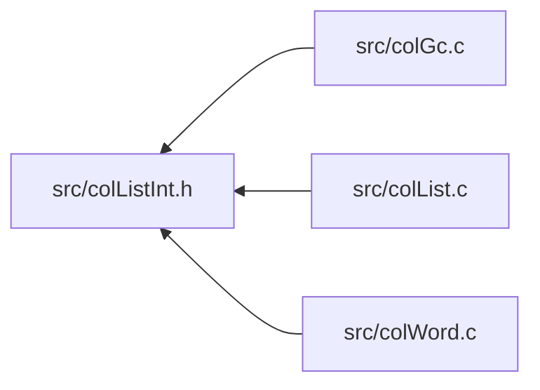

<a id="col_list_int_8h"></a>
# File colListInt.h

![][C++]

**Location**: `src/colListInt.h`

This header file defines the list word internals of Colibri.

Lists are a linear collection datatype that allows for fast insertion, extraction and composition of other lists. Internally they use self-balanced binary trees, like ropes, except that they use vectors as basic containers instead of character arrays.


They come in both immutable and mutable forms.


**See also**: [colList.c](col_list_8c.md#col_list_8c), [colList.h](col_list_8h.md#col_list_8h), [colVectorInt.h](col_vector_int_8h.md#col_vector_int_8h)

## Included by

* [src/colGc.c](col_gc_8c.md#col_gc_8c)
* [src/colList.c](col_list_8c.md#col_list_8c)
* [src/colWord.c](col_word_8c.md#col_word_8c)



## Sublist Creation

<a id="group__sublist__words_1ga0e3fe32fa3ae20489dc8d38db3148c1b"></a>
### Macro WORD\_SUBLIST\_INIT

![][public]

```cpp
#define WORD_SUBLIST_INIT     [WORD\_SET\_TYPEID](col_word_int_8h.md#group__predefined__words_1ga52822cf424704829e60b112fe03614b6)((word), [WORD\_TYPE\_SUBLIST](col_word_int_8h.md#group__words_1gab019a30aca48483424886bf08f7b7cac)); \
    [WORD\_SUBLIST\_DEPTH](col_list_int_8h.md#group__sublist__words_1ga6e3c10b7e63b6f6cabd36f24b69a6ecf)(word) = (uint8_t) (depth); \
    [WORD\_SUBLIST\_SOURCE](col_list_int_8h.md#group__sublist__words_1ga448ba72120af1a5d655107b05479424c)(word) = (source); \
    [WORD\_SUBLIST\_FIRST](col_list_int_8h.md#group__sublist__words_1ga18e2c99a420ebeabe9f94b4166c44033)(word) = (first); \
    [WORD\_SUBLIST\_LAST](col_list_int_8h.md#group__sublist__words_1ga4e00a849390732cdf829ce42d9c42417)(word) = (last);( word ,depth ,source ,first ,last )
```

Sublist word initializer.

**Parameters**:

* **word**: Word to initialize.
* **depth**: [WORD\_SUBLIST\_DEPTH](col_list_int_8h.md#group__sublist__words_1ga6e3c10b7e63b6f6cabd36f24b69a6ecf).
* **source**: [WORD\_SUBLIST\_SOURCE](col_list_int_8h.md#group__sublist__words_1ga448ba72120af1a5d655107b05479424c).
* **first**: [WORD\_SUBLIST\_FIRST](col_list_int_8h.md#group__sublist__words_1ga18e2c99a420ebeabe9f94b4166c44033).
* **last**: [WORD\_SUBLIST\_LAST](col_list_int_8h.md#group__sublist__words_1ga4e00a849390732cdf829ce42d9c42417).


!> **Warning** \
Argument **word** is referenced several times by the macro. Make sure to avoid any side effect.


**See also**: [WORD\_TYPE\_SUBLIST](col_word_int_8h.md#group__words_1gab019a30aca48483424886bf08f7b7cac)


## Sublist Accessors

<a id="group__sublist__words_1ga6e3c10b7e63b6f6cabd36f24b69a6ecf"></a>
### Macro WORD\_SUBLIST\_DEPTH

![][public]

```cpp
#define WORD_SUBLIST_DEPTH (((uint8_t *)(word))[1])( word )
```

Get/set depth of sublist.

**Parameters**:

* **word**: Word to access.


?> Macro is L-Value and suitable for both read/write operations.


**See also**: [WORD\_SUBLIST\_INIT](col_list_int_8h.md#group__sublist__words_1ga0e3fe32fa3ae20489dc8d38db3148c1b)


<a id="group__sublist__words_1ga448ba72120af1a5d655107b05479424c"></a>
### Macro WORD\_SUBLIST\_SOURCE

![][public]

```cpp
#define WORD_SUBLIST_SOURCE ((([Col\_Word](col_word_8h.md#group__words_1gadb626f9e195212e4fdfba7df154ad043) *)(word))[1])( word )
```

Get/set list from which this one is extracted.

**Parameters**:

* **word**: Word to access.


?> Macro is L-Value and suitable for both read/write operations.


**See also**: [WORD\_SUBLIST\_INIT](col_list_int_8h.md#group__sublist__words_1ga0e3fe32fa3ae20489dc8d38db3148c1b)


<a id="group__sublist__words_1ga18e2c99a420ebeabe9f94b4166c44033"></a>
### Macro WORD\_SUBLIST\_FIRST

![][public]

```cpp
#define WORD_SUBLIST_FIRST (((size_t *)(word))[2])( word )
```

Get/set index of first element in source.

**Parameters**:

* **word**: Word to access.


?> Macro is L-Value and suitable for both read/write operations.


**See also**: [WORD\_SUBLIST\_INIT](col_list_int_8h.md#group__sublist__words_1ga0e3fe32fa3ae20489dc8d38db3148c1b)


<a id="group__sublist__words_1ga4e00a849390732cdf829ce42d9c42417"></a>
### Macro WORD\_SUBLIST\_LAST

![][public]

```cpp
#define WORD_SUBLIST_LAST (((size_t *)(word))[3])( word )
```

Get/set index of last element in source.

**Parameters**:

* **word**: Word to access.


?> Macro is L-Value and suitable for both read/write operations.


**See also**: [WORD\_SUBLIST\_INIT](col_list_int_8h.md#group__sublist__words_1ga0e3fe32fa3ae20489dc8d38db3148c1b)


## Immutable Concat List Creation

<a id="group__concatlist__words_1ga8cef632de8ecc768d7926efa76a5d550"></a>
### Macro WORD\_CONCATLIST\_INIT

![][public]

```cpp
#define WORD_CONCATLIST_INIT     [WORD\_SET\_TYPEID](col_word_int_8h.md#group__predefined__words_1ga52822cf424704829e60b112fe03614b6)((word), [WORD\_TYPE\_CONCATLIST](col_word_int_8h.md#group__words_1ga8f0a60698d7b383460fe868b1c043f19)); \
    [WORD\_CONCATLIST\_DEPTH](col_list_int_8h.md#group__concatlist__words_1ga6e5dad2a2ae231641e9c8bc89debb338)(word) = (uint8_t) (depth); \
    [WORD\_CONCATLIST\_LENGTH](col_list_int_8h.md#group__concatlist__words_1ga005eedea923258322288f51292f33782)(word) = (length); \
    [WORD\_CONCATLIST\_LEFT\_LENGTH](col_list_int_8h.md#group__concatlist__words_1gab757f4a3117b72ba7ceab9202cf2c2f4)(word) = (uint16_t) ((leftLength)>UINT16_MAX?0:(leftLength)); \
    [WORD\_CONCATLIST\_LEFT](col_list_int_8h.md#group__concatlist__words_1ga6b758463af55b736f2585d4ebc9d57f3)(word) = (left); \
    [WORD\_CONCATLIST\_RIGHT](col_list_int_8h.md#group__concatlist__words_1gaaec42f5b15639059d8422083c596af4e)(word) = (right);( word ,depth ,length ,leftLength ,left ,right )
```

Immutable concat list word initializer.

**Parameters**:

* **word**: Word to initialize.
* **depth**: [WORD\_CONCATLIST\_DEPTH](col_list_int_8h.md#group__concatlist__words_1ga6e5dad2a2ae231641e9c8bc89debb338).
* **length**: [WORD\_CONCATLIST\_LENGTH](col_list_int_8h.md#group__concatlist__words_1ga005eedea923258322288f51292f33782).
* **leftLength**: [WORD\_CONCATLIST\_LEFT\_LENGTH](col_list_int_8h.md#group__concatlist__words_1gab757f4a3117b72ba7ceab9202cf2c2f4).
* **left**: [WORD\_CONCATLIST\_LEFT](col_list_int_8h.md#group__concatlist__words_1ga6b758463af55b736f2585d4ebc9d57f3).
* **right**: [WORD\_CONCATLIST\_RIGHT](col_list_int_8h.md#group__concatlist__words_1gaaec42f5b15639059d8422083c596af4e).


!> **Warning** \
Arguments **word** and **leftLength** are referenced several times by the macro. Make sure to avoid any side effect.


**See also**: [WORD\_TYPE\_CONCATLIST](col_word_int_8h.md#group__words_1ga8f0a60698d7b383460fe868b1c043f19)


## Immutable Concat List Accessors

<a id="group__concatlist__words_1ga6e5dad2a2ae231641e9c8bc89debb338"></a>
### Macro WORD\_CONCATLIST\_DEPTH

![][public]

```cpp
#define WORD_CONCATLIST_DEPTH (((uint8_t *)(word))[1])( word )
```

Get/set depth of concat list.

Used by both mutable and immutable versions.


**Parameters**:

* **word**: Word to access.


?> Macro is L-Value and suitable for both read/write operations.


**See also**: [WORD\_CONCATLIST\_INIT](col_list_int_8h.md#group__concatlist__words_1ga8cef632de8ecc768d7926efa76a5d550), [WORD\_MCONCATLIST\_INIT](col_list_int_8h.md#group__mconcatlist__words_1ga3c52f1fb2dc05f7d3822519d7be9ee7b)


<a id="group__concatlist__words_1gab757f4a3117b72ba7ceab9202cf2c2f4"></a>
### Macro WORD\_CONCATLIST\_LEFT\_LENGTH

![][public]

```cpp
#define WORD_CONCATLIST_LEFT_LENGTH (((uint16_t *)(word))[1])( word )
```

Get/set left arm's length (zero when too large).

Used by both mutable and immutable versions.


**Parameters**:

* **word**: Word to access.


?> Macro is L-Value and suitable for both read/write operations.


**See also**: [WORD\_CONCATLIST\_INIT](col_list_int_8h.md#group__concatlist__words_1ga8cef632de8ecc768d7926efa76a5d550), [WORD\_MCONCATLIST\_INIT](col_list_int_8h.md#group__mconcatlist__words_1ga3c52f1fb2dc05f7d3822519d7be9ee7b)


<a id="group__concatlist__words_1ga005eedea923258322288f51292f33782"></a>
### Macro WORD\_CONCATLIST\_LENGTH

![][public]

```cpp
#define WORD_CONCATLIST_LENGTH (((size_t *)(word))[1])( word )
```

Get/set list length.

Used by both mutable and immutable versions.


**Parameters**:

* **word**: Word to access.


?> Macro is L-Value and suitable for both read/write operations.


**See also**: [WORD\_CONCATLIST\_INIT](col_list_int_8h.md#group__concatlist__words_1ga8cef632de8ecc768d7926efa76a5d550), [WORD\_MCONCATLIST\_INIT](col_list_int_8h.md#group__mconcatlist__words_1ga3c52f1fb2dc05f7d3822519d7be9ee7b)


<a id="group__concatlist__words_1ga6b758463af55b736f2585d4ebc9d57f3"></a>
### Macro WORD\_CONCATLIST\_LEFT

![][public]

```cpp
#define WORD_CONCATLIST_LEFT ((([Col\_Word](col_word_8h.md#group__words_1gadb626f9e195212e4fdfba7df154ad043) *)(word))[2])( word )
```

Get/set left concatenated list.

**Parameters**:

* **word**: Word to access.

Used by both mutable and immutable versions.


?> Macro is L-Value and suitable for both read/write operations.


**See also**: [WORD\_CONCATLIST\_INIT](col_list_int_8h.md#group__concatlist__words_1ga8cef632de8ecc768d7926efa76a5d550), [WORD\_MCONCATLIST\_INIT](col_list_int_8h.md#group__mconcatlist__words_1ga3c52f1fb2dc05f7d3822519d7be9ee7b)


<a id="group__concatlist__words_1gaaec42f5b15639059d8422083c596af4e"></a>
### Macro WORD\_CONCATLIST\_RIGHT

![][public]

```cpp
#define WORD_CONCATLIST_RIGHT ((([Col\_Word](col_word_8h.md#group__words_1gadb626f9e195212e4fdfba7df154ad043) *)(word))[3])( word )
```

Get/set right concatenated list.

**Parameters**:

* **word**: Word to access.

Used by both mutable and immutable versions.


?> Macro is L-Value and suitable for both read/write operations.


**See also**: [WORD\_CONCATLIST\_INIT](col_list_int_8h.md#group__concatlist__words_1ga8cef632de8ecc768d7926efa76a5d550), [WORD\_MCONCATLIST\_INIT](col_list_int_8h.md#group__mconcatlist__words_1ga3c52f1fb2dc05f7d3822519d7be9ee7b)


## Mutable Concat List Creation

<a id="group__mconcatlist__words_1ga3c52f1fb2dc05f7d3822519d7be9ee7b"></a>
### Macro WORD\_MCONCATLIST\_INIT

![][public]

```cpp
#define WORD_MCONCATLIST_INIT     [WORD\_SET\_TYPEID](col_word_int_8h.md#group__predefined__words_1ga52822cf424704829e60b112fe03614b6)((word), [WORD\_TYPE\_MCONCATLIST](col_word_int_8h.md#group__words_1ga0c4f44385c099ed03aec5db8ff98c4ee)); \
    [WORD\_CONCATLIST\_DEPTH](col_list_int_8h.md#group__concatlist__words_1ga6e5dad2a2ae231641e9c8bc89debb338)(word) = (uint8_t) (depth); \
    [WORD\_CONCATLIST\_LENGTH](col_list_int_8h.md#group__concatlist__words_1ga005eedea923258322288f51292f33782)(word) = (length); \
    [WORD\_CONCATLIST\_LEFT\_LENGTH](col_list_int_8h.md#group__concatlist__words_1gab757f4a3117b72ba7ceab9202cf2c2f4)(word) = (uint16_t) ((leftLength)>UINT16_MAX?0:(leftLength)); \
    [WORD\_CONCATLIST\_LEFT](col_list_int_8h.md#group__concatlist__words_1ga6b758463af55b736f2585d4ebc9d57f3)(word) = (left); \
    [WORD\_CONCATLIST\_RIGHT](col_list_int_8h.md#group__concatlist__words_1gaaec42f5b15639059d8422083c596af4e)(word) = (right);( word ,depth ,length ,leftLength ,left ,right )
```

Mutable concat list word initializer.

**Parameters**:

* **word**: Word to initialize.
* **depth**: [WORD\_CONCATLIST\_DEPTH](col_list_int_8h.md#group__concatlist__words_1ga6e5dad2a2ae231641e9c8bc89debb338).
* **length**: [WORD\_CONCATLIST\_LENGTH](col_list_int_8h.md#group__concatlist__words_1ga005eedea923258322288f51292f33782).
* **leftLength**: [WORD\_CONCATLIST\_LEFT\_LENGTH](col_list_int_8h.md#group__concatlist__words_1gab757f4a3117b72ba7ceab9202cf2c2f4).
* **left**: [WORD\_CONCATLIST\_LEFT](col_list_int_8h.md#group__concatlist__words_1ga6b758463af55b736f2585d4ebc9d57f3).
* **right**: [WORD\_CONCATLIST\_RIGHT](col_list_int_8h.md#group__concatlist__words_1gaaec42f5b15639059d8422083c596af4e).


!> **Warning** \
Arguments **word** and **leftLength** are referenced several times by the macro. Make sure to avoid any side effect.


**See also**: [WORD\_TYPE\_MCONCATLIST](col_word_int_8h.md#group__words_1ga0c4f44385c099ed03aec5db8ff98c4ee)


## Immutable List Exceptions

<a id="group__list__words_1ga50e2794d537901134d3d60e509469fa3"></a>
### Macro TYPECHECK\_LIST

![][public]

```cpp
#define TYPECHECK_LIST( word )
```

Type checking macro for lists.

**Parameters**:

* **word**: Checked word.


**Exceptions**:

* **[COL\_ERROR\_LIST](colibri_8h.md#group__error_1gga729084542ed9eae62009a84d3379ef35a88271295a774232492c1ebbdc68d6958)**: [[T]](colibri_8h.md#group__error_1gga6dab009a0b8c4b4fa080cb9ba1859e9ea603a58b9d5bb16fde0708eb0767e4904) **word**: Not a list.


<a id="group__list__words_1ga1a41d86dcdb925ca6ee2a938f54fb206"></a>
### Macro VALUECHECK\_BOUNDS

![][public]

```cpp
#define VALUECHECK_BOUNDS( index ,length )
```

Value checking macro for lists, ensures that index is within bounds.

**Parameters**:

* **index**: Checked index.
* **length**: List length.


**Exceptions**:

* **[COL\_ERROR\_LISTINDEX](colibri_8h.md#group__error_1gga729084542ed9eae62009a84d3379ef35a53fb84bc77099761ccc326d067022e4b)**: [[V]](colibri_8h.md#group__error_1gga6dab009a0b8c4b4fa080cb9ba1859e9ea65d5e7232c82ae6972ac56f386a32fc9) **index < length**: List index out of bounds.


<a id="group__list__words_1gaaa7ad7fed7ada4b019dd93db3db402a4"></a>
### Macro VALUECHECK\_LISTLENGTH\_CONCAT

![][public]

```cpp
#define VALUECHECK_LISTLENGTH_CONCAT( length1 ,length2 )
```

Value checking macro for lists, ensures that combined lengths of two concatenated lists don't exceed the maximum value.

**Parameters**:

* **length1 length2**: Checked lengths.


**Exceptions**:

* **[COL\_ERROR\_LISTLENGTH\_CONCAT](colibri_8h.md#group__error_1gga729084542ed9eae62009a84d3379ef35a837fcf987426e821513e2fdaffcdf55e)**: [[V]](colibri_8h.md#group__error_1gga6dab009a0b8c4b4fa080cb9ba1859e9ea65d5e7232c82ae6972ac56f386a32fc9) **length1+length2**: Concat list too large.


<a id="group__list__words_1gaae9920f9fe6d6eb79ed243523cbf3321"></a>
### Macro VALUECHECK\_LISTLENGTH\_REPEAT

![][public]

```cpp
#define VALUECHECK_LISTLENGTH_REPEAT( length ,count )
```

Value checking macro for lists, ensures that length of a repeated list doesn't exceed the maximum value.

**Parameters**:

* **length count**: Checked length and repetition factor.


**Exceptions**:

* **[COL\_ERROR\_LISTLENGTH\_CONCAT](colibri_8h.md#group__error_1gga729084542ed9eae62009a84d3379ef35a837fcf987426e821513e2fdaffcdf55e)**: [[V]](colibri_8h.md#group__error_1gga6dab009a0b8c4b4fa080cb9ba1859e9ea65d5e7232c82ae6972ac56f386a32fc9) **length*count**: Concat list too large.


## List Iterator Exceptions

<a id="group__list__words_1ga4c1fffdf0457591c87c4fc4efbc18f0f"></a>
### Macro TYPECHECK\_LISTITER

![][public]

```cpp
#define TYPECHECK_LISTITER( it )
```

Type checking macro for list iterators.

**Parameters**:

* **it**: Checked iterator.


**Exceptions**:

* **[COL\_ERROR\_LISTITER](colibri_8h.md#group__error_1gga729084542ed9eae62009a84d3379ef35acd609f7a6870d0404ced98da497d3834)**: [[T]](colibri_8h.md#group__error_1gga6dab009a0b8c4b4fa080cb9ba1859e9ea603a58b9d5bb16fde0708eb0767e4904) **it**: Invalid list iterator.


**See also**: [Col\_ListIterNull](col_list_8h.md#group__list__words_1ga875bb73d6d35111b84e38f139a6846ba)


<a id="group__list__words_1gac14cf510ccb681127bed16e1433f2b51"></a>
### Macro VALUECHECK\_LISTITER

![][public]

```cpp
#define VALUECHECK_LISTITER( it )
```

Value checking macro for list iterators, ensures that iterator is not at end.

**Parameters**:

* **it**: Checked iterator.


**Exceptions**:

* **[COL\_ERROR\_LISTITER\_END](colibri_8h.md#group__error_1gga729084542ed9eae62009a84d3379ef35a192c0a7221d1094ac6ac886abb8982c9)**: [[V]](colibri_8h.md#group__error_1gga6dab009a0b8c4b4fa080cb9ba1859e9ea65d5e7232c82ae6972ac56f386a32fc9) **it**: List iterator at end.


**See also**: [Col\_ListIterEnd](col_list_8h.md#group__list__words_1ga0025ae0a8a58c10285c5c131acd1d9e9)


## Mutable List Exceptions

<a id="group__mlist__words_1ga026e161ab67cc1825a33e750a1ae7af0"></a>
### Macro TYPECHECK\_MLIST

![][public]

```cpp
#define TYPECHECK_MLIST( word )
```

Type checking macro for mutable lists.

**Parameters**:

* **word**: Checked word.


**Exceptions**:

* **[COL\_ERROR\_MLIST](colibri_8h.md#group__error_1gga729084542ed9eae62009a84d3379ef35a12b82359c99d46f81dda5313e88a5611)**: [[T]](colibri_8h.md#group__error_1gga6dab009a0b8c4b4fa080cb9ba1859e9ea603a58b9d5bb16fde0708eb0767e4904) **word**: Not a mutable list.


## Source

```cpp
/**
 * @file colListInt.h
 *
 * This header file defines the list word internals of Colibri.
 *
 * Lists are a linear collection datatype that allows for fast insertion,
 * extraction and composition of other lists. Internally they use
 * self-balanced binary trees, like ropes, except that they use vectors
 * as basic containers instead of character arrays.
 *
 * They come in both immutable and mutable forms.
 *
 * @see colList.c
 * @see colList.h
 * @see colVectorInt.h
 *
 * @beginprivate @cond PRIVATE
 */

#ifndef _COLIBRI_LIST_INT
#define _COLIBRI_LIST_INT


/*
===========================================================================*//*!
\internal \defgroup sublist_words Sublists
\ingroup predefined_words list_words

Sublists are immutable lists pointing to a slice of a larger list.

Extraction of a sublist from a large list can be expensive. For example,
removing one element from a string of several thousands implies
copying the whole data minus this element. Likewise, extracting a range
of elements from a complex binary tree of list nodes implies
traversing and copying large parts of this subtree.

To limit the memory and processing costs of list slicing, the sublist
word simply points to the original list and the index range of
elements in the slice. This representation is preferred over raw copy
when the source list is large.

@par Requirements
    - Sublist words use one single cell.

    - Sublists must know their source list word. This source must be immutable.

    - Sublists must also know the indices of the first and last elements in
      the source list that belongs to the slice. These indices are inclusive.
      Difference plus one gives the sublist length.

    - Last, sublists must know their depth for tree balancing (see
      @ref list_tree_balancing "List Tree Balancing"). This is the same as the
      source depth, but to avoid one pointer dereference we cache the value in
      the word.

    @param Depth    Depth of sublist. 8 bits will code up to 255 depth levels,
                    which is more than sufficient for balanced binary trees.
    @param Source   List of which this one is a sublist.
    @param First    First element in source.
    @param Last     Last element in source.

@par Cell Layout
    On all architectures the single-cell layout is as follows:

    @dot
    digraph {
        node [fontname="Lucida Console,Courier" fontsize=14];
        sublist_word [shape=none, label=<
            <table border="0" cellborder="1" cellspacing="0">
            <tr><td border="0"></td>
                <td sides="B" width="40" align="left">0</td><td sides="B" width="40" align="right">7</td>
                <td sides="B" width="40" align="left">8</td><td sides="B" width="40" align="right">15</td>
                <td sides="B" width="80" align="left">16</td><td sides="B" width="80" align="right">n</td>
            </tr>
            <tr><td sides="R">0</td>
                <td href="@ref WORD_TYPEID" title="WORD_TYPEID" colspan="2">Type</td>
                <td href="@ref WORD_SUBLIST_DEPTH" title="WORD_SUBLIST_DEPTH" colspan="2">Depth</td>
                <td colspan="2" bgcolor="grey75">Unused</td>
            </tr>
            <tr><td sides="R">1</td>
                <td href="@ref WORD_SUBLIST_SOURCE" title="WORD_SUBLIST_SOURCE" colspan="6">Source</td>
            </tr>
            <tr><td sides="R">2</td>
                <td href="@ref WORD_SUBLIST_FIRST" title="WORD_SUBLIST_FIRST" colspan="6">First</td>
            </tr>
            <tr><td sides="R">3</td>
                <td href="@ref WORD_SUBLIST_LAST" title="WORD_SUBLIST_LAST" colspan="6">Last</td>
            </tr>
            </table>
        >]
    }
    @enddot

    @begindiagram
           0     7 8    15                                               n
          +-------+-------+-----------------------------------------------+
        0 | Type  | Depth |                    Unused                     |
          +-------+-------+-----------------------------------------------+
        1 |                            Source                             |
          +---------------------------------------------------------------+
        2 |                             First                             |
          +---------------------------------------------------------------+
        3 |                             Last                              |
          +---------------------------------------------------------------+
    @enddiagram

@see WORD_TYPE_SUBLIST
\{*//*==========================================================================
*/

/***************************************************************************//*!
 * \name Sublist Creation
 ***************************************************************************\{*/

/**
 * Sublist word initializer.
 *
 * @param word      Word to initialize.
 * @param depth     #WORD_SUBLIST_DEPTH.
 * @param source    #WORD_SUBLIST_SOURCE.
 * @param first     #WORD_SUBLIST_FIRST.
 * @param last      #WORD_SUBLIST_LAST.
 *
 * @warning
 *      Argument **word** is referenced several times by the macro. Make sure to
 *      avoid any side effect.
 *
 * @see WORD_TYPE_SUBLIST
 */
#define WORD_SUBLIST_INIT(word, depth, source, first, last) \
    WORD_SET_TYPEID((word), WORD_TYPE_SUBLIST); \
    WORD_SUBLIST_DEPTH(word) = (uint8_t) (depth); \
    WORD_SUBLIST_SOURCE(word) = (source); \
    WORD_SUBLIST_FIRST(word) = (first); \
    WORD_SUBLIST_LAST(word) = (last);

/* End of Sublist Creation *//*!\}*/


/***************************************************************************//*!
 * \name Sublist Accessors
 ***************************************************************************\{*/

/**
 * Get/set depth of sublist.
 *
 * @param word  Word to access.
 *
 * @note
 *      Macro is L-Value and suitable for both read/write operations.
 *
 * @see WORD_SUBLIST_INIT
 */
#define WORD_SUBLIST_DEPTH(word)        (((uint8_t *)(word))[1])

/**
 * Get/set list from which this one is extracted.
 *
 * @param word  Word to access.
 *
 * @note
 *      Macro is L-Value and suitable for both read/write operations.
 *
 * @see WORD_SUBLIST_INIT
 */
#define WORD_SUBLIST_SOURCE(word)       (((Col_Word *)(word))[1])

/**
 * Get/set index of first element in source.
 *
 * @param word  Word to access.
 *
 * @note
 *      Macro is L-Value and suitable for both read/write operations.
 *
 * @see WORD_SUBLIST_INIT
 */
#define WORD_SUBLIST_FIRST(word)        (((size_t *)(word))[2])

/**
 * Get/set index of last element in source.
 *
 * @param word  Word to access.
 *
 * @note
 *      Macro is L-Value and suitable for both read/write operations.
 *
 * @see WORD_SUBLIST_INIT
 */
#define WORD_SUBLIST_LAST(word)         (((size_t *)(word))[3])

/* End of Sublist Accessors *//*!\}*/

/* End of Sublists *//*!\}*/


/*
===========================================================================*//*!
\internal \defgroup concatlist_words Immutable Concat Lists
\ingroup predefined_words list_words

Immutable concat lists are balanced binary trees concatenating left and right
sublists. The tree is balanced by construction (see @ref list_tree_balancing
"List Tree Balancing").

@par Requirements
    - Concat list words use one single cell.
  
    - Concat lists must know their left and right sublist words.
  
    - Concat lists must know their length, which is the sum of their left and
      right arms. To save full recursive subtree traversal this length is
      stored at each level in the concat words. We also cache the left arm's
      length whenever possible to save a pointer dereference (the right
      length being the total minus left lengths).
  
    - Last, concat lists must know their depth for tree balancing (see
      @ref list_tree_balancing "List Tree Balancing"). This is the max depth of
      their left and right arms, plus one.

    @param Depth        Depth of concat list. 8 bits will code up to 255 depth
                        levels, which is more than sufficient for balanced
                        binary trees.
    @param Left_Length  Used as shortcut to avoid dereferencing the left arm.
                        Zero if actual length is too large to fit.
    @param Length       List length, which is the sum of both arms'.
    @param Left         Left concatenated list.
    @param Right        Right concatenated list.

@par Cell Layout
    On all architectures the single-cell layout is as follows:

    @dot
    digraph {
        node [fontname="Lucida Console,Courier" fontsize=14];
        concatlist_word [shape=none, label=<
            <table border="0" cellborder="1" cellspacing="0">
            <tr><td border="0"></td>
                <td sides="B" width="40" align="left">0</td><td sides="B" width="40" align="right">7</td>
                <td sides="B" width="40" align="left">8</td><td sides="B" width="40" align="right">15</td>
                <td sides="B" width="80" align="left">16</td><td sides="B" width="80" align="right">31</td>
                <td sides="B" align="right">n</td>
            </tr>
            <tr><td sides="R">0</td>
                <td href="@ref WORD_TYPEID" title="WORD_TYPEID" colspan="2">Type</td>
                <td href="@ref WORD_CONCATLIST_DEPTH" title="WORD_CONCATLIST_DEPTH" colspan="2">Depth</td>
                <td href="@ref WORD_CONCATLIST_LEFT_LENGTH" title="WORD_CONCATLIST_LEFT_LENGTH" colspan="2">Left length</td>
                <td bgcolor="grey75"> Unused (n &gt; 32) </td>
            </tr>
            <tr><td sides="R">1</td>
                <td href="@ref WORD_CONCATLIST_LENGTH" title="WORD_CONCATLIST_LENGTH" colspan="7">Length</td>
            </tr>
            <tr><td sides="R">2</td>
                <td href="@ref WORD_CONCATLIST_LEFT" title="WORD_CONCATLIST_LEFT" colspan="7">Left</td>
            </tr>
            <tr><td sides="R">3</td>
                <td href="@ref WORD_CONCATLIST_RIGHT" title="WORD_CONCATLIST_RIGHT" colspan="7">Right</td>
            </tr>
            </table>
        >]
    }
    @enddot

    @begindiagram
           0     7 8    15 16           31                               n
          +-------+-------+---------------+-------------------------------+
        0 | Type  | Depth |  Left length  |        Unused (n > 32)        |
          +-------+-------+---------------+-------------------------------+
        1 |                            Length                             |
          +---------------------------------------------------------------+
        2 |                             Left                              |
          +---------------------------------------------------------------+
        3 |                             Right                             |
          +---------------------------------------------------------------+
    @enddiagram

@see WORD_TYPE_CONCATLIST
\{*//*==========================================================================
*/

/***************************************************************************//*!
 * \name Immutable Concat List Creation
 ***************************************************************************\{*/

/**
 * Immutable concat list word initializer.
 *
 * @param word          Word to initialize.
 * @param depth         #WORD_CONCATLIST_DEPTH.
 * @param length        #WORD_CONCATLIST_LENGTH.
 * @param leftLength    #WORD_CONCATLIST_LEFT_LENGTH.
 * @param left          #WORD_CONCATLIST_LEFT.
 * @param right         #WORD_CONCATLIST_RIGHT.
 *
 * @warning
 *      Arguments **word** and **leftLength** are referenced several times by
 *      the macro. Make sure to avoid any side effect.
 *
 * @see WORD_TYPE_CONCATLIST
 */
#define WORD_CONCATLIST_INIT(word, depth, length, leftLength, left, right) \
    WORD_SET_TYPEID((word), WORD_TYPE_CONCATLIST); \
    WORD_CONCATLIST_DEPTH(word) = (uint8_t) (depth); \
    WORD_CONCATLIST_LENGTH(word) = (length); \
    WORD_CONCATLIST_LEFT_LENGTH(word) = (uint16_t) ((leftLength)>UINT16_MAX?0:(leftLength)); \
    WORD_CONCATLIST_LEFT(word) = (left); \
    WORD_CONCATLIST_RIGHT(word) = (right);

/* End of Immutable Concat List Creation *//*!\}*/


/***************************************************************************//*!
 * \name Immutable Concat List Accessors
 ***************************************************************************\{*/

/**
 * Get/set depth of concat list.
 *
 * Used by both mutable and immutable versions.
 *
 * @param word  Word to access.
 *
 * @note
 *      Macro is L-Value and suitable for both read/write operations.
 *
 * @see WORD_CONCATLIST_INIT
 * @see WORD_MCONCATLIST_INIT
 */
#define WORD_CONCATLIST_DEPTH(word)     (((uint8_t *)(word))[1])

/**
 * Get/set left arm's length (zero when too large).
 *
 * Used by both mutable and immutable versions.
 *
 * @param word  Word to access.
 *
 * @note
 *      Macro is L-Value and suitable for both read/write operations.
 *
 * @see WORD_CONCATLIST_INIT
 * @see WORD_MCONCATLIST_INIT
 */
#define WORD_CONCATLIST_LEFT_LENGTH(word) (((uint16_t *)(word))[1])

/**
 * Get/set list length.
 *
 * Used by both mutable and immutable versions.
 *
 * @param word  Word to access.
 *
 * @note
 *      Macro is L-Value and suitable for both read/write operations.
 *
 * @see WORD_CONCATLIST_INIT
 * @see WORD_MCONCATLIST_INIT
 */
#define WORD_CONCATLIST_LENGTH(word)    (((size_t *)(word))[1])

/**
 * Get/set left concatenated list.
 *
 * @param word  Word to access.
 *
 * Used by both mutable and immutable versions.
 *
 * @note
 *      Macro is L-Value and suitable for both read/write operations.
 *
 * @see WORD_CONCATLIST_INIT
 * @see WORD_MCONCATLIST_INIT
 */
#define WORD_CONCATLIST_LEFT(word)      (((Col_Word *)(word))[2])

/**
 * Get/set right concatenated list.
 *
 * @param word  Word to access.
 *
 * Used by both mutable and immutable versions.
 *
 * @note
 *      Macro is L-Value and suitable for both read/write operations.
 *
 * @see WORD_CONCATLIST_INIT
 * @see WORD_MCONCATLIST_INIT
 */
#define WORD_CONCATLIST_RIGHT(word)     (((Col_Word *)(word))[3])

/* End of Immutable Concat List Accessors *//*!\}*/

/* End of Immutable Concat Lists *//*!\}*/


/*
===========================================================================*//*!
\internal \defgroup mconcatlist_words Mutable Concat Lists
\ingroup predefined_words mlist_words concatlist_words

Mutable concat lists are identical to their immutable counterpart with the
following exceptions:

- The content of mutable concat nodes can change over time, whereas immutable
  ones are fixed at creation time.

- While immutable concat nodes can only contain immutable subnodes, mutable
  concat nodes can contain both immutable and mutable subnodes; immutable
  ones are converted to mutable using copy-on-write semantics during mutable
  operations; mutable ones are frozen and turned immutable when they become
  shared during immutable operations.

- Balancing rules are identical (see @ref list_tree_balancing
  "List Tree Balancing") but while immutable concat nodes must be copied,
  mutable nodes can be modified in-place.

@par Requirements
    - Mutable concat lists use the same basic structure as immutable concat 
      lists so that they can be turned immutable in-place 
      ([frozen](@ref FreezeMList)).

    @param Depth        [Generic immutable concat list depth field](@ref WORD_CONCATLIST_DEPTH).
    @param Left_Length  [Generic immutable concat list left length field](@ref WORD_CONCATLIST_LEFT_LENGTH).
    @param Length       [Generic immutable concat list length field](@ref WORD_CONCATLIST_LENGTH).
    @param Left         [Generic immutable concat list left field](@ref WORD_CONCATLIST_LEFT).
    @param Right        [Generic immutable concat list right field](@ref WORD_CONCATLIST_RIGHT).

@par Cell Layout
    On all architectures the single-cell layout is as follows:

    @dot
    digraph {
        node [fontname="Lucida Console,Courier" fontsize=14];
        concatlist_word [shape=none, label=<
            <table border="0" cellborder="1" cellspacing="0">
            <tr><td border="0"></td>
                <td sides="B" width="40" align="left">0</td><td sides="B" width="40" align="right">7</td>
                <td sides="B" width="40" align="left">8</td><td sides="B" width="40" align="right">15</td>
                <td sides="B" width="80" align="left">16</td><td sides="B" width="80" align="right">31</td>
                <td sides="B" align="right">n</td>
            </tr>
            <tr><td sides="R">0</td>
                <td href="@ref WORD_TYPEID" title="WORD_TYPEID" colspan="2">Type</td>
                <td href="@ref WORD_CONCATLIST_DEPTH" title="WORD_CONCATLIST_DEPTH" colspan="2">Depth</td>
                <td href="@ref WORD_CONCATLIST_LEFT_LENGTH" title="WORD_CONCATLIST_LEFT_LENGTH" colspan="2">Left length</td>
                <td bgcolor="grey75"> Unused (n &gt; 32) </td>
            </tr>
            <tr><td sides="R">1</td>
                <td href="@ref WORD_CONCATLIST_LENGTH" title="WORD_CONCATLIST_LENGTH" colspan="7">Length</td>
            </tr>
            <tr><td sides="R">2</td>
                <td href="@ref WORD_CONCATLIST_LEFT" title="WORD_CONCATLIST_LEFT" colspan="7">Left</td>
            </tr>
            <tr><td sides="R">3</td>
                <td href="@ref WORD_CONCATLIST_RIGHT" title="WORD_CONCATLIST_RIGHT" colspan="7">Right</td>
            </tr>
            </table>
        >]
    }
    @enddot

    @begindiagram
           0     7 8    15 16           31                               n
          +-------+-------+---------------+-------------------------------+
        0 | Type  | Depth |  Left length  |        Unused (n > 32)        |
          +-------+-------+---------------+-------------------------------+
        1 |                            Length                             |
          +---------------------------------------------------------------+
        2 |                             Left                              |
          +---------------------------------------------------------------+
        3 |                             Right                             |
          +---------------------------------------------------------------+
    @enddiagram

@see @ref concatlist_words
@see WORD_TYPE_MCONCATLIST
\{*//*==========================================================================
*/

/***************************************************************************//*!
 * \name Mutable Concat List Creation
 ***************************************************************************\{*/

/**
 * Mutable concat list word initializer.
 *
 * @param word          Word to initialize.
 * @param depth         #WORD_CONCATLIST_DEPTH.
 * @param length        #WORD_CONCATLIST_LENGTH.
 * @param leftLength    #WORD_CONCATLIST_LEFT_LENGTH.
 * @param left          #WORD_CONCATLIST_LEFT.
 * @param right         #WORD_CONCATLIST_RIGHT.
 *
 * @warning
 *      Arguments **word** and **leftLength** are referenced several times by
 *      the macro. Make sure to avoid any side effect.
 *
 * @see WORD_TYPE_MCONCATLIST
 */
#define WORD_MCONCATLIST_INIT(word, depth, length, leftLength, left, right) \
    WORD_SET_TYPEID((word), WORD_TYPE_MCONCATLIST); \
    WORD_CONCATLIST_DEPTH(word) = (uint8_t) (depth); \
    WORD_CONCATLIST_LENGTH(word) = (length); \
    WORD_CONCATLIST_LEFT_LENGTH(word) = (uint16_t) ((leftLength)>UINT16_MAX?0:(leftLength)); \
    WORD_CONCATLIST_LEFT(word) = (left); \
    WORD_CONCATLIST_RIGHT(word) = (right);

/* End of Mutable Concat List Creation *//*!\}*/

/* End of Mutable Concat Lists *//*!\}*/


/*
===========================================================================*//*!
\internal \addtogroup list_words Immutable Lists
\{*//*==========================================================================
*/

/***************************************************************************//*!
 * \name Immutable List Exceptions
 ***************************************************************************\{*/

/**
 * Type checking macro for lists.
 *
 * @param word  Checked word.
 *
 * @typecheck{COL_ERROR_LIST,word}
 * @hideinitializer
 */
#define TYPECHECK_LIST(word) \
    TYPECHECK((Col_WordType(word) & COL_LIST), COL_ERROR_LIST, (word))

/**
 * Value checking macro for lists, ensures that index is within bounds.
 *
 * @param index     Checked index.
 * @param length    List length.
 *
 * @valuecheck{COL_ERROR_LISTINDEX,index < length}
 * @hideinitializer
 */
#define VALUECHECK_BOUNDS(index, length) \
    VALUECHECK(((index) < (length)), COL_ERROR_LISTINDEX, (index), (length))

/**
 * Value checking macro for lists, ensures that combined lengths of two
 * concatenated lists don't exceed the maximum value.
 *
 * @param length1, length2  Checked lengths.
 *
 * @valuecheck{COL_ERROR_LISTLENGTH_CONCAT,length1+length2}
 * @hideinitializer
 */
#define VALUECHECK_LISTLENGTH_CONCAT(length1, length2) \
    VALUECHECK((SIZE_MAX-(length1) >= (length2)), COL_ERROR_LISTLENGTH_CONCAT, \
                (length1), (length2), SIZE_MAX)

/**
 * Value checking macro for lists, ensures that length of a repeated list
 * doesn't exceed the maximum value.
 *
 * @param length, count     Checked length and repetition factor.
 *
 * @valuecheck{COL_ERROR_LISTLENGTH_CONCAT,length*count}
 * @hideinitializer
 */
#define VALUECHECK_LISTLENGTH_REPEAT(length, count) \
    VALUECHECK(((count) <= 1 || SIZE_MAX/(count) >= (length)), \
                COL_ERROR_LISTLENGTH_REPEAT, (length), (count), SIZE_MAX)

/* End of Immutable List Exceptions *//*!\}*/


/***************************************************************************//*!
 * \name List Iterator Exceptions
 ***************************************************************************\{*/

/**
 * Type checking macro for list iterators.
 *
 * @param it    Checked iterator.
 *
 * @typecheck{COL_ERROR_LISTITER,it}
 *
 * @see Col_ListIterNull
 * @hideinitializer
 */
#define TYPECHECK_LISTITER(it) \
    TYPECHECK(!Col_ListIterNull(it), COL_ERROR_LISTITER, (it))

/**
 * Value checking macro for list iterators, ensures that iterator is not
 * at end.
 *
 * @param it    Checked iterator.
 *
 * @valuecheck{COL_ERROR_LISTITER_END,it}
 *
 * @see Col_ListIterEnd
 * @hideinitializer
 */
#define VALUECHECK_LISTITER(it) \
    VALUECHECK(!Col_ListIterEnd(it), COL_ERROR_LISTITER_END, (it))

/* End of List Iterator Exceptions *//*!\}*/

/* End of Immutable Lists *//*!\}*/


/*
===========================================================================*//*!
\internal \addtogroup mlist_words Mutable Lists
\{*//*==========================================================================
*/

/***************************************************************************//*!
 * \name Mutable List Exceptions
 ***************************************************************************\{*/

/**
 * Type checking macro for mutable lists.
 *
 * @param word  Checked word.
 *
 * @typecheck{COL_ERROR_MLIST,word}
 * @hideinitializer
 */
#define TYPECHECK_MLIST(word) \
    TYPECHECK((Col_WordType(word) & COL_MLIST), COL_ERROR_MLIST, (word))

/* End of Mutable List Exceptions *//*!\}*/

/* End of Mutable Lists *//*!\}*/

#endif /* _COLIBRI_LIST_INT */
/*! @endcond @endprivate */
```

[public]: https://img.shields.io/badge/-public-brightgreen (public)
[C++]: https://img.shields.io/badge/language-C%2B%2B-blue (C++)
[private]: https://img.shields.io/badge/-private-red (private)
[Markdown]: https://img.shields.io/badge/language-Markdown-blue (Markdown)
[static]: https://img.shields.io/badge/-static-lightgrey (static)