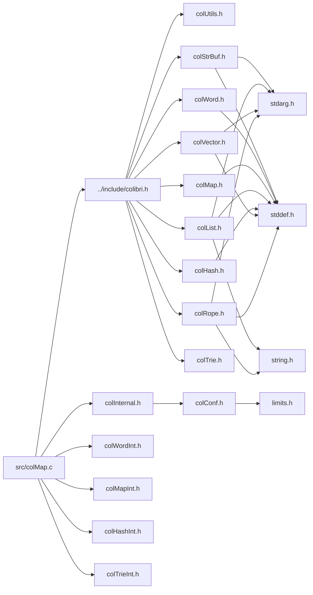

<a id="col_map_8c"></a>
# File colMap.c

![][C++]

**Location**: `src/colMap.c`

This file implements the generic map handling features of Colibri.

Maps are an associative collection datatype that associates keys to values. Keys can be integers, strings or generic words. Values are arbitrary words.


They are always mutable.


**See also**: [colMap.h](col_map_8h.md#col_map_8h)

## Includes

* [../include/colibri.h](colibri_8h.md#colibri_8h)
* [colInternal.h](col_internal_8h.md#col_internal_8h)
* [colWordInt.h](col_word_int_8h.md#col_word_int_8h)
* [colMapInt.h](col_map_int_8h.md#col_map_int_8h)
* [colHashInt.h](col_hash_int_8h.md#col_hash_int_8h)
* [colTrieInt.h](col_trie_int_8h.md#col_trie_int_8h)



## Map Accessors

<a id="group__map__words_1gaae4f3cbf8a5aedc78929bc2364440aac"></a>
### Function Col\_MapSize

![][public]

```cpp
size_t Col_MapSize(Col_Word map)
```

Get the size of the map, i.e. the number of entries.

**Returns**:

The map size.

**Exceptions**:

* **[COL\_ERROR\_MAP](colibri_8h.md#group__error_1gga729084542ed9eae62009a84d3379ef35aa33916b02406dded5d355b3a24c6ec76)**: [[T]](colibri_8h.md#group__error_1gga6dab009a0b8c4b4fa080cb9ba1859e9ea603a58b9d5bb16fde0708eb0767e4904) **map**: Not a map.

**Parameters**:

* [Col\_Word](col_word_8h.md#group__words_1gadb626f9e195212e4fdfba7df154ad043) **map**: Map to get size for.

**Return type**: EXTERN size_t

**References**:

* [ASSERT](col_internal_8h.md#group__error_1gac22830a985e1daed0c9eadba8c6f606e)
* [COL\_HASHMAP](col_word_8h.md#group__words_1gae3509634e52a76014e96c2575b5d8092)
* [COL\_INTMAP](col_word_8h.md#group__words_1ga0938add7b6f34338e9c7bc847a6b9b2f)
* [COL\_MAP](col_word_8h.md#group__words_1ga42912f858f54a3ebfeef2ede9422248c)
* [COL\_TRIEMAP](col_word_8h.md#group__words_1ga7922babbc856f5670805da2267d72ff0)
* [TYPECHECK\_MAP](col_map_int_8h.md#group__mapentry__words_1ga1eede95138bba256545ca58e6abcc4b0)
* [WORD\_HASHMAP\_SIZE](col_hash_int_8h.md#group__hashmap__words_1gac639d1878d96d8bb8d825822bc104b8c)
* [WORD\_TRIEMAP\_SIZE](col_trie_int_8h.md#group__triemap__words_1ga9ccb73a2f8e1e4b2e451833d5cb6903c)
* [WORD\_TYPE](col_word_int_8h.md#group__words_1ga014e27ea4160eb3845ac495a22c232f5)
* [WORD\_TYPE\_CUSTOM](col_word_int_8h.md#group__words_1ga8babfbc77291680db519873c91efdd4c)
* [WORD\_TYPE\_INTHASHMAP](col_word_int_8h.md#group__words_1ga230c3d50685afa970c1e0da69feb5811)
* [WORD\_TYPE\_INTTRIEMAP](col_word_int_8h.md#group__words_1ga9da4310532cf6307f784bd6f33471218)
* [WORD\_TYPE\_STRHASHMAP](col_word_int_8h.md#group__words_1ga4b4fdf9a2320675d8dd1dc29d0007564)
* [WORD\_TYPE\_STRTRIEMAP](col_word_int_8h.md#group__words_1gae4ef7e39bd92ee96414ee98c844065ec)
* [WORD\_TYPEINFO](col_word_int_8h.md#group__custom__words_1gafc962791c45a5dd5bb034050444084be)

**Referenced by**:

* [Col\_HashMapIterBegin](col_hash_8h.md#group__hashmap__words_1gac4de92fb8d4ed572c26f6907a6108005)

<a id="group__map__words_1gabd075578f35ec7a706654e94aba281d9"></a>
### Function Col\_MapGet

![][public]

```cpp
int Col_MapGet(Col_Word map, Col_Word key, Col_Word *valuePtr)
```

Get value mapped to the given key if present.

Generic interface to map get, calls actual function depending on type.


**Return values**:

* **0**: if the key wasn't found.
* **<>0**: if the key was found, in this case the value is returned through **valuePtr**.

**Exceptions**:

* **[COL\_ERROR\_WORDMAP](colibri_8h.md#group__error_1gga729084542ed9eae62009a84d3379ef35a892f5f9cfa9a2d2128b9a3035747a111)**: [[T]](colibri_8h.md#group__error_1gga6dab009a0b8c4b4fa080cb9ba1859e9ea603a58b9d5bb16fde0708eb0767e4904) **map**: Not a string or word-keyed map.

**Parameters**:

* [Col\_Word](col_word_8h.md#group__words_1gadb626f9e195212e4fdfba7df154ad043) **map**: Map to get entry for.
* [Col\_Word](col_word_8h.md#group__words_1gadb626f9e195212e4fdfba7df154ad043) **key**: Entry key. Can be any word type, including string, however it must match the actual type used by the map.
* [Col\_Word](col_word_8h.md#group__words_1gadb626f9e195212e4fdfba7df154ad043) * **valuePtr**: [out] Returned entry value, if found.

**Return type**: EXTERN int

**References**:

* [ASSERT](col_internal_8h.md#group__error_1gac22830a985e1daed0c9eadba8c6f606e)
* [COL\_HASHMAP](col_word_8h.md#group__words_1gae3509634e52a76014e96c2575b5d8092)
* [Col\_HashMapGet](col_hash_8h.md#group__hashmap__words_1ga7fe5b8f4de905e324ada5177527d483e)
* [COL\_MAP](col_word_8h.md#group__words_1ga42912f858f54a3ebfeef2ede9422248c)
* [COL\_TRIEMAP](col_word_8h.md#group__words_1ga7922babbc856f5670805da2267d72ff0)
* [Col\_TrieMapGet](col_trie_8h.md#group__triemap__words_1ga60077ee297a2a45306a8d2e9107ddd4c)
* [Col\_CustomMapType::getProc](struct_col___custom_map_type.md#struct_col___custom_map_type_1a2d74b10090dfda067455420b3b66ba55)
* [Col\_CustomMapType::type](struct_col___custom_map_type.md#struct_col___custom_map_type_1aaf00fcf33d181f450a55261f2814eb77)
* [Col\_CustomWordType::type](struct_col___custom_word_type.md#struct_col___custom_word_type_1af9482efe5a6408bc622320619c3ccf9f)
* [TYPECHECK\_WORDMAP](col_map_int_8h.md#group__mapentry__words_1gad6c8914c3cf622521347dfa8a7a3f31c)
* [WORD\_TYPE](col_word_int_8h.md#group__words_1ga014e27ea4160eb3845ac495a22c232f5)
* [WORD\_TYPE\_CUSTOM](col_word_int_8h.md#group__words_1ga8babfbc77291680db519873c91efdd4c)
* [WORD\_TYPE\_STRHASHMAP](col_word_int_8h.md#group__words_1ga4b4fdf9a2320675d8dd1dc29d0007564)
* [WORD\_TYPE\_STRTRIEMAP](col_word_int_8h.md#group__words_1gae4ef7e39bd92ee96414ee98c844065ec)
* [WORD\_TYPEINFO](col_word_int_8h.md#group__custom__words_1gafc962791c45a5dd5bb034050444084be)

<a id="group__map__words_1ga4f96f7436cc66537b05841c5b088eef2"></a>
### Function Col\_IntMapGet

![][public]

```cpp
int Col_IntMapGet(Col_Word map, intptr_t key, Col_Word *valuePtr)
```

Get value mapped to the given integer key if present.

Generic interface to integer map get, calls actual function depending on type.


**Return values**:

* **0**: if the key wasn't found.
* **<>0**: if the key was found, in this case the value is returned through **valuePtr**.

**Exceptions**:

* **[COL\_ERROR\_INTMAP](colibri_8h.md#group__error_1gga729084542ed9eae62009a84d3379ef35a4b21a1231316f5d1e72f1a4063cd64b4)**: [[T]](colibri_8h.md#group__error_1gga6dab009a0b8c4b4fa080cb9ba1859e9ea603a58b9d5bb16fde0708eb0767e4904) **map**: Not an integer-keyed map.

**Parameters**:

* [Col\_Word](col_word_8h.md#group__words_1gadb626f9e195212e4fdfba7df154ad043) **map**: Integer map to get entry for.
* intptr_t **key**: Integer entry key
* [Col\_Word](col_word_8h.md#group__words_1gadb626f9e195212e4fdfba7df154ad043) * **valuePtr**: [out] Returned entry value, if found.

**Return type**: EXTERN int

**References**:

* [ASSERT](col_internal_8h.md#group__error_1gac22830a985e1daed0c9eadba8c6f606e)
* [Col\_IntHashMapGet](col_hash_8h.md#group__hashmap__words_1ga9c83b74f8b6dd17750f0c9be778bdc95)
* [COL\_INTMAP](col_word_8h.md#group__words_1ga0938add7b6f34338e9c7bc847a6b9b2f)
* [Col\_IntTrieMapGet](col_trie_8h.md#group__triemap__words_1gafb5c74dcca8204a0b83e6d1fa9325026)
* [TYPECHECK\_INTMAP](col_map_int_8h.md#group__mapentry__words_1gabf16d4f023a9f2699c2ef1098d5fb74e)
* [WORD\_TYPE](col_word_int_8h.md#group__words_1ga014e27ea4160eb3845ac495a22c232f5)
* [WORD\_TYPE\_CUSTOM](col_word_int_8h.md#group__words_1ga8babfbc77291680db519873c91efdd4c)
* [WORD\_TYPE\_INTHASHMAP](col_word_int_8h.md#group__words_1ga230c3d50685afa970c1e0da69feb5811)
* [WORD\_TYPE\_INTTRIEMAP](col_word_int_8h.md#group__words_1ga9da4310532cf6307f784bd6f33471218)
* [WORD\_TYPEINFO](col_word_int_8h.md#group__custom__words_1gafc962791c45a5dd5bb034050444084be)

<a id="group__map__words_1ga82b31e62df46ff382e18241bdcde49e3"></a>
### Function Col\_MapSet

![][public]

```cpp
int Col_MapSet(Col_Word map, Col_Word key, Col_Word value)
```

Map the value to the key, replacing any existing.

Generic interface to map set, calls actual function depending on type.


**Return values**:

* **0**: if an existing entry was updated with **value**.
* **<>0**: if a new entry was created with **key** and **value**.

**Exceptions**:

* **[COL\_ERROR\_WORDMAP](colibri_8h.md#group__error_1gga729084542ed9eae62009a84d3379ef35a892f5f9cfa9a2d2128b9a3035747a111)**: [[T]](colibri_8h.md#group__error_1gga6dab009a0b8c4b4fa080cb9ba1859e9ea603a58b9d5bb16fde0708eb0767e4904) **map**: Not a string or word-keyed map.

**Parameters**:

* [Col\_Word](col_word_8h.md#group__words_1gadb626f9e195212e4fdfba7df154ad043) **map**: Map to insert entry into.
* [Col\_Word](col_word_8h.md#group__words_1gadb626f9e195212e4fdfba7df154ad043) **key**: Entry key. Can be any word type, including string, however it must match the actual type used by the map.
* [Col\_Word](col_word_8h.md#group__words_1gadb626f9e195212e4fdfba7df154ad043) **value**: Entry value.

**Return type**: EXTERN int

**References**:

* [ASSERT](col_internal_8h.md#group__error_1gac22830a985e1daed0c9eadba8c6f606e)
* [COL\_HASHMAP](col_word_8h.md#group__words_1gae3509634e52a76014e96c2575b5d8092)
* [Col\_HashMapSet](col_hash_8h.md#group__hashmap__words_1ga5290a8ca2aeccdb481e46ca161dbafdf)
* [COL\_MAP](col_word_8h.md#group__words_1ga42912f858f54a3ebfeef2ede9422248c)
* [COL\_TRIEMAP](col_word_8h.md#group__words_1ga7922babbc856f5670805da2267d72ff0)
* [Col\_TrieMapSet](col_trie_8h.md#group__triemap__words_1ga05580df1648d9d53b333ac6da24de26d)
* [Col\_CustomMapType::setProc](struct_col___custom_map_type.md#struct_col___custom_map_type_1a9b7315ab84fd55ba3f2f9199b180481e)
* [Col\_CustomMapType::type](struct_col___custom_map_type.md#struct_col___custom_map_type_1aaf00fcf33d181f450a55261f2814eb77)
* [Col\_CustomWordType::type](struct_col___custom_word_type.md#struct_col___custom_word_type_1af9482efe5a6408bc622320619c3ccf9f)
* [TYPECHECK\_WORDMAP](col_map_int_8h.md#group__mapentry__words_1gad6c8914c3cf622521347dfa8a7a3f31c)
* [WORD\_TYPE](col_word_int_8h.md#group__words_1ga014e27ea4160eb3845ac495a22c232f5)
* [WORD\_TYPE\_CUSTOM](col_word_int_8h.md#group__words_1ga8babfbc77291680db519873c91efdd4c)
* [WORD\_TYPE\_STRHASHMAP](col_word_int_8h.md#group__words_1ga4b4fdf9a2320675d8dd1dc29d0007564)
* [WORD\_TYPE\_STRTRIEMAP](col_word_int_8h.md#group__words_1gae4ef7e39bd92ee96414ee98c844065ec)
* [WORD\_TYPEINFO](col_word_int_8h.md#group__custom__words_1gafc962791c45a5dd5bb034050444084be)

<a id="group__map__words_1ga27a694b6de40e1a3af81379a7056754d"></a>
### Function Col\_IntMapSet

![][public]

```cpp
int Col_IntMapSet(Col_Word map, intptr_t key, Col_Word value)
```

Map the value to the integer key, replacing any existing.

Generic interface to integer map set, calls actual function depending on type.


**Return values**:

* **0**: if an existing entry was updated with **value**.
* **<>0**: if a new entry was created with **key** and **value**.

**Exceptions**:

* **[COL\_ERROR\_INTMAP](colibri_8h.md#group__error_1gga729084542ed9eae62009a84d3379ef35a4b21a1231316f5d1e72f1a4063cd64b4)**: [[T]](colibri_8h.md#group__error_1gga6dab009a0b8c4b4fa080cb9ba1859e9ea603a58b9d5bb16fde0708eb0767e4904) **map**: Not an integer-keyed map.

**Parameters**:

* [Col\_Word](col_word_8h.md#group__words_1gadb626f9e195212e4fdfba7df154ad043) **map**: Integer map to insert entry into.
* intptr_t **key**: Integer entry key.
* [Col\_Word](col_word_8h.md#group__words_1gadb626f9e195212e4fdfba7df154ad043) **value**: Entry value.

**Return type**: EXTERN int

**References**:

* [ASSERT](col_internal_8h.md#group__error_1gac22830a985e1daed0c9eadba8c6f606e)
* [Col\_IntHashMapSet](col_hash_8h.md#group__hashmap__words_1ga73aa4d8fc75a6f152c385e3a4bcdcb1c)
* [COL\_INTMAP](col_word_8h.md#group__words_1ga0938add7b6f34338e9c7bc847a6b9b2f)
* [Col\_IntTrieMapSet](col_trie_8h.md#group__triemap__words_1ga93b4e0529f287e7116fc7e6ecd5a5859)
* [TYPECHECK\_INTMAP](col_map_int_8h.md#group__mapentry__words_1gabf16d4f023a9f2699c2ef1098d5fb74e)
* [WORD\_TYPE](col_word_int_8h.md#group__words_1ga014e27ea4160eb3845ac495a22c232f5)
* [WORD\_TYPE\_CUSTOM](col_word_int_8h.md#group__words_1ga8babfbc77291680db519873c91efdd4c)
* [WORD\_TYPE\_INTHASHMAP](col_word_int_8h.md#group__words_1ga230c3d50685afa970c1e0da69feb5811)
* [WORD\_TYPE\_INTTRIEMAP](col_word_int_8h.md#group__words_1ga9da4310532cf6307f784bd6f33471218)
* [WORD\_TYPEINFO](col_word_int_8h.md#group__custom__words_1gafc962791c45a5dd5bb034050444084be)

<a id="group__map__words_1ga1f48ed3390f9a53cde268533a763e638"></a>
### Function Col\_MapUnset

![][public]

```cpp
int Col_MapUnset(Col_Word map, Col_Word key)
```

Remove any value mapped to the given key.

Generic interface to map unset, calls actual function depending on type.


**Return values**:

* **0**: if no entry matching **key** was found.
* **<>0**: if the existing entry was removed.

**Exceptions**:

* **[COL\_ERROR\_WORDMAP](colibri_8h.md#group__error_1gga729084542ed9eae62009a84d3379ef35a892f5f9cfa9a2d2128b9a3035747a111)**: [[T]](colibri_8h.md#group__error_1gga6dab009a0b8c4b4fa080cb9ba1859e9ea603a58b9d5bb16fde0708eb0767e4904) **map**: Not a string or word-keyed map.

**Parameters**:

* [Col\_Word](col_word_8h.md#group__words_1gadb626f9e195212e4fdfba7df154ad043) **map**: Map to remove entry from.
* [Col\_Word](col_word_8h.md#group__words_1gadb626f9e195212e4fdfba7df154ad043) **key**: Entry key. Can be any word type, including string, however it must match the actual type used by the map.

**Return type**: EXTERN int

**References**:

* [ASSERT](col_internal_8h.md#group__error_1gac22830a985e1daed0c9eadba8c6f606e)
* [COL\_HASHMAP](col_word_8h.md#group__words_1gae3509634e52a76014e96c2575b5d8092)
* [Col\_HashMapUnset](col_hash_8h.md#group__hashmap__words_1ga4319b874a1524fcd008125db503a7f9c)
* [COL\_MAP](col_word_8h.md#group__words_1ga42912f858f54a3ebfeef2ede9422248c)
* [COL\_TRIEMAP](col_word_8h.md#group__words_1ga7922babbc856f5670805da2267d72ff0)
* [Col\_TrieMapUnset](col_trie_8h.md#group__triemap__words_1gaab7c1e33efc9b0e1fb913951d4b61fc2)
* [Col\_CustomMapType::type](struct_col___custom_map_type.md#struct_col___custom_map_type_1aaf00fcf33d181f450a55261f2814eb77)
* [Col\_CustomWordType::type](struct_col___custom_word_type.md#struct_col___custom_word_type_1af9482efe5a6408bc622320619c3ccf9f)
* [TYPECHECK\_WORDMAP](col_map_int_8h.md#group__mapentry__words_1gad6c8914c3cf622521347dfa8a7a3f31c)
* [Col\_CustomMapType::unsetProc](struct_col___custom_map_type.md#struct_col___custom_map_type_1ae0ee2e1af0ac42e9914cc3f6b8cd842f)
* [WORD\_TYPE](col_word_int_8h.md#group__words_1ga014e27ea4160eb3845ac495a22c232f5)
* [WORD\_TYPE\_CUSTOM](col_word_int_8h.md#group__words_1ga8babfbc77291680db519873c91efdd4c)
* [WORD\_TYPE\_STRHASHMAP](col_word_int_8h.md#group__words_1ga4b4fdf9a2320675d8dd1dc29d0007564)
* [WORD\_TYPE\_STRTRIEMAP](col_word_int_8h.md#group__words_1gae4ef7e39bd92ee96414ee98c844065ec)
* [WORD\_TYPEINFO](col_word_int_8h.md#group__custom__words_1gafc962791c45a5dd5bb034050444084be)

<a id="group__map__words_1gac2ae366ebe1ec3a4495128cb1400d1cf"></a>
### Function Col\_IntMapUnset

![][public]

```cpp
int Col_IntMapUnset(Col_Word map, intptr_t key)
```

Remove any value mapped to the given integer key.

Generic interface to integer map unset, calls actual function depending on type.


**Return values**:

* **0**: if no entry matching **key** was found.
* **<>0**: if the existing entry was removed.

**Exceptions**:

* **[COL\_ERROR\_INTMAP](colibri_8h.md#group__error_1gga729084542ed9eae62009a84d3379ef35a4b21a1231316f5d1e72f1a4063cd64b4)**: [[T]](colibri_8h.md#group__error_1gga6dab009a0b8c4b4fa080cb9ba1859e9ea603a58b9d5bb16fde0708eb0767e4904) **map**: Not an integer-keyed map.

**Parameters**:

* [Col\_Word](col_word_8h.md#group__words_1gadb626f9e195212e4fdfba7df154ad043) **map**: Integer map to remove entry fromo.
* intptr_t **key**: Integer entry key.

**Return type**: EXTERN int

**References**:

* [ASSERT](col_internal_8h.md#group__error_1gac22830a985e1daed0c9eadba8c6f606e)
* [Col\_IntHashMapUnset](col_hash_8h.md#group__hashmap__words_1gab060852e2fc2e645aee2179e678cbeb3)
* [COL\_INTMAP](col_word_8h.md#group__words_1ga0938add7b6f34338e9c7bc847a6b9b2f)
* [Col\_IntTrieMapUnset](col_trie_8h.md#group__triemap__words_1gae11e5dcae95319e4fa94aec1f278909d)
* [TYPECHECK\_INTMAP](col_map_int_8h.md#group__mapentry__words_1gabf16d4f023a9f2699c2ef1098d5fb74e)
* [WORD\_TYPE](col_word_int_8h.md#group__words_1ga014e27ea4160eb3845ac495a22c232f5)
* [WORD\_TYPE\_CUSTOM](col_word_int_8h.md#group__words_1ga8babfbc77291680db519873c91efdd4c)
* [WORD\_TYPE\_INTHASHMAP](col_word_int_8h.md#group__words_1ga230c3d50685afa970c1e0da69feb5811)
* [WORD\_TYPE\_INTTRIEMAP](col_word_int_8h.md#group__words_1ga9da4310532cf6307f784bd6f33471218)
* [WORD\_TYPEINFO](col_word_int_8h.md#group__custom__words_1gafc962791c45a5dd5bb034050444084be)

## Map Iteration

<a id="group__map__words_1gab8f4a0de6b264bbe59c332b41a22866a"></a>
### Function Col\_MapIterBegin

![][public]

```cpp
void Col_MapIterBegin(Col_MapIterator it, Col_Word map)
```

Initialize the map iterator so that it points to the first entry within the map.

Generic interface to map iteration, calls actual function depending on type.

**Exceptions**:

* **[COL\_ERROR\_MAP](colibri_8h.md#group__error_1gga729084542ed9eae62009a84d3379ef35aa33916b02406dded5d355b3a24c6ec76)**: [[T]](colibri_8h.md#group__error_1gga6dab009a0b8c4b4fa080cb9ba1859e9ea603a58b9d5bb16fde0708eb0767e4904) **map**: Not a map.

**Parameters**:

* [Col\_MapIterator](col_map_8h.md#group__map__words_1ga33d331116aff3f3d03a231ccbbce40c2) **it**: Iterator to initialize.
* [Col\_Word](col_word_8h.md#group__words_1gadb626f9e195212e4fdfba7df154ad043) **map**: Map to iterate over.

**Return type**: EXTERN void

**References**:

* [ASSERT](col_internal_8h.md#group__error_1gac22830a985e1daed0c9eadba8c6f606e)
* [COL\_HASHMAP](col_word_8h.md#group__words_1gae3509634e52a76014e96c2575b5d8092)
* [Col\_HashMapIterBegin](col_hash_8h.md#group__hashmap__words_1gac4de92fb8d4ed572c26f6907a6108005)
* [COL\_INTMAP](col_word_8h.md#group__words_1ga0938add7b6f34338e9c7bc847a6b9b2f)
* [COL\_MAP](col_word_8h.md#group__words_1ga42912f858f54a3ebfeef2ede9422248c)
* [Col\_MapIterSetNull](col_map_8h.md#group__map__words_1ga3629bc2a457ae5a9ab57ab1f74ee0223)
* [COL\_TRIEMAP](col_word_8h.md#group__words_1ga7922babbc856f5670805da2267d72ff0)
* [Col\_TrieMapIterFirst](col_trie_8h.md#group__triemap__words_1ga85159bdeec81a97106171f745204fbdd)
* [TYPECHECK\_MAP](col_map_int_8h.md#group__mapentry__words_1ga1eede95138bba256545ca58e6abcc4b0)
* [WORD\_NIL](col_word_8h.md#group__words_1ga29e370264f4e5659ccc5be4de209f065)
* [WORD\_TYPE](col_word_int_8h.md#group__words_1ga014e27ea4160eb3845ac495a22c232f5)
* [WORD\_TYPE\_CUSTOM](col_word_int_8h.md#group__words_1ga8babfbc77291680db519873c91efdd4c)
* [WORD\_TYPE\_INTHASHMAP](col_word_int_8h.md#group__words_1ga230c3d50685afa970c1e0da69feb5811)
* [WORD\_TYPE\_INTTRIEMAP](col_word_int_8h.md#group__words_1ga9da4310532cf6307f784bd6f33471218)
* [WORD\_TYPE\_STRHASHMAP](col_word_int_8h.md#group__words_1ga4b4fdf9a2320675d8dd1dc29d0007564)
* [WORD\_TYPE\_STRTRIEMAP](col_word_int_8h.md#group__words_1gae4ef7e39bd92ee96414ee98c844065ec)
* [WORD\_TYPEINFO](col_word_int_8h.md#group__custom__words_1gafc962791c45a5dd5bb034050444084be)

<a id="group__map__words_1gaa925d7d32221bc826e9717930c2602e1"></a>
### Function Col\_MapIterFind

![][public]

```cpp
void Col_MapIterFind(Col_MapIterator it, Col_Word map, Col_Word key, int *createPtr)
```

Initialize the map iterator so that it points to the entry with the given key within the map.

Generic interface to map iteration, calls actual function depending on type.

**Exceptions**:

* **[COL\_ERROR\_WORDMAP](colibri_8h.md#group__error_1gga729084542ed9eae62009a84d3379ef35a892f5f9cfa9a2d2128b9a3035747a111)**: [[T]](colibri_8h.md#group__error_1gga6dab009a0b8c4b4fa080cb9ba1859e9ea603a58b9d5bb16fde0708eb0767e4904) **map**: Not a string or word-keyed map.

**Parameters**:

* [Col\_MapIterator](col_map_8h.md#group__map__words_1ga33d331116aff3f3d03a231ccbbce40c2) **it**: Iterator to initialize.
* [Col\_Word](col_word_8h.md#group__words_1gadb626f9e195212e4fdfba7df154ad043) **map**: Map to iterate over.
* [Col\_Word](col_word_8h.md#group__words_1gadb626f9e195212e4fdfba7df154ad043) **key**: Entry key. Can be any word type, including string, however it must match the actual type used by the map.
* int * **createPtr**: [in,out] If non-NULL, whether to create entry if absent on input, and whether an entry was created on output.

**Return type**: EXTERN void

**References**:

* [ASSERT](col_internal_8h.md#group__error_1gac22830a985e1daed0c9eadba8c6f606e)
* [COL\_HASHMAP](col_word_8h.md#group__words_1gae3509634e52a76014e96c2575b5d8092)
* [Col\_HashMapIterFind](col_hash_8h.md#group__hashmap__words_1ga7f4cdf033cec55efd5d6c7704176dfc5)
* [COL\_MAP](col_word_8h.md#group__words_1ga42912f858f54a3ebfeef2ede9422248c)
* [Col\_MapIterSetNull](col_map_8h.md#group__map__words_1ga3629bc2a457ae5a9ab57ab1f74ee0223)
* [COL\_TRIEMAP](col_word_8h.md#group__words_1ga7922babbc856f5670805da2267d72ff0)
* [Col\_TrieMapIterFind](col_trie_8h.md#group__triemap__words_1gab594f8e0086ad33bb029be6bc219a766)
* [TYPECHECK\_WORDMAP](col_map_int_8h.md#group__mapentry__words_1gad6c8914c3cf622521347dfa8a7a3f31c)
* [WORD\_NIL](col_word_8h.md#group__words_1ga29e370264f4e5659ccc5be4de209f065)
* [WORD\_TYPE](col_word_int_8h.md#group__words_1ga014e27ea4160eb3845ac495a22c232f5)
* [WORD\_TYPE\_CUSTOM](col_word_int_8h.md#group__words_1ga8babfbc77291680db519873c91efdd4c)
* [WORD\_TYPE\_STRHASHMAP](col_word_int_8h.md#group__words_1ga4b4fdf9a2320675d8dd1dc29d0007564)
* [WORD\_TYPE\_STRTRIEMAP](col_word_int_8h.md#group__words_1gae4ef7e39bd92ee96414ee98c844065ec)
* [WORD\_TYPEINFO](col_word_int_8h.md#group__custom__words_1gafc962791c45a5dd5bb034050444084be)

<a id="group__map__words_1ga8c332381607b0dc828b4aa96fa8f1a12"></a>
### Function Col\_IntMapIterFind

![][public]

```cpp
void Col_IntMapIterFind(Col_MapIterator it, Col_Word map, intptr_t key, int *createPtr)
```

Initialize the map iterator so that it points to the entry with the given integer key within the map.

Generic interface to integer map iteration, calls actual function depending on type.

**Exceptions**:

* **[COL\_ERROR\_INTMAP](colibri_8h.md#group__error_1gga729084542ed9eae62009a84d3379ef35a4b21a1231316f5d1e72f1a4063cd64b4)**: [[T]](colibri_8h.md#group__error_1gga6dab009a0b8c4b4fa080cb9ba1859e9ea603a58b9d5bb16fde0708eb0767e4904) **map**: Not an integer-keyed map.

**Parameters**:

* [Col\_MapIterator](col_map_8h.md#group__map__words_1ga33d331116aff3f3d03a231ccbbce40c2) **it**: Iterator to initialize.
* [Col\_Word](col_word_8h.md#group__words_1gadb626f9e195212e4fdfba7df154ad043) **map**: Integer map to iterate over.
* intptr_t **key**: Integer entry key.
* int * **createPtr**: [in,out] If non-NULL, whether to create entry if absent on input, and whether an entry was created on output.

**Return type**: EXTERN void

**References**:

* [ASSERT](col_internal_8h.md#group__error_1gac22830a985e1daed0c9eadba8c6f606e)
* [Col\_IntHashMapIterFind](col_hash_8h.md#group__hashmap__words_1ga6ffef52a7e4127f837ac680cfd08a855)
* [COL\_INTMAP](col_word_8h.md#group__words_1ga0938add7b6f34338e9c7bc847a6b9b2f)
* [Col\_IntTrieMapIterFind](col_trie_8h.md#group__triemap__words_1gaae7f3d5178448023db25fbf6fd8c8f7a)
* [Col\_MapIterSetNull](col_map_8h.md#group__map__words_1ga3629bc2a457ae5a9ab57ab1f74ee0223)
* [TYPECHECK\_INTMAP](col_map_int_8h.md#group__mapentry__words_1gabf16d4f023a9f2699c2ef1098d5fb74e)
* [WORD\_NIL](col_word_8h.md#group__words_1ga29e370264f4e5659ccc5be4de209f065)
* [WORD\_TYPE](col_word_int_8h.md#group__words_1ga014e27ea4160eb3845ac495a22c232f5)
* [WORD\_TYPE\_CUSTOM](col_word_int_8h.md#group__words_1ga8babfbc77291680db519873c91efdd4c)
* [WORD\_TYPE\_INTHASHMAP](col_word_int_8h.md#group__words_1ga230c3d50685afa970c1e0da69feb5811)
* [WORD\_TYPE\_INTTRIEMAP](col_word_int_8h.md#group__words_1ga9da4310532cf6307f784bd6f33471218)
* [WORD\_TYPEINFO](col_word_int_8h.md#group__custom__words_1gafc962791c45a5dd5bb034050444084be)

<a id="group__map__words_1ga1ec7db1472cf7bbc5e48b7972f8f5a77"></a>
### Function Col\_MapIterGet

![][public]

```cpp
void Col_MapIterGet(Col_MapIterator it, Col_Word *keyPtr, Col_Word *valuePtr)
```

Get key & value from map iterator.


**Exceptions**:

* **[COL\_ERROR\_MAPITER](colibri_8h.md#group__error_1gga729084542ed9eae62009a84d3379ef35aa66f57346b0a9eac571308e75fb1f8ec)**: [[T]](colibri_8h.md#group__error_1gga6dab009a0b8c4b4fa080cb9ba1859e9ea603a58b9d5bb16fde0708eb0767e4904) **it**: Invalid map iterator.
* **[COL\_ERROR\_WORDMAP](colibri_8h.md#group__error_1gga729084542ed9eae62009a84d3379ef35a892f5f9cfa9a2d2128b9a3035747a111)**: [[T]](colibri_8h.md#group__error_1gga6dab009a0b8c4b4fa080cb9ba1859e9ea603a58b9d5bb16fde0708eb0767e4904) **[Col\_MapIterMap(it)](col_map_8h.md#group__map__words_1gac6f818f3c753f4e2668367155fa42686)**: Not a string or word-keyed map.
* **[COL\_ERROR\_MAPITER\_END](colibri_8h.md#group__error_1gga729084542ed9eae62009a84d3379ef35a1a834ed5a623ccf3120ccec5d0d60653)**: [[V]](colibri_8h.md#group__error_1gga6dab009a0b8c4b4fa080cb9ba1859e9ea65d5e7232c82ae6972ac56f386a32fc9) **it**: Map iterator at end.

**Parameters**:

* [Col\_MapIterator](col_map_8h.md#group__map__words_1ga33d331116aff3f3d03a231ccbbce40c2) **it**: Map iterator to get key & value from.
* [Col\_Word](col_word_8h.md#group__words_1gadb626f9e195212e4fdfba7df154ad043) * **keyPtr**: [out] Entry key.
* [Col\_Word](col_word_8h.md#group__words_1gadb626f9e195212e4fdfba7df154ad043) * **valuePtr**: [out] Entry value.

**Return type**: EXTERN void

**References**:

* [ASSERT](col_internal_8h.md#group__error_1gac22830a985e1daed0c9eadba8c6f606e)
* [COL\_MAP](col_word_8h.md#group__words_1ga42912f858f54a3ebfeef2ede9422248c)
* [Col\_CustomMapType::iterGetKeyProc](struct_col___custom_map_type.md#struct_col___custom_map_type_1ab1b9c1f350b6eae05efc248dc4fed4e0)
* [Col\_CustomMapType::iterGetValueProc](struct_col___custom_map_type.md#struct_col___custom_map_type_1ad5683dc97da63b51a4038253f7416274)
* [TYPECHECK\_MAPITER](col_map_int_8h.md#group__mapentry__words_1ga1ac9e9b70a28fd5385c1c5fb95494a2b)
* [TYPECHECK\_WORDMAP](col_map_int_8h.md#group__mapentry__words_1gad6c8914c3cf622521347dfa8a7a3f31c)
* [VALUECHECK\_MAPITER](col_map_int_8h.md#group__mapentry__words_1ga4e477eb4ded0e97fcfa10c0e01eb7ead)
* [WORD\_MAPENTRY\_KEY](col_map_int_8h.md#group__mapentry__words_1ga8664d15fae4553b47b658ac7ceb1443a)
* [WORD\_MAPENTRY\_VALUE](col_map_int_8h.md#group__mapentry__words_1gabad6806f2947f508a9786948c1663064)
* [WORD\_TYPE](col_word_int_8h.md#group__words_1ga014e27ea4160eb3845ac495a22c232f5)
* [WORD\_TYPE\_CUSTOM](col_word_int_8h.md#group__words_1ga8babfbc77291680db519873c91efdd4c)
* [WORD\_TYPE\_HASHENTRY](col_word_int_8h.md#group__words_1ga0ccfe6bc407371b3c2cde0a2da83f9fa)
* [WORD\_TYPE\_MHASHENTRY](col_word_int_8h.md#group__words_1ga4c79463f98f0ec9296451862e5d0b76c)
* [WORD\_TYPE\_MTRIELEAF](col_word_int_8h.md#group__words_1ga4c7f02b7545a17f527d59a2c66e9d0fa)
* [WORD\_TYPE\_TRIELEAF](col_word_int_8h.md#group__words_1ga2a17ea1e39ad925fc0057cd928cdd49c)
* [WORD\_TYPEINFO](col_word_int_8h.md#group__custom__words_1gafc962791c45a5dd5bb034050444084be)

<a id="group__map__words_1ga6ac827db7a48d5bee7e40080fef4e27f"></a>
### Function Col\_IntMapIterGet

![][public]

```cpp
void Col_IntMapIterGet(Col_MapIterator it, intptr_t *keyPtr, Col_Word *valuePtr)
```

Get key & value from integer map iterator.


**Exceptions**:

* **[COL\_ERROR\_MAPITER](colibri_8h.md#group__error_1gga729084542ed9eae62009a84d3379ef35aa66f57346b0a9eac571308e75fb1f8ec)**: [[T]](colibri_8h.md#group__error_1gga6dab009a0b8c4b4fa080cb9ba1859e9ea603a58b9d5bb16fde0708eb0767e4904) **it**: Invalid map iterator.
* **[COL\_ERROR\_INTMAP](colibri_8h.md#group__error_1gga729084542ed9eae62009a84d3379ef35a4b21a1231316f5d1e72f1a4063cd64b4)**: [[T]](colibri_8h.md#group__error_1gga6dab009a0b8c4b4fa080cb9ba1859e9ea603a58b9d5bb16fde0708eb0767e4904) **[Col\_MapIterMap(it)](col_map_8h.md#group__map__words_1gac6f818f3c753f4e2668367155fa42686)**: Not an integer-keyed map.
* **[COL\_ERROR\_MAPITER\_END](colibri_8h.md#group__error_1gga729084542ed9eae62009a84d3379ef35a1a834ed5a623ccf3120ccec5d0d60653)**: [[V]](colibri_8h.md#group__error_1gga6dab009a0b8c4b4fa080cb9ba1859e9ea65d5e7232c82ae6972ac56f386a32fc9) **it**: Map iterator at end.

**Parameters**:

* [Col\_MapIterator](col_map_8h.md#group__map__words_1ga33d331116aff3f3d03a231ccbbce40c2) **it**: Integer map iterator to get key & value from.
* intptr_t * **keyPtr**: [out] Integer entry key.
* [Col\_Word](col_word_8h.md#group__words_1gadb626f9e195212e4fdfba7df154ad043) * **valuePtr**: [out] Entry value.

**Return type**: EXTERN void

**References**:

* [ASSERT](col_internal_8h.md#group__error_1gac22830a985e1daed0c9eadba8c6f606e)
* [COL\_INTMAP](col_word_8h.md#group__words_1ga0938add7b6f34338e9c7bc847a6b9b2f)
* [Col\_CustomIntMapType::iterGetKeyProc](struct_col___custom_int_map_type.md#struct_col___custom_int_map_type_1a15d5cc8018de195af5728bb60a89614a)
* [Col\_CustomIntMapType::iterGetValueProc](struct_col___custom_int_map_type.md#struct_col___custom_int_map_type_1a58a82c69b042d896adc4f3aac21efca3)
* [TYPECHECK\_INTMAP](col_map_int_8h.md#group__mapentry__words_1gabf16d4f023a9f2699c2ef1098d5fb74e)
* [TYPECHECK\_MAPITER](col_map_int_8h.md#group__mapentry__words_1ga1ac9e9b70a28fd5385c1c5fb95494a2b)
* [VALUECHECK\_MAPITER](col_map_int_8h.md#group__mapentry__words_1ga4e477eb4ded0e97fcfa10c0e01eb7ead)
* [WORD\_INTMAPENTRY\_KEY](col_map_int_8h.md#group__intmapentry__words_1ga89e26360d76aaad985afd89da56d1539)
* [WORD\_MAPENTRY\_VALUE](col_map_int_8h.md#group__mapentry__words_1gabad6806f2947f508a9786948c1663064)
* [WORD\_TYPE](col_word_int_8h.md#group__words_1ga014e27ea4160eb3845ac495a22c232f5)
* [WORD\_TYPE\_CUSTOM](col_word_int_8h.md#group__words_1ga8babfbc77291680db519873c91efdd4c)
* [WORD\_TYPE\_INTHASHENTRY](col_word_int_8h.md#group__words_1gab1a5b3b65a05c74cd3973db9dce4a781)
* [WORD\_TYPE\_INTTRIELEAF](col_word_int_8h.md#group__words_1ga896310a96176f87d4ec0bd06eabf55f7)
* [WORD\_TYPE\_MINTHASHENTRY](col_word_int_8h.md#group__words_1ga1758f2fa0c44200f5782e548c5b33c7e)
* [WORD\_TYPE\_MINTTRIELEAF](col_word_int_8h.md#group__words_1ga81a397c929cd0fa5f89c5a01ce2a1487)
* [WORD\_TYPEINFO](col_word_int_8h.md#group__custom__words_1gafc962791c45a5dd5bb034050444084be)

<a id="group__map__words_1ga2b3488edf027f8f463920b25c9f3323a"></a>
### Function Col\_MapIterGetKey

![][public]

```cpp
Col_Word Col_MapIterGetKey(Col_MapIterator it)
```

Get key from map iterator.

**Returns**:

Entry key.

**Exceptions**:

* **[COL\_ERROR\_MAPITER](colibri_8h.md#group__error_1gga729084542ed9eae62009a84d3379ef35aa66f57346b0a9eac571308e75fb1f8ec)**: [[T]](colibri_8h.md#group__error_1gga6dab009a0b8c4b4fa080cb9ba1859e9ea603a58b9d5bb16fde0708eb0767e4904) **it**: Invalid map iterator.
* **[COL\_ERROR\_WORDMAP](colibri_8h.md#group__error_1gga729084542ed9eae62009a84d3379ef35a892f5f9cfa9a2d2128b9a3035747a111)**: [[T]](colibri_8h.md#group__error_1gga6dab009a0b8c4b4fa080cb9ba1859e9ea603a58b9d5bb16fde0708eb0767e4904) **[Col\_MapIterMap(it)](col_map_8h.md#group__map__words_1gac6f818f3c753f4e2668367155fa42686)**: Not a string or word-keyed map.
* **[COL\_ERROR\_MAPITER\_END](colibri_8h.md#group__error_1gga729084542ed9eae62009a84d3379ef35a1a834ed5a623ccf3120ccec5d0d60653)**: [[V]](colibri_8h.md#group__error_1gga6dab009a0b8c4b4fa080cb9ba1859e9ea65d5e7232c82ae6972ac56f386a32fc9) **it**: Map iterator at end.

**Parameters**:

* [Col\_MapIterator](col_map_8h.md#group__map__words_1ga33d331116aff3f3d03a231ccbbce40c2) **it**: Map iterator to get key from.

**Return type**: EXTERN [Col\_Word](col_word_8h.md#group__words_1gadb626f9e195212e4fdfba7df154ad043)

**References**:

* [ASSERT](col_internal_8h.md#group__error_1gac22830a985e1daed0c9eadba8c6f606e)
* [COL\_MAP](col_word_8h.md#group__words_1ga42912f858f54a3ebfeef2ede9422248c)
* [TYPECHECK\_MAPITER](col_map_int_8h.md#group__mapentry__words_1ga1ac9e9b70a28fd5385c1c5fb95494a2b)
* [TYPECHECK\_WORDMAP](col_map_int_8h.md#group__mapentry__words_1gad6c8914c3cf622521347dfa8a7a3f31c)
* [VALUECHECK\_MAPITER](col_map_int_8h.md#group__mapentry__words_1ga4e477eb4ded0e97fcfa10c0e01eb7ead)
* [WORD\_MAPENTRY\_KEY](col_map_int_8h.md#group__mapentry__words_1ga8664d15fae4553b47b658ac7ceb1443a)
* [WORD\_NIL](col_word_8h.md#group__words_1ga29e370264f4e5659ccc5be4de209f065)
* [WORD\_TYPE](col_word_int_8h.md#group__words_1ga014e27ea4160eb3845ac495a22c232f5)
* [WORD\_TYPE\_CUSTOM](col_word_int_8h.md#group__words_1ga8babfbc77291680db519873c91efdd4c)
* [WORD\_TYPE\_HASHENTRY](col_word_int_8h.md#group__words_1ga0ccfe6bc407371b3c2cde0a2da83f9fa)
* [WORD\_TYPE\_MHASHENTRY](col_word_int_8h.md#group__words_1ga4c79463f98f0ec9296451862e5d0b76c)
* [WORD\_TYPE\_MTRIELEAF](col_word_int_8h.md#group__words_1ga4c7f02b7545a17f527d59a2c66e9d0fa)
* [WORD\_TYPE\_TRIELEAF](col_word_int_8h.md#group__words_1ga2a17ea1e39ad925fc0057cd928cdd49c)
* [WORD\_TYPEINFO](col_word_int_8h.md#group__custom__words_1gafc962791c45a5dd5bb034050444084be)

<a id="group__map__words_1ga5ef2beb2ba1f4e90a5b0681df2052417"></a>
### Function Col\_IntMapIterGetKey

![][public]

```cpp
intptr_t Col_IntMapIterGetKey(Col_MapIterator it)
```

Get integer key from integer map iterator.

**Returns**:

Integer entry key.

**Exceptions**:

* **[COL\_ERROR\_MAPITER](colibri_8h.md#group__error_1gga729084542ed9eae62009a84d3379ef35aa66f57346b0a9eac571308e75fb1f8ec)**: [[T]](colibri_8h.md#group__error_1gga6dab009a0b8c4b4fa080cb9ba1859e9ea603a58b9d5bb16fde0708eb0767e4904) **it**: Invalid map iterator.
* **[COL\_ERROR\_INTMAP](colibri_8h.md#group__error_1gga729084542ed9eae62009a84d3379ef35a4b21a1231316f5d1e72f1a4063cd64b4)**: [[T]](colibri_8h.md#group__error_1gga6dab009a0b8c4b4fa080cb9ba1859e9ea603a58b9d5bb16fde0708eb0767e4904) **[Col\_MapIterMap(it)](col_map_8h.md#group__map__words_1gac6f818f3c753f4e2668367155fa42686)**: Not an integer-keyed map.
* **[COL\_ERROR\_MAPITER\_END](colibri_8h.md#group__error_1gga729084542ed9eae62009a84d3379ef35a1a834ed5a623ccf3120ccec5d0d60653)**: [[V]](colibri_8h.md#group__error_1gga6dab009a0b8c4b4fa080cb9ba1859e9ea65d5e7232c82ae6972ac56f386a32fc9) **it**: Map iterator at end.

**Parameters**:

* [Col\_MapIterator](col_map_8h.md#group__map__words_1ga33d331116aff3f3d03a231ccbbce40c2) **it**: Integer map iterator to get key from.

**Return type**: EXTERN intptr_t

**References**:

* [ASSERT](col_internal_8h.md#group__error_1gac22830a985e1daed0c9eadba8c6f606e)
* [COL\_INTMAP](col_word_8h.md#group__words_1ga0938add7b6f34338e9c7bc847a6b9b2f)
* [TYPECHECK\_INTMAP](col_map_int_8h.md#group__mapentry__words_1gabf16d4f023a9f2699c2ef1098d5fb74e)
* [TYPECHECK\_MAPITER](col_map_int_8h.md#group__mapentry__words_1ga1ac9e9b70a28fd5385c1c5fb95494a2b)
* [VALUECHECK\_MAPITER](col_map_int_8h.md#group__mapentry__words_1ga4e477eb4ded0e97fcfa10c0e01eb7ead)
* [WORD\_INTMAPENTRY\_KEY](col_map_int_8h.md#group__intmapentry__words_1ga89e26360d76aaad985afd89da56d1539)
* [WORD\_TYPE](col_word_int_8h.md#group__words_1ga014e27ea4160eb3845ac495a22c232f5)
* [WORD\_TYPE\_CUSTOM](col_word_int_8h.md#group__words_1ga8babfbc77291680db519873c91efdd4c)
* [WORD\_TYPE\_INTHASHENTRY](col_word_int_8h.md#group__words_1gab1a5b3b65a05c74cd3973db9dce4a781)
* [WORD\_TYPE\_INTTRIELEAF](col_word_int_8h.md#group__words_1ga896310a96176f87d4ec0bd06eabf55f7)
* [WORD\_TYPE\_MINTHASHENTRY](col_word_int_8h.md#group__words_1ga1758f2fa0c44200f5782e548c5b33c7e)
* [WORD\_TYPE\_MINTTRIELEAF](col_word_int_8h.md#group__words_1ga81a397c929cd0fa5f89c5a01ce2a1487)
* [WORD\_TYPEINFO](col_word_int_8h.md#group__custom__words_1gafc962791c45a5dd5bb034050444084be)

<a id="group__map__words_1gacd8a1021ed18330290de0ae3a1a67fa7"></a>
### Function Col\_MapIterGetValue

![][public]

```cpp
Col_Word Col_MapIterGetValue(Col_MapIterator it)
```

Get value from map iterator.

**Returns**:

Entry value.

**Exceptions**:

* **[COL\_ERROR\_MAPITER](colibri_8h.md#group__error_1gga729084542ed9eae62009a84d3379ef35aa66f57346b0a9eac571308e75fb1f8ec)**: [[T]](colibri_8h.md#group__error_1gga6dab009a0b8c4b4fa080cb9ba1859e9ea603a58b9d5bb16fde0708eb0767e4904) **it**: Invalid map iterator.
* **[COL\_ERROR\_MAPITER\_END](colibri_8h.md#group__error_1gga729084542ed9eae62009a84d3379ef35a1a834ed5a623ccf3120ccec5d0d60653)**: [[V]](colibri_8h.md#group__error_1gga6dab009a0b8c4b4fa080cb9ba1859e9ea65d5e7232c82ae6972ac56f386a32fc9) **it**: Map iterator at end.

**Parameters**:

* [Col\_MapIterator](col_map_8h.md#group__map__words_1ga33d331116aff3f3d03a231ccbbce40c2) **it**: Map iterator to get value from.

**Return type**: EXTERN [Col\_Word](col_word_8h.md#group__words_1gadb626f9e195212e4fdfba7df154ad043)

**References**:

* [ASSERT](col_internal_8h.md#group__error_1gac22830a985e1daed0c9eadba8c6f606e)
* [COL\_INTMAP](col_word_8h.md#group__words_1ga0938add7b6f34338e9c7bc847a6b9b2f)
* [COL\_MAP](col_word_8h.md#group__words_1ga42912f858f54a3ebfeef2ede9422248c)
* [TYPECHECK\_MAPITER](col_map_int_8h.md#group__mapentry__words_1ga1ac9e9b70a28fd5385c1c5fb95494a2b)
* [VALUECHECK\_MAPITER](col_map_int_8h.md#group__mapentry__words_1ga4e477eb4ded0e97fcfa10c0e01eb7ead)
* [WORD\_MAPENTRY\_VALUE](col_map_int_8h.md#group__mapentry__words_1gabad6806f2947f508a9786948c1663064)
* [WORD\_NIL](col_word_8h.md#group__words_1ga29e370264f4e5659ccc5be4de209f065)
* [WORD\_TYPE](col_word_int_8h.md#group__words_1ga014e27ea4160eb3845ac495a22c232f5)
* [WORD\_TYPE\_CUSTOM](col_word_int_8h.md#group__words_1ga8babfbc77291680db519873c91efdd4c)
* [WORD\_TYPE\_HASHENTRY](col_word_int_8h.md#group__words_1ga0ccfe6bc407371b3c2cde0a2da83f9fa)
* [WORD\_TYPE\_INTHASHENTRY](col_word_int_8h.md#group__words_1gab1a5b3b65a05c74cd3973db9dce4a781)
* [WORD\_TYPE\_INTTRIELEAF](col_word_int_8h.md#group__words_1ga896310a96176f87d4ec0bd06eabf55f7)
* [WORD\_TYPE\_MHASHENTRY](col_word_int_8h.md#group__words_1ga4c79463f98f0ec9296451862e5d0b76c)
* [WORD\_TYPE\_MINTHASHENTRY](col_word_int_8h.md#group__words_1ga1758f2fa0c44200f5782e548c5b33c7e)
* [WORD\_TYPE\_MINTTRIELEAF](col_word_int_8h.md#group__words_1ga81a397c929cd0fa5f89c5a01ce2a1487)
* [WORD\_TYPE\_MTRIELEAF](col_word_int_8h.md#group__words_1ga4c7f02b7545a17f527d59a2c66e9d0fa)
* [WORD\_TYPE\_TRIELEAF](col_word_int_8h.md#group__words_1ga2a17ea1e39ad925fc0057cd928cdd49c)
* [WORD\_TYPEINFO](col_word_int_8h.md#group__custom__words_1gafc962791c45a5dd5bb034050444084be)

<a id="group__map__words_1ga8c5d3a82b6cb5b7af6f16ebed863736f"></a>
### Function Col\_MapIterSetValue

![][public]

```cpp
void Col_MapIterSetValue(Col_MapIterator it, Col_Word value)
```

Set value of map iterator.

Generic interface to map iteration, calls actual function depending on type.

**Exceptions**:

* **[COL\_ERROR\_MAPITER](colibri_8h.md#group__error_1gga729084542ed9eae62009a84d3379ef35aa66f57346b0a9eac571308e75fb1f8ec)**: [[T]](colibri_8h.md#group__error_1gga6dab009a0b8c4b4fa080cb9ba1859e9ea603a58b9d5bb16fde0708eb0767e4904) **it**: Invalid map iterator.
* **[COL\_ERROR\_MAPITER\_END](colibri_8h.md#group__error_1gga729084542ed9eae62009a84d3379ef35a1a834ed5a623ccf3120ccec5d0d60653)**: [[V]](colibri_8h.md#group__error_1gga6dab009a0b8c4b4fa080cb9ba1859e9ea65d5e7232c82ae6972ac56f386a32fc9) **it**: Map iterator at end.

**Parameters**:

* [Col\_MapIterator](col_map_8h.md#group__map__words_1ga33d331116aff3f3d03a231ccbbce40c2) **it**: Map iterator to set value for.
* [Col\_Word](col_word_8h.md#group__words_1gadb626f9e195212e4fdfba7df154ad043) **value**: Value to set.

**Return type**: EXTERN void

**References**:

* [ASSERT](col_internal_8h.md#group__error_1gac22830a985e1daed0c9eadba8c6f606e)
* [COL\_HASHMAP](col_word_8h.md#group__words_1gae3509634e52a76014e96c2575b5d8092)
* [Col\_HashMapIterSetValue](col_hash_8h.md#group__hashmap__words_1ga828aeae1d46d8fe91fa344bf0fac3265)
* [COL\_INTMAP](col_word_8h.md#group__words_1ga0938add7b6f34338e9c7bc847a6b9b2f)
* [COL\_MAP](col_word_8h.md#group__words_1ga42912f858f54a3ebfeef2ede9422248c)
* [COL\_TRIEMAP](col_word_8h.md#group__words_1ga7922babbc856f5670805da2267d72ff0)
* [Col\_TrieMapIterSetValue](col_trie_8h.md#group__triemap__words_1gafc72ceec13f40a18b38fd1d3f639eb25)
* [TYPECHECK\_MAPITER](col_map_int_8h.md#group__mapentry__words_1ga1ac9e9b70a28fd5385c1c5fb95494a2b)
* [VALUECHECK\_MAPITER](col_map_int_8h.md#group__mapentry__words_1ga4e477eb4ded0e97fcfa10c0e01eb7ead)
* [WORD\_TYPE](col_word_int_8h.md#group__words_1ga014e27ea4160eb3845ac495a22c232f5)
* [WORD\_TYPE\_CUSTOM](col_word_int_8h.md#group__words_1ga8babfbc77291680db519873c91efdd4c)
* [WORD\_TYPE\_INTHASHMAP](col_word_int_8h.md#group__words_1ga230c3d50685afa970c1e0da69feb5811)
* [WORD\_TYPE\_INTTRIEMAP](col_word_int_8h.md#group__words_1ga9da4310532cf6307f784bd6f33471218)
* [WORD\_TYPE\_STRHASHMAP](col_word_int_8h.md#group__words_1ga4b4fdf9a2320675d8dd1dc29d0007564)
* [WORD\_TYPE\_STRTRIEMAP](col_word_int_8h.md#group__words_1gae4ef7e39bd92ee96414ee98c844065ec)
* [WORD\_TYPEINFO](col_word_int_8h.md#group__custom__words_1gafc962791c45a5dd5bb034050444084be)

<a id="group__map__words_1ga961449849237659a09dbf4cae436e38c"></a>
### Function Col\_MapIterNext

![][public]

```cpp
void Col_MapIterNext(Col_MapIterator it)
```

Move the iterator to the next element.

Generic interface to map iteration, calls actual function depending on type.

**Exceptions**:

* **[COL\_ERROR\_MAPITER](colibri_8h.md#group__error_1gga729084542ed9eae62009a84d3379ef35aa66f57346b0a9eac571308e75fb1f8ec)**: [[T]](colibri_8h.md#group__error_1gga6dab009a0b8c4b4fa080cb9ba1859e9ea603a58b9d5bb16fde0708eb0767e4904) **it**: Invalid map iterator.
* **[COL\_ERROR\_MAPITER\_END](colibri_8h.md#group__error_1gga729084542ed9eae62009a84d3379ef35a1a834ed5a623ccf3120ccec5d0d60653)**: [[V]](colibri_8h.md#group__error_1gga6dab009a0b8c4b4fa080cb9ba1859e9ea65d5e7232c82ae6972ac56f386a32fc9) **it**: Map iterator at end.

**Parameters**:

* [Col\_MapIterator](col_map_8h.md#group__map__words_1ga33d331116aff3f3d03a231ccbbce40c2) **it**: The iterator to move.

**Return type**: EXTERN void

**References**:

* [ASSERT](col_internal_8h.md#group__error_1gac22830a985e1daed0c9eadba8c6f606e)
* [COL\_HASHMAP](col_word_8h.md#group__words_1gae3509634e52a76014e96c2575b5d8092)
* [Col\_HashMapIterNext](col_hash_8h.md#group__hashmap__words_1gaedf119c614a8b135c7cd418a3994c184)
* [COL\_INTMAP](col_word_8h.md#group__words_1ga0938add7b6f34338e9c7bc847a6b9b2f)
* [COL\_MAP](col_word_8h.md#group__words_1ga42912f858f54a3ebfeef2ede9422248c)
* [COL\_TRIEMAP](col_word_8h.md#group__words_1ga7922babbc856f5670805da2267d72ff0)
* [Col\_TrieMapIterNext](col_trie_8h.md#group__triemap__words_1ga32669199d42452d1c5ed4db4635097de)
* [TYPECHECK\_MAPITER](col_map_int_8h.md#group__mapentry__words_1ga1ac9e9b70a28fd5385c1c5fb95494a2b)
* [VALUECHECK\_MAPITER](col_map_int_8h.md#group__mapentry__words_1ga4e477eb4ded0e97fcfa10c0e01eb7ead)
* [WORD\_NIL](col_word_8h.md#group__words_1ga29e370264f4e5659ccc5be4de209f065)
* [WORD\_TYPE](col_word_int_8h.md#group__words_1ga014e27ea4160eb3845ac495a22c232f5)
* [WORD\_TYPE\_CUSTOM](col_word_int_8h.md#group__words_1ga8babfbc77291680db519873c91efdd4c)
* [WORD\_TYPE\_INTHASHMAP](col_word_int_8h.md#group__words_1ga230c3d50685afa970c1e0da69feb5811)
* [WORD\_TYPE\_INTTRIEMAP](col_word_int_8h.md#group__words_1ga9da4310532cf6307f784bd6f33471218)
* [WORD\_TYPE\_STRHASHMAP](col_word_int_8h.md#group__words_1ga4b4fdf9a2320675d8dd1dc29d0007564)
* [WORD\_TYPE\_STRTRIEMAP](col_word_int_8h.md#group__words_1gae4ef7e39bd92ee96414ee98c844065ec)
* [WORD\_TYPEINFO](col_word_int_8h.md#group__custom__words_1gafc962791c45a5dd5bb034050444084be)

## Source

```cpp
/**
 * @file colMap.c
 *
 * This file implements the generic map handling features of Colibri.
 *
 * Maps are an associative collection datatype that associates keys to
 * values. Keys can be integers, strings or generic words. Values are
 * arbitrary words.
 *
 * They are always mutable.
 *
 * @see colMap.h
 */

#include "../include/colibri.h"
#include "colInternal.h"

#include "colWordInt.h"
#include "colMapInt.h"
#include "colHashInt.h"
#include "colTrieInt.h"


/*
===========================================================================*//*!
\weakgroup map_words Maps
\{*//*==========================================================================
*/

/*******************************************************************************
 * Map Accessors
 ******************************************************************************/

/**
 * Get the size of the map, i.e.\ the number of entries.
 *
 * @return The map size.
 */
size_t
Col_MapSize(
    Col_Word map)   /*!< Map to get size for. */
{
    /*
     * Check preconditions.
     */

    /*! @typecheck{COL_ERROR_MAP,map} */
    TYPECHECK_MAP(map) return 0;

    switch (WORD_TYPE(map)) {
    case WORD_TYPE_STRHASHMAP:
    case WORD_TYPE_INTHASHMAP:
        return WORD_HASHMAP_SIZE(map);

    case WORD_TYPE_STRTRIEMAP:
    case WORD_TYPE_INTTRIEMAP:
        return WORD_TRIEMAP_SIZE(map);

    case WORD_TYPE_CUSTOM:
        switch (WORD_TYPEINFO(map)->type) {
        case COL_HASHMAP: return WORD_HASHMAP_SIZE                                      (map);
        case COL_TRIEMAP: return WORD_TRIEMAP_SIZE                                      (map);
        case COL_MAP:     return ((Col_CustomMapType *)    WORD_TYPEINFO(map))->sizeProc(map);
        case COL_INTMAP:  return ((Col_CustomIntMapType *) WORD_TYPEINFO(map))->sizeProc(map);
        }
        /* continued. */

    /* WORD_TYPE_UNKNOWN */

    default:
        /* CANTHAPPEN */
        ASSERT(0);
        return 0;
    }
}

/**
 * Get value mapped to the given key if present.
 *
 * Generic interface to map get, calls actual function depending on type.
 *
 * @retval 0    if the key wasn't found.
 * @retval <>0  if the key was found, in this case the value is returned 
 *              through **valuePtr**.
 */
int
Col_MapGet(
    Col_Word map,       /*!< Map to get entry for. */
    Col_Word key,       /*!< Entry key. Can be any word type, including string,
                             however it must match the actual type used by the
                             map. */

    /*! [out] Returned entry value, if found. */
    Col_Word *valuePtr)
{
    Col_MapGetProc *proc;

    /*
     * Check preconditions.
     */

    /*! @typecheck{COL_ERROR_WORDMAP,map} */
    TYPECHECK_WORDMAP(map) return 0;

    switch (WORD_TYPE(map)) {
    case WORD_TYPE_STRHASHMAP:
        proc = Col_HashMapGet;
        break;

    case WORD_TYPE_STRTRIEMAP:
        proc = Col_TrieMapGet;
        break;

    case WORD_TYPE_CUSTOM: {
        Col_CustomMapType *type = (Col_CustomMapType *) WORD_TYPEINFO(map);
        switch (type->type.type) {
        case COL_HASHMAP: proc = Col_HashMapGet; break;
        case COL_TRIEMAP: proc = Col_TrieMapGet; break;
        case COL_MAP:     proc = type->getProc; break;
        }
        break;
        }

    /* WORD_TYPE_UNKNOWN */

    default:
        /* CANTHAPPEN */
        ASSERT(0);
        return 0;
    }

    return proc(map, key, valuePtr);
}

/**
 * Get value mapped to the given integer key if present.
 *
 * Generic interface to integer map get, calls actual function depending on
 * type.
 *
 * @retval 0    if the key wasn't found.
 * @retval <>0  if the key was found, in this case the value is returned 
 *              through **valuePtr**.
 */
int
Col_IntMapGet(
    Col_Word map,       /*!< Integer map to get entry for. */
    intptr_t key,       /*!< Integer entry key */

    /*! [out] Returned entry value, if found. */
    Col_Word *valuePtr)
{
    Col_IntMapGetProc *proc;

    /*
     * Check preconditions.
     */

    /*! @typecheck{COL_ERROR_INTMAP,map} */
    TYPECHECK_INTMAP(map) return 0;

    switch (WORD_TYPE(map)) {
    case WORD_TYPE_INTHASHMAP:
        proc = Col_IntHashMapGet;
        break;

    case WORD_TYPE_INTTRIEMAP:
        proc = Col_IntTrieMapGet;
        break;

    case WORD_TYPE_CUSTOM:
        ASSERT(WORD_TYPEINFO(map)->type == COL_INTMAP);
        proc = ((Col_CustomIntMapType *) WORD_TYPEINFO(map))->getProc;
        break;

    /* WORD_TYPE_UNKNOWN */

    default:
        /* CANTHAPPEN */
        ASSERT(0);
        return 0;
    }

    return proc(map, key, valuePtr);
}

/**
 * Map the value to the key, replacing any existing.
 *
 * Generic interface to map set, calls actual function depending on type.
 *
 * @retval 0    if an existing entry was updated with **value**.
 * @retval <>0  if a new entry was created with **key** and **value**.
 */
int
Col_MapSet(
    Col_Word map,   /*!< Map to insert entry into. */
    Col_Word key,   /*!< Entry key. Can be any word type, including string,
                         however it must match the actual type used by the
                         map. */
    Col_Word value) /*!< Entry value. */
{
    Col_MapSetProc *proc;

    /*
     * Check preconditions.
     */

    /*! @typecheck{COL_ERROR_WORDMAP,map} */
    TYPECHECK_WORDMAP(map) return 0;

    switch (WORD_TYPE(map)) {
    case WORD_TYPE_STRHASHMAP:
        proc = Col_HashMapSet;
        break;

    case WORD_TYPE_STRTRIEMAP:
        proc = Col_TrieMapSet;
        break;

    case WORD_TYPE_CUSTOM: {
        Col_CustomMapType *type = (Col_CustomMapType *) WORD_TYPEINFO(map);
        switch (type->type.type) {
        case COL_HASHMAP: proc = Col_HashMapSet; break;
        case COL_TRIEMAP: proc = Col_TrieMapSet; break;
        case COL_MAP:     proc = type->setProc; break;
        }
        break;
        }

    /* WORD_TYPE_UNKNOWN */

    default:
        /* CANTHAPPEN */
        ASSERT(0);
        return 0;
    }

    return proc(map, key, value);
}

/**
 * Map the value to the integer key, replacing any existing.
 *
 * Generic interface to integer map set, calls actual function depending on
 * type.
 *
 * @retval 0    if an existing entry was updated with **value**.
 * @retval <>0  if a new entry was created with **key** and **value**.
 */
int
Col_IntMapSet(
    Col_Word map,   /*!< Integer map to insert entry into. */
    intptr_t key,   /*!< Integer entry key. */
    Col_Word value) /*!< Entry value. */
{
    Col_IntMapSetProc *proc;

    /*
     * Check preconditions.
     */

    /*! @typecheck{COL_ERROR_INTMAP,map} */
    TYPECHECK_INTMAP(map) return 0;

    switch (WORD_TYPE(map)) {
    case WORD_TYPE_INTHASHMAP:
        proc = Col_IntHashMapSet;
        break;

    case WORD_TYPE_INTTRIEMAP:
        proc = Col_IntTrieMapSet;
        break;

    case WORD_TYPE_CUSTOM:
        ASSERT(WORD_TYPEINFO(map)->type == COL_INTMAP);
        proc = ((Col_CustomIntMapType *) WORD_TYPEINFO(map))->setProc;
        break;

    /* WORD_TYPE_UNKNOWN */

    default:
        /* CANTHAPPEN */
        ASSERT(0);
        return 0;
    }

    return proc(map, key, value);
}

/**
 * Remove any value mapped to the given key.
 *
 * Generic interface to map unset, calls actual function depending on type.
 *
 * @retval 0    if no entry matching **key** was found.
 * @retval <>0  if the existing entry was removed.
 */
int
Col_MapUnset(
    Col_Word map,   /*!< Map to remove entry from. */
    Col_Word key)   /*!< Entry key. Can be any word type, including string,
                         however it must match the actual type used by the
                         map. */
{
    Col_MapUnsetProc *proc;

    /*
     * Check preconditions.
     */

    /*! @typecheck{COL_ERROR_WORDMAP,map} */
    TYPECHECK_WORDMAP(map) return 0;

    switch (WORD_TYPE(map)) {
    case WORD_TYPE_STRHASHMAP:
        proc = Col_HashMapUnset;
        break;

    case WORD_TYPE_STRTRIEMAP:
        proc = Col_TrieMapUnset;
        break;

    case WORD_TYPE_CUSTOM: {
        Col_CustomMapType *type = (Col_CustomMapType *) WORD_TYPEINFO(map);
        switch (type->type.type) {
        case COL_HASHMAP: proc = Col_HashMapUnset; break;
        case COL_TRIEMAP: proc = Col_TrieMapUnset; break;
        case COL_MAP:     proc = type->unsetProc; break;
        }
        break;
        }

    /* WORD_TYPE_UNKNOWN */

    default:
        /* CANTHAPPEN */
        ASSERT(0);
        return 0;
    }

    return proc(map, key);
}

/**
 * Remove any value mapped to the given integer key.
 *
 * Generic interface to integer map unset, calls actual function depending
 * on type.
 *
 * @retval 0    if no entry matching **key** was found.
 * @retval <>0  if the existing entry was removed.
 */
int
Col_IntMapUnset(
    Col_Word map,   /*!< Integer map to remove entry fromo. */
    intptr_t key)   /*!< Integer entry key. */
{
    Col_IntMapUnsetProc *proc;

    /*
     * Check preconditions.
     */

    /*! @typecheck{COL_ERROR_INTMAP,map} */
    TYPECHECK_INTMAP(map) return 0;

    switch (WORD_TYPE(map)) {
    case WORD_TYPE_INTHASHMAP:
        proc = Col_IntHashMapUnset;
        break;

    case WORD_TYPE_INTTRIEMAP:
        proc = Col_IntTrieMapUnset;
        break;

    case WORD_TYPE_CUSTOM:
        ASSERT(WORD_TYPEINFO(map)->type == COL_INTMAP);
        proc = ((Col_CustomIntMapType *) WORD_TYPEINFO(map))->unsetProc;
        break;

    /* WORD_TYPE_UNKNOWN */

    default:
        /* CANTHAPPEN */
        ASSERT(0);
        return 0;
    }

    return proc(map, key);
}

/* End of Map Accessors */


/*******************************************************************************
 * Map Iteration
 ******************************************************************************/

/**
 * Initialize the map iterator so that it points to the first entry within
 * the map.
 *
 * Generic interface to map iteration, calls actual function depending
 * on type.
 */
void
Col_MapIterBegin(
    Col_MapIterator it, /*!< Iterator to initialize. */
    Col_Word map)       /*!< Map to iterate over. */
{
    /*
     * Check preconditions.
     */

    /*! @typecheck{COL_ERROR_MAP,map} */
    TYPECHECK_MAP(map) {
        Col_MapIterSetNull(it);
        return;
    }

    switch (WORD_TYPE(map)) {
    case WORD_TYPE_STRHASHMAP:
    case WORD_TYPE_INTHASHMAP:
        Col_HashMapIterBegin(it, map);
        break;

    case WORD_TYPE_STRTRIEMAP:
    case WORD_TYPE_INTTRIEMAP:
        Col_TrieMapIterFirst(it, map);
        break;

    case WORD_TYPE_CUSTOM:
        switch (WORD_TYPEINFO(map)->type) {
        case COL_HASHMAP: Col_HashMapIterBegin(it, map); return;
        case COL_TRIEMAP: Col_TrieMapIterFirst(it, map); return;

        /*
         * Note: for custom maps we set the iterator entry field to a non-nil
         * value upon success (i.e. when iterBeginProc returns nonzero) so that
         * Col_MapIterEnd() is false.
         */

        case COL_MAP:    it->entry = ((Col_CustomMapType *)    WORD_TYPEINFO(map))->iterBeginProc(map, &it->traversal.custom) ? 1 : WORD_NIL; return;
        case COL_INTMAP: it->entry = ((Col_CustomIntMapType *) WORD_TYPEINFO(map))->iterBeginProc(map, &it->traversal.custom) ? 1 : WORD_NIL; return;
        }
        /* continued. */

    /* WORD_TYPE_UNKNOWN */

    default:
        /* CANTHAPPEN */
        ASSERT(0);
        Col_MapIterSetNull(it);
    }
}

/**
 * Initialize the map iterator so that it points to the entry with the
 * given key within the map.
 *
 * Generic interface to map iteration, calls actual function depending
 * on type.
 */
void
Col_MapIterFind(
    Col_MapIterator it, /*!< Iterator to initialize. */
    Col_Word map,       /*!< Map to iterate over. */
    Col_Word key,       /*!< Entry key. Can be any word type, including string,
                             however it must match the actual type used by the
                             map. */
    int *createPtr)     /*!< [in,out] If non-NULL, whether to create entry if
                             absent on input, and whether an entry was created
                             on output. */
{
    /*
     * Check preconditions.
     */

    /*! @typecheck{COL_ERROR_WORDMAP,map} */
    TYPECHECK_WORDMAP(map) {
        Col_MapIterSetNull(it);
        return;
    }

    switch (WORD_TYPE(map)) {
    case WORD_TYPE_STRHASHMAP:
        Col_HashMapIterFind(it, map, key, createPtr);
        break;

    case WORD_TYPE_STRTRIEMAP:
        Col_TrieMapIterFind(it, map, key, createPtr);
        break;

    case WORD_TYPE_CUSTOM:
        switch (WORD_TYPEINFO(map)->type) {
        case COL_HASHMAP: Col_HashMapIterFind(it, map, key, createPtr); return;
        case COL_TRIEMAP: Col_TrieMapIterFind(it, map, key, createPtr); return;

        /*
         * Note: for custom maps we set the iterator entry field to a non-nil
         * value upon success (i.e. when iterFindProc returns nonzero) so that
         * Col_MapIterEnd() is false.
         */

        case COL_MAP: it->entry = ((Col_CustomMapType *) WORD_TYPEINFO(map))->iterFindProc(map, key, createPtr, &it->traversal.custom) ? 1 : WORD_NIL; return;
        }
        /* continued. */

    /* WORD_TYPE_UNKNOWN */

    default:
        /* CANTHAPPEN */
        ASSERT(0);
        Col_MapIterSetNull(it);
    }
}

/**
 * Initialize the map iterator so that it points to the entry with the
 * given integer key within the map.
 *
 * Generic interface to integer map iteration, calls actual function depending
 * on type.
 */
void
Col_IntMapIterFind(
    Col_MapIterator it, /*!< Iterator to initialize. */
    Col_Word map,       /*!< Integer map to iterate over. */
    intptr_t key,       /*!< Integer entry key. */
    int *createPtr)     /*!< [in,out] If non-NULL, whether to create entry if
                             absent on input, and whether an entry was created
                             on output. */
{
    /*
     * Check preconditions.
     */

    /*! @typecheck{COL_ERROR_INTMAP,map} */
    TYPECHECK_INTMAP(map) {
        Col_MapIterSetNull(it);
        return;
    }

    switch (WORD_TYPE(map)) {
    case WORD_TYPE_INTHASHMAP:
        Col_IntHashMapIterFind(it, map, key, createPtr);
        break;

    case WORD_TYPE_INTTRIEMAP:
        Col_IntTrieMapIterFind(it, map, key, createPtr);
        break;

    case WORD_TYPE_CUSTOM:
        ASSERT(WORD_TYPEINFO(map)->type == COL_INTMAP);
        /*
         * Note: for custom maps we set the iterator entry field to a non-nil
         * value upon success (i.e. when iterFindProc returns nonzero) so that
         * Col_MapIterEnd() is false.
         */

        it->entry = ((Col_CustomIntMapType *) WORD_TYPEINFO(map))->iterFindProc(map, key, createPtr, &it->traversal.custom) ? 1 : WORD_NIL; return;
        break;

    /* WORD_TYPE_UNKNOWN */

    default:
        /* CANTHAPPEN */
        ASSERT(0);
        Col_MapIterSetNull(it);
    }
}

/**
 * Get key & value from map iterator.
 */
void
Col_MapIterGet(
    Col_MapIterator it, /*!< Map iterator to get key & value from. */

    /*! [out] Entry key. */
    Col_Word *keyPtr,

    /*! [out] Entry value. */
    Col_Word *valuePtr)
{
    /*
     * Check preconditions.
     */

    /*! @typecheck{COL_ERROR_MAPITER,it} */
    TYPECHECK_MAPITER(it) return;

    /*! @typecheck{COL_ERROR_WORDMAP,[Col_MapIterMap(it)](@ref Col_MapIterMap)} */
    TYPECHECK_WORDMAP(it->map) return;

    /*! @valuecheck{COL_ERROR_MAPITER_END,it} */
    VALUECHECK_MAPITER(it) return;

    ASSERT(it->entry);

    if (WORD_TYPE(it->map) == WORD_TYPE_CUSTOM) {
        switch (WORD_TYPEINFO(it->map)->type) {
        case COL_MAP: {
            Col_CustomMapType *type
                    = (Col_CustomMapType *) WORD_TYPEINFO(it->map);
            *keyPtr   = type->iterGetKeyProc  (it->map, &it->traversal.custom);
            *valuePtr = type->iterGetValueProc(it->map, &it->traversal.custom);
            return;
            }
        }

        /*
         * Other custom maps are hash or trie maps and use regular entries.
         */
    }

    ASSERT(WORD_TYPE(it->entry) == WORD_TYPE_HASHENTRY
            || WORD_TYPE(it->entry) == WORD_TYPE_MHASHENTRY
            || WORD_TYPE(it->entry) == WORD_TYPE_TRIELEAF
            || WORD_TYPE(it->entry) == WORD_TYPE_MTRIELEAF);

    *keyPtr   = WORD_MAPENTRY_KEY  (it->entry);
    *valuePtr = WORD_MAPENTRY_VALUE(it->entry);
}

/**
 * Get key & value from integer map iterator.
 */
void
Col_IntMapIterGet(
    Col_MapIterator it, /*!< Integer map iterator to get key & value from. */

    /*! [out] Integer entry key. */
    intptr_t *keyPtr,

    /*! [out] Entry value. */
    Col_Word *valuePtr)
{
    /*
     * Check preconditions.
     */

    /*! @typecheck{COL_ERROR_MAPITER,it} */
    TYPECHECK_MAPITER(it) return;

    /*! @typecheck{COL_ERROR_INTMAP,[Col_MapIterMap(it)](@ref Col_MapIterMap)} */
    TYPECHECK_INTMAP(it->map) return;

    /*! @valuecheck{COL_ERROR_MAPITER_END,it} */
    VALUECHECK_MAPITER(it) return;

    ASSERT(it->entry);

    if (WORD_TYPE(it->map) == WORD_TYPE_CUSTOM) {
        Col_CustomIntMapType *type
                = (Col_CustomIntMapType *) WORD_TYPEINFO(it->map);
        ASSERT(WORD_TYPEINFO(it->map)->type == COL_INTMAP);
        *keyPtr   = type->iterGetKeyProc  (it->map, &it->traversal.custom);
        *valuePtr = type->iterGetValueProc(it->map, &it->traversal.custom);
        return;
    }

    ASSERT(WORD_TYPE(it->entry) == WORD_TYPE_INTHASHENTRY
            || WORD_TYPE(it->entry) == WORD_TYPE_MINTHASHENTRY
            || WORD_TYPE(it->entry) == WORD_TYPE_INTTRIELEAF
            || WORD_TYPE(it->entry) == WORD_TYPE_MINTTRIELEAF);

    *keyPtr   = WORD_INTMAPENTRY_KEY(it->entry);
    *valuePtr = WORD_MAPENTRY_VALUE (it->entry);
}

/**
 * Get key from map iterator.
 *
 * @return Entry key.
 */
Col_Word
Col_MapIterGetKey(
    Col_MapIterator it) /*!< Map iterator to get key from. */
{
    /*
     * Check preconditions.
     */

    /*! @typecheck{COL_ERROR_MAPITER,it} */
    TYPECHECK_MAPITER(it) return WORD_NIL;

    /*! @typecheck{COL_ERROR_WORDMAP,[Col_MapIterMap(it)](@ref Col_MapIterMap)} */
    TYPECHECK_WORDMAP(it->map) return WORD_NIL;

    /*! @valuecheck{COL_ERROR_MAPITER_END,it} */
    VALUECHECK_MAPITER(it) return WORD_NIL;

    ASSERT(it->entry);

    if (WORD_TYPE(it->map) == WORD_TYPE_CUSTOM) {
        switch (WORD_TYPEINFO(it->map)->type) {
        case COL_MAP: return ((Col_CustomMapType *) WORD_TYPEINFO(it->map))->iterGetKeyProc(it->map, &it->traversal.custom);
        }

        /*
         * Other custom maps are hash or trie maps and use regular entries.
         */
    }

    ASSERT(WORD_TYPE(it->entry) == WORD_TYPE_HASHENTRY
            || WORD_TYPE(it->entry) == WORD_TYPE_MHASHENTRY
            || WORD_TYPE(it->entry) == WORD_TYPE_TRIELEAF
            || WORD_TYPE(it->entry) == WORD_TYPE_MTRIELEAF);

    return WORD_MAPENTRY_KEY(it->entry);
}

/**
 * Get integer key from integer map iterator.
 *
 * @return Integer entry key.
 */
intptr_t
Col_IntMapIterGetKey(
    Col_MapIterator it) /*!< Integer map iterator to get key from. */
{
    /*
     * Check preconditions.
     */

    /*! @typecheck{COL_ERROR_MAPITER,it} */
    TYPECHECK_MAPITER(it) return 0;

    /*! @typecheck{COL_ERROR_INTMAP,[Col_MapIterMap(it)](@ref Col_MapIterMap)} */
    TYPECHECK_INTMAP(it->map) return 0;

    /*! @valuecheck{COL_ERROR_MAPITER_END,it} */
    VALUECHECK_MAPITER(it) return 0;

    ASSERT(it->entry);

    if (WORD_TYPE(it->map) == WORD_TYPE_CUSTOM) {
        ASSERT(WORD_TYPEINFO(it->map)->type == COL_INTMAP);
        return ((Col_CustomIntMapType *) WORD_TYPEINFO(it->map))->iterGetKeyProc(it->map, &it->traversal.custom);
    }

    ASSERT(WORD_TYPE(it->entry) == WORD_TYPE_INTHASHENTRY
            || WORD_TYPE(it->entry) == WORD_TYPE_MINTHASHENTRY
            || WORD_TYPE(it->entry) == WORD_TYPE_INTTRIELEAF
            || WORD_TYPE(it->entry) == WORD_TYPE_MINTTRIELEAF);

    return WORD_INTMAPENTRY_KEY(it->entry);
}

/**
 * Get value from map iterator.
 *
 * @return Entry value.
 */
Col_Word
Col_MapIterGetValue(
    Col_MapIterator it) /*!< Map iterator to get value from. */
{
    /*
     * Check preconditions.
     */

    /*! @typecheck{COL_ERROR_MAPITER,it} */
    TYPECHECK_MAPITER(it) return WORD_NIL;
    
    /*! @valuecheck{COL_ERROR_MAPITER_END,it} */
    VALUECHECK_MAPITER(it) return WORD_NIL;

    ASSERT(it->entry);

    if (WORD_TYPE(it->map) == WORD_TYPE_CUSTOM) {
        switch (WORD_TYPEINFO(it->map)->type) {
        case COL_MAP:    return ((Col_CustomMapType *)    WORD_TYPEINFO(it->map))->iterGetValueProc(it->map, &it->traversal.custom);
        case COL_INTMAP: return ((Col_CustomIntMapType *) WORD_TYPEINFO(it->map))->iterGetValueProc(it->map, &it->traversal.custom);
        }

        /*
         * Other custom maps are hash or trie maps and use regular entries.
         */
    }

    ASSERT(WORD_TYPE(it->entry) == WORD_TYPE_HASHENTRY
            || WORD_TYPE(it->entry) == WORD_TYPE_MHASHENTRY
            || WORD_TYPE(it->entry) == WORD_TYPE_INTHASHENTRY
            || WORD_TYPE(it->entry) == WORD_TYPE_MINTHASHENTRY
            || WORD_TYPE(it->entry) == WORD_TYPE_TRIELEAF
            || WORD_TYPE(it->entry) == WORD_TYPE_MTRIELEAF
            || WORD_TYPE(it->entry) == WORD_TYPE_INTTRIELEAF
            || WORD_TYPE(it->entry) == WORD_TYPE_MINTTRIELEAF);

    return WORD_MAPENTRY_VALUE(it->entry);
}

/**
 * Set value of map iterator.
 *
 * Generic interface to map iteration, calls actual function depending
 * on type.
 */
void
Col_MapIterSetValue(
    Col_MapIterator it, /*!< Map iterator to set value for. */
    Col_Word value)     /*!< Value to set. */
{
    /*
     * Check preconditions.
     */

    /*! @typecheck{COL_ERROR_MAPITER,it} */
    TYPECHECK_MAPITER(it) return;

    /*! @valuecheck{COL_ERROR_MAPITER_END,it} */
    VALUECHECK_MAPITER(it) return;

    switch (WORD_TYPE(it->map)) {
    case WORD_TYPE_STRHASHMAP:
    case WORD_TYPE_INTHASHMAP:
        Col_HashMapIterSetValue(it, value);
        break;

    case WORD_TYPE_STRTRIEMAP:
    case WORD_TYPE_INTTRIEMAP:
        Col_TrieMapIterSetValue(it, value);
        break;

    case WORD_TYPE_CUSTOM:
        switch (WORD_TYPEINFO(it->map)->type) {
        case COL_HASHMAP: Col_HashMapIterSetValue(it, value); return;
        case COL_TRIEMAP: Col_TrieMapIterSetValue(it, value); return;
        case COL_MAP:     ((Col_CustomMapType *)    WORD_TYPEINFO(it->map))->iterSetValueProc(it->map, value, &it->traversal.custom); return;
        case COL_INTMAP:  ((Col_CustomIntMapType *) WORD_TYPEINFO(it->map))->iterSetValueProc(it->map, value, &it->traversal.custom); return;
        }
        /* continued. */

    /* WORD_TYPE_UNKNOWN */

    default:
        /* CANTHAPPEN */
        ASSERT(0);
    }
}

/**
 * Move the iterator to the next element.
 *
 * Generic interface to map iteration, calls actual function depending
 * on type.
 */
void
Col_MapIterNext(
    Col_MapIterator it) /*!< The iterator to move. */
{
    /*
     * Check preconditions.
     */

    /*! @typecheck{COL_ERROR_MAPITER,it} */
    TYPECHECK_MAPITER(it) return;

    /*! @valuecheck{COL_ERROR_MAPITER_END,it} */
    VALUECHECK_MAPITER(it) return;

    switch (WORD_TYPE(it->map)) {
    case WORD_TYPE_STRHASHMAP:
    case WORD_TYPE_INTHASHMAP:
        Col_HashMapIterNext(it);
        break;

    case WORD_TYPE_STRTRIEMAP:
    case WORD_TYPE_INTTRIEMAP:
        Col_TrieMapIterNext(it);
        break;

    case WORD_TYPE_CUSTOM:
        switch (WORD_TYPEINFO(it->map)->type) {
        case COL_HASHMAP: Col_HashMapIterNext(it); return;
        case COL_TRIEMAP: Col_TrieMapIterNext(it); return;

        /*
         * Note: for custom maps we set the iterator entry field to a non-nil
         * value upon success (i.e. when iterNextProc returns nonzero) so that
         * Col_MapIterEnd() is false.
         */

        case COL_MAP:    it->entry = ((Col_CustomMapType *)    WORD_TYPEINFO(it->map))->iterNextProc(it->map, &it->traversal.custom) ? 1 : WORD_NIL; return;
        case COL_INTMAP: it->entry = ((Col_CustomIntMapType *) WORD_TYPEINFO(it->map))->iterNextProc(it->map, &it->traversal.custom) ? 1 : WORD_NIL; return;
        }
        /* continued. */

    /* WORD_TYPE_UNKNOWN */

    default:
        /* CANTHAPPEN */
        ASSERT(0);
    }
}

/* End of Map Iteration */

/* End of Maps *//*\}*/

```

[public]: https://img.shields.io/badge/-public-brightgreen (public)
[C++]: https://img.shields.io/badge/language-C%2B%2B-blue (C++)
[private]: https://img.shields.io/badge/-private-red (private)
[Markdown]: https://img.shields.io/badge/language-Markdown-blue (Markdown)
[static]: https://img.shields.io/badge/-static-lightgrey (static)