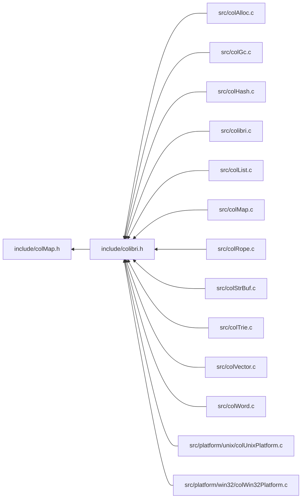

<a id="col_map_8h"></a>
# File colMap.h

![][C++]

**Location**: `include/colMap.h`

This header file defines the generic map handling features of Colibri.

Maps are an associative collection datatype that associates keys to values. Keys can be integers, strings or generic words. Values are arbitrary words.


They are always mutable.

## Classes

* [ColMapIterator](struct_col_map_iterator.md#struct_col_map_iterator)
* [Col\_CustomMapType](struct_col___custom_map_type.md#struct_col___custom_map_type)
* [Col\_CustomIntMapType](struct_col___custom_int_map_type.md#struct_col___custom_int_map_type)
* [ColMapIterator.traversal](union_col_map_iterator_8traversal.md#union_col_map_iterator_8traversal)
* [ColMapIterator.traversal.hash](struct_col_map_iterator_8traversal_8hash.md#struct_col_map_iterator_8traversal_8hash)
* [ColMapIterator.traversal.trie](struct_col_map_iterator_8traversal_8trie.md#struct_col_map_iterator_8traversal_8trie)

## Includes

* <stddef.h>


## Included by

* [include/colibri.h](colibri_8h.md#colibri_8h)



## Map Accessors

<a id="group__map__words_1gaae4f3cbf8a5aedc78929bc2364440aac"></a>
### Function Col\_MapSize

![][public]

```cpp
size_t Col_MapSize(Col_Word map)
```

Get the size of the map, i.e. the number of entries.

**Returns**:

The map size.

**Exceptions**:

* **[COL\_ERROR\_MAP](colibri_8h.md#group__error_1gga729084542ed9eae62009a84d3379ef35aa33916b02406dded5d355b3a24c6ec76)**: [[T]](colibri_8h.md#group__error_1gga6dab009a0b8c4b4fa080cb9ba1859e9ea603a58b9d5bb16fde0708eb0767e4904) **map**: Not a map.

**Parameters**:

* [Col\_Word](col_word_8h.md#group__words_1gadb626f9e195212e4fdfba7df154ad043) **map**: Map to get size for.

**Return type**: EXTERN size_t

**References**:

* [ASSERT](col_internal_8h.md#group__error_1gac22830a985e1daed0c9eadba8c6f606e)
* [COL\_HASHMAP](col_word_8h.md#group__words_1gae3509634e52a76014e96c2575b5d8092)
* [COL\_INTMAP](col_word_8h.md#group__words_1ga0938add7b6f34338e9c7bc847a6b9b2f)
* [COL\_MAP](col_word_8h.md#group__words_1ga42912f858f54a3ebfeef2ede9422248c)
* [COL\_TRIEMAP](col_word_8h.md#group__words_1ga7922babbc856f5670805da2267d72ff0)
* [TYPECHECK\_MAP](col_map_int_8h.md#group__mapentry__words_1ga1eede95138bba256545ca58e6abcc4b0)
* [WORD\_HASHMAP\_SIZE](col_hash_int_8h.md#group__hashmap__words_1gac639d1878d96d8bb8d825822bc104b8c)
* [WORD\_TRIEMAP\_SIZE](col_trie_int_8h.md#group__triemap__words_1ga9ccb73a2f8e1e4b2e451833d5cb6903c)
* [WORD\_TYPE](col_word_int_8h.md#group__words_1ga014e27ea4160eb3845ac495a22c232f5)
* [WORD\_TYPE\_CUSTOM](col_word_int_8h.md#group__words_1ga8babfbc77291680db519873c91efdd4c)
* [WORD\_TYPE\_INTHASHMAP](col_word_int_8h.md#group__words_1ga230c3d50685afa970c1e0da69feb5811)
* [WORD\_TYPE\_INTTRIEMAP](col_word_int_8h.md#group__words_1ga9da4310532cf6307f784bd6f33471218)
* [WORD\_TYPE\_STRHASHMAP](col_word_int_8h.md#group__words_1ga4b4fdf9a2320675d8dd1dc29d0007564)
* [WORD\_TYPE\_STRTRIEMAP](col_word_int_8h.md#group__words_1gae4ef7e39bd92ee96414ee98c844065ec)
* [WORD\_TYPEINFO](col_word_int_8h.md#group__custom__words_1gafc962791c45a5dd5bb034050444084be)

**Referenced by**:

* [Col\_HashMapIterBegin](col_hash_8h.md#group__hashmap__words_1gac4de92fb8d4ed572c26f6907a6108005)

<a id="group__map__words_1gabd075578f35ec7a706654e94aba281d9"></a>
### Function Col\_MapGet

![][public]

```cpp
int Col_MapGet(Col_Word map, Col_Word key, Col_Word *valuePtr)
```

Get value mapped to the given key if present.

Generic interface to map get, calls actual function depending on type.


**Return values**:

* **0**: if the key wasn't found.
* **<>0**: if the key was found, in this case the value is returned through **valuePtr**.

**Exceptions**:

* **[COL\_ERROR\_WORDMAP](colibri_8h.md#group__error_1gga729084542ed9eae62009a84d3379ef35a892f5f9cfa9a2d2128b9a3035747a111)**: [[T]](colibri_8h.md#group__error_1gga6dab009a0b8c4b4fa080cb9ba1859e9ea603a58b9d5bb16fde0708eb0767e4904) **map**: Not a string or word-keyed map.

**Parameters**:

* [Col\_Word](col_word_8h.md#group__words_1gadb626f9e195212e4fdfba7df154ad043) **map**: Map to get entry for.
* [Col\_Word](col_word_8h.md#group__words_1gadb626f9e195212e4fdfba7df154ad043) **key**: Entry key. Can be any word type, including string, however it must match the actual type used by the map.
* [Col\_Word](col_word_8h.md#group__words_1gadb626f9e195212e4fdfba7df154ad043) * **valuePtr**: [out] Returned entry value, if found.

**Return type**: EXTERN int

**References**:

* [ASSERT](col_internal_8h.md#group__error_1gac22830a985e1daed0c9eadba8c6f606e)
* [COL\_HASHMAP](col_word_8h.md#group__words_1gae3509634e52a76014e96c2575b5d8092)
* [Col\_HashMapGet](col_hash_8h.md#group__hashmap__words_1ga7fe5b8f4de905e324ada5177527d483e)
* [COL\_MAP](col_word_8h.md#group__words_1ga42912f858f54a3ebfeef2ede9422248c)
* [COL\_TRIEMAP](col_word_8h.md#group__words_1ga7922babbc856f5670805da2267d72ff0)
* [Col\_TrieMapGet](col_trie_8h.md#group__triemap__words_1ga60077ee297a2a45306a8d2e9107ddd4c)
* [Col\_CustomMapType::getProc](struct_col___custom_map_type.md#struct_col___custom_map_type_1a2d74b10090dfda067455420b3b66ba55)
* [Col\_CustomMapType::type](struct_col___custom_map_type.md#struct_col___custom_map_type_1aaf00fcf33d181f450a55261f2814eb77)
* [Col\_CustomWordType::type](struct_col___custom_word_type.md#struct_col___custom_word_type_1af9482efe5a6408bc622320619c3ccf9f)
* [TYPECHECK\_WORDMAP](col_map_int_8h.md#group__mapentry__words_1gad6c8914c3cf622521347dfa8a7a3f31c)
* [WORD\_TYPE](col_word_int_8h.md#group__words_1ga014e27ea4160eb3845ac495a22c232f5)
* [WORD\_TYPE\_CUSTOM](col_word_int_8h.md#group__words_1ga8babfbc77291680db519873c91efdd4c)
* [WORD\_TYPE\_STRHASHMAP](col_word_int_8h.md#group__words_1ga4b4fdf9a2320675d8dd1dc29d0007564)
* [WORD\_TYPE\_STRTRIEMAP](col_word_int_8h.md#group__words_1gae4ef7e39bd92ee96414ee98c844065ec)
* [WORD\_TYPEINFO](col_word_int_8h.md#group__custom__words_1gafc962791c45a5dd5bb034050444084be)

<a id="group__map__words_1ga4f96f7436cc66537b05841c5b088eef2"></a>
### Function Col\_IntMapGet

![][public]

```cpp
int Col_IntMapGet(Col_Word map, intptr_t key, Col_Word *valuePtr)
```

Get value mapped to the given integer key if present.

Generic interface to integer map get, calls actual function depending on type.


**Return values**:

* **0**: if the key wasn't found.
* **<>0**: if the key was found, in this case the value is returned through **valuePtr**.

**Exceptions**:

* **[COL\_ERROR\_INTMAP](colibri_8h.md#group__error_1gga729084542ed9eae62009a84d3379ef35a4b21a1231316f5d1e72f1a4063cd64b4)**: [[T]](colibri_8h.md#group__error_1gga6dab009a0b8c4b4fa080cb9ba1859e9ea603a58b9d5bb16fde0708eb0767e4904) **map**: Not an integer-keyed map.

**Parameters**:

* [Col\_Word](col_word_8h.md#group__words_1gadb626f9e195212e4fdfba7df154ad043) **map**: Integer map to get entry for.
* intptr_t **key**: Integer entry key
* [Col\_Word](col_word_8h.md#group__words_1gadb626f9e195212e4fdfba7df154ad043) * **valuePtr**: [out] Returned entry value, if found.

**Return type**: EXTERN int

**References**:

* [ASSERT](col_internal_8h.md#group__error_1gac22830a985e1daed0c9eadba8c6f606e)
* [Col\_IntHashMapGet](col_hash_8h.md#group__hashmap__words_1ga9c83b74f8b6dd17750f0c9be778bdc95)
* [COL\_INTMAP](col_word_8h.md#group__words_1ga0938add7b6f34338e9c7bc847a6b9b2f)
* [Col\_IntTrieMapGet](col_trie_8h.md#group__triemap__words_1gafb5c74dcca8204a0b83e6d1fa9325026)
* [TYPECHECK\_INTMAP](col_map_int_8h.md#group__mapentry__words_1gabf16d4f023a9f2699c2ef1098d5fb74e)
* [WORD\_TYPE](col_word_int_8h.md#group__words_1ga014e27ea4160eb3845ac495a22c232f5)
* [WORD\_TYPE\_CUSTOM](col_word_int_8h.md#group__words_1ga8babfbc77291680db519873c91efdd4c)
* [WORD\_TYPE\_INTHASHMAP](col_word_int_8h.md#group__words_1ga230c3d50685afa970c1e0da69feb5811)
* [WORD\_TYPE\_INTTRIEMAP](col_word_int_8h.md#group__words_1ga9da4310532cf6307f784bd6f33471218)
* [WORD\_TYPEINFO](col_word_int_8h.md#group__custom__words_1gafc962791c45a5dd5bb034050444084be)

<a id="group__map__words_1ga82b31e62df46ff382e18241bdcde49e3"></a>
### Function Col\_MapSet

![][public]

```cpp
int Col_MapSet(Col_Word map, Col_Word key, Col_Word value)
```

Map the value to the key, replacing any existing.

Generic interface to map set, calls actual function depending on type.


**Return values**:

* **0**: if an existing entry was updated with **value**.
* **<>0**: if a new entry was created with **key** and **value**.

**Exceptions**:

* **[COL\_ERROR\_WORDMAP](colibri_8h.md#group__error_1gga729084542ed9eae62009a84d3379ef35a892f5f9cfa9a2d2128b9a3035747a111)**: [[T]](colibri_8h.md#group__error_1gga6dab009a0b8c4b4fa080cb9ba1859e9ea603a58b9d5bb16fde0708eb0767e4904) **map**: Not a string or word-keyed map.

**Parameters**:

* [Col\_Word](col_word_8h.md#group__words_1gadb626f9e195212e4fdfba7df154ad043) **map**: Map to insert entry into.
* [Col\_Word](col_word_8h.md#group__words_1gadb626f9e195212e4fdfba7df154ad043) **key**: Entry key. Can be any word type, including string, however it must match the actual type used by the map.
* [Col\_Word](col_word_8h.md#group__words_1gadb626f9e195212e4fdfba7df154ad043) **value**: Entry value.

**Return type**: EXTERN int

**References**:

* [ASSERT](col_internal_8h.md#group__error_1gac22830a985e1daed0c9eadba8c6f606e)
* [COL\_HASHMAP](col_word_8h.md#group__words_1gae3509634e52a76014e96c2575b5d8092)
* [Col\_HashMapSet](col_hash_8h.md#group__hashmap__words_1ga5290a8ca2aeccdb481e46ca161dbafdf)
* [COL\_MAP](col_word_8h.md#group__words_1ga42912f858f54a3ebfeef2ede9422248c)
* [COL\_TRIEMAP](col_word_8h.md#group__words_1ga7922babbc856f5670805da2267d72ff0)
* [Col\_TrieMapSet](col_trie_8h.md#group__triemap__words_1ga05580df1648d9d53b333ac6da24de26d)
* [Col\_CustomMapType::setProc](struct_col___custom_map_type.md#struct_col___custom_map_type_1a9b7315ab84fd55ba3f2f9199b180481e)
* [Col\_CustomMapType::type](struct_col___custom_map_type.md#struct_col___custom_map_type_1aaf00fcf33d181f450a55261f2814eb77)
* [Col\_CustomWordType::type](struct_col___custom_word_type.md#struct_col___custom_word_type_1af9482efe5a6408bc622320619c3ccf9f)
* [TYPECHECK\_WORDMAP](col_map_int_8h.md#group__mapentry__words_1gad6c8914c3cf622521347dfa8a7a3f31c)
* [WORD\_TYPE](col_word_int_8h.md#group__words_1ga014e27ea4160eb3845ac495a22c232f5)
* [WORD\_TYPE\_CUSTOM](col_word_int_8h.md#group__words_1ga8babfbc77291680db519873c91efdd4c)
* [WORD\_TYPE\_STRHASHMAP](col_word_int_8h.md#group__words_1ga4b4fdf9a2320675d8dd1dc29d0007564)
* [WORD\_TYPE\_STRTRIEMAP](col_word_int_8h.md#group__words_1gae4ef7e39bd92ee96414ee98c844065ec)
* [WORD\_TYPEINFO](col_word_int_8h.md#group__custom__words_1gafc962791c45a5dd5bb034050444084be)

<a id="group__map__words_1ga27a694b6de40e1a3af81379a7056754d"></a>
### Function Col\_IntMapSet

![][public]

```cpp
int Col_IntMapSet(Col_Word map, intptr_t key, Col_Word value)
```

Map the value to the integer key, replacing any existing.

Generic interface to integer map set, calls actual function depending on type.


**Return values**:

* **0**: if an existing entry was updated with **value**.
* **<>0**: if a new entry was created with **key** and **value**.

**Exceptions**:

* **[COL\_ERROR\_INTMAP](colibri_8h.md#group__error_1gga729084542ed9eae62009a84d3379ef35a4b21a1231316f5d1e72f1a4063cd64b4)**: [[T]](colibri_8h.md#group__error_1gga6dab009a0b8c4b4fa080cb9ba1859e9ea603a58b9d5bb16fde0708eb0767e4904) **map**: Not an integer-keyed map.

**Parameters**:

* [Col\_Word](col_word_8h.md#group__words_1gadb626f9e195212e4fdfba7df154ad043) **map**: Integer map to insert entry into.
* intptr_t **key**: Integer entry key.
* [Col\_Word](col_word_8h.md#group__words_1gadb626f9e195212e4fdfba7df154ad043) **value**: Entry value.

**Return type**: EXTERN int

**References**:

* [ASSERT](col_internal_8h.md#group__error_1gac22830a985e1daed0c9eadba8c6f606e)
* [Col\_IntHashMapSet](col_hash_8h.md#group__hashmap__words_1ga73aa4d8fc75a6f152c385e3a4bcdcb1c)
* [COL\_INTMAP](col_word_8h.md#group__words_1ga0938add7b6f34338e9c7bc847a6b9b2f)
* [Col\_IntTrieMapSet](col_trie_8h.md#group__triemap__words_1ga93b4e0529f287e7116fc7e6ecd5a5859)
* [TYPECHECK\_INTMAP](col_map_int_8h.md#group__mapentry__words_1gabf16d4f023a9f2699c2ef1098d5fb74e)
* [WORD\_TYPE](col_word_int_8h.md#group__words_1ga014e27ea4160eb3845ac495a22c232f5)
* [WORD\_TYPE\_CUSTOM](col_word_int_8h.md#group__words_1ga8babfbc77291680db519873c91efdd4c)
* [WORD\_TYPE\_INTHASHMAP](col_word_int_8h.md#group__words_1ga230c3d50685afa970c1e0da69feb5811)
* [WORD\_TYPE\_INTTRIEMAP](col_word_int_8h.md#group__words_1ga9da4310532cf6307f784bd6f33471218)
* [WORD\_TYPEINFO](col_word_int_8h.md#group__custom__words_1gafc962791c45a5dd5bb034050444084be)

<a id="group__map__words_1ga1f48ed3390f9a53cde268533a763e638"></a>
### Function Col\_MapUnset

![][public]

```cpp
int Col_MapUnset(Col_Word map, Col_Word key)
```

Remove any value mapped to the given key.

Generic interface to map unset, calls actual function depending on type.


**Return values**:

* **0**: if no entry matching **key** was found.
* **<>0**: if the existing entry was removed.

**Exceptions**:

* **[COL\_ERROR\_WORDMAP](colibri_8h.md#group__error_1gga729084542ed9eae62009a84d3379ef35a892f5f9cfa9a2d2128b9a3035747a111)**: [[T]](colibri_8h.md#group__error_1gga6dab009a0b8c4b4fa080cb9ba1859e9ea603a58b9d5bb16fde0708eb0767e4904) **map**: Not a string or word-keyed map.

**Parameters**:

* [Col\_Word](col_word_8h.md#group__words_1gadb626f9e195212e4fdfba7df154ad043) **map**: Map to remove entry from.
* [Col\_Word](col_word_8h.md#group__words_1gadb626f9e195212e4fdfba7df154ad043) **key**: Entry key. Can be any word type, including string, however it must match the actual type used by the map.

**Return type**: EXTERN int

**References**:

* [ASSERT](col_internal_8h.md#group__error_1gac22830a985e1daed0c9eadba8c6f606e)
* [COL\_HASHMAP](col_word_8h.md#group__words_1gae3509634e52a76014e96c2575b5d8092)
* [Col\_HashMapUnset](col_hash_8h.md#group__hashmap__words_1ga4319b874a1524fcd008125db503a7f9c)
* [COL\_MAP](col_word_8h.md#group__words_1ga42912f858f54a3ebfeef2ede9422248c)
* [COL\_TRIEMAP](col_word_8h.md#group__words_1ga7922babbc856f5670805da2267d72ff0)
* [Col\_TrieMapUnset](col_trie_8h.md#group__triemap__words_1gaab7c1e33efc9b0e1fb913951d4b61fc2)
* [Col\_CustomMapType::type](struct_col___custom_map_type.md#struct_col___custom_map_type_1aaf00fcf33d181f450a55261f2814eb77)
* [Col\_CustomWordType::type](struct_col___custom_word_type.md#struct_col___custom_word_type_1af9482efe5a6408bc622320619c3ccf9f)
* [TYPECHECK\_WORDMAP](col_map_int_8h.md#group__mapentry__words_1gad6c8914c3cf622521347dfa8a7a3f31c)
* [Col\_CustomMapType::unsetProc](struct_col___custom_map_type.md#struct_col___custom_map_type_1ae0ee2e1af0ac42e9914cc3f6b8cd842f)
* [WORD\_TYPE](col_word_int_8h.md#group__words_1ga014e27ea4160eb3845ac495a22c232f5)
* [WORD\_TYPE\_CUSTOM](col_word_int_8h.md#group__words_1ga8babfbc77291680db519873c91efdd4c)
* [WORD\_TYPE\_STRHASHMAP](col_word_int_8h.md#group__words_1ga4b4fdf9a2320675d8dd1dc29d0007564)
* [WORD\_TYPE\_STRTRIEMAP](col_word_int_8h.md#group__words_1gae4ef7e39bd92ee96414ee98c844065ec)
* [WORD\_TYPEINFO](col_word_int_8h.md#group__custom__words_1gafc962791c45a5dd5bb034050444084be)

<a id="group__map__words_1gac2ae366ebe1ec3a4495128cb1400d1cf"></a>
### Function Col\_IntMapUnset

![][public]

```cpp
int Col_IntMapUnset(Col_Word map, intptr_t key)
```

Remove any value mapped to the given integer key.

Generic interface to integer map unset, calls actual function depending on type.


**Return values**:

* **0**: if no entry matching **key** was found.
* **<>0**: if the existing entry was removed.

**Exceptions**:

* **[COL\_ERROR\_INTMAP](colibri_8h.md#group__error_1gga729084542ed9eae62009a84d3379ef35a4b21a1231316f5d1e72f1a4063cd64b4)**: [[T]](colibri_8h.md#group__error_1gga6dab009a0b8c4b4fa080cb9ba1859e9ea603a58b9d5bb16fde0708eb0767e4904) **map**: Not an integer-keyed map.

**Parameters**:

* [Col\_Word](col_word_8h.md#group__words_1gadb626f9e195212e4fdfba7df154ad043) **map**: Integer map to remove entry fromo.
* intptr_t **key**: Integer entry key.

**Return type**: EXTERN int

**References**:

* [ASSERT](col_internal_8h.md#group__error_1gac22830a985e1daed0c9eadba8c6f606e)
* [Col\_IntHashMapUnset](col_hash_8h.md#group__hashmap__words_1gab060852e2fc2e645aee2179e678cbeb3)
* [COL\_INTMAP](col_word_8h.md#group__words_1ga0938add7b6f34338e9c7bc847a6b9b2f)
* [Col\_IntTrieMapUnset](col_trie_8h.md#group__triemap__words_1gae11e5dcae95319e4fa94aec1f278909d)
* [TYPECHECK\_INTMAP](col_map_int_8h.md#group__mapentry__words_1gabf16d4f023a9f2699c2ef1098d5fb74e)
* [WORD\_TYPE](col_word_int_8h.md#group__words_1ga014e27ea4160eb3845ac495a22c232f5)
* [WORD\_TYPE\_CUSTOM](col_word_int_8h.md#group__words_1ga8babfbc77291680db519873c91efdd4c)
* [WORD\_TYPE\_INTHASHMAP](col_word_int_8h.md#group__words_1ga230c3d50685afa970c1e0da69feb5811)
* [WORD\_TYPE\_INTTRIEMAP](col_word_int_8h.md#group__words_1ga9da4310532cf6307f784bd6f33471218)
* [WORD\_TYPEINFO](col_word_int_8h.md#group__custom__words_1gafc962791c45a5dd5bb034050444084be)

## Map Iteration

<a id="group__map__words_1gaaf63a2d50c05920215a4fb9ae522cec6"></a>
### Macro COL\_MAPITER\_NULL

![][public]

```cpp
#define COL_MAPITER_NULL
```

Static initializer for null map iterators.

**See also**: [Col\_MapIterator](col_map_8h.md#group__map__words_1ga33d331116aff3f3d03a231ccbbce40c2), [Col\_MapIterNull](col_map_8h.md#group__map__words_1gaa62e65511e00c06204ab1aac8132ac7c)


<a id="group__map__words_1gaa62e65511e00c06204ab1aac8132ac7c"></a>
### Macro Col\_MapIterNull

![][public]

```cpp
#define Col_MapIterNull( it )
```

Test whether iterator is null (e.g.

it has been set to [COL\_MAPITER\_NULL](col_map_8h.md#group__map__words_1gaaf63a2d50c05920215a4fb9ae522cec6) or [Col\_MapIterSetNull()](col_map_8h.md#group__map__words_1ga3629bc2a457ae5a9ab57ab1f74ee0223)).


!> **Warning** \
This uninitialized state renders it unusable for any call. Use with caution.


**Parameters**:

* **it**: The [Col\_MapIterator](col_map_8h.md#group__map__words_1ga33d331116aff3f3d03a231ccbbce40c2) to test.


**Return values**:

* **zero**: if iterator if not null.
* **non-zero**: if iterator is null.


**See also**: [Col\_MapIterator](col_map_8h.md#group__map__words_1ga33d331116aff3f3d03a231ccbbce40c2), [COL\_MAPITER\_NULL](col_map_8h.md#group__map__words_1gaaf63a2d50c05920215a4fb9ae522cec6), [Col\_MapIterSetNull](col_map_8h.md#group__map__words_1ga3629bc2a457ae5a9ab57ab1f74ee0223)


<a id="group__map__words_1ga3629bc2a457ae5a9ab57ab1f74ee0223"></a>
### Macro Col\_MapIterSetNull

![][public]

```cpp
#define Col_MapIterSetNull     memset((it), 0, sizeof(*(it)))( it )
```

Set an iterator to null.

**Parameters**:

* **it**: The [Col\_MapIterator](col_map_8h.md#group__map__words_1ga33d331116aff3f3d03a231ccbbce40c2) to initialize.


!> **Warning** \
Argument **it** is referenced several times by the macro. Make sure to avoid any side effect.


<a id="group__map__words_1gac6f818f3c753f4e2668367155fa42686"></a>
### Macro Col\_MapIterMap

![][public]

```cpp
#define Col_MapIterMap     ((it)->map)( it )
```

Get map for iterator.

**Parameters**:

* **it**: The [Col\_MapIterator](col_map_8h.md#group__map__words_1ga33d331116aff3f3d03a231ccbbce40c2) to access.


**Returns**:

The map.


**Exceptions**:

* **[COL\_ERROR\_MAPITER\_END](colibri_8h.md#group__error_1gga729084542ed9eae62009a84d3379ef35a1a834ed5a623ccf3120ccec5d0d60653)**: [[V]](colibri_8h.md#group__error_1gga6dab009a0b8c4b4fa080cb9ba1859e9ea65d5e7232c82ae6972ac56f386a32fc9) **it**: Map iterator at end.


<a id="group__map__words_1ga98ec97359170a97141470434b83dcf56"></a>
### Macro Col\_MapIterEnd

![][public]

```cpp
#define Col_MapIterEnd     (!(it)->entry)( it )
```

Test whether iterator reached end of map.

**Parameters**:

* **it**: The [Col\_MapIterator](col_map_8h.md#group__map__words_1ga33d331116aff3f3d03a231ccbbce40c2) to test.


**Return values**:

* **zero**: if iterator if not at end.
* **non-zero**: if iterator is at end.


**See also**: [Col\_MapIterBegin](col_map_8h.md#group__map__words_1gab8f4a0de6b264bbe59c332b41a22866a)


<a id="group__map__words_1gaa86dc58a0cd0d61e03211163d6a5f2c7"></a>
### Macro Col\_MapIterSet

![][public]

```cpp
#define Col_MapIterSet     (*(it) = *(value))( it ,value )
```

Initialize an iterator with another one's value.

**Parameters**:

* **it**: The [Col\_MapIterator](col_map_8h.md#group__map__words_1ga33d331116aff3f3d03a231ccbbce40c2) to initialize.
* **value**: The [Col\_MapIterator](col_map_8h.md#group__map__words_1ga33d331116aff3f3d03a231ccbbce40c2) to copy.


<a id="group__map__words_1ga33d331116aff3f3d03a231ccbbce40c2"></a>
### Typedef Col\_MapIterator

![][public]

**Definition**: `include/colMap.h` (line 104)

```cpp
typedef ColMapIterator Col_MapIterator[1]
```

Map iterator.

Encapsulates the necessary info to iterate & access map data transparently.


?> Datatype is opaque. Fields should not be accessed by client code.
\
Each iterator takes 4 words on the stack.
\
The type is defined as a single-element array of the internal datatype:
\

* declared variables allocate the right amount of space on the stack,

* calls use pass-by-reference (i.e. pointer) and not pass-by-value,

* forbidden as return type.


**Return type**: [ColMapIterator](struct_col_map_iterator.md#struct_col_map_iterator)

<a id="group__map__words_1gab8f4a0de6b264bbe59c332b41a22866a"></a>
### Function Col\_MapIterBegin

![][public]

```cpp
void Col_MapIterBegin(Col_MapIterator it, Col_Word map)
```

Initialize the map iterator so that it points to the first entry within the map.

Generic interface to map iteration, calls actual function depending on type.

**Exceptions**:

* **[COL\_ERROR\_MAP](colibri_8h.md#group__error_1gga729084542ed9eae62009a84d3379ef35aa33916b02406dded5d355b3a24c6ec76)**: [[T]](colibri_8h.md#group__error_1gga6dab009a0b8c4b4fa080cb9ba1859e9ea603a58b9d5bb16fde0708eb0767e4904) **map**: Not a map.

**Parameters**:

* [Col\_MapIterator](col_map_8h.md#group__map__words_1ga33d331116aff3f3d03a231ccbbce40c2) **it**: Iterator to initialize.
* [Col\_Word](col_word_8h.md#group__words_1gadb626f9e195212e4fdfba7df154ad043) **map**: Map to iterate over.

**Return type**: EXTERN void

**References**:

* [ASSERT](col_internal_8h.md#group__error_1gac22830a985e1daed0c9eadba8c6f606e)
* [COL\_HASHMAP](col_word_8h.md#group__words_1gae3509634e52a76014e96c2575b5d8092)
* [Col\_HashMapIterBegin](col_hash_8h.md#group__hashmap__words_1gac4de92fb8d4ed572c26f6907a6108005)
* [COL\_INTMAP](col_word_8h.md#group__words_1ga0938add7b6f34338e9c7bc847a6b9b2f)
* [COL\_MAP](col_word_8h.md#group__words_1ga42912f858f54a3ebfeef2ede9422248c)
* [Col\_MapIterSetNull](col_map_8h.md#group__map__words_1ga3629bc2a457ae5a9ab57ab1f74ee0223)
* [COL\_TRIEMAP](col_word_8h.md#group__words_1ga7922babbc856f5670805da2267d72ff0)
* [Col\_TrieMapIterFirst](col_trie_8h.md#group__triemap__words_1ga85159bdeec81a97106171f745204fbdd)
* [TYPECHECK\_MAP](col_map_int_8h.md#group__mapentry__words_1ga1eede95138bba256545ca58e6abcc4b0)
* [WORD\_NIL](col_word_8h.md#group__words_1ga29e370264f4e5659ccc5be4de209f065)
* [WORD\_TYPE](col_word_int_8h.md#group__words_1ga014e27ea4160eb3845ac495a22c232f5)
* [WORD\_TYPE\_CUSTOM](col_word_int_8h.md#group__words_1ga8babfbc77291680db519873c91efdd4c)
* [WORD\_TYPE\_INTHASHMAP](col_word_int_8h.md#group__words_1ga230c3d50685afa970c1e0da69feb5811)
* [WORD\_TYPE\_INTTRIEMAP](col_word_int_8h.md#group__words_1ga9da4310532cf6307f784bd6f33471218)
* [WORD\_TYPE\_STRHASHMAP](col_word_int_8h.md#group__words_1ga4b4fdf9a2320675d8dd1dc29d0007564)
* [WORD\_TYPE\_STRTRIEMAP](col_word_int_8h.md#group__words_1gae4ef7e39bd92ee96414ee98c844065ec)
* [WORD\_TYPEINFO](col_word_int_8h.md#group__custom__words_1gafc962791c45a5dd5bb034050444084be)

<a id="group__map__words_1gaa925d7d32221bc826e9717930c2602e1"></a>
### Function Col\_MapIterFind

![][public]

```cpp
void Col_MapIterFind(Col_MapIterator it, Col_Word map, Col_Word key, int *createPtr)
```

Initialize the map iterator so that it points to the entry with the given key within the map.

Generic interface to map iteration, calls actual function depending on type.

**Exceptions**:

* **[COL\_ERROR\_WORDMAP](colibri_8h.md#group__error_1gga729084542ed9eae62009a84d3379ef35a892f5f9cfa9a2d2128b9a3035747a111)**: [[T]](colibri_8h.md#group__error_1gga6dab009a0b8c4b4fa080cb9ba1859e9ea603a58b9d5bb16fde0708eb0767e4904) **map**: Not a string or word-keyed map.

**Parameters**:

* [Col\_MapIterator](col_map_8h.md#group__map__words_1ga33d331116aff3f3d03a231ccbbce40c2) **it**: Iterator to initialize.
* [Col\_Word](col_word_8h.md#group__words_1gadb626f9e195212e4fdfba7df154ad043) **map**: Map to iterate over.
* [Col\_Word](col_word_8h.md#group__words_1gadb626f9e195212e4fdfba7df154ad043) **key**: Entry key. Can be any word type, including string, however it must match the actual type used by the map.
* int * **createPtr**: [in,out] If non-NULL, whether to create entry if absent on input, and whether an entry was created on output.

**Return type**: EXTERN void

**References**:

* [ASSERT](col_internal_8h.md#group__error_1gac22830a985e1daed0c9eadba8c6f606e)
* [COL\_HASHMAP](col_word_8h.md#group__words_1gae3509634e52a76014e96c2575b5d8092)
* [Col\_HashMapIterFind](col_hash_8h.md#group__hashmap__words_1ga7f4cdf033cec55efd5d6c7704176dfc5)
* [COL\_MAP](col_word_8h.md#group__words_1ga42912f858f54a3ebfeef2ede9422248c)
* [Col\_MapIterSetNull](col_map_8h.md#group__map__words_1ga3629bc2a457ae5a9ab57ab1f74ee0223)
* [COL\_TRIEMAP](col_word_8h.md#group__words_1ga7922babbc856f5670805da2267d72ff0)
* [Col\_TrieMapIterFind](col_trie_8h.md#group__triemap__words_1gab594f8e0086ad33bb029be6bc219a766)
* [TYPECHECK\_WORDMAP](col_map_int_8h.md#group__mapentry__words_1gad6c8914c3cf622521347dfa8a7a3f31c)
* [WORD\_NIL](col_word_8h.md#group__words_1ga29e370264f4e5659ccc5be4de209f065)
* [WORD\_TYPE](col_word_int_8h.md#group__words_1ga014e27ea4160eb3845ac495a22c232f5)
* [WORD\_TYPE\_CUSTOM](col_word_int_8h.md#group__words_1ga8babfbc77291680db519873c91efdd4c)
* [WORD\_TYPE\_STRHASHMAP](col_word_int_8h.md#group__words_1ga4b4fdf9a2320675d8dd1dc29d0007564)
* [WORD\_TYPE\_STRTRIEMAP](col_word_int_8h.md#group__words_1gae4ef7e39bd92ee96414ee98c844065ec)
* [WORD\_TYPEINFO](col_word_int_8h.md#group__custom__words_1gafc962791c45a5dd5bb034050444084be)

<a id="group__map__words_1ga8c332381607b0dc828b4aa96fa8f1a12"></a>
### Function Col\_IntMapIterFind

![][public]

```cpp
void Col_IntMapIterFind(Col_MapIterator it, Col_Word map, intptr_t key, int *createPtr)
```

Initialize the map iterator so that it points to the entry with the given integer key within the map.

Generic interface to integer map iteration, calls actual function depending on type.

**Exceptions**:

* **[COL\_ERROR\_INTMAP](colibri_8h.md#group__error_1gga729084542ed9eae62009a84d3379ef35a4b21a1231316f5d1e72f1a4063cd64b4)**: [[T]](colibri_8h.md#group__error_1gga6dab009a0b8c4b4fa080cb9ba1859e9ea603a58b9d5bb16fde0708eb0767e4904) **map**: Not an integer-keyed map.

**Parameters**:

* [Col\_MapIterator](col_map_8h.md#group__map__words_1ga33d331116aff3f3d03a231ccbbce40c2) **it**: Iterator to initialize.
* [Col\_Word](col_word_8h.md#group__words_1gadb626f9e195212e4fdfba7df154ad043) **map**: Integer map to iterate over.
* intptr_t **key**: Integer entry key.
* int * **createPtr**: [in,out] If non-NULL, whether to create entry if absent on input, and whether an entry was created on output.

**Return type**: EXTERN void

**References**:

* [ASSERT](col_internal_8h.md#group__error_1gac22830a985e1daed0c9eadba8c6f606e)
* [Col\_IntHashMapIterFind](col_hash_8h.md#group__hashmap__words_1ga6ffef52a7e4127f837ac680cfd08a855)
* [COL\_INTMAP](col_word_8h.md#group__words_1ga0938add7b6f34338e9c7bc847a6b9b2f)
* [Col\_IntTrieMapIterFind](col_trie_8h.md#group__triemap__words_1gaae7f3d5178448023db25fbf6fd8c8f7a)
* [Col\_MapIterSetNull](col_map_8h.md#group__map__words_1ga3629bc2a457ae5a9ab57ab1f74ee0223)
* [TYPECHECK\_INTMAP](col_map_int_8h.md#group__mapentry__words_1gabf16d4f023a9f2699c2ef1098d5fb74e)
* [WORD\_NIL](col_word_8h.md#group__words_1ga29e370264f4e5659ccc5be4de209f065)
* [WORD\_TYPE](col_word_int_8h.md#group__words_1ga014e27ea4160eb3845ac495a22c232f5)
* [WORD\_TYPE\_CUSTOM](col_word_int_8h.md#group__words_1ga8babfbc77291680db519873c91efdd4c)
* [WORD\_TYPE\_INTHASHMAP](col_word_int_8h.md#group__words_1ga230c3d50685afa970c1e0da69feb5811)
* [WORD\_TYPE\_INTTRIEMAP](col_word_int_8h.md#group__words_1ga9da4310532cf6307f784bd6f33471218)
* [WORD\_TYPEINFO](col_word_int_8h.md#group__custom__words_1gafc962791c45a5dd5bb034050444084be)

<a id="group__map__words_1ga1ec7db1472cf7bbc5e48b7972f8f5a77"></a>
### Function Col\_MapIterGet

![][public]

```cpp
void Col_MapIterGet(Col_MapIterator it, Col_Word *keyPtr, Col_Word *valuePtr)
```

Get key & value from map iterator.


**Exceptions**:

* **[COL\_ERROR\_MAPITER](colibri_8h.md#group__error_1gga729084542ed9eae62009a84d3379ef35aa66f57346b0a9eac571308e75fb1f8ec)**: [[T]](colibri_8h.md#group__error_1gga6dab009a0b8c4b4fa080cb9ba1859e9ea603a58b9d5bb16fde0708eb0767e4904) **it**: Invalid map iterator.
* **[COL\_ERROR\_WORDMAP](colibri_8h.md#group__error_1gga729084542ed9eae62009a84d3379ef35a892f5f9cfa9a2d2128b9a3035747a111)**: [[T]](colibri_8h.md#group__error_1gga6dab009a0b8c4b4fa080cb9ba1859e9ea603a58b9d5bb16fde0708eb0767e4904) **[Col\_MapIterMap(it)](col_map_8h.md#group__map__words_1gac6f818f3c753f4e2668367155fa42686)**: Not a string or word-keyed map.
* **[COL\_ERROR\_MAPITER\_END](colibri_8h.md#group__error_1gga729084542ed9eae62009a84d3379ef35a1a834ed5a623ccf3120ccec5d0d60653)**: [[V]](colibri_8h.md#group__error_1gga6dab009a0b8c4b4fa080cb9ba1859e9ea65d5e7232c82ae6972ac56f386a32fc9) **it**: Map iterator at end.

**Parameters**:

* [Col\_MapIterator](col_map_8h.md#group__map__words_1ga33d331116aff3f3d03a231ccbbce40c2) **it**: Map iterator to get key & value from.
* [Col\_Word](col_word_8h.md#group__words_1gadb626f9e195212e4fdfba7df154ad043) * **keyPtr**: [out] Entry key.
* [Col\_Word](col_word_8h.md#group__words_1gadb626f9e195212e4fdfba7df154ad043) * **valuePtr**: [out] Entry value.

**Return type**: EXTERN void

**References**:

* [ASSERT](col_internal_8h.md#group__error_1gac22830a985e1daed0c9eadba8c6f606e)
* [COL\_MAP](col_word_8h.md#group__words_1ga42912f858f54a3ebfeef2ede9422248c)
* [Col\_CustomMapType::iterGetKeyProc](struct_col___custom_map_type.md#struct_col___custom_map_type_1ab1b9c1f350b6eae05efc248dc4fed4e0)
* [Col\_CustomMapType::iterGetValueProc](struct_col___custom_map_type.md#struct_col___custom_map_type_1ad5683dc97da63b51a4038253f7416274)
* [TYPECHECK\_MAPITER](col_map_int_8h.md#group__mapentry__words_1ga1ac9e9b70a28fd5385c1c5fb95494a2b)
* [TYPECHECK\_WORDMAP](col_map_int_8h.md#group__mapentry__words_1gad6c8914c3cf622521347dfa8a7a3f31c)
* [VALUECHECK\_MAPITER](col_map_int_8h.md#group__mapentry__words_1ga4e477eb4ded0e97fcfa10c0e01eb7ead)
* [WORD\_MAPENTRY\_KEY](col_map_int_8h.md#group__mapentry__words_1ga8664d15fae4553b47b658ac7ceb1443a)
* [WORD\_MAPENTRY\_VALUE](col_map_int_8h.md#group__mapentry__words_1gabad6806f2947f508a9786948c1663064)
* [WORD\_TYPE](col_word_int_8h.md#group__words_1ga014e27ea4160eb3845ac495a22c232f5)
* [WORD\_TYPE\_CUSTOM](col_word_int_8h.md#group__words_1ga8babfbc77291680db519873c91efdd4c)
* [WORD\_TYPE\_HASHENTRY](col_word_int_8h.md#group__words_1ga0ccfe6bc407371b3c2cde0a2da83f9fa)
* [WORD\_TYPE\_MHASHENTRY](col_word_int_8h.md#group__words_1ga4c79463f98f0ec9296451862e5d0b76c)
* [WORD\_TYPE\_MTRIELEAF](col_word_int_8h.md#group__words_1ga4c7f02b7545a17f527d59a2c66e9d0fa)
* [WORD\_TYPE\_TRIELEAF](col_word_int_8h.md#group__words_1ga2a17ea1e39ad925fc0057cd928cdd49c)
* [WORD\_TYPEINFO](col_word_int_8h.md#group__custom__words_1gafc962791c45a5dd5bb034050444084be)

<a id="group__map__words_1ga6ac827db7a48d5bee7e40080fef4e27f"></a>
### Function Col\_IntMapIterGet

![][public]

```cpp
void Col_IntMapIterGet(Col_MapIterator it, intptr_t *keyPtr, Col_Word *valuePtr)
```

Get key & value from integer map iterator.


**Exceptions**:

* **[COL\_ERROR\_MAPITER](colibri_8h.md#group__error_1gga729084542ed9eae62009a84d3379ef35aa66f57346b0a9eac571308e75fb1f8ec)**: [[T]](colibri_8h.md#group__error_1gga6dab009a0b8c4b4fa080cb9ba1859e9ea603a58b9d5bb16fde0708eb0767e4904) **it**: Invalid map iterator.
* **[COL\_ERROR\_INTMAP](colibri_8h.md#group__error_1gga729084542ed9eae62009a84d3379ef35a4b21a1231316f5d1e72f1a4063cd64b4)**: [[T]](colibri_8h.md#group__error_1gga6dab009a0b8c4b4fa080cb9ba1859e9ea603a58b9d5bb16fde0708eb0767e4904) **[Col\_MapIterMap(it)](col_map_8h.md#group__map__words_1gac6f818f3c753f4e2668367155fa42686)**: Not an integer-keyed map.
* **[COL\_ERROR\_MAPITER\_END](colibri_8h.md#group__error_1gga729084542ed9eae62009a84d3379ef35a1a834ed5a623ccf3120ccec5d0d60653)**: [[V]](colibri_8h.md#group__error_1gga6dab009a0b8c4b4fa080cb9ba1859e9ea65d5e7232c82ae6972ac56f386a32fc9) **it**: Map iterator at end.

**Parameters**:

* [Col\_MapIterator](col_map_8h.md#group__map__words_1ga33d331116aff3f3d03a231ccbbce40c2) **it**: Integer map iterator to get key & value from.
* intptr_t * **keyPtr**: [out] Integer entry key.
* [Col\_Word](col_word_8h.md#group__words_1gadb626f9e195212e4fdfba7df154ad043) * **valuePtr**: [out] Entry value.

**Return type**: EXTERN void

**References**:

* [ASSERT](col_internal_8h.md#group__error_1gac22830a985e1daed0c9eadba8c6f606e)
* [COL\_INTMAP](col_word_8h.md#group__words_1ga0938add7b6f34338e9c7bc847a6b9b2f)
* [Col\_CustomIntMapType::iterGetKeyProc](struct_col___custom_int_map_type.md#struct_col___custom_int_map_type_1a15d5cc8018de195af5728bb60a89614a)
* [Col\_CustomIntMapType::iterGetValueProc](struct_col___custom_int_map_type.md#struct_col___custom_int_map_type_1a58a82c69b042d896adc4f3aac21efca3)
* [TYPECHECK\_INTMAP](col_map_int_8h.md#group__mapentry__words_1gabf16d4f023a9f2699c2ef1098d5fb74e)
* [TYPECHECK\_MAPITER](col_map_int_8h.md#group__mapentry__words_1ga1ac9e9b70a28fd5385c1c5fb95494a2b)
* [VALUECHECK\_MAPITER](col_map_int_8h.md#group__mapentry__words_1ga4e477eb4ded0e97fcfa10c0e01eb7ead)
* [WORD\_INTMAPENTRY\_KEY](col_map_int_8h.md#group__intmapentry__words_1ga89e26360d76aaad985afd89da56d1539)
* [WORD\_MAPENTRY\_VALUE](col_map_int_8h.md#group__mapentry__words_1gabad6806f2947f508a9786948c1663064)
* [WORD\_TYPE](col_word_int_8h.md#group__words_1ga014e27ea4160eb3845ac495a22c232f5)
* [WORD\_TYPE\_CUSTOM](col_word_int_8h.md#group__words_1ga8babfbc77291680db519873c91efdd4c)
* [WORD\_TYPE\_INTHASHENTRY](col_word_int_8h.md#group__words_1gab1a5b3b65a05c74cd3973db9dce4a781)
* [WORD\_TYPE\_INTTRIELEAF](col_word_int_8h.md#group__words_1ga896310a96176f87d4ec0bd06eabf55f7)
* [WORD\_TYPE\_MINTHASHENTRY](col_word_int_8h.md#group__words_1ga1758f2fa0c44200f5782e548c5b33c7e)
* [WORD\_TYPE\_MINTTRIELEAF](col_word_int_8h.md#group__words_1ga81a397c929cd0fa5f89c5a01ce2a1487)
* [WORD\_TYPEINFO](col_word_int_8h.md#group__custom__words_1gafc962791c45a5dd5bb034050444084be)

<a id="group__map__words_1ga2b3488edf027f8f463920b25c9f3323a"></a>
### Function Col\_MapIterGetKey

![][public]

```cpp
Col_Word Col_MapIterGetKey(Col_MapIterator it)
```

Get key from map iterator.

**Returns**:

Entry key.

**Exceptions**:

* **[COL\_ERROR\_MAPITER](colibri_8h.md#group__error_1gga729084542ed9eae62009a84d3379ef35aa66f57346b0a9eac571308e75fb1f8ec)**: [[T]](colibri_8h.md#group__error_1gga6dab009a0b8c4b4fa080cb9ba1859e9ea603a58b9d5bb16fde0708eb0767e4904) **it**: Invalid map iterator.
* **[COL\_ERROR\_WORDMAP](colibri_8h.md#group__error_1gga729084542ed9eae62009a84d3379ef35a892f5f9cfa9a2d2128b9a3035747a111)**: [[T]](colibri_8h.md#group__error_1gga6dab009a0b8c4b4fa080cb9ba1859e9ea603a58b9d5bb16fde0708eb0767e4904) **[Col\_MapIterMap(it)](col_map_8h.md#group__map__words_1gac6f818f3c753f4e2668367155fa42686)**: Not a string or word-keyed map.
* **[COL\_ERROR\_MAPITER\_END](colibri_8h.md#group__error_1gga729084542ed9eae62009a84d3379ef35a1a834ed5a623ccf3120ccec5d0d60653)**: [[V]](colibri_8h.md#group__error_1gga6dab009a0b8c4b4fa080cb9ba1859e9ea65d5e7232c82ae6972ac56f386a32fc9) **it**: Map iterator at end.

**Parameters**:

* [Col\_MapIterator](col_map_8h.md#group__map__words_1ga33d331116aff3f3d03a231ccbbce40c2) **it**: Map iterator to get key from.

**Return type**: EXTERN [Col\_Word](col_word_8h.md#group__words_1gadb626f9e195212e4fdfba7df154ad043)

**References**:

* [ASSERT](col_internal_8h.md#group__error_1gac22830a985e1daed0c9eadba8c6f606e)
* [COL\_MAP](col_word_8h.md#group__words_1ga42912f858f54a3ebfeef2ede9422248c)
* [TYPECHECK\_MAPITER](col_map_int_8h.md#group__mapentry__words_1ga1ac9e9b70a28fd5385c1c5fb95494a2b)
* [TYPECHECK\_WORDMAP](col_map_int_8h.md#group__mapentry__words_1gad6c8914c3cf622521347dfa8a7a3f31c)
* [VALUECHECK\_MAPITER](col_map_int_8h.md#group__mapentry__words_1ga4e477eb4ded0e97fcfa10c0e01eb7ead)
* [WORD\_MAPENTRY\_KEY](col_map_int_8h.md#group__mapentry__words_1ga8664d15fae4553b47b658ac7ceb1443a)
* [WORD\_NIL](col_word_8h.md#group__words_1ga29e370264f4e5659ccc5be4de209f065)
* [WORD\_TYPE](col_word_int_8h.md#group__words_1ga014e27ea4160eb3845ac495a22c232f5)
* [WORD\_TYPE\_CUSTOM](col_word_int_8h.md#group__words_1ga8babfbc77291680db519873c91efdd4c)
* [WORD\_TYPE\_HASHENTRY](col_word_int_8h.md#group__words_1ga0ccfe6bc407371b3c2cde0a2da83f9fa)
* [WORD\_TYPE\_MHASHENTRY](col_word_int_8h.md#group__words_1ga4c79463f98f0ec9296451862e5d0b76c)
* [WORD\_TYPE\_MTRIELEAF](col_word_int_8h.md#group__words_1ga4c7f02b7545a17f527d59a2c66e9d0fa)
* [WORD\_TYPE\_TRIELEAF](col_word_int_8h.md#group__words_1ga2a17ea1e39ad925fc0057cd928cdd49c)
* [WORD\_TYPEINFO](col_word_int_8h.md#group__custom__words_1gafc962791c45a5dd5bb034050444084be)

<a id="group__map__words_1ga5ef2beb2ba1f4e90a5b0681df2052417"></a>
### Function Col\_IntMapIterGetKey

![][public]

```cpp
intptr_t Col_IntMapIterGetKey(Col_MapIterator it)
```

Get integer key from integer map iterator.

**Returns**:

Integer entry key.

**Exceptions**:

* **[COL\_ERROR\_MAPITER](colibri_8h.md#group__error_1gga729084542ed9eae62009a84d3379ef35aa66f57346b0a9eac571308e75fb1f8ec)**: [[T]](colibri_8h.md#group__error_1gga6dab009a0b8c4b4fa080cb9ba1859e9ea603a58b9d5bb16fde0708eb0767e4904) **it**: Invalid map iterator.
* **[COL\_ERROR\_INTMAP](colibri_8h.md#group__error_1gga729084542ed9eae62009a84d3379ef35a4b21a1231316f5d1e72f1a4063cd64b4)**: [[T]](colibri_8h.md#group__error_1gga6dab009a0b8c4b4fa080cb9ba1859e9ea603a58b9d5bb16fde0708eb0767e4904) **[Col\_MapIterMap(it)](col_map_8h.md#group__map__words_1gac6f818f3c753f4e2668367155fa42686)**: Not an integer-keyed map.
* **[COL\_ERROR\_MAPITER\_END](colibri_8h.md#group__error_1gga729084542ed9eae62009a84d3379ef35a1a834ed5a623ccf3120ccec5d0d60653)**: [[V]](colibri_8h.md#group__error_1gga6dab009a0b8c4b4fa080cb9ba1859e9ea65d5e7232c82ae6972ac56f386a32fc9) **it**: Map iterator at end.

**Parameters**:

* [Col\_MapIterator](col_map_8h.md#group__map__words_1ga33d331116aff3f3d03a231ccbbce40c2) **it**: Integer map iterator to get key from.

**Return type**: EXTERN intptr_t

**References**:

* [ASSERT](col_internal_8h.md#group__error_1gac22830a985e1daed0c9eadba8c6f606e)
* [COL\_INTMAP](col_word_8h.md#group__words_1ga0938add7b6f34338e9c7bc847a6b9b2f)
* [TYPECHECK\_INTMAP](col_map_int_8h.md#group__mapentry__words_1gabf16d4f023a9f2699c2ef1098d5fb74e)
* [TYPECHECK\_MAPITER](col_map_int_8h.md#group__mapentry__words_1ga1ac9e9b70a28fd5385c1c5fb95494a2b)
* [VALUECHECK\_MAPITER](col_map_int_8h.md#group__mapentry__words_1ga4e477eb4ded0e97fcfa10c0e01eb7ead)
* [WORD\_INTMAPENTRY\_KEY](col_map_int_8h.md#group__intmapentry__words_1ga89e26360d76aaad985afd89da56d1539)
* [WORD\_TYPE](col_word_int_8h.md#group__words_1ga014e27ea4160eb3845ac495a22c232f5)
* [WORD\_TYPE\_CUSTOM](col_word_int_8h.md#group__words_1ga8babfbc77291680db519873c91efdd4c)
* [WORD\_TYPE\_INTHASHENTRY](col_word_int_8h.md#group__words_1gab1a5b3b65a05c74cd3973db9dce4a781)
* [WORD\_TYPE\_INTTRIELEAF](col_word_int_8h.md#group__words_1ga896310a96176f87d4ec0bd06eabf55f7)
* [WORD\_TYPE\_MINTHASHENTRY](col_word_int_8h.md#group__words_1ga1758f2fa0c44200f5782e548c5b33c7e)
* [WORD\_TYPE\_MINTTRIELEAF](col_word_int_8h.md#group__words_1ga81a397c929cd0fa5f89c5a01ce2a1487)
* [WORD\_TYPEINFO](col_word_int_8h.md#group__custom__words_1gafc962791c45a5dd5bb034050444084be)

<a id="group__map__words_1gacd8a1021ed18330290de0ae3a1a67fa7"></a>
### Function Col\_MapIterGetValue

![][public]

```cpp
Col_Word Col_MapIterGetValue(Col_MapIterator it)
```

Get value from map iterator.

**Returns**:

Entry value.

**Exceptions**:

* **[COL\_ERROR\_MAPITER](colibri_8h.md#group__error_1gga729084542ed9eae62009a84d3379ef35aa66f57346b0a9eac571308e75fb1f8ec)**: [[T]](colibri_8h.md#group__error_1gga6dab009a0b8c4b4fa080cb9ba1859e9ea603a58b9d5bb16fde0708eb0767e4904) **it**: Invalid map iterator.
* **[COL\_ERROR\_MAPITER\_END](colibri_8h.md#group__error_1gga729084542ed9eae62009a84d3379ef35a1a834ed5a623ccf3120ccec5d0d60653)**: [[V]](colibri_8h.md#group__error_1gga6dab009a0b8c4b4fa080cb9ba1859e9ea65d5e7232c82ae6972ac56f386a32fc9) **it**: Map iterator at end.

**Parameters**:

* [Col\_MapIterator](col_map_8h.md#group__map__words_1ga33d331116aff3f3d03a231ccbbce40c2) **it**: Map iterator to get value from.

**Return type**: EXTERN [Col\_Word](col_word_8h.md#group__words_1gadb626f9e195212e4fdfba7df154ad043)

**References**:

* [ASSERT](col_internal_8h.md#group__error_1gac22830a985e1daed0c9eadba8c6f606e)
* [COL\_INTMAP](col_word_8h.md#group__words_1ga0938add7b6f34338e9c7bc847a6b9b2f)
* [COL\_MAP](col_word_8h.md#group__words_1ga42912f858f54a3ebfeef2ede9422248c)
* [TYPECHECK\_MAPITER](col_map_int_8h.md#group__mapentry__words_1ga1ac9e9b70a28fd5385c1c5fb95494a2b)
* [VALUECHECK\_MAPITER](col_map_int_8h.md#group__mapentry__words_1ga4e477eb4ded0e97fcfa10c0e01eb7ead)
* [WORD\_MAPENTRY\_VALUE](col_map_int_8h.md#group__mapentry__words_1gabad6806f2947f508a9786948c1663064)
* [WORD\_NIL](col_word_8h.md#group__words_1ga29e370264f4e5659ccc5be4de209f065)
* [WORD\_TYPE](col_word_int_8h.md#group__words_1ga014e27ea4160eb3845ac495a22c232f5)
* [WORD\_TYPE\_CUSTOM](col_word_int_8h.md#group__words_1ga8babfbc77291680db519873c91efdd4c)
* [WORD\_TYPE\_HASHENTRY](col_word_int_8h.md#group__words_1ga0ccfe6bc407371b3c2cde0a2da83f9fa)
* [WORD\_TYPE\_INTHASHENTRY](col_word_int_8h.md#group__words_1gab1a5b3b65a05c74cd3973db9dce4a781)
* [WORD\_TYPE\_INTTRIELEAF](col_word_int_8h.md#group__words_1ga896310a96176f87d4ec0bd06eabf55f7)
* [WORD\_TYPE\_MHASHENTRY](col_word_int_8h.md#group__words_1ga4c79463f98f0ec9296451862e5d0b76c)
* [WORD\_TYPE\_MINTHASHENTRY](col_word_int_8h.md#group__words_1ga1758f2fa0c44200f5782e548c5b33c7e)
* [WORD\_TYPE\_MINTTRIELEAF](col_word_int_8h.md#group__words_1ga81a397c929cd0fa5f89c5a01ce2a1487)
* [WORD\_TYPE\_MTRIELEAF](col_word_int_8h.md#group__words_1ga4c7f02b7545a17f527d59a2c66e9d0fa)
* [WORD\_TYPE\_TRIELEAF](col_word_int_8h.md#group__words_1ga2a17ea1e39ad925fc0057cd928cdd49c)
* [WORD\_TYPEINFO](col_word_int_8h.md#group__custom__words_1gafc962791c45a5dd5bb034050444084be)

<a id="group__map__words_1ga8c5d3a82b6cb5b7af6f16ebed863736f"></a>
### Function Col\_MapIterSetValue

![][public]

```cpp
void Col_MapIterSetValue(Col_MapIterator it, Col_Word value)
```

Set value of map iterator.

Generic interface to map iteration, calls actual function depending on type.

**Exceptions**:

* **[COL\_ERROR\_MAPITER](colibri_8h.md#group__error_1gga729084542ed9eae62009a84d3379ef35aa66f57346b0a9eac571308e75fb1f8ec)**: [[T]](colibri_8h.md#group__error_1gga6dab009a0b8c4b4fa080cb9ba1859e9ea603a58b9d5bb16fde0708eb0767e4904) **it**: Invalid map iterator.
* **[COL\_ERROR\_MAPITER\_END](colibri_8h.md#group__error_1gga729084542ed9eae62009a84d3379ef35a1a834ed5a623ccf3120ccec5d0d60653)**: [[V]](colibri_8h.md#group__error_1gga6dab009a0b8c4b4fa080cb9ba1859e9ea65d5e7232c82ae6972ac56f386a32fc9) **it**: Map iterator at end.

**Parameters**:

* [Col\_MapIterator](col_map_8h.md#group__map__words_1ga33d331116aff3f3d03a231ccbbce40c2) **it**: Map iterator to set value for.
* [Col\_Word](col_word_8h.md#group__words_1gadb626f9e195212e4fdfba7df154ad043) **value**: Value to set.

**Return type**: EXTERN void

**References**:

* [ASSERT](col_internal_8h.md#group__error_1gac22830a985e1daed0c9eadba8c6f606e)
* [COL\_HASHMAP](col_word_8h.md#group__words_1gae3509634e52a76014e96c2575b5d8092)
* [Col\_HashMapIterSetValue](col_hash_8h.md#group__hashmap__words_1ga828aeae1d46d8fe91fa344bf0fac3265)
* [COL\_INTMAP](col_word_8h.md#group__words_1ga0938add7b6f34338e9c7bc847a6b9b2f)
* [COL\_MAP](col_word_8h.md#group__words_1ga42912f858f54a3ebfeef2ede9422248c)
* [COL\_TRIEMAP](col_word_8h.md#group__words_1ga7922babbc856f5670805da2267d72ff0)
* [Col\_TrieMapIterSetValue](col_trie_8h.md#group__triemap__words_1gafc72ceec13f40a18b38fd1d3f639eb25)
* [TYPECHECK\_MAPITER](col_map_int_8h.md#group__mapentry__words_1ga1ac9e9b70a28fd5385c1c5fb95494a2b)
* [VALUECHECK\_MAPITER](col_map_int_8h.md#group__mapentry__words_1ga4e477eb4ded0e97fcfa10c0e01eb7ead)
* [WORD\_TYPE](col_word_int_8h.md#group__words_1ga014e27ea4160eb3845ac495a22c232f5)
* [WORD\_TYPE\_CUSTOM](col_word_int_8h.md#group__words_1ga8babfbc77291680db519873c91efdd4c)
* [WORD\_TYPE\_INTHASHMAP](col_word_int_8h.md#group__words_1ga230c3d50685afa970c1e0da69feb5811)
* [WORD\_TYPE\_INTTRIEMAP](col_word_int_8h.md#group__words_1ga9da4310532cf6307f784bd6f33471218)
* [WORD\_TYPE\_STRHASHMAP](col_word_int_8h.md#group__words_1ga4b4fdf9a2320675d8dd1dc29d0007564)
* [WORD\_TYPE\_STRTRIEMAP](col_word_int_8h.md#group__words_1gae4ef7e39bd92ee96414ee98c844065ec)
* [WORD\_TYPEINFO](col_word_int_8h.md#group__custom__words_1gafc962791c45a5dd5bb034050444084be)

<a id="group__map__words_1ga961449849237659a09dbf4cae436e38c"></a>
### Function Col\_MapIterNext

![][public]

```cpp
void Col_MapIterNext(Col_MapIterator it)
```

Move the iterator to the next element.

Generic interface to map iteration, calls actual function depending on type.

**Exceptions**:

* **[COL\_ERROR\_MAPITER](colibri_8h.md#group__error_1gga729084542ed9eae62009a84d3379ef35aa66f57346b0a9eac571308e75fb1f8ec)**: [[T]](colibri_8h.md#group__error_1gga6dab009a0b8c4b4fa080cb9ba1859e9ea603a58b9d5bb16fde0708eb0767e4904) **it**: Invalid map iterator.
* **[COL\_ERROR\_MAPITER\_END](colibri_8h.md#group__error_1gga729084542ed9eae62009a84d3379ef35a1a834ed5a623ccf3120ccec5d0d60653)**: [[V]](colibri_8h.md#group__error_1gga6dab009a0b8c4b4fa080cb9ba1859e9ea65d5e7232c82ae6972ac56f386a32fc9) **it**: Map iterator at end.

**Parameters**:

* [Col\_MapIterator](col_map_8h.md#group__map__words_1ga33d331116aff3f3d03a231ccbbce40c2) **it**: The iterator to move.

**Return type**: EXTERN void

**References**:

* [ASSERT](col_internal_8h.md#group__error_1gac22830a985e1daed0c9eadba8c6f606e)
* [COL\_HASHMAP](col_word_8h.md#group__words_1gae3509634e52a76014e96c2575b5d8092)
* [Col\_HashMapIterNext](col_hash_8h.md#group__hashmap__words_1gaedf119c614a8b135c7cd418a3994c184)
* [COL\_INTMAP](col_word_8h.md#group__words_1ga0938add7b6f34338e9c7bc847a6b9b2f)
* [COL\_MAP](col_word_8h.md#group__words_1ga42912f858f54a3ebfeef2ede9422248c)
* [COL\_TRIEMAP](col_word_8h.md#group__words_1ga7922babbc856f5670805da2267d72ff0)
* [Col\_TrieMapIterNext](col_trie_8h.md#group__triemap__words_1ga32669199d42452d1c5ed4db4635097de)
* [TYPECHECK\_MAPITER](col_map_int_8h.md#group__mapentry__words_1ga1ac9e9b70a28fd5385c1c5fb95494a2b)
* [VALUECHECK\_MAPITER](col_map_int_8h.md#group__mapentry__words_1ga4e477eb4ded0e97fcfa10c0e01eb7ead)
* [WORD\_NIL](col_word_8h.md#group__words_1ga29e370264f4e5659ccc5be4de209f065)
* [WORD\_TYPE](col_word_int_8h.md#group__words_1ga014e27ea4160eb3845ac495a22c232f5)
* [WORD\_TYPE\_CUSTOM](col_word_int_8h.md#group__words_1ga8babfbc77291680db519873c91efdd4c)
* [WORD\_TYPE\_INTHASHMAP](col_word_int_8h.md#group__words_1ga230c3d50685afa970c1e0da69feb5811)
* [WORD\_TYPE\_INTTRIEMAP](col_word_int_8h.md#group__words_1ga9da4310532cf6307f784bd6f33471218)
* [WORD\_TYPE\_STRHASHMAP](col_word_int_8h.md#group__words_1ga4b4fdf9a2320675d8dd1dc29d0007564)
* [WORD\_TYPE\_STRTRIEMAP](col_word_int_8h.md#group__words_1gae4ef7e39bd92ee96414ee98c844065ec)
* [WORD\_TYPEINFO](col_word_int_8h.md#group__custom__words_1gafc962791c45a5dd5bb034050444084be)

## Custom Map Type Descriptors

<a id="group__custommap__words_1ga3fa49bef2d9acca19f61e811fd480117"></a>
### Typedef Col\_MapSizeProc

![][public]

**Definition**: `include/colMap.h` (line 232)

```cpp
typedef size_t() Col_MapSizeProc(Col_Word map)
```

Function signature of custom map size procs.

**Parameters**:

* **map**: Custom map to get size for.


**Returns**:

The custom map size.


**See also**: [Col\_CustomMapType](struct_col___custom_map_type.md#struct_col___custom_map_type), [Col\_CustomIntMapType](struct_col___custom_int_map_type.md#struct_col___custom_int_map_type), [Col\_MapSize](col_map_8h.md#group__map__words_1gaae4f3cbf8a5aedc78929bc2364440aac)


**Return type**: size_t()

<a id="group__custommap__words_1gafe7352ecf3f5606bac94ad65c410435b"></a>
### Typedef Col\_MapGetProc

![][public]

**Definition**: `include/colMap.h` (line 251)

```cpp
typedef int() Col_MapGetProc(Col_Word map, Col_Word key, Col_Word *valuePtr)
```

Function signature of custom map get procs.

**Parameters**:

* **map**: Custom map to get entry for.
* **key**: Entry key. Can be any word type, including string, however it must match the actual type used by the map.
* **valuePtr**: Returned entry value, if found.


**Return values**:

* **zero**: if the key wasn't found.
* **non-zero**: if the key was found, in this case the value is returned through **valuePtr**.


**See also**: [Col\_CustomMapType](struct_col___custom_map_type.md#struct_col___custom_map_type), [Col\_MapGet](col_map_8h.md#group__map__words_1gabd075578f35ec7a706654e94aba281d9)


**Return type**: int()

<a id="group__custommap__words_1gae8b01496e5dec9f2d4c5f2d465d84fce"></a>
### Typedef Col\_IntMapGetProc

![][public]

**Definition**: `include/colMap.h` (line 268)

```cpp
typedef int() Col_IntMapGetProc(Col_Word map, intptr_t key, Col_Word *valuePtr)
```

Function signature of custom integer map get procs.

**Parameters**:

* **map**: Custom integer map to get entry for.
* **key**: Integer entry key.
* **valuePtr**: Returned entry value, if found.


**Return values**:

* **zero**: if the key wasn't found.
* **non-zero**: if the key was found, in this case the value is returned through **valuePtr**.


**See also**: [Col\_CustomIntMapType](struct_col___custom_int_map_type.md#struct_col___custom_int_map_type), [Col\_IntMapGet](col_map_8h.md#group__map__words_1ga4f96f7436cc66537b05841c5b088eef2)


**Return type**: int()

<a id="group__custommap__words_1ga115ec8d5572154663268a86a4ab236be"></a>
### Typedef Col\_MapSetProc

![][public]

**Definition**: `include/colMap.h` (line 284)

```cpp
typedef int() Col_MapSetProc(Col_Word map, Col_Word key, Col_Word value)
```

Function signature of custom map set procs.

**Parameters**:

* **map**: Custom map to insert entry into.
* **key**: Entry key. Can be any word type, including string, however it must match the actual type used by the map.
* **value**: Entry value.


**Return values**:

* **zero**: if an existing entry was updated with **value**.
* **non-zero**: if a new entry was created with **key** and **value**.


**See also**: [Col\_CustomMapType](struct_col___custom_map_type.md#struct_col___custom_map_type), [Col\_MapSet](col_map_8h.md#group__map__words_1ga82b31e62df46ff382e18241bdcde49e3)


**Return type**: int()

<a id="group__custommap__words_1ga133f5965501d18c114b195ba153d29f4"></a>
### Typedef Col\_IntMapSetProc

![][public]

**Definition**: `include/colMap.h` (line 299)

```cpp
typedef int() Col_IntMapSetProc(Col_Word map, intptr_t key, Col_Word value)
```

Function signature of custom integer map set procs.

**Parameters**:

* **map**: Custom integer map to insert entry into.
* **key**: Integer entry key.
* **value**: Entry value.


**Return values**:

* **zero**: if the existing entry was updated with **value**.
* **non-zero**: if a new entry was created with **key** and **value**.


**See also**: [Col\_CustomIntMapType](struct_col___custom_int_map_type.md#struct_col___custom_int_map_type), [Col\_IntMapSet](col_map_8h.md#group__map__words_1ga27a694b6de40e1a3af81379a7056754d)


**Return type**: int()

<a id="group__custommap__words_1ga8be5736ce93508cd5be4aa3e33aafee2"></a>
### Typedef Col\_MapUnsetProc

![][public]

**Definition**: `include/colMap.h` (line 314)

```cpp
typedef int() Col_MapUnsetProc(Col_Word map, Col_Word key)
```

Function signature of custom map unset procs.

**Parameters**:

* **map**: Custom map to remove entry from.
* **key**: Entry key. Can be any word type, including string, however it must match the actual type used by the map.


**Return values**:

* **zero**: if no entry matching **key** was found.
* **non-zero**: if the existing entry was removed.


**See also**: [Col\_CustomMapType](struct_col___custom_map_type.md#struct_col___custom_map_type), [Col\_MapUnset](col_map_8h.md#group__map__words_1ga1f48ed3390f9a53cde268533a763e638)


**Return type**: int()

<a id="group__custommap__words_1gaf2fe195205ae8c8f962be73194cc8e5a"></a>
### Typedef Col\_IntMapUnsetProc

![][public]

**Definition**: `include/colMap.h` (line 328)

```cpp
typedef int() Col_IntMapUnsetProc(Col_Word map, intptr_t key)
```

Function signature of custom integer map unset procs.

**Parameters**:

* **map**: Custom integer map to remove entry from.
* **key**: Integer entry key.


**Return values**:

* **zero**: if no entry matching **key** was found.
* **non-zero**: if the existing entry was removed.


**See also**: [Col\_CustomIntMapType](struct_col___custom_int_map_type.md#struct_col___custom_int_map_type), [Col\_IntMapUnset](col_map_8h.md#group__map__words_1gac2ae366ebe1ec3a4495128cb1400d1cf)


**Return type**: int()

<a id="group__custommap__words_1gab5110c2d8072d001d4b407c017a9c376"></a>
### Typedef Col\_MapIterBeginProc

![][public]

**Definition**: `include/colMap.h` (line 342)

```cpp
typedef int() Col_MapIterBeginProc(Col_Word map, Col_ClientData(*clientData)[2])
```

Function signature of custom map iter begin procs.

**Parameters**:

* **map**: Custom map to begin iteration for.
* **clientData**: Pair of opaque values available for iteration purpose.


**Return values**:

* **zero**: if at end.
* **non-zero**: if iteration began.


**See also**: [Col\_CustomMapType](struct_col___custom_map_type.md#struct_col___custom_map_type), [Col\_MapIterBegin](col_map_8h.md#group__map__words_1gab8f4a0de6b264bbe59c332b41a22866a)


**Return type**: int()

<a id="group__custommap__words_1ga9874161b1f347341158556c38ff8284b"></a>
### Typedef Col\_MapIterFindProc

![][public]

**Definition**: `include/colMap.h` (line 364)

```cpp
typedef int() Col_MapIterFindProc(Col_Word map, Col_Word key, int *createPtr, Col_ClientData(*clientData)[2])
```

Function signature of custom map iter find procs.

**Parameters**:

* **map**: Custom map to find or create entry into.
* **key**: Entry key. Can be any word type, including string, however it must match the actual type used by the map.
* **createPtr**: If non-NULL, whether to create entry if absent on input, and whether an entry was created on output.
* **clientData**: Pair of opaque values available for iteration purpose.


**Return values**:

* **zero**: if at end.
* **non-zero**: if iteration began.


**See also**: [Col\_CustomMapType](struct_col___custom_map_type.md#struct_col___custom_map_type), [Col\_MapIterFind](col_map_8h.md#group__map__words_1gaa925d7d32221bc826e9717930c2602e1)


**Return type**: int()

<a id="group__custommap__words_1gadef056ea16828d598f5702a85988da3f"></a>
### Typedef Col\_IntMapIterFindProc

![][public]

**Definition**: `include/colMap.h` (line 384)

```cpp
typedef int() Col_IntMapIterFindProc(Col_Word map, intptr_t key, int *createPtr, Col_ClientData(*clientData)[2])
```

Function signature of custom integer map iter find procs.

**Parameters**:

* **map**: Custom integer map to find or create entry into.
* **key**: Integer entry key.
* **createPtr**: If non-NULL, whether to create entry if absent on input, and whether an entry was created on output.
* **clientData**: Pair of opaque values available for iteration purpose.


**Return values**:

* **zero**: if at end.
* **non-zero**: if iteration began.


**See also**: [Col\_CustomIntMapType](struct_col___custom_int_map_type.md#struct_col___custom_int_map_type), [Col\_IntMapIterFind](col_map_8h.md#group__map__words_1ga8c332381607b0dc828b4aa96fa8f1a12)


**Return type**: int()

<a id="group__custommap__words_1ga0cb64c06139ba1b7db784b169d46c7d1"></a>
### Typedef Col\_MapIterNextProc

![][public]

**Definition**: `include/colMap.h` (line 399)

```cpp
typedef int() Col_MapIterNextProc(Col_Word map, Col_ClientData(*clientData)[2])
```

Function signature of custom map iter next procs.

**Parameters**:

* **map**: Custom map to continue iteration for.
* **clientData**: Pair of opaque values available for iteration purpose.


**Return values**:

* **zero**: if at end.
* **non-zero**: if iteration continued.


**See also**: [Col\_CustomMapType](struct_col___custom_map_type.md#struct_col___custom_map_type), [Col\_MapIterNext](col_map_8h.md#group__map__words_1ga961449849237659a09dbf4cae436e38c)


**Return type**: int()

<a id="group__custommap__words_1ga76b02a84919d214db7c9cf0d0a704cbb"></a>
### Typedef Col\_MapIterGetKeyProc

![][public]

**Definition**: `include/colMap.h` (line 414)

```cpp
typedef Col_Word() Col_MapIterGetKeyProc(Col_Word map, Col_ClientData(*clientData)[2])
```

Function signature of custom map iter key get procs.

**Parameters**:

* **map**: Custom map to get iterator key from.
* **clientData**: Pair of opaque values available for iteration purpose.


**Returns**:

Entry key.


**See also**: [Col\_CustomMapType](struct_col___custom_map_type.md#struct_col___custom_map_type), [Col\_MapIterGet](col_map_8h.md#group__map__words_1ga1ec7db1472cf7bbc5e48b7972f8f5a77), [Col\_MapIterGetKey](col_map_8h.md#group__map__words_1ga2b3488edf027f8f463920b25c9f3323a)


**Return type**: [Col\_Word](col_word_8h.md#group__words_1gadb626f9e195212e4fdfba7df154ad043)()

<a id="group__custommap__words_1ga3633e15000b5316b94e153b8c57bfb67"></a>
### Typedef Col\_IntMapIterGetKeyProc

![][public]

**Definition**: `include/colMap.h` (line 429)

```cpp
typedef intptr_t() Col_IntMapIterGetKeyProc(Col_Word map, Col_ClientData(*clientData)[2])
```

Function signature of custom integer map iter key get procs.

**Parameters**:

* **map**: Custom integer map to get iterator key from.
* **clientData**: Pair of opaque values available for iteration purpose.


**Returns**:

Integer entry key.


**See also**: [Col\_CustomIntMapType](struct_col___custom_int_map_type.md#struct_col___custom_int_map_type), [Col\_IntMapIterGet](col_map_8h.md#group__map__words_1ga6ac827db7a48d5bee7e40080fef4e27f), [Col\_IntMapIterGetKey](col_map_8h.md#group__map__words_1ga5ef2beb2ba1f4e90a5b0681df2052417)


**Return type**: intptr_t()

<a id="group__custommap__words_1ga579a529afa2ce53d16e6e9ae6e2dab99"></a>
### Typedef Col\_MapIterGetValueProc

![][public]

**Definition**: `include/colMap.h` (line 443)

```cpp
typedef Col_Word() Col_MapIterGetValueProc(Col_Word map, Col_ClientData(*clientData)[2])
```

Function signature of custom map iter value get procs.

**Parameters**:

* **map**: Custom map to get iterator value from.
* **clientData**: Pair of opaque values available for iteration purpose.


**Returns**:

Entry value.


**See also**: [Col\_CustomMapType](struct_col___custom_map_type.md#struct_col___custom_map_type), [Col\_MapIterGetValue](col_map_8h.md#group__map__words_1gacd8a1021ed18330290de0ae3a1a67fa7)


**Return type**: [Col\_Word](col_word_8h.md#group__words_1gadb626f9e195212e4fdfba7df154ad043)()

<a id="group__custommap__words_1ga7ea9085242a94376ecd5967bcdca7f11"></a>
### Typedef Col\_MapIterSetValueProc

![][public]

**Definition**: `include/colMap.h` (line 456)

```cpp
typedef void() Col_MapIterSetValueProc(Col_Word map, Col_Word value, Col_ClientData(*clientData)[2])
```

Function signature of custom map iter value set procs.

**Parameters**:

* **map**: Custom map to set iterator value from.
* **value**: Value to set.
* **clientData**: Pair of opaque values available for iteration purpose.


**See also**: [Col\_CustomMapType](struct_col___custom_map_type.md#struct_col___custom_map_type), [Col\_MapIterSetValue](col_map_8h.md#group__map__words_1ga8c5d3a82b6cb5b7af6f16ebed863736f)


**Return type**: void()

## Source

```cpp
/**
 * @file colMap.h
 *
 * This header file defines the generic map handling features of Colibri.
 *
 * Maps are an associative collection datatype that associates keys to
 * values. Keys can be integers, strings or generic words. Values are
 * arbitrary words.
 *
 * They are always mutable.
 */

#ifndef _COLIBRI_MAP
#define _COLIBRI_MAP

#include <stddef.h> /* For size_t */


/*
===========================================================================*//*!
\defgroup map_words Maps
\ingroup words

Maps are mutable associative arrays whose keys can be integers, strings or
generic words.

Maps can be implemented in several ways, each with distinct features, so here
we define the generic interface common to all implementations.
\{*//*==========================================================================
*/

/***************************************************************************//*!
 * \name Map Accessors
 ***************************************************************************\{*/

EXTERN size_t           Col_MapSize(Col_Word map);
EXTERN int              Col_MapGet(Col_Word map, Col_Word key,
                            Col_Word *valuePtr);
EXTERN int              Col_IntMapGet(Col_Word map, intptr_t key,
                            Col_Word *valuePtr);
EXTERN int              Col_MapSet(Col_Word map, Col_Word key, Col_Word value);
EXTERN int              Col_IntMapSet(Col_Word map, intptr_t key, Col_Word value);
EXTERN int              Col_MapUnset(Col_Word map, Col_Word key);
EXTERN int              Col_IntMapUnset(Col_Word map, intptr_t key);

/* End of Map Accessors *//*!\}*/


/***************************************************************************//*!
 * \name Map Iteration
 ***************************************************************************\{*/

/** @beginprivate @cond PRIVATE */

/**
 * Internal implementation of map iterators.
 *
 * @see Col_MapIterator
 */
typedef struct ColMapIterator {
    Col_Word map;   /*!< Map being iterated. */
    Col_Word entry; /*!< Current entry. */

    /*! Implementation-specific traversal info. */
    union {
        /*! Hash-specific fields. */
        struct {
            size_t bucket;  /*!< Current bucket index. */
        } hash;

        /*! Trie-specific fields. */
        struct {
            Col_Word prev;  /*!< Subtrie whose rightmost leaf is the previous
                                 entry. */
            Col_Word next;  /*!< Subtrie whose leftmost leaf is the next
                                  entry. */
        } trie;

        /*! Custom-specific fields. */
        Col_ClientData custom[2];   /*!< Opaque client data. A pair of values
                                         is available to custom map types for
                                         iteration purpose. */
    } traversal;
} ColMapIterator;

/** @endcond @endprivate */

/**
 * Map iterator. Encapsulates the necessary info to iterate & access map
 * data transparently.
 *
 * @note @parblock
 *      Datatype is opaque. Fields should not be accessed by client code.
 *
 *      Each iterator takes 4 words on the stack.
 *
 *      The type is defined as a single-element array of the internal datatype:
 *
 *      - declared variables allocate the right amount of space on the stack,
 *      - calls use pass-by-reference (i.e. pointer) and not pass-by-value,
 *      - forbidden as return type.
 * @endparblock
 */
typedef ColMapIterator Col_MapIterator[1];

/**
 * Static initializer for null map iterators.
 *
 * @see Col_MapIterator
 * @see Col_MapIterNull
 * @hideinitializer
 */
#define COL_MAPITER_NULL        {{WORD_NIL}}

/**
 * Test whether iterator is null (e.g. it has been set to #COL_MAPITER_NULL
 * or Col_MapIterSetNull()).
 *
 * @warning
 *      This uninitialized state renders it unusable for any call. Use with
 *      caution.
 *
 * @param it            The #Col_MapIterator to test.
 *
 * @retval zero         if iterator if not null.
 * @retval non-zero     if iterator is null.
 *
 * @see Col_MapIterator
 * @see COL_MAPITER_NULL
 * @see Col_MapIterSetNull
 * @hideinitializer
 */
#define Col_MapIterNull(it) \
    ((it)->map == WORD_NIL)

/**
 * Set an iterator to null.
 *
 * @param it    The #Col_MapIterator to initialize.
 *
 * @warning
 *      Argument **it** is referenced several times by the macro. Make sure to
 *      avoid any side effect.
 */
#define Col_MapIterSetNull(it) \
    memset((it), 0, sizeof(*(it)))

/**
 * Get map for iterator.
 *
 * @param it    The #Col_MapIterator to access.
 *
 * @return The map.
 *
 * @valuecheck{COL_ERROR_MAPITER_END,it}
 */
#define Col_MapIterMap(it) \
    ((it)->map)

/**
 * Test whether iterator reached end of map.
 *
 * @param it            The #Col_MapIterator to test.
 *
 * @retval zero         if iterator if not at end.
 * @retval non-zero     if iterator is at end.
 *
 * @see Col_MapIterBegin
 */
#define Col_MapIterEnd(it) \
    (!(it)->entry)

/**
 * Initialize an iterator with another one's value.
 *
 * @param it        The #Col_MapIterator to initialize.
 * @param value     The #Col_MapIterator to copy.
 */
#define Col_MapIterSet(it, value) \
    (*(it) = *(value))

/*
 * Remaining declarations.
 */

EXTERN void             Col_MapIterBegin(Col_MapIterator it, Col_Word map);
EXTERN void             Col_MapIterFind(Col_MapIterator it, Col_Word map,
                            Col_Word key, int *createPtr);
EXTERN void             Col_IntMapIterFind(Col_MapIterator it, Col_Word map,
                            intptr_t key, int *createPtr);
EXTERN void             Col_MapIterGet(Col_MapIterator it, Col_Word *keyPtr,
                            Col_Word *valuePtr);
EXTERN void             Col_IntMapIterGet(Col_MapIterator it, intptr_t *keyPtr,
                            Col_Word *valuePtr);
EXTERN Col_Word         Col_MapIterGetKey(Col_MapIterator it);
EXTERN intptr_t         Col_IntMapIterGetKey(Col_MapIterator it);
EXTERN Col_Word         Col_MapIterGetValue(Col_MapIterator it);
EXTERN void             Col_MapIterSetValue(Col_MapIterator it,
                            Col_Word value);
EXTERN void             Col_MapIterNext(Col_MapIterator it);

/* End of Map Iteration *//*!\}*/

/* End of Maps *//*!\}*/


/*
===========================================================================*//*!
\defgroup custommap_words Custom Maps
\ingroup map_words custom_words

Custom maps are @ref custom_words implementing @ref map_words with
applicative code.
\{*//*==========================================================================
*/

/***************************************************************************//*!
 * \name Custom Map Type Descriptors
 ***************************************************************************\{*/

/**
 * Function signature of custom map size procs.
 *
 * @param map   Custom map to get size for.
 *
 * @return The custom map size.
 *
 * @see Col_CustomMapType
 * @see Col_CustomIntMapType
 * @see Col_MapSize
 */
typedef size_t (Col_MapSizeProc) (Col_Word map);

/**
 * Function signature of custom map get procs.
 *
 * @param map               Custom map to get entry for.
 * @param key               Entry key. Can be any word type, including string,
 *                          however it must match the actual type used by the
 *                          map.
 *
 * @param[out] valuePtr     Returned entry value, if found.
 *
 * @retval zero             if the key wasn't found.
 * @retval non-zero         if the key was found, in this case the value is
 *                          returned through **valuePtr**.
 *
 * @see Col_CustomMapType
 * @see Col_MapGet
 */
typedef int (Col_MapGetProc)(Col_Word map, Col_Word key, Col_Word *valuePtr);

/**
 * Function signature of custom integer map get procs.
 *
 * @param map               Custom integer map to get entry for.
 * @param key               Integer entry key.
 *
 * @param[out] valuePtr     Returned entry value, if found.
 *
 * @retval zero             if the key wasn't found.
 * @retval non-zero         if the key was found, in this case the value is
 *                          returned through **valuePtr**.
 *
 * @see Col_CustomIntMapType
 * @see Col_IntMapGet
 */
typedef int (Col_IntMapGetProc)(Col_Word map, intptr_t key, Col_Word *valuePtr);

/**
 * Function signature of custom map set procs.
 *
 * @param map           Custom map to insert entry into.
 * @param key           Entry key. Can be any word type, including string,
 *                      however it must match the actual type used by the map.
 * @param value         Entry value.
 *
 * @retval zero         if an existing entry was updated with **value**.
 * @retval non-zero     if a new entry was created with **key** and **value**.
 *
 * @see Col_CustomMapType
 * @see Col_MapSet
 */
typedef int (Col_MapSetProc)(Col_Word map, Col_Word key, Col_Word value);

/**
 * Function signature of custom integer map set procs.
 *
 * @param map           Custom integer map to insert entry into.
 * @param key           Integer entry key.
 * @param value         Entry value.
 *
 * @retval zero         if the existing entry was updated with **value**.
 * @retval non-zero     if a new entry was created with **key** and **value**.
 *
 * @see Col_CustomIntMapType
 * @see Col_IntMapSet
 */
typedef int (Col_IntMapSetProc)(Col_Word map, intptr_t key, Col_Word value);

/**
 * Function signature of custom map unset procs.
 *
 * @param map           Custom map to remove entry from.
 * @param key           Entry key. Can be any word type, including string,
 *                      however it must match the actual type used by the map.
 *
 * @retval zero         if no entry matching **key** was found.
 * @retval non-zero     if the existing entry was removed.
 *
 * @see Col_CustomMapType
 * @see Col_MapUnset
 */
typedef int (Col_MapUnsetProc)(Col_Word map, Col_Word key);

/**
 * Function signature of custom integer map unset procs.
 *
 * @param map           Custom integer map to remove entry from.
 * @param key           Integer entry key.
 *
 * @retval zero         if no entry matching **key** was found.
 * @retval non-zero     if the existing entry was removed.
 *
 * @see Col_CustomIntMapType
 * @see Col_IntMapUnset
 */
typedef int (Col_IntMapUnsetProc)(Col_Word map, intptr_t key);

/**
 * Function signature of custom map iter begin procs.
 *
 * @param map           Custom map to begin iteration for.
 * @param clientData    Pair of opaque values available for iteration purpose.
 *
 * @retval zero         if at end.
 * @retval non-zero     if iteration began.
 *
 * @see Col_CustomMapType
 * @see Col_MapIterBegin
 */
typedef int (Col_MapIterBeginProc)(Col_Word map,
    Col_ClientData (*clientData)[2]);

/**
 * Function signature of custom map iter find procs.
 *
 * @param map                   Custom map to find or create entry into.
 * @param key                   Entry key. Can be any word type, including
 *                              string, however it must match the actual type
 *                              used by the map.
 * @param[in,out] createPtr     If non-NULL, whether to create entry if absent
 *                              on input, and whether an entry was created on
 *                              output.
 * @param clientData            Pair of opaque values available for iteration
 *                              purpose.
 *
 * @retval zero                 if at end.
 * @retval non-zero             if iteration began.
 *
 * @see Col_CustomMapType
 * @see Col_MapIterFind
 */
typedef int (Col_MapIterFindProc)(Col_Word map, Col_Word key, int *createPtr,
    Col_ClientData (*clientData)[2]);

/**
 * Function signature of custom integer map iter find procs.
 *
 * @param map                   Custom integer map to find or create entry into.
 * @param key                   Integer entry key.
 * @param[in,out] createPtr     If non-NULL, whether to create entry if absent
 *                              on input, and whether an entry was created on
 *                              output.
 * @param clientData            Pair of opaque values available for iteration
 *                              purpose.
 *
 * @retval zero                 if at end.
 * @retval non-zero             if iteration began.
 *
 * @see Col_CustomIntMapType
 * @see Col_IntMapIterFind
 */
typedef int (Col_IntMapIterFindProc)(Col_Word map, intptr_t key, int *createPtr,
    Col_ClientData (*clientData)[2]);

/**
 * Function signature of custom map iter next procs.
 *
 * @param map           Custom map to continue iteration for.
 * @param clientData    Pair of opaque values available for iteration purpose.
 *
 * @retval zero         if at end.
 * @retval non-zero     if iteration continued.
 *
 * @see Col_CustomMapType
 * @see Col_MapIterNext
 */
typedef int (Col_MapIterNextProc)(Col_Word map,
    Col_ClientData (*clientData)[2]);

/**
 * Function signature of custom map iter key get procs.
 *
 * @param map           Custom map to get iterator key from.
 * @param clientData    Pair of opaque values available for iteration purpose.
 *
 * @return Entry key.
 *
 * @see Col_CustomMapType
 * @see Col_MapIterGet
 * @see Col_MapIterGetKey
 */
typedef Col_Word (Col_MapIterGetKeyProc)(Col_Word map,
    Col_ClientData (*clientData)[2]);

/**
 * Function signature of custom integer map iter key get procs.
 *
 * @param map           Custom integer map to get iterator key from.
 * @param clientData    Pair of opaque values available for iteration purpose.
 *
 * @return Integer entry key.
 *
 * @see Col_CustomIntMapType
 * @see Col_IntMapIterGet
 * @see Col_IntMapIterGetKey
 */
typedef intptr_t (Col_IntMapIterGetKeyProc)(Col_Word map,
    Col_ClientData (*clientData)[2]);

/**
 * Function signature of custom map iter value get procs.
 *
 * @param map           Custom map to get iterator value from.
 * @param clientData    Pair of opaque values available for iteration purpose.
 *
 * @return Entry value.
 *
 * @see Col_CustomMapType
 * @see Col_MapIterGetValue
 */
typedef Col_Word (Col_MapIterGetValueProc)(Col_Word map,
    Col_ClientData (*clientData)[2]);

/**
 * Function signature of custom map iter value set procs.
 *
 * @param map           Custom map to set iterator value from.
 * @param value         Value to set.
 * @param clientData    Pair of opaque values available for iteration purpose.
 *
 * @see Col_CustomMapType
 * @see Col_MapIterSetValue
 */
typedef void (Col_MapIterSetValueProc)(Col_Word map, Col_Word value,
    Col_ClientData (*clientData)[2]);

/**
 * Custom map type descriptor. Inherits from #Col_CustomWordType.
 */
typedef struct Col_CustomMapType {
    /*! Generic word type descriptor. Type field must be equal to #COL_MAP. */
    Col_CustomWordType type;

    /*! Called to get map size. */
    Col_MapSizeProc *sizeProc;

    /*! Called to get entry value. */
    Col_MapGetProc *getProc;

    /*! Called to set entry value. */
    Col_MapSetProc *setProc;

    /*! Called to unset entry. */
    Col_MapUnsetProc *unsetProc;

    /*! Called to begin iteration. */
    Col_MapIterBeginProc *iterBeginProc;

    /*! Called to begin iteration at given key. */
    Col_MapIterFindProc *iterFindProc;

    /*!Called to continue iteration.  */
    Col_MapIterNextProc *iterNextProc;

    /*! Called to get iterator key. */
    Col_MapIterGetKeyProc *iterGetKeyProc;

    /*! Called to get iterator value. */
    Col_MapIterGetValueProc *iterGetValueProc;

    /*! Called to set iterator value. */
    Col_MapIterSetValueProc *iterSetValueProc;
} Col_CustomMapType;

/**
 * Custom integer map type descriptor. Inherits from #Col_CustomWordType.
 */
typedef struct Col_CustomIntMapType {
    /*! Generic word type descriptor. Type field must be equal to
        #COL_INTMAP. */
    Col_CustomWordType type;

    /*! Called to get map size. */
    Col_MapSizeProc *sizeProc;

    /*! Called to get entry value. */
    Col_IntMapGetProc *getProc;

    /*! Called to set entry value. */
    Col_IntMapSetProc *setProc;

    /*! Called to unset entry. */
    Col_IntMapUnsetProc *unsetProc;

    /*! Called to begin iteration. */
    Col_MapIterBeginProc *iterBeginProc;

    /*! Called to begin iteration at given key. */
    Col_IntMapIterFindProc *iterFindProc;

    /*! Called to continue iteration. */
    Col_MapIterNextProc *iterNextProc;

    /*! Called to get iterator key. */
    Col_IntMapIterGetKeyProc *iterGetKeyProc;

    /*! Called to get iterator value. */
    Col_MapIterGetValueProc *iterGetValueProc;

    /*! Called to set iterator value. */
    Col_MapIterSetValueProc *iterSetValueProc;
} Col_CustomIntMapType;

/* End of Custom Map Type Descriptors *//*!\}*/

/* End of Custom Maps *//*!\}*/

#endif /* _COLIBRI_MAP */
```

[public]: https://img.shields.io/badge/-public-brightgreen (public)
[C++]: https://img.shields.io/badge/language-C%2B%2B-blue (C++)
[private]: https://img.shields.io/badge/-private-red (private)