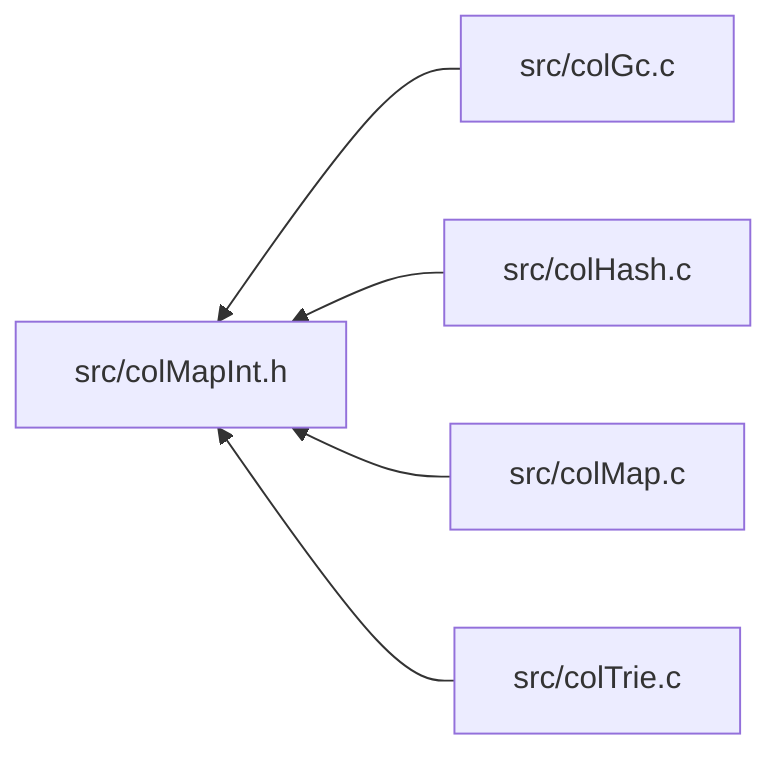

<a id="col_map_int_8h"></a>
# File colMapInt.h

![][C++]

**Location**: `src/colMapInt.h`

This header file defines the generic map word internals of Colibri.

Maps are an associative collection datatype that associates keys to values. Keys can be integers, strings or generic words. Values are arbitrary words.


They are always mutable.


**See also**: [colMap.c](col_map_8c.md#col_map_8c), [colMap.h](col_map_8h.md#col_map_8h)

## Included by

* [src/colGc.c](col_gc_8c.md#col_gc_8c)
* [src/colHash.c](col_hash_8c.md#col_hash_8c)
* [src/colMap.c](col_map_8c.md#col_map_8c)
* [src/colTrie.c](col_trie_8c.md#col_trie_8c)



## Map Entry Accessors

<a id="group__mapentry__words_1ga8664d15fae4553b47b658ac7ceb1443a"></a>
### Macro WORD\_MAPENTRY\_KEY

![][public]

```cpp
#define WORD_MAPENTRY_KEY ((([Col\_Word](col_word_8h.md#group__words_1gadb626f9e195212e4fdfba7df154ad043) *)(word))[2])( word )
```

Get/set word key of word-based map entry (string or custom).

**Parameters**:

* **word**: Word to access.


?> Macro is L-Value and suitable for both read/write operations.


<a id="group__mapentry__words_1gabad6806f2947f508a9786948c1663064"></a>
### Macro WORD\_MAPENTRY\_VALUE

![][public]

```cpp
#define WORD_MAPENTRY_VALUE ((([Col\_Word](col_word_8h.md#group__words_1gadb626f9e195212e4fdfba7df154ad043) *)(word))[3])( word )
```

Get/set value of map entry.

**Parameters**:

* **word**: Word to access.


?> Macro is L-Value and suitable for both read/write operations.


## Map Entry Exceptions

<a id="group__mapentry__words_1ga1eede95138bba256545ca58e6abcc4b0"></a>
### Macro TYPECHECK\_MAP

![][public]

```cpp
#define TYPECHECK_MAP( word )
```

Type checking macro for maps.

**Parameters**:

* **word**: Checked word.


**Exceptions**:

* **[COL\_ERROR\_MAP](colibri_8h.md#group__error_1gga729084542ed9eae62009a84d3379ef35aa33916b02406dded5d355b3a24c6ec76)**: [[T]](colibri_8h.md#group__error_1gga6dab009a0b8c4b4fa080cb9ba1859e9ea603a58b9d5bb16fde0708eb0767e4904) **word**: Not a map.


<a id="group__mapentry__words_1gad6c8914c3cf622521347dfa8a7a3f31c"></a>
### Macro TYPECHECK\_WORDMAP

![][public]

```cpp
#define TYPECHECK_WORDMAP( word )
```

Type checking macro for word-based maps (string or custom).

**Parameters**:

* **word**: Checked word.


**Exceptions**:

* **[COL\_ERROR\_WORDMAP](colibri_8h.md#group__error_1gga729084542ed9eae62009a84d3379ef35a892f5f9cfa9a2d2128b9a3035747a111)**: [[T]](colibri_8h.md#group__error_1gga6dab009a0b8c4b4fa080cb9ba1859e9ea603a58b9d5bb16fde0708eb0767e4904) **word**: Not a string or word-keyed map.


<a id="group__mapentry__words_1gabf16d4f023a9f2699c2ef1098d5fb74e"></a>
### Macro TYPECHECK\_INTMAP

![][public]

```cpp
#define TYPECHECK_INTMAP( word )
```

Type checking macro for integer maps.

**Parameters**:

* **word**: Checked word.


**Exceptions**:

* **[COL\_ERROR\_INTMAP](colibri_8h.md#group__error_1gga729084542ed9eae62009a84d3379ef35a4b21a1231316f5d1e72f1a4063cd64b4)**: [[T]](colibri_8h.md#group__error_1gga6dab009a0b8c4b4fa080cb9ba1859e9ea603a58b9d5bb16fde0708eb0767e4904) **word**: Not an integer-keyed map.


<a id="group__mapentry__words_1ga1ac9e9b70a28fd5385c1c5fb95494a2b"></a>
### Macro TYPECHECK\_MAPITER

![][public]

```cpp
#define TYPECHECK_MAPITER( it )
```

Type checking macro for map iterators.

**Parameters**:

* **it**: Checked iterator.


**Exceptions**:

* **[COL\_ERROR\_MAPITER](colibri_8h.md#group__error_1gga729084542ed9eae62009a84d3379ef35aa66f57346b0a9eac571308e75fb1f8ec)**: [[T]](colibri_8h.md#group__error_1gga6dab009a0b8c4b4fa080cb9ba1859e9ea603a58b9d5bb16fde0708eb0767e4904) **it**: Invalid map iterator.


**See also**: [Col\_MapIterNull](col_map_8h.md#group__map__words_1gaa62e65511e00c06204ab1aac8132ac7c)


<a id="group__mapentry__words_1ga4e477eb4ded0e97fcfa10c0e01eb7ead"></a>
### Macro VALUECHECK\_MAPITER

![][public]

```cpp
#define VALUECHECK_MAPITER( it )
```

Value checking macro for map iterators, ensures that iterator is not at end.

**Parameters**:

* **it**: Checked iterator.


**Exceptions**:

* **[COL\_ERROR\_MAPITER\_END](colibri_8h.md#group__error_1gga729084542ed9eae62009a84d3379ef35a1a834ed5a623ccf3120ccec5d0d60653)**: [[V]](colibri_8h.md#group__error_1gga6dab009a0b8c4b4fa080cb9ba1859e9ea65d5e7232c82ae6972ac56f386a32fc9) **it**: Map iterator at end.


**See also**: [Col\_MapIterEnd](col_map_8h.md#group__map__words_1ga98ec97359170a97141470434b83dcf56)


## Integer Map Entry Accessors

<a id="group__intmapentry__words_1ga89e26360d76aaad985afd89da56d1539"></a>
### Macro WORD\_INTMAPENTRY\_KEY

![][public]

```cpp
#define WORD_INTMAPENTRY_KEY (((intptr_t *)(word))[2])( word )
```

Get/set key of integer map entry.

**Parameters**:

* **word**: Word to access.


?> Macro is L-Value and suitable for both read/write operations.


## Source

```cpp
/**
 * @file colMapInt.h
 *
 * This header file defines the generic map word internals of Colibri.
 *
 * Maps are an associative collection datatype that associates keys to
 * values. Keys can be integers, strings or generic words. Values are
 * arbitrary words.
 *
 * They are always mutable.
 *
 * @see colMap.c
 * @see colMap.h
 *
 * @beginprivate @cond PRIVATE
 */

#ifndef _COLIBRI_MAP_INT
#define _COLIBRI_MAP_INT


/*
===========================================================================*//*!
\internal \defgroup mapentry_words Map Entries
\ingroup predefined_words map_words

Generic map entries are key-value pairs. Type-specific entries extend this
generic type with implementation-dependent data.

@par Requirements
    - Map entry words use one single cell.

    - Map entries must store at least a key and a value.

    @param Key      A word in the general case but can be a native integer for
                    integer maps.
    @param Value    A word.

@par Cell Layout
    On all architectures the single-cell layout is as follows:

    @dot
    digraph {
        node [fontname="Lucida Console,Courier" fontsize=14];
        mapentry_word [shape=none, label=<
            <table border="0" cellborder="1" cellspacing="0">
            <tr><td border="0"></td>
                <td sides="B" width="40" align="left">0</td><td sides="B" width="40" align="right">7</td>
                <td sides="B" width="120" align="left">8</td><td sides="B" width="120" align="right">n</td>
            </tr>
            <tr><td sides="R">0</td>
                <td href="@ref WORD_TYPEID" title="WORD_TYPEID" colspan="2">Type</td>
                <td sides="R" colspan="2"></td>
            </tr>
            <tr><td sides="R">1</td>
                <td colspan="4" sides="BR" width="320">Type-specific data</td>
            </tr>
            <tr><td sides="R">2</td>
                <td href="@ref WORD_MAPENTRY_KEY" title="WORD_MAPENTRY_KEY" colspan="4">Key</td>
            </tr>
            <tr><td sides="R">3</td>
                <td href="@ref WORD_MAPENTRY_VALUE" title="WORD_MAPENTRY_VALUE" colspan="4">Value</td>
            </tr>
            </table>
        >]
    }
    @enddot

    @begindiagram
           0     7 8                                                     n
          +-------+-------------------------------------------------------+
        0 | Type  |                                                       |
          +-------+               Type-specific data                      +
        1 |                                                               |
          +---------------------------------------------------------------+
        2 |                              Key                              |
          +---------------------------------------------------------------+
        3 |                             Value                             |
          +---------------------------------------------------------------+
    @enddiagram

\{*//*==========================================================================
*/

/***************************************************************************//*!
 * \name Map Entry Accessors
 ***************************************************************************\{*/

/**
 * Get/set word key of word-based map entry (string or custom).
 *
 * @param word  Word to access.
 *
 * @note
 *      Macro is L-Value and suitable for both read/write operations.
 */
#define WORD_MAPENTRY_KEY(word)         (((Col_Word *)(word))[2])

/**
 * Get/set value of map entry.
 *
 * @param word  Word to access.
 *
 * @note
 *      Macro is L-Value and suitable for both read/write operations.
 */
#define WORD_MAPENTRY_VALUE(word)       (((Col_Word *)(word))[3])

/* End of Map Entry Accessors *//*!\}*/


/***************************************************************************//*!
 * \name Map Entry Exceptions
 ***************************************************************************\{*/

/**
 * Type checking macro for maps.
 *
 * @param word  Checked word.
 *
 * @typecheck{COL_ERROR_MAP,word}
 * @hideinitializer
 */
#define TYPECHECK_MAP(word) \
    TYPECHECK((Col_WordType(word) & (COL_MAP | COL_INTMAP)), COL_ERROR_MAP, \
            (word))

/**
 * Type checking macro for word-based maps (string or custom).
 *
 * @param word  Checked word.
 *
 * @typecheck{COL_ERROR_WORDMAP,word}
 * @hideinitializer
 */
#define TYPECHECK_WORDMAP(word) \
    TYPECHECK(((Col_WordType(word) & (COL_MAP | COL_INTMAP)) == COL_MAP), \
            COL_ERROR_WORDMAP, (word))

/**
 * Type checking macro for integer maps.
 *
 * @param word  Checked word.
 *
 * @typecheck{COL_ERROR_INTMAP,word}
 * @hideinitializer
 */
#define TYPECHECK_INTMAP(word) \
    TYPECHECK((Col_WordType(word) & COL_INTMAP), COL_ERROR_INTMAP, (word))

/**
 * Type checking macro for map iterators.
 *
 * @param it    Checked iterator.
 *
 * @typecheck{COL_ERROR_MAPITER,it}
 *
 * @see Col_MapIterNull
 * @hideinitializer
 */
#define TYPECHECK_MAPITER(it) \
    TYPECHECK(!Col_MapIterNull(it), COL_ERROR_MAPITER, (it))

/**
 * Value checking macro for map iterators, ensures that iterator is not
 * at end.
 *
 * @param it    Checked iterator.
 *
 * @valuecheck{COL_ERROR_MAPITER_END,it}
 *
 * @see Col_MapIterEnd
 * @hideinitializer
 */
#define VALUECHECK_MAPITER(it) \
    VALUECHECK(!Col_MapIterEnd(it), COL_ERROR_MAPITER_END, (it))

/* End of Map Entry Exceptions *//*!\}*/

/* End of Map Entries *//*!\}*/


/*
===========================================================================*//*!
\internal \defgroup intmapentry_words Integer Map Entries
\ingroup predefined_words map_words

Generic integer map entries are key-value pairs. Type-specific entries extend
this generic type with implementation-dependent data.

@par Requirements
    - Map entry words use one single cell.

    - Map entries must store at least a key and a value.

    @param Key      A word in the general case but can be a native integer for
                    integer maps.
    @param Value    A word.

@par Cell Layout
    On all architectures the single-cell layout is as follows:

    @dot
    digraph {
        node [fontname="Lucida Console,Courier" fontsize=14];
        mapentry_word [shape=none, label=<
            <table border="0" cellborder="1" cellspacing="0">
            <tr><td border="0"></td>
                <td sides="B" width="40" align="left">0</td><td sides="B" width="40" align="right">7</td>
                <td sides="B" width="120" align="left">8</td><td sides="B" width="120" align="right">n</td>
            </tr>
            <tr><td sides="R">0</td>
                <td href="@ref WORD_TYPEID" title="WORD_TYPEID" colspan="2">Type</td>
                <td sides="R" colspan="2"></td>
            </tr>
            <tr><td sides="R">1</td>
                <td colspan="4" sides="BR" width="320">Type-specific data</td>
            </tr>
            <tr><td sides="R">2</td>
                <td href="@ref WORD_INTMAPENTRY_KEY" title="WORD_INTMAPENTRY_KEY" colspan="4">Key</td>
            </tr>
            <tr><td sides="R">3</td>
                <td href="@ref WORD_MAPENTRY_VALUE" title="WORD_MAPENTRY_VALUE" colspan="4">Value</td>
            </tr>
            </table>
        >]
    }
    @enddot

    @begindiagram
           0     7 8                                                     n
          +-------+-------------------------------------------------------+
        0 | Type  |                                                       |
          +-------+               Type-specific data                      +
        1 |                                                               |
          +---------------------------------------------------------------+
        2 |                              Key                              |
          +---------------------------------------------------------------+
        3 |                             Value                             |
          +---------------------------------------------------------------+
    @enddiagram

\{*//*==========================================================================
*/

/***************************************************************************//*!
 * \name Integer Map Entry Accessors
 ***************************************************************************\{*/

/**
 * Get/set key of integer map entry.
 *
 * @param word  Word to access.
 *
 * @note
 *      Macro is L-Value and suitable for both read/write operations.
 */
#define WORD_INTMAPENTRY_KEY(word)      (((intptr_t *)(word))[2])

/* End of Integer Map Entry Accessors *//*!\}*/

/* End of Integer Map Entries *//*!\}*/

#endif /* _COLIBRI_MAP_INT */
/*! @endcond @endprivate */
```

[public]: https://img.shields.io/badge/-public-brightgreen (public)
[C++]: https://img.shields.io/badge/language-C%2B%2B-blue (C++)
[private]: https://img.shields.io/badge/-private-red (private)
[Markdown]: https://img.shields.io/badge/language-Markdown-blue (Markdown)
[static]: https://img.shields.io/badge/-static-lightgrey (static)