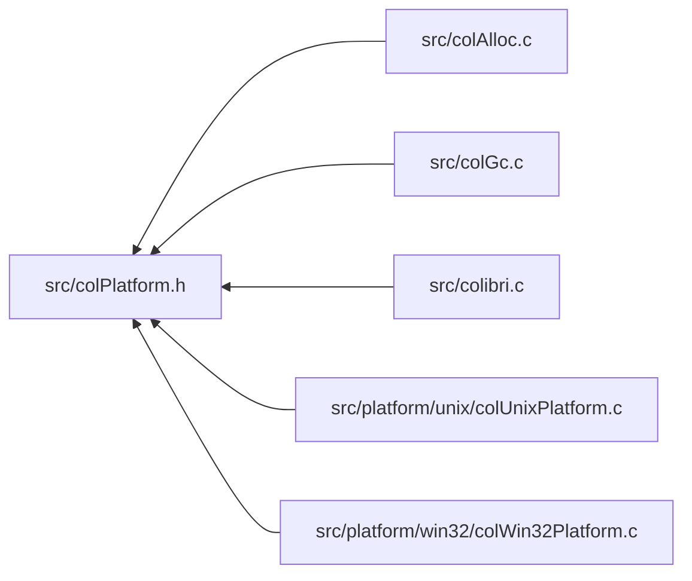

<a id="col_platform_8h"></a>
# File colPlatform.h

![][C++]

**Location**: `src/colPlatform.h`

This header file defines the generic primitives needing platform-specific implementations.

**See also**: [platform/win32/colWin32Platform.h](col_win32_platform_8h.md#col_win32_platform_8h), [platform/unix/colUnixPlatform.h](col_unix_platform_8h.md#col_unix_platform_8h)

## Included by

* [src/colAlloc.c](col_alloc_8c.md#col_alloc_8c)
* [src/colGc.c](col_gc_8c.md#col_gc_8c)
* [src/colibri.c](colibri_8c.md#colibri_8c)
* [src/platform/unix/colUnixPlatform.c](col_unix_platform_8c.md#col_unix_platform_8c)
* [src/platform/win32/colWin32Platform.c](col_win32_platform_8c.md#col_win32_platform_8c)



## Process & Threads

<a id="group__arch_1ga037203dea1294535ac25be8712d708d6"></a>
### Macro EnterProtectRoots

![][public]

```cpp
#define EnterProtectRoots         if ((data)->model >= [COL\_SHARED](colibri_8h.md#group__init_1ga9df51b794beca985147399feb68a8734)) {[PlatEnterProtectRoots](col_win32_platform_8c.md#group__arch__win32_1gaeb2b83a6cb4f1d38f1993fe221556bfa)(data);}( data )
```

Enter protected section around root management structures.

**Parameters**:

* **data**: Group-specific data.


**Side Effect**:

When model is [COL\_SHARED](colibri_8h.md#group__init_1ga9df51b794beca985147399feb68a8734), calls [PlatEnterProtectRoots()](col_platform_8h.md#group__arch_1gaeb2b83a6cb4f1d38f1993fe221556bfa).


**See also**: [PlatEnterProtectRoots](col_platform_8h.md#group__arch_1gaeb2b83a6cb4f1d38f1993fe221556bfa), [LeaveProtectRoots](col_platform_8h.md#group__arch_1gaee9721bdb7cc0ecca4a8ee295eadd446)


<a id="group__arch_1gaee9721bdb7cc0ecca4a8ee295eadd446"></a>
### Macro LeaveProtectRoots

![][public]

```cpp
#define LeaveProtectRoots         if ((data)->model >= [COL\_SHARED](colibri_8h.md#group__init_1ga9df51b794beca985147399feb68a8734)) {[PlatLeaveProtectRoots](col_win32_platform_8c.md#group__arch__win32_1gac35163168872326ce29c15c6df13d76a)(data);}( data )
```

Leave protected section around root management structures.

**Parameters**:

* **data**: Group-specific data.


**Side Effect**:

When model is [COL\_SHARED](colibri_8h.md#group__init_1ga9df51b794beca985147399feb68a8734), calls [PlatLeaveProtectRoots()](col_platform_8h.md#group__arch_1gac35163168872326ce29c15c6df13d76a).


<a id="group__arch_1ga24722ffc116af10635061f365d59f877"></a>
### Macro SyncPauseGC

![][public]

```cpp
#define SyncPauseGC         if ((data)->model != [COL\_SINGLE](colibri_8h.md#group__init_1gaaecbd3c0ddf9f5684b97db76e7338731)) {[PlatSyncPauseGC](col_win32_platform_8c.md#group__arch__win32_1gaa19923dd2972ca8919b05b935cc5592f)(data);}( data )
```

Synchronize calls to [Col\_PauseGC()](colibri_8h.md#group__gc_1gae703ee3215a4724ebed8e5a2824e7a7b).

**Parameters**:

* **data**: Group-specific data.


**Side Effect**:

When model isn't [COL\_SINGLE](colibri_8h.md#group__init_1gaaecbd3c0ddf9f5684b97db76e7338731), calls [PlatSyncPauseGC()](col_platform_8h.md#group__arch_1gaa19923dd2972ca8919b05b935cc5592f), which may block as long as a GC is underway.


**See also**: [Col\_PauseGC](colibri_8h.md#group__gc_1gae703ee3215a4724ebed8e5a2824e7a7b), [PlatSyncPauseGC](col_platform_8h.md#group__arch_1gaa19923dd2972ca8919b05b935cc5592f), [SyncResumeGC](col_platform_8h.md#group__arch_1gaeda9d3a189fb79d5dc53d2638ca42b35)


<a id="group__arch_1gaaab49fa9044c9543c52236f55c750ce7"></a>
### Macro TrySyncPauseGC

![][public]

```cpp
#define TrySyncPauseGC         ((data)->model == [COL\_SINGLE](colibri_8h.md#group__init_1gaaecbd3c0ddf9f5684b97db76e7338731) ? 1 : [PlatTrySyncPauseGC](col_win32_platform_8c.md#group__arch__win32_1ga52acd19d06324536559d9f142b832025)(data))( data )
```

Synchronize calls to [Col\_TryPauseGC()](colibri_8h.md#group__gc_1ga54eefaa11ad5a79b8665fef5cc24c26f).

**Parameters**:

* **data**: Group-specific data.


**Return values**:

* **1**: if successful
* **0**: if a GC is underway (this implies the threading model isn't [COL\_SINGLE](colibri_8h.md#group__init_1gaaecbd3c0ddf9f5684b97db76e7338731)).


**Side Effect**:

When model isn't [COL\_SINGLE](colibri_8h.md#group__init_1gaaecbd3c0ddf9f5684b97db76e7338731), calls [PlatTrySyncPauseGC()](col_platform_8h.md#group__arch_1ga52acd19d06324536559d9f142b832025).


**See also**: [Col\_TryPauseGC](colibri_8h.md#group__gc_1ga54eefaa11ad5a79b8665fef5cc24c26f), [PlatTrySyncPauseGC](col_platform_8h.md#group__arch_1ga52acd19d06324536559d9f142b832025), [SyncResumeGC](col_platform_8h.md#group__arch_1gaeda9d3a189fb79d5dc53d2638ca42b35)


<a id="group__arch_1gaeda9d3a189fb79d5dc53d2638ca42b35"></a>
### Macro SyncResumeGC

![][public]

```cpp
#define SyncResumeGC         if ((data)->model != [COL\_SINGLE](colibri_8h.md#group__init_1gaaecbd3c0ddf9f5684b97db76e7338731)) {[PlatSyncResumeGC](col_win32_platform_8c.md#group__arch__win32_1ga234974987c437283a255cad2e6847585)((data), (performGc));} \
        else if (performGc) {[PerformGC](col_gc_8c.md#group__gc_1ga5688ae9d7f658650ca8dfa66f4102f62)(data);}( data ,performGc )
```

Synchronize calls to [Col\_ResumeGC()](colibri_8h.md#group__gc_1gaf7d4f0dd1996dde366af3f29e9bcc517).

**Parameters**:

* **data**: Group-specific data.
* **performGc**: Whether to perform GC eventually.


**Side Effect**:

If **performGC** is nonzero, calls [PerformGC()](col_gc_8c.md#group__gc_1ga5688ae9d7f658650ca8dfa66f4102f62) eventually: synchronously if model is [COL\_SINGLE](colibri_8h.md#group__init_1gaaecbd3c0ddf9f5684b97db76e7338731), else asynchronously.


**See also**: [Col\_ResumeGC](colibri_8h.md#group__gc_1gaf7d4f0dd1996dde366af3f29e9bcc517), [PlatSyncResumeGC](col_platform_8h.md#group__arch_1gad59471fd155c1479f4c45841c9de8b57), [PerformGC](col_gc_8c.md#group__gc_1ga5688ae9d7f658650ca8dfa66f4102f62), [SyncPauseGC](col_platform_8h.md#group__arch_1ga24722ffc116af10635061f365d59f877), [TrySyncPauseGC](col_platform_8h.md#group__arch_1gaaab49fa9044c9543c52236f55c750ce7)


<a id="group__arch_1gaa42fe97b4b462c9483110a715c1eb1d1"></a>
### Function PlatEnter

![][private]

```cpp
int PlatEnter(unsigned int model)
```

Enter the thread.

If this is the first nested call, initialize thread data. If this is the first thread in its group, initialize group data as well.


**Return values**:

* **<>0**: if this is the first nested call.
* **0**: otherwise.


If this is the first nested call, initialize thread data. If this is the first thread in its group, initialize group data as well.
**See also**: [Threading Model Constants](#group__init_1threading_models), [ThreadData](struct_thread_data.md#struct_thread_data), [UnixGroupData](struct_unix_group_data.md#struct_unix_group_data), [PlatLeave](col_win32_platform_8c.md#group__arch__win32_1ga445bf6b3cd4afc09367a6d9fce001a2e), [Col\_Init](colibri_8h.md#group__init_1ga715049d7eb10ff0eeac38b457ef4fce1)


**Return values**:

* **<>0>**: if this is the first nested call.
* **0**: otherwise.


**See also**: [Threading Model Constants](#group__init_1threading_models), [ThreadData](struct_thread_data.md#struct_thread_data), [Win32GroupData](struct_win32_group_data.md#struct_win32_group_data), [PlatLeave](col_win32_platform_8c.md#group__arch__win32_1ga445bf6b3cd4afc09367a6d9fce001a2e), [Col\_Init](colibri_8h.md#group__init_1ga715049d7eb10ff0eeac38b457ef4fce1)


**Parameters**:

* unsigned int **model**: Threading model.

**Return type**: int

**References**:

* [AllocGroupData](col_unix_platform_8c.md#group__arch__unix_1gada67280be3d6df8cf250ba65d46d176e)
* [COL\_ASYNC](colibri_8h.md#group__init_1ga74df35d99d8e8408a563ae5a23022b06)
* [COL\_SINGLE](colibri_8h.md#group__init_1gaaecbd3c0ddf9f5684b97db76e7338731)
* [csSharedGroups](col_win32_platform_8c.md#group__arch__win32_1ga9d35bc9adb94355be53942f7d5d281e9)
* [UnixGroupData::data](struct_unix_group_data.md#struct_unix_group_data_1ad7c37ae9b2b049edee188d6123ed1d02)
* [Win32GroupData::data](struct_win32_group_data.md#struct_win32_group_data_1a11d7fb8755fb30bd47bbefd8098ec489)
* [GroupData::first](struct_group_data.md#struct_group_data_1af58eb628d2c2bb11f4bfa161c7e93318)
* [GcInitThread](col_gc_8c.md#group__gc_1gad46e288d322683c434e6efa30e3edc22)
* [Init](col_unix_platform_8c.md#group__arch__unix_1ga1716946dffd7f7f6a9c8f46406ab0732)
* [GroupData::model](struct_group_data.md#struct_group_data_1a02daeab5df802e492019f1f17d3efde2)
* [mutexSharedGroups](col_unix_platform_8c.md#group__arch__unix_1gaa73b09c27d88ca5ea5da4687c10a8cbe)
* [ThreadData::next](struct_thread_data.md#struct_thread_data_1aee56668363c15f17454a3bab5f63b4a4)
* [UnixGroupData::next](struct_unix_group_data.md#struct_unix_group_data_1ac4503fc576f6bc99549cf25866b45304)
* [Win32GroupData::next](struct_win32_group_data.md#struct_win32_group_data_1a11ee4dca830fbf843b3f7acabf3e54be)
* [once](col_unix_platform_8c.md#group__arch__unix_1gad2c7a51be06d10615c8b5ab3d2f8d161)
* [PlatGetThreadData](col_unix_platform_8h.md#group__arch__unix_1ga6964b3c4d4787a9defb7aae57825d92c)
* [sharedGroups](col_unix_platform_8c.md#group__arch__unix_1ga5a87c9b163905bf83d4d93ddbd0b6c56)
* [tlsToken](col_win32_platform_8c.md#group__arch__win32_1ga338377fedfe1571e9dd2118048a516c7)
* [tsdKey](col_unix_platform_8c.md#group__arch__unix_1gacfa4b2395a4c29a432e682bfbb407a35)
* [UNIX\_PROTECT\_ADDRESS\_RANGES\_RECURSE](col_unix_platform_8h.md#group__arch__unix_1ga9e2c8984ce04b1ef7c69111e31c508cd)

**Referenced by**:

* [Col\_Init](colibri_8h.md#group__init_1ga715049d7eb10ff0eeac38b457ef4fce1)

<a id="group__arch_1gaf70aa9db460d666ff9a09610dda183ef"></a>
### Function PlatLeave

![][private]

```cpp
int PlatLeave(void)
```

Leave the thread.

If this is the first nested call, cleanup thread data. If this is the last thread in its group, cleanup group data as well.


**Return values**:

* **<>0**: if this is the last nested call.
* **0**: otherwise.


If this is the first nested call, cleanup thread data. If this is the last thread in its group, cleanup group data as well.
**See also**: [ThreadData](struct_thread_data.md#struct_thread_data), [UnixGroupData](struct_unix_group_data.md#struct_unix_group_data), [PlatEnter](col_win32_platform_8c.md#group__arch__win32_1gaa42fe97b4b462c9483110a715c1eb1d1), [Col\_Cleanup](colibri_8h.md#group__init_1gaaa7addef72eaac5fb58f6edb449fda75)


**Return values**:

* **<>0**: if this is the last nested call.
* **0**: otherwise.


**See also**: [ThreadData](struct_thread_data.md#struct_thread_data), [Win32GroupData](struct_win32_group_data.md#struct_win32_group_data), [PlatEnter](col_win32_platform_8c.md#group__arch__win32_1gaa42fe97b4b462c9483110a715c1eb1d1), [Col\_Cleanup](colibri_8h.md#group__init_1gaaa7addef72eaac5fb58f6edb449fda75)


**Parameters**:

* void

**Return type**: int

**References**:

* [COL\_ASYNC](colibri_8h.md#group__init_1ga74df35d99d8e8408a563ae5a23022b06)
* [COL\_SINGLE](colibri_8h.md#group__init_1gaaecbd3c0ddf9f5684b97db76e7338731)
* [csSharedGroups](col_win32_platform_8c.md#group__arch__win32_1ga9d35bc9adb94355be53942f7d5d281e9)
* [UnixGroupData::data](struct_unix_group_data.md#struct_unix_group_data_1ad7c37ae9b2b049edee188d6123ed1d02)
* [Win32GroupData::data](struct_win32_group_data.md#struct_win32_group_data_1a11d7fb8755fb30bd47bbefd8098ec489)
* [GroupData::first](struct_group_data.md#struct_group_data_1af58eb628d2c2bb11f4bfa161c7e93318)
* [FreeGroupData](col_unix_platform_8c.md#group__arch__unix_1ga721b5c30cbc3d79ced480bf39efcf5aa)
* [GcCleanupThread](col_gc_8c.md#group__gc_1gacbea8d94b2fdf7366fbe4ad8b8298a91)
* [GroupData::model](struct_group_data.md#struct_group_data_1a02daeab5df802e492019f1f17d3efde2)
* [mutexSharedGroups](col_unix_platform_8c.md#group__arch__unix_1gaa73b09c27d88ca5ea5da4687c10a8cbe)
* [ThreadData::next](struct_thread_data.md#struct_thread_data_1aee56668363c15f17454a3bab5f63b4a4)
* [PlatGetThreadData](col_unix_platform_8h.md#group__arch__unix_1ga6964b3c4d4787a9defb7aae57825d92c)
* [tlsToken](col_win32_platform_8c.md#group__arch__win32_1ga338377fedfe1571e9dd2118048a516c7)
* [tsdKey](col_unix_platform_8c.md#group__arch__unix_1gacfa4b2395a4c29a432e682bfbb407a35)

**Referenced by**:

* [Col\_Cleanup](colibri_8h.md#group__init_1gaaa7addef72eaac5fb58f6edb449fda75)

<a id="group__arch_1gaeb2b83a6cb4f1d38f1993fe221556bfa"></a>
### Function PlatEnterProtectRoots

![][private]

```cpp
void PlatEnterProtectRoots(GroupData *data)
```

Enter protected section around root management structures.

**Side Effect**:

Blocks until no thread owns the section.


**See also**: [PlatLeaveProtectRoots](col_unix_platform_8c.md#group__arch__unix_1gac35163168872326ce29c15c6df13d76a), [EnterProtectRoots](col_platform_8h.md#group__arch_1ga037203dea1294535ac25be8712d708d6)


**Parameters**:

* [GroupData](struct_group_data.md#struct_group_data) * **data**: Group-specific data.

**Return type**: void

**References**:

* [ASSERT](col_internal_8h.md#group__error_1gac22830a985e1daed0c9eadba8c6f606e)
* [COL\_SHARED](colibri_8h.md#group__init_1ga9df51b794beca985147399feb68a8734)
* [Win32GroupData::csRoots](struct_win32_group_data.md#struct_win32_group_data_1a6944a9302c4b18dfaa54a0a2d95e5f4d)
* [UnixGroupData::data](struct_unix_group_data.md#struct_unix_group_data_1ad7c37ae9b2b049edee188d6123ed1d02)
* [Win32GroupData::data](struct_win32_group_data.md#struct_win32_group_data_1a11d7fb8755fb30bd47bbefd8098ec489)
* [GroupData::model](struct_group_data.md#struct_group_data_1a02daeab5df802e492019f1f17d3efde2)
* [UnixGroupData::mutexRoots](struct_unix_group_data.md#struct_unix_group_data_1a38ea1e8080b000b915c65824cbed5692)

<a id="group__arch_1gac35163168872326ce29c15c6df13d76a"></a>
### Function PlatLeaveProtectRoots

![][private]

```cpp
void PlatLeaveProtectRoots(GroupData *data)
```

Leave protected section around root management structures.

**Side Effect**:

May unblock any thread waiting for the section.


**See also**: [PlatEnterProtectRoots](col_unix_platform_8c.md#group__arch__unix_1gaeb2b83a6cb4f1d38f1993fe221556bfa), [LeaveProtectRoots](col_platform_8h.md#group__arch_1gaee9721bdb7cc0ecca4a8ee295eadd446)


**Parameters**:

* [GroupData](struct_group_data.md#struct_group_data) * **data**: Group-specific data.

**Return type**: void

**References**:

* [ASSERT](col_internal_8h.md#group__error_1gac22830a985e1daed0c9eadba8c6f606e)
* [COL\_SHARED](colibri_8h.md#group__init_1ga9df51b794beca985147399feb68a8734)
* [Win32GroupData::csRoots](struct_win32_group_data.md#struct_win32_group_data_1a6944a9302c4b18dfaa54a0a2d95e5f4d)
* [UnixGroupData::data](struct_unix_group_data.md#struct_unix_group_data_1ad7c37ae9b2b049edee188d6123ed1d02)
* [Win32GroupData::data](struct_win32_group_data.md#struct_win32_group_data_1a11d7fb8755fb30bd47bbefd8098ec489)
* [GroupData::model](struct_group_data.md#struct_group_data_1a02daeab5df802e492019f1f17d3efde2)
* [UnixGroupData::mutexRoots](struct_unix_group_data.md#struct_unix_group_data_1a38ea1e8080b000b915c65824cbed5692)

<a id="group__arch_1gaa19923dd2972ca8919b05b935cc5592f"></a>
### Function PlatSyncPauseGC

![][private]

```cpp
void PlatSyncPauseGC(GroupData *data)
```

Called when a worker thread calls the outermost [Col\_PauseGC()](colibri_8h.md#group__gc_1gae703ee3215a4724ebed8e5a2824e7a7b).

**Side Effect**:

May block as long as a GC is underway.


**See also**: [GcThreadProc](col_unix_platform_8c.md#group__arch__unix_1ga74665cfa1a2c8827d87315985197ee41), [SyncPauseGC](col_platform_8h.md#group__arch_1ga24722ffc116af10635061f365d59f877), [Col\_PauseGC](colibri_8h.md#group__gc_1gae703ee3215a4724ebed8e5a2824e7a7b)


**Parameters**:

* [GroupData](struct_group_data.md#struct_group_data) * **data**: Group-specific data.

**Return type**: void

**References**:

* [ASSERT](col_internal_8h.md#group__error_1gac22830a985e1daed0c9eadba8c6f606e)
* [COL\_SINGLE](colibri_8h.md#group__init_1gaaecbd3c0ddf9f5684b97db76e7338731)
* [UnixGroupData::condGcDone](struct_unix_group_data.md#struct_unix_group_data_1a8e596ff91f9b7bccc2e03ba8a3904646)
* [Win32GroupData::csGc](struct_win32_group_data.md#struct_win32_group_data_1af28904a028484c08cacab8c50e4705f8)
* [UnixGroupData::data](struct_unix_group_data.md#struct_unix_group_data_1ad7c37ae9b2b049edee188d6123ed1d02)
* [Win32GroupData::data](struct_win32_group_data.md#struct_win32_group_data_1a11d7fb8755fb30bd47bbefd8098ec489)
* [Win32GroupData::eventGcDone](struct_win32_group_data.md#struct_win32_group_data_1a98a56c55ed514fe43a741dcc71d06d72)
* [GroupData::model](struct_group_data.md#struct_group_data_1a02daeab5df802e492019f1f17d3efde2)
* [UnixGroupData::mutexGc](struct_unix_group_data.md#struct_unix_group_data_1a3755b74c0ab89d8c45ece97e0f1391bc)
* [UnixGroupData::nbActive](struct_unix_group_data.md#struct_unix_group_data_1aea3a82f31d27f81fd27582e8afebda97)
* [Win32GroupData::nbActive](struct_win32_group_data.md#struct_win32_group_data_1a6d5f37daf4e64c6cf6586066b90fb987)
* [UnixGroupData::scheduled](struct_unix_group_data.md#struct_unix_group_data_1a8b8e85e9f5c851a84d34a399373bf12a)

<a id="group__arch_1ga52acd19d06324536559d9f142b832025"></a>
### Function PlatTrySyncPauseGC

![][private]

```cpp
int PlatTrySyncPauseGC(GroupData *data)
```

Called when a worker thread calls the outermost [Col\_TryPauseGC()](colibri_8h.md#group__gc_1ga54eefaa11ad5a79b8665fef5cc24c26f).

**Return values**:

* **<>0**: if successful.
* **0**: if call would block.


**See also**: [GcThreadProc](col_unix_platform_8c.md#group__arch__unix_1ga74665cfa1a2c8827d87315985197ee41), [TrySyncPauseGC](col_platform_8h.md#group__arch_1gaaab49fa9044c9543c52236f55c750ce7), [Col\_TryPauseGC](colibri_8h.md#group__gc_1ga54eefaa11ad5a79b8665fef5cc24c26f)


**Parameters**:

* [GroupData](struct_group_data.md#struct_group_data) * **data**: Group-specific data.

**Return type**: int

**References**:

* [ASSERT](col_internal_8h.md#group__error_1gac22830a985e1daed0c9eadba8c6f606e)
* [COL\_SINGLE](colibri_8h.md#group__init_1gaaecbd3c0ddf9f5684b97db76e7338731)
* [UnixGroupData::condGcDone](struct_unix_group_data.md#struct_unix_group_data_1a8e596ff91f9b7bccc2e03ba8a3904646)
* [Win32GroupData::csGc](struct_win32_group_data.md#struct_win32_group_data_1af28904a028484c08cacab8c50e4705f8)
* [UnixGroupData::data](struct_unix_group_data.md#struct_unix_group_data_1ad7c37ae9b2b049edee188d6123ed1d02)
* [Win32GroupData::data](struct_win32_group_data.md#struct_win32_group_data_1a11d7fb8755fb30bd47bbefd8098ec489)
* [Win32GroupData::eventGcDone](struct_win32_group_data.md#struct_win32_group_data_1a98a56c55ed514fe43a741dcc71d06d72)
* [GroupData::model](struct_group_data.md#struct_group_data_1a02daeab5df802e492019f1f17d3efde2)
* [UnixGroupData::mutexGc](struct_unix_group_data.md#struct_unix_group_data_1a3755b74c0ab89d8c45ece97e0f1391bc)
* [UnixGroupData::nbActive](struct_unix_group_data.md#struct_unix_group_data_1aea3a82f31d27f81fd27582e8afebda97)
* [Win32GroupData::nbActive](struct_win32_group_data.md#struct_win32_group_data_1a6d5f37daf4e64c6cf6586066b90fb987)
* [UnixGroupData::scheduled](struct_unix_group_data.md#struct_unix_group_data_1a8b8e85e9f5c851a84d34a399373bf12a)

<a id="group__arch_1gad59471fd155c1479f4c45841c9de8b57"></a>
### Function PlatSyncResumeGC

![][private]

```cpp
void PlatSyncResumeGC(GroupData *data, int schedule)
```

Called when a worker thread calls the outermost [Col\_ResumeGC()](colibri_8h.md#group__gc_1gaf7d4f0dd1996dde366af3f29e9bcc517).

**Side Effect**:

If last thread in group, may trigger the GC in the dedicated thread if previously scheduled. This will block further calls to [Col\_PauseGC()](colibri_8h.md#group__gc_1gae703ee3215a4724ebed8e5a2824e7a7b) / [PlatSyncPauseGC()](col_unix_platform_8c.md#group__arch__unix_1gaa19923dd2972ca8919b05b935cc5592f).


**See also**: [GcThreadProc](col_unix_platform_8c.md#group__arch__unix_1ga74665cfa1a2c8827d87315985197ee41), [SyncResumeGC](col_platform_8h.md#group__arch_1gaeda9d3a189fb79d5dc53d2638ca42b35), [Col\_ResumeGC](colibri_8h.md#group__gc_1gaf7d4f0dd1996dde366af3f29e9bcc517)


**Parameters**:

* [GroupData](struct_group_data.md#struct_group_data) * **data**: Group-specific data.
* performGcint **schedule**: Whether to perform GC.

**Return type**: void

**References**:

* [ASSERT](col_internal_8h.md#group__error_1gac22830a985e1daed0c9eadba8c6f606e)
* [COL\_SINGLE](colibri_8h.md#group__init_1gaaecbd3c0ddf9f5684b97db76e7338731)
* [UnixGroupData::condGcScheduled](struct_unix_group_data.md#struct_unix_group_data_1a965c8fab20818cadc1ed6149560be9bc)
* [Win32GroupData::csGc](struct_win32_group_data.md#struct_win32_group_data_1af28904a028484c08cacab8c50e4705f8)
* [UnixGroupData::data](struct_unix_group_data.md#struct_unix_group_data_1ad7c37ae9b2b049edee188d6123ed1d02)
* [Win32GroupData::data](struct_win32_group_data.md#struct_win32_group_data_1a11d7fb8755fb30bd47bbefd8098ec489)
* [Win32GroupData::eventGcDone](struct_win32_group_data.md#struct_win32_group_data_1a98a56c55ed514fe43a741dcc71d06d72)
* [Win32GroupData::eventGcScheduled](struct_win32_group_data.md#struct_win32_group_data_1aad968230554371a9d6be7012ef4ef5e8)
* [GroupData::model](struct_group_data.md#struct_group_data_1a02daeab5df802e492019f1f17d3efde2)
* [UnixGroupData::mutexGc](struct_unix_group_data.md#struct_unix_group_data_1a3755b74c0ab89d8c45ece97e0f1391bc)
* [UnixGroupData::nbActive](struct_unix_group_data.md#struct_unix_group_data_1aea3a82f31d27f81fd27582e8afebda97)
* [Win32GroupData::nbActive](struct_win32_group_data.md#struct_win32_group_data_1a6d5f37daf4e64c6cf6586066b90fb987)
* [UnixGroupData::scheduled](struct_unix_group_data.md#struct_unix_group_data_1a8b8e85e9f5c851a84d34a399373bf12a)
* [Win32GroupData::scheduled](struct_win32_group_data.md#struct_win32_group_data_1af4560732f756493b5fd37bff90926c76)

## System Page Allocation

<a id="group__arch_1gacfca316efccddeee528c309c490c3f90"></a>
### Variable systemPageSize

![][private]

**Definition**: `src/colPlatform.h` (line 161)

```cpp
size_t systemPageSize
```

System page size in bytes.


**Type**: size_t

**Referenced by**:

* [Init](col_unix_platform_8c.md#group__arch__unix_1ga1716946dffd7f7f6a9c8f46406ab0732)
* [PoolAllocPages](col_alloc_8c.md#group__alloc_1ga45316be86459e993b67bf27efbb8bf5f)
* [PoolFreeEmptyPages](col_alloc_8c.md#group__alloc_1ga0c80585c5110f75f1bf723c9b93df073)
* [SysPageTrim](col_alloc_8c.md#group__alloc_1ga16a9361484b90e5202862b29a03cb958)

<a id="group__arch_1ga9fdf03be3e1742b0fbc71f3445d83c48"></a>
### Variable allocGranularity

![][private]

**Definition**: `src/colPlatform.h` (line 162)

```cpp
size_t allocGranularity
```

Allocation granularity of address ranges.


**Type**: size_t

**Referenced by**:

* [Init](col_unix_platform_8c.md#group__arch__unix_1ga1716946dffd7f7f6a9c8f46406ab0732)
* [SysPageAlloc](col_alloc_8c.md#group__alloc_1ga9318fd94abe19ee6d962cacb9d08830f)

<a id="group__arch_1gacfb643d4c365f92c1ea93d0f1b1b71e5"></a>
### Variable shiftPage

![][private]

**Definition**: `src/colPlatform.h` (line 163)

```cpp
size_t shiftPage
```

Bits to shift to convert between pages and bytes.


**Type**: size_t

**Referenced by**:

* [Init](col_unix_platform_8c.md#group__arch__unix_1ga1716946dffd7f7f6a9c8f46406ab0732)
* [PlatAllocPages](col_unix_platform_8c.md#group__arch__unix_1gab258be1bc40313f7c0a4c8bcab840243)
* [PlatFreePages](col_unix_platform_8c.md#group__arch__unix_1ga3af1cd9d798457114f4bf563c10f9875)
* [PlatProtectPages](col_unix_platform_8c.md#group__arch__unix_1gaafe939448070a0b389fc64dcd009ac9e)
* [PlatReleaseRange](col_unix_platform_8c.md#group__arch__unix_1ga7ca830366dd1fb4e114a2f912ef5ed6c)
* [PlatReserveRange](col_unix_platform_8c.md#group__arch__unix_1ga7d63e9c0de11a4c0954aab0efbc09c09)
* [SysPageAlloc](col_alloc_8c.md#group__alloc_1ga9318fd94abe19ee6d962cacb9d08830f)
* [SysPageFree](col_alloc_8c.md#group__alloc_1gae87fa6ec29c10f180f511dfd1213fe5f)
* [SysPageProtect](col_alloc_8c.md#group__alloc_1ga35a37fb9d22a879405b65f3e90d09358)
* [SysPageTrim](col_alloc_8c.md#group__alloc_1ga16a9361484b90e5202862b29a03cb958)
* [UpdateParents](col_alloc_8c.md#group__gc__parents_1gaa3d85dc993fb1b9831f82c25b8c07d3c)

<a id="group__arch_1ga7d63e9c0de11a4c0954aab0efbc09c09"></a>
### Function PlatReserveRange

![][private]

```cpp
void* PlatReserveRange(size_t size, int alloc)
```

Reserve an address range.

**Returns**:

The reserved range's base address, or NULL if failure.


**Parameters**:

* size_t **size**: Number of pages to reserve.
* int **alloc**: Whether to allocate the range pages as well.

**Return type**: void *

**References**:

* [shiftPage](col_alloc_8c.md#group__arch_1gacfb643d4c365f92c1ea93d0f1b1b71e5)

**Referenced by**:

* [SysPageAlloc](col_alloc_8c.md#group__alloc_1ga9318fd94abe19ee6d962cacb9d08830f)

<a id="group__arch_1ga7ca830366dd1fb4e114a2f912ef5ed6c"></a>
### Function PlatReleaseRange

![][private]

```cpp
int PlatReleaseRange(void *base, size_t size)
```

Release an address range.

**Return values**:

* **<>0**: for success.
* **0**: for failure.


**Parameters**:

* void * **base**: Base address of range to release.
* size_t **size**: Number of pages in range.

**Return type**: int

**References**:

* [shiftPage](col_alloc_8c.md#group__arch_1gacfb643d4c365f92c1ea93d0f1b1b71e5)

**Referenced by**:

* [SysPageFree](col_alloc_8c.md#group__alloc_1gae87fa6ec29c10f180f511dfd1213fe5f)

<a id="group__arch_1gab258be1bc40313f7c0a4c8bcab840243"></a>
### Function PlatAllocPages

![][private]

```cpp
int PlatAllocPages(void *addr, size_t number)
```

Allocate pages in reserved range.

**Return values**:

* **<>0**: for success.
* **0**: for failure.


**Parameters**:

* void * **addr**: Address of first page to allocate.
* size_t **number**: Number of pages to allocate.

**Return type**: int

**References**:

* [shiftPage](col_alloc_8c.md#group__arch_1gacfb643d4c365f92c1ea93d0f1b1b71e5)

**Referenced by**:

* [SysPageAlloc](col_alloc_8c.md#group__alloc_1ga9318fd94abe19ee6d962cacb9d08830f)

<a id="group__arch_1ga3af1cd9d798457114f4bf563c10f9875"></a>
### Function PlatFreePages

![][private]

```cpp
int PlatFreePages(void *addr, size_t number)
```

Free pages in reserved range.

**Return values**:

* **<>0**: for success.
* **0**: for failure.


**Parameters**:

* void * **addr**: Address of first page to free.
* size_t **number**: Number of pages to free.

**Return type**: int

**References**:

* [shiftPage](col_alloc_8c.md#group__arch_1gacfb643d4c365f92c1ea93d0f1b1b71e5)

**Referenced by**:

* [SysPageFree](col_alloc_8c.md#group__alloc_1gae87fa6ec29c10f180f511dfd1213fe5f)
* [SysPageTrim](col_alloc_8c.md#group__alloc_1ga16a9361484b90e5202862b29a03cb958)

<a id="group__arch_1gaafe939448070a0b389fc64dcd009ac9e"></a>
### Function PlatProtectPages

![][private]

```cpp
int PlatProtectPages(void *addr, size_t number, int protect)
```

Protect/unprotect pages in reserved range.

**Return values**:

* **<>0**: for success.
* **0**: for failure.


**Parameters**:

* void * **addr**: Address of first page to protect/unprotect
* size_t **number**: Number of pages to protect/unprotect.
* int **protect**: Whether to protect or unprotect pages.

**Return type**: int

**References**:

* [shiftPage](col_alloc_8c.md#group__arch_1gacfb643d4c365f92c1ea93d0f1b1b71e5)

**Referenced by**:

* [SysPageProtect](col_alloc_8c.md#group__alloc_1ga35a37fb9d22a879405b65f3e90d09358)

## Source

```cpp
/**
 * @file colPlatform.h
 *
 * This header file defines the generic primitives needing platform-specific
 * implementations.
 *
 * @see platform/win32/colWin32Platform.h
 * @see platform/unix/colUnixPlatform.h
 *
 * @beginprivate @cond PRIVATE
 */

#ifndef _COLIBRI_PLATFORM
#define _COLIBRI_PLATFORM

#ifndef DOXYGEN

#if defined(__WIN32__)
#   include "platform/win32/colWin32Platform.h"
#else /* FIXME */
#   include "platform/unix/colUnixPlatform.h"
#endif

#endif /* DOXYGEN */


/*
===========================================================================*//*!
\internal \defgroup arch System and Architecture

Generic primitives needing platform-specific implementations.
\{*//*==========================================================================
*/

/***************************************************************************//*!
 * \name Process & Threads
 ***************************************************************************\{*/

/**
 * Enter protected section around root management structures.
 *
 * @param data  Group-specific data.
 *
 * @sideeffect
 *      When model is #COL_SHARED, calls PlatEnterProtectRoots().
 *
 * @see PlatEnterProtectRoots
 * @see LeaveProtectRoots
 */
#ifdef COL_USE_THREADS
#   define EnterProtectRoots(data) \
        if ((data)->model >= COL_SHARED) {PlatEnterProtectRoots(data);}
#else
#   define EnterProtectRoots(data) /* NOOP */
#endif /* COL_USE_THREADS */

/**
 * Leave protected section around root management structures.
 *
 * @param data  Group-specific data.
 *
 * @sideeffect
 *      When model is #COL_SHARED, calls PlatLeaveProtectRoots().
 */
#ifdef COL_USE_THREADS
#   define LeaveProtectRoots(data) \
        if ((data)->model >= COL_SHARED) {PlatLeaveProtectRoots(data);}
#else
#   define LeaveProtectRoots(data) /* NOOP */
#endif /* COL_USE_THREADS */

/**
 * Synchronize calls to Col_PauseGC().
 *
 * @param data  Group-specific data.
 *
 * @sideeffect
 *      When model isn't #COL_SINGLE, calls PlatSyncPauseGC(), which may block
 *      as long as a GC is underway.
 *
 * @see Col_PauseGC
 * @see PlatSyncPauseGC
 * @see SyncResumeGC
 */
#ifdef COL_USE_THREADS
#   define SyncPauseGC(data) \
        if ((data)->model != COL_SINGLE) {PlatSyncPauseGC(data);}
#else
#   define SyncPauseGC(data) /* NOOP */
#endif /* COL_USE_THREADS */

/**
 * Synchronize calls to Col_TryPauseGC().
 *
 * @param data  Group-specific data.
 *
 * @retval 1    if successful
 * @retval 0    if a GC is underway (this implies the threading model isn't
 *              #COL_SINGLE).
 *
 * @sideeffect
 *      When model isn't #COL_SINGLE, calls PlatTrySyncPauseGC().
 *
 * @see Col_TryPauseGC
 * @see PlatTrySyncPauseGC
 * @see SyncResumeGC
 */
#ifdef COL_USE_THREADS
#   define TrySyncPauseGC(data) \
        ((data)->model == COL_SINGLE ? 1 : PlatTrySyncPauseGC(data))
#else
#   define TrySyncPauseGC(data) 1 /* NOOP */
#endif /* COL_USE_THREADS */

/**
 * Synchronize calls to Col_ResumeGC().
 *
 * @param data          Group-specific data.
 * @param performGc     Whether to perform GC eventually.
 *
 * @sideeffect
 *      If **performGC** is nonzero, calls PerformGC() eventually: synchronously
 *      if model is #COL_SINGLE, else asynchronously.
 *
 * @see Col_ResumeGC
 * @see PlatSyncResumeGC
 * @see PerformGC
 * @see SyncPauseGC
 * @see TrySyncPauseGC
 */
#ifdef COL_USE_THREADS
#   define SyncResumeGC(data, performGc) \
        if ((data)->model != COL_SINGLE) {PlatSyncResumeGC((data), (performGc));} \
        else if (performGc) {PerformGC(data);}
#else
#   define SyncResumeGC(data, performGc) \
        if (performGc) {PerformGC(data);}
#endif /* COL_USE_THREADS */

/*
 * Remaining declarations.
 */

int                     PlatEnter(unsigned int model);
int                     PlatLeave(void);
#ifdef COL_USE_THREADS
void                    PlatEnterProtectRoots(GroupData *data);
void                    PlatLeaveProtectRoots(GroupData *data);
void                    PlatSyncPauseGC(GroupData *data);
int                     PlatTrySyncPauseGC(GroupData *data);
void                    PlatSyncResumeGC(GroupData *data, int schedule);
#endif /* COL_USE_THREADS */

/* End of Process & Threads *//*!\}*/


/***************************************************************************//*!
 * \name System Page Allocation
 ***************************************************************************\{*/

extern size_t systemPageSize;
extern size_t allocGranularity;
extern size_t shiftPage;

void *                  PlatReserveRange(size_t size, int alloc);
int                     PlatReleaseRange(void *base, size_t size);
int                     PlatAllocPages(void *addr, size_t number);
int                     PlatFreePages(void *addr, size_t number);
int                     PlatProtectPages(void *addr, size_t number,
                                int protect);

/* End of System Page Allocation *//*!\}*/

/* End of System and Architecture *//*!\}*/

#endif /* _COLIBRI_PLATFORM */
/*! @endcond @endprivate */
```

[public]: https://img.shields.io/badge/-public-brightgreen (public)
[C++]: https://img.shields.io/badge/language-C%2B%2B-blue (C++)
[private]: https://img.shields.io/badge/-private-red (private)
[Markdown]: https://img.shields.io/badge/language-Markdown-blue (Markdown)
[static]: https://img.shields.io/badge/-static-lightgrey (static)