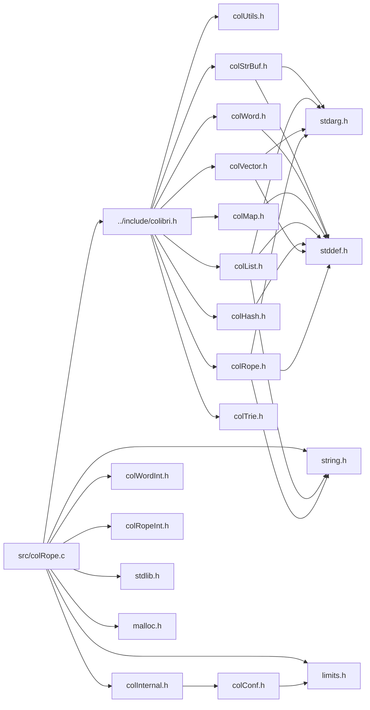

<a id="col_rope_8c"></a>
# File colRope.c

![][C++]

**Location**: `src/colRope.c`

This file implements the rope handling features of Colibri.

Ropes are a string datatype that allows for fast insertion, extraction and composition of strings. Internally they use self-balanced binary trees.


They are always immutable.


**See also**: [colRope.h](col_rope_8h.md#col_rope_8h)

## Classes

* [CopyDataInfo](struct_copy_data_info.md#struct_copy_data_info)
* [FindCharInfo](struct_find_char_info.md#struct_find_char_info)
* [SearchSubropeInfo](struct_search_subrope_info.md#struct_search_subrope_info)
* [CompareChunksInfo](struct_compare_chunks_info.md#struct_compare_chunks_info)
* [MergeRopeChunksInfo](struct_merge_rope_chunks_info.md#struct_merge_rope_chunks_info)
* [RopeChunkTraverseInfo](struct_rope_chunk_traverse_info.md#struct_rope_chunk_traverse_info)
* [RopeChunkTraverseInfo.backtracks](struct_rope_chunk_traverse_info_8backtracks.md#struct_rope_chunk_traverse_info_8backtracks)

## Includes

* [../include/colibri.h](colibri_8h.md#colibri_8h)
* [colInternal.h](col_internal_8h.md#col_internal_8h)
* [colWordInt.h](col_word_int_8h.md#col_word_int_8h)
* [colRopeInt.h](col_rope_int_8h.md#col_rope_int_8h)
* <stdlib.h>
* <string.h>
* <limits.h>
* <malloc.h>



## Rope Creation

<a id="group__rope__words_1gac89e756ecb28842e1eb50327270408f3"></a>
### Function Col\_EmptyRope

![][public]

```cpp
Col_Word Col_EmptyRope()
```

Return an empty rope.

The returned word is immediate and constant, which means that it consumes no memory and its value can be safely compared and stored in static storage.


**Returns**:

The empty rope.


**Return type**: EXTERN [Col\_Word](col_word_8h.md#group__words_1gadb626f9e195212e4fdfba7df154ad043)

**References**:

* [WORD\_SMALLSTR\_EMPTY](col_word_int_8h.md#group__smallstr__words_1gaced4b5ab427a8009e9e3586f60cf487f)

<a id="group__rope__words_1ga6904ba10bcedc80ff75dd6d775679bdc"></a>
### Function Col\_NewRopeFromString

![][public]

```cpp
Col_Word Col_NewRopeFromString(const char *string)
```

Create a new rope from a C string.

The string is treated as an UCS1 character buffer whose length is computed with **strlen()** and is passed to Col_NewRope.


**Returns**:

A new rope containing the character data.


**See also**: [Col\_NewRope](col_rope_8h.md#group__rope__words_1gadf89e360729ba5052887cd4897b0167f)


**Parameters**:

* const char * **string**: C string to build rope from.

**Return type**: EXTERN [Col\_Word](col_word_8h.md#group__words_1gadb626f9e195212e4fdfba7df154ad043)

**References**:

* [Col\_NewRope](col_rope_8h.md#group__rope__words_1gadf89e360729ba5052887cd4897b0167f)
* [COL\_UCS1](colibri_8h.md#group__strings_1gga125054104f6260ea3902e6e46ebfdfa0a18ed97ba951a5d02c0a6e039445235b8)

<a id="group__rope__words_1ga41d52ca5141a365cf9df75178796b2ea"></a>
### Function Col\_NewCharWord

![][public]

```cpp
Col_Word Col_NewCharWord(Col_Char c)
```

Create a new rope from a single character.

Use adaptive format.


**Returns**:

A new rope made of the single character.


**See also**: [Col\_NewRope](col_rope_8h.md#group__rope__words_1gadf89e360729ba5052887cd4897b0167f), [Col\_CharWordValue](col_rope_8h.md#group__rope__words_1ga340bac62f22ac611e3c3bb27e5b7b56a)


**Parameters**:

* [Col\_Char](colibri_8h.md#group__strings_1gab42ee0cd75b78280e412fa5bae5eb862) **c**: Character.

**Return type**: EXTERN [Col\_Word](col_word_8h.md#group__words_1gadb626f9e195212e4fdfba7df154ad043)

**References**:

* [RopeChunkTraverseInfo::c](struct_rope_chunk_traverse_info.md#struct_rope_chunk_traverse_info_1aecc47cd8ed42929d0412acbbf9254880)
* [COL\_CHAR1\_MAX](colibri_8h.md#group__strings_1gab5bcfc6f2e396458bfca5cc643248427)
* [COL\_CHAR2\_MAX](colibri_8h.md#group__strings_1ga20750ccf04ae493b5c1cf9a9c3406157)
* [COL\_CHAR\_MAX](colibri_8h.md#group__strings_1gae744cbeec6aaa53c56f5d30b035c2dde)
* [COL\_UCS1](colibri_8h.md#group__strings_1gga125054104f6260ea3902e6e46ebfdfa0a18ed97ba951a5d02c0a6e039445235b8)
* [COL\_UCS2](colibri_8h.md#group__strings_1gga125054104f6260ea3902e6e46ebfdfa0ae43fbe04c500f0868e4b95a669a987e0)
* [COL\_UCS4](colibri_8h.md#group__strings_1gga125054104f6260ea3902e6e46ebfdfa0af1d4922d36f7509d8936b0af29b0a9e4)
* [WORD\_CHAR\_NEW](col_word_int_8h.md#group__char__words_1ga3e1012ee747ef755581f098b55cde3c7)
* [WORD\_SMALLSTR\_EMPTY](col_word_int_8h.md#group__smallstr__words_1gaced4b5ab427a8009e9e3586f60cf487f)

**Referenced by**:

* [Col\_NewRope](col_rope_8h.md#group__rope__words_1gadf89e360729ba5052887cd4897b0167f)
* [Col\_NormalizeRope](col_rope_8h.md#group__rope__words_1gad8e0ed73e9d579e9aac9bd5ee7603319)

<a id="group__rope__words_1gadf89e360729ba5052887cd4897b0167f"></a>
### Function Col\_NewRope

![][public]

```cpp
Col_Word Col_NewRope(Col_StringFormat format, const void *data, size_t byteLength)
```

Create a new rope from flat character data.

This can either be a single leaf rope containing the whole data, or a concatenation of leaves if data is too large.


If the string contains a single Unicode char, or if the string is 8-bit clean and is sufficiently small, return an immediate value instead of allocating memory.


If the original string is too large, data may span several multi-cell leaf ropes. In this case we recursively split the data in half and build a concat tree.


**Returns**:

A new rope containing the character data.


**Parameters**:

* [Col\_StringFormat](colibri_8h.md#group__strings_1ga125054104f6260ea3902e6e46ebfdfa0) **format**: Format of data in buffer. if [COL\_UCS](col_rope_8h.md#group__rope__words_1ga568cb9253484f41fa8fcbb58e24926d7), data is provided as with [COL\_UCS4](colibri_8h.md#group__strings_1gga125054104f6260ea3902e6e46ebfdfa0af1d4922d36f7509d8936b0af29b0a9e4) but will use [COL\_UCS1](colibri_8h.md#group__strings_1gga125054104f6260ea3902e6e46ebfdfa0a18ed97ba951a5d02c0a6e039445235b8) or [COL\_UCS2](colibri_8h.md#group__strings_1gga125054104f6260ea3902e6e46ebfdfa0ae43fbe04c500f0868e4b95a669a987e0) if data fits.
* const void * **data**: Buffer containing flat data.
* size_t **byteLength**: Length of data in bytes.

**Return type**: EXTERN [Col\_Word](col_word_8h.md#group__words_1gadb626f9e195212e4fdfba7df154ad043)

**References**:

* [AllocCells](col_gc_8c.md#group__alloc_1gaeec69115deeb3321bdfbb4e42119f806)
* [CHAR\_WIDTH](col_internal_8h.md#group__strings_1gaf5aa639fca28d7d2fa2ab575d2aa9612)
* [COL\_CHAR1\_MAX](colibri_8h.md#group__strings_1gab5bcfc6f2e396458bfca5cc643248427)
* [COL\_CHAR2\_MAX](colibri_8h.md#group__strings_1ga20750ccf04ae493b5c1cf9a9c3406157)
* [Col\_ConcatRopes](col_rope_8h.md#group__rope__words_1gaafab3ef159c0b11402cc50c91fc59700)
* [Col\_NewCharWord](col_rope_8h.md#group__rope__words_1ga41d52ca5141a365cf9df75178796b2ea)
* [COL\_UCS](col_rope_8h.md#group__rope__words_1ga568cb9253484f41fa8fcbb58e24926d7)
* [COL\_UCS1](colibri_8h.md#group__strings_1gga125054104f6260ea3902e6e46ebfdfa0a18ed97ba951a5d02c0a6e039445235b8)
* [COL\_UCS2](colibri_8h.md#group__strings_1gga125054104f6260ea3902e6e46ebfdfa0ae43fbe04c500f0868e4b95a669a987e0)
* [COL\_UCS4](colibri_8h.md#group__strings_1gga125054104f6260ea3902e6e46ebfdfa0af1d4922d36f7509d8936b0af29b0a9e4)
* [COL\_UTF16](colibri_8h.md#group__strings_1gga125054104f6260ea3902e6e46ebfdfa0ad926084d627f96e4d65a353daef34854)
* [Col\_Utf16Next](colibri_8h.md#group__strings_1ga8996e8aad9616731b75cd6b66c9f57f7)
* [Col\_Utf16Prev](colibri_8h.md#group__strings_1ga674a0094a0990b74f91717c8970903bd)
* [COL\_UTF8](colibri_8h.md#group__strings_1gga125054104f6260ea3902e6e46ebfdfa0ac5f7c75663139add735ce90077cef306)
* [Col\_Utf8Next](colibri_8h.md#group__strings_1ga2fa6a9667e4b8e840c3a787f57754f87)
* [Col\_Utf8Prev](colibri_8h.md#group__strings_1ga84eeec1507e04c1bce7743bde002b660)
* [FORMAT\_UTF](col_internal_8h.md#group__strings_1ga1ab6a0c4fda028e13b3b6d3531538f15)
* [RopeChunkTraverseInfo::rope](struct_rope_chunk_traverse_info.md#struct_rope_chunk_traverse_info_1a80faebac21e5a340b109ab156f2432a4)
* [SMALLSTR\_MAX\_LENGTH](col_word_int_8h.md#group__smallstr__words_1ga465e96e908ab71872527b13453fda803)
* [UCSSTR\_MAX\_LENGTH](col_rope_int_8h.md#group__ucsstr__words_1gacf26d3e514c09e967a7120f031f7d184)
* [UCSSTR\_SIZE](col_rope_int_8h.md#group__ucsstr__words_1gaaac90786862f40e08eac7734465ec132)
* [UTFSTR\_MAX\_BYTELENGTH](col_rope_int_8h.md#group__utfstr__words_1ga280e86ac3ab3388ac552f03d2196584c)
* [UTFSTR\_SIZE](col_rope_int_8h.md#group__utfstr__words_1ga00f51041c27e8cfcfe2da5e22795cb0c)
* [WORD\_CHAR\_NEW](col_word_int_8h.md#group__char__words_1ga3e1012ee747ef755581f098b55cde3c7)
* [WORD\_SMALLSTR\_DATA](col_word_int_8h.md#group__smallstr__words_1ga0895416dca7181737047c535c2f6edee)
* [WORD\_SMALLSTR\_EMPTY](col_word_int_8h.md#group__smallstr__words_1gaced4b5ab427a8009e9e3586f60cf487f)
* [WORD\_SMALLSTR\_SET\_LENGTH](col_word_int_8h.md#group__smallstr__words_1gadf6c0a3a5c0d10bdff25627332aa16a6)
* [WORD\_UCSSTR\_DATA](col_rope_int_8h.md#group__ucsstr__words_1ga72e52b45c2851e4038089248df5ceddf)
* [WORD\_UCSSTR\_INIT](col_rope_int_8h.md#group__ucsstr__words_1gae02e5fdcadce075a6d7891b923633ecf)
* [WORD\_UTFSTR\_DATA](col_rope_int_8h.md#group__utfstr__words_1ga54f4a0ffe3636b2e29185ca90c342876)
* [WORD\_UTFSTR\_INIT](col_rope_int_8h.md#group__utfstr__words_1gab6c2e0088ebce6cd847ed1fbd6fe1acb)

**Referenced by**:

* [Col\_ConcatRopes](col_rope_8h.md#group__rope__words_1gaafab3ef159c0b11402cc50c91fc59700)
* [Col\_NewRopeFromString](col_rope_8h.md#group__rope__words_1ga6904ba10bcedc80ff75dd6d775679bdc)
* [Col\_NormalizeRope](col_rope_8h.md#group__rope__words_1gad8e0ed73e9d579e9aac9bd5ee7603319)
* [Col\_Subrope](col_rope_8h.md#group__rope__words_1ga688a99f26c500c1f65f4141e97de0335)
* [CommitBuffer](col_str_buf_8c.md#group__strbuf__words_1ga679d9a4fab2d369567c364325d0e7af5)

<a id="group__rope__words_1gad8e0ed73e9d579e9aac9bd5ee7603319"></a>
### Function Col\_NormalizeRope

![][public]

```cpp
Col_Word Col_NormalizeRope(Col_Word rope, Col_StringFormat format, Col_Char replace, int flatten)
```

Create a copy of a rope using a given target format.

Unrepresentable characters (i.e. whose codepoint is too large to fit the target representation) can be skipped or replaced by a replacement character. The rope is converted chunk-wise (i.e. subropes that have the right format remain unchanged) but can optionally be flattened to form a single chunk (or several concatenated chunks for larger strings).


Immediate representations are used as long as they match the format.


Custom ropes are always converted whatever their format.


**Returns**:

A new rope containing the character data in the target format.


**See also**: [Col\_NewRope](col_rope_8h.md#group__rope__words_1gadf89e360729ba5052887cd4897b0167f)

**Exceptions**:

* **[COL\_ERROR\_ROPE](colibri_8h.md#group__error_1gga729084542ed9eae62009a84d3379ef35aea3a7d079cdddc4cc3b6768a83ef47f4)**: [[T]](colibri_8h.md#group__error_1gga6dab009a0b8c4b4fa080cb9ba1859e9ea603a58b9d5bb16fde0708eb0767e4904) **rope**: Not a rope.

**Parameters**:

* [Col\_Word](col_word_8h.md#group__words_1gadb626f9e195212e4fdfba7df154ad043) **rope**: Rope to copy.
* [Col\_StringFormat](colibri_8h.md#group__strings_1ga125054104f6260ea3902e6e46ebfdfa0) **format**: Target format (see [Col\_StringFormat](colibri_8h.md#group__strings_1ga125054104f6260ea3902e6e46ebfdfa0) and [COL\_UCS](col_rope_8h.md#group__rope__words_1ga568cb9253484f41fa8fcbb58e24926d7)).
* [Col\_Char](colibri_8h.md#group__strings_1gab42ee0cd75b78280e412fa5bae5eb862) **replace**: Replacement characters for unrepresentable codepoints, or [COL\_CHAR\_INVALID](colibri_8h.md#group__strings_1ga7d5dc9bdb8de819c861ee5d4a3300ae1) to skip.
* int **flatten**: If true, flatten ropes into large string arrays, else keep ropes fitting the target format whatever their structure.

**Return type**: EXTERN [Col\_Word](col_word_8h.md#group__words_1gadb626f9e195212e4fdfba7df154ad043)

**References**:

* [AllocCells](col_gc_8c.md#group__alloc_1gaeec69115deeb3321bdfbb4e42119f806)
* [ASSERT](col_internal_8h.md#group__error_1gac22830a985e1daed0c9eadba8c6f606e)
* [CHAR\_WIDTH](col_internal_8h.md#group__strings_1gaf5aa639fca28d7d2fa2ab575d2aa9612)
* [COL\_CHAR1\_MAX](colibri_8h.md#group__strings_1gab5bcfc6f2e396458bfca5cc643248427)
* [COL\_CHAR2\_MAX](colibri_8h.md#group__strings_1ga20750ccf04ae493b5c1cf9a9c3406157)
* [COL\_CHAR\_INVALID](colibri_8h.md#group__strings_1ga7d5dc9bdb8de819c861ee5d4a3300ae1)
* [Col\_ConcatRopes](col_rope_8h.md#group__rope__words_1gaafab3ef159c0b11402cc50c91fc59700)
* [Col\_NewCharWord](col_rope_8h.md#group__rope__words_1ga41d52ca5141a365cf9df75178796b2ea)
* [Col\_NewRope](col_rope_8h.md#group__rope__words_1gadf89e360729ba5052887cd4897b0167f)
* [Col\_RopeLength](col_rope_8h.md#group__rope__words_1ga19acc7c753b0f7b55287b11360259a16)
* [Col\_Subrope](col_rope_8h.md#group__rope__words_1ga688a99f26c500c1f65f4141e97de0335)
* [Col\_TraverseRopeChunks](col_rope_8h.md#group__rope__words_1ga1a0bffff5bb042717914fadb3e8501bb)
* [COL\_UCS](col_rope_8h.md#group__rope__words_1ga568cb9253484f41fa8fcbb58e24926d7)
* [COL\_UCS1](colibri_8h.md#group__strings_1gga125054104f6260ea3902e6e46ebfdfa0a18ed97ba951a5d02c0a6e039445235b8)
* [COL\_UCS2](colibri_8h.md#group__strings_1gga125054104f6260ea3902e6e46ebfdfa0ae43fbe04c500f0868e4b95a669a987e0)
* [COL\_UCS4](colibri_8h.md#group__strings_1gga125054104f6260ea3902e6e46ebfdfa0af1d4922d36f7509d8936b0af29b0a9e4)
* [COL\_UTF16](colibri_8h.md#group__strings_1gga125054104f6260ea3902e6e46ebfdfa0ad926084d627f96e4d65a353daef34854)
* [COL\_UTF8](colibri_8h.md#group__strings_1gga125054104f6260ea3902e6e46ebfdfa0ac5f7c75663139add735ce90077cef306)
* [CopyDataInfo::data](struct_copy_data_info.md#struct_copy_data_info_1ad961284b124de229ed1da10962ac9c23)
* [FORMAT\_UTF](col_internal_8h.md#group__strings_1ga1ab6a0c4fda028e13b3b6d3531538f15)
* [IsCompatible](col_rope_8c.md#group__rope__words_1ga3736a184999164945b4d52541a1bbc6e)
* [CopyDataInfo::replace](struct_copy_data_info.md#struct_copy_data_info_1aad25196c1265387e0213724f44f24eea)
* [SMALLSTR\_MAX\_LENGTH](col_word_int_8h.md#group__smallstr__words_1ga465e96e908ab71872527b13453fda803)
* [TYPECHECK\_ROPE](col_rope_int_8h.md#group__rope__words_1ga18a6a8b88308afe7fbe90df026669b38)
* [Ucs1ComputeLengthProc](col_rope_8c.md#group__rope__words_1ga240868fcf7561b8009dde16401747e2d)
* [Ucs1CopyDataProc](col_rope_8c.md#group__rope__words_1ga10ab42b79a27129c5b2cf5ad0e0b261d)
* [Ucs2ComputeLengthProc](col_rope_8c.md#group__rope__words_1gaa058721c03751bb068a479c88518b7d2)
* [Ucs2CopyDataProc](col_rope_8c.md#group__rope__words_1ga61c8cb8089c0662dec71f99fcbed77e0)
* [Ucs4CopyDataProc](col_rope_8c.md#group__rope__words_1ga5cdbfa1993b834d2fbf3082280be139d)
* [UcsComputeFormatProc](col_rope_8c.md#group__rope__words_1ga98e01b4cb68b2d66ca88570ad3181ecb)
* [UCSSTR\_MAX\_LENGTH](col_rope_int_8h.md#group__ucsstr__words_1gacf26d3e514c09e967a7120f031f7d184)
* [UCSSTR\_SIZE](col_rope_int_8h.md#group__ucsstr__words_1gaaac90786862f40e08eac7734465ec132)
* [Utf16ComputeByteLengthProc](col_rope_8c.md#group__rope__words_1gaa0c769655c28d91094e7cedc22940753)
* [Utf16CopyDataProc](col_rope_8c.md#group__rope__words_1gaf089cd3a00689db3e9600b46c21f2867)
* [Utf8ComputeByteLengthProc](col_rope_8c.md#group__rope__words_1ga10418e35f56a3c89469613771512e69d)
* [Utf8CopyDataProc](col_rope_8c.md#group__rope__words_1gabea358803d83ed946db99def78568831)
* [UTFSTR\_MAX\_BYTELENGTH](col_rope_int_8h.md#group__utfstr__words_1ga280e86ac3ab3388ac552f03d2196584c)
* [UTFSTR\_SIZE](col_rope_int_8h.md#group__utfstr__words_1ga00f51041c27e8cfcfe2da5e22795cb0c)
* [WORD\_CHAR\_CP](col_word_int_8h.md#group__char__words_1ga56cddd2dee0e6afab1ee29c2f83f33ab)
* [WORD\_CHAR\_NEW](col_word_int_8h.md#group__char__words_1ga3e1012ee747ef755581f098b55cde3c7)
* [WORD\_CHAR\_WIDTH](col_word_int_8h.md#group__char__words_1ga92aceea828352d3433d76c193f259a1c)
* [WORD\_CONCATROPE\_LEFT](col_rope_int_8h.md#group__concatrope__words_1ga2af5901b1cf501c31b3f5593332bb68f)
* [WORD\_CONCATROPE\_RIGHT](col_rope_int_8h.md#group__concatrope__words_1ga587823d297e401d584898411bc44d8d3)
* [WORD\_NIL](col_word_8h.md#group__words_1ga29e370264f4e5659ccc5be4de209f065)
* [WORD\_SMALLSTR\_DATA](col_word_int_8h.md#group__smallstr__words_1ga0895416dca7181737047c535c2f6edee)
* [WORD\_SMALLSTR\_EMPTY](col_word_int_8h.md#group__smallstr__words_1gaced4b5ab427a8009e9e3586f60cf487f)
* [WORD\_SMALLSTR\_LENGTH](col_word_int_8h.md#group__smallstr__words_1gad314e3ed08cf8450986fec6ac88a0e11)
* [WORD\_SMALLSTR\_SET\_LENGTH](col_word_int_8h.md#group__smallstr__words_1gadf6c0a3a5c0d10bdff25627332aa16a6)
* [WORD\_SUBROPE\_DEPTH](col_rope_int_8h.md#group__subrope__words_1ga79860a542687768ee7965f5c8bd86b2a)
* [WORD\_SUBROPE\_FIRST](col_rope_int_8h.md#group__subrope__words_1ga6db22689c9aec5c74206bddd98abad70)
* [WORD\_SUBROPE\_LAST](col_rope_int_8h.md#group__subrope__words_1ga72a89875578dffdc0ce1029b078ae2c9)
* [WORD\_SUBROPE\_SOURCE](col_rope_int_8h.md#group__subrope__words_1ga78e40e3bc8f132eb513198bffd78b644)
* [WORD\_TYPE](col_word_int_8h.md#group__words_1ga014e27ea4160eb3845ac495a22c232f5)
* [WORD\_TYPE\_CHARBOOL](col_word_int_8h.md#group__words_1ga1422c37e0c7d668fad81b0710863dad5)
* [WORD\_TYPE\_CONCATROPE](col_word_int_8h.md#group__words_1ga677525993a1e4a934e98042c53021c3a)
* [WORD\_TYPE\_CUSTOM](col_word_int_8h.md#group__words_1ga8babfbc77291680db519873c91efdd4c)
* [WORD\_TYPE\_SMALLSTR](col_word_int_8h.md#group__words_1ga4148e4b4a03bff2e7715274ae4b126eb)
* [WORD\_TYPE\_SUBROPE](col_word_int_8h.md#group__words_1gaadd34ba690f1e2711ee1b6ae965fd8e7)
* [WORD\_TYPE\_UCSSTR](col_word_int_8h.md#group__words_1ga3a96c4366162e66944451d0b2ddb9221)
* [WORD\_TYPE\_UTFSTR](col_word_int_8h.md#group__words_1gaed71812c790125f3aeb204e6ba4f55b4)
* [WORD\_UCSSTR\_DATA](col_rope_int_8h.md#group__ucsstr__words_1ga72e52b45c2851e4038089248df5ceddf)
* [WORD\_UCSSTR\_FORMAT](col_rope_int_8h.md#group__ucsstr__words_1gab71309e620c0b5eb4f3ade931103223f)
* [WORD\_UCSSTR\_INIT](col_rope_int_8h.md#group__ucsstr__words_1gae02e5fdcadce075a6d7891b923633ecf)
* [WORD\_UTFSTR\_DATA](col_rope_int_8h.md#group__utfstr__words_1ga54f4a0ffe3636b2e29185ca90c342876)
* [WORD\_UTFSTR\_FORMAT](col_rope_int_8h.md#group__utfstr__words_1ga3405010b5b366fe5f7f87af019d84536)
* [WORD\_UTFSTR\_INIT](col_rope_int_8h.md#group__utfstr__words_1gab6c2e0088ebce6cd847ed1fbd6fe1acb)

**Referenced by**:

* [Col\_StringBufferAppendRope](col_str_buf_8h.md#group__strbuf__words_1ga714dd6c258d3b715915d29d1b83d0cfa)

## Rope Accessors

<a id="group__rope__words_1ga340bac62f22ac611e3c3bb27e5b7b56a"></a>
### Function Col\_CharWordValue

![][public]

```cpp
Col_Char Col_CharWordValue(Col_Word ch)
```

Get codepoint value of character word.

**Returns**:

The codepoint.


**See also**: [Col\_NewCharWord](col_rope_8h.md#group__rope__words_1ga41d52ca5141a365cf9df75178796b2ea)

**Exceptions**:

* **[COL\_ERROR\_CHAR](colibri_8h.md#group__error_1gga729084542ed9eae62009a84d3379ef35a336970cfb68532435a61ff5e30def4e9)**: [[T]](colibri_8h.md#group__error_1gga6dab009a0b8c4b4fa080cb9ba1859e9ea603a58b9d5bb16fde0708eb0767e4904) **ch**: Not a character word.

**Parameters**:

* [Col\_Word](col_word_8h.md#group__words_1gadb626f9e195212e4fdfba7df154ad043) **ch**: Character word to get value for.

**Return type**: EXTERN [Col\_Char](colibri_8h.md#group__strings_1gab42ee0cd75b78280e412fa5bae5eb862)

**References**:

* [COL\_CHAR\_INVALID](colibri_8h.md#group__strings_1ga7d5dc9bdb8de819c861ee5d4a3300ae1)
* [TYPECHECK\_CHAR](col_rope_int_8h.md#group__rope__words_1ga4cb2cb567fda262f527bbea46d532e17)
* [WORD\_CHAR\_CP](col_word_int_8h.md#group__char__words_1ga56cddd2dee0e6afab1ee29c2f83f33ab)
* [WORD\_UNWRAP](col_word_int_8h.md#group__word__wrappers_1ga5278e42908e256bb743954bf7745d06c)

<a id="group__rope__words_1ga615c33c7debc250deb16457ee8821e5d"></a>
### Function Col\_StringWordFormat

![][public]

```cpp
Col_StringFormat Col_StringWordFormat(Col_Word string)
```

Get format of string word.

A string word is a rope made of a single leaf, i.e. a flat character array and not a binary tree of subropes and concat nodes.


**Returns**:

The format.

**Exceptions**:

* **[COL\_ERROR\_STRING](colibri_8h.md#group__error_1gga729084542ed9eae62009a84d3379ef35a1b27b71d27f64cf37c74e6776d86166f)**: [[T]](colibri_8h.md#group__error_1gga6dab009a0b8c4b4fa080cb9ba1859e9ea603a58b9d5bb16fde0708eb0767e4904) **string**: Not a string word.

**Parameters**:

* [Col\_Word](col_word_8h.md#group__words_1gadb626f9e195212e4fdfba7df154ad043) **string**: String word to get format for.

**Return type**: EXTERN [Col\_StringFormat](colibri_8h.md#group__strings_1ga125054104f6260ea3902e6e46ebfdfa0)

**References**:

* [ASSERT](col_internal_8h.md#group__error_1gac22830a985e1daed0c9eadba8c6f606e)
* [COL\_UCS1](colibri_8h.md#group__strings_1gga125054104f6260ea3902e6e46ebfdfa0a18ed97ba951a5d02c0a6e039445235b8)
* [TYPECHECK\_STRING](col_rope_int_8h.md#group__rope__words_1ga468488c8b6974e7247a3411e72a1f8ed)
* [WORD\_CHAR\_WIDTH](col_word_int_8h.md#group__char__words_1ga92aceea828352d3433d76c193f259a1c)
* [WORD\_TYPE](col_word_int_8h.md#group__words_1ga014e27ea4160eb3845ac495a22c232f5)
* [WORD\_TYPE\_CHARBOOL](col_word_int_8h.md#group__words_1ga1422c37e0c7d668fad81b0710863dad5)
* [WORD\_TYPE\_SMALLSTR](col_word_int_8h.md#group__words_1ga4148e4b4a03bff2e7715274ae4b126eb)
* [WORD\_TYPE\_UCSSTR](col_word_int_8h.md#group__words_1ga3a96c4366162e66944451d0b2ddb9221)
* [WORD\_TYPE\_UTFSTR](col_word_int_8h.md#group__words_1gaed71812c790125f3aeb204e6ba4f55b4)
* [WORD\_UCSSTR\_FORMAT](col_rope_int_8h.md#group__ucsstr__words_1gab71309e620c0b5eb4f3ade931103223f)
* [WORD\_UNWRAP](col_word_int_8h.md#group__word__wrappers_1ga5278e42908e256bb743954bf7745d06c)
* [WORD\_UTFSTR\_FORMAT](col_rope_int_8h.md#group__utfstr__words_1ga3405010b5b366fe5f7f87af019d84536)

<a id="group__rope__words_1ga19acc7c753b0f7b55287b11360259a16"></a>
### Function Col\_RopeLength

![][public]

```cpp
size_t Col_RopeLength(Col_Word rope)
```

Get the length of the rope.

**Returns**:

The rope length.

**Exceptions**:

* **[COL\_ERROR\_ROPE](colibri_8h.md#group__error_1gga729084542ed9eae62009a84d3379ef35aea3a7d079cdddc4cc3b6768a83ef47f4)**: [[T]](colibri_8h.md#group__error_1gga6dab009a0b8c4b4fa080cb9ba1859e9ea603a58b9d5bb16fde0708eb0767e4904) **rope**: Not a rope.

**Parameters**:

* [Col\_Word](col_word_8h.md#group__words_1gadb626f9e195212e4fdfba7df154ad043) **rope**: Rope to get length for.

**Return type**: EXTERN size_t

**References**:

* [ASSERT](col_internal_8h.md#group__error_1gac22830a985e1daed0c9eadba8c6f606e)
* [TYPECHECK\_ROPE](col_rope_int_8h.md#group__rope__words_1ga18a6a8b88308afe7fbe90df026669b38)
* [WORD\_CHAR\_WIDTH](col_word_int_8h.md#group__char__words_1ga92aceea828352d3433d76c193f259a1c)
* [WORD\_CONCATROPE\_LENGTH](col_rope_int_8h.md#group__concatrope__words_1ga32f67b8d198ec4a90b371f0c51723bf5)
* [WORD\_SMALLSTR\_LENGTH](col_word_int_8h.md#group__smallstr__words_1gad314e3ed08cf8450986fec6ac88a0e11)
* [WORD\_SUBROPE\_FIRST](col_rope_int_8h.md#group__subrope__words_1ga6db22689c9aec5c74206bddd98abad70)
* [WORD\_SUBROPE\_LAST](col_rope_int_8h.md#group__subrope__words_1ga72a89875578dffdc0ce1029b078ae2c9)
* [WORD\_TYPE](col_word_int_8h.md#group__words_1ga014e27ea4160eb3845ac495a22c232f5)
* [WORD\_TYPE\_CHARBOOL](col_word_int_8h.md#group__words_1ga1422c37e0c7d668fad81b0710863dad5)
* [WORD\_TYPE\_CONCATROPE](col_word_int_8h.md#group__words_1ga677525993a1e4a934e98042c53021c3a)
* [WORD\_TYPE\_CUSTOM](col_word_int_8h.md#group__words_1ga8babfbc77291680db519873c91efdd4c)
* [WORD\_TYPE\_SMALLSTR](col_word_int_8h.md#group__words_1ga4148e4b4a03bff2e7715274ae4b126eb)
* [WORD\_TYPE\_SUBROPE](col_word_int_8h.md#group__words_1gaadd34ba690f1e2711ee1b6ae965fd8e7)
* [WORD\_TYPE\_UCSSTR](col_word_int_8h.md#group__words_1ga3a96c4366162e66944451d0b2ddb9221)
* [WORD\_TYPE\_UTFSTR](col_word_int_8h.md#group__words_1gaed71812c790125f3aeb204e6ba4f55b4)
* [WORD\_TYPEINFO](col_word_int_8h.md#group__custom__words_1gafc962791c45a5dd5bb034050444084be)
* [WORD\_UCSSTR\_LENGTH](col_rope_int_8h.md#group__ucsstr__words_1ga2de5d82b197dbd067fdd323532fc353d)
* [WORD\_UNWRAP](col_word_int_8h.md#group__word__wrappers_1ga5278e42908e256bb743954bf7745d06c)
* [WORD\_UTFSTR\_LENGTH](col_rope_int_8h.md#group__utfstr__words_1gacd5812fddcc3e5259e89b0a62ac1a238)

**Referenced by**:

* [Col\_CompareRopesL](col_rope_8h.md#group__rope__words_1ga3202ac5414ac22cc7627e0edefbba21c)
* [Col\_ConcatRopes](col_rope_8h.md#group__rope__words_1gaafab3ef159c0b11402cc50c91fc59700)
* [Col\_NormalizeRope](col_rope_8h.md#group__rope__words_1gad8e0ed73e9d579e9aac9bd5ee7603319)
* [Col\_RepeatRope](col_rope_8h.md#group__rope__words_1ga934627ff7dbfa6ba4a9f7824e9a83895)
* [Col\_RopeInsert](col_rope_8h.md#group__rope__words_1ga0bf2c4a83475bbc3fd36ab46f4a7cf96)
* [Col\_RopeIterBegin](col_rope_8h.md#group__rope__words_1ga3b8de67b364b05c3ba6e92d3f79ffeb1)
* [Col\_RopeIterFirst](col_rope_8h.md#group__rope__words_1gab3adca9b65daa62c81801065eaff2bde)
* [Col\_RopeIterLast](col_rope_8h.md#group__rope__words_1ga734fc68a33601edefa73fc93ba6c7189)
* [Col\_RopeRemove](col_rope_8h.md#group__rope__words_1ga107a45f2c36ba772229b3dff1e73e44a)
* [Col\_RopeSearch](col_rope_8h.md#group__rope__words_1gace5992731949e51b03afcb20527c95dd)
* [Col\_StringBufferAppendRope](col_str_buf_8h.md#group__strbuf__words_1ga714dd6c258d3b715915d29d1b83d0cfa)
* [Col\_StringBufferLength](col_str_buf_8h.md#group__strbuf__words_1gaf5e822c1d9b6d2fc959a62600d3edadc)
* [Col\_Subrope](col_rope_8h.md#group__rope__words_1ga688a99f26c500c1f65f4141e97de0335)
* [Col\_TraverseRopeChunks](col_rope_8h.md#group__rope__words_1ga1a0bffff5bb042717914fadb3e8501bb)
* [Col\_TraverseRopeChunksN](col_rope_8h.md#group__rope__words_1ga6cc41b66caa3cbce177085b49ec0139e)
* [ColRopeIterUpdateTraversalInfo](col_rope_8h.md#group__rope__words_1ga9c738d41b3d8577f7cdd0fa1880f9143)
* [GetArms](col_rope_8c.md#group__rope__words_1gaf2011402b9f853a70c819771185ff119)
* [GetChunk](col_rope_8c.md#group__rope__words_1gaf91ffc7dc85abe202e6c6946f27f3b06)
* [NextChunk](col_rope_8c.md#group__rope__words_1ga1afce7c7ad5cb705ecb4f0e8368aa9ae)

<a id="group__rope__words_1gab39b3e09b4d6c285c4cf0a894e2cd238"></a>
### Function Col\_RopeDepth

![][public]

```cpp
unsigned char Col_RopeDepth(Col_Word rope)
```

Get the depth of the rope.

**Returns**:

The rope depth.

**Exceptions**:

* **[COL\_ERROR\_ROPE](colibri_8h.md#group__error_1gga729084542ed9eae62009a84d3379ef35aea3a7d079cdddc4cc3b6768a83ef47f4)**: [[T]](colibri_8h.md#group__error_1gga6dab009a0b8c4b4fa080cb9ba1859e9ea603a58b9d5bb16fde0708eb0767e4904) **rope**: Not a rope.

**Parameters**:

* [Col\_Word](col_word_8h.md#group__words_1gadb626f9e195212e4fdfba7df154ad043) **rope**: Rope to get depth for.

**Return type**: EXTERN unsigned char

**References**:

* [GetDepth](col_rope_8c.md#group__rope__words_1ga2f303b1c148b4caaa697bf72fd93e85c)
* [TYPECHECK\_ROPE](col_rope_int_8h.md#group__rope__words_1ga18a6a8b88308afe7fbe90df026669b38)
* [WORD\_UNWRAP](col_word_int_8h.md#group__word__wrappers_1ga5278e42908e256bb743954bf7745d06c)

<a id="group__rope__words_1ga1dec8dd3d4d8563176a234f5cb9bc5ee"></a>
### Function Col\_RopeAt

![][public]

```cpp
Col_Char Col_RopeAt(Col_Word rope, size_t index)
```

Get the character codepoint of a rope at a given position.

**Return values**:

* **COL_CHAR_INVALID**: if **index** past end of **rope**.
* **code**: Unicode codepoint of the character otherwise.

**Exceptions**:

* **[COL\_ERROR\_ROPE](colibri_8h.md#group__error_1gga729084542ed9eae62009a84d3379ef35aea3a7d079cdddc4cc3b6768a83ef47f4)**: [[T]](colibri_8h.md#group__error_1gga6dab009a0b8c4b4fa080cb9ba1859e9ea603a58b9d5bb16fde0708eb0767e4904) **rope**: Not a rope.

**Parameters**:

* [Col\_Word](col_word_8h.md#group__words_1gadb626f9e195212e4fdfba7df154ad043) **rope**: Rope to get character from.
* size_t **index**: Character index.

**Return type**: EXTERN [Col\_Char](colibri_8h.md#group__strings_1gab42ee0cd75b78280e412fa5bae5eb862)

**References**:

* [COL\_CHAR\_INVALID](colibri_8h.md#group__strings_1ga7d5dc9bdb8de819c861ee5d4a3300ae1)
* [Col\_RopeIterAt](col_rope_8h.md#group__rope__words_1ga4b847f201fcffebbc3edd259608101cb)
* [Col\_RopeIterBegin](col_rope_8h.md#group__rope__words_1ga3b8de67b364b05c3ba6e92d3f79ffeb1)
* [Col\_RopeIterEnd](col_rope_8h.md#group__rope__words_1ga8abacbcdd87e4b0a3de70a9343a84688)
* [TYPECHECK\_ROPE](col_rope_int_8h.md#group__rope__words_1ga18a6a8b88308afe7fbe90df026669b38)

**Referenced by**:

* [Col\_RopeSearch](col_rope_8h.md#group__rope__words_1gace5992731949e51b03afcb20527c95dd)

## Rope Search and Comparison

<a id="group__rope__words_1ga5cb7658292e0e5ae51fe384ecdc6d6a9"></a>
### Function Col\_RopeFind

![][public]

```cpp
size_t Col_RopeFind(Col_Word rope, Col_Char c, size_t start, size_t max, int reverse)
```

Find first occurrence of a character in a rope.

**Return values**:

* **SIZE_MAX**: if not found (which is an invalid character index since this is the maximum rope length, and indices are zero-based)
* **index**: position of **c** in **rope**.

**Exceptions**:

* **[COL\_ERROR\_ROPE](colibri_8h.md#group__error_1gga729084542ed9eae62009a84d3379ef35aea3a7d079cdddc4cc3b6768a83ef47f4)**: [[T]](colibri_8h.md#group__error_1gga6dab009a0b8c4b4fa080cb9ba1859e9ea603a58b9d5bb16fde0708eb0767e4904) **rope**: Not a rope.

**Parameters**:

* [Col\_Word](col_word_8h.md#group__words_1gadb626f9e195212e4fdfba7df154ad043) **rope**: Rope to search character into.
* [Col\_Char](colibri_8h.md#group__strings_1gab42ee0cd75b78280e412fa5bae5eb862) **c**: Character to search for.
* size_t **start**: Starting index.
* size_t **max**: Maximum number of characters to search.
* int **reverse**: Whether to traverse in reverse order.

**Return type**: EXTERN size_t

**References**:

* [FindCharInfo::c](struct_find_char_info.md#struct_find_char_info_1a04dca1b4a32abe160673d959396543d7)
* [Col\_TraverseRopeChunks](col_rope_8h.md#group__rope__words_1ga1a0bffff5bb042717914fadb3e8501bb)
* [FindCharProc](col_rope_8c.md#group__rope__words_1gafb8374e5f7f739d98741621c4c56ed55)
* [FindCharInfo::pos](struct_find_char_info.md#struct_find_char_info_1aa86fa92344a6765bdfb7a621673ad049)
* [FindCharInfo::reverse](struct_find_char_info.md#struct_find_char_info_1a94b839a7e7802d92997811a8afc62b12)
* [TYPECHECK\_ROPE](col_rope_int_8h.md#group__rope__words_1ga18a6a8b88308afe7fbe90df026669b38)

**Referenced by**:

* [Col\_RopeSearch](col_rope_8h.md#group__rope__words_1gace5992731949e51b03afcb20527c95dd)

<a id="group__rope__words_1gace5992731949e51b03afcb20527c95dd"></a>
### Function Col\_RopeSearch

![][public]

```cpp
size_t Col_RopeSearch(Col_Word rope, Col_Word subrope, size_t start, size_t max, int reverse)
```

Find first occurrence of a subrope in a rope.

**Return values**:

* **SIZE_MAX**: if not found (which is an invalid character index since this is the maximum rope length, and indices are zero-based)
* **index**: position of **subrope** in **rope**.

**Exceptions**:

* **[COL\_ERROR\_ROPE](colibri_8h.md#group__error_1gga729084542ed9eae62009a84d3379ef35aea3a7d079cdddc4cc3b6768a83ef47f4)**: [[T]](colibri_8h.md#group__error_1gga6dab009a0b8c4b4fa080cb9ba1859e9ea603a58b9d5bb16fde0708eb0767e4904) **rope**: Not a rope.
* **[COL\_ERROR\_ROPE](colibri_8h.md#group__error_1gga729084542ed9eae62009a84d3379ef35aea3a7d079cdddc4cc3b6768a83ef47f4)**: [[T]](colibri_8h.md#group__error_1gga6dab009a0b8c4b4fa080cb9ba1859e9ea603a58b9d5bb16fde0708eb0767e4904) **subrope**: Not a rope.

**Parameters**:

* [Col\_Word](col_word_8h.md#group__words_1gadb626f9e195212e4fdfba7df154ad043) **rope**: Rope to search subrope into.
* [Col\_Word](col_word_8h.md#group__words_1gadb626f9e195212e4fdfba7df154ad043) **subrope**: Subrope to search for.
* size_t **start**: Starting index.
* size_t **max**: Maximum number of characters to search.
* int **reverse**: Whether to traverse in reverse order.

**Return type**: EXTERN size_t

**References**:

* [Col\_RopeAt](col_rope_8h.md#group__rope__words_1ga1dec8dd3d4d8563176a234f5cb9bc5ee)
* [Col\_RopeFind](col_rope_8h.md#group__rope__words_1ga5cb7658292e0e5ae51fe384ecdc6d6a9)
* [Col\_RopeLength](col_rope_8h.md#group__rope__words_1ga19acc7c753b0f7b55287b11360259a16)
* [Col\_TraverseRopeChunks](col_rope_8h.md#group__rope__words_1ga1a0bffff5bb042717914fadb3e8501bb)
* [SearchSubropeInfo::first](struct_search_subrope_info.md#struct_search_subrope_info_1aa6ffd54ef7223d4f7153775ef3661094)
* [SearchSubropeInfo::pos](struct_search_subrope_info.md#struct_search_subrope_info_1a68e716d34eb206c40936245ab774b6cd)
* [SearchSubropeInfo::reverse](struct_search_subrope_info.md#struct_search_subrope_info_1a6689adef49429bf217e4b7f434bad147)
* [SearchSubropeInfo::rope](struct_search_subrope_info.md#struct_search_subrope_info_1abfd66a3be58858bf453396deca1d2402)
* [SearchSubropeProc](col_rope_8c.md#group__rope__words_1gac469cb18ebe714917347f930c6951f41)
* [SearchSubropeInfo::subrope](struct_search_subrope_info.md#struct_search_subrope_info_1a5357a82233680c9f9033b0fb3cf0b4c8)
* [TYPECHECK\_ROPE](col_rope_int_8h.md#group__rope__words_1ga18a6a8b88308afe7fbe90df026669b38)

<a id="group__rope__words_1ga3202ac5414ac22cc7627e0edefbba21c"></a>
### Function Col\_CompareRopesL

![][public]

```cpp
int Col_CompareRopesL(Col_Word rope1, Col_Word rope2, size_t start, size_t max, size_t *posPtr, Col_Char *c1Ptr, Col_Char *c2Ptr)
```

Compare two ropes and find the first differing characters if any.

This is the rope counterpart to C's **strncmp** with extra features.


**Return values**:

* **0**: if both ropes are identical.
* **<0**: if first rope is lexically before second rope.
* **>0**: if first rope is lexically after second rope.

**Exceptions**:

* **[COL\_ERROR\_ROPE](colibri_8h.md#group__error_1gga729084542ed9eae62009a84d3379ef35aea3a7d079cdddc4cc3b6768a83ef47f4)**: [[T]](colibri_8h.md#group__error_1gga6dab009a0b8c4b4fa080cb9ba1859e9ea603a58b9d5bb16fde0708eb0767e4904) **rope1**: Not a rope.
* **[COL\_ERROR\_ROPE](colibri_8h.md#group__error_1gga729084542ed9eae62009a84d3379ef35aea3a7d079cdddc4cc3b6768a83ef47f4)**: [[T]](colibri_8h.md#group__error_1gga6dab009a0b8c4b4fa080cb9ba1859e9ea603a58b9d5bb16fde0708eb0767e4904) **rope2**: Not a rope.

**Parameters**:

* [Col\_Word](col_word_8h.md#group__words_1gadb626f9e195212e4fdfba7df154ad043) **rope1**: First rope to compare.
* [Col\_Word](col_word_8h.md#group__words_1gadb626f9e195212e4fdfba7df154ad043) **rope2**: Second rope to compare.
* size_t **start**: Starting index.
* size_t **max**: Maximum number of characters to compare.
* size_t * **posPtr**: [out] If non-NULL, position of the first differing character.
* [Col\_Char](colibri_8h.md#group__strings_1gab42ee0cd75b78280e412fa5bae5eb862) * **c1Ptr**: [out] If non-NULL, codepoint of differing character in first chunk.
* [Col\_Char](colibri_8h.md#group__strings_1gab42ee0cd75b78280e412fa5bae5eb862) * **c2Ptr**: [out] If non-NULL, codepoint of differing character in second chunk.

**Return type**: EXTERN int

**References**:

* [CompareChunksInfo::c1Ptr](struct_compare_chunks_info.md#struct_compare_chunks_info_1aa4bb2fd92a0fae519ca603730f11eb0f)
* [CompareChunksInfo::c2Ptr](struct_compare_chunks_info.md#struct_compare_chunks_info_1a0d2ea5f98cf8a8f19a8e0a3ec8e03a36)
* [Col\_RopeLength](col_rope_8h.md#group__rope__words_1ga19acc7c753b0f7b55287b11360259a16)
* [Col\_TraverseRopeChunksN](col_rope_8h.md#group__rope__words_1ga6cc41b66caa3cbce177085b49ec0139e)
* [CompareChunksProc](col_rope_8c.md#group__rope__words_1gaa0f078c09e57fc1f7ba7cdf5e80c7f9d)
* [CompareChunksInfo::posPtr](struct_compare_chunks_info.md#struct_compare_chunks_info_1a51bba1b3643bf5d59cabc426c249d8b8)
* [TYPECHECK\_ROPE](col_rope_int_8h.md#group__rope__words_1ga18a6a8b88308afe7fbe90df026669b38)
* [WORD\_UNWRAP](col_word_int_8h.md#group__word__wrappers_1ga5278e42908e256bb743954bf7745d06c)

**Referenced by**:

* [StringTrieMapFindNode](col_trie_8c.md#group__triemap__words_1ga7d5a67e353bf8772a706cffd1eba2692)

## Rope Operations

<a id="group__rope__words_1ga688a99f26c500c1f65f4141e97de0335"></a>
### Function Col\_Subrope

![][public]

```cpp
Col_Word Col_Subrope(Col_Word rope, size_t first, size_t last)
```

Create a new rope that is a subrope of another.

We try to minimize the overhead as much as possible, such as:
* identity.

* create leaf ropes for small subropes.

* subropes of subropes point to original data.

* subropes of concats point to the deepest superset subrope.


**Returns**:

When **first** is past the end of the rope, or **last** is before **first**, an empty rope. Else, a rope representing the subrope.

**Exceptions**:

* **[COL\_ERROR\_ROPE](colibri_8h.md#group__error_1gga729084542ed9eae62009a84d3379ef35aea3a7d079cdddc4cc3b6768a83ef47f4)**: [[T]](colibri_8h.md#group__error_1gga6dab009a0b8c4b4fa080cb9ba1859e9ea603a58b9d5bb16fde0708eb0767e4904) **rope**: Not a rope.

**Parameters**:

* [Col\_Word](col_word_8h.md#group__words_1gadb626f9e195212e4fdfba7df154ad043) **rope**: The rope to extract the subrope from.
* size_t **first**: Index of first character in subrope.
* size_t **last**: Index of last character in subrope.

**Return type**: EXTERN [Col\_Word](col_word_8h.md#group__words_1gadb626f9e195212e4fdfba7df154ad043)

**References**:

* [AllocCells](col_gc_8c.md#group__alloc_1gaeec69115deeb3321bdfbb4e42119f806)
* [ASSERT](col_internal_8h.md#group__error_1gac22830a985e1daed0c9eadba8c6f606e)
* [MergeRopeChunksInfo::byteLength](struct_merge_rope_chunks_info.md#struct_merge_rope_chunks_info_1a889f1160b5a99df78a69be735160ebc0)
* [CHAR\_WIDTH](col_internal_8h.md#group__strings_1gaf5aa639fca28d7d2fa2ab575d2aa9612)
* [Col\_NewRope](col_rope_8h.md#group__rope__words_1gadf89e360729ba5052887cd4897b0167f)
* [COL\_ROPE](col_word_8h.md#group__words_1ga64b6f74edaf16829f0083a21dddd4d93)
* [Col\_RopeLength](col_rope_8h.md#group__rope__words_1ga19acc7c753b0f7b55287b11360259a16)
* [Col\_TraverseRopeChunks](col_rope_8h.md#group__rope__words_1ga1a0bffff5bb042717914fadb3e8501bb)
* [COL\_UCS1](colibri_8h.md#group__strings_1gga125054104f6260ea3902e6e46ebfdfa0a18ed97ba951a5d02c0a6e039445235b8)
* [MergeRopeChunksInfo::data](struct_merge_rope_chunks_info.md#struct_merge_rope_chunks_info_1a6076ccd35f62ed7fc5331cee6e250f77)
* [MergeRopeChunksInfo::format](struct_merge_rope_chunks_info.md#struct_merge_rope_chunks_info_1a625645c02156390018fde6af588ec907)
* [MergeRopeChunksInfo::length](struct_merge_rope_chunks_info.md#struct_merge_rope_chunks_info_1ac2003de1c200f18c3bf5ab9a1bd12bd4)
* [MAX\_SHORT\_LEAF\_SIZE](col_rope_8c.md#group__rope__words_1ga8ab9482af041f6446b6bf0ff30f43d8c)
* [MergeRopeChunksProc](col_rope_8c.md#group__rope__words_1ga33ffefe10088e23594b6f76a1d65e184)
* [Col\_CustomRopeType::subropeProc](struct_col___custom_rope_type.md#struct_col___custom_rope_type_1a69f30a52f68d9df783c3ec876a19c5bf)
* [Col\_CustomRopeType::type](struct_col___custom_rope_type.md#struct_col___custom_rope_type_1ab1a54b63c4a00889da68065932c1f5df)
* [Col\_CustomWordType::type](struct_col___custom_word_type.md#struct_col___custom_word_type_1af9482efe5a6408bc622320619c3ccf9f)
* [TYPECHECK\_ROPE](col_rope_int_8h.md#group__rope__words_1ga18a6a8b88308afe7fbe90df026669b38)
* [UCSSTR\_HEADER\_SIZE](col_rope_int_8h.md#group__ucsstr__words_1ga04d9ab12584a6fc694c0949e52f481c5)
* [WORD\_CHAR\_WIDTH](col_word_int_8h.md#group__char__words_1ga92aceea828352d3433d76c193f259a1c)
* [WORD\_CONCATROPE\_DEPTH](col_rope_int_8h.md#group__concatrope__words_1gaf74129b430f17d52c86ee7d4e317fa5b)
* [WORD\_CONCATROPE\_LEFT](col_rope_int_8h.md#group__concatrope__words_1ga2af5901b1cf501c31b3f5593332bb68f)
* [WORD\_CONCATROPE\_LEFT\_LENGTH](col_rope_int_8h.md#group__concatrope__words_1ga1a1e048ea8091a88ced0ead88242b5b4)
* [WORD\_CONCATROPE\_RIGHT](col_rope_int_8h.md#group__concatrope__words_1ga587823d297e401d584898411bc44d8d3)
* [WORD\_NIL](col_word_8h.md#group__words_1ga29e370264f4e5659ccc5be4de209f065)
* [WORD\_SMALLSTR\_DATA](col_word_int_8h.md#group__smallstr__words_1ga0895416dca7181737047c535c2f6edee)
* [WORD\_SMALLSTR\_EMPTY](col_word_int_8h.md#group__smallstr__words_1gaced4b5ab427a8009e9e3586f60cf487f)
* [WORD\_SUBROPE\_FIRST](col_rope_int_8h.md#group__subrope__words_1ga6db22689c9aec5c74206bddd98abad70)
* [WORD\_SUBROPE\_INIT](col_rope_int_8h.md#group__subrope__words_1ga7515ed32b8448be528c6f71c73ad7b8d)
* [WORD\_SUBROPE\_SOURCE](col_rope_int_8h.md#group__subrope__words_1ga78e40e3bc8f132eb513198bffd78b644)
* [WORD\_TYPE](col_word_int_8h.md#group__words_1ga014e27ea4160eb3845ac495a22c232f5)
* [WORD\_TYPE\_CHARBOOL](col_word_int_8h.md#group__words_1ga1422c37e0c7d668fad81b0710863dad5)
* [WORD\_TYPE\_CONCATROPE](col_word_int_8h.md#group__words_1ga677525993a1e4a934e98042c53021c3a)
* [WORD\_TYPE\_CUSTOM](col_word_int_8h.md#group__words_1ga8babfbc77291680db519873c91efdd4c)
* [WORD\_TYPE\_SMALLSTR](col_word_int_8h.md#group__words_1ga4148e4b4a03bff2e7715274ae4b126eb)
* [WORD\_TYPE\_SUBROPE](col_word_int_8h.md#group__words_1gaadd34ba690f1e2711ee1b6ae965fd8e7)
* [WORD\_TYPE\_UCSSTR](col_word_int_8h.md#group__words_1ga3a96c4366162e66944451d0b2ddb9221)
* [WORD\_TYPEINFO](col_word_int_8h.md#group__custom__words_1gafc962791c45a5dd5bb034050444084be)
* [WORD\_UCSSTR\_DATA](col_rope_int_8h.md#group__ucsstr__words_1ga72e52b45c2851e4038089248df5ceddf)
* [WORD\_UCSSTR\_FORMAT](col_rope_int_8h.md#group__ucsstr__words_1gab71309e620c0b5eb4f3ade931103223f)
* [WORD\_UNWRAP](col_word_int_8h.md#group__word__wrappers_1ga5278e42908e256bb743954bf7745d06c)

**Referenced by**:

* [Col\_ConcatRopes](col_rope_8h.md#group__rope__words_1gaafab3ef159c0b11402cc50c91fc59700)
* [Col\_NormalizeRope](col_rope_8h.md#group__rope__words_1gad8e0ed73e9d579e9aac9bd5ee7603319)
* [Col\_RopeInsert](col_rope_8h.md#group__rope__words_1ga0bf2c4a83475bbc3fd36ab46f4a7cf96)
* [Col\_RopeRemove](col_rope_8h.md#group__rope__words_1ga107a45f2c36ba772229b3dff1e73e44a)
* [Col\_StringBufferAppendSequence](col_str_buf_8h.md#group__strbuf__words_1ga195c4aa02da672a1ccd60e99bf2f9927)
* [GetArms](col_rope_8c.md#group__rope__words_1gaf2011402b9f853a70c819771185ff119)

<a id="group__rope__words_1gaafab3ef159c0b11402cc50c91fc59700"></a>
### Function Col\_ConcatRopes

![][public]

```cpp
Col_Word Col_ConcatRopes(Col_Word left, Col_Word right)
```

Concatenate ropes.

Concatenation forms self-balanced binary trees. See [Rope Tree Balancing](#group__rope__words_1rope_tree_balancing) for more information.


**Returns**:

A rope representing the concatenation of both ropes.

**Exceptions**:

* **[COL\_ERROR\_ROPE](colibri_8h.md#group__error_1gga729084542ed9eae62009a84d3379ef35aea3a7d079cdddc4cc3b6768a83ef47f4)**: [[T]](colibri_8h.md#group__error_1gga6dab009a0b8c4b4fa080cb9ba1859e9ea603a58b9d5bb16fde0708eb0767e4904) **left**: Not a rope.
* **[COL\_ERROR\_ROPE](colibri_8h.md#group__error_1gga729084542ed9eae62009a84d3379ef35aea3a7d079cdddc4cc3b6768a83ef47f4)**: [[T]](colibri_8h.md#group__error_1gga6dab009a0b8c4b4fa080cb9ba1859e9ea603a58b9d5bb16fde0708eb0767e4904) **right**: Not a rope.
* **[COL\_ERROR\_ROPELENGTH\_CONCAT](colibri_8h.md#group__error_1gga729084542ed9eae62009a84d3379ef35a37a3a6924ed998d6803770696cc7d1dc)**: [[V]](colibri_8h.md#group__error_1gga6dab009a0b8c4b4fa080cb9ba1859e9ea65d5e7232c82ae6972ac56f386a32fc9) **length(left+right)**: Concat rope too large.

**Parameters**:

* [Col\_Word](col_word_8h.md#group__words_1gadb626f9e195212e4fdfba7df154ad043) **left**: Left part.
* [Col\_Word](col_word_8h.md#group__words_1gadb626f9e195212e4fdfba7df154ad043) **right**: Right part.

**Return type**: EXTERN [Col\_Word](col_word_8h.md#group__words_1gadb626f9e195212e4fdfba7df154ad043)

**References**:

* [AllocCells](col_gc_8c.md#group__alloc_1gaeec69115deeb3321bdfbb4e42119f806)
* [ASSERT](col_internal_8h.md#group__error_1gac22830a985e1daed0c9eadba8c6f606e)
* [MergeRopeChunksInfo::byteLength](struct_merge_rope_chunks_info.md#struct_merge_rope_chunks_info_1a889f1160b5a99df78a69be735160ebc0)
* [Col\_NewRope](col_rope_8h.md#group__rope__words_1gadf89e360729ba5052887cd4897b0167f)
* [COL\_ROPE](col_word_8h.md#group__words_1ga64b6f74edaf16829f0083a21dddd4d93)
* [Col\_RopeLength](col_rope_8h.md#group__rope__words_1ga19acc7c753b0f7b55287b11360259a16)
* [Col\_Subrope](col_rope_8h.md#group__rope__words_1ga688a99f26c500c1f65f4141e97de0335)
* [Col\_TraverseRopeChunks](col_rope_8h.md#group__rope__words_1ga1a0bffff5bb042717914fadb3e8501bb)
* [Col\_CustomRopeType::concatProc](struct_col___custom_rope_type.md#struct_col___custom_rope_type_1a6c5065d5970b033657bfeae20457bf82)
* [MergeRopeChunksInfo::data](struct_merge_rope_chunks_info.md#struct_merge_rope_chunks_info_1a6076ccd35f62ed7fc5331cee6e250f77)
* [MergeRopeChunksInfo::format](struct_merge_rope_chunks_info.md#struct_merge_rope_chunks_info_1a625645c02156390018fde6af588ec907)
* [GetArms](col_rope_8c.md#group__rope__words_1gaf2011402b9f853a70c819771185ff119)
* [GetDepth](col_rope_8c.md#group__rope__words_1ga2f303b1c148b4caaa697bf72fd93e85c)
* [MergeRopeChunksInfo::length](struct_merge_rope_chunks_info.md#struct_merge_rope_chunks_info_1ac2003de1c200f18c3bf5ab9a1bd12bd4)
* [MAX\_SHORT\_LEAF\_SIZE](col_rope_8c.md#group__rope__words_1ga8ab9482af041f6446b6bf0ff30f43d8c)
* [MergeRopeChunksProc](col_rope_8c.md#group__rope__words_1ga33ffefe10088e23594b6f76a1d65e184)
* [Col\_CustomRopeType::type](struct_col___custom_rope_type.md#struct_col___custom_rope_type_1ab1a54b63c4a00889da68065932c1f5df)
* [Col\_CustomWordType::type](struct_col___custom_word_type.md#struct_col___custom_word_type_1af9482efe5a6408bc622320619c3ccf9f)
* [TYPECHECK\_ROPE](col_rope_int_8h.md#group__rope__words_1ga18a6a8b88308afe7fbe90df026669b38)
* [VALUECHECK\_ROPELENGTH\_CONCAT](col_rope_int_8h.md#group__rope__words_1ga8a677146e8c85fdfea9fd87658d58bdb)
* [WORD\_CONCATROPE\_INIT](col_rope_int_8h.md#group__concatrope__words_1ga6f8d139b77fb5ab7a1e4f4f3afc6ceec)
* [WORD\_NIL](col_word_8h.md#group__words_1ga29e370264f4e5659ccc5be4de209f065)
* [WORD\_SUBROPE\_FIRST](col_rope_int_8h.md#group__subrope__words_1ga6db22689c9aec5c74206bddd98abad70)
* [WORD\_SUBROPE\_LAST](col_rope_int_8h.md#group__subrope__words_1ga72a89875578dffdc0ce1029b078ae2c9)
* [WORD\_SUBROPE\_SOURCE](col_rope_int_8h.md#group__subrope__words_1ga78e40e3bc8f132eb513198bffd78b644)
* [WORD\_TYPE](col_word_int_8h.md#group__words_1ga014e27ea4160eb3845ac495a22c232f5)
* [WORD\_TYPE\_CUSTOM](col_word_int_8h.md#group__words_1ga8babfbc77291680db519873c91efdd4c)
* [WORD\_TYPE\_SUBROPE](col_word_int_8h.md#group__words_1gaadd34ba690f1e2711ee1b6ae965fd8e7)
* [WORD\_TYPEINFO](col_word_int_8h.md#group__custom__words_1gafc962791c45a5dd5bb034050444084be)
* [WORD\_UNWRAP](col_word_int_8h.md#group__word__wrappers_1ga5278e42908e256bb743954bf7745d06c)

**Referenced by**:

* [Col\_ConcatRopesA](col_rope_8h.md#group__rope__words_1gaedea8f7a253aa3a5fa1f028ca7586a2e)
* [Col\_NewRope](col_rope_8h.md#group__rope__words_1gadf89e360729ba5052887cd4897b0167f)
* [Col\_NormalizeRope](col_rope_8h.md#group__rope__words_1gad8e0ed73e9d579e9aac9bd5ee7603319)
* [Col\_RepeatRope](col_rope_8h.md#group__rope__words_1ga934627ff7dbfa6ba4a9f7824e9a83895)
* [Col\_RopeInsert](col_rope_8h.md#group__rope__words_1ga0bf2c4a83475bbc3fd36ab46f4a7cf96)
* [Col\_RopeRemove](col_rope_8h.md#group__rope__words_1ga107a45f2c36ba772229b3dff1e73e44a)
* [Col\_StringBufferAppendRope](col_str_buf_8h.md#group__strbuf__words_1ga714dd6c258d3b715915d29d1b83d0cfa)
* [CommitBuffer](col_str_buf_8c.md#group__strbuf__words_1ga679d9a4fab2d369567c364325d0e7af5)

<a id="group__rope__words_1gaedea8f7a253aa3a5fa1f028ca7586a2e"></a>
### Function Col\_ConcatRopesA

![][public]

```cpp
Col_Word Col_ConcatRopesA(size_t number, const Col_Word *ropes)
```

Concatenate several ropes given in an array.

Concatenation is done recursively, by halving the array until it contains one or two elements, at this point we respectively return the element or use [Col\_ConcatRopes()](col_rope_8h.md#group__rope__words_1gaafab3ef159c0b11402cc50c91fc59700).


**Returns**:

A rope representing the concatenation of all ropes.

**Exceptions**:

* **[COL\_ERROR\_GENERIC](colibri_8h.md#group__error_1gga729084542ed9eae62009a84d3379ef35a02ae949dee6fd3c78c849d7e7af414e4)**: [[V]](colibri_8h.md#group__error_1gga6dab009a0b8c4b4fa080cb9ba1859e9ea65d5e7232c82ae6972ac56f386a32fc9) **number == 0**: Generic error.

**Parameters**:

* size_t **number**: Size of **ropes** array.
* const [Col\_Word](col_word_8h.md#group__words_1gadb626f9e195212e4fdfba7df154ad043) * **ropes**: Array of ropes to concatenate in order.

**Return type**: EXTERN [Col\_Word](col_word_8h.md#group__words_1gadb626f9e195212e4fdfba7df154ad043)

**References**:

* [Col\_ConcatRopes](col_rope_8h.md#group__rope__words_1gaafab3ef159c0b11402cc50c91fc59700)
* [COL\_ERROR\_GENERIC](colibri_8h.md#group__error_1gga729084542ed9eae62009a84d3379ef35a02ae949dee6fd3c78c849d7e7af414e4)
* [VALUECHECK](col_internal_8h.md#group__error_1ga711949fdb4e6c4bf5218075c1db5439b)
* [WORD\_NIL](col_word_8h.md#group__words_1ga29e370264f4e5659ccc5be4de209f065)

**Referenced by**:

* [Col\_ConcatRopesNV](col_rope_8h.md#group__rope__words_1ga913fe33c3a479d4f3de008bae5b1bf74)

<a id="group__rope__words_1ga913fe33c3a479d4f3de008bae5b1bf74"></a>
### Function Col\_ConcatRopesNV

![][public]

```cpp
Col_Word Col_ConcatRopesNV(size_t number, ...)
```

Concatenate ropes given as arguments.

The argument list is first copied into a stack-allocated array then passed to [Col\_ConcatRopesA()](col_rope_8h.md#group__rope__words_1gaedea8f7a253aa3a5fa1f028ca7586a2e).


**Returns**:

A rope representing the concatenation of all ropes.


**See also**: [Col\_ConcatRopesA](col_rope_8h.md#group__rope__words_1gaedea8f7a253aa3a5fa1f028ca7586a2e), [Col\_ConcatRopesV](col_rope_8h.md#group__rope__words_1gabf17771a646dc7eb24990072cd499ca6)

**Exceptions**:

* **[COL\_ERROR\_GENERIC](colibri_8h.md#group__error_1gga729084542ed9eae62009a84d3379ef35a02ae949dee6fd3c78c849d7e7af414e4)**: [[V]](colibri_8h.md#group__error_1gga6dab009a0b8c4b4fa080cb9ba1859e9ea65d5e7232c82ae6972ac56f386a32fc9) **number == 0**: Generic error.

**Parameters**:

* size_t **number**: Number of arguments following.
* ......: Ropes to concatenate in order.

**Return type**: EXTERN [Col\_Word](col_word_8h.md#group__words_1gadb626f9e195212e4fdfba7df154ad043)

**References**:

* [Col\_ConcatRopesA](col_rope_8h.md#group__rope__words_1gaedea8f7a253aa3a5fa1f028ca7586a2e)
* [COL\_ERROR\_GENERIC](colibri_8h.md#group__error_1gga729084542ed9eae62009a84d3379ef35a02ae949dee6fd3c78c849d7e7af414e4)
* [VALUECHECK](col_internal_8h.md#group__error_1ga711949fdb4e6c4bf5218075c1db5439b)
* [WORD\_NIL](col_word_8h.md#group__words_1ga29e370264f4e5659ccc5be4de209f065)

<a id="group__rope__words_1ga934627ff7dbfa6ba4a9f7824e9a83895"></a>
### Function Col\_RepeatRope

![][public]

```cpp
Col_Word Col_RepeatRope(Col_Word rope, size_t count)
```

Create a rope formed by the repetition of a source rope.

This method is based on recursive concatenations of the rope following the bit pattern of the count factor. Doubling a rope simply consists of a concat with itself. In the end the resulting tree is very compact, and only a minimal number of extraneous cells are allocated during the balancing process (and will be eventually collected).


**Returns**:

A rope representing the repetition of the source rope. A rope repeated zero times is empty.

**Exceptions**:

* **[COL\_ERROR\_ROPE](colibri_8h.md#group__error_1gga729084542ed9eae62009a84d3379ef35aea3a7d079cdddc4cc3b6768a83ef47f4)**: [[T]](colibri_8h.md#group__error_1gga6dab009a0b8c4b4fa080cb9ba1859e9ea603a58b9d5bb16fde0708eb0767e4904) **rope**: Not a rope.
* **[COL\_ERROR\_ROPELENGTH\_REPEAT](colibri_8h.md#group__error_1gga729084542ed9eae62009a84d3379ef35ab86369e9dd70d4605d05d494cc9aa3b9)**: [[V]](colibri_8h.md#group__error_1gga6dab009a0b8c4b4fa080cb9ba1859e9ea65d5e7232c82ae6972ac56f386a32fc9) **length(rope)*count**: Repeat rope too large.

**Parameters**:

* [Col\_Word](col_word_8h.md#group__words_1gadb626f9e195212e4fdfba7df154ad043) **rope**: The rope to repeat.
* size_t **count**: Repetition factor.

**Return type**: EXTERN [Col\_Word](col_word_8h.md#group__words_1gadb626f9e195212e4fdfba7df154ad043)

**References**:

* [Col\_ConcatRopes](col_rope_8h.md#group__rope__words_1gaafab3ef159c0b11402cc50c91fc59700)
* [Col\_RopeLength](col_rope_8h.md#group__rope__words_1ga19acc7c753b0f7b55287b11360259a16)
* [TYPECHECK\_ROPE](col_rope_int_8h.md#group__rope__words_1ga18a6a8b88308afe7fbe90df026669b38)
* [VALUECHECK\_ROPELENGTH\_REPEAT](col_rope_int_8h.md#group__rope__words_1gaaac0f176421b8323a5d193efa577257b)
* [WORD\_NIL](col_word_8h.md#group__words_1ga29e370264f4e5659ccc5be4de209f065)
* [WORD\_SMALLSTR\_EMPTY](col_word_int_8h.md#group__smallstr__words_1gaced4b5ab427a8009e9e3586f60cf487f)

<a id="group__rope__words_1ga0bf2c4a83475bbc3fd36ab46f4a7cf96"></a>
### Function Col\_RopeInsert

![][public]

```cpp
Col_Word Col_RopeInsert(Col_Word into, size_t index, Col_Word rope)
```

Insert a rope into another one, just before the given insertion point.

As target rope is immutable, this results in a new rope.


Insertion past the end of the rope results in a concatenation.


?> Only perform minimal tests to prevent overflow, basic ops should perform further optimizations anyway.


**Returns**:

The resulting rope.

**Exceptions**:

* **[COL\_ERROR\_ROPE](colibri_8h.md#group__error_1gga729084542ed9eae62009a84d3379ef35aea3a7d079cdddc4cc3b6768a83ef47f4)**: [[T]](colibri_8h.md#group__error_1gga6dab009a0b8c4b4fa080cb9ba1859e9ea603a58b9d5bb16fde0708eb0767e4904) **into**: Not a rope.
* **[COL\_ERROR\_ROPE](colibri_8h.md#group__error_1gga729084542ed9eae62009a84d3379ef35aea3a7d079cdddc4cc3b6768a83ef47f4)**: [[T]](colibri_8h.md#group__error_1gga6dab009a0b8c4b4fa080cb9ba1859e9ea603a58b9d5bb16fde0708eb0767e4904) **rope**: Not a rope.

**Parameters**:

* [Col\_Word](col_word_8h.md#group__words_1gadb626f9e195212e4fdfba7df154ad043) **into**: Target rope to insert into.
* size_t **index**: Index of insertion point.
* [Col\_Word](col_word_8h.md#group__words_1gadb626f9e195212e4fdfba7df154ad043) **rope**: Rope to insert.

**Return type**: EXTERN [Col\_Word](col_word_8h.md#group__words_1gadb626f9e195212e4fdfba7df154ad043)

**References**:

* [Col\_ConcatRopes](col_rope_8h.md#group__rope__words_1gaafab3ef159c0b11402cc50c91fc59700)
* [Col\_RopeLength](col_rope_8h.md#group__rope__words_1ga19acc7c753b0f7b55287b11360259a16)
* [Col\_Subrope](col_rope_8h.md#group__rope__words_1ga688a99f26c500c1f65f4141e97de0335)
* [TYPECHECK\_ROPE](col_rope_int_8h.md#group__rope__words_1ga18a6a8b88308afe7fbe90df026669b38)
* [WORD\_NIL](col_word_8h.md#group__words_1ga29e370264f4e5659ccc5be4de209f065)

**Referenced by**:

* [Col\_RopeReplace](col_rope_8h.md#group__rope__words_1gabb2853a9c71b59cc1c9e649c73a60ff0)

<a id="group__rope__words_1ga107a45f2c36ba772229b3dff1e73e44a"></a>
### Function Col\_RopeRemove

![][public]

```cpp
Col_Word Col_RopeRemove(Col_Word rope, size_t first, size_t last)
```

Remove a range of characters from a rope.

As target rope is immutable, this results in a new rope.


?> Only perform minimal tests to prevent overflow, basic ops should perform further optimizations anyway.


**Returns**:

The resulting rope.

**Exceptions**:

* **[COL\_ERROR\_ROPE](colibri_8h.md#group__error_1gga729084542ed9eae62009a84d3379ef35aea3a7d079cdddc4cc3b6768a83ef47f4)**: [[T]](colibri_8h.md#group__error_1gga6dab009a0b8c4b4fa080cb9ba1859e9ea603a58b9d5bb16fde0708eb0767e4904) **rope**: Not a rope.

**Parameters**:

* [Col\_Word](col_word_8h.md#group__words_1gadb626f9e195212e4fdfba7df154ad043) **rope**: Rope to remove sequence from.
* size_t **first**: Index of first character in range to remove.
* size_t **last**: Index of last character in range to remove.

**Return type**: EXTERN [Col\_Word](col_word_8h.md#group__words_1gadb626f9e195212e4fdfba7df154ad043)

**References**:

* [Col\_ConcatRopes](col_rope_8h.md#group__rope__words_1gaafab3ef159c0b11402cc50c91fc59700)
* [Col\_RopeLength](col_rope_8h.md#group__rope__words_1ga19acc7c753b0f7b55287b11360259a16)
* [Col\_Subrope](col_rope_8h.md#group__rope__words_1ga688a99f26c500c1f65f4141e97de0335)
* [TYPECHECK\_ROPE](col_rope_int_8h.md#group__rope__words_1ga18a6a8b88308afe7fbe90df026669b38)
* [WORD\_NIL](col_word_8h.md#group__words_1ga29e370264f4e5659ccc5be4de209f065)
* [WORD\_SMALLSTR\_EMPTY](col_word_int_8h.md#group__smallstr__words_1gaced4b5ab427a8009e9e3586f60cf487f)

**Referenced by**:

* [Col\_RopeReplace](col_rope_8h.md#group__rope__words_1gabb2853a9c71b59cc1c9e649c73a60ff0)

<a id="group__rope__words_1gabb2853a9c71b59cc1c9e649c73a60ff0"></a>
### Function Col\_RopeReplace

![][public]

```cpp
Col_Word Col_RopeReplace(Col_Word rope, size_t first, size_t last, Col_Word with)
```

Replace a range of characters in a rope with another.

As target rope is immutable, this results in a new rope.


Replacement is a combination of [Col\_RopeRemove()](col_rope_8h.md#group__rope__words_1ga107a45f2c36ba772229b3dff1e73e44a) and [Col\_RopeInsert()](col_rope_8h.md#group__rope__words_1ga0bf2c4a83475bbc3fd36ab46f4a7cf96).


?> Only perform minimal tests to prevent overflow, basic ops should perform further optimizations anyway.


**Returns**:

The resulting rope.


**See also**: [Col\_RopeInsert](col_rope_8h.md#group__rope__words_1ga0bf2c4a83475bbc3fd36ab46f4a7cf96), [Col\_RopeRemove](col_rope_8h.md#group__rope__words_1ga107a45f2c36ba772229b3dff1e73e44a)

**Exceptions**:

* **[COL\_ERROR\_ROPE](colibri_8h.md#group__error_1gga729084542ed9eae62009a84d3379ef35aea3a7d079cdddc4cc3b6768a83ef47f4)**: [[T]](colibri_8h.md#group__error_1gga6dab009a0b8c4b4fa080cb9ba1859e9ea603a58b9d5bb16fde0708eb0767e4904) **rope**: Not a rope.
* **[COL\_ERROR\_ROPE](colibri_8h.md#group__error_1gga729084542ed9eae62009a84d3379ef35aea3a7d079cdddc4cc3b6768a83ef47f4)**: [[T]](colibri_8h.md#group__error_1gga6dab009a0b8c4b4fa080cb9ba1859e9ea603a58b9d5bb16fde0708eb0767e4904) **with**: Not a rope.

**Parameters**:

* [Col\_Word](col_word_8h.md#group__words_1gadb626f9e195212e4fdfba7df154ad043) **rope**: Original rope.
* size_t **first**: Index of first character in range to replace.
* size_t **last**: Index of last character in range to replace.
* [Col\_Word](col_word_8h.md#group__words_1gadb626f9e195212e4fdfba7df154ad043) **with**: Replacement rope.

**Return type**: EXTERN [Col\_Word](col_word_8h.md#group__words_1gadb626f9e195212e4fdfba7df154ad043)

**References**:

* [Col\_RopeInsert](col_rope_8h.md#group__rope__words_1ga0bf2c4a83475bbc3fd36ab46f4a7cf96)
* [Col\_RopeRemove](col_rope_8h.md#group__rope__words_1ga107a45f2c36ba772229b3dff1e73e44a)
* [TYPECHECK\_ROPE](col_rope_int_8h.md#group__rope__words_1ga18a6a8b88308afe7fbe90df026669b38)
* [WORD\_NIL](col_word_8h.md#group__words_1ga29e370264f4e5659ccc5be4de209f065)

## Rope Traversal

<a id="group__rope__words_1ga6cc41b66caa3cbce177085b49ec0139e"></a>
### Function Col\_TraverseRopeChunksN

![][public]

```cpp
int Col_TraverseRopeChunksN(size_t number, Col_Word *ropes, size_t start, size_t max, Col_RopeChunksTraverseProc *proc, Col_ClientData clientData, size_t *lengthPtr)
```

Iterate over the chunks of a number of ropes.

For each traversed chunk, **proc** is called back with the opaque data as well as the position within the ropes. If it returns a nonzero result then the iteration ends.


?> The algorithm is naturally recursive but this implementation avoids recursive calls thanks to a stack-allocated backtracking structure.


**Return values**:

* **-1**: if no traversal was performed.
* **int**: last returned value of **proc** otherwise.

**Exceptions**:

* **[COL\_ERROR\_ROPE](colibri_8h.md#group__error_1gga729084542ed9eae62009a84d3379ef35aea3a7d079cdddc4cc3b6768a83ef47f4)**: [[T]](colibri_8h.md#group__error_1gga6dab009a0b8c4b4fa080cb9ba1859e9ea603a58b9d5bb16fde0708eb0767e4904) **ropes[i]**: Not a rope.
* **[COL\_ERROR\_GENERIC](colibri_8h.md#group__error_1gga729084542ed9eae62009a84d3379ef35a02ae949dee6fd3c78c849d7e7af414e4)**: [[V]](colibri_8h.md#group__error_1gga6dab009a0b8c4b4fa080cb9ba1859e9ea65d5e7232c82ae6972ac56f386a32fc9) **proc == NULL**: Generic error.

**Parameters**:

* size_t **number**: Number of ropes to traverse.
* [Col\_Word](col_word_8h.md#group__words_1gadb626f9e195212e4fdfba7df154ad043) * **ropes**: Array of ropes to traverse.
* size_t **start**: Index of first character.
* size_t **max**: Max number of characters.
* [Col\_RopeChunksTraverseProc](col_rope_8h.md#group__rope__words_1ga8a4ef8b6e6f6aa8d863dad85c2f1b2bd) * **proc**: Callback proc called on each chunk.
* [Col\_ClientData](colibri_8h.md#group__basic__types_1ga52e127a5c635bcb88f252efd210ca1a5) **clientData**: Opaque data passed as is to above **proc**.
* size_t * **lengthPtr**: [in,out] If non-NULL, incremented by the total number of characters traversed upon completion.

**Return type**: EXTERN int

**References**:

* [ASSERT](col_internal_8h.md#group__error_1gac22830a985e1daed0c9eadba8c6f606e)
* [RopeChunkTraverseInfo::backtracks](struct_rope_chunk_traverse_info.md#struct_rope_chunk_traverse_info_1a653a39a79146eb8fe0e0988aaf08b219)
* [Col\_RopeChunk::byteLength](struct_col___rope_chunk.md#struct_col___rope_chunk_1a91a659379d76867d98cdd975a50ce333)
* [CHAR\_WIDTH](col_internal_8h.md#group__strings_1gaf5aa639fca28d7d2fa2ab575d2aa9612)
* [COL\_ERROR\_GENERIC](colibri_8h.md#group__error_1gga729084542ed9eae62009a84d3379ef35a02ae949dee6fd3c78c849d7e7af414e4)
* [Col\_RopeLength](col_rope_8h.md#group__rope__words_1ga19acc7c753b0f7b55287b11360259a16)
* [COL\_UCS1](colibri_8h.md#group__strings_1gga125054104f6260ea3902e6e46ebfdfa0a18ed97ba951a5d02c0a6e039445235b8)
* [COL\_UCS2](colibri_8h.md#group__strings_1gga125054104f6260ea3902e6e46ebfdfa0ae43fbe04c500f0868e4b95a669a987e0)
* [COL\_UCS4](colibri_8h.md#group__strings_1gga125054104f6260ea3902e6e46ebfdfa0af1d4922d36f7509d8936b0af29b0a9e4)
* [COL\_UTF16](colibri_8h.md#group__strings_1gga125054104f6260ea3902e6e46ebfdfa0ad926084d627f96e4d65a353daef34854)
* [Col\_Utf16Addr](colibri_8h.md#group__strings_1ga54bd05a8b6bb3ee30245b51a8e3849f3)
* [COL\_UTF8](colibri_8h.md#group__strings_1gga125054104f6260ea3902e6e46ebfdfa0ac5f7c75663139add735ce90077cef306)
* [Col\_Utf8Addr](colibri_8h.md#group__strings_1ga7307a6191008261c48032847bd7795db)
* [Col\_RopeChunk::data](struct_col___rope_chunk.md#struct_col___rope_chunk_1a625062993f256bd911a0341dbb4c495f)
* [GetChunk](col_rope_8c.md#group__rope__words_1gaf91ffc7dc85abe202e6c6946f27f3b06)
* [GetDepth](col_rope_8c.md#group__rope__words_1ga2f303b1c148b4caaa697bf72fd93e85c)
* [RopeChunkTraverseInfo::max](struct_rope_chunk_traverse_info.md#struct_rope_chunk_traverse_info_1a8671deec82005e2811f415a9bb591525)
* [RopeChunkTraverseInfo::maxDepth](struct_rope_chunk_traverse_info.md#struct_rope_chunk_traverse_info_1a379b2b0c765600955094d49ac72f16eb)
* [NextChunk](col_rope_8c.md#group__rope__words_1ga1afce7c7ad5cb705ecb4f0e8368aa9ae)
* [RopeChunkTraverseInfo::prevDepth](struct_rope_chunk_traverse_info.md#struct_rope_chunk_traverse_info_1a7601886d7710fa6f6c4fd4c3cdc43b54)
* [RopeChunkTraverseInfo::rope](struct_rope_chunk_traverse_info.md#struct_rope_chunk_traverse_info_1a80faebac21e5a340b109ab156f2432a4)
* [RopeChunkTraverseInfo::start](struct_rope_chunk_traverse_info.md#struct_rope_chunk_traverse_info_1ad322e41e9473c8b24d6df29819ed8f16)
* [TYPECHECK\_ROPE](col_rope_int_8h.md#group__rope__words_1ga18a6a8b88308afe7fbe90df026669b38)
* [VALUECHECK](col_internal_8h.md#group__error_1ga711949fdb4e6c4bf5218075c1db5439b)
* [WORD\_NIL](col_word_8h.md#group__words_1ga29e370264f4e5659ccc5be4de209f065)
* [WORD\_UNWRAP](col_word_int_8h.md#group__word__wrappers_1ga5278e42908e256bb743954bf7745d06c)
* [WORD\_UTFSTR\_BYTELENGTH](col_rope_int_8h.md#group__utfstr__words_1ga837308f56ffc081bf15248ecd7adda9a)
* [WORD\_UTFSTR\_DATA](col_rope_int_8h.md#group__utfstr__words_1ga54f4a0ffe3636b2e29185ca90c342876)

**Referenced by**:

* [Col\_CompareRopesL](col_rope_8h.md#group__rope__words_1ga3202ac5414ac22cc7627e0edefbba21c)

<a id="group__rope__words_1ga1a0bffff5bb042717914fadb3e8501bb"></a>
### Function Col\_TraverseRopeChunks

![][public]

```cpp
int Col_TraverseRopeChunks(Col_Word rope, size_t start, size_t max, int reverse, Col_RopeChunksTraverseProc *proc, Col_ClientData clientData, size_t *lengthPtr)
```

Iterate over the chunks of a rope.

For each traversed chunk, **proc** is called back with the opaque data as well as the position within the rope. If it returns a nonzero result then the iteration ends.


?> The algorithm is naturally recursive but this implementation avoids recursive calls thanks to a stack-allocated backtracking structure. This procedure is an optimized version of [Col\_TraverseRopeChunksN()](col_rope_8h.md#group__rope__words_1ga6cc41b66caa3cbce177085b49ec0139e) that also supports reverse traversal.


**Return values**:

* **-1**: if no traversal was performed.
* **int**: last returned value of **proc** otherwise.

**Exceptions**:

* **[COL\_ERROR\_ROPE](colibri_8h.md#group__error_1gga729084542ed9eae62009a84d3379ef35aea3a7d079cdddc4cc3b6768a83ef47f4)**: [[T]](colibri_8h.md#group__error_1gga6dab009a0b8c4b4fa080cb9ba1859e9ea603a58b9d5bb16fde0708eb0767e4904) **rope**: Not a rope.
* **[COL\_ERROR\_GENERIC](colibri_8h.md#group__error_1gga729084542ed9eae62009a84d3379ef35a02ae949dee6fd3c78c849d7e7af414e4)**: [[V]](colibri_8h.md#group__error_1gga6dab009a0b8c4b4fa080cb9ba1859e9ea65d5e7232c82ae6972ac56f386a32fc9) **proc == NULL**: Generic error.

**Parameters**:

* [Col\_Word](col_word_8h.md#group__words_1gadb626f9e195212e4fdfba7df154ad043) **rope**: Rope to traverse.
* size_t **start**: Index of first character.
* size_t **max**: Max number of characters.
* int **reverse**: Whether to traverse in reverse order.
* [Col\_RopeChunksTraverseProc](col_rope_8h.md#group__rope__words_1ga8a4ef8b6e6f6aa8d863dad85c2f1b2bd) * **proc**: Callback proc called on each chunk.
* [Col\_ClientData](colibri_8h.md#group__basic__types_1ga52e127a5c635bcb88f252efd210ca1a5) **clientData**: Opaque data passed as is to above **proc**.
* size_t * **lengthPtr**: [in,out] If non-NULL, incremented by the total number of characters traversed upon completion.

**Return type**: EXTERN int

**References**:

* [RopeChunkTraverseInfo::backtracks](struct_rope_chunk_traverse_info.md#struct_rope_chunk_traverse_info_1a653a39a79146eb8fe0e0988aaf08b219)
* [Col\_RopeChunk::byteLength](struct_col___rope_chunk.md#struct_col___rope_chunk_1a91a659379d76867d98cdd975a50ce333)
* [CHAR\_WIDTH](col_internal_8h.md#group__strings_1gaf5aa639fca28d7d2fa2ab575d2aa9612)
* [COL\_ERROR\_GENERIC](colibri_8h.md#group__error_1gga729084542ed9eae62009a84d3379ef35a02ae949dee6fd3c78c849d7e7af414e4)
* [Col\_RopeLength](col_rope_8h.md#group__rope__words_1ga19acc7c753b0f7b55287b11360259a16)
* [COL\_UCS1](colibri_8h.md#group__strings_1gga125054104f6260ea3902e6e46ebfdfa0a18ed97ba951a5d02c0a6e039445235b8)
* [COL\_UCS2](colibri_8h.md#group__strings_1gga125054104f6260ea3902e6e46ebfdfa0ae43fbe04c500f0868e4b95a669a987e0)
* [COL\_UCS4](colibri_8h.md#group__strings_1gga125054104f6260ea3902e6e46ebfdfa0af1d4922d36f7509d8936b0af29b0a9e4)
* [COL\_UTF16](colibri_8h.md#group__strings_1gga125054104f6260ea3902e6e46ebfdfa0ad926084d627f96e4d65a353daef34854)
* [Col\_Utf16Addr](colibri_8h.md#group__strings_1ga54bd05a8b6bb3ee30245b51a8e3849f3)
* [COL\_UTF8](colibri_8h.md#group__strings_1gga125054104f6260ea3902e6e46ebfdfa0ac5f7c75663139add735ce90077cef306)
* [Col\_Utf8Addr](colibri_8h.md#group__strings_1ga7307a6191008261c48032847bd7795db)
* [Col\_RopeChunk::data](struct_col___rope_chunk.md#struct_col___rope_chunk_1a625062993f256bd911a0341dbb4c495f)
* [Col\_RopeChunk::format](struct_col___rope_chunk.md#struct_col___rope_chunk_1ac5170cd8ca17351bbe1b3e5c70317084)
* [GetChunk](col_rope_8c.md#group__rope__words_1gaf91ffc7dc85abe202e6c6946f27f3b06)
* [GetDepth](col_rope_8c.md#group__rope__words_1ga2f303b1c148b4caaa697bf72fd93e85c)
* [RopeChunkTraverseInfo::max](struct_rope_chunk_traverse_info.md#struct_rope_chunk_traverse_info_1a8671deec82005e2811f415a9bb591525)
* [RopeChunkTraverseInfo::maxDepth](struct_rope_chunk_traverse_info.md#struct_rope_chunk_traverse_info_1a379b2b0c765600955094d49ac72f16eb)
* [NextChunk](col_rope_8c.md#group__rope__words_1ga1afce7c7ad5cb705ecb4f0e8368aa9ae)
* [RopeChunkTraverseInfo::prevDepth](struct_rope_chunk_traverse_info.md#struct_rope_chunk_traverse_info_1a7601886d7710fa6f6c4fd4c3cdc43b54)
* [RopeChunkTraverseInfo::rope](struct_rope_chunk_traverse_info.md#struct_rope_chunk_traverse_info_1a80faebac21e5a340b109ab156f2432a4)
* [RopeChunkTraverseInfo::start](struct_rope_chunk_traverse_info.md#struct_rope_chunk_traverse_info_1ad322e41e9473c8b24d6df29819ed8f16)
* [TYPECHECK\_ROPE](col_rope_int_8h.md#group__rope__words_1ga18a6a8b88308afe7fbe90df026669b38)
* [VALUECHECK](col_internal_8h.md#group__error_1ga711949fdb4e6c4bf5218075c1db5439b)
* [WORD\_UNWRAP](col_word_int_8h.md#group__word__wrappers_1ga5278e42908e256bb743954bf7745d06c)
* [WORD\_UTFSTR\_BYTELENGTH](col_rope_int_8h.md#group__utfstr__words_1ga837308f56ffc081bf15248ecd7adda9a)
* [WORD\_UTFSTR\_DATA](col_rope_int_8h.md#group__utfstr__words_1ga54f4a0ffe3636b2e29185ca90c342876)
* [WORD\_UTFSTR\_LENGTH](col_rope_int_8h.md#group__utfstr__words_1gacd5812fddcc3e5259e89b0a62ac1a238)

**Referenced by**:

* [Col\_ConcatRopes](col_rope_8h.md#group__rope__words_1gaafab3ef159c0b11402cc50c91fc59700)
* [Col\_NormalizeRope](col_rope_8h.md#group__rope__words_1gad8e0ed73e9d579e9aac9bd5ee7603319)
* [Col\_RopeFind](col_rope_8h.md#group__rope__words_1ga5cb7658292e0e5ae51fe384ecdc6d6a9)
* [Col\_RopeSearch](col_rope_8h.md#group__rope__words_1gace5992731949e51b03afcb20527c95dd)
* [Col\_Subrope](col_rope_8h.md#group__rope__words_1ga688a99f26c500c1f65f4141e97de0335)
* [HashString](col_hash_8c.md#group__hashmap__words_1ga5a354bdba1e95d6747bc07725902275c)

## Rope Iteration

<a id="group__rope__words_1ga9c738d41b3d8577f7cdd0fa1880f9143"></a>
### Function ColRopeIterUpdateTraversalInfo

![][private]

```cpp
Col_Char ColRopeIterUpdateTraversalInfo(ColRopeIterator *it)
```

Get the chunk containing the character at the current iterator position.

Traversal info is updated lazily, each time actual character data needs to be retrieved. This means that a blind iteration over an arbitrarily complex rope is on average no more computationally intensive than over a flat string (chunk retrieval is O(log n)).


**Returns**:

Current character.

**Exceptions**:

* **[COL\_ERROR\_ROPEITER\_END](colibri_8h.md#group__error_1gga729084542ed9eae62009a84d3379ef35a6ce849d7cc09cc3484477f792c1d0886)**: [[V]](colibri_8h.md#group__error_1gga6dab009a0b8c4b4fa080cb9ba1859e9ea65d5e7232c82ae6972ac56f386a32fc9) **it**: Rope iterator at end.

**Parameters**:

* [ColRopeIterator](struct_col_rope_iterator.md#struct_col_rope_iterator) * **it**: The iterator to update.

**Return type**: EXTERN [Col\_Char](colibri_8h.md#group__strings_1gab42ee0cd75b78280e412fa5bae5eb862)

**References**:

* [ASSERT](col_internal_8h.md#group__error_1gac22830a985e1daed0c9eadba8c6f606e)
* [Col\_RopeChunk::byteLength](struct_col___rope_chunk.md#struct_col___rope_chunk_1a91a659379d76867d98cdd975a50ce333)
* [CHAR\_WIDTH](col_internal_8h.md#group__strings_1gaf5aa639fca28d7d2fa2ab575d2aa9612)
* [Col\_CustomRopeType::charAtProc](struct_col___custom_rope_type.md#struct_col___custom_rope_type_1a60b6e82ac9aaa2363582f8a2db09f5a1)
* [ColRopeIterator::chunk](struct_col_rope_iterator.md#struct_col_rope_iterator_1af41f98123923a570cbe6245b454e3d63)
* [Col\_CustomRopeType::chunkAtProc](struct_col___custom_rope_type.md#struct_col___custom_rope_type_1a3dc0ea7157c31ced24784c666f794dd3)
* [COL\_CHAR\_GET](colibri_8h.md#group__strings_1ga9ac1e66190e6ee8fe700d14e0f47e45c)
* [COL\_CHAR\_INVALID](colibri_8h.md#group__strings_1ga7d5dc9bdb8de819c861ee5d4a3300ae1)
* [COL\_ROPE](col_word_8h.md#group__words_1ga64b6f74edaf16829f0083a21dddd4d93)
* [Col\_RopeLength](col_rope_8h.md#group__rope__words_1ga19acc7c753b0f7b55287b11360259a16)
* [COL\_UCS1](colibri_8h.md#group__strings_1gga125054104f6260ea3902e6e46ebfdfa0a18ed97ba951a5d02c0a6e039445235b8)
* [COL\_UCS2](colibri_8h.md#group__strings_1gga125054104f6260ea3902e6e46ebfdfa0ae43fbe04c500f0868e4b95a669a987e0)
* [COL\_UCS4](colibri_8h.md#group__strings_1gga125054104f6260ea3902e6e46ebfdfa0af1d4922d36f7509d8936b0af29b0a9e4)
* [COL\_UTF16](colibri_8h.md#group__strings_1gga125054104f6260ea3902e6e46ebfdfa0ad926084d627f96e4d65a353daef34854)
* [Col\_Utf16Addr](colibri_8h.md#group__strings_1ga54bd05a8b6bb3ee30245b51a8e3849f3)
* [COL\_UTF8](colibri_8h.md#group__strings_1gga125054104f6260ea3902e6e46ebfdfa0ac5f7c75663139add735ce90077cef306)
* [Col\_Utf8Addr](colibri_8h.md#group__strings_1ga7307a6191008261c48032847bd7795db)
* [Col\_RopeChunk::data](struct_col___rope_chunk.md#struct_col___rope_chunk_1a625062993f256bd911a0341dbb4c495f)
* [Col\_RopeChunk::format](struct_col___rope_chunk.md#struct_col___rope_chunk_1ac5170cd8ca17351bbe1b3e5c70317084)
* [ColRopeIterator::index](struct_col_rope_iterator.md#struct_col_rope_iterator_1ad9c858e2bbbff5fd781a750fdaef9196)
* [IterAtChar](col_rope_8c.md#group__rope__words_1ga0e29c2e6c46dbbaeb5c5ee8c89cf85d2)
* [IterAtSmallStr](col_rope_8c.md#group__rope__words_1ga894643255102021eaf9543432307b096)
* [ColRopeIterator::length](struct_col_rope_iterator.md#struct_col_rope_iterator_1a3a2e7de5d991452374db32b0c1c53d57)
* [ColRopeIterator::rope](struct_col_rope_iterator.md#struct_col_rope_iterator_1ae2da4eee61fdea0004be46c9c93cd432)
* [Col\_CustomRopeType::type](struct_col___custom_rope_type.md#struct_col___custom_rope_type_1ab1a54b63c4a00889da68065932c1f5df)
* [Col\_CustomWordType::type](struct_col___custom_word_type.md#struct_col___custom_word_type_1af9482efe5a6408bc622320619c3ccf9f)
* [VALUECHECK\_ROPEITER](col_rope_int_8h.md#group__rope__words_1ga8f26889dcd6a11b46a452ddc8761ea8d)
* [WORD\_CHAR\_WIDTH](col_word_int_8h.md#group__char__words_1ga92aceea828352d3433d76c193f259a1c)
* [WORD\_CONCATROPE\_LEFT](col_rope_int_8h.md#group__concatrope__words_1ga2af5901b1cf501c31b3f5593332bb68f)
* [WORD\_CONCATROPE\_LEFT\_LENGTH](col_rope_int_8h.md#group__concatrope__words_1ga1a1e048ea8091a88ced0ead88242b5b4)
* [WORD\_CONCATROPE\_RIGHT](col_rope_int_8h.md#group__concatrope__words_1ga587823d297e401d584898411bc44d8d3)
* [WORD\_SUBROPE\_FIRST](col_rope_int_8h.md#group__subrope__words_1ga6db22689c9aec5c74206bddd98abad70)
* [WORD\_SUBROPE\_SOURCE](col_rope_int_8h.md#group__subrope__words_1ga78e40e3bc8f132eb513198bffd78b644)
* [WORD\_TYPE](col_word_int_8h.md#group__words_1ga014e27ea4160eb3845ac495a22c232f5)
* [WORD\_TYPE\_CHARBOOL](col_word_int_8h.md#group__words_1ga1422c37e0c7d668fad81b0710863dad5)
* [WORD\_TYPE\_CONCATROPE](col_word_int_8h.md#group__words_1ga677525993a1e4a934e98042c53021c3a)
* [WORD\_TYPE\_CUSTOM](col_word_int_8h.md#group__words_1ga8babfbc77291680db519873c91efdd4c)
* [WORD\_TYPE\_SMALLSTR](col_word_int_8h.md#group__words_1ga4148e4b4a03bff2e7715274ae4b126eb)
* [WORD\_TYPE\_SUBROPE](col_word_int_8h.md#group__words_1gaadd34ba690f1e2711ee1b6ae965fd8e7)
* [WORD\_TYPE\_UCSSTR](col_word_int_8h.md#group__words_1ga3a96c4366162e66944451d0b2ddb9221)
* [WORD\_TYPE\_UTFSTR](col_word_int_8h.md#group__words_1gaed71812c790125f3aeb204e6ba4f55b4)
* [WORD\_TYPEINFO](col_word_int_8h.md#group__custom__words_1gafc962791c45a5dd5bb034050444084be)
* [WORD\_UCSSTR\_DATA](col_rope_int_8h.md#group__ucsstr__words_1ga72e52b45c2851e4038089248df5ceddf)
* [WORD\_UCSSTR\_FORMAT](col_rope_int_8h.md#group__ucsstr__words_1gab71309e620c0b5eb4f3ade931103223f)
* [WORD\_UNWRAP](col_word_int_8h.md#group__word__wrappers_1ga5278e42908e256bb743954bf7745d06c)
* [WORD\_UTFSTR\_BYTELENGTH](col_rope_int_8h.md#group__utfstr__words_1ga837308f56ffc081bf15248ecd7adda9a)
* [WORD\_UTFSTR\_DATA](col_rope_int_8h.md#group__utfstr__words_1ga54f4a0ffe3636b2e29185ca90c342876)
* [WORD\_UTFSTR\_FORMAT](col_rope_int_8h.md#group__utfstr__words_1ga3405010b5b366fe5f7f87af019d84536)
* [WORD\_UTFSTR\_LENGTH](col_rope_int_8h.md#group__utfstr__words_1gacd5812fddcc3e5259e89b0a62ac1a238)

<a id="group__rope__words_1ga3b8de67b364b05c3ba6e92d3f79ffeb1"></a>
### Function Col\_RopeIterBegin

![][public]

```cpp
void Col_RopeIterBegin(Col_RopeIterator it, Col_Word rope, size_t index)
```

Initialize the rope iterator so that it points to the **index**-th character within the rope.

If **index** points past the end of the rope, the iterator is initialized to the end iterator.

**Exceptions**:

* **[COL\_ERROR\_ROPE](colibri_8h.md#group__error_1gga729084542ed9eae62009a84d3379ef35aea3a7d079cdddc4cc3b6768a83ef47f4)**: [[T]](colibri_8h.md#group__error_1gga6dab009a0b8c4b4fa080cb9ba1859e9ea603a58b9d5bb16fde0708eb0767e4904) **rope**: Not a rope.

**Parameters**:

* [Col\_RopeIterator](col_rope_8h.md#group__rope__words_1ga1faf03f532034b5c89e1209d55c9f725) **it**: Iterator to initialize.
* [Col\_Word](col_word_8h.md#group__words_1gadb626f9e195212e4fdfba7df154ad043) **rope**: Rope to iterate over.
* size_t **index**: Index of first character to iterate.

**Return type**: EXTERN void

**References**:

* [Col\_RopeIterSetNull](col_rope_8h.md#group__rope__words_1ga283f3c374aa901fd1aa7bad043c706fe)
* [Col\_RopeLength](col_rope_8h.md#group__rope__words_1ga19acc7c753b0f7b55287b11360259a16)
* [TYPECHECK\_ROPE](col_rope_int_8h.md#group__rope__words_1ga18a6a8b88308afe7fbe90df026669b38)

**Referenced by**:

* [Col\_RopeAt](col_rope_8h.md#group__rope__words_1ga1dec8dd3d4d8563176a234f5cb9bc5ee)
* [SearchSubropeProc](col_rope_8c.md#group__rope__words_1gac469cb18ebe714917347f930c6951f41)

<a id="group__rope__words_1gab3adca9b65daa62c81801065eaff2bde"></a>
### Function Col\_RopeIterFirst

![][public]

```cpp
void Col_RopeIterFirst(Col_RopeIterator it, Col_Word rope)
```

Initialize the rope iterator so that it points to the first character within the rope.

If rope is empty, the iterator is initialized to the end iterator.

**Exceptions**:

* **[COL\_ERROR\_ROPE](colibri_8h.md#group__error_1gga729084542ed9eae62009a84d3379ef35aea3a7d079cdddc4cc3b6768a83ef47f4)**: [[T]](colibri_8h.md#group__error_1gga6dab009a0b8c4b4fa080cb9ba1859e9ea603a58b9d5bb16fde0708eb0767e4904) **rope**: Not a rope.

**Parameters**:

* [Col\_RopeIterator](col_rope_8h.md#group__rope__words_1ga1faf03f532034b5c89e1209d55c9f725) **it**: Iterator to initialize.
* [Col\_Word](col_word_8h.md#group__words_1gadb626f9e195212e4fdfba7df154ad043) **rope**: Rope to iterate over.

**Return type**: EXTERN void

**References**:

* [Col\_RopeIterSetNull](col_rope_8h.md#group__rope__words_1ga283f3c374aa901fd1aa7bad043c706fe)
* [Col\_RopeLength](col_rope_8h.md#group__rope__words_1ga19acc7c753b0f7b55287b11360259a16)
* [TYPECHECK\_ROPE](col_rope_int_8h.md#group__rope__words_1ga18a6a8b88308afe7fbe90df026669b38)

**Referenced by**:

* [Col\_StringBufferAppendRope](col_str_buf_8h.md#group__strbuf__words_1ga714dd6c258d3b715915d29d1b83d0cfa)
* [ConvertStringNodeToMutable](col_trie_8c.md#group__triemap__words_1ga99dfbb25b22d51753f941a244aad50b1)
* [SearchSubropeProc](col_rope_8c.md#group__rope__words_1gac469cb18ebe714917347f930c6951f41)
* [StringTrieMapFindNode](col_trie_8c.md#group__triemap__words_1ga7d5a67e353bf8772a706cffd1eba2692)

<a id="group__rope__words_1ga734fc68a33601edefa73fc93ba6c7189"></a>
### Function Col\_RopeIterLast

![][public]

```cpp
void Col_RopeIterLast(Col_RopeIterator it, Col_Word rope)
```

Initialize the rope iterator so that it points to the last character within the rope.

If rope is empty, the iterator is initialized to the end iterator.

**Exceptions**:

* **[COL\_ERROR\_ROPE](colibri_8h.md#group__error_1gga729084542ed9eae62009a84d3379ef35aea3a7d079cdddc4cc3b6768a83ef47f4)**: [[T]](colibri_8h.md#group__error_1gga6dab009a0b8c4b4fa080cb9ba1859e9ea603a58b9d5bb16fde0708eb0767e4904) **rope**: Not a rope.

**Parameters**:

* [Col\_RopeIterator](col_rope_8h.md#group__rope__words_1ga1faf03f532034b5c89e1209d55c9f725) **it**: Iterator to initialize.
* [Col\_Word](col_word_8h.md#group__words_1gadb626f9e195212e4fdfba7df154ad043) **rope**: Rope to iterate over.

**Return type**: EXTERN void

**References**:

* [Col\_RopeIterSetNull](col_rope_8h.md#group__rope__words_1ga283f3c374aa901fd1aa7bad043c706fe)
* [Col\_RopeLength](col_rope_8h.md#group__rope__words_1ga19acc7c753b0f7b55287b11360259a16)
* [TYPECHECK\_ROPE](col_rope_int_8h.md#group__rope__words_1ga18a6a8b88308afe7fbe90df026669b38)

<a id="group__rope__words_1ga087a784890990cffb9d63ece02bcac30"></a>
### Function Col\_RopeIterString

![][public]

```cpp
void Col_RopeIterString(Col_RopeIterator it, Col_StringFormat format, const void *data, size_t length)
```

Initialize the rope iterator so that it points to the first character in a string.


**Parameters**:

* [Col\_RopeIterator](col_rope_8h.md#group__rope__words_1ga1faf03f532034b5c89e1209d55c9f725) **it**: Iterator to initialize.
* [Col\_StringFormat](colibri_8h.md#group__strings_1ga125054104f6260ea3902e6e46ebfdfa0) **format**: Format of data in string (see [Col\_StringFormat](colibri_8h.md#group__strings_1ga125054104f6260ea3902e6e46ebfdfa0)).
* const void * **data**: Buffer containing flat data.
* size_t **length**: Character length of string.

**Return type**: EXTERN void

**References**:

* [WORD\_NIL](col_word_8h.md#group__words_1ga29e370264f4e5659ccc5be4de209f065)

<a id="group__rope__words_1gad2cb7c7b443fdae72cbfe1dfed692904"></a>
### Function Col\_RopeIterCompare

![][public]

```cpp
int Col_RopeIterCompare(const Col_RopeIterator it1, const Col_RopeIterator it2)
```

Compare two iterators by their respective positions.


**Exceptions**:

* **[COL\_ERROR\_ROPEITER](colibri_8h.md#group__error_1gga729084542ed9eae62009a84d3379ef35a45d7cbebed5e870c86dbf2dd6c3a56b7)**: [[T]](colibri_8h.md#group__error_1gga6dab009a0b8c4b4fa080cb9ba1859e9ea603a58b9d5bb16fde0708eb0767e4904) **it1**: Invalid rope iterator.
* **[COL\_ERROR\_ROPEITER](colibri_8h.md#group__error_1gga729084542ed9eae62009a84d3379ef35a45d7cbebed5e870c86dbf2dd6c3a56b7)**: [[T]](colibri_8h.md#group__error_1gga6dab009a0b8c4b4fa080cb9ba1859e9ea603a58b9d5bb16fde0708eb0767e4904) **it2**: Invalid rope iterator.


**Return values**:

* **-1**: if **it1** before **it2**.
* **1**: if **it1** after **it2**.
* **0**: if **it1** and **it2** are equal.

**Parameters**:

* const [Col\_RopeIterator](col_rope_8h.md#group__rope__words_1ga1faf03f532034b5c89e1209d55c9f725) **it1**: First iterator.
* const [Col\_RopeIterator](col_rope_8h.md#group__rope__words_1ga1faf03f532034b5c89e1209d55c9f725) **it2**: Second iterator.

**Return type**: EXTERN int

**References**:

* [TYPECHECK\_ROPEITER](col_rope_int_8h.md#group__rope__words_1ga95a934a35692ce0920d4361f3ef072e9)

**Referenced by**:

* [Col\_StringBufferAppendSequence](col_str_buf_8h.md#group__strbuf__words_1ga195c4aa02da672a1ccd60e99bf2f9927)

<a id="group__rope__words_1ga038ea096ffa506cb68a0ca8177b2ff13"></a>
### Function Col\_RopeIterMoveTo

![][public]

```cpp
void Col_RopeIterMoveTo(Col_RopeIterator it, size_t index)
```

Move the iterator to the given absolute position.


**Parameters**:

* [Col\_RopeIterator](col_rope_8h.md#group__rope__words_1ga1faf03f532034b5c89e1209d55c9f725) **it**: The iterator to move.
* size_t **index**: Position to move to.

**Return type**: EXTERN void

**References**:

* [Col\_RopeIterBackward](col_rope_8h.md#group__rope__words_1ga9e142ef15460061aa676e800bcb9030b)
* [Col\_RopeIterForward](col_rope_8h.md#group__rope__words_1ga93ee7c122f7d88a9188503820870923b)

**Referenced by**:

* [Col\_RopeIterBackward](col_rope_8h.md#group__rope__words_1ga9e142ef15460061aa676e800bcb9030b)
* [ConvertStringNodeToMutable](col_trie_8c.md#group__triemap__words_1ga99dfbb25b22d51753f941a244aad50b1)
* [StringTrieMapFindNode](col_trie_8c.md#group__triemap__words_1ga7d5a67e353bf8772a706cffd1eba2692)

<a id="group__rope__words_1ga93ee7c122f7d88a9188503820870923b"></a>
### Function Col\_RopeIterForward

![][public]

```cpp
void Col_RopeIterForward(Col_RopeIterator it, size_t nb)
```

Move the iterator forward to the **nb**-th next character.

?> If moved past the end of rope, **it** is set at end.

**Exceptions**:

* **[COL\_ERROR\_ROPEITER](colibri_8h.md#group__error_1gga729084542ed9eae62009a84d3379ef35a45d7cbebed5e870c86dbf2dd6c3a56b7)**: [[T]](colibri_8h.md#group__error_1gga6dab009a0b8c4b4fa080cb9ba1859e9ea603a58b9d5bb16fde0708eb0767e4904) **it**: Invalid rope iterator.
* **[COL\_ERROR\_ROPEITER\_END](colibri_8h.md#group__error_1gga729084542ed9eae62009a84d3379ef35a6ce849d7cc09cc3484477f792c1d0886)**: [[V]](colibri_8h.md#group__error_1gga6dab009a0b8c4b4fa080cb9ba1859e9ea65d5e7232c82ae6972ac56f386a32fc9) **it**: Rope iterator at end. (only when **nb** != 0)

**Parameters**:

* [Col\_RopeIterator](col_rope_8h.md#group__rope__words_1ga1faf03f532034b5c89e1209d55c9f725) **it**: The iterator to move.
* size_t **nb**: Offset to move forward.

**Return type**: EXTERN void

**References**:

* [ASSERT](col_internal_8h.md#group__error_1gac22830a985e1daed0c9eadba8c6f606e)
* [CHAR\_WIDTH](col_internal_8h.md#group__strings_1gaf5aa639fca28d7d2fa2ab575d2aa9612)
* [COL\_UCS1](colibri_8h.md#group__strings_1gga125054104f6260ea3902e6e46ebfdfa0a18ed97ba951a5d02c0a6e039445235b8)
* [COL\_UCS2](colibri_8h.md#group__strings_1gga125054104f6260ea3902e6e46ebfdfa0ae43fbe04c500f0868e4b95a669a987e0)
* [COL\_UCS4](colibri_8h.md#group__strings_1gga125054104f6260ea3902e6e46ebfdfa0af1d4922d36f7509d8936b0af29b0a9e4)
* [COL\_UTF16](colibri_8h.md#group__strings_1gga125054104f6260ea3902e6e46ebfdfa0ad926084d627f96e4d65a353daef34854)
* [Col\_Utf16Next](colibri_8h.md#group__strings_1ga8996e8aad9616731b75cd6b66c9f57f7)
* [COL\_UTF8](colibri_8h.md#group__strings_1gga125054104f6260ea3902e6e46ebfdfa0ac5f7c75663139add735ce90077cef306)
* [Col\_Utf8Next](colibri_8h.md#group__strings_1ga2fa6a9667e4b8e840c3a787f57754f87)
* [TYPECHECK\_ROPEITER](col_rope_int_8h.md#group__rope__words_1ga95a934a35692ce0920d4361f3ef072e9)
* [VALUECHECK\_ROPEITER](col_rope_int_8h.md#group__rope__words_1ga8f26889dcd6a11b46a452ddc8761ea8d)
* [WORD\_NIL](col_word_8h.md#group__words_1ga29e370264f4e5659ccc5be4de209f065)

**Referenced by**:

* [Col\_RopeIterMoveTo](col_rope_8h.md#group__rope__words_1ga038ea096ffa506cb68a0ca8177b2ff13)

<a id="group__rope__words_1ga9e142ef15460061aa676e800bcb9030b"></a>
### Function Col\_RopeIterBackward

![][public]

```cpp
void Col_RopeIterBackward(Col_RopeIterator it, size_t nb)
```

Move the iterator backward to the **nb**-th previous character.

?> If moved before the beginning of rope, **it** is set at end. This means that backward iterators will loop forever if unchecked against [Col\_RopeIterEnd()](col_rope_8h.md#group__rope__words_1ga8abacbcdd87e4b0a3de70a9343a84688).

**Exceptions**:

* **[COL\_ERROR\_ROPEITER](colibri_8h.md#group__error_1gga729084542ed9eae62009a84d3379ef35a45d7cbebed5e870c86dbf2dd6c3a56b7)**: [[T]](colibri_8h.md#group__error_1gga6dab009a0b8c4b4fa080cb9ba1859e9ea603a58b9d5bb16fde0708eb0767e4904) **it**: Invalid rope iterator.

**Parameters**:

* [Col\_RopeIterator](col_rope_8h.md#group__rope__words_1ga1faf03f532034b5c89e1209d55c9f725) **it**: The iterator to move.
* size_t **nb**: Offset to move backward.

**Return type**: EXTERN void

**References**:

* [ASSERT](col_internal_8h.md#group__error_1gac22830a985e1daed0c9eadba8c6f606e)
* [CHAR\_WIDTH](col_internal_8h.md#group__strings_1gaf5aa639fca28d7d2fa2ab575d2aa9612)
* [Col\_RopeIterEnd](col_rope_8h.md#group__rope__words_1ga8abacbcdd87e4b0a3de70a9343a84688)
* [Col\_RopeIterMoveTo](col_rope_8h.md#group__rope__words_1ga038ea096ffa506cb68a0ca8177b2ff13)
* [COL\_UCS1](colibri_8h.md#group__strings_1gga125054104f6260ea3902e6e46ebfdfa0a18ed97ba951a5d02c0a6e039445235b8)
* [COL\_UCS2](colibri_8h.md#group__strings_1gga125054104f6260ea3902e6e46ebfdfa0ae43fbe04c500f0868e4b95a669a987e0)
* [COL\_UCS4](colibri_8h.md#group__strings_1gga125054104f6260ea3902e6e46ebfdfa0af1d4922d36f7509d8936b0af29b0a9e4)
* [COL\_UTF16](colibri_8h.md#group__strings_1gga125054104f6260ea3902e6e46ebfdfa0ad926084d627f96e4d65a353daef34854)
* [Col\_Utf16Prev](colibri_8h.md#group__strings_1ga674a0094a0990b74f91717c8970903bd)
* [COL\_UTF8](colibri_8h.md#group__strings_1gga125054104f6260ea3902e6e46ebfdfa0ac5f7c75663139add735ce90077cef306)
* [Col\_Utf8Prev](colibri_8h.md#group__strings_1ga84eeec1507e04c1bce7743bde002b660)
* [TYPECHECK\_ROPEITER](col_rope_int_8h.md#group__rope__words_1ga95a934a35692ce0920d4361f3ef072e9)
* [WORD\_NIL](col_word_8h.md#group__words_1ga29e370264f4e5659ccc5be4de209f065)

**Referenced by**:

* [Col\_RopeIterMoveTo](col_rope_8h.md#group__rope__words_1ga038ea096ffa506cb68a0ca8177b2ff13)

## Macros

<a id="group__rope__words_1ga8ab9482af041f6446b6bf0ff30f43d8c"></a>
### Macro MAX\_SHORT\_LEAF\_SIZE

![][public]

```cpp
#define MAX_SHORT_LEAF_SIZE (3*[CELL\_SIZE](col_conf_8h.md#group__alloc_1ga7a4127f14f16563da90eb3c836bc404f))
```

Maximum number of bytes a short leaf can take.

This constant controls the creation of short leaves during subrope/concatenation. Ropes built this way normally use subrope and concat nodes, but to avoid fragmentation, multiple short ropes are flattened into a single flat string.


## Functions

<a id="group__rope__words_1ga240868fcf7561b8009dde16401747e2d"></a>
### Function Ucs1ComputeLengthProc

![][private]
![][static]

```cpp
static int Ucs1ComputeLengthProc(size_t index, size_t length, size_t number, const Col_RopeChunk *chunks, Col_ClientData clientData)
```

Rope traversal procedure used by [Col\_NormalizeRope()](col_rope_8h.md#group__rope__words_1gad8e0ed73e9d579e9aac9bd5ee7603319) to compute length of ropes normalized to UCS-1.

Follows [Col\_RopeChunksTraverseProc()](col_rope_8h.md#group__rope__words_1ga8a4ef8b6e6f6aa8d863dad85c2f1b2bd) signature.


**Returns**:

Always 0.


**See also**: [Col\_NormalizeRope](col_rope_8h.md#group__rope__words_1gad8e0ed73e9d579e9aac9bd5ee7603319)


**Parameters**:

* size_t **index**: Rope-relative index where chunks begin.
* size_t **length**: Length of chunks.
* size_t **number**: Number of chunks. Always 1.
* const [Col\_RopeChunk](struct_col___rope_chunk.md#struct_col___rope_chunk) * **chunks**: Array of chunks. First chunk never NULL.
* [Col\_ClientData](colibri_8h.md#group__basic__types_1ga52e127a5c635bcb88f252efd210ca1a5) **clientData**: [in,out] Points to the **size_t** length variable to compute.

**Return type**: int

**References**:

* [ASSERT](col_internal_8h.md#group__error_1gac22830a985e1daed0c9eadba8c6f606e)
* [RopeChunkTraverseInfo::c](struct_rope_chunk_traverse_info.md#struct_rope_chunk_traverse_info_1aecc47cd8ed42929d0412acbbf9254880)
* [COL\_CHAR1\_MAX](colibri_8h.md#group__strings_1gab5bcfc6f2e396458bfca5cc643248427)
* [COL\_CHAR\_GET](colibri_8h.md#group__strings_1ga9ac1e66190e6ee8fe700d14e0f47e45c)
* [COL\_CHAR\_NEXT](colibri_8h.md#group__strings_1gaf2cdba8d2bfb4a403ef3acc98da01b51)
* [COL\_UCS1](colibri_8h.md#group__strings_1gga125054104f6260ea3902e6e46ebfdfa0a18ed97ba951a5d02c0a6e039445235b8)
* [Col\_RopeChunk::data](struct_col___rope_chunk.md#struct_col___rope_chunk_1a625062993f256bd911a0341dbb4c495f)
* [Col\_RopeChunk::format](struct_col___rope_chunk.md#struct_col___rope_chunk_1ac5170cd8ca17351bbe1b3e5c70317084)

**Referenced by**:

* [Col\_NormalizeRope](col_rope_8h.md#group__rope__words_1gad8e0ed73e9d579e9aac9bd5ee7603319)

<a id="group__rope__words_1gaa058721c03751bb068a479c88518b7d2"></a>
### Function Ucs2ComputeLengthProc

![][private]
![][static]

```cpp
static int Ucs2ComputeLengthProc(size_t index, size_t length, size_t number, const Col_RopeChunk *chunks, Col_ClientData clientData)
```

Rope traversal procedure used by [Col\_NormalizeRope()](col_rope_8h.md#group__rope__words_1gad8e0ed73e9d579e9aac9bd5ee7603319) to compute length of ropes normalized to UCS-2.

Follows [Col\_RopeChunksTraverseProc()](col_rope_8h.md#group__rope__words_1ga8a4ef8b6e6f6aa8d863dad85c2f1b2bd) signature.


**Returns**:

Always 0.


**See also**: [Col\_NormalizeRope](col_rope_8h.md#group__rope__words_1gad8e0ed73e9d579e9aac9bd5ee7603319)


**Parameters**:

* size_t **index**: Rope-relative index where chunks begin.
* size_t **length**: Length of chunks.
* size_t **number**: Number of chunks. Always 1.
* const [Col\_RopeChunk](struct_col___rope_chunk.md#struct_col___rope_chunk) * **chunks**: Array of chunks. First chunk never NULL.
* [Col\_ClientData](colibri_8h.md#group__basic__types_1ga52e127a5c635bcb88f252efd210ca1a5) **clientData**: [in,out] Points to the **size_t** length variable to compute.

**Return type**: int

**References**:

* [ASSERT](col_internal_8h.md#group__error_1gac22830a985e1daed0c9eadba8c6f606e)
* [RopeChunkTraverseInfo::c](struct_rope_chunk_traverse_info.md#struct_rope_chunk_traverse_info_1aecc47cd8ed42929d0412acbbf9254880)
* [COL\_CHAR2\_MAX](colibri_8h.md#group__strings_1ga20750ccf04ae493b5c1cf9a9c3406157)
* [COL\_CHAR\_GET](colibri_8h.md#group__strings_1ga9ac1e66190e6ee8fe700d14e0f47e45c)
* [COL\_CHAR\_NEXT](colibri_8h.md#group__strings_1gaf2cdba8d2bfb4a403ef3acc98da01b51)
* [COL\_UCS1](colibri_8h.md#group__strings_1gga125054104f6260ea3902e6e46ebfdfa0a18ed97ba951a5d02c0a6e039445235b8)
* [COL\_UCS2](colibri_8h.md#group__strings_1gga125054104f6260ea3902e6e46ebfdfa0ae43fbe04c500f0868e4b95a669a987e0)
* [Col\_RopeChunk::data](struct_col___rope_chunk.md#struct_col___rope_chunk_1a625062993f256bd911a0341dbb4c495f)
* [Col\_RopeChunk::format](struct_col___rope_chunk.md#struct_col___rope_chunk_1ac5170cd8ca17351bbe1b3e5c70317084)

**Referenced by**:

* [Col\_NormalizeRope](col_rope_8h.md#group__rope__words_1gad8e0ed73e9d579e9aac9bd5ee7603319)

<a id="group__rope__words_1ga10418e35f56a3c89469613771512e69d"></a>
### Function Utf8ComputeByteLengthProc

![][private]
![][static]

```cpp
static int Utf8ComputeByteLengthProc(size_t index, size_t length, size_t number, const Col_RopeChunk *chunks, Col_ClientData clientData)
```

Rope traversal procedure used by [Col\_NormalizeRope()](col_rope_8h.md#group__rope__words_1gad8e0ed73e9d579e9aac9bd5ee7603319) to compute byte length of ropes normalized to UTF-8.

Follows [Col\_RopeChunksTraverseProc()](col_rope_8h.md#group__rope__words_1ga8a4ef8b6e6f6aa8d863dad85c2f1b2bd) signature.


**See also**: [Col\_NormalizeRope](col_rope_8h.md#group__rope__words_1gad8e0ed73e9d579e9aac9bd5ee7603319)

**Return values**:

* **1**: stops traversal if byte length exceeds [UTFSTR\_MAX\_BYTELENGTH](col_rope_int_8h.md#group__utfstr__words_1ga280e86ac3ab3388ac552f03d2196584c).
* **0**: will continue traversal.

**Parameters**:

* size_t **index**: Rope-relative index where chunks begin.
* size_t **length**: Length of chunks.
* size_t **number**: Number of chunks. Always 1.
* const [Col\_RopeChunk](struct_col___rope_chunk.md#struct_col___rope_chunk) * **chunks**: Array of chunks. First chunk never NULL.
* [Col\_ClientData](colibri_8h.md#group__basic__types_1ga52e127a5c635bcb88f252efd210ca1a5) **clientData**: [in,out] Points to the **size_t** length variable to compute.

**Return type**: int

**References**:

* [ASSERT](col_internal_8h.md#group__error_1gac22830a985e1daed0c9eadba8c6f606e)
* [RopeChunkTraverseInfo::c](struct_rope_chunk_traverse_info.md#struct_rope_chunk_traverse_info_1aecc47cd8ed42929d0412acbbf9254880)
* [CHAR\_WIDTH](col_internal_8h.md#group__strings_1gaf5aa639fca28d7d2fa2ab575d2aa9612)
* [COL\_CHAR\_GET](colibri_8h.md#group__strings_1ga9ac1e66190e6ee8fe700d14e0f47e45c)
* [COL\_CHAR\_NEXT](colibri_8h.md#group__strings_1gaf2cdba8d2bfb4a403ef3acc98da01b51)
* [COL\_UTF8](colibri_8h.md#group__strings_1gga125054104f6260ea3902e6e46ebfdfa0ac5f7c75663139add735ce90077cef306)
* [COL\_UTF8\_WIDTH](colibri_8h.md#group__strings_1gaf681f77d3737704a4283d1c6b20aaada)
* [Col\_RopeChunk::data](struct_col___rope_chunk.md#struct_col___rope_chunk_1a625062993f256bd911a0341dbb4c495f)
* [Col\_RopeChunk::format](struct_col___rope_chunk.md#struct_col___rope_chunk_1ac5170cd8ca17351bbe1b3e5c70317084)
* [UTFSTR\_MAX\_BYTELENGTH](col_rope_int_8h.md#group__utfstr__words_1ga280e86ac3ab3388ac552f03d2196584c)

**Referenced by**:

* [Col\_NormalizeRope](col_rope_8h.md#group__rope__words_1gad8e0ed73e9d579e9aac9bd5ee7603319)

<a id="group__rope__words_1gaa0c769655c28d91094e7cedc22940753"></a>
### Function Utf16ComputeByteLengthProc

![][private]
![][static]

```cpp
static int Utf16ComputeByteLengthProc(size_t index, size_t length, size_t number, const Col_RopeChunk *chunks, Col_ClientData clientData)
```

Rope traversal procedure used by [Col\_NormalizeRope()](col_rope_8h.md#group__rope__words_1gad8e0ed73e9d579e9aac9bd5ee7603319) to compute byte length of ropes normalized to UTF-16.

Follows [Col\_RopeChunksTraverseProc()](col_rope_8h.md#group__rope__words_1ga8a4ef8b6e6f6aa8d863dad85c2f1b2bd) signature.


**See also**: [Col\_NormalizeRope](col_rope_8h.md#group__rope__words_1gad8e0ed73e9d579e9aac9bd5ee7603319)

**Return values**:

* **1**: stops traversal if byte length exceeds [UTFSTR\_MAX\_BYTELENGTH](col_rope_int_8h.md#group__utfstr__words_1ga280e86ac3ab3388ac552f03d2196584c).
* **0**: will continue traversal.

**Parameters**:

* size_t **index**: Rope-relative index where chunks begin.
* size_t **length**: Length of chunks.
* size_t **number**: Number of chunks. Always 1.
* const [Col\_RopeChunk](struct_col___rope_chunk.md#struct_col___rope_chunk) * **chunks**: Array of chunks. First chunk never NULL.
* [Col\_ClientData](colibri_8h.md#group__basic__types_1ga52e127a5c635bcb88f252efd210ca1a5) **clientData**: [in,out] Points to the **size_t** length variable to compute.

**Return type**: int

**References**:

* [ASSERT](col_internal_8h.md#group__error_1gac22830a985e1daed0c9eadba8c6f606e)
* [RopeChunkTraverseInfo::c](struct_rope_chunk_traverse_info.md#struct_rope_chunk_traverse_info_1aecc47cd8ed42929d0412acbbf9254880)
* [CHAR\_WIDTH](col_internal_8h.md#group__strings_1gaf5aa639fca28d7d2fa2ab575d2aa9612)
* [COL\_CHAR\_GET](colibri_8h.md#group__strings_1ga9ac1e66190e6ee8fe700d14e0f47e45c)
* [COL\_CHAR\_NEXT](colibri_8h.md#group__strings_1gaf2cdba8d2bfb4a403ef3acc98da01b51)
* [COL\_UTF16](colibri_8h.md#group__strings_1gga125054104f6260ea3902e6e46ebfdfa0ad926084d627f96e4d65a353daef34854)
* [COL\_UTF16\_WIDTH](colibri_8h.md#group__strings_1gadfa1181197464d4368c9c70cd427586c)
* [Col\_RopeChunk::data](struct_col___rope_chunk.md#struct_col___rope_chunk_1a625062993f256bd911a0341dbb4c495f)
* [Col\_RopeChunk::format](struct_col___rope_chunk.md#struct_col___rope_chunk_1ac5170cd8ca17351bbe1b3e5c70317084)
* [UTFSTR\_MAX\_BYTELENGTH](col_rope_int_8h.md#group__utfstr__words_1ga280e86ac3ab3388ac552f03d2196584c)

**Referenced by**:

* [Col\_NormalizeRope](col_rope_8h.md#group__rope__words_1gad8e0ed73e9d579e9aac9bd5ee7603319)

<a id="group__rope__words_1ga98e01b4cb68b2d66ca88570ad3181ecb"></a>
### Function UcsComputeFormatProc

![][private]
![][static]

```cpp
static int UcsComputeFormatProc(size_t index, size_t length, size_t number, const Col_RopeChunk *chunks, Col_ClientData clientData)
```

Rope traversal procedure used by [Col\_NormalizeRope()](col_rope_8h.md#group__rope__words_1gad8e0ed73e9d579e9aac9bd5ee7603319) to compute actual format of ropes normalized to UCS.

Follows [Col\_RopeChunksTraverseProc()](col_rope_8h.md#group__rope__words_1ga8a4ef8b6e6f6aa8d863dad85c2f1b2bd) signature.


**See also**: [Col\_NormalizeRope](col_rope_8h.md#group__rope__words_1gad8e0ed73e9d579e9aac9bd5ee7603319)

**Return values**:

* **1**: stops traversal upon first UCS-4 character.
* **0**: will continue traversal.

**Parameters**:

* size_t **index**: Rope-relative index where chunks begin.
* size_t **length**: Length of chunks.
* size_t **number**: Number of chunks. Always 1.
* const [Col\_RopeChunk](struct_col___rope_chunk.md#struct_col___rope_chunk) * **chunks**: Array of chunks. First chunk never NULL.
* [Col\_ClientData](colibri_8h.md#group__basic__types_1ga52e127a5c635bcb88f252efd210ca1a5) **clientData**: [in,out] Points to the [Col\_StringFormat](colibri_8h.md#group__strings_1ga125054104f6260ea3902e6e46ebfdfa0) format variable to compute.

**Return type**: int

**References**:

* [ASSERT](col_internal_8h.md#group__error_1gac22830a985e1daed0c9eadba8c6f606e)
* [RopeChunkTraverseInfo::c](struct_rope_chunk_traverse_info.md#struct_rope_chunk_traverse_info_1aecc47cd8ed42929d0412acbbf9254880)
* [COL\_CHAR1\_MAX](colibri_8h.md#group__strings_1gab5bcfc6f2e396458bfca5cc643248427)
* [COL\_CHAR2\_MAX](colibri_8h.md#group__strings_1ga20750ccf04ae493b5c1cf9a9c3406157)
* [COL\_CHAR\_GET](colibri_8h.md#group__strings_1ga9ac1e66190e6ee8fe700d14e0f47e45c)
* [COL\_CHAR\_NEXT](colibri_8h.md#group__strings_1gaf2cdba8d2bfb4a403ef3acc98da01b51)
* [COL\_UCS2](colibri_8h.md#group__strings_1gga125054104f6260ea3902e6e46ebfdfa0ae43fbe04c500f0868e4b95a669a987e0)
* [COL\_UCS4](colibri_8h.md#group__strings_1gga125054104f6260ea3902e6e46ebfdfa0af1d4922d36f7509d8936b0af29b0a9e4)
* [Col\_RopeChunk::data](struct_col___rope_chunk.md#struct_col___rope_chunk_1a625062993f256bd911a0341dbb4c495f)
* [Col\_RopeChunk::format](struct_col___rope_chunk.md#struct_col___rope_chunk_1ac5170cd8ca17351bbe1b3e5c70317084)

**Referenced by**:

* [Col\_NormalizeRope](col_rope_8h.md#group__rope__words_1gad8e0ed73e9d579e9aac9bd5ee7603319)

<a id="group__rope__words_1ga10ab42b79a27129c5b2cf5ad0e0b261d"></a>
### Function Ucs1CopyDataProc

![][private]
![][static]

```cpp
static int Ucs1CopyDataProc(size_t index, size_t length, size_t number, const Col_RopeChunk *chunks, Col_ClientData clientData)
```

Rope traversal procedure used by [Col\_NormalizeRope()](col_rope_8h.md#group__rope__words_1gad8e0ed73e9d579e9aac9bd5ee7603319) to copy normalized data from a rope using the UCS-1 format.

Follows [Col\_RopeChunksTraverseProc()](col_rope_8h.md#group__rope__words_1ga8a4ef8b6e6f6aa8d863dad85c2f1b2bd) signature.


**Returns**:

Always 0.


**See also**: [Col\_NormalizeRope](col_rope_8h.md#group__rope__words_1gad8e0ed73e9d579e9aac9bd5ee7603319)


**Parameters**:

* size_t **index**: Rope-relative index where chunks begin.
* size_t **length**: Length of chunks.
* size_t **number**: Number of chunks. Always 1.
* const [Col\_RopeChunk](struct_col___rope_chunk.md#struct_col___rope_chunk) * **chunks**: Array of chunks. First chunk never NULL.
* [Col\_ClientData](colibri_8h.md#group__basic__types_1ga52e127a5c635bcb88f252efd210ca1a5) **clientData**: [in,out] Points to [CopyDataInfo](struct_copy_data_info.md#struct_copy_data_info).

**Return type**: int

**References**:

* [ASSERT](col_internal_8h.md#group__error_1gac22830a985e1daed0c9eadba8c6f606e)
* [CHAR\_WIDTH](col_internal_8h.md#group__strings_1gaf5aa639fca28d7d2fa2ab575d2aa9612)
* [COL\_CHAR1\_MAX](colibri_8h.md#group__strings_1gab5bcfc6f2e396458bfca5cc643248427)
* [COL\_CHAR\_GET](colibri_8h.md#group__strings_1ga9ac1e66190e6ee8fe700d14e0f47e45c)
* [COL\_CHAR\_INVALID](colibri_8h.md#group__strings_1ga7d5dc9bdb8de819c861ee5d4a3300ae1)
* [COL\_CHAR\_NEXT](colibri_8h.md#group__strings_1gaf2cdba8d2bfb4a403ef3acc98da01b51)
* [COL\_UCS1](colibri_8h.md#group__strings_1gga125054104f6260ea3902e6e46ebfdfa0a18ed97ba951a5d02c0a6e039445235b8)
* [Col\_RopeChunk::data](struct_col___rope_chunk.md#struct_col___rope_chunk_1a625062993f256bd911a0341dbb4c495f)
* [CopyDataInfo::data](struct_copy_data_info.md#struct_copy_data_info_1ad961284b124de229ed1da10962ac9c23)
* [Col\_RopeChunk::format](struct_col___rope_chunk.md#struct_col___rope_chunk_1ac5170cd8ca17351bbe1b3e5c70317084)
* [CopyDataInfo::replace](struct_copy_data_info.md#struct_copy_data_info_1aad25196c1265387e0213724f44f24eea)

**Referenced by**:

* [Col\_NormalizeRope](col_rope_8h.md#group__rope__words_1gad8e0ed73e9d579e9aac9bd5ee7603319)

<a id="group__rope__words_1ga61c8cb8089c0662dec71f99fcbed77e0"></a>
### Function Ucs2CopyDataProc

![][private]
![][static]

```cpp
static int Ucs2CopyDataProc(size_t index, size_t length, size_t number, const Col_RopeChunk *chunks, Col_ClientData clientData)
```

Rope traversal procedure used by [Col\_NormalizeRope()](col_rope_8h.md#group__rope__words_1gad8e0ed73e9d579e9aac9bd5ee7603319) to copy normalized data from a rope using the UCS-2 format.

Follows [Col\_RopeChunksTraverseProc()](col_rope_8h.md#group__rope__words_1ga8a4ef8b6e6f6aa8d863dad85c2f1b2bd) signature.


**Returns**:

Always 0.


**See also**: [Col\_NormalizeRope](col_rope_8h.md#group__rope__words_1gad8e0ed73e9d579e9aac9bd5ee7603319)


**Parameters**:

* size_t **index**: Rope-relative index where chunks begin.
* size_t **length**: Length of chunks.
* size_t **number**: Number of chunks. Always 1.
* const [Col\_RopeChunk](struct_col___rope_chunk.md#struct_col___rope_chunk) * **chunks**: Array of chunks. First chunk never NULL.
* [Col\_ClientData](colibri_8h.md#group__basic__types_1ga52e127a5c635bcb88f252efd210ca1a5) **clientData**: [in,out] Points to [CopyDataInfo](struct_copy_data_info.md#struct_copy_data_info).

**Return type**: int

**References**:

* [ASSERT](col_internal_8h.md#group__error_1gac22830a985e1daed0c9eadba8c6f606e)
* [CHAR\_WIDTH](col_internal_8h.md#group__strings_1gaf5aa639fca28d7d2fa2ab575d2aa9612)
* [COL\_CHAR2\_MAX](colibri_8h.md#group__strings_1ga20750ccf04ae493b5c1cf9a9c3406157)
* [COL\_CHAR\_GET](colibri_8h.md#group__strings_1ga9ac1e66190e6ee8fe700d14e0f47e45c)
* [COL\_CHAR\_INVALID](colibri_8h.md#group__strings_1ga7d5dc9bdb8de819c861ee5d4a3300ae1)
* [COL\_CHAR\_NEXT](colibri_8h.md#group__strings_1gaf2cdba8d2bfb4a403ef3acc98da01b51)
* [COL\_UCS2](colibri_8h.md#group__strings_1gga125054104f6260ea3902e6e46ebfdfa0ae43fbe04c500f0868e4b95a669a987e0)
* [Col\_RopeChunk::data](struct_col___rope_chunk.md#struct_col___rope_chunk_1a625062993f256bd911a0341dbb4c495f)
* [CopyDataInfo::data](struct_copy_data_info.md#struct_copy_data_info_1ad961284b124de229ed1da10962ac9c23)
* [Col\_RopeChunk::format](struct_col___rope_chunk.md#struct_col___rope_chunk_1ac5170cd8ca17351bbe1b3e5c70317084)
* [CopyDataInfo::replace](struct_copy_data_info.md#struct_copy_data_info_1aad25196c1265387e0213724f44f24eea)

**Referenced by**:

* [Col\_NormalizeRope](col_rope_8h.md#group__rope__words_1gad8e0ed73e9d579e9aac9bd5ee7603319)

<a id="group__rope__words_1ga5cdbfa1993b834d2fbf3082280be139d"></a>
### Function Ucs4CopyDataProc

![][private]
![][static]

```cpp
static int Ucs4CopyDataProc(size_t index, size_t length, size_t number, const Col_RopeChunk *chunks, Col_ClientData clientData)
```

Rope traversal procedure used by [Col\_NormalizeRope()](col_rope_8h.md#group__rope__words_1gad8e0ed73e9d579e9aac9bd5ee7603319) to copy normalized data from a rope using the UCS-4 format.

Follows [Col\_RopeChunksTraverseProc()](col_rope_8h.md#group__rope__words_1ga8a4ef8b6e6f6aa8d863dad85c2f1b2bd) signature.


**Returns**:

Always 0.


**See also**: [Col\_NormalizeRope](col_rope_8h.md#group__rope__words_1gad8e0ed73e9d579e9aac9bd5ee7603319)


**Parameters**:

* size_t **index**: Rope-relative index where chunks begin.
* size_t **length**: Length of chunks.
* size_t **number**: Number of chunks. Always 1.
* const [Col\_RopeChunk](struct_col___rope_chunk.md#struct_col___rope_chunk) * **chunks**: Array of chunks. First chunk never NULL.
* [Col\_ClientData](colibri_8h.md#group__basic__types_1ga52e127a5c635bcb88f252efd210ca1a5) **clientData**: [in,out] Points to [CopyDataInfo](struct_copy_data_info.md#struct_copy_data_info).

**Return type**: int

**References**:

* [ASSERT](col_internal_8h.md#group__error_1gac22830a985e1daed0c9eadba8c6f606e)
* [CHAR\_WIDTH](col_internal_8h.md#group__strings_1gaf5aa639fca28d7d2fa2ab575d2aa9612)
* [COL\_CHAR\_GET](colibri_8h.md#group__strings_1ga9ac1e66190e6ee8fe700d14e0f47e45c)
* [COL\_CHAR\_NEXT](colibri_8h.md#group__strings_1gaf2cdba8d2bfb4a403ef3acc98da01b51)
* [COL\_UCS4](colibri_8h.md#group__strings_1gga125054104f6260ea3902e6e46ebfdfa0af1d4922d36f7509d8936b0af29b0a9e4)
* [Col\_RopeChunk::data](struct_col___rope_chunk.md#struct_col___rope_chunk_1a625062993f256bd911a0341dbb4c495f)
* [CopyDataInfo::data](struct_copy_data_info.md#struct_copy_data_info_1ad961284b124de229ed1da10962ac9c23)
* [Col\_RopeChunk::format](struct_col___rope_chunk.md#struct_col___rope_chunk_1ac5170cd8ca17351bbe1b3e5c70317084)

**Referenced by**:

* [Col\_NormalizeRope](col_rope_8h.md#group__rope__words_1gad8e0ed73e9d579e9aac9bd5ee7603319)

<a id="group__rope__words_1gabea358803d83ed946db99def78568831"></a>
### Function Utf8CopyDataProc

![][private]
![][static]

```cpp
static int Utf8CopyDataProc(size_t index, size_t length, size_t number, const Col_RopeChunk *chunks, Col_ClientData clientData)
```

Rope traversal procedure used by [Col\_NormalizeRope()](col_rope_8h.md#group__rope__words_1gad8e0ed73e9d579e9aac9bd5ee7603319) to copy normalized data from a rope using the UTF-8 format.

Follows [Col\_RopeChunksTraverseProc()](col_rope_8h.md#group__rope__words_1ga8a4ef8b6e6f6aa8d863dad85c2f1b2bd) signature.


**Returns**:

Always 0.


**See also**: [Col\_NormalizeRope](col_rope_8h.md#group__rope__words_1gad8e0ed73e9d579e9aac9bd5ee7603319)


**Parameters**:

* size_t **index**: Rope-relative index where chunks begin.
* size_t **length**: Length of chunks.
* size_t **number**: Number of chunks. Always 1.
* const [Col\_RopeChunk](struct_col___rope_chunk.md#struct_col___rope_chunk) * **chunks**: Array of chunks. First chunk never NULL.
* [Col\_ClientData](colibri_8h.md#group__basic__types_1ga52e127a5c635bcb88f252efd210ca1a5) **clientData**: [in,out] Points to [CopyDataInfo](struct_copy_data_info.md#struct_copy_data_info).

**Return type**: int

**References**:

* [ASSERT](col_internal_8h.md#group__error_1gac22830a985e1daed0c9eadba8c6f606e)
* [COL\_CHAR\_GET](colibri_8h.md#group__strings_1ga9ac1e66190e6ee8fe700d14e0f47e45c)
* [COL\_CHAR\_NEXT](colibri_8h.md#group__strings_1gaf2cdba8d2bfb4a403ef3acc98da01b51)
* [Col\_Utf8Set](colibri_8h.md#group__strings_1gafcfc9b9efa5d66494625e7575a175032)
* [Col\_RopeChunk::data](struct_col___rope_chunk.md#struct_col___rope_chunk_1a625062993f256bd911a0341dbb4c495f)
* [CopyDataInfo::data](struct_copy_data_info.md#struct_copy_data_info_1ad961284b124de229ed1da10962ac9c23)
* [Col\_RopeChunk::format](struct_col___rope_chunk.md#struct_col___rope_chunk_1ac5170cd8ca17351bbe1b3e5c70317084)

**Referenced by**:

* [Col\_NormalizeRope](col_rope_8h.md#group__rope__words_1gad8e0ed73e9d579e9aac9bd5ee7603319)

<a id="group__rope__words_1gaf089cd3a00689db3e9600b46c21f2867"></a>
### Function Utf16CopyDataProc

![][private]
![][static]

```cpp
static int Utf16CopyDataProc(size_t index, size_t length, size_t number, const Col_RopeChunk *chunks, Col_ClientData clientData)
```

Rope traversal procedure used by [Col\_NormalizeRope()](col_rope_8h.md#group__rope__words_1gad8e0ed73e9d579e9aac9bd5ee7603319) to copy normalized data from a rope using the UTF-16 format.

Follows [Col\_RopeChunksTraverseProc()](col_rope_8h.md#group__rope__words_1ga8a4ef8b6e6f6aa8d863dad85c2f1b2bd) signature.


**Returns**:

Always 0.


**See also**: [Col\_NormalizeRope](col_rope_8h.md#group__rope__words_1gad8e0ed73e9d579e9aac9bd5ee7603319)


**Parameters**:

* size_t **index**: Rope-relative index where chunks begin.
* size_t **length**: Length of chunks.
* size_t **number**: Number of chunks. Always 1.
* const [Col\_RopeChunk](struct_col___rope_chunk.md#struct_col___rope_chunk) * **chunks**: Array of chunks. First chunk never NULL.
* [Col\_ClientData](colibri_8h.md#group__basic__types_1ga52e127a5c635bcb88f252efd210ca1a5) **clientData**: [in,out] Points to [CopyDataInfo](struct_copy_data_info.md#struct_copy_data_info).

**Return type**: int

**References**:

* [ASSERT](col_internal_8h.md#group__error_1gac22830a985e1daed0c9eadba8c6f606e)
* [COL\_CHAR\_GET](colibri_8h.md#group__strings_1ga9ac1e66190e6ee8fe700d14e0f47e45c)
* [COL\_CHAR\_NEXT](colibri_8h.md#group__strings_1gaf2cdba8d2bfb4a403ef3acc98da01b51)
* [Col\_Utf16Set](colibri_8h.md#group__strings_1ga89b26b7e1327b5b96c088c3ed4263abe)
* [Col\_RopeChunk::data](struct_col___rope_chunk.md#struct_col___rope_chunk_1a625062993f256bd911a0341dbb4c495f)
* [CopyDataInfo::data](struct_copy_data_info.md#struct_copy_data_info_1ad961284b124de229ed1da10962ac9c23)
* [Col\_RopeChunk::format](struct_col___rope_chunk.md#struct_col___rope_chunk_1ac5170cd8ca17351bbe1b3e5c70317084)

**Referenced by**:

* [Col\_NormalizeRope](col_rope_8h.md#group__rope__words_1gad8e0ed73e9d579e9aac9bd5ee7603319)

<a id="group__rope__words_1ga3736a184999164945b4d52541a1bbc6e"></a>
### Function IsCompatible

![][private]
![][static]

```cpp
static int IsCompatible(Col_Word rope, Col_StringFormat format)
```

Check whether rope is compatible with the given format.

**Return values**:

* **<>0**: if compatible
* **0**: if incompatible.


?> Custom ropes are always considered incompatible so that they are flattened in any case.


**See also**: [Col\_NormalizeRope](col_rope_8h.md#group__rope__words_1gad8e0ed73e9d579e9aac9bd5ee7603319)


**Parameters**:

* [Col\_Word](col_word_8h.md#group__words_1gadb626f9e195212e4fdfba7df154ad043) **rope**: The rope to check.
* [Col\_StringFormat](colibri_8h.md#group__strings_1ga125054104f6260ea3902e6e46ebfdfa0) **format**: Target format.

**Return type**: int

**References**:

* [ASSERT](col_internal_8h.md#group__error_1gac22830a985e1daed0c9eadba8c6f606e)
* [COL\_UCS](col_rope_8h.md#group__rope__words_1ga568cb9253484f41fa8fcbb58e24926d7)
* [COL\_UCS1](colibri_8h.md#group__strings_1gga125054104f6260ea3902e6e46ebfdfa0a18ed97ba951a5d02c0a6e039445235b8)
* [WORD\_CHAR\_WIDTH](col_word_int_8h.md#group__char__words_1ga92aceea828352d3433d76c193f259a1c)
* [WORD\_CONCATROPE\_LEFT](col_rope_int_8h.md#group__concatrope__words_1ga2af5901b1cf501c31b3f5593332bb68f)
* [WORD\_CONCATROPE\_RIGHT](col_rope_int_8h.md#group__concatrope__words_1ga587823d297e401d584898411bc44d8d3)
* [WORD\_SUBROPE\_SOURCE](col_rope_int_8h.md#group__subrope__words_1ga78e40e3bc8f132eb513198bffd78b644)
* [WORD\_TYPE](col_word_int_8h.md#group__words_1ga014e27ea4160eb3845ac495a22c232f5)
* [WORD\_TYPE\_CHARBOOL](col_word_int_8h.md#group__words_1ga1422c37e0c7d668fad81b0710863dad5)
* [WORD\_TYPE\_CONCATROPE](col_word_int_8h.md#group__words_1ga677525993a1e4a934e98042c53021c3a)
* [WORD\_TYPE\_CUSTOM](col_word_int_8h.md#group__words_1ga8babfbc77291680db519873c91efdd4c)
* [WORD\_TYPE\_SMALLSTR](col_word_int_8h.md#group__words_1ga4148e4b4a03bff2e7715274ae4b126eb)
* [WORD\_TYPE\_SUBROPE](col_word_int_8h.md#group__words_1gaadd34ba690f1e2711ee1b6ae965fd8e7)
* [WORD\_TYPE\_UCSSTR](col_word_int_8h.md#group__words_1ga3a96c4366162e66944451d0b2ddb9221)
* [WORD\_TYPE\_UTFSTR](col_word_int_8h.md#group__words_1gaed71812c790125f3aeb204e6ba4f55b4)
* [WORD\_UCSSTR\_FORMAT](col_rope_int_8h.md#group__ucsstr__words_1gab71309e620c0b5eb4f3ade931103223f)
* [WORD\_UTFSTR\_FORMAT](col_rope_int_8h.md#group__utfstr__words_1ga3405010b5b366fe5f7f87af019d84536)

**Referenced by**:

* [Col\_NormalizeRope](col_rope_8h.md#group__rope__words_1gad8e0ed73e9d579e9aac9bd5ee7603319)

<a id="group__rope__words_1gafb8374e5f7f739d98741621c4c56ed55"></a>
### Function FindCharProc

![][private]
![][static]

```cpp
static int FindCharProc(size_t index, size_t length, size_t number, const Col_RopeChunk *chunks, Col_ClientData clientData)
```

Rope traversal procedure used by [Col\_RopeFind()](col_rope_8h.md#group__rope__words_1ga5cb7658292e0e5ae51fe384ecdc6d6a9) to find characters in ropes.

Follows [Col\_RopeChunksTraverseProc()](col_rope_8h.md#group__rope__words_1ga8a4ef8b6e6f6aa8d863dad85c2f1b2bd) signature.


**See also**: [FindCharInfo](struct_find_char_info.md#struct_find_char_info), [Col\_RopeFind](col_rope_8h.md#group__rope__words_1ga5cb7658292e0e5ae51fe384ecdc6d6a9)

**Return values**:

* **1**: stops traversal if character was found.
* **0**: will continue traversal if character not found.

**Parameters**:

* size_t **index**: Rope-relative index where chunks begin.
* size_t **length**: Length of chunks.
* size_t **number**: Number of chunks. Always 1.
* const [Col\_RopeChunk](struct_col___rope_chunk.md#struct_col___rope_chunk) * **chunks**: Array of chunks. First chunk never NULL.
* [Col\_ClientData](colibri_8h.md#group__basic__types_1ga52e127a5c635bcb88f252efd210ca1a5) **clientData**: [in,out] Points to [FindCharInfo](struct_find_char_info.md#struct_find_char_info).

**Return type**: int

**References**:

* [ASSERT](col_internal_8h.md#group__error_1gac22830a985e1daed0c9eadba8c6f606e)
* [Col\_RopeChunk::byteLength](struct_col___rope_chunk.md#struct_col___rope_chunk_1a91a659379d76867d98cdd975a50ce333)
* [FindCharInfo::c](struct_find_char_info.md#struct_find_char_info_1a04dca1b4a32abe160673d959396543d7)
* [COL\_CHAR\_GET](colibri_8h.md#group__strings_1ga9ac1e66190e6ee8fe700d14e0f47e45c)
* [COL\_CHAR\_NEXT](colibri_8h.md#group__strings_1gaf2cdba8d2bfb4a403ef3acc98da01b51)
* [COL\_CHAR\_PREVIOUS](colibri_8h.md#group__strings_1ga6ef225d4a90b1cc4e716bfc324f6a446)
* [Col\_RopeChunk::data](struct_col___rope_chunk.md#struct_col___rope_chunk_1a625062993f256bd911a0341dbb4c495f)
* [Col\_RopeChunk::format](struct_col___rope_chunk.md#struct_col___rope_chunk_1ac5170cd8ca17351bbe1b3e5c70317084)
* [FindCharInfo::pos](struct_find_char_info.md#struct_find_char_info_1aa86fa92344a6765bdfb7a621673ad049)
* [FindCharInfo::reverse](struct_find_char_info.md#struct_find_char_info_1a94b839a7e7802d92997811a8afc62b12)

**Referenced by**:

* [Col\_RopeFind](col_rope_8h.md#group__rope__words_1ga5cb7658292e0e5ae51fe384ecdc6d6a9)

<a id="group__rope__words_1gac469cb18ebe714917347f930c6951f41"></a>
### Function SearchSubropeProc

![][private]
![][static]

```cpp
static int SearchSubropeProc(size_t index, size_t length, size_t number, const Col_RopeChunk *chunks, Col_ClientData clientData)
```

Rope traversal procedure used by [Col\_RopeSearch()](col_rope_8h.md#group__rope__words_1gace5992731949e51b03afcb20527c95dd) to find subrope in ropes.

Follows [Col\_RopeChunksTraverseProc()](col_rope_8h.md#group__rope__words_1ga8a4ef8b6e6f6aa8d863dad85c2f1b2bd) signature.

**Return values**:

* **1**: stops traversal if subrope was found.
* **0**: will continue traversal if subrope not found.

**Parameters**:

* size_t **index**: Rope-relative index where chunks begin.
* size_t **length**: Length of chunks.
* size_t **number**: Number of chunks. Always 1.
* const [Col\_RopeChunk](struct_col___rope_chunk.md#struct_col___rope_chunk) * **chunks**: Array of chunks. First chunk never NULL.
* [Col\_ClientData](colibri_8h.md#group__basic__types_1ga52e127a5c635bcb88f252efd210ca1a5) **clientData**: [in,out] Points to [SearchSubropeInfo](struct_search_subrope_info.md#struct_search_subrope_info).

**Return type**: int

**References**:

* [ASSERT](col_internal_8h.md#group__error_1gac22830a985e1daed0c9eadba8c6f606e)
* [Col\_RopeChunk::byteLength](struct_col___rope_chunk.md#struct_col___rope_chunk_1a91a659379d76867d98cdd975a50ce333)
* [COL\_CHAR\_GET](colibri_8h.md#group__strings_1ga9ac1e66190e6ee8fe700d14e0f47e45c)
* [COL\_CHAR\_NEXT](colibri_8h.md#group__strings_1gaf2cdba8d2bfb4a403ef3acc98da01b51)
* [COL\_CHAR\_PREVIOUS](colibri_8h.md#group__strings_1ga6ef225d4a90b1cc4e716bfc324f6a446)
* [Col\_RopeIterAt](col_rope_8h.md#group__rope__words_1ga4b847f201fcffebbc3edd259608101cb)
* [Col\_RopeIterBegin](col_rope_8h.md#group__rope__words_1ga3b8de67b364b05c3ba6e92d3f79ffeb1)
* [Col\_RopeIterEnd](col_rope_8h.md#group__rope__words_1ga8abacbcdd87e4b0a3de70a9343a84688)
* [Col\_RopeIterFirst](col_rope_8h.md#group__rope__words_1gab3adca9b65daa62c81801065eaff2bde)
* [Col\_RopeIterNext](col_rope_8h.md#group__rope__words_1ga38f4fb336055b463f32aaa0b99a86830)
* [Col\_RopeChunk::data](struct_col___rope_chunk.md#struct_col___rope_chunk_1a625062993f256bd911a0341dbb4c495f)
* [SearchSubropeInfo::first](struct_search_subrope_info.md#struct_search_subrope_info_1aa6ffd54ef7223d4f7153775ef3661094)
* [Col\_RopeChunk::format](struct_col___rope_chunk.md#struct_col___rope_chunk_1ac5170cd8ca17351bbe1b3e5c70317084)
* [SearchSubropeInfo::pos](struct_search_subrope_info.md#struct_search_subrope_info_1a68e716d34eb206c40936245ab774b6cd)
* [SearchSubropeInfo::reverse](struct_search_subrope_info.md#struct_search_subrope_info_1a6689adef49429bf217e4b7f434bad147)
* [SearchSubropeInfo::rope](struct_search_subrope_info.md#struct_search_subrope_info_1abfd66a3be58858bf453396deca1d2402)
* [SearchSubropeInfo::subrope](struct_search_subrope_info.md#struct_search_subrope_info_1a5357a82233680c9f9033b0fb3cf0b4c8)

**Referenced by**:

* [Col\_RopeSearch](col_rope_8h.md#group__rope__words_1gace5992731949e51b03afcb20527c95dd)

<a id="group__rope__words_1gaa0f078c09e57fc1f7ba7cdf5e80c7f9d"></a>
### Function CompareChunksProc

![][private]
![][static]

```cpp
static int CompareChunksProc(size_t index, size_t length, size_t number, const Col_RopeChunk *chunks, Col_ClientData clientData)
```

Rope traversal procedure used by [Col\_CompareRopesL()](col_rope_8h.md#group__rope__words_1ga3202ac5414ac22cc7627e0edefbba21c) to compare rope chunks.

Follows [Col\_RopeChunksTraverseProc()](col_rope_8h.md#group__rope__words_1ga8a4ef8b6e6f6aa8d863dad85c2f1b2bd) signature.


**Return values**:

* **-1**: stops traversal if first chunk is lexically before second chunk.
* **1**: stops traversal if first chunk is lexically after second chunk.
* **0**: will continue traversal if chunks are identical.


**Parameters**:

* size_t **index**: Rope-relative index where chunks begin.
* size_t **length**: Length of chunks.
* size_t **number**: Number of chunks. Always 2.
* const [Col\_RopeChunk](struct_col___rope_chunk.md#struct_col___rope_chunk) * **chunks**: Array of chunks. When chunk is NULL, means the index is past the end of the traversed rope.
* [Col\_ClientData](colibri_8h.md#group__basic__types_1ga52e127a5c635bcb88f252efd210ca1a5) **clientData**: [in,out] Points to [CompareChunksInfo](struct_compare_chunks_info.md#struct_compare_chunks_info).

**Return type**: int

**References**:

* [ASSERT](col_internal_8h.md#group__error_1gac22830a985e1daed0c9eadba8c6f606e)
* [CompareChunksInfo::c1Ptr](struct_compare_chunks_info.md#struct_compare_chunks_info_1aa4bb2fd92a0fae519ca603730f11eb0f)
* [CompareChunksInfo::c2Ptr](struct_compare_chunks_info.md#struct_compare_chunks_info_1a0d2ea5f98cf8a8f19a8e0a3ec8e03a36)
* [COL\_CHAR\_GET](colibri_8h.md#group__strings_1ga9ac1e66190e6ee8fe700d14e0f47e45c)
* [COL\_CHAR\_INVALID](colibri_8h.md#group__strings_1ga7d5dc9bdb8de819c861ee5d4a3300ae1)
* [COL\_CHAR\_NEXT](colibri_8h.md#group__strings_1gaf2cdba8d2bfb4a403ef3acc98da01b51)
* [Col\_RopeChunk::data](struct_col___rope_chunk.md#struct_col___rope_chunk_1a625062993f256bd911a0341dbb4c495f)
* [CompareChunksInfo::posPtr](struct_compare_chunks_info.md#struct_compare_chunks_info_1a51bba1b3643bf5d59cabc426c249d8b8)

**Referenced by**:

* [Col\_CompareRopesL](col_rope_8h.md#group__rope__words_1ga3202ac5414ac22cc7627e0edefbba21c)

<a id="group__rope__words_1ga33ffefe10088e23594b6f76a1d65e184"></a>
### Function MergeRopeChunksProc

![][private]
![][static]

```cpp
static int MergeRopeChunksProc(size_t index, size_t length, size_t number, const Col_RopeChunk *chunks, Col_ClientData clientData)
```

Rope traversal procedure used by [Col\_Subrope()](col_rope_8h.md#group__rope__words_1ga688a99f26c500c1f65f4141e97de0335) and [Col\_ConcatRopes()](col_rope_8h.md#group__rope__words_1gaafab3ef159c0b11402cc50c91fc59700) to concatenate all portions of ropes to fit within one leaf rope.

Follows [Col\_RopeChunksTraverseProc()](col_rope_8h.md#group__rope__words_1ga8a4ef8b6e6f6aa8d863dad85c2f1b2bd) signature.


**Return values**:

* **-1**: stops traversal if incompatible formats or data wouldn't fit into a short leaf rope.
* **0**: will continue traversal.


**See also**: [MAX\_SHORT\_LEAF\_SIZE](col_rope_8c.md#group__rope__words_1ga8ab9482af041f6446b6bf0ff30f43d8c), [MergeRopeChunksInfo](struct_merge_rope_chunks_info.md#struct_merge_rope_chunks_info)


**Parameters**:

* size_t **index**: Rope-relative index where chunks begin.
* size_t **length**: Length of chunks.
* size_t **number**: Number of chunks. Always 1.
* const [Col\_RopeChunk](struct_col___rope_chunk.md#struct_col___rope_chunk) * **chunks**: Array of chunks. First chunk never NULL.
* [Col\_ClientData](colibri_8h.md#group__basic__types_1ga52e127a5c635bcb88f252efd210ca1a5) **clientData**: [in,out] Points to [MergeRopeChunksInfo](struct_merge_rope_chunks_info.md#struct_merge_rope_chunks_info).

**Return type**: int

**References**:

* [ASSERT](col_internal_8h.md#group__error_1gac22830a985e1daed0c9eadba8c6f606e)
* [Col\_RopeChunk::byteLength](struct_col___rope_chunk.md#struct_col___rope_chunk_1a91a659379d76867d98cdd975a50ce333)
* [MergeRopeChunksInfo::byteLength](struct_merge_rope_chunks_info.md#struct_merge_rope_chunks_info_1a889f1160b5a99df78a69be735160ebc0)
* [CHAR\_WIDTH](col_internal_8h.md#group__strings_1gaf5aa639fca28d7d2fa2ab575d2aa9612)
* [COL\_UCS1](colibri_8h.md#group__strings_1gga125054104f6260ea3902e6e46ebfdfa0a18ed97ba951a5d02c0a6e039445235b8)
* [COL\_UCS2](colibri_8h.md#group__strings_1gga125054104f6260ea3902e6e46ebfdfa0ae43fbe04c500f0868e4b95a669a987e0)
* [COL\_UCS4](colibri_8h.md#group__strings_1gga125054104f6260ea3902e6e46ebfdfa0af1d4922d36f7509d8936b0af29b0a9e4)
* [COL\_UTF16](colibri_8h.md#group__strings_1gga125054104f6260ea3902e6e46ebfdfa0ad926084d627f96e4d65a353daef34854)
* [COL\_UTF8](colibri_8h.md#group__strings_1gga125054104f6260ea3902e6e46ebfdfa0ac5f7c75663139add735ce90077cef306)
* [Col\_RopeChunk::data](struct_col___rope_chunk.md#struct_col___rope_chunk_1a625062993f256bd911a0341dbb4c495f)
* [MergeRopeChunksInfo::data](struct_merge_rope_chunks_info.md#struct_merge_rope_chunks_info_1a6076ccd35f62ed7fc5331cee6e250f77)
* [Col\_RopeChunk::format](struct_col___rope_chunk.md#struct_col___rope_chunk_1ac5170cd8ca17351bbe1b3e5c70317084)
* [MergeRopeChunksInfo::format](struct_merge_rope_chunks_info.md#struct_merge_rope_chunks_info_1a625645c02156390018fde6af588ec907)
* [MergeRopeChunksInfo::length](struct_merge_rope_chunks_info.md#struct_merge_rope_chunks_info_1ac2003de1c200f18c3bf5ab9a1bd12bd4)
* [MAX\_SHORT\_LEAF\_SIZE](col_rope_8c.md#group__rope__words_1ga8ab9482af041f6446b6bf0ff30f43d8c)
* [UCSSTR\_HEADER\_SIZE](col_rope_int_8h.md#group__ucsstr__words_1ga04d9ab12584a6fc694c0949e52f481c5)
* [UTFSTR\_HEADER\_SIZE](col_rope_int_8h.md#group__utfstr__words_1gaaaafcb7cad000c065f7c5cfcd8d0c7b8)

**Referenced by**:

* [Col\_ConcatRopes](col_rope_8h.md#group__rope__words_1gaafab3ef159c0b11402cc50c91fc59700)
* [Col\_Subrope](col_rope_8h.md#group__rope__words_1ga688a99f26c500c1f65f4141e97de0335)

<a id="group__rope__words_1ga2f303b1c148b4caaa697bf72fd93e85c"></a>
### Function GetDepth

![][private]
![][static]

```cpp
static unsigned char GetDepth(Col_Word rope)
```

Get the depth of the rope.

**Returns**:

Depth of rope.


**See also**: [Col\_ConcatRopes](col_rope_8h.md#group__rope__words_1gaafab3ef159c0b11402cc50c91fc59700)


**Parameters**:

* [Col\_Word](col_word_8h.md#group__words_1gadb626f9e195212e4fdfba7df154ad043) **rope**: Rope node to get depth from.

**Return type**: unsigned char

**References**:

* [WORD\_CONCATROPE\_DEPTH](col_rope_int_8h.md#group__concatrope__words_1gaf74129b430f17d52c86ee7d4e317fa5b)
* [WORD\_SUBROPE\_DEPTH](col_rope_int_8h.md#group__subrope__words_1ga79860a542687768ee7965f5c8bd86b2a)
* [WORD\_TYPE](col_word_int_8h.md#group__words_1ga014e27ea4160eb3845ac495a22c232f5)
* [WORD\_TYPE\_CONCATROPE](col_word_int_8h.md#group__words_1ga677525993a1e4a934e98042c53021c3a)
* [WORD\_TYPE\_SUBROPE](col_word_int_8h.md#group__words_1gaadd34ba690f1e2711ee1b6ae965fd8e7)

**Referenced by**:

* [Col\_ConcatRopes](col_rope_8h.md#group__rope__words_1gaafab3ef159c0b11402cc50c91fc59700)
* [Col\_RopeDepth](col_rope_8h.md#group__rope__words_1gab39b3e09b4d6c285c4cf0a894e2cd238)
* [Col\_TraverseRopeChunks](col_rope_8h.md#group__rope__words_1ga1a0bffff5bb042717914fadb3e8501bb)
* [Col\_TraverseRopeChunksN](col_rope_8h.md#group__rope__words_1ga6cc41b66caa3cbce177085b49ec0139e)

<a id="group__rope__words_1gaf2011402b9f853a70c819771185ff119"></a>
### Function GetArms

![][private]
![][static]

```cpp
static void GetArms(Col_Word rope, Col_Word *leftPtr, Col_Word *rightPtr)
```

Get the left and right arms of a rope, i.e. a concat or one of its subropes.

**See also**: [Col\_ConcatRopes](col_rope_8h.md#group__rope__words_1gaafab3ef159c0b11402cc50c91fc59700)

**Side Effect**:

If given a subrope of a concat node, create one subrope for each concat arm.

**Parameters**:

* [Col\_Word](col_word_8h.md#group__words_1gadb626f9e195212e4fdfba7df154ad043) **rope**: Rope to extract arms from. Either a subrope or concat rope.
* [Col\_Word](col_word_8h.md#group__words_1gadb626f9e195212e4fdfba7df154ad043) * **leftPtr**: [out] Left arm.
* [Col\_Word](col_word_8h.md#group__words_1gadb626f9e195212e4fdfba7df154ad043) * **rightPtr**: [out] Right arm.

**Return type**: void

**References**:

* [ASSERT](col_internal_8h.md#group__error_1gac22830a985e1daed0c9eadba8c6f606e)
* [Col\_RopeLength](col_rope_8h.md#group__rope__words_1ga19acc7c753b0f7b55287b11360259a16)
* [Col\_Subrope](col_rope_8h.md#group__rope__words_1ga688a99f26c500c1f65f4141e97de0335)
* [WORD\_CONCATROPE\_DEPTH](col_rope_int_8h.md#group__concatrope__words_1gaf74129b430f17d52c86ee7d4e317fa5b)
* [WORD\_CONCATROPE\_LEFT](col_rope_int_8h.md#group__concatrope__words_1ga2af5901b1cf501c31b3f5593332bb68f)
* [WORD\_CONCATROPE\_LEFT\_LENGTH](col_rope_int_8h.md#group__concatrope__words_1ga1a1e048ea8091a88ced0ead88242b5b4)
* [WORD\_CONCATROPE\_RIGHT](col_rope_int_8h.md#group__concatrope__words_1ga587823d297e401d584898411bc44d8d3)
* [WORD\_SUBROPE\_DEPTH](col_rope_int_8h.md#group__subrope__words_1ga79860a542687768ee7965f5c8bd86b2a)
* [WORD\_SUBROPE\_FIRST](col_rope_int_8h.md#group__subrope__words_1ga6db22689c9aec5c74206bddd98abad70)
* [WORD\_SUBROPE\_LAST](col_rope_int_8h.md#group__subrope__words_1ga72a89875578dffdc0ce1029b078ae2c9)
* [WORD\_SUBROPE\_SOURCE](col_rope_int_8h.md#group__subrope__words_1ga78e40e3bc8f132eb513198bffd78b644)
* [WORD\_TYPE](col_word_int_8h.md#group__words_1ga014e27ea4160eb3845ac495a22c232f5)
* [WORD\_TYPE\_CONCATROPE](col_word_int_8h.md#group__words_1ga677525993a1e4a934e98042c53021c3a)
* [WORD\_TYPE\_SUBROPE](col_word_int_8h.md#group__words_1gaadd34ba690f1e2711ee1b6ae965fd8e7)

**Referenced by**:

* [Col\_ConcatRopes](col_rope_8h.md#group__rope__words_1gaafab3ef159c0b11402cc50c91fc59700)

<a id="group__rope__words_1gaf91ffc7dc85abe202e6c6946f27f3b06"></a>
### Function GetChunk

![][private]
![][static]

```cpp
static void GetChunk(RopeChunkTraverseInfo *info, Col_RopeChunk *chunkPtr, int reverse)
```

Get chunk from given traversal info.

?> This doesn't compute the chunk bytelength as it depends on the algorithm (for example, [Col\_TraverseRopeChunksN()](col_rope_8h.md#group__rope__words_1ga6cc41b66caa3cbce177085b49ec0139e) truncates chunks to the shortest one in the group of traversed ropes).


**See also**: [RopeChunkTraverseInfo](struct_rope_chunk_traverse_info.md#struct_rope_chunk_traverse_info), [Col\_TraverseRopeChunksN](col_rope_8h.md#group__rope__words_1ga6cc41b66caa3cbce177085b49ec0139e), [Col\_TraverseRopeChunks](col_rope_8h.md#group__rope__words_1ga1a0bffff5bb042717914fadb3e8501bb)


**Parameters**:

* [RopeChunkTraverseInfo](struct_rope_chunk_traverse_info.md#struct_rope_chunk_traverse_info) * **info**: Traversal info.
* [Col\_RopeChunk](struct_col___rope_chunk.md#struct_col___rope_chunk) * **chunkPtr**: Chunk info for leaf.
* int **reverse**: Whether to traverse in reverse order.

**Return type**: void

**References**:

* [ASSERT](col_internal_8h.md#group__error_1gac22830a985e1daed0c9eadba8c6f606e)
* [RopeChunkTraverseInfo::backtracks](struct_rope_chunk_traverse_info.md#struct_rope_chunk_traverse_info_1a653a39a79146eb8fe0e0988aaf08b219)
* [Col\_RopeChunk::byteLength](struct_col___rope_chunk.md#struct_col___rope_chunk_1a91a659379d76867d98cdd975a50ce333)
* [RopeChunkTraverseInfo::c](struct_rope_chunk_traverse_info.md#struct_rope_chunk_traverse_info_1aecc47cd8ed42929d0412acbbf9254880)
* [CHAR\_WIDTH](col_internal_8h.md#group__strings_1gaf5aa639fca28d7d2fa2ab575d2aa9612)
* [Col\_CustomRopeType::charAtProc](struct_col___custom_rope_type.md#struct_col___custom_rope_type_1a60b6e82ac9aaa2363582f8a2db09f5a1)
* [Col\_CustomRopeType::chunkAtProc](struct_col___custom_rope_type.md#struct_col___custom_rope_type_1a3dc0ea7157c31ced24784c666f794dd3)
* [COL\_ROPE](col_word_8h.md#group__words_1ga64b6f74edaf16829f0083a21dddd4d93)
* [Col\_RopeLength](col_rope_8h.md#group__rope__words_1ga19acc7c753b0f7b55287b11360259a16)
* [COL\_UCS1](colibri_8h.md#group__strings_1gga125054104f6260ea3902e6e46ebfdfa0a18ed97ba951a5d02c0a6e039445235b8)
* [COL\_UCS2](colibri_8h.md#group__strings_1gga125054104f6260ea3902e6e46ebfdfa0ae43fbe04c500f0868e4b95a669a987e0)
* [COL\_UCS4](colibri_8h.md#group__strings_1gga125054104f6260ea3902e6e46ebfdfa0af1d4922d36f7509d8936b0af29b0a9e4)
* [COL\_UTF16](colibri_8h.md#group__strings_1gga125054104f6260ea3902e6e46ebfdfa0ad926084d627f96e4d65a353daef34854)
* [Col\_Utf16Addr](colibri_8h.md#group__strings_1ga54bd05a8b6bb3ee30245b51a8e3849f3)
* [COL\_UTF8](colibri_8h.md#group__strings_1gga125054104f6260ea3902e6e46ebfdfa0ac5f7c75663139add735ce90077cef306)
* [Col\_Utf8Addr](colibri_8h.md#group__strings_1ga7307a6191008261c48032847bd7795db)
* [Col\_RopeChunk::data](struct_col___rope_chunk.md#struct_col___rope_chunk_1a625062993f256bd911a0341dbb4c495f)
* [Col\_RopeChunk::format](struct_col___rope_chunk.md#struct_col___rope_chunk_1ac5170cd8ca17351bbe1b3e5c70317084)
* [RopeChunkTraverseInfo::max](struct_rope_chunk_traverse_info.md#struct_rope_chunk_traverse_info_1a8671deec82005e2811f415a9bb591525)
* [RopeChunkTraverseInfo::prevDepth](struct_rope_chunk_traverse_info.md#struct_rope_chunk_traverse_info_1a7601886d7710fa6f6c4fd4c3cdc43b54)
* [RopeChunkTraverseInfo::rope](struct_rope_chunk_traverse_info.md#struct_rope_chunk_traverse_info_1a80faebac21e5a340b109ab156f2432a4)
* [RopeChunkTraverseInfo::start](struct_rope_chunk_traverse_info.md#struct_rope_chunk_traverse_info_1ad322e41e9473c8b24d6df29819ed8f16)
* [Col\_CustomRopeType::type](struct_col___custom_rope_type.md#struct_col___custom_rope_type_1ab1a54b63c4a00889da68065932c1f5df)
* [Col\_CustomWordType::type](struct_col___custom_word_type.md#struct_col___custom_word_type_1af9482efe5a6408bc622320619c3ccf9f)
* [WORD\_CHAR\_CP](col_word_int_8h.md#group__char__words_1ga56cddd2dee0e6afab1ee29c2f83f33ab)
* [WORD\_CHAR\_WIDTH](col_word_int_8h.md#group__char__words_1ga92aceea828352d3433d76c193f259a1c)
* [WORD\_CONCATROPE\_DEPTH](col_rope_int_8h.md#group__concatrope__words_1gaf74129b430f17d52c86ee7d4e317fa5b)
* [WORD\_CONCATROPE\_LEFT](col_rope_int_8h.md#group__concatrope__words_1ga2af5901b1cf501c31b3f5593332bb68f)
* [WORD\_CONCATROPE\_LEFT\_LENGTH](col_rope_int_8h.md#group__concatrope__words_1ga1a1e048ea8091a88ced0ead88242b5b4)
* [WORD\_CONCATROPE\_RIGHT](col_rope_int_8h.md#group__concatrope__words_1ga587823d297e401d584898411bc44d8d3)
* [WORD\_SMALLSTR\_DATA](col_word_int_8h.md#group__smallstr__words_1ga0895416dca7181737047c535c2f6edee)
* [WORD\_SUBROPE\_FIRST](col_rope_int_8h.md#group__subrope__words_1ga6db22689c9aec5c74206bddd98abad70)
* [WORD\_SUBROPE\_SOURCE](col_rope_int_8h.md#group__subrope__words_1ga78e40e3bc8f132eb513198bffd78b644)
* [WORD\_TYPE](col_word_int_8h.md#group__words_1ga014e27ea4160eb3845ac495a22c232f5)
* [WORD\_TYPE\_CHARBOOL](col_word_int_8h.md#group__words_1ga1422c37e0c7d668fad81b0710863dad5)
* [WORD\_TYPE\_CONCATROPE](col_word_int_8h.md#group__words_1ga677525993a1e4a934e98042c53021c3a)
* [WORD\_TYPE\_CUSTOM](col_word_int_8h.md#group__words_1ga8babfbc77291680db519873c91efdd4c)
* [WORD\_TYPE\_SMALLSTR](col_word_int_8h.md#group__words_1ga4148e4b4a03bff2e7715274ae4b126eb)
* [WORD\_TYPE\_SUBROPE](col_word_int_8h.md#group__words_1gaadd34ba690f1e2711ee1b6ae965fd8e7)
* [WORD\_TYPE\_UCSSTR](col_word_int_8h.md#group__words_1ga3a96c4366162e66944451d0b2ddb9221)
* [WORD\_TYPE\_UTFSTR](col_word_int_8h.md#group__words_1gaed71812c790125f3aeb204e6ba4f55b4)
* [WORD\_TYPEINFO](col_word_int_8h.md#group__custom__words_1gafc962791c45a5dd5bb034050444084be)
* [WORD\_UCSSTR\_DATA](col_rope_int_8h.md#group__ucsstr__words_1ga72e52b45c2851e4038089248df5ceddf)
* [WORD\_UCSSTR\_FORMAT](col_rope_int_8h.md#group__ucsstr__words_1gab71309e620c0b5eb4f3ade931103223f)
* [WORD\_UTFSTR\_BYTELENGTH](col_rope_int_8h.md#group__utfstr__words_1ga837308f56ffc081bf15248ecd7adda9a)
* [WORD\_UTFSTR\_DATA](col_rope_int_8h.md#group__utfstr__words_1ga54f4a0ffe3636b2e29185ca90c342876)
* [WORD\_UTFSTR\_FORMAT](col_rope_int_8h.md#group__utfstr__words_1ga3405010b5b366fe5f7f87af019d84536)
* [WORD\_UTFSTR\_LENGTH](col_rope_int_8h.md#group__utfstr__words_1gacd5812fddcc3e5259e89b0a62ac1a238)

**Referenced by**:

* [Col\_TraverseRopeChunks](col_rope_8h.md#group__rope__words_1ga1a0bffff5bb042717914fadb3e8501bb)
* [Col\_TraverseRopeChunksN](col_rope_8h.md#group__rope__words_1ga6cc41b66caa3cbce177085b49ec0139e)

<a id="group__rope__words_1ga1afce7c7ad5cb705ecb4f0e8368aa9ae"></a>
### Function NextChunk

![][private]
![][static]

```cpp
static void NextChunk(RopeChunkTraverseInfo *info, size_t nb, int reverse)
```

Get next chunk in traversal order.

**See also**: [RopeChunkTraverseInfo](struct_rope_chunk_traverse_info.md#struct_rope_chunk_traverse_info), [Col\_TraverseRopeChunksN](col_rope_8h.md#group__rope__words_1ga6cc41b66caa3cbce177085b49ec0139e), [Col\_TraverseRopeChunks](col_rope_8h.md#group__rope__words_1ga1a0bffff5bb042717914fadb3e8501bb)


**Parameters**:

* [RopeChunkTraverseInfo](struct_rope_chunk_traverse_info.md#struct_rope_chunk_traverse_info) * **info**: Traversal info.
* size_t **nb**: Number of characters to skip.
* int **reverse**: Whether to traverse in reverse order.

**Return type**: void

**References**:

* [ASSERT](col_internal_8h.md#group__error_1gac22830a985e1daed0c9eadba8c6f606e)
* [RopeChunkTraverseInfo::backtracks](struct_rope_chunk_traverse_info.md#struct_rope_chunk_traverse_info_1a653a39a79146eb8fe0e0988aaf08b219)
* [Col\_RopeLength](col_rope_8h.md#group__rope__words_1ga19acc7c753b0f7b55287b11360259a16)
* [RopeChunkTraverseInfo::max](struct_rope_chunk_traverse_info.md#struct_rope_chunk_traverse_info_1a8671deec82005e2811f415a9bb591525)
* [RopeChunkTraverseInfo::prevDepth](struct_rope_chunk_traverse_info.md#struct_rope_chunk_traverse_info_1a7601886d7710fa6f6c4fd4c3cdc43b54)
* [RopeChunkTraverseInfo::rope](struct_rope_chunk_traverse_info.md#struct_rope_chunk_traverse_info_1a80faebac21e5a340b109ab156f2432a4)
* [RopeChunkTraverseInfo::start](struct_rope_chunk_traverse_info.md#struct_rope_chunk_traverse_info_1ad322e41e9473c8b24d6df29819ed8f16)
* [WORD\_NIL](col_word_8h.md#group__words_1ga29e370264f4e5659ccc5be4de209f065)

**Referenced by**:

* [Col\_TraverseRopeChunks](col_rope_8h.md#group__rope__words_1ga1a0bffff5bb042717914fadb3e8501bb)
* [Col\_TraverseRopeChunksN](col_rope_8h.md#group__rope__words_1ga6cc41b66caa3cbce177085b49ec0139e)

<a id="group__rope__words_1ga0e29c2e6c46dbbaeb5c5ee8c89cf85d2"></a>
### Function IterAtChar

![][private]
![][static]

```cpp
static Col_Char IterAtChar(Col_Word leaf, size_t index)
```

Character access proc for immediate char leaves from iterators.

Follows [ColRopeIterLeafAtProc()](col_rope_8h.md#group__rope__words_1gae708f12f954e4776ed28eb37f1e99d4d) signature.


**Returns**:

Character at given index.


**See also**: [ColRopeIterLeafAtProc](col_rope_8h.md#group__rope__words_1gae708f12f954e4776ed28eb37f1e99d4d), [ColRopeIterator](struct_col_rope_iterator.md#struct_col_rope_iterator), [ColRopeIterUpdateTraversalInfo](col_rope_8h.md#group__rope__words_1ga9c738d41b3d8577f7cdd0fa1880f9143)


**Parameters**:

* [Col\_Word](col_word_8h.md#group__words_1gadb626f9e195212e4fdfba7df154ad043) **leaf**: Leaf node.
* size_t **index**: Leaf-relative index of character. Always zero.

**Return type**: [Col\_Char](colibri_8h.md#group__strings_1gab42ee0cd75b78280e412fa5bae5eb862)

**References**:

* [ASSERT](col_internal_8h.md#group__error_1gac22830a985e1daed0c9eadba8c6f606e)
* [WORD\_CHAR\_CP](col_word_int_8h.md#group__char__words_1ga56cddd2dee0e6afab1ee29c2f83f33ab)

**Referenced by**:

* [ColRopeIterUpdateTraversalInfo](col_rope_8h.md#group__rope__words_1ga9c738d41b3d8577f7cdd0fa1880f9143)

<a id="group__rope__words_1ga894643255102021eaf9543432307b096"></a>
### Function IterAtSmallStr

![][private]
![][static]

```cpp
static Col_Char IterAtSmallStr(Col_Word leaf, size_t index)
```

Character access proc for immediate string leaves from iterators.

Follows [ColRopeIterLeafAtProc()](col_rope_8h.md#group__rope__words_1gae708f12f954e4776ed28eb37f1e99d4d) signature.


**Returns**:

Character at given index.


**See also**: [ColRopeIterLeafAtProc](col_rope_8h.md#group__rope__words_1gae708f12f954e4776ed28eb37f1e99d4d), [ColRopeIterator](struct_col_rope_iterator.md#struct_col_rope_iterator), [ColRopeIterUpdateTraversalInfo](col_rope_8h.md#group__rope__words_1ga9c738d41b3d8577f7cdd0fa1880f9143)


**Parameters**:

* [Col\_Word](col_word_8h.md#group__words_1gadb626f9e195212e4fdfba7df154ad043) **leaf**: Leaf node.
* size_t **index**: Leaf-relative index of character.

**Return type**: [Col\_Char](colibri_8h.md#group__strings_1gab42ee0cd75b78280e412fa5bae5eb862)

**References**:

* [WORD\_SMALLSTR\_DATA](col_word_int_8h.md#group__smallstr__words_1ga0895416dca7181737047c535c2f6edee)

**Referenced by**:

* [ColRopeIterUpdateTraversalInfo](col_rope_8h.md#group__rope__words_1ga9c738d41b3d8577f7cdd0fa1880f9143)

## Source

```cpp
/**
 * @file colRope.c
 *
 * This file implements the rope handling features of Colibri.
 *
 * Ropes are a string datatype that allows for fast insertion, extraction
 * and composition of strings. Internally they use self-balanced binary
 * trees.
 *
 * They are always immutable.
 *
 * @see colRope.h
 */

#include "../include/colibri.h"
#include "colInternal.h"

#include "colWordInt.h"
#include "colRopeInt.h"

#include <stdlib.h>
#include <string.h>
#include <limits.h>
#include <malloc.h> /* For alloca */

/*
 * Prototypes for functions used only in this file.
 */

/*! \cond IGNORE */
static Col_RopeChunksTraverseProc Ucs1ComputeLengthProc, Ucs2ComputeLengthProc,
        Utf8ComputeByteLengthProc, Utf16ComputeByteLengthProc,
        UcsComputeFormatProc, Ucs1CopyDataProc, Ucs2CopyDataProc,
        Ucs4CopyDataProc, Utf8CopyDataProc, Utf16CopyDataProc,
        MergeRopeChunksProc, FindCharProc, SearchSubropeProc, CompareChunksProc;
static ColRopeIterLeafAtProc IterAtChar, IterAtSmallStr;
typedef struct RopeChunkTraverseInfo *pRopeChunkTraverseInfo;
static int              IsCompatible(Col_Word rope, Col_StringFormat format);
static unsigned char    GetDepth(Col_Word rope);
static void             GetArms(Col_Word rope, Col_Word * leftPtr,
                            Col_Word * rightPtr);
static void             GetChunk(struct RopeChunkTraverseInfo *info,
                            Col_RopeChunk *chunkPtr, int reverse);
static void             NextChunk(struct RopeChunkTraverseInfo *info,
                            size_t nb, int reverse);
/*! \endcond *//* IGNORE */


/*
===========================================================================*//*!
\weakgroup rope_words Ropes

@anchor rope_tree_balancing
### Rope Tree Balancing

Large ropes are built by concatenating several subropes, forming a
balanced binary tree. A balanced tree is one where the depth of the
left and right arms do not differ by more than one level.

Rope trees are self-balanced by construction: when two ropes are
concatenated, if their respective depths differ by more than 1, then
the tree is recursively rebalanced by splitting and merging subarms.
There are four major cases, two if we consider symmetry:

  - Deepest subtree is an outer branch (i.e. the left resp. right child of
    the left resp. right arm). In this case the tree is rotated: the
    opposite child is moved and concatenated with the opposite arm.
    For example, with left being deepest:

  @dot
    digraph {
        fontname="Helvetica";
        node [fontname="Helvetica" fontsize=10 shape="box" style="rounded" height=0 width=0];
        edge [dir="back" arrowtail="odiamond"];

        subgraph cluster_before {
            label="Before rotation";

            concat_before               [label="concat(left,right)\n= (left1 + left2) + right"];
                left_before             [label="left\n= left1 + left2" style="rounded,filled" fillcolor="grey75"];
                    left1_before        [label="left1"];
                        left11_before   [label="?" style="solid,bold"];
                        left12_before   [label="?" style="solid,bold"];
                    left2_before        [label="left2" style="solid,bold"];
                right_before            [label="right" style="solid,bold"];

            concat_before -> left_before;
                left_before -> left1_before;
                    left1_before -> left11_before;
                    left1_before -> left12_before;
                left_before -> left2_before;
            concat_before -> right_before;

            subgraph {
                edge [dir="forward" arrowhead="open"];
                rank = same; left11_before; left12_before, left2_before; right_before;
                left11_before -> left12_before;
                left12_before -> left2_before;
                left2_before -> right_before;
            }
        }
        subgraph cluster_after {
            label="After rotation";

            concat_after                [label="concat(left,right)\n= left1 + (left2 + right)"];
                left1_after             [label="left1"];
                    left11_after        [label="?" style="solid,bold"];
                    left12_after        [label="?" style="solid,bold"];
                concat2_after           [label="left2 + right" style="rounded,filled" fillcolor="grey75"];
                    left2_after         [label="left2" style="solid,bold"];
                    right_after         [label="right" style="solid,bold"];

            concat_after -> left1_after;
                left1_after -> left11_after;
                left1_after -> left12_after;
            concat_after -> concat2_after;
                concat2_after -> left2_after;
                concat2_after -> right_after;

            subgraph {
                edge [dir="forward" arrowhead="open"];
                rank = same; left11_after; left12_after, left2_after; right_after;
                left11_after -> left12_after;
                left12_after -> left2_after;
                left2_after -> right_after;
            }
        }
    }
  @enddot

  @begindiagram
    Before rotation:
              concat = (left1 + left2) + right
             /      \
           left    right
          /    \
       left1  left2
      /     \
     ?       ?


    After rotation:
             concat = left1 + (left2 + right)
            /      \
       left1        concat
      /     \      /      \
     ?       ?   left2   right
  @enddiagram


  - Deepest subtree is an inner branch (i.e. the right resp. left child of
    the left resp. right arm). In this case the subtree is split
    between both arms. For example, with left being deepest:

  @dot
    digraph {
        fontname="Helvetica";
        node [fontname="Helvetica" fontsize=10 shape="box" style="rounded" height=0 width=0];
        edge [dir="back" arrowtail="odiamond"];

        subgraph cluster_before {
            label="Before splitting";

            concat_before               [label="concat(left,right)\n= (left1 + (left21+left22)) + right"];
                left_before             [label="left\n= left1 + (left21+left22)" style="rounded,filled" fillcolor="grey75"];
                    left1_before        [label="left1" style="solid,bold"];
                    left2_before        [label="left2\n= left21+left22" style="rounded,filled" fillcolor="grey75"];
                        left21_before   [label="left21" style="solid,bold"];
                        left22_before   [label="left22" style="solid,bold"];
                right_before            [label="right" style="solid,bold"];

            concat_before -> left_before;
                left_before -> left1_before;
                left_before -> left2_before;
                    left2_before -> left21_before;
                    left2_before -> left22_before;
            concat_before -> right_before;

            subgraph {
                edge [dir="forward" arrowhead="open"];
                rank = same; left1_before; left21_before, left22_before; right_before;
                left1_before -> left21_before;
                left21_before -> left22_before;
                left22_before -> right_before;
            }
        }
        subgraph cluster_after {
            label="After splitting";

            concat_after                [label="concat(left,right)\n=  (left1 + left21) + (left22 + right)"];
                concat2_after           [label="left1 + left21" style="rounded,filled" fillcolor="grey75"];
                    left1_after         [label="left1" style="solid,bold"];
                    left21_after        [label="left21" style="solid,bold"];
                concat3_after           [label="left22 + right" style="rounded,filled" fillcolor="grey75"];
                    left22_after        [label="left22" style="solid,bold"];
                    right_after         [label="right" style="solid,bold"];

            concat_after -> concat2_after;
                concat2_after -> left1_after;
                concat2_after -> left21_after;
            concat_after -> concat3_after;
                concat3_after -> left22_after;
                concat3_after -> right_after;

            subgraph {
                edge [dir="forward" arrowhead="open"];
                rank = same; left1_after; left21_after, left22_after; right_after;
                left1_after -> left21_after;
                left21_after -> left22_after;
                left22_after -> right_after;
            }
        }
    }
  @enddot

  @begindiagram
    Before splitting:
            concat = (left1 + (left21+left22)) + right
           /      \
         left    right
        /    \
     left1  left2
           /     \
        left21  left22


    After splitting:
                concat = (left1 + left21) + (left22 + right)
               /      \
         concat        concat
        /      \      /      \
     left1  left21  left22  right
  @enddiagram
                                                                                        
@see Col_ConcatRopes
\{*//*==========================================================================
*/

/*******************************************************************************
 * Rope Creation
 ******************************************************************************/

/**
 * Return an empty rope. The returned word is immediate and constant,
 * which means that it consumes no memory and its value can be safely
 * compared and stored in static storage.
 *
 * @return The empty rope.
 */
Col_Word
Col_EmptyRope()
{
    return WORD_SMALLSTR_EMPTY;
}

/**
 * Create a new rope from a C string. The string is treated as an UCS1
 * character buffer whose length is computed with **strlen()** and is passed to
 * Col_NewRope.
 *
 * @return A new rope containing the character data.
 *
 * @see Col_NewRope
 */
Col_Word
Col_NewRopeFromString(
    const char *string)     /*!< C string to build rope from. */
{
    return Col_NewRope(COL_UCS1, string, strlen(string));
}

/**
 * Create a new rope from a single character. Use adaptive format.
 *
 * @return A new rope made of the single character.
 *
 * @see Col_NewRope
 * @see Col_CharWordValue
 */
Col_Word
Col_NewCharWord(
    Col_Char c)     /*!< Character. */
{
    if (c <= COL_CHAR1_MAX) {
        /*
         * Return 1-byte char value.
         */

        return WORD_CHAR_NEW(c, COL_UCS1);
    } else if (c <= COL_CHAR2_MAX) {
        /*
         * Return 2-byte char value.
         */

        return WORD_CHAR_NEW(c, COL_UCS2);
    } else if (c <= COL_CHAR_MAX) {
        /*
         * Return char value.
         */

        return WORD_CHAR_NEW(c, COL_UCS4);
    } else {
        /*
         * Invalid character.
         */

        return WORD_SMALLSTR_EMPTY;
    }
}

/**
 * Create a new rope from flat character data. This can either be a
 * single leaf rope containing the whole data, or a concatenation of
 * leaves if data is too large.
 *
 * If the string contains a single Unicode char, or if the string is
 * 8-bit clean and is sufficiently small, return an immediate value
 * instead of allocating memory.
 *
 * If the original string is too large, data may span several
 * multi-cell leaf ropes. In this case we recursively split the data in
 * half and build a concat tree.
 *
 * @return A new rope containing the character data.
 */
Col_Word
Col_NewRope(
    Col_StringFormat format,    /*!< Format of data in buffer. if #COL_UCS,
                                     data is provided as with #COL_UCS4 but
                                     will use #COL_UCS1 or #COL_UCS2 if data
                                     fits. */
    const void *data,           /*!< Buffer containing flat data. */
    size_t byteLength)          /*!< Length of data in bytes. */
{
    Col_Word rope;
    size_t length;
    size_t half=0;              /* Index of the split point. */

    /*
     * Quick cases.
     */

    if (byteLength == 0) {
        /* Empty string. */
        return WORD_SMALLSTR_EMPTY;
    }

    if (FORMAT_UTF(format)) {
        /*
         * Variable-width UTF-8/16 string.
         */

        const char *source = (const char *) data, *p;
        size_t codeUnits = byteLength / CHAR_WIDTH(format);
        if (byteLength <= UTFSTR_MAX_BYTELENGTH) {
            /*
             * String fits into one multi-cell leaf rope. We know the byte
             * length, now get the char length.
             */

            length = 0;
            for (p = source; p < source+byteLength; length++) {
                switch (format) {
                case COL_UTF8:  p = (const char *) Col_Utf8Next ((const Col_Char1 *) p); break;
                case COL_UTF16: p = (const char *) Col_Utf16Next((const Col_Char2 *) p); break;
                }
            }
            rope = (Col_Word) AllocCells(UTFSTR_SIZE(byteLength));
            WORD_UTFSTR_INIT(rope, format, length, byteLength);
            memcpy((void *) WORD_UTFSTR_DATA(rope), data, byteLength);
            return rope;
        }

        /*
         * Split data in half at char boundary.
         */

        p = source + (codeUnits/2 + 1) * CHAR_WIDTH(format);
        switch (format) {
        case COL_UTF8:  p = (const char *) Col_Utf8Prev ((const Col_Char1 *) p); break;
        case COL_UTF16: p = (const char *) Col_Utf16Prev((const Col_Char2 *) p); break;
        }
        half = p-source;
    } else {
        /*
         * Fixed-width UCS string.
         */

        length = byteLength / CHAR_WIDTH(format);
        if (length == 1) {
            /*
             * Single char.
             */

            switch (format) {
            case COL_UCS1: return WORD_CHAR_NEW(*(const Col_Char1 *) data, format);
            case COL_UCS2: return WORD_CHAR_NEW(*(const Col_Char2 *) data, format);
            case COL_UCS4: return WORD_CHAR_NEW(*(const Col_Char4 *) data, format);
            case COL_UCS: return Col_NewCharWord(*(const Col_Char4 *) data);
            }
        } else if (length <= SMALLSTR_MAX_LENGTH) {
            switch (format) {
            case COL_UCS1:
                /*
                 * Immediate string.
                 */

                WORD_SMALLSTR_SET_LENGTH(rope, length);
                memcpy(WORD_SMALLSTR_DATA(rope), data, length);
                return rope;

            case COL_UCS: {
                /*
                 * Use immediate string if possible.
                 */

                const Col_Char4 * string = (const Col_Char4 *) data;
                size_t i;
                WORD_SMALLSTR_SET_LENGTH(rope, length);
                for (i = 0; i < length; i++) {
                    if (string[i] > COL_CHAR1_MAX) break;
                    WORD_SMALLSTR_DATA(rope)[i] = (Col_Char1) string[i];
                }
                if (i == length) {
                    return rope;
                }
                break;
                }
            }
        }
        if (length <= UCSSTR_MAX_LENGTH) {
            /*
             * String fits into one multi-cell leaf rope.
             */

            if (format == COL_UCS) {
                /*
                 * Adaptive format.
                 */

                const Col_Char4 * string = (const Col_Char4 *) data;
                size_t i;
                format = COL_UCS1;
                for (i = 0; i < length; i++) {
                    if (string[i] > COL_CHAR2_MAX) {
                        format = COL_UCS4;
                        break;
                    } else if (string[i] > COL_CHAR1_MAX) {
                        format = COL_UCS2;
                    }
                }
                byteLength = length * CHAR_WIDTH(format);
                rope = (Col_Word) AllocCells(UCSSTR_SIZE(byteLength));
                WORD_UCSSTR_INIT(rope, format, length);
                switch (format) {
                case COL_UCS1: {
                    Col_Char1 * target
                            = (Col_Char1 *) WORD_UCSSTR_DATA(rope);
                    for (i = 0; i < length; i++) {
                        target[i] = string[i];
                    }
                    break;
                    }

                case COL_UCS2: {
                    Col_Char2 * target
                            = (Col_Char2 *) WORD_UCSSTR_DATA(rope);
                    for (i = 0; i < length; i++) {
                        target[i] = string[i];
                    }
                    break;
                    }

                case COL_UCS4:
                    memcpy((void *) WORD_UCSSTR_DATA(rope), data,
                            byteLength);
                    break;
                }
            } else {
                /*
                 * Fixed format.
                 */

                rope = (Col_Word) AllocCells(UCSSTR_SIZE(byteLength));
                WORD_UCSSTR_INIT(rope, format, length);
                memcpy((void *) WORD_UCSSTR_DATA(rope), data, byteLength);
            }
            return rope;
        }

        /*
         * Split data in half at char boundary.
         */

        half = (length/2) * CHAR_WIDTH(format);
    }

    /*
     * The rope is built by concatenating the two halves of the string. This
     * recursive halving ensures that the resulting binary tree is properly
     * balanced.
     */

    return Col_ConcatRopes(Col_NewRope(format, data, half),
            Col_NewRope(format, (const char *) data+half, byteLength-half));
}

/** @beginprivate @cond PRIVATE */

/**
 * Rope traversal procedure used by Col_NormalizeRope() to compute length of
 * ropes normalized to UCS-1. Follows Col_RopeChunksTraverseProc() signature.
 *
 * @return Always 0.
 *
 * @see Col_NormalizeRope
 */
static int
Ucs1ComputeLengthProc(
    size_t index,                   /*!< Rope-relative index where chunks
                                         begin. */
    size_t length,                  /*!< Length of chunks. */
    size_t number,                  /*!< Number of chunks. Always 1. */
    const Col_RopeChunk *chunks,    /*!< Array of chunks. First chunk never
                                         NULL. */

    /*! [in,out] Points to the **size_t** length variable to compute. */
    Col_ClientData clientData)
{
    size_t *lengthPtr = (size_t *) clientData;
    const char *p = (const char *) chunks->data;
    Col_Char c;
    size_t i;

    ASSERT(number == 1);
    if (chunks->format == COL_UCS1) {
        *lengthPtr += length;
        return 0;
    }
    for (i = 0; i < length; i++, COL_CHAR_NEXT(chunks->format, p)) {
        c = COL_CHAR_GET(chunks->format, p);
        if (c <= COL_CHAR1_MAX) (*lengthPtr)++;
    }
    return 0;
}

/**
 * Rope traversal procedure used by Col_NormalizeRope() to compute length of
 * ropes normalized to UCS-2. Follows Col_RopeChunksTraverseProc() signature.
 *
 * @return Always 0.
 *
 * @see Col_NormalizeRope
 */
static int
Ucs2ComputeLengthProc(
    size_t index,                   /*!< Rope-relative index where chunks
                                         begin. */
    size_t length,                  /*!< Length of chunks. */
    size_t number,                  /*!< Number of chunks. Always 1. */
    const Col_RopeChunk *chunks,    /*!< Array of chunks. First chunk never
                                         NULL. */

    /*! [in,out] Points to the **size_t** length variable to compute. */
    Col_ClientData clientData)
{
    size_t *lengthPtr = (size_t *) clientData;
    const char *p = (const char *) chunks->data;
    Col_Char c;
    size_t i;

    ASSERT(number == 1);

    if (chunks->format == COL_UCS1 || chunks->format == COL_UCS2) {
        *lengthPtr += length;
        return 0;
    }
    for (i = 0; i < length; i++, COL_CHAR_NEXT(chunks->format, p)) {
        c = COL_CHAR_GET(chunks->format, p);
        if (c <= COL_CHAR2_MAX) (*lengthPtr)++;
    }
    return 0;
}

/**
 * Rope traversal procedure used by Col_NormalizeRope() to compute byte length
 * of ropes normalized to UTF-8. Follows Col_RopeChunksTraverseProc()
 * signature.
 *
 * @see Col_NormalizeRope
 */
static int
Utf8ComputeByteLengthProc(
    size_t index,                   /*!< Rope-relative index where chunks
                                         begin. */
    size_t length,                  /*!< Length of chunks. */
    size_t number,                  /*!< Number of chunks. Always 1. */
    const Col_RopeChunk *chunks,    /*!< Array of chunks. First chunk never
                                         NULL. */

    /*! [in,out] Points to the **size_t** length variable to compute. */
    Col_ClientData clientData)
{
    size_t *byteLengthPtr = (size_t *) clientData;
    const char *p = (const char *) chunks->data;
    Col_Char c;
    size_t i;

    ASSERT(number == 1);

    for (i = 0; i < length; i++, COL_CHAR_NEXT(chunks->format, p)) {
        c = COL_CHAR_GET(chunks->format, p);
        *byteLengthPtr += COL_UTF8_WIDTH(c) * CHAR_WIDTH(COL_UTF8);

        /*!
         * @retval 1 stops traversal if byte length exceeds
         * #UTFSTR_MAX_BYTELENGTH.
         */

        if (*byteLengthPtr > UTFSTR_MAX_BYTELENGTH) return 1;
    }

    /*!
     * @retval 0 will continue traversal.
     */

    return 0;
}

/**
 * Rope traversal procedure used by Col_NormalizeRope() to compute byte length
 * of ropes normalized to UTF-16. Follows Col_RopeChunksTraverseProc()
 * signature.
 *
 * @see Col_NormalizeRope
 */
static int
Utf16ComputeByteLengthProc(
    size_t index,                   /*!< Rope-relative index where chunks
                                         begin. */
    size_t length,                  /*!< Length of chunks. */
    size_t number,                  /*!< Number of chunks. Always 1. */
    const Col_RopeChunk *chunks,    /*!< Array of chunks. First chunk never
                                         NULL. */

    /*! [in,out] Points to the **size_t** length variable to compute. */
    Col_ClientData clientData)
{
    size_t *byteLengthPtr = (size_t *) clientData;
    const char *p = (const char *) chunks->data;
    Col_Char c;
    size_t i;

    ASSERT(number == 1);

    for (i = 0; i < length; i++, COL_CHAR_NEXT(chunks->format, p)) {
        c = COL_CHAR_GET(chunks->format, p);
        *byteLengthPtr += COL_UTF16_WIDTH(c) * CHAR_WIDTH(COL_UTF16);

        /*!
         * @retval 1 stops traversal if byte length exceeds
         * #UTFSTR_MAX_BYTELENGTH.
         */

        if (*byteLengthPtr > UTFSTR_MAX_BYTELENGTH) return 1;
    }

    /*!
     * @retval 0 will continue traversal.
     */

    return 0;
}

/**
 * Rope traversal procedure used by Col_NormalizeRope() to compute actual
 * format of ropes normalized to UCS. Follows Col_RopeChunksTraverseProc()
 * signature.
 *
 * @see Col_NormalizeRope
 */
static int
UcsComputeFormatProc(
    size_t index,                   /*!< Rope-relative index where chunks
                                         begin. */
    size_t length,                  /*!< Length of chunks. */
    size_t number,                  /*!< Number of chunks. Always 1. */
    const Col_RopeChunk *chunks,    /*!< Array of chunks. First chunk never
                                         NULL. */

    /*! [in,out] Points to the #Col_StringFormat format variable to compute. */
    Col_ClientData clientData)
{
    Col_StringFormat *formatPtr = (Col_StringFormat *) clientData;
    const char *p = (const char *) chunks->data;
    Col_Char c;
    size_t i;

    ASSERT(number == 1);
    ASSERT(*formatPtr != COL_UCS4);

    for (i = 0; i < length; i++, COL_CHAR_NEXT(chunks->format, p)) {
        c = COL_CHAR_GET(chunks->format, p);
        if (c > COL_CHAR2_MAX) {
            /*!
             * @retval 1 stops traversal upon first UCS-4 character.
             */

            *formatPtr = COL_UCS4;
            return 1;
        } else if (c > COL_CHAR1_MAX) {
            *formatPtr = COL_UCS2;
        }
    }

    /*!
     * @retval 0 will continue traversal.
     */

    return 0;
}

/**
 * Structure used to copy data during the traversal of ropes when
 * normalizing data.
 *
 * @see Col_NormalizeRope
 */
typedef struct CopyDataInfo {
    char *data;         /*!< Buffer storing the normalized data. */
    Col_Char replace;   /*!< Replacement character for unrepresentable
                             codepoints. */
} CopyDataInfo;

/**
 * Rope traversal procedure used by Col_NormalizeRope() to copy normalized data
 * from a rope using the UCS-1 format. Follows Col_RopeChunksTraverseProc()
 * signature.
 *
 * @return Always 0.
 *
 * @see Col_NormalizeRope
 */
static int
Ucs1CopyDataProc(
    size_t index,                   /*!< Rope-relative index where chunks
                                         begin. */
    size_t length,                  /*!< Length of chunks. */
    size_t number,                  /*!< Number of chunks. Always 1. */
    const Col_RopeChunk *chunks,    /*!< Array of chunks. First chunk never
                                         NULL. */

    /*! [in,out] Points to #CopyDataInfo. */
    Col_ClientData clientData)
{
    CopyDataInfo *info = (CopyDataInfo *) clientData;
    const char *p = (const char *) chunks->data;
    Col_Char c;
    size_t i;

    ASSERT(number == 1);

    for (i = 0; i < length; i++, COL_CHAR_NEXT(chunks->format, p)) {
        c = COL_CHAR_GET(chunks->format, p);
        if (c > COL_CHAR1_MAX) {
            if (info->replace == COL_CHAR_INVALID) continue;
            c = info->replace;
        }
        *(Col_Char1 *) info->data = c;
        info->data += CHAR_WIDTH(COL_UCS1);
    }
    return 0;
}

/**
 * Rope traversal procedure used by Col_NormalizeRope() to copy normalized data
 * from a rope using the UCS-2 format. Follows Col_RopeChunksTraverseProc()
 * signature.
 *
 * @return Always 0.
 *
 * @see Col_NormalizeRope
 */
static int
Ucs2CopyDataProc(
    size_t index,                   /*!< Rope-relative index where chunks
                                         begin. */
    size_t length,                  /*!< Length of chunks. */
    size_t number,                  /*!< Number of chunks. Always 1. */
    const Col_RopeChunk *chunks,    /*!< Array of chunks. First chunk never
                                         NULL. */

    /*! [in,out] Points to #CopyDataInfo. */
    Col_ClientData clientData)
{
    CopyDataInfo *info = (CopyDataInfo *) clientData;
    const char *p = (const char *) chunks->data;
    Col_Char c;
    size_t i;

    ASSERT(number == 1);

    for (i = 0; i < length; i++, COL_CHAR_NEXT(chunks->format, p)) {
        c = COL_CHAR_GET(chunks->format, p);
        if (c > COL_CHAR2_MAX) {
            if (info->replace == COL_CHAR_INVALID) continue;
            c = info->replace;
        }
        *(Col_Char2 *) info->data = c;
        info->data += CHAR_WIDTH(COL_UCS2);
    }
    return 0;
}

/**
 * Rope traversal procedure used by Col_NormalizeRope() to copy normalized data
 * from a rope using the UCS-4 format. Follows Col_RopeChunksTraverseProc()
 * signature.
 *
 * @return Always 0.
 *
 * @see Col_NormalizeRope
 */
static int
Ucs4CopyDataProc(
    size_t index,                   /*!< Rope-relative index where chunks
                                         begin. */
    size_t length,                  /*!< Length of chunks. */
    size_t number,                  /*!< Number of chunks. Always 1. */
    const Col_RopeChunk *chunks,    /*!< Array of chunks. First chunk never
                                         NULL. */

    /*! [in,out] Points to #CopyDataInfo. */
    Col_ClientData clientData)
{
    CopyDataInfo *info = (CopyDataInfo *) clientData;
    const char *p = (const char *) chunks->data;
    Col_Char c;
    size_t i;

    ASSERT(number == 1);

    for (i = 0; i < length; i++, COL_CHAR_NEXT(chunks->format, p)) {
        c = COL_CHAR_GET(chunks->format, p);
        *(Col_Char4 *) info->data = c;
        info->data += CHAR_WIDTH(COL_UCS4);
    }
    return 0;
}

/**
 * Rope traversal procedure used by Col_NormalizeRope() to copy normalized data
 * from a rope using the UTF-8 format. Follows Col_RopeChunksTraverseProc()
 * signature.
 *
 * @return Always 0.
 *
 * @see Col_NormalizeRope
 */
static int
Utf8CopyDataProc(
    size_t index,                   /*!< Rope-relative index where chunks
                                         begin. */
    size_t length,                  /*!< Length of chunks. */
    size_t number,                  /*!< Number of chunks. Always 1. */
    const Col_RopeChunk *chunks,    /*!< Array of chunks. First chunk never
                                         NULL. */

    /*! [in,out] Points to #CopyDataInfo. */
    Col_ClientData clientData)
{
    CopyDataInfo *info = (CopyDataInfo *) clientData;
    const char *p = (const char *) chunks->data;
    Col_Char c;
    size_t i;

    ASSERT(number == 1);

    for (i = 0; i < length; i++, COL_CHAR_NEXT(chunks->format, p)) {
        c = COL_CHAR_GET(chunks->format, p);
        info->data = (char *) Col_Utf8Set((Col_Char1 *) info->data, c);
    }
    return 0;
}


/**
 * Rope traversal procedure used by Col_NormalizeRope() to copy normalized data
 * from a rope using the UTF-16 format. Follows Col_RopeChunksTraverseProc()
 * signature.
 *
 * @return Always 0.
 *
 * @see Col_NormalizeRope
 */
static int
Utf16CopyDataProc(
    size_t index,                   /*!< Rope-relative index where chunks
                                         begin. */
    size_t length,                  /*!< Length of chunks. */
    size_t number,                  /*!< Number of chunks. Always 1. */
    const Col_RopeChunk *chunks,    /*!< Array of chunks. First chunk never
                                         NULL. */

    /*! [in,out] Points to #CopyDataInfo. */
    Col_ClientData clientData)
{
    CopyDataInfo *info = (CopyDataInfo *) clientData;
    const char *p = (const char *) chunks->data;
    Col_Char c;
    size_t i;

    ASSERT(number == 1);

    for (i = 0; i < length; i++, COL_CHAR_NEXT(chunks->format, p)) {
        c = COL_CHAR_GET(chunks->format, p);
        info->data = (char *) Col_Utf16Set((Col_Char2 *) info->data, c);
    }
    return 0;
}

/**
 * Check whether rope is compatible with the given format.
 *
 * @retval <>0  if compatible
 * @retval 0    if incompatible.
 *
 * @note
 *      Custom ropes are always considered incompatible so that they are
 *      flattened in any case.
 *
 * @see Col_NormalizeRope
 */
static int
IsCompatible(
    Col_Word rope,              /*!< The rope to check. */
    Col_StringFormat format)    /*!< Target format. */
{
    switch (WORD_TYPE(rope)) {
    case WORD_TYPE_CHARBOOL:
        ASSERT(WORD_CHAR_WIDTH(rope));
        return (format == WORD_CHAR_WIDTH(rope) || format == COL_UCS);

    case WORD_TYPE_SMALLSTR:
        return (format == COL_UCS1 || format == COL_UCS);

    case WORD_TYPE_UCSSTR:
        return (format == WORD_UCSSTR_FORMAT(rope) || format == COL_UCS);

    case WORD_TYPE_UTFSTR:
        return (format == WORD_UTFSTR_FORMAT(rope));

    case WORD_TYPE_CUSTOM:
        return 0;

    case WORD_TYPE_SUBROPE:
        return IsCompatible(WORD_SUBROPE_SOURCE(rope), format);

    case WORD_TYPE_CONCATROPE:
        return IsCompatible(WORD_CONCATROPE_LEFT(rope), format)
                && IsCompatible(WORD_CONCATROPE_RIGHT(rope), format);

    default:
        /* CANTHAPPEN */
        return 0;
    }
}

/** @endcond @endprivate */

/**
 * Create a copy of a rope using a given target format. Unrepresentable
 * characters (i.e. whose codepoint is too large to fit the target
 * representation) can be skipped or replaced by a replacement character.
 * The rope is converted chunk-wise (i.e. subropes that have the right
 * format remain unchanged) but can optionally be flattened to form a
 * single chunk (or several concatenated chunks for larger strings).
 *
 * Immediate representations are used as long as they match the format.
 *
 * Custom ropes are always converted whatever their format.
 *
 * @return A new rope containing the character data in the target format.
 *
 * @see Col_NewRope
 */
Col_Word
Col_NormalizeRope(
    Col_Word rope,          /*!< Rope to copy. */
    Col_StringFormat format,/*!< Target format (see #Col_StringFormat and
                                 #COL_UCS). */
    Col_Char replace,       /*!< Replacement characters for unrepresentable
                                 codepoints, or #COL_CHAR_INVALID to skip. */
    int flatten)            /*!< If true, flatten ropes into large string
                                 arrays, else keep ropes fitting the target
                                 format whatever their structure. */
{
    size_t length, byteLength;
    Col_Word normalized = WORD_NIL;
    CopyDataInfo copyDataInfo;
    Col_RopeChunksTraverseProc *copyDataProc;
    Col_Char c;
    int type;

    /*
     * Check preconditions.
     */

    /*! @typecheck{COL_ERROR_ROPE,rope} */
    TYPECHECK_ROPE(rope) return WORD_NIL;

    length = Col_RopeLength(rope);
    if (length == 0) return WORD_SMALLSTR_EMPTY;

    /*
     * Replacement char must respect the target format.
     */

    if ((format == COL_UCS1 && replace > COL_CHAR1_MAX)
            || (format == COL_UCS2 && replace > COL_CHAR2_MAX)) {
        replace = COL_CHAR_INVALID;
    }

    /*
     * Quick cases for leaf nodes.
     */

    type = WORD_TYPE(rope);
    switch (type) {
    case WORD_TYPE_CHARBOOL:
        ASSERT(WORD_CHAR_WIDTH(rope));
        flatten = 1;
        c = WORD_CHAR_CP(rope);
        switch (format) {
        case COL_UCS1:
            if (c <= COL_CHAR1_MAX) {
                return WORD_CHAR_NEW(c, format);
            } else if (replace != COL_CHAR_INVALID) {
                return WORD_CHAR_NEW(replace, format);
            } else {
                return WORD_SMALLSTR_EMPTY;
            }

        case COL_UCS2:
            if (c <= COL_CHAR2_MAX) {
                return WORD_CHAR_NEW(c, format);
            } else if (replace != COL_CHAR_INVALID) {
                return WORD_CHAR_NEW(replace, format);
            } else {
                return WORD_SMALLSTR_EMPTY;
            }

        case COL_UCS4:
            return WORD_CHAR_NEW(c, format);

        case COL_UCS:
            return Col_NewCharWord(c);
        }
        break;

    case WORD_TYPE_SMALLSTR:
        flatten = 1;
        if (WORD_SMALLSTR_LENGTH(rope) == 1) {
            switch (format) {
            case COL_UCS1:
            case COL_UCS2:
            case COL_UCS4:
                return WORD_CHAR_NEW(*WORD_SMALLSTR_DATA(rope), format);

            case COL_UCS:
                return Col_NewCharWord(*WORD_SMALLSTR_DATA(rope));
            }
        } else if (format == COL_UCS1 || format == COL_UCS) {
            return rope;
        }
        break;

    case WORD_TYPE_UCSSTR:
        flatten = 1;
        if (WORD_UCSSTR_FORMAT(rope) == format || format == COL_UCS)
                return rope;
        break;

    case WORD_TYPE_UTFSTR:
        flatten = 1;
        if (WORD_UTFSTR_FORMAT(rope) == format) return rope;
        break;

    case WORD_TYPE_CUSTOM:
        flatten = 1;
        break;
    }

    /*
     * Formats differ or rope is complex.
     */

    if (flatten) {
        /*
         * Flatten rope into large uniform chunks.
         */

        int single = 0;

        switch (format) {
        case COL_UCS1:
            if (length <= UCSSTR_MAX_LENGTH) {
                /*
                 * String fits into one multi-cell leaf rope.
                 */

                single = 1;
                if (replace == COL_CHAR_INVALID) {
                    /*
                        * Skip unrepresentable chars: compute actual length.
                        */

                    length = 0;
                    Col_TraverseRopeChunks(rope, 0, SIZE_MAX, 0,
                            Ucs1ComputeLengthProc, &length, NULL);
                }
                byteLength = length * CHAR_WIDTH(format);
            }
            break;

        case COL_UCS2:
            if (length <= UCSSTR_MAX_LENGTH) {
                /*
                 * String fits into one multi-cell leaf rope.
                 */

                single = 1;
                if (replace == COL_CHAR_INVALID) {
                    /*
                        * Skip unrepresentable chars: compute actual length.
                        */

                    length = 0;
                    Col_TraverseRopeChunks(rope, 0, SIZE_MAX, 0,
                            Ucs2ComputeLengthProc, &length, NULL);
                }
                byteLength = length * CHAR_WIDTH(format);
            }
            break;

        case COL_UCS4:
            if (length <= UCSSTR_MAX_LENGTH) {
                /*
                 * String fits into one multi-cell leaf rope.
                 */

                single = 1;
                byteLength = length * CHAR_WIDTH(format);
            }
            break;

        case COL_UCS:
            /*
             * Adaptive format.
             */

            if (length <= UCSSTR_MAX_LENGTH) {
                /*
                 * String fits into one multi-cell leaf rope. Get actual
                 * format.
                 */

                single = 1;
                format = COL_UCS1;
                Col_TraverseRopeChunks(rope, 0, SIZE_MAX, 0,
                        UcsComputeFormatProc, &format, NULL);
                byteLength = length * CHAR_WIDTH(format);
            }
            break;

        case COL_UTF8:
            if (length * CHAR_WIDTH(format) <= UTFSTR_MAX_BYTELENGTH) {
                /*
                 * String may fit into one multi-cell leaf rope, compute
                 * actual byte length.
                 */

                byteLength = 0;
                single = !Col_TraverseRopeChunks(rope, 0, SIZE_MAX, 0,
                        Utf8ComputeByteLengthProc, &byteLength, NULL);
            }
            break;

        case COL_UTF16:
            if (length * CHAR_WIDTH(format) <= UTFSTR_MAX_BYTELENGTH) {
                /*
                 * String may fit into one multi-cell leaf rope, compute
                 * actual byte length.
                 */

                byteLength = 0;
                single = !Col_TraverseRopeChunks(rope, 0, SIZE_MAX, 0,
                        Utf16ComputeByteLengthProc, &byteLength, NULL);
            }
            break;
        }

        if (length == 0) return WORD_SMALLSTR_EMPTY;

        if (!single) {
            /*
             * Normalize and concat halves.
             */

            size_t half = length / 2;
            return Col_ConcatRopes(Col_NormalizeRope(Col_Subrope(rope, 0,
                    half-1), format, replace, flatten), Col_NormalizeRope(
                    Col_Subrope(rope, half, length-1), format, replace,
                    flatten));
        }

        /*
         * Create new string from existing data.
         */

        if (FORMAT_UTF(format)) {
            /*
             * Variable-width UTF-8/16 string.
             */

            ASSERT(byteLength <= UTFSTR_MAX_BYTELENGTH);
            normalized = (Col_Word) AllocCells(UTFSTR_SIZE(byteLength));
            WORD_UTFSTR_INIT(normalized, format, length, byteLength);
            copyDataInfo.data = (char *) WORD_UTFSTR_DATA(normalized);
        } else if (length > (format == COL_UCS1 ? SMALLSTR_MAX_LENGTH : 1)) {
            /*
             * Fixed-width UCS string.
             */

            ASSERT(length <= UCSSTR_MAX_LENGTH);
            normalized = (Col_Word) AllocCells(UCSSTR_SIZE(byteLength));
            WORD_UCSSTR_INIT(normalized, format, length);
            copyDataInfo.data = (char *) WORD_UCSSTR_DATA(normalized);
        } else if (format == COL_UCS1 && length > 1) {
            /*
             * Immediate string.
             */

            ASSERT(length <= SMALLSTR_MAX_LENGTH);
            WORD_SMALLSTR_SET_LENGTH(normalized, length);
            copyDataInfo.data = (char *) WORD_SMALLSTR_DATA(normalized);
        } else {
            /*
             * Single character.
             */

            copyDataInfo.data = (char *) &c;
        }

        /*
         * Copy data.
         */

        copyDataInfo.replace = replace;
        switch (format) {
        case COL_UCS1:  copyDataProc = Ucs1CopyDataProc;  break;
        case COL_UCS2:  copyDataProc = Ucs2CopyDataProc;  break;
        case COL_UCS4:  copyDataProc = Ucs4CopyDataProc;  break;
        case COL_UTF8:  copyDataProc = Utf8CopyDataProc;  break;
        case COL_UTF16: copyDataProc = Utf16CopyDataProc; break;
        }
        Col_TraverseRopeChunks(rope, 0, SIZE_MAX, 0, copyDataProc,
                &copyDataInfo, NULL);
        if (normalized == WORD_NIL) {
            /*
             * Single character.
             */

            ASSERT(!FORMAT_UTF(format) && length == 1 && byteLength == length * format);
            return Col_NewRope(format, (char *) &c, byteLength);
        }
        return normalized;
    }

    /*
     * Complex nodes. Keep existing nodes matching the format and convert
     * others.
     */

    switch (type) {
    case WORD_TYPE_SUBROPE:
        if (IsCompatible(rope, format)) {
            return rope;
        }
        if (WORD_SUBROPE_DEPTH(rope) == 0) {
            /*
             * Source is leaf, flatten.
             */

            return Col_NormalizeRope(rope, format, replace, 1);
        } else {
            /*
             * Split rope and normalize both arms.
             */

            Col_Word source = WORD_SUBROPE_SOURCE(rope),
                    left = Col_Subrope(WORD_CONCATROPE_LEFT(source),
                    WORD_SUBROPE_FIRST(rope), SIZE_MAX),
                    right = Col_Subrope(WORD_CONCATROPE_RIGHT(source),
                    0, WORD_SUBROPE_LAST(rope) - WORD_SUBROPE_FIRST(rope)
                    + 1 - Col_RopeLength(left));
            left = Col_NormalizeRope(left, format, replace, 0);
            right = Col_NormalizeRope(right, format, replace, 0);
            return Col_ConcatRopes(left, right);
        }

    case WORD_TYPE_CONCATROPE: {
        /*
         * Normalize both arms.
         */

        Col_Word left = WORD_CONCATROPE_LEFT(rope),
                right = WORD_CONCATROPE_RIGHT(rope);
        left = Col_NormalizeRope(left, format, replace, 0);
        right = Col_NormalizeRope(right, format, replace, 0);
        if (left == WORD_CONCATROPE_LEFT(rope)
                && right == WORD_CONCATROPE_RIGHT(rope)) {
            /*
             * Both arms are compatible and so is the rope.
             */

            return rope;
        } else {
            return Col_ConcatRopes(left, right);
        }
        }

    default:
        /* CANTHAPPEN */
        ASSERT(0);
        return WORD_NIL;
    }
}

/* End of Rope Creation */


/*******************************************************************************
 * Rope Accessors
 ******************************************************************************/

/**
 * Get codepoint value of character word.
 *
 * @return The codepoint.
 *
 * @see Col_NewCharWord
 */
Col_Char
Col_CharWordValue(
    Col_Word ch)    /*!< Character word to get value for. */
{
    /*
     * Check preconditions.
     */

    /*! @typecheck{COL_ERROR_CHAR,ch} */
    TYPECHECK_CHAR(ch) return COL_CHAR_INVALID;

    WORD_UNWRAP(ch);

    return WORD_CHAR_CP(ch);
}

/**
 * Get format of string word.
 *
 * A string word is a rope made of a single leaf, i.e. a flat character
 * array and not a binary tree of subropes and concat nodes.
 *
 * @return The format.
 */
Col_StringFormat
Col_StringWordFormat(
    Col_Word string)    /*!< String word to get format for. */
{
    /*
     * Check preconditions.
     */

    /*! @typecheck{COL_ERROR_STRING,string} */
    TYPECHECK_STRING(string) return (Col_StringFormat) 0;

    WORD_UNWRAP(string);

    switch (WORD_TYPE(string)) {
    case WORD_TYPE_CHARBOOL:
        ASSERT(WORD_CHAR_WIDTH(string));
        return (Col_StringFormat) WORD_CHAR_WIDTH(string);

    case WORD_TYPE_SMALLSTR:
        return COL_UCS1;

    case WORD_TYPE_UCSSTR:
        return (Col_StringFormat) WORD_UCSSTR_FORMAT(string);

    case WORD_TYPE_UTFSTR:
        return (Col_StringFormat) WORD_UTFSTR_FORMAT(string);

    /* WORD_TYPE_UNKNOWN */

    default:
        /*CANTHAPPEN*/
        ASSERT(0);
        return (Col_StringFormat) 0;
    }
}

/**
 * Get the length of the rope.
 *
 * @return The rope length.
 */
size_t
Col_RopeLength(
    Col_Word rope)  /*!< Rope to get length for. */
{
    /*
     * Check preconditions.
     */

    /*! @typecheck{COL_ERROR_ROPE,rope} */
    TYPECHECK_ROPE(rope) return 0;

    WORD_UNWRAP(rope);

    switch (WORD_TYPE(rope)) {
    case WORD_TYPE_CHARBOOL:
        ASSERT(WORD_CHAR_WIDTH(rope));
        return 1;

    case WORD_TYPE_SMALLSTR:
        return WORD_SMALLSTR_LENGTH(rope);

    case WORD_TYPE_UCSSTR:
        return WORD_UCSSTR_LENGTH(rope);

    case WORD_TYPE_UTFSTR:
        return WORD_UTFSTR_LENGTH(rope);

    case WORD_TYPE_SUBROPE:
        /*
         * Subrope length is the range width.
         */

        return WORD_SUBROPE_LAST(rope)-WORD_SUBROPE_FIRST(rope)+1;

    case WORD_TYPE_CONCATROPE:
        return WORD_CONCATROPE_LENGTH(rope);

    case WORD_TYPE_CUSTOM:
        return ((Col_CustomRopeType *) WORD_TYPEINFO(rope))->lengthProc(rope);

    /* WORD_TYPE_UNKNOWN */

    default:
        /*CANTHAPPEN*/
        ASSERT(0);
        return 0;
    }
}

/**
 * Get the depth of the rope.
 *
 * @return The rope depth.
 */
unsigned char
Col_RopeDepth(
    Col_Word rope)  /*!< Rope to get depth for. */
{
    /*
     * Check preconditions.
     */

    /*! @typecheck{COL_ERROR_ROPE,rope} */
    TYPECHECK_ROPE(rope) return 0;

    WORD_UNWRAP(rope);
    return GetDepth(rope);
}

/**
 * Get the character codepoint of a rope at a given position.
 *
 * @retval COL_CHAR_INVALID     if **index** past end of **rope**.
 * @retval code                 Unicode codepoint of the character otherwise.
 */
Col_Char
Col_RopeAt(
    Col_Word rope,  /*!< Rope to get character from. */
    size_t index)   /*!< Character index. */
{
    Col_RopeIterator it;

    /*
     * Check preconditions.
     */

    /*! @typecheck{COL_ERROR_ROPE,rope} */
    TYPECHECK_ROPE(rope) return COL_CHAR_INVALID;

    Col_RopeIterBegin(it, rope, index);
    return Col_RopeIterEnd(it) ? COL_CHAR_INVALID : Col_RopeIterAt(it);
}

/* End of Rope Accessors */


/*******************************************************************************
 * Rope Search and Comparison
 ******************************************************************************/

/** @beginprivate @cond PRIVATE */

/**
 * Structure used to collect data during character search.
 *
 * @see FindCharProc
 * @see Col_RopeFind
*/
typedef struct FindCharInfo {
    Col_Char c;     /*!< Character to search for. */
    int reverse;    /*!< Whether to traverse in reverse order. */
    size_t pos;     /*!< Upon return, position of character if found. */
} FindCharInfo;

/**
 * Rope traversal procedure used by Col_RopeFind() to find characters in ropes.
 * Follows Col_RopeChunksTraverseProc() signature.
 *
 * @see FindCharInfo
 * @see Col_RopeFind
 */
static int
FindCharProc(
    size_t index,                   /*!< Rope-relative index where chunks
                                         begin. */
    size_t length,                  /*!< Length of chunks. */
    size_t number,                  /*!< Number of chunks. Always 1. */
    const Col_RopeChunk *chunks,    /*!< Array of chunks. First chunk never
                                         NULL. */

    /*! [in,out] Points to #FindCharInfo. */
    Col_ClientData clientData)
{
    FindCharInfo *info = (FindCharInfo *) clientData;
    size_t i;
    const char *data;
    Col_Char c;

    ASSERT(number == 1);

    /*
     * Search for character.
     */

    ASSERT(chunks->data);
    data = (const char *) chunks->data;
    if (info->reverse) {
        data += chunks->byteLength;
        COL_CHAR_PREVIOUS(chunks->format, data);
    }
    for (i = (info->reverse ? length-1 : 0);
            (info->reverse ? i >= 0 : i < length);
            (info->reverse ? (i--, COL_CHAR_PREVIOUS(chunks->format, data))
            : (i++, COL_CHAR_NEXT(chunks->format, data)))) {
        c = COL_CHAR_GET(chunks->format, data);
        if (c == info->c) {
            /*!
             * @retval 1 stops traversal if character was found.
             */

            info->pos = index+i;
            return 1;
        }
        if (info->reverse && i == 0) break; /* Avoids overflow. */
    }

    /*!
     * @retval 0 will continue traversal if character not found.
     */

    return 0;
}

/** @endcond @endprivate */

/**
 * Find first occurrence of a character in a rope.
 *
 * @retval SIZE_MAX     if not found (which is an invalid character index since
 *                      this is the maximum rope length, and indices are
 *                      zero-based)
 * @retval index        position of **c** in **rope**.
 */
size_t
Col_RopeFind(
    Col_Word rope,      /*!< Rope to search character into. */
    Col_Char c,         /*!< Character to search for. */
    size_t start,       /*!< Starting index. */
    size_t max,         /*!< Maximum number of characters to search. */
    int reverse)        /*!< Whether to traverse in reverse order. */
{
    FindCharInfo info;

    /*
     * Check preconditions.
     */

    /*! @typecheck{COL_ERROR_ROPE,rope} */
    TYPECHECK_ROPE(rope) return SIZE_MAX;

    info.c = c;
    info.reverse = reverse;
    info.pos = SIZE_MAX;
    Col_TraverseRopeChunks(rope, start, max, reverse, FindCharProc, &info,
            NULL);

    return info.pos;
}

/** @beginprivate @cond PRIVATE */

/**
 * Structure used to collect data during subrope search.
 *
 * @see SearchSubropeProc
 * @see Col_RopeSearch
 */
typedef struct SearchSubropeInfo {
    Col_Word rope;      /*!< Rope to search subrope into. */
    Col_Word subrope;   /*!< Subrope to search for. */
    Col_Char first;     /*!< First character of rope to search for. */
    int reverse;        /*!< Whether to traverse in reverse order. */
    size_t pos;         /*!< Upon return, position of character if found. */
} SearchSubropeInfo;

/**
 * Rope traversal procedure used by Col_RopeSearch() to find subrope in ropes.
 * Follows Col_RopeChunksTraverseProc() signature.
 */
static int
SearchSubropeProc(
    size_t index,                   /*!< Rope-relative index where chunks
                                         begin. */
    size_t length,                  /*!< Length of chunks. */
    size_t number,                  /*!< Number of chunks. Always 1. */
    const Col_RopeChunk *chunks,    /*!< Array of chunks. First chunk never
                                         NULL. */

    /*! [in,out] Points to #SearchSubropeInfo. */
    Col_ClientData clientData)
{
    SearchSubropeInfo *info = (SearchSubropeInfo *) clientData;
    size_t i;
    const char *data;
    Col_Char c;

    ASSERT(number == 1);

    /*
     * Search for first character.
     */

    ASSERT(chunks->data);
    data = (const char *) chunks->data;
    if (info->reverse) {
        data += chunks->byteLength;
        COL_CHAR_PREVIOUS(chunks->format, data);
    }
    for (i = (info->reverse ? length-1 : 0);
            (info->reverse ? i >= 0 : i < length);
            (info->reverse ? (i--, COL_CHAR_PREVIOUS(chunks->format, data))
            : (i++, COL_CHAR_NEXT(chunks->format, data)))) {
        c = COL_CHAR_GET(chunks->format, data);
        if (c == info->first) {
            /*
             * Found first character, look for remainder.
             */

            Col_RopeIterator it1, it2;
            for (Col_RopeIterBegin(it1, info->rope, index+i),
                    Col_RopeIterFirst(it2, info->subrope);
                    !Col_RopeIterEnd(it1) && !Col_RopeIterEnd(it2)
                    && Col_RopeIterAt(it1) == Col_RopeIterAt(it2);
                    Col_RopeIterNext(it1), Col_RopeIterNext(it2));
            if (Col_RopeIterEnd(it2)) {
                /*!
                 * @retval 1 stops traversal if subrope was found.
                 */

                info->pos = index+i;
                return 1;
            }
        }
        if (info->reverse && i == 0) break; /* Avoids overflow. */
    }

    /*!
     * @retval 0 will continue traversal if subrope not found.
     */

    return 0;
}

/** @endcond @endprivate */

/**
 * Find first occurrence of a subrope in a rope.
 *
 * @retval SIZE_MAX     if not found (which is an invalid character index since
 *                      this is the maximum rope length, and indices are
 *                      zero-based)
 * @retval index        position of **subrope** in **rope**.
 */
size_t
Col_RopeSearch(
    Col_Word rope,      /*!< Rope to search subrope into. */
    Col_Word subrope,   /*!< Subrope to search for. */
    size_t start,       /*!< Starting index. */
    size_t max,         /*!< Maximum number of characters to search. */
    int reverse)        /*!< Whether to traverse in reverse order. */
{
    SearchSubropeInfo info;
    size_t length, subropeLength;

    /*
     * Check preconditions.
     */

    /*! @typecheck{COL_ERROR_ROPE,rope} */
    TYPECHECK_ROPE(rope) return SIZE_MAX;

    /*! @typecheck{COL_ERROR_ROPE,subrope} */
    TYPECHECK_ROPE(subrope) return SIZE_MAX;

    info.rope = rope;
    info.subrope = subrope;
    info.first = Col_RopeAt(subrope, 0);
    info.reverse = reverse;
    info.pos = SIZE_MAX;

    length = Col_RopeLength(rope);
    subropeLength = Col_RopeLength(subrope);

    if (subropeLength == 0) {
        /*
         * Subrope is empty.
         */

        return SIZE_MAX;
    } else if (subropeLength == 1) {
        /*
         * Single char subrope: find char instead.
         */

        return Col_RopeFind(rope, Col_RopeAt(subrope, 0), start, max, reverse);
    }

    if (length-start < subropeLength) {
        /*
         * Rope tail is shorter than subrope, adjust indices.
         */

        if (!reverse) {
            /*
             * Not enough characters to fit subrope into.
             */

            return SIZE_MAX;
        } else {
            size_t offset = subropeLength-(length-start);
            if (max <= offset || start < offset) {
                /*
                 * Not enough characters to fit subrope into.
                 */

                return SIZE_MAX;
            }
            max -= offset;
            start -= offset;
        }
    }

    /*
     * Generic case.
     */

    Col_TraverseRopeChunks(rope, start, max, reverse, SearchSubropeProc,
            &info, NULL);

    return info.pos;
}

/** @beginprivate @cond PRIVATE */

/**
 * Structure used to collect data during rope comparison.
 *
 * @see CompareChunksProc
 * @see Col_CompareRopesL
 */
typedef struct CompareChunksInfo {
    size_t *posPtr;     /*!< If non-NULL, position of the first differing
                             character. */
    Col_Char *c1Ptr;    /*!< If non-NULL, codepoint of differing character in
                             first chunk. */
    Col_Char *c2Ptr;    /*!< If non-NULL, codepoint of differing character in
                             second chunk. */
} CompareChunksInfo;

/**
 * Rope traversal procedure used by Col_CompareRopesL() to compare rope
 * chunks. Follows Col_RopeChunksTraverseProc() signature.
 *
 * @retval -1   stops traversal if first chunk is lexically before second chunk.
 * @retval 1    stops traversal if first chunk is lexically after second chunk.
 * @retval 0    will continue traversal if chunks are identical.
 */
static int
CompareChunksProc(
    size_t index,               /*!< Rope-relative index where chunks begin. */
    size_t length,              /*!< Length of chunks. */
    size_t number,              /*!< Number of chunks. Always 2. */
    const Col_RopeChunk *chunks,/*!< Array of chunks. When chunk is NULL, means
                                     the index is past the end of the traversed
                                     rope. */

    /*! [in,out] Points to #CompareChunksInfo. */
    Col_ClientData clientData)
{
    CompareChunksInfo *info = (CompareChunksInfo *) clientData;
    size_t i;
    const char *p1, *p2;
    Col_Char c1, c2;
    const char *data[2] = {(const char *) chunks[0].data,
            (const char *) chunks[1].data};

    ASSERT(number == 2);

    /*
     * Quick cases.
     */

    if (!data[1]) {
        /*
         * Chunk 1 is longer.
         */

        ASSERT(data[0]);
        if (info->posPtr) *info->posPtr = index;
        if (info->c1Ptr) *info->c1Ptr = COL_CHAR_GET(chunks[0].format, data[0]);
        if (info->c2Ptr) *info->c2Ptr = COL_CHAR_INVALID;
        return 1;
    } else if (!chunks[0].data) {
        /*
         * Chunk 2 is longer.
         */

        ASSERT(data[1]);
        if (info->posPtr) *info->posPtr = index;
        if (info->c1Ptr) *info->c1Ptr = COL_CHAR_INVALID;
        if (info->c2Ptr) *info->c2Ptr = COL_CHAR_GET(chunks[1].format, data[1]);
        return -1;
    } else if (data[0] == data[1]) {
        /*
         * Chunks are identical.
         */

        return 0;
    }

    /*
     * Compare char by char.
     */

    ASSERT(data[0]);
    ASSERT(data[1]);
    p1 = data[0];
    p2 = data[1];
    for (i = 0; i < length; i++, COL_CHAR_NEXT(chunks[0].format, p1),
            COL_CHAR_NEXT(chunks[1].format, p2)) {
        c1 = COL_CHAR_GET(chunks[0].format, p1);
        c2 = COL_CHAR_GET(chunks[1].format, p2);
        if (c1 != c2) {
            if (info->posPtr) *info->posPtr = index+i;
            if (info->c1Ptr) *info->c1Ptr = c1;
            if (info->c2Ptr) *info->c2Ptr = c2;
            return (c1 > c2 ? 1 : -1);
        }
    }

    /*
     * Chunks were equal.
     */

    return 0;
}

/** @endcond @endprivate */

/**
 * Compare two ropes and find the first differing characters if any. This
 * is the rope counterpart to C's **strncmp** with extra features.
 *
 * @retval 0    if both ropes are identical.
 * @retval <0   if first rope is lexically before second rope.
 * @retval >0   if first rope is lexically after second rope.
 */
int
Col_CompareRopesL(
    Col_Word rope1,     /*!< First rope to compare. */
    Col_Word rope2,     /*!< Second rope to compare. */
    size_t start,       /*!< Starting index. */
    size_t max,         /*!< Maximum number of characters to compare. */

    /*! [out] If non-NULL, position of the first differing character. */
    size_t *posPtr,

    /*! [out] If non-NULL, codepoint of differing character in first chunk. */
    Col_Char *c1Ptr,

    /*! [out] If non-NULL, codepoint of differing character in second chunk. */
    Col_Char *c2Ptr)
{
    Col_Word ropes[2];
    CompareChunksInfo info;

    /*
     * Check preconditions.
     */

    /*! @typecheck{COL_ERROR_ROPE,rope1} */
    TYPECHECK_ROPE(rope1) return 1;

    /*! @typecheck{COL_ERROR_ROPE,rope2} */
    TYPECHECK_ROPE(rope2) return -1;

    WORD_UNWRAP(rope1);
    WORD_UNWRAP(rope2);

    if (rope1 == rope2) {
        /*
         * Ropes are equal, no need to traverse.
         */

        return 0;
    }
    if (Col_RopeLength(rope1) == 0 && Col_RopeLength(rope2) == 0) {
        /*
         * Return 0 here, as Col_TraverseRopeChunksN would return -1.
         */

        return 0;
    }

    ropes[0] = rope1;
    ropes[1] = rope2;
    info.posPtr = posPtr;
    info.c1Ptr = c1Ptr;
    info.c2Ptr = c2Ptr;
    return Col_TraverseRopeChunksN(2, ropes, start, max, CompareChunksProc,
            &info, NULL);
}

/* End of Rope Search and Comparison */


/*******************************************************************************
 * Rope Operations
 ******************************************************************************/

/** @beginprivate @cond PRIVATE */

/**
 * Maximum number of bytes a short leaf can take. This constant controls
 * the creation of short leaves during subrope/concatenation. Ropes built
 * this way normally use subrope and concat nodes, but to avoid
 * fragmentation, multiple short ropes are flattened into a single flat
 * string.
 */
#define MAX_SHORT_LEAF_SIZE     (3*CELL_SIZE)

/**
 * Structure used to collect data during the traversal of ropes when merged
 * into one string.
 *
 * @see MergeRopeChunksProc
 */
typedef struct MergeRopeChunksInfo {
    Col_StringFormat format;        /*!< Character format in buffer. */
    char data[MAX_SHORT_LEAF_SIZE]; /*!< Buffer storing the flattened data. */
    size_t length;                  /*!< Character length so far. */
    size_t byteLength;              /*!< Byte length so far. */
} MergeRopeChunksInfo;

/**
 * Rope traversal procedure used by Col_Subrope() and Col_ConcatRopes() to
 * concatenate all portions of ropes to fit within one leaf rope. Follows
 * Col_RopeChunksTraverseProc() signature.
 *
 * @retval -1   stops traversal if incompatible formats or data wouldn't fit
 *              into a short leaf rope.
 * @retval 0    will continue traversal.
 *
 * @see MAX_SHORT_LEAF_SIZE
 * @see MergeRopeChunksInfo
 */
static int
MergeRopeChunksProc(
    size_t index,                   /*!< Rope-relative index where chunks
                                         begin. */
    size_t length,                  /*!< Length of chunks. */
    size_t number,                  /*!< Number of chunks. Always 1. */
    const Col_RopeChunk *chunks,    /*!< Array of chunks. First chunk never
                                         NULL. */

    /*! [in,out] Points to #MergeRopeChunksInfo. */
    Col_ClientData clientData)
{
    MergeRopeChunksInfo *info = (MergeRopeChunksInfo *) clientData;

    ASSERT(number == 1);
    if (info->length == 0) {
        info->format = chunks->format;
    }
    if (info->format == COL_UTF8 || info->format == COL_UTF16) {
        if (chunks->format != info->format) {
            /*
             * Don't merge UTF-8/16 with other formats.
             */

            return -1;
        }
        if (info->byteLength + chunks->byteLength
                > MAX_SHORT_LEAF_SIZE - UTFSTR_HEADER_SIZE) {
            /*
             * Data won't fit.
             */

            return -1;
        }

        /*
         * Append data.
         */

        memcpy(info->data+info->byteLength, chunks->data, chunks->byteLength);
        info->length += length;
        info->byteLength += chunks->byteLength;
        return 0;
    } else {
        size_t index;           /* For upconversions. */

        if (chunks->format == COL_UTF8 || chunks->format == COL_UTF16) {
            /*
             * Don't merge UTF-8/16 with fixed-width formats.
             */

            return -1;
        }

        /*
         * Convert and append data if needed. Conversion of existing data is
         * done in-place, so iterate backwards.
         */

        if (CHAR_WIDTH(info->format) >= CHAR_WIDTH(chunks->format)) {
            /*
             * Appended data will be upconverted.
             */

            if (info->byteLength + (length * CHAR_WIDTH(info->format))
                    > MAX_SHORT_LEAF_SIZE - UCSSTR_HEADER_SIZE) {
                /*
                 * Data won't fit.
                 */

                return -1;
            }
        } else {
            /*
             * Existing data will be upconverted.
             */

            if ((info->length + length) * CHAR_WIDTH(chunks->format)
                    > MAX_SHORT_LEAF_SIZE - UCSSTR_HEADER_SIZE) {
                /*
                 * Data won't fit.
                 */

                return -1;
            }
        }
        switch (info->format) {
        case COL_UCS1:
            switch (chunks->format) {
            case COL_UCS2:
                /*
                 * Upconvert existing data to UCS-2.
                 */

                for (index = info->length-1; index != -1; index--) {
                    ((Col_Char2 *) info->data)[index] = info->data[index];
                }
                info->byteLength = info->length*sizeof(Col_Char2);
                info->format = COL_UCS2;
                break;

            case COL_UCS4:
                /*
                 * Upconvert existing data to UCS-4.
                 */

                for (index = info->length-1; index != -1; index--) {
                    ((Col_Char4 *) info->data)[index] = info->data[index];
                }
                info->byteLength = info->length * sizeof(Col_Char4);
                info->format = COL_UCS4;
                break;
            }
            break;

        case COL_UCS2:
            switch (chunks->format) {
            case COL_UCS1:
                /*
                 * Append data and return, upconverting in the process.
                 */

                for (index = 0; index < length; index++) {
                    ((Col_Char2 *) (info->data+info->byteLength))[index]
                            = ((Col_Char1 *) chunks->data)[index];
                }
                info->length += length;
                info->byteLength += length*sizeof(Col_Char2);
                return 0;

            case COL_UCS4:
                /*
                 Upconvert existing data to UCS-4.
                 */

                for (index = info->length-1; index != -1; index--) {
                    ((Col_Char4 *) info->data)[index]
                            = ((Col_Char2 *) info->data)[index];
                }
                info->byteLength = info->length * sizeof(Col_Char4);
                info->format = COL_UCS4;
                break;
            }
            break;

        case COL_UCS4:
            switch (chunks->format) {
            case COL_UCS1:
                /*
                 * Append data and return, upconverting in the process.
                 */

                for (index = 0; index < length; index++) {
                    ((Col_Char4 *) (info->data+info->byteLength))[index]
                            = ((Col_Char1 *) chunks->data)[index];
                }
                info->length += length;
                info->byteLength += length*sizeof(Col_Char4);
                return 0;

            case COL_UCS2:
                /*
                 * Append data and return, upconverting in the process.
                 */

                for (index = 0; index < length; index++) {
                    ((Col_Char4 *) (info->data+info->byteLength))[index]
                            = ((Col_Char2 *) chunks->data)[index];
                }
                info->length += length;
                info->byteLength += length*sizeof(Col_Char4);
                return 0;
            }
            break;
        }

        ASSERT(info->format == chunks->format);

        if (info->byteLength + chunks->byteLength
                > MAX_SHORT_LEAF_SIZE - UCSSTR_HEADER_SIZE) {
            /*
             * Data won't fit.
             */

            return -1;
        }

        /*
         * Append data.
         */

        memcpy(info->data+info->byteLength, chunks->data, chunks->byteLength);
        info->length += length;
        info->byteLength += chunks->byteLength;
        return 0;
    }
}

/**
 * Get the depth of the rope.
 *
 * @return Depth of rope.
 *
 * @see Col_ConcatRopes
 */
static unsigned char
GetDepth(
    Col_Word rope)  /*!< Rope node to get depth from. */
{
    switch (WORD_TYPE(rope)) {
    case WORD_TYPE_SUBROPE:
        return WORD_SUBROPE_DEPTH(rope);

    case WORD_TYPE_CONCATROPE:
        return WORD_CONCATROPE_DEPTH(rope);

    /* WORD_TYPE_UNKNOWN */

    default:
        return 0;
    }
}

/**
 * Get the left and right arms of a rope, i.e.\ a concat or one of its
 * subropes.
 *
 * @see Col_ConcatRopes
 */
static void
GetArms(
    Col_Word rope,          /*!< Rope to extract arms from. Either a subrope or
                                 concat rope. */

    /*! [out] Left arm. */
    Col_Word * leftPtr,

    /*! [out] Right arm. */
    Col_Word * rightPtr)
{
    if (WORD_TYPE(rope) == WORD_TYPE_SUBROPE) {
        /*!
         * @sideeffect
         * If given a subrope of a concat node, create one subrope for each 
         * concat arm.
         */

        Col_Word source = WORD_SUBROPE_SOURCE(rope);
        size_t leftLength;

        ASSERT(WORD_SUBROPE_DEPTH(rope) >= 1);
        ASSERT(WORD_TYPE(source) == WORD_TYPE_CONCATROPE);
        ASSERT(WORD_CONCATROPE_DEPTH(source) == WORD_SUBROPE_DEPTH(rope));

        leftLength = WORD_CONCATROPE_LEFT_LENGTH(source);
        if (leftLength == 0) {
            leftLength = Col_RopeLength(WORD_CONCATROPE_LEFT(source));
        }
        *leftPtr = Col_Subrope(WORD_CONCATROPE_LEFT(source),
                WORD_SUBROPE_FIRST(rope), leftLength-1);
        *rightPtr = Col_Subrope(WORD_CONCATROPE_RIGHT(source), 0,
                WORD_SUBROPE_LAST(rope)-leftLength);
    } else {
        ASSERT(WORD_CONCATROPE_DEPTH(rope) >= 1);
        ASSERT(WORD_TYPE(rope) == WORD_TYPE_CONCATROPE);

        *leftPtr  = WORD_CONCATROPE_LEFT(rope);
        *rightPtr = WORD_CONCATROPE_RIGHT(rope);
    }
}

/** @endcond @endprivate */

/**
 * Create a new rope that is a subrope of another.
 *
 * We try to minimize the overhead as much as possible, such as:
 * - identity.
 * - create leaf ropes for small subropes.
 * - subropes of subropes point to original data.
 * - subropes of concats point to the deepest superset subrope.
 *
 * @return When **first** is past the end of the rope, or **last** is before
 *      **first**, an empty rope.
 *      Else, a rope representing the subrope.
 */
Col_Word
Col_Subrope(
    Col_Word rope,              /*!< The rope to extract the subrope from. */
    size_t first,               /*!< Index of first character in subrope. */
    size_t last)                /*!< Index of last character in subrope. */
{
    Col_Word subrope;           /* Resulting rope in the general case. */
    size_t ropeLength;          /* Length of source rope. */
    unsigned char depth=0;      /* Depth of source rope. */
    size_t length;              /* Length of resulting subrope. */

    /*
     * Check preconditions.
     */

    /*! @typecheck{COL_ERROR_ROPE,rope} */
    TYPECHECK_ROPE(rope) return WORD_NIL;

    WORD_UNWRAP(rope);

    /*
     * Quick cases.
     */

    if (last < first) {
        /*
         * Invalid range.
         */

        return WORD_SMALLSTR_EMPTY;
    }

    ropeLength = Col_RopeLength(rope);
    if (first >= ropeLength) {
        /*
         * Beginning is past the end of the string.
         */

        return WORD_SMALLSTR_EMPTY;
    }

    if (last >= ropeLength) {
        /*
         * Truncate overlong subropes. (Note: at this point ropeLength > 1)
         */

        last = ropeLength-1;
    }

    length = last-first+1;

    if (first == 0 && length == ropeLength) {
        /*
         * Identity.
         */

        return rope;
    }

    /*
     * Type-specific quick cases.
     */

    switch (WORD_TYPE(rope)) {
    /*
     * Immediate types.
     */

    case WORD_TYPE_CHARBOOL:
        /*
         * Identity, already done.
         */

        ASSERT(WORD_CHAR_WIDTH(rope));
        ASSERT(0);
        return rope;

    case WORD_TYPE_SMALLSTR:
        return Col_NewRope(COL_UCS1, WORD_SMALLSTR_DATA(rope)+first, length);

    /*
     * Handle fixed width leaf ropes directly; this will be faster than the
     * generic case below.
     */

    case WORD_TYPE_UCSSTR: {
        Col_StringFormat format = (Col_StringFormat) WORD_UCSSTR_FORMAT(rope);
        if (length * CHAR_WIDTH(format) <= MAX_SHORT_LEAF_SIZE
                - UCSSTR_HEADER_SIZE) {
            return Col_NewRope(format, WORD_UCSSTR_DATA(rope)
                    + first * CHAR_WIDTH(format),
                    length * CHAR_WIDTH(format));
        }
        break;
        }

    case WORD_TYPE_SUBROPE:
        /*
         * Point to original source.
         */

        return Col_Subrope(WORD_SUBROPE_SOURCE(rope),
                WORD_SUBROPE_FIRST(rope)+first,
                WORD_SUBROPE_FIRST(rope)+last);

    case WORD_TYPE_CONCATROPE: {
        /*
         * Try to find the deepest superset of the subrope.
         */

        size_t leftLength = WORD_CONCATROPE_LEFT_LENGTH(rope);
        if (leftLength == 0) {
            leftLength = Col_RopeLength(WORD_CONCATROPE_LEFT(rope));
        }
        if (last < leftLength) {
            /*
             * Left arm is a superset of subrope.
             */

            return Col_Subrope(WORD_CONCATROPE_LEFT(rope), first, last);
        } else if (first >= leftLength) {
            /*
             * Right arm is a superset of subrope.
             */

            return Col_Subrope(WORD_CONCATROPE_RIGHT(rope), first-leftLength,
                    last-leftLength);
        }
        depth = WORD_CONCATROPE_DEPTH(rope);
        break;
        }

    case WORD_TYPE_CUSTOM: {
        Col_CustomRopeType *typeInfo
                = (Col_CustomRopeType *) WORD_TYPEINFO(rope);
        ASSERT(typeInfo->type.type == COL_ROPE);
        if (typeInfo->subropeProc) {
            if ((subrope = typeInfo->subropeProc(rope, first, last))
                    != WORD_NIL) {
                return subrope;
            }
        }
        break;
        }

        /* WORD_TYPE_UNKNOWN */
    }

    /*
     * Try to build a short subrope if possible.
     *
     * Make the test on char length, the traversal will check for byte length.
     */

    if (length <= MAX_SHORT_LEAF_SIZE) {
        MergeRopeChunksInfo info;
        info.length = 0;
        info.byteLength = 0;

        if (Col_TraverseRopeChunks(rope, first, length, 0, MergeRopeChunksProc,
                &info, NULL) == 0) {
            /*
             * Zero result means data fits into one short leaf.
             */

            return Col_NewRope(info.format, info.data, info.byteLength);
        }
    }

    /*
     * General case: build a subrope node.
     */

    subrope = (Col_Word) AllocCells(1);
    WORD_SUBROPE_INIT(subrope, depth, rope, first, last);

    return subrope;
}

/**
 * Concatenate ropes.
 *
 * Concatenation forms self-balanced binary trees. See @ref rope_tree_balancing
 * "Rope Tree Balancing" for more information.
 *
 * @return A rope representing the concatenation of both ropes.
 */
Col_Word
Col_ConcatRopes(
    Col_Word left,              /*!< Left part. */
    Col_Word right)             /*!< Right part. */
{
    Col_Word concatRope;        /* Resulting rope in the general case. */
    unsigned char leftDepth, rightDepth;
                                /* Respective depths of left and right ropes. */
    size_t leftLength, rightLength;
                                /* Respective lengths. */

    /*
     * Check preconditions.
     */

    /*! @typecheck{COL_ERROR_ROPE,left} */
    TYPECHECK_ROPE(left) return WORD_NIL;

    /*! @typecheck{COL_ERROR_ROPE,right} */
    TYPECHECK_ROPE(right) return WORD_NIL;

    /*! @valuecheck{COL_ERROR_ROPELENGTH_CONCAT,length(left+right)} */
    leftLength = Col_RopeLength(left);
    rightLength = Col_RopeLength(right);
    VALUECHECK_ROPELENGTH_CONCAT(leftLength, rightLength) return WORD_NIL;

    WORD_UNWRAP(left);
    WORD_UNWRAP(right);

    if (leftLength == 0) {
        /*
         * Concat is a no-op on right.
         */

        return right;
    } else if (rightLength == 0) {
        /*
         * Concat is a no-op on left.
         */

        return left;
    }

    switch (WORD_TYPE(left)) {
    case WORD_TYPE_SUBROPE:
        if (WORD_TYPE(right) == WORD_TYPE_SUBROPE
                && WORD_SUBROPE_SOURCE(left) == WORD_SUBROPE_SOURCE(right)
                && WORD_SUBROPE_LAST(left)+1 == WORD_SUBROPE_FIRST(right)) {
            /*
             * Merge if left and right are adjacent subropes. This allows for
             * fast consecutive insertions/removals at a given index.
             */

            return Col_Subrope(WORD_SUBROPE_SOURCE(left),
                    WORD_SUBROPE_FIRST(left), WORD_SUBROPE_LAST(right));
        }
        break;

    case WORD_TYPE_CUSTOM: {
        Col_CustomRopeType *typeInfo
                = (Col_CustomRopeType *) WORD_TYPEINFO(left);
        ASSERT(typeInfo->type.type == COL_ROPE);
        if (typeInfo->concatProc) {
            if ((concatRope = typeInfo->concatProc(left, right))
                    != WORD_NIL) {
                return concatRope;
            }
        }
        break;
        }

        /* WORD_TYPE_UNKNOWN */
    }
    switch (WORD_TYPE(right)) {
    case WORD_TYPE_CUSTOM: {
        Col_CustomRopeType *typeInfo
                = (Col_CustomRopeType *) WORD_TYPEINFO(right);
        ASSERT(typeInfo->type.type == COL_ROPE);
        if (typeInfo->concatProc) {
            if ((concatRope = typeInfo->concatProc(left, right))
                    != WORD_NIL) {
                return concatRope;
            }
        }
        break;
        }

        /* WORD_TYPE_UNKNOWN */
    }

    /*
     * Try to build a short string if possible.
     *
     * Make the test on char length, the traversal will check for byte length.
     */

    if (leftLength + rightLength <= MAX_SHORT_LEAF_SIZE) {
        MergeRopeChunksInfo info;

        info.length = 0;
        info.byteLength = 0;

        if (Col_TraverseRopeChunks(left, 0, leftLength, 0, MergeRopeChunksProc,
                &info, NULL) == 0 && Col_TraverseRopeChunks(right, 0,
                rightLength, 0, MergeRopeChunksProc, &info, NULL) == 0) {
            /*
             * Zero result means data fits into one short leaf.
             */

            ASSERT(info.length == leftLength+rightLength);
            return Col_NewRope(info.format, info.data, info.byteLength);
        }
    }

    /*
     * Assume the input ropes are well balanced by construction. Build a rope
     * that is balanced as well, i.e. where left and right depths don't differ
     * by more that 1 level.
     *
     * Note that a subrope with depth >= 1 always points to a concat, as by
     * construction it cannot point to another subrope (see Col_Subrope).
     */

    leftDepth = GetDepth(left);
    rightDepth = GetDepth(right);
    if (leftDepth > rightDepth+1) {
        /*
         * Left is deeper by more than 1 level, rebalance.
         */

        Col_Word left1, left2;

        ASSERT(leftDepth >= 2);

        GetArms(left, &left1, &left2);
        if (GetDepth(left1) < GetDepth(left2)) {
            /*
             * Left2 is deeper, split it between both arms.
             */

            Col_Word left21, left22;
            GetArms(left2, &left21, &left22);
            return Col_ConcatRopes(Col_ConcatRopes(left1, left21),
                    Col_ConcatRopes(left22, right));
        } else {
            /*
             * Left1 is deeper or at the same level, rotate to right.
             */

            return Col_ConcatRopes(left1, Col_ConcatRopes(left2, right));
        }
    } else if (leftDepth+1 < rightDepth) {
        /*
         * Right is deeper by more than 1 level, rebalance.
         */

        Col_Word right1, right2;

        ASSERT(rightDepth >= 2);

        GetArms(right, &right1, &right2);
        if (GetDepth(right1) > GetDepth(right2)) {
            /*
             * Right1 is deeper, split it between both arms.
             */

            Col_Word right11, right12;
            GetArms(right1, &right11, &right12);
            return Col_ConcatRopes(Col_ConcatRopes(left, right11),
                    Col_ConcatRopes(right12, right2));
        } else {
            /*
             * Right2 is deeper or at the same level, rotate to left.
             */

            return Col_ConcatRopes(Col_ConcatRopes(left, right1), right2);
        }
    }

    /*
     * General case: build a concat node.
     */

    concatRope = (Col_Word) AllocCells(1);
    WORD_CONCATROPE_INIT(concatRope, (leftDepth>rightDepth?leftDepth:rightDepth)
            + 1, leftLength + rightLength, leftLength, left, right);

    return concatRope;
}

/**
 * Concatenate several ropes given in an array. Concatenation is done
 * recursively, by halving the array until it contains one or two elements,
 * at this point we respectively return the element or use Col_ConcatRopes().
 *
 * @return A rope representing the concatenation of all ropes.
 */
Col_Word
Col_ConcatRopesA(
    size_t number,              /*!< Size of **ropes** array. */
    const Col_Word * ropes)     /*!< Array of ropes to concatenate in order. */
{
    size_t half;

    /*
     * Check preconditions.
     */

    /*! @valuecheck{COL_ERROR_GENERIC,number == 0} */
    VALUECHECK(number != 0, COL_ERROR_GENERIC) return WORD_NIL;

    /*
     * Quick cases.
     */

    if (number == 1) {return ropes[0];}
    if (number == 2) {return Col_ConcatRopes(ropes[0], ropes[1]);}

    /*
     * Split array and concatenate both halves. This should result in a well
     * balanced tree.
     */

    half = number/2;
    return Col_ConcatRopes(Col_ConcatRopesA(half, ropes),
            Col_ConcatRopesA(number-half, ropes+half));
}

/**
 * Concatenate ropes given as arguments. The argument list is first
 * copied into a stack-allocated array then passed to Col_ConcatRopesA().
 *
 * @return A rope representing the concatenation of all ropes.
 *
 * @see Col_ConcatRopesA
 * @see Col_ConcatRopesV
 */
Col_Word
Col_ConcatRopesNV(
    size_t number,  /*!< Number of arguments following. */
    ...)            /*!< Ropes to concatenate in order. */
{
    size_t i;
    va_list args;
    Col_Word *ropes;

    /*
     * Check preconditions.
     */

    /*! @valuecheck{COL_ERROR_GENERIC,number == 0} */
    VALUECHECK(number != 0, COL_ERROR_GENERIC) return WORD_NIL;

    /*
     * Convert vararg list to array. Use alloca since a vararg list is
     * typically small.
     */

    ropes = (Col_Word *) alloca(number*sizeof(Col_Word));
    va_start(args, number);
    for (i=0; i < number; i++) {
        ropes[i] = va_arg(args, Col_Word);
    }
    va_end(args);
    return Col_ConcatRopesA(number, ropes);
}

/**
 * Create a rope formed by the repetition of a source rope.
 *
 * This method is based on recursive concatenations of the rope
 * following the bit pattern of the count factor. Doubling a rope simply
 * consists of a concat with itself. In the end the resulting tree is
 * very compact, and only a minimal number of extraneous cells are
 * allocated during the balancing process (and will be eventually
 * collected).
 *
 * @return A rope representing the repetition of the source rope. A rope
 *      repeated zero times is empty.
 */
Col_Word
Col_RepeatRope(
    Col_Word rope,      /*!< The rope to repeat. */
    size_t count)       /*!< Repetition factor. */
{
    size_t length;

    /*
     * Check preconditions.
     */

    /*! @typecheck{COL_ERROR_ROPE,rope} */
    TYPECHECK_ROPE(rope) return WORD_NIL;

    /*! @valuecheck{COL_ERROR_ROPELENGTH_REPEAT,length(rope)*count} */
    length = Col_RopeLength(rope);
    VALUECHECK_ROPELENGTH_REPEAT(length, count) return WORD_NIL;

    /* Quick cases. */
    if (count == 0) {return WORD_SMALLSTR_EMPTY;}
    if (count == 1) {return rope;}
    if (count == 2) {return Col_ConcatRopes(rope, rope);}

    if (count & 1) {
        /* Odd.*/
        return Col_ConcatRopes(rope, Col_RepeatRope(rope, count-1));
    } else {
        /* Even. */
        return Col_RepeatRope(Col_ConcatRopes(rope, rope), count>>1);
    }
}

/**
 * Insert a rope into another one, just before the given insertion point.
 * As target rope is immutable, this results in a new rope.
 *
 * Insertion past the end of the rope results in a concatenation.
 *
 * @note
 *      Only perform minimal tests to prevent overflow, basic ops should
 *      perform further optimizations anyway.
 *
 * @return The resulting rope.
 */
Col_Word
Col_RopeInsert(
    Col_Word into,  /*!< Target rope to insert into. */
    size_t index,   /*!< Index of insertion point. */
    Col_Word rope)  /*!< Rope to insert. */
{
    size_t length;

    /*
     * Check preconditions.
     */

    /*! @typecheck{COL_ERROR_ROPE,into} */
    TYPECHECK_ROPE(into) return WORD_NIL;

    /*! @typecheck{COL_ERROR_ROPE,rope} */
    TYPECHECK_ROPE(rope) return WORD_NIL;

    /*
     * Quick cases.
     */

    if (Col_RopeLength(rope) == 0) {
        /*
         * No-op.
         */

        return into;
    }

    if (index == 0) {
        /*
         * Insert at beginning.
         */

        return Col_ConcatRopes(rope, into);
    }

    length = Col_RopeLength(into);
    if (index >= length) {
        /*
         * Insertion past the end of rope is concatenation.
         */

        return Col_ConcatRopes(into, rope);
    }

    /*
     * General case.
     */

    return Col_ConcatRopes(Col_ConcatRopes(
                    Col_Subrope(into, 0, index-1), rope),
            Col_Subrope(into, index, length-1));
}

/**
 * Remove a range of characters from a rope. As target rope is immutable,
 * this results in a new rope.
 *
 * @note
 *      Only perform minimal tests to prevent overflow, basic ops should
 *      perform further optimizations anyway.
 *
 * @return The resulting rope.
 */
Col_Word
Col_RopeRemove(
    Col_Word rope,  /*!< Rope to remove sequence from. */
    size_t first,   /*!< Index of first character in range to remove. */
    size_t last)    /*!< Index of last character in range to remove. */
{
    size_t length;

    /*
     * Check preconditions.
     */

    /*! @typecheck{COL_ERROR_ROPE,rope} */
    TYPECHECK_ROPE(rope) return WORD_NIL;

    /*
     * Quick cases.
     */

    length = Col_RopeLength(rope);
    if (length == 0) return WORD_SMALLSTR_EMPTY;

    if (first > last || first >= length) {
        /*
         * No-op.
         */

        return rope;
    } else if (first == 0) {
        /*
         * Trim begin.
         */

        return Col_Subrope(rope, last+1, length-1);
    } else if (last >= length-1) {
        /*
         * Trim end.
         */

        return Col_Subrope(rope, 0, first-1);
    }

    /*
     * General case.
     */

    return Col_ConcatRopes(Col_Subrope(rope, 0, first-1),
            Col_Subrope(rope, last+1, length-1));
}

/**
 * Replace a range of characters in a rope with another. As target rope is
 * immutable, this results in a new rope.
 *
 * Replacement is a combination of Col_RopeRemove() and Col_RopeInsert().
 *
 * @note
 *      Only perform minimal tests to prevent overflow, basic ops should
 *      perform further optimizations anyway.
 *
 * @return The resulting rope.
 *
 * @see Col_RopeInsert
 * @see Col_RopeRemove
 */
Col_Word
Col_RopeReplace(
    Col_Word rope,  /*!< Original rope. */
    size_t first,   /*!< Index of first character in range to replace. */
    size_t last,    /*!< Index of last character in range to replace. */
    Col_Word with)  /*!< Replacement rope. */
{
    /*
     * Check preconditions.
     */

    /*! @typecheck{COL_ERROR_ROPE,rope} */
    TYPECHECK_ROPE(rope) return WORD_NIL;

    /*! @typecheck{COL_ERROR_ROPE,with} */
    TYPECHECK_ROPE(with) return WORD_NIL;

    /*
     * Quick cases.
     */

    if (first > last) {
        /*
         * No-op.
         */

        return rope;
    }

    /*
     * General case.
     */

    return Col_RopeInsert(Col_RopeRemove(rope, first, last), first, with);
}

/* End of Rope Operations */


/*******************************************************************************
 * Rope Traversal
 ******************************************************************************/

/** @beginprivate @cond PRIVATE */

/**
 * Structure used during recursive rope chunk traversal. This avoids
 * recursive procedure calls thanks to a pre-allocated backtracking
 * structure: since the algorithms only recurse on concat nodes and since
 * we know their depth, we can allocate the needed space once and for all.
 *
 * @see Col_TraverseRopeChunksN
 * @see Col_TraverseRopeChunks
 */
typedef struct RopeChunkTraverseInfo {
    /*! Pre-allocated backtracking structure. */
    struct {
        int prevDepth;  /*!< Depth of next concat node for backtracking. */
        Col_Word rope;  /*!< Rope. */
        size_t max;     /*!< Max number of characters traversed in **rope**. */
    } *backtracks;

    Col_Word rope;      /*!< Currently traversed rope. */
    Col_Char4 c;        /*!< Character used as buffer for single char ropes
                             (e.g. immediate chars of char-based custom ropes).
                             */
    size_t start;       /*!< Index of first character traversed in rope. */
    size_t max;         /*!< Max number of characters traversed in rope. */
    int maxDepth;       /*!< Depth of toplevel concat node. */
    int prevDepth;      /*!< Depth of next concat node for backtracking. */
} RopeChunkTraverseInfo;

/**
 * Get chunk from given traversal info.
 *
 * @note
 *      This doesn't compute the chunk bytelength as it depends on the
 *      algorithm (for example, Col_TraverseRopeChunksN() truncates chunks to
 *      the shortest one in the group of traversed ropes).
 *
 * @see RopeChunkTraverseInfo
 * @see Col_TraverseRopeChunksN
 * @see Col_TraverseRopeChunks
 */
static void
GetChunk(
    RopeChunkTraverseInfo *info,    /*!< Traversal info. */
    Col_RopeChunk *chunkPtr,        /*!< Chunk info for leaf. */
    int reverse)                    /*!< Whether to traverse in reverse order.*/
{
    int type;

    for (;;) {
        /*
         * Descend into structure until we find a suitable leaf.
         */

        type = WORD_TYPE(info->rope);
        switch (type) {
        case WORD_TYPE_SUBROPE:
            /*
             * Subrope: recurse on source rope.
             */

            info->start += WORD_SUBROPE_FIRST(info->rope);
            info->rope = WORD_SUBROPE_SOURCE(info->rope);
            continue;

        case WORD_TYPE_CONCATROPE: {
            /*
             * Concat: descend into covered arms.
             */

            int depth;
            size_t leftLength = WORD_CONCATROPE_LEFT_LENGTH(info->rope);
            if (leftLength == 0) {
                leftLength = Col_RopeLength(WORD_CONCATROPE_LEFT(info->rope));
            }
            if (info->start + (reverse ? 0 : info->max-1) < leftLength) {
                /*
                 * Recurse on left arm only.
                 */

                info->rope = WORD_CONCATROPE_LEFT(info->rope);
                continue;
            }
            if (info->start - (reverse ? info->max-1 : 0) >= leftLength) {
                /*
                 * Recurse on right arm only.
                 */

                info->start -= leftLength;
                info->rope = WORD_CONCATROPE_RIGHT(info->rope);
                continue;
            }

            /*
             * Push right (resp. left for reverse) onto stack and recurse on
             * left (resp. right).
             */

            ASSERT(info->backtracks);
            depth = WORD_CONCATROPE_DEPTH(info->rope);
            ASSERT(depth <= info->maxDepth);
            info->backtracks[depth-1].prevDepth = info->prevDepth;
            info->prevDepth = depth;
            if (reverse) {
                ASSERT(info->start >= leftLength);
                info->backtracks[depth-1].rope
                        = WORD_CONCATROPE_LEFT(info->rope);
                info->backtracks[depth-1].max = info->max
                        - (info->start-leftLength+1);
                info->start -= leftLength;
                info->max = info->start+1;
                info->rope = WORD_CONCATROPE_RIGHT(info->rope);
            } else {
                ASSERT(info->start < leftLength);
                info->backtracks[depth-1].rope
                        = WORD_CONCATROPE_RIGHT(info->rope);
                info->backtracks[depth-1].max = info->max
                        - (leftLength-info->start);
                info->max = leftLength-info->start;
                info->rope = WORD_CONCATROPE_LEFT(info->rope);
            }
            continue;
            }

            /* WORD_TYPE_UNKNOWN */
        }

        break;
    }

    /*
     * Get leaf data.
     */

    ASSERT(info->start + (reverse ? info->max-1 : 0) >= 0);
    ASSERT(info->start + (reverse ? 0 : info->max-1) < Col_RopeLength(info->rope));
    switch (type) {
    case WORD_TYPE_CHARBOOL:
        ASSERT(WORD_CHAR_WIDTH(info->rope));
        ASSERT(info->start == 0);
        ASSERT(info->max == 1);
        chunkPtr->format = (Col_StringFormat) WORD_CHAR_WIDTH(info->rope);
        info->c = WORD_CHAR_CP(info->rope);
        chunkPtr->data = &info->c;
        break;

    case WORD_TYPE_SMALLSTR:
        chunkPtr->format = COL_UCS1;
        chunkPtr->data = WORD_SMALLSTR_DATA(info->rope) + info->start
                - (reverse ? info->max-1 : 0);
        break;

    case WORD_TYPE_UCSSTR: {
        /*
         * Fixed-width flat strings: traverse range of chars.
         */

        chunkPtr->format = (Col_StringFormat) WORD_UCSSTR_FORMAT(info->rope);
        chunkPtr->data = WORD_UCSSTR_DATA(info->rope)
                + (info->start - (reverse ? info->max-1 : 0))
                * CHAR_WIDTH(chunkPtr->format);
        break;
        }

    case WORD_TYPE_UTFSTR:
        /*
         * Variable-width flat string.
         */

        chunkPtr->format = (Col_StringFormat) WORD_UTFSTR_FORMAT(info->rope);
        switch (chunkPtr->format) {
        case COL_UTF8:
            chunkPtr->data = Col_Utf8Addr(
                    (const Col_Char1 *) WORD_UTFSTR_DATA(info->rope),
                    info->start - (reverse ? info->max-1 : 0),
                    WORD_UTFSTR_LENGTH(info->rope),
                    WORD_UTFSTR_BYTELENGTH(info->rope));
            break;

        case COL_UTF16:
            chunkPtr->data = Col_Utf16Addr(
                    (const Col_Char2 *) WORD_UTFSTR_DATA(info->rope),
                    info->start - (reverse ? info->max-1 : 0),
                    WORD_UTFSTR_LENGTH(info->rope),
                    WORD_UTFSTR_BYTELENGTH(info->rope));
            break;
        }
        break;

    case WORD_TYPE_CUSTOM: {
        Col_CustomRopeType *typeInfo
                = (Col_CustomRopeType *) WORD_TYPEINFO(info->rope);
        ASSERT(typeInfo->type.type == COL_ROPE);
        if (typeInfo->chunkAtProc) {
            /*
             * Get chunk at start index.
             */

            size_t first, last;
            typeInfo->chunkAtProc(info->rope, info->start, chunkPtr, &first,
                    &last);

            /*
             * Restrict to traversed range.
             */

            if (reverse) {
                if (info->max > info->start-first+1) {
                    info->max = info->start-first+1;
                } else {
                    switch (chunkPtr->format) {
                    case COL_UCS1:
                    case COL_UCS2:
                    case COL_UCS4:
                        chunkPtr->data = (const char *) chunkPtr->data
                                + ((info->start-first)-(info->max-1))
                                * CHAR_WIDTH(chunkPtr->format);
                        break;

                    case COL_UTF8:
                        chunkPtr->data = Col_Utf8Addr(
                                (const Col_Char1 *) chunkPtr->data,
                                ((info->start-first)-(info->max-1)),
                                last-first+1, chunkPtr->byteLength);
                        break;

                    case COL_UTF16:
                        chunkPtr->data = Col_Utf16Addr(
                                (const Col_Char2 *) chunkPtr->data,
                                ((info->start-first)-(info->max-1)),
                                last-first+1, chunkPtr->byteLength);
                        break;
                    }
                }
            } else {
                if (info->max > last-info->start+1) {
                    info->max = last-info->start+1;
                }
                switch (chunkPtr->format) {
                case COL_UCS1:
                case COL_UCS2:
                case COL_UCS4:
                    chunkPtr->data = (const char *) chunkPtr->data
                            + (info->start-first)
                            * CHAR_WIDTH(chunkPtr->format);
                    break;

                case COL_UTF8:
                    chunkPtr->data = Col_Utf8Addr(
                            (const Col_Char1 *) chunkPtr->data,
                            (info->start-first), last-first+1,
                            chunkPtr->byteLength);
                    break;

                case COL_UTF16:
                    chunkPtr->data = Col_Utf16Addr(
                            (const Col_Char2 *) chunkPtr->data,
                            (info->start-first), last-first+1,
                            chunkPtr->byteLength);
                    break;
                }
            }
        } else {
            /*
             * Traverse chars individually.
             */

            info->max = 1;
            chunkPtr->format = COL_UCS4;
            info->c = typeInfo->charAtProc(info->rope, info->start);
            chunkPtr->data = &info->c;
        }
        break;
        }

    /* WORD_TYPE_UNKNOWN */

    default:
        /* CANTHAPPEN */
        ASSERT(0);
    }
}

/**
 * Get next chunk in traversal order.
 *
 * @see RopeChunkTraverseInfo
 * @see Col_TraverseRopeChunksN
 * @see Col_TraverseRopeChunks
 */
static void
NextChunk(
    RopeChunkTraverseInfo *info,    /*!< Traversal info. */
    size_t nb,                      /*!< Number of characters to skip. */
    int reverse)                    /*!< Whether to traverse in reverse order.*/
{
    ASSERT(info->max >= nb);
    info->max -= nb;
    if (info->max > 0) {
        /*
         * Still in leaf, advance.
         */

        if (reverse) {
            info->start -= nb;
        } else {
            info->start += nb;
        }
    } else if (info->prevDepth == INT_MAX) {
        /*
         * Already at toplevel => end of rope.
         */

        info->rope = WORD_NIL;
    } else {
        /*
         * Reached leaf bound, backtracks.
         */

        ASSERT(info->backtracks);
        info->rope = info->backtracks[info->prevDepth-1].rope;
        info->max = info->backtracks[info->prevDepth-1].max;
        info->start = (reverse ? Col_RopeLength(info->rope)-1 : 0);
        info->prevDepth = info->backtracks[info->prevDepth-1].prevDepth;
    }
}

/** @endcond @endprivate */

/**
 * Iterate over the chunks of a number of ropes.
 *
 * For each traversed chunk, **proc** is called back with the opaque data as
 * well as the position within the ropes. If it returns a nonzero result
 * then the iteration ends.
 *
 * @note
 *      The algorithm is naturally recursive but this implementation avoids
 *      recursive calls thanks to a stack-allocated backtracking structure.
 *
 * @retval -1   if no traversal was performed.
 * @retval int  last returned value of **proc** otherwise.
 */
int
Col_TraverseRopeChunksN(
    size_t number,                      /*!< Number of ropes to traverse. */
    Col_Word *ropes,                    /*!< Array of ropes to traverse. */
    size_t start,                       /*!< Index of first character. */
    size_t max,                         /*!< Max number of characters. */
    Col_RopeChunksTraverseProc *proc,   /*!< Callback proc called on each
                                             chunk. */
    Col_ClientData clientData,          /*!< Opaque data passed as is to above
                                             **proc**. */

    /*! [in,out] If non-NULL, incremented by the total number of characters
                 traversed upon completion. */
    size_t *lengthPtr)
{
    size_t i;
    RopeChunkTraverseInfo *info;
    Col_RopeChunk *chunks;
    int result;
    size_t ropeLength;

    /*
     * Check preconditions.
     */

    for (i=0; i < number; i++) {
        /*! @typecheck{COL_ERROR_ROPE,ropes[i]} */
        TYPECHECK_ROPE(ropes[i]) return -1;
    }

    /*! @valuecheck{COL_ERROR_GENERIC,proc == NULL} */
    VALUECHECK(proc != NULL, COL_ERROR_GENERIC) return -1;

    info = (RopeChunkTraverseInfo *) alloca(sizeof(*info) * number);
    chunks = (Col_RopeChunk *) alloca(sizeof(*chunks) * number);

    for (i=0; i < number; i++) {
        info[i].rope = ropes[i];
        WORD_UNWRAP(info[i].rope);
        ropeLength = Col_RopeLength(info[i].rope);
        if (start >= ropeLength) {
            /*
             * Start is past the end of the rope.
             */

            info[i].rope = WORD_NIL;
            info[i].max = 0;
        } else if (max > ropeLength-start) {
            /*
             * Adjust max to the remaining length.
             */

            info[i].max = ropeLength-start;
        } else {
            info[i].max = max;
        }
    }

    max = 0;
    for (i=0; i < number; i++) {
        if (max < info[i].max) {
            max = info[i].max;
        }
    }
    if (max == 0) {
        /*
         * Nothing to traverse.
         */

        return -1;
    }

    for (i=0; i < number; i++) {
        ASSERT(info[i].max <= max);
        info[i].start = start;
        info[i].maxDepth = info[i].rope ? GetDepth(info[i].rope) : 0;
        info[i].backtracks = (info[i].maxDepth ?
            alloca(sizeof(*info[i].backtracks) * info[i].maxDepth) : NULL);
        info[i].prevDepth = INT_MAX;
    }

    for (;;) {
        for (i=0; i < number; i++) {
            if (!info[i].rope) {
                /*
                 * Past end of rope.
                 */

                chunks[i].data = NULL;
                continue;
            }

            GetChunk(info+i, chunks+i, 0);
        }

        /*
         * Limit chunk lengths to the shortest one.
         */

        max = SIZE_MAX;
        for (i=0; i < number; i++) {
            if (info[i].rope && max > info[i].max) {
                max = info[i].max;
            }
        }

        /*
         * Compute actual byte lengths.
         */

        for (i=0; i < number; i++) {
            if (!info[i].rope) continue;
            switch (chunks[i].format) {
            case COL_UCS1:
            case COL_UCS2:
            case COL_UCS4:
                chunks[i].byteLength = max * CHAR_WIDTH(chunks[i].format);
                break;

            case COL_UTF8:
                chunks[i].byteLength = (const char *) Col_Utf8Addr(
                        (const Col_Char1 *) chunks[i].data, max, info[i].max,
                        WORD_UTFSTR_BYTELENGTH(info[i].rope)
                        - ((const char *) chunks[i].data
                        - WORD_UTFSTR_DATA(info[i].rope)))
                        - (const char *) chunks[i].data;
                break;

            case COL_UTF16:
                chunks[i].byteLength = (const char *) Col_Utf16Addr(
                        (const Col_Char2 *) chunks[i].data, max, info[i].max,
                        WORD_UTFSTR_BYTELENGTH(info[i].rope)
                        - ((const char *) chunks[i].data
                        - WORD_UTFSTR_DATA(info[i].rope)))
                        - (const char *) chunks[i].data;
                break;
            }
        }

        /*
         * Call proc on leaves data.
         */

        if (lengthPtr) *lengthPtr += max;
        result = proc(start, max, number, chunks, clientData);
        start += max;
        if (result != 0) {
            /*
             * Stop there.
             */

            return result;
        } else {
            /*
             * Continue iteration.
             */

            int next = 0;
            for (i=0; i < number; i++) {
                if (info[i].rope) NextChunk(info+i, max, 0);
                if (info[i].rope) next = 1;
            }
            if (!next) {
                /*
                 * Reached end of all ropes, stop there.
                 */

                return 0;
            }
        }
    }
}

/**
 * Iterate over the chunks of a rope.
 *
 * For each traversed chunk, **proc** is called back with the opaque data as
 * well as the position within the rope. If it returns a nonzero result
 * then the iteration ends.
 *
 * @note
 *      The algorithm is naturally recursive but this implementation avoids
 *      recursive calls thanks to a stack-allocated backtracking structure.
 *      This procedure is an optimized version of Col_TraverseRopeChunksN()
 *      that also supports reverse traversal.
 *
 * @retval -1   if no traversal was performed.
 * @retval int  last returned value of **proc** otherwise.
 */
int
Col_TraverseRopeChunks(
    Col_Word rope,                      /*!< Rope to traverse. */
    size_t start,                       /*!< Index of first character. */
    size_t max,                         /*!< Max number of characters. */
    int reverse,                        /*!< Whether to traverse in reverse
                                             order. */
    Col_RopeChunksTraverseProc *proc,   /*!< Callback proc called on each
                                             chunk. */
    Col_ClientData clientData,          /*!< Opaque data passed as is to above
                                             **proc**. */

    /*! [in,out] If non-NULL, incremented by the total number of characters
                 traversed upon completion. */
    size_t *lengthPtr)
{
    RopeChunkTraverseInfo info;
    Col_RopeChunk chunk;
    int result;
    size_t ropeLength;

    /*
     * Check preconditions.
     */

    /*! @typecheck{COL_ERROR_ROPE,rope} */
    TYPECHECK_ROPE(rope) return -1;

    /*! @valuecheck{COL_ERROR_GENERIC,proc == NULL} */
    VALUECHECK(proc != NULL, COL_ERROR_GENERIC) return -1;

    WORD_UNWRAP(rope);

    ropeLength = Col_RopeLength(rope);
    if (ropeLength == 0) {
        /*
         * Nothing to traverse.
         */

        return -1;
    }

    if (reverse) {
        if (start >= ropeLength) {
            /*
             * Start is past the end of the rope.
             */

            start = ropeLength-1;
        }
        if (max > start+1) {
            /*
             * Adjust max to the remaining length.
             */

            max = start+1;
        }
    } else {
        if (start >= ropeLength) {
            /*
             * Start is past the end of the rope.
             */

            return -1;
        }
        if (max > ropeLength-start) {
            /*
             * Adjust max to the remaining length.
             */

            max = ropeLength-start;
        }
    }

    if (max == 0) {
        /*
         * Nothing to traverse.
         */

        return -1;
    }

    info.rope = rope;
    info.start = start;
    info.max = max;
    info.maxDepth = GetDepth(rope);
    info.backtracks = (info.maxDepth ?
            alloca(sizeof(*info.backtracks) * info.maxDepth) : NULL);
    info.prevDepth = INT_MAX;

    for (;;) {
        GetChunk(&info, &chunk, reverse);
        max = info.max;

        /*
         * Compute actual byte length.
         */

        switch (chunk.format) {
        case COL_UCS1:
        case COL_UCS2:
        case COL_UCS4:
            chunk.byteLength = max * CHAR_WIDTH(chunk.format);
            break;

        case COL_UTF8:
            chunk.byteLength = (const char *) Col_Utf8Addr(
                    (const Col_Char1 *) chunk.data, max, 
                    WORD_UTFSTR_LENGTH(info.rope) 
                    - (info.start - (reverse ? info.max-1 : 0)),
                    WORD_UTFSTR_BYTELENGTH(info.rope)
                    - ((const char *) chunk.data
                    - WORD_UTFSTR_DATA(info.rope)))
                    - (const char *) chunk.data;
            break;

        case COL_UTF16:
            chunk.byteLength = (const char *) Col_Utf16Addr(
                    (const Col_Char2 *) chunk.data, max, 
                    WORD_UTFSTR_LENGTH(info.rope) 
                    - (info.start - (reverse ? info.max-1 : 0)),
                    WORD_UTFSTR_BYTELENGTH(info.rope)
                    - ((const char *) chunk.data
                    - WORD_UTFSTR_DATA(info.rope)))
                    - (const char *) chunk.data;
            break;
        }

        /*
         * Call proc on leaf data.
         */

        if (lengthPtr) *lengthPtr += max;
        if (reverse) {
            result = proc(start-max+1, max, 1, &chunk, clientData);
            start -= max;
        } else {
            result = proc(start, max, 1, &chunk, clientData);
            start += max;
        }
        if (result != 0) {
            /*
             * Stop there.
             */

            return result;
        } else {
            /*
             * Continue iteration.
             */

            NextChunk(&info, max, reverse);
            if (!info.rope) {
                /*
                 * Reached end of rope, stop there.
                 */

                return 0;
            }
        }
    }
}

/* End of Rope Traversal */


/*******************************************************************************
 * Rope Iteration
 ******************************************************************************/

/** @beginprivate @cond PRIVATE */

/**
 * Character access proc for immediate char leaves from iterators. Follows
 * ColRopeIterLeafAtProc() signature.
 *
 * @return Character at given index.
 *
 * @see ColRopeIterLeafAtProc
 * @see ColRopeIterator
 * @see ColRopeIterUpdateTraversalInfo
 */
static Col_Char IterAtChar(
    Col_Word leaf,  /*!< Leaf node. */
    size_t index    /*!< Leaf-relative index of character. Always zero. */
)
{
    ASSERT(index == 0);
    return WORD_CHAR_CP(leaf);
}

/**
 * Character access proc for immediate string leaves from iterators.
 * Follows ColRopeIterLeafAtProc() signature.
 *
 * @return Character at given index.
 *
 * @see ColRopeIterLeafAtProc
 * @see ColRopeIterator
 * @see ColRopeIterUpdateTraversalInfo
 */
static Col_Char IterAtSmallStr(
    Col_Word leaf,  /*!< Leaf node. */
    size_t index    /*!< Leaf-relative index of character. */
)
{
    return WORD_SMALLSTR_DATA(leaf)[index];
}

/**
 * Get the chunk containing the character at the current iterator position.
 *
 * Traversal info is updated lazily, each time actual character data needs
 * to be retrieved. This means that a blind iteration over an arbitrarily
 * complex rope is on average no more computationally intensive than over
 * a flat string (chunk retrieval is O(log n)).
 *
 * @return Current character.
 */
Col_Char
ColRopeIterUpdateTraversalInfo(
    ColRopeIterator *it)    /*!< The iterator to update. */
{
    Col_Word node;
    size_t first, last, offset;

    ASSERT(it->rope);

    /*
     * Check preconditions.
     */

    /*! @valuecheck{COL_ERROR_ROPEITER_END,it} */
    VALUECHECK_ROPEITER(it) return COL_CHAR_INVALID;

    ASSERT(it->length);

    /*
     * Search for leaf node at current index.
     */

    node = it->rope;
    WORD_UNWRAP(node);
    first = 0;
    last = it->length-1;
    offset = 0;
    for (;;) {
        ASSERT(last-first < Col_RopeLength(node));
        switch (WORD_TYPE(node)) {
        case WORD_TYPE_CHARBOOL:
            /*
             * Update chunk interval. Use access proc instead of direct
             * addressing as the word is immediate and has no address.
             */

            ASSERT(WORD_CHAR_WIDTH(node));
            it->chunk.first = first;
            it->chunk.last = last;
            it->chunk.accessProc = IterAtChar;
            it->chunk.current.access.leaf = node;
            it->chunk.current.access.index = it->index - it->chunk.first;
            return it->chunk.accessProc(it->chunk.current.access.leaf,
                    it->chunk.current.access.index);

        case WORD_TYPE_SMALLSTR:
            /*
             * Update chunk interval. Use access proc instead of direct
             * addressing as the word is immediate and has no address.
             */

            it->chunk.first = first;
            it->chunk.last = last;
            it->chunk.accessProc = IterAtSmallStr;
            it->chunk.current.access.leaf = node;
            it->chunk.current.access.index = it->index - it->chunk.first;
            return it->chunk.accessProc(it->chunk.current.access.leaf,
                    it->chunk.current.access.index);

        case WORD_TYPE_UCSSTR:
            /*
             * Update chunk interval and get current element pointer.
             */

            it->chunk.first = first;
            it->chunk.last = last;
            it->chunk.accessProc = NULL;
            it->chunk.current.direct.format
                    = (Col_StringFormat) WORD_UCSSTR_FORMAT(node);
            it->chunk.current.direct.address = WORD_UCSSTR_DATA(node)
                    + ((it->index - offset)
                    * CHAR_WIDTH(WORD_UCSSTR_FORMAT(node)));
            return COL_CHAR_GET(it->chunk.current.direct.format,
                    it->chunk.current.direct.address);

        case WORD_TYPE_UTFSTR:
            /*
             * Update chunk interval and get current element pointer.
             */

            it->chunk.first = first;
            it->chunk.last = last;
            it->chunk.accessProc = NULL;
            it->chunk.current.direct.format
                    = (Col_StringFormat) WORD_UTFSTR_FORMAT(node);
            switch (it->chunk.current.direct.format) {
            case COL_UTF8:
                it->chunk.current.direct.address = Col_Utf8Addr(
                        (const Col_Char1 *) WORD_UTFSTR_DATA(node), it->index
                        - offset, WORD_UTFSTR_LENGTH(node),
                        WORD_UTFSTR_BYTELENGTH(node));
                break;

            case COL_UTF16:
                it->chunk.current.direct.address = Col_Utf16Addr(
                        (const Col_Char2 *) WORD_UTFSTR_DATA(node), it->index
                        - offset, WORD_UTFSTR_LENGTH(node),
                        WORD_UTFSTR_BYTELENGTH(node));
                break;
            }
            return COL_CHAR_GET(it->chunk.current.direct.format,
                    it->chunk.current.direct.address);

        case WORD_TYPE_SUBROPE:
            /*
            * Recurse into source.
            *
            * Note: offset may become negative (in 2's complement) but it
            * doesn't matter.
            */

            offset -= WORD_SUBROPE_FIRST(node);
            node = WORD_SUBROPE_SOURCE(node);
            break;

        case WORD_TYPE_CONCATROPE: {
            size_t leftLength = WORD_CONCATROPE_LEFT_LENGTH(node);
            if (leftLength == 0) {
                leftLength = Col_RopeLength(WORD_CONCATROPE_LEFT(node));
            }
            if (it->index - offset < leftLength) {
                /*
                 * Recurse into left arm.
                 */

                if (last - offset > leftLength-1) last = leftLength-1 + offset;
                node = WORD_CONCATROPE_LEFT(node);
            } else {
                /*
                 * Recurse into right arm.
                 */

                if (first - offset < leftLength) first = leftLength + offset;
                offset += leftLength;
                node = WORD_CONCATROPE_RIGHT(node);
            }
            break;
            }

        case WORD_TYPE_CUSTOM: {
            Col_CustomRopeType *typeInfo
                    = (Col_CustomRopeType *) WORD_TYPEINFO(node);
            ASSERT(typeInfo->type.type == COL_ROPE);
            if (typeInfo->chunkAtProc) {
                /*
                 * Get chunk at current index.
                 */

                Col_RopeChunk chunk;
                typeInfo->chunkAtProc(node, it->index - offset,
                        &chunk, &it->chunk.first,
                        &it->chunk.last);
                it->chunk.first += offset;
                it->chunk.last += offset;
                it->chunk.accessProc = NULL;
                it->chunk.current.direct.format = chunk.format;
                switch (chunk.format) {
                case COL_UCS1:
                case COL_UCS2:
                case COL_UCS4:
                    it->chunk.current.direct.address
                            = (const char *) chunk.data + (it->index - offset)
                            * CHAR_WIDTH(chunk.format);
                    break;

                case COL_UTF8:
                    it->chunk.current.direct.address = Col_Utf8Addr(
                            (const Col_Char1 *) chunk.data, it->index - offset,
                            it->chunk.last - it->chunk.first + 1,
                            chunk.byteLength);
                    break;

                case COL_UTF16:
                    it->chunk.current.direct.address = Col_Utf16Addr(
                            (const Col_Char2 *) chunk.data, it->index - offset,
                            it->chunk.last - it->chunk.first + 1,
                            chunk.byteLength);
                    break;
                }
                return COL_CHAR_GET(it->chunk.current.direct.format,
                        it->chunk.current.direct.address);
            } else {
                /*
                 * Iterate over elements individually.
                 */

                ASSERT(typeInfo->charAtProc);
                it->chunk.first = first;
                it->chunk.last = last;
                it->chunk.accessProc = typeInfo->charAtProc;
                it->chunk.current.access.leaf = node;
                it->chunk.current.access.index = it->index - it->chunk.first;
                return it->chunk.accessProc(it->chunk.current.access.leaf,
                        it->chunk.current.access.index);
            }
            }

        /* WORD_TYPE_UNKNOWN */

        default:
            /* CANTHAPPEN */
            ASSERT(0);
            return COL_CHAR_INVALID;
        }
    }
}

/** @endcond @endprivate */

/**
 * Initialize the rope iterator so that it points to the **index**-th
 * character within the rope. If **index** points past the end of the rope, the
 * iterator is initialized to the end iterator.
 */
void
Col_RopeIterBegin(
    Col_RopeIterator it,    /*!< Iterator to initialize. */
    Col_Word rope,          /*!< Rope to iterate over. */
    size_t index)           /*!< Index of first character to iterate. */
{
    /*
     * Check preconditions.
     */

    /*! @typecheck{COL_ERROR_ROPE,rope} */
    TYPECHECK_ROPE(rope) {
        Col_RopeIterSetNull(it);
        return;
    }

    it->rope = rope;
    it->length = Col_RopeLength(rope);;
    if (index >= it->length) {
        /*
         * End of rope.
         */

        index = it->length;
    }
    it->index = index;

    /*
     * Traversal info will be lazily computed.
     */

    it->chunk.first = SIZE_MAX;
}

/**
 * Initialize the rope iterator so that it points to the first
 * character within the rope. If rope is empty, the iterator is initialized
 * to the end iterator.
 */
void
Col_RopeIterFirst(
    Col_RopeIterator it,    /*!< Iterator to initialize. */
    Col_Word rope)          /*!< Rope to iterate over. */
{
    /*
     * Check preconditions.
     */

    /*! @typecheck{COL_ERROR_ROPE,rope} */
    TYPECHECK_ROPE(rope) {
        Col_RopeIterSetNull(it);
        return;
    }

    it->rope = rope;
    it->length = Col_RopeLength(rope);
    it->index = 0;

    /*
     * Traversal info will be lazily computed.
     */

    it->chunk.first = SIZE_MAX;
}

/**
 * Initialize the rope iterator so that it points to the last
 * character within the rope. If rope is empty, the iterator is initialized
 * to the end iterator.
 */
void
Col_RopeIterLast(
    Col_RopeIterator it,    /*!< Iterator to initialize. */
    Col_Word rope)          /*!< Rope to iterate over. */
{
    /*
     * Check preconditions.
     */

    /*! @typecheck{COL_ERROR_ROPE,rope} */
    TYPECHECK_ROPE(rope) {
        Col_RopeIterSetNull(it);
        return;
    }

    it->rope = rope;
    it->length = Col_RopeLength(rope);
    if (it->length == 0) {
        /*
         * End of rope.
         */

        it->index = 0;
    } else {
        it->index = it->length-1;
    }

    /*
     * Traversal info will be lazily computed.
     */

    it->chunk.first = SIZE_MAX;
}

/**
 * Initialize the rope iterator so that it points to the first character
 * in a string.
 */
void
Col_RopeIterString(
    Col_RopeIterator it,        /*!< Iterator to initialize. */
    Col_StringFormat format,    /*!< Format of data in string (see
                                     #Col_StringFormat). */
    const void *data,           /*!< Buffer containing flat data. */
    size_t length)              /*!< Character length of string. */
{
    it->rope = WORD_NIL;
    it->length = length;
    it->index = 0;

    it->chunk.first = 0;
    it->chunk.last = length-1;
    it->chunk.accessProc = NULL;
    it->chunk.current.direct.format = format;
    it->chunk.current.direct.address = data;
}

/**
 * Compare two iterators by their respective positions.
 */
int
Col_RopeIterCompare(
    const Col_RopeIterator it1, /*!< First iterator. */
    const Col_RopeIterator it2) /*!< Second iterator. */
{
    /*
     * Check preconditions.
     */

    /*! @typecheck{COL_ERROR_ROPEITER,it1} */
    TYPECHECK_ROPEITER(it1) return 1;

    /*! @typecheck{COL_ERROR_ROPEITER,it2} */
    TYPECHECK_ROPEITER(it2) return -1;

    if (it1->index < it2->index) {
        /*! @retval -1 if **it1** before **it2**. */
        return -1;
    } else if (it1->index > it2->index) {
        /*! @retval 1 if **it1** after **it2**. */
        return 1;
    } else {
        /*! @retval 0 if **it1** and **it2** are equal. */
        return 0;
    }
}

/**
 * Move the iterator to the given absolute position.
 */
void
Col_RopeIterMoveTo(
    Col_RopeIterator it,    /*!< The iterator to move. */
    size_t index)           /*!< Position to move to. */
{
    if (index > it->index) {
        Col_RopeIterForward(it, index - it->index);
    } else if (index < it->index) {
        Col_RopeIterBackward(it, it->index - index);
    }
}

/**
 * Move the iterator forward to the **nb**-th next character.
 *
 * @note
 *      If moved past the end of rope, **it** is set at end.
 */
void
Col_RopeIterForward(
    Col_RopeIterator it,    /*!< The iterator to move. */
    size_t nb)              /*!< Offset to move forward. */
{
    /*
     * Check preconditions.
     */

    /*! @typecheck{COL_ERROR_ROPEITER,it} */
    TYPECHECK_ROPEITER(it) return;

    if (nb == 0) {
        /*
         * No-op.
         */

        return;
    }

    /*! @valuecheck{COL_ERROR_ROPEITER_END,it} (only when **nb** != 0) */
    VALUECHECK_ROPEITER(it) return;

    if (nb >= it->length - it->index) {
        /*
         * End of rope/string.
         */

        it->chunk.first = SIZE_MAX; /* Invalidate traversal info. */
        if (it->rope == WORD_NIL) {
            /* 
             * String iterator mode, save current index for backward interation
             * from end (see Col_RopeIterBackward).
             */
            it->chunk.last = it->index;
        }
        it->index = it->length;
        return;
    }
    it->index += nb;
    if (it->index >= it->chunk.first && it->index <= it->chunk.last) {
        /*
         * Update current chunk pointer.
         */

        if (it->chunk.accessProc) it->chunk.current.access.index += nb;
        else {
            ASSERT(it->chunk.current.direct.address);
            switch (it->chunk.current.direct.format) {
            case COL_UCS1:
            case COL_UCS2:
            case COL_UCS4:
                it->chunk.current.direct.address
                        = (const char *) it->chunk.current.direct.address
                        + nb * CHAR_WIDTH(it->chunk.current.direct.format);
                break;

            case COL_UTF8:
                while (nb--)
                    it->chunk.current.direct.address
                            = (const char *) Col_Utf8Next(
                            (const Col_Char1 *) it->chunk.current.direct.address);
                break;

            case COL_UTF16:
                while (nb--)
                    it->chunk.current.direct.address
                            = (const char *) Col_Utf16Next(
                            (const Col_Char2 *) it->chunk.current.direct.address);
                break;
            }
        }
    }
}

/**
 * Move the iterator backward to the **nb**-th previous character.
 *
 * @note
 *      If moved before the beginning of rope, **it** is set at end. This means
 *      that backward iterators will loop forever if unchecked against
 *      Col_RopeIterEnd().
 */
void
Col_RopeIterBackward(
    Col_RopeIterator it,    /*!< The iterator to move. */
    size_t nb)              /*!< Offset to move backward. */
{
    /*
     * Check preconditions.
     */

    /*! @typecheck{COL_ERROR_ROPEITER,it} */
    TYPECHECK_ROPEITER(it) return;

    if (nb == 0) {
        /*
         * No-op.
         */

        return;
    }

    if (Col_RopeIterEnd(it)) {
        /*
         * Allow iterators at end to go back.
         */

        if (nb > it->length) {
            /*
             * No-op.
             */

            return;
        }

        if (it->rope == WORD_NIL) {
            /* 
             * String iterator mode, restore previous position and move to the
             * new one (see Col_RopeIterForward and below).
             */
            it->index = it->chunk.last;
            it->chunk.first = 0;
            it->chunk.last = it->length-1;
            Col_RopeIterMoveTo(it, it->length-nb);
            return;
        }

        it->index = it->length-nb;
        return;
    } else if (it->index < nb) {
        /*
         * Beginning of rope, set iterator at end.
         */

        it->chunk.first = SIZE_MAX; /* Invalidate traversal info. */
        if (it->rope == WORD_NIL) {
            /* 
             * String iterator mode, save current index for backward iteration
             * from end (see above).
             */
            it->chunk.last = it->index;
        }
        it->index = it->length;
        return;
    }

    it->index -= nb;
    if (it->index >= it->chunk.first && it->index <= it->chunk.last) {
        /*
         * Update current chunk pointer.
         */

        if (it->chunk.accessProc) it->chunk.current.access.index -= nb;
        else {
            ASSERT(it->chunk.current.direct.address);
            switch (it->chunk.current.direct.format) {
            case COL_UCS1:
            case COL_UCS2:
            case COL_UCS4:
                it->chunk.current.direct.address
                        = (const char *) it->chunk.current.direct.address
                        - nb * CHAR_WIDTH(it->chunk.current.direct.format);
                break;

            case COL_UTF8:
                while (nb--)
                    it->chunk.current.direct.address
                            = (const char *) Col_Utf8Prev(
                            (const Col_Char1 *) it->chunk.current.direct.address);
                break;

            case COL_UTF16:
                while (nb--)
                    it->chunk.current.direct.address
                            = (const char *) Col_Utf16Prev(
                            (const Col_Char2 *) it->chunk.current.direct.address);
                break;
            }
        }
    }
}

/* End of Rope Iteration */

/* End of Ropes *//*!\}*/
```

[public]: https://img.shields.io/badge/-public-brightgreen (public)
[C++]: https://img.shields.io/badge/language-C%2B%2B-blue (C++)
[private]: https://img.shields.io/badge/-private-red (private)
[Markdown]: https://img.shields.io/badge/language-Markdown-blue (Markdown)
[static]: https://img.shields.io/badge/-static-lightgrey (static)