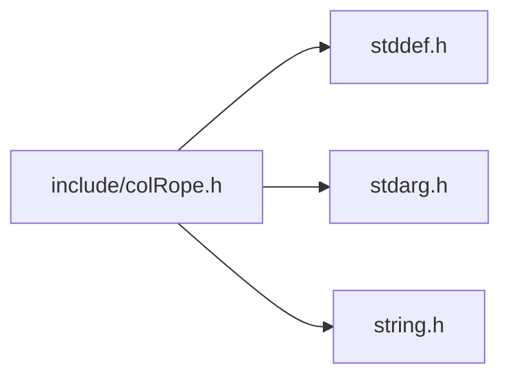
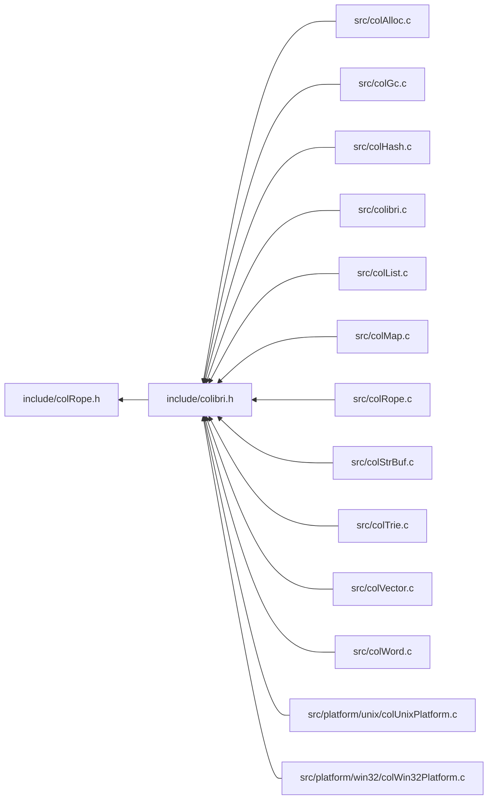

<a id="col_rope_8h"></a>
# File colRope.h

![][C++]

**Location**: `include/colRope.h`

This header file defines the rope handling features of Colibri.

Ropes are a string datatype that allows for fast insertion, extraction and composition of strings. Internally they use self-balanced binary trees.


They are always immutable.

## Classes

* [Col\_RopeChunk](struct_col___rope_chunk.md#struct_col___rope_chunk)
* [ColRopeIterator](struct_col_rope_iterator.md#struct_col_rope_iterator)
* [Col\_CustomRopeType](struct_col___custom_rope_type.md#struct_col___custom_rope_type)
* [ColRopeIterator.chunk](struct_col_rope_iterator_8chunk.md#struct_col_rope_iterator_8chunk)
* [ColRopeIterator.chunk.current](union_col_rope_iterator_8chunk_8current.md#union_col_rope_iterator_8chunk_8current)
* [ColRopeIterator.chunk.current.access](struct_col_rope_iterator_8chunk_8current_8access.md#struct_col_rope_iterator_8chunk_8current_8access)
* [ColRopeIterator.chunk.current.direct](struct_col_rope_iterator_8chunk_8current_8direct.md#struct_col_rope_iterator_8chunk_8current_8direct)

## Includes

* <stddef.h>
* <stdarg.h>
* <string.h>



## Included by

* [include/colibri.h](colibri_8h.md#colibri_8h)



## Rope Creation

<a id="group__rope__words_1ga568cb9253484f41fa8fcbb58e24926d7"></a>
### Macro COL\_UCS

![][public]

```cpp
#define COL_UCS ([Col\_StringFormat](colibri_8h.md#group__strings_1ga125054104f6260ea3902e6e46ebfdfa0)) 0x24
```

When passed to [Col\_NewRope()](col_rope_8h.md#group__rope__words_1gadf89e360729ba5052887cd4897b0167f) or [Col\_NormalizeRope()](col_rope_8h.md#group__rope__words_1gad8e0ed73e9d579e9aac9bd5ee7603319), use the shortest possible fixed-width format.

Input format is always [COL\_UCS4](colibri_8h.md#group__strings_1gga125054104f6260ea3902e6e46ebfdfa0af1d4922d36f7509d8936b0af29b0a9e4).


?> Numeric value is chosen so that the lower 3 bits give the character width in the data chunk.


<a id="group__rope__words_1gac89e756ecb28842e1eb50327270408f3"></a>
### Function Col\_EmptyRope

![][public]

```cpp
Col_Word Col_EmptyRope()
```

Return an empty rope.

The returned word is immediate and constant, which means that it consumes no memory and its value can be safely compared and stored in static storage.


**Returns**:

The empty rope.


**Return type**: EXTERN [Col\_Word](col_word_8h.md#group__words_1gadb626f9e195212e4fdfba7df154ad043)

**References**:

* [WORD\_SMALLSTR\_EMPTY](col_word_int_8h.md#group__smallstr__words_1gaced4b5ab427a8009e9e3586f60cf487f)

<a id="group__rope__words_1ga6904ba10bcedc80ff75dd6d775679bdc"></a>
### Function Col\_NewRopeFromString

![][public]

```cpp
Col_Word Col_NewRopeFromString(const char *string)
```

Create a new rope from a C string.

The string is treated as an UCS1 character buffer whose length is computed with **strlen()** and is passed to Col_NewRope.


**Returns**:

A new rope containing the character data.


**See also**: [Col\_NewRope](col_rope_8h.md#group__rope__words_1gadf89e360729ba5052887cd4897b0167f)


**Parameters**:

* const char * **string**: C string to build rope from.

**Return type**: EXTERN [Col\_Word](col_word_8h.md#group__words_1gadb626f9e195212e4fdfba7df154ad043)

**References**:

* [Col\_NewRope](col_rope_8h.md#group__rope__words_1gadf89e360729ba5052887cd4897b0167f)
* [COL\_UCS1](colibri_8h.md#group__strings_1gga125054104f6260ea3902e6e46ebfdfa0a18ed97ba951a5d02c0a6e039445235b8)

<a id="group__rope__words_1ga41d52ca5141a365cf9df75178796b2ea"></a>
### Function Col\_NewCharWord

![][public]

```cpp
Col_Word Col_NewCharWord(Col_Char c)
```

Create a new rope from a single character.

Use adaptive format.


**Returns**:

A new rope made of the single character.


**See also**: [Col\_NewRope](col_rope_8h.md#group__rope__words_1gadf89e360729ba5052887cd4897b0167f), [Col\_CharWordValue](col_rope_8h.md#group__rope__words_1ga340bac62f22ac611e3c3bb27e5b7b56a)


**Parameters**:

* [Col\_Char](colibri_8h.md#group__strings_1gab42ee0cd75b78280e412fa5bae5eb862) **c**: Character.

**Return type**: EXTERN [Col\_Word](col_word_8h.md#group__words_1gadb626f9e195212e4fdfba7df154ad043)

**References**:

* [RopeChunkTraverseInfo::c](struct_rope_chunk_traverse_info.md#struct_rope_chunk_traverse_info_1aecc47cd8ed42929d0412acbbf9254880)
* [COL\_CHAR1\_MAX](colibri_8h.md#group__strings_1gab5bcfc6f2e396458bfca5cc643248427)
* [COL\_CHAR2\_MAX](colibri_8h.md#group__strings_1ga20750ccf04ae493b5c1cf9a9c3406157)
* [COL\_CHAR\_MAX](colibri_8h.md#group__strings_1gae744cbeec6aaa53c56f5d30b035c2dde)
* [COL\_UCS1](colibri_8h.md#group__strings_1gga125054104f6260ea3902e6e46ebfdfa0a18ed97ba951a5d02c0a6e039445235b8)
* [COL\_UCS2](colibri_8h.md#group__strings_1gga125054104f6260ea3902e6e46ebfdfa0ae43fbe04c500f0868e4b95a669a987e0)
* [COL\_UCS4](colibri_8h.md#group__strings_1gga125054104f6260ea3902e6e46ebfdfa0af1d4922d36f7509d8936b0af29b0a9e4)
* [WORD\_CHAR\_NEW](col_word_int_8h.md#group__char__words_1ga3e1012ee747ef755581f098b55cde3c7)
* [WORD\_SMALLSTR\_EMPTY](col_word_int_8h.md#group__smallstr__words_1gaced4b5ab427a8009e9e3586f60cf487f)

**Referenced by**:

* [Col\_NewRope](col_rope_8h.md#group__rope__words_1gadf89e360729ba5052887cd4897b0167f)
* [Col\_NormalizeRope](col_rope_8h.md#group__rope__words_1gad8e0ed73e9d579e9aac9bd5ee7603319)

<a id="group__rope__words_1gadf89e360729ba5052887cd4897b0167f"></a>
### Function Col\_NewRope

![][public]

```cpp
Col_Word Col_NewRope(Col_StringFormat format, const void *data, size_t byteLength)
```

Create a new rope from flat character data.

This can either be a single leaf rope containing the whole data, or a concatenation of leaves if data is too large.


If the string contains a single Unicode char, or if the string is 8-bit clean and is sufficiently small, return an immediate value instead of allocating memory.


If the original string is too large, data may span several multi-cell leaf ropes. In this case we recursively split the data in half and build a concat tree.


**Returns**:

A new rope containing the character data.


**Parameters**:

* [Col\_StringFormat](colibri_8h.md#group__strings_1ga125054104f6260ea3902e6e46ebfdfa0) **format**: Format of data in buffer. if [COL\_UCS](col_rope_8h.md#group__rope__words_1ga568cb9253484f41fa8fcbb58e24926d7), data is provided as with [COL\_UCS4](colibri_8h.md#group__strings_1gga125054104f6260ea3902e6e46ebfdfa0af1d4922d36f7509d8936b0af29b0a9e4) but will use [COL\_UCS1](colibri_8h.md#group__strings_1gga125054104f6260ea3902e6e46ebfdfa0a18ed97ba951a5d02c0a6e039445235b8) or [COL\_UCS2](colibri_8h.md#group__strings_1gga125054104f6260ea3902e6e46ebfdfa0ae43fbe04c500f0868e4b95a669a987e0) if data fits.
* const void * **data**: Buffer containing flat data.
* size_t **byteLength**: Length of data in bytes.

**Return type**: EXTERN [Col\_Word](col_word_8h.md#group__words_1gadb626f9e195212e4fdfba7df154ad043)

**References**:

* [AllocCells](col_gc_8c.md#group__alloc_1gaeec69115deeb3321bdfbb4e42119f806)
* [CHAR\_WIDTH](col_internal_8h.md#group__strings_1gaf5aa639fca28d7d2fa2ab575d2aa9612)
* [COL\_CHAR1\_MAX](colibri_8h.md#group__strings_1gab5bcfc6f2e396458bfca5cc643248427)
* [COL\_CHAR2\_MAX](colibri_8h.md#group__strings_1ga20750ccf04ae493b5c1cf9a9c3406157)
* [Col\_ConcatRopes](col_rope_8h.md#group__rope__words_1gaafab3ef159c0b11402cc50c91fc59700)
* [Col\_NewCharWord](col_rope_8h.md#group__rope__words_1ga41d52ca5141a365cf9df75178796b2ea)
* [COL\_UCS](col_rope_8h.md#group__rope__words_1ga568cb9253484f41fa8fcbb58e24926d7)
* [COL\_UCS1](colibri_8h.md#group__strings_1gga125054104f6260ea3902e6e46ebfdfa0a18ed97ba951a5d02c0a6e039445235b8)
* [COL\_UCS2](colibri_8h.md#group__strings_1gga125054104f6260ea3902e6e46ebfdfa0ae43fbe04c500f0868e4b95a669a987e0)
* [COL\_UCS4](colibri_8h.md#group__strings_1gga125054104f6260ea3902e6e46ebfdfa0af1d4922d36f7509d8936b0af29b0a9e4)
* [COL\_UTF16](colibri_8h.md#group__strings_1gga125054104f6260ea3902e6e46ebfdfa0ad926084d627f96e4d65a353daef34854)
* [Col\_Utf16Next](colibri_8h.md#group__strings_1ga8996e8aad9616731b75cd6b66c9f57f7)
* [Col\_Utf16Prev](colibri_8h.md#group__strings_1ga674a0094a0990b74f91717c8970903bd)
* [COL\_UTF8](colibri_8h.md#group__strings_1gga125054104f6260ea3902e6e46ebfdfa0ac5f7c75663139add735ce90077cef306)
* [Col\_Utf8Next](colibri_8h.md#group__strings_1ga2fa6a9667e4b8e840c3a787f57754f87)
* [Col\_Utf8Prev](colibri_8h.md#group__strings_1ga84eeec1507e04c1bce7743bde002b660)
* [FORMAT\_UTF](col_internal_8h.md#group__strings_1ga1ab6a0c4fda028e13b3b6d3531538f15)
* [RopeChunkTraverseInfo::rope](struct_rope_chunk_traverse_info.md#struct_rope_chunk_traverse_info_1a80faebac21e5a340b109ab156f2432a4)
* [SMALLSTR\_MAX\_LENGTH](col_word_int_8h.md#group__smallstr__words_1ga465e96e908ab71872527b13453fda803)
* [UCSSTR\_MAX\_LENGTH](col_rope_int_8h.md#group__ucsstr__words_1gacf26d3e514c09e967a7120f031f7d184)
* [UCSSTR\_SIZE](col_rope_int_8h.md#group__ucsstr__words_1gaaac90786862f40e08eac7734465ec132)
* [UTFSTR\_MAX\_BYTELENGTH](col_rope_int_8h.md#group__utfstr__words_1ga280e86ac3ab3388ac552f03d2196584c)
* [UTFSTR\_SIZE](col_rope_int_8h.md#group__utfstr__words_1ga00f51041c27e8cfcfe2da5e22795cb0c)
* [WORD\_CHAR\_NEW](col_word_int_8h.md#group__char__words_1ga3e1012ee747ef755581f098b55cde3c7)
* [WORD\_SMALLSTR\_DATA](col_word_int_8h.md#group__smallstr__words_1ga0895416dca7181737047c535c2f6edee)
* [WORD\_SMALLSTR\_EMPTY](col_word_int_8h.md#group__smallstr__words_1gaced4b5ab427a8009e9e3586f60cf487f)
* [WORD\_SMALLSTR\_SET\_LENGTH](col_word_int_8h.md#group__smallstr__words_1gadf6c0a3a5c0d10bdff25627332aa16a6)
* [WORD\_UCSSTR\_DATA](col_rope_int_8h.md#group__ucsstr__words_1ga72e52b45c2851e4038089248df5ceddf)
* [WORD\_UCSSTR\_INIT](col_rope_int_8h.md#group__ucsstr__words_1gae02e5fdcadce075a6d7891b923633ecf)
* [WORD\_UTFSTR\_DATA](col_rope_int_8h.md#group__utfstr__words_1ga54f4a0ffe3636b2e29185ca90c342876)
* [WORD\_UTFSTR\_INIT](col_rope_int_8h.md#group__utfstr__words_1gab6c2e0088ebce6cd847ed1fbd6fe1acb)

**Referenced by**:

* [Col\_ConcatRopes](col_rope_8h.md#group__rope__words_1gaafab3ef159c0b11402cc50c91fc59700)
* [Col\_NewRopeFromString](col_rope_8h.md#group__rope__words_1ga6904ba10bcedc80ff75dd6d775679bdc)
* [Col\_NormalizeRope](col_rope_8h.md#group__rope__words_1gad8e0ed73e9d579e9aac9bd5ee7603319)
* [Col\_Subrope](col_rope_8h.md#group__rope__words_1ga688a99f26c500c1f65f4141e97de0335)
* [CommitBuffer](col_str_buf_8c.md#group__strbuf__words_1ga679d9a4fab2d369567c364325d0e7af5)

<a id="group__rope__words_1gad8e0ed73e9d579e9aac9bd5ee7603319"></a>
### Function Col\_NormalizeRope

![][public]

```cpp
Col_Word Col_NormalizeRope(Col_Word rope, Col_StringFormat format, Col_Char replace, int flatten)
```

Create a copy of a rope using a given target format.

Unrepresentable characters (i.e. whose codepoint is too large to fit the target representation) can be skipped or replaced by a replacement character. The rope is converted chunk-wise (i.e. subropes that have the right format remain unchanged) but can optionally be flattened to form a single chunk (or several concatenated chunks for larger strings).


Immediate representations are used as long as they match the format.


Custom ropes are always converted whatever their format.


**Returns**:

A new rope containing the character data in the target format.


**See also**: [Col\_NewRope](col_rope_8h.md#group__rope__words_1gadf89e360729ba5052887cd4897b0167f)

**Exceptions**:

* **[COL\_ERROR\_ROPE](colibri_8h.md#group__error_1gga729084542ed9eae62009a84d3379ef35aea3a7d079cdddc4cc3b6768a83ef47f4)**: [[T]](colibri_8h.md#group__error_1gga6dab009a0b8c4b4fa080cb9ba1859e9ea603a58b9d5bb16fde0708eb0767e4904) **rope**: Not a rope.

**Parameters**:

* [Col\_Word](col_word_8h.md#group__words_1gadb626f9e195212e4fdfba7df154ad043) **rope**: Rope to copy.
* [Col\_StringFormat](colibri_8h.md#group__strings_1ga125054104f6260ea3902e6e46ebfdfa0) **format**: Target format (see [Col\_StringFormat](colibri_8h.md#group__strings_1ga125054104f6260ea3902e6e46ebfdfa0) and [COL\_UCS](col_rope_8h.md#group__rope__words_1ga568cb9253484f41fa8fcbb58e24926d7)).
* [Col\_Char](colibri_8h.md#group__strings_1gab42ee0cd75b78280e412fa5bae5eb862) **replace**: Replacement characters for unrepresentable codepoints, or [COL\_CHAR\_INVALID](colibri_8h.md#group__strings_1ga7d5dc9bdb8de819c861ee5d4a3300ae1) to skip.
* int **flatten**: If true, flatten ropes into large string arrays, else keep ropes fitting the target format whatever their structure.

**Return type**: EXTERN [Col\_Word](col_word_8h.md#group__words_1gadb626f9e195212e4fdfba7df154ad043)

**References**:

* [AllocCells](col_gc_8c.md#group__alloc_1gaeec69115deeb3321bdfbb4e42119f806)
* [ASSERT](col_internal_8h.md#group__error_1gac22830a985e1daed0c9eadba8c6f606e)
* [CHAR\_WIDTH](col_internal_8h.md#group__strings_1gaf5aa639fca28d7d2fa2ab575d2aa9612)
* [COL\_CHAR1\_MAX](colibri_8h.md#group__strings_1gab5bcfc6f2e396458bfca5cc643248427)
* [COL\_CHAR2\_MAX](colibri_8h.md#group__strings_1ga20750ccf04ae493b5c1cf9a9c3406157)
* [COL\_CHAR\_INVALID](colibri_8h.md#group__strings_1ga7d5dc9bdb8de819c861ee5d4a3300ae1)
* [Col\_ConcatRopes](col_rope_8h.md#group__rope__words_1gaafab3ef159c0b11402cc50c91fc59700)
* [Col\_NewCharWord](col_rope_8h.md#group__rope__words_1ga41d52ca5141a365cf9df75178796b2ea)
* [Col\_NewRope](col_rope_8h.md#group__rope__words_1gadf89e360729ba5052887cd4897b0167f)
* [Col\_RopeLength](col_rope_8h.md#group__rope__words_1ga19acc7c753b0f7b55287b11360259a16)
* [Col\_Subrope](col_rope_8h.md#group__rope__words_1ga688a99f26c500c1f65f4141e97de0335)
* [Col\_TraverseRopeChunks](col_rope_8h.md#group__rope__words_1ga1a0bffff5bb042717914fadb3e8501bb)
* [COL\_UCS](col_rope_8h.md#group__rope__words_1ga568cb9253484f41fa8fcbb58e24926d7)
* [COL\_UCS1](colibri_8h.md#group__strings_1gga125054104f6260ea3902e6e46ebfdfa0a18ed97ba951a5d02c0a6e039445235b8)
* [COL\_UCS2](colibri_8h.md#group__strings_1gga125054104f6260ea3902e6e46ebfdfa0ae43fbe04c500f0868e4b95a669a987e0)
* [COL\_UCS4](colibri_8h.md#group__strings_1gga125054104f6260ea3902e6e46ebfdfa0af1d4922d36f7509d8936b0af29b0a9e4)
* [COL\_UTF16](colibri_8h.md#group__strings_1gga125054104f6260ea3902e6e46ebfdfa0ad926084d627f96e4d65a353daef34854)
* [COL\_UTF8](colibri_8h.md#group__strings_1gga125054104f6260ea3902e6e46ebfdfa0ac5f7c75663139add735ce90077cef306)
* [CopyDataInfo::data](struct_copy_data_info.md#struct_copy_data_info_1ad961284b124de229ed1da10962ac9c23)
* [FORMAT\_UTF](col_internal_8h.md#group__strings_1ga1ab6a0c4fda028e13b3b6d3531538f15)
* [IsCompatible](col_rope_8c.md#group__rope__words_1ga3736a184999164945b4d52541a1bbc6e)
* [CopyDataInfo::replace](struct_copy_data_info.md#struct_copy_data_info_1aad25196c1265387e0213724f44f24eea)
* [SMALLSTR\_MAX\_LENGTH](col_word_int_8h.md#group__smallstr__words_1ga465e96e908ab71872527b13453fda803)
* [TYPECHECK\_ROPE](col_rope_int_8h.md#group__rope__words_1ga18a6a8b88308afe7fbe90df026669b38)
* [Ucs1ComputeLengthProc](col_rope_8c.md#group__rope__words_1ga240868fcf7561b8009dde16401747e2d)
* [Ucs1CopyDataProc](col_rope_8c.md#group__rope__words_1ga10ab42b79a27129c5b2cf5ad0e0b261d)
* [Ucs2ComputeLengthProc](col_rope_8c.md#group__rope__words_1gaa058721c03751bb068a479c88518b7d2)
* [Ucs2CopyDataProc](col_rope_8c.md#group__rope__words_1ga61c8cb8089c0662dec71f99fcbed77e0)
* [Ucs4CopyDataProc](col_rope_8c.md#group__rope__words_1ga5cdbfa1993b834d2fbf3082280be139d)
* [UcsComputeFormatProc](col_rope_8c.md#group__rope__words_1ga98e01b4cb68b2d66ca88570ad3181ecb)
* [UCSSTR\_MAX\_LENGTH](col_rope_int_8h.md#group__ucsstr__words_1gacf26d3e514c09e967a7120f031f7d184)
* [UCSSTR\_SIZE](col_rope_int_8h.md#group__ucsstr__words_1gaaac90786862f40e08eac7734465ec132)
* [Utf16ComputeByteLengthProc](col_rope_8c.md#group__rope__words_1gaa0c769655c28d91094e7cedc22940753)
* [Utf16CopyDataProc](col_rope_8c.md#group__rope__words_1gaf089cd3a00689db3e9600b46c21f2867)
* [Utf8ComputeByteLengthProc](col_rope_8c.md#group__rope__words_1ga10418e35f56a3c89469613771512e69d)
* [Utf8CopyDataProc](col_rope_8c.md#group__rope__words_1gabea358803d83ed946db99def78568831)
* [UTFSTR\_MAX\_BYTELENGTH](col_rope_int_8h.md#group__utfstr__words_1ga280e86ac3ab3388ac552f03d2196584c)
* [UTFSTR\_SIZE](col_rope_int_8h.md#group__utfstr__words_1ga00f51041c27e8cfcfe2da5e22795cb0c)
* [WORD\_CHAR\_CP](col_word_int_8h.md#group__char__words_1ga56cddd2dee0e6afab1ee29c2f83f33ab)
* [WORD\_CHAR\_NEW](col_word_int_8h.md#group__char__words_1ga3e1012ee747ef755581f098b55cde3c7)
* [WORD\_CHAR\_WIDTH](col_word_int_8h.md#group__char__words_1ga92aceea828352d3433d76c193f259a1c)
* [WORD\_CONCATROPE\_LEFT](col_rope_int_8h.md#group__concatrope__words_1ga2af5901b1cf501c31b3f5593332bb68f)
* [WORD\_CONCATROPE\_RIGHT](col_rope_int_8h.md#group__concatrope__words_1ga587823d297e401d584898411bc44d8d3)
* [WORD\_NIL](col_word_8h.md#group__words_1ga29e370264f4e5659ccc5be4de209f065)
* [WORD\_SMALLSTR\_DATA](col_word_int_8h.md#group__smallstr__words_1ga0895416dca7181737047c535c2f6edee)
* [WORD\_SMALLSTR\_EMPTY](col_word_int_8h.md#group__smallstr__words_1gaced4b5ab427a8009e9e3586f60cf487f)
* [WORD\_SMALLSTR\_LENGTH](col_word_int_8h.md#group__smallstr__words_1gad314e3ed08cf8450986fec6ac88a0e11)
* [WORD\_SMALLSTR\_SET\_LENGTH](col_word_int_8h.md#group__smallstr__words_1gadf6c0a3a5c0d10bdff25627332aa16a6)
* [WORD\_SUBROPE\_DEPTH](col_rope_int_8h.md#group__subrope__words_1ga79860a542687768ee7965f5c8bd86b2a)
* [WORD\_SUBROPE\_FIRST](col_rope_int_8h.md#group__subrope__words_1ga6db22689c9aec5c74206bddd98abad70)
* [WORD\_SUBROPE\_LAST](col_rope_int_8h.md#group__subrope__words_1ga72a89875578dffdc0ce1029b078ae2c9)
* [WORD\_SUBROPE\_SOURCE](col_rope_int_8h.md#group__subrope__words_1ga78e40e3bc8f132eb513198bffd78b644)
* [WORD\_TYPE](col_word_int_8h.md#group__words_1ga014e27ea4160eb3845ac495a22c232f5)
* [WORD\_TYPE\_CHARBOOL](col_word_int_8h.md#group__words_1ga1422c37e0c7d668fad81b0710863dad5)
* [WORD\_TYPE\_CONCATROPE](col_word_int_8h.md#group__words_1ga677525993a1e4a934e98042c53021c3a)
* [WORD\_TYPE\_CUSTOM](col_word_int_8h.md#group__words_1ga8babfbc77291680db519873c91efdd4c)
* [WORD\_TYPE\_SMALLSTR](col_word_int_8h.md#group__words_1ga4148e4b4a03bff2e7715274ae4b126eb)
* [WORD\_TYPE\_SUBROPE](col_word_int_8h.md#group__words_1gaadd34ba690f1e2711ee1b6ae965fd8e7)
* [WORD\_TYPE\_UCSSTR](col_word_int_8h.md#group__words_1ga3a96c4366162e66944451d0b2ddb9221)
* [WORD\_TYPE\_UTFSTR](col_word_int_8h.md#group__words_1gaed71812c790125f3aeb204e6ba4f55b4)
* [WORD\_UCSSTR\_DATA](col_rope_int_8h.md#group__ucsstr__words_1ga72e52b45c2851e4038089248df5ceddf)
* [WORD\_UCSSTR\_FORMAT](col_rope_int_8h.md#group__ucsstr__words_1gab71309e620c0b5eb4f3ade931103223f)
* [WORD\_UCSSTR\_INIT](col_rope_int_8h.md#group__ucsstr__words_1gae02e5fdcadce075a6d7891b923633ecf)
* [WORD\_UTFSTR\_DATA](col_rope_int_8h.md#group__utfstr__words_1ga54f4a0ffe3636b2e29185ca90c342876)
* [WORD\_UTFSTR\_FORMAT](col_rope_int_8h.md#group__utfstr__words_1ga3405010b5b366fe5f7f87af019d84536)
* [WORD\_UTFSTR\_INIT](col_rope_int_8h.md#group__utfstr__words_1gab6c2e0088ebce6cd847ed1fbd6fe1acb)

**Referenced by**:

* [Col\_StringBufferAppendRope](col_str_buf_8h.md#group__strbuf__words_1ga714dd6c258d3b715915d29d1b83d0cfa)

## Rope Accessors

<a id="group__rope__words_1ga340bac62f22ac611e3c3bb27e5b7b56a"></a>
### Function Col\_CharWordValue

![][public]

```cpp
Col_Char Col_CharWordValue(Col_Word ch)
```

Get codepoint value of character word.

**Returns**:

The codepoint.


**See also**: [Col\_NewCharWord](col_rope_8h.md#group__rope__words_1ga41d52ca5141a365cf9df75178796b2ea)

**Exceptions**:

* **[COL\_ERROR\_CHAR](colibri_8h.md#group__error_1gga729084542ed9eae62009a84d3379ef35a336970cfb68532435a61ff5e30def4e9)**: [[T]](colibri_8h.md#group__error_1gga6dab009a0b8c4b4fa080cb9ba1859e9ea603a58b9d5bb16fde0708eb0767e4904) **ch**: Not a character word.

**Parameters**:

* [Col\_Word](col_word_8h.md#group__words_1gadb626f9e195212e4fdfba7df154ad043) **ch**: Character word to get value for.

**Return type**: EXTERN [Col\_Char](colibri_8h.md#group__strings_1gab42ee0cd75b78280e412fa5bae5eb862)

**References**:

* [COL\_CHAR\_INVALID](colibri_8h.md#group__strings_1ga7d5dc9bdb8de819c861ee5d4a3300ae1)
* [TYPECHECK\_CHAR](col_rope_int_8h.md#group__rope__words_1ga4cb2cb567fda262f527bbea46d532e17)
* [WORD\_CHAR\_CP](col_word_int_8h.md#group__char__words_1ga56cddd2dee0e6afab1ee29c2f83f33ab)
* [WORD\_UNWRAP](col_word_int_8h.md#group__word__wrappers_1ga5278e42908e256bb743954bf7745d06c)

<a id="group__rope__words_1ga615c33c7debc250deb16457ee8821e5d"></a>
### Function Col\_StringWordFormat

![][public]

```cpp
Col_StringFormat Col_StringWordFormat(Col_Word string)
```

Get format of string word.

A string word is a rope made of a single leaf, i.e. a flat character array and not a binary tree of subropes and concat nodes.


**Returns**:

The format.

**Exceptions**:

* **[COL\_ERROR\_STRING](colibri_8h.md#group__error_1gga729084542ed9eae62009a84d3379ef35a1b27b71d27f64cf37c74e6776d86166f)**: [[T]](colibri_8h.md#group__error_1gga6dab009a0b8c4b4fa080cb9ba1859e9ea603a58b9d5bb16fde0708eb0767e4904) **string**: Not a string word.

**Parameters**:

* [Col\_Word](col_word_8h.md#group__words_1gadb626f9e195212e4fdfba7df154ad043) **string**: String word to get format for.

**Return type**: EXTERN [Col\_StringFormat](colibri_8h.md#group__strings_1ga125054104f6260ea3902e6e46ebfdfa0)

**References**:

* [ASSERT](col_internal_8h.md#group__error_1gac22830a985e1daed0c9eadba8c6f606e)
* [COL\_UCS1](colibri_8h.md#group__strings_1gga125054104f6260ea3902e6e46ebfdfa0a18ed97ba951a5d02c0a6e039445235b8)
* [TYPECHECK\_STRING](col_rope_int_8h.md#group__rope__words_1ga468488c8b6974e7247a3411e72a1f8ed)
* [WORD\_CHAR\_WIDTH](col_word_int_8h.md#group__char__words_1ga92aceea828352d3433d76c193f259a1c)
* [WORD\_TYPE](col_word_int_8h.md#group__words_1ga014e27ea4160eb3845ac495a22c232f5)
* [WORD\_TYPE\_CHARBOOL](col_word_int_8h.md#group__words_1ga1422c37e0c7d668fad81b0710863dad5)
* [WORD\_TYPE\_SMALLSTR](col_word_int_8h.md#group__words_1ga4148e4b4a03bff2e7715274ae4b126eb)
* [WORD\_TYPE\_UCSSTR](col_word_int_8h.md#group__words_1ga3a96c4366162e66944451d0b2ddb9221)
* [WORD\_TYPE\_UTFSTR](col_word_int_8h.md#group__words_1gaed71812c790125f3aeb204e6ba4f55b4)
* [WORD\_UCSSTR\_FORMAT](col_rope_int_8h.md#group__ucsstr__words_1gab71309e620c0b5eb4f3ade931103223f)
* [WORD\_UNWRAP](col_word_int_8h.md#group__word__wrappers_1ga5278e42908e256bb743954bf7745d06c)
* [WORD\_UTFSTR\_FORMAT](col_rope_int_8h.md#group__utfstr__words_1ga3405010b5b366fe5f7f87af019d84536)

<a id="group__rope__words_1ga19acc7c753b0f7b55287b11360259a16"></a>
### Function Col\_RopeLength

![][public]

```cpp
size_t Col_RopeLength(Col_Word rope)
```

Get the length of the rope.

**Returns**:

The rope length.

**Exceptions**:

* **[COL\_ERROR\_ROPE](colibri_8h.md#group__error_1gga729084542ed9eae62009a84d3379ef35aea3a7d079cdddc4cc3b6768a83ef47f4)**: [[T]](colibri_8h.md#group__error_1gga6dab009a0b8c4b4fa080cb9ba1859e9ea603a58b9d5bb16fde0708eb0767e4904) **rope**: Not a rope.

**Parameters**:

* [Col\_Word](col_word_8h.md#group__words_1gadb626f9e195212e4fdfba7df154ad043) **rope**: Rope to get length for.

**Return type**: EXTERN size_t

**References**:

* [ASSERT](col_internal_8h.md#group__error_1gac22830a985e1daed0c9eadba8c6f606e)
* [TYPECHECK\_ROPE](col_rope_int_8h.md#group__rope__words_1ga18a6a8b88308afe7fbe90df026669b38)
* [WORD\_CHAR\_WIDTH](col_word_int_8h.md#group__char__words_1ga92aceea828352d3433d76c193f259a1c)
* [WORD\_CONCATROPE\_LENGTH](col_rope_int_8h.md#group__concatrope__words_1ga32f67b8d198ec4a90b371f0c51723bf5)
* [WORD\_SMALLSTR\_LENGTH](col_word_int_8h.md#group__smallstr__words_1gad314e3ed08cf8450986fec6ac88a0e11)
* [WORD\_SUBROPE\_FIRST](col_rope_int_8h.md#group__subrope__words_1ga6db22689c9aec5c74206bddd98abad70)
* [WORD\_SUBROPE\_LAST](col_rope_int_8h.md#group__subrope__words_1ga72a89875578dffdc0ce1029b078ae2c9)
* [WORD\_TYPE](col_word_int_8h.md#group__words_1ga014e27ea4160eb3845ac495a22c232f5)
* [WORD\_TYPE\_CHARBOOL](col_word_int_8h.md#group__words_1ga1422c37e0c7d668fad81b0710863dad5)
* [WORD\_TYPE\_CONCATROPE](col_word_int_8h.md#group__words_1ga677525993a1e4a934e98042c53021c3a)
* [WORD\_TYPE\_CUSTOM](col_word_int_8h.md#group__words_1ga8babfbc77291680db519873c91efdd4c)
* [WORD\_TYPE\_SMALLSTR](col_word_int_8h.md#group__words_1ga4148e4b4a03bff2e7715274ae4b126eb)
* [WORD\_TYPE\_SUBROPE](col_word_int_8h.md#group__words_1gaadd34ba690f1e2711ee1b6ae965fd8e7)
* [WORD\_TYPE\_UCSSTR](col_word_int_8h.md#group__words_1ga3a96c4366162e66944451d0b2ddb9221)
* [WORD\_TYPE\_UTFSTR](col_word_int_8h.md#group__words_1gaed71812c790125f3aeb204e6ba4f55b4)
* [WORD\_TYPEINFO](col_word_int_8h.md#group__custom__words_1gafc962791c45a5dd5bb034050444084be)
* [WORD\_UCSSTR\_LENGTH](col_rope_int_8h.md#group__ucsstr__words_1ga2de5d82b197dbd067fdd323532fc353d)
* [WORD\_UNWRAP](col_word_int_8h.md#group__word__wrappers_1ga5278e42908e256bb743954bf7745d06c)
* [WORD\_UTFSTR\_LENGTH](col_rope_int_8h.md#group__utfstr__words_1gacd5812fddcc3e5259e89b0a62ac1a238)

**Referenced by**:

* [Col\_CompareRopesL](col_rope_8h.md#group__rope__words_1ga3202ac5414ac22cc7627e0edefbba21c)
* [Col\_ConcatRopes](col_rope_8h.md#group__rope__words_1gaafab3ef159c0b11402cc50c91fc59700)
* [Col\_NormalizeRope](col_rope_8h.md#group__rope__words_1gad8e0ed73e9d579e9aac9bd5ee7603319)
* [Col\_RepeatRope](col_rope_8h.md#group__rope__words_1ga934627ff7dbfa6ba4a9f7824e9a83895)
* [Col\_RopeInsert](col_rope_8h.md#group__rope__words_1ga0bf2c4a83475bbc3fd36ab46f4a7cf96)
* [Col\_RopeIterBegin](col_rope_8h.md#group__rope__words_1ga3b8de67b364b05c3ba6e92d3f79ffeb1)
* [Col\_RopeIterFirst](col_rope_8h.md#group__rope__words_1gab3adca9b65daa62c81801065eaff2bde)
* [Col\_RopeIterLast](col_rope_8h.md#group__rope__words_1ga734fc68a33601edefa73fc93ba6c7189)
* [Col\_RopeRemove](col_rope_8h.md#group__rope__words_1ga107a45f2c36ba772229b3dff1e73e44a)
* [Col\_RopeSearch](col_rope_8h.md#group__rope__words_1gace5992731949e51b03afcb20527c95dd)
* [Col\_StringBufferAppendRope](col_str_buf_8h.md#group__strbuf__words_1ga714dd6c258d3b715915d29d1b83d0cfa)
* [Col\_StringBufferLength](col_str_buf_8h.md#group__strbuf__words_1gaf5e822c1d9b6d2fc959a62600d3edadc)
* [Col\_Subrope](col_rope_8h.md#group__rope__words_1ga688a99f26c500c1f65f4141e97de0335)
* [Col\_TraverseRopeChunks](col_rope_8h.md#group__rope__words_1ga1a0bffff5bb042717914fadb3e8501bb)
* [Col\_TraverseRopeChunksN](col_rope_8h.md#group__rope__words_1ga6cc41b66caa3cbce177085b49ec0139e)
* [ColRopeIterUpdateTraversalInfo](col_rope_8h.md#group__rope__words_1ga9c738d41b3d8577f7cdd0fa1880f9143)
* [GetArms](col_rope_8c.md#group__rope__words_1gaf2011402b9f853a70c819771185ff119)
* [GetChunk](col_rope_8c.md#group__rope__words_1gaf91ffc7dc85abe202e6c6946f27f3b06)
* [NextChunk](col_rope_8c.md#group__rope__words_1ga1afce7c7ad5cb705ecb4f0e8368aa9ae)

<a id="group__rope__words_1gab39b3e09b4d6c285c4cf0a894e2cd238"></a>
### Function Col\_RopeDepth

![][public]

```cpp
unsigned char Col_RopeDepth(Col_Word rope)
```

Get the depth of the rope.

**Returns**:

The rope depth.

**Exceptions**:

* **[COL\_ERROR\_ROPE](colibri_8h.md#group__error_1gga729084542ed9eae62009a84d3379ef35aea3a7d079cdddc4cc3b6768a83ef47f4)**: [[T]](colibri_8h.md#group__error_1gga6dab009a0b8c4b4fa080cb9ba1859e9ea603a58b9d5bb16fde0708eb0767e4904) **rope**: Not a rope.

**Parameters**:

* [Col\_Word](col_word_8h.md#group__words_1gadb626f9e195212e4fdfba7df154ad043) **rope**: Rope to get depth for.

**Return type**: EXTERN unsigned char

**References**:

* [GetDepth](col_rope_8c.md#group__rope__words_1ga2f303b1c148b4caaa697bf72fd93e85c)
* [TYPECHECK\_ROPE](col_rope_int_8h.md#group__rope__words_1ga18a6a8b88308afe7fbe90df026669b38)
* [WORD\_UNWRAP](col_word_int_8h.md#group__word__wrappers_1ga5278e42908e256bb743954bf7745d06c)

<a id="group__rope__words_1ga1dec8dd3d4d8563176a234f5cb9bc5ee"></a>
### Function Col\_RopeAt

![][public]

```cpp
Col_Char Col_RopeAt(Col_Word rope, size_t index)
```

Get the character codepoint of a rope at a given position.

**Return values**:

* **COL_CHAR_INVALID**: if **index** past end of **rope**.
* **code**: Unicode codepoint of the character otherwise.

**Exceptions**:

* **[COL\_ERROR\_ROPE](colibri_8h.md#group__error_1gga729084542ed9eae62009a84d3379ef35aea3a7d079cdddc4cc3b6768a83ef47f4)**: [[T]](colibri_8h.md#group__error_1gga6dab009a0b8c4b4fa080cb9ba1859e9ea603a58b9d5bb16fde0708eb0767e4904) **rope**: Not a rope.

**Parameters**:

* [Col\_Word](col_word_8h.md#group__words_1gadb626f9e195212e4fdfba7df154ad043) **rope**: Rope to get character from.
* size_t **index**: Character index.

**Return type**: EXTERN [Col\_Char](colibri_8h.md#group__strings_1gab42ee0cd75b78280e412fa5bae5eb862)

**References**:

* [COL\_CHAR\_INVALID](colibri_8h.md#group__strings_1ga7d5dc9bdb8de819c861ee5d4a3300ae1)
* [Col\_RopeIterAt](col_rope_8h.md#group__rope__words_1ga4b847f201fcffebbc3edd259608101cb)
* [Col\_RopeIterBegin](col_rope_8h.md#group__rope__words_1ga3b8de67b364b05c3ba6e92d3f79ffeb1)
* [Col\_RopeIterEnd](col_rope_8h.md#group__rope__words_1ga8abacbcdd87e4b0a3de70a9343a84688)
* [TYPECHECK\_ROPE](col_rope_int_8h.md#group__rope__words_1ga18a6a8b88308afe7fbe90df026669b38)

**Referenced by**:

* [Col\_RopeSearch](col_rope_8h.md#group__rope__words_1gace5992731949e51b03afcb20527c95dd)

## Rope Search and Comparison

<a id="group__rope__words_1ga549a61e9622fc532f08819ccf60639e6"></a>
### Macro Col\_RopeFindFirst

![][public]

```cpp
#define Col_RopeFindFirst         [Col\_RopeFind](col_rope_8h.md#group__rope__words_1ga5cb7658292e0e5ae51fe384ecdc6d6a9)((rope), (c), 0, SIZE_MAX, 0)( rope ,c )
```

Simple version of [Col\_RopeFind()](col_rope_8h.md#group__rope__words_1ga5cb7658292e0e5ae51fe384ecdc6d6a9), find first occurrence of a character in whole rope from its beginning.

This is the rope counterpart to C's **strchr**.


**Parameters**:

* **rope**: Rope to search character into.
* **c**: Character to search for.


**Return values**:

* **SIZE_MAX**: if not found (which is an invalid character index since this is the maximum rope length, and indices are zero-based)
* **index**: position of **subrope** in **rope**.


**See also**: [Col\_RopeFind](col_rope_8h.md#group__rope__words_1ga5cb7658292e0e5ae51fe384ecdc6d6a9)


<a id="group__rope__words_1gacc02819f3e67e558b5b02c797e48f90e"></a>
### Macro Col\_RopeFindFirstN

![][public]

```cpp
#define Col_RopeFindFirstN         [Col\_RopeFind](col_rope_8h.md#group__rope__words_1ga5cb7658292e0e5ae51fe384ecdc6d6a9)((rope), (c), 0, (max), 0)( rope ,c ,max )
```

Simple version of [Col\_RopeFind()](col_rope_8h.md#group__rope__words_1ga5cb7658292e0e5ae51fe384ecdc6d6a9), find first occurrence of a character in rope from its beginning up to a given number of characters.

This is the rope counterpart to C's **strnchr**.


**Parameters**:

* **rope**: Rope to search character into.
* **c**: Character to search for.
* **max**: Maximum number of characters to search.


**Return values**:

* **SIZE_MAX**: if not found (which is an invalid character index since this is the maximum rope length, and indices are zero-based)
* **index**: position of **c** in **rope**.


**See also**: [Col\_RopeFind](col_rope_8h.md#group__rope__words_1ga5cb7658292e0e5ae51fe384ecdc6d6a9)


<a id="group__rope__words_1gadb4b4e279e6b488efc8413434192617e"></a>
### Macro Col\_RopeFindLast

![][public]

```cpp
#define Col_RopeFindLast         [Col\_RopeFind](col_rope_8h.md#group__rope__words_1ga5cb7658292e0e5ae51fe384ecdc6d6a9)((rope), (c), SIZE_MAX, SIZE_MAX, 1)( rope ,c )
```

Simple version of [Col\_RopeFind()](col_rope_8h.md#group__rope__words_1ga5cb7658292e0e5ae51fe384ecdc6d6a9), find last occurrence of a character in whole rope from its end.

This is the rope counterpart to C's **strrchr**.


**Parameters**:

* **rope**: Rope to search character into.
* **c**: Character to search for.


**Return values**:

* **SIZE_MAX**: if not found (which is an invalid character index since this is the maximum rope length, and indices are zero-based)
* **index**: position of **c** in **rope**.


**See also**: [Col\_RopeFind](col_rope_8h.md#group__rope__words_1ga5cb7658292e0e5ae51fe384ecdc6d6a9)


<a id="group__rope__words_1ga14746f33c4059ac87b4e074ca0ee49db"></a>
### Macro Col\_RopeFindLastN

![][public]

```cpp
#define Col_RopeFindLastN         [Col\_RopeFind](col_rope_8h.md#group__rope__words_1ga5cb7658292e0e5ae51fe384ecdc6d6a9)((rope), (c), SIZE_MAX, (max), 1)( rope ,c ,max )
```

Simple version of [Col\_RopeFind()](col_rope_8h.md#group__rope__words_1ga5cb7658292e0e5ae51fe384ecdc6d6a9), find last occurrence of a character in rope from its end up to a given number of characters.

This function has no C counterpart and is provided for symmetry.


**Parameters**:

* **rope**: Rope to search character into.
* **c**: Character to search for.
* **max**: Maximum number of characters to search.


**Return values**:

* **SIZE_MAX**: if not found (which is an invalid character index since this is the maximum rope length, and indices are zero-based)
* **index**: position of **c** in **rope**.


**See also**: [Col\_RopeFind](col_rope_8h.md#group__rope__words_1ga5cb7658292e0e5ae51fe384ecdc6d6a9)


<a id="group__rope__words_1ga370b92b19777daa2f4a0ed7802fd9c46"></a>
### Macro Col\_RopeSearchFirst

![][public]

```cpp
#define Col_RopeSearchFirst         [Col\_RopeSearch](col_rope_8h.md#group__rope__words_1gace5992731949e51b03afcb20527c95dd)((rope), (subrope), 0, SIZE_MAX, 0)( rope ,subrope )
```

Simple version of [Col\_RopeSearch()](col_rope_8h.md#group__rope__words_1gace5992731949e51b03afcb20527c95dd), find first occurrence of a subrope in whole rope from its beginning.

This is the rope counterpart to C's **strstr**.


**Parameters**:

* **rope**: Rope to search subrope into.
* **subrope**: Subrope to search for.


**Return values**:

* **SIZE_MAX**: if not found (which is an invalid character index since this is the maximum rope length, and indices are zero-based)
* **index**: position of **subrope** in **rope**.


**See also**: [Col\_RopeSearch](col_rope_8h.md#group__rope__words_1gace5992731949e51b03afcb20527c95dd)


<a id="group__rope__words_1gae8f42ebc3f995422f72dda136a0371f1"></a>
### Macro Col\_RopeSearchLast

![][public]

```cpp
#define Col_RopeSearchLast         [Col\_RopeSearch](col_rope_8h.md#group__rope__words_1gace5992731949e51b03afcb20527c95dd)((rope), (subrope), SIZE_MAX, SIZE_MAX, 1)( rope ,subrope )
```

Simple version of [Col\_RopeSearch()](col_rope_8h.md#group__rope__words_1gace5992731949e51b03afcb20527c95dd), find last occurrence of a subrope in whole rope from its end.

This function has no C counterpart and is provided for symmetry.


**Parameters**:

* **rope**: Rope to search subrope into.
* **subrope**: Subrope to search for.


**Return values**:

* **SIZE_MAX**: if not found (which is an invalid character index since this is the maximum rope length, and indices are zero-based)
* **index**: position of **subrope** in **rope**.


**See also**: [Col\_RopeSearch](col_rope_8h.md#group__rope__words_1gace5992731949e51b03afcb20527c95dd)


<a id="group__rope__words_1ga48f2eb5b9cc86ff959c7b85827c3e1b7"></a>
### Macro Col\_CompareRopes

![][public]

```cpp
#define Col_CompareRopes         [Col\_CompareRopesL](col_rope_8h.md#group__rope__words_1ga3202ac5414ac22cc7627e0edefbba21c)((rope1), (rope2), 0, SIZE_MAX, NULL, NULL, NULL)( rope1 ,rope2 )
```

Simple version of [Col\_CompareRopesL()](col_rope_8h.md#group__rope__words_1ga3202ac5414ac22cc7627e0edefbba21c), compare two ropes.

This is the rope counterpart to C's **strcmp**.


**Parameters**:

* **rope1**: First rope to compare.
* **rope2**: Second rope to compare.


**Return values**:

* **zero**: if both ropes are identical
* **negative**: if **rope1** is lexically before **rope2**.
* **positive**: if **rope1** is lexically after **rope2**.


**See also**: [Col\_CompareRopesL](col_rope_8h.md#group__rope__words_1ga3202ac5414ac22cc7627e0edefbba21c)


<a id="group__rope__words_1ga340955d6d7b37bd6bd91216233907d9a"></a>
### Macro Col\_CompareRopesN

![][public]

```cpp
#define Col_CompareRopesN         [Col\_CompareRopesL](col_rope_8h.md#group__rope__words_1ga3202ac5414ac22cc7627e0edefbba21c)((rope1), (rope2), 0, (max), NULL, NULL, NULL)( rope1 ,rope2 ,max )
```

Simple version of [Col\_CompareRopesL()](col_rope_8h.md#group__rope__words_1ga3202ac5414ac22cc7627e0edefbba21c), compare two ropes up to a given number of characters.

This is the rope counterpart to C's **strncmp**.


**Parameters**:

* **rope1**: First rope to compare.
* **rope2**: Second rope to compare.
* **max**: Maximum number of characters to compare.


**Return values**:

* **zero**: if both ropes are identical
* **negative**: if **rope1** is lexically before **rope2**.
* **positive**: if **rope1** is lexically after **rope2**.


**See also**: [Col\_CompareRopesL](col_rope_8h.md#group__rope__words_1ga3202ac5414ac22cc7627e0edefbba21c)


<a id="group__rope__words_1ga5cb7658292e0e5ae51fe384ecdc6d6a9"></a>
### Function Col\_RopeFind

![][public]

```cpp
size_t Col_RopeFind(Col_Word rope, Col_Char c, size_t start, size_t max, int reverse)
```

Find first occurrence of a character in a rope.

**Return values**:

* **SIZE_MAX**: if not found (which is an invalid character index since this is the maximum rope length, and indices are zero-based)
* **index**: position of **c** in **rope**.

**Exceptions**:

* **[COL\_ERROR\_ROPE](colibri_8h.md#group__error_1gga729084542ed9eae62009a84d3379ef35aea3a7d079cdddc4cc3b6768a83ef47f4)**: [[T]](colibri_8h.md#group__error_1gga6dab009a0b8c4b4fa080cb9ba1859e9ea603a58b9d5bb16fde0708eb0767e4904) **rope**: Not a rope.

**Parameters**:

* [Col\_Word](col_word_8h.md#group__words_1gadb626f9e195212e4fdfba7df154ad043) **rope**: Rope to search character into.
* [Col\_Char](colibri_8h.md#group__strings_1gab42ee0cd75b78280e412fa5bae5eb862) **c**: Character to search for.
* size_t **start**: Starting index.
* size_t **max**: Maximum number of characters to search.
* int **reverse**: Whether to traverse in reverse order.

**Return type**: EXTERN size_t

**References**:

* [FindCharInfo::c](struct_find_char_info.md#struct_find_char_info_1a04dca1b4a32abe160673d959396543d7)
* [Col\_TraverseRopeChunks](col_rope_8h.md#group__rope__words_1ga1a0bffff5bb042717914fadb3e8501bb)
* [FindCharProc](col_rope_8c.md#group__rope__words_1gafb8374e5f7f739d98741621c4c56ed55)
* [FindCharInfo::pos](struct_find_char_info.md#struct_find_char_info_1aa86fa92344a6765bdfb7a621673ad049)
* [FindCharInfo::reverse](struct_find_char_info.md#struct_find_char_info_1a94b839a7e7802d92997811a8afc62b12)
* [TYPECHECK\_ROPE](col_rope_int_8h.md#group__rope__words_1ga18a6a8b88308afe7fbe90df026669b38)

**Referenced by**:

* [Col\_RopeSearch](col_rope_8h.md#group__rope__words_1gace5992731949e51b03afcb20527c95dd)

<a id="group__rope__words_1gace5992731949e51b03afcb20527c95dd"></a>
### Function Col\_RopeSearch

![][public]

```cpp
size_t Col_RopeSearch(Col_Word rope, Col_Word subrope, size_t start, size_t max, int reverse)
```

Find first occurrence of a subrope in a rope.

**Return values**:

* **SIZE_MAX**: if not found (which is an invalid character index since this is the maximum rope length, and indices are zero-based)
* **index**: position of **subrope** in **rope**.

**Exceptions**:

* **[COL\_ERROR\_ROPE](colibri_8h.md#group__error_1gga729084542ed9eae62009a84d3379ef35aea3a7d079cdddc4cc3b6768a83ef47f4)**: [[T]](colibri_8h.md#group__error_1gga6dab009a0b8c4b4fa080cb9ba1859e9ea603a58b9d5bb16fde0708eb0767e4904) **rope**: Not a rope.
* **[COL\_ERROR\_ROPE](colibri_8h.md#group__error_1gga729084542ed9eae62009a84d3379ef35aea3a7d079cdddc4cc3b6768a83ef47f4)**: [[T]](colibri_8h.md#group__error_1gga6dab009a0b8c4b4fa080cb9ba1859e9ea603a58b9d5bb16fde0708eb0767e4904) **subrope**: Not a rope.

**Parameters**:

* [Col\_Word](col_word_8h.md#group__words_1gadb626f9e195212e4fdfba7df154ad043) **rope**: Rope to search subrope into.
* [Col\_Word](col_word_8h.md#group__words_1gadb626f9e195212e4fdfba7df154ad043) **subrope**: Subrope to search for.
* size_t **start**: Starting index.
* size_t **max**: Maximum number of characters to search.
* int **reverse**: Whether to traverse in reverse order.

**Return type**: EXTERN size_t

**References**:

* [Col\_RopeAt](col_rope_8h.md#group__rope__words_1ga1dec8dd3d4d8563176a234f5cb9bc5ee)
* [Col\_RopeFind](col_rope_8h.md#group__rope__words_1ga5cb7658292e0e5ae51fe384ecdc6d6a9)
* [Col\_RopeLength](col_rope_8h.md#group__rope__words_1ga19acc7c753b0f7b55287b11360259a16)
* [Col\_TraverseRopeChunks](col_rope_8h.md#group__rope__words_1ga1a0bffff5bb042717914fadb3e8501bb)
* [SearchSubropeInfo::first](struct_search_subrope_info.md#struct_search_subrope_info_1aa6ffd54ef7223d4f7153775ef3661094)
* [SearchSubropeInfo::pos](struct_search_subrope_info.md#struct_search_subrope_info_1a68e716d34eb206c40936245ab774b6cd)
* [SearchSubropeInfo::reverse](struct_search_subrope_info.md#struct_search_subrope_info_1a6689adef49429bf217e4b7f434bad147)
* [SearchSubropeInfo::rope](struct_search_subrope_info.md#struct_search_subrope_info_1abfd66a3be58858bf453396deca1d2402)
* [SearchSubropeProc](col_rope_8c.md#group__rope__words_1gac469cb18ebe714917347f930c6951f41)
* [SearchSubropeInfo::subrope](struct_search_subrope_info.md#struct_search_subrope_info_1a5357a82233680c9f9033b0fb3cf0b4c8)
* [TYPECHECK\_ROPE](col_rope_int_8h.md#group__rope__words_1ga18a6a8b88308afe7fbe90df026669b38)

<a id="group__rope__words_1ga3202ac5414ac22cc7627e0edefbba21c"></a>
### Function Col\_CompareRopesL

![][public]

```cpp
int Col_CompareRopesL(Col_Word rope1, Col_Word rope2, size_t start, size_t max, size_t *posPtr, Col_Char *c1Ptr, Col_Char *c2Ptr)
```

Compare two ropes and find the first differing characters if any.

This is the rope counterpart to C's **strncmp** with extra features.


**Return values**:

* **0**: if both ropes are identical.
* **<0**: if first rope is lexically before second rope.
* **>0**: if first rope is lexically after second rope.

**Exceptions**:

* **[COL\_ERROR\_ROPE](colibri_8h.md#group__error_1gga729084542ed9eae62009a84d3379ef35aea3a7d079cdddc4cc3b6768a83ef47f4)**: [[T]](colibri_8h.md#group__error_1gga6dab009a0b8c4b4fa080cb9ba1859e9ea603a58b9d5bb16fde0708eb0767e4904) **rope1**: Not a rope.
* **[COL\_ERROR\_ROPE](colibri_8h.md#group__error_1gga729084542ed9eae62009a84d3379ef35aea3a7d079cdddc4cc3b6768a83ef47f4)**: [[T]](colibri_8h.md#group__error_1gga6dab009a0b8c4b4fa080cb9ba1859e9ea603a58b9d5bb16fde0708eb0767e4904) **rope2**: Not a rope.

**Parameters**:

* [Col\_Word](col_word_8h.md#group__words_1gadb626f9e195212e4fdfba7df154ad043) **rope1**: First rope to compare.
* [Col\_Word](col_word_8h.md#group__words_1gadb626f9e195212e4fdfba7df154ad043) **rope2**: Second rope to compare.
* size_t **start**: Starting index.
* size_t **max**: Maximum number of characters to compare.
* size_t * **posPtr**: [out] If non-NULL, position of the first differing character.
* [Col\_Char](colibri_8h.md#group__strings_1gab42ee0cd75b78280e412fa5bae5eb862) * **c1Ptr**: [out] If non-NULL, codepoint of differing character in first chunk.
* [Col\_Char](colibri_8h.md#group__strings_1gab42ee0cd75b78280e412fa5bae5eb862) * **c2Ptr**: [out] If non-NULL, codepoint of differing character in second chunk.

**Return type**: EXTERN int

**References**:

* [CompareChunksInfo::c1Ptr](struct_compare_chunks_info.md#struct_compare_chunks_info_1aa4bb2fd92a0fae519ca603730f11eb0f)
* [CompareChunksInfo::c2Ptr](struct_compare_chunks_info.md#struct_compare_chunks_info_1a0d2ea5f98cf8a8f19a8e0a3ec8e03a36)
* [Col\_RopeLength](col_rope_8h.md#group__rope__words_1ga19acc7c753b0f7b55287b11360259a16)
* [Col\_TraverseRopeChunksN](col_rope_8h.md#group__rope__words_1ga6cc41b66caa3cbce177085b49ec0139e)
* [CompareChunksProc](col_rope_8c.md#group__rope__words_1gaa0f078c09e57fc1f7ba7cdf5e80c7f9d)
* [CompareChunksInfo::posPtr](struct_compare_chunks_info.md#struct_compare_chunks_info_1a51bba1b3643bf5d59cabc426c249d8b8)
* [TYPECHECK\_ROPE](col_rope_int_8h.md#group__rope__words_1ga18a6a8b88308afe7fbe90df026669b38)
* [WORD\_UNWRAP](col_word_int_8h.md#group__word__wrappers_1ga5278e42908e256bb743954bf7745d06c)

**Referenced by**:

* [StringTrieMapFindNode](col_trie_8c.md#group__triemap__words_1ga7d5a67e353bf8772a706cffd1eba2692)

## Rope Operations

<a id="group__rope__words_1gabf17771a646dc7eb24990072cd499ca6"></a>
### Macro Col\_ConcatRopesV

![][public]

```cpp
#define Col_ConcatRopesV     _Col_ConcatRopesV(_,first, ##__VA_ARGS__)( first ,... )
```

Variadic macro version of [Col\_ConcatRopesNV()](col_rope_8h.md#group__rope__words_1ga913fe33c3a479d4f3de008bae5b1bf74) that deduces its number of arguments automatically.

**Parameters**:

* **first**: First rope to concatenate.
* **...**: Next ropes to concatenate.


**See also**: [COL\_ARGCOUNT](col_utils_8h.md#group__utils_1gabbb0e58841406f54d444d40625a2c4fe)


<a id="group__rope__words_1ga688a99f26c500c1f65f4141e97de0335"></a>
### Function Col\_Subrope

![][public]

```cpp
Col_Word Col_Subrope(Col_Word rope, size_t first, size_t last)
```

Create a new rope that is a subrope of another.

We try to minimize the overhead as much as possible, such as:
* identity.

* create leaf ropes for small subropes.

* subropes of subropes point to original data.

* subropes of concats point to the deepest superset subrope.


**Returns**:

When **first** is past the end of the rope, or **last** is before **first**, an empty rope. Else, a rope representing the subrope.

**Exceptions**:

* **[COL\_ERROR\_ROPE](colibri_8h.md#group__error_1gga729084542ed9eae62009a84d3379ef35aea3a7d079cdddc4cc3b6768a83ef47f4)**: [[T]](colibri_8h.md#group__error_1gga6dab009a0b8c4b4fa080cb9ba1859e9ea603a58b9d5bb16fde0708eb0767e4904) **rope**: Not a rope.

**Parameters**:

* [Col\_Word](col_word_8h.md#group__words_1gadb626f9e195212e4fdfba7df154ad043) **rope**: The rope to extract the subrope from.
* size_t **first**: Index of first character in subrope.
* size_t **last**: Index of last character in subrope.

**Return type**: EXTERN [Col\_Word](col_word_8h.md#group__words_1gadb626f9e195212e4fdfba7df154ad043)

**References**:

* [AllocCells](col_gc_8c.md#group__alloc_1gaeec69115deeb3321bdfbb4e42119f806)
* [ASSERT](col_internal_8h.md#group__error_1gac22830a985e1daed0c9eadba8c6f606e)
* [MergeRopeChunksInfo::byteLength](struct_merge_rope_chunks_info.md#struct_merge_rope_chunks_info_1a889f1160b5a99df78a69be735160ebc0)
* [CHAR\_WIDTH](col_internal_8h.md#group__strings_1gaf5aa639fca28d7d2fa2ab575d2aa9612)
* [Col\_NewRope](col_rope_8h.md#group__rope__words_1gadf89e360729ba5052887cd4897b0167f)
* [COL\_ROPE](col_word_8h.md#group__words_1ga64b6f74edaf16829f0083a21dddd4d93)
* [Col\_RopeLength](col_rope_8h.md#group__rope__words_1ga19acc7c753b0f7b55287b11360259a16)
* [Col\_TraverseRopeChunks](col_rope_8h.md#group__rope__words_1ga1a0bffff5bb042717914fadb3e8501bb)
* [COL\_UCS1](colibri_8h.md#group__strings_1gga125054104f6260ea3902e6e46ebfdfa0a18ed97ba951a5d02c0a6e039445235b8)
* [MergeRopeChunksInfo::data](struct_merge_rope_chunks_info.md#struct_merge_rope_chunks_info_1a6076ccd35f62ed7fc5331cee6e250f77)
* [MergeRopeChunksInfo::format](struct_merge_rope_chunks_info.md#struct_merge_rope_chunks_info_1a625645c02156390018fde6af588ec907)
* [MergeRopeChunksInfo::length](struct_merge_rope_chunks_info.md#struct_merge_rope_chunks_info_1ac2003de1c200f18c3bf5ab9a1bd12bd4)
* [MAX\_SHORT\_LEAF\_SIZE](col_rope_8c.md#group__rope__words_1ga8ab9482af041f6446b6bf0ff30f43d8c)
* [MergeRopeChunksProc](col_rope_8c.md#group__rope__words_1ga33ffefe10088e23594b6f76a1d65e184)
* [Col\_CustomRopeType::subropeProc](struct_col___custom_rope_type.md#struct_col___custom_rope_type_1a69f30a52f68d9df783c3ec876a19c5bf)
* [Col\_CustomRopeType::type](struct_col___custom_rope_type.md#struct_col___custom_rope_type_1ab1a54b63c4a00889da68065932c1f5df)
* [Col\_CustomWordType::type](struct_col___custom_word_type.md#struct_col___custom_word_type_1af9482efe5a6408bc622320619c3ccf9f)
* [TYPECHECK\_ROPE](col_rope_int_8h.md#group__rope__words_1ga18a6a8b88308afe7fbe90df026669b38)
* [UCSSTR\_HEADER\_SIZE](col_rope_int_8h.md#group__ucsstr__words_1ga04d9ab12584a6fc694c0949e52f481c5)
* [WORD\_CHAR\_WIDTH](col_word_int_8h.md#group__char__words_1ga92aceea828352d3433d76c193f259a1c)
* [WORD\_CONCATROPE\_DEPTH](col_rope_int_8h.md#group__concatrope__words_1gaf74129b430f17d52c86ee7d4e317fa5b)
* [WORD\_CONCATROPE\_LEFT](col_rope_int_8h.md#group__concatrope__words_1ga2af5901b1cf501c31b3f5593332bb68f)
* [WORD\_CONCATROPE\_LEFT\_LENGTH](col_rope_int_8h.md#group__concatrope__words_1ga1a1e048ea8091a88ced0ead88242b5b4)
* [WORD\_CONCATROPE\_RIGHT](col_rope_int_8h.md#group__concatrope__words_1ga587823d297e401d584898411bc44d8d3)
* [WORD\_NIL](col_word_8h.md#group__words_1ga29e370264f4e5659ccc5be4de209f065)
* [WORD\_SMALLSTR\_DATA](col_word_int_8h.md#group__smallstr__words_1ga0895416dca7181737047c535c2f6edee)
* [WORD\_SMALLSTR\_EMPTY](col_word_int_8h.md#group__smallstr__words_1gaced4b5ab427a8009e9e3586f60cf487f)
* [WORD\_SUBROPE\_FIRST](col_rope_int_8h.md#group__subrope__words_1ga6db22689c9aec5c74206bddd98abad70)
* [WORD\_SUBROPE\_INIT](col_rope_int_8h.md#group__subrope__words_1ga7515ed32b8448be528c6f71c73ad7b8d)
* [WORD\_SUBROPE\_SOURCE](col_rope_int_8h.md#group__subrope__words_1ga78e40e3bc8f132eb513198bffd78b644)
* [WORD\_TYPE](col_word_int_8h.md#group__words_1ga014e27ea4160eb3845ac495a22c232f5)
* [WORD\_TYPE\_CHARBOOL](col_word_int_8h.md#group__words_1ga1422c37e0c7d668fad81b0710863dad5)
* [WORD\_TYPE\_CONCATROPE](col_word_int_8h.md#group__words_1ga677525993a1e4a934e98042c53021c3a)
* [WORD\_TYPE\_CUSTOM](col_word_int_8h.md#group__words_1ga8babfbc77291680db519873c91efdd4c)
* [WORD\_TYPE\_SMALLSTR](col_word_int_8h.md#group__words_1ga4148e4b4a03bff2e7715274ae4b126eb)
* [WORD\_TYPE\_SUBROPE](col_word_int_8h.md#group__words_1gaadd34ba690f1e2711ee1b6ae965fd8e7)
* [WORD\_TYPE\_UCSSTR](col_word_int_8h.md#group__words_1ga3a96c4366162e66944451d0b2ddb9221)
* [WORD\_TYPEINFO](col_word_int_8h.md#group__custom__words_1gafc962791c45a5dd5bb034050444084be)
* [WORD\_UCSSTR\_DATA](col_rope_int_8h.md#group__ucsstr__words_1ga72e52b45c2851e4038089248df5ceddf)
* [WORD\_UCSSTR\_FORMAT](col_rope_int_8h.md#group__ucsstr__words_1gab71309e620c0b5eb4f3ade931103223f)
* [WORD\_UNWRAP](col_word_int_8h.md#group__word__wrappers_1ga5278e42908e256bb743954bf7745d06c)

**Referenced by**:

* [Col\_ConcatRopes](col_rope_8h.md#group__rope__words_1gaafab3ef159c0b11402cc50c91fc59700)
* [Col\_NormalizeRope](col_rope_8h.md#group__rope__words_1gad8e0ed73e9d579e9aac9bd5ee7603319)
* [Col\_RopeInsert](col_rope_8h.md#group__rope__words_1ga0bf2c4a83475bbc3fd36ab46f4a7cf96)
* [Col\_RopeRemove](col_rope_8h.md#group__rope__words_1ga107a45f2c36ba772229b3dff1e73e44a)
* [Col\_StringBufferAppendSequence](col_str_buf_8h.md#group__strbuf__words_1ga195c4aa02da672a1ccd60e99bf2f9927)
* [GetArms](col_rope_8c.md#group__rope__words_1gaf2011402b9f853a70c819771185ff119)

<a id="group__rope__words_1gaafab3ef159c0b11402cc50c91fc59700"></a>
### Function Col\_ConcatRopes

![][public]

```cpp
Col_Word Col_ConcatRopes(Col_Word left, Col_Word right)
```

Concatenate ropes.

Concatenation forms self-balanced binary trees. See [Rope Tree Balancing](#group__rope__words_1rope_tree_balancing) for more information.


**Returns**:

A rope representing the concatenation of both ropes.

**Exceptions**:

* **[COL\_ERROR\_ROPE](colibri_8h.md#group__error_1gga729084542ed9eae62009a84d3379ef35aea3a7d079cdddc4cc3b6768a83ef47f4)**: [[T]](colibri_8h.md#group__error_1gga6dab009a0b8c4b4fa080cb9ba1859e9ea603a58b9d5bb16fde0708eb0767e4904) **left**: Not a rope.
* **[COL\_ERROR\_ROPE](colibri_8h.md#group__error_1gga729084542ed9eae62009a84d3379ef35aea3a7d079cdddc4cc3b6768a83ef47f4)**: [[T]](colibri_8h.md#group__error_1gga6dab009a0b8c4b4fa080cb9ba1859e9ea603a58b9d5bb16fde0708eb0767e4904) **right**: Not a rope.
* **[COL\_ERROR\_ROPELENGTH\_CONCAT](colibri_8h.md#group__error_1gga729084542ed9eae62009a84d3379ef35a37a3a6924ed998d6803770696cc7d1dc)**: [[V]](colibri_8h.md#group__error_1gga6dab009a0b8c4b4fa080cb9ba1859e9ea65d5e7232c82ae6972ac56f386a32fc9) **length(left+right)**: Concat rope too large.

**Parameters**:

* [Col\_Word](col_word_8h.md#group__words_1gadb626f9e195212e4fdfba7df154ad043) **left**: Left part.
* [Col\_Word](col_word_8h.md#group__words_1gadb626f9e195212e4fdfba7df154ad043) **right**: Right part.

**Return type**: EXTERN [Col\_Word](col_word_8h.md#group__words_1gadb626f9e195212e4fdfba7df154ad043)

**References**:

* [AllocCells](col_gc_8c.md#group__alloc_1gaeec69115deeb3321bdfbb4e42119f806)
* [ASSERT](col_internal_8h.md#group__error_1gac22830a985e1daed0c9eadba8c6f606e)
* [MergeRopeChunksInfo::byteLength](struct_merge_rope_chunks_info.md#struct_merge_rope_chunks_info_1a889f1160b5a99df78a69be735160ebc0)
* [Col\_NewRope](col_rope_8h.md#group__rope__words_1gadf89e360729ba5052887cd4897b0167f)
* [COL\_ROPE](col_word_8h.md#group__words_1ga64b6f74edaf16829f0083a21dddd4d93)
* [Col\_RopeLength](col_rope_8h.md#group__rope__words_1ga19acc7c753b0f7b55287b11360259a16)
* [Col\_Subrope](col_rope_8h.md#group__rope__words_1ga688a99f26c500c1f65f4141e97de0335)
* [Col\_TraverseRopeChunks](col_rope_8h.md#group__rope__words_1ga1a0bffff5bb042717914fadb3e8501bb)
* [Col\_CustomRopeType::concatProc](struct_col___custom_rope_type.md#struct_col___custom_rope_type_1a6c5065d5970b033657bfeae20457bf82)
* [MergeRopeChunksInfo::data](struct_merge_rope_chunks_info.md#struct_merge_rope_chunks_info_1a6076ccd35f62ed7fc5331cee6e250f77)
* [MergeRopeChunksInfo::format](struct_merge_rope_chunks_info.md#struct_merge_rope_chunks_info_1a625645c02156390018fde6af588ec907)
* [GetArms](col_rope_8c.md#group__rope__words_1gaf2011402b9f853a70c819771185ff119)
* [GetDepth](col_rope_8c.md#group__rope__words_1ga2f303b1c148b4caaa697bf72fd93e85c)
* [MergeRopeChunksInfo::length](struct_merge_rope_chunks_info.md#struct_merge_rope_chunks_info_1ac2003de1c200f18c3bf5ab9a1bd12bd4)
* [MAX\_SHORT\_LEAF\_SIZE](col_rope_8c.md#group__rope__words_1ga8ab9482af041f6446b6bf0ff30f43d8c)
* [MergeRopeChunksProc](col_rope_8c.md#group__rope__words_1ga33ffefe10088e23594b6f76a1d65e184)
* [Col\_CustomRopeType::type](struct_col___custom_rope_type.md#struct_col___custom_rope_type_1ab1a54b63c4a00889da68065932c1f5df)
* [Col\_CustomWordType::type](struct_col___custom_word_type.md#struct_col___custom_word_type_1af9482efe5a6408bc622320619c3ccf9f)
* [TYPECHECK\_ROPE](col_rope_int_8h.md#group__rope__words_1ga18a6a8b88308afe7fbe90df026669b38)
* [VALUECHECK\_ROPELENGTH\_CONCAT](col_rope_int_8h.md#group__rope__words_1ga8a677146e8c85fdfea9fd87658d58bdb)
* [WORD\_CONCATROPE\_INIT](col_rope_int_8h.md#group__concatrope__words_1ga6f8d139b77fb5ab7a1e4f4f3afc6ceec)
* [WORD\_NIL](col_word_8h.md#group__words_1ga29e370264f4e5659ccc5be4de209f065)
* [WORD\_SUBROPE\_FIRST](col_rope_int_8h.md#group__subrope__words_1ga6db22689c9aec5c74206bddd98abad70)
* [WORD\_SUBROPE\_LAST](col_rope_int_8h.md#group__subrope__words_1ga72a89875578dffdc0ce1029b078ae2c9)
* [WORD\_SUBROPE\_SOURCE](col_rope_int_8h.md#group__subrope__words_1ga78e40e3bc8f132eb513198bffd78b644)
* [WORD\_TYPE](col_word_int_8h.md#group__words_1ga014e27ea4160eb3845ac495a22c232f5)
* [WORD\_TYPE\_CUSTOM](col_word_int_8h.md#group__words_1ga8babfbc77291680db519873c91efdd4c)
* [WORD\_TYPE\_SUBROPE](col_word_int_8h.md#group__words_1gaadd34ba690f1e2711ee1b6ae965fd8e7)
* [WORD\_TYPEINFO](col_word_int_8h.md#group__custom__words_1gafc962791c45a5dd5bb034050444084be)
* [WORD\_UNWRAP](col_word_int_8h.md#group__word__wrappers_1ga5278e42908e256bb743954bf7745d06c)

**Referenced by**:

* [Col\_ConcatRopesA](col_rope_8h.md#group__rope__words_1gaedea8f7a253aa3a5fa1f028ca7586a2e)
* [Col\_NewRope](col_rope_8h.md#group__rope__words_1gadf89e360729ba5052887cd4897b0167f)
* [Col\_NormalizeRope](col_rope_8h.md#group__rope__words_1gad8e0ed73e9d579e9aac9bd5ee7603319)
* [Col\_RepeatRope](col_rope_8h.md#group__rope__words_1ga934627ff7dbfa6ba4a9f7824e9a83895)
* [Col\_RopeInsert](col_rope_8h.md#group__rope__words_1ga0bf2c4a83475bbc3fd36ab46f4a7cf96)
* [Col\_RopeRemove](col_rope_8h.md#group__rope__words_1ga107a45f2c36ba772229b3dff1e73e44a)
* [Col\_StringBufferAppendRope](col_str_buf_8h.md#group__strbuf__words_1ga714dd6c258d3b715915d29d1b83d0cfa)
* [CommitBuffer](col_str_buf_8c.md#group__strbuf__words_1ga679d9a4fab2d369567c364325d0e7af5)

<a id="group__rope__words_1gaedea8f7a253aa3a5fa1f028ca7586a2e"></a>
### Function Col\_ConcatRopesA

![][public]

```cpp
Col_Word Col_ConcatRopesA(size_t number, const Col_Word *ropes)
```

Concatenate several ropes given in an array.

Concatenation is done recursively, by halving the array until it contains one or two elements, at this point we respectively return the element or use [Col\_ConcatRopes()](col_rope_8h.md#group__rope__words_1gaafab3ef159c0b11402cc50c91fc59700).


**Returns**:

A rope representing the concatenation of all ropes.

**Exceptions**:

* **[COL\_ERROR\_GENERIC](colibri_8h.md#group__error_1gga729084542ed9eae62009a84d3379ef35a02ae949dee6fd3c78c849d7e7af414e4)**: [[V]](colibri_8h.md#group__error_1gga6dab009a0b8c4b4fa080cb9ba1859e9ea65d5e7232c82ae6972ac56f386a32fc9) **number == 0**: Generic error.

**Parameters**:

* size_t **number**: Size of **ropes** array.
* const [Col\_Word](col_word_8h.md#group__words_1gadb626f9e195212e4fdfba7df154ad043) * **ropes**: Array of ropes to concatenate in order.

**Return type**: EXTERN [Col\_Word](col_word_8h.md#group__words_1gadb626f9e195212e4fdfba7df154ad043)

**References**:

* [Col\_ConcatRopes](col_rope_8h.md#group__rope__words_1gaafab3ef159c0b11402cc50c91fc59700)
* [COL\_ERROR\_GENERIC](colibri_8h.md#group__error_1gga729084542ed9eae62009a84d3379ef35a02ae949dee6fd3c78c849d7e7af414e4)
* [VALUECHECK](col_internal_8h.md#group__error_1ga711949fdb4e6c4bf5218075c1db5439b)
* [WORD\_NIL](col_word_8h.md#group__words_1ga29e370264f4e5659ccc5be4de209f065)

**Referenced by**:

* [Col\_ConcatRopesNV](col_rope_8h.md#group__rope__words_1ga913fe33c3a479d4f3de008bae5b1bf74)

<a id="group__rope__words_1ga913fe33c3a479d4f3de008bae5b1bf74"></a>
### Function Col\_ConcatRopesNV

![][public]

```cpp
Col_Word Col_ConcatRopesNV(size_t number, ...)
```

Concatenate ropes given as arguments.

The argument list is first copied into a stack-allocated array then passed to [Col\_ConcatRopesA()](col_rope_8h.md#group__rope__words_1gaedea8f7a253aa3a5fa1f028ca7586a2e).


**Returns**:

A rope representing the concatenation of all ropes.


**See also**: [Col\_ConcatRopesA](col_rope_8h.md#group__rope__words_1gaedea8f7a253aa3a5fa1f028ca7586a2e), [Col\_ConcatRopesV](col_rope_8h.md#group__rope__words_1gabf17771a646dc7eb24990072cd499ca6)

**Exceptions**:

* **[COL\_ERROR\_GENERIC](colibri_8h.md#group__error_1gga729084542ed9eae62009a84d3379ef35a02ae949dee6fd3c78c849d7e7af414e4)**: [[V]](colibri_8h.md#group__error_1gga6dab009a0b8c4b4fa080cb9ba1859e9ea65d5e7232c82ae6972ac56f386a32fc9) **number == 0**: Generic error.

**Parameters**:

* size_t **number**: Number of arguments following.
* ......: Ropes to concatenate in order.

**Return type**: EXTERN [Col\_Word](col_word_8h.md#group__words_1gadb626f9e195212e4fdfba7df154ad043)

**References**:

* [Col\_ConcatRopesA](col_rope_8h.md#group__rope__words_1gaedea8f7a253aa3a5fa1f028ca7586a2e)
* [COL\_ERROR\_GENERIC](colibri_8h.md#group__error_1gga729084542ed9eae62009a84d3379ef35a02ae949dee6fd3c78c849d7e7af414e4)
* [VALUECHECK](col_internal_8h.md#group__error_1ga711949fdb4e6c4bf5218075c1db5439b)
* [WORD\_NIL](col_word_8h.md#group__words_1ga29e370264f4e5659ccc5be4de209f065)

<a id="group__rope__words_1ga934627ff7dbfa6ba4a9f7824e9a83895"></a>
### Function Col\_RepeatRope

![][public]

```cpp
Col_Word Col_RepeatRope(Col_Word rope, size_t count)
```

Create a rope formed by the repetition of a source rope.

This method is based on recursive concatenations of the rope following the bit pattern of the count factor. Doubling a rope simply consists of a concat with itself. In the end the resulting tree is very compact, and only a minimal number of extraneous cells are allocated during the balancing process (and will be eventually collected).


**Returns**:

A rope representing the repetition of the source rope. A rope repeated zero times is empty.

**Exceptions**:

* **[COL\_ERROR\_ROPE](colibri_8h.md#group__error_1gga729084542ed9eae62009a84d3379ef35aea3a7d079cdddc4cc3b6768a83ef47f4)**: [[T]](colibri_8h.md#group__error_1gga6dab009a0b8c4b4fa080cb9ba1859e9ea603a58b9d5bb16fde0708eb0767e4904) **rope**: Not a rope.
* **[COL\_ERROR\_ROPELENGTH\_REPEAT](colibri_8h.md#group__error_1gga729084542ed9eae62009a84d3379ef35ab86369e9dd70d4605d05d494cc9aa3b9)**: [[V]](colibri_8h.md#group__error_1gga6dab009a0b8c4b4fa080cb9ba1859e9ea65d5e7232c82ae6972ac56f386a32fc9) **length(rope)*count**: Repeat rope too large.

**Parameters**:

* [Col\_Word](col_word_8h.md#group__words_1gadb626f9e195212e4fdfba7df154ad043) **rope**: The rope to repeat.
* size_t **count**: Repetition factor.

**Return type**: EXTERN [Col\_Word](col_word_8h.md#group__words_1gadb626f9e195212e4fdfba7df154ad043)

**References**:

* [Col\_ConcatRopes](col_rope_8h.md#group__rope__words_1gaafab3ef159c0b11402cc50c91fc59700)
* [Col\_RopeLength](col_rope_8h.md#group__rope__words_1ga19acc7c753b0f7b55287b11360259a16)
* [TYPECHECK\_ROPE](col_rope_int_8h.md#group__rope__words_1ga18a6a8b88308afe7fbe90df026669b38)
* [VALUECHECK\_ROPELENGTH\_REPEAT](col_rope_int_8h.md#group__rope__words_1gaaac0f176421b8323a5d193efa577257b)
* [WORD\_NIL](col_word_8h.md#group__words_1ga29e370264f4e5659ccc5be4de209f065)
* [WORD\_SMALLSTR\_EMPTY](col_word_int_8h.md#group__smallstr__words_1gaced4b5ab427a8009e9e3586f60cf487f)

<a id="group__rope__words_1ga0bf2c4a83475bbc3fd36ab46f4a7cf96"></a>
### Function Col\_RopeInsert

![][public]

```cpp
Col_Word Col_RopeInsert(Col_Word into, size_t index, Col_Word rope)
```

Insert a rope into another one, just before the given insertion point.

As target rope is immutable, this results in a new rope.


Insertion past the end of the rope results in a concatenation.


?> Only perform minimal tests to prevent overflow, basic ops should perform further optimizations anyway.


**Returns**:

The resulting rope.

**Exceptions**:

* **[COL\_ERROR\_ROPE](colibri_8h.md#group__error_1gga729084542ed9eae62009a84d3379ef35aea3a7d079cdddc4cc3b6768a83ef47f4)**: [[T]](colibri_8h.md#group__error_1gga6dab009a0b8c4b4fa080cb9ba1859e9ea603a58b9d5bb16fde0708eb0767e4904) **into**: Not a rope.
* **[COL\_ERROR\_ROPE](colibri_8h.md#group__error_1gga729084542ed9eae62009a84d3379ef35aea3a7d079cdddc4cc3b6768a83ef47f4)**: [[T]](colibri_8h.md#group__error_1gga6dab009a0b8c4b4fa080cb9ba1859e9ea603a58b9d5bb16fde0708eb0767e4904) **rope**: Not a rope.

**Parameters**:

* [Col\_Word](col_word_8h.md#group__words_1gadb626f9e195212e4fdfba7df154ad043) **into**: Target rope to insert into.
* size_t **index**: Index of insertion point.
* [Col\_Word](col_word_8h.md#group__words_1gadb626f9e195212e4fdfba7df154ad043) **rope**: Rope to insert.

**Return type**: EXTERN [Col\_Word](col_word_8h.md#group__words_1gadb626f9e195212e4fdfba7df154ad043)

**References**:

* [Col\_ConcatRopes](col_rope_8h.md#group__rope__words_1gaafab3ef159c0b11402cc50c91fc59700)
* [Col\_RopeLength](col_rope_8h.md#group__rope__words_1ga19acc7c753b0f7b55287b11360259a16)
* [Col\_Subrope](col_rope_8h.md#group__rope__words_1ga688a99f26c500c1f65f4141e97de0335)
* [TYPECHECK\_ROPE](col_rope_int_8h.md#group__rope__words_1ga18a6a8b88308afe7fbe90df026669b38)
* [WORD\_NIL](col_word_8h.md#group__words_1ga29e370264f4e5659ccc5be4de209f065)

**Referenced by**:

* [Col\_RopeReplace](col_rope_8h.md#group__rope__words_1gabb2853a9c71b59cc1c9e649c73a60ff0)

<a id="group__rope__words_1ga107a45f2c36ba772229b3dff1e73e44a"></a>
### Function Col\_RopeRemove

![][public]

```cpp
Col_Word Col_RopeRemove(Col_Word rope, size_t first, size_t last)
```

Remove a range of characters from a rope.

As target rope is immutable, this results in a new rope.


?> Only perform minimal tests to prevent overflow, basic ops should perform further optimizations anyway.


**Returns**:

The resulting rope.

**Exceptions**:

* **[COL\_ERROR\_ROPE](colibri_8h.md#group__error_1gga729084542ed9eae62009a84d3379ef35aea3a7d079cdddc4cc3b6768a83ef47f4)**: [[T]](colibri_8h.md#group__error_1gga6dab009a0b8c4b4fa080cb9ba1859e9ea603a58b9d5bb16fde0708eb0767e4904) **rope**: Not a rope.

**Parameters**:

* [Col\_Word](col_word_8h.md#group__words_1gadb626f9e195212e4fdfba7df154ad043) **rope**: Rope to remove sequence from.
* size_t **first**: Index of first character in range to remove.
* size_t **last**: Index of last character in range to remove.

**Return type**: EXTERN [Col\_Word](col_word_8h.md#group__words_1gadb626f9e195212e4fdfba7df154ad043)

**References**:

* [Col\_ConcatRopes](col_rope_8h.md#group__rope__words_1gaafab3ef159c0b11402cc50c91fc59700)
* [Col\_RopeLength](col_rope_8h.md#group__rope__words_1ga19acc7c753b0f7b55287b11360259a16)
* [Col\_Subrope](col_rope_8h.md#group__rope__words_1ga688a99f26c500c1f65f4141e97de0335)
* [TYPECHECK\_ROPE](col_rope_int_8h.md#group__rope__words_1ga18a6a8b88308afe7fbe90df026669b38)
* [WORD\_NIL](col_word_8h.md#group__words_1ga29e370264f4e5659ccc5be4de209f065)
* [WORD\_SMALLSTR\_EMPTY](col_word_int_8h.md#group__smallstr__words_1gaced4b5ab427a8009e9e3586f60cf487f)

**Referenced by**:

* [Col\_RopeReplace](col_rope_8h.md#group__rope__words_1gabb2853a9c71b59cc1c9e649c73a60ff0)

<a id="group__rope__words_1gabb2853a9c71b59cc1c9e649c73a60ff0"></a>
### Function Col\_RopeReplace

![][public]

```cpp
Col_Word Col_RopeReplace(Col_Word rope, size_t first, size_t last, Col_Word with)
```

Replace a range of characters in a rope with another.

As target rope is immutable, this results in a new rope.


Replacement is a combination of [Col\_RopeRemove()](col_rope_8h.md#group__rope__words_1ga107a45f2c36ba772229b3dff1e73e44a) and [Col\_RopeInsert()](col_rope_8h.md#group__rope__words_1ga0bf2c4a83475bbc3fd36ab46f4a7cf96).


?> Only perform minimal tests to prevent overflow, basic ops should perform further optimizations anyway.


**Returns**:

The resulting rope.


**See also**: [Col\_RopeInsert](col_rope_8h.md#group__rope__words_1ga0bf2c4a83475bbc3fd36ab46f4a7cf96), [Col\_RopeRemove](col_rope_8h.md#group__rope__words_1ga107a45f2c36ba772229b3dff1e73e44a)

**Exceptions**:

* **[COL\_ERROR\_ROPE](colibri_8h.md#group__error_1gga729084542ed9eae62009a84d3379ef35aea3a7d079cdddc4cc3b6768a83ef47f4)**: [[T]](colibri_8h.md#group__error_1gga6dab009a0b8c4b4fa080cb9ba1859e9ea603a58b9d5bb16fde0708eb0767e4904) **rope**: Not a rope.
* **[COL\_ERROR\_ROPE](colibri_8h.md#group__error_1gga729084542ed9eae62009a84d3379ef35aea3a7d079cdddc4cc3b6768a83ef47f4)**: [[T]](colibri_8h.md#group__error_1gga6dab009a0b8c4b4fa080cb9ba1859e9ea603a58b9d5bb16fde0708eb0767e4904) **with**: Not a rope.

**Parameters**:

* [Col\_Word](col_word_8h.md#group__words_1gadb626f9e195212e4fdfba7df154ad043) **rope**: Original rope.
* size_t **first**: Index of first character in range to replace.
* size_t **last**: Index of last character in range to replace.
* [Col\_Word](col_word_8h.md#group__words_1gadb626f9e195212e4fdfba7df154ad043) **with**: Replacement rope.

**Return type**: EXTERN [Col\_Word](col_word_8h.md#group__words_1gadb626f9e195212e4fdfba7df154ad043)

**References**:

* [Col\_RopeInsert](col_rope_8h.md#group__rope__words_1ga0bf2c4a83475bbc3fd36ab46f4a7cf96)
* [Col\_RopeRemove](col_rope_8h.md#group__rope__words_1ga107a45f2c36ba772229b3dff1e73e44a)
* [TYPECHECK\_ROPE](col_rope_int_8h.md#group__rope__words_1ga18a6a8b88308afe7fbe90df026669b38)
* [WORD\_NIL](col_word_8h.md#group__words_1ga29e370264f4e5659ccc5be4de209f065)

## Rope Traversal

<a id="group__rope__words_1ga8a4ef8b6e6f6aa8d863dad85c2f1b2bd"></a>
### Typedef Col\_RopeChunksTraverseProc

![][public]

**Definition**: `include/colRope.h` (line 306)

```cpp
typedef int() Col_RopeChunksTraverseProc(size_t index, size_t length, size_t number, const Col_RopeChunk *chunks, Col_ClientData clientData)
```

Function signature of rope traversal procs.

**Parameters**:

* **index**: Rope-relative index where chunks begin.
* **length**: Length of chunks.
* **number**: Number of chunks.
* **chunks**: Array of chunks. When chunk is NULL, means the index is past the end of the traversed rope.
* **clientData**: Opaque client data. Same value as passed to [Col\_TraverseRopeChunks()](col_rope_8h.md#group__rope__words_1ga1a0bffff5bb042717914fadb3e8501bb) procedure family.


**Return values**:

* **zero**: to continue traversal.
* **non-zero**: to stop traversal. Value is returned as result of [Col\_TraverseRopeChunks()](col_rope_8h.md#group__rope__words_1ga1a0bffff5bb042717914fadb3e8501bb) and related procs.


**Return type**: int()

<a id="group__rope__words_1ga6cc41b66caa3cbce177085b49ec0139e"></a>
### Function Col\_TraverseRopeChunksN

![][public]

```cpp
int Col_TraverseRopeChunksN(size_t number, Col_Word *ropes, size_t start, size_t max, Col_RopeChunksTraverseProc *proc, Col_ClientData clientData, size_t *lengthPtr)
```

Iterate over the chunks of a number of ropes.

For each traversed chunk, **proc** is called back with the opaque data as well as the position within the ropes. If it returns a nonzero result then the iteration ends.


?> The algorithm is naturally recursive but this implementation avoids recursive calls thanks to a stack-allocated backtracking structure.


**Return values**:

* **-1**: if no traversal was performed.
* **int**: last returned value of **proc** otherwise.

**Exceptions**:

* **[COL\_ERROR\_ROPE](colibri_8h.md#group__error_1gga729084542ed9eae62009a84d3379ef35aea3a7d079cdddc4cc3b6768a83ef47f4)**: [[T]](colibri_8h.md#group__error_1gga6dab009a0b8c4b4fa080cb9ba1859e9ea603a58b9d5bb16fde0708eb0767e4904) **ropes[i]**: Not a rope.
* **[COL\_ERROR\_GENERIC](colibri_8h.md#group__error_1gga729084542ed9eae62009a84d3379ef35a02ae949dee6fd3c78c849d7e7af414e4)**: [[V]](colibri_8h.md#group__error_1gga6dab009a0b8c4b4fa080cb9ba1859e9ea65d5e7232c82ae6972ac56f386a32fc9) **proc == NULL**: Generic error.

**Parameters**:

* size_t **number**: Number of ropes to traverse.
* [Col\_Word](col_word_8h.md#group__words_1gadb626f9e195212e4fdfba7df154ad043) * **ropes**: Array of ropes to traverse.
* size_t **start**: Index of first character.
* size_t **max**: Max number of characters.
* [Col\_RopeChunksTraverseProc](col_rope_8h.md#group__rope__words_1ga8a4ef8b6e6f6aa8d863dad85c2f1b2bd) * **proc**: Callback proc called on each chunk.
* [Col\_ClientData](colibri_8h.md#group__basic__types_1ga52e127a5c635bcb88f252efd210ca1a5) **clientData**: Opaque data passed as is to above **proc**.
* size_t * **lengthPtr**: [in,out] If non-NULL, incremented by the total number of characters traversed upon completion.

**Return type**: EXTERN int

**References**:

* [ASSERT](col_internal_8h.md#group__error_1gac22830a985e1daed0c9eadba8c6f606e)
* [RopeChunkTraverseInfo::backtracks](struct_rope_chunk_traverse_info.md#struct_rope_chunk_traverse_info_1a653a39a79146eb8fe0e0988aaf08b219)
* [Col\_RopeChunk::byteLength](struct_col___rope_chunk.md#struct_col___rope_chunk_1a91a659379d76867d98cdd975a50ce333)
* [CHAR\_WIDTH](col_internal_8h.md#group__strings_1gaf5aa639fca28d7d2fa2ab575d2aa9612)
* [COL\_ERROR\_GENERIC](colibri_8h.md#group__error_1gga729084542ed9eae62009a84d3379ef35a02ae949dee6fd3c78c849d7e7af414e4)
* [Col\_RopeLength](col_rope_8h.md#group__rope__words_1ga19acc7c753b0f7b55287b11360259a16)
* [COL\_UCS1](colibri_8h.md#group__strings_1gga125054104f6260ea3902e6e46ebfdfa0a18ed97ba951a5d02c0a6e039445235b8)
* [COL\_UCS2](colibri_8h.md#group__strings_1gga125054104f6260ea3902e6e46ebfdfa0ae43fbe04c500f0868e4b95a669a987e0)
* [COL\_UCS4](colibri_8h.md#group__strings_1gga125054104f6260ea3902e6e46ebfdfa0af1d4922d36f7509d8936b0af29b0a9e4)
* [COL\_UTF16](colibri_8h.md#group__strings_1gga125054104f6260ea3902e6e46ebfdfa0ad926084d627f96e4d65a353daef34854)
* [Col\_Utf16Addr](colibri_8h.md#group__strings_1ga54bd05a8b6bb3ee30245b51a8e3849f3)
* [COL\_UTF8](colibri_8h.md#group__strings_1gga125054104f6260ea3902e6e46ebfdfa0ac5f7c75663139add735ce90077cef306)
* [Col\_Utf8Addr](colibri_8h.md#group__strings_1ga7307a6191008261c48032847bd7795db)
* [Col\_RopeChunk::data](struct_col___rope_chunk.md#struct_col___rope_chunk_1a625062993f256bd911a0341dbb4c495f)
* [GetChunk](col_rope_8c.md#group__rope__words_1gaf91ffc7dc85abe202e6c6946f27f3b06)
* [GetDepth](col_rope_8c.md#group__rope__words_1ga2f303b1c148b4caaa697bf72fd93e85c)
* [RopeChunkTraverseInfo::max](struct_rope_chunk_traverse_info.md#struct_rope_chunk_traverse_info_1a8671deec82005e2811f415a9bb591525)
* [RopeChunkTraverseInfo::maxDepth](struct_rope_chunk_traverse_info.md#struct_rope_chunk_traverse_info_1a379b2b0c765600955094d49ac72f16eb)
* [NextChunk](col_rope_8c.md#group__rope__words_1ga1afce7c7ad5cb705ecb4f0e8368aa9ae)
* [RopeChunkTraverseInfo::prevDepth](struct_rope_chunk_traverse_info.md#struct_rope_chunk_traverse_info_1a7601886d7710fa6f6c4fd4c3cdc43b54)
* [RopeChunkTraverseInfo::rope](struct_rope_chunk_traverse_info.md#struct_rope_chunk_traverse_info_1a80faebac21e5a340b109ab156f2432a4)
* [RopeChunkTraverseInfo::start](struct_rope_chunk_traverse_info.md#struct_rope_chunk_traverse_info_1ad322e41e9473c8b24d6df29819ed8f16)
* [TYPECHECK\_ROPE](col_rope_int_8h.md#group__rope__words_1ga18a6a8b88308afe7fbe90df026669b38)
* [VALUECHECK](col_internal_8h.md#group__error_1ga711949fdb4e6c4bf5218075c1db5439b)
* [WORD\_NIL](col_word_8h.md#group__words_1ga29e370264f4e5659ccc5be4de209f065)
* [WORD\_UNWRAP](col_word_int_8h.md#group__word__wrappers_1ga5278e42908e256bb743954bf7745d06c)
* [WORD\_UTFSTR\_BYTELENGTH](col_rope_int_8h.md#group__utfstr__words_1ga837308f56ffc081bf15248ecd7adda9a)
* [WORD\_UTFSTR\_DATA](col_rope_int_8h.md#group__utfstr__words_1ga54f4a0ffe3636b2e29185ca90c342876)

**Referenced by**:

* [Col\_CompareRopesL](col_rope_8h.md#group__rope__words_1ga3202ac5414ac22cc7627e0edefbba21c)

<a id="group__rope__words_1ga1a0bffff5bb042717914fadb3e8501bb"></a>
### Function Col\_TraverseRopeChunks

![][public]

```cpp
int Col_TraverseRopeChunks(Col_Word rope, size_t start, size_t max, int reverse, Col_RopeChunksTraverseProc *proc, Col_ClientData clientData, size_t *lengthPtr)
```

Iterate over the chunks of a rope.

For each traversed chunk, **proc** is called back with the opaque data as well as the position within the rope. If it returns a nonzero result then the iteration ends.


?> The algorithm is naturally recursive but this implementation avoids recursive calls thanks to a stack-allocated backtracking structure. This procedure is an optimized version of [Col\_TraverseRopeChunksN()](col_rope_8h.md#group__rope__words_1ga6cc41b66caa3cbce177085b49ec0139e) that also supports reverse traversal.


**Return values**:

* **-1**: if no traversal was performed.
* **int**: last returned value of **proc** otherwise.

**Exceptions**:

* **[COL\_ERROR\_ROPE](colibri_8h.md#group__error_1gga729084542ed9eae62009a84d3379ef35aea3a7d079cdddc4cc3b6768a83ef47f4)**: [[T]](colibri_8h.md#group__error_1gga6dab009a0b8c4b4fa080cb9ba1859e9ea603a58b9d5bb16fde0708eb0767e4904) **rope**: Not a rope.
* **[COL\_ERROR\_GENERIC](colibri_8h.md#group__error_1gga729084542ed9eae62009a84d3379ef35a02ae949dee6fd3c78c849d7e7af414e4)**: [[V]](colibri_8h.md#group__error_1gga6dab009a0b8c4b4fa080cb9ba1859e9ea65d5e7232c82ae6972ac56f386a32fc9) **proc == NULL**: Generic error.

**Parameters**:

* [Col\_Word](col_word_8h.md#group__words_1gadb626f9e195212e4fdfba7df154ad043) **rope**: Rope to traverse.
* size_t **start**: Index of first character.
* size_t **max**: Max number of characters.
* int **reverse**: Whether to traverse in reverse order.
* [Col\_RopeChunksTraverseProc](col_rope_8h.md#group__rope__words_1ga8a4ef8b6e6f6aa8d863dad85c2f1b2bd) * **proc**: Callback proc called on each chunk.
* [Col\_ClientData](colibri_8h.md#group__basic__types_1ga52e127a5c635bcb88f252efd210ca1a5) **clientData**: Opaque data passed as is to above **proc**.
* size_t * **lengthPtr**: [in,out] If non-NULL, incremented by the total number of characters traversed upon completion.

**Return type**: EXTERN int

**References**:

* [RopeChunkTraverseInfo::backtracks](struct_rope_chunk_traverse_info.md#struct_rope_chunk_traverse_info_1a653a39a79146eb8fe0e0988aaf08b219)
* [Col\_RopeChunk::byteLength](struct_col___rope_chunk.md#struct_col___rope_chunk_1a91a659379d76867d98cdd975a50ce333)
* [CHAR\_WIDTH](col_internal_8h.md#group__strings_1gaf5aa639fca28d7d2fa2ab575d2aa9612)
* [COL\_ERROR\_GENERIC](colibri_8h.md#group__error_1gga729084542ed9eae62009a84d3379ef35a02ae949dee6fd3c78c849d7e7af414e4)
* [Col\_RopeLength](col_rope_8h.md#group__rope__words_1ga19acc7c753b0f7b55287b11360259a16)
* [COL\_UCS1](colibri_8h.md#group__strings_1gga125054104f6260ea3902e6e46ebfdfa0a18ed97ba951a5d02c0a6e039445235b8)
* [COL\_UCS2](colibri_8h.md#group__strings_1gga125054104f6260ea3902e6e46ebfdfa0ae43fbe04c500f0868e4b95a669a987e0)
* [COL\_UCS4](colibri_8h.md#group__strings_1gga125054104f6260ea3902e6e46ebfdfa0af1d4922d36f7509d8936b0af29b0a9e4)
* [COL\_UTF16](colibri_8h.md#group__strings_1gga125054104f6260ea3902e6e46ebfdfa0ad926084d627f96e4d65a353daef34854)
* [Col\_Utf16Addr](colibri_8h.md#group__strings_1ga54bd05a8b6bb3ee30245b51a8e3849f3)
* [COL\_UTF8](colibri_8h.md#group__strings_1gga125054104f6260ea3902e6e46ebfdfa0ac5f7c75663139add735ce90077cef306)
* [Col\_Utf8Addr](colibri_8h.md#group__strings_1ga7307a6191008261c48032847bd7795db)
* [Col\_RopeChunk::data](struct_col___rope_chunk.md#struct_col___rope_chunk_1a625062993f256bd911a0341dbb4c495f)
* [Col\_RopeChunk::format](struct_col___rope_chunk.md#struct_col___rope_chunk_1ac5170cd8ca17351bbe1b3e5c70317084)
* [GetChunk](col_rope_8c.md#group__rope__words_1gaf91ffc7dc85abe202e6c6946f27f3b06)
* [GetDepth](col_rope_8c.md#group__rope__words_1ga2f303b1c148b4caaa697bf72fd93e85c)
* [RopeChunkTraverseInfo::max](struct_rope_chunk_traverse_info.md#struct_rope_chunk_traverse_info_1a8671deec82005e2811f415a9bb591525)
* [RopeChunkTraverseInfo::maxDepth](struct_rope_chunk_traverse_info.md#struct_rope_chunk_traverse_info_1a379b2b0c765600955094d49ac72f16eb)
* [NextChunk](col_rope_8c.md#group__rope__words_1ga1afce7c7ad5cb705ecb4f0e8368aa9ae)
* [RopeChunkTraverseInfo::prevDepth](struct_rope_chunk_traverse_info.md#struct_rope_chunk_traverse_info_1a7601886d7710fa6f6c4fd4c3cdc43b54)
* [RopeChunkTraverseInfo::rope](struct_rope_chunk_traverse_info.md#struct_rope_chunk_traverse_info_1a80faebac21e5a340b109ab156f2432a4)
* [RopeChunkTraverseInfo::start](struct_rope_chunk_traverse_info.md#struct_rope_chunk_traverse_info_1ad322e41e9473c8b24d6df29819ed8f16)
* [TYPECHECK\_ROPE](col_rope_int_8h.md#group__rope__words_1ga18a6a8b88308afe7fbe90df026669b38)
* [VALUECHECK](col_internal_8h.md#group__error_1ga711949fdb4e6c4bf5218075c1db5439b)
* [WORD\_UNWRAP](col_word_int_8h.md#group__word__wrappers_1ga5278e42908e256bb743954bf7745d06c)
* [WORD\_UTFSTR\_BYTELENGTH](col_rope_int_8h.md#group__utfstr__words_1ga837308f56ffc081bf15248ecd7adda9a)
* [WORD\_UTFSTR\_DATA](col_rope_int_8h.md#group__utfstr__words_1ga54f4a0ffe3636b2e29185ca90c342876)
* [WORD\_UTFSTR\_LENGTH](col_rope_int_8h.md#group__utfstr__words_1gacd5812fddcc3e5259e89b0a62ac1a238)

**Referenced by**:

* [Col\_ConcatRopes](col_rope_8h.md#group__rope__words_1gaafab3ef159c0b11402cc50c91fc59700)
* [Col\_NormalizeRope](col_rope_8h.md#group__rope__words_1gad8e0ed73e9d579e9aac9bd5ee7603319)
* [Col\_RopeFind](col_rope_8h.md#group__rope__words_1ga5cb7658292e0e5ae51fe384ecdc6d6a9)
* [Col\_RopeSearch](col_rope_8h.md#group__rope__words_1gace5992731949e51b03afcb20527c95dd)
* [Col\_Subrope](col_rope_8h.md#group__rope__words_1ga688a99f26c500c1f65f4141e97de0335)
* [HashString](col_hash_8c.md#group__hashmap__words_1ga5a354bdba1e95d6747bc07725902275c)

## Rope Iteration

<a id="group__rope__words_1ga833d5c6a140c9da06d9c8ab510a4fddb"></a>
### Macro COL\_ROPEITER\_NULL

![][public]

```cpp
#define COL_ROPEITER_NULL
```

Static initializer for null rope iterators.

**See also**: [Col\_RopeIterator](col_rope_8h.md#group__rope__words_1ga1faf03f532034b5c89e1209d55c9f725), [Col\_RopeIterNull](col_rope_8h.md#group__rope__words_1ga3de44fb926a2657b092ff5ca2ca832a4)


<a id="group__rope__words_1ga3de44fb926a2657b092ff5ca2ca832a4"></a>
### Macro Col\_RopeIterNull

![][public]

```cpp
#define Col_RopeIterNull( it )
```

Test whether iterator is null (e.g. it has been set to [COL\_ROPEITER\_NULL](col_rope_8h.md#group__rope__words_1ga833d5c6a140c9da06d9c8ab510a4fddb) or [Col\_RopeIterSetNull()](col_rope_8h.md#group__rope__words_1ga283f3c374aa901fd1aa7bad043c706fe)).

!> **Warning** \
This uninitialized state renders it unusable for any call. Use with caution.


**Parameters**:

* **it**: The [Col\_RopeIterator](col_rope_8h.md#group__rope__words_1ga1faf03f532034b5c89e1209d55c9f725) to test.


!> **Warning** \
Argument **it** is referenced several times by the macro. Make sure to avoid any side effect.


**Return values**:

* **zero**: if iterator if not null.
* **non-zero**: if iterator is null.


**See also**: [Col\_RopeIterator](col_rope_8h.md#group__rope__words_1ga1faf03f532034b5c89e1209d55c9f725), [COL\_ROPEITER\_NULL](col_rope_8h.md#group__rope__words_1ga833d5c6a140c9da06d9c8ab510a4fddb), [Col\_RopeIterSetNull](col_rope_8h.md#group__rope__words_1ga283f3c374aa901fd1aa7bad043c706fe)


<a id="group__rope__words_1ga283f3c374aa901fd1aa7bad043c706fe"></a>
### Macro Col\_RopeIterSetNull

![][public]

```cpp
#define Col_RopeIterSetNull     memset((it), 0, sizeof(*(it)))( it )
```

Set an iterator to null.

**Parameters**:

* **it**: The [Col\_RopeIterator](col_rope_8h.md#group__rope__words_1ga1faf03f532034b5c89e1209d55c9f725) to initialize.


!> **Warning** \
Argument **it** is referenced several times by the macro. Make sure to avoid any side effect.


<a id="group__rope__words_1ga2b63ee88bcb7cf112191ddc663f45196"></a>
### Macro Col\_RopeIterRope

![][public]

```cpp
#define Col_RopeIterRope     ((it)->rope)( it )
```

Get rope for iterator.

**Parameters**:

* **it**: The [Col\_RopeIterator](col_rope_8h.md#group__rope__words_1ga1faf03f532034b5c89e1209d55c9f725) to access.


**Return values**:

* **WORD_NIL**: if iterating over string (see [Col\_RopeIterString()](col_rope_8h.md#group__rope__words_1ga087a784890990cffb9d63ece02bcac30)).
* **rope**: if iterating over rope.


<a id="group__rope__words_1ga4699d18d2e51050dfbfab245e3376030"></a>
### Macro Col\_RopeIterLength

![][public]

```cpp
#define Col_RopeIterLength     ((it)->length)( it )
```

Get length of the iterated sequence.

**Parameters**:

* **it**: The [Col\_RopeIterator](col_rope_8h.md#group__rope__words_1ga1faf03f532034b5c89e1209d55c9f725) to access.


**Returns**:

Length of iterated sequence.


<a id="group__rope__words_1ga67fa8efe9abc6a5ffdee793b175a7d68"></a>
### Macro Col\_RopeIterIndex

![][public]

```cpp
#define Col_RopeIterIndex     ((it)->index)( it )
```

Get current index within rope for iterator.

**Parameters**:

* **it**: The [Col\_RopeIterator](col_rope_8h.md#group__rope__words_1ga1faf03f532034b5c89e1209d55c9f725) to access.


**Returns**:

Current index.


<a id="group__rope__words_1ga4b847f201fcffebbc3edd259608101cb"></a>
### Macro Col\_RopeIterAt

![][public]

```cpp
#define Col_RopeIterAt( it )
```

Get current rope character for iterator.

**Parameters**:

* **it**: The [Col\_RopeIterator](col_rope_8h.md#group__rope__words_1ga1faf03f532034b5c89e1209d55c9f725) to access.


!> **Warning** \
Argument **it** is referenced several times by the macro. Make sure to avoid any side effect.


**Returns**:

Unicode codepoint of current character.


**Exceptions**:

* **[COL\_ERROR\_ROPEITER\_END](colibri_8h.md#group__error_1gga729084542ed9eae62009a84d3379ef35a6ce849d7cc09cc3484477f792c1d0886)**: [[V]](colibri_8h.md#group__error_1gga6dab009a0b8c4b4fa080cb9ba1859e9ea65d5e7232c82ae6972ac56f386a32fc9) **it**: Rope iterator at end.


<a id="group__rope__words_1ga38f4fb336055b463f32aaa0b99a86830"></a>
### Macro Col\_RopeIterNext

![][public]

```cpp
#define Col_RopeIterNext( it )
```

Move the iterator to the next rope character.

**Parameters**:

* **it**: The [Col\_RopeIterator](col_rope_8h.md#group__rope__words_1ga1faf03f532034b5c89e1209d55c9f725) to move.


!> **Warning** \
Argument **it** is referenced several times by the macro. Make sure to avoid any side effect.


**Exceptions**:

* **[COL\_ERROR\_ROPEITER](colibri_8h.md#group__error_1gga729084542ed9eae62009a84d3379ef35a45d7cbebed5e870c86dbf2dd6c3a56b7)**: [[T]](colibri_8h.md#group__error_1gga6dab009a0b8c4b4fa080cb9ba1859e9ea603a58b9d5bb16fde0708eb0767e4904) **it**: Invalid rope iterator.
* **[COL\_ERROR\_ROPEITER\_END](colibri_8h.md#group__error_1gga729084542ed9eae62009a84d3379ef35a6ce849d7cc09cc3484477f792c1d0886)**: [[V]](colibri_8h.md#group__error_1gga6dab009a0b8c4b4fa080cb9ba1859e9ea65d5e7232c82ae6972ac56f386a32fc9) **it**: Rope iterator at end.


**See also**: [Col\_RopeIterForward](col_rope_8h.md#group__rope__words_1ga93ee7c122f7d88a9188503820870923b)


<a id="group__rope__words_1gaf2043573abace87c00b13a8c05324a82"></a>
### Macro Col\_RopeIterPrevious

![][public]

```cpp
#define Col_RopeIterPrevious( it )
```

Move the iterator to the previous rope character.

**Parameters**:

* **it**: The [Col\_RopeIterator](col_rope_8h.md#group__rope__words_1ga1faf03f532034b5c89e1209d55c9f725) to move.


!> **Warning** \
Argument **it** is referenced several times by the macro. Make sure to avoid any side effect.


**Exceptions**:

* **[COL\_ERROR\_ROPEITER](colibri_8h.md#group__error_1gga729084542ed9eae62009a84d3379ef35a45d7cbebed5e870c86dbf2dd6c3a56b7)**: [[T]](colibri_8h.md#group__error_1gga6dab009a0b8c4b4fa080cb9ba1859e9ea603a58b9d5bb16fde0708eb0767e4904) **it**: Invalid rope iterator.


**See also**: [Col\_RopeIterBackward](col_rope_8h.md#group__rope__words_1ga9e142ef15460061aa676e800bcb9030b)


<a id="group__rope__words_1ga8abacbcdd87e4b0a3de70a9343a84688"></a>
### Macro Col\_RopeIterEnd

![][public]

```cpp
#define Col_RopeIterEnd     ((it)->index >= (it)->length)( it )
```

Test whether iterator reached end of rope.

**Parameters**:

* **it**: The [Col\_RopeIterator](col_rope_8h.md#group__rope__words_1ga1faf03f532034b5c89e1209d55c9f725) to test.


!> **Warning** \
Argument **it** is referenced several times by the macro. Make sure to avoid any side effect.


**Return values**:

* **zero**: if iterator if not at end.
* **non-zero**: if iterator is at end.


**See also**: [Col\_RopeIterBegin](col_rope_8h.md#group__rope__words_1ga3b8de67b364b05c3ba6e92d3f79ffeb1)


<a id="group__rope__words_1ga3d149921d88aea57c01d62ef3c519862"></a>
### Macro Col\_RopeIterSet

![][public]

```cpp
#define Col_RopeIterSet     (*(it) = *(value))( it ,value )
```

Initialize an iterator with another one's value.

**Parameters**:

* **it**: The [Col\_RopeIterator](col_rope_8h.md#group__rope__words_1ga1faf03f532034b5c89e1209d55c9f725) to initialize.
* **value**: The [Col\_RopeIterator](col_rope_8h.md#group__rope__words_1ga1faf03f532034b5c89e1209d55c9f725) to copy.


<a id="group__rope__words_1gae708f12f954e4776ed28eb37f1e99d4d"></a>
### Typedef ColRopeIterLeafAtProc

![][private]

**Definition**: `include/colRope.h` (line 341)

```cpp
typedef Col_Char() ColRopeIterLeafAtProc(Col_Word leaf, size_t index)
```

Helper for rope iterators to access characters in leaves.

**Parameters**:

* **leaf**: Leaf node.
* **index**: Leaf-relative index of character.


**Returns**:

Character at given index.


**See also**: [ColRopeIterator](struct_col_rope_iterator.md#struct_col_rope_iterator)


**Return type**: [Col\_Char](colibri_8h.md#group__strings_1gab42ee0cd75b78280e412fa5bae5eb862)()

<a id="group__rope__words_1ga1faf03f532034b5c89e1209d55c9f725"></a>
### Typedef Col\_RopeIterator

![][public]

**Definition**: `include/colRope.h` (line 398)

```cpp
typedef ColRopeIterator Col_RopeIterator[1]
```

Rope iterator.

Encapsulates the necessary info to iterate & access rope data transparently.


?> Datatype is opaque. Fields should not be accessed by client code.
\
Each iterator takes 8 words on the stack.
\
The type is defined as a single-element array of the internal datatype:
\

* declared variables allocate the right amount of space on the stack,

* calls use pass-by-reference (i.e. pointer) and not pass-by-value,

* forbidden as return type.


**Return type**: [ColRopeIterator](struct_col_rope_iterator.md#struct_col_rope_iterator)

<a id="group__rope__words_1ga3b8de67b364b05c3ba6e92d3f79ffeb1"></a>
### Function Col\_RopeIterBegin

![][public]

```cpp
void Col_RopeIterBegin(Col_RopeIterator it, Col_Word rope, size_t index)
```

Initialize the rope iterator so that it points to the **index**-th character within the rope.

If **index** points past the end of the rope, the iterator is initialized to the end iterator.

**Exceptions**:

* **[COL\_ERROR\_ROPE](colibri_8h.md#group__error_1gga729084542ed9eae62009a84d3379ef35aea3a7d079cdddc4cc3b6768a83ef47f4)**: [[T]](colibri_8h.md#group__error_1gga6dab009a0b8c4b4fa080cb9ba1859e9ea603a58b9d5bb16fde0708eb0767e4904) **rope**: Not a rope.

**Parameters**:

* [Col\_RopeIterator](col_rope_8h.md#group__rope__words_1ga1faf03f532034b5c89e1209d55c9f725) **it**: Iterator to initialize.
* [Col\_Word](col_word_8h.md#group__words_1gadb626f9e195212e4fdfba7df154ad043) **rope**: Rope to iterate over.
* size_t **index**: Index of first character to iterate.

**Return type**: EXTERN void

**References**:

* [Col\_RopeIterSetNull](col_rope_8h.md#group__rope__words_1ga283f3c374aa901fd1aa7bad043c706fe)
* [Col\_RopeLength](col_rope_8h.md#group__rope__words_1ga19acc7c753b0f7b55287b11360259a16)
* [TYPECHECK\_ROPE](col_rope_int_8h.md#group__rope__words_1ga18a6a8b88308afe7fbe90df026669b38)

**Referenced by**:

* [Col\_RopeAt](col_rope_8h.md#group__rope__words_1ga1dec8dd3d4d8563176a234f5cb9bc5ee)
* [SearchSubropeProc](col_rope_8c.md#group__rope__words_1gac469cb18ebe714917347f930c6951f41)

<a id="group__rope__words_1gab3adca9b65daa62c81801065eaff2bde"></a>
### Function Col\_RopeIterFirst

![][public]

```cpp
void Col_RopeIterFirst(Col_RopeIterator it, Col_Word rope)
```

Initialize the rope iterator so that it points to the first character within the rope.

If rope is empty, the iterator is initialized to the end iterator.

**Exceptions**:

* **[COL\_ERROR\_ROPE](colibri_8h.md#group__error_1gga729084542ed9eae62009a84d3379ef35aea3a7d079cdddc4cc3b6768a83ef47f4)**: [[T]](colibri_8h.md#group__error_1gga6dab009a0b8c4b4fa080cb9ba1859e9ea603a58b9d5bb16fde0708eb0767e4904) **rope**: Not a rope.

**Parameters**:

* [Col\_RopeIterator](col_rope_8h.md#group__rope__words_1ga1faf03f532034b5c89e1209d55c9f725) **it**: Iterator to initialize.
* [Col\_Word](col_word_8h.md#group__words_1gadb626f9e195212e4fdfba7df154ad043) **rope**: Rope to iterate over.

**Return type**: EXTERN void

**References**:

* [Col\_RopeIterSetNull](col_rope_8h.md#group__rope__words_1ga283f3c374aa901fd1aa7bad043c706fe)
* [Col\_RopeLength](col_rope_8h.md#group__rope__words_1ga19acc7c753b0f7b55287b11360259a16)
* [TYPECHECK\_ROPE](col_rope_int_8h.md#group__rope__words_1ga18a6a8b88308afe7fbe90df026669b38)

**Referenced by**:

* [Col\_StringBufferAppendRope](col_str_buf_8h.md#group__strbuf__words_1ga714dd6c258d3b715915d29d1b83d0cfa)
* [ConvertStringNodeToMutable](col_trie_8c.md#group__triemap__words_1ga99dfbb25b22d51753f941a244aad50b1)
* [SearchSubropeProc](col_rope_8c.md#group__rope__words_1gac469cb18ebe714917347f930c6951f41)
* [StringTrieMapFindNode](col_trie_8c.md#group__triemap__words_1ga7d5a67e353bf8772a706cffd1eba2692)

<a id="group__rope__words_1ga734fc68a33601edefa73fc93ba6c7189"></a>
### Function Col\_RopeIterLast

![][public]

```cpp
void Col_RopeIterLast(Col_RopeIterator it, Col_Word rope)
```

Initialize the rope iterator so that it points to the last character within the rope.

If rope is empty, the iterator is initialized to the end iterator.

**Exceptions**:

* **[COL\_ERROR\_ROPE](colibri_8h.md#group__error_1gga729084542ed9eae62009a84d3379ef35aea3a7d079cdddc4cc3b6768a83ef47f4)**: [[T]](colibri_8h.md#group__error_1gga6dab009a0b8c4b4fa080cb9ba1859e9ea603a58b9d5bb16fde0708eb0767e4904) **rope**: Not a rope.

**Parameters**:

* [Col\_RopeIterator](col_rope_8h.md#group__rope__words_1ga1faf03f532034b5c89e1209d55c9f725) **it**: Iterator to initialize.
* [Col\_Word](col_word_8h.md#group__words_1gadb626f9e195212e4fdfba7df154ad043) **rope**: Rope to iterate over.

**Return type**: EXTERN void

**References**:

* [Col\_RopeIterSetNull](col_rope_8h.md#group__rope__words_1ga283f3c374aa901fd1aa7bad043c706fe)
* [Col\_RopeLength](col_rope_8h.md#group__rope__words_1ga19acc7c753b0f7b55287b11360259a16)
* [TYPECHECK\_ROPE](col_rope_int_8h.md#group__rope__words_1ga18a6a8b88308afe7fbe90df026669b38)

<a id="group__rope__words_1ga087a784890990cffb9d63ece02bcac30"></a>
### Function Col\_RopeIterString

![][public]

```cpp
void Col_RopeIterString(Col_RopeIterator it, Col_StringFormat format, const void *data, size_t length)
```

Initialize the rope iterator so that it points to the first character in a string.


**Parameters**:

* [Col\_RopeIterator](col_rope_8h.md#group__rope__words_1ga1faf03f532034b5c89e1209d55c9f725) **it**: Iterator to initialize.
* [Col\_StringFormat](colibri_8h.md#group__strings_1ga125054104f6260ea3902e6e46ebfdfa0) **format**: Format of data in string (see [Col\_StringFormat](colibri_8h.md#group__strings_1ga125054104f6260ea3902e6e46ebfdfa0)).
* const void * **data**: Buffer containing flat data.
* size_t **length**: Character length of string.

**Return type**: EXTERN void

**References**:

* [WORD\_NIL](col_word_8h.md#group__words_1ga29e370264f4e5659ccc5be4de209f065)

<a id="group__rope__words_1gad2cb7c7b443fdae72cbfe1dfed692904"></a>
### Function Col\_RopeIterCompare

![][public]

```cpp
int Col_RopeIterCompare(const Col_RopeIterator it1, const Col_RopeIterator it2)
```

Compare two iterators by their respective positions.


**Exceptions**:

* **[COL\_ERROR\_ROPEITER](colibri_8h.md#group__error_1gga729084542ed9eae62009a84d3379ef35a45d7cbebed5e870c86dbf2dd6c3a56b7)**: [[T]](colibri_8h.md#group__error_1gga6dab009a0b8c4b4fa080cb9ba1859e9ea603a58b9d5bb16fde0708eb0767e4904) **it1**: Invalid rope iterator.
* **[COL\_ERROR\_ROPEITER](colibri_8h.md#group__error_1gga729084542ed9eae62009a84d3379ef35a45d7cbebed5e870c86dbf2dd6c3a56b7)**: [[T]](colibri_8h.md#group__error_1gga6dab009a0b8c4b4fa080cb9ba1859e9ea603a58b9d5bb16fde0708eb0767e4904) **it2**: Invalid rope iterator.


**Return values**:

* **-1**: if **it1** before **it2**.
* **1**: if **it1** after **it2**.
* **0**: if **it1** and **it2** are equal.

**Parameters**:

* const [Col\_RopeIterator](col_rope_8h.md#group__rope__words_1ga1faf03f532034b5c89e1209d55c9f725) **it1**: First iterator.
* const [Col\_RopeIterator](col_rope_8h.md#group__rope__words_1ga1faf03f532034b5c89e1209d55c9f725) **it2**: Second iterator.

**Return type**: EXTERN int

**References**:

* [TYPECHECK\_ROPEITER](col_rope_int_8h.md#group__rope__words_1ga95a934a35692ce0920d4361f3ef072e9)

**Referenced by**:

* [Col\_StringBufferAppendSequence](col_str_buf_8h.md#group__strbuf__words_1ga195c4aa02da672a1ccd60e99bf2f9927)

<a id="group__rope__words_1ga038ea096ffa506cb68a0ca8177b2ff13"></a>
### Function Col\_RopeIterMoveTo

![][public]

```cpp
void Col_RopeIterMoveTo(Col_RopeIterator it, size_t index)
```

Move the iterator to the given absolute position.


**Parameters**:

* [Col\_RopeIterator](col_rope_8h.md#group__rope__words_1ga1faf03f532034b5c89e1209d55c9f725) **it**: The iterator to move.
* size_t **index**: Position to move to.

**Return type**: EXTERN void

**References**:

* [Col\_RopeIterBackward](col_rope_8h.md#group__rope__words_1ga9e142ef15460061aa676e800bcb9030b)
* [Col\_RopeIterForward](col_rope_8h.md#group__rope__words_1ga93ee7c122f7d88a9188503820870923b)

**Referenced by**:

* [Col\_RopeIterBackward](col_rope_8h.md#group__rope__words_1ga9e142ef15460061aa676e800bcb9030b)
* [ConvertStringNodeToMutable](col_trie_8c.md#group__triemap__words_1ga99dfbb25b22d51753f941a244aad50b1)
* [StringTrieMapFindNode](col_trie_8c.md#group__triemap__words_1ga7d5a67e353bf8772a706cffd1eba2692)

<a id="group__rope__words_1ga93ee7c122f7d88a9188503820870923b"></a>
### Function Col\_RopeIterForward

![][public]

```cpp
void Col_RopeIterForward(Col_RopeIterator it, size_t nb)
```

Move the iterator forward to the **nb**-th next character.

?> If moved past the end of rope, **it** is set at end.

**Exceptions**:

* **[COL\_ERROR\_ROPEITER](colibri_8h.md#group__error_1gga729084542ed9eae62009a84d3379ef35a45d7cbebed5e870c86dbf2dd6c3a56b7)**: [[T]](colibri_8h.md#group__error_1gga6dab009a0b8c4b4fa080cb9ba1859e9ea603a58b9d5bb16fde0708eb0767e4904) **it**: Invalid rope iterator.
* **[COL\_ERROR\_ROPEITER\_END](colibri_8h.md#group__error_1gga729084542ed9eae62009a84d3379ef35a6ce849d7cc09cc3484477f792c1d0886)**: [[V]](colibri_8h.md#group__error_1gga6dab009a0b8c4b4fa080cb9ba1859e9ea65d5e7232c82ae6972ac56f386a32fc9) **it**: Rope iterator at end. (only when **nb** != 0)

**Parameters**:

* [Col\_RopeIterator](col_rope_8h.md#group__rope__words_1ga1faf03f532034b5c89e1209d55c9f725) **it**: The iterator to move.
* size_t **nb**: Offset to move forward.

**Return type**: EXTERN void

**References**:

* [ASSERT](col_internal_8h.md#group__error_1gac22830a985e1daed0c9eadba8c6f606e)
* [CHAR\_WIDTH](col_internal_8h.md#group__strings_1gaf5aa639fca28d7d2fa2ab575d2aa9612)
* [COL\_UCS1](colibri_8h.md#group__strings_1gga125054104f6260ea3902e6e46ebfdfa0a18ed97ba951a5d02c0a6e039445235b8)
* [COL\_UCS2](colibri_8h.md#group__strings_1gga125054104f6260ea3902e6e46ebfdfa0ae43fbe04c500f0868e4b95a669a987e0)
* [COL\_UCS4](colibri_8h.md#group__strings_1gga125054104f6260ea3902e6e46ebfdfa0af1d4922d36f7509d8936b0af29b0a9e4)
* [COL\_UTF16](colibri_8h.md#group__strings_1gga125054104f6260ea3902e6e46ebfdfa0ad926084d627f96e4d65a353daef34854)
* [Col\_Utf16Next](colibri_8h.md#group__strings_1ga8996e8aad9616731b75cd6b66c9f57f7)
* [COL\_UTF8](colibri_8h.md#group__strings_1gga125054104f6260ea3902e6e46ebfdfa0ac5f7c75663139add735ce90077cef306)
* [Col\_Utf8Next](colibri_8h.md#group__strings_1ga2fa6a9667e4b8e840c3a787f57754f87)
* [TYPECHECK\_ROPEITER](col_rope_int_8h.md#group__rope__words_1ga95a934a35692ce0920d4361f3ef072e9)
* [VALUECHECK\_ROPEITER](col_rope_int_8h.md#group__rope__words_1ga8f26889dcd6a11b46a452ddc8761ea8d)
* [WORD\_NIL](col_word_8h.md#group__words_1ga29e370264f4e5659ccc5be4de209f065)

**Referenced by**:

* [Col\_RopeIterMoveTo](col_rope_8h.md#group__rope__words_1ga038ea096ffa506cb68a0ca8177b2ff13)

<a id="group__rope__words_1ga9e142ef15460061aa676e800bcb9030b"></a>
### Function Col\_RopeIterBackward

![][public]

```cpp
void Col_RopeIterBackward(Col_RopeIterator it, size_t nb)
```

Move the iterator backward to the **nb**-th previous character.

?> If moved before the beginning of rope, **it** is set at end. This means that backward iterators will loop forever if unchecked against [Col\_RopeIterEnd()](col_rope_8h.md#group__rope__words_1ga8abacbcdd87e4b0a3de70a9343a84688).

**Exceptions**:

* **[COL\_ERROR\_ROPEITER](colibri_8h.md#group__error_1gga729084542ed9eae62009a84d3379ef35a45d7cbebed5e870c86dbf2dd6c3a56b7)**: [[T]](colibri_8h.md#group__error_1gga6dab009a0b8c4b4fa080cb9ba1859e9ea603a58b9d5bb16fde0708eb0767e4904) **it**: Invalid rope iterator.

**Parameters**:

* [Col\_RopeIterator](col_rope_8h.md#group__rope__words_1ga1faf03f532034b5c89e1209d55c9f725) **it**: The iterator to move.
* size_t **nb**: Offset to move backward.

**Return type**: EXTERN void

**References**:

* [ASSERT](col_internal_8h.md#group__error_1gac22830a985e1daed0c9eadba8c6f606e)
* [CHAR\_WIDTH](col_internal_8h.md#group__strings_1gaf5aa639fca28d7d2fa2ab575d2aa9612)
* [Col\_RopeIterEnd](col_rope_8h.md#group__rope__words_1ga8abacbcdd87e4b0a3de70a9343a84688)
* [Col\_RopeIterMoveTo](col_rope_8h.md#group__rope__words_1ga038ea096ffa506cb68a0ca8177b2ff13)
* [COL\_UCS1](colibri_8h.md#group__strings_1gga125054104f6260ea3902e6e46ebfdfa0a18ed97ba951a5d02c0a6e039445235b8)
* [COL\_UCS2](colibri_8h.md#group__strings_1gga125054104f6260ea3902e6e46ebfdfa0ae43fbe04c500f0868e4b95a669a987e0)
* [COL\_UCS4](colibri_8h.md#group__strings_1gga125054104f6260ea3902e6e46ebfdfa0af1d4922d36f7509d8936b0af29b0a9e4)
* [COL\_UTF16](colibri_8h.md#group__strings_1gga125054104f6260ea3902e6e46ebfdfa0ad926084d627f96e4d65a353daef34854)
* [Col\_Utf16Prev](colibri_8h.md#group__strings_1ga674a0094a0990b74f91717c8970903bd)
* [COL\_UTF8](colibri_8h.md#group__strings_1gga125054104f6260ea3902e6e46ebfdfa0ac5f7c75663139add735ce90077cef306)
* [Col\_Utf8Prev](colibri_8h.md#group__strings_1ga84eeec1507e04c1bce7743bde002b660)
* [TYPECHECK\_ROPEITER](col_rope_int_8h.md#group__rope__words_1ga95a934a35692ce0920d4361f3ef072e9)
* [WORD\_NIL](col_word_8h.md#group__words_1ga29e370264f4e5659ccc5be4de209f065)

**Referenced by**:

* [Col\_RopeIterMoveTo](col_rope_8h.md#group__rope__words_1ga038ea096ffa506cb68a0ca8177b2ff13)

<a id="group__rope__words_1ga9c738d41b3d8577f7cdd0fa1880f9143"></a>
### Function ColRopeIterUpdateTraversalInfo

![][private]

```cpp
Col_Char ColRopeIterUpdateTraversalInfo(ColRopeIterator *it)
```

Get the chunk containing the character at the current iterator position.

Traversal info is updated lazily, each time actual character data needs to be retrieved. This means that a blind iteration over an arbitrarily complex rope is on average no more computationally intensive than over a flat string (chunk retrieval is O(log n)).


**Returns**:

Current character.

**Exceptions**:

* **[COL\_ERROR\_ROPEITER\_END](colibri_8h.md#group__error_1gga729084542ed9eae62009a84d3379ef35a6ce849d7cc09cc3484477f792c1d0886)**: [[V]](colibri_8h.md#group__error_1gga6dab009a0b8c4b4fa080cb9ba1859e9ea65d5e7232c82ae6972ac56f386a32fc9) **it**: Rope iterator at end.

**Parameters**:

* [ColRopeIterator](struct_col_rope_iterator.md#struct_col_rope_iterator) * **it**: The iterator to update.

**Return type**: EXTERN [Col\_Char](colibri_8h.md#group__strings_1gab42ee0cd75b78280e412fa5bae5eb862)

**References**:

* [ASSERT](col_internal_8h.md#group__error_1gac22830a985e1daed0c9eadba8c6f606e)
* [Col\_RopeChunk::byteLength](struct_col___rope_chunk.md#struct_col___rope_chunk_1a91a659379d76867d98cdd975a50ce333)
* [CHAR\_WIDTH](col_internal_8h.md#group__strings_1gaf5aa639fca28d7d2fa2ab575d2aa9612)
* [Col\_CustomRopeType::charAtProc](struct_col___custom_rope_type.md#struct_col___custom_rope_type_1a60b6e82ac9aaa2363582f8a2db09f5a1)
* [ColRopeIterator::chunk](struct_col_rope_iterator.md#struct_col_rope_iterator_1af41f98123923a570cbe6245b454e3d63)
* [Col\_CustomRopeType::chunkAtProc](struct_col___custom_rope_type.md#struct_col___custom_rope_type_1a3dc0ea7157c31ced24784c666f794dd3)
* [COL\_CHAR\_GET](colibri_8h.md#group__strings_1ga9ac1e66190e6ee8fe700d14e0f47e45c)
* [COL\_CHAR\_INVALID](colibri_8h.md#group__strings_1ga7d5dc9bdb8de819c861ee5d4a3300ae1)
* [COL\_ROPE](col_word_8h.md#group__words_1ga64b6f74edaf16829f0083a21dddd4d93)
* [Col\_RopeLength](col_rope_8h.md#group__rope__words_1ga19acc7c753b0f7b55287b11360259a16)
* [COL\_UCS1](colibri_8h.md#group__strings_1gga125054104f6260ea3902e6e46ebfdfa0a18ed97ba951a5d02c0a6e039445235b8)
* [COL\_UCS2](colibri_8h.md#group__strings_1gga125054104f6260ea3902e6e46ebfdfa0ae43fbe04c500f0868e4b95a669a987e0)
* [COL\_UCS4](colibri_8h.md#group__strings_1gga125054104f6260ea3902e6e46ebfdfa0af1d4922d36f7509d8936b0af29b0a9e4)
* [COL\_UTF16](colibri_8h.md#group__strings_1gga125054104f6260ea3902e6e46ebfdfa0ad926084d627f96e4d65a353daef34854)
* [Col\_Utf16Addr](colibri_8h.md#group__strings_1ga54bd05a8b6bb3ee30245b51a8e3849f3)
* [COL\_UTF8](colibri_8h.md#group__strings_1gga125054104f6260ea3902e6e46ebfdfa0ac5f7c75663139add735ce90077cef306)
* [Col\_Utf8Addr](colibri_8h.md#group__strings_1ga7307a6191008261c48032847bd7795db)
* [Col\_RopeChunk::data](struct_col___rope_chunk.md#struct_col___rope_chunk_1a625062993f256bd911a0341dbb4c495f)
* [Col\_RopeChunk::format](struct_col___rope_chunk.md#struct_col___rope_chunk_1ac5170cd8ca17351bbe1b3e5c70317084)
* [ColRopeIterator::index](struct_col_rope_iterator.md#struct_col_rope_iterator_1ad9c858e2bbbff5fd781a750fdaef9196)
* [IterAtChar](col_rope_8c.md#group__rope__words_1ga0e29c2e6c46dbbaeb5c5ee8c89cf85d2)
* [IterAtSmallStr](col_rope_8c.md#group__rope__words_1ga894643255102021eaf9543432307b096)
* [ColRopeIterator::length](struct_col_rope_iterator.md#struct_col_rope_iterator_1a3a2e7de5d991452374db32b0c1c53d57)
* [ColRopeIterator::rope](struct_col_rope_iterator.md#struct_col_rope_iterator_1ae2da4eee61fdea0004be46c9c93cd432)
* [Col\_CustomRopeType::type](struct_col___custom_rope_type.md#struct_col___custom_rope_type_1ab1a54b63c4a00889da68065932c1f5df)
* [Col\_CustomWordType::type](struct_col___custom_word_type.md#struct_col___custom_word_type_1af9482efe5a6408bc622320619c3ccf9f)
* [VALUECHECK\_ROPEITER](col_rope_int_8h.md#group__rope__words_1ga8f26889dcd6a11b46a452ddc8761ea8d)
* [WORD\_CHAR\_WIDTH](col_word_int_8h.md#group__char__words_1ga92aceea828352d3433d76c193f259a1c)
* [WORD\_CONCATROPE\_LEFT](col_rope_int_8h.md#group__concatrope__words_1ga2af5901b1cf501c31b3f5593332bb68f)
* [WORD\_CONCATROPE\_LEFT\_LENGTH](col_rope_int_8h.md#group__concatrope__words_1ga1a1e048ea8091a88ced0ead88242b5b4)
* [WORD\_CONCATROPE\_RIGHT](col_rope_int_8h.md#group__concatrope__words_1ga587823d297e401d584898411bc44d8d3)
* [WORD\_SUBROPE\_FIRST](col_rope_int_8h.md#group__subrope__words_1ga6db22689c9aec5c74206bddd98abad70)
* [WORD\_SUBROPE\_SOURCE](col_rope_int_8h.md#group__subrope__words_1ga78e40e3bc8f132eb513198bffd78b644)
* [WORD\_TYPE](col_word_int_8h.md#group__words_1ga014e27ea4160eb3845ac495a22c232f5)
* [WORD\_TYPE\_CHARBOOL](col_word_int_8h.md#group__words_1ga1422c37e0c7d668fad81b0710863dad5)
* [WORD\_TYPE\_CONCATROPE](col_word_int_8h.md#group__words_1ga677525993a1e4a934e98042c53021c3a)
* [WORD\_TYPE\_CUSTOM](col_word_int_8h.md#group__words_1ga8babfbc77291680db519873c91efdd4c)
* [WORD\_TYPE\_SMALLSTR](col_word_int_8h.md#group__words_1ga4148e4b4a03bff2e7715274ae4b126eb)
* [WORD\_TYPE\_SUBROPE](col_word_int_8h.md#group__words_1gaadd34ba690f1e2711ee1b6ae965fd8e7)
* [WORD\_TYPE\_UCSSTR](col_word_int_8h.md#group__words_1ga3a96c4366162e66944451d0b2ddb9221)
* [WORD\_TYPE\_UTFSTR](col_word_int_8h.md#group__words_1gaed71812c790125f3aeb204e6ba4f55b4)
* [WORD\_TYPEINFO](col_word_int_8h.md#group__custom__words_1gafc962791c45a5dd5bb034050444084be)
* [WORD\_UCSSTR\_DATA](col_rope_int_8h.md#group__ucsstr__words_1ga72e52b45c2851e4038089248df5ceddf)
* [WORD\_UCSSTR\_FORMAT](col_rope_int_8h.md#group__ucsstr__words_1gab71309e620c0b5eb4f3ade931103223f)
* [WORD\_UNWRAP](col_word_int_8h.md#group__word__wrappers_1ga5278e42908e256bb743954bf7745d06c)
* [WORD\_UTFSTR\_BYTELENGTH](col_rope_int_8h.md#group__utfstr__words_1ga837308f56ffc081bf15248ecd7adda9a)
* [WORD\_UTFSTR\_DATA](col_rope_int_8h.md#group__utfstr__words_1ga54f4a0ffe3636b2e29185ca90c342876)
* [WORD\_UTFSTR\_FORMAT](col_rope_int_8h.md#group__utfstr__words_1ga3405010b5b366fe5f7f87af019d84536)
* [WORD\_UTFSTR\_LENGTH](col_rope_int_8h.md#group__utfstr__words_1gacd5812fddcc3e5259e89b0a62ac1a238)

## Custom Rope Type Descriptors

<a id="group__customrope__words_1gafb80b4d5ced2633126855b9b00458730"></a>
### Typedef Col\_RopeLengthProc

![][public]

**Definition**: `include/colRope.h` (line 615)

```cpp
typedef size_t() Col_RopeLengthProc(Col_Word rope)
```

Function signature of custom rope length procs.

**Parameters**:

* **rope**: Custom rope to get length for.


**Returns**:

The custom rope length.


**See also**: [Col\_CustomRopeType](struct_col___custom_rope_type.md#struct_col___custom_rope_type), [Col\_RopeLength](col_rope_8h.md#group__rope__words_1ga19acc7c753b0f7b55287b11360259a16)


**Return type**: size_t()

<a id="group__customrope__words_1ga72262f9fb5f27c2d403a9f6c7f76d791"></a>
### Typedef Col\_RopeCharAtProc

![][public]

**Definition**: `include/colRope.h` (line 632)

```cpp
typedef Col_Char() Col_RopeCharAtProc(Col_Word rope, size_t index)
```

Function signature of custom rope character access procs.

**Parameters**:

* **rope**: Custom rope to get character from.
* **index**: Character index.


?> By construction, **index** is guaranteed to be within valid range, so implementations need not bother with validation.


**Returns**:

The Unicode codepoint of the character at the given index.


**See also**: [Col\_CustomRopeType](struct_col___custom_rope_type.md#struct_col___custom_rope_type), [Col\_RopeAt](col_rope_8h.md#group__rope__words_1ga1dec8dd3d4d8563176a234f5cb9bc5ee)


**Return type**: [Col\_Char](colibri_8h.md#group__strings_1gab42ee0cd75b78280e412fa5bae5eb862)()

<a id="group__customrope__words_1ga83788cec4f62ad28636fbc73cf28ab71"></a>
### Typedef Col\_RopeChunkAtProc

![][public]

**Definition**: `include/colRope.h` (line 650)

```cpp
typedef void() Col_RopeChunkAtProc(Col_Word rope, size_t index, Col_RopeChunk *chunkPtr, size_t *firstPtr, size_t *lastPtr)
```

Function signature of custom rope chunk access procs.

**Parameters**:

* **rope**: Custom rope to get chunk from.
* **index**: Index of character to get chunk for.
* **chunkPtr**: Chunk information (see [Col\_RopeChunk](struct_col___rope_chunk.md#struct_col___rope_chunk)).
* **firstPtr lastPtr**: Chunk range of validity.


?> By construction, **index** is guaranteed to be within valid range, so implementations need not bother with validation.


**See also**: [Col\_CustomRopeType](struct_col___custom_rope_type.md#struct_col___custom_rope_type)


**Return type**: void()

<a id="group__customrope__words_1ga8d36e9e3d14cb4d7f24ac0512554c524"></a>
### Typedef Col\_RopeSubropeProc

![][public]

**Definition**: `include/colRope.h` (line 669)

```cpp
typedef Col_Word() Col_RopeSubropeProc(Col_Word rope, size_t first, size_t last)
```

Function signature of custom rope subrope extraction.

**Parameters**:

* **rope**: Custom rope to extract subrope from.
* **first last**: Range of subrope to extract (inclusive).


?> By construction, **first** and **last** are guaranteed to be within valid range, so implementations need not bother with validation.


**Return values**:

* **nil**: to use the generic representation.
* **rope**: representing the subrope otherwise.


**See also**: [Col\_CustomRopeType](struct_col___custom_rope_type.md#struct_col___custom_rope_type), [Col\_Subrope](col_rope_8h.md#group__rope__words_1ga688a99f26c500c1f65f4141e97de0335)


**Return type**: [Col\_Word](col_word_8h.md#group__words_1gadb626f9e195212e4fdfba7df154ad043)()

<a id="group__customrope__words_1ga25ddec114a580444dbd447c7e4344652"></a>
### Typedef Col\_RopeConcatProc

![][public]

**Definition**: `include/colRope.h` (line 683)

```cpp
typedef Col_Word() Col_RopeConcatProc(Col_Word left, Col_Word right)
```

Function signature of custom rope concatenation.

**Parameters**:

* **left right**: Ropes to concatenate.


**Return values**:

* **nil**: to use the generic representation.
* **rope**: representing the concatenation of both ropes otherwise.


**See also**: [Col\_CustomRopeType](struct_col___custom_rope_type.md#struct_col___custom_rope_type), [Col\_ConcatRopes](col_rope_8h.md#group__rope__words_1gaafab3ef159c0b11402cc50c91fc59700)


**Return type**: [Col\_Word](col_word_8h.md#group__words_1gadb626f9e195212e4fdfba7df154ad043)()

## Source

```cpp
/**
 * @file colRope.h
 *
 * This header file defines the rope handling features of Colibri.
 *
 * Ropes are a string datatype that allows for fast insertion, extraction
 * and composition of strings. Internally they use self-balanced binary
 * trees.
 *
 * They are always immutable.
 */

#ifndef _COLIBRI_ROPE
#define _COLIBRI_ROPE

#include <stddef.h> /* For size_t */
#include <stdarg.h> /* For variadic procs */
#include <string.h> /* for memset */


/*
===========================================================================*//*!
\defgroup rope_words Ropes
\ingroup words

Ropes are a string datatype that allows for fast insertion, extraction
and composition of strings.
\{*//*==========================================================================
*/

/***************************************************************************//*!
 * \name Rope Creation
 ***************************************************************************\{*/

/**
 * When passed to Col_NewRope() or Col_NormalizeRope(), use the shortest
 * possible fixed-width format. Input format is always #COL_UCS4.
 *
 * @note
 *      Numeric value is chosen so that the lower 3 bits give the character
 *      width in the data chunk.
 */
#define COL_UCS                 (Col_StringFormat) 0x24

/*
 * Remaining declarations.
 */

EXTERN Col_Word         Col_EmptyRope();
EXTERN Col_Word         Col_NewRopeFromString(const char *string);
EXTERN Col_Word         Col_NewCharWord(Col_Char c);
EXTERN Col_Word         Col_NewRope(Col_StringFormat format, const void *data,
                            size_t byteLength);
EXTERN Col_Word         Col_NormalizeRope(Col_Word rope,
                            Col_StringFormat format, Col_Char replace,
                            int flatten);

/* End of Rope Creation *//*!\}*/


/***************************************************************************//*!
 * \name Rope Accessors
 ***************************************************************************\{*/

EXTERN Col_Char         Col_CharWordValue(Col_Word ch);
EXTERN Col_StringFormat Col_StringWordFormat(Col_Word string);
EXTERN size_t           Col_RopeLength(Col_Word rope);
EXTERN unsigned char    Col_RopeDepth(Col_Word rope);
EXTERN Col_Char         Col_RopeAt(Col_Word rope, size_t index);

/* End of Rope Accessors *//*!\}*/


/***************************************************************************//*!
 * \name Rope Search and Comparison
 ***************************************************************************\{*/

/**
 * Simple version of Col_RopeFind(), find first occurrence of a character
 * in whole rope from its beginning. This is the rope counterpart to C's
 * **strchr**.
 *
 * @param rope          Rope to search character into.
 * @param c             Character to search for.
 *
 * @retval SIZE_MAX     if not found (which is an invalid character index since
 *                      this is the maximum rope length, and indices are
 *                      zero-based)
 * @retval index        position of **subrope** in **rope**.
 *
 * @see Col_RopeFind
 */
#define Col_RopeFindFirst(rope, c) \
        Col_RopeFind((rope), (c), 0, SIZE_MAX, 0)

/**
 * Simple version of Col_RopeFind(), find first occurrence of a character
 * in rope from its beginning up to a given number of characters. This is
 * the rope counterpart to C's **strnchr**.
 *
 * @param rope          Rope to search character into.
 * @param c             Character to search for.
 * @param max           Maximum number of characters to search.
 *
 * @retval SIZE_MAX     if not found (which is an invalid character index since
 *                      this is the maximum rope length, and indices are
 *                      zero-based)
 * @retval index        position of **c** in **rope**.
 *
 * @see Col_RopeFind
 */
#define Col_RopeFindFirstN(rope, c, max) \
        Col_RopeFind((rope), (c), 0, (max), 0)

/**
 * Simple version of Col_RopeFind(), find last occurrence of a character
 * in whole rope from its end. This is the rope counterpart to C's **strrchr**.
 *
 * @param rope          Rope to search character into.
 * @param c             Character to search for.
 *
 * @retval SIZE_MAX     if not found (which is an invalid character index since
 *                      this is the maximum rope length, and indices are
 *                      zero-based)
 * @retval index        position of **c** in **rope**.
 *
 * @see Col_RopeFind
 */
#define Col_RopeFindLast(rope, c) \
        Col_RopeFind((rope), (c), SIZE_MAX, SIZE_MAX, 1)

/**
 * Simple version of Col_RopeFind(), find last occurrence of a character
 * in rope from its end up to a given number of characters. This function
 * has no C counterpart and is provided for symmetry.
 *
 * @param rope          Rope to search character into.
 * @param c             Character to search for.
 * @param max           Maximum number of characters to search.
 *
 * @retval SIZE_MAX     if not found (which is an invalid character index since
 *                      this is the maximum rope length, and indices are
 *                      zero-based)
 * @retval index        position of **c** in **rope**.
 *
 * @see Col_RopeFind
 */
#define Col_RopeFindLastN(rope, c, max) \
        Col_RopeFind((rope), (c), SIZE_MAX, (max), 1)

/**
 * Simple version of Col_RopeSearch(), find first occurrence of a subrope
 * in whole rope from its beginning. This is the rope counterpart to C's
 * **strstr**.
 *
 * @param rope          Rope to search subrope into.
 * @param subrope       Subrope to search for.
 *
 * @retval SIZE_MAX     if not found (which is an invalid character index since
 *                      this is the maximum rope length, and indices are
 *                      zero-based)
 * @retval index        position of **subrope** in **rope**.
 *
 * @see Col_RopeSearch
 */
#define Col_RopeSearchFirst(rope, subrope) \
        Col_RopeSearch((rope), (subrope), 0, SIZE_MAX, 0)

/**
 * Simple version of Col_RopeSearch(), find last occurrence of a subrope
 * in whole rope from its end. This function has no C counterpart and is
 * provided for symmetry.
 *
 * @param rope          Rope to search subrope into.
 * @param subrope       Subrope to search for.
 *
 * @retval SIZE_MAX     if not found (which is an invalid character index since
 *                      this is the maximum rope length, and indices are
 *                      zero-based)
 * @retval index        position of **subrope** in **rope**.
 *
 * @see Col_RopeSearch
 */
#define Col_RopeSearchLast(rope, subrope) \
        Col_RopeSearch((rope), (subrope), SIZE_MAX, SIZE_MAX, 1)

/**
 * Simple version of Col_CompareRopesL(), compare two ropes. This is the
 * rope counterpart to C's **strcmp**.
 *
 * @param rope1         First rope to compare.
 * @param rope2         Second rope to compare.
 *
 * @retval zero         if both ropes are identical
 * @retval negative     if **rope1** is lexically before **rope2**.
 * @retval positive     if **rope1** is lexically after **rope2**.
 *
 * @see Col_CompareRopesL
 */
#define Col_CompareRopes(rope1, rope2) \
        Col_CompareRopesL((rope1), (rope2), 0, SIZE_MAX, NULL, NULL, NULL)

/**
 * Simple version of Col_CompareRopesL(), compare two ropes up to a given
 * number of characters. This is the rope counterpart to C's **strncmp**.
 *
 * @param rope1         First rope to compare.
 * @param rope2         Second rope to compare.
 * @param max           Maximum number of characters to compare.
 *
 * @retval zero         if both ropes are identical
 * @retval negative     if **rope1** is lexically before **rope2**.
 * @retval positive     if **rope1** is lexically after **rope2**.
 *
 * @see Col_CompareRopesL
 */
#define Col_CompareRopesN(rope1, rope2, max) \
        Col_CompareRopesL((rope1), (rope2), 0, (max), NULL, NULL, NULL)

/*
 * Remaining declarations.
 */

EXTERN size_t           Col_RopeFind(Col_Word rope, Col_Char c, size_t start,
                            size_t max, int reverse);
EXTERN size_t           Col_RopeSearch(Col_Word rope, Col_Word subrope,
                            size_t start, size_t max, int reverse);
EXTERN int              Col_CompareRopesL(Col_Word rope1, Col_Word rope2,
                            size_t start, size_t max, size_t *posPtr,
                            Col_Char *c1Ptr, Col_Char *c2Ptr);

/* End of Rope Search and Comparison *//*!\}*/


/***************************************************************************//*!
 * \name Rope Operations
 ***************************************************************************\{*/

/**
 * Variadic macro version of Col_ConcatRopesNV() that deduces its number
 * of arguments automatically.
 *
 * @param first First rope to concatenate.
 * @param ...   Next ropes to concatenate.
 *
 * @see COL_ARGCOUNT
 */
#define Col_ConcatRopesV(first, ...) \
    _Col_ConcatRopesV(_,first, ##__VA_ARGS__)
/*! \cond IGNORE */
#define _Col_ConcatRopesV(_, ...) \
    Col_ConcatRopesNV(COL_ARGCOUNT(__VA_ARGS__),__VA_ARGS__)
/*! \endcond *//* IGNORE */

/*
 * Remaining declarations.
 */

EXTERN Col_Word         Col_Subrope(Col_Word rope, size_t first, size_t last);
EXTERN Col_Word         Col_ConcatRopes(Col_Word left, Col_Word right);
EXTERN Col_Word         Col_ConcatRopesA(size_t number, const Col_Word * ropes);
EXTERN Col_Word         Col_ConcatRopesNV(size_t number, ...);
EXTERN Col_Word         Col_RepeatRope(Col_Word rope, size_t count);
EXTERN Col_Word         Col_RopeInsert(Col_Word into, size_t index,
                            Col_Word rope);
EXTERN Col_Word         Col_RopeRemove(Col_Word rope, size_t first,
                            size_t last);
EXTERN Col_Word         Col_RopeReplace(Col_Word rope, size_t first,
                            size_t last, Col_Word with);

/* End of Rope Operations *//*!\}*/


/***************************************************************************//*!
 * \name Rope Traversal
 ***************************************************************************\{*/

/**
 * Describes a rope chunk encountered during traversal. A chunk is a
 * contiguous portion of rope with a given format.
 *
 * @see Col_TraverseRopeChunks
 * @see Col_RopeChunksTraverseProc
 */
typedef struct Col_RopeChunk {
    Col_StringFormat format;    /*!< Format of the traversed chunk. */
    const void *data;           /*!< Pointer to format-specific data. */
    size_t byteLength;          /*!< Data length in bytes. */
} Col_RopeChunk;

/**
 * Function signature of rope traversal procs.
 *
 * @param index         Rope-relative index where chunks begin.
 * @param length        Length of chunks.
 * @param number        Number of chunks.
 * @param chunks        Array of chunks. When chunk is NULL, means the index is
 *                      past the end of the traversed rope.
 * @param clientData    Opaque client data. Same value as passed to
 *                      Col_TraverseRopeChunks() procedure family.
 *
 * @retval zero         to continue traversal.
 * @retval non-zero     to stop traversal. Value is returned as result of
 *                      Col_TraverseRopeChunks() and related procs.
 */
typedef int (Col_RopeChunksTraverseProc) (size_t index, size_t length,
        size_t number, const Col_RopeChunk *chunks, Col_ClientData clientData);

/*
 * Remaining declarations.
 */

EXTERN int              Col_TraverseRopeChunksN(size_t number, Col_Word *ropes,
                            size_t start, size_t max,
                            Col_RopeChunksTraverseProc *proc,
                            Col_ClientData clientData, size_t *lengthPtr);
EXTERN int              Col_TraverseRopeChunks(Col_Word rope, size_t start,
                            size_t max, int reverse,
                            Col_RopeChunksTraverseProc *proc,
                            Col_ClientData clientData, size_t *lengthPtr);

/* End of Rope Traversal *//*!\}*/


/***************************************************************************//*!
 * \name Rope Iteration
 ***************************************************************************\{*/

/** @beginprivate @cond PRIVATE */

/**
 * Helper for rope iterators to access characters in leaves.
 *
 * @param leaf      Leaf node.
 * @param index     Leaf-relative index of character.
 *
 * @return Character at given index.
 *
 * @see ColRopeIterator
 */
typedef Col_Char (ColRopeIterLeafAtProc) (Col_Word leaf, size_t index);

/**
 * Internal implementation of rope iterators.
 *
 * @see Col_RopeIterator
 */
typedef struct ColRopeIterator {
    Col_Word rope;  /*!< Rope being iterated. If nil, use string iterator
                         mode. */
    size_t length;  /*!< Rope length. */
    size_t index;   /*!< Current position. */

    /*! Current chunk info. */
    struct {
        size_t first;   /*!< Begining of range of validity for current chunk. */
        size_t last;    /*!< End of range of validity for current chunk. */

        /*! If non-NULL, element accessor. Else, use direct address mode. */
        ColRopeIterLeafAtProc *accessProc;

        /*! Current element information. */
        union {
            /*! Current element information in accessor mode. */
            struct {
                Col_Word leaf;  /*!< First argument passed to **accessProc**. */
                size_t index;   /*!< Second argument passed to
                                     **accessProc**. */
            } access;

            /*! Current element information in direct access mode.*/
            struct {
                Col_StringFormat format;    /*!< Format of current chunk. */
                const void *address;        /*!< Address of current element. */
            } direct;
        } current;
    } chunk;
} ColRopeIterator;

/*! @endcond @endprivate */

/**
 * Rope iterator. Encapsulates the necessary info to iterate & access rope
 * data transparently.
 *
 * @note @parblock
 *      Datatype is opaque. Fields should not be accessed by client code.
 *
 *      Each iterator takes 8 words on the stack.
 *
 *      The type is defined as a single-element array of the internal datatype:
 *
 *      - declared variables allocate the right amount of space on the stack,
 *      - calls use pass-by-reference (i.e. pointer) and not pass-by-value,
 *      - forbidden as return type.
 * @endparblock
 */
typedef ColRopeIterator Col_RopeIterator[1];

/**
 * Static initializer for null rope iterators.
 *
 * @see Col_RopeIterator
 * @see Col_RopeIterNull
 * @hideinitializer
 */
#define COL_ROPEITER_NULL       {{WORD_NIL,0,0,{0,0,NULL,0,0}}}

/**
 * Test whether iterator is null (e.g.\ it has been set to #COL_ROPEITER_NULL
 * or Col_RopeIterSetNull()).
 *
 * @warning
 *      This uninitialized state renders it unusable for any call. Use with
 *      caution.
 *
 * @param it    The #Col_RopeIterator to test.
 *
 * @warning
 *      Argument **it** is referenced several times by the macro. Make sure to
 *      avoid any side effect.
 *
 * @retval zero         if iterator if not null.
 * @retval non-zero     if iterator is null.
 *
 * @see Col_RopeIterator
 * @see COL_ROPEITER_NULL
 * @see Col_RopeIterSetNull
 * @hideinitializer
 */
#define Col_RopeIterNull(it) \
    ((it)->rope == WORD_NIL && (it)->chunk.current.direct.address == NULL)

/**
 * Set an iterator to null.
 *
 * @param it    The #Col_RopeIterator to initialize.
 *
 * @warning
 *      Argument **it** is referenced several times by the macro. Make sure to
 *      avoid any side effect.
 */
#define Col_RopeIterSetNull(it) \
    memset((it), 0, sizeof(*(it)))

/**
 * Get rope for iterator.
 *
 * @param it            The #Col_RopeIterator to access.
 *
 * @retval WORD_NIL     if iterating over string (see Col_RopeIterString()).
 * @retval rope         if iterating over rope.
 */
#define Col_RopeIterRope(it)    \
    ((it)->rope)

/**
 * Get length of the iterated sequence.
 *
 * @param it    The #Col_RopeIterator to access.
 *
 * @return Length of iterated sequence.
 */
#define Col_RopeIterLength(it) \
    ((it)->length)

/**
 * Get current index within rope for iterator.
 *
 * @param it    The #Col_RopeIterator to access.
 *
 * @return Current index.
 */
#define Col_RopeIterIndex(it) \
    ((it)->index)

/**
 * Get current rope character for iterator.
 *
 * @param it    The #Col_RopeIterator to access.
 *
 * @warning
 *      Argument **it** is referenced several times by the macro. Make sure to
 *      avoid any side effect.
 *
 * @return Unicode codepoint of current character.
 *
 * @valuecheck{COL_ERROR_ROPEITER_END,it}
 * @hideinitializer
 */
#define Col_RopeIterAt(it) \
    (  ((it)->index < (it)->chunk.first || (it)->index > (it)->chunk.last) ? ColRopeIterUpdateTraversalInfo((ColRopeIterator *)(it)) \
     : (it)->chunk.accessProc ? (it)->chunk.accessProc((it)->chunk.current.access.leaf, (it)->chunk.current.access.index) \
     : COL_CHAR_GET((it)->chunk.current.direct.format, (it)->chunk.current.direct.address))

/**
 * Move the iterator to the next rope character.
 *
 * @param it    The #Col_RopeIterator to move.
 *
 * @warning
 *      Argument **it** is referenced several times by the macro. Make sure to
 *      avoid any side effect.
 *
 * @see Col_RopeIterForward
 * @hideinitializer
 *
 * @typecheck{COL_ERROR_ROPEITER,it}
 * @valuecheck{COL_ERROR_ROPEITER_END,it}
 */
#define Col_RopeIterNext(it) \
    (  ((it)->index < (it)->chunk.first || (it)->index >= (it)->chunk.last) ? (Col_RopeIterForward((it), 1), 0) \
     : ((it)->index++, \
          (it)->chunk.accessProc ? ((it)->chunk.current.access.index++, 0) \
        : (COL_CHAR_NEXT((it)->chunk.current.direct.format, (it)->chunk.current.direct.address), 0)))

/**
 * Move the iterator to the previous rope character.
 *
 * @param it    The #Col_RopeIterator to move.
 *
 * @warning
 *      Argument **it** is referenced several times by the macro. Make sure to
 *      avoid any side effect.
 *
 * @see Col_RopeIterBackward
 * @hideinitializer
 * 
 * @typecheck{COL_ERROR_ROPEITER,it}
 */
#define Col_RopeIterPrevious(it) \
    (  ((it)->index <= (it)->chunk.first || (it)->index > (it)->chunk.last) ? (Col_RopeIterBackward((it), 1), 0) \
     : ((it)->index--, \
          (it)->chunk.accessProc ? ((it)->chunk.current.access.index--, 0) \
        : (COL_CHAR_PREVIOUS((it)->chunk.current.direct.format, (it)->chunk.current.direct.address), 0)))

/**
 * Test whether iterator reached end of rope.
 *
 * @param it    The #Col_RopeIterator to test.
 *
 * @warning
 *      Argument **it** is referenced several times by the macro. Make sure to
 *      avoid any side effect.
 *
 * @retval zero         if iterator if not at end.
 * @retval non-zero     if iterator is at end.
 *
 * @see Col_RopeIterBegin
 */
#define Col_RopeIterEnd(it) \
    ((it)->index >= (it)->length)

/**
 * Initialize an iterator with another one's value.
 *
 * @param it        The #Col_RopeIterator to initialize.
 * @param value     The #Col_RopeIterator to copy.
 */
#define Col_RopeIterSet(it, value) \
    (*(it) = *(value))

/*
 * Remaining declarations.
 */

EXTERN void             Col_RopeIterBegin(Col_RopeIterator it, Col_Word rope,
                            size_t index);
EXTERN void             Col_RopeIterFirst(Col_RopeIterator it, Col_Word rope);
EXTERN void             Col_RopeIterLast(Col_RopeIterator it, Col_Word rope);
EXTERN void             Col_RopeIterString(Col_RopeIterator it,
                            Col_StringFormat format, const void *data,
                            size_t length);
EXTERN int              Col_RopeIterCompare(const Col_RopeIterator it1,
                            const Col_RopeIterator it2);
EXTERN void             Col_RopeIterMoveTo(Col_RopeIterator it, size_t index);
EXTERN void             Col_RopeIterForward(Col_RopeIterator it, size_t nb);
EXTERN void             Col_RopeIterBackward(Col_RopeIterator it, size_t nb);

/** @beginprivate @cond PRIVATE */

EXTERN Col_Char         ColRopeIterUpdateTraversalInfo(ColRopeIterator *it);

/** @endcond @endprivate */

/* End of Rope Iteration *//*!\}*/

/* End of Ropes *//*!\}*/


/*
===========================================================================*//*!
\defgroup customrope_words Custom Ropes
\ingroup rope_words custom_words

Custom ropes are @ref custom_words implementing @ref rope_words with
applicative code.
\{*//*==========================================================================
*/

/***************************************************************************//*!
 * \name Custom Rope Type Descriptors
 ***************************************************************************\{*/

/**
 * Function signature of custom rope length procs.
 *
 * @param rope  Custom rope to get length for.
 *
 * @return The custom rope length.
 *
 * @see Col_CustomRopeType
 * @see Col_RopeLength
 */
typedef size_t (Col_RopeLengthProc) (Col_Word rope);

/**
 * Function signature of custom rope character access procs.
 *
 * @param rope      Custom rope to get character from.
 * @param index     Character index.
 *
 * @note
 *      By construction, **index** is guaranteed to be within valid range, so
 *      implementations need not bother with validation.
 *
 * @return The Unicode codepoint of the character at the given index.
 *
 * @see Col_CustomRopeType
 * @see Col_RopeAt
 */
typedef Col_Char (Col_RopeCharAtProc) (Col_Word rope, size_t index);

/**
 * Function signature of custom rope chunk access procs.
 *
 * @param rope              Custom rope to get chunk from.
 * @param index             Index of character to get chunk for.
 *
 * @param[out] chunkPtr     Chunk information (see #Col_RopeChunk).
 * @param[out] firstPtr,
 *             lastPtr      Chunk range of validity.
 *
 * @note
 *      By construction, **index** is guaranteed to be within valid range, so
 *      implementations need not bother with validation.
 *
 * @see Col_CustomRopeType
 */
typedef void (Col_RopeChunkAtProc) (Col_Word rope, size_t index,
    Col_RopeChunk *chunkPtr, size_t *firstPtr, size_t *lastPtr);

/**
 * Function signature of custom rope subrope extraction.
 *
 * @param rope          Custom rope to extract subrope from.
 * @param first, last   Range of subrope to extract (inclusive).
 *
 * @note
 *      By construction, **first** and **last** are guaranteed to be within
 *      valid range, so implementations need not bother with validation.
 *
 * @retval nil      to use the generic representation.
 * @retval rope     representing the subrope otherwise.
 *
 * @see Col_CustomRopeType
 * @see Col_Subrope
 */
typedef Col_Word (Col_RopeSubropeProc) (Col_Word rope, size_t first,
    size_t last);

/**
 * Function signature of custom rope concatenation.
 *
 * @param left, right   Ropes to concatenate.
 *
 * @retval nil          to use the generic representation.
 * @retval rope         representing the concatenation of both ropes otherwise.
 *
 * @see Col_CustomRopeType
 * @see Col_ConcatRopes
 */
typedef Col_Word (Col_RopeConcatProc) (Col_Word left, Col_Word right);

/**
 * Custom rope type descriptor. Inherits from #Col_CustomWordType.
 */
typedef struct Col_CustomRopeType {
    /*! Generic word type descriptor. Type field must be equal to #COL_ROPE. */
    Col_CustomWordType type;

    /*! Called to get the length of the rope. Must be constant during the whole
        lifetime. */
    Col_RopeLengthProc *lengthProc;

    /*! Called to get the character at a given position. Must be constant
        during the whole lifetime. */
    Col_RopeCharAtProc *charAtProc;

    /*! Called during traversal. If NULL, traversal is done per character
        using #charAtProc. */
    Col_RopeChunkAtProc *chunkAtProc;

    /*! Called to extract subrope. If NULL, or if it returns nil, use the
        standard procedure. */
    Col_RopeSubropeProc *subropeProc;

    /*! Called to concat ropes. If NULL, or if it returns nil, use the standard
        procedure. */
    Col_RopeConcatProc *concatProc;
} Col_CustomRopeType;

/* End of Custom Rope Type Descriptors *//*!\}*/

/* End of Custom Ropes *//*!\}*/

#endif /* _COLIBRI_ROPE */
```

[public]: https://img.shields.io/badge/-public-brightgreen (public)
[C++]: https://img.shields.io/badge/language-C%2B%2B-blue (C++)
[private]: https://img.shields.io/badge/-private-red (private)