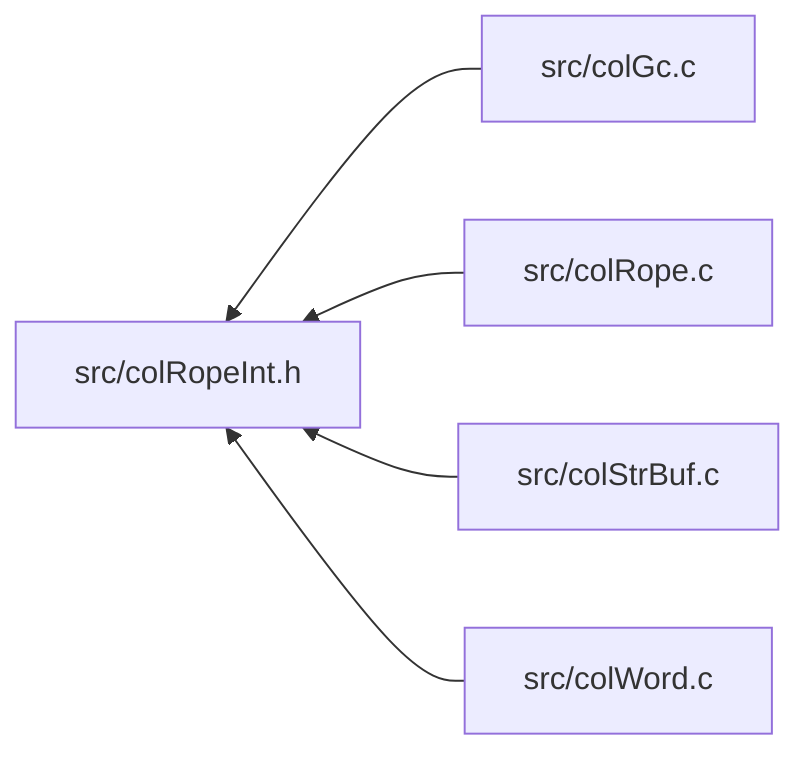

<a id="col_rope_int_8h"></a>
# File colRopeInt.h

![][C++]

**Location**: `src/colRopeInt.h`

This header file defines the rope internals of Colibri.

Ropes are a string datatype that allows for fast insertion, extraction and composition of strings. Internally they use self-balanced binary trees.


They are always immutable.


**See also**: [colRope.c](col_rope_8c.md#col_rope_8c), [colRope.h](col_rope_8h.md#col_rope_8h)

## Included by

* [src/colGc.c](col_gc_8c.md#col_gc_8c)
* [src/colRope.c](col_rope_8c.md#col_rope_8c)
* [src/colStrBuf.c](col_str_buf_8c.md#col_str_buf_8c)
* [src/colWord.c](col_word_8c.md#col_word_8c)



## UCS String Word Constants

<a id="group__ucsstr__words_1ga04d9ab12584a6fc694c0949e52f481c5"></a>
### Macro UCSSTR\_HEADER\_SIZE

![][public]

```cpp
#define UCSSTR_HEADER_SIZE (sizeof(uint16_t)*2)
```

Byte size of UCS string header.


<a id="group__ucsstr__words_1gacf26d3e514c09e967a7120f031f7d184"></a>
### Macro UCSSTR\_MAX\_LENGTH

![][public]

```cpp
#define UCSSTR_MAX_LENGTH UINT16_MAX
```

Maximum char length of UCS strings.


## UCS String Word Utilities

<a id="group__ucsstr__words_1gaaac90786862f40e08eac7734465ec132"></a>
### Macro UCSSTR\_SIZE

![][public]

```cpp
#define UCSSTR_SIZE     ([NB\_CELLS](col_internal_8h.md#group__pages__cells_1ga6969cfc3c9b2913a913df84f7842ce74)([UCSSTR\_HEADER\_SIZE](col_rope_int_8h.md#group__ucsstr__words_1ga04d9ab12584a6fc694c0949e52f481c5)+(byteLength)))( byteLength )
```

Get number of cells taken by an UCS string of the given byte length.

**Parameters**:

* **byteLength**: Byte size of string.


**Returns**:

Number of cells taken by word.


## UCS String Word Creation

<a id="group__ucsstr__words_1gae02e5fdcadce075a6d7891b923633ecf"></a>
### Macro WORD\_UCSSTR\_INIT

![][public]

```cpp
#define WORD_UCSSTR_INIT     [WORD\_SET\_TYPEID](col_word_int_8h.md#group__predefined__words_1ga52822cf424704829e60b112fe03614b6)((word), [WORD\_TYPE\_UCSSTR](col_word_int_8h.md#group__words_1ga3a96c4366162e66944451d0b2ddb9221)); \
    [WORD\_UCSSTR\_FORMAT](col_rope_int_8h.md#group__ucsstr__words_1gab71309e620c0b5eb4f3ade931103223f)(word) = (uint8_t) (format); \
    [WORD\_UCSSTR\_LENGTH](col_rope_int_8h.md#group__ucsstr__words_1ga2de5d82b197dbd067fdd323532fc353d)(word) = (uint16_t) (length);( word ,format ,length )
```

UCS string word initializer.

**Parameters**:

* **word**: Word to initialize.
* **format**: [WORD\_UCSSTR\_FORMAT](col_rope_int_8h.md#group__ucsstr__words_1gab71309e620c0b5eb4f3ade931103223f).
* **length**: [WORD\_UCSSTR\_LENGTH](col_rope_int_8h.md#group__ucsstr__words_1ga2de5d82b197dbd067fdd323532fc353d).


!> **Warning** \
Argument **word** is referenced several times by the macro. Make sure to avoid any side effect.


**See also**: [WORD\_TYPE\_UCSSTR](col_word_int_8h.md#group__words_1ga3a96c4366162e66944451d0b2ddb9221)


## UCS String Word Accessors

<a id="group__ucsstr__words_1gab71309e620c0b5eb4f3ade931103223f"></a>
### Macro WORD\_UCSSTR\_FORMAT

![][public]

```cpp
#define WORD_UCSSTR_FORMAT (((int8_t *)(word))[1])( word )
```

Get/set character format.

**Parameters**:

* **word**: Word to access.


?> Macro is L-Value and suitable for both read/write operations.


**See also**: [WORD\_UCSSTR\_INIT](col_rope_int_8h.md#group__ucsstr__words_1gae02e5fdcadce075a6d7891b923633ecf)


<a id="group__ucsstr__words_1ga2de5d82b197dbd067fdd323532fc353d"></a>
### Macro WORD\_UCSSTR\_LENGTH

![][public]

```cpp
#define WORD_UCSSTR_LENGTH (((uint16_t *)(word))[1])( word )
```

Get/set character length.

**Parameters**:

* **word**: Word to access.


?> Macro is L-Value and suitable for both read/write operations.


**See also**: [WORD\_UCSSTR\_INIT](col_rope_int_8h.md#group__ucsstr__words_1gae02e5fdcadce075a6d7891b923633ecf)


<a id="group__ucsstr__words_1ga72e52b45c2851e4038089248df5ceddf"></a>
### Macro WORD\_UCSSTR\_DATA

![][public]

```cpp
#define WORD_UCSSTR_DATA ((const char *)(word)+[UCSSTR\_HEADER\_SIZE](col_rope_int_8h.md#group__ucsstr__words_1ga04d9ab12584a6fc694c0949e52f481c5))( word )
```

Pointer to beginning of string data.

**Parameters**:

* **word**: Word to access.


## UTF String Word Constants

<a id="group__utfstr__words_1gaaaafcb7cad000c065f7c5cfcd8d0c7b8"></a>
### Macro UTFSTR\_HEADER\_SIZE

![][public]

```cpp
#define UTFSTR_HEADER_SIZE (sizeof(uint16_t)*3)
```

Byte size of UTF-8/16 string header.


<a id="group__utfstr__words_1ga280e86ac3ab3388ac552f03d2196584c"></a>
### Macro UTFSTR\_MAX\_BYTELENGTH

![][public]

```cpp
#define UTFSTR_MAX_BYTELENGTH ([AVAILABLE\_CELLS](col_internal_8h.md#group__pages__cells_1ga524e5a52183dcc7088644df29ef766bf)*[CELL\_SIZE](col_conf_8h.md#group__alloc_1ga7a4127f14f16563da90eb3c836bc404f)-[UTFSTR\_HEADER\_SIZE](col_rope_int_8h.md#group__utfstr__words_1gaaaafcb7cad000c065f7c5cfcd8d0c7b8))
```

Maximum byte length of UTF-8/16 strings.


## UTF String Word Utilities

<a id="group__utfstr__words_1ga00f51041c27e8cfcfe2da5e22795cb0c"></a>
### Macro UTFSTR\_SIZE

![][public]

```cpp
#define UTFSTR_SIZE     ([NB\_CELLS](col_internal_8h.md#group__pages__cells_1ga6969cfc3c9b2913a913df84f7842ce74)([UTFSTR\_HEADER\_SIZE](col_rope_int_8h.md#group__utfstr__words_1gaaaafcb7cad000c065f7c5cfcd8d0c7b8)+(byteLength)))( byteLength )
```

Get number of cells taken by an UTF-8/16 string of the given byte length.

**Parameters**:

* **byteLength**: Byte size of string.


**Returns**:

Number of cells taken by word.


## UTF String Word Creation

<a id="group__utfstr__words_1gab6c2e0088ebce6cd847ed1fbd6fe1acb"></a>
### Macro WORD\_UTFSTR\_INIT

![][public]

```cpp
#define WORD_UTFSTR_INIT     [WORD\_SET\_TYPEID](col_word_int_8h.md#group__predefined__words_1ga52822cf424704829e60b112fe03614b6)((word), [WORD\_TYPE\_UTFSTR](col_word_int_8h.md#group__words_1gaed71812c790125f3aeb204e6ba4f55b4)); \
    [WORD\_UTFSTR\_FORMAT](col_rope_int_8h.md#group__utfstr__words_1ga3405010b5b366fe5f7f87af019d84536)(word) = (uint8_t) (format); \
    [WORD\_UTFSTR\_LENGTH](col_rope_int_8h.md#group__utfstr__words_1gacd5812fddcc3e5259e89b0a62ac1a238)(word) = (uint16_t) (length); \
    [WORD\_UTFSTR\_BYTELENGTH](col_rope_int_8h.md#group__utfstr__words_1ga837308f56ffc081bf15248ecd7adda9a)(word) = (uint16_t) (byteLength);( word ,format ,length ,byteLength )
```

UTF-8/16 string word initializer.

**Parameters**:

* **word**: Word to initialize.
* **format**: [WORD\_UTFSTR\_FORMAT](col_rope_int_8h.md#group__utfstr__words_1ga3405010b5b366fe5f7f87af019d84536).
* **length**: [WORD\_UTFSTR\_LENGTH](col_rope_int_8h.md#group__utfstr__words_1gacd5812fddcc3e5259e89b0a62ac1a238).
* **byteLength**: [WORD\_UTFSTR\_BYTELENGTH](col_rope_int_8h.md#group__utfstr__words_1ga837308f56ffc081bf15248ecd7adda9a).


!> **Warning** \
Argument **word** is referenced several times by the macro. Make sure to avoid any side effect.


**See also**: [WORD\_TYPE\_UTFSTR](col_word_int_8h.md#group__words_1gaed71812c790125f3aeb204e6ba4f55b4)


## UTF String Word Accessors

<a id="group__utfstr__words_1ga3405010b5b366fe5f7f87af019d84536"></a>
### Macro WORD\_UTFSTR\_FORMAT

![][public]

```cpp
#define WORD_UTFSTR_FORMAT (((int8_t *)(word))[1])( word )
```

Get/set character format.

**Parameters**:

* **word**: Word to access.


?> Macro is L-Value and suitable for both read/write operations.


**See also**: [WORD\_UTFSTR\_INIT](col_rope_int_8h.md#group__utfstr__words_1gab6c2e0088ebce6cd847ed1fbd6fe1acb)


<a id="group__utfstr__words_1gacd5812fddcc3e5259e89b0a62ac1a238"></a>
### Macro WORD\_UTFSTR\_LENGTH

![][public]

```cpp
#define WORD_UTFSTR_LENGTH (((uint16_t *)(word))[1])( word )
```

Get/set character length.

**Parameters**:

* **word**: Word to access.


?> Macro is L-Value and suitable for both read/write operations.


**See also**: [WORD\_UTFSTR\_INIT](col_rope_int_8h.md#group__utfstr__words_1gab6c2e0088ebce6cd847ed1fbd6fe1acb)


<a id="group__utfstr__words_1ga837308f56ffc081bf15248ecd7adda9a"></a>
### Macro WORD\_UTFSTR\_BYTELENGTH

![][public]

```cpp
#define WORD_UTFSTR_BYTELENGTH (((uint16_t *)(word))[2])( word )
```

Get/set byte length.

**Parameters**:

* **word**: Word to access.


?> Macro is L-Value and suitable for both read/write operations.


**See also**: [WORD\_UTFSTR\_INIT](col_rope_int_8h.md#group__utfstr__words_1gab6c2e0088ebce6cd847ed1fbd6fe1acb)


<a id="group__utfstr__words_1ga54f4a0ffe3636b2e29185ca90c342876"></a>
### Macro WORD\_UTFSTR\_DATA

![][public]

```cpp
#define WORD_UTFSTR_DATA ((const char *)(word)+[UTFSTR\_HEADER\_SIZE](col_rope_int_8h.md#group__utfstr__words_1gaaaafcb7cad000c065f7c5cfcd8d0c7b8))( word )
```

Pointer to beginning of string data.

**Parameters**:

* **word**: Word to access.


## Subrope Creation

<a id="group__subrope__words_1ga7515ed32b8448be528c6f71c73ad7b8d"></a>
### Macro WORD\_SUBROPE\_INIT

![][public]

```cpp
#define WORD_SUBROPE_INIT     [WORD\_SET\_TYPEID](col_word_int_8h.md#group__predefined__words_1ga52822cf424704829e60b112fe03614b6)((word), [WORD\_TYPE\_SUBROPE](col_word_int_8h.md#group__words_1gaadd34ba690f1e2711ee1b6ae965fd8e7)); \
    [WORD\_SUBROPE\_DEPTH](col_rope_int_8h.md#group__subrope__words_1ga79860a542687768ee7965f5c8bd86b2a)(word) = (uint8_t) (depth); \
    [WORD\_SUBROPE\_SOURCE](col_rope_int_8h.md#group__subrope__words_1ga78e40e3bc8f132eb513198bffd78b644)(word) = (source); \
    [WORD\_SUBROPE\_FIRST](col_rope_int_8h.md#group__subrope__words_1ga6db22689c9aec5c74206bddd98abad70)(word) = (first); \
    [WORD\_SUBROPE\_LAST](col_rope_int_8h.md#group__subrope__words_1ga72a89875578dffdc0ce1029b078ae2c9)(word) = (last);( word ,depth ,source ,first ,last )
```

Subrope word initializer.

**Parameters**:

* **word**: Word to initialize.
* **depth**: [WORD\_SUBROPE\_DEPTH](col_rope_int_8h.md#group__subrope__words_1ga79860a542687768ee7965f5c8bd86b2a).
* **source**: [WORD\_SUBROPE\_SOURCE](col_rope_int_8h.md#group__subrope__words_1ga78e40e3bc8f132eb513198bffd78b644).
* **first**: [WORD\_SUBROPE\_FIRST](col_rope_int_8h.md#group__subrope__words_1ga6db22689c9aec5c74206bddd98abad70).
* **last**: [WORD\_SUBROPE\_LAST](col_rope_int_8h.md#group__subrope__words_1ga72a89875578dffdc0ce1029b078ae2c9).


!> **Warning** \
Argument **word** is referenced several times by the macro. Make sure to avoid any side effect.


**See also**: [WORD\_TYPE\_SUBROPE](col_word_int_8h.md#group__words_1gaadd34ba690f1e2711ee1b6ae965fd8e7)


## Subrope Accessors

<a id="group__subrope__words_1ga79860a542687768ee7965f5c8bd86b2a"></a>
### Macro WORD\_SUBROPE\_DEPTH

![][public]

```cpp
#define WORD_SUBROPE_DEPTH (((uint8_t *)(word))[1])( word )
```

Get/set depth of subrope.

**Parameters**:

* **word**: Word to access.


?> Macro is L-Value and suitable for both read/write operations.


**See also**: [WORD\_SUBROPE\_INIT](col_rope_int_8h.md#group__subrope__words_1ga7515ed32b8448be528c6f71c73ad7b8d)


<a id="group__subrope__words_1ga78e40e3bc8f132eb513198bffd78b644"></a>
### Macro WORD\_SUBROPE\_SOURCE

![][public]

```cpp
#define WORD_SUBROPE_SOURCE ((([Col\_Word](col_word_8h.md#group__words_1gadb626f9e195212e4fdfba7df154ad043) *)(word))[1])( word )
```

Get/set rope from which this one is extracted.

**Parameters**:

* **word**: Word to access.


?> Macro is L-Value and suitable for both read/write operations.


**See also**: [WORD\_SUBROPE\_INIT](col_rope_int_8h.md#group__subrope__words_1ga7515ed32b8448be528c6f71c73ad7b8d)


<a id="group__subrope__words_1ga6db22689c9aec5c74206bddd98abad70"></a>
### Macro WORD\_SUBROPE\_FIRST

![][public]

```cpp
#define WORD_SUBROPE_FIRST (((size_t *)(word))[2])( word )
```

Get/set index of first character in source.

**Parameters**:

* **word**: Word to access.


?> Macro is L-Value and suitable for both read/write operations.


**See also**: [WORD\_SUBROPE\_INIT](col_rope_int_8h.md#group__subrope__words_1ga7515ed32b8448be528c6f71c73ad7b8d)


<a id="group__subrope__words_1ga72a89875578dffdc0ce1029b078ae2c9"></a>
### Macro WORD\_SUBROPE\_LAST

![][public]

```cpp
#define WORD_SUBROPE_LAST (((size_t *)(word))[3])( word )
```

Get/set index of last character in source.

**Parameters**:

* **word**: Word to access.


?> Macro is L-Value and suitable for both read/write operations.


**See also**: [WORD\_SUBROPE\_INIT](col_rope_int_8h.md#group__subrope__words_1ga7515ed32b8448be528c6f71c73ad7b8d)


## Concat Rope Creation

<a id="group__concatrope__words_1ga6f8d139b77fb5ab7a1e4f4f3afc6ceec"></a>
### Macro WORD\_CONCATROPE\_INIT

![][public]

```cpp
#define WORD_CONCATROPE_INIT     [WORD\_SET\_TYPEID](col_word_int_8h.md#group__predefined__words_1ga52822cf424704829e60b112fe03614b6)((word), [WORD\_TYPE\_CONCATROPE](col_word_int_8h.md#group__words_1ga677525993a1e4a934e98042c53021c3a)); \
    [WORD\_CONCATROPE\_DEPTH](col_rope_int_8h.md#group__concatrope__words_1gaf74129b430f17d52c86ee7d4e317fa5b)(word) = (uint8_t) (depth); \
    [WORD\_CONCATROPE\_LENGTH](col_rope_int_8h.md#group__concatrope__words_1ga32f67b8d198ec4a90b371f0c51723bf5)(word) = (length); \
    [WORD\_CONCATROPE\_LEFT\_LENGTH](col_rope_int_8h.md#group__concatrope__words_1ga1a1e048ea8091a88ced0ead88242b5b4)(word) = (uint16_t) ((leftLength)>UINT16_MAX?0:(leftLength)); \
    [WORD\_CONCATROPE\_LEFT](col_rope_int_8h.md#group__concatrope__words_1ga2af5901b1cf501c31b3f5593332bb68f)(word) = (left); \
    [WORD\_CONCATROPE\_RIGHT](col_rope_int_8h.md#group__concatrope__words_1ga587823d297e401d584898411bc44d8d3)(word) = (right);( word ,depth ,length ,leftLength ,left ,right )
```

Concat rope word initializer.

**Parameters**:

* **word**: Word to initialize.
* **depth**: [WORD\_CONCATROPE\_DEPTH](col_rope_int_8h.md#group__concatrope__words_1gaf74129b430f17d52c86ee7d4e317fa5b).
* **length**: [WORD\_CONCATROPE\_LENGTH](col_rope_int_8h.md#group__concatrope__words_1ga32f67b8d198ec4a90b371f0c51723bf5).
* **leftLength**: [WORD\_CONCATROPE\_LEFT\_LENGTH](col_rope_int_8h.md#group__concatrope__words_1ga1a1e048ea8091a88ced0ead88242b5b4).
* **left**: [WORD\_CONCATROPE\_LEFT](col_rope_int_8h.md#group__concatrope__words_1ga2af5901b1cf501c31b3f5593332bb68f).
* **right**: [WORD\_CONCATROPE\_RIGHT](col_rope_int_8h.md#group__concatrope__words_1ga587823d297e401d584898411bc44d8d3).


!> **Warning** \
Arguments **word** and **leftLength** are referenced several times by the macro. Make sure to avoid any side effect.


**See also**: [WORD\_TYPE\_CONCATROPE](col_word_int_8h.md#group__words_1ga677525993a1e4a934e98042c53021c3a)


## Concat Rope Accessors

<a id="group__concatrope__words_1gaf74129b430f17d52c86ee7d4e317fa5b"></a>
### Macro WORD\_CONCATROPE\_DEPTH

![][public]

```cpp
#define WORD_CONCATROPE_DEPTH (((uint8_t *)(word))[1])( word )
```

Get/set depth of concat rope.

**Parameters**:

* **word**: Word to access.


?> Macro is L-Value and suitable for both read/write operations.


**See also**: [WORD\_CONCATROPE\_INIT](col_rope_int_8h.md#group__concatrope__words_1ga6f8d139b77fb5ab7a1e4f4f3afc6ceec)


<a id="group__concatrope__words_1ga1a1e048ea8091a88ced0ead88242b5b4"></a>
### Macro WORD\_CONCATROPE\_LEFT\_LENGTH

![][public]

```cpp
#define WORD_CONCATROPE_LEFT_LENGTH (((uint16_t *)(word))[1])( word )
```

Get/set left arm's length (zero when too large).

**Parameters**:

* **word**: Word to access.


?> Macro is L-Value and suitable for both read/write operations.


**See also**: [WORD\_CONCATROPE\_INIT](col_rope_int_8h.md#group__concatrope__words_1ga6f8d139b77fb5ab7a1e4f4f3afc6ceec)


<a id="group__concatrope__words_1ga32f67b8d198ec4a90b371f0c51723bf5"></a>
### Macro WORD\_CONCATROPE\_LENGTH

![][public]

```cpp
#define WORD_CONCATROPE_LENGTH (((size_t *)(word))[1])( word )
```

Get/set rope length.

**Parameters**:

* **word**: Word to access.


?> Macro is L-Value and suitable for both read/write operations.


**See also**: [WORD\_CONCATROPE\_INIT](col_rope_int_8h.md#group__concatrope__words_1ga6f8d139b77fb5ab7a1e4f4f3afc6ceec)


<a id="group__concatrope__words_1ga2af5901b1cf501c31b3f5593332bb68f"></a>
### Macro WORD\_CONCATROPE\_LEFT

![][public]

```cpp
#define WORD_CONCATROPE_LEFT ((([Col\_Word](col_word_8h.md#group__words_1gadb626f9e195212e4fdfba7df154ad043) *)(word))[2])( word )
```

Get/set left concatenated rope.

**Parameters**:

* **word**: Word to access.


?> Macro is L-Value and suitable for both read/write operations.


**See also**: [WORD\_CONCATROPE\_INIT](col_rope_int_8h.md#group__concatrope__words_1ga6f8d139b77fb5ab7a1e4f4f3afc6ceec)


<a id="group__concatrope__words_1ga587823d297e401d584898411bc44d8d3"></a>
### Macro WORD\_CONCATROPE\_RIGHT

![][public]

```cpp
#define WORD_CONCATROPE_RIGHT ((([Col\_Word](col_word_8h.md#group__words_1gadb626f9e195212e4fdfba7df154ad043) *)(word))[3])( word )
```

Get/set right concatenated rope.

**Parameters**:

* **word**: Word to access.


?> Macro is L-Value and suitable for both read/write operations.


**See also**: [WORD\_CONCATROPE\_INIT](col_rope_int_8h.md#group__concatrope__words_1ga6f8d139b77fb5ab7a1e4f4f3afc6ceec)


## Rope Exceptions

<a id="group__rope__words_1ga4cb2cb567fda262f527bbea46d532e17"></a>
### Macro TYPECHECK\_CHAR

![][public]

```cpp
#define TYPECHECK_CHAR( word )
```

Type checking macro for characters.

**Parameters**:

* **word**: Checked word.


**Exceptions**:

* **[COL\_ERROR\_CHAR](colibri_8h.md#group__error_1gga729084542ed9eae62009a84d3379ef35a336970cfb68532435a61ff5e30def4e9)**: [[T]](colibri_8h.md#group__error_1gga6dab009a0b8c4b4fa080cb9ba1859e9ea603a58b9d5bb16fde0708eb0767e4904) **word**: Not a character word.


<a id="group__rope__words_1ga468488c8b6974e7247a3411e72a1f8ed"></a>
### Macro TYPECHECK\_STRING

![][public]

```cpp
#define TYPECHECK_STRING( word )
```

Type checking macro for strings.

**Parameters**:

* **word**: Checked word.


**Exceptions**:

* **[COL\_ERROR\_STRING](colibri_8h.md#group__error_1gga729084542ed9eae62009a84d3379ef35a1b27b71d27f64cf37c74e6776d86166f)**: [[T]](colibri_8h.md#group__error_1gga6dab009a0b8c4b4fa080cb9ba1859e9ea603a58b9d5bb16fde0708eb0767e4904) **word**: Not a string word.


<a id="group__rope__words_1ga18a6a8b88308afe7fbe90df026669b38"></a>
### Macro TYPECHECK\_ROPE

![][public]

```cpp
#define TYPECHECK_ROPE( word )
```

Type checking macro for ropes.

**Parameters**:

* **word**: Checked word.


**Exceptions**:

* **[COL\_ERROR\_ROPE](colibri_8h.md#group__error_1gga729084542ed9eae62009a84d3379ef35aea3a7d079cdddc4cc3b6768a83ef47f4)**: [[T]](colibri_8h.md#group__error_1gga6dab009a0b8c4b4fa080cb9ba1859e9ea603a58b9d5bb16fde0708eb0767e4904) **word**: Not a rope.


<a id="group__rope__words_1ga8a677146e8c85fdfea9fd87658d58bdb"></a>
### Macro VALUECHECK\_ROPELENGTH\_CONCAT

![][public]

```cpp
#define VALUECHECK_ROPELENGTH_CONCAT( length1 ,length2 )
```

Value checking macro for ropes, ensures that combined lengths of two concatenated ropes don't exceed the maximum value.

**Parameters**:

* **length1 length2**: Checked lengths.


**Exceptions**:

* **[COL\_ERROR\_ROPELENGTH\_CONCAT](colibri_8h.md#group__error_1gga729084542ed9eae62009a84d3379ef35a37a3a6924ed998d6803770696cc7d1dc)**: [[V]](colibri_8h.md#group__error_1gga6dab009a0b8c4b4fa080cb9ba1859e9ea65d5e7232c82ae6972ac56f386a32fc9) **length1+length2**: Concat rope too large.


<a id="group__rope__words_1gaaac0f176421b8323a5d193efa577257b"></a>
### Macro VALUECHECK\_ROPELENGTH\_REPEAT

![][public]

```cpp
#define VALUECHECK_ROPELENGTH_REPEAT( length ,count )
```

Value checking macro for ropes, ensures that length of a repeated rope doesn't exceed the maximum value.

**Parameters**:

* **length count**: Checked length and repetition factor.


**Exceptions**:

* **[COL\_ERROR\_ROPELENGTH\_CONCAT](colibri_8h.md#group__error_1gga729084542ed9eae62009a84d3379ef35a37a3a6924ed998d6803770696cc7d1dc)**: [[V]](colibri_8h.md#group__error_1gga6dab009a0b8c4b4fa080cb9ba1859e9ea65d5e7232c82ae6972ac56f386a32fc9) **length*count**: Concat rope too large.


## Rope Iterator Exceptions

<a id="group__rope__words_1ga95a934a35692ce0920d4361f3ef072e9"></a>
### Macro TYPECHECK\_ROPEITER

![][public]

```cpp
#define TYPECHECK_ROPEITER( it )
```

Type checking macro for rope iterators.

**Parameters**:

* **it**: Checked iterator.


**Exceptions**:

* **[COL\_ERROR\_ROPEITER](colibri_8h.md#group__error_1gga729084542ed9eae62009a84d3379ef35a45d7cbebed5e870c86dbf2dd6c3a56b7)**: [[T]](colibri_8h.md#group__error_1gga6dab009a0b8c4b4fa080cb9ba1859e9ea603a58b9d5bb16fde0708eb0767e4904) **it**: Invalid rope iterator.


**See also**: [Col\_RopeIterNull](col_rope_8h.md#group__rope__words_1ga3de44fb926a2657b092ff5ca2ca832a4)


<a id="group__rope__words_1ga8f26889dcd6a11b46a452ddc8761ea8d"></a>
### Macro VALUECHECK\_ROPEITER

![][public]

```cpp
#define VALUECHECK_ROPEITER( it )
```

Value checking macro for rope iterators, ensures that iterator is not at end.

**Parameters**:

* **it**: Checked iterator.


**Exceptions**:

* **[COL\_ERROR\_ROPEITER\_END](colibri_8h.md#group__error_1gga729084542ed9eae62009a84d3379ef35a6ce849d7cc09cc3484477f792c1d0886)**: [[V]](colibri_8h.md#group__error_1gga6dab009a0b8c4b4fa080cb9ba1859e9ea65d5e7232c82ae6972ac56f386a32fc9) **it**: Rope iterator at end.


**See also**: [Col\_RopeIterEnd](col_rope_8h.md#group__rope__words_1ga8abacbcdd87e4b0a3de70a9343a84688)


## Source

```cpp
/**
 * @file colRopeInt.h
 *
 * This header file defines the rope internals of Colibri.
 *
 * Ropes are a string datatype that allows for fast insertion, extraction
 * and composition of strings. Internally they use self-balanced binary
 * trees.
 *
 * They are always immutable.
 *
 * @see colRope.c
 * @see colRope.h
 *
 * @beginprivate @cond PRIVATE
 */

#ifndef _COLIBRI_ROPE_INT
#define _COLIBRI_ROPE_INT


/*
===========================================================================*//*!
\internal \defgroup ucsstr_words Fixed-Width UCS Strings
\ingroup predefined_words rope_words

Fixed-width UCS strings are constant arrays of characters that are
directly addressable.

@par Requirements
    - UCS string words must know their character length as well as their
      character format (either #COL_UCS1, #COL_UCS2 or #COL_UCS4).

    - Byte length is deduced from character length and format.

    - Characters are stored within the word cells following the header.

    - UCS string words use as much cells as needed to store their characters.

    @param Format   Character format.
    @param Length   Size of character array.
    @param Data     Array of character codepoints.

@par Cell Layout
    On all architectures the cell layout is as follows:

    @dot
    digraph {
        node [fontname="Lucida Console,Courier" fontsize=14];
        ucsstr_word [shape=none, label=<
            <table border="0" cellborder="1" cellspacing="0">
            <tr><td border="0"></td>
                <td sides="B" width="40" align="left">0</td><td sides="B" width="40" align="right">7</td>
                <td sides="B" width="40" align="left">8</td><td sides="B" width="40" align="right">15</td>
                <td sides="B" width="80" align="left">16</td><td sides="B" width="80" align="right">31</td>
            </tr>
            <tr><td sides="R">0</td>
                <td href="@ref WORD_TYPEID" title="WORD_TYPEID" colspan="2">Type</td>
                <td href="@ref WORD_UCSSTR_FORMAT" title="WORD_UCSSTR_FORMAT" colspan="2">Format</td>
                <td href="@ref WORD_UCSSTR_LENGTH" title="WORD_UCSSTR_LENGTH" colspan="2">Length</td>
            </tr>
            <tr><td sides="R">.</td>
                <td href="@ref WORD_UCSSTR_DATA" title="WORD_UCSSTR_DATA" colspan="6" rowspan="4">Character data</td>
            </tr>
            <tr><td sides="R">.</td></tr>
            <tr><td sides="R">N</td></tr>
            </table>
        >]
    }
    @enddot

    @begindiagram
           0             7 8            15 16                           31
          +---------------+---------------+-------------------------------+
        0 |      Type     |    Format     |            Length             |
          +---------------+---------------+-------------------------------+
          .                                                               .
          .                         Character data                        .
        N |                                                               |
          +---------------------------------------------------------------+
    @enddiagram

@see WORD_TYPE_UCSSTR
\{*//*==========================================================================
*/

/***************************************************************************//*!
 * \name UCS String Word Constants
 ***************************************************************************\{*/

/** Byte size of UCS string header. */
#define UCSSTR_HEADER_SIZE              (sizeof(uint16_t)*2)

/** Maximum char length of UCS strings. */
#define UCSSTR_MAX_LENGTH               UINT16_MAX

/* End of UCS String Word Constants *//*!\}*/


/***************************************************************************//*!
 * \name UCS String Word Utilities
 ***************************************************************************\{*/

/**
 * Get number of cells taken by an UCS string of the given byte length.
 *
 * @param byteLength    Byte size of string.
 *
 * @return Number of cells taken by word.
 */
#define UCSSTR_SIZE(byteLength) \
    (NB_CELLS(UCSSTR_HEADER_SIZE+(byteLength)))

/* End of UCS String Word Utilities *//*!\}*/


/***************************************************************************//*!
 * \name UCS String Word Creation
 ***************************************************************************\{*/

/**
 * UCS string word initializer.
 *
 * @param word      Word to initialize.
 * @param format    #WORD_UCSSTR_FORMAT.
 * @param length    #WORD_UCSSTR_LENGTH.
 *
 * @warning
 *      Argument **word** is referenced several times by the macro. Make sure to
 *      avoid any side effect.
 *
 * @see WORD_TYPE_UCSSTR
 */
#define WORD_UCSSTR_INIT(word, format, length) \
    WORD_SET_TYPEID((word), WORD_TYPE_UCSSTR); \
    WORD_UCSSTR_FORMAT(word) = (uint8_t) (format); \
    WORD_UCSSTR_LENGTH(word) = (uint16_t) (length);

/* End of UCS String Word Creation *//*!\}*/


/***************************************************************************//*!
 * \name UCS String Word Accessors
 ***************************************************************************\{*/

/**
 * Get/set character format.
 *
 * @param word  Word to access.
 *
 * @note
 *      Macro is L-Value and suitable for both read/write operations.
 *
 * @see WORD_UCSSTR_INIT
 */
#define WORD_UCSSTR_FORMAT(word)        (((int8_t *)(word))[1])

/**
 * Get/set character length.
 *
 * @param word  Word to access.
 *
 * @note
 *      Macro is L-Value and suitable for both read/write operations.
 *
 * @see WORD_UCSSTR_INIT
 */
#define WORD_UCSSTR_LENGTH(word)        (((uint16_t *)(word))[1])

/**
 * Pointer to beginning of string data.
 *
 * @param word  Word to access.
 */
#define WORD_UCSSTR_DATA(word)          ((const char *)(word)+UCSSTR_HEADER_SIZE)

/* End of UCS String Word Accessors *//*!\}*/

/* End of Fixed-Width UCS Strings *//*!\}*/


/*
===========================================================================*//*!
\internal \defgroup utfstr_words Variable-Width UTF Strings
\ingroup predefined_words rope_words

Variable-width UTF-8/16 strings are constant arrays of variable-width
characters requiring dedicated encoding/decoding procedures for access.

@par Requirements
    - UTF-8/16 string words must know both character and byte lengths, as well
      as their character format (either #COL_UTF8 or #COL_UTF16).

    - Characters are stored within the word cells following the header.

    - UTF-8/16 string words use as much cells as needed to store their
      characters, up to the page limit. Hence, number of cells is at most
      #AVAILABLE_CELLS. This is a tradeoff between space and performance: larger
      strings are split into several smaller chunks that get concatenated, but
      random access is better compared to flat UTF strings thanks to the binary
      tree indexation, as opposed to per-character linear scanning of UTF
      strings.

    @param Format       Character format.
    @param Length       Number of characters in array.
    @param Byte Length  Byte length of character array.
    @param Data         Array of character code units.

@par Cell Layout
    On all architectures the cell layout is as follows:

    @dot
    digraph {
        node [fontname="Lucida Console,Courier" fontsize=14];
        utfstr_word [shape=none, label=<
            <table border="0" cellborder="1" cellspacing="0">
            <tr><td border="0"></td>
                <td sides="B" width="40" align="left">0</td><td sides="B" width="40" align="right">7</td>
                <td sides="B" width="40" align="left">8</td><td sides="B" width="40" align="right">15</td>
                <td sides="B" width="80" align="left">16</td><td sides="B" width="80" align="right">31</td>
            </tr>
            <tr><td sides="R">0</td>
                <td href="@ref WORD_TYPEID" title="WORD_TYPEID" colspan="2">Type</td>
                <td href="@ref WORD_UTFSTR_FORMAT" title="WORD_UTFSTR_FORMAT" colspan="2">Format</td>
                <td href="@ref WORD_UTFSTR_LENGTH" title="WORD_UTFSTR_LENGTH" colspan="2">Length</td>
            </tr>
            <tr><td sides="R">1</td>
                <td href="@ref WORD_UTFSTR_BYTELENGTH" title="WORD_UTFSTR_BYTELENGTH" colspan="4">Byte Length</td>
                <td href="@ref WORD_UTFSTR_DATA" title="WORD_UTFSTR_DATA" sides="R" colspan="2"></td>
            </tr>
            <tr><td sides="R">.</td>
                <td href="@ref WORD_UTFSTR_DATA" title="WORD_UTFSTR_DATA" colspan="6" rowspan="3" sides="BR" width="320">Character data</td>
            </tr>
            <tr><td sides="R">.</td></tr>
            <tr><td sides="R">N</td></tr>
            </table>
        >]
    }
    @enddot

    @begindiagram
           0             7 8            15 16                           31
          +---------------+---------------+-------------------------------+
        0 |      Type     |    Format     |            Length             |
          +---------------+---------------+-------------------------------+
        1 |          Byte Length          |                               |
          +-------------------------------+                               .
          .                                                               .
          .                         Character data                        .
        N |                                                               |
          +---------------------------------------------------------------+
    @enddiagram

@see WORD_TYPE_UTFSTR
\{*//*==========================================================================
*/

/***************************************************************************//*!
 * \name UTF String Word Constants
 ***************************************************************************\{*/

/** Byte size of UTF-8/16 string header. */
#define UTFSTR_HEADER_SIZE              (sizeof(uint16_t)*3)

/** Maximum byte length of UTF-8/16 strings. */
#define UTFSTR_MAX_BYTELENGTH           (AVAILABLE_CELLS*CELL_SIZE-UTFSTR_HEADER_SIZE)

/* End of UTF String Word Constants *//*!\}*/


/***************************************************************************//*!
 * \name UTF String Word Utilities
 ***************************************************************************\{*/

/**
 * Get number of cells taken by an UTF-8/16 string of the given byte length
 *
 * @param byteLength    Byte size of string.
 *
 * @return Number of cells taken by word.
 */
#define UTFSTR_SIZE(byteLength) \
    (NB_CELLS(UTFSTR_HEADER_SIZE+(byteLength)))

/* End of UTF String Word Utilities *//*!\}*/


/***************************************************************************//*!
 * \name UTF String Word Creation
 ***************************************************************************\{*/

/**
 * UTF-8/16 string word initializer.
 *
 * @param word          Word to initialize.
 * @param format        #WORD_UTFSTR_FORMAT.
 * @param length        #WORD_UTFSTR_LENGTH.
 * @param byteLength    #WORD_UTFSTR_BYTELENGTH.
 *
 * @warning
 *      Argument **word** is referenced several times by the macro. Make sure to
 *      avoid any side effect.
 *
 * @see WORD_TYPE_UTFSTR
 */
#define WORD_UTFSTR_INIT(word, format, length, byteLength) \
    WORD_SET_TYPEID((word), WORD_TYPE_UTFSTR); \
    WORD_UTFSTR_FORMAT(word) = (uint8_t) (format); \
    WORD_UTFSTR_LENGTH(word) = (uint16_t) (length); \
    WORD_UTFSTR_BYTELENGTH(word) = (uint16_t) (byteLength);

/* End of UTF String Word Creation *//*!\}*/


/***************************************************************************//*!
 * \name UTF String Word Accessors
 ***************************************************************************\{*/

/**
 * Get/set character format.
 *
 * @param word  Word to access.
 *
 * @note
 *      Macro is L-Value and suitable for both read/write operations.
 *
 * @see WORD_UTFSTR_INIT
 */
#define WORD_UTFSTR_FORMAT(word)        (((int8_t *)(word))[1])

/**
 * Get/set character length.
 *
 * @param word  Word to access.
 *
 * @note
 *      Macro is L-Value and suitable for both read/write operations.
 *
 * @see WORD_UTFSTR_INIT
 */
#define WORD_UTFSTR_LENGTH(word)        (((uint16_t *)(word))[1])

/**
 * Get/set byte length.
 *
 * @param word  Word to access.
 *
 * @note
 *      Macro is L-Value and suitable for both read/write operations.
 *
 * @see WORD_UTFSTR_INIT
 */
#define WORD_UTFSTR_BYTELENGTH(word)    (((uint16_t *)(word))[2])

/**
 * Pointer to beginning of string data.
 *
 * @param word  Word to access.
 */
#define WORD_UTFSTR_DATA(word)          ((const char *)(word)+UTFSTR_HEADER_SIZE)

/* End of UTF String Word Accessors *//*!\}*/

/* End of Variable-Width UTF Strings *//*!\}*/


/*
===========================================================================*//*!
\internal \defgroup subrope_words Subropes
\ingroup predefined_words rope_words

Subropes are immutable ropes pointing to a slice of a larger rope.

Extraction of a subrope from a large rope can be expensive. For example,
removing one character from a string of several thousands implies
copying the whole data minus this element. Likewise, extracting a range
of characters from a complex binary tree of rope nodes implies
traversing and copying large parts of this subtree.

To limit the memory and processing costs of rope slicing, the subrope
word simply points to the original rope and the index range of
characters in the slice. This representation is preferred over raw copy
when the source rope is large.

@par Requirements
    - Subrope words use one single cell.

    - Subropes must know their source rope word.

    - Subropes must also know the indices of the first and last characters in
      the source rope that belongs to the slice. These indices are inclusive.
      Difference plus one gives the subrope length.

    - Last, subropes must know their depth for tree balancing (see
      @ref rope_tree_balancing "Rope Tree Balancing"). This is the same as the
      source depth, but to avoid one pointer dereference we cache the value in
      the word.

    @param Depth    Depth of subrope. 8 bits will code up to 255 depth levels,
                    which is more than sufficient for balanced binary trees.
    @param Source   Rope of which this one is a subrope.
    @param First    First character in source.
    @param Last     Last character in source.

@par Cell Layout
    On all architectures the single-cell layout is as follows:

    @dot
    digraph {
        node [fontname="Lucida Console,Courier" fontsize=14];
        subrope_word [shape=none, label=<
            <table border="0" cellborder="1" cellspacing="0">
            <tr><td border="0"></td>
                <td sides="B" width="40" align="left">0</td><td sides="B" width="40" align="right">7</td>
                <td sides="B" width="40" align="left">8</td><td sides="B" width="40" align="right">15</td>
                <td sides="B" width="80" align="left">16</td><td sides="B" width="80" align="right">n</td>
            </tr>
            <tr><td sides="R">0</td>
                <td href="@ref WORD_TYPEID" title="WORD_TYPEID" colspan="2">Type</td>
                <td href="@ref WORD_SUBROPE_DEPTH" title="WORD_SUBROPE_DEPTH" colspan="2">Depth</td>
                <td colspan="2" bgcolor="grey75">Unused</td>
            </tr>
            <tr><td sides="R">1</td>
                <td href="@ref WORD_SUBROPE_SOURCE" title="WORD_SUBROPE_SOURCE" colspan="6">Source</td>
            </tr>
            <tr><td sides="R">2</td>
                <td href="@ref WORD_SUBROPE_FIRST" title="WORD_SUBROPE_FIRST" colspan="6">First</td>
            </tr>
            <tr><td sides="R">3</td>
                <td href="@ref WORD_SUBROPE_LAST" title="WORD_SUBROPE_LAST" colspan="6">Last</td>
            </tr>
            </table>
        >]
    }
    @enddot

    @begindiagram
           0     7 8    15                                               n
          +-------+-------+-----------------------------------------------+
        0 | Type  | Depth |                    Unused                     |
          +-------+-------+-----------------------------------------------+
        1 |                            Source                             |
          +---------------------------------------------------------------+
        2 |                             First                             |
          +---------------------------------------------------------------+
        3 |                             Last                              |
          +---------------------------------------------------------------+
    @enddiagram

@see WORD_TYPE_SUBROPE
\{*//*==========================================================================
*/

/***************************************************************************//*!
 * \name Subrope Creation
 ***************************************************************************\{*/

/**
 * Subrope word initializer.
 *
 * @param word      Word to initialize.
 * @param depth     #WORD_SUBROPE_DEPTH.
 * @param source    #WORD_SUBROPE_SOURCE.
 * @param first     #WORD_SUBROPE_FIRST.
 * @param last      #WORD_SUBROPE_LAST.
 *
 * @warning
 *      Argument **word** is referenced several times by the macro. Make sure to
 *      avoid any side effect.
 *
 * @see WORD_TYPE_SUBROPE
 */
#define WORD_SUBROPE_INIT(word, depth, source, first, last) \
    WORD_SET_TYPEID((word), WORD_TYPE_SUBROPE); \
    WORD_SUBROPE_DEPTH(word) = (uint8_t) (depth); \
    WORD_SUBROPE_SOURCE(word) = (source); \
    WORD_SUBROPE_FIRST(word) = (first); \
    WORD_SUBROPE_LAST(word) = (last);

/* End of Subrope Creation *//*!\}*/


/***************************************************************************//*!
 * \name Subrope Accessors
 ***************************************************************************\{*/

/**
 * Get/set depth of subrope.
 *
 * @param word  Word to access.
 *
 * @note
 *      Macro is L-Value and suitable for both read/write operations.
 *
 * @see WORD_SUBROPE_INIT
 */
#define WORD_SUBROPE_DEPTH(word)        (((uint8_t *)(word))[1])

/**
 * Get/set rope from which this one is extracted.
 *
 * @param word  Word to access.
 *
 * @note
 *      Macro is L-Value and suitable for both read/write operations.
 *
 * @see WORD_SUBROPE_INIT
 */
#define WORD_SUBROPE_SOURCE(word)       (((Col_Word *)(word))[1])

/**
 * Get/set index of first character in source.
 *
 * @param word  Word to access.
 *
 * @note
 *      Macro is L-Value and suitable for both read/write operations.
 *
 * @see WORD_SUBROPE_INIT
 */
#define WORD_SUBROPE_FIRST(word)        (((size_t *)(word))[2])

/**
 * Get/set index of last character in source.
 *
 * @param word  Word to access.
 *
 * @note
 *      Macro is L-Value and suitable for both read/write operations.
 *
 * @see WORD_SUBROPE_INIT
 */
#define WORD_SUBROPE_LAST(word)         (((size_t *)(word))[3])

/* End of Subrope Accessors *//*!\}*/

/* End of Subropes *//*!\}*/


/*
===========================================================================*//*!
\internal \defgroup concatrope_words Concat Ropes
\ingroup predefined_words rope_words

Concat ropes are balanced binary trees concatenating left and right subropes.
The tree is balanced by construction (see @ref rope_tree_balancing
"Rope Tree Balancing").

@par Requirements
    - Concat rope words use one single cell.

    - Concat ropes must know their left and right subrope words.

    - Concat ropes must know their length, which is the sum of their left and
      right arms. To save full recursive subtree traversal this length is
      stored at each level in the concat words. We also cache the left arm's
      length whenever possible to save a pointer dereference (the right
      length being the total minus left lengths).

    - Last, concat ropes must know their depth for tree balancing (see
      @ref rope_tree_balancing "Rope Tree Balancing"). This is the max depth of
      their left and right arms, plus one.

    @param Depth    Depth of concat rope. 8 bits will code up to 255 depth
                    levels, which is more than sufficient for balanced
                    binary trees.
    @param Left     Used as shortcut to avoid dereferencing the left arm.
                    Zero if actual length is too large to fit.
    @param Length   Rope length, which is the sum of both arms'.
    @param Left     Left concatenated rope.
    @param Right    Right concatenated rope.

@par Cell Layout
    On all architectures the single-cell layout is as follows:

    @dot
    digraph {
        node [fontname="Lucida Console,Courier" fontsize=14];
        concatrope_word [shape=none, label=<
            <table border="0" cellborder="1" cellspacing="0">
            <tr><td border="0"></td>
                <td sides="B" width="40" align="left">0</td><td sides="B" width="40" align="right">7</td>
                <td sides="B" width="40" align="left">8</td><td sides="B" width="40" align="right">15</td>
                <td sides="B" width="80" align="left">16</td><td sides="B" width="80" align="right">31</td>
                <td sides="B" align="right">n</td>
            </tr>
            <tr><td sides="R">0</td>
                <td href="@ref WORD_TYPEID" title="WORD_TYPEID" colspan="2">Type</td>
                <td href="@ref WORD_CONCATROPE_DEPTH" title="WORD_CONCATROPE_DEPTH" colspan="2">Depth</td>
                <td href="@ref WORD_CONCATROPE_LEFT_LENGTH" title="WORD_CONCATROPE_LEFT_LENGTH" colspan="2">Left length</td>
                <td bgcolor="grey75"> Unused (n &gt; 32) </td>
            </tr>
            <tr><td sides="R">1</td>
                <td href="@ref WORD_CONCATROPE_LENGTH" title="WORD_CONCATROPE_LENGTH" colspan="7">Length</td>
            </tr>
            <tr><td sides="R">2</td>
                <td href="@ref WORD_CONCATROPE_LEFT" title="WORD_CONCATROPE_LEFT" colspan="7">Left</td>
            </tr>
            <tr><td sides="R">3</td>
                <td href="@ref WORD_CONCATROPE_RIGHT" title="WORD_CONCATROPE_RIGHT" colspan="7">Right</td>
            </tr>
            </table>
        >]
    }
    @enddot

    @begindiagram
           0     7 8    15 16           31                               n
          +-------+-------+---------------+-------------------------------+
        0 | Type  | Depth |  Left length  |        Unused (n > 32)        |
          +-------+-------+---------------+-------------------------------+
        1 |                            Length                             |
          +---------------------------------------------------------------+
        2 |                             Left                              |
          +---------------------------------------------------------------+
        3 |                             Right                             |
          +---------------------------------------------------------------+
    @enddiagram

@see WORD_TYPE_CONCATROPE
\{*//*==========================================================================
*/

/***************************************************************************//*!
 * \name Concat Rope Creation
 ***************************************************************************\{*/

/**
 * Concat rope word initializer.
 *
 * @param word          Word to initialize.
 * @param depth         #WORD_CONCATROPE_DEPTH.
 * @param length        #WORD_CONCATROPE_LENGTH.
 * @param leftLength    #WORD_CONCATROPE_LEFT_LENGTH.
 * @param left          #WORD_CONCATROPE_LEFT.
 * @param right         #WORD_CONCATROPE_RIGHT.
 *
 * @warning
 *      Arguments **word** and **leftLength** are referenced several times by
 *      the macro. Make sure to avoid any side effect.
 *
 * @see WORD_TYPE_CONCATROPE
 */
#define WORD_CONCATROPE_INIT(word, depth, length, leftLength, left, right) \
    WORD_SET_TYPEID((word), WORD_TYPE_CONCATROPE); \
    WORD_CONCATROPE_DEPTH(word) = (uint8_t) (depth); \
    WORD_CONCATROPE_LENGTH(word) = (length); \
    WORD_CONCATROPE_LEFT_LENGTH(word) = (uint16_t) ((leftLength)>UINT16_MAX?0:(leftLength)); \
    WORD_CONCATROPE_LEFT(word) = (left); \
    WORD_CONCATROPE_RIGHT(word) = (right);

/* End of Concat Rope Creation *//*!\}*/


/***************************************************************************//*!
 * \name Concat Rope Accessors
 ***************************************************************************\{*/

/**
 * Get/set depth of concat rope.
 *
 * @param word  Word to access.
 *
 * @note
 *      Macro is L-Value and suitable for both read/write operations.
 *
 * @see WORD_CONCATROPE_INIT
 */
#define WORD_CONCATROPE_DEPTH(word)         (((uint8_t *)(word))[1])

/**
 * Get/set left arm's length (zero when too large).
 *
 * @param word  Word to access.
 *
 * @note
 *      Macro is L-Value and suitable for both read/write operations.
 *
 * @see WORD_CONCATROPE_INIT
 */
#define WORD_CONCATROPE_LEFT_LENGTH(word)   (((uint16_t *)(word))[1])

/**
 * Get/set rope length.
 *
 * @param word  Word to access.
 *
 * @note
 *      Macro is L-Value and suitable for both read/write operations.
 *
 * @see WORD_CONCATROPE_INIT
 */
#define WORD_CONCATROPE_LENGTH(word)        (((size_t *)(word))[1])

/**
 * Get/set left concatenated rope.
 *
 * @param word  Word to access.
 *
 * @note
 *      Macro is L-Value and suitable for both read/write operations.
 *
 * @see WORD_CONCATROPE_INIT
 */
#define WORD_CONCATROPE_LEFT(word)          (((Col_Word *)(word))[2])

/**
 * Get/set right concatenated rope.
 *
 * @param word  Word to access.
 *
 * @note
 *      Macro is L-Value and suitable for both read/write operations.
 *
 * @see WORD_CONCATROPE_INIT
 */
#define WORD_CONCATROPE_RIGHT(word)         (((Col_Word *)(word))[3])

/* End of Concat Rope Accessors *//*!\}*/

/* End of Concat Ropes *//*!\}*/


/*
===========================================================================*//*!
\internal \addtogroup rope_words Ropes
\{*//*==========================================================================
*/

/***************************************************************************//*!
 * \name Rope Exceptions
 ***************************************************************************\{*/

/**
 * Type checking macro for characters.
 *
 * @param word  Checked word.
 *
 * @typecheck{COL_ERROR_CHAR,word}
 * @hideinitializer
 */
#define TYPECHECK_CHAR(word) \
    TYPECHECK((Col_WordType(word) & COL_CHAR), COL_ERROR_CHAR, (word))

/**
 * Type checking macro for strings.
 *
 * @param word  Checked word.
 *
 * @typecheck{COL_ERROR_STRING,word}
 * @hideinitializer
 */
#define TYPECHECK_STRING(word) \
    TYPECHECK((Col_WordType(word) & COL_STRING), COL_ERROR_STRING, (word))

/**
 * Type checking macro for ropes.
 *
 * @param word  Checked word.
 *
 * @typecheck{COL_ERROR_ROPE,word}
 * @hideinitializer
 */
#define TYPECHECK_ROPE(word) \
    TYPECHECK((Col_WordType(word) & COL_ROPE), COL_ERROR_ROPE, (word))

/**
 * Value checking macro for ropes, ensures that combined lengths of two
 * concatenated ropes don't exceed the maximum value.
 *
 * @param length1, length2  Checked lengths.
 *
 * @valuecheck{COL_ERROR_ROPELENGTH_CONCAT,length1+length2}
 * @hideinitializer
 */
#define VALUECHECK_ROPELENGTH_CONCAT(length1, length2) \
    VALUECHECK((SIZE_MAX-(length1) >= (length2)), COL_ERROR_ROPELENGTH_CONCAT, \
                (length1), (length2), SIZE_MAX)

/**
 * Value checking macro for ropes, ensures that length of a repeated rope
 * doesn't exceed the maximum value.
 *
 * @param length, count     Checked length and repetition factor.
 *
 * @valuecheck{COL_ERROR_ROPELENGTH_CONCAT,length*count}
 * @hideinitializer
 */
#define VALUECHECK_ROPELENGTH_REPEAT(length, count) \
    VALUECHECK(((count) <= 1 || SIZE_MAX/(count) >= (length)), \
                COL_ERROR_ROPELENGTH_REPEAT, (length), (count), SIZE_MAX)

/* End of Rope Exceptions *//*!\}*/


/***************************************************************************//*!
 * \name Rope Iterator Exceptions
 ***************************************************************************\{*/

/**
 * Type checking macro for rope iterators.
 *
 * @param it    Checked iterator.
 *
 * @typecheck{COL_ERROR_ROPEITER,it}
 *
 * @see Col_RopeIterNull
 * @hideinitializer
 */
#define TYPECHECK_ROPEITER(it) \
    TYPECHECK(!Col_RopeIterNull(it), COL_ERROR_ROPEITER, (it))

/**
 * Value checking macro for rope iterators, ensures that iterator is not
 * at end.
 *
 * @param it    Checked iterator.
 *
 * @valuecheck{COL_ERROR_ROPEITER_END,it}
 *
 * @see Col_RopeIterEnd
 * @hideinitializer
 */
#define VALUECHECK_ROPEITER(it) \
    VALUECHECK(!Col_RopeIterEnd(it), COL_ERROR_ROPEITER_END, (it))

/* End of Rope Iterator Exceptions *//*!\}*/

/* End of Ropes *//*!\}*/

#endif /* _COLIBRI_ROPE_INT */
/*! @endcond @endprivate */
```

[public]: https://img.shields.io/badge/-public-brightgreen (public)
[C++]: https://img.shields.io/badge/language-C%2B%2B-blue (C++)
[private]: https://img.shields.io/badge/-private-red (private)
[Markdown]: https://img.shields.io/badge/language-Markdown-blue (Markdown)
[static]: https://img.shields.io/badge/-static-lightgrey (static)