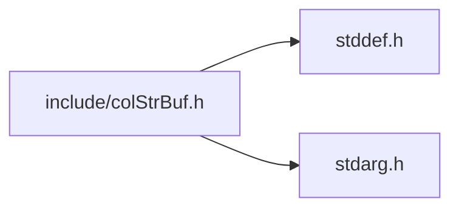
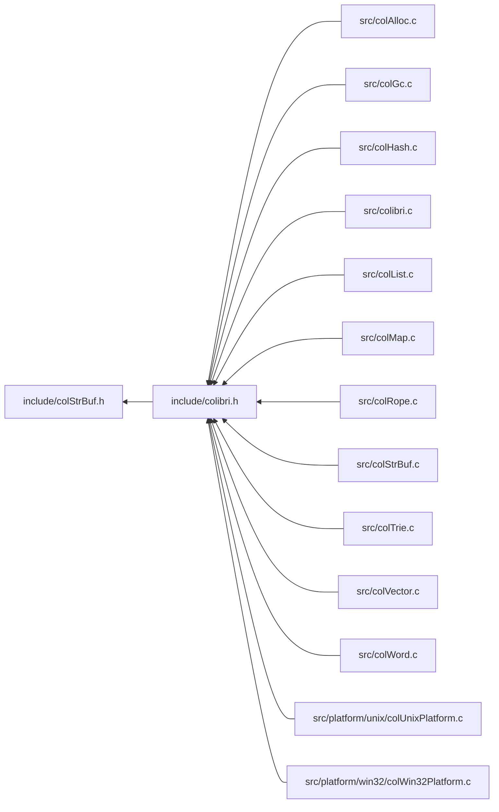

<a id="col_str_buf_8h"></a>
# File colStrBuf.h

![][C++]

**Location**: `include/colStrBuf.h`

This header file defines the string buffer handling features of Colibri.

String buffers are used to build strings incrementally in an efficient manner, by appending individual characters or whole ropes. The current accumulated rope can be retrieved at any time.

## Includes

* <stddef.h>
* <stdarg.h>



## Included by

* [include/colibri.h](colibri_8h.md#colibri_8h)



## String Buffer Creation

<a id="group__strbuf__words_1ga44d7ab2d5a5ccb4a113497f56c297ef4"></a>
### Function Col\_MaxStringBufferLength

![][public]

```cpp
size_t Col_MaxStringBufferLength(Col_StringFormat format)
```

Get the maximum buffer length of string buffers.

**Returns**:

The max string buffer length.


**Parameters**:

* [Col\_StringFormat](colibri_8h.md#group__strings_1ga125054104f6260ea3902e6e46ebfdfa0) **format**: Format policy.

**Return type**: EXTERN size_t

**References**:

* [CELL\_SIZE](col_conf_8h.md#group__alloc_1ga7a4127f14f16563da90eb3c836bc404f)
* [STRBUF\_MAX\_LENGTH](col_str_buf_int_8h.md#group__strbuf__words_1ga7484adce06c0538b7285371ac4cd18ce)
* [STRBUF\_MAX\_SIZE](col_str_buf_int_8h.md#group__strbuf__words_1ga1ea7cfcb3f2246521db1f9cc27bb598c)

**Referenced by**:

* [Col\_NewStringBuffer](col_str_buf_8h.md#group__strbuf__words_1ga8c3ba7df2adb643c5da323d7fd013cfb)

<a id="group__strbuf__words_1ga8c3ba7df2adb643c5da323d7fd013cfb"></a>
### Function Col\_NewStringBuffer

![][public]

```cpp
Col_Word Col_NewStringBuffer(size_t capacity, Col_StringFormat format)
```

Create a new string buffer word.

?> The actual capacity will be rounded up to fit an even number of cells, and won't exceed the maximum value given by [Col\_MaxStringBufferLength(format)](col_str_buf_8h.md#group__strbuf__words_1ga44d7ab2d5a5ccb4a113497f56c297ef4).


**Returns**:

The new word.

**Exceptions**:

* **[COL\_ERROR\_STRBUF\_FORMAT](colibri_8h.md#group__error_1gga729084542ed9eae62009a84d3379ef35af19a91631001d2669a4a068b71162df3)**: [[V]](colibri_8h.md#group__error_1gga6dab009a0b8c4b4fa080cb9ba1859e9ea65d5e7232c82ae6972ac56f386a32fc9) **format**: String format not supported.

**Parameters**:

* size_t **capacity**: Maximum length of string buffer. If zero, use a default value.
* [Col\_StringFormat](colibri_8h.md#group__strings_1ga125054104f6260ea3902e6e46ebfdfa0) **format**: String format.

**Return type**: EXTERN [Col\_Word](col_word_8h.md#group__words_1gadb626f9e195212e4fdfba7df154ad043)

**References**:

* [AllocCells](col_gc_8c.md#group__alloc_1gaeec69115deeb3321bdfbb4e42119f806)
* [CHAR\_WIDTH](col_internal_8h.md#group__strings_1gaf5aa639fca28d7d2fa2ab575d2aa9612)
* [Col\_MaxStringBufferLength](col_str_buf_8h.md#group__strbuf__words_1ga44d7ab2d5a5ccb4a113497f56c297ef4)
* [STRBUF\_DEFAULT\_SIZE](col_str_buf_8c.md#group__strbuf__words_1gac6ad81ef157380a8fdb11a627a5c91e0)
* [STRBUF\_MAX\_SIZE](col_str_buf_int_8h.md#group__strbuf__words_1ga1ea7cfcb3f2246521db1f9cc27bb598c)
* [STRBUF\_SIZE](col_str_buf_int_8h.md#group__strbuf__words_1ga7e3612f406000af77436193770547188)
* [VALUECHECK\_STRBUF\_FORMAT](col_str_buf_int_8h.md#group__strbuf__words_1gafa1b1cc1ddba12fc7d86d66d28bccedd)
* [WORD\_NIL](col_word_8h.md#group__words_1ga29e370264f4e5659ccc5be4de209f065)
* [WORD\_STRBUF\_INIT](col_str_buf_int_8h.md#group__strbuf__words_1ga271b07b1cdd01774692ca64687c3f8ab)

## String Buffer Accessors

<a id="group__strbuf__words_1gaee87791f6ba1919cec23d6aedaede4fa"></a>
### Function Col\_StringBufferFormat

![][public]

```cpp
Col_StringFormat Col_StringBufferFormat(Col_Word strbuf)
```

Get the character format used by the internal buffer.

**Returns**:

The string buffer format.


**See also**: [Col\_NewStringBuffer](col_str_buf_8h.md#group__strbuf__words_1ga8c3ba7df2adb643c5da323d7fd013cfb)

**Exceptions**:

* **[COL\_ERROR\_STRBUF](colibri_8h.md#group__error_1gga729084542ed9eae62009a84d3379ef35a24606ae882ebe15eceb13230471fe356)**: [[T]](colibri_8h.md#group__error_1gga6dab009a0b8c4b4fa080cb9ba1859e9ea603a58b9d5bb16fde0708eb0767e4904) **strbuf**: Not a string buffer.

**Parameters**:

* [Col\_Word](col_word_8h.md#group__words_1gadb626f9e195212e4fdfba7df154ad043) **strbuf**: String buffer to get length for.

**Return type**: EXTERN [Col\_StringFormat](colibri_8h.md#group__strings_1ga125054104f6260ea3902e6e46ebfdfa0)

**References**:

* [TYPECHECK\_STRBUF](col_str_buf_int_8h.md#group__strbuf__words_1gac92bccb1906795cc7eac4c28989bd144)
* [WORD\_STRBUF\_FORMAT](col_str_buf_int_8h.md#group__strbuf__words_1gab9e86210fdabc7589bcb4d439ed1ee00)
* [WORD\_UNWRAP](col_word_int_8h.md#group__word__wrappers_1ga5278e42908e256bb743954bf7745d06c)

<a id="group__strbuf__words_1ga14588604f194ea6b77f21e5550bed561"></a>
### Function Col\_StringBufferCapacity

![][public]

```cpp
size_t Col_StringBufferCapacity(Col_Word strbuf)
```

Get the capacity = maximum length of the string buffer.

**Returns**:

The string buffer capacity.


**See also**: [Col\_NewStringBuffer](col_str_buf_8h.md#group__strbuf__words_1ga8c3ba7df2adb643c5da323d7fd013cfb)

**Exceptions**:

* **[COL\_ERROR\_STRBUF](colibri_8h.md#group__error_1gga729084542ed9eae62009a84d3379ef35a24606ae882ebe15eceb13230471fe356)**: [[T]](colibri_8h.md#group__error_1gga6dab009a0b8c4b4fa080cb9ba1859e9ea603a58b9d5bb16fde0708eb0767e4904) **strbuf**: Not a string buffer.

**Parameters**:

* [Col\_Word](col_word_8h.md#group__words_1gadb626f9e195212e4fdfba7df154ad043) **strbuf**: String buffer to get capacity for.

**Return type**: EXTERN size_t

**References**:

* [CELL\_SIZE](col_conf_8h.md#group__alloc_1ga7a4127f14f16563da90eb3c836bc404f)
* [STRBUF\_MAX\_LENGTH](col_str_buf_int_8h.md#group__strbuf__words_1ga7484adce06c0538b7285371ac4cd18ce)
* [TYPECHECK\_STRBUF](col_str_buf_int_8h.md#group__strbuf__words_1gac92bccb1906795cc7eac4c28989bd144)
* [WORD\_STRBUF\_FORMAT](col_str_buf_int_8h.md#group__strbuf__words_1gab9e86210fdabc7589bcb4d439ed1ee00)
* [WORD\_STRBUF\_SIZE](col_str_buf_int_8h.md#group__strbuf__words_1ga9273c95e47384885fc2340c2f6e12bcc)
* [WORD\_UNWRAP](col_word_int_8h.md#group__word__wrappers_1ga5278e42908e256bb743954bf7745d06c)

<a id="group__strbuf__words_1gaf5e822c1d9b6d2fc959a62600d3edadc"></a>
### Function Col\_StringBufferLength

![][public]

```cpp
size_t Col_StringBufferLength(Col_Word strbuf)
```

Get the current length of the string buffer.

**Returns**:

The string buffer length.

**Exceptions**:

* **[COL\_ERROR\_STRBUF](colibri_8h.md#group__error_1gga729084542ed9eae62009a84d3379ef35a24606ae882ebe15eceb13230471fe356)**: [[T]](colibri_8h.md#group__error_1gga6dab009a0b8c4b4fa080cb9ba1859e9ea603a58b9d5bb16fde0708eb0767e4904) **strbuf**: Not a string buffer.

**Parameters**:

* [Col\_Word](col_word_8h.md#group__words_1gadb626f9e195212e4fdfba7df154ad043) **strbuf**: String buffer to get length for.

**Return type**: EXTERN size_t

**References**:

* [Col\_RopeLength](col_rope_8h.md#group__rope__words_1ga19acc7c753b0f7b55287b11360259a16)
* [TYPECHECK\_STRBUF](col_str_buf_int_8h.md#group__strbuf__words_1gac92bccb1906795cc7eac4c28989bd144)
* [WORD\_STRBUF\_LENGTH](col_str_buf_int_8h.md#group__strbuf__words_1ga05ca1e3d8d745145f4d2614f29b1ed0b)
* [WORD\_STRBUF\_ROPE](col_str_buf_int_8h.md#group__strbuf__words_1gab4991b12f32c9e890f71a8dd16701f83)
* [WORD\_UNWRAP](col_word_int_8h.md#group__word__wrappers_1ga5278e42908e256bb743954bf7745d06c)

<a id="group__strbuf__words_1ga787a56365c2d75a98d67bce1f41b82e4"></a>
### Function Col\_StringBufferValue

![][public]

```cpp
Col_Word Col_StringBufferValue(Col_Word strbuf)
```

Get the current cumulated string.

**Returns**:

The string buffer string value.

**Exceptions**:

* **[COL\_ERROR\_STRBUF](colibri_8h.md#group__error_1gga729084542ed9eae62009a84d3379ef35a24606ae882ebe15eceb13230471fe356)**: [[T]](colibri_8h.md#group__error_1gga6dab009a0b8c4b4fa080cb9ba1859e9ea603a58b9d5bb16fde0708eb0767e4904) **strbuf**: Not a string buffer.


**Side Effect**:

Commit buffer into accumulated rope.

**Parameters**:

* [Col\_Word](col_word_8h.md#group__words_1gadb626f9e195212e4fdfba7df154ad043) **strbuf**: String buffer to get value for.

**Return type**: EXTERN [Col\_Word](col_word_8h.md#group__words_1gadb626f9e195212e4fdfba7df154ad043)

**References**:

* [CommitBuffer](col_str_buf_8c.md#group__strbuf__words_1ga679d9a4fab2d369567c364325d0e7af5)
* [TYPECHECK\_STRBUF](col_str_buf_int_8h.md#group__strbuf__words_1gac92bccb1906795cc7eac4c28989bd144)
* [WORD\_NIL](col_word_8h.md#group__words_1ga29e370264f4e5659ccc5be4de209f065)
* [WORD\_STRBUF\_ROPE](col_str_buf_int_8h.md#group__strbuf__words_1gab4991b12f32c9e890f71a8dd16701f83)
* [WORD\_UNWRAP](col_word_int_8h.md#group__word__wrappers_1ga5278e42908e256bb743954bf7745d06c)

**Referenced by**:

* [Col\_StringBufferFreeze](col_str_buf_8h.md#group__strbuf__words_1gad40ef93666162a29b1913bec1b3a9715)

## String Buffer Operations

<a id="group__strbuf__words_1ga40425acea88a012954e2c9a3f1981585"></a>
### Function Col\_StringBufferAppendChar

![][public]

```cpp
int Col_StringBufferAppendChar(Col_Word strbuf, Col_Char c)
```

Append the given character to the string buffer.

**Return values**:

* **0**: if character was not appended (may occur when the character codepoint is unrepresentable in the target format).
* **<>0**: if character was appended.


**See also**: [Col\_StringBufferAppendRope](col_str_buf_8h.md#group__strbuf__words_1ga714dd6c258d3b715915d29d1b83d0cfa), [Col\_StringBufferAppendSequence](col_str_buf_8h.md#group__strbuf__words_1ga195c4aa02da672a1ccd60e99bf2f9927)

**Exceptions**:

* **[COL\_ERROR\_STRBUF](colibri_8h.md#group__error_1gga729084542ed9eae62009a84d3379ef35a24606ae882ebe15eceb13230471fe356)**: [[T]](colibri_8h.md#group__error_1gga6dab009a0b8c4b4fa080cb9ba1859e9ea603a58b9d5bb16fde0708eb0767e4904) **strbuf**: Not a string buffer.


**Side Effect**:

May commit buffer.

**Parameters**:

* [Col\_Word](col_word_8h.md#group__words_1gadb626f9e195212e4fdfba7df154ad043) **strbuf**: String buffer to append character to.
* [Col\_Char](colibri_8h.md#group__strings_1gab42ee0cd75b78280e412fa5bae5eb862) **c**: Character to append.

**Return type**: EXTERN int

**References**:

* [ASSERT](col_internal_8h.md#group__error_1gac22830a985e1daed0c9eadba8c6f606e)
* [CELL\_SIZE](col_conf_8h.md#group__alloc_1ga7a4127f14f16563da90eb3c836bc404f)
* [COL\_CHAR1\_MAX](colibri_8h.md#group__strings_1gab5bcfc6f2e396458bfca5cc643248427)
* [COL\_CHAR2\_MAX](colibri_8h.md#group__strings_1ga20750ccf04ae493b5c1cf9a9c3406157)
* [COL\_UCS1](colibri_8h.md#group__strings_1gga125054104f6260ea3902e6e46ebfdfa0a18ed97ba951a5d02c0a6e039445235b8)
* [COL\_UCS2](colibri_8h.md#group__strings_1gga125054104f6260ea3902e6e46ebfdfa0ae43fbe04c500f0868e4b95a669a987e0)
* [CommitBuffer](col_str_buf_8c.md#group__strbuf__words_1ga679d9a4fab2d369567c364325d0e7af5)
* [STRBUF\_MAX\_LENGTH](col_str_buf_int_8h.md#group__strbuf__words_1ga7484adce06c0538b7285371ac4cd18ce)
* [TYPECHECK\_STRBUF](col_str_buf_int_8h.md#group__strbuf__words_1gac92bccb1906795cc7eac4c28989bd144)
* [WORD\_STRBUF\_BUFFER](col_str_buf_int_8h.md#group__strbuf__words_1ga078f2268d4a63773bcce56ee719cb551)
* [WORD\_STRBUF\_FORMAT](col_str_buf_int_8h.md#group__strbuf__words_1gab9e86210fdabc7589bcb4d439ed1ee00)
* [WORD\_STRBUF\_LENGTH](col_str_buf_int_8h.md#group__strbuf__words_1ga05ca1e3d8d745145f4d2614f29b1ed0b)
* [WORD\_STRBUF\_SIZE](col_str_buf_int_8h.md#group__strbuf__words_1ga9273c95e47384885fc2340c2f6e12bcc)
* [WORD\_UNWRAP](col_word_int_8h.md#group__word__wrappers_1ga5278e42908e256bb743954bf7745d06c)

**Referenced by**:

* [Col\_StringBufferAppendRope](col_str_buf_8h.md#group__strbuf__words_1ga714dd6c258d3b715915d29d1b83d0cfa)
* [Col\_StringBufferAppendSequence](col_str_buf_8h.md#group__strbuf__words_1ga195c4aa02da672a1ccd60e99bf2f9927)

<a id="group__strbuf__words_1ga714dd6c258d3b715915d29d1b83d0cfa"></a>
### Function Col\_StringBufferAppendRope

![][public]

```cpp
int Col_StringBufferAppendRope(Col_Word strbuf, Col_Word rope)
```

Append the given rope to the string buffer.

**Return values**:

* **0**: if not all characters were appended (may occur when some character codepoints are unrepresentable in the target format).
* **<>0**: if all characters were appended.


**See also**: [Col\_StringBufferAppendChar](col_str_buf_8h.md#group__strbuf__words_1ga40425acea88a012954e2c9a3f1981585), [Col\_StringBufferAppendSequence](col_str_buf_8h.md#group__strbuf__words_1ga195c4aa02da672a1ccd60e99bf2f9927)

**Exceptions**:

* **[COL\_ERROR\_STRBUF](colibri_8h.md#group__error_1gga729084542ed9eae62009a84d3379ef35a24606ae882ebe15eceb13230471fe356)**: [[T]](colibri_8h.md#group__error_1gga6dab009a0b8c4b4fa080cb9ba1859e9ea603a58b9d5bb16fde0708eb0767e4904) **strbuf**: Not a string buffer.


**Side Effect**:

May commit buffer.

**Parameters**:

* [Col\_Word](col_word_8h.md#group__words_1gadb626f9e195212e4fdfba7df154ad043) **strbuf**: String buffer to append rope to.
* [Col\_Word](col_word_8h.md#group__words_1gadb626f9e195212e4fdfba7df154ad043) **rope**: Rope to append.

**Return type**: EXTERN int

**References**:

* [ASSERT](col_internal_8h.md#group__error_1gac22830a985e1daed0c9eadba8c6f606e)
* [CELL\_SIZE](col_conf_8h.md#group__alloc_1ga7a4127f14f16563da90eb3c836bc404f)
* [COL\_CHAR\_INVALID](colibri_8h.md#group__strings_1ga7d5dc9bdb8de819c861ee5d4a3300ae1)
* [Col\_ConcatRopes](col_rope_8h.md#group__rope__words_1gaafab3ef159c0b11402cc50c91fc59700)
* [Col\_NormalizeRope](col_rope_8h.md#group__rope__words_1gad8e0ed73e9d579e9aac9bd5ee7603319)
* [Col\_RopeIterAt](col_rope_8h.md#group__rope__words_1ga4b847f201fcffebbc3edd259608101cb)
* [Col\_RopeIterEnd](col_rope_8h.md#group__rope__words_1ga8abacbcdd87e4b0a3de70a9343a84688)
* [Col\_RopeIterFirst](col_rope_8h.md#group__rope__words_1gab3adca9b65daa62c81801065eaff2bde)
* [Col\_RopeIterNext](col_rope_8h.md#group__rope__words_1ga38f4fb336055b463f32aaa0b99a86830)
* [Col\_RopeLength](col_rope_8h.md#group__rope__words_1ga19acc7c753b0f7b55287b11360259a16)
* [Col\_StringBufferAppendChar](col_str_buf_8h.md#group__strbuf__words_1ga40425acea88a012954e2c9a3f1981585)
* [CommitBuffer](col_str_buf_8c.md#group__strbuf__words_1ga679d9a4fab2d369567c364325d0e7af5)
* [MAX\_SHORT\_ROPE\_LENGTH](col_str_buf_8c.md#group__strbuf__words_1gad6979d05e3506584ca233a947efe9651)
* [STRBUF\_MAX\_LENGTH](col_str_buf_int_8h.md#group__strbuf__words_1ga7484adce06c0538b7285371ac4cd18ce)
* [TYPECHECK\_STRBUF](col_str_buf_int_8h.md#group__strbuf__words_1gac92bccb1906795cc7eac4c28989bd144)
* [WORD\_STRBUF\_FORMAT](col_str_buf_int_8h.md#group__strbuf__words_1gab9e86210fdabc7589bcb4d439ed1ee00)
* [WORD\_STRBUF\_LENGTH](col_str_buf_int_8h.md#group__strbuf__words_1ga05ca1e3d8d745145f4d2614f29b1ed0b)
* [WORD\_STRBUF\_ROPE](col_str_buf_int_8h.md#group__strbuf__words_1gab4991b12f32c9e890f71a8dd16701f83)
* [WORD\_STRBUF\_SIZE](col_str_buf_int_8h.md#group__strbuf__words_1ga9273c95e47384885fc2340c2f6e12bcc)
* [WORD\_UNWRAP](col_word_int_8h.md#group__word__wrappers_1ga5278e42908e256bb743954bf7745d06c)

**Referenced by**:

* [Col\_StringBufferAppendSequence](col_str_buf_8h.md#group__strbuf__words_1ga195c4aa02da672a1ccd60e99bf2f9927)

<a id="group__strbuf__words_1ga195c4aa02da672a1ccd60e99bf2f9927"></a>
### Function Col\_StringBufferAppendSequence

![][public]

```cpp
int Col_StringBufferAppendSequence(Col_Word strbuf, const Col_RopeIterator begin, const Col_RopeIterator end)
```

Append the given rope sequence to the string buffer.

**Return values**:

* **0**: if not all characters were appended (may occur when some character codepoints are unrepresentable in the target format).
* **<>0**: if all characters were appended.


**See also**: [Col\_StringBufferAppendChar](col_str_buf_8h.md#group__strbuf__words_1ga40425acea88a012954e2c9a3f1981585), [Col\_StringBufferAppendRope](col_str_buf_8h.md#group__strbuf__words_1ga714dd6c258d3b715915d29d1b83d0cfa)

**Exceptions**:

* **[COL\_ERROR\_STRBUF](colibri_8h.md#group__error_1gga729084542ed9eae62009a84d3379ef35a24606ae882ebe15eceb13230471fe356)**: [[T]](colibri_8h.md#group__error_1gga6dab009a0b8c4b4fa080cb9ba1859e9ea603a58b9d5bb16fde0708eb0767e4904) **strbuf**: Not a string buffer.

**Parameters**:

* [Col\_Word](col_word_8h.md#group__words_1gadb626f9e195212e4fdfba7df154ad043) **strbuf**: String buffer to append character sequence to.
* const [Col\_RopeIterator](col_rope_8h.md#group__rope__words_1ga1faf03f532034b5c89e1209d55c9f725) **begin**: First character in sequence.
* const [Col\_RopeIterator](col_rope_8h.md#group__rope__words_1ga1faf03f532034b5c89e1209d55c9f725) **end**: First character past sequence end.

**Return type**: EXTERN int

**References**:

* [CELL\_SIZE](col_conf_8h.md#group__alloc_1ga7a4127f14f16563da90eb3c836bc404f)
* [Col\_RopeIterAt](col_rope_8h.md#group__rope__words_1ga4b847f201fcffebbc3edd259608101cb)
* [Col\_RopeIterCompare](col_rope_8h.md#group__rope__words_1gad2cb7c7b443fdae72cbfe1dfed692904)
* [Col\_RopeIterIndex](col_rope_8h.md#group__rope__words_1ga67fa8efe9abc6a5ffdee793b175a7d68)
* [Col\_RopeIterNext](col_rope_8h.md#group__rope__words_1ga38f4fb336055b463f32aaa0b99a86830)
* [Col\_RopeIterRope](col_rope_8h.md#group__rope__words_1ga2b63ee88bcb7cf112191ddc663f45196)
* [Col\_RopeIterSet](col_rope_8h.md#group__rope__words_1ga3d149921d88aea57c01d62ef3c519862)
* [Col\_StringBufferAppendChar](col_str_buf_8h.md#group__strbuf__words_1ga40425acea88a012954e2c9a3f1981585)
* [Col\_StringBufferAppendRope](col_str_buf_8h.md#group__strbuf__words_1ga714dd6c258d3b715915d29d1b83d0cfa)
* [Col\_Subrope](col_rope_8h.md#group__rope__words_1ga688a99f26c500c1f65f4141e97de0335)
* [STRBUF\_MAX\_LENGTH](col_str_buf_int_8h.md#group__strbuf__words_1ga7484adce06c0538b7285371ac4cd18ce)
* [TYPECHECK\_STRBUF](col_str_buf_int_8h.md#group__strbuf__words_1gac92bccb1906795cc7eac4c28989bd144)
* [WORD\_STRBUF\_FORMAT](col_str_buf_int_8h.md#group__strbuf__words_1gab9e86210fdabc7589bcb4d439ed1ee00)
* [WORD\_STRBUF\_LENGTH](col_str_buf_int_8h.md#group__strbuf__words_1ga05ca1e3d8d745145f4d2614f29b1ed0b)
* [WORD\_STRBUF\_SIZE](col_str_buf_int_8h.md#group__strbuf__words_1ga9273c95e47384885fc2340c2f6e12bcc)
* [WORD\_UNWRAP](col_word_int_8h.md#group__word__wrappers_1ga5278e42908e256bb743954bf7745d06c)

<a id="group__strbuf__words_1ga6a94ccd39253236811cdff44ebb5ccca"></a>
### Function Col\_StringBufferReserve

![][public]

```cpp
void * Col_StringBufferReserve(Col_Word strbuf, size_t length)
```

Reserve a number of characters for direct buffer access.

Characters can then be accessed as array elements using the format given at creation time.


**Return values**:

* **NULL**: if the buffer is too small to store the given number of characters.
* **pointer**: to the beginning of the reserved area.

**Exceptions**:

* **[COL\_ERROR\_STRBUF](colibri_8h.md#group__error_1gga729084542ed9eae62009a84d3379ef35a24606ae882ebe15eceb13230471fe356)**: [[T]](colibri_8h.md#group__error_1gga6dab009a0b8c4b4fa080cb9ba1859e9ea603a58b9d5bb16fde0708eb0767e4904) **strbuf**: Not a string buffer.


**Side Effect**:

May commit buffer.

**Parameters**:

* [Col\_Word](col_word_8h.md#group__words_1gadb626f9e195212e4fdfba7df154ad043) **strbuf**: String buffer to reserve into.
* size_t **length**: Number of characters to reserve. Must be <= [Col_StringBufferCapacity(strbuf)]([Col\_StringBufferCapacity](col_str_buf_8h.md#group__strbuf__words_1ga14588604f194ea6b77f21e5550bed561)).

**Return type**: EXTERN void *

**References**:

* [ASSERT](col_internal_8h.md#group__error_1gac22830a985e1daed0c9eadba8c6f606e)
* [CELL\_SIZE](col_conf_8h.md#group__alloc_1ga7a4127f14f16563da90eb3c836bc404f)
* [CHAR\_WIDTH](col_internal_8h.md#group__strings_1gaf5aa639fca28d7d2fa2ab575d2aa9612)
* [CommitBuffer](col_str_buf_8c.md#group__strbuf__words_1ga679d9a4fab2d369567c364325d0e7af5)
* [STRBUF\_MAX\_LENGTH](col_str_buf_int_8h.md#group__strbuf__words_1ga7484adce06c0538b7285371ac4cd18ce)
* [TYPECHECK\_STRBUF](col_str_buf_int_8h.md#group__strbuf__words_1gac92bccb1906795cc7eac4c28989bd144)
* [WORD\_STRBUF\_BUFFER](col_str_buf_int_8h.md#group__strbuf__words_1ga078f2268d4a63773bcce56ee719cb551)
* [WORD\_STRBUF\_FORMAT](col_str_buf_int_8h.md#group__strbuf__words_1gab9e86210fdabc7589bcb4d439ed1ee00)
* [WORD\_STRBUF\_LENGTH](col_str_buf_int_8h.md#group__strbuf__words_1ga05ca1e3d8d745145f4d2614f29b1ed0b)
* [WORD\_STRBUF\_SIZE](col_str_buf_int_8h.md#group__strbuf__words_1ga9273c95e47384885fc2340c2f6e12bcc)
* [WORD\_UNWRAP](col_word_int_8h.md#group__word__wrappers_1ga5278e42908e256bb743954bf7745d06c)

<a id="group__strbuf__words_1gac0b7631165e900ef418d0431a424cb51"></a>
### Function Col\_StringBufferRelease

![][public]

```cpp
void Col_StringBufferRelease(Col_Word strbuf, size_t length)
```

Release previously reserved characters.


**Exceptions**:

* **[COL\_ERROR\_STRBUF](colibri_8h.md#group__error_1gga729084542ed9eae62009a84d3379ef35a24606ae882ebe15eceb13230471fe356)**: [[T]](colibri_8h.md#group__error_1gga6dab009a0b8c4b4fa080cb9ba1859e9ea603a58b9d5bb16fde0708eb0767e4904) **strbuf**: Not a string buffer.


**Side Effect**:

Decrease current length.

**Parameters**:

* [Col\_Word](col_word_8h.md#group__words_1gadb626f9e195212e4fdfba7df154ad043) **strbuf**: String buffer to release.
* size_t **length**: Number of characters to release.

**Return type**: EXTERN void

**References**:

* [TYPECHECK\_STRBUF](col_str_buf_int_8h.md#group__strbuf__words_1gac92bccb1906795cc7eac4c28989bd144)
* [WORD\_STRBUF\_LENGTH](col_str_buf_int_8h.md#group__strbuf__words_1ga05ca1e3d8d745145f4d2614f29b1ed0b)
* [WORD\_UNWRAP](col_word_int_8h.md#group__word__wrappers_1ga5278e42908e256bb743954bf7745d06c)

<a id="group__strbuf__words_1ga44bf90a157bbcdaddd00763e608a2a28"></a>
### Function Col\_StringBufferReset

![][public]

```cpp
void Col_StringBufferReset(Col_Word strbuf)
```

Empty the string buffer: reset buffer length & accumulated rope.


**Exceptions**:

* **[COL\_ERROR\_STRBUF](colibri_8h.md#group__error_1gga729084542ed9eae62009a84d3379ef35a24606ae882ebe15eceb13230471fe356)**: [[T]](colibri_8h.md#group__error_1gga6dab009a0b8c4b4fa080cb9ba1859e9ea603a58b9d5bb16fde0708eb0767e4904) **strbuf**: Not a string buffer.

**Parameters**:

* [Col\_Word](col_word_8h.md#group__words_1gadb626f9e195212e4fdfba7df154ad043) **strbuf**: String buffer to reset.

**Return type**: EXTERN void

**References**:

* [TYPECHECK\_STRBUF](col_str_buf_int_8h.md#group__strbuf__words_1gac92bccb1906795cc7eac4c28989bd144)
* [WORD\_SMALLSTR\_EMPTY](col_word_int_8h.md#group__smallstr__words_1gaced4b5ab427a8009e9e3586f60cf487f)
* [WORD\_STRBUF\_LENGTH](col_str_buf_int_8h.md#group__strbuf__words_1ga05ca1e3d8d745145f4d2614f29b1ed0b)
* [WORD\_STRBUF\_ROPE](col_str_buf_int_8h.md#group__strbuf__words_1gab4991b12f32c9e890f71a8dd16701f83)
* [WORD\_UNWRAP](col_word_int_8h.md#group__word__wrappers_1ga5278e42908e256bb743954bf7745d06c)

<a id="group__strbuf__words_1gad40ef93666162a29b1913bec1b3a9715"></a>
### Function Col\_StringBufferFreeze

![][public]

```cpp
Col_Word Col_StringBufferFreeze(Col_Word strbuf)
```

Freeze the string buffer word, turning it into a rope.

**Returns**:

The accumulated rope so far.


**Side Effect**:

As the word may be transmuted into a rope, it can no longer be used as a string buffer.

**Exceptions**:

* **[COL\_ERROR\_STRBUF](colibri_8h.md#group__error_1gga729084542ed9eae62009a84d3379ef35a24606ae882ebe15eceb13230471fe356)**: [[T]](colibri_8h.md#group__error_1gga6dab009a0b8c4b4fa080cb9ba1859e9ea603a58b9d5bb16fde0708eb0767e4904) **strbuf**: Not a string buffer.

**Parameters**:

* [Col\_Word](col_word_8h.md#group__words_1gadb626f9e195212e4fdfba7df154ad043) **strbuf**: String buffer to freeze.

**Return type**: EXTERN [Col\_Word](col_word_8h.md#group__words_1gadb626f9e195212e4fdfba7df154ad043)

**References**:

* [ASSERT](col_internal_8h.md#group__error_1gac22830a985e1daed0c9eadba8c6f606e)
* [CHAR\_WIDTH](col_internal_8h.md#group__strings_1gaf5aa639fca28d7d2fa2ab575d2aa9612)
* [COL\_CHAR1\_MAX](colibri_8h.md#group__strings_1gab5bcfc6f2e396458bfca5cc643248427)
* [COL\_CHAR2\_MAX](colibri_8h.md#group__strings_1ga20750ccf04ae493b5c1cf9a9c3406157)
* [Col\_StringBufferValue](col_str_buf_8h.md#group__strbuf__words_1ga787a56365c2d75a98d67bce1f41b82e4)
* [COL\_UCS](col_rope_8h.md#group__rope__words_1ga568cb9253484f41fa8fcbb58e24926d7)
* [COL\_UCS1](colibri_8h.md#group__strings_1gga125054104f6260ea3902e6e46ebfdfa0a18ed97ba951a5d02c0a6e039445235b8)
* [COL\_UCS2](colibri_8h.md#group__strings_1gga125054104f6260ea3902e6e46ebfdfa0ae43fbe04c500f0868e4b95a669a987e0)
* [COL\_UCS4](colibri_8h.md#group__strings_1gga125054104f6260ea3902e6e46ebfdfa0af1d4922d36f7509d8936b0af29b0a9e4)
* [SMALLSTR\_MAX\_LENGTH](col_word_int_8h.md#group__smallstr__words_1ga465e96e908ab71872527b13453fda803)
* [STRBUF\_HEADER\_SIZE](col_str_buf_int_8h.md#group__strbuf__words_1ga00d4433afb72b5ac6983db2a70c02bcf)
* [TYPECHECK\_STRBUF](col_str_buf_int_8h.md#group__strbuf__words_1gac92bccb1906795cc7eac4c28989bd144)
* [UCSSTR\_HEADER\_SIZE](col_rope_int_8h.md#group__ucsstr__words_1ga04d9ab12584a6fc694c0949e52f481c5)
* [UCSSTR\_MAX\_LENGTH](col_rope_int_8h.md#group__ucsstr__words_1gacf26d3e514c09e967a7120f031f7d184)
* [WORD\_NIL](col_word_8h.md#group__words_1ga29e370264f4e5659ccc5be4de209f065)
* [WORD\_PINNED](col_word_int_8h.md#group__regular__words_1gad20cf13be09a354418d8615e6f2f2193)
* [WORD\_SET\_PINNED](col_word_int_8h.md#group__regular__words_1ga7ae30ab27827ba70ae1265b5f637101a)
* [WORD\_SMALLSTR\_EMPTY](col_word_int_8h.md#group__smallstr__words_1gaced4b5ab427a8009e9e3586f60cf487f)
* [WORD\_STRBUF\_BUFFER](col_str_buf_int_8h.md#group__strbuf__words_1ga078f2268d4a63773bcce56ee719cb551)
* [WORD\_STRBUF\_FORMAT](col_str_buf_int_8h.md#group__strbuf__words_1gab9e86210fdabc7589bcb4d439ed1ee00)
* [WORD\_STRBUF\_LENGTH](col_str_buf_int_8h.md#group__strbuf__words_1ga05ca1e3d8d745145f4d2614f29b1ed0b)
* [WORD\_STRBUF\_ROPE](col_str_buf_int_8h.md#group__strbuf__words_1gab4991b12f32c9e890f71a8dd16701f83)
* [WORD\_UCSSTR\_DATA](col_rope_int_8h.md#group__ucsstr__words_1ga72e52b45c2851e4038089248df5ceddf)
* [WORD\_UCSSTR\_INIT](col_rope_int_8h.md#group__ucsstr__words_1gae02e5fdcadce075a6d7891b923633ecf)
* [WORD\_UNWRAP](col_word_int_8h.md#group__word__wrappers_1ga5278e42908e256bb743954bf7745d06c)

## Source

```cpp
/**
 * @file colStrBuf.h
 *
 * This header file defines the string buffer handling features of Colibri.
 *
 * String buffers are used to build strings incrementally in an efficient
 * manner, by appending individual characters or whole ropes. The current
 * accumulated rope can be retrieved at any time.
 */

#ifndef _COLIBRI_STRBUF
#define _COLIBRI_STRBUF

#include <stddef.h> /* For size_t */
#include <stdarg.h> /* For variadic procs */


/*
===========================================================================*//*!
\addtogroup strbuf_words String Buffers
\ingroup words

  String buffers are used to build strings incrementally in an efficient
  manner, by appending individual characters or whole ropes. The current
  accumulated rope can be retrieved at any time.
\{*//*==========================================================================
*/

/***************************************************************************//*!
 * \name String Buffer Creation
 ***************************************************************************\{*/

EXTERN size_t           Col_MaxStringBufferLength(Col_StringFormat format);
EXTERN Col_Word         Col_NewStringBuffer(size_t capacity,
                            Col_StringFormat format);

/* End of String Buffer Creation *//*!\}*/


/***************************************************************************//*!
 * \name String Buffer Accessors
 ***************************************************************************\{*/

EXTERN Col_StringFormat Col_StringBufferFormat(Col_Word strbuf);
EXTERN size_t           Col_StringBufferCapacity(Col_Word strbuf);
EXTERN size_t           Col_StringBufferLength(Col_Word strbuf);
EXTERN Col_Word         Col_StringBufferValue(Col_Word strbuf);

/* End of String Buffer Accessors *//*!\}*/


/***************************************************************************//*!
 * \name String Buffer Operations
 ***************************************************************************\{*/

EXTERN int              Col_StringBufferAppendChar(Col_Word strbuf,
                            Col_Char c);
EXTERN int              Col_StringBufferAppendRope(Col_Word strbuf,
                            Col_Word rope);
EXTERN int              Col_StringBufferAppendSequence(Col_Word strbuf,
                            const Col_RopeIterator begin,
                            const Col_RopeIterator end);
EXTERN void *           Col_StringBufferReserve(Col_Word strbuf, size_t length);
EXTERN void             Col_StringBufferRelease(Col_Word strbuf, size_t length);
EXTERN void             Col_StringBufferReset(Col_Word strbuf);
EXTERN Col_Word         Col_StringBufferFreeze(Col_Word strbuf);

/* End of String Buffer Operations *//*!\}*/

/* End of String Buffers *//*!\}*/

#endif /* _COLIBRI_STRBUF */
```

[public]: https://img.shields.io/badge/-public-brightgreen (public)
[C++]: https://img.shields.io/badge/language-C%2B%2B-blue (C++)
[private]: https://img.shields.io/badge/-private-red (private)