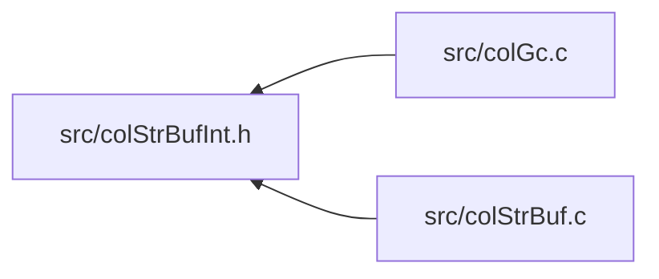

<a id="col_str_buf_int_8h"></a>
# File colStrBufInt.h

![][C++]

**Location**: `src/colStrBufInt.h`

This header file defines the string buffer word internals of Colibri.

String buffers are used to build strings incrementally in an efficient manner, by appending individual characters or whole ropes. The current accumulated rope can be retrieved at any time.


**See also**: [colStrBuf.c](col_str_buf_8c.md#col_str_buf_8c), [colStrBuf.h](col_str_buf_8h.md#col_str_buf_8h)

## Included by

* [src/colGc.c](col_gc_8c.md#col_gc_8c)
* [src/colStrBuf.c](col_str_buf_8c.md#col_str_buf_8c)



## String Buffer Constants

<a id="group__strbuf__words_1ga00d4433afb72b5ac6983db2a70c02bcf"></a>
### Macro STRBUF\_HEADER\_SIZE

![][public]

```cpp
#define STRBUF_HEADER_SIZE (sizeof(size_t)*3)
```

Byte size of string buffer header.


<a id="group__strbuf__words_1ga1ea7cfcb3f2246521db1f9cc27bb598c"></a>
### Macro STRBUF\_MAX\_SIZE

![][public]

```cpp
#define STRBUF_MAX_SIZE UINT16_MAX
```

Maximum cell size taken by string buffers.


## String Buffer Utilities

<a id="group__strbuf__words_1ga7e3612f406000af77436193770547188"></a>
### Macro STRBUF\_SIZE

![][public]

```cpp
#define STRBUF_SIZE     ([NB\_CELLS](col_internal_8h.md#group__pages__cells_1ga6969cfc3c9b2913a913df84f7842ce74)([STRBUF\_HEADER\_SIZE](col_str_buf_int_8h.md#group__strbuf__words_1ga00d4433afb72b5ac6983db2a70c02bcf)+(byteLength)))( byteLength )
```

Get number of cells for a string buffer of a given length.

**Parameters**:

* **byteLength**: Buffer length in bytes.


**Returns**:

Number of cells taken by word.


<a id="group__strbuf__words_1ga7484adce06c0538b7285371ac4cd18ce"></a>
### Macro STRBUF\_MAX\_LENGTH

![][public]

```cpp
#define STRBUF_MAX_LENGTH     (((byteSize)-[STRBUF\_HEADER\_SIZE](col_str_buf_int_8h.md#group__strbuf__words_1ga00d4433afb72b5ac6983db2a70c02bcf))/[CHAR\_WIDTH](col_internal_8h.md#group__strings_1gaf5aa639fca28d7d2fa2ab575d2aa9612)(format))( byteSize ,format )
```

Get maximum string buffer length for a given byte size.

**Parameters**:

* **byteSize**: Available size.
* **format**: Character format.


**Returns**:

String buffer length fitting the given size.


## String Buffer Creation

<a id="group__strbuf__words_1ga271b07b1cdd01774692ca64687c3f8ab"></a>
### Macro WORD\_STRBUF\_INIT

![][public]

```cpp
#define WORD_STRBUF_INIT     [WORD\_SET\_TYPEID](col_word_int_8h.md#group__predefined__words_1ga52822cf424704829e60b112fe03614b6)((word), [WORD\_TYPE\_STRBUF](col_word_int_8h.md#group__words_1ga31e3979e5f5419111f813131cd508768)); \
    [WORD\_STRBUF\_FORMAT](col_str_buf_int_8h.md#group__strbuf__words_1gab9e86210fdabc7589bcb4d439ed1ee00)(word) = (format); \
    [WORD\_STRBUF\_SIZE](col_str_buf_int_8h.md#group__strbuf__words_1ga9273c95e47384885fc2340c2f6e12bcc)(word) = (uint16_t) (size); \
    [WORD\_STRBUF\_ROPE](col_str_buf_int_8h.md#group__strbuf__words_1gab4991b12f32c9e890f71a8dd16701f83)(word) = [WORD\_SMALLSTR\_EMPTY](col_word_int_8h.md#group__smallstr__words_1gaced4b5ab427a8009e9e3586f60cf487f); \
    [WORD\_STRBUF\_LENGTH](col_str_buf_int_8h.md#group__strbuf__words_1ga05ca1e3d8d745145f4d2614f29b1ed0b)(word) = 0;( word ,size ,format )
```

String buffer word initializer.

**Parameters**:

* **word**: Word to initialize.
* **size**: [WORD\_STRBUF\_SIZE](col_str_buf_int_8h.md#group__strbuf__words_1ga9273c95e47384885fc2340c2f6e12bcc).
* **format**: [WORD\_STRBUF\_FORMAT](col_str_buf_int_8h.md#group__strbuf__words_1gab9e86210fdabc7589bcb4d439ed1ee00).


!> **Warning** \
Argument **word** is referenced several times by the macro. Make sure to avoid any side effect.


**See also**: [WORD\_TYPE\_STRBUF](col_word_int_8h.md#group__words_1ga31e3979e5f5419111f813131cd508768)


## String Buffer Accessors

<a id="group__strbuf__words_1gab9e86210fdabc7589bcb4d439ed1ee00"></a>
### Macro WORD\_STRBUF\_FORMAT

![][public]

```cpp
#define WORD_STRBUF_FORMAT (((int8_t *)(word))[1])( word )
```

Get/set preferred format for string building.

**Parameters**:

* **word**: Word to access.


?> Macro is L-Value and suitable for both read/write operations.


**See also**: [WORD\_STRBUF\_INIT](col_str_buf_int_8h.md#group__strbuf__words_1ga271b07b1cdd01774692ca64687c3f8ab)


<a id="group__strbuf__words_1ga9273c95e47384885fc2340c2f6e12bcc"></a>
### Macro WORD\_STRBUF\_SIZE

![][public]

```cpp
#define WORD_STRBUF_SIZE (((uint16_t *)(word))[1])( word )
```

Get/set number of allocated cells.

**Parameters**:

* **word**: Word to access.


?> Macro is L-Value and suitable for both read/write operations.


**See also**: [WORD\_STRBUF\_INIT](col_str_buf_int_8h.md#group__strbuf__words_1ga271b07b1cdd01774692ca64687c3f8ab)


<a id="group__strbuf__words_1gab4991b12f32c9e890f71a8dd16701f83"></a>
### Macro WORD\_STRBUF\_ROPE

![][public]

```cpp
#define WORD_STRBUF_ROPE ((([Col\_Word](col_word_8h.md#group__words_1gadb626f9e195212e4fdfba7df154ad043) *)(word))[1])( word )
```

Get/set cumulated rope so far.

**Parameters**:

* **word**: Word to access.


?> Macro is L-Value and suitable for both read/write operations.


**See also**: [WORD\_STRBUF\_INIT](col_str_buf_int_8h.md#group__strbuf__words_1ga271b07b1cdd01774692ca64687c3f8ab)


<a id="group__strbuf__words_1ga05ca1e3d8d745145f4d2614f29b1ed0b"></a>
### Macro WORD\_STRBUF\_LENGTH

![][public]

```cpp
#define WORD_STRBUF_LENGTH (((size_t *)(word))[2])( word )
```

Get/set current length of character buffer.

**Parameters**:

* **word**: Word to access.


?> Macro is L-Value and suitable for both read/write operations.


**See also**: [WORD\_STRBUF\_INIT](col_str_buf_int_8h.md#group__strbuf__words_1ga271b07b1cdd01774692ca64687c3f8ab)


<a id="group__strbuf__words_1ga078f2268d4a63773bcce56ee719cb551"></a>
### Macro WORD\_STRBUF\_BUFFER

![][public]

```cpp
#define WORD_STRBUF_BUFFER ((const char *)(word)+[STRBUF\_HEADER\_SIZE](col_str_buf_int_8h.md#group__strbuf__words_1ga00d4433afb72b5ac6983db2a70c02bcf))( word )
```

Pointer to character buffer data (array of characters in the format given by [WORD\_STRBUF\_FORMAT](col_str_buf_int_8h.md#group__strbuf__words_1gab9e86210fdabc7589bcb4d439ed1ee00)).

**Parameters**:

* **word**: Word to access.


## String Buffer Exceptions

<a id="group__strbuf__words_1gac92bccb1906795cc7eac4c28989bd144"></a>
### Macro TYPECHECK\_STRBUF

![][public]

```cpp
#define TYPECHECK_STRBUF     [TYPECHECK](col_internal_8h.md#group__error_1gaa780a70ef44d8ae2fb023777a35ade9a)(([Col\_WordType](col_word_8h.md#group__words_1gab0f27c794b1e7ed60b537e2ce94b4408)(word) & [COL\_STRBUF](col_word_8h.md#group__words_1ga747d59c28f0e463cc0818ba691aade31)), [COL\_ERROR\_STRBUF](colibri_8h.md#group__error_1gga729084542ed9eae62009a84d3379ef35a24606ae882ebe15eceb13230471fe356), (word))( word )
```

Type checking macro for string buffers.

**Parameters**:

* **word**: Checked word.


**Exceptions**:

* **[COL\_ERROR\_STRBUF](colibri_8h.md#group__error_1gga729084542ed9eae62009a84d3379ef35a24606ae882ebe15eceb13230471fe356)**: [[T]](colibri_8h.md#group__error_1gga6dab009a0b8c4b4fa080cb9ba1859e9ea603a58b9d5bb16fde0708eb0767e4904) **word**: Not a string buffer.


<a id="group__strbuf__words_1gafa1b1cc1ddba12fc7d86d66d28bccedd"></a>
### Macro VALUECHECK\_STRBUF\_FORMAT

![][public]

```cpp
#define VALUECHECK_STRBUF_FORMAT( format )
```

Value checking macro for string buffers, ensures that format is supported.

**Parameters**:

* **format**: Checked format.


**Exceptions**:

* **[COL\_ERROR\_STRBUF\_FORMAT](colibri_8h.md#group__error_1gga729084542ed9eae62009a84d3379ef35af19a91631001d2669a4a068b71162df3)**: [[V]](colibri_8h.md#group__error_1gga6dab009a0b8c4b4fa080cb9ba1859e9ea65d5e7232c82ae6972ac56f386a32fc9) **format is not supported**: String format not supported.


## Source

```cpp
/**
 * @file colStrBufInt.h
 *
 * This header file defines the string buffer word internals of Colibri.
 *
 * String buffers are used to build strings incrementally in an efficient
 * manner, by appending individual characters or whole ropes. The current
 * accumulated rope can be retrieved at any time.
 *
 * @see colStrBuf.c
 * @see colStrBuf.h
 *
 * @beginprivate @cond PRIVATE
 */

#ifndef _COLIBRI_STRBUF_INT
#define _COLIBRI_STRBUF_INT


/*
===========================================================================*//*!
\internal \addtogroup strbuf_words String Buffers

@par Requirements
    - String buffer words can use different character formats for internal
      storage. So they need to store this information.

    - Characters can be appended individually or in bulks (ropes or sequences
      as iterator ranges). When adding single or multiple characters, they are
      appended to an internal buffer stored within the word, up to its maximum
      capacity. When the buffer is full, a rope is appended, or the
      accumulated value is retrieved, then the buffer content is appended to the
      accumulated rope so far and the buffer is cleared before performing the
      operation.

    - String buffers have a capacity set at creation time, which is the 
      guaranteed number of characters the buffer can store. This plus the format
      determines the maximum byte size of the buffer and thus the number of 
      cells the word takes.
      
    - Characters are stored in fixed-width arrays. For this reason, 
      variable-width formats are not supported.

    @param Format   Preferred format for string building.
    @param Size     Number of allocated cells.
    @param Rope     Cumulated rope so far.
    @param Length   Current length of character buffer.
    @param Buffer   Character buffer data (array of characters).

@par Cell Layout
    On all architectures the cell layout is as follows:

    @dot
    digraph {
        node [fontname="Lucida Console,Courier" fontsize=14];
        strbuf_word [shape=none, label=<
            <table border="0" cellborder="1" cellspacing="0">
            <tr><td border="0"></td>
                <td sides="B" width="40" align="left">0</td><td sides="B" width="40" align="right">7</td>
                <td sides="B" width="40" align="left">8</td><td sides="B" width="40" align="right">15</td>
                <td sides="B" width="80" align="left">16</td><td sides="B" width="80" align="right">31</td>
                <td sides="B" align="right">n</td>
            </tr>
            <tr><td sides="R">0</td>
                <td href="@ref WORD_TYPEID" title="WORD_TYPEID" colspan="2">Type</td>
                <td href="@ref WORD_STRBUF_FORMAT" title="WORD_STRBUF_FORMAT" colspan="2">Format</td>
                <td href="@ref WORD_STRBUF_SIZE" title="WORD_STRBUF_SIZE" colspan="2">Size</td>
                <td bgcolor="grey75"> Unused (n &gt; 32) </td>
            </tr>
            <tr><td sides="R">1</td>
                <td href="@ref WORD_STRBUF_ROPE" title="WORD_STRBUF_ROPE" colspan="7">Rope</td>
            </tr>
            <tr><td sides="R">2</td>
                <td href="@ref WORD_STRBUF_LENGTH" title="WORD_STRBUF_LENGTH" colspan="7">Length</td>
            </tr>
            <tr><td sides="R">.</td>
                <td href="@ref WORD_STRBUF_BUFFER" title="WORD_STRBUF_BUFFER" colspan="7" rowspan="3">Buffer</td>
            </tr>
            <tr><td sides="R">.</td></tr>
            <tr><td sides="R">N</td></tr>
            </table>
        >]
    }
    @enddot

    @begindiagram
        0     7 8     15 16          31                               n
       +-------+--------+--------------+-------------------------------+
     0 | Type  | Format |     Size     |        Unused (n > 32)        |
       +-------+--------+--------------+-------------------------------+
     1 |                              Rope                             |
       +---------------------------------------------------------------+
     2 |                             Length                            |
       +---------------------------------------------------------------+
       .                                                               .
       .                             Buffer                            .
     N |                                                               |
       +---------------------------------------------------------------+
    @enddiagram

@see WORD_TYPE_STRBUF
\{*//*==========================================================================
*/

/***************************************************************************//*!
 * \name String Buffer Constants
 ***************************************************************************\{*/

/** Byte size of string buffer header. */
#define STRBUF_HEADER_SIZE              (sizeof(size_t)*3)

/** Maximum cell size taken by string buffers. */
#define STRBUF_MAX_SIZE                 UINT16_MAX

/* End of String Buffer Constants *//*!\}*/


/***************************************************************************//*!
 * \name String Buffer Utilities
 ***************************************************************************\{*/

/**
 * Get number of cells for a string buffer of a given length.
 *
 * @param byteLength  Buffer length in bytes.
 *
 * @return Number of cells taken by word.
 */
#define STRBUF_SIZE(byteLength) \
    (NB_CELLS(STRBUF_HEADER_SIZE+(byteLength)))

/**
 * Get maximum string buffer length for a given byte size.
 *
 * @param byteSize  Available size.
 * @param format    Character format.
 *
 * @return String buffer length fitting the given size.
 */
#define STRBUF_MAX_LENGTH(byteSize, format) \
    (((byteSize)-STRBUF_HEADER_SIZE)/CHAR_WIDTH(format))

/* End of String Buffer Utilities *//*!\}*/


/***************************************************************************//*!
 * \name String Buffer Creation
 ***************************************************************************\{*/

/**
 * String buffer word initializer.
 *
 * @param word      Word to initialize.
 * @param size      #WORD_STRBUF_SIZE.
 * @param format    #WORD_STRBUF_FORMAT.
 *
 * @warning
 *      Argument **word** is referenced several times by the macro. Make sure to
 *      avoid any side effect.
 *
 * @see WORD_TYPE_STRBUF
 */
#define WORD_STRBUF_INIT(word, size, format) \
    WORD_SET_TYPEID((word), WORD_TYPE_STRBUF); \
    WORD_STRBUF_FORMAT(word) = (format); \
    WORD_STRBUF_SIZE(word) = (uint16_t) (size); \
    WORD_STRBUF_ROPE(word) = WORD_SMALLSTR_EMPTY; \
    WORD_STRBUF_LENGTH(word) = 0;

/* End of String Buffer Creation *//*!\}*/


/***************************************************************************//*!
 * \name String Buffer Accessors
 ***************************************************************************\{*/

/**
 * Get/set preferred format for string building.
 *
 * @param word  Word to access.
 *
 * @note
 *      Macro is L-Value and suitable for both read/write operations.
 *
 * @see WORD_STRBUF_INIT
 */
#define WORD_STRBUF_FORMAT(word)        (((int8_t *)(word))[1])

/**
 * Get/set number of allocated cells.
 *
 * @param word  Word to access.
 *
 * @note
 *      Macro is L-Value and suitable for both read/write operations.
 *
 * @see WORD_STRBUF_INIT
 */
#define WORD_STRBUF_SIZE(word)          (((uint16_t *)(word))[1])

/**
 * Get/set cumulated rope so far.
 *
 * @param word  Word to access.
 *
 * @note
 *      Macro is L-Value and suitable for both read/write operations.
 *
 * @see WORD_STRBUF_INIT
 */
#define WORD_STRBUF_ROPE(word)          (((Col_Word *)(word))[1])

/**
 * Get/set current length of character buffer.
 *
 * @param word  Word to access.
 *
 * @note
 *      Macro is L-Value and suitable for both read/write operations.
 *
 * @see WORD_STRBUF_INIT
 */
#define WORD_STRBUF_LENGTH(word)        (((size_t *)(word))[2])

/**
 * Pointer to character buffer data (array of characters in the format given
 * by #WORD_STRBUF_FORMAT).
 *
 * @param word  Word to access.
 */
#define WORD_STRBUF_BUFFER(word)        ((const char *)(word)+STRBUF_HEADER_SIZE)

/* End of String Buffer Accessors *//*!\}*/


/***************************************************************************//*!
 * \name String Buffer Exceptions
 ***************************************************************************\{*/

/**
 * Type checking macro for string buffers.
 *
 * @param word  Checked word.
 *
 * @typecheck{COL_ERROR_STRBUF,word}
 */
#define TYPECHECK_STRBUF(word) \
    TYPECHECK((Col_WordType(word) & COL_STRBUF), COL_ERROR_STRBUF, (word))

/**
 * Value checking macro for string buffers, ensures that format is supported.
 *
 * @param format        Checked format.
 *
 * @valuecheck{COL_ERROR_STRBUF_FORMAT,format is not supported}
 * @hideinitializer
 */
#define VALUECHECK_STRBUF_FORMAT(format) \
    VALUECHECK((!FORMAT_UTF(format)), COL_ERROR_STRBUF_FORMAT, (format))

/* End of String Buffer Exceptions *//*!\}*/

/* End of String Buffers *//*!\}*/

#endif /* _COLIBRI_STRBUF_INT */
/*! @endcond @endprivate */
```

[public]: https://img.shields.io/badge/-public-brightgreen (public)
[C++]: https://img.shields.io/badge/language-C%2B%2B-blue (C++)
[private]: https://img.shields.io/badge/-private-red (private)
[Markdown]: https://img.shields.io/badge/language-Markdown-blue (Markdown)
[static]: https://img.shields.io/badge/-static-lightgrey (static)