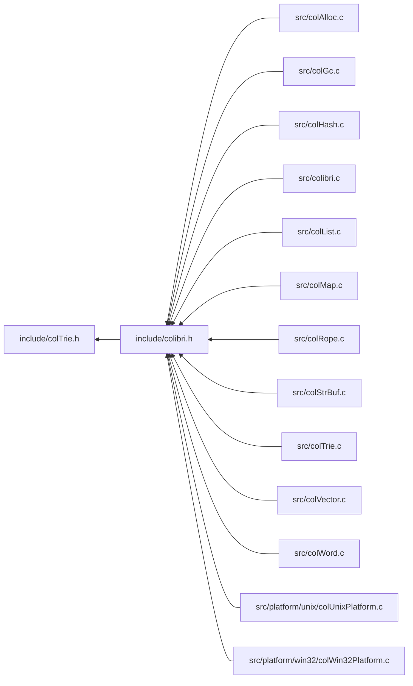

<a id="col_trie_8h"></a>
# File colTrie.h

![][C++]

**Location**: `include/colTrie.h`

This header file defines the trie map handling features of Colibri.

Trie maps are an implementation of generic [Maps](group__map__words.md#group__map__words) that use crit-bit trees for string, integer and custom keys.


They are always mutable.


**See also**: [colMap.h](col_map_8h.md#col_map_8h)

## Classes

* [Col\_CustomTrieMapType](struct_col___custom_trie_map_type.md#struct_col___custom_trie_map_type)

## Included by

* [include/colibri.h](colibri_8h.md#colibri_8h)



## Trie Map Creation

<a id="group__triemap__words_1ga41fcb3cc5b729930b9a9c405f4fabc25"></a>
### Function Col\_NewStringTrieMap

![][public]

```cpp
Col_Word Col_NewStringTrieMap()
```

Create a new string trie map word.

**Returns**:

The new word.


**Return type**: EXTERN [Col\_Word](col_word_8h.md#group__words_1gadb626f9e195212e4fdfba7df154ad043)

**References**:

* [AllocCells](col_gc_8c.md#group__alloc_1gaeec69115deeb3321bdfbb4e42119f806)
* [WORD\_STRTRIEMAP\_INIT](col_trie_int_8h.md#group__strtriemap__words_1ga973ba8a0c6db8328aedcd73fd303a10d)

<a id="group__triemap__words_1ga774d1c17ace439ef92703934652ccec0"></a>
### Function Col\_NewIntTrieMap

![][public]

```cpp
Col_Word Col_NewIntTrieMap()
```

Create a new integer trie map word.

**Returns**:

The new word.


**Return type**: EXTERN [Col\_Word](col_word_8h.md#group__words_1gadb626f9e195212e4fdfba7df154ad043)

**References**:

* [AllocCells](col_gc_8c.md#group__alloc_1gaeec69115deeb3321bdfbb4e42119f806)
* [WORD\_INTTRIEMAP\_INIT](col_trie_int_8h.md#group__inttriemap__words_1ga26d6d540935055cb89a59be313bb3dc4)

<a id="group__triemap__words_1ga34e494c0bafde72774a578643bb84a68"></a>
### Function Col\_CopyTrieMap

![][public]

```cpp
Col_Word Col_CopyTrieMap(Col_Word map)
```

Create a new trie map word from an existing one.

?> Only the trie map structure is copied, the contained words are not (i.e. this is not a deep copy).


**Returns**:

The new word.


**Side Effect**:

Source map content is frozen.

**Exceptions**:

* **[COL\_ERROR\_TRIEMAP](colibri_8h.md#group__error_1gga729084542ed9eae62009a84d3379ef35a0622eefca9ad7bfcd98ef21080611bb3)**: [[T]](colibri_8h.md#group__error_1gga6dab009a0b8c4b4fa080cb9ba1859e9ea603a58b9d5bb16fde0708eb0767e4904) **map**: Not a trie map.

**Parameters**:

* [Col\_Word](col_word_8h.md#group__words_1gadb626f9e195212e4fdfba7df154ad043) **map**: Trie map to copy.

**Return type**: EXTERN [Col\_Word](col_word_8h.md#group__words_1gadb626f9e195212e4fdfba7df154ad043)

**References**:

* [AllocCells](col_gc_8c.md#group__alloc_1gaeec69115deeb3321bdfbb4e42119f806)
* [FreezeSubtrie](col_trie_8c.md#group__triemap__words_1gae08a42af53898be18c542dc457bf6c48)
* [TYPECHECK\_TRIEMAP](col_trie_int_8h.md#group__triemap__words_1gaf35929b0382fec191e37ffd71675a479)
* [WORD\_CLEAR\_PINNED](col_word_int_8h.md#group__regular__words_1ga04a19fb132382d52fa42d3d3e4237f2f)
* [WORD\_NIL](col_word_8h.md#group__words_1ga29e370264f4e5659ccc5be4de209f065)
* [WORD\_SYNONYM](col_word_int_8h.md#group__regular__words_1ga19cfddbcf0127f5088803cc68ddb8eaa)
* [WORD\_TRIEMAP\_ROOT](col_trie_int_8h.md#group__triemap__words_1ga62ce82c870c8e6905dd22b1df72f08f3)

## Trie Map Accessors

<a id="group__triemap__words_1ga60077ee297a2a45306a8d2e9107ddd4c"></a>
### Function Col\_TrieMapGet

![][public]

```cpp
int Col_TrieMapGet(Col_Word map, Col_Word key, Col_Word *valuePtr)
```

Get value mapped to the given key if present.

**Return values**:

* **0**: if the key wasn't found.
* **<>0**: if the key was found, in this case the value is returned through **valuePtr**.


**See also**: [Col\_MapGet](col_map_8h.md#group__map__words_1gabd075578f35ec7a706654e94aba281d9)

**Exceptions**:

* **[COL\_ERROR\_WORDTRIEMAP](colibri_8h.md#group__error_1gga729084542ed9eae62009a84d3379ef35ac284ba5976b713b7a2db37bace5620fb)**: [[T]](colibri_8h.md#group__error_1gga6dab009a0b8c4b4fa080cb9ba1859e9ea603a58b9d5bb16fde0708eb0767e4904) **map**: Not a string or word-keyed trie map.

**Parameters**:

* [Col\_Word](col_word_8h.md#group__words_1gadb626f9e195212e4fdfba7df154ad043) **map**: Trie map to get entry for.
* [Col\_Word](col_word_8h.md#group__words_1gadb626f9e195212e4fdfba7df154ad043) **key**: Entry key. Can be any word type, including string, however it must match the actual type used by the map.
* [Col\_Word](col_word_8h.md#group__words_1gadb626f9e195212e4fdfba7df154ad043) * **valuePtr**: [out] Returned entry value, if found.

**Return type**: EXTERN int

**References**:

* [ASSERT](col_internal_8h.md#group__error_1gac22830a985e1daed0c9eadba8c6f606e)
* [StringTrieMapFindEntry](col_trie_8c.md#group__triemap__words_1ga22228c8cc05e205425dd3f6bba64c759)
* [TrieMapFindEntry](col_trie_8c.md#group__triemap__words_1ga927988459b3b6759f775b0c4af8f3c5e)
* [TYPECHECK\_WORDTRIEMAP](col_trie_int_8h.md#group__triemap__words_1gaffdf9a4bdf226bad07fb2c8a2a1a5c7d)
* [WORD\_MAPENTRY\_VALUE](col_map_int_8h.md#group__mapentry__words_1gabad6806f2947f508a9786948c1663064)
* [WORD\_TYPE](col_word_int_8h.md#group__words_1ga014e27ea4160eb3845ac495a22c232f5)
* [WORD\_TYPE\_CUSTOM](col_word_int_8h.md#group__words_1ga8babfbc77291680db519873c91efdd4c)
* [WORD\_TYPE\_MTRIELEAF](col_word_int_8h.md#group__words_1ga4c7f02b7545a17f527d59a2c66e9d0fa)
* [WORD\_TYPE\_STRTRIEMAP](col_word_int_8h.md#group__words_1gae4ef7e39bd92ee96414ee98c844065ec)
* [WORD\_TYPE\_TRIELEAF](col_word_int_8h.md#group__words_1ga2a17ea1e39ad925fc0057cd928cdd49c)

**Referenced by**:

* [Col\_MapGet](col_map_8h.md#group__map__words_1gabd075578f35ec7a706654e94aba281d9)

<a id="group__triemap__words_1gafb5c74dcca8204a0b83e6d1fa9325026"></a>
### Function Col\_IntTrieMapGet

![][public]

```cpp
int Col_IntTrieMapGet(Col_Word map, intptr_t key, Col_Word *valuePtr)
```

Get value mapped to the given integer key if present.

**Return values**:

* **0**: if the key wasn't found.
* **<>0**: if the key was found, in this case the value is returned through **valuePtr**.


**See also**: [Col\_IntMapGet](col_map_8h.md#group__map__words_1ga4f96f7436cc66537b05841c5b088eef2)

**Exceptions**:

* **[COL\_ERROR\_INTTRIEMAP](colibri_8h.md#group__error_1gga729084542ed9eae62009a84d3379ef35ad77018799a3606551c4a3a66f6285b49)**: [[T]](colibri_8h.md#group__error_1gga6dab009a0b8c4b4fa080cb9ba1859e9ea603a58b9d5bb16fde0708eb0767e4904) **map**: Not an integer-keyed trie map.

**Parameters**:

* [Col\_Word](col_word_8h.md#group__words_1gadb626f9e195212e4fdfba7df154ad043) **map**: Integer trie map to get entry for.
* intptr_t **key**: Integer entry key
* [Col\_Word](col_word_8h.md#group__words_1gadb626f9e195212e4fdfba7df154ad043) * **valuePtr**: [out] Returned entry value, if found.

**Return type**: EXTERN int

**References**:

* [ASSERT](col_internal_8h.md#group__error_1gac22830a985e1daed0c9eadba8c6f606e)
* [IntTrieMapFindEntry](col_trie_8c.md#group__triemap__words_1ga15570e9b8e1e48b2ea26b6ea369a95fb)
* [TYPECHECK\_INTTRIEMAP](col_trie_int_8h.md#group__inttriemap__words_1ga355b10b52e63c90e95300c26d5c8b54d)
* [WORD\_MAPENTRY\_VALUE](col_map_int_8h.md#group__mapentry__words_1gabad6806f2947f508a9786948c1663064)
* [WORD\_TYPE](col_word_int_8h.md#group__words_1ga014e27ea4160eb3845ac495a22c232f5)
* [WORD\_TYPE\_INTTRIELEAF](col_word_int_8h.md#group__words_1ga896310a96176f87d4ec0bd06eabf55f7)
* [WORD\_TYPE\_MINTTRIELEAF](col_word_int_8h.md#group__words_1ga81a397c929cd0fa5f89c5a01ce2a1487)

**Referenced by**:

* [Col\_IntMapGet](col_map_8h.md#group__map__words_1ga4f96f7436cc66537b05841c5b088eef2)

<a id="group__triemap__words_1ga05580df1648d9d53b333ac6da24de26d"></a>
### Function Col\_TrieMapSet

![][public]

```cpp
int Col_TrieMapSet(Col_Word map, Col_Word key, Col_Word value)
```

Map the value to the key, replacing any existing.

**Return values**:

* **0**: if an existing entry was updated with **value**.
* **<>0**: if a new entry was created with **key** and **value**.


**See also**: [Col\_MapSet](col_map_8h.md#group__map__words_1ga82b31e62df46ff382e18241bdcde49e3)

**Exceptions**:

* **[COL\_ERROR\_WORDTRIEMAP](colibri_8h.md#group__error_1gga729084542ed9eae62009a84d3379ef35ac284ba5976b713b7a2db37bace5620fb)**: [[T]](colibri_8h.md#group__error_1gga6dab009a0b8c4b4fa080cb9ba1859e9ea603a58b9d5bb16fde0708eb0767e4904) **map**: Not a string or word-keyed trie map.

**Parameters**:

* [Col\_Word](col_word_8h.md#group__words_1gadb626f9e195212e4fdfba7df154ad043) **map**: Trie map to insert entry into.
* [Col\_Word](col_word_8h.md#group__words_1gadb626f9e195212e4fdfba7df154ad043) **key**: Entry key. Can be any word type, including string, however it must match the actual type used by the map.
* [Col\_Word](col_word_8h.md#group__words_1gadb626f9e195212e4fdfba7df154ad043) **value**: Entry value.

**Return type**: EXTERN int

**References**:

* [ASSERT](col_internal_8h.md#group__error_1gac22830a985e1daed0c9eadba8c6f606e)
* [StringTrieMapFindEntry](col_trie_8c.md#group__triemap__words_1ga22228c8cc05e205425dd3f6bba64c759)
* [TrieMapFindEntry](col_trie_8c.md#group__triemap__words_1ga927988459b3b6759f775b0c4af8f3c5e)
* [TYPECHECK\_WORDTRIEMAP](col_trie_int_8h.md#group__triemap__words_1gaffdf9a4bdf226bad07fb2c8a2a1a5c7d)
* [WORD\_MAPENTRY\_VALUE](col_map_int_8h.md#group__mapentry__words_1gabad6806f2947f508a9786948c1663064)
* [WORD\_TYPE](col_word_int_8h.md#group__words_1ga014e27ea4160eb3845ac495a22c232f5)
* [WORD\_TYPE\_CUSTOM](col_word_int_8h.md#group__words_1ga8babfbc77291680db519873c91efdd4c)
* [WORD\_TYPE\_MTRIELEAF](col_word_int_8h.md#group__words_1ga4c7f02b7545a17f527d59a2c66e9d0fa)
* [WORD\_TYPE\_STRTRIEMAP](col_word_int_8h.md#group__words_1gae4ef7e39bd92ee96414ee98c844065ec)

**Referenced by**:

* [Col\_MapSet](col_map_8h.md#group__map__words_1ga82b31e62df46ff382e18241bdcde49e3)

<a id="group__triemap__words_1ga93b4e0529f287e7116fc7e6ecd5a5859"></a>
### Function Col\_IntTrieMapSet

![][public]

```cpp
int Col_IntTrieMapSet(Col_Word map, intptr_t key, Col_Word value)
```

Map the value to the integer key, replacing any existing.

**Return values**:

* **0**: if an existing entry was updated with **value**.
* **<>0**: if a new entry was created with **key** and **value**.


**See also**: [Col\_IntMapSet](col_map_8h.md#group__map__words_1ga27a694b6de40e1a3af81379a7056754d)

**Exceptions**:

* **[COL\_ERROR\_INTTRIEMAP](colibri_8h.md#group__error_1gga729084542ed9eae62009a84d3379ef35ad77018799a3606551c4a3a66f6285b49)**: [[T]](colibri_8h.md#group__error_1gga6dab009a0b8c4b4fa080cb9ba1859e9ea603a58b9d5bb16fde0708eb0767e4904) **map**: Not an integer-keyed trie map.

**Parameters**:

* [Col\_Word](col_word_8h.md#group__words_1gadb626f9e195212e4fdfba7df154ad043) **map**: Integer trie map to insert entry into.
* intptr_t **key**: Integer entry key.
* [Col\_Word](col_word_8h.md#group__words_1gadb626f9e195212e4fdfba7df154ad043) **value**: Entry value.

**Return type**: EXTERN int

**References**:

* [ASSERT](col_internal_8h.md#group__error_1gac22830a985e1daed0c9eadba8c6f606e)
* [IntTrieMapFindEntry](col_trie_8c.md#group__triemap__words_1ga15570e9b8e1e48b2ea26b6ea369a95fb)
* [TYPECHECK\_INTTRIEMAP](col_trie_int_8h.md#group__inttriemap__words_1ga355b10b52e63c90e95300c26d5c8b54d)
* [WORD\_MAPENTRY\_VALUE](col_map_int_8h.md#group__mapentry__words_1gabad6806f2947f508a9786948c1663064)
* [WORD\_TYPE](col_word_int_8h.md#group__words_1ga014e27ea4160eb3845ac495a22c232f5)
* [WORD\_TYPE\_MINTTRIELEAF](col_word_int_8h.md#group__words_1ga81a397c929cd0fa5f89c5a01ce2a1487)

**Referenced by**:

* [Col\_IntMapSet](col_map_8h.md#group__map__words_1ga27a694b6de40e1a3af81379a7056754d)

<a id="group__triemap__words_1gaab7c1e33efc9b0e1fb913951d4b61fc2"></a>
### Function Col\_TrieMapUnset

![][public]

```cpp
int Col_TrieMapUnset(Col_Word map, Col_Word key)
```

Remove any value mapped to the given key.

**Return values**:

* **0**: if no entry matching **key** was found.
* **<>0**: if the existing entry was removed.


**See also**: [Col\_MapUnset](col_map_8h.md#group__map__words_1ga1f48ed3390f9a53cde268533a763e638)

**Exceptions**:

* **[COL\_ERROR\_WORDTRIEMAP](colibri_8h.md#group__error_1gga729084542ed9eae62009a84d3379ef35ac284ba5976b713b7a2db37bace5620fb)**: [[T]](colibri_8h.md#group__error_1gga6dab009a0b8c4b4fa080cb9ba1859e9ea603a58b9d5bb16fde0708eb0767e4904) **map**: Not a string or word-keyed trie map.

**Parameters**:

* [Col\_Word](col_word_8h.md#group__words_1gadb626f9e195212e4fdfba7df154ad043) **map**: Trie map to remove entry from.
* [Col\_Word](col_word_8h.md#group__words_1gadb626f9e195212e4fdfba7df154ad043) **key**: Entry key. Can be any word type, including string, however it must match the actual type used by the map.

**Return type**: EXTERN int

**References**:

* [ASSERT](col_internal_8h.md#group__error_1gac22830a985e1daed0c9eadba8c6f606e)
* [ConvertStringNodeToMutable](col_trie_8c.md#group__triemap__words_1ga99dfbb25b22d51753f941a244aad50b1)
* [StringTrieMapFindNode](col_trie_8c.md#group__triemap__words_1ga7d5a67e353bf8772a706cffd1eba2692)
* [TrieMapFindNode](col_trie_8c.md#group__triemap__words_1ga732e679f3f44f4d0df06a1861a48846c)
* [TYPECHECK\_WORDTRIEMAP](col_trie_int_8h.md#group__triemap__words_1gaffdf9a4bdf226bad07fb2c8a2a1a5c7d)
* [WORD\_NIL](col_word_8h.md#group__words_1ga29e370264f4e5659ccc5be4de209f065)
* [WORD\_TRIEMAP\_ROOT](col_trie_int_8h.md#group__triemap__words_1ga62ce82c870c8e6905dd22b1df72f08f3)
* [WORD\_TRIEMAP\_SIZE](col_trie_int_8h.md#group__triemap__words_1ga9ccb73a2f8e1e4b2e451833d5cb6903c)
* [WORD\_TRIENODE\_LEFT](col_trie_int_8h.md#group__mtrienode__words_1ga96a098f14e33a0759a9962e567084a0a)
* [WORD\_TRIENODE\_RIGHT](col_trie_int_8h.md#group__mtrienode__words_1gaf58f69b75b276cb0b1dbdc54e94e31ad)
* [WORD\_TYPE](col_word_int_8h.md#group__words_1ga014e27ea4160eb3845ac495a22c232f5)
* [WORD\_TYPE\_CUSTOM](col_word_int_8h.md#group__words_1ga8babfbc77291680db519873c91efdd4c)
* [WORD\_TYPE\_MSTRTRIENODE](col_word_int_8h.md#group__words_1ga82e8b6ff4abcd49f5ffa67cc45b17358)
* [WORD\_TYPE\_STRTRIEMAP](col_word_int_8h.md#group__words_1gae4ef7e39bd92ee96414ee98c844065ec)
* [WORD\_TYPE\_STRTRIENODE](col_word_int_8h.md#group__words_1ga9ff5e124f29796ce3b1dd377f7d6d59f)

**Referenced by**:

* [Col\_MapUnset](col_map_8h.md#group__map__words_1ga1f48ed3390f9a53cde268533a763e638)

<a id="group__triemap__words_1gae11e5dcae95319e4fa94aec1f278909d"></a>
### Function Col\_IntTrieMapUnset

![][public]

```cpp
int Col_IntTrieMapUnset(Col_Word map, intptr_t key)
```

Remove any value mapped to the given integer key.

**Return values**:

* **0**: if no entry matching **key** was found.
* **<>0**: if the existing entry was removed.


**See also**: [Col\_IntMapUnset](col_map_8h.md#group__map__words_1gac2ae366ebe1ec3a4495128cb1400d1cf)

**Exceptions**:

* **[COL\_ERROR\_INTTRIEMAP](colibri_8h.md#group__error_1gga729084542ed9eae62009a84d3379ef35ad77018799a3606551c4a3a66f6285b49)**: [[T]](colibri_8h.md#group__error_1gga6dab009a0b8c4b4fa080cb9ba1859e9ea603a58b9d5bb16fde0708eb0767e4904) **map**: Not an integer-keyed trie map.

**Parameters**:

* [Col\_Word](col_word_8h.md#group__words_1gadb626f9e195212e4fdfba7df154ad043) **map**: Integer trie map to remove entry from.
* intptr_t **key**: Integer entry key.

**Return type**: EXTERN int

**References**:

* [ASSERT](col_internal_8h.md#group__error_1gac22830a985e1daed0c9eadba8c6f606e)
* [ConvertIntNodeToMutable](col_trie_8c.md#group__triemap__words_1gaaa5e678151930128e95296f7d2abf23c)
* [IntTrieMapFindNode](col_trie_8c.md#group__triemap__words_1ga9d750ac4583ab6d7bbc660a2beb68dae)
* [TYPECHECK\_INTTRIEMAP](col_trie_int_8h.md#group__inttriemap__words_1ga355b10b52e63c90e95300c26d5c8b54d)
* [WORD\_NIL](col_word_8h.md#group__words_1ga29e370264f4e5659ccc5be4de209f065)
* [WORD\_TRIEMAP\_ROOT](col_trie_int_8h.md#group__triemap__words_1ga62ce82c870c8e6905dd22b1df72f08f3)
* [WORD\_TRIEMAP\_SIZE](col_trie_int_8h.md#group__triemap__words_1ga9ccb73a2f8e1e4b2e451833d5cb6903c)
* [WORD\_TRIENODE\_LEFT](col_trie_int_8h.md#group__mtrienode__words_1ga96a098f14e33a0759a9962e567084a0a)
* [WORD\_TRIENODE\_RIGHT](col_trie_int_8h.md#group__mtrienode__words_1gaf58f69b75b276cb0b1dbdc54e94e31ad)
* [WORD\_TYPE](col_word_int_8h.md#group__words_1ga014e27ea4160eb3845ac495a22c232f5)
* [WORD\_TYPE\_INTTRIENODE](col_word_int_8h.md#group__words_1gac4adeeed11aa6a07235dfe4099c18074)
* [WORD\_TYPE\_MINTTRIENODE](col_word_int_8h.md#group__words_1gac0b62fa5b054dc6713a5fc7fd69298da)

**Referenced by**:

* [Col\_IntMapUnset](col_map_8h.md#group__map__words_1gac2ae366ebe1ec3a4495128cb1400d1cf)

## Trie Map Iteration

<a id="group__triemap__words_1ga85159bdeec81a97106171f745204fbdd"></a>
### Function Col\_TrieMapIterFirst

![][public]

```cpp
void Col_TrieMapIterFirst(Col_MapIterator it, Col_Word map)
```

Initialize the map iterator so that it points to the first entry within the trie map.

**See also**: [Col\_MapIterBegin](col_map_8h.md#group__map__words_1gab8f4a0de6b264bbe59c332b41a22866a)

**Exceptions**:

* **[COL\_ERROR\_TRIEMAP](colibri_8h.md#group__error_1gga729084542ed9eae62009a84d3379ef35a0622eefca9ad7bfcd98ef21080611bb3)**: [[T]](colibri_8h.md#group__error_1gga6dab009a0b8c4b4fa080cb9ba1859e9ea603a58b9d5bb16fde0708eb0767e4904) **map**: Not a trie map.

**Parameters**:

* [Col\_MapIterator](col_map_8h.md#group__map__words_1ga33d331116aff3f3d03a231ccbbce40c2) **it**: Iterator to initialize.
* [Col\_Word](col_word_8h.md#group__words_1gadb626f9e195212e4fdfba7df154ad043) **map**: Trie map to iterate over.

**Return type**: EXTERN void

**References**:

* [Col\_MapIterSetNull](col_map_8h.md#group__map__words_1ga3629bc2a457ae5a9ab57ab1f74ee0223)
* [LeftmostLeaf](col_trie_8c.md#group__triemap__words_1ga28a156030a11dc9c50ce922f08db2050)
* [TYPECHECK\_TRIEMAP](col_trie_int_8h.md#group__triemap__words_1gaf35929b0382fec191e37ffd71675a479)
* [WORD\_NIL](col_word_8h.md#group__words_1ga29e370264f4e5659ccc5be4de209f065)
* [WORD\_TRIEMAP\_ROOT](col_trie_int_8h.md#group__triemap__words_1ga62ce82c870c8e6905dd22b1df72f08f3)

**Referenced by**:

* [Col\_MapIterBegin](col_map_8h.md#group__map__words_1gab8f4a0de6b264bbe59c332b41a22866a)

<a id="group__triemap__words_1gadef108e47ee9b3abe7e0348c4e288df1"></a>
### Function Col\_TrieMapIterLast

![][public]

```cpp
void Col_TrieMapIterLast(Col_MapIterator it, Col_Word map)
```

Initialize the map iterator so that it points to the last entry within the trie map.


**Exceptions**:

* **[COL\_ERROR\_TRIEMAP](colibri_8h.md#group__error_1gga729084542ed9eae62009a84d3379ef35a0622eefca9ad7bfcd98ef21080611bb3)**: [[T]](colibri_8h.md#group__error_1gga6dab009a0b8c4b4fa080cb9ba1859e9ea603a58b9d5bb16fde0708eb0767e4904) **map**: Not a trie map.

**Parameters**:

* [Col\_MapIterator](col_map_8h.md#group__map__words_1ga33d331116aff3f3d03a231ccbbce40c2) **it**: Iterator to initialize.
* [Col\_Word](col_word_8h.md#group__words_1gadb626f9e195212e4fdfba7df154ad043) **map**: Trie map to iterate over.

**Return type**: EXTERN void

**References**:

* [Col\_MapIterSetNull](col_map_8h.md#group__map__words_1ga3629bc2a457ae5a9ab57ab1f74ee0223)
* [RightmostLeaf](col_trie_8c.md#group__triemap__words_1ga37363ba7d70725ad20aa37c9bfd3ea3d)
* [TYPECHECK\_TRIEMAP](col_trie_int_8h.md#group__triemap__words_1gaf35929b0382fec191e37ffd71675a479)
* [WORD\_NIL](col_word_8h.md#group__words_1ga29e370264f4e5659ccc5be4de209f065)
* [WORD\_TRIEMAP\_ROOT](col_trie_int_8h.md#group__triemap__words_1ga62ce82c870c8e6905dd22b1df72f08f3)

**Referenced by**:

* [Col\_TrieMapIterPrevious](col_trie_8h.md#group__triemap__words_1ga1d9f5165be9291968e815c8cf2e4a757)

<a id="group__triemap__words_1gab594f8e0086ad33bb029be6bc219a766"></a>
### Function Col\_TrieMapIterFind

![][public]

```cpp
void Col_TrieMapIterFind(Col_MapIterator it, Col_Word map, Col_Word key, int *createPtr)
```

Initialize the map iterator so that it points to the entry with the given key within the trie map.

**See also**: [Col\_MapIterFind](col_map_8h.md#group__map__words_1gaa925d7d32221bc826e9717930c2602e1)

**Exceptions**:

* **[COL\_ERROR\_WORDTRIEMAP](colibri_8h.md#group__error_1gga729084542ed9eae62009a84d3379ef35ac284ba5976b713b7a2db37bace5620fb)**: [[T]](colibri_8h.md#group__error_1gga6dab009a0b8c4b4fa080cb9ba1859e9ea603a58b9d5bb16fde0708eb0767e4904) **map**: Not a string or word-keyed trie map.

**Parameters**:

* [Col\_MapIterator](col_map_8h.md#group__map__words_1ga33d331116aff3f3d03a231ccbbce40c2) **it**: Iterator to initialize.
* [Col\_Word](col_word_8h.md#group__words_1gadb626f9e195212e4fdfba7df154ad043) **map**: Trie map to iterate over.
* [Col\_Word](col_word_8h.md#group__words_1gadb626f9e195212e4fdfba7df154ad043) **key**: Entry key. Can be any word type, including string, however it must match the actual type used by the map.
* int * **createPtr**: [in,out] If non-NULL, whether to create entry if absent on input, and whether an entry was created on output.

**Return type**: EXTERN void

**References**:

* [ASSERT](col_internal_8h.md#group__error_1gac22830a985e1daed0c9eadba8c6f606e)
* [Col\_MapIterSetNull](col_map_8h.md#group__map__words_1ga3629bc2a457ae5a9ab57ab1f74ee0223)
* [StringTrieMapFindEntry](col_trie_8c.md#group__triemap__words_1ga22228c8cc05e205425dd3f6bba64c759)
* [TrieMapFindEntry](col_trie_8c.md#group__triemap__words_1ga927988459b3b6759f775b0c4af8f3c5e)
* [TYPECHECK\_WORDTRIEMAP](col_trie_int_8h.md#group__triemap__words_1gaffdf9a4bdf226bad07fb2c8a2a1a5c7d)
* [WORD\_TRIEMAP\_ROOT](col_trie_int_8h.md#group__triemap__words_1ga62ce82c870c8e6905dd22b1df72f08f3)
* [WORD\_TYPE](col_word_int_8h.md#group__words_1ga014e27ea4160eb3845ac495a22c232f5)
* [WORD\_TYPE\_CUSTOM](col_word_int_8h.md#group__words_1ga8babfbc77291680db519873c91efdd4c)
* [WORD\_TYPE\_MTRIELEAF](col_word_int_8h.md#group__words_1ga4c7f02b7545a17f527d59a2c66e9d0fa)
* [WORD\_TYPE\_STRTRIEMAP](col_word_int_8h.md#group__words_1gae4ef7e39bd92ee96414ee98c844065ec)
* [WORD\_TYPE\_TRIELEAF](col_word_int_8h.md#group__words_1ga2a17ea1e39ad925fc0057cd928cdd49c)

**Referenced by**:

* [Col\_MapIterFind](col_map_8h.md#group__map__words_1gaa925d7d32221bc826e9717930c2602e1)

<a id="group__triemap__words_1gaae7f3d5178448023db25fbf6fd8c8f7a"></a>
### Function Col\_IntTrieMapIterFind

![][public]

```cpp
void Col_IntTrieMapIterFind(Col_MapIterator it, Col_Word map, intptr_t key, int *createPtr)
```

Initialize the map iterator so that it points to the entry with the given integer key within the integer trie map.

**See also**: [Col\_IntMapIterFind](col_map_8h.md#group__map__words_1ga8c332381607b0dc828b4aa96fa8f1a12)

**Exceptions**:

* **[COL\_ERROR\_INTTRIEMAP](colibri_8h.md#group__error_1gga729084542ed9eae62009a84d3379ef35ad77018799a3606551c4a3a66f6285b49)**: [[T]](colibri_8h.md#group__error_1gga6dab009a0b8c4b4fa080cb9ba1859e9ea603a58b9d5bb16fde0708eb0767e4904) **map**: Not an integer-keyed trie map.

**Parameters**:

* [Col\_MapIterator](col_map_8h.md#group__map__words_1ga33d331116aff3f3d03a231ccbbce40c2) **it**: Iterator to initialize.
* [Col\_Word](col_word_8h.md#group__words_1gadb626f9e195212e4fdfba7df154ad043) **map**: Integer trie map to iterate over.
* intptr_t **key**: Integer entry key.
* int * **createPtr**: [in,out] If non-NULL, whether to create entry if absent on input, and whether an entry was created on output.

**Return type**: EXTERN void

**References**:

* [ASSERT](col_internal_8h.md#group__error_1gac22830a985e1daed0c9eadba8c6f606e)
* [Col\_MapIterSetNull](col_map_8h.md#group__map__words_1ga3629bc2a457ae5a9ab57ab1f74ee0223)
* [IntTrieMapFindEntry](col_trie_8c.md#group__triemap__words_1ga15570e9b8e1e48b2ea26b6ea369a95fb)
* [TYPECHECK\_INTTRIEMAP](col_trie_int_8h.md#group__inttriemap__words_1ga355b10b52e63c90e95300c26d5c8b54d)
* [WORD\_TRIEMAP\_ROOT](col_trie_int_8h.md#group__triemap__words_1ga62ce82c870c8e6905dd22b1df72f08f3)
* [WORD\_TYPE](col_word_int_8h.md#group__words_1ga014e27ea4160eb3845ac495a22c232f5)
* [WORD\_TYPE\_INTTRIELEAF](col_word_int_8h.md#group__words_1ga896310a96176f87d4ec0bd06eabf55f7)
* [WORD\_TYPE\_MINTTRIELEAF](col_word_int_8h.md#group__words_1ga81a397c929cd0fa5f89c5a01ce2a1487)

**Referenced by**:

* [Col\_IntMapIterFind](col_map_8h.md#group__map__words_1ga8c332381607b0dc828b4aa96fa8f1a12)

<a id="group__triemap__words_1gafc72ceec13f40a18b38fd1d3f639eb25"></a>
### Function Col\_TrieMapIterSetValue

![][public]

```cpp
void Col_TrieMapIterSetValue(Col_MapIterator it, Col_Word value)
```

Set value of trie map iterator.

**See also**: [Col\_MapIterSetValue](col_map_8h.md#group__map__words_1ga8c5d3a82b6cb5b7af6f16ebed863736f)

**Exceptions**:

* **[COL\_ERROR\_MAPITER](colibri_8h.md#group__error_1gga729084542ed9eae62009a84d3379ef35aa66f57346b0a9eac571308e75fb1f8ec)**: [[T]](colibri_8h.md#group__error_1gga6dab009a0b8c4b4fa080cb9ba1859e9ea603a58b9d5bb16fde0708eb0767e4904) **it**: Invalid map iterator.
* **[COL\_ERROR\_TRIEMAP](colibri_8h.md#group__error_1gga729084542ed9eae62009a84d3379ef35a0622eefca9ad7bfcd98ef21080611bb3)**: [[T]](colibri_8h.md#group__error_1gga6dab009a0b8c4b4fa080cb9ba1859e9ea603a58b9d5bb16fde0708eb0767e4904) **[Col\_MapIterMap(it)](col_map_8h.md#group__map__words_1gac6f818f3c753f4e2668367155fa42686)**: Not a trie map.
* **[COL\_ERROR\_MAPITER\_END](colibri_8h.md#group__error_1gga729084542ed9eae62009a84d3379ef35a1a834ed5a623ccf3120ccec5d0d60653)**: [[V]](colibri_8h.md#group__error_1gga6dab009a0b8c4b4fa080cb9ba1859e9ea65d5e7232c82ae6972ac56f386a32fc9) **it**: Map iterator at end.

**Parameters**:

* [Col\_MapIterator](col_map_8h.md#group__map__words_1ga33d331116aff3f3d03a231ccbbce40c2) **it**: Map iterator to set value for.
* [Col\_Word](col_word_8h.md#group__words_1gadb626f9e195212e4fdfba7df154ad043) **value**: Value to set.

**Return type**: EXTERN void

**References**:

* [ASSERT](col_internal_8h.md#group__error_1gac22830a985e1daed0c9eadba8c6f606e)
* [ConvertIntNodeToMutable](col_trie_8c.md#group__triemap__words_1gaaa5e678151930128e95296f7d2abf23c)
* [ConvertNodeToMutable](col_trie_8c.md#group__triemap__words_1ga875d493095b92897563a377cf810aaa2)
* [ConvertStringNodeToMutable](col_trie_8c.md#group__triemap__words_1ga99dfbb25b22d51753f941a244aad50b1)
* [TYPECHECK\_MAPITER](col_map_int_8h.md#group__mapentry__words_1ga1ac9e9b70a28fd5385c1c5fb95494a2b)
* [TYPECHECK\_TRIEMAP](col_trie_int_8h.md#group__triemap__words_1gaf35929b0382fec191e37ffd71675a479)
* [VALUECHECK\_MAPITER](col_map_int_8h.md#group__mapentry__words_1ga4e477eb4ded0e97fcfa10c0e01eb7ead)
* [WORD\_INTMAPENTRY\_KEY](col_map_int_8h.md#group__intmapentry__words_1ga89e26360d76aaad985afd89da56d1539)
* [WORD\_MAPENTRY\_KEY](col_map_int_8h.md#group__mapentry__words_1ga8664d15fae4553b47b658ac7ceb1443a)
* [WORD\_MAPENTRY\_VALUE](col_map_int_8h.md#group__mapentry__words_1gabad6806f2947f508a9786948c1663064)
* [WORD\_TYPE](col_word_int_8h.md#group__words_1ga014e27ea4160eb3845ac495a22c232f5)
* [WORD\_TYPE\_CUSTOM](col_word_int_8h.md#group__words_1ga8babfbc77291680db519873c91efdd4c)
* [WORD\_TYPE\_INTTRIELEAF](col_word_int_8h.md#group__words_1ga896310a96176f87d4ec0bd06eabf55f7)
* [WORD\_TYPE\_INTTRIEMAP](col_word_int_8h.md#group__words_1ga9da4310532cf6307f784bd6f33471218)
* [WORD\_TYPE\_MINTTRIELEAF](col_word_int_8h.md#group__words_1ga81a397c929cd0fa5f89c5a01ce2a1487)
* [WORD\_TYPE\_MTRIELEAF](col_word_int_8h.md#group__words_1ga4c7f02b7545a17f527d59a2c66e9d0fa)
* [WORD\_TYPE\_STRTRIEMAP](col_word_int_8h.md#group__words_1gae4ef7e39bd92ee96414ee98c844065ec)
* [WORD\_TYPE\_TRIELEAF](col_word_int_8h.md#group__words_1ga2a17ea1e39ad925fc0057cd928cdd49c)

**Referenced by**:

* [Col\_MapIterSetValue](col_map_8h.md#group__map__words_1ga8c5d3a82b6cb5b7af6f16ebed863736f)

<a id="group__triemap__words_1ga32669199d42452d1c5ed4db4635097de"></a>
### Function Col\_TrieMapIterNext

![][public]

```cpp
void Col_TrieMapIterNext(Col_MapIterator it)
```

Move the iterator to the next element.

**See also**: [Col\_MapIterNext](col_map_8h.md#group__map__words_1ga961449849237659a09dbf4cae436e38c)

**Exceptions**:

* **[COL\_ERROR\_MAPITER](colibri_8h.md#group__error_1gga729084542ed9eae62009a84d3379ef35aa66f57346b0a9eac571308e75fb1f8ec)**: [[T]](colibri_8h.md#group__error_1gga6dab009a0b8c4b4fa080cb9ba1859e9ea603a58b9d5bb16fde0708eb0767e4904) **it**: Invalid map iterator.
* **[COL\_ERROR\_TRIEMAP](colibri_8h.md#group__error_1gga729084542ed9eae62009a84d3379ef35a0622eefca9ad7bfcd98ef21080611bb3)**: [[T]](colibri_8h.md#group__error_1gga6dab009a0b8c4b4fa080cb9ba1859e9ea603a58b9d5bb16fde0708eb0767e4904) **[Col\_MapIterMap(it)](col_map_8h.md#group__map__words_1gac6f818f3c753f4e2668367155fa42686)**: Not a trie map.
* **[COL\_ERROR\_MAPITER\_END](colibri_8h.md#group__error_1gga729084542ed9eae62009a84d3379ef35a1a834ed5a623ccf3120ccec5d0d60653)**: [[V]](colibri_8h.md#group__error_1gga6dab009a0b8c4b4fa080cb9ba1859e9ea65d5e7232c82ae6972ac56f386a32fc9) **it**: Map iterator at end.

**Parameters**:

* [Col\_MapIterator](col_map_8h.md#group__map__words_1ga33d331116aff3f3d03a231ccbbce40c2) **it**: The iterator to move.

**Return type**: EXTERN void

**References**:

* [ASSERT](col_internal_8h.md#group__error_1gac22830a985e1daed0c9eadba8c6f606e)
* [IntTrieMapFindNode](col_trie_8c.md#group__triemap__words_1ga9d750ac4583ab6d7bbc660a2beb68dae)
* [LeftmostLeaf](col_trie_8c.md#group__triemap__words_1ga28a156030a11dc9c50ce922f08db2050)
* [StringTrieMapFindNode](col_trie_8c.md#group__triemap__words_1ga7d5a67e353bf8772a706cffd1eba2692)
* [TrieMapFindNode](col_trie_8c.md#group__triemap__words_1ga732e679f3f44f4d0df06a1861a48846c)
* [TYPECHECK\_MAPITER](col_map_int_8h.md#group__mapentry__words_1ga1ac9e9b70a28fd5385c1c5fb95494a2b)
* [TYPECHECK\_TRIEMAP](col_trie_int_8h.md#group__triemap__words_1gaf35929b0382fec191e37ffd71675a479)
* [VALUECHECK\_MAPITER](col_map_int_8h.md#group__mapentry__words_1ga4e477eb4ded0e97fcfa10c0e01eb7ead)
* [WORD\_INTMAPENTRY\_KEY](col_map_int_8h.md#group__intmapentry__words_1ga89e26360d76aaad985afd89da56d1539)
* [WORD\_MAPENTRY\_KEY](col_map_int_8h.md#group__mapentry__words_1ga8664d15fae4553b47b658ac7ceb1443a)
* [WORD\_TYPE](col_word_int_8h.md#group__words_1ga014e27ea4160eb3845ac495a22c232f5)
* [WORD\_TYPE\_CUSTOM](col_word_int_8h.md#group__words_1ga8babfbc77291680db519873c91efdd4c)
* [WORD\_TYPE\_INTTRIEMAP](col_word_int_8h.md#group__words_1ga9da4310532cf6307f784bd6f33471218)
* [WORD\_TYPE\_STRTRIEMAP](col_word_int_8h.md#group__words_1gae4ef7e39bd92ee96414ee98c844065ec)

**Referenced by**:

* [Col\_MapIterNext](col_map_8h.md#group__map__words_1ga961449849237659a09dbf4cae436e38c)

<a id="group__triemap__words_1ga1d9f5165be9291968e815c8cf2e4a757"></a>
### Function Col\_TrieMapIterPrevious

![][public]

```cpp
void Col_TrieMapIterPrevious(Col_MapIterator it)
```

Move the iterator to the previous element.


**Exceptions**:

* **[COL\_ERROR\_MAPITER](colibri_8h.md#group__error_1gga729084542ed9eae62009a84d3379ef35aa66f57346b0a9eac571308e75fb1f8ec)**: [[T]](colibri_8h.md#group__error_1gga6dab009a0b8c4b4fa080cb9ba1859e9ea603a58b9d5bb16fde0708eb0767e4904) **it**: Invalid map iterator.
* **[COL\_ERROR\_TRIEMAP](colibri_8h.md#group__error_1gga729084542ed9eae62009a84d3379ef35a0622eefca9ad7bfcd98ef21080611bb3)**: [[T]](colibri_8h.md#group__error_1gga6dab009a0b8c4b4fa080cb9ba1859e9ea603a58b9d5bb16fde0708eb0767e4904) **[Col\_MapIterMap(it)](col_map_8h.md#group__map__words_1gac6f818f3c753f4e2668367155fa42686)**: Not a trie map.

**Parameters**:

* [Col\_MapIterator](col_map_8h.md#group__map__words_1ga33d331116aff3f3d03a231ccbbce40c2) **it**: The iterator to move.

**Return type**: EXTERN void

**References**:

* [ASSERT](col_internal_8h.md#group__error_1gac22830a985e1daed0c9eadba8c6f606e)
* [Col\_MapIterEnd](col_map_8h.md#group__map__words_1ga98ec97359170a97141470434b83dcf56)
* [Col\_TrieMapIterLast](col_trie_8h.md#group__triemap__words_1gadef108e47ee9b3abe7e0348c4e288df1)
* [IntTrieMapFindNode](col_trie_8c.md#group__triemap__words_1ga9d750ac4583ab6d7bbc660a2beb68dae)
* [RightmostLeaf](col_trie_8c.md#group__triemap__words_1ga37363ba7d70725ad20aa37c9bfd3ea3d)
* [StringTrieMapFindNode](col_trie_8c.md#group__triemap__words_1ga7d5a67e353bf8772a706cffd1eba2692)
* [TrieMapFindNode](col_trie_8c.md#group__triemap__words_1ga732e679f3f44f4d0df06a1861a48846c)
* [TYPECHECK\_MAPITER](col_map_int_8h.md#group__mapentry__words_1ga1ac9e9b70a28fd5385c1c5fb95494a2b)
* [TYPECHECK\_TRIEMAP](col_trie_int_8h.md#group__triemap__words_1gaf35929b0382fec191e37ffd71675a479)
* [WORD\_INTMAPENTRY\_KEY](col_map_int_8h.md#group__intmapentry__words_1ga89e26360d76aaad985afd89da56d1539)
* [WORD\_MAPENTRY\_KEY](col_map_int_8h.md#group__mapentry__words_1ga8664d15fae4553b47b658ac7ceb1443a)
* [WORD\_TYPE](col_word_int_8h.md#group__words_1ga014e27ea4160eb3845ac495a22c232f5)
* [WORD\_TYPE\_CUSTOM](col_word_int_8h.md#group__words_1ga8babfbc77291680db519873c91efdd4c)
* [WORD\_TYPE\_INTTRIEMAP](col_word_int_8h.md#group__words_1ga9da4310532cf6307f784bd6f33471218)
* [WORD\_TYPE\_STRTRIEMAP](col_word_int_8h.md#group__words_1gae4ef7e39bd92ee96414ee98c844065ec)

## Custom Trie Map Type Descriptors

<a id="group__customtriemap__words_1gac7ba97b901a90c7f2532fb233d01a883"></a>
### Typedef Col\_TrieBitTestProc

![][public]

**Definition**: `include/colTrie.h` (line 108)

```cpp
typedef int() Col_TrieBitTestProc(Col_Word map, Col_Word key, size_t index, size_t bit)
```

Function signature of custom trie map's key bit test function.

**Parameters**:

* **map**: Custom trie map the key belongs to.
* **key**: Key to get bit value for.
* **index**: Index of key element.
* **bit**: Position of bit to test.


**Returns**:

The key bit value.


**See also**: [Col\_CustomTrieMapType](struct_col___custom_trie_map_type.md#struct_col___custom_trie_map_type)


**Return type**: int()

<a id="group__customtriemap__words_1ga2277ebb3a3d4bee177de042ad194198d"></a>
### Typedef Col\_TrieKeyDiffProc

![][public]

**Definition**: `include/colTrie.h` (line 128)

```cpp
typedef int() Col_TrieKeyDiffProc(Col_Word map, Col_Word key1, Col_Word key2, size_t *diffPtr, size_t *bitPtr)
```

Function signature of custom trie map's key comparison function.

**Parameters**:

* **map**: Custom trie map the key belongs to.
* **key1 key2**: Keys to compare.
* **diffPtr**: If non-NULL and keys are different, index of first differing key element.
* **bitPtr**: If non-NULL and keys are different, critical bit where key elements differ.


**Return values**:

* **negative**: if **key1** is less than **key2**.
* **positive**: if **key1** is greater than **key2**.
* **zero**: if both keys are equal.


**See also**: [Col\_CustomTrieMapType](struct_col___custom_trie_map_type.md#struct_col___custom_trie_map_type)


**Return type**: int()

## Custom Trie Map Creation

<a id="group__customtriemap__words_1ga18de761037e23e723d8d62aef7d6246c"></a>
### Function Col\_NewCustomTrieMap

![][public]

```cpp
Col_Word Col_NewCustomTrieMap(Col_CustomTrieMapType *type, size_t size, void **dataPtr)
```

Create a new custom trie map word.

**Returns**:

A new custom trie map word of the given size.


**Parameters**:

* [Col\_CustomTrieMapType](struct_col___custom_trie_map_type.md#struct_col___custom_trie_map_type) * **type**: The trie map word type.
* size_t **size**: Size of custom data.
* void ** **dataPtr**: [out] Points to the allocated custom data.

**Return type**: EXTERN [Col\_Word](col_word_8h.md#group__words_1gadb626f9e195212e4fdfba7df154ad043)

**References**:

* [AllocCells](col_gc_8c.md#group__alloc_1gaeec69115deeb3321bdfbb4e42119f806)
* [ASSERT](col_internal_8h.md#group__error_1gac22830a985e1daed0c9eadba8c6f606e)
* [COL\_TRIEMAP](col_word_8h.md#group__words_1ga7922babbc856f5670805da2267d72ff0)
* [CUSTOMTRIEMAP\_HEADER\_SIZE](col_trie_int_8h.md#group__customtriemap__words_1gab1b1757562f39ce72387cd26b4ae8f2a)
* [Col\_CustomTrieMapType::type](struct_col___custom_trie_map_type.md#struct_col___custom_trie_map_type_1a5840c121ff181e25d59fb5ebccc5a03a)
* [Col\_CustomWordType::type](struct_col___custom_word_type.md#struct_col___custom_word_type_1af9482efe5a6408bc622320619c3ccf9f)
* [WORD\_CUSTOM\_SIZE](col_word_int_8h.md#group__custom__words_1ga2610704afbab6a5ec38e561f17dde6ea)
* [WORD\_TRIEMAP\_INIT](col_trie_int_8h.md#group__customtriemap__words_1ga83f9a9931b75d0b6d16e739195d17536)

**Referenced by**:

* [Col\_NewCustomWord](col_word_8h.md#group__custom__words_1gaf9a6d324967159ae7abeb41a3d59cc79)

## Source

```cpp
/**
 * @file colTrie.h
 *
 * This header file defines the trie map handling features of Colibri.
 *
 * Trie maps are an implementation of generic @ref map_words that use crit-bit
 * trees for string, integer and custom keys.
 *
 * They are always mutable.
 *
 * @see colMap.h
 */

#ifndef _COLIBRI_TRIE
#define _COLIBRI_TRIE


/*
===========================================================================*//*!
\defgroup triemap_words Trie Maps
\ingroup words map_words

Trie maps are an implementation of generic @ref map_words that use crit-bit
trees for string, integer and custom keys.

They are always mutable.
\{*//*==========================================================================
*/

/***************************************************************************//*!
 * \name Trie Map Creation
 ***************************************************************************\{*/

EXTERN Col_Word         Col_NewStringTrieMap();
EXTERN Col_Word         Col_NewIntTrieMap();
EXTERN Col_Word         Col_CopyTrieMap(Col_Word map);

/* End of Trie Map Creation *//*!\}*/


/***************************************************************************//*!
 * \name Trie Map Accessors
 ***************************************************************************\{*/

EXTERN int              Col_TrieMapGet(Col_Word map, Col_Word key,
                            Col_Word *valuePtr);
EXTERN int              Col_IntTrieMapGet(Col_Word map, intptr_t key,
                            Col_Word *valuePtr);
EXTERN int              Col_TrieMapSet(Col_Word map, Col_Word key,
                            Col_Word value);
EXTERN int              Col_IntTrieMapSet(Col_Word map, intptr_t key,
                            Col_Word value);
EXTERN int              Col_TrieMapUnset(Col_Word map, Col_Word key);
EXTERN int              Col_IntTrieMapUnset(Col_Word map, intptr_t key);

/* End of Trie Map Accessors *//*!\}*/


/***************************************************************************//*!
 * \name Trie Map Iteration
 ***************************************************************************\{*/

EXTERN void             Col_TrieMapIterFirst(Col_MapIterator it, Col_Word map);
EXTERN void             Col_TrieMapIterLast(Col_MapIterator it, Col_Word map);
EXTERN void             Col_TrieMapIterFind(Col_MapIterator it, Col_Word map,
                            Col_Word key, int *createPtr);
EXTERN void             Col_IntTrieMapIterFind(Col_MapIterator it, Col_Word map,
                            intptr_t key, int *createPtr);
EXTERN void             Col_TrieMapIterSetValue(Col_MapIterator it,
                            Col_Word value);
EXTERN void             Col_TrieMapIterNext(Col_MapIterator it);
EXTERN void             Col_TrieMapIterPrevious(Col_MapIterator it);

/* End of Trie Map Iteration *//*!\}*/

/* End of Trie Maps *//*!\}*/


/*
===========================================================================*//*!
\defgroup customtriemap_words Custom Trie Maps
\ingroup triemap_words custom_words

Custom trie maps are @ref custom_words implementing @ref triemap_words with
applicative code.

@see Col_CustomTrieMapType
\{*//*==========================================================================
*/

/***************************************************************************//*!
 * \name Custom Trie Map Type Descriptors
 ***************************************************************************\{*/


/**
 * Function signature of custom trie map's key bit test function.
 *
 * @param map       Custom trie map the key belongs to.
 * @param key       Key to get bit value for.
 * @param index     Index of key element.
 * @param bit       Position of bit to test.
 *
 * @return The key bit value.
 *
 * @see Col_CustomTrieMapType
 */
typedef int (Col_TrieBitTestProc) (Col_Word map, Col_Word key, size_t index,
    size_t bit);

/**
 * Function signature of custom trie map's key comparison function.
 *
 * @param map               Custom trie map the key belongs to.
 * @param key1, key2        Keys to compare.
 *
 * @param [out] diffPtr     If non-NULL and keys are different, index of first
 *                          differing key element.
 * @param [out] bitPtr      If non-NULL and keys are different, critical bit
 *                          where key elements differ.
 *
 * @retval negative         if **key1** is less than **key2**.
 * @retval positive         if **key1** is greater than **key2**.
 * @retval zero             if both keys are equal.
 *
 * @see Col_CustomTrieMapType
 */
typedef int (Col_TrieKeyDiffProc) (Col_Word map, Col_Word key1, Col_Word key2,
    size_t *diffPtr, size_t *bitPtr);

/**
 * Custom trie map type descriptor. Inherits from #Col_CustomWordType.
 *
 * @see Col_NewCustomTrieMap
 */
typedef struct Col_CustomTrieMapType {
    /*! Generic word type descriptor. Type field must be equal to
        #COL_TRIEMAP. */
    Col_CustomWordType type;

    /*! Called to test key bits. */
    Col_TrieBitTestProc *bitTestProc;

    /*! Called to compare keys. */
    Col_TrieKeyDiffProc *keyDiffProc;
} Col_CustomTrieMapType;

/* End of Custom Trie Map Type Descriptors *//*!\}*/


/***************************************************************************//*!
 * \name Custom Trie Map Creation
 ***************************************************************************\{*/

EXTERN Col_Word         Col_NewCustomTrieMap(Col_CustomTrieMapType *type,
                            size_t size, void **dataPtr);

/* End of Custom Trie Map Creation *//*!\}*/

/* End of Custom Trie Maps *//*!\}*/

#endif /* _COLIBRI_TRIE */
```

[public]: https://img.shields.io/badge/-public-brightgreen (public)
[C++]: https://img.shields.io/badge/language-C%2B%2B-blue (C++)
[private]: https://img.shields.io/badge/-private-red (private)