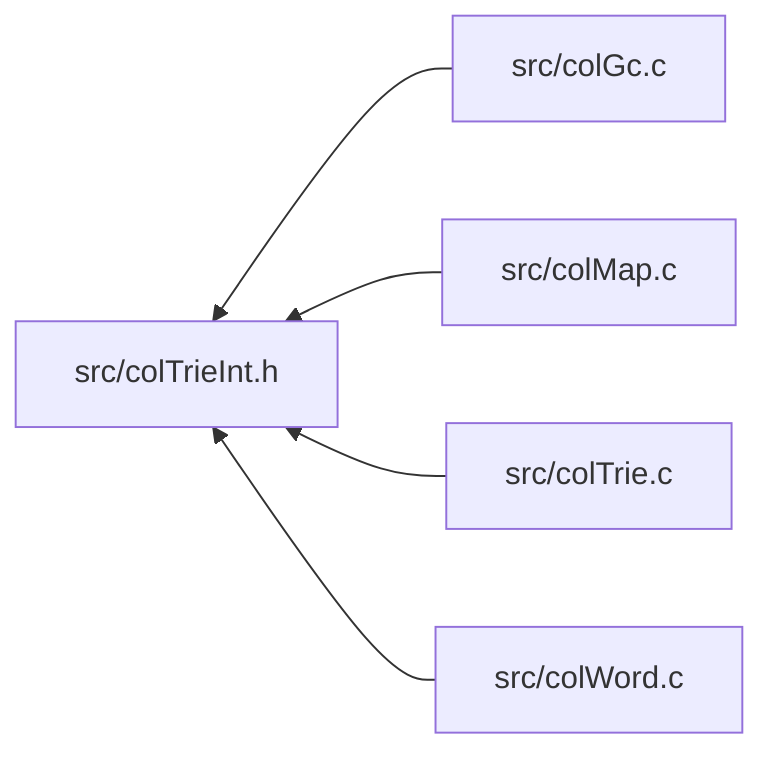

<a id="col_trie_int_8h"></a>
# File colTrieInt.h

![][C++]

**Location**: `src/colTrieInt.h`

This header file defines the trie map word internals of Colibri.

Trie maps are an implementation of generic [Maps](group__map__words.md#group__map__words) that use crit-bit trees for string, integer and custom keys.


They are always mutable.


**See also**: [colTrie.c](col_trie_8c.md#col_trie_8c), [colTrie.h](col_trie_8h.md#col_trie_8h), [colMapInt.h](col_map_int_8h.md#col_map_int_8h)

## Included by

* [src/colGc.c](col_gc_8c.md#col_gc_8c)
* [src/colMap.c](col_map_8c.md#col_map_8c)
* [src/colTrie.c](col_trie_8c.md#col_trie_8c)
* [src/colWord.c](col_word_8c.md#col_word_8c)



## Trie Map Accessors

<a id="group__triemap__words_1ga9ccb73a2f8e1e4b2e451833d5cb6903c"></a>
### Macro WORD\_TRIEMAP\_SIZE

![][public]

```cpp
#define WORD_TRIEMAP_SIZE (((size_t *)(word))[2])( word )
```

Get/set number of elements in map.

**Parameters**:

* **word**: Word to access.


?> Macro is L-Value and suitable for both read/write operations.


**See also**: [WORD\_TRIEMAP\_INIT](col_trie_int_8h.md#group__customtriemap__words_1ga83f9a9931b75d0b6d16e739195d17536), [WORD\_STRTRIEMAP\_INIT](col_trie_int_8h.md#group__strtriemap__words_1ga973ba8a0c6db8328aedcd73fd303a10d), [WORD\_INTTRIEMAP\_INIT](col_trie_int_8h.md#group__inttriemap__words_1ga26d6d540935055cb89a59be313bb3dc4)


<a id="group__triemap__words_1ga62ce82c870c8e6905dd22b1df72f08f3"></a>
### Macro WORD\_TRIEMAP\_ROOT

![][public]

```cpp
#define WORD_TRIEMAP_ROOT ((([Col\_Word](col_word_8h.md#group__words_1gadb626f9e195212e4fdfba7df154ad043) *)(word))[3])( word )
```

Get/set root node of the trie.

**Parameters**:

* **word**: Word to access.


?> Macro is L-Value and suitable for both read/write operations.


**See also**: [WORD\_TRIEMAP\_INIT](col_trie_int_8h.md#group__customtriemap__words_1ga83f9a9931b75d0b6d16e739195d17536), [WORD\_STRTRIEMAP\_INIT](col_trie_int_8h.md#group__strtriemap__words_1ga973ba8a0c6db8328aedcd73fd303a10d), [WORD\_INTTRIEMAP\_INIT](col_trie_int_8h.md#group__inttriemap__words_1ga26d6d540935055cb89a59be313bb3dc4)


## Trie Map Exceptions

<a id="group__triemap__words_1gaf35929b0382fec191e37ffd71675a479"></a>
### Macro TYPECHECK\_TRIEMAP

![][public]

```cpp
#define TYPECHECK_TRIEMAP( word )
```

Type checking macro for trie maps.

**Parameters**:

* **word**: Checked word.


**Exceptions**:

* **[COL\_ERROR\_TRIEMAP](colibri_8h.md#group__error_1gga729084542ed9eae62009a84d3379ef35a0622eefca9ad7bfcd98ef21080611bb3)**: [[T]](colibri_8h.md#group__error_1gga6dab009a0b8c4b4fa080cb9ba1859e9ea603a58b9d5bb16fde0708eb0767e4904) **word**: Not a trie map.


<a id="group__triemap__words_1gaffdf9a4bdf226bad07fb2c8a2a1a5c7d"></a>
### Macro TYPECHECK\_WORDTRIEMAP

![][public]

```cpp
#define TYPECHECK_WORDTRIEMAP( word )
```

Type checking macro for word-based trie maps (string or custom).

**Parameters**:

* **word**: Checked word.


**Exceptions**:

* **[COL\_ERROR\_WORDTRIEMAP](colibri_8h.md#group__error_1gga729084542ed9eae62009a84d3379ef35ac284ba5976b713b7a2db37bace5620fb)**: [[T]](colibri_8h.md#group__error_1gga6dab009a0b8c4b4fa080cb9ba1859e9ea603a58b9d5bb16fde0708eb0767e4904) **word**: Not a string or word-keyed trie map.


## String Trie Map Creation

<a id="group__strtriemap__words_1ga973ba8a0c6db8328aedcd73fd303a10d"></a>
### Macro WORD\_STRTRIEMAP\_INIT

![][public]

```cpp
#define WORD_STRTRIEMAP_INIT     [WORD\_SET\_TYPEID](col_word_int_8h.md#group__predefined__words_1ga52822cf424704829e60b112fe03614b6)((word), [WORD\_TYPE\_STRTRIEMAP](col_word_int_8h.md#group__words_1gae4ef7e39bd92ee96414ee98c844065ec)); \
    [WORD\_SYNONYM](col_word_int_8h.md#group__regular__words_1ga19cfddbcf0127f5088803cc68ddb8eaa)(word) = [WORD\_NIL](col_word_8h.md#group__words_1ga29e370264f4e5659ccc5be4de209f065); \
    [WORD\_TRIEMAP\_SIZE](col_trie_int_8h.md#group__triemap__words_1ga9ccb73a2f8e1e4b2e451833d5cb6903c)(word) = 0; \
    [WORD\_TRIEMAP\_ROOT](col_trie_int_8h.md#group__triemap__words_1ga62ce82c870c8e6905dd22b1df72f08f3)(word) = [WORD\_NIL](col_word_8h.md#group__words_1ga29e370264f4e5659ccc5be4de209f065);( word )
```

String trie map word initializer.

String trie maps are specialized trie maps using built-in bit test and key comparison procs on string keys.


**Parameters**:

* **word**: Word to initialize.


!> **Warning** \
Argument **word** is referenced several times by the macro. Make sure to avoid any side effect.


**See also**: [WORD\_TYPE\_STRTRIEMAP](col_word_int_8h.md#group__words_1gae4ef7e39bd92ee96414ee98c844065ec)


## Integer Trie Map Creation

<a id="group__inttriemap__words_1ga26d6d540935055cb89a59be313bb3dc4"></a>
### Macro WORD\_INTTRIEMAP\_INIT

![][public]

```cpp
#define WORD_INTTRIEMAP_INIT     [WORD\_SET\_TYPEID](col_word_int_8h.md#group__predefined__words_1ga52822cf424704829e60b112fe03614b6)((word), [WORD\_TYPE\_INTTRIEMAP](col_word_int_8h.md#group__words_1ga9da4310532cf6307f784bd6f33471218)); \
    [WORD\_SYNONYM](col_word_int_8h.md#group__regular__words_1ga19cfddbcf0127f5088803cc68ddb8eaa)(word) = [WORD\_NIL](col_word_8h.md#group__words_1ga29e370264f4e5659ccc5be4de209f065); \
    [WORD\_TRIEMAP\_SIZE](col_trie_int_8h.md#group__triemap__words_1ga9ccb73a2f8e1e4b2e451833d5cb6903c)(word) = 0; \
    [WORD\_TRIEMAP\_ROOT](col_trie_int_8h.md#group__triemap__words_1ga62ce82c870c8e6905dd22b1df72f08f3)(word) = [WORD\_NIL](col_word_8h.md#group__words_1ga29e370264f4e5659ccc5be4de209f065);( word )
```

Integer trie map word initializer.

Integer trie maps are specialized trie maps using built-in bit test and key comparison procs on integer keys.


**Parameters**:

* **word**: Word to initialize.


!> **Warning** \
Argument **word** is referenced several times by the macro. Make sure to avoid any side effect.


**See also**: [WORD\_TYPE\_INTTRIEMAP](col_word_int_8h.md#group__words_1ga9da4310532cf6307f784bd6f33471218)


## Integer Trie Map Exceptions

<a id="group__inttriemap__words_1ga355b10b52e63c90e95300c26d5c8b54d"></a>
### Macro TYPECHECK\_INTTRIEMAP

![][public]

```cpp
#define TYPECHECK_INTTRIEMAP( word )
```

Type checking macro for integer trie maps.

**Parameters**:

* **word**: Checked word.


**Exceptions**:

* **[COL\_ERROR\_INTTRIEMAP](colibri_8h.md#group__error_1gga729084542ed9eae62009a84d3379ef35ad77018799a3606551c4a3a66f6285b49)**: [[T]](colibri_8h.md#group__error_1gga6dab009a0b8c4b4fa080cb9ba1859e9ea603a58b9d5bb16fde0708eb0767e4904) **word**: Not an integer-keyed trie map.


## Custom Trie Map Constants

<a id="group__customtriemap__words_1gab1b1757562f39ce72387cd26b4ae8f2a"></a>
### Macro CUSTOMTRIEMAP\_HEADER\_SIZE

![][public]

```cpp
#define CUSTOMTRIEMAP_HEADER_SIZE [CELL\_SIZE](col_conf_8h.md#group__alloc_1ga7a4127f14f16563da90eb3c836bc404f)
```

Byte size of custom trie map word header.


## Custom Trie Map Creation

<a id="group__customtriemap__words_1ga83f9a9931b75d0b6d16e739195d17536"></a>
### Macro WORD\_TRIEMAP\_INIT

![][public]

```cpp
#define WORD_TRIEMAP_INIT     [WORD\_SET\_TYPEINFO](col_word_int_8h.md#group__custom__words_1gad327193f2befdd20bebdd2ee74023310)((word), (typeInfo)); \
    [WORD\_SYNONYM](col_word_int_8h.md#group__regular__words_1ga19cfddbcf0127f5088803cc68ddb8eaa)(word) = [WORD\_NIL](col_word_8h.md#group__words_1ga29e370264f4e5659ccc5be4de209f065); \
    [WORD\_TRIEMAP\_SIZE](col_trie_int_8h.md#group__triemap__words_1ga9ccb73a2f8e1e4b2e451833d5cb6903c)(word) = 0; \
    [WORD\_TRIEMAP\_ROOT](col_trie_int_8h.md#group__triemap__words_1ga62ce82c870c8e6905dd22b1df72f08f3)(word) = [WORD\_NIL](col_word_8h.md#group__words_1ga29e370264f4e5659ccc5be4de209f065);( word ,typeInfo )
```

Custom trie map word initializer.

Custom trie maps are custom word types of type [COL\_TRIEMAP](col_word_8h.md#group__words_1ga7922babbc856f5670805da2267d72ff0).


**Parameters**:

* **word**: Word to initialize.
* **typeInfo**: [WORD\_SET\_TYPEINFO](col_word_int_8h.md#group__custom__words_1gad327193f2befdd20bebdd2ee74023310).


**See also**: [Col\_CustomTrieMapType](struct_col___custom_trie_map_type.md#struct_col___custom_trie_map_type)


## Trie Node Creation

<a id="group__mtrienode__words_1ga2824a0cd8faf2335bb228fdfd43be612"></a>
### Macro WORD\_MTRIENODE\_INIT

![][public]

```cpp
#define WORD_MTRIENODE_INIT     [WORD\_SET\_TYPEID](col_word_int_8h.md#group__predefined__words_1ga52822cf424704829e60b112fe03614b6)((word), [WORD\_TYPE\_MTRIENODE](col_word_int_8h.md#group__words_1ga20d128dd2702743f2027be54817f2275)); \
    [WORD\_TRIENODE\_SET\_BIT](col_trie_int_8h.md#group__mtrienode__words_1ga4b49795cbbe35d01e5dd00f97eb98004)((word), (bit)); \
    [WORD\_TRIENODE\_DIFF](col_trie_int_8h.md#group__mtrienode__words_1ga4e2885eb03b3f4575cb80e7e84ed1b7b)(word) = (diff); \
    [WORD\_TRIENODE\_LEFT](col_trie_int_8h.md#group__mtrienode__words_1ga96a098f14e33a0759a9962e567084a0a)(word) = (left); \
    [WORD\_TRIENODE\_RIGHT](col_trie_int_8h.md#group__mtrienode__words_1gaf58f69b75b276cb0b1dbdc54e94e31ad)(word) = (right);( word ,diff ,bit ,left ,right )
```

Mutable trie node initializer.

**Parameters**:

* **word**: Word to initialize.
* **diff**: [WORD\_TRIENODE\_DIFF](col_trie_int_8h.md#group__mtrienode__words_1ga4e2885eb03b3f4575cb80e7e84ed1b7b).
* **bit**: [WORD\_TRIENODE\_SET\_BIT](col_trie_int_8h.md#group__mtrienode__words_1ga4b49795cbbe35d01e5dd00f97eb98004).
* **left**: [WORD\_TRIENODE\_LEFT](col_trie_int_8h.md#group__mtrienode__words_1ga96a098f14e33a0759a9962e567084a0a).
* **right**: [WORD\_TRIENODE\_RIGHT](col_trie_int_8h.md#group__mtrienode__words_1gaf58f69b75b276cb0b1dbdc54e94e31ad).


!> **Warning** \
Argument **word** is referenced several times by the macro. Make sure to avoid any side effect.


**See also**: [WORD\_TYPE\_MTRIENODE](col_word_int_8h.md#group__words_1ga20d128dd2702743f2027be54817f2275)


## Trie Node Accessors

<a id="group__mtrienode__words_1ga0f92a981e564bc1571f652022029528e"></a>
### Macro TRIENODE\_MASK

![][public]

```cpp
#define TRIENODE_MASK (UINT_MAX>>CHAR_BIT)
```

Bitmask for critical bit.


<a id="group__mtrienode__words_1gaf6b550343f8cf97aaf951a68640695ec"></a>
### Macro WORD\_TRIENODE\_BIT

![][public]

```cpp
#define WORD_TRIENODE_BIT (((([Col\_Char](colibri_8h.md#group__strings_1gab42ee0cd75b78280e412fa5bae5eb862) *)(word))[0])&[TRIENODE\_MASK](col_trie_int_8h.md#group__mtrienode__words_1ga0f92a981e564bc1571f652022029528e))( word )
```

Get critical bit position.

**Parameters**:

* **word**: Word to access.


**See also**: [WORD\_TRIENODE\_SET\_BIT](col_trie_int_8h.md#group__mtrienode__words_1ga4b49795cbbe35d01e5dd00f97eb98004)


<a id="group__mtrienode__words_1ga4b49795cbbe35d01e5dd00f97eb98004"></a>
### Macro WORD\_TRIENODE\_SET\_BIT

![][public]

```cpp
#define WORD_TRIENODE_SET_BIT (((([Col\_Char](colibri_8h.md#group__strings_1gab42ee0cd75b78280e412fa5bae5eb862) *)(word))[0])&=~[TRIENODE\_MASK](col_trie_int_8h.md#group__mtrienode__words_1ga0f92a981e564bc1571f652022029528e),((([Col\_Char](colibri_8h.md#group__strings_1gab42ee0cd75b78280e412fa5bae5eb862) *)(word))[0])|=((bit)&[TRIENODE\_MASK](col_trie_int_8h.md#group__mtrienode__words_1ga0f92a981e564bc1571f652022029528e)))( word ,bit )
```

Set critical bit position.

**Parameters**:

* **word**: Word to access.
* **bit**: Bit value. Only retains the low order bits.


!> **Warning** \
Argument **word** is referenced several times by the macro. Make sure to avoid any side effect.


**See also**: [WORD\_TRIENODE\_BIT](col_trie_int_8h.md#group__mtrienode__words_1gaf6b550343f8cf97aaf951a68640695ec), [WORD\_TRIENODE\_INIT](col_trie_int_8h.md#group__trienode__words_1gaa2668e0b8ee0e48846bd5816f8b817d6), [WORD\_MTRIENODE\_INIT](col_trie_int_8h.md#group__mtrienode__words_1ga2824a0cd8faf2335bb228fdfd43be612)


<a id="group__mtrienode__words_1ga4e2885eb03b3f4575cb80e7e84ed1b7b"></a>
### Macro WORD\_TRIENODE\_DIFF

![][public]

```cpp
#define WORD_TRIENODE_DIFF (((size_t *)(word))[1])( word )
```

Get/set index of first differing key element in left and right keys.

**Parameters**:

* **word**: Word to access.


?> Macro is L-Value and suitable for both read/write operations.


**See also**: [WORD\_TRIENODE\_INIT](col_trie_int_8h.md#group__trienode__words_1gaa2668e0b8ee0e48846bd5816f8b817d6), [WORD\_MTRIENODE\_INIT](col_trie_int_8h.md#group__mtrienode__words_1ga2824a0cd8faf2335bb228fdfd43be612)


<a id="group__mtrienode__words_1ga96a098f14e33a0759a9962e567084a0a"></a>
### Macro WORD\_TRIENODE\_LEFT

![][public]

```cpp
#define WORD_TRIENODE_LEFT ((([Col\_Word](col_word_8h.md#group__words_1gadb626f9e195212e4fdfba7df154ad043) *)(word))[2])( word )
```

Get/set left subtrie.

**Parameters**:

* **word**: Word to access.


?> Macro is L-Value and suitable for both read/write operations.


**See also**: [WORD\_TRIENODE\_INIT](col_trie_int_8h.md#group__trienode__words_1gaa2668e0b8ee0e48846bd5816f8b817d6), [WORD\_MTRIENODE\_INIT](col_trie_int_8h.md#group__mtrienode__words_1ga2824a0cd8faf2335bb228fdfd43be612)


<a id="group__mtrienode__words_1gaf58f69b75b276cb0b1dbdc54e94e31ad"></a>
### Macro WORD\_TRIENODE\_RIGHT

![][public]

```cpp
#define WORD_TRIENODE_RIGHT ((([Col\_Word](col_word_8h.md#group__words_1gadb626f9e195212e4fdfba7df154ad043) *)(word))[3])( word )
```

Get/set right subtrie.

**Parameters**:

* **word**: Word to access.


?> Macro is L-Value and suitable for both read/write operations.


**See also**: [WORD\_TRIENODE\_INIT](col_trie_int_8h.md#group__trienode__words_1gaa2668e0b8ee0e48846bd5816f8b817d6), [WORD\_MTRIENODE\_INIT](col_trie_int_8h.md#group__mtrienode__words_1ga2824a0cd8faf2335bb228fdfd43be612)


## Immutable Trie Node Creation

<a id="group__trienode__words_1gaa2668e0b8ee0e48846bd5816f8b817d6"></a>
### Macro WORD\_TRIENODE\_INIT

![][public]

```cpp
#define WORD_TRIENODE_INIT     [WORD\_SET\_TYPEID](col_word_int_8h.md#group__predefined__words_1ga52822cf424704829e60b112fe03614b6)((word), [WORD\_TYPE\_TRIENODE](col_word_int_8h.md#group__words_1gae52162432efdceb0ac49e6332b213401)); \
    [WORD\_TRIENODE\_SET\_BIT](col_trie_int_8h.md#group__mtrienode__words_1ga4b49795cbbe35d01e5dd00f97eb98004)((word), (bit)); \
    [WORD\_TRIENODE\_DIFF](col_trie_int_8h.md#group__mtrienode__words_1ga4e2885eb03b3f4575cb80e7e84ed1b7b)(word) = (diff); \
    [WORD\_TRIENODE\_LEFT](col_trie_int_8h.md#group__mtrienode__words_1ga96a098f14e33a0759a9962e567084a0a)(word) = (left); \
    [WORD\_TRIENODE\_RIGHT](col_trie_int_8h.md#group__mtrienode__words_1gaf58f69b75b276cb0b1dbdc54e94e31ad)(word) = (right);( word ,diff ,bit ,left ,right )
```

Immutable trie node initializer.

**Parameters**:

* **word**: Word to initialize.
* **diff**: [WORD\_TRIENODE\_DIFF](col_trie_int_8h.md#group__mtrienode__words_1ga4e2885eb03b3f4575cb80e7e84ed1b7b).
* **bit**: [WORD\_TRIENODE\_SET\_BIT](col_trie_int_8h.md#group__mtrienode__words_1ga4b49795cbbe35d01e5dd00f97eb98004).
* **left**: [WORD\_TRIENODE\_LEFT](col_trie_int_8h.md#group__mtrienode__words_1ga96a098f14e33a0759a9962e567084a0a).
* **right**: [WORD\_TRIENODE\_RIGHT](col_trie_int_8h.md#group__mtrienode__words_1gaf58f69b75b276cb0b1dbdc54e94e31ad).


!> **Warning** \
Argument **word** is referenced several times by the macro. Make sure to avoid any side effect.


**See also**: [WORD\_TYPE\_TRIENODE](col_word_int_8h.md#group__words_1gae52162432efdceb0ac49e6332b213401)


## String Trie Node Creation

<a id="group__mstrtrienode__words_1gadb6e244e2369d6711272317f897e0418"></a>
### Macro WORD\_MSTRTRIENODE\_INIT

![][public]

```cpp
#define WORD_MSTRTRIENODE_INIT     [WORD\_SET\_TYPEID](col_word_int_8h.md#group__predefined__words_1ga52822cf424704829e60b112fe03614b6)((word), [WORD\_TYPE\_MSTRTRIENODE](col_word_int_8h.md#group__words_1ga82e8b6ff4abcd49f5ffa67cc45b17358)); \
    [WORD\_STRTRIENODE\_SET\_MASK](col_trie_int_8h.md#group__mstrtrienode__words_1ga8a91d66561940fb9ee33506dec11f4b8)((word), (mask)); \
    [WORD\_STRTRIENODE\_DIFF](col_trie_int_8h.md#group__mstrtrienode__words_1ga0b7f928792baf650225912ff4f126815)(word) = (diff); \
    [WORD\_TRIENODE\_LEFT](col_trie_int_8h.md#group__mtrienode__words_1ga96a098f14e33a0759a9962e567084a0a)(word) = (left); \
    [WORD\_TRIENODE\_RIGHT](col_trie_int_8h.md#group__mtrienode__words_1gaf58f69b75b276cb0b1dbdc54e94e31ad)(word) = (right);( word ,diff ,mask ,left ,right )
```

Mutable string trie node word initializer.

**Parameters**:

* **word**: Word to initialize.
* **diff**: [WORD\_STRTRIENODE\_DIFF](col_trie_int_8h.md#group__mstrtrienode__words_1ga0b7f928792baf650225912ff4f126815).
* **mask**: [WORD\_STRTRIENODE\_SET\_MASK](col_trie_int_8h.md#group__mstrtrienode__words_1ga8a91d66561940fb9ee33506dec11f4b8).
* **left**: [WORD\_TRIENODE\_LEFT](col_trie_int_8h.md#group__mtrienode__words_1ga96a098f14e33a0759a9962e567084a0a).
* **right**: [WORD\_TRIENODE\_RIGHT](col_trie_int_8h.md#group__mtrienode__words_1gaf58f69b75b276cb0b1dbdc54e94e31ad).


!> **Warning** \
Argument **word** is referenced several times by the macro. Make sure to avoid any side effect.


**See also**: [WORD\_TYPE\_MSTRTRIENODE](col_word_int_8h.md#group__words_1ga82e8b6ff4abcd49f5ffa67cc45b17358)


## String Trie Node Accessors

<a id="group__mstrtrienode__words_1gac85bca7104d1e247f4271262079067ce"></a>
### Macro STRTRIENODE\_MASK

![][public]

```cpp
#define STRTRIENODE_MASK (UINT_MAX>>CHAR_BIT)
```

Bitmask for critical bit.


<a id="group__mstrtrienode__words_1ga2b0f59fcf11f10eba52074596a0fd8c9"></a>
### Macro WORD\_STRTRIENODE\_MASK

![][public]

```cpp
#define WORD_STRTRIENODE_MASK (((([Col\_Char](colibri_8h.md#group__strings_1gab42ee0cd75b78280e412fa5bae5eb862) *)(word))[0])&[STRTRIENODE\_MASK](col_trie_int_8h.md#group__mstrtrienode__words_1gac85bca7104d1e247f4271262079067ce))( word )
```

Get bitmask where only the critical bit is set.

**Parameters**:

* **word**: Word to access.


**See also**: [WORD\_STRTRIENODE\_SET\_MASK](col_trie_int_8h.md#group__mstrtrienode__words_1ga8a91d66561940fb9ee33506dec11f4b8)


<a id="group__mstrtrienode__words_1ga8a91d66561940fb9ee33506dec11f4b8"></a>
### Macro WORD\_STRTRIENODE\_SET\_MASK

![][public]

```cpp
#define WORD_STRTRIENODE_SET_MASK (((([Col\_Char](colibri_8h.md#group__strings_1gab42ee0cd75b78280e412fa5bae5eb862) *)(word))[0])&=~[STRTRIENODE\_MASK](col_trie_int_8h.md#group__mstrtrienode__words_1gac85bca7104d1e247f4271262079067ce),((([Col\_Char](colibri_8h.md#group__strings_1gab42ee0cd75b78280e412fa5bae5eb862) *)(word))[0])|=((size)&[STRTRIENODE\_MASK](col_trie_int_8h.md#group__mstrtrienode__words_1gac85bca7104d1e247f4271262079067ce)))( word ,mask )
```

Set bitmask to the critical bit.

**Parameters**:

* **word**: Word to access.
* **mask**: Mask value.


!> **Warning** \
Argument **word** is referenced several times by the macro. Make sure to avoid any side effect.


**See also**: [WORD\_STRTRIENODE\_MASK](col_trie_int_8h.md#group__mstrtrienode__words_1ga2b0f59fcf11f10eba52074596a0fd8c9), [WORD\_STRTRIENODE\_INIT](col_trie_int_8h.md#group__strtrienode__words_1gaa99e32f6881a4f95c95f59d5cc1586db), [WORD\_MSTRTRIENODE\_INIT](col_trie_int_8h.md#group__mstrtrienode__words_1gadb6e244e2369d6711272317f897e0418)


<a id="group__mstrtrienode__words_1ga0b7f928792baf650225912ff4f126815"></a>
### Macro WORD\_STRTRIENODE\_DIFF

![][public]

```cpp
#define WORD_STRTRIENODE_DIFF (((size_t *)(word))[1])( word )
```

Get/set index of first differing character in left and right keys.

**Parameters**:

* **word**: Word to access.


?> Macro is L-Value and suitable for both read/write operations.


**See also**: [WORD\_TRIENODE\_INIT](col_trie_int_8h.md#group__trienode__words_1gaa2668e0b8ee0e48846bd5816f8b817d6), [WORD\_MTRIENODE\_INIT](col_trie_int_8h.md#group__mtrienode__words_1ga2824a0cd8faf2335bb228fdfd43be612)


## Immutable String Trie Node Creation

<a id="group__strtrienode__words_1gaa99e32f6881a4f95c95f59d5cc1586db"></a>
### Macro WORD\_STRTRIENODE\_INIT

![][public]

```cpp
#define WORD_STRTRIENODE_INIT     [WORD\_SET\_TYPEID](col_word_int_8h.md#group__predefined__words_1ga52822cf424704829e60b112fe03614b6)((word), [WORD\_TYPE\_STRTRIENODE](col_word_int_8h.md#group__words_1ga9ff5e124f29796ce3b1dd377f7d6d59f)); \
    [WORD\_STRTRIENODE\_SET\_MASK](col_trie_int_8h.md#group__mstrtrienode__words_1ga8a91d66561940fb9ee33506dec11f4b8)(word, mask); \
    [WORD\_STRTRIENODE\_DIFF](col_trie_int_8h.md#group__mstrtrienode__words_1ga0b7f928792baf650225912ff4f126815)(word) = (diff); \
    [WORD\_TRIENODE\_LEFT](col_trie_int_8h.md#group__mtrienode__words_1ga96a098f14e33a0759a9962e567084a0a)(word) = (left); \
    [WORD\_TRIENODE\_RIGHT](col_trie_int_8h.md#group__mtrienode__words_1gaf58f69b75b276cb0b1dbdc54e94e31ad)(word) = (right);( word ,diff ,mask ,left ,right )
```

Immutable string trie node word initializer.

**Parameters**:

* **word**: Word to initialize.
* **diff**: [WORD\_STRTRIENODE\_DIFF](col_trie_int_8h.md#group__mstrtrienode__words_1ga0b7f928792baf650225912ff4f126815).
* **mask**: [WORD\_STRTRIENODE\_SET\_MASK](col_trie_int_8h.md#group__mstrtrienode__words_1ga8a91d66561940fb9ee33506dec11f4b8).
* **left**: [WORD\_TRIENODE\_LEFT](col_trie_int_8h.md#group__mtrienode__words_1ga96a098f14e33a0759a9962e567084a0a).
* **right**: [WORD\_TRIENODE\_RIGHT](col_trie_int_8h.md#group__mtrienode__words_1gaf58f69b75b276cb0b1dbdc54e94e31ad).


!> **Warning** \
Argument **word** is referenced several times by the macro. Make sure to avoid any side effect.


**See also**: [WORD\_TYPE\_STRTRIENODE](col_word_int_8h.md#group__words_1ga9ff5e124f29796ce3b1dd377f7d6d59f)


## Integer Trie Node Creation

<a id="group__minttrienode__words_1gacb33bcfbca4f286c7a68fde0682b5804"></a>
### Macro WORD\_MINTTRIENODE\_INIT

![][public]

```cpp
#define WORD_MINTTRIENODE_INIT     [WORD\_SET\_TYPEID](col_word_int_8h.md#group__predefined__words_1ga52822cf424704829e60b112fe03614b6)((word), [WORD\_TYPE\_MINTTRIENODE](col_word_int_8h.md#group__words_1gac0b62fa5b054dc6713a5fc7fd69298da)); \
    [WORD\_INTTRIENODE\_MASK](col_trie_int_8h.md#group__minttrienode__words_1ga010b15b770a0a79b1be365173a693ea3)(word) = (mask); \
    [WORD\_TRIENODE\_LEFT](col_trie_int_8h.md#group__mtrienode__words_1ga96a098f14e33a0759a9962e567084a0a)(word) = (left); \
    [WORD\_TRIENODE\_RIGHT](col_trie_int_8h.md#group__mtrienode__words_1gaf58f69b75b276cb0b1dbdc54e94e31ad)(word) = (right);( word ,mask ,left ,right )
```

Mutable integer trie node word initializer.

**Parameters**:

* **word**: Word to initialize.
* **mask**: [WORD\_INTTRIENODE\_MASK](col_trie_int_8h.md#group__minttrienode__words_1ga010b15b770a0a79b1be365173a693ea3).
* **left**: [WORD\_TRIENODE\_LEFT](col_trie_int_8h.md#group__mtrienode__words_1ga96a098f14e33a0759a9962e567084a0a).
* **right**: [WORD\_TRIENODE\_RIGHT](col_trie_int_8h.md#group__mtrienode__words_1gaf58f69b75b276cb0b1dbdc54e94e31ad).


!> **Warning** \
Argument **word** is referenced several times by the macro. Make sure to avoid any side effect.


**See also**: [WORD\_TYPE\_MINTTRIENODE](col_word_int_8h.md#group__words_1gac0b62fa5b054dc6713a5fc7fd69298da)


## Integer Trie Node Accessors

<a id="group__minttrienode__words_1ga010b15b770a0a79b1be365173a693ea3"></a>
### Macro WORD\_INTTRIENODE\_MASK

![][public]

```cpp
#define WORD_INTTRIENODE_MASK (((intptr_t *)(word))[1])( word )
```

Get/set bitmask where only the critical bit is set.

**Parameters**:

* **word**: Word to access.


?> Macro is L-Value and suitable for both read/write operations.


**See also**: [WORD\_INTTRIENODE\_INIT](col_trie_int_8h.md#group__inttrienode__words_1ga778e592ea5df7ecfdf2c16954c5e5a59), [WORD\_MINTTRIENODE\_INIT](col_trie_int_8h.md#group__minttrienode__words_1gacb33bcfbca4f286c7a68fde0682b5804)


## Immutable Integer Trie Node Creation

<a id="group__inttrienode__words_1ga778e592ea5df7ecfdf2c16954c5e5a59"></a>
### Macro WORD\_INTTRIENODE\_INIT

![][public]

```cpp
#define WORD_INTTRIENODE_INIT     [WORD\_SET\_TYPEID](col_word_int_8h.md#group__predefined__words_1ga52822cf424704829e60b112fe03614b6)((word), [WORD\_TYPE\_INTTRIENODE](col_word_int_8h.md#group__words_1gac4adeeed11aa6a07235dfe4099c18074)); \
    [WORD\_INTTRIENODE\_MASK](col_trie_int_8h.md#group__minttrienode__words_1ga010b15b770a0a79b1be365173a693ea3)(word) = (mask); \
    [WORD\_TRIENODE\_LEFT](col_trie_int_8h.md#group__mtrienode__words_1ga96a098f14e33a0759a9962e567084a0a)(word) = (left); \
    [WORD\_TRIENODE\_RIGHT](col_trie_int_8h.md#group__mtrienode__words_1gaf58f69b75b276cb0b1dbdc54e94e31ad)(word) = (right);( word ,mask ,left ,right )
```

Mutable integer trie node word initializer.

**Parameters**:

* **word**: Word to initialize.
* **mask**: [WORD\_INTTRIENODE\_MASK](col_trie_int_8h.md#group__minttrienode__words_1ga010b15b770a0a79b1be365173a693ea3).
* **left**: [WORD\_TRIENODE\_LEFT](col_trie_int_8h.md#group__mtrienode__words_1ga96a098f14e33a0759a9962e567084a0a).
* **right**: [WORD\_TRIENODE\_RIGHT](col_trie_int_8h.md#group__mtrienode__words_1gaf58f69b75b276cb0b1dbdc54e94e31ad).


!> **Warning** \
Argument **word** is referenced several times by the macro. Make sure to avoid any side effect.


**See also**: [WORD\_TYPE\_INTTRIENODE](col_word_int_8h.md#group__words_1gac4adeeed11aa6a07235dfe4099c18074)


## Trie Leaf Creation

<a id="group__mtrieleaf__words_1ga2b31c29e5458243e6c134031a7d27047"></a>
### Macro WORD\_MTRIELEAF\_INIT

![][public]

```cpp
#define WORD_MTRIELEAF_INIT     [WORD\_SET\_TYPEID](col_word_int_8h.md#group__predefined__words_1ga52822cf424704829e60b112fe03614b6)((word), [WORD\_TYPE\_MTRIELEAF](col_word_int_8h.md#group__words_1ga4c7f02b7545a17f527d59a2c66e9d0fa)); \
    [WORD\_MAPENTRY\_KEY](col_map_int_8h.md#group__mapentry__words_1ga8664d15fae4553b47b658ac7ceb1443a)(word) = (key); \
    [WORD\_MAPENTRY\_VALUE](col_map_int_8h.md#group__mapentry__words_1gabad6806f2947f508a9786948c1663064)(word) = (value);( word ,key ,value )
```

Mutable trie leaf word initializer.

**Parameters**:

* **word**: Word to initialize.
* **key**: [WORD\_MAPENTRY\_KEY](col_map_int_8h.md#group__mapentry__words_1ga8664d15fae4553b47b658ac7ceb1443a).
* **value**: [WORD\_MAPENTRY\_VALUE](col_map_int_8h.md#group__mapentry__words_1gabad6806f2947f508a9786948c1663064).


!> **Warning** \
Argument **word** is referenced several times by the macro. Make sure to avoid any side effect.


**See also**: [WORD\_TYPE\_MTRIELEAF](col_word_int_8h.md#group__words_1ga4c7f02b7545a17f527d59a2c66e9d0fa)


## Immutable Trie Leaf Creation

<a id="group__trieleaf__words_1ga2e55cc85a82dae0bc17423d5b12d00d8"></a>
### Macro WORD\_TRIELEAF\_INIT

![][public]

```cpp
#define WORD_TRIELEAF_INIT     [WORD\_SET\_TYPEID](col_word_int_8h.md#group__predefined__words_1ga52822cf424704829e60b112fe03614b6)((word), [WORD\_TYPE\_TRIELEAF](col_word_int_8h.md#group__words_1ga2a17ea1e39ad925fc0057cd928cdd49c)); \
    [WORD\_MAPENTRY\_KEY](col_map_int_8h.md#group__mapentry__words_1ga8664d15fae4553b47b658ac7ceb1443a)(word) = (key); \
    [WORD\_MAPENTRY\_VALUE](col_map_int_8h.md#group__mapentry__words_1gabad6806f2947f508a9786948c1663064)(word) = (value);( word ,key ,value )
```

Immutable trie leaf word initializer.

**Parameters**:

* **word**: Word to initialize.
* **key**: [WORD\_MAPENTRY\_KEY](col_map_int_8h.md#group__mapentry__words_1ga8664d15fae4553b47b658ac7ceb1443a).
* **value**: [WORD\_MAPENTRY\_VALUE](col_map_int_8h.md#group__mapentry__words_1gabad6806f2947f508a9786948c1663064).


!> **Warning** \
Argument **word** is referenced several times by the macro. Make sure to avoid any side effect.


**See also**: [WORD\_TYPE\_TRIELEAF](col_word_int_8h.md#group__words_1ga2a17ea1e39ad925fc0057cd928cdd49c)


## Integer Trie Leaf Creation

<a id="group__minttrieleaf__words_1ga7d5079b13b1bda7ec6bfc72c38a708aa"></a>
### Macro WORD\_MINTTRIELEAF\_INIT

![][public]

```cpp
#define WORD_MINTTRIELEAF_INIT     [WORD\_SET\_TYPEID](col_word_int_8h.md#group__predefined__words_1ga52822cf424704829e60b112fe03614b6)((word), [WORD\_TYPE\_MINTTRIELEAF](col_word_int_8h.md#group__words_1ga81a397c929cd0fa5f89c5a01ce2a1487)); \
    [WORD\_INTMAPENTRY\_KEY](col_map_int_8h.md#group__intmapentry__words_1ga89e26360d76aaad985afd89da56d1539)(word) = (key); \
    [WORD\_MAPENTRY\_VALUE](col_map_int_8h.md#group__mapentry__words_1gabad6806f2947f508a9786948c1663064)(word) = (value);( word ,key ,value )
```

Mutable integer leaf word initializer.

**Parameters**:

* **word**: Word to initialize.
* **key**: [WORD\_INTMAPENTRY\_KEY](col_map_int_8h.md#group__intmapentry__words_1ga89e26360d76aaad985afd89da56d1539).
* **value**: [WORD\_MAPENTRY\_VALUE](col_map_int_8h.md#group__mapentry__words_1gabad6806f2947f508a9786948c1663064).


!> **Warning** \
Argument **word** is referenced several times by the macro. Make sure to avoid any side effect.


**See also**: [WORD\_TYPE\_MINTTRIELEAF](col_word_int_8h.md#group__words_1ga81a397c929cd0fa5f89c5a01ce2a1487)


## Immutable Integer Trie Leaf Creation

<a id="group__inttrieleaf__words_1ga2d95f188d06bdcff5ccc89cef8674204"></a>
### Macro WORD\_INTTRIELEAF\_INIT

![][public]

```cpp
#define WORD_INTTRIELEAF_INIT     [WORD\_SET\_TYPEID](col_word_int_8h.md#group__predefined__words_1ga52822cf424704829e60b112fe03614b6)((word), [WORD\_TYPE\_INTTRIELEAF](col_word_int_8h.md#group__words_1ga896310a96176f87d4ec0bd06eabf55f7)); \
    [WORD\_INTMAPENTRY\_KEY](col_map_int_8h.md#group__intmapentry__words_1ga89e26360d76aaad985afd89da56d1539)(word) = (key); \
    [WORD\_MAPENTRY\_VALUE](col_map_int_8h.md#group__mapentry__words_1gabad6806f2947f508a9786948c1663064)(word) = (value);( word ,key ,value )
```

Immutable integer trie leaf word initializer.

**Parameters**:

* **word**: Word to initialize.
* **key**: [WORD\_INTMAPENTRY\_KEY](col_map_int_8h.md#group__intmapentry__words_1ga89e26360d76aaad985afd89da56d1539).
* **value**: [WORD\_MAPENTRY\_VALUE](col_map_int_8h.md#group__mapentry__words_1gabad6806f2947f508a9786948c1663064).


!> **Warning** \
Argument **word** is referenced several times by the macro. Make sure to avoid any side effect.


**See also**: [WORD\_TYPE\_INTTRIELEAF](col_word_int_8h.md#group__words_1ga896310a96176f87d4ec0bd06eabf55f7)


## Source

```cpp
/**
 * @file colTrieInt.h
 *
 * This header file defines the trie map word internals of Colibri.
 *
 * Trie maps are an implementation of generic @ref map_words that use crit-bit
 * trees for string, integer and custom keys.
 *
 * They are always mutable.
 *
 * @see colTrie.c
 * @see colTrie.h
 * @see colMapInt.h
 *
 * @beginprivate @cond PRIVATE
 */

#ifndef _COLIBRI_TRIE_INT
#define _COLIBRI_TRIE_INT


/*
===========================================================================*//*!
\internal \addtogroup triemap_words Trie Maps

@par Requirements
    - Trie maps words use one single cell.

    - As trie maps are containers they must know their size, i.e. the number
      of entries they contain.

    - Trie maps store entries in leaves within a tree made of nodes. So they
      need to know the root node of this tree.

    @param Type     Type descriptor.
    @param Synonym  [Generic word synonym field](@ref WORD_SYNONYM).
    @param Size     Number of elements in map.
    @param Root     Root trie [node](@ref trienode_words) or 
                    [leaf](@ref trieleaf_words).

@par Cell Layout
    On all architectures the single-cell layout is as follows:

    @dot
    digraph {
        node [fontname="Lucida Console,Courier" fontsize=14];
        triemap_word [shape=none, label=<
            <table border="0" cellborder="1" cellspacing="0">
            <tr><td border="0"></td>
                <td sides="B" width="160" align="left">0</td><td sides="B" width="160" align="right">n</td>
            </tr>
            <tr><td sides="R">0</td>
                <td href="@ref WORD_TYPEINFO" title="WORD_TYPEINFO" colspan="2" width="320">Type</td>
            </tr>
            <tr><td sides="R">1</td>
                <td href="@ref WORD_SYNONYM" title="WORD_SYNONYM" colspan="2">Synonym</td>
            </tr>
            <tr><td sides="R">2</td>
                <td href="@ref WORD_TRIEMAP_SIZE" title="WORD_TRIEMAP_SIZE" colspan="2">Size</td>
            </tr>
            <tr><td sides="R">3</td>
                <td href="@ref WORD_TRIEMAP_ROOT" title="WORD_TRIEMAP_ROOT" colspan="2">Root</td>
            </tr>
            </table>
        >]
    }
    @enddot

    @begindiagram
           0                                                             n
          +---------------------------------------------------------------+
        0 |                           Type info                           |
          +---------------------------------------------------------------+
        1 |                            Synonym                            |
          +---------------------------------------------------------------+
        2 |                             Size                              |
          +---------------------------------------------------------------+
        3 |                             Root                              |
          +---------------------------------------------------------------+
    @enddiagram

\{*//*==========================================================================
*/

/***************************************************************************//*!
 * \name Trie Map Accessors
 ***************************************************************************\{*/

/**
 * Get/set number of elements in map.
 *
 * @param word  Word to access.
 *
 * @note
 *      Macro is L-Value and suitable for both read/write operations.
 *
 * @see WORD_TRIEMAP_INIT
 * @see WORD_STRTRIEMAP_INIT
 * @see WORD_INTTRIEMAP_INIT
 */
#define WORD_TRIEMAP_SIZE(word)         (((size_t *)(word))[2])

/**
 * Get/set root node of the trie.
 *
 * @param word  Word to access.
 *
 * @note
 *      Macro is L-Value and suitable for both read/write operations.
 *
 * @see WORD_TRIEMAP_INIT
 * @see WORD_STRTRIEMAP_INIT
 * @see WORD_INTTRIEMAP_INIT
 */
#define WORD_TRIEMAP_ROOT(word)         (((Col_Word *)(word))[3])

/* End of Trie Map Accessors *//*!\}*/


/***************************************************************************//*!
 * \name Trie Map Exceptions
 ***************************************************************************\{*/

/**
 * Type checking macro for trie maps.
 *
 * @param word  Checked word.
 *
 * @typecheck{COL_ERROR_TRIEMAP,word}
 * @hideinitializer
 */
#define TYPECHECK_TRIEMAP(word) \
    TYPECHECK((Col_WordType(word) & COL_TRIEMAP), COL_ERROR_TRIEMAP, (word))

/**
 * Type checking macro for word-based trie maps (string or custom).
 *
 * @param word  Checked word.
 *
 * @typecheck{COL_ERROR_WORDTRIEMAP,word}
 * @hideinitializer
 */
#define TYPECHECK_WORDTRIEMAP(word) \
    TYPECHECK(((Col_WordType(word) & (COL_TRIEMAP | COL_INTMAP)) \
            == COL_TRIEMAP), COL_ERROR_WORDTRIEMAP, (word))

/* End of Trie Map Exceptions *//*!\}*/

/* End of Trie Maps *//*!\}*/


/*
===========================================================================*//*!
\internal \defgroup strtriemap_words String Trie Maps
\ingroup predefined_words strmap_words triemap_words

String trie maps are @ref triemap_words with string keys.

@see WORD_TYPE_STRTRIEMAP
\{*//*==========================================================================
*/

/***************************************************************************//*!
 * \name String Trie Map Creation
 ***************************************************************************\{*/

/**
 * String trie map word initializer.
 *
 * String trie maps are specialized trie maps using built-in bit test and
 * key comparison procs on string keys.
 *
 * @param word  Word to initialize.
 *
 * @warning
 *      Argument **word** is referenced several times by the macro. Make sure to
 *      avoid any side effect.
 *
 * @see WORD_TYPE_STRTRIEMAP
 */
#define WORD_STRTRIEMAP_INIT(word) \
    WORD_SET_TYPEID((word), WORD_TYPE_STRTRIEMAP); \
    WORD_SYNONYM(word) = WORD_NIL; \
    WORD_TRIEMAP_SIZE(word) = 0; \
    WORD_TRIEMAP_ROOT(word) = WORD_NIL;

/* End of String Trie Map Creation *//*!\}*/

/* End of String Trie Maps *//*!\}*/


/*
===========================================================================*//*!
\internal \defgroup inttriemap_words Integer Trie Maps
\ingroup predefined_words intmap_words triemap_words

Integer trie maps are @ref triemap_words with integer keys.

@see WORD_TYPE_INTTRIEMAP
\{*//*==========================================================================
*/

/***************************************************************************//*!
 * \name Integer Trie Map Creation
 ***************************************************************************\{*/

/**
 * Integer trie map word initializer.
 *
 * Integer trie maps are specialized trie maps using built-in bit test and
 * key comparison procs on integer keys.
 *
 * @param word  Word to initialize.
 *
 * @warning
 *      Argument **word** is referenced several times by the macro. Make sure to
 *      avoid any side effect.
 *
 * @see WORD_TYPE_INTTRIEMAP
 */
#define WORD_INTTRIEMAP_INIT(word) \
    WORD_SET_TYPEID((word), WORD_TYPE_INTTRIEMAP); \
    WORD_SYNONYM(word) = WORD_NIL; \
    WORD_TRIEMAP_SIZE(word) = 0; \
    WORD_TRIEMAP_ROOT(word) = WORD_NIL;

/* End of Integer Trie Map Creation *//*!\}*/


/***************************************************************************//*!
 * \name Integer Trie Map Exceptions
 ***************************************************************************\{*/

/**
 * Type checking macro for integer trie maps.
 *
 * @param word  Checked word.
 *
 * @typecheck{COL_ERROR_INTTRIEMAP,word}
 * @hideinitializer
 */
#define TYPECHECK_INTTRIEMAP(word) \
    TYPECHECK(((Col_WordType(word) & (COL_TRIEMAP | COL_INTMAP)) \
            == (COL_TRIEMAP | COL_INTMAP)), COL_ERROR_INTTRIEMAP, (word))

/* End of Integer Trie Map Exceptions *//*!\}*/

/* End of Integer Trie Maps *//*!\}*/


/*
===========================================================================*//*!
\internal \addtogroup customtriemap_words Custom Trie Maps
\{*//*==========================================================================
*/

/***************************************************************************//*!
 * \name Custom Trie Map Constants
 ***************************************************************************\{*/

/** Byte size of custom trie map word header. */
#define CUSTOMTRIEMAP_HEADER_SIZE       CELL_SIZE

/* End of Custom Trie Map Constants *//*!\}*/


/***************************************************************************//*!
 * \name Custom Trie Map Creation
 ***************************************************************************\{*/

/**
 * Custom trie map word initializer.
 *
 * Custom trie maps are custom word types of type #COL_TRIEMAP.
 *
 * @param word      Word to initialize.
 * @param typeInfo  #WORD_SET_TYPEINFO.
 *
 * @see Col_CustomTrieMapType
 */
#define WORD_TRIEMAP_INIT(word, typeInfo) \
    WORD_SET_TYPEINFO((word), (typeInfo)); \
    WORD_SYNONYM(word) = WORD_NIL; \
    WORD_TRIEMAP_SIZE(word) = 0; \
    WORD_TRIEMAP_ROOT(word) = WORD_NIL;

/* End of Custom Trie Map Creation *//*!\}*/

/* End of Custom Trie Maps *//*!\}*/


/*
===========================================================================*//*!
\internal \defgroup mtrienode_words Trie Nodes
\ingroup predefined_words triemap_words

Generic trie nodes.

Trie maps store map entries hierarchically, in such a way that all
entries in a subtree share a common prefix. This implementation uses
crit-bit trees for keys: each node stores a critical bit, which is the
index of the bit where both branches differ. Entries where this bit is
cleared are stored in the left subtree, and those with this bit set are
stored in the right subtree, all in a recursive manner.

@par Requirements
    - Trie node words use one single cell.

    - Trie node words must know their critical bit, which is the highest bit
      of the first differing key element where left and right subtrie keys
      differ. They store this information as the index of the differing key
      element as well as the position of the critical bit.

    - Crit-bit tries are binary trees and thus must know their left and right
      subtries.

    @param Diff     Index of first differing key element in left and right keys.
    @param Bit      Position of the critical bit in key element. 24-bit should
                    be sufficient for most applications (this handles up to
                    16777216-bit/2MB-long key elements).
    @param Left     Left subtrie. Keys have their critical bit cleared.
    @param Right    Right subtrie. Keys have their critical bit set.

@par Cell Layout
    On all architectures the single-cell layout is as follows:

    @dot
    digraph {
        node [fontname="Lucida Console,Courier" fontsize=14];
        mtrienode_word [shape=none, label=<
            <table border="0" cellborder="1" cellspacing="0">
            <tr><td border="0"></td>
                <td sides="B" width="40" align="left">0</td><td sides="B" width="40" align="right">7</td>
                <td sides="B" width="120" align="left">8</td><td sides="B" width="120" align="right">31</td>
                <td sides="B" align="right">n</td>
            </tr>
            <tr><td sides="R">0</td>
                <td href="@ref WORD_TYPEID" title="WORD_TYPEID" colspan="2">Type</td>
                <td href="@ref WORD_TRIENODE_BIT" title="WORD_TRIENODE_BIT" colspan="2">Bit</td>
                <td bgcolor="grey75"> Unused (n &gt; 32) </td>
            </tr>
            <tr><td sides="R">1</td>
                <td href="@ref WORD_TRIENODE_DIFF" title="WORD_TRIENODE_DIFF" colspan="5">Diff</td>
            </tr>
            <tr><td sides="R">2</td>
                <td href="@ref WORD_TRIENODE_LEFT" title="WORD_TRIENODE_LEFT" colspan="5">Left</td>
            </tr>
            <tr><td sides="R">3</td>
                <td href="@ref WORD_TRIENODE_RIGHT" title="WORD_TRIENODE_RIGHT" colspan="5">Right</td>
            </tr>
            </table>
        >]
    }
    @enddot

    @begindiagram
           0     7 8                    31                               n
          +-------+-----------------------+-------------------------------+
        0 | Type  |        Bit            |        Unused (n > 32)        |
          +-------+-----------------------+-------------------------------+
        1 |                             Diff                              |
          +---------------------------------------------------------------+
        2 |                             Left                              |
          +---------------------------------------------------------------+
        3 |                             Right                             |
          +---------------------------------------------------------------+
    @enddiagram

@see @ref mtrienode_words
@see @ref triemap_words
\{*//*==========================================================================
*/

/***************************************************************************//*!
 * \name Trie Node Creation
 ***************************************************************************\{*/

/**
 * Mutable trie node initializer.
 *
 * @param word      Word to initialize.
 * @param diff      #WORD_TRIENODE_DIFF.
 * @param bit       #WORD_TRIENODE_SET_BIT.
 * @param left      #WORD_TRIENODE_LEFT.
 * @param right     #WORD_TRIENODE_RIGHT.
 *
 * @warning
 *      Argument **word** is referenced several times by the macro. Make sure to
 *      avoid any side effect.
 *
 * @see WORD_TYPE_MTRIENODE
 */
#define WORD_MTRIENODE_INIT(word, diff, bit, left, right) \
    WORD_SET_TYPEID((word), WORD_TYPE_MTRIENODE); \
    WORD_TRIENODE_SET_BIT((word), (bit)); \
    WORD_TRIENODE_DIFF(word) = (diff); \
    WORD_TRIENODE_LEFT(word) = (left); \
    WORD_TRIENODE_RIGHT(word) = (right);

/* End of Trie Node Creation *//*!\}*/


/***************************************************************************//*!
 * \name Trie Node Accessors
 ***************************************************************************\{*/

/** Bitmask for critical bit */
#define TRIENODE_MASK                   (UINT_MAX>>CHAR_BIT)

/**
 * Get critical bit position.
 *
 * @param word  Word to access.
 *
 * @see WORD_TRIENODE_SET_BIT
 */
#ifdef COL_BIGENDIAN
#   define WORD_TRIENODE_BIT(word)      ((((Col_Char *)(word))[0])&TRIENODE_MASK)
#else
#   define WORD_TRIENODE_BIT(word)      ((((Col_Char *)(word))[0]>>CHAR_BIT)&TRIENODE_MASK)
#endif

/**
 * Set critical bit position.
 *
 * @param word  Word to access.
 * @param bit   Bit value. Only retains the low order bits.
 *
 * @warning
 *      Argument **word** is referenced several times by the macro. Make sure to
 *      avoid any side effect.
 *
 * @see WORD_TRIENODE_BIT
 * @see WORD_TRIENODE_INIT
 * @see WORD_MTRIENODE_INIT
 */
#ifdef COL_BIGENDIAN
#   define WORD_TRIENODE_SET_BIT(word, bit) ((((Col_Char *)(word))[0])&=~TRIENODE_MASK,(((Col_Char *)(word))[0])|=((bit)&TRIENODE_MASK))
#else
#   define WORD_TRIENODE_SET_BIT(word, bit) ((((Col_Char *)(word))[0])&=~(TRIENODE_MASK<<CHAR_BIT),(((Col_Char *)(word))[0])|=(((bit)&TRIENODE_MASK)<<CHAR_BIT))
#endif

/**
 * Get/set index of first differing key element in left and right keys.
 *
 * @param word  Word to access.
 *
 * @note
 *      Macro is L-Value and suitable for both read/write operations.
 *
 * @see WORD_TRIENODE_INIT
 * @see WORD_MTRIENODE_INIT
 */
#define WORD_TRIENODE_DIFF(word)        (((size_t *)(word))[1])

/**
 * Get/set left subtrie.
 *
 * @param word  Word to access.
 *
 * @note
 *      Macro is L-Value and suitable for both read/write operations.
 *
 * @see WORD_TRIENODE_INIT
 * @see WORD_MTRIENODE_INIT
 */
#define WORD_TRIENODE_LEFT(word)        (((Col_Word *)(word))[2])

/**
 * Get/set right subtrie.
 *
 * @param word  Word to access.
 *
 * @note
 *      Macro is L-Value and suitable for both read/write operations.
 *
 * @see WORD_TRIENODE_INIT
 * @see WORD_MTRIENODE_INIT
 */
#define WORD_TRIENODE_RIGHT(word)       (((Col_Word *)(word))[3])

/* End of Trie Node Accessors *//*!\}*/

/* End of Trie Nodes *//*!\}*/


/*
===========================================================================*//*!
\internal \defgroup trienode_words Immutable Trie Nodes
\ingroup predefined_words triemap_words mtrienode_words

Immutable trie nodes are former @ref mtrienode_words that became immutable as
a result of a copy (see #Col_CopyTrieMap): in this case the copy and the
original would share most of their internals (rendered immutable in the
process). Likewise, mutable operations on the copies would use copy-on-write
semantics: immutable structures are copied to new mutable ones before
modification.

@see @ref trienode_words
@see @ref triemap_words
\{*//*==========================================================================
*/

/***************************************************************************//*!
 * \name Immutable Trie Node Creation
 ***************************************************************************\{*/

/**
 * Immutable trie node initializer.
 *
 * @param word      Word to initialize.
 * @param diff      #WORD_TRIENODE_DIFF.
 * @param bit       #WORD_TRIENODE_SET_BIT.
 * @param left      #WORD_TRIENODE_LEFT.
 * @param right     #WORD_TRIENODE_RIGHT.
 *
 * @warning
 *      Argument **word** is referenced several times by the macro. Make sure to
 *      avoid any side effect.
 *
 * @see WORD_TYPE_TRIENODE
 */
#define WORD_TRIENODE_INIT(word, diff, bit, left, right) \
    WORD_SET_TYPEID((word), WORD_TYPE_TRIENODE); \
    WORD_TRIENODE_SET_BIT((word), (bit)); \
    WORD_TRIENODE_DIFF(word) = (diff); \
    WORD_TRIENODE_LEFT(word) = (left); \
    WORD_TRIENODE_RIGHT(word) = (right);

/* End of Immutable Trie Node Creation *//*!\}*/

/* End of Immutable Trie Nodes *//*!\}*/


/*
===========================================================================*//*!
\internal \defgroup mstrtrienode_words String Trie Nodes
\ingroup predefined_words strtriemap_words

String trie nodes are @ref mtrienode_words nodes with string-specific data.

@par Requirements
    - String trie node words, like generic @ref mtrienode_words, use one single
      cell and know their left and right subtries.
  
    - String trie node words must know their critical bit, which is the
      highest bit of the first differing character where left and right
      subtrie keys differ. They store this information as the index of the
      differing character as well as a bit mask with this single bit set.

    @param Diff     Index of first differing character in left and right keys.
    @param Mask     Bitmask where only the critical bit is set. 24-bit is
                    sufficient for Unicode character codepoints.
    @param Left     [Generic trie node left subtrie field](@ref WORD_TRIENODE_LEFT).
    @param Right    [Generic trie node right subtrie field](@ref WORD_TRIENODE_RIGHT).

@par Cell Layout
    On all architectures the single-cell layout is as follows:

    @dot
    digraph {
        node [fontname="Lucida Console,Courier" fontsize=14];
        mtrienode_word [shape=none, label=<
            <table border="0" cellborder="1" cellspacing="0">
            <tr><td border="0"></td>
                <td sides="B" width="40" align="left">0</td><td sides="B" width="40" align="right">7</td>
                <td sides="B" width="120" align="left">8</td><td sides="B" width="120" align="right">31</td>
                <td sides="B" align="right">n</td>
            </tr>
            <tr><td sides="R">0</td>
                <td href="@ref WORD_TYPEID" title="WORD_TYPEID" colspan="2">Type</td>
                <td href="@ref WORD_STRTRIENODE_MASK" title="WORD_STRTRIENODE_MASK" colspan="2">Mask</td>
                <td bgcolor="grey75"> Unused (n &gt; 32) </td>
            </tr>
            <tr><td sides="R">1</td>
                <td href="@ref WORD_STRTRIENODE_DIFF" title="WORD_STRTRIENODE_DIFF" colspan="5">Diff</td>
            </tr>
            <tr><td sides="R">2</td>
                <td href="@ref WORD_TRIENODE_LEFT" title="WORD_TRIENODE_LEFT" colspan="5">Left (Generic)</td>
            </tr>
            <tr><td sides="R">3</td>
                <td href="@ref WORD_TRIENODE_RIGHT" title="WORD_TRIENODE_RIGHT" colspan="5">Right (Generic)</td>
            </tr>
            </table>
        >]
    }
    @enddot

    @begindiagram
           0     7 8                    31                               n
          +-------+-----------------------+-------------------------------+
        0 | Type  |        Mask           |        Unused (n > 32)        |
          +-------+-----------------------+-------------------------------+
        1 |                             Diff                              |
          +---------------------------------------------------------------+
        2 |                        Left (Generic)                         |
          +---------------------------------------------------------------+
        3 |                        Right (Generic)                        |
          +---------------------------------------------------------------+
    @enddiagram

@see @ref mstrtrienode_words
@see @ref strtriemap_words
\{*//*==========================================================================
*/

/***************************************************************************//*!
 * \name String Trie Node Creation
 ***************************************************************************\{*/

/**
 * Mutable string trie node word initializer.
 *
 * @param word      Word to initialize.
 * @param diff      #WORD_STRTRIENODE_DIFF.
 * @param mask      #WORD_STRTRIENODE_SET_MASK.
 * @param left      #WORD_TRIENODE_LEFT.
 * @param right     #WORD_TRIENODE_RIGHT.
 *
 * @warning
 *      Argument **word** is referenced several times by the macro. Make sure to
 *      avoid any side effect.
 *
 * @see WORD_TYPE_MSTRTRIENODE
 */
#define WORD_MSTRTRIENODE_INIT(word, diff, mask, left, right) \
    WORD_SET_TYPEID((word), WORD_TYPE_MSTRTRIENODE); \
    WORD_STRTRIENODE_SET_MASK((word), (mask)); \
    WORD_STRTRIENODE_DIFF(word) = (diff); \
    WORD_TRIENODE_LEFT(word) = (left); \
    WORD_TRIENODE_RIGHT(word) = (right);

/* End of String Trie Node Creation *//*!\}*/


/***************************************************************************//*!
 * \name String Trie Node Accessors
 ***************************************************************************\{*/

/** Bitmask for critical bit */
#define STRTRIENODE_MASK                (UINT_MAX>>CHAR_BIT)

/**
 * Get bitmask where only the critical bit is set.
 *
 * @param word  Word to access.
 *
 * @see WORD_STRTRIENODE_SET_MASK
 */
#ifdef COL_BIGENDIAN
#   define WORD_STRTRIENODE_MASK(word)  ((((Col_Char *)(word))[0])&STRTRIENODE_MASK)
#else
#   define WORD_STRTRIENODE_MASK(word)  ((((Col_Char *)(word))[0]>>CHAR_BIT)&STRTRIENODE_MASK)
#endif

/**
 * Set bitmask to the critical bit.
 *
 * @param word  Word to access.
 * @param mask  Mask value.
 *
 * @warning
 *      Argument **word** is referenced several times by the macro. Make sure to
 *      avoid any side effect.
 *
 * @see WORD_STRTRIENODE_MASK
 * @see WORD_STRTRIENODE_INIT
 * @see WORD_MSTRTRIENODE_INIT
 */
#ifdef COL_BIGENDIAN
#   define WORD_STRTRIENODE_SET_MASK(word, mask) ((((Col_Char *)(word))[0])&=~STRTRIENODE_MASK,(((Col_Char *)(word))[0])|=((size)&STRTRIENODE_MASK))
#else
#   define WORD_STRTRIENODE_SET_MASK(word, mask) ((((Col_Char *)(word))[0])&=~(STRTRIENODE_MASK<<CHAR_BIT),(((Col_Char *)(word))[0])|=(((mask)&STRTRIENODE_MASK)<<CHAR_BIT))
#endif
/**
 * Get/set index of first differing character in left and right keys.
 *
 * @param word  Word to access.
 *
 * @note
 *      Macro is L-Value and suitable for both read/write operations.
 *
 * @see WORD_TRIENODE_INIT
 * @see WORD_MTRIENODE_INIT
 */
#define WORD_STRTRIENODE_DIFF(word)     (((size_t *)(word))[1])

/* End of String Trie Node Accessors *//*!\}*/

/* End of String Trie Nodes *//*!\}*/


/*
===========================================================================*//*!
\internal \defgroup strtrienode_words Immutable String Trie Nodes
\ingroup predefined_words strtriemap_words mstrtrienode_words

String trie nodes are @ref trienode_words nodes with string-specific data.

They are former @ref mstrtrienode_words that became immutable as a result of
a copy (see #Col_CopyTrieMap): in this case the copy and the original
would share most of their internals (rendered immutable in the process).
Likewise, mutable operations on the copies would use copy-on-write
semantics: immutable structures are copied to new mutable ones before
modification.

@see @ref strtrienode_words
@see @ref strtriemap_words
\{*//*==========================================================================
*/

/***************************************************************************//*!
 * \name Immutable String Trie Node Creation
 ***************************************************************************\{*/

/**
 * Immutable string trie node word initializer.
 *
 * @param word      Word to initialize.
 * @param diff      #WORD_STRTRIENODE_DIFF.
 * @param mask      #WORD_STRTRIENODE_SET_MASK.
 * @param left      #WORD_TRIENODE_LEFT.
 * @param right     #WORD_TRIENODE_RIGHT.
 *
 * @warning
 *      Argument **word** is referenced several times by the macro. Make sure to
 *      avoid any side effect.
 *
 * @see WORD_TYPE_STRTRIENODE
 */
#define WORD_STRTRIENODE_INIT(word, diff, mask, left, right) \
    WORD_SET_TYPEID((word), WORD_TYPE_STRTRIENODE); \
    WORD_STRTRIENODE_SET_MASK(word, mask); \
    WORD_STRTRIENODE_DIFF(word) = (diff); \
    WORD_TRIENODE_LEFT(word) = (left); \
    WORD_TRIENODE_RIGHT(word) = (right);

/* End of Immutable String Trie Node Creation *//*!\}*/

/* End of Immutable String Trie Nodes *//*!\}*/


/*
===========================================================================*//*!
\internal \defgroup minttrienode_words Integer Trie Nodes
\ingroup predefined_words inttriemap_words

Integer trie nodes are @ref mtrienode_words nodes with integer-specific data.

@par Requirements
    - Integer trie node words, like generic @ref mtrienode_words, use one single
      cell and know their left and right subtries.

    - Integer trie node words must know their critical bit, which is the
      highest bit where left and right subtrie keys differ. They store this
      information as a bitmask with this single bit set.

    @param Mask     Bitmask where only the critical bit is set.
    @param Left     [Generic trie node left subtrie field](@ref WORD_TRIENODE_LEFT).
    @param Right    [Generic trie node right subtrie field](@ref WORD_TRIENODE_RIGHT).

@par Cell Layout
    On all architectures the single-cell layout is as follows:

    @dot
    digraph {
        node [fontname="Lucida Console,Courier" fontsize=14];
        minttrienode_word [shape=none, label=<
            <table border="0" cellborder="1" cellspacing="0">
            <tr><td border="0"></td>
                <td sides="B" width="40" align="left">0</td><td sides="B" width="40" align="right">7</td>
                <td sides="B" width="120" align="left">8</td><td sides="B" width="120" align="right">n</td>
            </tr>
            <tr><td sides="R">0</td>
                <td href="@ref WORD_TYPEID" title="WORD_TYPEID" colspan="2">Type</td>
                <td colspan="2" bgcolor="grey75">Unused</td>
            </tr>
            <tr><td sides="R">1</td>
                <td href="@ref WORD_INTTRIENODE_MASK" title="WORD_INTTRIENODE_MASK" colspan="4">Mask</td>
            </tr>
            <tr><td sides="R">2</td>
                <td href="@ref WORD_TRIENODE_LEFT" title="WORD_TRIENODE_LEFT" colspan="4">Left (Generic)</td>
            </tr>
            <tr><td sides="R">3</td>
                <td href="@ref WORD_TRIENODE_RIGHT" title="WORD_TRIENODE_RIGHT" colspan="4">Right (Generic)</td>
            </tr>
            </table>
        >]
    }
    @enddot

    @begindiagram
             0     7                                                       n
          +-------+-------------------------------------------------------+
        0 | Type  |                        Unused                         |
          +-------+-------------------------------------------------------+
        1 |                             Mask                              |
          +---------------------------------------------------------------+
        2 |                        Left (Generic)                         |
          +---------------------------------------------------------------+
        3 |                        Right (Generic)                        |
          +---------------------------------------------------------------+
    @enddiagram

@see @ref inttrienode_words
@see @ref inttriemap_words
\{*//*==========================================================================
*/

/***************************************************************************//*!
 * \name Integer Trie Node Creation
 ***************************************************************************\{*/

/**
 * Mutable integer trie node word initializer.
 *
 * @param word      Word to initialize.
 * @param mask      #WORD_INTTRIENODE_MASK.
 * @param left      #WORD_TRIENODE_LEFT.
 * @param right     #WORD_TRIENODE_RIGHT.
 *
 * @warning
 *      Argument **word** is referenced several times by the macro. Make sure to
 *      avoid any side effect.
 *
 * @see WORD_TYPE_MINTTRIENODE
 */
#define WORD_MINTTRIENODE_INIT(word, mask, left, right) \
    WORD_SET_TYPEID((word), WORD_TYPE_MINTTRIENODE); \
    WORD_INTTRIENODE_MASK(word) = (mask); \
    WORD_TRIENODE_LEFT(word) = (left); \
    WORD_TRIENODE_RIGHT(word) = (right);

/* End of Integer Trie Node Creation *//*!\}*/


/***************************************************************************//*!
 * \name Integer Trie Node Accessors
 ***************************************************************************\{*/

/**
 * Get/set bitmask where only the critical bit is set.
 *
 * @param word  Word to access.
 *
 * @note
 *      Macro is L-Value and suitable for both read/write operations.
 *
 * @see WORD_INTTRIENODE_INIT
 * @see WORD_MINTTRIENODE_INIT
 */
#define WORD_INTTRIENODE_MASK(word)     (((intptr_t *)(word))[1])

/* End of Integer Trie Node Accessors *//*!\}*/

/* End of Integer Trie Nodes *//*!\}*/


/*
===========================================================================*//*!
\internal \defgroup inttrienode_words Immutable Integer Trie Nodes
\ingroup predefined_words inttriemap_words minttrienode_words

Integer trie nodes are @ref trienode_words nodes with integer-specific data.

They are former @ref minttrienode_words that became immutable as a result of
a copy (see #Col_CopyTrieMap): in this case the copy and the original
would share most of their internals (rendered immutable in the process).
Likewise, mutable operations on the copies would use copy-on-write
semantics: immutable structures are copied to new mutable ones before
modification.

@see @ref minttrienode_words
@see @ref inttriemap_words
\{*//*==========================================================================
*/

/***************************************************************************//*!
 * \name Immutable Integer Trie Node Creation
 ***************************************************************************\{*/

/**
 * Mutable integer trie node word initializer.
 *
 * @param word      Word to initialize.
 * @param mask      #WORD_INTTRIENODE_MASK.
 * @param left      #WORD_TRIENODE_LEFT.
 * @param right     #WORD_TRIENODE_RIGHT.
 *
 * @warning
 *      Argument **word** is referenced several times by the macro. Make sure to
 *      avoid any side effect.
 *
 * @see WORD_TYPE_INTTRIENODE
 */
#define WORD_INTTRIENODE_INIT(word, mask, left, right) \
    WORD_SET_TYPEID((word), WORD_TYPE_INTTRIENODE); \
    WORD_INTTRIENODE_MASK(word) = (mask); \
    WORD_TRIENODE_LEFT(word) = (left); \
    WORD_TRIENODE_RIGHT(word) = (right);

/* End of Immutable Integer Trie Node Creation *//*!\}*/

/* End of Immutable Integer Trie Nodes *//*!\}*/


/*
===========================================================================*//*!
\internal \defgroup mtrieleaf_words Trie Leaves
\ingroup predefined_words mapentry_words triemap_words

Trie leaves are @ref mapentry_words with trie-specific data.

@par Requirements
    - Trie leave words, like generic @ref mapentry_words, use one single cell.

    - They need no specific info besides generic map entry fields.

    @param Key      [Generic map entry key field](@ref WORD_MAPENTRY_KEY).
    @param Value    [Generic map entry value field](@ref WORD_MAPENTRY_VALUE).

@par Cell Layout
    On all architectures the single-cell layout is as follows:

    @dot
    digraph {
        node [fontname="Lucida Console,Courier" fontsize=14];
        trieleaf_word [shape=none, label=<
            <table border="0" cellborder="1" cellspacing="0">
            <tr><td border="0"></td>
                <td sides="B" width="40" align="left">0</td><td sides="B" width="40" align="right">7</td>
                <td sides="B" width="120" align="left">8</td><td sides="B" width="120" align="right">n</td>
            </tr>
            <tr><td sides="R">0</td>
                <td href="@ref WORD_TYPEID" title="WORD_TYPEID" colspan="2">Type</td>
                <td sides="TR" colspan="2" bgcolor="grey75"></td>
            </tr>
            <tr><td sides="R">1</td>
                <td colspan="4" sides="LBR" width="320" bgcolor="grey75">Unused</td>
            </tr>
            <tr><td sides="R">2</td>
                <td href="@ref WORD_MAPENTRY_KEY" title="WORD_MAPENTRY_KEY" colspan="4">Key (Generic)</td>
            </tr>
            <tr><td sides="R">3</td>
                <td href="@ref WORD_MAPENTRY_VALUE" title="WORD_MAPENTRY_VALUE" colspan="4">Value (Generic)</td>
            </tr>
            </table>
        >]
    }
    @enddot

    @begindiagram
           0     7 8                                                     n
          +-------+-------------------------------------------------------+
        0 | Type  |                                                       |
          +-------+                     Unused                            +
        1 |                                                               |
          +---------------------------------------------------------------+
        2 |                          Key (Generic)                        |
          +---------------------------------------------------------------+
        3 |                         Value (Generic)                       |
          +---------------------------------------------------------------+
    @enddiagram

@see @ref mapentry_words
@see @ref triemap_words
\{*//*==========================================================================
*/

/***************************************************************************//*!
 * \name Trie Leaf Creation
 ***************************************************************************\{*/

/**
 * Mutable trie leaf word initializer.
 *
 * @param word      Word to initialize.
 * @param key       #WORD_MAPENTRY_KEY.
 * @param value     #WORD_MAPENTRY_VALUE.
 *
 * @warning
 *      Argument **word** is referenced several times by the macro. Make sure to
 *      avoid any side effect.
 *
 * @see WORD_TYPE_MTRIELEAF
 */
#define WORD_MTRIELEAF_INIT(word, key, value) \
    WORD_SET_TYPEID((word), WORD_TYPE_MTRIELEAF); \
    WORD_MAPENTRY_KEY(word) = (key); \
    WORD_MAPENTRY_VALUE(word) = (value);

/* End of Trie Leaf Creation *//*!\}*/

/* End of Trie Leaves *//*!\}*/


/*
===========================================================================*//*!
\internal \defgroup trieleaf_words Immutable Trie Leaves
\ingroup predefined_words mapentry_words triemap_words mtrieleaf_words

Immutable trie leaves are @ref mapentry_words with trie-specific data.

They are former @ref mtrieleaf_words that became immutable as a result of
a copy (see #Col_CopyTrieMap): in this case the copy and the original
would share most of their internals (rendered immutable in the process).
Likewise, mutable operations on the copies would use copy-on-write
semantics: immutable structures are copied to new mutable ones before
modification.

@see @ref mapentry_words
@see @ref mtrieleaf_words
@see @ref triemap_words
\{*//*==========================================================================
*/

/***************************************************************************//*!
 * \name Immutable Trie Leaf Creation
 ***************************************************************************\{*/

/**
 * Immutable trie leaf word initializer.
 *
 * @param word      Word to initialize.
 * @param key       #WORD_MAPENTRY_KEY.
 * @param value     #WORD_MAPENTRY_VALUE.
 *
 * @warning
 *      Argument **word** is referenced several times by the macro. Make sure to
 *      avoid any side effect.
 *
 * @see WORD_TYPE_TRIELEAF
 */
#define WORD_TRIELEAF_INIT(word, key, value) \
    WORD_SET_TYPEID((word), WORD_TYPE_TRIELEAF); \
    WORD_MAPENTRY_KEY(word) = (key); \
    WORD_MAPENTRY_VALUE(word) = (value);

/* End of Immutable Trie Leaf Creation *//*!\}*/

/* End of Immutable Trie Leaves *//*!\}*/


/*
===========================================================================*//*!
\internal \defgroup minttrieleaf_words Integer Trie Leaves
\ingroup predefined_words intmapentry_words inttriemap_words

Trie leaves are @ref intmapentry_words with trie-specific data.

@par Requirements
    - Trie leave words, like generic @ref intmapentry_words, use one single 
      cell.

    - They need no specific info besides generic map entry fields.

    @param Key      [Generic integer map entry key field](@ref WORD_INTMAPENTRY_KEY).
    @param Value    [Generic map entry value field](@ref WORD_MAPENTRY_VALUE).

@par Cell Layout
    On all architectures the single-cell layout is as follows:

    @dot
    digraph {
        node [fontname="Lucida Console,Courier" fontsize=14];
        trieleaf_word [shape=none, label=<
            <table border="0" cellborder="1" cellspacing="0">
            <tr><td border="0"></td>
                <td sides="B" width="40" align="left">0</td><td sides="B" width="40" align="right">7</td>
                <td sides="B" width="120" align="left">8</td><td sides="B" width="120" align="right">n</td>
            </tr>
            <tr><td sides="R">0</td>
                <td href="@ref WORD_TYPEID" title="WORD_TYPEID" colspan="2">Type</td>
                <td sides="TR" colspan="2" bgcolor="grey75"></td>
            </tr>
            <tr><td sides="R">1</td>
                <td colspan="4" sides="LBR" width="320" bgcolor="grey75">Unused</td>
            </tr>
            <tr><td sides="R">2</td>
                <td href="@ref WORD_INTMAPENTRY_KEY" title="WORD_INTMAPENTRY_KEY" colspan="4">Key (Generic)</td>
            </tr>
            <tr><td sides="R">3</td>
                <td href="@ref WORD_MAPENTRY_VALUE" title="WORD_MAPENTRY_VALUE" colspan="4">Value (Generic)</td>
            </tr>
            </table>
        >]
    }
    @enddot

    @begindiagram
           0     7 8                                                     n
          +-------+-------------------------------------------------------+
        0 | Type  |                                                       |
          +-------+                     Unused                            +
        1 |                                                               |
          +---------------------------------------------------------------+
        2 |                          Key (Generic)                        |
          +---------------------------------------------------------------+
        3 |                         Value (Generic)                       |
          +---------------------------------------------------------------+
    @enddiagram

@see @ref intmapentry_words
@see @ref inttriemap_words
\{*//*==========================================================================
*/

/***************************************************************************//*!
 * \name Integer Trie Leaf Creation
 ***************************************************************************\{*/

/**
 * Mutable integer leaf word initializer.
 *
 * @param word      Word to initialize.
 * @param key       #WORD_INTMAPENTRY_KEY.
 * @param value     #WORD_MAPENTRY_VALUE.
 *
 * @warning
 *      Argument **word** is referenced several times by the macro. Make sure to
 *      avoid any side effect.
 *
 * @see WORD_TYPE_MINTTRIELEAF
 */
#define WORD_MINTTRIELEAF_INIT(word, key, value) \
    WORD_SET_TYPEID((word), WORD_TYPE_MINTTRIELEAF); \
    WORD_INTMAPENTRY_KEY(word) = (key); \
    WORD_MAPENTRY_VALUE(word) = (value);

/* End of Immutable Trie Leaf Creation *//*!\}*/

/* End of Integer Trie Leaves *//*!\}*/


/*
===========================================================================*//*!
\internal \defgroup inttrieleaf_words Immutable Integer Trie Leaves
\ingroup predefined_words intmapentry_words inttriemap_words minttrieleaf_words

Immutable integer trie leaves are @ref intmapentry_words with trie-specific
data.

They are former @ref minttrieleaf_words that became immutable as a result of
a copy (see #Col_CopyTrieMap): in this case the copy and the original
would share most of their internals (rendered immutable in the process).
Likewise, mutable operations on the copies would use copy-on-write
semantics: immutable structures are copied to new mutable ones before
modification.

@see @ref intmapentry_words
@see @ref minttrieleaf_words
@see @ref inttriemap_words
\{*//*==========================================================================
*/

/***************************************************************************//*!
 * \name Immutable Integer Trie Leaf Creation
 ***************************************************************************\{*/

/**
 * Immutable integer trie leaf word initializer.
 *
 * @param word      Word to initialize.
 * @param key       #WORD_INTMAPENTRY_KEY.
 * @param value     #WORD_MAPENTRY_VALUE.
 *
 * @warning
 *      Argument **word** is referenced several times by the macro. Make sure to
 *      avoid any side effect.
 *
 * @see WORD_TYPE_INTTRIELEAF
 */
#define WORD_INTTRIELEAF_INIT(word, key, value) \
    WORD_SET_TYPEID((word), WORD_TYPE_INTTRIELEAF); \
    WORD_INTMAPENTRY_KEY(word) = (key); \
    WORD_MAPENTRY_VALUE(word) = (value);

/* End of Immutable Integer Trie Leaf Creation *//*!\}*/

/* End of Immutable Integer Trie Leaves *//*!\}*/

#endif /* _COLIBRI_TRIE_INT */
/*! @endcond @endprivate */
```

[public]: https://img.shields.io/badge/-public-brightgreen (public)
[C++]: https://img.shields.io/badge/language-C%2B%2B-blue (C++)
[private]: https://img.shields.io/badge/-private-red (private)
[Markdown]: https://img.shields.io/badge/language-Markdown-blue (Markdown)
[static]: https://img.shields.io/badge/-static-lightgrey (static)