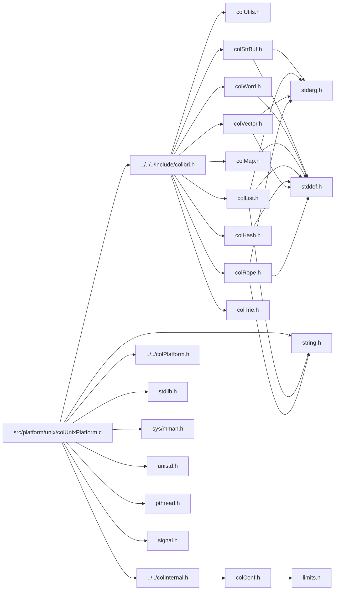

<a id="col_unix_platform_8c"></a>
# File colUnixPlatform.c

![][C++]

**Location**: `src/platform/unix/colUnixPlatform.c`

This file provides Unix implementations of generic primitives needing platform-specific implementations, as well as Unix-specific primitives.

**See also**: [colPlatform.h](col_platform_8h.md#col_platform_8h), [colUnixPlatform.h](col_unix_platform_8h.md#col_unix_platform_8h)

## Classes

* [UnixGroupData](struct_unix_group_data.md#struct_unix_group_data)

## Includes

* [../../../include/colibri.h](colibri_8h.md#colibri_8h)
* [../../colInternal.h](col_internal_8h.md#col_internal_8h)
* [../../colPlatform.h](col_platform_8h.md#col_platform_8h)
* <stdlib.h>
* <string.h>
* <sys/mman.h>
* <unistd.h>
* <pthread.h>
* <signal.h>



## Thread-Local Storage

<a id="group__arch__unix_1gacfa4b2395a4c29a432e682bfbb407a35"></a>
### Variable tsdKey

![][private]

**Definition**: `src/platform/unix/colUnixPlatform.c` (line 75)

```cpp
pthread_key_t tsdKey
```

Thread-speficic data identifier.

Used to get thread-specific data.


**See also**: [ThreadData](struct_thread_data.md#struct_thread_data), [Init](col_unix_platform_8c.md#group__arch__unix_1ga1716946dffd7f7f6a9c8f46406ab0732)


**Type**: pthread_key_t

**Referenced by**:

* [Init](col_unix_platform_8c.md#group__arch__unix_1ga1716946dffd7f7f6a9c8f46406ab0732)
* [PlatEnter](col_unix_platform_8c.md#group__arch__unix_1gaa42fe97b4b462c9483110a715c1eb1d1)
* [PlatLeave](col_unix_platform_8c.md#group__arch__unix_1ga445bf6b3cd4afc09367a6d9fce001a2e)

<a id="group__arch__unix_1ga5a87c9b163905bf83d4d93ddbd0b6c56"></a>
### Variable sharedGroups

![][private]
![][static]

**Definition**: `src/platform/unix/colUnixPlatform.c` (line 112)

```cpp
UnixGroupData* sharedGroups
```

List of active groups in process.

**See also**: [UnixGroupData](struct_unix_group_data.md#struct_unix_group_data), [AllocGroupData](col_unix_platform_8c.md#group__arch__unix_1gada67280be3d6df8cf250ba65d46d176e), [FreeGroupData](col_unix_platform_8c.md#group__arch__unix_1ga721b5c30cbc3d79ced480bf39efcf5aa)


**Type**: [UnixGroupData](struct_unix_group_data.md#struct_unix_group_data) *

**Referenced by**:

* [Init](col_unix_platform_8c.md#group__arch__unix_1ga1716946dffd7f7f6a9c8f46406ab0732)
* [PlatEnter](col_unix_platform_8c.md#group__arch__unix_1gaa42fe97b4b462c9483110a715c1eb1d1)

<a id="group__arch__unix_1gaa73b09c27d88ca5ea5da4687c10a8cbe"></a>
### Variable mutexSharedGroups

![][private]
![][static]

**Definition**: `src/platform/unix/colUnixPlatform.c` (line 119)

```cpp
pthread_mutex_t mutexSharedGroups = PTHREAD_MUTEX_INITIALIZER
```

Mutex protecting [sharedGroups](col_unix_platform_8c.md#group__arch__unix_1ga5a87c9b163905bf83d4d93ddbd0b6c56).

**See also**: [sharedGroups](col_unix_platform_8c.md#group__arch__unix_1ga5a87c9b163905bf83d4d93ddbd0b6c56)


**Type**: pthread_mutex_t

**Referenced by**:

* [PlatEnter](col_unix_platform_8c.md#group__arch__unix_1gaa42fe97b4b462c9483110a715c1eb1d1)
* [PlatLeave](col_unix_platform_8c.md#group__arch__unix_1ga445bf6b3cd4afc09367a6d9fce001a2e)

<a id="group__arch__unix_1gada67280be3d6df8cf250ba65d46d176e"></a>
### Function AllocGroupData

![][private]
![][static]

```cpp
static UnixGroupData* AllocGroupData(unsigned int model)
```

Allocate and initialize a thread group data structure.

**Returns**:

The newly allocated structure.


**Side Effect**:

Memory allocated and system objects created.


**See also**: [Threading Model Constants](#group__init_1threading_models), [UnixGroupData](struct_unix_group_data.md#struct_unix_group_data), [FreeGroupData](col_unix_platform_8c.md#group__arch__unix_1ga721b5c30cbc3d79ced480bf39efcf5aa)


**Parameters**:

* unsigned int **model**: Threading model.

**Return type**: [UnixGroupData](struct_unix_group_data.md#struct_unix_group_data) *

**References**:

* [COL\_SINGLE](colibri_8h.md#group__init_1gaaecbd3c0ddf9f5684b97db76e7338731)
* [UnixGroupData::data](struct_unix_group_data.md#struct_unix_group_data_1ad7c37ae9b2b049edee188d6123ed1d02)
* [GcInitGroup](col_gc_8c.md#group__gc_1ga4183a56fec06c1ff8176f90c31248d68)
* [GcThreadProc](col_unix_platform_8c.md#group__arch__unix_1ga74665cfa1a2c8827d87315985197ee41)
* [GroupData::model](struct_group_data.md#struct_group_data_1a02daeab5df802e492019f1f17d3efde2)

**Referenced by**:

* [PlatEnter](col_unix_platform_8c.md#group__arch__unix_1gaa42fe97b4b462c9483110a715c1eb1d1)

<a id="group__arch__unix_1ga721b5c30cbc3d79ced480bf39efcf5aa"></a>
### Function FreeGroupData

![][private]
![][static]

```cpp
static void FreeGroupData(UnixGroupData *groupData)
```

Free a thread group data structure.

**Side Effect**:

Memory freed and system objects deleted.


**See also**: [UnixGroupData](struct_unix_group_data.md#struct_unix_group_data), [AllocGroupData](col_unix_platform_8c.md#group__arch__unix_1gada67280be3d6df8cf250ba65d46d176e)


**Parameters**:

* [UnixGroupData](struct_unix_group_data.md#struct_unix_group_data) * **groupData**: Structure to free.

**Return type**: void

**References**:

* [COL\_SINGLE](colibri_8h.md#group__init_1gaaecbd3c0ddf9f5684b97db76e7338731)
* [UnixGroupData::condGcDone](struct_unix_group_data.md#struct_unix_group_data_1a8e596ff91f9b7bccc2e03ba8a3904646)
* [UnixGroupData::condGcScheduled](struct_unix_group_data.md#struct_unix_group_data_1a965c8fab20818cadc1ed6149560be9bc)
* [UnixGroupData::data](struct_unix_group_data.md#struct_unix_group_data_1ad7c37ae9b2b049edee188d6123ed1d02)
* [GcCleanupGroup](col_gc_8c.md#group__gc_1ga8e6fd33d04cb870d9d4b64eb34ab2ebc)
* [GroupData::model](struct_group_data.md#struct_group_data_1a02daeab5df802e492019f1f17d3efde2)
* [UnixGroupData::mutexGc](struct_unix_group_data.md#struct_unix_group_data_1a3755b74c0ab89d8c45ece97e0f1391bc)
* [UnixGroupData::mutexRoots](struct_unix_group_data.md#struct_unix_group_data_1a38ea1e8080b000b915c65824cbed5692)
* [UnixGroupData::terminated](struct_unix_group_data.md#struct_unix_group_data_1a6cbd01f65b68f69a64417339bffd4536)
* [UnixGroupData::threadGc](struct_unix_group_data.md#struct_unix_group_data_1aa293192519610d88e0c7bbb4678f31ba)

**Referenced by**:

* [PlatLeave](col_unix_platform_8c.md#group__arch__unix_1ga445bf6b3cd4afc09367a6d9fce001a2e)

## Process & Threads

<a id="group__arch__unix_1gad2c7a51be06d10615c8b5ab3d2f8d161"></a>
### Variable once

![][private]
![][static]

**Definition**: `src/platform/unix/colUnixPlatform.c` (line 229)

```cpp
pthread_once_t once = PTHREAD_ONCE_INIT
```

Ensure that per-process initialization only occurs once.

**See also**: [PlatEnter](col_unix_platform_8c.md#group__arch__unix_1gaa42fe97b4b462c9483110a715c1eb1d1), [Init](col_unix_platform_8c.md#group__arch__unix_1ga1716946dffd7f7f6a9c8f46406ab0732)


**Type**: pthread_once_t

**Referenced by**:

* [PlatEnter](col_unix_platform_8c.md#group__arch__unix_1gaa42fe97b4b462c9483110a715c1eb1d1)

<a id="group__arch__unix_1gaa42fe97b4b462c9483110a715c1eb1d1"></a>
### Function PlatEnter

![][private]

```cpp
int PlatEnter(unsigned int model)
```

Enter the thread.

If this is the first nested call, initialize thread data. If this is the first thread in its group, initialize group data as well.


**Return values**:

* **<>0**: if this is the first nested call.
* **0**: otherwise.


**See also**: [Threading Model Constants](#group__init_1threading_models), [ThreadData](struct_thread_data.md#struct_thread_data), [UnixGroupData](struct_unix_group_data.md#struct_unix_group_data), [PlatLeave](col_unix_platform_8c.md#group__arch__unix_1ga445bf6b3cd4afc09367a6d9fce001a2e), [Col\_Init](colibri_8h.md#group__init_1ga715049d7eb10ff0eeac38b457ef4fce1)


**Parameters**:

* unsigned int **model**: Threading model.

**Return type**: int

**References**:

* [AllocGroupData](col_unix_platform_8c.md#group__arch__unix_1gada67280be3d6df8cf250ba65d46d176e)
* [COL\_ASYNC](colibri_8h.md#group__init_1ga74df35d99d8e8408a563ae5a23022b06)
* [COL\_SINGLE](colibri_8h.md#group__init_1gaaecbd3c0ddf9f5684b97db76e7338731)
* [UnixGroupData::data](struct_unix_group_data.md#struct_unix_group_data_1ad7c37ae9b2b049edee188d6123ed1d02)
* [GroupData::first](struct_group_data.md#struct_group_data_1af58eb628d2c2bb11f4bfa161c7e93318)
* [GcInitThread](col_gc_8c.md#group__gc_1gad46e288d322683c434e6efa30e3edc22)
* [Init](col_unix_platform_8c.md#group__arch__unix_1ga1716946dffd7f7f6a9c8f46406ab0732)
* [GroupData::model](struct_group_data.md#struct_group_data_1a02daeab5df802e492019f1f17d3efde2)
* [mutexSharedGroups](col_unix_platform_8c.md#group__arch__unix_1gaa73b09c27d88ca5ea5da4687c10a8cbe)
* [ThreadData::next](struct_thread_data.md#struct_thread_data_1aee56668363c15f17454a3bab5f63b4a4)
* [UnixGroupData::next](struct_unix_group_data.md#struct_unix_group_data_1ac4503fc576f6bc99549cf25866b45304)
* [once](col_unix_platform_8c.md#group__arch__unix_1gad2c7a51be06d10615c8b5ab3d2f8d161)
* [PlatGetThreadData](col_unix_platform_8h.md#group__arch__unix_1ga6964b3c4d4787a9defb7aae57825d92c)
* [sharedGroups](col_unix_platform_8c.md#group__arch__unix_1ga5a87c9b163905bf83d4d93ddbd0b6c56)
* [tsdKey](col_unix_platform_8c.md#group__arch__unix_1gacfa4b2395a4c29a432e682bfbb407a35)
* [UNIX\_PROTECT\_ADDRESS\_RANGES\_RECURSE](col_unix_platform_8h.md#group__arch__unix_1ga9e2c8984ce04b1ef7c69111e31c508cd)

<a id="group__arch__unix_1ga445bf6b3cd4afc09367a6d9fce001a2e"></a>
### Function PlatLeave

![][private]

```cpp
int PlatLeave()
```

Leave the thread.

If this is the first nested call, cleanup thread data. If this is the last thread in its group, cleanup group data as well.


**Return values**:

* **<>0**: if this is the last nested call.
* **0**: otherwise.


**See also**: [ThreadData](struct_thread_data.md#struct_thread_data), [UnixGroupData](struct_unix_group_data.md#struct_unix_group_data), [PlatEnter](col_unix_platform_8c.md#group__arch__unix_1gaa42fe97b4b462c9483110a715c1eb1d1), [Col\_Cleanup](colibri_8h.md#group__init_1gaaa7addef72eaac5fb58f6edb449fda75)


**Return type**: int

**References**:

* [COL\_ASYNC](colibri_8h.md#group__init_1ga74df35d99d8e8408a563ae5a23022b06)
* [COL\_SINGLE](colibri_8h.md#group__init_1gaaecbd3c0ddf9f5684b97db76e7338731)
* [UnixGroupData::data](struct_unix_group_data.md#struct_unix_group_data_1ad7c37ae9b2b049edee188d6123ed1d02)
* [GroupData::first](struct_group_data.md#struct_group_data_1af58eb628d2c2bb11f4bfa161c7e93318)
* [FreeGroupData](col_unix_platform_8c.md#group__arch__unix_1ga721b5c30cbc3d79ced480bf39efcf5aa)
* [GcCleanupThread](col_gc_8c.md#group__gc_1gacbea8d94b2fdf7366fbe4ad8b8298a91)
* [GroupData::model](struct_group_data.md#struct_group_data_1a02daeab5df802e492019f1f17d3efde2)
* [mutexSharedGroups](col_unix_platform_8c.md#group__arch__unix_1gaa73b09c27d88ca5ea5da4687c10a8cbe)
* [ThreadData::next](struct_thread_data.md#struct_thread_data_1aee56668363c15f17454a3bab5f63b4a4)
* [PlatGetThreadData](col_unix_platform_8h.md#group__arch__unix_1ga6964b3c4d4787a9defb7aae57825d92c)
* [tsdKey](col_unix_platform_8c.md#group__arch__unix_1gacfa4b2395a4c29a432e682bfbb407a35)

<a id="group__arch__unix_1ga74665cfa1a2c8827d87315985197ee41"></a>
### Function GcThreadProc

![][private]
![][static]

```cpp
static void* GcThreadProc(void *arg)
```

Thread dedicated to the GC process.

Activated when one of the worker threads in the group triggers the GC.


**Returns**:

Always zero.


**Side Effect**:

Calls [PerformGC](col_gc_8c.md#group__gc_1ga5688ae9d7f658650ca8dfa66f4102f62).


**See also**: [AllocGroupData](col_unix_platform_8c.md#group__arch__unix_1gada67280be3d6df8cf250ba65d46d176e), [PerformGC](col_gc_8c.md#group__gc_1ga5688ae9d7f658650ca8dfa66f4102f62)


**Parameters**:

* void * **arg**: [UnixGroupData](struct_unix_group_data.md#struct_unix_group_data).

**Return type**: void *

**References**:

* [UnixGroupData::condGcScheduled](struct_unix_group_data.md#struct_unix_group_data_1a965c8fab20818cadc1ed6149560be9bc)
* [UnixGroupData::mutexGc](struct_unix_group_data.md#struct_unix_group_data_1a3755b74c0ab89d8c45ece97e0f1391bc)
* [PerformGC](col_gc_8c.md#group__gc_1ga5688ae9d7f658650ca8dfa66f4102f62)
* [UnixGroupData::scheduled](struct_unix_group_data.md#struct_unix_group_data_1a8b8e85e9f5c851a84d34a399373bf12a)
* [UnixGroupData::terminated](struct_unix_group_data.md#struct_unix_group_data_1a6cbd01f65b68f69a64417339bffd4536)

**Referenced by**:

* [AllocGroupData](col_unix_platform_8c.md#group__arch__unix_1gada67280be3d6df8cf250ba65d46d176e)

<a id="group__arch__unix_1gaa19923dd2972ca8919b05b935cc5592f"></a>
### Function PlatSyncPauseGC

![][private]

```cpp
void PlatSyncPauseGC(GroupData *data)
```

Called when a worker thread calls the outermost [Col\_PauseGC()](colibri_8h.md#group__gc_1gae703ee3215a4724ebed8e5a2824e7a7b).

**Side Effect**:

May block as long as a GC is underway.


**See also**: [GcThreadProc](col_unix_platform_8c.md#group__arch__unix_1ga74665cfa1a2c8827d87315985197ee41), [SyncPauseGC](col_platform_8h.md#group__arch_1ga24722ffc116af10635061f365d59f877), [Col\_PauseGC](colibri_8h.md#group__gc_1gae703ee3215a4724ebed8e5a2824e7a7b)


**Parameters**:

* [GroupData](struct_group_data.md#struct_group_data) * **data**: Group-specific data.

**Return type**: void

**References**:

* [UnixGroupData::condGcDone](struct_unix_group_data.md#struct_unix_group_data_1a8e596ff91f9b7bccc2e03ba8a3904646)
* [UnixGroupData::data](struct_unix_group_data.md#struct_unix_group_data_1ad7c37ae9b2b049edee188d6123ed1d02)
* [UnixGroupData::mutexGc](struct_unix_group_data.md#struct_unix_group_data_1a3755b74c0ab89d8c45ece97e0f1391bc)
* [UnixGroupData::nbActive](struct_unix_group_data.md#struct_unix_group_data_1aea3a82f31d27f81fd27582e8afebda97)
* [UnixGroupData::scheduled](struct_unix_group_data.md#struct_unix_group_data_1a8b8e85e9f5c851a84d34a399373bf12a)

<a id="group__arch__unix_1ga52acd19d06324536559d9f142b832025"></a>
### Function PlatTrySyncPauseGC

![][private]

```cpp
int PlatTrySyncPauseGC(GroupData *data)
```

Called when a worker thread calls the outermost [Col\_TryPauseGC()](colibri_8h.md#group__gc_1ga54eefaa11ad5a79b8665fef5cc24c26f).

**Return values**:

* **<>0**: if successful.
* **0**: if call would block.


**See also**: [GcThreadProc](col_unix_platform_8c.md#group__arch__unix_1ga74665cfa1a2c8827d87315985197ee41), [TrySyncPauseGC](col_platform_8h.md#group__arch_1gaaab49fa9044c9543c52236f55c750ce7), [Col\_TryPauseGC](colibri_8h.md#group__gc_1ga54eefaa11ad5a79b8665fef5cc24c26f)


**Parameters**:

* [GroupData](struct_group_data.md#struct_group_data) * **data**: Group-specific data.

**Return type**: int

**References**:

* [UnixGroupData::condGcDone](struct_unix_group_data.md#struct_unix_group_data_1a8e596ff91f9b7bccc2e03ba8a3904646)
* [UnixGroupData::data](struct_unix_group_data.md#struct_unix_group_data_1ad7c37ae9b2b049edee188d6123ed1d02)
* [UnixGroupData::mutexGc](struct_unix_group_data.md#struct_unix_group_data_1a3755b74c0ab89d8c45ece97e0f1391bc)
* [UnixGroupData::nbActive](struct_unix_group_data.md#struct_unix_group_data_1aea3a82f31d27f81fd27582e8afebda97)
* [UnixGroupData::scheduled](struct_unix_group_data.md#struct_unix_group_data_1a8b8e85e9f5c851a84d34a399373bf12a)

<a id="group__arch__unix_1ga234974987c437283a255cad2e6847585"></a>
### Function PlatSyncResumeGC

![][private]

```cpp
void PlatSyncResumeGC(GroupData *data, int performGc)
```

Called when a worker thread calls the outermost [Col\_ResumeGC()](colibri_8h.md#group__gc_1gaf7d4f0dd1996dde366af3f29e9bcc517).

**Side Effect**:

If last thread in group, may trigger the GC in the dedicated thread if previously scheduled. This will block further calls to [Col\_PauseGC()](colibri_8h.md#group__gc_1gae703ee3215a4724ebed8e5a2824e7a7b) / [PlatSyncPauseGC()](col_unix_platform_8c.md#group__arch__unix_1gaa19923dd2972ca8919b05b935cc5592f).


**See also**: [GcThreadProc](col_unix_platform_8c.md#group__arch__unix_1ga74665cfa1a2c8827d87315985197ee41), [SyncResumeGC](col_platform_8h.md#group__arch_1gaeda9d3a189fb79d5dc53d2638ca42b35), [Col\_ResumeGC](colibri_8h.md#group__gc_1gaf7d4f0dd1996dde366af3f29e9bcc517)


**Parameters**:

* [GroupData](struct_group_data.md#struct_group_data) * **data**: Group-specific data.
* int **performGc**: Whether to perform GC.

**Return type**: void

**References**:

* [UnixGroupData::condGcScheduled](struct_unix_group_data.md#struct_unix_group_data_1a965c8fab20818cadc1ed6149560be9bc)
* [UnixGroupData::data](struct_unix_group_data.md#struct_unix_group_data_1ad7c37ae9b2b049edee188d6123ed1d02)
* [UnixGroupData::mutexGc](struct_unix_group_data.md#struct_unix_group_data_1a3755b74c0ab89d8c45ece97e0f1391bc)
* [UnixGroupData::nbActive](struct_unix_group_data.md#struct_unix_group_data_1aea3a82f31d27f81fd27582e8afebda97)
* [UnixGroupData::scheduled](struct_unix_group_data.md#struct_unix_group_data_1a8b8e85e9f5c851a84d34a399373bf12a)

<a id="group__arch__unix_1gaeb2b83a6cb4f1d38f1993fe221556bfa"></a>
### Function PlatEnterProtectRoots

![][private]

```cpp
void PlatEnterProtectRoots(GroupData *data)
```

Enter protected section around root management structures.

**Side Effect**:

Blocks until no thread owns the section.


**See also**: [PlatLeaveProtectRoots](col_unix_platform_8c.md#group__arch__unix_1gac35163168872326ce29c15c6df13d76a), [EnterProtectRoots](col_platform_8h.md#group__arch_1ga037203dea1294535ac25be8712d708d6)


**Parameters**:

* [GroupData](struct_group_data.md#struct_group_data) * **data**: Group-specific data.

**Return type**: void

**References**:

* [UnixGroupData::data](struct_unix_group_data.md#struct_unix_group_data_1ad7c37ae9b2b049edee188d6123ed1d02)
* [UnixGroupData::mutexRoots](struct_unix_group_data.md#struct_unix_group_data_1a38ea1e8080b000b915c65824cbed5692)

<a id="group__arch__unix_1gac35163168872326ce29c15c6df13d76a"></a>
### Function PlatLeaveProtectRoots

![][private]

```cpp
void PlatLeaveProtectRoots(GroupData *data)
```

Leave protected section around root management structures.

**Side Effect**:

May unblock any thread waiting for the section.


**See also**: [PlatEnterProtectRoots](col_unix_platform_8c.md#group__arch__unix_1gaeb2b83a6cb4f1d38f1993fe221556bfa), [LeaveProtectRoots](col_platform_8h.md#group__arch_1gaee9721bdb7cc0ecca4a8ee295eadd446)


**Parameters**:

* [GroupData](struct_group_data.md#struct_group_data) * **data**: Group-specific data.

**Return type**: void

**References**:

* [UnixGroupData::data](struct_unix_group_data.md#struct_unix_group_data_1ad7c37ae9b2b049edee188d6123ed1d02)
* [UnixGroupData::mutexRoots](struct_unix_group_data.md#struct_unix_group_data_1a38ea1e8080b000b915c65824cbed5692)

## System Page Allocation

<a id="group__arch__unix_1ga61c38d216e226603ecd1e143f8757970"></a>
### Variable mutexRange

![][private]

**Definition**: `src/platform/unix/colUnixPlatform.c` (line 584)

```cpp
pthread_mutex_t mutexRange = PTHREAD_MUTEX_INITIALIZER
```

Mutex protecting address range management.

* [ranges](col_alloc_8c.md#group__alloc_1ga9ac4c516a0888195d1f2ca4721f633f8): Reserved address ranges for general purpose.

* [dedicatedRanges](col_alloc_8c.md#group__alloc_1ga09e3f1c0494d23d9f93481ed4f228a4c): Dedicated address ranges for large pages.


**See also**: [PlatEnterProtectAddressRanges](col_win32_platform_8h.md#group__arch__win32_1ga0d52de05fb3a0897f54579ab12519159), [PlatLeaveProtectAddressRanges](col_win32_platform_8h.md#group__arch__win32_1gab6be4d622dd8c6bc4c283a1039962e5a)


**Type**: pthread_mutex_t

<a id="group__arch__unix_1ga7d63e9c0de11a4c0954aab0efbc09c09"></a>
### Function PlatReserveRange

![][private]

```cpp
void* PlatReserveRange(size_t size, int alloc)
```

Reserve an address range.

**Returns**:

The reserved range's base address, or NULL if failure.


**Parameters**:

* size_t **size**: Number of pages to reserve.
* int **alloc**: Whether to allocate the range pages as well.

**Return type**: void *

**References**:

* [shiftPage](col_alloc_8c.md#group__arch_1gacfb643d4c365f92c1ea93d0f1b1b71e5)

<a id="group__arch__unix_1ga7ca830366dd1fb4e114a2f912ef5ed6c"></a>
### Function PlatReleaseRange

![][private]

```cpp
int PlatReleaseRange(void *base, size_t size)
```

Release an address range.

**Return values**:

* **<>0**: for success.
* **0**: for failure.


**Parameters**:

* void * **base**: Base address of range to release.
* size_t **size**: Number of pages in range.

**Return type**: int

**References**:

* [shiftPage](col_alloc_8c.md#group__arch_1gacfb643d4c365f92c1ea93d0f1b1b71e5)

<a id="group__arch__unix_1gab258be1bc40313f7c0a4c8bcab840243"></a>
### Function PlatAllocPages

![][private]

```cpp
int PlatAllocPages(void *addr, size_t number)
```

Allocate pages in reserved range.

**Return values**:

* **<>0**: for success.
* **0**: for failure.


**Parameters**:

* void * **addr**: Address of first page to allocate.
* size_t **number**: Number of pages to allocate.

**Return type**: int

**References**:

* [shiftPage](col_alloc_8c.md#group__arch_1gacfb643d4c365f92c1ea93d0f1b1b71e5)

<a id="group__arch__unix_1ga3af1cd9d798457114f4bf563c10f9875"></a>
### Function PlatFreePages

![][private]

```cpp
int PlatFreePages(void *addr, size_t number)
```

Free pages in reserved range.

**Return values**:

* **<>0**: for success.
* **0**: for failure.


**Parameters**:

* void * **addr**: Address of first page to free.
* size_t **number**: Number of pages to free.

**Return type**: int

**References**:

* [shiftPage](col_alloc_8c.md#group__arch_1gacfb643d4c365f92c1ea93d0f1b1b71e5)

<a id="group__arch__unix_1gaafe939448070a0b389fc64dcd009ac9e"></a>
### Function PlatProtectPages

![][private]

```cpp
int PlatProtectPages(void *addr, size_t number, int protect)
```

Protect/unprotect pages in reserved range.

**Return values**:

* **<>0**: for success.
* **0**: for failure.


**Parameters**:

* void * **addr**: Address of first page to protect/unprotect
* size_t **number**: Number of pages to protect/unprotect.
* int **protect**: Whether to protect or unprotect pages.

**Return type**: int

**References**:

* [shiftPage](col_alloc_8c.md#group__arch_1gacfb643d4c365f92c1ea93d0f1b1b71e5)

<a id="group__arch__unix_1ga4e30b30c96c05d605c05e40613e6dc5a"></a>
### Function PageProtectSigAction

![][private]
![][static]

```cpp
static void PageProtectSigAction(int signo, siginfo_t *info, void *dummy)
```

Called upon memory protection signal (SIGSEGV).

**See also**: [SysPageProtect](col_alloc_8c.md#group__alloc_1ga35a37fb9d22a879405b65f3e90d09358)


**Parameters**:

* int **signo**: Signal number caught.
* siginfo_t * **info**: Signal information.
* void * **dummy**: Unused.

**Return type**: void

**References**:

* [SysPageProtect](col_alloc_8c.md#group__alloc_1ga35a37fb9d22a879405b65f3e90d09358)

**Referenced by**:

* [Init](col_unix_platform_8c.md#group__arch__unix_1ga1716946dffd7f7f6a9c8f46406ab0732)

## Initialization/Cleanup

<a id="group__arch__unix_1ga1716946dffd7f7f6a9c8f46406ab0732"></a>
### Function Init

![][private]
![][static]

```cpp
static void Init()
```

Initialization routine.

Called through pthread_once().


**Side Effect**:


* Create thread-specific data key [tsdKey](col_unix_platform_8c.md#group__arch__unix_1gacfa4b2395a4c29a432e682bfbb407a35) (never freed).

* Install memory protection signal handler [PageProtectSigAction()](col_unix_platform_8c.md#group__arch__unix_1ga4e30b30c96c05d605c05e40613e6dc5a) for parent tracking.


**See also**: [PlatEnter](col_unix_platform_8c.md#group__arch__unix_1gaa42fe97b4b462c9483110a715c1eb1d1)


**Return type**: void

**References**:

* [allocGranularity](col_alloc_8c.md#group__arch_1ga9fdf03be3e1742b0fbc71f3445d83c48)
* [PageProtectSigAction](col_unix_platform_8c.md#group__arch__unix_1ga4e30b30c96c05d605c05e40613e6dc5a)
* [sharedGroups](col_unix_platform_8c.md#group__arch__unix_1ga5a87c9b163905bf83d4d93ddbd0b6c56)
* [shiftPage](col_alloc_8c.md#group__arch_1gacfb643d4c365f92c1ea93d0f1b1b71e5)
* [systemPageSize](col_alloc_8c.md#group__arch_1gacfca316efccddeee528c309c490c3f90)
* [tsdKey](col_unix_platform_8c.md#group__arch__unix_1gacfa4b2395a4c29a432e682bfbb407a35)

**Referenced by**:

* [PlatEnter](col_unix_platform_8c.md#group__arch__unix_1gaa42fe97b4b462c9483110a715c1eb1d1)

## Source

```cpp
/**
 * @file colUnixPlatform.c
 *
 * This file provides Unix implementations of generic primitives needing
 * platform-specific implementations, as well as Unix-specific primitives.
 *
 * @see colPlatform.h
 * @see colUnixPlatform.h
 *
 * @beginprivate @cond PRIVATE
 */

#include "../../../include/colibri.h"
#include "../../colInternal.h"
#include "../../colPlatform.h"

#include <stdlib.h>
#include <string.h>
#include <sys/mman.h>
#include <unistd.h>
#include <pthread.h>
#include <signal.h>

/*
 * Prototypes for functions used only in this file.
 */

/*! \cond IGNORE */
static struct UnixGroupData * AllocGroupData(unsigned int model);
static void             FreeGroupData(struct UnixGroupData *groupData);
#ifdef COL_USE_THREADS
static void *           GcThreadProc(void *arg);
#endif /* COL_USE_THREADS */
static void             Init(void);
/*! \endcond *//* IGNORE */


/*
===========================================================================*//*!
\internal \weakgroup arch_unix System and Architecture (Unix-specific)
\{*//*==========================================================================
*/

/** @beginprivate @cond PRIVATE */

/*
 * Bit twiddling hack for computing the log2 of a power of 2.
 * See: http://www-graphics.stanford.edu/~seander/bithacks.html#IntegerLogDeBruijn
 */

/*! \cond IGNORE */
static const int MultiplyDeBruijnBitPosition2[32] =
{
  0, 1, 28, 2, 29, 14, 24, 3, 30, 22, 20, 15, 25, 17, 4, 8,
  31, 27, 13, 23, 21, 19, 16, 7, 26, 12, 18, 6, 11, 5, 10, 9
};
#define LOG2(v) MultiplyDeBruijnBitPosition2[(uint32_t)(v * 0x077CB531U) >> 27]
/*! \endcond *//* IGNORE */

/** @endcond @endprivate */


/***************************************************************************//*!
 * \name Thread-Local Storage
 ***************************************************************************\{*/

/** @beginprivate @cond PRIVATE */

/**
 * Thread-speficic data identifier. Used to get thread-specific data.
 *
 * @see ThreadData
 * @see Init
 */
pthread_key_t tsdKey;

/**
 * Platform-specific group data.
 *
 * @see ThreadData
 * @see GroupData
 * @see Init
 * @see AllocGroupData
 * @see FreeGroupData
 */
typedef struct UnixGroupData {
    GroupData data;                 /*!< Generic #GroupData structure. */
#ifdef COL_USE_THREADS
    struct UnixGroupData *next;     /*!< Next active group in list. */
    pthread_mutex_t mutexRoots;     /*!< Mutex protecting root management. */

    pthread_mutex_t mutexGc;        /*!< Mutex protecting GC from worker
                                         threads. */
    pthread_cond_t condGcScheduled; /*!< Triggers GC thread. */
    pthread_cond_t condGcDone;      /*!< Barrier for worker threads. */
    int scheduled;                  /*!< Flag for when a GC is scheduled. */
    int terminated;                 /*!< Flag for thread group destruction. */
    int nbActive;                   /*!< Active worker thread counter. */
    pthread_t threadGc;             /*!< GC thread. */
#endif /* COL_USE_THREADS */
} UnixGroupData;

#ifdef COL_USE_THREADS

/**
 * List of active groups in process.
 *
 * @see UnixGroupData
 * @see AllocGroupData
 * @see FreeGroupData
 */
static UnixGroupData *sharedGroups;

/**
 * Mutex protecting #sharedGroups.
 *
 * @see sharedGroups
 */
static pthread_mutex_t mutexSharedGroups = PTHREAD_MUTEX_INITIALIZER;

#endif /* COL_USE_THREADS */

/**
 * Allocate and initialize a thread group data structure.
 *
 * @return The newly allocated structure.
 *
 * @sideeffect
 *      Memory allocated and system objects created.
 *
 * @see @ref threading_models "Threading Model Constants"
 * @see UnixGroupData
 * @see FreeGroupData
 */
static UnixGroupData *
AllocGroupData(
    unsigned int model)     /*!< Threading model. */
{
    UnixGroupData *groupData = (UnixGroupData *) malloc(sizeof(UnixGroupData));
    memset(groupData, 0, sizeof(UnixGroupData));
    groupData->data.model = model;
    GcInitGroup((GroupData *) groupData);

#ifdef COL_USE_THREADS
    if (model != COL_SINGLE) {
        /*
         * Create synchronization objects.
         */

        //TODO error handling.
        pthread_mutex_init(&groupData->mutexRoots, NULL);

        pthread_mutex_init(&groupData->mutexGc, NULL);
        pthread_cond_init(&groupData->condGcDone, NULL);
        pthread_cond_init(&groupData->condGcScheduled, NULL);

        /*
         * Create GC thread.
         */

        pthread_create(&groupData->threadGc, NULL, GcThreadProc, groupData);
    }
#endif /* COL_USE_THREADS */

    return groupData;
}

/**
 * Free a thread group data structure.
 *
 * @sideeffect
 *      Memory freed and system objects deleted.
 *
 * @see UnixGroupData
 * @see AllocGroupData
 */
static void
FreeGroupData(
    UnixGroupData *groupData)   /*!< Structure to free. */
{
#ifdef COL_USE_THREADS
    if (groupData->data.model != COL_SINGLE) {
        /*
         * Signal and wait for termination of GC thread.
         */

        //TODO error handling.
        groupData->terminated = 1;
        pthread_mutex_lock(&groupData->mutexGc);
        {
            pthread_cond_signal(&groupData->condGcScheduled);
        }
        pthread_mutex_unlock(&groupData->mutexGc);
        pthread_join(groupData->threadGc, NULL);

        /*
         * Destroy synchronization objects.
         */

        pthread_cond_destroy(&groupData->condGcScheduled);
        pthread_cond_destroy(&groupData->condGcDone);
        pthread_mutex_destroy(&groupData->mutexGc);

        pthread_mutex_destroy(&groupData->mutexRoots);
    }
#endif /* COL_USE_THREADS */

    GcCleanupGroup((GroupData *) groupData);
    free(groupData);
}

/** @endcond @endprivate */

/* End of Thread-Local Storage *//*!\}*/


/***************************************************************************//*!
 * \name Process & Threads
 ***************************************************************************\{*/

/** @beginprivate @cond PRIVATE */

/**
 * Ensure that per-process initialization only occurs once.
 *
 * @see PlatEnter
 * @see Init
 */
static pthread_once_t once = PTHREAD_ONCE_INIT;

/**
 * Enter the thread. If this is the first nested call, initialize thread data.
 * If this is the first thread in its group, initialize group data as well.
 *
 * @retval <>0  if this is the first nested call.
 * @retval 0    otherwise.
 *
 * @see @ref threading_models "Threading Model Constants"
 * @see ThreadData
 * @see UnixGroupData
 * @see PlatLeave
 * @see Col_Init
 */
int
PlatEnter(
    unsigned int model) /*!< Threading model. */
{
    ThreadData *data;

    /*
     * Ensures that the TSD key is created once.
     */

    pthread_once(&once, Init);

    data = PlatGetThreadData();
    if (data) {
        /*
         * Increment nest count.
         */

        return ((++data->nestCount) == 1);
    }

    /*
     * Initialize thread data.
     */

    data = (ThreadData *) malloc(sizeof(*data)
            + sizeof(UNIX_PROTECT_ADDRESS_RANGES_RECURSE(data)));
    memset(data, 0, sizeof(*data));
    data->nestCount = 1;
    UNIX_PROTECT_ADDRESS_RANGES_RECURSE(data) = 0;
    GcInitThread(data);
    pthread_setspecific(tsdKey, data);

#ifdef COL_USE_THREADS
    if (model == COL_SINGLE || model == COL_ASYNC) {
#endif /* COL_USE_THREADS */
        /*
         * Allocate dedicated group.
         */

        data->groupData = (GroupData *) AllocGroupData(model);
        data->groupData->first = data;
        data->next = data;
#ifdef COL_USE_THREADS
    } else {
        /*
         * Try to find shared group with same model value.
         */

        pthread_mutex_lock(&mutexSharedGroups);
        {
            UnixGroupData *groupData = sharedGroups;
            while (groupData && groupData->data.model != model) {
                groupData = groupData->next;
            }
            if (!groupData) {
                /*
                 * Allocate new group and insert at head.
                 */

                groupData = AllocGroupData(model);
                groupData->next = sharedGroups;
                sharedGroups = groupData;
            }

            /*
             * Add thread to group.
             */

            data->groupData = (GroupData *) groupData;
            if (data->groupData->first) {
                data->next = data->groupData->first->next;
                data->groupData->first->next = data;
            } else {
                data->groupData->first = data;
                data->next = data;
            }
        }
        pthread_mutex_unlock(&mutexSharedGroups);
    }
#endif /* COL_USE_THREADS */

    return 1;
}

/**
 * Leave the thread. If this is the first nested call, cleanup thread data.
 * If this is the last thread in its group, cleanup group data as well.
 *
 * @retval <>0  if this is the last nested call.
 * @retval 0    otherwise.
 *
 * @see ThreadData
 * @see UnixGroupData
 * @see PlatEnter
 * @see Col_Cleanup
 */
int
PlatLeave()
{
    ThreadData *data = PlatGetThreadData();
    if (!data) {
        /* TODO: exception ? */
        return 0;
    }

    /*
     * Decrement nest count.
     */

    if (--data->nestCount) {
        return 0;
    }

    /*
     * This is the last nested call, free structures.
     */

#ifdef COL_USE_THREADS
    if (data->groupData->model == COL_SINGLE || data->groupData->model
            == COL_ASYNC) {
#endif /* COL_USE_THREADS */
        /*
         * Free dedicated group as well.
         */

        FreeGroupData((UnixGroupData *) data->groupData);
#ifdef COL_USE_THREADS
    } else {
        /*
         * Remove from shared group.
         */

        pthread_mutex_lock(&mutexSharedGroups);
        {
            if (data->next == data) {
                /*
                 * Free group as well.
                 */

                FreeGroupData((UnixGroupData *) data->groupData);
            } else {
                /*
                 * Unlink.
                 */

                ThreadData *prev = data->next;
                while (prev->next != data) {
                    prev = prev->next;
                }
                prev->next = data->next;
                data->groupData->first = prev;
            }
        }
        pthread_mutex_unlock(&mutexSharedGroups);
    }
#endif /* COL_USE_THREADS */

    GcCleanupThread(data);
    free(data);
    pthread_setspecific(tsdKey, 0);

    return 1;
}

#ifdef COL_USE_THREADS

/**
 * Thread dedicated to the GC process. Activated when one of the worker threads
 * in the group triggers the GC.
 *
 * @return Always zero.
 *
 * @sideeffect
 *      Calls #PerformGC.
 *
 * @see AllocGroupData
 * @see PerformGC
 */
static void *
GcThreadProc(
    void *arg)  /*!< #UnixGroupData. */
{
    UnixGroupData *groupData = (UnixGroupData *) arg;
    for (;;) {
        pthread_mutex_lock(&groupData->mutexGc);
        {
            pthread_cond_wait(&groupData->condGcScheduled, &groupData->mutexGc);
            if (groupData->scheduled) {
                groupData->scheduled = 0;
                PerformGC((GroupData *) groupData);
                pthread_cond_broadcast(&groupData->condGcDone);
            }
        }
        pthread_mutex_unlock(&groupData->mutexGc);
        if (groupData->terminated) {
            pthread_exit(NULL);
        }
    }
}

/**
 * Called when a worker thread calls the outermost Col_PauseGC().
 *
 * @sideeffect
 *      May block as long as a GC is underway.
 *
 * @see GcThreadProc
 * @see SyncPauseGC
 * @see Col_PauseGC
 */
void
PlatSyncPauseGC(
    GroupData *data)    /*!< Group-specific data. */
{
    UnixGroupData *groupData = (UnixGroupData *) data;
    pthread_mutex_lock(&groupData->mutexGc);
    {
        if (groupData->scheduled) {
            pthread_cond_wait(&groupData->condGcDone, &groupData->mutexGc);
        }
        groupData->nbActive++;
    }
    pthread_mutex_unlock(&groupData->mutexGc);
}

/**
 * Called when a worker thread calls the outermost Col_TryPauseGC().
 *
 * @retval <>0  if successful.
 * @retval 0    if call would block.
 *
 * @see GcThreadProc
 * @see TrySyncPauseGC
 * @see Col_TryPauseGC
 */
int
PlatTrySyncPauseGC(
    GroupData *data)    /*!< Group-specific data. */
{
    UnixGroupData *groupData = (UnixGroupData *) data;
    if (!pthread_mutex_trylock(&groupData->mutexGc)) {
        return 0;
    } else {
        if (groupData->scheduled) {
            pthread_cond_wait(&groupData->condGcDone, &groupData->mutexGc);
        }
        groupData->nbActive++;
    }
    pthread_mutex_unlock(&groupData->mutexGc);
    return 1;
}

/**
 * Called when a worker thread calls the outermost Col_ResumeGC().
 *
 * @sideeffect
 *      If last thread in group, may trigger the GC in the dedicated thread if
 *      previously scheduled. This will block further calls to
 *      Col_PauseGC() / PlatSyncPauseGC().
 *
 * @see GcThreadProc
 * @see SyncResumeGC
 * @see Col_ResumeGC
 */
void
PlatSyncResumeGC(
    GroupData *data,    /*!< Group-specific data. */
    int performGc)      /*!< Whether to perform GC. */
{
    UnixGroupData *groupData = (UnixGroupData *) data;
    pthread_mutex_lock(&groupData->mutexGc);
    {
        if (performGc) {
            groupData->scheduled = 1;
        }
        --groupData->nbActive;
        if (!groupData->nbActive && groupData->scheduled) {
            pthread_cond_signal(&groupData->condGcScheduled);
        }
    }
    pthread_mutex_unlock(&groupData->mutexGc);
}

/**
 * Enter protected section around root management structures.
 *
 * @sideeffect
 *      Blocks until no thread owns the section.
 *
 * @see PlatLeaveProtectRoots
 * @see EnterProtectRoots
 */
void
PlatEnterProtectRoots(
    GroupData *data)    /*!< Group-specific data. */
{
    UnixGroupData *groupData = (UnixGroupData *) data;
    pthread_mutex_lock(&groupData->mutexRoots);
}

/**
 * Leave protected section around root management structures.
 *
 * @sideeffect
 *      May unblock any thread waiting for the section.
 *
 * @see PlatEnterProtectRoots
 * @see LeaveProtectRoots
 */
void
PlatLeaveProtectRoots(
    GroupData *data)    /*!< Group-specific data. */
{
    UnixGroupData *groupData = (UnixGroupData *) data;
    pthread_mutex_unlock(&groupData->mutexRoots);
}

#endif /* COL_USE_THREADS */

/** @endcond @endprivate */

/* End of Process & Threads *//*!\}*/


/***************************************************************************//*!
 * \name System Page Allocation
 ***************************************************************************\{*/

/** @beginprivate @cond PRIVATE */

/**
 * Mutex protecting address range management.
 *
 * - #ranges:          Reserved address ranges for general purpose.
 * - #dedicatedRanges: Dedicated address ranges for large pages.
 *
 * @see PlatEnterProtectAddressRanges
 * @see PlatLeaveProtectAddressRanges
 */
pthread_mutex_t mutexRange = PTHREAD_MUTEX_INITIALIZER;

/**
 * Reserve an address range.
 *
 * @return The reserved range's base address, or NULL if failure.
 */
void *
PlatReserveRange(
    size_t size,    /*!< Number of pages to reserve. */
    int alloc)      /*!< Whether to allocate the range pages as well. */
{
    void *addr = mmap(NULL, size << shiftPage,
            (alloc ? PROT_READ | PROT_WRITE : PROT_NONE),
            MAP_PRIVATE | MAP_ANONYMOUS, -1, 0);
    return (addr == MAP_FAILED ? NULL : addr);
}

/**
 * Release an address range.
 *
 * @retval <>0  for success.
 * @retval 0    for failure.
 */
int
PlatReleaseRange(
    void *base,     /*!< Base address of range to release. */
    size_t size)    /*!< Number of pages in range. */
{
    return !munmap(base, size << shiftPage);
}

/**
 * Allocate pages in reserved range.
 *
 * @retval <>0  for success.
 * @retval 0    for failure.
 */
int
PlatAllocPages(
    void *addr,     /*!< Address of first page to allocate. */
    size_t number)  /*!< Number of pages to allocate. */
{
    return !mprotect(addr, number << shiftPage, PROT_READ | PROT_WRITE);
}

/**
 * Free pages in reserved range.
 *
 * @retval <>0  for success.
 * @retval 0    for failure.
 */
int
PlatFreePages(
    void *addr,     /*!< Address of first page to free. */
    size_t number)  /*!< Number of pages to free. */
{
    return !mprotect(addr, number << shiftPage, PROT_NONE);
}

/**
 * Protect/unprotect pages in reserved range.
 *
 * @retval <>0  for success.
 * @retval 0    for failure.
 */
int
PlatProtectPages(
    void *addr,     /*!< Address of first page to protect/unprotect */
    size_t number,  /*!< Number of pages to protect/unprotect. */
    int protect)    /*!< Whether to protect or unprotect pages. */
{
    return !mprotect(addr, number << shiftPage,
            PROT_READ | (protect ? 0 : PROT_WRITE));
}

/**
 * Called upon memory protection signal (SIGSEGV).
 *
 * @see SysPageProtect
 */
static void
PageProtectSigAction(
    int signo,          /*!< Signal number caught. */
    siginfo_t *info,    /*!< Signal information. */
    void *dummy)        /*!< Unused. */
{
    if (signo != SIGSEGV || info->si_code != SEGV_ACCERR) {
        /*
         * Not a memory protection signal.
         */

        return;
    }

    /*
     * Remove write protection and remember page for parent tracking.
     */

    SysPageProtect(info->si_addr, 0);
}

/** @endcond @endprivate */

/* End of System Page Allocation *//*!\}*/


/***************************************************************************//*!
 * \name Initialization/Cleanup
 ***************************************************************************\{*/

/** @beginprivate @cond PRIVATE */

/**
 * Initialization routine. Called through pthread_once().
 *
 * @sideeffect
 *      - Create thread-specific data key #tsdKey (never freed).
 *      - Install memory protection signal handler PageProtectSigAction() for
 *        parent tracking.
 *
 * @see PlatEnter
 */
static void
Init()
{
    struct sigaction sa;
    
    if (pthread_key_create(&tsdKey, NULL)) {
        /* TODO: exception */
        return;
    }

    systemPageSize = sysconf(_SC_PAGESIZE);
    allocGranularity = systemPageSize * 16;
    shiftPage = LOG2(systemPageSize);

#ifdef COL_USE_THREADS
    sharedGroups = NULL;
#endif /* COL_USE_THREADS */

    memset(&sa, 0, sizeof(sa));
    sa.sa_sigaction = PageProtectSigAction;
    sa.sa_flags = SA_SIGINFO | SA_RESTART;
    sigaction(SIGSEGV, &sa, NULL);
}

/** @endcond @endprivate */

/* End of Initialization/Cleanup *//*!\}*/

/* End of System and Architecture (Unix-specific) *//*!\}*/
/*! @endcond @endprivate */
```

[public]: https://img.shields.io/badge/-public-brightgreen (public)
[C++]: https://img.shields.io/badge/language-C%2B%2B-blue (C++)
[private]: https://img.shields.io/badge/-private-red (private)
[Markdown]: https://img.shields.io/badge/language-Markdown-blue (Markdown)
[static]: https://img.shields.io/badge/-static-lightgrey (static)