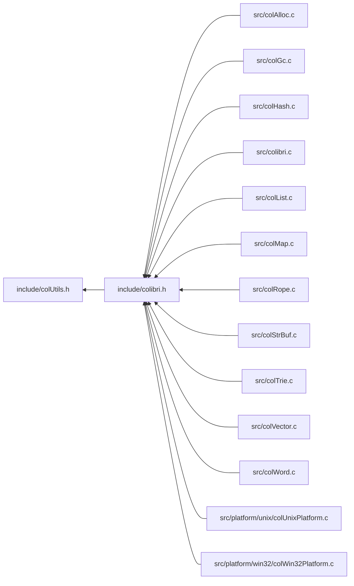

<a id="col_utils_8h"></a>
# File colUtils.h

![][C++]

**Location**: `include/colUtils.h`

This header file defines various utility macros used throughout Colibri.


## Included by

* [include/colibri.h](colibri_8h.md#colibri_8h)



## Variadic Macro Utilities

Macro hackery for accessing args passed to variadic macros.


**See also**: [http://groups.google.com/group/comp.std.c/browse_thread/thread/77ee8c8f92e4a3fb/346fc464319b1ee5?pli=1](http://groups.google.com/group/comp.std.c/browse_thread/thread/77ee8c8f92e4a3fb/346fc464319b1ee5?pli=1)

<a id="group__utils_1gabbb0e58841406f54d444d40625a2c4fe"></a>
### Macro COL\_ARGCOUNT

![][public]

```cpp
#define COL_ARGCOUNT( ... )
```

Get the number of args passed to it.

**Parameters**:

* **...**: Arguments passed to the variadic macro.


!> **Warning** \
Argument length must be between 1 and 63. Empty lists return zero due to limitations of the C preprocessor.


<a id="group__utils_1gafc4ddbc34c20a309d7340a87e8f6ffab"></a>
### Macro COL\_FOR\_EACH

![][public]

```cpp
#define COL_FOR_EACH( what ,... )
```

Iterate over the args passed to it.

**Parameters**:

* **what**: Function taking one argument, applied to all remaining arguments.
* **...**: Arguments passed to the variadic macro.


!> **Warning** \
Limited to 63 arguments.


## Runtime Checks

<a id="group__error_1ga600cfacb45fb8cb723df850444b5b87e"></a>
### Macro COL\_RUNTIMECHECK

![][public]

```cpp
#define COL_RUNTIMECHECK( condition ,level ,domain ,code ,... )
```

Check condition at runtime.

If failed, generate an error with the given parameters then execute the code block immediately following the statement.


For example:


```cpp
COL_RUNTIMECHECK(someCondition, COL_ERROR, ColibriDomain,
     COL_ERROR_GENERIC, "some message") return;
```


This code generates a generic Colibri error then exits the current proc if someCondition is false.


**Parameters**:

* **condition**: Boolean condition.
* **level**: Error level.
* **domain**: Error domain.
* **code**: Error code
* **...**: Remaining arguments passed to [Col\_Error()](colibri_8h.md#group__error_1ga9a9a9c96b23c489cf8a19a6248fc77b8).


**See also**: [COL\_DEBUGCHECK](col_utils_8h.md#group__error_1gaca6715f571b2b4b0b6cf658167c7ddc8)


<a id="group__error_1gaca6715f571b2b4b0b6cf658167c7ddc8"></a>
### Macro COL\_DEBUGCHECK

![][public]

```cpp
#define COL_DEBUGCHECK( ... )
```

In debug mode, same as [COL\_RUNTIMECHECK](col_utils_8h.md#group__error_1ga600cfacb45fb8cb723df850444b5b87e).

Else does nothing (and ignore the code block immediately following the statement).


**See also**: [COL\_RUNTIMECHECK](col_utils_8h.md#group__error_1ga600cfacb45fb8cb723df850444b5b87e)


## Macros

<a id="group__utils_1gabca6f10008484ed7d45647264d1c1d32"></a>
### Macro COL\_STRINGIZE

![][public]

```cpp
#define COL_STRINGIZE     #arg( arg )
```

Turn argument into a C string.


<a id="group__utils_1ga9f809f159ffd6703fd51d3773b15ade8"></a>
### Macro COL\_CONCATENATE

![][public]

```cpp
#define COL_CONCATENATE( arg1 ,arg2 )
```

Concatenates both arguments.


## Source

```cpp
/**
 * @file colUtils.h
 *
 * This header file defines various utility macros used throughout Colibri.
 */

#ifndef _COLIBRI_UTILS
#define _COLIBRI_UTILS

/*
===========================================================================*//*!
\defgroup utils Utilities
\{*//*==========================================================================
*/

/**
 * Turn argument into a C string.
 */
#define COL_STRINGIZE(arg) \
    #arg

/**
 * Concatenates both arguments.
 * @hideinitializer
 */
#define COL_CONCATENATE(arg1, arg2) \
    COL_CONCATENATE1(arg1, arg2)

/*! \cond IGNORE */
#define COL_CONCATENATE1(arg1, arg2) \
    COL_CONCATENATE2(arg1, arg2)
#define COL_CONCATENATE2(arg1, arg2) \
    arg1##arg2
/*! \endcond *//* IGNORE */


/***************************************************************************//*!
 * \name Variadic Macro Utilities
 *
 * Macro hackery for accessing args passed to variadic macros.
 *
 * @see http://groups.google.com/group/comp.std.c/browse_thread/thread/77ee8c8f92e4a3fb/346fc464319b1ee5?pli=1
 ***************************************************************************\{*/
              
/*! \cond IGNORE */
#define COL_LASTARG( \
         _1, _2, _3, _4, _5, _6, _7, _8, _9,_10, \
        _11,_12,_13,_14,_15,_16,_17,_18,_19,_20, \
        _21,_22,_23,_24,_25,_26,_27,_28,_29,_30, \
        _31,_32,_33,_34,_35,_36,_37,_38,_39,_40, \
        _41,_42,_43,_44,_45,_46,_47,_48,_49,_50, \
        _51,_52,_53,_54,_55,_56,_57,_58,_59,_60, \
        _61,_62,_63, \
    N,...) N
/*! \endcond *//* IGNORE */

/**
 * \def COL_ARGCOUNT
 *      Get the number of args passed to it.
 *
 * @param ...   Arguments passed to the variadic macro.
 *
 * @warning
 *      Argument length must be between 1 and 63. Empty lists return zero
 *      due to limitations of the C preprocessor.
 * @hideinitializer
 *
 *
 * \def COL_FOR_EACH
 *      Iterate over the args passed to it.
 *
 * @param what  Function taking one argument, applied to all remaining
 *              arguments.
 * @param ...   Arguments passed to the variadic macro.
 *
 * @warning
 *      Limited to 63 arguments.
 * @hideinitializer
 */
#if defined(_MSC_VER)
/*
 * MSVC is buggy wrt. (__VA_ARGS__) syntax. The workaround involves the use of a
 * dummy macro before the parentheses. See the following for an alternate
 * solution:
 *      http://www.gamedev.net/community/forums/topic.asp?topic_id=567686
 */
#   define COL_PARENS

#   define COL_ARGCOUNT(...) \
    COL_LASTARG COL_PARENS( \
        __VA_ARGS__, \
        63,62,61,60,                   \
        59,58,57,56,55,54,53,52,51,50, \
        49,48,47,46,45,44,43,42,41,40, \
        39,38,37,36,35,34,33,32,31,30, \
        29,28,27,26,25,24,23,22,21,20, \
        19,18,17,16,15,14,13,12,11,10, \
        9,8,7,6,5,4,3,2,1,0 \
    )

#   define COL_FOR_EACH_1(what, x) what(x)
#   define COL_FOR_EACH_2(what, x, ...) what(x) COL_FOR_EACH_1 COL_PARENS(what,__VA_ARGS__)
#   define COL_FOR_EACH_3(what, x, ...) what(x) COL_FOR_EACH_2 COL_PARENS(what,__VA_ARGS__)
#   define COL_FOR_EACH_4(what, x, ...) what(x) COL_FOR_EACH_3 COL_PARENS(what,__VA_ARGS__)
#   define COL_FOR_EACH_5(what, x, ...) what(x) COL_FOR_EACH_4 COL_PARENS(what,__VA_ARGS__)
#   define COL_FOR_EACH_6(what, x, ...) what(x) COL_FOR_EACH_5 COL_PARENS(what,__VA_ARGS__)
#   define COL_FOR_EACH_7(what, x, ...) what(x) COL_FOR_EACH_6 COL_PARENS(what,__VA_ARGS__)
#   define COL_FOR_EACH_8(what, x, ...) what(x) COL_FOR_EACH_7 COL_PARENS(what,__VA_ARGS__)
#   define COL_FOR_EACH_9(what, x, ...) what(x) COL_FOR_EACH_8 COL_PARENS(what,__VA_ARGS__)
#   define COL_FOR_EACH_10(what, x, ...) what(x) COL_FOR_EACH_9 COL_PARENS(what,__VA_ARGS__)
#   define COL_FOR_EACH_11(what, x, ...) what(x) COL_FOR_EACH_10 COL_PARENS(what,__VA_ARGS__)
#   define COL_FOR_EACH_12(what, x, ...) what(x) COL_FOR_EACH_11 COL_PARENS(what,__VA_ARGS__)
#   define COL_FOR_EACH_13(what, x, ...) what(x) COL_FOR_EACH_12 COL_PARENS(what,__VA_ARGS__)
#   define COL_FOR_EACH_14(what, x, ...) what(x) COL_FOR_EACH_13 COL_PARENS(what,__VA_ARGS__)
#   define COL_FOR_EACH_15(what, x, ...) what(x) COL_FOR_EACH_14 COL_PARENS(what,__VA_ARGS__)
#   define COL_FOR_EACH_16(what, x, ...) what(x) COL_FOR_EACH_15 COL_PARENS(what,__VA_ARGS__)
#   define COL_FOR_EACH_17(what, x, ...) what(x) COL_FOR_EACH_16 COL_PARENS(what,__VA_ARGS__)
#   define COL_FOR_EACH_18(what, x, ...) what(x) COL_FOR_EACH_17 COL_PARENS(what,__VA_ARGS__)
#   define COL_FOR_EACH_19(what, x, ...) what(x) COL_FOR_EACH_18 COL_PARENS(what,__VA_ARGS__)
#   define COL_FOR_EACH_20(what, x, ...) what(x) COL_FOR_EACH_19 COL_PARENS(what,__VA_ARGS__)
#   define COL_FOR_EACH_21(what, x, ...) what(x) COL_FOR_EACH_20 COL_PARENS(what,__VA_ARGS__)
#   define COL_FOR_EACH_22(what, x, ...) what(x) COL_FOR_EACH_21 COL_PARENS(what,__VA_ARGS__)
#   define COL_FOR_EACH_23(what, x, ...) what(x) COL_FOR_EACH_22 COL_PARENS(what,__VA_ARGS__)
#   define COL_FOR_EACH_24(what, x, ...) what(x) COL_FOR_EACH_23 COL_PARENS(what,__VA_ARGS__)
#   define COL_FOR_EACH_25(what, x, ...) what(x) COL_FOR_EACH_24 COL_PARENS(what,__VA_ARGS__)
#   define COL_FOR_EACH_26(what, x, ...) what(x) COL_FOR_EACH_25 COL_PARENS(what,__VA_ARGS__)
#   define COL_FOR_EACH_27(what, x, ...) what(x) COL_FOR_EACH_26 COL_PARENS(what,__VA_ARGS__)
#   define COL_FOR_EACH_28(what, x, ...) what(x) COL_FOR_EACH_27 COL_PARENS(what,__VA_ARGS__)
#   define COL_FOR_EACH_29(what, x, ...) what(x) COL_FOR_EACH_28 COL_PARENS(what,__VA_ARGS__)
#   define COL_FOR_EACH_30(what, x, ...) what(x) COL_FOR_EACH_29 COL_PARENS(what,__VA_ARGS__)
#   define COL_FOR_EACH_31(what, x, ...) what(x) COL_FOR_EACH_30 COL_PARENS(what,__VA_ARGS__)
#   define COL_FOR_EACH_32(what, x, ...) what(x) COL_FOR_EACH_31 COL_PARENS(what,__VA_ARGS__)
#   define COL_FOR_EACH_33(what, x, ...) what(x) COL_FOR_EACH_32 COL_PARENS(what,__VA_ARGS__)
#   define COL_FOR_EACH_34(what, x, ...) what(x) COL_FOR_EACH_33 COL_PARENS(what,__VA_ARGS__)
#   define COL_FOR_EACH_35(what, x, ...) what(x) COL_FOR_EACH_34 COL_PARENS(what,__VA_ARGS__)
#   define COL_FOR_EACH_36(what, x, ...) what(x) COL_FOR_EACH_35 COL_PARENS(what,__VA_ARGS__)
#   define COL_FOR_EACH_37(what, x, ...) what(x) COL_FOR_EACH_36 COL_PARENS(what,__VA_ARGS__)
#   define COL_FOR_EACH_38(what, x, ...) what(x) COL_FOR_EACH_37 COL_PARENS(what,__VA_ARGS__)
#   define COL_FOR_EACH_39(what, x, ...) what(x) COL_FOR_EACH_38 COL_PARENS(what,__VA_ARGS__)
#   define COL_FOR_EACH_40(what, x, ...) what(x) COL_FOR_EACH_39 COL_PARENS(what,__VA_ARGS__)
#   define COL_FOR_EACH_41(what, x, ...) what(x) COL_FOR_EACH_40 COL_PARENS(what,__VA_ARGS__)
#   define COL_FOR_EACH_42(what, x, ...) what(x) COL_FOR_EACH_41 COL_PARENS(what,__VA_ARGS__)
#   define COL_FOR_EACH_43(what, x, ...) what(x) COL_FOR_EACH_42 COL_PARENS(what,__VA_ARGS__)
#   define COL_FOR_EACH_44(what, x, ...) what(x) COL_FOR_EACH_43 COL_PARENS(what,__VA_ARGS__)
#   define COL_FOR_EACH_45(what, x, ...) what(x) COL_FOR_EACH_44 COL_PARENS(what,__VA_ARGS__)
#   define COL_FOR_EACH_46(what, x, ...) what(x) COL_FOR_EACH_45 COL_PARENS(what,__VA_ARGS__)
#   define COL_FOR_EACH_47(what, x, ...) what(x) COL_FOR_EACH_46 COL_PARENS(what,__VA_ARGS__)
#   define COL_FOR_EACH_48(what, x, ...) what(x) COL_FOR_EACH_47 COL_PARENS(what,__VA_ARGS__)
#   define COL_FOR_EACH_49(what, x, ...) what(x) COL_FOR_EACH_48 COL_PARENS(what,__VA_ARGS__)
#   define COL_FOR_EACH_50(what, x, ...) what(x) COL_FOR_EACH_49 COL_PARENS(what,__VA_ARGS__)
#   define COL_FOR_EACH_51(what, x, ...) what(x) COL_FOR_EACH_50 COL_PARENS(what,__VA_ARGS__)
#   define COL_FOR_EACH_52(what, x, ...) what(x) COL_FOR_EACH_51 COL_PARENS(what,__VA_ARGS__)
#   define COL_FOR_EACH_53(what, x, ...) what(x) COL_FOR_EACH_52 COL_PARENS(what,__VA_ARGS__)
#   define COL_FOR_EACH_54(what, x, ...) what(x) COL_FOR_EACH_53 COL_PARENS(what,__VA_ARGS__)
#   define COL_FOR_EACH_55(what, x, ...) what(x) COL_FOR_EACH_54 COL_PARENS(what,__VA_ARGS__)
#   define COL_FOR_EACH_56(what, x, ...) what(x) COL_FOR_EACH_55 COL_PARENS(what,__VA_ARGS__)
#   define COL_FOR_EACH_57(what, x, ...) what(x) COL_FOR_EACH_56 COL_PARENS(what,__VA_ARGS__)
#   define COL_FOR_EACH_58(what, x, ...) what(x) COL_FOR_EACH_57 COL_PARENS(what,__VA_ARGS__)
#   define COL_FOR_EACH_59(what, x, ...) what(x) COL_FOR_EACH_58 COL_PARENS(what,__VA_ARGS__)
#   define COL_FOR_EACH_60(what, x, ...) what(x) COL_FOR_EACH_59 COL_PARENS(what,__VA_ARGS__)
#   define COL_FOR_EACH_61(what, x, ...) what(x) COL_FOR_EACH_60 COL_PARENS(what,__VA_ARGS__)
#   define COL_FOR_EACH_62(what, x, ...) what(x) COL_FOR_EACH_61 COL_PARENS(what,__VA_ARGS__)
#   define COL_FOR_EACH_63(what, x, ...) what(x) COL_FOR_EACH_62 COL_PARENS(what,__VA_ARGS__)

#   define COL_FOR_EACH(what, ...) COL_CONCATENATE(COL_FOR_EACH_,COL_ARGCOUNT(__VA_ARGS__)) COL_PARENS(what,__VA_ARGS__)

#else
#   define COL_ARGCOUNT(...) \
    COL_LASTARG( \
        __VA_ARGS__, \
        63,62,61,60,                   \
        59,58,57,56,55,54,53,52,51,50, \
        49,48,47,46,45,44,43,42,41,40, \
        39,38,37,36,35,34,33,32,31,30, \
        29,28,27,26,25,24,23,22,21,20, \
        19,18,17,16,15,14,13,12,11,10, \
        9,8,7,6,5,4,3,2,1,0 \
    )

/*! \cond IGNORE */
#   define COL_FOR_EACH_1(what, x) what(x)
#   define COL_FOR_EACH_2(what, x, ...) what(x) COL_FOR_EACH_1(what,__VA_ARGS__)
#   define COL_FOR_EACH_3(what, x, ...) what(x) COL_FOR_EACH_2(what,__VA_ARGS__)
#   define COL_FOR_EACH_4(what, x, ...) what(x) COL_FOR_EACH_3(what,__VA_ARGS__)
#   define COL_FOR_EACH_5(what, x, ...) what(x) COL_FOR_EACH_4(what,__VA_ARGS__)
#   define COL_FOR_EACH_6(what, x, ...) what(x) COL_FOR_EACH_5(what,__VA_ARGS__)
#   define COL_FOR_EACH_7(what, x, ...) what(x) COL_FOR_EACH_6(what,__VA_ARGS__)
#   define COL_FOR_EACH_8(what, x, ...) what(x) COL_FOR_EACH_7(what,__VA_ARGS__)
#   define COL_FOR_EACH_9(what, x, ...) what(x) COL_FOR_EACH_8(what,__VA_ARGS__)
#   define COL_FOR_EACH_10(what, x, ...) what(x) COL_FOR_EACH_9(what,__VA_ARGS__)
#   define COL_FOR_EACH_11(what, x, ...) what(x) COL_FOR_EACH_10(what,__VA_ARGS__)
#   define COL_FOR_EACH_12(what, x, ...) what(x) COL_FOR_EACH_11(what,__VA_ARGS__)
#   define COL_FOR_EACH_13(what, x, ...) what(x) COL_FOR_EACH_12(what,__VA_ARGS__)
#   define COL_FOR_EACH_14(what, x, ...) what(x) COL_FOR_EACH_13(what,__VA_ARGS__)
#   define COL_FOR_EACH_15(what, x, ...) what(x) COL_FOR_EACH_14(what,__VA_ARGS__)
#   define COL_FOR_EACH_16(what, x, ...) what(x) COL_FOR_EACH_15(what,__VA_ARGS__)
#   define COL_FOR_EACH_17(what, x, ...) what(x) COL_FOR_EACH_16(what,__VA_ARGS__)
#   define COL_FOR_EACH_18(what, x, ...) what(x) COL_FOR_EACH_17(what,__VA_ARGS__)
#   define COL_FOR_EACH_19(what, x, ...) what(x) COL_FOR_EACH_18(what,__VA_ARGS__)
#   define COL_FOR_EACH_20(what, x, ...) what(x) COL_FOR_EACH_19(what,__VA_ARGS__)
#   define COL_FOR_EACH_21(what, x, ...) what(x) COL_FOR_EACH_20(what,__VA_ARGS__)
#   define COL_FOR_EACH_22(what, x, ...) what(x) COL_FOR_EACH_21(what,__VA_ARGS__)
#   define COL_FOR_EACH_23(what, x, ...) what(x) COL_FOR_EACH_22(what,__VA_ARGS__)
#   define COL_FOR_EACH_24(what, x, ...) what(x) COL_FOR_EACH_23(what,__VA_ARGS__)
#   define COL_FOR_EACH_25(what, x, ...) what(x) COL_FOR_EACH_24(what,__VA_ARGS__)
#   define COL_FOR_EACH_26(what, x, ...) what(x) COL_FOR_EACH_25(what,__VA_ARGS__)
#   define COL_FOR_EACH_27(what, x, ...) what(x) COL_FOR_EACH_26(what,__VA_ARGS__)
#   define COL_FOR_EACH_28(what, x, ...) what(x) COL_FOR_EACH_27(what,__VA_ARGS__)
#   define COL_FOR_EACH_29(what, x, ...) what(x) COL_FOR_EACH_28(what,__VA_ARGS__)
#   define COL_FOR_EACH_30(what, x, ...) what(x) COL_FOR_EACH_29(what,__VA_ARGS__)
#   define COL_FOR_EACH_31(what, x, ...) what(x) COL_FOR_EACH_30(what,__VA_ARGS__)
#   define COL_FOR_EACH_32(what, x, ...) what(x) COL_FOR_EACH_31(what,__VA_ARGS__)
#   define COL_FOR_EACH_33(what, x, ...) what(x) COL_FOR_EACH_32(what,__VA_ARGS__)
#   define COL_FOR_EACH_34(what, x, ...) what(x) COL_FOR_EACH_33(what,__VA_ARGS__)
#   define COL_FOR_EACH_35(what, x, ...) what(x) COL_FOR_EACH_34(what,__VA_ARGS__)
#   define COL_FOR_EACH_36(what, x, ...) what(x) COL_FOR_EACH_35(what,__VA_ARGS__)
#   define COL_FOR_EACH_37(what, x, ...) what(x) COL_FOR_EACH_36(what,__VA_ARGS__)
#   define COL_FOR_EACH_38(what, x, ...) what(x) COL_FOR_EACH_37(what,__VA_ARGS__)
#   define COL_FOR_EACH_39(what, x, ...) what(x) COL_FOR_EACH_38(what,__VA_ARGS__)
#   define COL_FOR_EACH_40(what, x, ...) what(x) COL_FOR_EACH_39(what,__VA_ARGS__)
#   define COL_FOR_EACH_41(what, x, ...) what(x) COL_FOR_EACH_40(what,__VA_ARGS__)
#   define COL_FOR_EACH_42(what, x, ...) what(x) COL_FOR_EACH_41(what,__VA_ARGS__)
#   define COL_FOR_EACH_43(what, x, ...) what(x) COL_FOR_EACH_42(what,__VA_ARGS__)
#   define COL_FOR_EACH_44(what, x, ...) what(x) COL_FOR_EACH_43(what,__VA_ARGS__)
#   define COL_FOR_EACH_45(what, x, ...) what(x) COL_FOR_EACH_44(what,__VA_ARGS__)
#   define COL_FOR_EACH_46(what, x, ...) what(x) COL_FOR_EACH_45(what,__VA_ARGS__)
#   define COL_FOR_EACH_47(what, x, ...) what(x) COL_FOR_EACH_46(what,__VA_ARGS__)
#   define COL_FOR_EACH_48(what, x, ...) what(x) COL_FOR_EACH_47(what,__VA_ARGS__)
#   define COL_FOR_EACH_49(what, x, ...) what(x) COL_FOR_EACH_48(what,__VA_ARGS__)
#   define COL_FOR_EACH_50(what, x, ...) what(x) COL_FOR_EACH_49(what,__VA_ARGS__)
#   define COL_FOR_EACH_51(what, x, ...) what(x) COL_FOR_EACH_50(what,__VA_ARGS__)
#   define COL_FOR_EACH_52(what, x, ...) what(x) COL_FOR_EACH_51(what,__VA_ARGS__)
#   define COL_FOR_EACH_53(what, x, ...) what(x) COL_FOR_EACH_52(what,__VA_ARGS__)
#   define COL_FOR_EACH_54(what, x, ...) what(x) COL_FOR_EACH_53(what,__VA_ARGS__)
#   define COL_FOR_EACH_55(what, x, ...) what(x) COL_FOR_EACH_54(what,__VA_ARGS__)
#   define COL_FOR_EACH_56(what, x, ...) what(x) COL_FOR_EACH_55(what,__VA_ARGS__)
#   define COL_FOR_EACH_57(what, x, ...) what(x) COL_FOR_EACH_56(what,__VA_ARGS__)
#   define COL_FOR_EACH_58(what, x, ...) what(x) COL_FOR_EACH_57(what,__VA_ARGS__)
#   define COL_FOR_EACH_59(what, x, ...) what(x) COL_FOR_EACH_58(what,__VA_ARGS__)
#   define COL_FOR_EACH_60(what, x, ...) what(x) COL_FOR_EACH_59(what,__VA_ARGS__)
#   define COL_FOR_EACH_61(what, x, ...) what(x) COL_FOR_EACH_60(what,__VA_ARGS__)
#   define COL_FOR_EACH_62(what, x, ...) what(x) COL_FOR_EACH_61(what,__VA_ARGS__)
#   define COL_FOR_EACH_63(what, x, ...) what(x) COL_FOR_EACH_62(what,__VA_ARGS__)
/*! \endcond *//* IGNORE */
#   define COL_FOR_EACH(what, ...) COL_CONCATENATE(COL_FOR_EACH_,COL_ARGCOUNT(__VA_ARGS__))(what,__VA_ARGS__)

#endif /* _MSC_VER */

/* End of Variadic Macro Utilities *//*!\}*/

/* End of Utilities *//*!\}*/


/*
===========================================================================*//*!
\addtogroup error Error Handling & Debugging
\{*//*==========================================================================
*/

/***************************************************************************//*!
 * \name Runtime Checks
 ***************************************************************************\{*/

/**
 * Check condition at runtime. If failed, generate an error with the
 * given parameters then execute the code block immediately following the
 * statement.
 *
 * For example:
 *
 * ~~~~~~~~~~~~~~~~~~~~~~~~~~~~~~~~~~~~~~~~~~~~~~~~~~~~~~~~~~~~~~~~~~~~~~~~~
 * COL_RUNTIMECHECK(someCondition, COL_ERROR, ColibriDomain,
 *      COL_ERROR_GENERIC, "some message") return;
 * ~~~~~~~~~~~~~~~~~~~~~~~~~~~~~~~~~~~~~~~~~~~~~~~~~~~~~~~~~~~~~~~~~~~~~~~~~
 *
 * This code generates a generic Colibri error then exits the current proc
 * if someCondition is false.
 *
 * @param condition     Boolean condition.
 * @param level         Error level.
 * @param domain        Error domain.
 * @param code          Error code
 * @param ...           Remaining arguments passed to Col_Error().
 *
 * @see COL_DEBUGCHECK
 * @hideinitializer
 */
#define COL_RUNTIMECHECK(condition, level, domain, code, ...) \
    if (!(condition)) { \
        Col_Error((level), (domain), (code), ## __VA_ARGS__); \
        goto COL_CONCATENATE(FAILED,__LINE__); \
    } \
    if (0) \
COL_CONCATENATE(FAILED,__LINE__):

/**
 * In debug mode, same as #COL_RUNTIMECHECK. Else does nothing (and ignore
 * the code block immediately following the statement).
 *
 * @see COL_RUNTIMECHECK
 * @hideinitializer
 */
#ifdef _DEBUG
#   define COL_DEBUGCHECK COL_RUNTIMECHECK
#else
#   define COL_DEBUGCHECK(...) if (0)
#endif

/* End of Runtime Checks *//*!\}*/

/* End of Error Handling & Debugging *//*!\}*/

#endif /* _COLIBRI_UTILS */
```

[public]: https://img.shields.io/badge/-public-brightgreen (public)
[C++]: https://img.shields.io/badge/language-C%2B%2B-blue (C++)
[private]: https://img.shields.io/badge/-private-red (private)