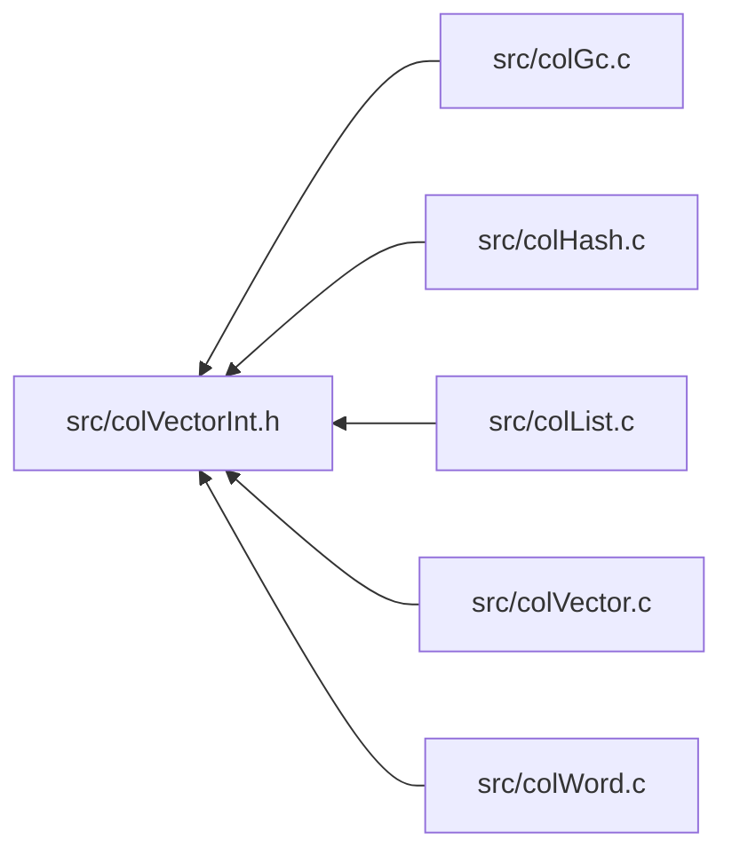

<a id="col_vector_int_8h"></a>
# File colVectorInt.h

![][C++]

**Location**: `src/colVectorInt.h`

This header file defines the vector word internals of Colibri.

Vectors are arrays of words that are directly accessible through a pointer value.


They come in both immutable and mutable forms.


**See also**: [colVector.c](col_vector_8c.md#col_vector_8c), [colVector.h](col_vector_8h.md#col_vector_8h)

## Included by

* [src/colGc.c](col_gc_8c.md#col_gc_8c)
* [src/colHash.c](col_hash_8c.md#col_hash_8c)
* [src/colList.c](col_list_8c.md#col_list_8c)
* [src/colVector.c](col_vector_8c.md#col_vector_8c)
* [src/colWord.c](col_word_8c.md#col_word_8c)



## Immutable Vector Constants

<a id="group__vector__words_1ga5843b1b6c9d86f00cda30183c29bd92a"></a>
### Macro VECTOR\_HEADER\_SIZE

![][public]

```cpp
#define VECTOR_HEADER_SIZE (sizeof(size_t)*2)
```

Byte size of vector header.


<a id="group__vector__words_1ga150df031108068f0c8b0a72231999cfa"></a>
### Macro VECTOR\_MAX\_SIZE

![][public]

```cpp
#define VECTOR_MAX_SIZE (SIZE_MAX-[CELL\_SIZE](col_conf_8h.md#group__alloc_1ga7a4127f14f16563da90eb3c836bc404f))
```

Maximum byte size taken by vectors.


## Immutable Vector Utilities

<a id="group__vector__words_1ga3859b99c15ff0bc766748dc0042ea026"></a>
### Macro VECTOR\_SIZE

![][public]

```cpp
#define VECTOR_SIZE     ([NB\_CELLS](col_internal_8h.md#group__pages__cells_1ga6969cfc3c9b2913a913df84f7842ce74)([VECTOR\_HEADER\_SIZE](col_vector_int_8h.md#group__vector__words_1ga5843b1b6c9d86f00cda30183c29bd92a)+(length)*sizeof([Col\_Word](col_word_8h.md#group__words_1gadb626f9e195212e4fdfba7df154ad043))))( length )
```

Get number of cells for a vector of a given length.

**Parameters**:

* **length**: Vector length.


**Returns**:

Number of cells taken by word.


<a id="group__vector__words_1ga2ccb6254308d96069f8187e7b55908d2"></a>
### Macro VECTOR\_MAX\_LENGTH

![][public]

```cpp
#define VECTOR_MAX_LENGTH     (((byteSize)-[VECTOR\_HEADER\_SIZE](col_vector_int_8h.md#group__vector__words_1ga5843b1b6c9d86f00cda30183c29bd92a))/sizeof([Col\_Word](col_word_8h.md#group__words_1gadb626f9e195212e4fdfba7df154ad043)))( byteSize )
```

Get maximum vector length for a given byte size.

**Parameters**:

* **byteSize**: Available size.


**Returns**:

Vector length fitting the given size.


## Immutable Vector Creation

<a id="group__vector__words_1gace3048c9e9c238e1405c64c19228212d"></a>
### Macro WORD\_VECTOR\_INIT

![][public]

```cpp
#define WORD_VECTOR_INIT     [WORD\_SET\_TYPEID](col_word_int_8h.md#group__predefined__words_1ga52822cf424704829e60b112fe03614b6)((word), [WORD\_TYPE\_VECTOR](col_word_int_8h.md#group__words_1gadf6c66e5c2f9fcdf213ae40d253c153f)); \
    [WORD\_VECTOR\_LENGTH](col_vector_int_8h.md#group__vector__words_1ga926467c6e28cbec0b62107c2d17bb06c)(word) = (length);( word ,length )
```

Immutable vector word initializer.

**Parameters**:

* **word**: Word to initialize.
* **length**: [WORD\_VECTOR\_LENGTH](col_vector_int_8h.md#group__vector__words_1ga926467c6e28cbec0b62107c2d17bb06c).


!> **Warning** \
Argument **word** is referenced several times by the macro. Make sure to avoid any side effect.


**See also**: [WORD\_TYPE\_VECTOR](col_word_int_8h.md#group__words_1gadf6c66e5c2f9fcdf213ae40d253c153f)


## Immutable Vector Accessors

<a id="group__vector__words_1ga926467c6e28cbec0b62107c2d17bb06c"></a>
### Macro WORD\_VECTOR\_LENGTH

![][public]

```cpp
#define WORD_VECTOR_LENGTH (((size_t *)(word))[1])( word )
```

Get/set size of element array.

Used by both mutable and immutable versions.


**Parameters**:

* **word**: Word to access.


?> Macro is L-Value and suitable for both read/write operations.


**See also**: [WORD\_VECTOR\_INIT](col_vector_int_8h.md#group__vector__words_1gace3048c9e9c238e1405c64c19228212d), [WORD\_MVECTOR\_INIT](col_vector_int_8h.md#group__mvector__words_1ga428c7e8ed7fc2dd4bb08a2327b424255)


<a id="group__vector__words_1ga3a15150382d791225479cfbcad0c0e33"></a>
### Macro WORD\_VECTOR\_ELEMENTS

![][public]

```cpp
#define WORD_VECTOR_ELEMENTS (([Col\_Word](col_word_8h.md#group__words_1gadb626f9e195212e4fdfba7df154ad043) *)(word)+2)( word )
```

Pointer to vector elements (array of words).

Used by both mutable and immutable versions.


**Parameters**:

* **word**: Word to access.


## Immutable Vector Exceptions

<a id="group__vector__words_1ga6c5b4dc68a4a0843121645728983cf04"></a>
### Macro TYPECHECK\_VECTOR

![][public]

```cpp
#define TYPECHECK_VECTOR( word )
```

Type checking macro for vectors.

**Parameters**:

* **word**: Checked word.


**Exceptions**:

* **[COL\_ERROR\_VECTOR](colibri_8h.md#group__error_1gga729084542ed9eae62009a84d3379ef35a887698395dc0643aa2b4c0863ff6d8d4)**: [[T]](colibri_8h.md#group__error_1gga6dab009a0b8c4b4fa080cb9ba1859e9ea603a58b9d5bb16fde0708eb0767e4904) **word**: Not a vector.


<a id="group__vector__words_1ga6fdb8e4ad1f9c7819c61753ae41be410"></a>
### Macro VALUECHECK\_VECTORLENGTH

![][public]

```cpp
#define VALUECHECK_VECTORLENGTH( length ,maxLength )
```

Value checking macro for vectors, ensures that length does not exceed the maximum value.

**Parameters**:

* **length**: Checked length.
* **maxLength**: Maximum allowed value.


**Exceptions**:

* **[COL\_ERROR\_VECTORLENGTH](colibri_8h.md#group__error_1gga729084542ed9eae62009a84d3379ef35af25a0023745659d92b3ebd65d7c43bf3)**: [[V]](colibri_8h.md#group__error_1gga6dab009a0b8c4b4fa080cb9ba1859e9ea65d5e7232c82ae6972ac56f386a32fc9) **length <= maxLength**: Vector too large.


## Mutable Vector Constants

<a id="group__mvector__words_1ga0833fb1bfe926c016c3e00ee41120baf"></a>
### Macro MVECTOR\_MAX\_SIZE

![][public]

```cpp
#define MVECTOR_MAX_SIZE (SIZE_MAX>>CHAR_BIT)
```

Maximum cell size taken by mutable vectors.


## Mutable Vector Creation

<a id="group__mvector__words_1ga428c7e8ed7fc2dd4bb08a2327b424255"></a>
### Macro WORD\_MVECTOR\_INIT

![][public]

```cpp
#define WORD_MVECTOR_INIT     [WORD\_SET\_TYPEID](col_word_int_8h.md#group__predefined__words_1ga52822cf424704829e60b112fe03614b6)((word), [WORD\_TYPE\_MVECTOR](col_word_int_8h.md#group__words_1ga22d76782e9dfd28846b6eeac3547280f)); \
    [WORD\_MVECTOR\_SET\_SIZE](col_vector_int_8h.md#group__mvector__words_1ga7d6edcf0df783c310c6c3c94962b6dea)((word), (size)); \
    [WORD\_VECTOR\_LENGTH](col_vector_int_8h.md#group__vector__words_1ga926467c6e28cbec0b62107c2d17bb06c)(word) = (length);( word ,size ,length )
```

Mutable vector word initializer.

**Parameters**:

* **word**: Word to initialize.
* **size**: [WORD\_MVECTOR\_SET\_SIZE](col_vector_int_8h.md#group__mvector__words_1ga7d6edcf0df783c310c6c3c94962b6dea).
* **length**: [WORD\_VECTOR\_LENGTH](col_vector_int_8h.md#group__vector__words_1ga926467c6e28cbec0b62107c2d17bb06c).


!> **Warning** \
Argument **word** is referenced several times by the macro. Make sure to avoid any side effect.


**See also**: [WORD\_TYPE\_MVECTOR](col_word_int_8h.md#group__words_1ga22d76782e9dfd28846b6eeac3547280f)


## Mutable Vector Accessors

<a id="group__mvector__words_1ga385524b2a928c4be5f2dacfb67b91461"></a>
### Macro MVECTOR\_SIZE\_MASK

![][public]

```cpp
#define MVECTOR_SIZE_MASK [MVECTOR\_MAX\_SIZE](col_vector_int_8h.md#group__mvector__words_1ga0833fb1bfe926c016c3e00ee41120baf)
```

Bitmask for cell size.


<a id="group__mvector__words_1gae997d6e38dc29b20339e997afd28f168"></a>
### Macro WORD\_MVECTOR\_SIZE

![][public]

```cpp
#define WORD_MVECTOR_SIZE ((((size_t *)(word))[0])&[MVECTOR\_SIZE\_MASK](col_vector_int_8h.md#group__mvector__words_1ga385524b2a928c4be5f2dacfb67b91461))( word )
```

Get the number of allocated cells.

**Parameters**:

* **word**: Word to access.


**See also**: [WORD\_MVECTOR\_SET\_SIZE](col_vector_int_8h.md#group__mvector__words_1ga7d6edcf0df783c310c6c3c94962b6dea)


<a id="group__mvector__words_1ga7d6edcf0df783c310c6c3c94962b6dea"></a>
### Macro WORD\_MVECTOR\_SET\_SIZE

![][public]

```cpp
#define WORD_MVECTOR_SET_SIZE ((((size_t *)(word))[0])&=~[MVECTOR\_SIZE\_MASK](col_vector_int_8h.md#group__mvector__words_1ga385524b2a928c4be5f2dacfb67b91461),(((size_t *)(word))[0])|=((size)&[MVECTOR\_SIZE\_MASK](col_vector_int_8h.md#group__mvector__words_1ga385524b2a928c4be5f2dacfb67b91461)))( word ,size )
```

Set the number of allocated cells.

**Parameters**:

* **word**: Word to access.
* **size**: Size of word in cells.


!> **Warning** \
Argument **word** is referenced several times by the macro. Make sure to avoid any side effect.


**See also**: [WORD\_MVECTOR\_SIZE](col_vector_int_8h.md#group__mvector__words_1gae997d6e38dc29b20339e997afd28f168), [WORD\_MVECTOR\_INIT](col_vector_int_8h.md#group__mvector__words_1ga428c7e8ed7fc2dd4bb08a2327b424255)


## Mutable Vector Exceptions

<a id="group__mvector__words_1ga4e6d3b341eea2ef09e38e4ea3aa1c51a"></a>
### Macro TYPECHECK\_MVECTOR

![][public]

```cpp
#define TYPECHECK_MVECTOR( word )
```

Type checking macro for mutable vectors.

**Parameters**:

* **word**: Checked word.


**Exceptions**:

* **[COL\_ERROR\_MVECTOR](colibri_8h.md#group__error_1gga729084542ed9eae62009a84d3379ef35ade4eb60e2eb216ed151689929db31d1c)**: [[T]](colibri_8h.md#group__error_1gga6dab009a0b8c4b4fa080cb9ba1859e9ea603a58b9d5bb16fde0708eb0767e4904) **word**: Not a mutable vector.


## Source

```cpp
/**
 * @file colVectorInt.h
 *
 * This header file defines the vector word internals of Colibri.
 *
 * Vectors are arrays of words that are directly accessible through a
 * pointer value.
 *
 * They come in both immutable and mutable forms.
 *
 * @see colVector.c
 * @see colVector.h
 *
 * @beginprivate @cond PRIVATE
 */

#ifndef _COLIBRI_VECTOR_INT
#define _COLIBRI_VECTOR_INT


/*
===========================================================================*//*!
\internal \addtogroup vector_words Immutable Vectors

@par Requirements
    - Vector words must know their length, i.e. the number of elements they
      contain.

    - Elements are stored within the word cells following the header.

    - Vector words use as much cells as needed to store their elements.

    @param Length       Size of element array.
    @param Elements     Array of element words.

@par Cell Layout
    On all architectures the cell layout is as follows:

    @dot
    digraph {
        node [fontname="Lucida Console,Courier" fontsize=14];
        vector_word [shape=none, label=<
            <table border="0" cellborder="1" cellspacing="0">
            <tr><td border="0"></td>
                <td sides="B" width="40" align="left">0</td><td sides="B" width="40" align="right">7</td>
                <td sides="B" width="120" align="left">8</td><td sides="B" width="120" align="right">n</td>
            </tr>
            <tr><td sides="R">0</td>
                <td href="@ref WORD_TYPEID" title="WORD_TYPEID" colspan="2">Type</td>
                <td colspan="2" bgcolor="grey75">Unused</td>
            </tr>
            <tr><td sides="R">1</td>
                <td href="@ref WORD_VECTOR_LENGTH" title="WORD_VECTOR_LENGTH" colspan="4">Length</td>
            </tr>
            <tr><td sides="R">.</td>
                <td href="@ref WORD_VECTOR_ELEMENTS" title="WORD_VECTOR_ELEMENTS" colspan="4" rowspan="4">Elements</td>
            </tr>
            <tr><td sides="R">.</td></tr>
            <tr><td sides="R">N</td></tr>
            </table>
        >]
    }
    @enddot

    @begindiagram
           0     7                                                       n
          +-------+-------------------------------------------------------+
        0 | Type  |                        Unused                         |
          +-------+-------------------------------------------------------+
        1 |                            Length                             |
          +---------------------------------------------------------------+
          .                                                               .
          .                           Elements                            .
        N |                                                               |
          +---------------------------------------------------------------+
    @enddiagram

@see WORD_TYPE_VECTOR
\{*//*==========================================================================
*/

/***************************************************************************//*!
 * \name Immutable Vector Constants
 ***************************************************************************\{*/

/** Byte size of vector header. */
#define VECTOR_HEADER_SIZE      (sizeof(size_t)*2)

/** Maximum byte size taken by vectors. */
#define VECTOR_MAX_SIZE         (SIZE_MAX-CELL_SIZE)

/* End of Immutable Vector Constants *//*!\}*/


/***************************************************************************//*!
 * \name Immutable Vector Utilities
 ***************************************************************************\{*/

/**
 * Get number of cells for a vector of a given length.
 *
 * @param length    Vector length.
 *
 * @return Number of cells taken by word.
 */
#define VECTOR_SIZE(length) \
    (NB_CELLS(VECTOR_HEADER_SIZE+(length)*sizeof(Col_Word)))

/**
 * Get maximum vector length for a given byte size.
 *
 * @param byteSize  Available size.
 *
 * @return Vector length fitting the given size.
 */
#define VECTOR_MAX_LENGTH(byteSize) \
    (((byteSize)-VECTOR_HEADER_SIZE)/sizeof(Col_Word))

/* End of Immutable Vector Utilities *//*!\}*/


/***************************************************************************//*!
 * \name Immutable Vector Creation
 ***************************************************************************\{*/

/**
 * Immutable vector word initializer.
 *
 * @param word      Word to initialize.
 * @param length    #WORD_VECTOR_LENGTH.
 *
 * @warning
 *      Argument **word** is referenced several times by the macro. Make sure to
 *      avoid any side effect.
 *
 * @see WORD_TYPE_VECTOR
 */
#define WORD_VECTOR_INIT(word, length) \
    WORD_SET_TYPEID((word), WORD_TYPE_VECTOR); \
    WORD_VECTOR_LENGTH(word) = (length);

/* End of Immutable Vector Creation *//*!\}*/


/***************************************************************************//*!
 * \name Immutable Vector Accessors
 ***************************************************************************\{*/

/**
 * Get/set size of element array.
 *
 * Used by both mutable and immutable versions.
 *
 * @param word  Word to access.
 *
 * @note
 *      Macro is L-Value and suitable for both read/write operations.
 *
 * @see WORD_VECTOR_INIT
 * @see WORD_MVECTOR_INIT
 */
#define WORD_VECTOR_LENGTH(word)        (((size_t *)(word))[1])

/**
 * Pointer to vector elements (array of words).
 *
 * Used by both mutable and immutable versions.
 *
 * @param word  Word to access.
 */
#define WORD_VECTOR_ELEMENTS(word)      ((Col_Word *)(word)+2)

/* End of Immutable Vector Accessors *//*!\}*/


/***************************************************************************//*!
 * \name Immutable Vector Exceptions
 ***************************************************************************\{*/

/**
 * Type checking macro for vectors.
 *
 * @param word  Checked word.
 *
 * @typecheck{COL_ERROR_VECTOR,word}
 * @hideinitializer
 */
#define TYPECHECK_VECTOR(word) \
    TYPECHECK((Col_WordType(word) & COL_VECTOR), COL_ERROR_VECTOR, (word))

/**
 * Value checking macro for vectors, ensures that length does not exceed
 * the maximum value.
 *
 * @param length        Checked length.
 * @param maxLength     Maximum allowed value.
 *
 * @valuecheck{COL_ERROR_VECTORLENGTH,length <= maxLength}
 * @hideinitializer
 */
#define VALUECHECK_VECTORLENGTH(length, maxLength) \
    VALUECHECK(((length) <= (maxLength)), COL_ERROR_VECTORLENGTH, (length), \
            (maxLength))

/* End of Immutable Vector Exceptions *//*!\}*/

/* End of Immutable Vectors *//*!\}*/


/*
===========================================================================*//*!
\internal \addtogroup mvector_words Mutable Vectors

@par Requirements
    - Mutable vector words use the same basic structure as immutable vector words
      so that they can be turned immutable in-place 
      ([frozen](@ref Col_MVectorFreeze)).

    - In addition to immutable vector fields, mutable vectors must know their
      maximum capacity. It is deduced from the word size in cells minus the
      header. So we just have to know the word cell size. When frozen, unused
      trailing cells are freed.

    @param Size         Number of allocated cells. This determines the maximum
                        length of the element array. Given the storage capacity,
                        the maximum size of a mutable vector is smaller than
                        that of immutable vectors (see Col_MaxMVectorLength()
                        vs. Col_MaxVectorLength()).
    @param Length       [Generic immutable vector length field](@ref WORD_VECTOR_LENGTH).
    @param Elements     [Generic immutable vector elements array](@ref WORD_VECTOR_ELEMENTS).

@par Cell Layout
    On all architectures the cell layout is as follows:

    @dot
    digraph {
        node [fontname="Lucida Console,Courier" fontsize=14];
        mvector_word [shape=none, label=<
            <table border="0" cellborder="1" cellspacing="0">
            <tr><td border="0"></td>
                <td sides="B" width="40" align="left">0</td><td sides="B" width="40" align="right">7</td>
                <td sides="B" width="120" align="left">8</td><td sides="B" width="120" align="right">n</td>
            </tr>
            <tr><td sides="R">0</td>
                <td href="@ref WORD_TYPEID" title="WORD_TYPEID" colspan="2">Type</td>
                <td href="@ref WORD_MVECTOR_SIZE" title="WORD_MVECTOR_SIZE" colspan="2">Size</td>
            </tr>
            <tr><td sides="R">1</td>
                <td href="@ref WORD_VECTOR_LENGTH" title="WORD_VECTOR_LENGTH" colspan="4">Length</td>
            </tr>
            <tr><td sides="R">.</td>
                <td href="@ref WORD_VECTOR_ELEMENTS" title="WORD_VECTOR_ELEMENTS" colspan="4" rowspan="4">Elements</td>
            </tr>
            <tr><td sides="R">.</td></tr>
            <tr><td sides="R">N</td></tr>
            </table>
        >]
    }
    @enddot

    @begindiagram
             0     7                                                       n
          +-------+-------------------------------------------------------+
        0 | Type  |                         Size                          |
          +-------+-------------------------------------------------------+
        1 |                            Length                             |
          +---------------------------------------------------------------+
          .                                                               .
          .                           Elements                            .
        N |                                                               |
          +---------------------------------------------------------------+
    @enddiagram

@see @ref vector_words
@see WORD_TYPE_MVECTOR
\{*//*==========================================================================
*/

/***************************************************************************//*!
 * \name Mutable Vector Constants
 ***************************************************************************\{*/

/** Maximum cell size taken by mutable vectors. */
#define MVECTOR_MAX_SIZE        (SIZE_MAX>>CHAR_BIT)

/* End of Mutable Vector Constants *//*!\}*/


/***************************************************************************//*!
 * \name Mutable Vector Creation
 ***************************************************************************\{*/

/**
 * Mutable vector word initializer.
 *
 * @param word      Word to initialize.
 * @param size      #WORD_MVECTOR_SET_SIZE.
 * @param length    #WORD_VECTOR_LENGTH.
 *
 * @warning
 *      Argument **word** is referenced several times by the macro. Make sure to
 *      avoid any side effect.
 *
 * @see WORD_TYPE_MVECTOR
 */
#define WORD_MVECTOR_INIT(word, size, length) \
    WORD_SET_TYPEID((word), WORD_TYPE_MVECTOR); \
    WORD_MVECTOR_SET_SIZE((word), (size)); \
    WORD_VECTOR_LENGTH(word) = (length);

/* End of Mutable Vector Creation *//*!\}*/


/***************************************************************************//*!
 * \name Mutable Vector Accessors
 ***************************************************************************\{*/

/** Bitmask for cell size */
#define MVECTOR_SIZE_MASK               MVECTOR_MAX_SIZE

/**
 * Get the number of allocated cells.
 *
 * @param word  Word to access.
 *
 * @see WORD_MVECTOR_SET_SIZE
 */
#ifdef COL_BIGENDIAN
#   define WORD_MVECTOR_SIZE(word)      ((((size_t *)(word))[0])&MVECTOR_SIZE_MASK)
#else
#   define WORD_MVECTOR_SIZE(word)      ((((size_t *)(word))[0]>>CHAR_BIT)&MVECTOR_SIZE_MASK)
#endif

/**
 * Set the number of allocated cells.
 *
 * @param word  Word to access.
 * @param size  Size of word in cells.
 *
 * @warning
 *      Argument **word** is referenced several times by the macro. Make sure to
 *      avoid any side effect.
 *
 * @see WORD_MVECTOR_SIZE
 * @see WORD_MVECTOR_INIT
 */
#ifdef COL_BIGENDIAN
#   define WORD_MVECTOR_SET_SIZE(word, size) ((((size_t *)(word))[0])&=~MVECTOR_SIZE_MASK,(((size_t *)(word))[0])|=((size)&MVECTOR_SIZE_MASK))
#else
#   define WORD_MVECTOR_SET_SIZE(word, size) ((((size_t *)(word))[0])&=~(MVECTOR_SIZE_MASK<<CHAR_BIT),(((size_t *)(word))[0])|=(((size)&MVECTOR_SIZE_MASK)<<CHAR_BIT))
#endif

/* End of Mutable Vector Accessors *//*!\}*/


/***************************************************************************//*!
 * \name Mutable Vector Exceptions
 ***************************************************************************\{*/

/**
 * Type checking macro for mutable vectors.
 *
 * @param word  Checked word.
 *
 * @typecheck{COL_ERROR_MVECTOR,word}
 * @hideinitializer
 */
#define TYPECHECK_MVECTOR(word) \
    TYPECHECK((Col_WordType(word) & COL_MVECTOR), COL_ERROR_MVECTOR, (word))

/* End of Mutable Vector Exceptions *//*!\}*/

/* End of Mutable Vectors *//*!\}*/

#endif /* _COLIBRI_VECTOR_INT */
/*! @endcond @endprivate */
```

[public]: https://img.shields.io/badge/-public-brightgreen (public)
[C++]: https://img.shields.io/badge/language-C%2B%2B-blue (C++)
[private]: https://img.shields.io/badge/-private-red (private)
[Markdown]: https://img.shields.io/badge/language-Markdown-blue (Markdown)
[static]: https://img.shields.io/badge/-static-lightgrey (static)