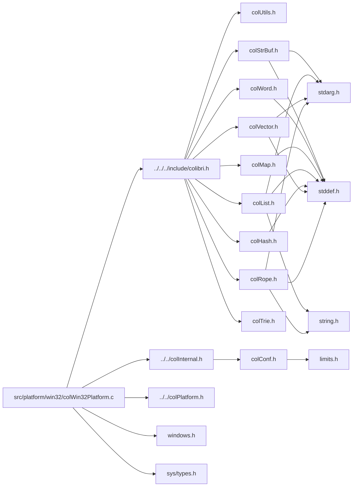

<a id="col_win32_platform_8c"></a>
# File colWin32Platform.c

![][C++]

**Location**: `src/platform/win32/colWin32Platform.c`

This file provides Win32 implementations of generic primitives needing platform-specific implementations, as well as Win32-specific primitives.

**See also**: [colPlatform.h](col_platform_8h.md#col_platform_8h), [colWin32Platform.h](col_win32_platform_8h.md#col_win32_platform_8h)

## Classes

* [Win32GroupData](struct_win32_group_data.md#struct_win32_group_data)

## Includes

* [../../../include/colibri.h](colibri_8h.md#colibri_8h)
* [../../colInternal.h](col_internal_8h.md#col_internal_8h)
* [../../colPlatform.h](col_platform_8h.md#col_platform_8h)
* <windows.h>
* <sys/types.h>



## Thread-Local Storage

<a id="group__arch__win32_1ga338377fedfe1571e9dd2118048a516c7"></a>
### Variable tlsToken

![][private]

**Definition**: `src/platform/win32/colWin32Platform.c` (line 71)

```cpp
DWORD tlsToken
```

Thread-local storage identifier.

Used to get thread-specific data.


**See also**: [ThreadData](struct_thread_data.md#struct_thread_data), [Init](col_win32_platform_8c.md#group__arch__win32_1ga02edfe3159fd71b280177c0879667da5)


**Type**: DWORD

**Referenced by**:

* [DllMain](col_win32_platform_8c.md#group__arch__win32_1gaf5d62d88a85b87925138f29103bb7ef6)
* [Init](col_win32_platform_8c.md#group__arch__win32_1ga02edfe3159fd71b280177c0879667da5)
* [PlatEnter](col_win32_platform_8c.md#group__arch__win32_1gaa42fe97b4b462c9483110a715c1eb1d1)
* [PlatLeave](col_win32_platform_8c.md#group__arch__win32_1ga445bf6b3cd4afc09367a6d9fce001a2e)

<a id="group__arch__win32_1ga570111ac8d66adb54a91ad52cf91ce28"></a>
### Variable sharedGroups

![][private]
![][static]

**Definition**: `src/platform/win32/colWin32Platform.c` (line 109)

```cpp
Win32GroupData* sharedGroups
```

List of active groups in process.

**See also**: [Win32GroupData](struct_win32_group_data.md#struct_win32_group_data), [AllocGroupData](col_win32_platform_8c.md#group__arch__win32_1ga1d941e385e9fad8e3eccbdb0c865cc25), [FreeGroupData](col_win32_platform_8c.md#group__arch__win32_1ga747d41ae9054ca8d8cb09c1ecc374ae0)


**Type**: [Win32GroupData](struct_win32_group_data.md#struct_win32_group_data) *

**Referenced by**:

* [Init](col_win32_platform_8c.md#group__arch__win32_1ga02edfe3159fd71b280177c0879667da5)
* [PlatEnter](col_win32_platform_8c.md#group__arch__win32_1gaa42fe97b4b462c9483110a715c1eb1d1)

<a id="group__arch__win32_1ga9d35bc9adb94355be53942f7d5d281e9"></a>
### Variable csSharedGroups

![][private]
![][static]

**Definition**: `src/platform/win32/colWin32Platform.c` (line 116)

```cpp
CRITICAL_SECTION csSharedGroups
```

Critical section protecting [sharedGroups](col_win32_platform_8c.md#group__arch__win32_1ga570111ac8d66adb54a91ad52cf91ce28).

**See also**: [sharedGroups](col_win32_platform_8c.md#group__arch__win32_1ga570111ac8d66adb54a91ad52cf91ce28)


**Type**: CRITICAL_SECTION

**Referenced by**:

* [Init](col_win32_platform_8c.md#group__arch__win32_1ga02edfe3159fd71b280177c0879667da5)
* [PlatEnter](col_win32_platform_8c.md#group__arch__win32_1gaa42fe97b4b462c9483110a715c1eb1d1)
* [PlatLeave](col_win32_platform_8c.md#group__arch__win32_1ga445bf6b3cd4afc09367a6d9fce001a2e)

<a id="group__arch__win32_1ga1d941e385e9fad8e3eccbdb0c865cc25"></a>
### Function AllocGroupData

![][private]
![][static]

```cpp
static Win32GroupData* AllocGroupData(unsigned int model)
```

Allocate and initialize a thread group data structure.

**Returns**:

The newly allocated structure.


**Side Effect**:

Memory allocated and system objects created.


**See also**: [Threading Model Constants](#group__init_1threading_models), [Win32GroupData](struct_win32_group_data.md#struct_win32_group_data), [FreeGroupData](col_win32_platform_8c.md#group__arch__win32_1ga747d41ae9054ca8d8cb09c1ecc374ae0)


**Parameters**:

* unsigned int **model**: Threading model.

**Return type**: [Win32GroupData](struct_win32_group_data.md#struct_win32_group_data) *

**References**:

* [COL\_SINGLE](colibri_8h.md#group__init_1gaaecbd3c0ddf9f5684b97db76e7338731)
* [Win32GroupData::data](struct_win32_group_data.md#struct_win32_group_data_1a11d7fb8755fb30bd47bbefd8098ec489)
* [GcInitGroup](col_gc_8c.md#group__gc_1ga4183a56fec06c1ff8176f90c31248d68)
* [GcThreadProc](col_win32_platform_8c.md#group__arch__win32_1ga5195d9f3490f89e1e761ab0bd6e369b0)
* [GroupData::model](struct_group_data.md#struct_group_data_1a02daeab5df802e492019f1f17d3efde2)

**Referenced by**:

* [PlatEnter](col_win32_platform_8c.md#group__arch__win32_1gaa42fe97b4b462c9483110a715c1eb1d1)

<a id="group__arch__win32_1ga747d41ae9054ca8d8cb09c1ecc374ae0"></a>
### Function FreeGroupData

![][private]
![][static]

```cpp
static void FreeGroupData(Win32GroupData *groupData)
```

Free a thread group data structure.

**Side Effect**:

Memory freed and system objects deleted.


**See also**: [Win32GroupData](struct_win32_group_data.md#struct_win32_group_data), [AllocGroupData](col_win32_platform_8c.md#group__arch__win32_1ga1d941e385e9fad8e3eccbdb0c865cc25)


**Parameters**:

* [Win32GroupData](struct_win32_group_data.md#struct_win32_group_data) * **groupData**: Structure to free.

**Return type**: void

**References**:

* [COL\_SINGLE](colibri_8h.md#group__init_1gaaecbd3c0ddf9f5684b97db76e7338731)
* [Win32GroupData::csGc](struct_win32_group_data.md#struct_win32_group_data_1af28904a028484c08cacab8c50e4705f8)
* [Win32GroupData::csRoots](struct_win32_group_data.md#struct_win32_group_data_1a6944a9302c4b18dfaa54a0a2d95e5f4d)
* [Win32GroupData::data](struct_win32_group_data.md#struct_win32_group_data_1a11d7fb8755fb30bd47bbefd8098ec489)
* [Win32GroupData::eventGcDone](struct_win32_group_data.md#struct_win32_group_data_1a98a56c55ed514fe43a741dcc71d06d72)
* [Win32GroupData::eventGcScheduled](struct_win32_group_data.md#struct_win32_group_data_1aad968230554371a9d6be7012ef4ef5e8)
* [GcCleanupGroup](col_gc_8c.md#group__gc_1ga8e6fd33d04cb870d9d4b64eb34ab2ebc)
* [GroupData::model](struct_group_data.md#struct_group_data_1a02daeab5df802e492019f1f17d3efde2)
* [Win32GroupData::terminated](struct_win32_group_data.md#struct_win32_group_data_1a04c084e20364f5cf14d9e0bebfeb11e3)
* [Win32GroupData::threadGc](struct_win32_group_data.md#struct_win32_group_data_1afd8eb1f08058dc558a6034d3357850dd)

**Referenced by**:

* [PlatLeave](col_win32_platform_8c.md#group__arch__win32_1ga445bf6b3cd4afc09367a6d9fce001a2e)

## Process & Threads

<a id="group__arch__win32_1gaa42fe97b4b462c9483110a715c1eb1d1"></a>
### Function PlatEnter

![][private]

```cpp
int PlatEnter(unsigned int model)
```

Enter the thread.

If this is the first nested call, initialize thread data. If this is the first thread in its group, initialize group data as well.


**Return values**:

* **<>0>**: if this is the first nested call.
* **0**: otherwise.


**See also**: [Threading Model Constants](#group__init_1threading_models), [ThreadData](struct_thread_data.md#struct_thread_data), [Win32GroupData](struct_win32_group_data.md#struct_win32_group_data), [PlatLeave](col_win32_platform_8c.md#group__arch__win32_1ga445bf6b3cd4afc09367a6d9fce001a2e), [Col\_Init](colibri_8h.md#group__init_1ga715049d7eb10ff0eeac38b457ef4fce1)


**Parameters**:

* unsigned int **model**: Threading model.

**Return type**: int

**References**:

* [AllocGroupData](col_win32_platform_8c.md#group__arch__win32_1ga1d941e385e9fad8e3eccbdb0c865cc25)
* [COL\_ASYNC](colibri_8h.md#group__init_1ga74df35d99d8e8408a563ae5a23022b06)
* [COL\_SINGLE](colibri_8h.md#group__init_1gaaecbd3c0ddf9f5684b97db76e7338731)
* [csSharedGroups](col_win32_platform_8c.md#group__arch__win32_1ga9d35bc9adb94355be53942f7d5d281e9)
* [Win32GroupData::data](struct_win32_group_data.md#struct_win32_group_data_1a11d7fb8755fb30bd47bbefd8098ec489)
* [GroupData::first](struct_group_data.md#struct_group_data_1af58eb628d2c2bb11f4bfa161c7e93318)
* [GcInitThread](col_gc_8c.md#group__gc_1gad46e288d322683c434e6efa30e3edc22)
* [Init](col_win32_platform_8c.md#group__arch__win32_1ga02edfe3159fd71b280177c0879667da5)
* [GroupData::model](struct_group_data.md#struct_group_data_1a02daeab5df802e492019f1f17d3efde2)
* [ThreadData::next](struct_thread_data.md#struct_thread_data_1aee56668363c15f17454a3bab5f63b4a4)
* [Win32GroupData::next](struct_win32_group_data.md#struct_win32_group_data_1a11ee4dca830fbf843b3f7acabf3e54be)
* [once](col_unix_platform_8c.md#group__arch__unix_1gad2c7a51be06d10615c8b5ab3d2f8d161)
* [PlatGetThreadData](col_unix_platform_8h.md#group__arch__unix_1ga6964b3c4d4787a9defb7aae57825d92c)
* [sharedGroups](col_win32_platform_8c.md#group__arch__win32_1ga570111ac8d66adb54a91ad52cf91ce28)
* [tlsToken](col_win32_platform_8c.md#group__arch__win32_1ga338377fedfe1571e9dd2118048a516c7)

**Referenced by**:

* [Col\_Init](colibri_8h.md#group__init_1ga715049d7eb10ff0eeac38b457ef4fce1)

<a id="group__arch__win32_1ga445bf6b3cd4afc09367a6d9fce001a2e"></a>
### Function PlatLeave

![][private]

```cpp
int PlatLeave()
```

Leave the thread.

If this is the first nested call, cleanup thread data. If this is the last thread in its group, cleanup group data as well.


**Return values**:

* **<>0**: if this is the last nested call.
* **0**: otherwise.


**See also**: [ThreadData](struct_thread_data.md#struct_thread_data), [Win32GroupData](struct_win32_group_data.md#struct_win32_group_data), [PlatEnter](col_win32_platform_8c.md#group__arch__win32_1gaa42fe97b4b462c9483110a715c1eb1d1), [Col\_Cleanup](colibri_8h.md#group__init_1gaaa7addef72eaac5fb58f6edb449fda75)


**Return type**: int

**References**:

* [COL\_ASYNC](colibri_8h.md#group__init_1ga74df35d99d8e8408a563ae5a23022b06)
* [COL\_SINGLE](colibri_8h.md#group__init_1gaaecbd3c0ddf9f5684b97db76e7338731)
* [csSharedGroups](col_win32_platform_8c.md#group__arch__win32_1ga9d35bc9adb94355be53942f7d5d281e9)
* [Win32GroupData::data](struct_win32_group_data.md#struct_win32_group_data_1a11d7fb8755fb30bd47bbefd8098ec489)
* [GroupData::first](struct_group_data.md#struct_group_data_1af58eb628d2c2bb11f4bfa161c7e93318)
* [FreeGroupData](col_win32_platform_8c.md#group__arch__win32_1ga747d41ae9054ca8d8cb09c1ecc374ae0)
* [GcCleanupThread](col_gc_8c.md#group__gc_1gacbea8d94b2fdf7366fbe4ad8b8298a91)
* [GroupData::model](struct_group_data.md#struct_group_data_1a02daeab5df802e492019f1f17d3efde2)
* [ThreadData::next](struct_thread_data.md#struct_thread_data_1aee56668363c15f17454a3bab5f63b4a4)
* [PlatGetThreadData](col_unix_platform_8h.md#group__arch__unix_1ga6964b3c4d4787a9defb7aae57825d92c)
* [tlsToken](col_win32_platform_8c.md#group__arch__win32_1ga338377fedfe1571e9dd2118048a516c7)

**Referenced by**:

* [Col\_Cleanup](colibri_8h.md#group__init_1gaaa7addef72eaac5fb58f6edb449fda75)

<a id="group__arch__win32_1ga5195d9f3490f89e1e761ab0bd6e369b0"></a>
### Function GcThreadProc

![][private]
![][static]

```cpp
static DWORD WINAPI GcThreadProc(LPVOID lpParameter)
```

Thread dedicated to the GC process.

Activated when one of the worker threads in the group triggers the GC.


**Returns**:

Always zero.


**Side Effect**:

Calls [PerformGC](col_gc_8c.md#group__gc_1ga5688ae9d7f658650ca8dfa66f4102f62).


**See also**: [AllocGroupData](col_win32_platform_8c.md#group__arch__win32_1ga1d941e385e9fad8e3eccbdb0c865cc25), [PerformGC](col_gc_8c.md#group__gc_1ga5688ae9d7f658650ca8dfa66f4102f62)


**Parameters**:

* LPVOID **lpParameter**: [Win32GroupData](struct_win32_group_data.md#struct_win32_group_data).

**Return type**: DWORD WINAPI

**References**:

* [Win32GroupData::csGc](struct_win32_group_data.md#struct_win32_group_data_1af28904a028484c08cacab8c50e4705f8)
* [Win32GroupData::eventGcDone](struct_win32_group_data.md#struct_win32_group_data_1a98a56c55ed514fe43a741dcc71d06d72)
* [Win32GroupData::eventGcScheduled](struct_win32_group_data.md#struct_win32_group_data_1aad968230554371a9d6be7012ef4ef5e8)
* [PerformGC](col_gc_8c.md#group__gc_1ga5688ae9d7f658650ca8dfa66f4102f62)
* [Win32GroupData::scheduled](struct_win32_group_data.md#struct_win32_group_data_1af4560732f756493b5fd37bff90926c76)
* [Win32GroupData::terminated](struct_win32_group_data.md#struct_win32_group_data_1a04c084e20364f5cf14d9e0bebfeb11e3)

**Referenced by**:

* [AllocGroupData](col_win32_platform_8c.md#group__arch__win32_1ga1d941e385e9fad8e3eccbdb0c865cc25)

<a id="group__arch__win32_1gaa19923dd2972ca8919b05b935cc5592f"></a>
### Function PlatSyncPauseGC

![][private]

```cpp
void PlatSyncPauseGC(GroupData *data)
```

Called when a worker thread calls the outermost [Col\_PauseGC()](colibri_8h.md#group__gc_1gae703ee3215a4724ebed8e5a2824e7a7b).

**Side Effect**:

May block as long as a GC is underway.


**See also**: [GcThreadProc](col_win32_platform_8c.md#group__arch__win32_1ga5195d9f3490f89e1e761ab0bd6e369b0), [SyncPauseGC](col_platform_8h.md#group__arch_1ga24722ffc116af10635061f365d59f877), [Col\_PauseGC](colibri_8h.md#group__gc_1gae703ee3215a4724ebed8e5a2824e7a7b)


**Parameters**:

* [GroupData](struct_group_data.md#struct_group_data) * **data**: Group-specific data.

**Return type**: void

**References**:

* [ASSERT](col_internal_8h.md#group__error_1gac22830a985e1daed0c9eadba8c6f606e)
* [COL\_SINGLE](colibri_8h.md#group__init_1gaaecbd3c0ddf9f5684b97db76e7338731)
* [Win32GroupData::csGc](struct_win32_group_data.md#struct_win32_group_data_1af28904a028484c08cacab8c50e4705f8)
* [Win32GroupData::data](struct_win32_group_data.md#struct_win32_group_data_1a11d7fb8755fb30bd47bbefd8098ec489)
* [Win32GroupData::eventGcDone](struct_win32_group_data.md#struct_win32_group_data_1a98a56c55ed514fe43a741dcc71d06d72)
* [GroupData::model](struct_group_data.md#struct_group_data_1a02daeab5df802e492019f1f17d3efde2)
* [Win32GroupData::nbActive](struct_win32_group_data.md#struct_win32_group_data_1a6d5f37daf4e64c6cf6586066b90fb987)

<a id="group__arch__win32_1ga52acd19d06324536559d9f142b832025"></a>
### Function PlatTrySyncPauseGC

![][private]

```cpp
int PlatTrySyncPauseGC(GroupData *data)
```

Called when a worker thread calls the outermost [Col\_TryPauseGC()](colibri_8h.md#group__gc_1ga54eefaa11ad5a79b8665fef5cc24c26f).

**Return values**:

* **<>0**: if successful.
* **0**: if call would block.


**See also**: [GcThreadProc](col_win32_platform_8c.md#group__arch__win32_1ga5195d9f3490f89e1e761ab0bd6e369b0), [TrySyncPauseGC](col_platform_8h.md#group__arch_1gaaab49fa9044c9543c52236f55c750ce7), [Col\_TryPauseGC](colibri_8h.md#group__gc_1ga54eefaa11ad5a79b8665fef5cc24c26f)


**Parameters**:

* [GroupData](struct_group_data.md#struct_group_data) * **data**: Group-specific data.

**Return type**: int

**References**:

* [ASSERT](col_internal_8h.md#group__error_1gac22830a985e1daed0c9eadba8c6f606e)
* [COL\_SINGLE](colibri_8h.md#group__init_1gaaecbd3c0ddf9f5684b97db76e7338731)
* [Win32GroupData::csGc](struct_win32_group_data.md#struct_win32_group_data_1af28904a028484c08cacab8c50e4705f8)
* [Win32GroupData::data](struct_win32_group_data.md#struct_win32_group_data_1a11d7fb8755fb30bd47bbefd8098ec489)
* [Win32GroupData::eventGcDone](struct_win32_group_data.md#struct_win32_group_data_1a98a56c55ed514fe43a741dcc71d06d72)
* [GroupData::model](struct_group_data.md#struct_group_data_1a02daeab5df802e492019f1f17d3efde2)
* [Win32GroupData::nbActive](struct_win32_group_data.md#struct_win32_group_data_1a6d5f37daf4e64c6cf6586066b90fb987)

<a id="group__arch__win32_1ga234974987c437283a255cad2e6847585"></a>
### Function PlatSyncResumeGC

![][private]

```cpp
void PlatSyncResumeGC(GroupData *data, int performGc)
```

Called when a worker thread calls the outermost [Col\_ResumeGC()](colibri_8h.md#group__gc_1gaf7d4f0dd1996dde366af3f29e9bcc517).

**Side Effect**:

If last thread in group, may trigger the GC in the dedicated thread if previously scheduled. This will block further calls to [Col\_PauseGC()](colibri_8h.md#group__gc_1gae703ee3215a4724ebed8e5a2824e7a7b) / [PlatSyncPauseGC()](col_win32_platform_8c.md#group__arch__win32_1gaa19923dd2972ca8919b05b935cc5592f).


**See also**: [GcThreadProc](col_win32_platform_8c.md#group__arch__win32_1ga5195d9f3490f89e1e761ab0bd6e369b0), [SyncResumeGC](col_platform_8h.md#group__arch_1gaeda9d3a189fb79d5dc53d2638ca42b35), [Col\_ResumeGC](colibri_8h.md#group__gc_1gaf7d4f0dd1996dde366af3f29e9bcc517)


**Parameters**:

* [GroupData](struct_group_data.md#struct_group_data) * **data**: Group-specific data.
* int **performGc**: Whether to perform GC.

**Return type**: void

**References**:

* [ASSERT](col_internal_8h.md#group__error_1gac22830a985e1daed0c9eadba8c6f606e)
* [COL\_SINGLE](colibri_8h.md#group__init_1gaaecbd3c0ddf9f5684b97db76e7338731)
* [Win32GroupData::csGc](struct_win32_group_data.md#struct_win32_group_data_1af28904a028484c08cacab8c50e4705f8)
* [Win32GroupData::data](struct_win32_group_data.md#struct_win32_group_data_1a11d7fb8755fb30bd47bbefd8098ec489)
* [Win32GroupData::eventGcDone](struct_win32_group_data.md#struct_win32_group_data_1a98a56c55ed514fe43a741dcc71d06d72)
* [Win32GroupData::eventGcScheduled](struct_win32_group_data.md#struct_win32_group_data_1aad968230554371a9d6be7012ef4ef5e8)
* [GroupData::model](struct_group_data.md#struct_group_data_1a02daeab5df802e492019f1f17d3efde2)
* [Win32GroupData::nbActive](struct_win32_group_data.md#struct_win32_group_data_1a6d5f37daf4e64c6cf6586066b90fb987)
* [Win32GroupData::scheduled](struct_win32_group_data.md#struct_win32_group_data_1af4560732f756493b5fd37bff90926c76)

<a id="group__arch__win32_1gaeb2b83a6cb4f1d38f1993fe221556bfa"></a>
### Function PlatEnterProtectRoots

![][private]

```cpp
void PlatEnterProtectRoots(GroupData *data)
```

Enter protected section around root management structures.

**Side Effect**:

Blocks until no thread owns the section.


**See also**: [PlatLeaveProtectRoots](col_win32_platform_8c.md#group__arch__win32_1gac35163168872326ce29c15c6df13d76a), [EnterProtectRoots](col_platform_8h.md#group__arch_1ga037203dea1294535ac25be8712d708d6)


**Parameters**:

* [GroupData](struct_group_data.md#struct_group_data) * **data**: Group-specific data.

**Return type**: void

**References**:

* [ASSERT](col_internal_8h.md#group__error_1gac22830a985e1daed0c9eadba8c6f606e)
* [COL\_SHARED](colibri_8h.md#group__init_1ga9df51b794beca985147399feb68a8734)
* [Win32GroupData::csRoots](struct_win32_group_data.md#struct_win32_group_data_1a6944a9302c4b18dfaa54a0a2d95e5f4d)
* [Win32GroupData::data](struct_win32_group_data.md#struct_win32_group_data_1a11d7fb8755fb30bd47bbefd8098ec489)
* [GroupData::model](struct_group_data.md#struct_group_data_1a02daeab5df802e492019f1f17d3efde2)

<a id="group__arch__win32_1gac35163168872326ce29c15c6df13d76a"></a>
### Function PlatLeaveProtectRoots

![][private]

```cpp
void PlatLeaveProtectRoots(GroupData *data)
```

Leave protected section around root management structures.

**Side Effect**:

May unblock any thread waiting for the section.


**See also**: [PlatEnterProtectRoots](col_win32_platform_8c.md#group__arch__win32_1gaeb2b83a6cb4f1d38f1993fe221556bfa), [LeaveProtectRoots](col_platform_8h.md#group__arch_1gaee9721bdb7cc0ecca4a8ee295eadd446)


**Parameters**:

* [GroupData](struct_group_data.md#struct_group_data) * **data**: Group-specific data.

**Return type**: void

**References**:

* [ASSERT](col_internal_8h.md#group__error_1gac22830a985e1daed0c9eadba8c6f606e)
* [COL\_SHARED](colibri_8h.md#group__init_1ga9df51b794beca985147399feb68a8734)
* [Win32GroupData::csRoots](struct_win32_group_data.md#struct_win32_group_data_1a6944a9302c4b18dfaa54a0a2d95e5f4d)
* [Win32GroupData::data](struct_win32_group_data.md#struct_win32_group_data_1a11d7fb8755fb30bd47bbefd8098ec489)
* [GroupData::model](struct_group_data.md#struct_group_data_1a02daeab5df802e492019f1f17d3efde2)

## System Page Allocation

<a id="group__arch__win32_1ga0eb5da2173ff4a438406f18ebc929ad8"></a>
### Variable csRange

![][private]

**Definition**: `src/platform/win32/colWin32Platform.c` (line 584)

```cpp
CRITICAL_SECTION csRange
```

Critical section protecting address range management.

* [ranges](col_alloc_8c.md#group__alloc_1ga9ac4c516a0888195d1f2ca4721f633f8): Reserved address ranges for general purpose.

* [dedicatedRanges](col_alloc_8c.md#group__alloc_1ga09e3f1c0494d23d9f93481ed4f228a4c): Dedicated address ranges for large pages.


**See also**: [PlatEnterProtectAddressRanges](col_win32_platform_8h.md#group__arch__win32_1ga0d52de05fb3a0897f54579ab12519159), [PlatLeaveProtectAddressRanges](col_win32_platform_8h.md#group__arch__win32_1gab6be4d622dd8c6bc4c283a1039962e5a)


**Type**: CRITICAL_SECTION

**Referenced by**:

* [Init](col_win32_platform_8c.md#group__arch__win32_1ga02edfe3159fd71b280177c0879667da5)

<a id="group__arch__win32_1ga7d63e9c0de11a4c0954aab0efbc09c09"></a>
### Function PlatReserveRange

![][private]

```cpp
void* PlatReserveRange(size_t size, int alloc)
```

Reserve an address range.

**Returns**:

The reserved range's base address, or NULL if failure.


**Parameters**:

* size_t **size**: Number of pages to reserve.
* int **alloc**: Whether to allocate the range pages as well.

**Return type**: void *

**References**:

* [shiftPage](col_alloc_8c.md#group__arch_1gacfb643d4c365f92c1ea93d0f1b1b71e5)

**Referenced by**:

* [SysPageAlloc](col_alloc_8c.md#group__alloc_1ga9318fd94abe19ee6d962cacb9d08830f)

<a id="group__arch__win32_1ga7ca830366dd1fb4e114a2f912ef5ed6c"></a>
### Function PlatReleaseRange

![][private]

```cpp
int PlatReleaseRange(void *base, size_t size)
```

Release an address range.

**Return values**:

* **<>0**: for success.
* **0**: for failure.


**Parameters**:

* void * **base**: Base address of range to release.
* size_t **size**: Number of pages in range.

**Return type**: int

**Referenced by**:

* [SysPageFree](col_alloc_8c.md#group__alloc_1gae87fa6ec29c10f180f511dfd1213fe5f)

<a id="group__arch__win32_1gab258be1bc40313f7c0a4c8bcab840243"></a>
### Function PlatAllocPages

![][private]

```cpp
int PlatAllocPages(void *addr, size_t number)
```

Allocate pages in reserved range.

**Return values**:

* **<>0**: for success.
* **0**: for failure.


**Parameters**:

* void * **addr**: Address of first page to allocate.
* size_t **number**: Number of pages to allocate.

**Return type**: int

**References**:

* [shiftPage](col_alloc_8c.md#group__arch_1gacfb643d4c365f92c1ea93d0f1b1b71e5)

**Referenced by**:

* [SysPageAlloc](col_alloc_8c.md#group__alloc_1ga9318fd94abe19ee6d962cacb9d08830f)

<a id="group__arch__win32_1ga3af1cd9d798457114f4bf563c10f9875"></a>
### Function PlatFreePages

![][private]

```cpp
int PlatFreePages(void *addr, size_t number)
```

Free pages in reserved range.

**Return values**:

* **<>0**: for success.
* **0**: for failure.


**Parameters**:

* void * **addr**: Address of first page to free.
* size_t **number**: Number of pages to free.

**Return type**: int

**References**:

* [shiftPage](col_alloc_8c.md#group__arch_1gacfb643d4c365f92c1ea93d0f1b1b71e5)

**Referenced by**:

* [SysPageFree](col_alloc_8c.md#group__alloc_1gae87fa6ec29c10f180f511dfd1213fe5f)
* [SysPageTrim](col_alloc_8c.md#group__alloc_1ga16a9361484b90e5202862b29a03cb958)

<a id="group__arch__win32_1gaafe939448070a0b389fc64dcd009ac9e"></a>
### Function PlatProtectPages

![][private]

```cpp
int PlatProtectPages(void *addr, size_t number, int protect)
```

Protect/unprotect pages in reserved range.

**Return values**:

* **<>0**: for success.
* **0**: for failure.


**Parameters**:

* void * **addr**: Address of first page to protect/unprotect
* size_t **number**: Number of pages to protect/unprotect.
* int **protect**: Whether to protect or unprotect pages.

**Return type**: int

**References**:

* [shiftPage](col_alloc_8c.md#group__arch_1gacfb643d4c365f92c1ea93d0f1b1b71e5)

**Referenced by**:

* [SysPageProtect](col_alloc_8c.md#group__alloc_1ga35a37fb9d22a879405b65f3e90d09358)

<a id="group__arch__win32_1ga1a9939ca3576553f6bd29f80af62c862"></a>
### Function PageProtectVectoredHandler

![][private]
![][static]

```cpp
static LONG CALLBACK PageProtectVectoredHandler(PEXCEPTION_POINTERS exceptionInfo)
```

Called upon exception.

**Return values**:

* **EXCEPTION_CONTINUE_SEARCH**: for unhandled exceptions, will pass exception to other handlers.
* **EXCEPTION_CONTINUE_EXECUTION**: for handled exceptions, will resume execution of calling code.


**See also**: [SysPageProtect](col_alloc_8c.md#group__alloc_1ga35a37fb9d22a879405b65f3e90d09358)


**Parameters**:

* PEXCEPTION_POINTERS **exceptionInfo**: Info about caught exception.

**Return type**: LONG CALLBACK

**References**:

* [SysPageProtect](col_alloc_8c.md#group__alloc_1ga35a37fb9d22a879405b65f3e90d09358)

**Referenced by**:

* [Init](col_win32_platform_8c.md#group__arch__win32_1ga02edfe3159fd71b280177c0879667da5)

## Initialization/Cleanup

<a id="group__arch__win32_1gaf5d62d88a85b87925138f29103bb7ef6"></a>
### Function DllMain

![][private]

```cpp
BOOL APIENTRY DllMain(HMODULE hModule, DWORD dwReason, LPVOID lpReserved)
```

Windows DLL entry point.

**Returns**:

Always true.


**See also**: [Init](col_win32_platform_8c.md#group__arch__win32_1ga02edfe3159fd71b280177c0879667da5)


**Parameters**:

* HMODULE **hModule**: A handle to the DLL module.
* DWORD **dwReason**: The reason code that indicates why the DLL entry-point function is being called.
* LPVOID **lpReserved**: Unused.

**Return type**: BOOL APIENTRY

**References**:

* [Init](col_win32_platform_8c.md#group__arch__win32_1ga02edfe3159fd71b280177c0879667da5)
* [tlsToken](col_win32_platform_8c.md#group__arch__win32_1ga338377fedfe1571e9dd2118048a516c7)

<a id="group__arch__win32_1ga02edfe3159fd71b280177c0879667da5"></a>
### Function Init

![][private]
![][static]

```cpp
static BOOL Init()
```

Initialization routine.

Called through [DllMain()](col_win32_platform_8c.md#group__arch__win32_1gaf5d62d88a85b87925138f29103bb7ef6).


**Returns**:

Always true.


**Side Effect**:


* Create thread-local storage key [tlsToken](col_win32_platform_8c.md#group__arch__win32_1ga338377fedfe1571e9dd2118048a516c7) (freed upon DLL_PROCESS_DETACH in [DllMain](col_win32_platform_8c.md#group__arch__win32_1gaf5d62d88a85b87925138f29103bb7ef6)).

* Install memory protection exception handler [PageProtectVectoredHandler()](col_win32_platform_8c.md#group__arch__win32_1ga1a9939ca3576553f6bd29f80af62c862)for parent tracking.


**See also**: [DllMain](col_win32_platform_8c.md#group__arch__win32_1gaf5d62d88a85b87925138f29103bb7ef6), [systemPageSize](col_alloc_8c.md#group__arch_1gacfca316efccddeee528c309c490c3f90), [allocGranularity](col_alloc_8c.md#group__arch_1ga9fdf03be3e1742b0fbc71f3445d83c48), [shiftPage](col_alloc_8c.md#group__arch_1gacfb643d4c365f92c1ea93d0f1b1b71e5)


**Return type**: BOOL

**References**:

* [allocGranularity](col_alloc_8c.md#group__arch_1ga9fdf03be3e1742b0fbc71f3445d83c48)
* [csRange](col_win32_platform_8c.md#group__arch__win32_1ga0eb5da2173ff4a438406f18ebc929ad8)
* [csSharedGroups](col_win32_platform_8c.md#group__arch__win32_1ga9d35bc9adb94355be53942f7d5d281e9)
* [PageProtectVectoredHandler](col_win32_platform_8c.md#group__arch__win32_1ga1a9939ca3576553f6bd29f80af62c862)
* [sharedGroups](col_win32_platform_8c.md#group__arch__win32_1ga570111ac8d66adb54a91ad52cf91ce28)
* [shiftPage](col_alloc_8c.md#group__arch_1gacfb643d4c365f92c1ea93d0f1b1b71e5)
* [systemPageSize](col_alloc_8c.md#group__arch_1gacfca316efccddeee528c309c490c3f90)
* [tlsToken](col_win32_platform_8c.md#group__arch__win32_1ga338377fedfe1571e9dd2118048a516c7)

**Referenced by**:

* [DllMain](col_win32_platform_8c.md#group__arch__win32_1gaf5d62d88a85b87925138f29103bb7ef6)
* [PlatEnter](col_win32_platform_8c.md#group__arch__win32_1gaa42fe97b4b462c9483110a715c1eb1d1)

## Source

```cpp
/**
 * @file colWin32Platform.c
 *
 * This file provides Win32 implementations of generic primitives needing
 * platform-specific implementations, as well as Win32-specific primitives.
 *
 * @see colPlatform.h
 * @see colWin32Platform.h
 *
 * @beginprivate @cond PRIVATE
 */

#include "../../../include/colibri.h"
#include "../../colInternal.h"
#include "../../colPlatform.h"

#include <windows.h>
#include <sys/types.h>

/*
 * Prototypes for functions used only in this file.
 */

/*! \cond IGNORE */
static struct Win32GroupData * AllocGroupData(unsigned int model);
static void             FreeGroupData(struct Win32GroupData *groupData);
#ifdef COL_USE_THREADS
static DWORD WINAPI     GcThreadProc(LPVOID lpParameter);
#endif /* COL_USE_THREADS */
static BOOL             Init(void);
/*! \endcond *//* IGNORE */


/*
===========================================================================*//*!
\internal \weakgroup arch_win32 System and Architecture (Win32-specific)
\{*//*==========================================================================
*/

/** @beginprivate @cond PRIVATE */

/*
 * Bit twiddling hack for computing the log2 of a power of 2.
 * See: http://www-graphics.stanford.edu/~seander/bithacks.html#IntegerLogDeBruijn
 */

/*! \cond IGNORE */
static const int MultiplyDeBruijnBitPosition2[32] =
{
  0, 1, 28, 2, 29, 14, 24, 3, 30, 22, 20, 15, 25, 17, 4, 8,
  31, 27, 13, 23, 21, 19, 16, 7, 26, 12, 18, 6, 11, 5, 10, 9
};
#define LOG2(v) MultiplyDeBruijnBitPosition2[(uint32_t)(v * 0x077CB531U) >> 27]
/*! \endcond *//* IGNORE */

/** @endcond @endprivate */


/***************************************************************************//*!
 * \name Thread-Local Storage
 ***************************************************************************\{*/

/** @beginprivate @cond PRIVATE */

/**
 * Thread-local storage identifier. Used to get thread-specific data.
 *
 * @see ThreadData
 * @see Init
 */
DWORD tlsToken;

/**
 * Platform-specific group data.
 *
 * @see ThreadData
 * @see GroupData
 * @see Init
 * @see AllocGroupData
 * @see FreeGroupData
 */
typedef struct Win32GroupData {
    GroupData data;             /*!< Generic #GroupData structure. */
#ifdef COL_USE_THREADS
    struct Win32GroupData *next;/*!< Next active group in list. */
    CRITICAL_SECTION csRoots;   /*!< Critical section protecting root
                                     management. */

    CRITICAL_SECTION csGc;      /*!< Critical section protecting GC from worker
                                     threads. */
    HANDLE eventGcScheduled;    /*!< Triggers GC thread. */
    HANDLE eventGcDone;         /*!< Barrier for worker threads. */
    int scheduled;              /*!< Flag for when a GC is scheduled. */
    int terminated;             /*!< Flag for thread group destruction. */
    int nbActive;               /*!< Active worker thread counter. */
    HANDLE threadGc;            /*!< GC thread. */
#endif /* COL_USE_THREADS */
} Win32GroupData;

#ifdef COL_USE_THREADS

/**
 * List of active groups in process.
 *
 * @see Win32GroupData
 * @see AllocGroupData
 * @see FreeGroupData
 */
static Win32GroupData *sharedGroups;

/**
 * Critical section protecting #sharedGroups.
 *
 * @see sharedGroups
 */
static CRITICAL_SECTION csSharedGroups;

#endif /* COL_USE_THREADS */

/**
 * Allocate and initialize a thread group data structure.
 *
 * @return The newly allocated structure.
 *
 * @sideeffect
 *      Memory allocated and system objects created.
 *
 * @see @ref threading_models "Threading Model Constants"
 * @see Win32GroupData
 * @see FreeGroupData
 */
static Win32GroupData *
AllocGroupData(
    unsigned int model)     /*!< Threading model. */
{
    Win32GroupData *groupData = (Win32GroupData *) malloc(sizeof(Win32GroupData));
    memset(groupData, 0, sizeof(Win32GroupData));
    groupData->data.model = model;
    GcInitGroup((GroupData *) groupData);

#ifdef COL_USE_THREADS
    if (model != COL_SINGLE) {
        /*
         * Create synchronization objects.
         */

        //TODO error handling.
        InitializeCriticalSection(&groupData->csRoots);

        InitializeCriticalSection(&groupData->csGc);
        groupData->eventGcDone = CreateEvent(NULL, TRUE, TRUE, NULL);
        groupData->eventGcScheduled = CreateEvent(NULL, FALSE, FALSE, NULL);

        /*
         * Create GC thread.
         */

        groupData->threadGc = CreateThread(NULL, 0, GcThreadProc, groupData,
                0, NULL);
    }
#endif /* COL_USE_THREADS */

    return groupData;
}

/**
 * Free a thread group data structure.
 *
 * @sideeffect
 *      Memory freed and system objects deleted.
 *
 * @see Win32GroupData
 * @see AllocGroupData
 */
static void
FreeGroupData(
    Win32GroupData *groupData)  /*!< Structure to free. */
{
#ifdef COL_USE_THREADS
    if (groupData->data.model != COL_SINGLE) {
        /*
         * Signal and wait for termination of GC thread.
         */

        //TODO error handling.
        groupData->terminated = 1;
        SignalObjectAndWait(groupData->eventGcScheduled, groupData->threadGc,
            INFINITE, FALSE);

        /*
         * Destroy synchronization objects.
         */

        CloseHandle(groupData->eventGcScheduled);
        CloseHandle(groupData->eventGcDone);
        DeleteCriticalSection(&groupData->csGc);

        DeleteCriticalSection(&groupData->csRoots);
    }
#endif /* COL_USE_THREADS */

    GcCleanupGroup((GroupData *) groupData);
    free(groupData);
}

/** @endcond @endprivate */

/* End of Thread-Local Storage *//*!\}*/


/***************************************************************************//*!
 * \name Process & Threads
 ***************************************************************************\{*/

/** @beginprivate @cond PRIVATE */

#ifdef COL_STATIC_BUILD
/**
 * Ensure that per-process initialization only occurs once.
 *
 * @see PlatEnter
 * @see Init
 */
static LONG once = 0;
#endif /* COL_STATIC_BUILD */

/**
 * Enter the thread. If this is the first nested call, initialize thread data.
 * If this is the first thread in its group, initialize group data as well.
 *
 * @retval <>0> if this is the first nested call.
 * @retval 0    otherwise.
 *
 * @see @ref threading_models "Threading Model Constants"
 * @see ThreadData
 * @see Win32GroupData
 * @see PlatLeave
 * @see Col_Init
 */
int
PlatEnter(
    unsigned int model) /*!< Threading model. */
{
    ThreadData *data;
    
#ifdef COL_STATIC_BUILD
    /*
     * Ensures that the TLS key is created once.
     */

    if (InterlockedCompareExchange(&once, 1, 0) == 0) Init();
#endif /* COL_STATIC_BUILD */

    data = PlatGetThreadData();
    if (data) {
        /*
         * Increment nest count.
         */

        return ((++data->nestCount) == 1);
    }

    /*
     * Initialize thread data.
     */

    data = (ThreadData *) malloc(sizeof(ThreadData));
    memset(data, 0, sizeof(*data));
    data->nestCount = 1;
    GcInitThread(data);
    TlsSetValue(tlsToken, data);

#ifdef COL_USE_THREADS
    if (model == COL_SINGLE || model == COL_ASYNC) {
#endif /* COL_USE_THREADS */
        /*
         * Allocate dedicated group.
         */

        data->groupData = (GroupData *) AllocGroupData(model);
        data->groupData->first = data;
        data->next = data;
#ifdef COL_USE_THREADS
    } else {
        /*
         * Try to find shared group with same model value.
         */

        EnterCriticalSection(&csSharedGroups);
        {
            Win32GroupData *groupData = sharedGroups;
            while (groupData && groupData->data.model != model) {
                groupData = groupData->next;
            }
            if (!groupData) {
                /*
                 * Allocate new group and insert at head.
                 */

                groupData = AllocGroupData(model);
                groupData->next = sharedGroups;
                sharedGroups = groupData;
            }

            /*
             * Add thread to group.
             */

            data->groupData = (GroupData *) groupData;
            if (data->groupData->first) {
                data->next = data->groupData->first->next;
                data->groupData->first->next = data;
            } else {
                data->groupData->first = data;
                data->next = data;
            }
        }
        LeaveCriticalSection(&csSharedGroups);
    }
#endif /* COL_USE_THREADS */

    return 1;
}

/**
 * Leave the thread. If this is the first nested call, cleanup thread data.
 * If this is the last thread in its group, cleanup group data as well.
 *
 * @retval <>0  if this is the last nested call.
 * @retval 0    otherwise.
 *
 * @see ThreadData
 * @see Win32GroupData
 * @see PlatEnter
 * @see Col_Cleanup
 */
int
PlatLeave()
{
    ThreadData *data = PlatGetThreadData();
    if (!data) {
        /* TODO: exception ? */
        return 0;
    }

    /*
     * Decrement nest count.
     */

    if (--data->nestCount) {
        return 0;
    }

    /*
     * This is the last nested call, free structures.
     */

#ifdef COL_USE_THREADS
    if (data->groupData->model == COL_SINGLE || data->groupData->model
            == COL_ASYNC) {
#endif /* COL_USE_THREADS */
        /*
         * Free dedicated group as well.
         */

        FreeGroupData((Win32GroupData *) data->groupData);
#ifdef COL_USE_THREADS
    } else {
        /*
         * Remove from shared group.
         */

        EnterCriticalSection(&csSharedGroups);
        {
            if (data->next == data) {
                /*
                 * Free group as well.
                 */

                FreeGroupData((Win32GroupData *) data->groupData);
            } else {
                /*
                 * Unlink.
                 */

                ThreadData *prev = data->next;
                while (prev->next != data) {
                    prev = prev->next;
                }
                prev->next = data->next;
                data->groupData->first = prev;
            }
        }
        LeaveCriticalSection(&csSharedGroups);
    }
#endif /* COL_USE_THREADS */

    GcCleanupThread(data);
    free(data);
    TlsSetValue(tlsToken, 0);

    return 1;
}

#ifdef COL_USE_THREADS

/**
 * Thread dedicated to the GC process. Activated when one of the worker threads
 * in the group triggers the GC.
 *
 * @return Always zero.
 *
 * @sideeffect
 *      Calls #PerformGC.
 *
 * @see AllocGroupData
 * @see PerformGC
 */
static DWORD WINAPI
GcThreadProc(
    LPVOID lpParameter) /*!< #Win32GroupData. */
{
    Win32GroupData *groupData = (Win32GroupData *) lpParameter;
    for (;;) {
        WaitForSingleObject(groupData->eventGcScheduled, INFINITE);
        EnterCriticalSection(&groupData->csGc);
        {
            if (groupData->scheduled) {
                groupData->scheduled = 0;
                PerformGC((GroupData *) groupData);
            }
            SetEvent(groupData->eventGcDone);
        }
        LeaveCriticalSection(&groupData->csGc);
        if (groupData->terminated) {
            ExitThread(0);
        }
    }
}

/**
 * Called when a worker thread calls the outermost Col_PauseGC().
 *
 * @sideeffect
 *      May block as long as a GC is underway.
 *
 * @see GcThreadProc
 * @see SyncPauseGC
 * @see Col_PauseGC
 */
void
PlatSyncPauseGC(
    GroupData *data)    /*!< Group-specific data. */
{
    Win32GroupData *groupData = (Win32GroupData *) data;
    ASSERT(groupData->data.model != COL_SINGLE);
    WaitForSingleObject(groupData->eventGcDone, INFINITE);
    EnterCriticalSection(&groupData->csGc);
    {
        groupData->nbActive++;
    }
    LeaveCriticalSection(&groupData->csGc);
}

/**
 * Called when a worker thread calls the outermost Col_TryPauseGC().
 *
 * @retval <>0  if successful.
 * @retval 0    if call would block.
 *
 * @see GcThreadProc
 * @see TrySyncPauseGC
 * @see Col_TryPauseGC
 */
int
PlatTrySyncPauseGC(
    GroupData *data)    /*!< Group-specific data. */
{
    Win32GroupData *groupData = (Win32GroupData *) data;
    ASSERT(groupData->data.model != COL_SINGLE);
    if (WaitForSingleObject(groupData->eventGcDone, 0)
            != WAIT_OBJECT_0) {
        return 0;
    }
    EnterCriticalSection(&groupData->csGc);
    {
        groupData->nbActive++;
    }
    LeaveCriticalSection(&groupData->csGc);
    return 1;
}

/**
 * Called when a worker thread calls the outermost Col_ResumeGC().
 *
 * @sideeffect
 *      If last thread in group, may trigger the GC in the dedicated thread if
 *      previously scheduled. This will block further calls to
 *      Col_PauseGC() / PlatSyncPauseGC().
 *
 * @see GcThreadProc
 * @see SyncResumeGC
 * @see Col_ResumeGC
 */
void
PlatSyncResumeGC(
    GroupData *data,    /*!< Group-specific data. */
    int performGc)      /*!< Whether to perform GC. */
{
    Win32GroupData *groupData = (Win32GroupData *) data;
    ASSERT(groupData->data.model != COL_SINGLE);
    EnterCriticalSection(&groupData->csGc);
    {
        if (performGc && !groupData->scheduled) {
            ResetEvent(groupData->eventGcDone);
            groupData->scheduled = 1;
        }
        --groupData->nbActive;
        if (!groupData->nbActive && groupData->scheduled) {
            SetEvent(groupData->eventGcScheduled);
        }
    }
    LeaveCriticalSection(&groupData->csGc);
}

/**
 * Enter protected section around root management structures.
 *
 * @sideeffect
 *      Blocks until no thread owns the section.
 *
 * @see PlatLeaveProtectRoots
 * @see EnterProtectRoots
 */
void
PlatEnterProtectRoots(
    GroupData *data)    /*!< Group-specific data. */
{
    Win32GroupData *groupData = (Win32GroupData *) data;
    ASSERT(groupData->data.model >= COL_SHARED);
    EnterCriticalSection(&groupData->csRoots);
}

/**
 * Leave protected section around root management structures.
 *
 * @sideeffect
 *      May unblock any thread waiting for the section.
 *
 * @see PlatEnterProtectRoots
 * @see LeaveProtectRoots
 */
void
PlatLeaveProtectRoots(
    GroupData *data)    /*!< Group-specific data. */
{
    Win32GroupData *groupData = (Win32GroupData *) data;
    ASSERT(groupData->data.model >= COL_SHARED);
    LeaveCriticalSection(&groupData->csRoots);
}

#endif /* COL_USE_THREADS */

/** @endcond @endprivate */

/* End of Process & Threads *//*!\}*/


/***************************************************************************//*!
 * \name System Page Allocation
 ***************************************************************************\{*/

/** @beginprivate @cond PRIVATE */

/**
 * Critical section protecting address range management.
 *
 * - #ranges:          Reserved address ranges for general purpose.
 * - #dedicatedRanges: Dedicated address ranges for large pages.
 *
 * @see PlatEnterProtectAddressRanges
 * @see PlatLeaveProtectAddressRanges
 */
CRITICAL_SECTION csRange;

/**
 * Reserve an address range.
 *
 * @return The reserved range's base address, or NULL if failure.
 */
void *
PlatReserveRange(
    size_t size,    /*!< Number of pages to reserve. */
    int alloc)      /*!< Whether to allocate the range pages as well. */
{
    return VirtualAlloc(NULL, size << shiftPage,
        MEM_RESERVE | (alloc ? MEM_COMMIT : 0), PAGE_READWRITE);
}

/**
 * Release an address range.
 *
 * @retval <>0  for success.
 * @retval 0    for failure.
 */
int
PlatReleaseRange(
    void *base,     /*!< Base address of range to release. */
    size_t size)    /*!< Number of pages in range. */
{
    return VirtualFree(base, 0, MEM_RELEASE);
}

/**
 * Allocate pages in reserved range.
 *
 * @retval <>0  for success.
 * @retval 0    for failure.
 */
int
PlatAllocPages(
    void *addr,     /*!< Address of first page to allocate. */
    size_t number)  /*!< Number of pages to allocate. */
{
    return !!VirtualAlloc(addr, number << shiftPage, MEM_COMMIT,
            PAGE_READWRITE);
}

/**
 * Free pages in reserved range.
 *
 * @retval <>0  for success.
 * @retval 0    for failure.
 */
int
PlatFreePages(
    void *addr,     /*!< Address of first page to free. */
    size_t number)  /*!< Number of pages to free. */
{
    return VirtualFree(addr, number << shiftPage, MEM_DECOMMIT);
}

/**
 * Protect/unprotect pages in reserved range.
 *
 * @retval <>0  for success.
 * @retval 0    for failure.
 */
int
PlatProtectPages(
    void *addr,     /*!< Address of first page to protect/unprotect */
    size_t number,  /*!< Number of pages to protect/unprotect. */
    int protect)    /*!< Whether to protect or unprotect pages. */
{
    DWORD old;
    return VirtualProtect(addr, number << shiftPage,
            (protect ? PAGE_READONLY : PAGE_READWRITE), &old);
}

/**
 * Called upon exception.
 *
 * @retval EXCEPTION_CONTINUE_SEARCH        for unhandled exceptions, will pass
 *                                          exception to other handlers.
 * @retval EXCEPTION_CONTINUE_EXECUTION     for handled exceptions, will resume
 *                                          execution of calling code.
 *
 * @see SysPageProtect
 */
static LONG CALLBACK
PageProtectVectoredHandler(
    PEXCEPTION_POINTERS exceptionInfo)  /*!< Info about caught exception. */
{
    if (exceptionInfo->ExceptionRecord->ExceptionCode
            != EXCEPTION_ACCESS_VIOLATION
            || exceptionInfo->ExceptionRecord->ExceptionInformation[0] != 1) {
        /*
         * Not a memory write exception.
         */

        return EXCEPTION_CONTINUE_SEARCH;
    }

    /*
     * Remove write protection and remember page for parent tracking.
     */

    SysPageProtect(
            (void *) exceptionInfo->ExceptionRecord->ExceptionInformation[1],
            0);
    return EXCEPTION_CONTINUE_EXECUTION;
}

/** @endcond @endprivate */

/* End of System Page Allocation *//*!\}*/


/***************************************************************************//*!
 * \name Initialization/Cleanup
 ***************************************************************************\{*/

/** @beginprivate @cond PRIVATE */

#ifndef COL_STATIC_BUILD
/**
 * Windows DLL entry point.
 *
 * @return Always true.
 *
 * @see Init
 */
BOOL APIENTRY
DllMain(
    HMODULE hModule,    /*!< A handle to the DLL module. */
    DWORD dwReason,     /*!< The reason code that indicates why the DLL
                             entry-point function is being called. */
    LPVOID lpReserved)  /*!< Unused. */
{
    switch (dwReason) {
        case DLL_PROCESS_ATTACH:
            return Init();

        case DLL_PROCESS_DETACH:
            TlsFree(tlsToken);
            break;
    }
    return TRUE;
}
#endif /* !COL_STATIC_BUILD */

/**
 * Initialization routine. Called through DllMain().
 *
 * @return Always true.
 *
 * @sideeffect
 *      - Create thread-local storage key #tlsToken (freed upon
 *        DLL_PROCESS_DETACH in #DllMain).
 *      - Install memory protection exception handler
 *        PageProtectVectoredHandler()for parent tracking.
 *
 * @see DllMain
 * @see systemPageSize
 * @see allocGranularity
 * @see shiftPage
 */
static BOOL
Init()
{
    SYSTEM_INFO systemInfo;

    if ((tlsToken = TlsAlloc()) == TLS_OUT_OF_INDEXES) {
        /* TODO: exception */
        return FALSE;
    }

    GetSystemInfo(&systemInfo);
    systemPageSize = systemInfo.dwPageSize;
    allocGranularity = systemInfo.dwAllocationGranularity;
    shiftPage = LOG2(systemPageSize);

    InitializeCriticalSection(&csRange);

#ifdef COL_USE_THREADS
    sharedGroups = NULL;
    InitializeCriticalSection(&csSharedGroups);
#endif /* COL_USE_THREADS */

    AddVectoredExceptionHandler(1, PageProtectVectoredHandler);

    return TRUE;
}

/** @endcond @endprivate */

/* End of Initialization/Cleanup *//*!\}*/

/* End of System and Architecture (Win32-specific) *//*!\}*/
/*! @endcond @endprivate */
```

[public]: https://img.shields.io/badge/-public-brightgreen (public)
[C++]: https://img.shields.io/badge/language-C%2B%2B-blue (C++)
[private]: https://img.shields.io/badge/-private-red (private)
[Markdown]: https://img.shields.io/badge/language-Markdown-blue (Markdown)
[static]: https://img.shields.io/badge/-static-lightgrey (static)