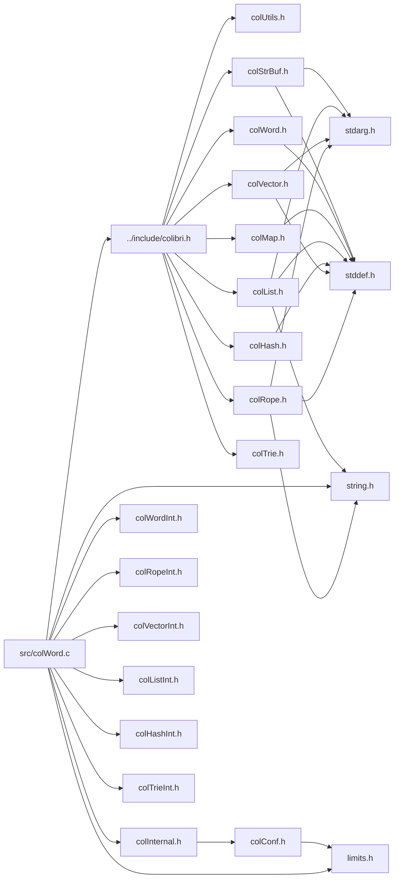

<a id="col_word_8c"></a>
# File colWord.c

![][C++]

**Location**: `src/colWord.c`

This file implements the word handling features of Colibri.

Words are a generic abstract datatype framework used in conjunction with the exact generational garbage collector and the cell-based allocator.


**See also**: [colWord.h](col_word_8h.md#col_word_8h)

## Includes

* [../include/colibri.h](colibri_8h.md#colibri_8h)
* [colInternal.h](col_internal_8h.md#col_internal_8h)
* [colWordInt.h](col_word_int_8h.md#col_word_int_8h)
* [colRopeInt.h](col_rope_int_8h.md#col_rope_int_8h)
* [colVectorInt.h](col_vector_int_8h.md#col_vector_int_8h)
* [colListInt.h](col_list_int_8h.md#col_list_int_8h)
* [colHashInt.h](col_hash_int_8h.md#col_hash_int_8h)
* [colTrieInt.h](col_trie_int_8h.md#col_trie_int_8h)
* <string.h>
* <limits.h>



## Word Creation

<a id="group__words_1ga7e2a5d74e73d2e6b9300814f79ea0db6"></a>
### Function Col\_NewBoolWord

![][public]

```cpp
Col_Word Col_NewBoolWord(int value)
```

Create a new boolean word.

**Returns**:

A new boolean word: either [WORD\_TRUE](col_word_8h.md#group__words_1ga675ef8bd2cf0ae2e0f39f8ca02dfb338) or [WORD\_FALSE](col_word_8h.md#group__words_1ga886d363141d4b7de508efa17ca191c3e).


**See also**: [Col\_BoolWordValue](col_word_8h.md#group__words_1ga3237f3b47ae8e74b1169b6ebd3cf6ebe)


**Parameters**:

* int **value**: Boolean value: zero for false, nonzero for true.

**Return type**: EXTERN [Col\_Word](col_word_8h.md#group__words_1gadb626f9e195212e4fdfba7df154ad043)

**References**:

* [WORD\_FALSE](col_word_8h.md#group__words_1ga886d363141d4b7de508efa17ca191c3e)
* [WORD\_TRUE](col_word_8h.md#group__words_1ga675ef8bd2cf0ae2e0f39f8ca02dfb338)

<a id="group__words_1gaba67c33e1004d5db691cb5834b77645e"></a>
### Function Col\_NewIntWord

![][public]

```cpp
Col_Word Col_NewIntWord(intptr_t value)
```

Create a new integer word.

If the integer value is sufficiently small, return an immediate value instead of allocating memory.


?> Allocates memory cells if word is not immediate.


**Returns**:

The new integer word.


**See also**: [Col\_IntWordValue](col_word_8h.md#group__words_1ga5586e52b13811fc363c0a1bb6bc37a06)


**Parameters**:

* intptr_t **value**: Integer value of the word to create.

**Return type**: EXTERN [Col\_Word](col_word_8h.md#group__words_1gadb626f9e195212e4fdfba7df154ad043)

**References**:

* [AllocCells](col_gc_8c.md#group__alloc_1gaeec69115deeb3321bdfbb4e42119f806)
* [SMALLINT\_MIN](col_word_int_8h.md#group__smallint__words_1ga183cb9a571b40494df308dc41c2bdd20)
* [WORD\_INTWRAP\_INIT](col_word_int_8h.md#group__int__wrappers_1ga9656b5f429e598b3f268d4f9d3821967)
* [WORD\_SMALLINT\_NEW](col_word_int_8h.md#group__smallint__words_1gaa5463ce1fc2e50bd64e0dbc951cbb510)

<a id="group__words_1gab8a1c82145210cc626b90a3c8dc3b4b7"></a>
### Function Col\_NewFloatWord

![][public]

```cpp
Col_Word Col_NewFloatWord(double value)
```

Create a new floating point word.

If the floating point value fits, return an immediate value instead of allocating memory. This includes IEEE 754 special values such as +/-0, +/-INF and NaN.


?> Allocates memory cells if word is not immediate.


**Returns**:

The new floating point word.


**Parameters**:

* double **value**: Floating point value of the word to create.

**Return type**: EXTERN [Col\_Word](col_word_8h.md#group__words_1gadb626f9e195212e4fdfba7df154ad043)

**References**:

* [AllocCells](col_gc_8c.md#group__alloc_1gaeec69115deeb3321bdfbb4e42119f806)
* [WORD\_FPWRAP\_INIT](col_word_int_8h.md#group__fp__wrappers_1ga66d2954c1e1ea98185f0187e465f0290)
* [WORD\_SMALLFP\_NEW](col_word_int_8h.md#group__smallfp__words_1ga8b37cdd7a9aa19766a182dbbed963815)
* [WORD\_SMALLFP\_VALUE](col_word_int_8h.md#group__smallfp__words_1gae3d867f57b6b1e2bb0d0919aee9a711e)

## Word Accessors

<a id="group__words_1gab0f27c794b1e7ed60b537e2ce94b4408"></a>
### Function Col\_WordType

![][public]

```cpp
int Col_WordType(Col_Word word)
```

Get word type.

Actual value may be a combination of known [Word Types](#group__words_1word_types).


**Returns**:

A combination of [Word Types](#group__words_1word_types).


**Parameters**:

* [Col\_Word](col_word_8h.md#group__words_1gadb626f9e195212e4fdfba7df154ad043) **word**: The word to get type for.

**Return type**: EXTERN int

**References**:

* [ASSERT](col_internal_8h.md#group__error_1gac22830a985e1daed0c9eadba8c6f606e)
* [COL\_BOOL](col_word_8h.md#group__words_1gaa868d0b25f066a1af86e13823e140307)
* [COL\_CHAR](col_word_8h.md#group__words_1gadee59fa07e5d5d1a3be13f0d95679389)
* [COL\_CUSTOM](col_word_8h.md#group__words_1gae48e0e2183b8910cf7700b847fb87603)
* [COL\_FLOAT](col_word_8h.md#group__words_1gaf129d60ea367bc8f58d1a060d0fdba30)
* [COL\_HASHMAP](col_word_8h.md#group__words_1gae3509634e52a76014e96c2575b5d8092)
* [COL\_INT](col_word_8h.md#group__words_1gaf0ec1d910f6ba19ede429284179b81fd)
* [COL\_INTMAP](col_word_8h.md#group__words_1ga0938add7b6f34338e9c7bc847a6b9b2f)
* [COL\_LIST](col_word_8h.md#group__words_1gafaaad5bdc900622b1387bcb1f32f61c3)
* [COL\_MAP](col_word_8h.md#group__words_1ga42912f858f54a3ebfeef2ede9422248c)
* [COL\_MLIST](col_word_8h.md#group__words_1ga7ee70ee3416cdb3bafa3c752b92f0c98)
* [COL\_MVECTOR](col_word_8h.md#group__words_1ga7edc72b3266c04c24c517c84514e908b)
* [COL\_NIL](col_word_8h.md#group__words_1ga36da6e6dce11922f4b30d9b331cf0f62)
* [COL\_ROPE](col_word_8h.md#group__words_1ga64b6f74edaf16829f0083a21dddd4d93)
* [COL\_STRBUF](col_word_8h.md#group__words_1ga747d59c28f0e463cc0818ba691aade31)
* [COL\_STRING](col_word_8h.md#group__words_1ga656318950fbb10969668166b3f8d6c1c)
* [COL\_TRIEMAP](col_word_8h.md#group__words_1ga7922babbc856f5670805da2267d72ff0)
* [COL\_VECTOR](col_word_8h.md#group__words_1ga72ce8bcc3a5db0dc98b0740ba8223558)
* [WORD\_CHAR\_WIDTH](col_word_int_8h.md#group__char__words_1ga92aceea828352d3433d76c193f259a1c)
* [WORD\_TYPE](col_word_int_8h.md#group__words_1ga014e27ea4160eb3845ac495a22c232f5)
* [WORD\_TYPE\_CHARBOOL](col_word_int_8h.md#group__words_1ga1422c37e0c7d668fad81b0710863dad5)
* [WORD\_TYPE\_CIRCLIST](col_word_int_8h.md#group__words_1ga5986ba88af901948fd9a78f422001650)
* [WORD\_TYPE\_CONCATLIST](col_word_int_8h.md#group__words_1ga8f0a60698d7b383460fe868b1c043f19)
* [WORD\_TYPE\_CONCATROPE](col_word_int_8h.md#group__words_1ga677525993a1e4a934e98042c53021c3a)
* [WORD\_TYPE\_CUSTOM](col_word_int_8h.md#group__words_1ga8babfbc77291680db519873c91efdd4c)
* [WORD\_TYPE\_INTHASHMAP](col_word_int_8h.md#group__words_1ga230c3d50685afa970c1e0da69feb5811)
* [WORD\_TYPE\_INTTRIEMAP](col_word_int_8h.md#group__words_1ga9da4310532cf6307f784bd6f33471218)
* [WORD\_TYPE\_MCONCATLIST](col_word_int_8h.md#group__words_1ga0c4f44385c099ed03aec5db8ff98c4ee)
* [WORD\_TYPE\_MVECTOR](col_word_int_8h.md#group__words_1ga22d76782e9dfd28846b6eeac3547280f)
* [WORD\_TYPE\_NIL](col_word_int_8h.md#group__words_1ga1f4d1db7619649bb51aeddd67c8b242f)
* [WORD\_TYPE\_SMALLFP](col_word_int_8h.md#group__words_1gaf5bde441039615017c30996b222a55c8)
* [WORD\_TYPE\_SMALLINT](col_word_int_8h.md#group__words_1gacaa5b57dfa5151a5852a1616bad80d3d)
* [WORD\_TYPE\_SMALLSTR](col_word_int_8h.md#group__words_1ga4148e4b4a03bff2e7715274ae4b126eb)
* [WORD\_TYPE\_STRBUF](col_word_int_8h.md#group__words_1ga31e3979e5f5419111f813131cd508768)
* [WORD\_TYPE\_STRHASHMAP](col_word_int_8h.md#group__words_1ga4b4fdf9a2320675d8dd1dc29d0007564)
* [WORD\_TYPE\_STRTRIEMAP](col_word_int_8h.md#group__words_1gae4ef7e39bd92ee96414ee98c844065ec)
* [WORD\_TYPE\_SUBLIST](col_word_int_8h.md#group__words_1gab019a30aca48483424886bf08f7b7cac)
* [WORD\_TYPE\_SUBROPE](col_word_int_8h.md#group__words_1gaadd34ba690f1e2711ee1b6ae965fd8e7)
* [WORD\_TYPE\_UCSSTR](col_word_int_8h.md#group__words_1ga3a96c4366162e66944451d0b2ddb9221)
* [WORD\_TYPE\_UTFSTR](col_word_int_8h.md#group__words_1gaed71812c790125f3aeb204e6ba4f55b4)
* [WORD\_TYPE\_VECTOR](col_word_int_8h.md#group__words_1gadf6c66e5c2f9fcdf213ae40d253c153f)
* [WORD\_TYPE\_VOIDLIST](col_word_int_8h.md#group__words_1gad13a9d2efd54cfe0f381fb9c85c4bebb)
* [WORD\_TYPE\_WRAP](col_word_int_8h.md#group__words_1ga3c604da44ba72f4661d0ac28f6718cac)
* [WORD\_TYPEINFO](col_word_int_8h.md#group__custom__words_1gafc962791c45a5dd5bb034050444084be)
* [WORD\_VOIDLIST\_LENGTH](col_word_int_8h.md#group__voidlist__words_1gaa336b44598700785e9f948fdd3a0da58)
* [WORD\_WRAP\_TYPE](col_word_int_8h.md#group__wrap__words_1ga6f350f679e04dbdc05e08f193bad9d1f)

**Referenced by**:

* [AddSynonymField](col_word_8c.md#group__words_1ga058a6e96bd5370d04936b59a3d3c48c9)
* [Col\_BoolWordValue](col_word_8h.md#group__words_1ga3237f3b47ae8e74b1169b6ebd3cf6ebe)
* [CommitBuffer](col_str_buf_8c.md#group__strbuf__words_1ga679d9a4fab2d369567c364325d0e7af5)
* [CompareStrings](col_hash_8c.md#group__hashmap__words_1gacd46dc7644f9fb2e0a56e8a0b85c6763)
* [HashString](col_hash_8c.md#group__hashmap__words_1ga5a354bdba1e95d6747bc07725902275c)

<a id="group__words_1ga3237f3b47ae8e74b1169b6ebd3cf6ebe"></a>
### Function Col\_BoolWordValue

![][public]

```cpp
int Col_BoolWordValue(Col_Word word)
```

Get value of boolean word.

**Returns**:

The boolean value: zero for false, nonzero for true.


**See also**: [Col\_NewBoolWord](col_word_8h.md#group__words_1ga7e2a5d74e73d2e6b9300814f79ea0db6)

**Exceptions**:

* **[COL\_ERROR\_BOOL](colibri_8h.md#group__error_1gga729084542ed9eae62009a84d3379ef35aa004747a3d62aadf448c12577cf19c7f)**: [[T]](colibri_8h.md#group__error_1gga6dab009a0b8c4b4fa080cb9ba1859e9ea603a58b9d5bb16fde0708eb0767e4904) **word**: Not a boolean word.

**Parameters**:

* [Col\_Word](col_word_8h.md#group__words_1gadb626f9e195212e4fdfba7df154ad043) **word**: Boolean word to get value for.

**Return type**: EXTERN int

**References**:

* [COL\_BOOL](col_word_8h.md#group__words_1gaa868d0b25f066a1af86e13823e140307)
* [COL\_ERROR\_BOOL](colibri_8h.md#group__error_1gga729084542ed9eae62009a84d3379ef35aa004747a3d62aadf448c12577cf19c7f)
* [Col\_WordType](col_word_8h.md#group__words_1gab0f27c794b1e7ed60b537e2ce94b4408)
* [TYPECHECK](col_internal_8h.md#group__error_1gaa780a70ef44d8ae2fb023777a35ade9a)
* [WORD\_BOOL\_VALUE](col_word_int_8h.md#group__bool__words_1ga321a19e253b32f551bdee2e2fa104d37)
* [WORD\_UNWRAP](col_word_int_8h.md#group__word__wrappers_1ga5278e42908e256bb743954bf7745d06c)

<a id="group__words_1ga5586e52b13811fc363c0a1bb6bc37a06"></a>
### Function Col\_IntWordValue

![][public]

```cpp
intptr_t Col_IntWordValue(Col_Word word)
```

Get value of integer word.

**Returns**:

The integer value.


**See also**: [Col\_NewIntWord](col_word_8h.md#group__words_1gaba67c33e1004d5db691cb5834b77645e)

**Exceptions**:

* **[COL\_ERROR\_INT](colibri_8h.md#group__error_1gga729084542ed9eae62009a84d3379ef35a832354f2b8d5ee385ab0a6a89ce0b5d5)**: [[T]](colibri_8h.md#group__error_1gga6dab009a0b8c4b4fa080cb9ba1859e9ea603a58b9d5bb16fde0708eb0767e4904) **word**: Not an integer word.

**Parameters**:

* [Col\_Word](col_word_8h.md#group__words_1gadb626f9e195212e4fdfba7df154ad043) **word**: Integer word to get value for.

**Return type**: EXTERN intptr_t

**References**:

* [COL\_ERROR\_INT](colibri_8h.md#group__error_1gga729084542ed9eae62009a84d3379ef35a832354f2b8d5ee385ab0a6a89ce0b5d5)
* [COL\_INT](col_word_8h.md#group__words_1gaf0ec1d910f6ba19ede429284179b81fd)
* [TYPECHECK](col_internal_8h.md#group__error_1gaa780a70ef44d8ae2fb023777a35ade9a)
* [WORD\_INTWRAP\_VALUE](col_word_int_8h.md#group__int__wrappers_1ga1110d15dc1187fc3d3f1f7c47305200e)
* [WORD\_SMALLINT\_VALUE](col_word_int_8h.md#group__smallint__words_1ga9d8dacbb3b5ccd6780c031ce039aeefb)
* [WORD\_TYPE](col_word_int_8h.md#group__words_1ga014e27ea4160eb3845ac495a22c232f5)
* [WORD\_TYPE\_SMALLINT](col_word_int_8h.md#group__words_1gacaa5b57dfa5151a5852a1616bad80d3d)
* [WORD\_TYPE\_WRAP](col_word_int_8h.md#group__words_1ga3c604da44ba72f4661d0ac28f6718cac)
* [WORD\_WRAP\_TYPE](col_word_int_8h.md#group__wrap__words_1ga6f350f679e04dbdc05e08f193bad9d1f)

<a id="group__words_1gad499285384bc620817a33fbdc10b2211"></a>
### Function Col\_FloatWordValue

![][public]

```cpp
double Col_FloatWordValue(Col_Word word)
```

Get value of floating point word.

**Returns**:

The floating point value.


**See also**: [Col\_NewFloatWord](col_word_8h.md#group__words_1gab8a1c82145210cc626b90a3c8dc3b4b7)

**Exceptions**:

* **[COL\_ERROR\_FLOAT](colibri_8h.md#group__error_1gga729084542ed9eae62009a84d3379ef35a4388bca7643872d2e7343fee8ed2f616)**: [[T]](colibri_8h.md#group__error_1gga6dab009a0b8c4b4fa080cb9ba1859e9ea603a58b9d5bb16fde0708eb0767e4904) **word**: Not a floating point word.

**Parameters**:

* [Col\_Word](col_word_8h.md#group__words_1gadb626f9e195212e4fdfba7df154ad043) **word**: Floating point word to get value for.

**Return type**: EXTERN double

**References**:

* [COL\_ERROR\_FLOAT](colibri_8h.md#group__error_1gga729084542ed9eae62009a84d3379ef35a4388bca7643872d2e7343fee8ed2f616)
* [COL\_FLOAT](col_word_8h.md#group__words_1gaf129d60ea367bc8f58d1a060d0fdba30)
* [TYPECHECK](col_internal_8h.md#group__error_1gaa780a70ef44d8ae2fb023777a35ade9a)
* [WORD\_FPWRAP\_VALUE](col_word_int_8h.md#group__fp__wrappers_1gaf730548e2147681f5248e8ecfc35ef84)
* [WORD\_SMALLFP\_VALUE](col_word_int_8h.md#group__smallfp__words_1gae3d867f57b6b1e2bb0d0919aee9a711e)
* [WORD\_TYPE](col_word_int_8h.md#group__words_1ga014e27ea4160eb3845ac495a22c232f5)
* [WORD\_TYPE\_SMALLFP](col_word_int_8h.md#group__words_1gaf5bde441039615017c30996b222a55c8)
* [WORD\_TYPE\_WRAP](col_word_int_8h.md#group__words_1ga3c604da44ba72f4661d0ac28f6718cac)
* [WORD\_WRAP\_TYPE](col_word_int_8h.md#group__wrap__words_1ga6f350f679e04dbdc05e08f193bad9d1f)

## Word Synonyms

<a id="group__words_1ga20f25ebcc58b56c911fc2a6db1c81332"></a>
### Function Col\_WordSynonym

![][public]

```cpp
Col_Word Col_WordSynonym(Col_Word word)
```

Get a synonym for the word.

Words may form chains of synonyms, i.e. circular linked lists. To iterate over the chain, simply call this function several times on the intermediary results until it returns nil or the first word.


**Returns**:

The word synonym, which may be nil.


**Parameters**:

* [Col\_Word](col_word_8h.md#group__words_1gadb626f9e195212e4fdfba7df154ad043) **word**: The word to get synonym for.

**Return type**: EXTERN [Col\_Word](col_word_8h.md#group__words_1gadb626f9e195212e4fdfba7df154ad043)

**References**:

* [HasSynonymField](col_word_8c.md#group__words_1ga7cd9782c127cd58eea6ab39c05f54eee)
* [WORD\_NIL](col_word_8h.md#group__words_1ga29e370264f4e5659ccc5be4de209f065)
* [WORD\_SYNONYM](col_word_int_8h.md#group__regular__words_1ga19cfddbcf0127f5088803cc68ddb8eaa)

<a id="group__words_1ga065c63fe593a474258ee99f08b752bb4"></a>
### Function Col\_WordAddSynonym

![][public]

```cpp
void Col_WordAddSynonym(Col_Word *wordPtr, Col_Word synonym)
```

Add a synonym to a word.

**Side Effect**:

Modifies the chain of synonyms. May allocate new words.


**Parameters**:

* [Col\_Word](col_word_8h.md#group__words_1gadb626f9e195212e4fdfba7df154ad043) * **wordPtr**: Point to the word to add synonym to. May be modified in the process (in this case the original word will be part of the returned word's synonym chain).
* [Col\_Word](col_word_8h.md#group__words_1gadb626f9e195212e4fdfba7df154ad043) **synonym**: The synonym to add.

**Return type**: EXTERN void

**References**:

* [AddSynonymField](col_word_8c.md#group__words_1ga058a6e96bd5370d04936b59a3d3c48c9)
* [ASSERT](col_internal_8h.md#group__error_1gac22830a985e1daed0c9eadba8c6f606e)
* [HasSynonymField](col_word_8c.md#group__words_1ga7cd9782c127cd58eea6ab39c05f54eee)
* [WORD\_SYNONYM](col_word_int_8h.md#group__regular__words_1ga19cfddbcf0127f5088803cc68ddb8eaa)

<a id="group__words_1ga7464c00091f4eba37aad1b6dbf5912cd"></a>
### Function Col\_WordClearSynonym

![][public]

```cpp
void Col_WordClearSynonym(Col_Word word)
```

Clear a word's synonym.

This removes the word from the synonym chain it belongs to.


**Parameters**:

* [Col\_Word](col_word_8h.md#group__words_1gadb626f9e195212e4fdfba7df154ad043) **word**: The word to clear synonym for.

**Return type**: EXTERN void

**References**:

* [ASSERT](col_internal_8h.md#group__error_1gac22830a985e1daed0c9eadba8c6f606e)
* [HasSynonymField](col_word_8c.md#group__words_1ga7cd9782c127cd58eea6ab39c05f54eee)
* [WORD\_NIL](col_word_8h.md#group__words_1ga29e370264f4e5659ccc5be4de209f065)
* [WORD\_SYNONYM](col_word_int_8h.md#group__regular__words_1ga19cfddbcf0127f5088803cc68ddb8eaa)

## Word Operations

<a id="group__words_1gaba761f87ccbab03b17efbf6bb232f112"></a>
### Function Col\_SortWords

![][public]

```cpp
void Col_SortWords(Col_Word *first, Col_Word *last, Col_WordCompareProc *proc, Col_ClientData clientData)
```

Sort an array of words using the quicksort algorithm with 3-way partitioning given in "Quicksort is optimal" by Robert Sedgewick and Jon Bentley.


**Parameters**:

* [Col\_Word](col_word_8h.md#group__words_1gadb626f9e195212e4fdfba7df154ad043) * **first**: First word of array to sort.
* [Col\_Word](col_word_8h.md#group__words_1gadb626f9e195212e4fdfba7df154ad043) * **last**: Last word of array to sort.
* [Col\_WordCompareProc](col_word_8h.md#group__words_1ga45896e7eb4f62148f854d9bd9e220137) * **proc**: Comparison proc for sorting.
* [Col\_ClientData](colibri_8h.md#group__basic__types_1ga52e127a5c635bcb88f252efd210ca1a5) **clientData**: Opaque data passed as is to **proc**.

**Return type**: EXTERN void

## Custom Word Creation

<a id="group__custom__words_1gaf9a6d324967159ae7abeb41a3d59cc79"></a>
### Function Col\_NewCustomWord

![][public]

```cpp
Col_Word Col_NewCustomWord(Col_CustomWordType *type, size_t size, void **dataPtr)
```

Create a new custom word.

**Returns**:

A new word of the given size.


**Parameters**:

* [Col\_CustomWordType](struct_col___custom_word_type.md#struct_col___custom_word_type) * **type**: The word type descriptor.
* size_t **size**: Size of custom data.
* void ** **dataPtr**: [out] Points to the allocated custom data.

**Return type**: EXTERN [Col\_Word](col_word_8h.md#group__words_1gadb626f9e195212e4fdfba7df154ad043)

**References**:

* [AllocCells](col_gc_8c.md#group__alloc_1gaeec69115deeb3321bdfbb4e42119f806)
* [COL\_HASHMAP](col_word_8h.md#group__words_1gae3509634e52a76014e96c2575b5d8092)
* [Col\_NewCustomHashMap](col_hash_8h.md#group__customhashmap__words_1gad516fa9041eb514e2c5193eb5d958f0e)
* [Col\_NewCustomTrieMap](col_trie_8h.md#group__customtriemap__words_1ga18de761037e23e723d8d62aef7d6246c)
* [COL\_TRIEMAP](col_word_8h.md#group__words_1ga7922babbc856f5670805da2267d72ff0)
* [CUSTOM\_HEADER\_SIZE](col_word_int_8h.md#group__custom__words_1gafc60bf09c25a9eaed4d5271ebc675b80)
* [Col\_CustomWordType::freeProc](struct_col___custom_word_type.md#struct_col___custom_word_type_1a15e8e2dd2cb2eedf153d89925a359712)
* [RememberSweepable](col_gc_8c.md#group__gc_1ga23c84fc6b7da85d87751fa5788e3f002)
* [Col\_CustomWordType::type](struct_col___custom_word_type.md#struct_col___custom_word_type_1af9482efe5a6408bc622320619c3ccf9f)
* [WORD\_CUSTOM\_DATA](col_word_int_8h.md#group__custom__words_1ga5a4c487ea8aec133b0a2e18d07793191)
* [WORD\_CUSTOM\_INIT](col_word_int_8h.md#group__custom__words_1gaf513110792f0f9dcf424e5d20060a328)
* [WORD\_CUSTOM\_SIZE](col_word_int_8h.md#group__custom__words_1ga2610704afbab6a5ec38e561f17dde6ea)

## Custom Word Accessors

<a id="group__custom__words_1gaaa55265553c564df20fc33dfe9153527"></a>
### Function Col\_CustomWordInfo

![][public]

```cpp
Col_CustomWordType * Col_CustomWordInfo(Col_Word word, void **dataPtr)
```

Get custom word type and data.

**Returns**:

The custom word type descriptor.


**See also**: [Col\_NewCustomWord](col_word_8h.md#group__custom__words_1gaf9a6d324967159ae7abeb41a3d59cc79)

**Exceptions**:

* **[COL\_ERROR\_CUSTOMWORD](colibri_8h.md#group__error_1gga729084542ed9eae62009a84d3379ef35aeaf92bf356a97fb87088bd24e551411c)**: [[T]](colibri_8h.md#group__error_1gga6dab009a0b8c4b4fa080cb9ba1859e9ea603a58b9d5bb16fde0708eb0767e4904) **word**: Not a custom word.

**Parameters**:

* [Col\_Word](col_word_8h.md#group__words_1gadb626f9e195212e4fdfba7df154ad043) **word**: The word to get data for.
* void ** **dataPtr**: [out] Points to the word's custom data.

**Return type**: EXTERN [Col\_CustomWordType](struct_col___custom_word_type.md#struct_col___custom_word_type) *

**References**:

* [COL\_ERROR\_CUSTOMWORD](colibri_8h.md#group__error_1gga729084542ed9eae62009a84d3379ef35aeaf92bf356a97fb87088bd24e551411c)
* [COL\_HASHMAP](col_word_8h.md#group__words_1gae3509634e52a76014e96c2575b5d8092)
* [COL\_TRIEMAP](col_word_8h.md#group__words_1ga7922babbc856f5670805da2267d72ff0)
* [CUSTOM\_HEADER\_SIZE](col_word_int_8h.md#group__custom__words_1gafc60bf09c25a9eaed4d5271ebc675b80)
* [CUSTOMHASHMAP\_HEADER\_SIZE](col_hash_int_8h.md#group__customhashmap__words_1ga983e7c0095b8a45a118d43878c885814)
* [CUSTOMTRIEMAP\_HEADER\_SIZE](col_trie_int_8h.md#group__customtriemap__words_1gab1b1757562f39ce72387cd26b4ae8f2a)
* [Col\_CustomWordType::type](struct_col___custom_word_type.md#struct_col___custom_word_type_1af9482efe5a6408bc622320619c3ccf9f)
* [TYPECHECK](col_internal_8h.md#group__error_1gaa780a70ef44d8ae2fb023777a35ade9a)
* [WORD\_CUSTOM\_DATA](col_word_int_8h.md#group__custom__words_1ga5a4c487ea8aec133b0a2e18d07793191)
* [WORD\_TYPE](col_word_int_8h.md#group__words_1ga014e27ea4160eb3845ac495a22c232f5)
* [WORD\_TYPE\_CUSTOM](col_word_int_8h.md#group__words_1ga8babfbc77291680db519873c91efdd4c)
* [WORD\_TYPEINFO](col_word_int_8h.md#group__custom__words_1gafc962791c45a5dd5bb034050444084be)

## Functions

<a id="group__words_1ga7cd9782c127cd58eea6ab39c05f54eee"></a>
### Function HasSynonymField

![][private]
![][static]

```cpp
static int HasSynonymField(Col_Word word)
```

Test whether the word has a synonym field.

**Returns**:

Whether the word has a synonym field.


**Parameters**:

* [Col\_Word](col_word_8h.md#group__words_1gadb626f9e195212e4fdfba7df154ad043) **word**: The word to test.

**Return type**: int

**References**:

* [WORD\_TYPE](col_word_int_8h.md#group__words_1ga014e27ea4160eb3845ac495a22c232f5)
* [WORD\_TYPE\_CUSTOM](col_word_int_8h.md#group__words_1ga8babfbc77291680db519873c91efdd4c)
* [WORD\_TYPE\_INTHASHMAP](col_word_int_8h.md#group__words_1ga230c3d50685afa970c1e0da69feb5811)
* [WORD\_TYPE\_INTTRIEMAP](col_word_int_8h.md#group__words_1ga9da4310532cf6307f784bd6f33471218)
* [WORD\_TYPE\_STRHASHMAP](col_word_int_8h.md#group__words_1ga4b4fdf9a2320675d8dd1dc29d0007564)
* [WORD\_TYPE\_STRTRIEMAP](col_word_int_8h.md#group__words_1gae4ef7e39bd92ee96414ee98c844065ec)
* [WORD\_TYPE\_WRAP](col_word_int_8h.md#group__words_1ga3c604da44ba72f4661d0ac28f6718cac)

**Referenced by**:

* [AddSynonymField](col_word_8c.md#group__words_1ga058a6e96bd5370d04936b59a3d3c48c9)
* [Col\_WordAddSynonym](col_word_8h.md#group__words_1ga065c63fe593a474258ee99f08b752bb4)
* [Col\_WordClearSynonym](col_word_8h.md#group__words_1ga7464c00091f4eba37aad1b6dbf5912cd)
* [Col\_WordSynonym](col_word_8h.md#group__words_1ga20f25ebcc58b56c911fc2a6db1c81332)

<a id="group__words_1ga058a6e96bd5370d04936b59a3d3c48c9"></a>
### Function AddSynonymField

![][private]
![][static]

```cpp
static void AddSynonymField(Col_Word *wordPtr)
```

Return a word that is semantically identical to the given one and has a synonym field.

**Returns**:

A word with a synonym field.

**Side Effect**:

Allocates memory cells.

**Parameters**:

* [Col\_Word](col_word_8h.md#group__words_1gadb626f9e195212e4fdfba7df154ad043) * **wordPtr**: Points to the word to convert.

**Return type**: void

**References**:

* [AllocCells](col_gc_8c.md#group__alloc_1gaeec69115deeb3321bdfbb4e42119f806)
* [ASSERT](col_internal_8h.md#group__error_1gac22830a985e1daed0c9eadba8c6f606e)
* [Col\_WordType](col_word_8h.md#group__words_1gab0f27c794b1e7ed60b537e2ce94b4408)
* [HasSynonymField](col_word_8c.md#group__words_1ga7cd9782c127cd58eea6ab39c05f54eee)
* [WORD\_FPWRAP\_INIT](col_word_int_8h.md#group__fp__wrappers_1ga66d2954c1e1ea98185f0187e465f0290)
* [WORD\_INTWRAP\_INIT](col_word_int_8h.md#group__int__wrappers_1ga9656b5f429e598b3f268d4f9d3821967)
* [WORD\_SMALLFP\_VALUE](col_word_int_8h.md#group__smallfp__words_1gae3d867f57b6b1e2bb0d0919aee9a711e)
* [WORD\_SMALLINT\_VALUE](col_word_int_8h.md#group__smallint__words_1ga9d8dacbb3b5ccd6780c031ce039aeefb)
* [WORD\_TYPE](col_word_int_8h.md#group__words_1ga014e27ea4160eb3845ac495a22c232f5)
* [WORD\_TYPE\_SMALLFP](col_word_int_8h.md#group__words_1gaf5bde441039615017c30996b222a55c8)
* [WORD\_TYPE\_SMALLINT](col_word_int_8h.md#group__words_1gacaa5b57dfa5151a5852a1616bad80d3d)
* [WORD\_WRAP\_INIT](col_word_int_8h.md#group__word__wrappers_1ga5176d0b6e39fc4a27effa648b0f88d27)

**Referenced by**:

* [Col\_WordAddSynonym](col_word_8h.md#group__words_1ga065c63fe593a474258ee99f08b752bb4)

## Source

```cpp
/**
 * @file colWord.c
 *
 * This file implements the word handling features of Colibri.
 *
 * Words are a generic abstract datatype framework used in conjunction with
 * the exact generational garbage collector and the cell-based allocator.
 *
 * @see colWord.h
 */

#include "../include/colibri.h"
#include "colInternal.h"

#include "colWordInt.h"
#include "colRopeInt.h"
#include "colVectorInt.h"
#include "colListInt.h"
#include "colHashInt.h"
#include "colTrieInt.h"

#include <string.h>
#include <limits.h>

/*
 * Prototypes for functions used only in this file.
 */

/*! \cond IGNORE */
static int              HasSynonymField(Col_Word word);
static void             AddSynonymField(Col_Word *wordPtr);
/*! \endcond *//* IGNORE */


/*
===========================================================================*//*!
\weakgroup words Words
\{*//*==========================================================================
*/

/*******************************************************************************
 * Word Creation
 ******************************************************************************/

/**
 * Create a new boolean word.
 *
 * @return A new boolean word: either #WORD_TRUE or #WORD_FALSE.
 *
 * @see Col_BoolWordValue
 */
Col_Word
Col_NewBoolWord(
    int value)  /*!< Boolean value: zero for false, nonzero for true. */
{
    return (value ? WORD_TRUE : WORD_FALSE);
}

/**
 * Create a new integer word.
 *
 * If the integer value is sufficiently small, return an immediate value
 * instead of allocating memory.
 *
 * @note
 *      Allocates memory cells if word is not immediate.
 *
 * @return The new integer word.
 *
 * @see Col_IntWordValue
 */
Col_Word
Col_NewIntWord(
    intptr_t value) /*!< Integer value of the word to create. */
{
    Col_Word word;  /* Resulting word in the general case. */

    /*
     * Return immediate value if possible.
     */

    if (value <= SMALLINT_MAX && value >= SMALLINT_MIN) {
        return WORD_SMALLINT_NEW(value);
    }

    /*
     * Create a new integer word.
     */

    word = (Col_Word) AllocCells(1);
    WORD_INTWRAP_INIT(word, 0, value);

    return word;
}

/**
 * Create a new floating point word.
 *
 * If the floating point value fits, return an immediate value instead of
 * allocating memory. This includes IEEE 754 special values such as +/-0,
 * +/-INF and NaN.
 *
 * @note
 *      Allocates memory cells if word is not immediate.
 *
 * @return The new floating point word.
 */
Col_Word
Col_NewFloatWord(
    double value)   /*!< Floating point value of the word to create. */
{
    Col_Word word;  /* Resulting word in the general case. */
    FloatConvert c;

    /*
     * Return immediate value if possible. The comparison of value against
     * itself detects NaN, which can also be represented as immediate value.
     */

    word = WORD_SMALLFP_NEW(value, c);
    if (value != value || WORD_SMALLFP_VALUE(word, c) == value) {
        return word;
    }

    /*
     * Create a new floating point word.
     */

    word = (Col_Word) AllocCells(1);
    WORD_FPWRAP_INIT(word, 0, value);

    return word;
}

/* End of Word Creation */


/*******************************************************************************
 * Word Accessors
 ******************************************************************************/

/**
 * Get word type. Actual value may be a combination of known @ref word_types
 * "Word Types".
 *
 * @return A combination of @ref word_types "Word Types".
 */
int
Col_WordType(
    Col_Word word)  /*!< The word to get type for. */
{
    switch (WORD_TYPE(word)) {
    /*
     * Immediate words.
     */

    case WORD_TYPE_NIL:
        return COL_NIL;

    case WORD_TYPE_SMALLINT:
        return COL_INT;

    case WORD_TYPE_SMALLFP:
        return COL_FLOAT;

    case WORD_TYPE_CHARBOOL:
        return (WORD_CHAR_WIDTH(word) ? COL_CHAR | COL_STRING | COL_ROPE
            : COL_BOOL);

    case WORD_TYPE_SMALLSTR:
        return COL_STRING | COL_ROPE;

    case WORD_TYPE_CIRCLIST:
        return COL_LIST;

    case WORD_TYPE_VOIDLIST:
        return (WORD_VOIDLIST_LENGTH(word) == 0 ? COL_VECTOR : 0) | COL_LIST;

    /*
     * Predefined types.
     */

    case WORD_TYPE_WRAP:
        return WORD_WRAP_TYPE(word);

    case WORD_TYPE_UCSSTR:
        return COL_STRING | COL_ROPE;

    case WORD_TYPE_UTFSTR:
        return COL_STRING | COL_ROPE;

    case WORD_TYPE_SUBROPE:
    case WORD_TYPE_CONCATROPE:
        return COL_ROPE;

    case WORD_TYPE_VECTOR:
        return COL_VECTOR | COL_LIST;

    case WORD_TYPE_MVECTOR:
        return COL_MVECTOR | COL_VECTOR | COL_LIST;

    case WORD_TYPE_SUBLIST:
    case WORD_TYPE_CONCATLIST:
        return COL_LIST;

    case WORD_TYPE_STRHASHMAP:
        return COL_MAP | COL_HASHMAP;

    case WORD_TYPE_INTHASHMAP:
        return COL_INTMAP | COL_HASHMAP;

    case WORD_TYPE_STRTRIEMAP:
        return COL_MAP | COL_TRIEMAP;

    case WORD_TYPE_INTTRIEMAP:
        return COL_INTMAP | COL_TRIEMAP;

    case WORD_TYPE_STRBUF:
        return COL_STRBUF;

    /*
     * Mutable concat list nodes are only used internally, but handle them here
     * anyway for proper type checking in list procs.
     */

    case WORD_TYPE_MCONCATLIST:
        return COL_MLIST | COL_LIST;

    /*
     * Custom word.
     */

    case WORD_TYPE_CUSTOM:
        switch (WORD_TYPEINFO(word)->type) {
        case COL_HASHMAP: return COL_CUSTOM | COL_MAP | COL_HASHMAP;
        case COL_TRIEMAP: return COL_CUSTOM | COL_MAP | COL_TRIEMAP;
        default:          return COL_CUSTOM | WORD_TYPEINFO(word)->type;
        }

    /* WORD_TYPE_UNKNOWN */

    default:
        /* CANTHAPPEN */
        ASSERT(0);
        return 0;
    }
}

/**
 * Get value of boolean word.
 *
 * @return The boolean value: zero for false, nonzero for true.
 *
 * @see Col_NewBoolWord
 */
int
Col_BoolWordValue(
    Col_Word word)  /*!< Boolean word to get value for. */
{
    /*! @typecheck{COL_ERROR_BOOL,word} */
    TYPECHECK((Col_WordType(word) & COL_BOOL), COL_ERROR_BOOL, (word)) return 0;

    WORD_UNWRAP(word);

    return WORD_BOOL_VALUE(word);
}


/**
 * Get value of integer word.
 *
 * @return The integer value.
 *
 * @see Col_NewIntWord
 */
intptr_t
Col_IntWordValue(
    Col_Word word)  /*!< Integer word to get value for. */
{
    switch (WORD_TYPE(word)) {
    case WORD_TYPE_SMALLINT:
        return WORD_SMALLINT_VALUE(word);

    case WORD_TYPE_WRAP:
        if (WORD_WRAP_TYPE(word) == COL_INT) {
            return WORD_INTWRAP_VALUE(word);
        }
    }

    /*! @typecheck{COL_ERROR_INT,word} */
    TYPECHECK(0, COL_ERROR_INT, word);

    return 0;
}

/**
 * Get value of floating point word.
 *
 * @return The floating point value.
 *
 * @see Col_NewFloatWord
 */
double
Col_FloatWordValue(
    Col_Word word)  /*!< Floating point word to get value for. */
{
    switch (WORD_TYPE(word)) {
    case WORD_TYPE_SMALLFP: {
        FloatConvert c;
        return WORD_SMALLFP_VALUE(word, c);
    }

    case WORD_TYPE_WRAP:
        if (WORD_WRAP_TYPE(word) == COL_FLOAT) {
            return WORD_FPWRAP_VALUE(word);
        }
    }

    /*! @typecheck{COL_ERROR_FLOAT,word} */
    TYPECHECK(0, COL_ERROR_FLOAT, word);
    
    return 0.0;
}

/* End of Word Accessors */


/*******************************************************************************
 * Word Synonyms
 ******************************************************************************/

/** @beginprivate @cond PRIVATE */

/**
 * Test whether the word has a synonym field.
 *
 * @return Whether the word has a synonym field.
 */
static int
HasSynonymField(
    Col_Word word)  /*!< The word to test. */
{
    switch (WORD_TYPE(word)) {
    case WORD_TYPE_CUSTOM:
    case WORD_TYPE_WRAP:
    case WORD_TYPE_STRHASHMAP:
    case WORD_TYPE_INTHASHMAP:
    case WORD_TYPE_STRTRIEMAP:
    case WORD_TYPE_INTTRIEMAP:
        return 1;

    /* WORD_TYPE_UNKNOWN */

    default:
        return 0;
    }
}

/**
 * Return a word that is semantically identical to the given one and has
 * a synonym field.
 *
 * @return A word with a synonym field.
 */
static void
AddSynonymField(
    Col_Word *wordPtr)  /*!< Points to the word to convert. */
{
    Col_Word converted;

    ASSERT(!HasSynonymField(*wordPtr));

    /*!
     * @sideeffect
     * Allocates memory cells.
     */
    converted = (Col_Word) AllocCells(1);
    switch (WORD_TYPE(*wordPtr)) {
    /*
     * Some types have dedicated wrappers.
     */

    case WORD_TYPE_SMALLINT:
        WORD_INTWRAP_INIT(converted, 0, WORD_SMALLINT_VALUE(*wordPtr));
        break;

    case WORD_TYPE_SMALLFP: {
        FloatConvert c;
        WORD_FPWRAP_INIT(converted, 0, WORD_SMALLFP_VALUE(*wordPtr, c));
        break;
    }

    default:
        /*
         * Use generic wrapper.
         */

        WORD_WRAP_INIT(converted, 0, Col_WordType(*wordPtr), *wordPtr);
        break;
    }

    *wordPtr = converted;
}

/** @endcond @endprivate */

/**
 * Get a synonym for the word.
 *
 * Words may form chains of synonyms, i.e. circular linked lists. To
 * iterate over the chain, simply call this function several times on the
 * intermediary results until it returns nil or the first word.
 *
 * @return The word synonym, which may be nil.
 */
Col_Word
Col_WordSynonym(
    Col_Word word)  /*!< The word to get synonym for. */
{
    if (!HasSynonymField(word)) {
        return WORD_NIL;
    } else {
        return WORD_SYNONYM(word);
    }
}

/**
 * Add a synonym to a word.
 *
 * @sideeffect
 *      Modifies the chain of synonyms.
 *      May allocate new words.
 */
void
Col_WordAddSynonym(
    Col_Word *wordPtr,  /*!< Point to the word to add synonym to. May be
                             modified in the process (in this case the original
                             word will be part of the returned word's synonym
                             chain). */
    Col_Word synonym)   /*!< The synonym to add. */
{
    Col_Word word;

    /*
     * Quick cases.
     */

    if (!*wordPtr || !synonym) {
        /*
         * Nil can't have synonyms.
         */

        return;
    }

    if (!HasSynonymField(*wordPtr)) {
        AddSynonymField(wordPtr);
    } else {
        /*
         * Ensure that synonym is not already part of word's chain.
         */

        word = *wordPtr;
        do {
            if (word == synonym) return;
            if (!HasSynonymField(word)) break;
            word = WORD_SYNONYM(word);
        } while (word != *wordPtr);
    }
    word = *wordPtr;

    if (!HasSynonymField(synonym)) {
        if (!WORD_SYNONYM(word)) {
            /*
             * Word has no current synonym, simply add the new one without
             * wrapping the synonym.
             */

            WORD_SYNONYM(word) = synonym;
            return;
        }
        AddSynonymField(&synonym);
    }

    /*
     * Synonym-less words have a nil synonym pointer. Words with one synonym
     * without synonym field itself simply point to it. Larger synonym chains
     * must be circular lists of words with synonym fields. Here, ensure that
     * both word and synonym's synonym chains are circular lists.
     */

    ASSERT(HasSynonymField(word));
    ASSERT(HasSynonymField(synonym));
    if (!WORD_SYNONYM(word)) {
        WORD_SYNONYM(word) = word;
    } else if (!HasSynonymField(WORD_SYNONYM(word))) {
        AddSynonymField(&WORD_SYNONYM(word));
        WORD_SYNONYM(WORD_SYNONYM(word)) = word;
    }
    if (!WORD_SYNONYM(synonym)) {
        WORD_SYNONYM(synonym) = synonym;
    } else if (!HasSynonymField(WORD_SYNONYM(synonym))) {
        AddSynonymField(&WORD_SYNONYM(synonym));
        WORD_SYNONYM(WORD_SYNONYM(synonym)) = synonym;
    }

    /*
     * Merging circular lists is simply done by exchanging the heads' next
     * pointers.
     */

    {
        Col_Word tmp = WORD_SYNONYM(word);
        WORD_SYNONYM(word) = WORD_SYNONYM(synonym);
        WORD_SYNONYM(synonym) = tmp;
    }
}

/**
 * Clear a word's synonym. This removes the word from the synonym chain
 * it belongs to.
 */
void
Col_WordClearSynonym(
    Col_Word word)  /*!< The word to clear synonym for. */
{
    Col_Word synonym;

    if (!HasSynonymField(word)) {
        return;
    }

    synonym = WORD_SYNONYM(word);
    if (!HasSynonymField(synonym)) {
        /*
         * No synonym chain. Simply clear word's synonym field.
         */

        WORD_SYNONYM(word) = WORD_NIL;
        return;
    }

    /*
     * Find the synonym pointing back to this word, and remove word from the
     * chain.
     */

    while (WORD_SYNONYM(synonym) != word) {
        synonym = WORD_SYNONYM(synonym);
        ASSERT(HasSynonymField(synonym));
    }
    WORD_SYNONYM(synonym) = WORD_SYNONYM(word);
    WORD_SYNONYM(word) = WORD_NIL;
}

/* End of Word Synonyms */


/*******************************************************************************
 * Word Operations
 ******************************************************************************/

/**
 * Sort an array of words using the quicksort algorithm with 3-way
 * partitioning given in "Quicksort is optimal" by Robert Sedgewick and
 * Jon Bentley.
 */
void
Col_SortWords(
    Col_Word *first,            /*!< First word of array to sort. */
    Col_Word *last,             /*!< Last word of array to sort. */
    Col_WordCompareProc *proc,  /*!< Comparison proc for sorting. */
    Col_ClientData clientData)  /*!< Opaque data passed as is to **proc**. */
{
/*! \cond IGNORE */
    Col_Word *i, *j, *k, *p, *q;
    Col_Word v;

#define SWAP(a, b) {Col_Word tmp=b; b=a; a=tmp;}

    /*
     * Entry point for tail recursive calls.
     */

#define TAIL_RECURSE(_first, _last) \
    first = (_first); last = (_last); goto start;

start:

    if (last <= first) return;
    i = p = first-1; j = q = last;
    v = *last;
    for (;;) {
        /*
         * Move from left to find an element that is not less.
         */

        while (*++i != v && proc(*i, v, clientData) < 0);

        /*
         * Move from right to find an element that is not greater.
         */

        while (v != *--j && proc(v, *j, clientData) < 0) if (j == first) break;

        /*
         * Stop if pointers have crossed.
         */

        if (i >= j) break;

        /*
         * Exchange.
         */

        SWAP(*i, *j);

        /*
         * If left element equal, exchange to left end.
         */

        if (*i == v || proc(*i, v, clientData) == 0) { p++; SWAP(*p, *i); }

        /*
         * If right element equal, exchange to right end.
         */

        if (v == *j || proc(v, *j, clientData) == 0) { q--; SWAP(*j, *q); }
    }
    SWAP(*i, *last); j = i-1; i = i+1;

    /*
     * Swap left equals to center.
     */

    for (k = first; k < p; k++, j--) SWAP(*k, *j);

    /*
     * Swap right equals to center.
     */

    for (k = last-1; k > q; k--, i++) SWAP(*i, *k);

    /*
     * Recurse on smallest subrange and tail call on largest to minimize
     * recursion depth and ensure O(logn) space.
     */

    if (j-first < last-i) {
        /*
         * Left subrange is shorter.
         */

        Col_SortWords(first, j, proc, clientData);
        TAIL_RECURSE(i, last);
    } else {
        /*
         * Right subrange is shorter.
         */

        Col_SortWords(i, last, proc, clientData);
        TAIL_RECURSE(first, j);
    }

#undef TAIL_RECURSE
#undef SWAP
/*! \endcond *//* IGNORE */
}

/* End of Word Operations */

/* End of Words *//*!\}*/


/*
===========================================================================*//*!
\weakgroup custom_words Custom Words
\{*//*==========================================================================
*/

/*******************************************************************************
 * Custom Word Creation
 ******************************************************************************/

/**
 * Create a new custom word.
 *
 * @return A new word of the given size.
 */
Col_Word
Col_NewCustomWord(
    Col_CustomWordType *type,   /*!< The word type descriptor. */
    size_t size,                /*!< Size of custom data. */

    /*! [out] Points to the allocated custom data.*/
    void **dataPtr)
{
    Col_Word word;

    switch (type->type) {
    case COL_HASHMAP:
        /*
         * Custom hash map word. Use default capacity value (0).
         */

        word = Col_NewCustomHashMap((Col_CustomHashMapType *) type, 0, size, dataPtr);
        break;

    case COL_TRIEMAP:
        /*
         * Custom trie map word.
         */

        word = Col_NewCustomTrieMap((Col_CustomTrieMapType *) type, size, dataPtr);
        break;

    default:
        /*
         * Basic custom word.
         */

        word = (Col_Word) AllocCells(WORD_CUSTOM_SIZE(type, CUSTOM_HEADER_SIZE,
                size));
        WORD_CUSTOM_INIT(word, type);
        if (dataPtr) *dataPtr = WORD_CUSTOM_DATA(word, type, CUSTOM_HEADER_SIZE);
    }

    if (type->freeProc) RememberSweepable(word, type);

    return word;
}

/* End of Custom Word Creation */


/*******************************************************************************
 * Custom Word Accessors
 ******************************************************************************/

/**
 * Get custom word type and data.
 *
 * @return The custom word type descriptor.
 *
 * @see Col_NewCustomWord
 */
Col_CustomWordType *
Col_CustomWordInfo(
    Col_Word word,      /*!< The word to get data for. */

    /*! [out] Points to the word's custom data.*/
    void **dataPtr)
{
    Col_CustomWordType *type;
    size_t headerSize;

    /*! @typecheck{COL_ERROR_CUSTOMWORD,word} */
    TYPECHECK(WORD_TYPE(word) == WORD_TYPE_CUSTOM, COL_ERROR_CUSTOMWORD, word) {
        return NULL;
    }

    type = WORD_TYPEINFO(word);
    switch (type->type) {
    case COL_HASHMAP: headerSize = CUSTOMHASHMAP_HEADER_SIZE;
    case COL_TRIEMAP: headerSize = CUSTOMTRIEMAP_HEADER_SIZE;
    default:          headerSize = CUSTOM_HEADER_SIZE;
    }
    *dataPtr = WORD_CUSTOM_DATA(word, type, headerSize);
    return type;
}

/* End of Custom Word Accessors */

/* End of Words *//*!\}*/
```

[public]: https://img.shields.io/badge/-public-brightgreen (public)
[C++]: https://img.shields.io/badge/language-C%2B%2B-blue (C++)
[private]: https://img.shields.io/badge/-private-red (private)
[Markdown]: https://img.shields.io/badge/language-Markdown-blue (Markdown)
[static]: https://img.shields.io/badge/-static-lightgrey (static)