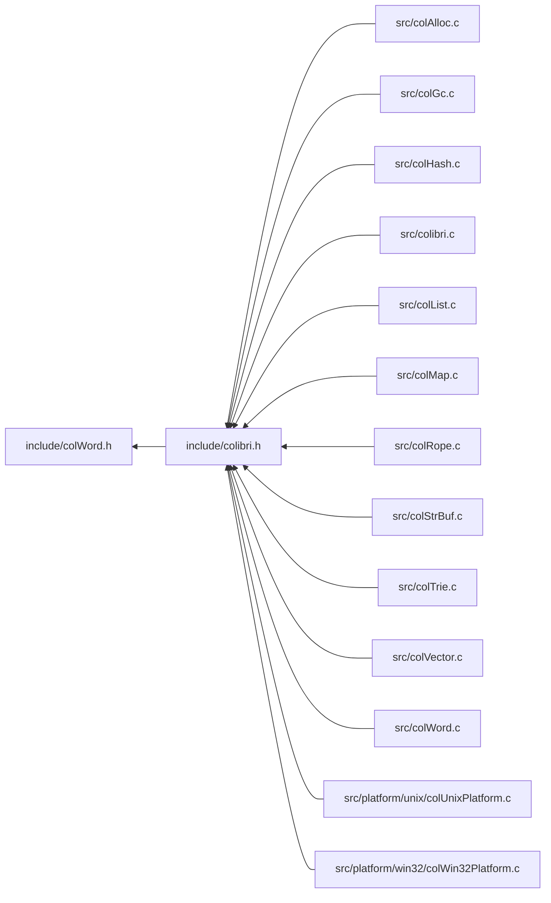

<a id="col_word_8h"></a>
# File colWord.h

![][C++]

**Location**: `include/colWord.h`

This header file defines the word handling features of Colibri.

Words are a generic abstract datatype framework used in conjunction with the exact generational garbage collector and the cell-based allocator.

## Classes

* [Col\_CustomWordType](struct_col___custom_word_type.md#struct_col___custom_word_type)

## Includes

* <stddef.h>


## Included by

* [include/colibri.h](colibri_8h.md#colibri_8h)



## Basic Word Types & Constants

<a id="group__words_1ga29e370264f4e5659ccc5be4de209f065"></a>
### Macro WORD\_NIL

![][public]

```cpp
#define WORD_NIL     (([Col\_Word](col_word_8h.md#group__words_1gadb626f9e195212e4fdfba7df154ad043)) 0)
```

Nil word.


<a id="group__words_1gadb626f9e195212e4fdfba7df154ad043"></a>
### Typedef Col\_Word

![][public]

**Definition**: `include/colWord.h` (line 30)

```cpp
typedef uintptr_t Col_Word
```

Colibri words are opaque types.


**Return type**: uintptr_t

## Boolean Values

Boolean singleton words.


Values are immediate and constant, which means that they can be safely compared and stored in static storage.


!> **Warning** \
C and Colibri booleans are not interchangeable. More specifically, [WORD\_FALSE](col_word_8h.md#group__words_1ga886d363141d4b7de508efa17ca191c3e) is not false in the C sense because it is nonzero. They are also distinct from integer words: an integer zero is not a boolean false contrary to C. So it is an error to write e.g. "if (WORD_FALSE)".

<a id="group__words_1ga886d363141d4b7de508efa17ca191c3e"></a>
### Macro WORD\_FALSE

![][public]

```cpp
#define WORD_FALSE     (([Col\_Word](col_word_8h.md#group__words_1gadb626f9e195212e4fdfba7df154ad043)) 0x004)
```

False boolean word.


<a id="group__words_1ga675ef8bd2cf0ae2e0f39f8ca02dfb338"></a>
### Macro WORD\_TRUE

![][public]

```cpp
#define WORD_TRUE     (([Col\_Word](col_word_8h.md#group__words_1gadb626f9e195212e4fdfba7df154ad043)) 0x104)
```

True boolean word.


## Word Types

<a id="group__words_1word_types"></a>
 Data types recognized by Colibri. Values are OR-able so that a word can match several types (e.g. a custom rope type as returned by [Col\_WordType()](col_word_8h.md#group__words_1gab0f27c794b1e7ed60b537e2ce94b4408) would be [COL\_CUSTOM](col_word_8h.md#group__words_1gae48e0e2183b8910cf7700b847fb87603) | [COL\_ROPE](col_word_8h.md#group__words_1ga64b6f74edaf16829f0083a21dddd4d93) ).


**See also**: [Col\_WordType](col_word_8h.md#group__words_1gab0f27c794b1e7ed60b537e2ce94b4408), [Col\_CustomWordType](struct_col___custom_word_type.md#struct_col___custom_word_type)

<a id="group__words_1ga36da6e6dce11922f4b30d9b331cf0f62"></a>
### Macro COL\_NIL

![][public]

```cpp
#define COL_NIL 0x0000
```

Nil.


<a id="group__words_1gae48e0e2183b8910cf7700b847fb87603"></a>
### Macro COL\_CUSTOM

![][public]

```cpp
#define COL_CUSTOM 0x0001
```

Custom type.


<a id="group__words_1gaa868d0b25f066a1af86e13823e140307"></a>
### Macro COL\_BOOL

![][public]

```cpp
#define COL_BOOL 0x0002
```

Boolean.


<a id="group__words_1gaf0ec1d910f6ba19ede429284179b81fd"></a>
### Macro COL\_INT

![][public]

```cpp
#define COL_INT 0x0004
```

Integer.


<a id="group__words_1gaf129d60ea367bc8f58d1a060d0fdba30"></a>
### Macro COL\_FLOAT

![][public]

```cpp
#define COL_FLOAT 0x0008
```

Floating point.


<a id="group__words_1gadee59fa07e5d5d1a3be13f0d95679389"></a>
### Macro COL\_CHAR

![][public]

```cpp
#define COL_CHAR 0x0010
```

Single character.


<a id="group__words_1ga656318950fbb10969668166b3f8d6c1c"></a>
### Macro COL\_STRING

![][public]

```cpp
#define COL_STRING 0x0020
```

Flat string.


<a id="group__words_1ga64b6f74edaf16829f0083a21dddd4d93"></a>
### Macro COL\_ROPE

![][public]

```cpp
#define COL_ROPE 0x0040
```

Generic rope.


<a id="group__words_1ga72ce8bcc3a5db0dc98b0740ba8223558"></a>
### Macro COL\_VECTOR

![][public]

```cpp
#define COL_VECTOR 0x0080
```

Vector.


<a id="group__words_1ga7edc72b3266c04c24c517c84514e908b"></a>
### Macro COL\_MVECTOR

![][public]

```cpp
#define COL_MVECTOR 0x0100
```

Mutable vector.


<a id="group__words_1gafaaad5bdc900622b1387bcb1f32f61c3"></a>
### Macro COL\_LIST

![][public]

```cpp
#define COL_LIST 0x0200
```

Generic list.


<a id="group__words_1ga7ee70ee3416cdb3bafa3c752b92f0c98"></a>
### Macro COL\_MLIST

![][public]

```cpp
#define COL_MLIST 0x0400
```

Mutable list.


<a id="group__words_1ga42912f858f54a3ebfeef2ede9422248c"></a>
### Macro COL\_MAP

![][public]

```cpp
#define COL_MAP 0x0800
```

Map (word- or string-keyed).


<a id="group__words_1ga0938add7b6f34338e9c7bc847a6b9b2f"></a>
### Macro COL\_INTMAP

![][public]

```cpp
#define COL_INTMAP 0x1000
```

Integer-keyed map.


<a id="group__words_1gae3509634e52a76014e96c2575b5d8092"></a>
### Macro COL\_HASHMAP

![][public]

```cpp
#define COL_HASHMAP 0x2000
```

Hash map.


<a id="group__words_1ga7922babbc856f5670805da2267d72ff0"></a>
### Macro COL\_TRIEMAP

![][public]

```cpp
#define COL_TRIEMAP 0x4000
```

Trie map.


<a id="group__words_1ga747d59c28f0e463cc0818ba691aade31"></a>
### Macro COL\_STRBUF

![][public]

```cpp
#define COL_STRBUF 0x8000
```

String buffer.


## Word Creation

<a id="group__words_1ga7e2a5d74e73d2e6b9300814f79ea0db6"></a>
### Function Col\_NewBoolWord

![][public]

```cpp
Col_Word Col_NewBoolWord(int value)
```

Create a new boolean word.

**Returns**:

A new boolean word: either [WORD\_TRUE](col_word_8h.md#group__words_1ga675ef8bd2cf0ae2e0f39f8ca02dfb338) or [WORD\_FALSE](col_word_8h.md#group__words_1ga886d363141d4b7de508efa17ca191c3e).


**See also**: [Col\_BoolWordValue](col_word_8h.md#group__words_1ga3237f3b47ae8e74b1169b6ebd3cf6ebe)


**Parameters**:

* int **value**: Boolean value: zero for false, nonzero for true.

**Return type**: EXTERN [Col\_Word](col_word_8h.md#group__words_1gadb626f9e195212e4fdfba7df154ad043)

**References**:

* [WORD\_FALSE](col_word_8h.md#group__words_1ga886d363141d4b7de508efa17ca191c3e)
* [WORD\_TRUE](col_word_8h.md#group__words_1ga675ef8bd2cf0ae2e0f39f8ca02dfb338)

<a id="group__words_1gaba67c33e1004d5db691cb5834b77645e"></a>
### Function Col\_NewIntWord

![][public]

```cpp
Col_Word Col_NewIntWord(intptr_t value)
```

Create a new integer word.

If the integer value is sufficiently small, return an immediate value instead of allocating memory.


?> Allocates memory cells if word is not immediate.


**Returns**:

The new integer word.


**See also**: [Col\_IntWordValue](col_word_8h.md#group__words_1ga5586e52b13811fc363c0a1bb6bc37a06)


**Parameters**:

* intptr_t **value**: Integer value of the word to create.

**Return type**: EXTERN [Col\_Word](col_word_8h.md#group__words_1gadb626f9e195212e4fdfba7df154ad043)

**References**:

* [AllocCells](col_gc_8c.md#group__alloc_1gaeec69115deeb3321bdfbb4e42119f806)
* [SMALLINT\_MIN](col_word_int_8h.md#group__smallint__words_1ga183cb9a571b40494df308dc41c2bdd20)
* [WORD\_INTWRAP\_INIT](col_word_int_8h.md#group__int__wrappers_1ga9656b5f429e598b3f268d4f9d3821967)
* [WORD\_SMALLINT\_NEW](col_word_int_8h.md#group__smallint__words_1gaa5463ce1fc2e50bd64e0dbc951cbb510)

<a id="group__words_1gab8a1c82145210cc626b90a3c8dc3b4b7"></a>
### Function Col\_NewFloatWord

![][public]

```cpp
Col_Word Col_NewFloatWord(double value)
```

Create a new floating point word.

If the floating point value fits, return an immediate value instead of allocating memory. This includes IEEE 754 special values such as +/-0, +/-INF and NaN.


?> Allocates memory cells if word is not immediate.


**Returns**:

The new floating point word.


**Parameters**:

* double **value**: Floating point value of the word to create.

**Return type**: EXTERN [Col\_Word](col_word_8h.md#group__words_1gadb626f9e195212e4fdfba7df154ad043)

**References**:

* [AllocCells](col_gc_8c.md#group__alloc_1gaeec69115deeb3321bdfbb4e42119f806)
* [WORD\_FPWRAP\_INIT](col_word_int_8h.md#group__fp__wrappers_1ga66d2954c1e1ea98185f0187e465f0290)
* [WORD\_SMALLFP\_NEW](col_word_int_8h.md#group__smallfp__words_1ga8b37cdd7a9aa19766a182dbbed963815)
* [WORD\_SMALLFP\_VALUE](col_word_int_8h.md#group__smallfp__words_1gae3d867f57b6b1e2bb0d0919aee9a711e)

## Word Accessors

<a id="group__words_1gab0f27c794b1e7ed60b537e2ce94b4408"></a>
### Function Col\_WordType

![][public]

```cpp
int Col_WordType(Col_Word word)
```

Get word type.

Actual value may be a combination of known [Word Types](#group__words_1word_types).


**Returns**:

A combination of [Word Types](#group__words_1word_types).


**Parameters**:

* [Col\_Word](col_word_8h.md#group__words_1gadb626f9e195212e4fdfba7df154ad043) **word**: The word to get type for.

**Return type**: EXTERN int

**References**:

* [ASSERT](col_internal_8h.md#group__error_1gac22830a985e1daed0c9eadba8c6f606e)
* [COL\_BOOL](col_word_8h.md#group__words_1gaa868d0b25f066a1af86e13823e140307)
* [COL\_CHAR](col_word_8h.md#group__words_1gadee59fa07e5d5d1a3be13f0d95679389)
* [COL\_CUSTOM](col_word_8h.md#group__words_1gae48e0e2183b8910cf7700b847fb87603)
* [COL\_FLOAT](col_word_8h.md#group__words_1gaf129d60ea367bc8f58d1a060d0fdba30)
* [COL\_HASHMAP](col_word_8h.md#group__words_1gae3509634e52a76014e96c2575b5d8092)
* [COL\_INT](col_word_8h.md#group__words_1gaf0ec1d910f6ba19ede429284179b81fd)
* [COL\_INTMAP](col_word_8h.md#group__words_1ga0938add7b6f34338e9c7bc847a6b9b2f)
* [COL\_LIST](col_word_8h.md#group__words_1gafaaad5bdc900622b1387bcb1f32f61c3)
* [COL\_MAP](col_word_8h.md#group__words_1ga42912f858f54a3ebfeef2ede9422248c)
* [COL\_MLIST](col_word_8h.md#group__words_1ga7ee70ee3416cdb3bafa3c752b92f0c98)
* [COL\_MVECTOR](col_word_8h.md#group__words_1ga7edc72b3266c04c24c517c84514e908b)
* [COL\_NIL](col_word_8h.md#group__words_1ga36da6e6dce11922f4b30d9b331cf0f62)
* [COL\_ROPE](col_word_8h.md#group__words_1ga64b6f74edaf16829f0083a21dddd4d93)
* [COL\_STRBUF](col_word_8h.md#group__words_1ga747d59c28f0e463cc0818ba691aade31)
* [COL\_STRING](col_word_8h.md#group__words_1ga656318950fbb10969668166b3f8d6c1c)
* [COL\_TRIEMAP](col_word_8h.md#group__words_1ga7922babbc856f5670805da2267d72ff0)
* [COL\_VECTOR](col_word_8h.md#group__words_1ga72ce8bcc3a5db0dc98b0740ba8223558)
* [WORD\_CHAR\_WIDTH](col_word_int_8h.md#group__char__words_1ga92aceea828352d3433d76c193f259a1c)
* [WORD\_TYPE](col_word_int_8h.md#group__words_1ga014e27ea4160eb3845ac495a22c232f5)
* [WORD\_TYPE\_CHARBOOL](col_word_int_8h.md#group__words_1ga1422c37e0c7d668fad81b0710863dad5)
* [WORD\_TYPE\_CIRCLIST](col_word_int_8h.md#group__words_1ga5986ba88af901948fd9a78f422001650)
* [WORD\_TYPE\_CONCATLIST](col_word_int_8h.md#group__words_1ga8f0a60698d7b383460fe868b1c043f19)
* [WORD\_TYPE\_CONCATROPE](col_word_int_8h.md#group__words_1ga677525993a1e4a934e98042c53021c3a)
* [WORD\_TYPE\_CUSTOM](col_word_int_8h.md#group__words_1ga8babfbc77291680db519873c91efdd4c)
* [WORD\_TYPE\_INTHASHMAP](col_word_int_8h.md#group__words_1ga230c3d50685afa970c1e0da69feb5811)
* [WORD\_TYPE\_INTTRIEMAP](col_word_int_8h.md#group__words_1ga9da4310532cf6307f784bd6f33471218)
* [WORD\_TYPE\_MCONCATLIST](col_word_int_8h.md#group__words_1ga0c4f44385c099ed03aec5db8ff98c4ee)
* [WORD\_TYPE\_MVECTOR](col_word_int_8h.md#group__words_1ga22d76782e9dfd28846b6eeac3547280f)
* [WORD\_TYPE\_NIL](col_word_int_8h.md#group__words_1ga1f4d1db7619649bb51aeddd67c8b242f)
* [WORD\_TYPE\_SMALLFP](col_word_int_8h.md#group__words_1gaf5bde441039615017c30996b222a55c8)
* [WORD\_TYPE\_SMALLINT](col_word_int_8h.md#group__words_1gacaa5b57dfa5151a5852a1616bad80d3d)
* [WORD\_TYPE\_SMALLSTR](col_word_int_8h.md#group__words_1ga4148e4b4a03bff2e7715274ae4b126eb)
* [WORD\_TYPE\_STRBUF](col_word_int_8h.md#group__words_1ga31e3979e5f5419111f813131cd508768)
* [WORD\_TYPE\_STRHASHMAP](col_word_int_8h.md#group__words_1ga4b4fdf9a2320675d8dd1dc29d0007564)
* [WORD\_TYPE\_STRTRIEMAP](col_word_int_8h.md#group__words_1gae4ef7e39bd92ee96414ee98c844065ec)
* [WORD\_TYPE\_SUBLIST](col_word_int_8h.md#group__words_1gab019a30aca48483424886bf08f7b7cac)
* [WORD\_TYPE\_SUBROPE](col_word_int_8h.md#group__words_1gaadd34ba690f1e2711ee1b6ae965fd8e7)
* [WORD\_TYPE\_UCSSTR](col_word_int_8h.md#group__words_1ga3a96c4366162e66944451d0b2ddb9221)
* [WORD\_TYPE\_UTFSTR](col_word_int_8h.md#group__words_1gaed71812c790125f3aeb204e6ba4f55b4)
* [WORD\_TYPE\_VECTOR](col_word_int_8h.md#group__words_1gadf6c66e5c2f9fcdf213ae40d253c153f)
* [WORD\_TYPE\_VOIDLIST](col_word_int_8h.md#group__words_1gad13a9d2efd54cfe0f381fb9c85c4bebb)
* [WORD\_TYPE\_WRAP](col_word_int_8h.md#group__words_1ga3c604da44ba72f4661d0ac28f6718cac)
* [WORD\_TYPEINFO](col_word_int_8h.md#group__custom__words_1gafc962791c45a5dd5bb034050444084be)
* [WORD\_VOIDLIST\_LENGTH](col_word_int_8h.md#group__voidlist__words_1gaa336b44598700785e9f948fdd3a0da58)
* [WORD\_WRAP\_TYPE](col_word_int_8h.md#group__wrap__words_1ga6f350f679e04dbdc05e08f193bad9d1f)

**Referenced by**:

* [AddSynonymField](col_word_8c.md#group__words_1ga058a6e96bd5370d04936b59a3d3c48c9)
* [Col\_BoolWordValue](col_word_8h.md#group__words_1ga3237f3b47ae8e74b1169b6ebd3cf6ebe)
* [CommitBuffer](col_str_buf_8c.md#group__strbuf__words_1ga679d9a4fab2d369567c364325d0e7af5)
* [CompareStrings](col_hash_8c.md#group__hashmap__words_1gacd46dc7644f9fb2e0a56e8a0b85c6763)
* [HashString](col_hash_8c.md#group__hashmap__words_1ga5a354bdba1e95d6747bc07725902275c)

<a id="group__words_1ga3237f3b47ae8e74b1169b6ebd3cf6ebe"></a>
### Function Col\_BoolWordValue

![][public]

```cpp
int Col_BoolWordValue(Col_Word word)
```

Get value of boolean word.

**Returns**:

The boolean value: zero for false, nonzero for true.


**See also**: [Col\_NewBoolWord](col_word_8h.md#group__words_1ga7e2a5d74e73d2e6b9300814f79ea0db6)

**Exceptions**:

* **[COL\_ERROR\_BOOL](colibri_8h.md#group__error_1gga729084542ed9eae62009a84d3379ef35aa004747a3d62aadf448c12577cf19c7f)**: [[T]](colibri_8h.md#group__error_1gga6dab009a0b8c4b4fa080cb9ba1859e9ea603a58b9d5bb16fde0708eb0767e4904) **word**: Not a boolean word.

**Parameters**:

* [Col\_Word](col_word_8h.md#group__words_1gadb626f9e195212e4fdfba7df154ad043) **word**: Boolean word to get value for.

**Return type**: EXTERN int

**References**:

* [COL\_BOOL](col_word_8h.md#group__words_1gaa868d0b25f066a1af86e13823e140307)
* [COL\_ERROR\_BOOL](colibri_8h.md#group__error_1gga729084542ed9eae62009a84d3379ef35aa004747a3d62aadf448c12577cf19c7f)
* [Col\_WordType](col_word_8h.md#group__words_1gab0f27c794b1e7ed60b537e2ce94b4408)
* [TYPECHECK](col_internal_8h.md#group__error_1gaa780a70ef44d8ae2fb023777a35ade9a)
* [WORD\_BOOL\_VALUE](col_word_int_8h.md#group__bool__words_1ga321a19e253b32f551bdee2e2fa104d37)
* [WORD\_UNWRAP](col_word_int_8h.md#group__word__wrappers_1ga5278e42908e256bb743954bf7745d06c)

<a id="group__words_1ga5586e52b13811fc363c0a1bb6bc37a06"></a>
### Function Col\_IntWordValue

![][public]

```cpp
intptr_t Col_IntWordValue(Col_Word word)
```

Get value of integer word.

**Returns**:

The integer value.


**See also**: [Col\_NewIntWord](col_word_8h.md#group__words_1gaba67c33e1004d5db691cb5834b77645e)

**Exceptions**:

* **[COL\_ERROR\_INT](colibri_8h.md#group__error_1gga729084542ed9eae62009a84d3379ef35a832354f2b8d5ee385ab0a6a89ce0b5d5)**: [[T]](colibri_8h.md#group__error_1gga6dab009a0b8c4b4fa080cb9ba1859e9ea603a58b9d5bb16fde0708eb0767e4904) **word**: Not an integer word.

**Parameters**:

* [Col\_Word](col_word_8h.md#group__words_1gadb626f9e195212e4fdfba7df154ad043) **word**: Integer word to get value for.

**Return type**: EXTERN intptr_t

**References**:

* [COL\_ERROR\_INT](colibri_8h.md#group__error_1gga729084542ed9eae62009a84d3379ef35a832354f2b8d5ee385ab0a6a89ce0b5d5)
* [COL\_INT](col_word_8h.md#group__words_1gaf0ec1d910f6ba19ede429284179b81fd)
* [TYPECHECK](col_internal_8h.md#group__error_1gaa780a70ef44d8ae2fb023777a35ade9a)
* [WORD\_INTWRAP\_VALUE](col_word_int_8h.md#group__int__wrappers_1ga1110d15dc1187fc3d3f1f7c47305200e)
* [WORD\_SMALLINT\_VALUE](col_word_int_8h.md#group__smallint__words_1ga9d8dacbb3b5ccd6780c031ce039aeefb)
* [WORD\_TYPE](col_word_int_8h.md#group__words_1ga014e27ea4160eb3845ac495a22c232f5)
* [WORD\_TYPE\_SMALLINT](col_word_int_8h.md#group__words_1gacaa5b57dfa5151a5852a1616bad80d3d)
* [WORD\_TYPE\_WRAP](col_word_int_8h.md#group__words_1ga3c604da44ba72f4661d0ac28f6718cac)
* [WORD\_WRAP\_TYPE](col_word_int_8h.md#group__wrap__words_1ga6f350f679e04dbdc05e08f193bad9d1f)

<a id="group__words_1gad499285384bc620817a33fbdc10b2211"></a>
### Function Col\_FloatWordValue

![][public]

```cpp
double Col_FloatWordValue(Col_Word word)
```

Get value of floating point word.

**Returns**:

The floating point value.


**See also**: [Col\_NewFloatWord](col_word_8h.md#group__words_1gab8a1c82145210cc626b90a3c8dc3b4b7)

**Exceptions**:

* **[COL\_ERROR\_FLOAT](colibri_8h.md#group__error_1gga729084542ed9eae62009a84d3379ef35a4388bca7643872d2e7343fee8ed2f616)**: [[T]](colibri_8h.md#group__error_1gga6dab009a0b8c4b4fa080cb9ba1859e9ea603a58b9d5bb16fde0708eb0767e4904) **word**: Not a floating point word.

**Parameters**:

* [Col\_Word](col_word_8h.md#group__words_1gadb626f9e195212e4fdfba7df154ad043) **word**: Floating point word to get value for.

**Return type**: EXTERN double

**References**:

* [COL\_ERROR\_FLOAT](colibri_8h.md#group__error_1gga729084542ed9eae62009a84d3379ef35a4388bca7643872d2e7343fee8ed2f616)
* [COL\_FLOAT](col_word_8h.md#group__words_1gaf129d60ea367bc8f58d1a060d0fdba30)
* [TYPECHECK](col_internal_8h.md#group__error_1gaa780a70ef44d8ae2fb023777a35ade9a)
* [WORD\_FPWRAP\_VALUE](col_word_int_8h.md#group__fp__wrappers_1gaf730548e2147681f5248e8ecfc35ef84)
* [WORD\_SMALLFP\_VALUE](col_word_int_8h.md#group__smallfp__words_1gae3d867f57b6b1e2bb0d0919aee9a711e)
* [WORD\_TYPE](col_word_int_8h.md#group__words_1ga014e27ea4160eb3845ac495a22c232f5)
* [WORD\_TYPE\_SMALLFP](col_word_int_8h.md#group__words_1gaf5bde441039615017c30996b222a55c8)
* [WORD\_TYPE\_WRAP](col_word_int_8h.md#group__words_1ga3c604da44ba72f4661d0ac28f6718cac)
* [WORD\_WRAP\_TYPE](col_word_int_8h.md#group__wrap__words_1ga6f350f679e04dbdc05e08f193bad9d1f)

## Word Synonyms

<a id="group__words_1ga20f25ebcc58b56c911fc2a6db1c81332"></a>
### Function Col\_WordSynonym

![][public]

```cpp
Col_Word Col_WordSynonym(Col_Word word)
```

Get a synonym for the word.

Words may form chains of synonyms, i.e. circular linked lists. To iterate over the chain, simply call this function several times on the intermediary results until it returns nil or the first word.


**Returns**:

The word synonym, which may be nil.


**Parameters**:

* [Col\_Word](col_word_8h.md#group__words_1gadb626f9e195212e4fdfba7df154ad043) **word**: The word to get synonym for.

**Return type**: EXTERN [Col\_Word](col_word_8h.md#group__words_1gadb626f9e195212e4fdfba7df154ad043)

**References**:

* [HasSynonymField](col_word_8c.md#group__words_1ga7cd9782c127cd58eea6ab39c05f54eee)
* [WORD\_NIL](col_word_8h.md#group__words_1ga29e370264f4e5659ccc5be4de209f065)
* [WORD\_SYNONYM](col_word_int_8h.md#group__regular__words_1ga19cfddbcf0127f5088803cc68ddb8eaa)

<a id="group__words_1ga065c63fe593a474258ee99f08b752bb4"></a>
### Function Col\_WordAddSynonym

![][public]

```cpp
void Col_WordAddSynonym(Col_Word *wordPtr, Col_Word synonym)
```

Add a synonym to a word.

**Side Effect**:

Modifies the chain of synonyms. May allocate new words.


**Parameters**:

* [Col\_Word](col_word_8h.md#group__words_1gadb626f9e195212e4fdfba7df154ad043) * **wordPtr**: Point to the word to add synonym to. May be modified in the process (in this case the original word will be part of the returned word's synonym chain).
* [Col\_Word](col_word_8h.md#group__words_1gadb626f9e195212e4fdfba7df154ad043) **synonym**: The synonym to add.

**Return type**: EXTERN void

**References**:

* [AddSynonymField](col_word_8c.md#group__words_1ga058a6e96bd5370d04936b59a3d3c48c9)
* [ASSERT](col_internal_8h.md#group__error_1gac22830a985e1daed0c9eadba8c6f606e)
* [HasSynonymField](col_word_8c.md#group__words_1ga7cd9782c127cd58eea6ab39c05f54eee)
* [WORD\_SYNONYM](col_word_int_8h.md#group__regular__words_1ga19cfddbcf0127f5088803cc68ddb8eaa)

<a id="group__words_1ga7464c00091f4eba37aad1b6dbf5912cd"></a>
### Function Col\_WordClearSynonym

![][public]

```cpp
void Col_WordClearSynonym(Col_Word word)
```

Clear a word's synonym.

This removes the word from the synonym chain it belongs to.


**Parameters**:

* [Col\_Word](col_word_8h.md#group__words_1gadb626f9e195212e4fdfba7df154ad043) **word**: The word to clear synonym for.

**Return type**: EXTERN void

**References**:

* [ASSERT](col_internal_8h.md#group__error_1gac22830a985e1daed0c9eadba8c6f606e)
* [HasSynonymField](col_word_8c.md#group__words_1ga7cd9782c127cd58eea6ab39c05f54eee)
* [WORD\_NIL](col_word_8h.md#group__words_1ga29e370264f4e5659ccc5be4de209f065)
* [WORD\_SYNONYM](col_word_int_8h.md#group__regular__words_1ga19cfddbcf0127f5088803cc68ddb8eaa)

## Word Lifetime Management

<a id="group__words_1gab55f452e6b0856f7bd7b34e04fae2aa2"></a>
### Function Col\_WordPreserve

![][public]

```cpp
void Col_WordPreserve(Col_Word word)
```

Preserve a persistent reference to a word, making it a root.

This allows words to be safely stored in external structures regardless of memory management cycles. More specifically, they can't be collected and their address remains constant.


Calls can be nested. A reference count is updated accordingly.


Roots are stored in a trie indexed by the root source addresses.


**pre**\
Must be called within a GC-protected section.


**Side Effect**:

May allocate memory cells. Marks word as pinned.


**See also**: [Col\_WordRelease](col_word_8h.md#group__words_1gad93112f81ce6511d6d0ece0db4d38598)

**Exceptions**:

* **[COL\_ERROR\_GCPROTECT](colibri_8h.md#group__error_1gga729084542ed9eae62009a84d3379ef35a33f3b4f6762491c50375359e5ffa02f8)**: [[E]](colibri_8h.md#group__error_1gga6dab009a0b8c4b4fa080cb9ba1859e9eae8345daddd8d5e83225f9f88d302f1a0) Outside of a GC-protected section.

**Parameters**:

* [Col\_Word](col_word_8h.md#group__words_1gadb626f9e195212e4fdfba7df154ad043) **word**: The word to preserve.

**Return type**: EXTERN void

**References**:

* [ASSERT](col_internal_8h.md#group__error_1gac22830a985e1daed0c9eadba8c6f606e)
* [CELL\_PAGE](col_internal_8h.md#group__pages__cells_1gabe4fc1fd7a45bf2858948e3a06710a2b)
* [EnterProtectRoots](col_platform_8h.md#group__arch_1ga037203dea1294535ac25be8712d708d6)
* [ThreadData::groupData](struct_thread_data.md#struct_thread_data_1aefbdf49c641476274db5326c60853022)
* [LeaveProtectRoots](col_platform_8h.md#group__arch_1gaee9721bdb7cc0ecca4a8ee295eadd446)
* [PAGE\_GENERATION](col_internal_8h.md#group__pages__cells_1gaa7215b15e159db56ed2bc30d66488fd8)
* [PlatGetThreadData](col_unix_platform_8h.md#group__arch__unix_1ga6964b3c4d4787a9defb7aae57825d92c)
* [PoolAllocCells](col_alloc_8c.md#group__alloc_1gafd84f35bab195e5e45a3338903dbd837)
* [PRECONDITION\_GCPROTECTED](col_gc_8c.md#group__gc_1ga1ce49cbb2ef788b5e3d501b57b903289)
* [ROOT\_GET\_LEAF](col_internal_8h.md#group__gc__roots_1gaf093eb2c5ec8150f06a69bd10df6be6a)
* [ROOT\_GET\_NODE](col_internal_8h.md#group__gc__roots_1ga33fa98f95a7bab38652b351e60d60bae)
* [ROOT\_IS\_LEAF](col_internal_8h.md#group__gc__roots_1gaa8c5f8c118fe2e0c3c0bcfb0d8be9a08)
* [ROOT\_LEAF\_INIT](col_internal_8h.md#group__gc__roots_1ga283423b988b4f6979e2f6e8d2b8a8ba9)
* [ROOT\_LEAF\_REFCOUNT](col_internal_8h.md#group__gc__roots_1gaef6c67ed97c9ceace9b0818bed0110b2)
* [ROOT\_LEAF\_SOURCE](col_internal_8h.md#group__gc__roots_1gae634c20d504ac8bd99ab26f4ddc3ee12)
* [ROOT\_NODE\_INIT](col_internal_8h.md#group__gc__roots_1ga9e5b5f33b34e01b54b6addaaaa9ace5e)
* [ROOT\_NODE\_LEFT](col_internal_8h.md#group__gc__roots_1ga27676041bc270c4dfc8c7caea4e64274)
* [ROOT\_NODE\_MASK](col_internal_8h.md#group__gc__roots_1gaa1f0481c45b7c14cf933b91d9f27a541)
* [ROOT\_NODE\_RIGHT](col_internal_8h.md#group__gc__roots_1gaf86512b7113a6afaea849d480070dd33)
* [ROOT\_PARENT](col_internal_8h.md#group__gc__roots_1gadd16c38bcc5016a0c43a17442c232ffa)
* [GroupData::rootPool](struct_group_data.md#struct_group_data_1a81941409b9917b41bb20d3572b2b4ec7)
* [GroupData::roots](struct_group_data.md#struct_group_data_1af753ea77322dc01776c856b584b219e7)
* [WORD\_CIRCLIST\_CORE](col_word_int_8h.md#group__circlist__words_1ga736b51bba4c6bf3ca55f43d942390d36)
* [WORD\_PINNED](col_word_int_8h.md#group__regular__words_1gad20cf13be09a354418d8615e6f2f2193)
* [WORD\_SET\_PINNED](col_word_int_8h.md#group__regular__words_1ga7ae30ab27827ba70ae1265b5f637101a)
* [WORD\_TYPE](col_word_int_8h.md#group__words_1ga014e27ea4160eb3845ac495a22c232f5)
* [WORD\_TYPE\_CHARBOOL](col_word_int_8h.md#group__words_1ga1422c37e0c7d668fad81b0710863dad5)
* [WORD\_TYPE\_CIRCLIST](col_word_int_8h.md#group__words_1ga5986ba88af901948fd9a78f422001650)
* [WORD\_TYPE\_NIL](col_word_int_8h.md#group__words_1ga1f4d1db7619649bb51aeddd67c8b242f)
* [WORD\_TYPE\_SMALLFP](col_word_int_8h.md#group__words_1gaf5bde441039615017c30996b222a55c8)
* [WORD\_TYPE\_SMALLINT](col_word_int_8h.md#group__words_1gacaa5b57dfa5151a5852a1616bad80d3d)
* [WORD\_TYPE\_SMALLSTR](col_word_int_8h.md#group__words_1ga4148e4b4a03bff2e7715274ae4b126eb)
* [WORD\_TYPE\_VOIDLIST](col_word_int_8h.md#group__words_1gad13a9d2efd54cfe0f381fb9c85c4bebb)

<a id="group__words_1gad93112f81ce6511d6d0ece0db4d38598"></a>
### Function Col\_WordRelease

![][public]

```cpp
void Col_WordRelease(Col_Word word)
```

Release a root word previously made by [Col\_WordPreserve()](col_word_8h.md#group__words_1gab55f452e6b0856f7bd7b34e04fae2aa2).

Calls can be nested. A reference count is updated accordingly. Once the count drops below 1, the root becomes stale.


**pre**\
Must be called within a GC-protected section.


**Side Effect**:

May release memory cells. Unpin word.


**See also**: [Col\_WordPreserve](col_word_8h.md#group__words_1gab55f452e6b0856f7bd7b34e04fae2aa2)

**Exceptions**:

* **[COL\_ERROR\_GCPROTECT](colibri_8h.md#group__error_1gga729084542ed9eae62009a84d3379ef35a33f3b4f6762491c50375359e5ffa02f8)**: [[E]](colibri_8h.md#group__error_1gga6dab009a0b8c4b4fa080cb9ba1859e9eae8345daddd8d5e83225f9f88d302f1a0) Outside of a GC-protected section.

**Parameters**:

* [Col\_Word](col_word_8h.md#group__words_1gadb626f9e195212e4fdfba7df154ad043) **word**: The root word to release.

**Return type**: EXTERN void

**References**:

* [ASSERT](col_internal_8h.md#group__error_1gac22830a985e1daed0c9eadba8c6f606e)
* [CELL\_INDEX](col_internal_8h.md#group__pages__cells_1gaa6e93c045bc319412f36118ea1cfbb05)
* [CELL\_PAGE](col_internal_8h.md#group__pages__cells_1gabe4fc1fd7a45bf2858948e3a06710a2b)
* [ClearCells](col_alloc_8c.md#group__alloc_1ga5d95195ed024066e939d0564549e865d)
* [EnterProtectRoots](col_platform_8h.md#group__arch_1ga037203dea1294535ac25be8712d708d6)
* [ThreadData::groupData](struct_thread_data.md#struct_thread_data_1aefbdf49c641476274db5326c60853022)
* [LeaveProtectRoots](col_platform_8h.md#group__arch_1gaee9721bdb7cc0ecca4a8ee295eadd446)
* [PlatGetThreadData](col_unix_platform_8h.md#group__arch__unix_1ga6964b3c4d4787a9defb7aae57825d92c)
* [PRECONDITION\_GCPROTECTED](col_gc_8c.md#group__gc_1ga1ce49cbb2ef788b5e3d501b57b903289)
* [ROOT\_GET\_NODE](col_internal_8h.md#group__gc__roots_1ga33fa98f95a7bab38652b351e60d60bae)
* [ROOT\_IS\_LEAF](col_internal_8h.md#group__gc__roots_1gaa8c5f8c118fe2e0c3c0bcfb0d8be9a08)
* [ROOT\_LEAF\_REFCOUNT](col_internal_8h.md#group__gc__roots_1gaef6c67ed97c9ceace9b0818bed0110b2)
* [ROOT\_LEAF\_SOURCE](col_internal_8h.md#group__gc__roots_1gae634c20d504ac8bd99ab26f4ddc3ee12)
* [ROOT\_NODE\_LEFT](col_internal_8h.md#group__gc__roots_1ga27676041bc270c4dfc8c7caea4e64274)
* [ROOT\_NODE\_MASK](col_internal_8h.md#group__gc__roots_1gaa1f0481c45b7c14cf933b91d9f27a541)
* [ROOT\_NODE\_RIGHT](col_internal_8h.md#group__gc__roots_1gaf86512b7113a6afaea849d480070dd33)
* [ROOT\_PARENT](col_internal_8h.md#group__gc__roots_1gadd16c38bcc5016a0c43a17442c232ffa)
* [GroupData::roots](struct_group_data.md#struct_group_data_1af753ea77322dc01776c856b584b219e7)
* [TestCell](col_alloc_8c.md#group__alloc_1gade7bbd62a937c3b2ed2f32c34c6c60a6)
* [WORD\_CIRCLIST\_CORE](col_word_int_8h.md#group__circlist__words_1ga736b51bba4c6bf3ca55f43d942390d36)
* [WORD\_CLEAR\_PINNED](col_word_int_8h.md#group__regular__words_1ga04a19fb132382d52fa42d3d3e4237f2f)
* [WORD\_PINNED](col_word_int_8h.md#group__regular__words_1gad20cf13be09a354418d8615e6f2f2193)
* [WORD\_TYPE](col_word_int_8h.md#group__words_1ga014e27ea4160eb3845ac495a22c232f5)
* [WORD\_TYPE\_CHARBOOL](col_word_int_8h.md#group__words_1ga1422c37e0c7d668fad81b0710863dad5)
* [WORD\_TYPE\_CIRCLIST](col_word_int_8h.md#group__words_1ga5986ba88af901948fd9a78f422001650)
* [WORD\_TYPE\_NIL](col_word_int_8h.md#group__words_1ga1f4d1db7619649bb51aeddd67c8b242f)
* [WORD\_TYPE\_SMALLFP](col_word_int_8h.md#group__words_1gaf5bde441039615017c30996b222a55c8)
* [WORD\_TYPE\_SMALLINT](col_word_int_8h.md#group__words_1gacaa5b57dfa5151a5852a1616bad80d3d)
* [WORD\_TYPE\_SMALLSTR](col_word_int_8h.md#group__words_1ga4148e4b4a03bff2e7715274ae4b126eb)
* [WORD\_TYPE\_VOIDLIST](col_word_int_8h.md#group__words_1gad13a9d2efd54cfe0f381fb9c85c4bebb)

## Word Operations

<a id="group__words_1ga45896e7eb4f62148f854d9bd9e220137"></a>
### Typedef Col\_WordCompareProc

![][public]

**Definition**: `include/colWord.h` (line 157)

```cpp
typedef int() Col_WordCompareProc(Col_Word w1, Col_Word w2, Col_ClientData clientData)
```

Function signature of word comparison function.

Used for sorting.


**Parameters**:

* **w1 w2**: Words to compare.
* **clientData**: Opaque client data. Typically passed to the calling proc (e.g. [Col\_SortWords()](col_word_8h.md#group__words_1gaba761f87ccbab03b17efbf6bb232f112)).


**Return values**:

* **negative**: if **w1** is less than **w2**.
* **positive**: if **w1** is greater than **w2**.
* **zero**: if both words are equal.


**See also**: [Col\_SortWords](col_word_8h.md#group__words_1gaba761f87ccbab03b17efbf6bb232f112)


**Return type**: int()

<a id="group__words_1gaba761f87ccbab03b17efbf6bb232f112"></a>
### Function Col\_SortWords

![][public]

```cpp
void Col_SortWords(Col_Word *first, Col_Word *last, Col_WordCompareProc *proc, Col_ClientData clientData)
```

Sort an array of words using the quicksort algorithm with 3-way partitioning given in "Quicksort is optimal" by Robert Sedgewick and Jon Bentley.


**Parameters**:

* [Col\_Word](col_word_8h.md#group__words_1gadb626f9e195212e4fdfba7df154ad043) * **first**: First word of array to sort.
* [Col\_Word](col_word_8h.md#group__words_1gadb626f9e195212e4fdfba7df154ad043) * **last**: Last word of array to sort.
* [Col\_WordCompareProc](col_word_8h.md#group__words_1ga45896e7eb4f62148f854d9bd9e220137) * **proc**: Comparison proc for sorting.
* [Col\_ClientData](colibri_8h.md#group__basic__types_1ga52e127a5c635bcb88f252efd210ca1a5) **clientData**: Opaque data passed as is to **proc**.

**Return type**: EXTERN void

## Custom Word Type Descriptors

<a id="group__custom__words_1ga6f6dd3eac5e1ca1e3fba5878dd698dff"></a>
### Typedef Col\_CustomWordSizeProc

![][public]

**Definition**: `include/colWord.h` (line 198)

```cpp
typedef size_t() Col_CustomWordSizeProc(Col_Word word)
```

Function signature of custom word size procs.

**Parameters**:

* **word**: Custom word to get size for.


**Returns**:

The custom word size in bytes.


**See also**: [Col\_CustomWordType](struct_col___custom_word_type.md#struct_col___custom_word_type)


**Return type**: size_t()

<a id="group__custom__words_1ga73db405afd10df91bf70e5507fd63584"></a>
### Typedef Col\_CustomWordFreeProc

![][public]

**Definition**: `include/colWord.h` (line 208)

```cpp
typedef void() Col_CustomWordFreeProc(Col_Word word)
```

Function signature of custom word cleanup procs.

Called on collected words during the sweep phase of the garbage collection.


**Parameters**:

* **word**: Custom word to cleanup.


**See also**: [Col\_CustomWordType](struct_col___custom_word_type.md#struct_col___custom_word_type)


**Return type**: void()

<a id="group__custom__words_1ga571dc0dc48421f8e7c6578c6f5f0e827"></a>
### Typedef Col\_CustomWordChildEnumProc

![][public]

**Definition**: `include/colWord.h` (line 223)

```cpp
typedef void() Col_CustomWordChildEnumProc(Col_Word word, Col_Word *childPtr, Col_ClientData clientData)
```

Function signature of custom word child enumeration procs.

Called during the mark phase of the garbage collection. Words are movable, so pointer values may be modified in the process.


**Parameters**:

* **word**: Custom word whose child is being followed.
* **childPtr**: Pointer to child, may be overwritten if moved.
* **clientData**: Opaque client data. Same value as passed to [Col\_CustomWordChildrenProc()](col_word_8h.md#group__custom__words_1ga8806c7822f400375ca69bb879aece079).


**See also**: [Col\_CustomWordType](struct_col___custom_word_type.md#struct_col___custom_word_type), [Col\_CustomWordChildrenProc](col_word_8h.md#group__custom__words_1ga8806c7822f400375ca69bb879aece079)


**Return type**: void()

<a id="group__custom__words_1ga8806c7822f400375ca69bb879aece079"></a>
### Typedef Col\_CustomWordChildrenProc

![][public]

**Definition**: `include/colWord.h` (line 236)

```cpp
typedef void() Col_CustomWordChildrenProc(Col_Word word, Col_CustomWordChildEnumProc *proc, Col_ClientData clientData)
```

Function signature of custom word child enumeration procs.

Called during the mark phase of the garbage collection.


**Parameters**:

* **word**: Custom word to follow children for.
* **proc**: Callback proc called at each child.
* **clientData**: Opaque data passed as is to above proc.


**See also**: [Col\_CustomWordType](struct_col___custom_word_type.md#struct_col___custom_word_type), [Col\_CustomWordChildEnumProc](col_word_8h.md#group__custom__words_1ga571dc0dc48421f8e7c6578c6f5f0e827)


**Return type**: void()

## Custom Word Creation

<a id="group__custom__words_1gaf9a6d324967159ae7abeb41a3d59cc79"></a>
### Function Col\_NewCustomWord

![][public]

```cpp
Col_Word Col_NewCustomWord(Col_CustomWordType *type, size_t size, void **dataPtr)
```

Create a new custom word.

**Returns**:

A new word of the given size.


**Parameters**:

* [Col\_CustomWordType](struct_col___custom_word_type.md#struct_col___custom_word_type) * **type**: The word type descriptor.
* size_t **size**: Size of custom data.
* void ** **dataPtr**: [out] Points to the allocated custom data.

**Return type**: EXTERN [Col\_Word](col_word_8h.md#group__words_1gadb626f9e195212e4fdfba7df154ad043)

**References**:

* [AllocCells](col_gc_8c.md#group__alloc_1gaeec69115deeb3321bdfbb4e42119f806)
* [COL\_HASHMAP](col_word_8h.md#group__words_1gae3509634e52a76014e96c2575b5d8092)
* [Col\_NewCustomHashMap](col_hash_8h.md#group__customhashmap__words_1gad516fa9041eb514e2c5193eb5d958f0e)
* [Col\_NewCustomTrieMap](col_trie_8h.md#group__customtriemap__words_1ga18de761037e23e723d8d62aef7d6246c)
* [COL\_TRIEMAP](col_word_8h.md#group__words_1ga7922babbc856f5670805da2267d72ff0)
* [CUSTOM\_HEADER\_SIZE](col_word_int_8h.md#group__custom__words_1gafc60bf09c25a9eaed4d5271ebc675b80)
* [Col\_CustomWordType::freeProc](struct_col___custom_word_type.md#struct_col___custom_word_type_1a15e8e2dd2cb2eedf153d89925a359712)
* [RememberSweepable](col_gc_8c.md#group__gc_1ga23c84fc6b7da85d87751fa5788e3f002)
* [Col\_CustomWordType::type](struct_col___custom_word_type.md#struct_col___custom_word_type_1af9482efe5a6408bc622320619c3ccf9f)
* [WORD\_CUSTOM\_DATA](col_word_int_8h.md#group__custom__words_1ga5a4c487ea8aec133b0a2e18d07793191)
* [WORD\_CUSTOM\_INIT](col_word_int_8h.md#group__custom__words_1gaf513110792f0f9dcf424e5d20060a328)
* [WORD\_CUSTOM\_SIZE](col_word_int_8h.md#group__custom__words_1ga2610704afbab6a5ec38e561f17dde6ea)

## Custom Word Accessors

<a id="group__custom__words_1gaaa55265553c564df20fc33dfe9153527"></a>
### Function Col\_CustomWordInfo

![][public]

```cpp
Col_CustomWordType * Col_CustomWordInfo(Col_Word word, void **dataPtr)
```

Get custom word type and data.

**Returns**:

The custom word type descriptor.


**See also**: [Col\_NewCustomWord](col_word_8h.md#group__custom__words_1gaf9a6d324967159ae7abeb41a3d59cc79)

**Exceptions**:

* **[COL\_ERROR\_CUSTOMWORD](colibri_8h.md#group__error_1gga729084542ed9eae62009a84d3379ef35aeaf92bf356a97fb87088bd24e551411c)**: [[T]](colibri_8h.md#group__error_1gga6dab009a0b8c4b4fa080cb9ba1859e9ea603a58b9d5bb16fde0708eb0767e4904) **word**: Not a custom word.

**Parameters**:

* [Col\_Word](col_word_8h.md#group__words_1gadb626f9e195212e4fdfba7df154ad043) **word**: The word to get data for.
* void ** **dataPtr**: [out] Points to the word's custom data.

**Return type**: EXTERN [Col\_CustomWordType](struct_col___custom_word_type.md#struct_col___custom_word_type) *

**References**:

* [COL\_ERROR\_CUSTOMWORD](colibri_8h.md#group__error_1gga729084542ed9eae62009a84d3379ef35aeaf92bf356a97fb87088bd24e551411c)
* [COL\_HASHMAP](col_word_8h.md#group__words_1gae3509634e52a76014e96c2575b5d8092)
* [COL\_TRIEMAP](col_word_8h.md#group__words_1ga7922babbc856f5670805da2267d72ff0)
* [CUSTOM\_HEADER\_SIZE](col_word_int_8h.md#group__custom__words_1gafc60bf09c25a9eaed4d5271ebc675b80)
* [CUSTOMHASHMAP\_HEADER\_SIZE](col_hash_int_8h.md#group__customhashmap__words_1ga983e7c0095b8a45a118d43878c885814)
* [CUSTOMTRIEMAP\_HEADER\_SIZE](col_trie_int_8h.md#group__customtriemap__words_1gab1b1757562f39ce72387cd26b4ae8f2a)
* [Col\_CustomWordType::type](struct_col___custom_word_type.md#struct_col___custom_word_type_1af9482efe5a6408bc622320619c3ccf9f)
* [TYPECHECK](col_internal_8h.md#group__error_1gaa780a70ef44d8ae2fb023777a35ade9a)
* [WORD\_CUSTOM\_DATA](col_word_int_8h.md#group__custom__words_1ga5a4c487ea8aec133b0a2e18d07793191)
* [WORD\_TYPE](col_word_int_8h.md#group__words_1ga014e27ea4160eb3845ac495a22c232f5)
* [WORD\_TYPE\_CUSTOM](col_word_int_8h.md#group__words_1ga8babfbc77291680db519873c91efdd4c)
* [WORD\_TYPEINFO](col_word_int_8h.md#group__custom__words_1gafc962791c45a5dd5bb034050444084be)

## Source

```cpp
/**
 * @file colWord.h
 *
 * This header file defines the word handling features of Colibri.
 *
 * Words are a generic abstract datatype framework used in conjunction with
 * the exact generational garbage collector and the cell-based allocator.
 */

#ifndef _COLIBRI_WORD
#define _COLIBRI_WORD

#include <stddef.h> /* For size_t, uintptr_t and the like */


/*
===========================================================================*//*!
\defgroup words Words

Words are a generic abstract datatype framework used in conjunction with
the exact generational garbage collector and the cell-based allocator.
\{*//*==========================================================================
*/

/***************************************************************************//*!
 * \name Basic Word Types & Constants
 ***************************************************************************\{*/

/** Colibri words are opaque types. */
typedef uintptr_t Col_Word;

/** Nil word. */
#define WORD_NIL \
    ((Col_Word) 0)

/* End of Basic Word Types & Constants *//*!\}*/


/***************************************************************************//*!
 * \name Boolean Values
 *
 * Boolean singleton words. Values are immediate and constant, which means
 * that they can be safely compared and stored in static storage.
 *
 * @warning
 *      C and Colibri booleans are not interchangeable. More specifically,
 *      #WORD_FALSE is not false in the C sense because it is nonzero. They are
 *      also distinct from integer words: an integer zero is not a boolean false
 *      contrary to C. So it is an error to write e.g. "if (WORD_FALSE)".
 ***************************************************************************\{*/

/** False boolean word. */
#define WORD_FALSE \
    ((Col_Word) 0x004)

/** True boolean word. */
#define WORD_TRUE \
    ((Col_Word) 0x104)

/* End of Boolean Values *//*!\}*/


/***************************************************************************//*!
 * @anchor word_types
 * \name Word Types
 *
 * Data types recognized by Colibri. Values are OR-able so that a word can
 * match several types (e.g. a custom rope type as returned by
 * Col_WordType() would be #COL_CUSTOM | #COL_ROPE ).
 *
 * @see Col_WordType
 * @see Col_CustomWordType
 ***************************************************************************\{*/

#define COL_NIL         0x0000  /*!< Nil. */
#define COL_CUSTOM      0x0001  /*!< Custom type. */
#define COL_BOOL        0x0002  /*!< Boolean. */
#define COL_INT         0x0004  /*!< Integer. */
#define COL_FLOAT       0x0008  /*!< Floating point. */
#define COL_CHAR        0x0010  /*!< Single character. */
#define COL_STRING      0x0020  /*!< Flat string. */
#define COL_ROPE        0x0040  /*!< Generic rope. */
#define COL_VECTOR      0x0080  /*!< Vector. */
#define COL_MVECTOR     0x0100  /*!< Mutable vector. */
#define COL_LIST        0x0200  /*!< Generic list. */
#define COL_MLIST       0x0400  /*!< Mutable list. */
#define COL_MAP         0x0800  /*!< Map (word- or string-keyed). */
#define COL_INTMAP      0x1000  /*!< Integer-keyed map. */
#define COL_HASHMAP     0x2000  /*!< Hash map. */
#define COL_TRIEMAP     0x4000  /*!< Trie map. */
#define COL_STRBUF      0x8000  /*!< String buffer. */

/* End of Word Types *//*!\}*/


/***************************************************************************//*!
 * \name Word Creation
 ***************************************************************************\{*/

EXTERN Col_Word     Col_NewBoolWord(int value);
EXTERN Col_Word     Col_NewIntWord(intptr_t value);
EXTERN Col_Word     Col_NewFloatWord(double value);

/* End of Word Creation *//*!\}*/


/***************************************************************************//*!
 * \name Word Accessors
 ***************************************************************************\{*/

EXTERN int          Col_WordType(Col_Word word);
EXTERN int          Col_BoolWordValue(Col_Word word);
EXTERN intptr_t     Col_IntWordValue(Col_Word word);
EXTERN double       Col_FloatWordValue(Col_Word word);

/* End of Word Accessors *//*!\}*/


/***************************************************************************//*!
 * \name Word Synonyms
 ***************************************************************************\{*/

EXTERN Col_Word     Col_WordSynonym(Col_Word word);
EXTERN void         Col_WordAddSynonym(Col_Word *wordPtr, Col_Word synonym);
EXTERN void         Col_WordClearSynonym(Col_Word word);

/* End of Word Synonyms *//*!\}*/


/***************************************************************************//*!
 * \name Word Lifetime Management
 ***************************************************************************\{*/

EXTERN void         Col_WordPreserve(Col_Word word);
EXTERN void         Col_WordRelease(Col_Word word);

/* End of Word Lifetime Management *//*!\}*/


/***************************************************************************//*!
 * \name Word Operations
 ***************************************************************************\{*/

/**
 * Function signature of word comparison function. Used for sorting.
 *
 * @param w1, w2        Words to compare.
 * @param clientData    Opaque client data. Typically passed to the calling
 *                      proc (e.g. Col_SortWords()).
 *
 * @retval negative     if **w1** is less than **w2**.
 * @retval positive     if **w1** is greater than **w2**.
 * @retval zero         if both words are equal.
 *
 * @see Col_SortWords
 */
typedef int (Col_WordCompareProc) (Col_Word w1, Col_Word w2,
    Col_ClientData clientData);

/*
 * Remaining declarations.
 */

EXTERN void     Col_SortWords(Col_Word *first, Col_Word *last,
                Col_WordCompareProc *proc,
                Col_ClientData clientData);

/* End of Word Operations *//*!\}*/

/* End of Words *//*!\}*/


/*
===========================================================================*//*!
\defgroup custom_words Custom Words
\ingroup words

Custom words are words defined by applicative code. They can extend existing
word types like ropes or maps, or define application-specific data types.

@see Col_CustomWordType
\{*//*==========================================================================
*/

/***************************************************************************//*!
 * \name Custom Word Type Descriptors
 ***************************************************************************\{*/

/**
 * Function signature of custom word size procs.
 *
 * @param word  Custom word to get size for.
 *
 * @return The custom word size in bytes.
 *
 * @see Col_CustomWordType
 */
typedef size_t (Col_CustomWordSizeProc) (Col_Word word);

/**
 * Function signature of custom word cleanup procs. Called on collected
 * words during the sweep phase of the garbage collection.
 *
 * @param word  Custom word to cleanup.
 *
 * @see Col_CustomWordType
 */
typedef void (Col_CustomWordFreeProc) (Col_Word word);

/**
 * Function signature of custom word child enumeration procs. Called during
 * the mark phase of the garbage collection. Words are movable, so pointer
 * values may be modified in the process.
 *
 * @param word          Custom word whose child is being followed.
 * @param childPtr      Pointer to child, may be overwritten if moved.
 * @param clientData    Opaque client data. Same value as passed to
 *                      Col_CustomWordChildrenProc().
 *
 * @see Col_CustomWordType
 * @see Col_CustomWordChildrenProc
 */
typedef void (Col_CustomWordChildEnumProc) (Col_Word word, Col_Word *childPtr,
    Col_ClientData clientData);

/**
 * Function signature of custom word child enumeration procs. Called during
 * the mark phase of the garbage collection.
 *
 * @param word          Custom word to follow children for.
 * @param proc          Callback proc called at each child.
 * @param clientData    Opaque data passed as is to above proc.
 * @see Col_CustomWordType
 * @see Col_CustomWordChildEnumProc
 */
typedef void (Col_CustomWordChildrenProc) (Col_Word word,
    Col_CustomWordChildEnumProc *proc, Col_ClientData clientData);

/**
 * Custom word type descriptor.
 *
 * @see @ref word_types "Word Types"
 */
typedef struct Col_CustomWordType {
    /*! Type identifier. */
    int type;

    /*! Name of the type, e.g.\ "int". */
    const char *name;

    /*! Called to get the size in bytes of the word. Must be constant during
        the whole lifetime. */
    Col_CustomWordSizeProc *sizeProc;

    /*! Called once the word gets collected. NULL if not needed. */
    Col_CustomWordFreeProc *freeProc;

    /*! Called during the garbage collection to iterate over the words owned by
        the word, in no special order. If NULL, do nothing. */
    Col_CustomWordChildrenProc *childrenProc;
} Col_CustomWordType;

/* End of Custom Word Type Descriptors *//*!\}*/


/***************************************************************************//*!
 * \name Custom Word Creation
 ***************************************************************************\{*/

EXTERN Col_Word     Col_NewCustomWord(Col_CustomWordType *type, size_t size,
                        void **dataPtr);

/* End of Custom Word Creation *//*!\}*/


/***************************************************************************//*!
 * \name Custom Word Accessors
 ***************************************************************************\{*/

EXTERN Col_CustomWordType * Col_CustomWordInfo(Col_Word word, void **dataPtr);

/* End of Custom Word Accessors *//*!\}*/

/* End of Custom Words *//*!\}*/

#endif /* _COLIBRI_WORD */
```

[public]: https://img.shields.io/badge/-public-brightgreen (public)
[C++]: https://img.shields.io/badge/language-C%2B%2B-blue (C++)
[private]: https://img.shields.io/badge/-private-red (private)
[Markdown]: https://img.shields.io/badge/language-Markdown-blue (Markdown)