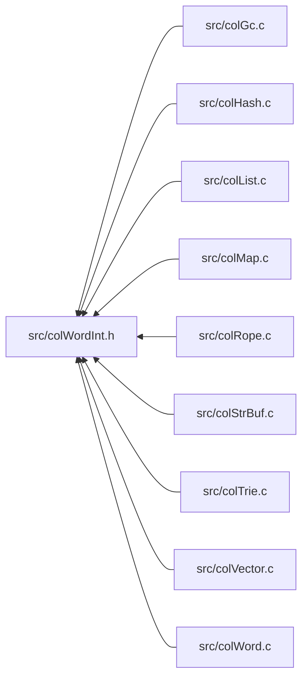

<a id="col_word_int_8h"></a>
# File colWordInt.h

![][C++]

**Location**: `src/colWordInt.h`

This header file defines the word internals of Colibri.

**See also**: [colWord.c](col_word_8c.md#col_word_8c), [colWord.h](col_word_8h.md#col_word_8h)

## Classes

* [FloatConvert](union_float_convert.md#union_float_convert)

## Included by

* [src/colGc.c](col_gc_8c.md#col_gc_8c)
* [src/colHash.c](col_hash_8c.md#col_hash_8c)
* [src/colList.c](col_list_8c.md#col_list_8c)
* [src/colMap.c](col_map_8c.md#col_map_8c)
* [src/colRope.c](col_rope_8c.md#col_rope_8c)
* [src/colStrBuf.c](col_str_buf_8c.md#col_str_buf_8c)
* [src/colTrie.c](col_trie_8c.md#col_trie_8c)
* [src/colVector.c](col_vector_8c.md#col_vector_8c)
* [src/colWord.c](col_word_8c.md#col_word_8c)



## Word Type Identifiers

<a id="group__words_1word_type_ids"></a>
 Internal word type identifiers.


Predefined type IDs for regular word types are chosen so that their bit 0 is cleared, their bit 1 is set, and their value fit into a byte. This gives up to 64 predefined type IDs (2-254 with steps of 4).


Immediate word type IDs use negative values to avoid clashes with regular word type IDs.

<a id="group__words_1ga1f4d1db7619649bb51aeddd67c8b242f"></a>
### Macro WORD\_TYPE\_NIL

![][public]

```cpp
#define WORD_TYPE_NIL 0
```

Nil singleton.


<a id="group__words_1ga8babfbc77291680db519873c91efdd4c"></a>
### Macro WORD\_TYPE\_CUSTOM

![][public]

```cpp
#define WORD_TYPE_CUSTOM -1
```

[Custom Words](group__custom__words.md#group__custom__words).


<a id="group__words_1gacaa5b57dfa5151a5852a1616bad80d3d"></a>
### Macro WORD\_TYPE\_SMALLINT

![][public]

```cpp
#define WORD_TYPE_SMALLINT -2
```

[Small Integer Words](group__smallint__words.md#group__smallint__words).


<a id="group__words_1gaf5bde441039615017c30996b222a55c8"></a>
### Macro WORD\_TYPE\_SMALLFP

![][public]

```cpp
#define WORD_TYPE_SMALLFP -3
```

[Small Floating Point Words](group__smallfp__words.md#group__smallfp__words).


<a id="group__words_1ga1422c37e0c7d668fad81b0710863dad5"></a>
### Macro WORD\_TYPE\_CHARBOOL

![][public]

```cpp
#define WORD_TYPE_CHARBOOL -4
```

[Character Words](group__char__words.md#group__char__words) _or_ [Boolean Words](group__bool__words.md#group__bool__words).


<a id="group__words_1ga4148e4b4a03bff2e7715274ae4b126eb"></a>
### Macro WORD\_TYPE\_SMALLSTR

![][public]

```cpp
#define WORD_TYPE_SMALLSTR -5
```

[Small String Words](group__smallstr__words.md#group__smallstr__words).


<a id="group__words_1ga5986ba88af901948fd9a78f422001650"></a>
### Macro WORD\_TYPE\_CIRCLIST

![][public]

```cpp
#define WORD_TYPE_CIRCLIST -6
```

[Circular List Words](group__circlist__words.md#group__circlist__words).


<a id="group__words_1gad13a9d2efd54cfe0f381fb9c85c4bebb"></a>
### Macro WORD\_TYPE\_VOIDLIST

![][public]

```cpp
#define WORD_TYPE_VOIDLIST -7
```

[Void List Words](group__voidlist__words.md#group__voidlist__words).


<a id="group__words_1ga3c604da44ba72f4661d0ac28f6718cac"></a>
### Macro WORD\_TYPE\_WRAP

![][public]

```cpp
#define WORD_TYPE_WRAP 2
```

[Wrap Words](group__wrap__words.md#group__wrap__words).


<a id="group__words_1ga3a96c4366162e66944451d0b2ddb9221"></a>
### Macro WORD\_TYPE\_UCSSTR

![][public]

```cpp
#define WORD_TYPE_UCSSTR 6
```

[Fixed-Width UCS Strings](group__ucsstr__words.md#group__ucsstr__words).


<a id="group__words_1gaed71812c790125f3aeb204e6ba4f55b4"></a>
### Macro WORD\_TYPE\_UTFSTR

![][public]

```cpp
#define WORD_TYPE_UTFSTR 10
```

[Variable-Width UTF Strings](group__utfstr__words.md#group__utfstr__words).


<a id="group__words_1gaadd34ba690f1e2711ee1b6ae965fd8e7"></a>
### Macro WORD\_TYPE\_SUBROPE

![][public]

```cpp
#define WORD_TYPE_SUBROPE 14
```

[Subropes](group__subrope__words.md#group__subrope__words).


<a id="group__words_1ga677525993a1e4a934e98042c53021c3a"></a>
### Macro WORD\_TYPE\_CONCATROPE

![][public]

```cpp
#define WORD_TYPE_CONCATROPE 18
```

[Concat Ropes](group__concatrope__words.md#group__concatrope__words).


<a id="group__words_1gadf6c66e5c2f9fcdf213ae40d253c153f"></a>
### Macro WORD\_TYPE\_VECTOR

![][public]

```cpp
#define WORD_TYPE_VECTOR 22
```

[Immutable Vectors](group__vector__words.md#group__vector__words).


<a id="group__words_1ga22d76782e9dfd28846b6eeac3547280f"></a>
### Macro WORD\_TYPE\_MVECTOR

![][public]

```cpp
#define WORD_TYPE_MVECTOR 26
```

[Mutable Vectors](group__mvector__words.md#group__mvector__words).


<a id="group__words_1gab019a30aca48483424886bf08f7b7cac"></a>
### Macro WORD\_TYPE\_SUBLIST

![][public]

```cpp
#define WORD_TYPE_SUBLIST 30
```

[Sublists](group__sublist__words.md#group__sublist__words).


<a id="group__words_1ga8f0a60698d7b383460fe868b1c043f19"></a>
### Macro WORD\_TYPE\_CONCATLIST

![][public]

```cpp
#define WORD_TYPE_CONCATLIST 34
```

[Immutable Concat Lists](group__concatlist__words.md#group__concatlist__words).


<a id="group__words_1ga0c4f44385c099ed03aec5db8ff98c4ee"></a>
### Macro WORD\_TYPE\_MCONCATLIST

![][public]

```cpp
#define WORD_TYPE_MCONCATLIST 38
```

[Mutable Concat Lists](group__mconcatlist__words.md#group__mconcatlist__words).


<a id="group__words_1ga4b4fdf9a2320675d8dd1dc29d0007564"></a>
### Macro WORD\_TYPE\_STRHASHMAP

![][public]

```cpp
#define WORD_TYPE_STRHASHMAP 42
```

[String Hash Maps](group__strhashmap__words.md#group__strhashmap__words).


<a id="group__words_1ga230c3d50685afa970c1e0da69feb5811"></a>
### Macro WORD\_TYPE\_INTHASHMAP

![][public]

```cpp
#define WORD_TYPE_INTHASHMAP 46
```

[Integer Hash Maps](group__inthashmap__words.md#group__inthashmap__words).


<a id="group__words_1ga0ccfe6bc407371b3c2cde0a2da83f9fa"></a>
### Macro WORD\_TYPE\_HASHENTRY

![][public]

```cpp
#define WORD_TYPE_HASHENTRY 50
```

[Immutable Hash Entries](group__hashentry__words.md#group__hashentry__words).


<a id="group__words_1ga4c79463f98f0ec9296451862e5d0b76c"></a>
### Macro WORD\_TYPE\_MHASHENTRY

![][public]

```cpp
#define WORD_TYPE_MHASHENTRY 54
```

[Hash Entries](group__mhashentry__words.md#group__mhashentry__words).


<a id="group__words_1gab1a5b3b65a05c74cd3973db9dce4a781"></a>
### Macro WORD\_TYPE\_INTHASHENTRY

![][public]

```cpp
#define WORD_TYPE_INTHASHENTRY 58
```

[Immutable Integer Hash Entries](group__inthashentry__words.md#group__inthashentry__words).


<a id="group__words_1ga1758f2fa0c44200f5782e548c5b33c7e"></a>
### Macro WORD\_TYPE\_MINTHASHENTRY

![][public]

```cpp
#define WORD_TYPE_MINTHASHENTRY 62
```

[Integer Hash Entries](group__minthashentry__words.md#group__minthashentry__words).


<a id="group__words_1gae4ef7e39bd92ee96414ee98c844065ec"></a>
### Macro WORD\_TYPE\_STRTRIEMAP

![][public]

```cpp
#define WORD_TYPE_STRTRIEMAP 66
```

[String Trie Maps](group__strtriemap__words.md#group__strtriemap__words).


<a id="group__words_1ga9da4310532cf6307f784bd6f33471218"></a>
### Macro WORD\_TYPE\_INTTRIEMAP

![][public]

```cpp
#define WORD_TYPE_INTTRIEMAP 70
```

[Integer Trie Maps](group__inttriemap__words.md#group__inttriemap__words).


<a id="group__words_1gae52162432efdceb0ac49e6332b213401"></a>
### Macro WORD\_TYPE\_TRIENODE

![][public]

```cpp
#define WORD_TYPE_TRIENODE 74
```

[Immutable Trie Nodes](group__trienode__words.md#group__trienode__words).


<a id="group__words_1ga20d128dd2702743f2027be54817f2275"></a>
### Macro WORD\_TYPE\_MTRIENODE

![][public]

```cpp
#define WORD_TYPE_MTRIENODE 78
```

[Trie Nodes](group__mtrienode__words.md#group__mtrienode__words).


<a id="group__words_1ga9ff5e124f29796ce3b1dd377f7d6d59f"></a>
### Macro WORD\_TYPE\_STRTRIENODE

![][public]

```cpp
#define WORD_TYPE_STRTRIENODE 82
```

[Immutable String Trie Nodes](group__strtrienode__words.md#group__strtrienode__words).


<a id="group__words_1ga82e8b6ff4abcd49f5ffa67cc45b17358"></a>
### Macro WORD\_TYPE\_MSTRTRIENODE

![][public]

```cpp
#define WORD_TYPE_MSTRTRIENODE 86
```

[String Trie Nodes](group__mstrtrienode__words.md#group__mstrtrienode__words).


<a id="group__words_1gac4adeeed11aa6a07235dfe4099c18074"></a>
### Macro WORD\_TYPE\_INTTRIENODE

![][public]

```cpp
#define WORD_TYPE_INTTRIENODE 90
```

[Immutable Integer Trie Nodes](group__inttrienode__words.md#group__inttrienode__words).


<a id="group__words_1gac0b62fa5b054dc6713a5fc7fd69298da"></a>
### Macro WORD\_TYPE\_MINTTRIENODE

![][public]

```cpp
#define WORD_TYPE_MINTTRIENODE 94
```

[Integer Trie Nodes](group__minttrienode__words.md#group__minttrienode__words).


<a id="group__words_1ga2a17ea1e39ad925fc0057cd928cdd49c"></a>
### Macro WORD\_TYPE\_TRIELEAF

![][public]

```cpp
#define WORD_TYPE_TRIELEAF 98
```

[Immutable Trie Leaves](group__trieleaf__words.md#group__trieleaf__words).


<a id="group__words_1ga4c7f02b7545a17f527d59a2c66e9d0fa"></a>
### Macro WORD\_TYPE\_MTRIELEAF

![][public]

```cpp
#define WORD_TYPE_MTRIELEAF 102
```

[Trie Leaves](group__mtrieleaf__words.md#group__mtrieleaf__words).


<a id="group__words_1ga896310a96176f87d4ec0bd06eabf55f7"></a>
### Macro WORD\_TYPE\_INTTRIELEAF

![][public]

```cpp
#define WORD_TYPE_INTTRIELEAF 106
```

[Immutable Integer Trie Leaves](group__inttrieleaf__words.md#group__inttrieleaf__words).


<a id="group__words_1ga81a397c929cd0fa5f89c5a01ce2a1487"></a>
### Macro WORD\_TYPE\_MINTTRIELEAF

![][public]

```cpp
#define WORD_TYPE_MINTTRIELEAF 110
```

[Integer Trie Leaves](group__minttrieleaf__words.md#group__minttrieleaf__words).


<a id="group__words_1ga31e3979e5f5419111f813131cd508768"></a>
### Macro WORD\_TYPE\_STRBUF

![][public]

```cpp
#define WORD_TYPE_STRBUF 114
```

[String Buffers](group__strbuf__words.md#group__strbuf__words).


<a id="group__words_1ga2c7094c849fb96cd773345ef34fa3e34"></a>
### Macro WORD\_TYPE\_REDIRECT

![][public]

```cpp
#define WORD_TYPE_REDIRECT 254
```

[Redirect Words](group__redirect__words.md#group__redirect__words).


<a id="group__words_1ga2dbd46684921f49af69a8b0032d372b5"></a>
### Macro WORD\_TYPE\_UNKNOWN

![][public]

```cpp
#define WORD_TYPE_UNKNOWN
```

Used as a tag in the source code to mark places where predefined type specific code is needed.

Search for this tag when adding new predefined word types.


## Small Integer Word Constants

<a id="group__smallint__words_1ga183cb9a571b40494df308dc41c2bdd20"></a>
### Macro SMALLINT\_MIN

![][public]

```cpp
#define SMALLINT_MIN (INTPTR_MIN>>1)
```

Minimum value of small integer words.


<a id="group__smallint__words_1gaabcc2211b4ad11604ae74a17c929a51e"></a>
### Macro SMALLINT\_MAX

![][public]

```cpp
#define SMALLINT_MAX (INTPTR_MAX>>1)
```

Maximum value of small integer words.


## Small Integer Word Creation

<a id="group__smallint__words_1gaa5463ce1fc2e50bd64e0dbc951cbb510"></a>
### Macro WORD\_SMALLINT\_NEW

![][public]

```cpp
#define WORD_SMALLINT_NEW     (([Col\_Word](col_word_8h.md#group__words_1gadb626f9e195212e4fdfba7df154ad043))((((intptr_t)(value))<<1)|1))( value )
```

Small integer word creation.

**Parameters**:

* **value**: Integer value. Must be between [SMALLINT\_MIN](col_word_int_8h.md#group__smallint__words_1ga183cb9a571b40494df308dc41c2bdd20) and [SMALLINT\_MAX](col_word_int_8h.md#group__smallint__words_1gaabcc2211b4ad11604ae74a17c929a51e).


**Returns**:

The new small integer word.


**See also**: [WORD\_SMALLINT\_VALUE](col_word_int_8h.md#group__smallint__words_1ga9d8dacbb3b5ccd6780c031ce039aeefb)


## Small Integer Word Accessors

<a id="group__smallint__words_1ga9d8dacbb3b5ccd6780c031ce039aeefb"></a>
### Macro WORD\_SMALLINT\_VALUE

![][public]

```cpp
#define WORD_SMALLINT_VALUE (((intptr_t)(word))>>1)( word )
```

Get value of small integer word.

**Parameters**:

* **word**: Word to access.


**See also**: [WORD\_SMALLINT\_NEW](col_word_int_8h.md#group__smallint__words_1gaa5463ce1fc2e50bd64e0dbc951cbb510)


## Small Floating Point Word Utilities

<a id="group__smallfp__words_1ga2c853438af5ac989dce08fcbed557051"></a>
### Macro SMALLFP\_TYPE

![][public]

```cpp
#define SMALLFP_TYPE float
```

C Type used by immediate floating point words.

**See also**: [FloatConvert](union_float_convert.md#union_float_convert), [WORD\_SMALLFP\_NEW](col_word_int_8h.md#group__smallfp__words_1ga8b37cdd7a9aa19766a182dbbed963815)


## Small Floating Point Word Creation

<a id="group__smallfp__words_1ga8b37cdd7a9aa19766a182dbbed963815"></a>
### Macro WORD\_SMALLFP\_NEW

![][public]

```cpp
#define WORD_SMALLFP_NEW     ((c).f = ([SMALLFP\_TYPE](col_word_int_8h.md#group__smallfp__words_1ga2c853438af5ac989dce08fcbed557051))(value), (c).i &= ~3, (c).i |= 2, (c).w)( value ,c )
```

Small floating point word creation.

**Parameters**:

* **value**: Floating point value.
* **c**: [FloatConvert](union_float_convert.md#union_float_convert) conversion structure.


!> **Warning** \
Argument **c** is referenced several times by the macro. Make sure to avoid any side effect.


**Returns**:

The new small floating point word.


**See also**: [WORD\_SMALLFP\_VALUE](col_word_int_8h.md#group__smallfp__words_1gae3d867f57b6b1e2bb0d0919aee9a711e)


## Small Floating Point Word Accessors

<a id="group__smallfp__words_1gae3d867f57b6b1e2bb0d0919aee9a711e"></a>
### Macro WORD\_SMALLFP\_VALUE

![][public]

```cpp
#define WORD_SMALLFP_VALUE     ((c).w = (word), (c).i &= ~3, (c).f)( word ,c )
```

Get value of small floating point word.

**Parameters**:

* **word**: Word to access.
* **c**: [FloatConvert](union_float_convert.md#union_float_convert) conversion structure.


**Returns**:

The floating point value.


**See also**: [WORD\_SMALLFP\_NEW](col_word_int_8h.md#group__smallfp__words_1ga8b37cdd7a9aa19766a182dbbed963815)


## Boolean Word Creation

<a id="group__bool__words_1ga5c2f2b90684edf7db909cd71e88a8a71"></a>
### Macro WORD\_BOOL\_NEW

![][public]

```cpp
#define WORD_BOOL_NEW     ((value)?WORD_TRUE:WORD_FALSE)( value )
```

Boolean word creation.

**Parameters**:

* **value**: Boolean value: zero for false, nonzero for true.


**Returns**:

The new boolean word.


**See also**: [WORD\_BOOL\_VALUE](col_word_int_8h.md#group__bool__words_1ga321a19e253b32f551bdee2e2fa104d37)


## Boolean Word Accessors

<a id="group__bool__words_1ga321a19e253b32f551bdee2e2fa104d37"></a>
### Macro WORD\_BOOL\_VALUE

![][public]

```cpp
#define WORD_BOOL_VALUE (((uintptr_t)(word))&0x100)( word )
```

Get value of boolean word: zero for false, nonzero for true.

**Parameters**:

* **word**: Word to access.


**See also**: [WORD\_BOOL\_NEW](col_word_int_8h.md#group__bool__words_1ga5c2f2b90684edf7db909cd71e88a8a71)


## Character Word Creation

<a id="group__char__words_1ga3e1012ee747ef755581f098b55cde3c7"></a>
### Macro WORD\_CHAR\_NEW

![][public]

```cpp
#define WORD_CHAR_NEW     (([Col\_Word](col_word_8h.md#group__words_1gadb626f9e195212e4fdfba7df154ad043))((((uintptr_t)(value))<<8)|(((uintptr_t)(width))<<5)|4))( value ,width )
```

Unicode char word creation.

**Parameters**:

* **value**: Unicode codepoint.
* **width**: Character width.


**Returns**:

The new character word.


**See also**: [WORD\_CHAR\_CP](col_word_int_8h.md#group__char__words_1ga56cddd2dee0e6afab1ee29c2f83f33ab), [WORD\_CHAR\_WIDTH](col_word_int_8h.md#group__char__words_1ga92aceea828352d3433d76c193f259a1c)


## Character Word Accessors

<a id="group__char__words_1ga56cddd2dee0e6afab1ee29c2f83f33ab"></a>
### Macro WORD\_CHAR\_CP

![][public]

```cpp
#define WORD_CHAR_CP (([Col\_Char](colibri_8h.md#group__strings_1gab42ee0cd75b78280e412fa5bae5eb862))(((uintptr_t)(word))>>8))( word )
```

Get Unicode codepoint of char word.

**Parameters**:

* **word**: Word to access.


**See also**: [WORD\_CHAR\_NEW](col_word_int_8h.md#group__char__words_1ga3e1012ee747ef755581f098b55cde3c7)


<a id="group__char__words_1ga92aceea828352d3433d76c193f259a1c"></a>
### Macro WORD\_CHAR\_WIDTH

![][public]

```cpp
#define WORD_CHAR_WIDTH ((((uintptr_t)(word))>>5)&7)( word )
```

Get char width used at creation time.

**Parameters**:

* **word**: Word to access.


**See also**: [WORD\_CHAR\_NEW](col_word_int_8h.md#group__char__words_1ga3e1012ee747ef755581f098b55cde3c7)


## Small String Word Constants

<a id="group__smallstr__words_1ga465e96e908ab71872527b13453fda803"></a>
### Macro SMALLSTR\_MAX\_LENGTH

![][public]

```cpp
#define SMALLSTR_MAX_LENGTH (sizeof([Col\_Word](col_word_8h.md#group__words_1gadb626f9e195212e4fdfba7df154ad043))-1)
```

Maximum length of small string words.


<a id="group__smallstr__words_1gaced4b5ab427a8009e9e3586f60cf487f"></a>
### Macro WORD\_SMALLSTR\_EMPTY

![][public]

```cpp
#define WORD_SMALLSTR_EMPTY (([Col\_Word](col_word_8h.md#group__words_1gadb626f9e195212e4fdfba7df154ad043)) 12)
```

Empty string immediate singleton.

This is simply a small string of zero length.


## Small String Word Accessors

<a id="group__smallstr__words_1gad314e3ed08cf8450986fec6ac88a0e11"></a>
### Macro WORD\_SMALLSTR\_LENGTH

![][public]

```cpp
#define WORD_SMALLSTR_LENGTH ((((uintptr_t)(word))&0xFF)>>5)( word )
```

Get small string length.

**Parameters**:

* **word**: Word to access.


**See also**: [WORD\_SMALLSTR\_SET\_LENGTH](col_word_int_8h.md#group__smallstr__words_1gadf6c0a3a5c0d10bdff25627332aa16a6)


<a id="group__smallstr__words_1gadf6c0a3a5c0d10bdff25627332aa16a6"></a>
### Macro WORD\_SMALLSTR\_SET\_LENGTH

![][public]

```cpp
#define WORD_SMALLSTR_SET_LENGTH (*((uintptr_t *)&(word)) = ((length)<<5)|12)( word ,length )
```

Set small string length.

**Parameters**:

* **word**: Word to access.
* **length**: Length value.


**See also**: [WORD\_SMALLSTR\_LENGTH](col_word_int_8h.md#group__smallstr__words_1gad314e3ed08cf8450986fec6ac88a0e11)


<a id="group__smallstr__words_1ga0895416dca7181737047c535c2f6edee"></a>
### Macro WORD\_SMALLSTR\_DATA

![][public]

```cpp
#define WORD_SMALLSTR_DATA (([Col\_Char1](colibri_8h.md#group__strings_1ga961d5ffde8aa1fba42d4b669a6199e76)  *)&(word))( word )
```

Pointer to beginning of small string data.

**Parameters**:

* **word**: Word to access.


## Core List Word Creation

<a id="group__circlist__words_1ga51827e999fb41c560624c93dd2a8770b"></a>
### Macro WORD\_CIRCLIST\_NEW

![][public]

```cpp
#define WORD_CIRCLIST_NEW     (([Col\_Word](col_word_8h.md#group__words_1gadb626f9e195212e4fdfba7df154ad043))(((uintptr_t)(core))|8))( core )
```

Circular list word creation.

**Parameters**:

* **core**: Core list. Must be acyclic.


**Returns**:

The new circular list word.


**See also**: [WORD\_CIRCLIST\_CORE](col_word_int_8h.md#group__circlist__words_1ga736b51bba4c6bf3ca55f43d942390d36)


## Core List Word Accessors

<a id="group__circlist__words_1ga736b51bba4c6bf3ca55f43d942390d36"></a>
### Macro WORD\_CIRCLIST\_CORE

![][public]

```cpp
#define WORD_CIRCLIST_CORE (([Col\_Word](col_word_8h.md#group__words_1gadb626f9e195212e4fdfba7df154ad043))(((uintptr_t)(word))&~8))( word )
```

Get core list.

**Parameters**:

* **word**: Word to access.


**See also**: [WORD\_CIRCLIST\_NEW](col_word_int_8h.md#group__circlist__words_1ga51827e999fb41c560624c93dd2a8770b)


## Void List Word Constants

<a id="group__voidlist__words_1gabf4f6876ac71e3f3368c711756459baf"></a>
### Macro VOIDLIST\_MAX\_LENGTH

![][public]

```cpp
#define VOIDLIST_MAX_LENGTH (SIZE_MAX>>5)
```

Maximum length of void list words.


<a id="group__voidlist__words_1ga8b7c20d2cdcdf8f3bc58589d757cf53b"></a>
### Macro WORD\_LIST\_EMPTY

![][public]

```cpp
#define WORD_LIST_EMPTY [WORD\_VOIDLIST\_NEW](col_word_int_8h.md#group__voidlist__words_1ga76a437807f61cfb3d4066867ae82d8d4)(0)
```

Empty list immediate singleton.

This is simply a zero-length void list.


## Void List Word Creation

<a id="group__voidlist__words_1ga76a437807f61cfb3d4066867ae82d8d4"></a>
### Macro WORD\_VOIDLIST\_NEW

![][public]

```cpp
#define WORD_VOIDLIST_NEW     (([Col\_Word](col_word_8h.md#group__words_1gadb626f9e195212e4fdfba7df154ad043))(intptr_t)((((size_t)(length))<<5)|20))( length )
```

Void list word creation.

**Parameters**:

* **length**: Void list length. Must be less than [VOIDLIST\_MAX\_LENGTH](col_word_int_8h.md#group__voidlist__words_1gabf4f6876ac71e3f3368c711756459baf).


**Returns**:

The new void list word.


**See also**: [WORD\_VOIDLIST\_LENGTH](col_word_int_8h.md#group__voidlist__words_1gaa336b44598700785e9f948fdd3a0da58)


## Void List Word Accessors

<a id="group__voidlist__words_1gaa336b44598700785e9f948fdd3a0da58"></a>
### Macro WORD\_VOIDLIST\_LENGTH

![][public]

```cpp
#define WORD_VOIDLIST_LENGTH (((size_t)(intptr_t)(word))>>5)( word )
```

Get void list length.

**Parameters**:

* **word**: Word to access.


**See also**: [WORD\_VOIDLIST\_NEW](col_word_int_8h.md#group__voidlist__words_1ga76a437807f61cfb3d4066867ae82d8d4)


## Regular Word Accessors

<a id="group__regular__words_1ga19cfddbcf0127f5088803cc68ddb8eaa"></a>
### Macro WORD\_SYNONYM

![][public]

```cpp
#define WORD_SYNONYM ((([Col\_Word](col_word_8h.md#group__words_1gadb626f9e195212e4fdfba7df154ad043) *)(word))[1])( word )
```

Get/set synonym word for regular words having a synonym field.

For performance and simplicity all word types with a synonym field use the same location (2nd word of cell).


**Parameters**:

* **word**: Word to access.


?> Macro is L-Value and suitable for both read/write operations.


<a id="group__regular__words_1gad20cf13be09a354418d8615e6f2f2193"></a>
### Macro WORD\_PINNED

![][public]

```cpp
#define WORD_PINNED (((uint8_t *)(word))[0] & 1)( word )
```

Get pinned flag.

**See also**: [WORD\_SET\_PINNED](col_word_int_8h.md#group__regular__words_1ga7ae30ab27827ba70ae1265b5f637101a), [WORD\_CLEAR\_PINNED](col_word_int_8h.md#group__regular__words_1ga04a19fb132382d52fa42d3d3e4237f2f)


<a id="group__regular__words_1ga7ae30ab27827ba70ae1265b5f637101a"></a>
### Macro WORD\_SET\_PINNED

![][public]

```cpp
#define WORD_SET_PINNED (((uint8_t *)(word))[0] |= 1)( word )
```

Set pinned flag.

**See also**: [WORD\_PINNED](col_word_int_8h.md#group__regular__words_1gad20cf13be09a354418d8615e6f2f2193), [WORD\_CLEAR\_PINNED](col_word_int_8h.md#group__regular__words_1ga04a19fb132382d52fa42d3d3e4237f2f)


<a id="group__regular__words_1ga04a19fb132382d52fa42d3d3e4237f2f"></a>
### Macro WORD\_CLEAR\_PINNED

![][public]

```cpp
#define WORD_CLEAR_PINNED (((uint8_t *)(word))[0] &= ~1)( word )
```

Clear pinned flag.

**See also**: [WORD\_PINNED](col_word_int_8h.md#group__regular__words_1gad20cf13be09a354418d8615e6f2f2193), [WORD\_SET\_PINNED](col_word_int_8h.md#group__regular__words_1ga7ae30ab27827ba70ae1265b5f637101a)


## Predefined Word Accessors

<a id="group__predefined__words_1ga0ce63a12a32f50c4fada9a19f40356d0"></a>
### Macro WORD\_TYPEID

![][public]

```cpp
#define WORD_TYPEID ((((uint8_t *)(word))[0])&~1)( word )
```

Get type ID for predefined word type.

**Parameters**:

* **word**: Word to access.


**Returns**:

Word type ID.


**See also**: [Word Type Identifiers](#group__words_1word_type_ids), [WORD\_SET\_TYPEID](col_word_int_8h.md#group__predefined__words_1ga52822cf424704829e60b112fe03614b6)


<a id="group__predefined__words_1ga52822cf424704829e60b112fe03614b6"></a>
### Macro WORD\_SET\_TYPEID

![][public]

```cpp
#define WORD_SET_TYPEID (((uint8_t *)(word))[0] = (type))( word ,type )
```

Set type ID for predefined word type.

**Parameters**:

* **word**: Word to access.
* **type**: Type ID.


**Side Effect**:

This also clears the pinned flag.


**See also**: [WORD\_TYPEID](col_word_int_8h.md#group__predefined__words_1ga0ce63a12a32f50c4fada9a19f40356d0), [WORD\_CLEAR\_PINNED](col_word_int_8h.md#group__regular__words_1ga04a19fb132382d52fa42d3d3e4237f2f)


## Custom Word Constants

<a id="group__custom__words_1gafc60bf09c25a9eaed4d5271ebc675b80"></a>
### Macro CUSTOM\_HEADER\_SIZE

![][public]

```cpp
#define CUSTOM_HEADER_SIZE (sizeof([Col\_CustomWordType](struct_col___custom_word_type.md#struct_col___custom_word_type) *)+sizeof([Col\_Word](col_word_8h.md#group__words_1gadb626f9e195212e4fdfba7df154ad043) *))
```

Byte size of custom word header.


## Custom Word Creation

<a id="group__custom__words_1gaf513110792f0f9dcf424e5d20060a328"></a>
### Macro WORD\_CUSTOM\_INIT

![][public]

```cpp
#define WORD_CUSTOM_INIT     [WORD\_SET\_TYPEINFO](col_word_int_8h.md#group__custom__words_1gad327193f2befdd20bebdd2ee74023310)((word), (typeInfo)); \
    [WORD\_SYNONYM](col_word_int_8h.md#group__regular__words_1ga19cfddbcf0127f5088803cc68ddb8eaa)(word) = [WORD\_NIL](col_word_8h.md#group__words_1ga29e370264f4e5659ccc5be4de209f065);( word ,typeInfo )
```

Custom word initializer.

**Parameters**:

* **word**: Word to initialize.
* **typeInfo**: [WORD\_SET\_TYPEINFO](col_word_int_8h.md#group__custom__words_1gad327193f2befdd20bebdd2ee74023310).


!> **Warning** \
Argument **word** is referenced several times by the macro. Make sure to avoid any side effect.


**See also**: [WORD\_TYPEINFO](col_word_int_8h.md#group__custom__words_1gafc962791c45a5dd5bb034050444084be)


## Custom Word Accessors

<a id="group__custom__words_1ga3f6badbfe1336dd485dd92d3787f465f"></a>
### Macro ROTATE\_LEFT

![][public]

```cpp
#define ROTATE_LEFT     (((value)>>((sizeof(value)-1)*8)) | ((value)<<8))( value )
```

Rotate value left by one byte.

**Parameters**:

* **value**: Value to rotate.


!> **Warning** \
Argument **Value** is referenced several times by the macro. Make sure to avoid any side effect.


<a id="group__custom__words_1ga60667a36b002f88176aba33daaf467bc"></a>
### Macro ROTATE\_RIGHT

![][public]

```cpp
#define ROTATE_RIGHT     (((value)<<((sizeof(value)-1)*8)) | ((value)>>8))( value )
```

Rotate value right by one byte.

**Parameters**:

* **value**: Value to rotate.


!> **Warning** \
Argument **Value** is referenced several times by the macro. Make sure to avoid any side effect.


<a id="group__custom__words_1gafc962791c45a5dd5bb034050444084be"></a>
### Macro WORD\_TYPEINFO

![][public]

```cpp
#define WORD_TYPEINFO         (([Col\_CustomWordType](struct_col___custom_word_type.md#struct_col___custom_word_type) *)([ROTATE\_LEFT](col_word_int_8h.md#group__custom__words_1ga3f6badbfe1336dd485dd92d3787f465f)(*(uintptr_t *)(word))&~1))( word )
```

Get [Col\_CustomWordType](struct_col___custom_word_type.md#struct_col___custom_word_type) custom type descriptor.

**Parameters**:

* **word**: Word to access.


!> **Warning** \
Argument **word** is referenced several times by the macro. Make sure to avoid any side effect.


**See also**: [WORD\_SET\_TYPEINFO](col_word_int_8h.md#group__custom__words_1gad327193f2befdd20bebdd2ee74023310)


<a id="group__custom__words_1gad327193f2befdd20bebdd2ee74023310"></a>
### Macro WORD\_SET\_TYPEINFO

![][public]

```cpp
#define WORD_SET_TYPEINFO         (*(uintptr_t *)(word) = [ROTATE\_RIGHT](col_word_int_8h.md#group__custom__words_1ga60667a36b002f88176aba33daaf467bc)(((uintptr_t)(addr))))( word ,addr )
```

Set [Col\_CustomWordType](struct_col___custom_word_type.md#struct_col___custom_word_type) custom type descriptor.

**Parameters**:

* **word**: Word to access.
* **addr**: Address of [Col\_CustomWordType](struct_col___custom_word_type.md#struct_col___custom_word_type) descriptor.


!> **Warning** \
Arguments are referenced several times by the macro. Make sure to avoid any side effect.


**Side Effect**:

This also clears the pinned flag.


**See also**: [WORD\_TYPEINFO](col_word_int_8h.md#group__custom__words_1gafc962791c45a5dd5bb034050444084be)


<a id="group__custom__words_1ga0d40b7c193abd59149d3c4f56b8c343e"></a>
### Macro WORD\_CUSTOM\_NEXT

![][public]

```cpp
#define WORD_CUSTOM_NEXT (*([Col\_Word](col_word_8h.md#group__words_1gadb626f9e195212e4fdfba7df154ad043) *)(((char *)(word))+headerSize))( word ,typeInfo ,headerSize )
```

Get/set next word in custom cleanup chain.

!> **Warning** \
Only when [Col\_CustomWordType.freeProc](struct_col___custom_word_type.md#struct_col___custom_word_type_1a15e8e2dd2cb2eedf153d89925a359712) is non-NULL.


?> Macro is L-Value and suitable for both read/write operations.


<a id="group__custom__words_1ga5a4c487ea8aec133b0a2e18d07793191"></a>
### Macro WORD\_CUSTOM\_DATA

![][public]

```cpp
#define WORD_CUSTOM_DATA ((void *)(&[WORD\_CUSTOM\_NEXT](col_word_int_8h.md#group__custom__words_1ga0d40b7c193abd59149d3c4f56b8c343e)((word), (typeInfo), (headerSize))+((typeInfo)->freeProc?1:0)))( word ,typeInfo ,headerSize )
```

Pointer to beginning of custom word data.


<a id="group__custom__words_1ga2610704afbab6a5ec38e561f17dde6ea"></a>
### Macro WORD\_CUSTOM\_SIZE

![][public]

```cpp
#define WORD_CUSTOM_SIZE     ([NB\_CELLS](col_internal_8h.md#group__pages__cells_1ga6969cfc3c9b2913a913df84f7842ce74)((headerSize)+((typeInfo)->freeProc?sizeof([Cell](col_internal_8h.md#group__pages__cells_1ga4eabbd6c7c650aaf998aefac3c78448f) *):0)+(size)))( typeInfo ,headerSize ,size )
```

Get number of cells taken by the custom word.

**Parameters**:

* **typeInfo**: WORD_TYPEINFO
* **headerSize**: Byte size of predefined header.
* **size**: Byte size of custom word data.


**Returns**:

Number of cells taken by word.


## Wrap Word Constants

<a id="group__wrap__words_1ga43906d6d0d0cd314aa9bd099c6d6b767"></a>
### Macro WRAP\_FLAG\_MUTABLE

![][public]

```cpp
#define WRAP_FLAG_MUTABLE 1
```


**Todo**:


<a id="group__wrap__words_1gad7b0491e125e8750e4cb29016eabc2df"></a>
### Macro WRAP\_FLAG\_VARIANT

![][public]

```cpp
#define WRAP_FLAG_VARIANT 2
```


**Todo**:


## Wrap Word Accessors

<a id="group__wrap__words_1ga3b506672d024f169338c7d5191044f7f"></a>
### Macro WORD\_WRAP\_FLAGS

![][public]

```cpp
#define WORD_WRAP_FLAGS (((uint8_t *)(word))[1])( word )
```

Get/set wrap word flags.

**Parameters**:

* **word**: Word to access.


?> Macro is L-Value and suitable for both read/write operations.


**See also**: [WORD\_WRAP\_INIT](col_word_int_8h.md#group__word__wrappers_1ga5176d0b6e39fc4a27effa648b0f88d27), [WORD\_INTWRAP\_INIT](col_word_int_8h.md#group__int__wrappers_1ga9656b5f429e598b3f268d4f9d3821967), [WORD\_FPWRAP\_INIT](col_word_int_8h.md#group__fp__wrappers_1ga66d2954c1e1ea98185f0187e465f0290)


<a id="group__wrap__words_1ga6f350f679e04dbdc05e08f193bad9d1f"></a>
### Macro WORD\_WRAP\_TYPE

![][public]

```cpp
#define WORD_WRAP_TYPE (((uint16_t *)(word))[1])( word )
```

Get/set wrapped value [type](#group__words_1word_types).

**Parameters**:

* **word**: Word to access.


?> Macro is L-Value and suitable for both read/write operations.


## Word Wrapper Creation

<a id="group__word__wrappers_1ga5176d0b6e39fc4a27effa648b0f88d27"></a>
### Macro WORD\_WRAP\_INIT

![][public]

```cpp
#define WORD_WRAP_INIT     [WORD\_SET\_TYPEID](col_word_int_8h.md#group__predefined__words_1ga52822cf424704829e60b112fe03614b6)((word), [WORD\_TYPE\_WRAP](col_word_int_8h.md#group__words_1ga3c604da44ba72f4661d0ac28f6718cac)); \
    [WORD\_WRAP\_FLAGS](col_word_int_8h.md#group__wrap__words_1ga3b506672d024f169338c7d5191044f7f)(word) = (flags); \
    [WORD\_WRAP\_TYPE](col_word_int_8h.md#group__wrap__words_1ga6f350f679e04dbdc05e08f193bad9d1f)(word) = (type); \
    [WORD\_SYNONYM](col_word_int_8h.md#group__regular__words_1ga19cfddbcf0127f5088803cc68ddb8eaa)(word) = [WORD\_NIL](col_word_8h.md#group__words_1ga29e370264f4e5659ccc5be4de209f065); \
    [WORD\_WRAP\_SOURCE](col_word_int_8h.md#group__word__wrappers_1ga653feef2b80b11d5c3aae03bddbd422d)(word) = (source);( word ,flags ,type ,source )
```

Word wrapper initializer.

**Parameters**:

* **word**: Word to initialize.
* **flags**: [WORD\_WRAP\_FLAGS](col_word_int_8h.md#group__wrap__words_1ga3b506672d024f169338c7d5191044f7f).
* **type**: [WORD\_WRAP\_TYPE](col_word_int_8h.md#group__wrap__words_1ga6f350f679e04dbdc05e08f193bad9d1f).
* **source**: [WORD\_WRAP\_SOURCE](col_word_int_8h.md#group__word__wrappers_1ga653feef2b80b11d5c3aae03bddbd422d).


!> **Warning** \
Argument **word** is referenced several times by the macro. Make sure to avoid any side effect.


**See also**: [WORD\_TYPE\_WRAP](col_word_int_8h.md#group__words_1ga3c604da44ba72f4661d0ac28f6718cac)


## Word Wrapper Accessors

<a id="group__word__wrappers_1ga653feef2b80b11d5c3aae03bddbd422d"></a>
### Macro WORD\_WRAP\_SOURCE

![][public]

```cpp
#define WORD_WRAP_SOURCE ((([Col\_Word](col_word_8h.md#group__words_1gadb626f9e195212e4fdfba7df154ad043) *)(word))[2])( word )
```

Get/set wrapped word.

**Parameters**:

* **word**: Word to access.


?> Macro is L-Value and suitable for both read/write operations.


**See also**: [WORD\_WRAP\_INIT](col_word_int_8h.md#group__word__wrappers_1ga5176d0b6e39fc4a27effa648b0f88d27)


<a id="group__word__wrappers_1ga5278e42908e256bb743954bf7745d06c"></a>
### Macro WORD\_UNWRAP

![][public]

```cpp
#define WORD_UNWRAP     if (   [WORD\_TYPE](col_word_int_8h.md#group__words_1ga014e27ea4160eb3845ac495a22c232f5)(word) == [WORD\_TYPE\_WRAP](col_word_int_8h.md#group__words_1ga3c604da44ba72f4661d0ac28f6718cac) \
        && !([WORD\_WRAP\_TYPE](col_word_int_8h.md#group__wrap__words_1ga6f350f679e04dbdc05e08f193bad9d1f)(word) & ([COL\_INT](col_word_8h.md#group__words_1gaf0ec1d910f6ba19ede429284179b81fd)|[COL\_FLOAT](col_word_8h.md#group__words_1gaf129d60ea367bc8f58d1a060d0fdba30)))) \
        (word) = [WORD\_WRAP\_SOURCE](col_word_int_8h.md#group__word__wrappers_1ga653feef2b80b11d5c3aae03bddbd422d)(word);( word )
```

If word is a word wrapper, get its source.

Else do nothing.


**Parameters**:

* **word**: Word to unwrap.


**Side Effect**:

If **word** is wrapped, it gets replaced by its source.


## Integer Wrapper Creation

<a id="group__int__wrappers_1ga9656b5f429e598b3f268d4f9d3821967"></a>
### Macro WORD\_INTWRAP\_INIT

![][public]

```cpp
#define WORD_INTWRAP_INIT     [WORD\_SET\_TYPEID](col_word_int_8h.md#group__predefined__words_1ga52822cf424704829e60b112fe03614b6)((word), [WORD\_TYPE\_WRAP](col_word_int_8h.md#group__words_1ga3c604da44ba72f4661d0ac28f6718cac)); \
    [WORD\_WRAP\_FLAGS](col_word_int_8h.md#group__wrap__words_1ga3b506672d024f169338c7d5191044f7f)(word) = (flags); \
    [WORD\_WRAP\_TYPE](col_word_int_8h.md#group__wrap__words_1ga6f350f679e04dbdc05e08f193bad9d1f)(word) = [COL\_INT](col_word_8h.md#group__words_1gaf0ec1d910f6ba19ede429284179b81fd); \
    [WORD\_SYNONYM](col_word_int_8h.md#group__regular__words_1ga19cfddbcf0127f5088803cc68ddb8eaa)(word) = [WORD\_NIL](col_word_8h.md#group__words_1ga29e370264f4e5659ccc5be4de209f065); \
    [WORD\_INTWRAP\_VALUE](col_word_int_8h.md#group__int__wrappers_1ga1110d15dc1187fc3d3f1f7c47305200e)(word) = (value);( word ,flags ,value )
```

Integer wrapper initializer.

**Parameters**:

* **word**: Word to initialize.
* **flags**: [WORD\_WRAP\_FLAGS](col_word_int_8h.md#group__wrap__words_1ga3b506672d024f169338c7d5191044f7f).
* **value**: [WORD\_INTWRAP\_VALUE](col_word_int_8h.md#group__int__wrappers_1ga1110d15dc1187fc3d3f1f7c47305200e).


!> **Warning** \
Argument **word** is referenced several times by the macro. Make sure to avoid any side effect.


**See also**: [WORD\_TYPE\_WRAP](col_word_int_8h.md#group__words_1ga3c604da44ba72f4661d0ac28f6718cac)


## Integer Wrapper Accessors

<a id="group__int__wrappers_1ga1110d15dc1187fc3d3f1f7c47305200e"></a>
### Macro WORD\_INTWRAP\_VALUE

![][public]

```cpp
#define WORD_INTWRAP_VALUE (((intptr_t *)(word))[2])( word )
```

Get/set wrapped integer value.

**Parameters**:

* **word**: Word to access.


?> Macro is L-Value and suitable for both read/write operations.


**See also**: [WORD\_INTWRAP\_INIT](col_word_int_8h.md#group__int__wrappers_1ga9656b5f429e598b3f268d4f9d3821967)


## Floating Point Wrapper Creation

<a id="group__fp__wrappers_1ga66d2954c1e1ea98185f0187e465f0290"></a>
### Macro WORD\_FPWRAP\_INIT

![][public]

```cpp
#define WORD_FPWRAP_INIT     [WORD\_SET\_TYPEID](col_word_int_8h.md#group__predefined__words_1ga52822cf424704829e60b112fe03614b6)((word), [WORD\_TYPE\_WRAP](col_word_int_8h.md#group__words_1ga3c604da44ba72f4661d0ac28f6718cac)); \
    [WORD\_WRAP\_FLAGS](col_word_int_8h.md#group__wrap__words_1ga3b506672d024f169338c7d5191044f7f)(word) = (flags); \
    [WORD\_WRAP\_TYPE](col_word_int_8h.md#group__wrap__words_1ga6f350f679e04dbdc05e08f193bad9d1f)(word) = [COL\_FLOAT](col_word_8h.md#group__words_1gaf129d60ea367bc8f58d1a060d0fdba30); \
    [WORD\_SYNONYM](col_word_int_8h.md#group__regular__words_1ga19cfddbcf0127f5088803cc68ddb8eaa)(word) = [WORD\_NIL](col_word_8h.md#group__words_1ga29e370264f4e5659ccc5be4de209f065); \
    [WORD\_FPWRAP\_VALUE](col_word_int_8h.md#group__fp__wrappers_1gaf730548e2147681f5248e8ecfc35ef84)(word) = (value);( word ,flags ,value )
```

Integer wrapper initializer.

**Parameters**:

* **word**: Word to initialize.
* **flags**: [WORD\_WRAP\_FLAGS](col_word_int_8h.md#group__wrap__words_1ga3b506672d024f169338c7d5191044f7f).
* **value**: [WORD\_FPWRAP\_VALUE](col_word_int_8h.md#group__fp__wrappers_1gaf730548e2147681f5248e8ecfc35ef84).


!> **Warning** \
Argument **word** is referenced several times by the macro. Make sure to avoid any side effect.


**See also**: [WORD\_TYPE\_WRAP](col_word_int_8h.md#group__words_1ga3c604da44ba72f4661d0ac28f6718cac)


## Floating Point Wrapper Accessors

<a id="group__fp__wrappers_1gaf730548e2147681f5248e8ecfc35ef84"></a>
### Macro WORD\_FPWRAP\_VALUE

![][public]

```cpp
#define WORD_FPWRAP_VALUE (*(double *)(((intptr_t *)(word))+2))( word )
```

Get/set wrapped floating point value.

**Parameters**:

* **word**: Word to access.


?> Macro is L-Value and suitable for both read/write operations.


**See also**: [WORD\_FPWRAP\_INIT](col_word_int_8h.md#group__fp__wrappers_1ga66d2954c1e1ea98185f0187e465f0290)


## Redirect Word Creation

<a id="group__redirect__words_1gae3fd7eacc3ffa9eb2362d23144b9cb86"></a>
### Macro WORD\_REDIRECT\_INIT

![][public]

```cpp
#define WORD_REDIRECT_INIT     [WORD\_SET\_TYPEID](col_word_int_8h.md#group__predefined__words_1ga52822cf424704829e60b112fe03614b6)((word), [WORD\_TYPE\_REDIRECT](col_word_int_8h.md#group__words_1ga2c7094c849fb96cd773345ef34fa3e34)); \
    [WORD\_REDIRECT\_SOURCE](col_word_int_8h.md#group__redirect__words_1ga674cd2f9b410ff99a526a720bb20c981)(word) = (source);( word ,source )
```

Redirect word initializer.

**Parameters**:

* **word**: Word to initialize.
* **source**: [WORD\_REDIRECT\_SOURCE](col_word_int_8h.md#group__redirect__words_1ga674cd2f9b410ff99a526a720bb20c981).


!> **Warning** \
Argument **word** is referenced several times by the macro. Make sure to avoid any side effect.


**See also**: [WORD\_TYPE\_REDIRECT](col_word_int_8h.md#group__words_1ga2c7094c849fb96cd773345ef34fa3e34)


## Redirect Word Accessors

<a id="group__redirect__words_1ga674cd2f9b410ff99a526a720bb20c981"></a>
### Macro WORD\_REDIRECT\_SOURCE

![][public]

```cpp
#define WORD_REDIRECT_SOURCE ((([Col\_Word](col_word_8h.md#group__words_1gadb626f9e195212e4fdfba7df154ad043) *)(word))[1])( word )
```

Get/set new location of the word.

**Parameters**:

* **word**: Word to access.


?> Macro is L-Value and suitable for both read/write operations.


**See also**: [WORD\_REDIRECT\_INIT](col_word_int_8h.md#group__redirect__words_1gae3fd7eacc3ffa9eb2362d23144b9cb86)


## Macros

<a id="group__words_1ga014e27ea4160eb3845ac495a22c232f5"></a>
### Macro WORD\_TYPE

![][public]

```cpp
#define WORD_TYPE     /* Nil? */                                                  \
    ((!(word))?                         [WORD\_TYPE\_NIL](col_word_int_8h.md#group__words_1ga1f4d1db7619649bb51aeddd67c8b242f)           \
    /* Immediate Word? */                                       \
    :(((uintptr_t)(word))&15)?          [immediateWordTypes](col_word_int_8h.md#group__immediate__words_1gadc93860da89f6a52a884c10b7835aaac)[(((uintptr_t)(word))&31)] \
    /* Predefined Type ID? */                                   \
    :((((uint8_t *)(word))[0])&2)?      [WORD\_TYPEID](col_word_int_8h.md#group__predefined__words_1ga0ce63a12a32f50c4fada9a19f40356d0)(word)       \
    /* Custom Type */                                           \
    :                                   [WORD\_TYPE\_CUSTOM](col_word_int_8h.md#group__words_1ga8babfbc77291680db519873c91efdd4c))( word )
```

Get word type identifier.

**Parameters**:

* **word**: Word to get type for.


!> **Warning** \
Argument **word** is referenced several times by the macro. Make sure to avoid any side effect.


**Returns**:

Word type identifier.


**See also**: [Word Type Identifiers](#group__words_1word_type_ids), [immediateWordTypes](col_word_int_8h.md#group__immediate__words_1gadc93860da89f6a52a884c10b7835aaac), [Immediate Words](group__immediate__words.md#group__immediate__words), [Regular Words](group__regular__words.md#group__regular__words)


## Variables

<a id="group__immediate__words_1gadc93860da89f6a52a884c10b7835aaac"></a>
### Variable immediateWordTypes

![][private]
![][static]

**Definition**: `src/colWordInt.h` (line 150)

```cpp
const int immediateWordTypes[32][32]
```

Lookup table for immediate word types, gives the word type ID from the first 5 bits of the word value (= the tag).

?> Defined as static so that all modules use their own instance for potential compiler optimizations.


**See also**: [WORD\_TYPE](col_word_int_8h.md#group__words_1ga014e27ea4160eb3845ac495a22c232f5)


**Type**: const int

## Source

```cpp
/**
 * @file colWordInt.h
 *
 * This header file defines the word internals of Colibri.
 *
 * @see colWord.c
 * @see colWord.h
 *
 * @beginprivate @cond PRIVATE
 */

#ifndef _COLIBRI_WORD_INT
#define _COLIBRI_WORD_INT


/*
===========================================================================*//*!
\internal \addtogroup words Words
\{*//*==========================================================================
*/

/***************************************************************************//*!
 * @anchor word_type_ids
 * \name Word Type Identifiers
 *
 * Internal word type identifiers.
 *
 * Predefined type IDs for regular word types are chosen so that their bit
 * 0 is cleared, their bit 1 is set, and their value fit into a byte. This
 * gives up to 64 predefined type IDs (2-254 with steps of 4).
 *
 * Immediate word type IDs use negative values to avoid clashes with
 * regular word type IDs.
 ***************************************************************************\{*/

#define WORD_TYPE_NIL             0 /*!< Nil singleton. */

#define WORD_TYPE_CUSTOM         -1 /*!< @ref custom_words. */

#define WORD_TYPE_SMALLINT       -2 /*!< @ref smallint_words. */
#define WORD_TYPE_SMALLFP        -3 /*!< @ref smallfp_words. */
#define WORD_TYPE_CHARBOOL       -4 /*!< @ref char_words *or* @ref bool_words. */
#define WORD_TYPE_SMALLSTR       -5 /*!< @ref smallstr_words. */
#define WORD_TYPE_CIRCLIST       -6 /*!< @ref circlist_words. */
#define WORD_TYPE_VOIDLIST       -7 /*!< @ref voidlist_words. */

#define WORD_TYPE_WRAP            2 /*!< @ref wrap_words. */

#define WORD_TYPE_UCSSTR          6 /*!< @ref ucsstr_words. */
#define WORD_TYPE_UTFSTR         10 /*!< @ref utfstr_words. */
#define WORD_TYPE_SUBROPE        14 /*!< @ref subrope_words. */
#define WORD_TYPE_CONCATROPE     18 /*!< @ref concatrope_words. */

#define WORD_TYPE_VECTOR         22 /*!< @ref vector_words. */
#define WORD_TYPE_MVECTOR        26 /*!< @ref mvector_words. */
#define WORD_TYPE_SUBLIST        30 /*!< @ref sublist_words. */
#define WORD_TYPE_CONCATLIST     34 /*!< @ref concatlist_words. */
#define WORD_TYPE_MCONCATLIST    38 /*!< @ref mconcatlist_words. */

#define WORD_TYPE_STRHASHMAP     42 /*!< @ref strhashmap_words. */
#define WORD_TYPE_INTHASHMAP     46 /*!< @ref inthashmap_words. */
#define WORD_TYPE_HASHENTRY      50 /*!< @ref hashentry_words. */
#define WORD_TYPE_MHASHENTRY     54 /*!< @ref mhashentry_words. */
#define WORD_TYPE_INTHASHENTRY   58 /*!< @ref inthashentry_words. */
#define WORD_TYPE_MINTHASHENTRY  62 /*!< @ref minthashentry_words. */

#define WORD_TYPE_STRTRIEMAP     66 /*!< @ref strtriemap_words. */
#define WORD_TYPE_INTTRIEMAP     70 /*!< @ref inttriemap_words. */
#define WORD_TYPE_TRIENODE       74 /*!< @ref trienode_words. */
#define WORD_TYPE_MTRIENODE      78 /*!< @ref mtrienode_words. */
#define WORD_TYPE_STRTRIENODE    82 /*!< @ref strtrienode_words. */
#define WORD_TYPE_MSTRTRIENODE   86 /*!< @ref mstrtrienode_words. */
#define WORD_TYPE_INTTRIENODE    90 /*!< @ref inttrienode_words. */
#define WORD_TYPE_MINTTRIENODE   94 /*!< @ref minttrienode_words. */
#define WORD_TYPE_TRIELEAF       98 /*!< @ref trieleaf_words. */
#define WORD_TYPE_MTRIELEAF     102 /*!< @ref mtrieleaf_words. */
#define WORD_TYPE_INTTRIELEAF   106 /*!< @ref inttrieleaf_words. */
#define WORD_TYPE_MINTTRIELEAF  110 /*!< @ref minttrieleaf_words. */

#define WORD_TYPE_STRBUF        114 /*!< @ref strbuf_words. */

#ifdef PROMOTE_COMPACT
#   define WORD_TYPE_REDIRECT   254 /*!< @ref redirect_words. */
#endif

#define WORD_TYPE_UNKNOWN           /*!< Used as a tag in the source code to
                                         mark places where predefined type
                                         specific code is needed. Search for
                                         this tag when adding new predefined
                                         word types. */

/* End of Word Type Identifiers *//*!\}*/


/**
 * Get word type identifier.
 *
 * @param word  Word to get type for.
 *
 * @warning
 *      Argument **word** is referenced several times by the macro. Make sure to
 *      avoid any side effect.
 *
 * @return Word type identifier.
 *
 * @see @ref word_type_ids "Word Type Identifiers"
 * @see immediateWordTypes
 * @see @ref immediate_words
 * @see @ref regular_words
 */
#define WORD_TYPE(word) \
    /* Nil? */                                                  \
    ((!(word))?                         WORD_TYPE_NIL           \
    /* Immediate Word? */                                       \
    :(((uintptr_t)(word))&15)?          immediateWordTypes[(((uintptr_t)(word))&31)] \
    /* Predefined Type ID? */                                   \
    :((((uint8_t *)(word))[0])&2)?      WORD_TYPEID(word)       \
    /* Custom Type */                                           \
    :                                   WORD_TYPE_CUSTOM)

/* End of Words *//*!\}*/


/*
===========================================================================*//*!
\internal \defgroup immediate_words Immediate Words
\ingroup words

Immediate words are immutable datatypes that store their value directly
in the word identifier, contrary to @ref regular_words whose identifier is a
pointer to a cell-based structure. As cells are aligned on a multiple of
their size (16 bytes on 32-bit systems), this means that a number of low
bits are always zero in regular word identifiers (4 bits on 32-bit
systems with 16-byte cells). Immediate values are distinguished from
regular pointers by setting one of these bits. Immediate word types are
identified by these bit patterns, called tags.
\{*//*==========================================================================
*/

/**
 * Lookup table for immediate word types, gives the word type ID from the
 * first 5 bits of the word value (= the tag).
 *
 * @note
 *      Defined as static so that all modules use their own instance for
 *      potential compiler optimizations.
 *
 * @see WORD_TYPE
 */
static const int immediateWordTypes[32] = {
    WORD_TYPE_NIL,      /* 00000 */
    WORD_TYPE_SMALLINT, /* 00001 */
    WORD_TYPE_SMALLFP,  /* 00010 */
    WORD_TYPE_SMALLINT, /* 00011 */
    WORD_TYPE_CHARBOOL, /* 00100 */
    WORD_TYPE_SMALLINT, /* 00101 */
    WORD_TYPE_SMALLFP,  /* 00110 */
    WORD_TYPE_SMALLINT, /* 00111 */
    WORD_TYPE_CIRCLIST, /* 01000 */
    WORD_TYPE_SMALLINT, /* 01001 */
    WORD_TYPE_SMALLFP,  /* 01010 */
    WORD_TYPE_SMALLINT, /* 01011 */
    WORD_TYPE_SMALLSTR, /* 01100 */
    WORD_TYPE_SMALLINT, /* 01101 */
    WORD_TYPE_SMALLFP,  /* 01110 */
    WORD_TYPE_SMALLINT, /* 01111 */
    WORD_TYPE_NIL,      /* 10000 */
    WORD_TYPE_SMALLINT, /* 10001 */
    WORD_TYPE_SMALLFP,  /* 10010 */
    WORD_TYPE_SMALLINT, /* 10011 */
    WORD_TYPE_VOIDLIST, /* 10100 */
    WORD_TYPE_SMALLINT, /* 10101 */
    WORD_TYPE_SMALLFP,  /* 10110 */
    WORD_TYPE_SMALLINT, /* 10111 */
    WORD_TYPE_CIRCLIST, /* 11000 */
    WORD_TYPE_SMALLINT, /* 11001 */
    WORD_TYPE_SMALLFP,  /* 11010 */
    WORD_TYPE_SMALLINT, /* 11011 */
    WORD_TYPE_CIRCLIST, /* 11100 */
    WORD_TYPE_SMALLINT, /* 11101 */
    WORD_TYPE_SMALLFP,  /* 11110 */
    WORD_TYPE_SMALLINT, /* 11111 */
};

/* End of Immediate Words *//*!\}*/


/*
===========================================================================*//*!
\internal \defgroup smallint_words Small Integer Words
\ingroup immediate_words

Small integer words are @ref immediate_words storing integers whose width
is one bit less than machine integers.

Larger integers are stored in @ref int_wrappers.

@par Requirements
    - Small integer words need to store the integer value in the word
      identifier.

    @param Value    Integer value of word.

@par Word Layout
    On all architectures the *n*-bit word layout is as follows:

    @dot
    digraph {
        node [fontname="Lucida Console,Courier" fontsize=14];
        smalllint_word [shape=none, label=<
            <table border="0" cellborder="1" cellspacing="0">
            <tr><td border="0"></td>
                <td sides="B" width="10">0</td>
                <td sides="B" width="150" align="left">1</td><td sides="B" width="155" align="right">n</td>
            </tr>
            <tr><td sides="R">0</td>
                <td>1</td>
                <td href="@ref WORD_SMALLINT_VALUE" title="WORD_SMALLINT_VALUE" colspan="2">Value</td>
            </tr>
            </table>
        >]
    }
    @enddot

    @begindiagram
           0 1                                                           n
          +-+-------------------------------------------------------------+
        0 |1|                            Value                            |
          +-+-------------------------------------------------------------+
    @enddiagram

@see WORD_TYPE_SMALLINT
@see immediateWordTypes
\{*//*==========================================================================
*/

/***************************************************************************//*!
 * \name Small Integer Word Constants
 ***************************************************************************\{*/

/** Minimum value of small integer words. */
#define SMALLINT_MIN            (INTPTR_MIN>>1)

/** Maximum value of small integer words. */
#define SMALLINT_MAX            (INTPTR_MAX>>1)

/* End of Small Integer Word Constants *//*!\}*/


/***************************************************************************//*!
 * \name Small Integer Word Creation
 ***************************************************************************\{*/

/**
 * Small integer word creation.
 *
 * @param value     Integer value. Must be between #SMALLINT_MIN and
 *                  #SMALLINT_MAX.
 *
 * @return The new small integer word.
 *
 * @see WORD_SMALLINT_VALUE
 */
#define WORD_SMALLINT_NEW(value) \
    ((Col_Word)((((intptr_t)(value))<<1)|1))

/* End of Small Integer Word Creation *//*!\}*/


/***************************************************************************//*!
 * \name Small Integer Word Accessors
 ***************************************************************************\{*/

/**
 * Get value of small integer word.
 *
 * @param word  Word to access.
 *
 * @see WORD_SMALLINT_NEW
 */
#define WORD_SMALLINT_VALUE(word)   (((intptr_t)(word))>>1)

/* End of Small Integer Word Accessors *//*!\}*/

/* End of Small Integer Words *//*!\}*/


/*
===========================================================================*//*!
\internal \defgroup smallfp_words Small Floating Point Words
\ingroup immediate_words

Small floating point words are @ref immediate_words storing floating points
whose lower 2 bits of the mantissa are zero, so that they are free for the
tag bits. This includes IEEE 754 special values such as +/-0, +/-INF and NaN.

Other values are stored in @ref fp_wrappers.

@par Requirements
    - Small floating point words need to store the floating point value in the
      word identifier.

    @param Value    Floating point value of word.

@par Word Layout
    On all architectures the *n*-bit word layout is as follows:

    @dot
    digraph {
        node [fontname="Lucida Console,Courier" fontsize=14];
        smallfp_word [shape=none, label=<
            <table border="0" cellborder="1" cellspacing="0">
            <tr><td border="0"></td>
                <td sides="B" width="20">01</td>
                <td sides="B" width="147" align="left">2</td><td sides="B" width="150" align="right">n</td>
            </tr>
            <tr><td sides="R">0</td>
                <td>01</td>
                <td href="@ref WORD_SMALLFP_VALUE" title="WORD_SMALLFP_VALUE" colspan="2">Value</td>
            </tr>
            </table>
        >]
    }
    @enddot

    @begindiagram
           01 2                                                          n
          +--+------------------------------------------------------------+
        0 |01|                           Value                            |
          +--+------------------------------------------------------------+
    @enddiagram

@see WORD_TYPE_SMALLFP
@see immediateWordTypes
\{*//*==========================================================================
*/

/***************************************************************************//*!
 * \name Small Floating Point Word Utilities
 ***************************************************************************\{*/

/**
 * C Type used by immediate floating point words.
 *
 * @see FloatConvert
 * @see WORD_SMALLFP_NEW
 */
#if SIZE_BIT == 32
#   define SMALLFP_TYPE         float
#elif SIZE_BIT == 64
#   define SMALLFP_TYPE         double
#endif

/**
 * Utility union type for immediate floating point words. Because of C
 * language restrictions (bitwise operations on floating points are
 * forbidden), we have to use this intermediary union type for conversions.
 *
 * @see WORD_SMALLFP_VALUE
 * @see WORD_SMALLFP_NEW
 */
typedef union {
    Col_Word w;     /*!< Word value.  */
    uintptr_t i;    /*!< Integer value used for bitwise operations. */
    SMALLFP_TYPE f; /*!< Floating point value.*/
} FloatConvert;

/* End of Small Floating Point Word Utilities *//*!\}*/


/***************************************************************************//*!
 * \name Small Floating Point Word Creation
 ***************************************************************************\{*/

/**
 * Small floating point word creation.
 *
 * @param value     Floating point value.
 * @param c         #FloatConvert conversion structure.
 *
 * @warning
 *      Argument **c** is referenced several times by the macro. Make sure to
 *      avoid any side effect.
 *
 * @return The new small floating point word.
 *
 * @see WORD_SMALLFP_VALUE
 */
#define WORD_SMALLFP_NEW(value, c) \
    ((c).f = (SMALLFP_TYPE)(value), (c).i &= ~3, (c).i |= 2, (c).w)

/* End of Small Floating Point Word Creation *//*!\}*/


/***************************************************************************//*!
 * \name Small Floating Point Word Accessors
 ***************************************************************************\{*/

/**
 * Get value of small floating point word.
 *
 * @param word  Word to access.
 * @param c     #FloatConvert conversion structure.
 *
 * @return The floating point value.
 *
 * @see WORD_SMALLFP_NEW
 */
#define WORD_SMALLFP_VALUE(word, c) \
    ((c).w = (word), (c).i &= ~3, (c).f)

/* End of Small Floating Point Word Accessors *//*!\}*/

/* End of Small Floating Point Words *//*!\}*/


/*
===========================================================================*//*!
\internal \defgroup bool_words Boolean Words
\ingroup immediate_words

Boolean words are @ref immediate_words taking only two values: true or false.

@par Requirements
    - Boolean words need only one bit to distinguish between true and false.

    @param Value(V)     Zero for false, nonzero for true.

@par Word Layout
    On all architectures the *n*-bit word layout is as follows:

    @dot
    digraph {
        node [fontname="Lucida Console,Courier" fontsize=14];
        bool_word [shape=none, label=<
            <table border="0" cellborder="1" cellspacing="0">
            <tr><td border="0"></td>
                <td sides="B" width="40" align="left">0</td><td sides="B" width="40" align="right">7</td>
                <td sides="B" width="10">8</td>
                <td sides="B" width="110" align="left">9</td><td sides="B" width="115" align="right">n</td>
            </tr>
            <tr><td sides="R">0</td>
                <td colspan="2">00100000</td>
                <td href="@ref WORD_BOOL_VALUE" title="WORD_BOOL_VALUE">V</td>
                <td colspan="2" bgcolor="grey75">Unused</td>
            </tr>
            </table>
        >]
    }
    @enddot

    @begindiagram
           0      7 8 9                                                  n
          +--------+-+----------------------------------------------------+
        0 |00100000|V|                       Unused                       |
          +--------+-+----------------------------------------------------+
    @enddiagram

@see WORD_TYPE_CHARBOOL
@see immediateWordTypes
\{*//*==========================================================================
*/

/***************************************************************************//*!
 * \name Boolean Word Creation
 ***************************************************************************\{*/

/**
 * Boolean word creation.
 *
 * @param value     Boolean value: zero for false, nonzero for true.
 *
 * @return The new boolean word.
 *
 * @see WORD_BOOL_VALUE
 */
#define WORD_BOOL_NEW(value) \
    ((value)?WORD_TRUE:WORD_FALSE)

/* End of Boolean Word Creation *//*!\}*/


/***************************************************************************//*!
 * \name Boolean Word Accessors
 ***************************************************************************\{*/

/**
 * Get value of boolean word: zero for false, nonzero for true.
 *
 * @param word  Word to access.
 *
 * @see WORD_BOOL_NEW
 */
#define WORD_BOOL_VALUE(word)   (((uintptr_t)(word))&0x100)

/* End of Boolean Word Accessors *//*!\}*/

/* End of Boolean Words *//*!\}*/


/*
===========================================================================*//*!
\internal \defgroup char_words Character Words
\ingroup immediate_words rope_words

Character words are @ref immediate_words storing one Unicode character
codepoint.

@par Requirements
    - Character words need to store Unicode character codepoints up to
      #COL_CHAR_MAX, i.e. at least 21 bits.

    - Character words also need to know the character format for string
      normalization issues. For that the codepoint width is sufficient
      (between 1 and 4, i.e. 3 bits).

    - As character and boolean words share the same tag, we distinguish
      both types with boolean words having a zero width field.

    @param Codepoint    Unicode codepoint of character word.
    @param Width(W)     Character width set at creation time.

@par Word Layout
    On all architectures the *n*-bit word layout is as follows:

    @dot
    digraph {
        node [fontname="Lucida Console,Courier" fontsize=14];
        char_word [shape=none, label=<
            <table border="0" cellborder="1" cellspacing="0">
            <tr><td border="0"></td>
                <td sides="B" width="25" align="left">0</td><td sides="B" width="25" align="right">4</td>
                <td sides="B" width="15" align="left">5</td><td sides="B" width="15" align="right">7</td>
                <td sides="B" width="120" align="left">8</td><td sides="B" width="120" align="right">31</td>
                <td sides="B" align="right">n</td>
            </tr>
            <tr><td sides="R">0</td>
                <td colspan="2">00100</td>
                <td href="@ref WORD_CHAR_WIDTH" title="WORD_CHAR_WIDTH" colspan="2">W</td>
                <td href="@ref WORD_CHAR_CP" title="WORD_CHAR_CP" colspan="2">Codepoint</td>
                <td bgcolor="grey75"> Unused (n &gt; 32) </td>
            </tr>
            </table>
        >]
    }
    @enddot

    @begindiagram
           0   4 5 7 8                  31                             n
          +-----+---+---------------------+-------------------------------+
        0 |00100| W |       Codepoint     |        Unused (n > 32)        |
          +-----+---+ --------------------+-------------------------------+
    @enddiagram

@see WORD_TYPE_CHARBOOL
@see immediateWordTypes
\{*//*==========================================================================
*/

/***************************************************************************//*!
 * \name Character Word Creation
 ***************************************************************************\{*/

/**
 * Unicode char word creation.
 *
 * @param value     Unicode codepoint.
 * @param width     Character width.
 *
 * @return The new character word.
 *
 * @see WORD_CHAR_CP
 * @see WORD_CHAR_WIDTH
 */
#define WORD_CHAR_NEW(value, width) \
    ((Col_Word)((((uintptr_t)(value))<<8)|(((uintptr_t)(width))<<5)|4))

/* End of Character Word Creation *//*!\}*/


/***************************************************************************//*!
 * \name Character Word Accessors
 ***************************************************************************\{*/

/**
 * Get Unicode codepoint of char word.
 *
 * @param word  Word to access.
 *
 * @see WORD_CHAR_NEW
 */
#define WORD_CHAR_CP(word)      ((Col_Char)(((uintptr_t)(word))>>8))

/**
 * Get char width used at creation time.
 *
 * @param word  Word to access.
 *
 * @see WORD_CHAR_NEW
 */
#define WORD_CHAR_WIDTH(word)   ((((uintptr_t)(word))>>5)&7)

/* End of Character Word Accessors *//*!\}*/

/* End of Character Words *//*!\}*/


/*
===========================================================================*//*!
\internal \defgroup smallstr_words Small String Words
\ingroup immediate_words rope_words

Small string words are @ref immediate_words storing short 8-bit strings.
Maximum capacity is the machine word size minus one (i.e. 3 on 32-bit,
7 on 64-bit). Larger strings are cell-based.

@par Requirements
    - Small string words need to store the characters and the length.

    @param Length(L)    Number of characters [0,7].
    @param Data         Character data.

@par Word Layout
    On all architectures the *n*-bit word layout is as follows:

    @dot
    digraph {
        node [fontname="Lucida Console,Courier" fontsize=14];
        smallstr_word [shape=none, label=<
            <table border="0" cellborder="1" cellspacing="0">
            <tr><td border="0"></td>
                <td sides="B" width="25" align="left">0</td><td sides="B" width="25" align="right">4</td>
                <td sides="B" width="15" align="left">5</td><td sides="B" width="15" align="right">7</td>
                <td sides="B" width="120" align="left">8</td><td sides="B" width="120" align="right">n</td>
            </tr>
            <tr><td sides="R">0</td>
                <td colspan="2">00110</td>
                <td href="@ref WORD_SMALLSTR_LENGTH" title="WORD_SMALLSTR_LENGTH" colspan="2">L</td>
                <td href="@ref WORD_SMALLSTR_DATA" title="WORD_SMALLSTR_DATA" colspan="2">Data</td>
            </tr>
            </table>
        >]
    }
    @enddot

    @begindiagram
           0   4 5 7 8                                                  n
          +-----+---+-----------------------------------------------------+
        0 |00110| L |                        Data                         |
          +-----+---+-----------------------------------------------------+
    @enddiagram

@see WORD_TYPE_SMALLSTR
@see immediateWordTypes
\{*//*==========================================================================
*/

/***************************************************************************//*!
 * \name Small String Word Constants
 ***************************************************************************\{*/

 /** Maximum length of small string words. */
#define SMALLSTR_MAX_LENGTH     (sizeof(Col_Word)-1)

/**
 * Empty string immediate singleton. This is simply a small string of zero
 * length.
 */
#define WORD_SMALLSTR_EMPTY     ((Col_Word) 12)

/* End of Small String Word Constants *//*!\}*/


/***************************************************************************//*!
 * \name Small String Word Accessors
 ***************************************************************************\{*/

/**
 * Get small string length.
 *
 * @param word  Word to access.
 *
 * @see WORD_SMALLSTR_SET_LENGTH
 */
#define WORD_SMALLSTR_LENGTH(word)      ((((uintptr_t)(word))&0xFF)>>5)

/**
 * Set small string length.
 *
 * @param word      Word to access.
 * @param length    Length value.
 *
 * @see WORD_SMALLSTR_LENGTH
 */
#define WORD_SMALLSTR_SET_LENGTH(word, length) (*((uintptr_t *)&(word)) = ((length)<<5)|12)

/**
 * Pointer to beginning of small string data.
 *
 * @param word  Word to access.
 */
#ifdef COL_BIGENDIAN
#   define WORD_SMALLSTR_DATA(word)     ((Col_Char1  *)&(word))
#else
#   define WORD_SMALLSTR_DATA(word)     (((Col_Char1 *)&(word))+1)
#endif

/* End of Small String Word Accessors *//*!\}*/

/* End of Small String Words *//*!\}*/


/*
===========================================================================*//*!
\internal \defgroup circlist_words Circular List Words
\ingroup immediate_words

Circular lists words are @ref immediate_words made of a core list that
repeats infinitely. Core lists can be either regular @ref list_words or
@ref voidlist_words.

@par Requirements
    - Circular list words need to store their core list word.

    @param Core     Core list word.

@par Word Layout
    On all architectures the *n*-bit word layout is as follows:

    @dot
    digraph {
        node [fontname="Lucida Console,Courier" fontsize=14];
        circlist_word [shape=none, label=<
            <table border="0" cellborder="1" cellspacing="0">
            <tr><td border="0"></td>
                <td sides="B" width="20" align="left">0</td><td sides="B" width="20" align="right">3</td>
                <td sides="B" width="140" align="left">4</td><td sides="B" width="140" align="right">n</td>
            </tr>
            <tr><td sides="R">0</td>
                <td colspan="2">0001</td>
                <td href="@ref WORD_CIRCLIST_CORE" title="WORD_CIRCLIST_CORE" colspan="2">Core (regular list)</td>
            </tr>
            </table>
        >]
    }
    @enddot
    @dot
    digraph {
        node [fontname="Lucida Console,Courier" fontsize=14];
        circvoidlist_word [shape=none, label=<
            <table border="0" cellborder="1" cellspacing="0">
            <tr><td border="0"></td>
                <td sides="B" width="25" align="left">0</td><td sides="B" width="25" align="right">4</td>
                <td sides="B" width="135" align="left">5</td><td sides="B" width="135" align="right">n</td>
            </tr>
            <tr><td sides="R">0</td>
                <td colspan="2">00111</td>
                <td href="@ref WORD_VOIDLIST_LENGTH" title="WORD_VOIDLIST_LENGTH" colspan="2">Core length (void list)</td>
            </tr>
            </table>
        >]
    }
    @enddot

    @begindiagram
           0  3 4                                                        n
          +----+----------------------------------------------------------+
        0 |0001|                    Core (regular list)                   |
          +----+----------------------------------------------------------+

           0   4 5                                                       n
          +-----+---------------------------------------------------------+
        0 |00111|                Core length (void list)                  |
          +-----+---------------------------------------------------------+
    @enddiagram

@see WORD_TYPE_CIRCLIST
@see @ref list_words
@see @ref voidlist_words
@see immediateWordTypes
\{*//*==========================================================================
*/

/***************************************************************************//*!
 * \name Core List Word Creation
 ***************************************************************************\{*/

/**
 * Circular list word creation.
 *
 * @param core  Core list. Must be acyclic.
 *
 * @return The new circular list word.
 *
 * @see WORD_CIRCLIST_CORE
 */
#define WORD_CIRCLIST_NEW(core) \
    ((Col_Word)(((uintptr_t)(core))|8))

/* End of Core List Word Creation *//*!\}*/


/***************************************************************************//*!
 * \name Core List Word Accessors
 ***************************************************************************\{*/

/**
 * Get core list.
 *
 * @param word  Word to access.
 *
 * @see WORD_CIRCLIST_NEW
 */
#define WORD_CIRCLIST_CORE(word)        ((Col_Word)(((uintptr_t)(word))&~8))

/* End of Core List Word Accessors *//*!\}*/

/* End of Circular List Words *//*!\}*/


/*
===========================================================================*//*!
\internal \defgroup voidlist_words Void List Words
\ingroup immediate_words

Void list words are @ref immediate_words representing lists whose elements
are all nil.

@par Requirements
    - Void list words need to know their length. Length width is the machine
      word width minus 4 bits, so the maximum length is about 1/16th of the
      theoretical maximum. Larger void lists are built by concatenating
      several shorter immediate void lists.

    - Void list tag bit comes after the circular list tag so that void lists
      can be made circular. Void circular lists thus combine both tag bits.

    @param Length   List length.

@par Word Layout
    On all architectures the *n*-bit word layout is as follows:

    @dot
    digraph {
        node [fontname="Lucida Console,Courier" fontsize=14];
        voidlist_word [shape=none, label=<
            <table border="0" cellborder="1" cellspacing="0">
            <tr><td border="0"></td>
                <td sides="B" width="25" align="left">0</td><td sides="B" width="25" align="right">4</td>
                <td sides="B" width="135" align="left">5</td><td sides="B" width="135" align="right">n</td>
            </tr>
            <tr><td sides="R">0</td>
                <td colspan="2">00101</td>
                <td href="@ref WORD_VOIDLIST_LENGTH" title="WORD_VOIDLIST_LENGTH" colspan="2">Length</td>
            </tr>
            </table>
        >]
    }
    @enddot

    @begindiagram
           0   4 5                                                       n
          +-----+---------------------------------------------------------+
        0 |00101|                         Length                          |
          +-----+---------------------------------------------------------+
    @enddiagram

@see WORD_TYPE_VOIDLIST
@see immediateWordTypes
\{*//*==========================================================================
*/

/***************************************************************************//*!
 * \name Void List Word Constants
 ***************************************************************************\{*/

/** Maximum length of void list words. */
#define VOIDLIST_MAX_LENGTH     (SIZE_MAX>>5)

/** Empty list immediate singleton. This is simply a zero-length void list. */
#define WORD_LIST_EMPTY         WORD_VOIDLIST_NEW(0)

/* End of Void List Word Constants *//*!\}*/


/***************************************************************************//*!
 * \name Void List Word Creation
 ***************************************************************************\{*/

/**
 * Void list word creation.
 *
 * @param length    Void list length. Must be less than #VOIDLIST_MAX_LENGTH.
 *
 * @return The new void list word.
 *
 * @see WORD_VOIDLIST_LENGTH
 */
#define WORD_VOIDLIST_NEW(length) \
    ((Col_Word)(intptr_t)((((size_t)(length))<<5)|20))

/* End of Void List Word Creation *//*!\}*/


/***************************************************************************//*!
 * \name Void List Word Accessors
 ***************************************************************************\{*/

/**
 * Get void list length.
 *
 * @param word  Word to access.
 *
 * @see WORD_VOIDLIST_NEW
 */
#define WORD_VOIDLIST_LENGTH(word)      (((size_t)(intptr_t)(word))>>5)

/* End of Void List Word Accessors *//*!\}*/

/* End of Void List Words *//*!\}*/


/*
===========================================================================*//*!
\internal \defgroup regular_words Regular Words
\ingroup words

Regular words are datatypes that store their structure in cells, and
are identified by their cell address.

Regular words store their data in cells whose 1st machine word is used
for the word type field, which is either a numerical ID for predefined
types or a pointer to a Col_CustomWordType structure for custom types.
As such structures are always word-aligned, this means that the two
least significant bits of their pointer value are zero (for
architectures with at least 32 bit words) and are free for our purpose.

On little endian architectures, the LSB of the type pointer is the
cell's byte 0. On big endian architectures, we rotate the pointer value
one byte to the right so that the original LSB ends up on byte 0. That
way the two reserved bits are on byte 0 for both predefined type IDs and
type pointers.

We use bit 0 of the type field as the pinned flag for both predefined
type IDs and type pointers. Given the above, this bit is always on byte
0. When set, this means that the word isn't movable; its address remains
fixed as long as this flag is set. Words can normally be moved to the
upper generation pool during the compaction phase of the GC.

@par Requirements
    - Regular words must store their type info and a pinned flag.

    @param Pinned(P)    Pinned flag.

@par Cell Layout
    On all architectures the cell layout is as follows:

    @dot
    digraph {
        node [fontname="Lucida Console,Courier" fontsize=14];
        regular_word [shape=none, label=<
            <table border="0" cellborder="1" cellspacing="0">
            <tr><td border="0"></td>
                <td sides="B" width="10">0</td>
                <td sides="B" width="150" align="left">1</td><td sides="B" width="155" align="right">n</td>
            </tr>
            <tr><td sides="R">0</td>
                <td href="@ref WORD_PINNED" title="WORD_PINNED">P</td>
                <td sides="R" colspan="2"></td>
            </tr>
            <tr><td sides="R">.</td>
                <td colspan="3" rowspan="3" sides="BR" width="320">Type-specific data</td>
            </tr>
            <tr><td sides="R">.</td></tr>
            <tr><td sides="R">N</td></tr>
            </table>
        >]
    }
    @enddot

    @begindiagram
           0 1                                                           n
          +-+-------------------------------------------------------------+
        0 |P|                                                             |
          +-+                                                             .
          .                                                               .
          .                      Type-specific data                       .
        N |                                                               |
          +---------------------------------------------------------------+
    @enddiagram

\{*//*==========================================================================
*/

/***************************************************************************//*!
 * \name Regular Word Accessors
 ***************************************************************************\{*/

/**
 * Get/set synonym word for regular words having a synonym field. For
 * performance and simplicity all word types with a synonym field use the
 * same location (2nd word of cell).
 *
 * @param word  Word to access.
 *
 * @note
 *      Macro is L-Value and suitable for both read/write operations.
 */
#define WORD_SYNONYM(word)      (((Col_Word *)(word))[1])

/**
 * Get pinned flag.
 *
 * @see WORD_SET_PINNED
 * @see WORD_CLEAR_PINNED
 */
#define WORD_PINNED(word)       (((uint8_t *)(word))[0] & 1)

/**
 * Set pinned flag.
 *
 * @see WORD_PINNED
 * @see WORD_CLEAR_PINNED
 */
#define WORD_SET_PINNED(word)   (((uint8_t *)(word))[0] |= 1)

/**
 * Clear pinned flag.
 *
 * @see WORD_PINNED
 * @see WORD_SET_PINNED
 */
#define WORD_CLEAR_PINNED(word) (((uint8_t *)(word))[0] &= ~1)

/* End of Regular Word Accessors *//*!\}*/

/* End of Regular Words *//*!\}*/


/*
===========================================================================*//*!
\internal \defgroup predefined_words Predefined Words
\ingroup regular_words

Predefined words are @ref regular_words that are identified by a fixed ID and
managed by hardwired internal code.

@ref word_type_ids "Predefined type IDs" for regular word types are chosen
so that their bit 0 is cleared and bit 1 is set, to distinguish them with
type pointers and avoid value clashes.

@par Requirements
    - Regular words must store their type ID.

    @param Type     Type identifier.

@par Cell Layout
    On all architectures the cell layout is as follows:

    @dot
    digraph {
        node [fontname="Lucida Console,Courier" fontsize=14];
        predefined_word [shape=none, label=<
            <table border="0" cellborder="1" cellspacing="0">
            <tr><td border="0"></td>
                <td sides="B" width="10">0</td>
                <td sides="B" width="10">1</td>
                <td sides="B" width="20" align="left">2</td><td sides="B" width="30" align="right">7</td>
                <td sides="B" width="120" align="left">8</td><td sides="B" width="120" align="right">n</td>
            </tr>
            <tr><td sides="R">0</td>
                <td href="@ref WORD_PINNED" title="WORD_PINNED">P</td>
                <td>1</td>
                <td href="@ref WORD_TYPEID" title="WORD_TYPEID" colspan="2">Type</td>
                <td sides="R" colspan="2"></td>
            </tr>
            <tr><td sides="R">.</td>
                <td colspan="6" rowspan="3" sides="BR" width="320">Type-specific data</td>
            </tr>
            <tr><td sides="R">.</td></tr>
            <tr><td sides="R">N</td></tr>
            </table>
        >]
    }
    @enddot

    @begindiagram
           0 1 2    7                                                    n
          +-+-+------+----------------------------------------------------+
        0 |P|1| Type |                                                    |
          +-+-+------+                                                    .
          .                                                               .
          .                                                               .
          .                      Type-specific data                       .
          .                                                               .
        N |                                                               |
          +---------------------------------------------------------------+
    @enddiagram

@see @ref word_type_ids "Word Type Identifiers"
\{*//*==========================================================================
*/

/***************************************************************************//*!
 * \name Predefined Word Accessors
 ***************************************************************************\{*/

/**
 * Get type ID for predefined word type.
 *
 * @param word  Word to access.
 *
 * @return Word type ID.
 *
 * @see @ref word_type_ids "Word Type Identifiers"
 * @see WORD_SET_TYPEID
 */
#define WORD_TYPEID(word)           ((((uint8_t *)(word))[0])&~1)

/**
 * Set type ID for predefined word type.
 *
 * @param word  Word to access.
 * @param type  Type ID.
 *
 * @sideeffect
 *      This also clears the pinned flag.
 *
 * @see WORD_TYPEID
 * @see WORD_CLEAR_PINNED
 */
#define WORD_SET_TYPEID(word, type) (((uint8_t *)(word))[0] = (type))

/* End of Predefined Word Accessors *//*!\}*/

/* End of Predefined Words *//*!\}*/


/*
===========================================================================*//*!
\internal \addtogroup custom_words Custom Words

@par Requirements
    - Custom words must store a pointer to their #Col_CustomWordType.

    - Custom words can be part of a synonym chain.

    - Some custom word types define cleanup procedures
      (#Col_CustomWordType.freeProc), such words need to be traversed during the
      sweep phase of the GC process. To do so, they are singly-linked together
      and so need to store the next word in chain.

    @param Type     Type descriptor.
    @param Synonym  [Generic word synonym field](@ref WORD_SYNONYM).
    @param Next     Next word in custom cleanup chain (only when
                    #Col_CustomWordType.freeProc is non-NULL).
    @param Data     Custom type payload.

@par Cell Layout
    On all architectures the cell layout is as follows:

    @dot
    digraph {
        node [fontname="Lucida Console,Courier" fontsize=14];
        custom_word [shape=none, label=<
            <table border="0" cellborder="1" cellspacing="0">
            <tr><td border="0"></td>
                <td sides="B" width="10">0</td>
                <td sides="B" width="10">1</td>
                <td sides="B" width="140" align="left">2</td><td sides="B" width="150" align="right">n</td>
            </tr>
            <tr><td sides="R">0</td>
                <td href="@ref WORD_PINNED" title="WORD_PINNED">P</td>
                <td>0</td>
                <td href="@ref WORD_TYPEINFO" title="WORD_TYPEINFO" colspan="2">Type</td>
            </tr>
            <tr><td sides="R">1</td>
                <td href="@ref WORD_SYNONYM" title="WORD_SYNONYM" colspan="4" width="320">Synonym</td>
            </tr>
            <tr><td sides="R">2</td>
                <td href="@ref WORD_CUSTOM_NEXT" title="WORD_CUSTOM_NEXT" colspan="4">Next (optional)</td>
            </tr>
            <tr><td sides="R">.</td>
                <td href="@ref WORD_CUSTOM_DATA" title="WORD_CUSTOM_DATA" colspan="4" rowspan="3">Type-specific data</td>
            </tr>
            <tr><td sides="R">.</td></tr>
            <tr><td sides="R">N</td></tr>
            </table>
        >]
    }
    @enddot

    @begindiagram
           0 1                                                           n
          +-+-+-----------------------------------------------------------+
        0 |P|0|                         Type                              |
          +-+-+-----------------------------------------------------------+
        1 |                            Synonym                            |
          +---------------------------------------------------------------+
        2 |                        Next (optional)                        |
          +---------------------------------------------------------------+
          .                                                               .
          .                                                               .
          .                      Type-specific data                       .
          .                                                               .
        N |                                                               |
          +---------------------------------------------------------------+
    @enddiagram

@note
    Custom words are described by a #Col_CustomWordType type descriptor. As such
    structures are machine  word-aligned, this means that the four lower bits of
    their address are cleared.

@see WORD_TYPE_CUSTOM
@see Col_CustomWordType
\{*//*==========================================================================
*/

/***************************************************************************//*!
 * \name Custom Word Constants
 ***************************************************************************\{*/

/** Byte size of custom word header. */
#define CUSTOM_HEADER_SIZE              (sizeof(Col_CustomWordType *)+sizeof(Col_Word *))

/* End of Custom Word Constants *//*!\}*/


/***************************************************************************//*!
 * \name Custom Word Creation
 ***************************************************************************\{*/

/**
 * Custom word initializer.
 *
 * @param word      Word to initialize.
 * @param typeInfo  #WORD_SET_TYPEINFO.
 *
 * @warning
 *      Argument **word** is referenced several times by the macro. Make sure to
 *      avoid any side effect.
 *
 * @see WORD_TYPEINFO
 */
#define WORD_CUSTOM_INIT(word, typeInfo) \
    WORD_SET_TYPEINFO((word), (typeInfo)); \
    WORD_SYNONYM(word) = WORD_NIL;

/* End of Custom Word Creation *//*!\}*/


/***************************************************************************//*!
 * \name Custom Word Accessors
 ***************************************************************************\{*/

/**
 * Rotate value left by one byte.
 *
 * @param value     Value to rotate.
 *
 * @warning
 *      Argument **Value** is referenced several times by the macro. Make sure 
 *      to avoid any side effect.
 */
#define ROTATE_LEFT(value) \
    (((value)>>((sizeof(value)-1)*8)) | ((value)<<8))

/**
 * Rotate value right by one byte.
 *
 * @param value     Value to rotate.
 *
 * @warning
 *      Argument **Value** is referenced several times by the macro. Make sure 
 *      to avoid any side effect.
 */
#define ROTATE_RIGHT(value) \
    (((value)<<((sizeof(value)-1)*8)) | ((value)>>8))

/**
 * Get #Col_CustomWordType custom type descriptor.
 *
 * @param word  Word to access.
 *
 * @warning
 *      Argument **word** is referenced several times by the macro. Make sure to
 *      avoid any side effect.
 *
 * @see WORD_SET_TYPEINFO
 */
#ifdef COL_BIGENDIAN
#   define WORD_TYPEINFO(word) \
        ((Col_CustomWordType *)(ROTATE_LEFT(*(uintptr_t *)(word))&~1))
#else
#   define WORD_TYPEINFO(word) \
        ((Col_CustomWordType *)((*(uintptr_t *)(word))&~1))
#endif

/**
 * Set #Col_CustomWordType custom type descriptor.
 *
 * @param word  Word to access.
 * @param addr  Address of #Col_CustomWordType descriptor.
 *
 * @warning
 *      Arguments are referenced several times by the macro. Make sure to
 *      avoid any side effect.
 *
 * @sideeffect
 *      This also clears the pinned flag.
 *
 * @see WORD_TYPEINFO
 */
#ifdef COL_BIGENDIAN
#   define WORD_SET_TYPEINFO(word, addr) \
        (*(uintptr_t *)(word) = ROTATE_RIGHT(((uintptr_t)(addr))))
#else
#   define WORD_SET_TYPEINFO(word, addr) \
        (*(uintptr_t *)(word) = ((uintptr_t)(addr)))
#endif

/**
 * Get/set next word in custom cleanup chain.
 *
 * @warning
 *      Only when #Col_CustomWordType.freeProc is non-NULL.
 *
 * @note
 *      Macro is L-Value and suitable for both read/write operations.
 */
#define WORD_CUSTOM_NEXT(word, typeInfo, headerSize) (*(Col_Word *)(((char *)(word))+headerSize))

/**
 * Pointer to beginning of custom word data.
 */
#define WORD_CUSTOM_DATA(word, typeInfo, headerSize) ((void *)(&WORD_CUSTOM_NEXT((word), (typeInfo), (headerSize))+((typeInfo)->freeProc?1:0)))

/**
 * Get number of cells taken by the custom word.
 *
 * @param typeInfo      WORD_TYPEINFO
 * @param headerSize    Byte size of predefined header.
 * @param size          Byte size of custom word data.
 *
 * @return Number of cells taken by word.
 */
#define WORD_CUSTOM_SIZE(typeInfo, headerSize, size) \
    (NB_CELLS((headerSize)+((typeInfo)->freeProc?sizeof(Cell *):0)+(size)))

/* End of Custom Word Accessors *//*!\}*/

/* End of Custom Words *//*!\}*/


/*
===========================================================================*//*!
\internal \defgroup wrap_words Wrap Words
\ingroup regular_words

Wrap words are generic wrappers for @ref words lacking specific features.

- Words may have synonyms that can take any accepted word value:
  @ref immediate_words (e.g. Nil), or cell-based @ref regular_words. Words
  can thus be part of chains of synonyms having different types, but with
  semantically identical values. Such chains form a circular linked list
  using this field. The order of words in a synonym chain has no importance.

  Some word types have no synonym field (typically @ref immediate_words, but
  also many @ref predefined_words), in this case they must be wrapped
  into structures that have one when they are added to a chain of synonyms.

- @ref immediate_words storing native datatypes often cannot represent the
  whole range of values. For example, @ref smallint_words lack one bit
  (the MSB) compared to native integers. This means that larger values
  cannot be represented as immediate word values. So these datatypes need
  to use wrap words instead of immediate words to store these values. But
  both representations remain semantically identical.

  For example, Col_NewIntWord() will create either @ref smallint_words or
  @ref int_wrappers depending on the integer value.

@par Requirements
    - Wrap words must store wrapped data.

    - Wrap words can be part of a synonym chain.

    - Wrap words must know the @ref word_types "word type" of the wrapped
      data type.

    @todo - Wrap words have a flags field for future purposes.

    @param WrappedType  Wrapped value @ref word_types "type".
    @param Synonym      [Generic word synonym field](@ref WORD_SYNONYM).
    @param Data         Wrapped value payload.
    @param Flags        Flags.

@par Cell Layout
    On all architectures the single-cell layout is as follows:

    @dot
    digraph {
        node [fontname="Lucida Console,Courier" fontsize=14];
        wrap_word [shape=none, label=<
            <table border="0" cellborder="1" cellspacing="0">
            <tr><td border="0"></td>
                <td sides="B" width="40" align="left">0</td><td sides="B" width="40" align="right">7</td>
                <td sides="B" width="40" align="left">8</td><td sides="B" width="40" align="right">15</td>
                <td sides="B" width="80" align="left">16</td><td sides="B" width="80" align="right">31</td>
                <td sides="B" align="right">n</td>
            </tr>
            <tr><td sides="R">0</td>
                <td href="@ref WORD_TYPEID" title="WORD_TYPEID" colspan="2">Type</td>
                <td href="@ref WORD_WRAP_FLAGS" title="WORD_WRAP_FLAGS" colspan="2">Flags</td>
                <td href="@ref WORD_WRAP_TYPE" title="WORD_WRAP_TYPE" colspan="2">Wrapped type</td>
                <td bgcolor="grey75"> Unused (n &gt; 32) </td>
            </tr>
            <tr><td sides="R">1</td>
                <td href="@ref WORD_SYNONYM" title="WORD_SYNONYM" colspan="7">Synonym</td>
            </tr>
            <tr><td sides="R">2</td>
                <td colspan="7" rowspan="2">Type-specific data</td>
            </tr>
            <tr><td sides="R">3</td></tr>
            </table>
        >]
    }
    @enddot

    @begindiagram
           0     7 8    15 16           31                               n
          +-------+-------+---------------+-------------------------------+
        0 | Type  | Flags | Wrapped type  |        Unused (n > 32)        |
          +-------+-------------------------------------------------------+
        1 |                            Synonym                            |
          +---------------------------------------------------------------+
        2 |                                                               |
          +                       Type-specific data                      +
        3 |                                                               |
          +---------------------------------------------------------------+
    @enddiagram

@see WORD_TYPE_WRAP
\{*//*==========================================================================
*/

/***************************************************************************//*!
 * \name Wrap Word Constants
 ***************************************************************************\{*/

#define WRAP_FLAG_MUTABLE       1   /*!< @todo */
#define WRAP_FLAG_VARIANT       2   /*!< @todo */

/* End of Wrap Word Constants *//*!\}*/


/***************************************************************************//*!
 * \name Wrap Word Accessors
 ***************************************************************************\{*/

/**
 * Get/set wrap word flags.
 *
 * @param word  Word to access.
 *
 * @note
 *      Macro is L-Value and suitable for both read/write operations.
 *
 * @see WORD_WRAP_INIT
 * @see WORD_INTWRAP_INIT
 * @see WORD_FPWRAP_INIT
 */
#define WORD_WRAP_FLAGS(word)   (((uint8_t *)(word))[1])

/**
 * Get/set wrapped value @ref word_types "type".
 *
 * @param word  Word to access.
 *
 * @note
 *      Macro is L-Value and suitable for both read/write operations.
 */
#define WORD_WRAP_TYPE(word)    (((uint16_t *)(word))[1])

/* End of Wrap Word Accessors *//*!\}*/

/* End of Wrap Words *//*!\}*/


/*
===========================================================================*//*!
\internal \defgroup word_wrappers Word Wrappers
\ingroup wrap_words

Word wrappers are @ref wrap_words that wrap a word lacking a synonym field.

@par Requirements
    - Word wrappers must store their source word.

    @param Source   Wrapped word.

@par Cell Layout
    On all architectures the single-cell layout is as follows:

    @dot
    digraph {
        node [fontname="Lucida Console,Courier" fontsize=14];
        word_wrapper [shape=none, label=<
            <table border="0" cellborder="1" cellspacing="0">
            <tr><td border="0"></td>
                <td sides="B" width="40" align="left">0</td><td sides="B" width="40" align="right">7</td>
                <td sides="B" width="40" align="left">8</td><td sides="B" width="40" align="right">15</td>
                <td sides="B" width="80" align="left">16</td><td sides="B" width="80" align="right">31</td>
                <td sides="B" align="right">n</td>
            </tr>
            <tr><td sides="R">0</td>
                <td href="@ref WORD_TYPEID" title="WORD_TYPEID" colspan="2">Type</td>
                <td href="@ref WORD_WRAP_FLAGS" title="WORD_WRAP_FLAGS" colspan="2">Flags</td>
                <td href="@ref WORD_WRAP_TYPE" title="WORD_WRAP_TYPE" colspan="2">Wrapped type</td>
                <td bgcolor="grey75"> Unused (n &gt; 32) </td>
            </tr>
            <tr><td sides="R">1</td>
                <td href="@ref WORD_SYNONYM" title="WORD_SYNONYM" colspan="7">Synonym</td>
            </tr>
            <tr><td sides="R">2</td>
                <td href="@ref WORD_WRAP_SOURCE" title="WORD_WRAP_SOURCE" colspan="7">Source</td>
            </tr>
            <tr><td sides="R">3</td>
                <td colspan="7" bgcolor="grey75">Unused</td>
            </tr>
            </table>
        >]
    }
    @enddot

    @begindiagram
           0     7 8    15 16           31                               n
          +-------+-------+---------------+-------------------------------+
        0 | Type  | Flags | Wrapped type  |        Unused (n > 32)        |
          +-------+-------------------------------------------------------+
        1 |                            Synonym                            |
          +---------------------------------------------------------------+
        2 |                            Source                             |
          +---------------------------------------------------------------+
        3 |                            Unused                             |
          +---------------------------------------------------------------+
    @enddiagram

@see WORD_TYPE_WRAP
\{*//*==========================================================================
*/

/***************************************************************************//*!
 * \name Word Wrapper Creation
 ***************************************************************************\{*/

/**
 * Word wrapper initializer.
 *
 * @param word      Word to initialize.
 * @param flags     #WORD_WRAP_FLAGS.
 * @param type      #WORD_WRAP_TYPE.
 * @param source    #WORD_WRAP_SOURCE.
 *
 * @warning
 *      Argument **word** is referenced several times by the macro. Make sure to
 *      avoid any side effect.
 *
 * @see WORD_TYPE_WRAP
 */
#define WORD_WRAP_INIT(word, flags, type, source) \
    WORD_SET_TYPEID((word), WORD_TYPE_WRAP); \
    WORD_WRAP_FLAGS(word) = (flags); \
    WORD_WRAP_TYPE(word) = (type); \
    WORD_SYNONYM(word) = WORD_NIL; \
    WORD_WRAP_SOURCE(word) = (source);

/* End of Word Wrapper Creation *//*!\}*/


/***************************************************************************//*!
 * \name Word Wrapper Accessors
 ***************************************************************************\{*/

/**
 * Get/set wrapped word.
 *
 * @param word  Word to access.
 *
 * @note
 *      Macro is L-Value and suitable for both read/write operations.
 *
 * @see WORD_WRAP_INIT
 */
#define WORD_WRAP_SOURCE(word)  (((Col_Word *)(word))[2])

/**
 * If word is a word wrapper, get its source. Else do nothing.
 *
 * @param[in,out] word  Word to unwrap.
 *
 * @sideeffect
 *      If **word** is wrapped, it gets replaced by its source.
 */
#define WORD_UNWRAP(word) \
    if (   WORD_TYPE(word) == WORD_TYPE_WRAP \
        && !(WORD_WRAP_TYPE(word) & (COL_INT|COL_FLOAT))) \
        (word) = WORD_WRAP_SOURCE(word);

/* End of Word Wrapper Accessors *//*!\}*/

/* End of Word Wrappers *//*!\}*/


/*
===========================================================================*//*!
\internal \defgroup int_wrappers Integer Wrappers
\ingroup wrap_words

Integer wrappers are @ref wrap_words that wrap an integer value, either
because the value wouldn't fit @ref smallint_words or the word would need a
synonym field.

@par Requirements
    - Integer wrappers must store a native integer value.

    @param Value    Wrapped integer value.

@par Cell Layout
    On all architectures the single-cell layout is as follows:

    @dot
    digraph {
        node [fontname="Lucida Console,Courier" fontsize=14];
        int_wrapper [shape=none, label=<
            <table border="0" cellborder="1" cellspacing="0">
            <tr><td border="0"></td>
                <td sides="B" width="40" align="left">0</td><td sides="B" width="40" align="right">7</td>
                <td sides="B" width="40" align="left">8</td><td sides="B" width="40" align="right">15</td>
                <td sides="B" width="80" align="left">16</td><td sides="B" width="80" align="right">31</td>
                <td sides="B" align="right">n</td>
            </tr>
            <tr><td sides="R">0</td>
                <td href="@ref WORD_TYPEID" title="WORD_TYPEID" colspan="2">Type</td>
                <td href="@ref WORD_WRAP_FLAGS" title="WORD_WRAP_FLAGS" colspan="2">Flags</td>
                <td href="@ref WORD_WRAP_TYPE" title="WORD_WRAP_TYPE" colspan="2">Wrapped type</td>
                <td bgcolor="grey75"> Unused (n &gt; 32) </td>
            </tr>
            <tr><td sides="R">1</td>
                <td href="@ref WORD_SYNONYM" title="WORD_SYNONYM" colspan="7">Synonym</td>
            </tr>
            <tr><td sides="R">2</td>
                <td href="@ref WORD_INTWRAP_VALUE" title="WORD_INTWRAP_VALUE" colspan="7">Value</td>
            </tr>
            <tr><td sides="R">3</td>
                <td colspan="7" bgcolor="grey75">Unused</td>
            </tr>
            </table>
        >]
    }
    @enddot

    @begindiagram
           0     7 8    15 16           31                               n
          +-------+-------+---------------+-------------------------------+
        0 | Type  | Flags | Wrapped type  |        Unused (n > 32)        |
          +-------+-------------------------------------------------------+
        1 |                            Synonym                            |
          +---------------------------------------------------------------+
        2 |                             Value                             |
          +---------------------------------------------------------------+
        3 |                            Unused                             |
          +---------------------------------------------------------------+
    @enddiagram

@see WORD_TYPE_WRAP
\{*//*==========================================================================
*/

/***************************************************************************//*!
 * \name Integer Wrapper Creation
 ***************************************************************************\{*/

/**
 * Integer wrapper initializer.
 *
 * @param word      Word to initialize.
 * @param flags     #WORD_WRAP_FLAGS.
 * @param value     #WORD_INTWRAP_VALUE.
 *
 * @warning
 *      Argument **word** is referenced several times by the macro. Make sure to
 *      avoid any side effect.
 *
 * @see WORD_TYPE_WRAP
 */
#define WORD_INTWRAP_INIT(word, flags, value) \
    WORD_SET_TYPEID((word), WORD_TYPE_WRAP); \
    WORD_WRAP_FLAGS(word) = (flags); \
    WORD_WRAP_TYPE(word) = COL_INT; \
    WORD_SYNONYM(word) = WORD_NIL; \
    WORD_INTWRAP_VALUE(word) = (value);

/* End of Integer Wrapper Creation *//*!\}*/


/***************************************************************************//*!
 * \name Integer Wrapper Accessors
 ***************************************************************************\{*/

/**
 * Get/set wrapped integer value.
 *
 * @param word  Word to access.
 *
 * @note
 *      Macro is L-Value and suitable for both read/write operations.
 *
 * @see WORD_INTWRAP_INIT
 */
#define WORD_INTWRAP_VALUE(word) (((intptr_t *)(word))[2])

/* End of Integer Wrapper Accessors *//*!\}*/

/* End of Integer Wrappers *//*!\}*/


/*
===========================================================================*//*!
\internal \defgroup fp_wrappers Floating Point Wrappers
\ingroup wrap_words

Floating point wrappers are @ref wrap_words that wrap a floating point value,
either because the value wouldn't fit @ref smallfp_words or the word would
need a synonym field.

@par Requirements
    - Floating point wrappers must store a native floating point value.

    @param Value    Wrapped floating point value.

@par Cell Layout
    On all architectures the single-cell layout is as follows:

    @dot
    digraph {
        node [fontname="Lucida Console,Courier" fontsize=14];
        fp_wrapper [shape=none, label=<
            <table border="0" cellborder="1" cellspacing="0">
            <tr><td border="0"></td>
                <td sides="B" width="40" align="left">0</td><td sides="B" width="40" align="right">7</td>
                <td sides="B" width="40" align="left">8</td><td sides="B" width="40" align="right">15</td>
                <td sides="B" width="80" align="left">16</td><td sides="B" width="80" align="right">31</td>
                <td sides="B" align="right">n</td>
            </tr>
            <tr><td sides="R">0</td>
                <td href="@ref WORD_TYPEID" title="WORD_TYPEID" colspan="2">Type</td>
                <td href="@ref WORD_WRAP_FLAGS" title="WORD_WRAP_FLAGS" colspan="2">Flags</td>
                <td href="@ref WORD_WRAP_TYPE" title="WORD_WRAP_TYPE" colspan="2">Wrapped type</td>
                <td bgcolor="grey75"> Unused (n &gt; 32) </td>
            </tr>
            <tr><td sides="R">1</td>
                <td href="@ref WORD_SYNONYM" title="WORD_SYNONYM" colspan="7">Synonym</td>
            </tr>
            <tr><td sides="R">2</td>
                <td href="@ref WORD_FPWRAP_VALUE" title="WORD_FPWRAP_VALUE" sides="LTR" colspan="7">Value</td>
            </tr>
            <tr><td sides="R">3</td>
                <td sides="LBR" colspan="7" bgcolor="grey75">Unused (n &gt; 32)</td>
            </tr>
            </table>
        >]
    }
    @enddot

    @begindiagram
           0     7 8    15 16           31                               n
          +-------+-------+---------------+-------------------------------+
        0 | Type  | Flags | Wrapped type  |        Unused (n > 32)        |
          +-------+-------------------------------------------------------+
        1 |                            Synonym                            |
          +---------------------------------------------------------------+
        2 |                             Value                             |
          + - - - - - - - - - - - - - - - - - - - - - - - - - - - - - - - +
        3 |                        Unused (n > 32)                        |
          +---------------------------------------------------------------+
    @enddiagram

@see WORD_TYPE_WRAP
\{*//*==========================================================================
*/

/***************************************************************************//*!
 * \name Floating Point Wrapper Creation
 ***************************************************************************\{*/

/**
 * Integer wrapper initializer.
 *
 * @param word      Word to initialize.
 * @param flags     #WORD_WRAP_FLAGS.
 * @param value     #WORD_FPWRAP_VALUE.
 *
 * @warning
 *      Argument **word** is referenced several times by the macro. Make sure to
 *      avoid any side effect.
 *
 * @see WORD_TYPE_WRAP
 */
#define WORD_FPWRAP_INIT(word, flags, value) \
    WORD_SET_TYPEID((word), WORD_TYPE_WRAP); \
    WORD_WRAP_FLAGS(word) = (flags); \
    WORD_WRAP_TYPE(word) = COL_FLOAT; \
    WORD_SYNONYM(word) = WORD_NIL; \
    WORD_FPWRAP_VALUE(word) = (value);

/* End of Floating Point Wrapper Creation *//*!\}*/


/***************************************************************************//*!
 * \name Floating Point Wrapper Accessors
 ***************************************************************************\{*/

/**
 * Get/set wrapped floating point value.
 *
 * @param word  Word to access.
 *
 * @note
 *      Macro is L-Value and suitable for both read/write operations.
 *
 * @see WORD_FPWRAP_INIT
 */
#define WORD_FPWRAP_VALUE(word) (*(double *)(((intptr_t *)(word))+2))

/* End of Floating Point Wrapper Accessors *//*!\}*/

/* End of Floating Point Wrappers *//*!\}*/


#ifdef PROMOTE_COMPACT
/*
===========================================================================*//*!
\internal \defgroup redirect_words Redirect Words
\ingroup regular_words

Redirect words are temporary words used during GC compaction phase (see
#PROMOTE_COMPACT).

When a word is relocated, the original cell is overwritten by a redirect
word that points to the new cell, so that other words pointing to this word
can update their pointer.

@par Requirements
    - Redirect words must store the relocated source word.

    @param Source   New location of the word.

@par Cell Layout
    On all architectures the single-cell layout is as follows:

    @dot
    digraph {
        node [fontname="Lucida Console,Courier" fontsize=14];
        redirect_word [shape=none, label=<
            <table border="0" cellborder="1" cellspacing="0">
            <tr><td border="0"></td>
                <td sides="B" width="40" align="left">0</td><td sides="B" width="40" align="right">7</td>
                <td sides="B" width="120" align="left">8</td><td sides="B" width="120" align="right">n</td>
            </tr>
            <tr><td sides="R">0</td>
                <td href="@ref WORD_TYPEID" title="WORD_TYPEID" colspan="2">Type</td>
                <td colspan="2" bgcolor="grey75">Unused</td>
            </tr>
            <tr><td sides="R">1</td>
                <td href="@ref WORD_REDIRECT_SOURCE" title="WORD_REDIRECT_SOURCE" colspan="4">Source</td>
            </tr>
            <tr><td sides="R">2</td>
                <td colspan="4" rowspan="2" bgcolor="grey75">Unused</td>
            </tr>
            <tr><td sides="R">3</td></tr>
            </table>
        >]
    }
    @enddot

    @begindiagram
           0     7                                                       n
          +-------+-------------------------------------------------------+
        0 | Type  |                        Unused                         |
          +-------+-------------------------------------------------------+
        1 |                            Source                             |
          +---------------------------------------------------------------+
        2 |                                                               |
          +                            Unused                             +
        3 |                                                               |
          +---------------------------------------------------------------+
    @enddiagram

\{*//*==========================================================================
*/

/***************************************************************************//*!
 * \name Redirect Word Creation
 ***************************************************************************\{*/

/**
 * Redirect word initializer.
 *
 * @param word      Word to initialize.
 * @param source    #WORD_REDIRECT_SOURCE.
 *
 * @warning
 *      Argument **word** is referenced several times by the macro. Make sure to
 *      avoid any side effect.
 *
 * @see WORD_TYPE_REDIRECT
 */
#define WORD_REDIRECT_INIT(word, source) \
    WORD_SET_TYPEID((word), WORD_TYPE_REDIRECT); \
    WORD_REDIRECT_SOURCE(word) = (source);

/* End of Redirect Word Creation *//*!\}*/


/***************************************************************************//*!
 * \name Redirect Word Accessors
 ***************************************************************************\{*/

/**
 * Get/set new location of the word.
 *
 * @param word  Word to access.
 *
 * @note
 *      Macro is L-Value and suitable for both read/write operations.
 *
 * @see WORD_REDIRECT_INIT
 */
#define WORD_REDIRECT_SOURCE(word)   (((Col_Word *)(word))[1])

/* End of Redirect Word Accessors *//*!\}*/

/* End of Redirect Words *//*!\}*/

#endif /* PROMOTE_COMPACT*/

#endif /* _COLIBRI_WORD_INT */
/*! @endcond @endprivate */
```

[public]: https://img.shields.io/badge/-public-brightgreen (public)
[C++]: https://img.shields.io/badge/language-C%2B%2B-blue (C++)
[private]: https://img.shields.io/badge/-private-red (private)
[Markdown]: https://img.shields.io/badge/language-Markdown-blue (Markdown)
[static]: https://img.shields.io/badge/-static-lightgrey (static)