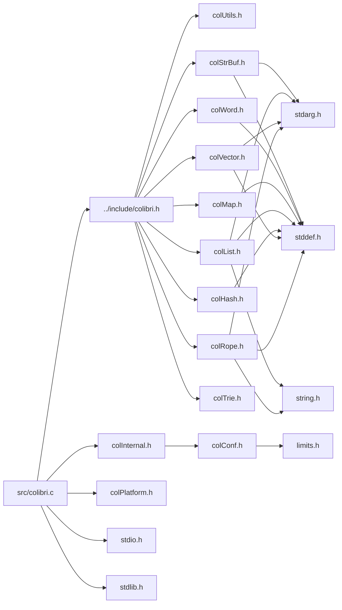

<a id="colibri_8c"></a>
# File colibri.c

![][C++]

**Location**: `src/colibri.c`

This file implements the string, initialization/cleanup, and error handling functions.

**See also**: [colibri.h](colibri_8h.md#colibri_8h)

## Includes

* [../include/colibri.h](colibri_8h.md#colibri_8h)
* [colInternal.h](col_internal_8h.md#col_internal_8h)
* [colPlatform.h](col_platform_8h.md#col_platform_8h)
* <stdio.h>
* <stdlib.h>



## Character Data Chunk Access

<a id="group__strings_1ga7307a6191008261c48032847bd7795db"></a>
### Function Col\_Utf8Addr

![][public]

```cpp
const Col_Char1 * Col_Utf8Addr(const Col_Char1 *data, size_t index, size_t length, size_t byteLength)
```

Find the index-th char in a UTF-8 sequence.

Iterate over char boundaries from the beginning or end of the string, whichever is closest, until the char is reached.


!> **Attention** \
We assume that UTF-8 data is always well-formed. It is the caller responsibility to validate and ensure well-formedness of UTF-8 data, notably for security reasons.


**Returns**:

Pointer to the character.


**Parameters**:

* const [Col\_Char1](colibri_8h.md#group__strings_1ga961d5ffde8aa1fba42d4b669a6199e76) * **data**: UTF-8 code unit sequence.
* size_t **index**: Index of char to find.
* size_t **length**: Char length of sequence.
* size_t **byteLength**: Byte length of sequence.

**Return type**: EXTERN const [Col\_Char1](colibri_8h.md#group__strings_1ga961d5ffde8aa1fba42d4b669a6199e76) *

**References**:

* [Col\_Utf8Next](colibri_8h.md#group__strings_1ga2fa6a9667e4b8e840c3a787f57754f87)
* [Col\_Utf8Prev](colibri_8h.md#group__strings_1ga84eeec1507e04c1bce7743bde002b660)

**Referenced by**:

* [Col\_TraverseRopeChunks](col_rope_8h.md#group__rope__words_1ga1a0bffff5bb042717914fadb3e8501bb)
* [Col\_TraverseRopeChunksN](col_rope_8h.md#group__rope__words_1ga6cc41b66caa3cbce177085b49ec0139e)
* [ColRopeIterUpdateTraversalInfo](col_rope_8h.md#group__rope__words_1ga9c738d41b3d8577f7cdd0fa1880f9143)
* [GetChunk](col_rope_8c.md#group__rope__words_1gaf91ffc7dc85abe202e6c6946f27f3b06)

<a id="group__strings_1ga4676e48a2cf0edaa609475081f9c33bd"></a>
### Function Col\_Utf8Get

![][public]

```cpp
Col_Char Col_Utf8Get(const Col_Char1 *data)
```

Get the first character codepoint of a UTF-8 sequence.

**Returns**:

32-bit Unicode codepoint of the char.


**Parameters**:

* const [Col\_Char1](colibri_8h.md#group__strings_1ga961d5ffde8aa1fba42d4b669a6199e76) * **data**: UTF-8 code unit sequence.

**Return type**: EXTERN [Col\_Char](colibri_8h.md#group__strings_1gab42ee0cd75b78280e412fa5bae5eb862)

**References**:

* [COL\_CHAR\_INVALID](colibri_8h.md#group__strings_1ga7d5dc9bdb8de819c861ee5d4a3300ae1)

<a id="group__strings_1gafcfc9b9efa5d66494625e7575a175032"></a>
### Function Col\_Utf8Set

![][public]

```cpp
Col_Char1 * Col_Utf8Set(Col_Char1 *data, Col_Char c)
```

Append character in a UTF-8 sequence.

**Returns**:

Position just past the newly added character in sequence.


**Parameters**:

* [Col\_Char1](colibri_8h.md#group__strings_1ga961d5ffde8aa1fba42d4b669a6199e76) * **data**: UTF-8 code unit sequence.
* [Col\_Char](colibri_8h.md#group__strings_1gab42ee0cd75b78280e412fa5bae5eb862) **c**: Character to write.

**Return type**: EXTERN [Col\_Char1](colibri_8h.md#group__strings_1ga961d5ffde8aa1fba42d4b669a6199e76) *

**Referenced by**:

* [Utf8CopyDataProc](col_rope_8c.md#group__rope__words_1gabea358803d83ed946db99def78568831)

<a id="group__strings_1ga2fa6a9667e4b8e840c3a787f57754f87"></a>
### Function Col\_Utf8Next

![][public]

```cpp
const Col_Char1 * Col_Utf8Next(const Col_Char1 *data)
```

Get next character in a UTF-8 sequence.

**Returns**:

Position just past the first character in sequence.


**Parameters**:

* const [Col\_Char1](colibri_8h.md#group__strings_1ga961d5ffde8aa1fba42d4b669a6199e76) * **data**: UTF-8 code unit sequence.

**Return type**: EXTERN const [Col\_Char1](colibri_8h.md#group__strings_1ga961d5ffde8aa1fba42d4b669a6199e76) *

**Referenced by**:

* [Col\_NewRope](col_rope_8h.md#group__rope__words_1gadf89e360729ba5052887cd4897b0167f)
* [Col\_RopeIterForward](col_rope_8h.md#group__rope__words_1ga93ee7c122f7d88a9188503820870923b)
* [Col\_Utf8Addr](colibri_8h.md#group__strings_1ga7307a6191008261c48032847bd7795db)

<a id="group__strings_1ga84eeec1507e04c1bce7743bde002b660"></a>
### Function Col\_Utf8Prev

![][public]

```cpp
const Col_Char1 * Col_Utf8Prev(const Col_Char1 *data)
```

Get previous character in a UTF-8 sequence.

This is done by skipping all continuation code units.


**Returns**:

Position of the previous character in sequence.


**Parameters**:

* const [Col\_Char1](colibri_8h.md#group__strings_1ga961d5ffde8aa1fba42d4b669a6199e76) * **data**: UTF-8 code unit sequence.

**Return type**: EXTERN const [Col\_Char1](colibri_8h.md#group__strings_1ga961d5ffde8aa1fba42d4b669a6199e76) *

**Referenced by**:

* [Col\_NewRope](col_rope_8h.md#group__rope__words_1gadf89e360729ba5052887cd4897b0167f)
* [Col\_RopeIterBackward](col_rope_8h.md#group__rope__words_1ga9e142ef15460061aa676e800bcb9030b)
* [Col\_Utf8Addr](colibri_8h.md#group__strings_1ga7307a6191008261c48032847bd7795db)

<a id="group__strings_1ga54bd05a8b6bb3ee30245b51a8e3849f3"></a>
### Function Col\_Utf16Addr

![][public]

```cpp
const Col_Char2 * Col_Utf16Addr(const Col_Char2 *data, size_t index, size_t length, size_t byteLength)
```

Find the index-th char in a UTF-16 code unit sequence.

Iterate over char boundaries from the beginning or end of the string, whichever is closest, until the char is reached.


!> **Attention** \
We assume that UTF-16 data is always well-formed. It is the caller responsibility to validate and ensure well-formedness of UTF-16 data, notably for security reasons.


**Returns**:

Pointer to the character.


**Parameters**:

* const [Col\_Char2](colibri_8h.md#group__strings_1ga8fc4ecea7142d5fecd3adcbcc35fb920) * **data**: UTF-16 code unit sequence.
* size_t **index**: Index of char to find.
* size_t **length**: Char length of sequence.
* size_t **byteLength**: Byte length of sequence.

**Return type**: EXTERN const [Col\_Char2](colibri_8h.md#group__strings_1ga8fc4ecea7142d5fecd3adcbcc35fb920) *

**References**:

* [Col\_Utf16Next](colibri_8h.md#group__strings_1ga8996e8aad9616731b75cd6b66c9f57f7)
* [Col\_Utf16Prev](colibri_8h.md#group__strings_1ga674a0094a0990b74f91717c8970903bd)

**Referenced by**:

* [Col\_TraverseRopeChunks](col_rope_8h.md#group__rope__words_1ga1a0bffff5bb042717914fadb3e8501bb)
* [Col\_TraverseRopeChunksN](col_rope_8h.md#group__rope__words_1ga6cc41b66caa3cbce177085b49ec0139e)
* [ColRopeIterUpdateTraversalInfo](col_rope_8h.md#group__rope__words_1ga9c738d41b3d8577f7cdd0fa1880f9143)
* [GetChunk](col_rope_8c.md#group__rope__words_1gaf91ffc7dc85abe202e6c6946f27f3b06)

<a id="group__strings_1ga4011f8814d933eb2aa977fbcfae64bcc"></a>
### Function Col\_Utf16Get

![][public]

```cpp
Col_Char Col_Utf16Get(const Col_Char2 *data)
```

Get the first character codepoint of a UTF-16 sequence.

**Returns**:

Unicode codepoint of the char.


**Parameters**:

* const [Col\_Char2](colibri_8h.md#group__strings_1ga8fc4ecea7142d5fecd3adcbcc35fb920) * **data**: UTF-16 code unit sequence.

**Return type**: EXTERN [Col\_Char](colibri_8h.md#group__strings_1gab42ee0cd75b78280e412fa5bae5eb862)

<a id="group__strings_1ga89b26b7e1327b5b96c088c3ed4263abe"></a>
### Function Col\_Utf16Set

![][public]

```cpp
Col_Char2 * Col_Utf16Set(Col_Char2 *data, Col_Char c)
```

Append character in a UTF-16 sequence.

**Returns**:

Position just past the newly added character in sequence.


**Parameters**:

* [Col\_Char2](colibri_8h.md#group__strings_1ga8fc4ecea7142d5fecd3adcbcc35fb920) * **data**: UTF-16 code unit sequence.
* [Col\_Char](colibri_8h.md#group__strings_1gab42ee0cd75b78280e412fa5bae5eb862) **c**: Character to write.

**Return type**: EXTERN [Col\_Char2](colibri_8h.md#group__strings_1ga8fc4ecea7142d5fecd3adcbcc35fb920) *

**Referenced by**:

* [Utf16CopyDataProc](col_rope_8c.md#group__rope__words_1gaf089cd3a00689db3e9600b46c21f2867)

<a id="group__strings_1ga8996e8aad9616731b75cd6b66c9f57f7"></a>
### Function Col\_Utf16Next

![][public]

```cpp
const Col_Char2 * Col_Utf16Next(const Col_Char2 *data)
```

Get next character in a UTF-16 sequence.

**Returns**:

Position just past the first character in sequence.


**Parameters**:

* const [Col\_Char2](colibri_8h.md#group__strings_1ga8fc4ecea7142d5fecd3adcbcc35fb920) * **data**: UTF-16 code unit sequence.

**Return type**: EXTERN const [Col\_Char2](colibri_8h.md#group__strings_1ga8fc4ecea7142d5fecd3adcbcc35fb920) *

**Referenced by**:

* [Col\_NewRope](col_rope_8h.md#group__rope__words_1gadf89e360729ba5052887cd4897b0167f)
* [Col\_RopeIterForward](col_rope_8h.md#group__rope__words_1ga93ee7c122f7d88a9188503820870923b)
* [Col\_Utf16Addr](colibri_8h.md#group__strings_1ga54bd05a8b6bb3ee30245b51a8e3849f3)

<a id="group__strings_1ga674a0094a0990b74f91717c8970903bd"></a>
### Function Col\_Utf16Prev

![][public]

```cpp
const Col_Char2 * Col_Utf16Prev(const Col_Char2 *data)
```

Get previous character in a UTF-16 sequence.

This is done by skipping all low surrogate code units.


**Returns**:

Position of the previous character in sequence.


**Parameters**:

* const [Col\_Char2](colibri_8h.md#group__strings_1ga8fc4ecea7142d5fecd3adcbcc35fb920) * **data**: UTF-16 code unit sequence.

**Return type**: EXTERN const [Col\_Char2](colibri_8h.md#group__strings_1ga8fc4ecea7142d5fecd3adcbcc35fb920) *

**Referenced by**:

* [Col\_NewRope](col_rope_8h.md#group__rope__words_1gadf89e360729ba5052887cd4897b0167f)
* [Col\_RopeIterBackward](col_rope_8h.md#group__rope__words_1ga9e142ef15460061aa676e800bcb9030b)
* [Col\_Utf16Addr](colibri_8h.md#group__strings_1ga54bd05a8b6bb3ee30245b51a8e3849f3)

## Initialization/Cleanup Functions

<a id="group__init_1ga715049d7eb10ff0eeac38b457ef4fce1"></a>
### Function Col\_Init

![][public]

```cpp
void Col_Init(unsigned int model)
```

Initialize the library.

Must be called in every thread.


**Side Effect**:

Initialize the memory allocator & garbage collector.


**See also**: [Threading Model Constants](#group__init_1threading_models)


**Parameters**:

* unsigned int **model**: Threading model.

**Return type**: EXTERN void

**References**:

* [PlatEnter](col_platform_8h.md#group__arch_1gaa42fe97b4b462c9483110a715c1eb1d1)

<a id="group__init_1gaaa7addef72eaac5fb58f6edb449fda75"></a>
### Function Col\_Cleanup

![][public]

```cpp
void Col_Cleanup()
```

Cleanup the library.

Must be called in every thread.


**Side Effect**:

Cleanup the memory allocator & garbage collector.


**Parameters**:

* void

**Return type**: EXTERN void

**References**:

* [PlatLeave](col_platform_8h.md#group__arch_1gaf70aa9db460d666ff9a09610dda183ef)

## Generic Error Handling

<a id="group__error_1ga9a9a9c96b23c489cf8a19a6248fc77b8"></a>
### Function Col\_Error

![][public]

```cpp
void Col_Error(Col_ErrorLevel level, Col_ErrorDomain domain, int code, ...)
```

Signal an error condition.

!> **Attention** \
Default implementation exits the processus when level is [COL\_FATAL](colibri_8h.md#group__error_1gga6dab009a0b8c4b4fa080cb9ba1859e9ea47572f7e362007f7b266dbe79e778b27) or [COL\_ERROR](colibri_8h.md#group__error_1gga6dab009a0b8c4b4fa080cb9ba1859e9eae8345daddd8d5e83225f9f88d302f1a0).


**See also**: [Col\_SetErrorProc](colibri_8h.md#group__error_1ga024ea9d85177427fc412c3e469cc1169), [Col\_ErrorDomain](colibri_8h.md#group__error_1gaf729acbb7ac74baf6d7a95bed1431abf)


**Parameters**:

* [Col\_ErrorLevel](colibri_8h.md#group__error_1ga6dab009a0b8c4b4fa080cb9ba1859e9e) **level**: Error level.
* [Col\_ErrorDomain](colibri_8h.md#group__error_1gaf729acbb7ac74baf6d7a95bed1431abf) **domain**: Error domain.
* int **code**: Error code.
* ......: Remaining arguments passed to domain proc.

**Return type**: EXTERN void

**References**:

* [COL\_ERROR](colibri_8h.md#group__error_1gga6dab009a0b8c4b4fa080cb9ba1859e9eae8345daddd8d5e83225f9f88d302f1a0)
* [COL\_FATAL](colibri_8h.md#group__error_1gga6dab009a0b8c4b4fa080cb9ba1859e9ea47572f7e362007f7b266dbe79e778b27)
* [COL\_TYPECHECK](colibri_8h.md#group__error_1gga6dab009a0b8c4b4fa080cb9ba1859e9ea603a58b9d5bb16fde0708eb0767e4904)
* [COL\_VALUECHECK](colibri_8h.md#group__error_1gga6dab009a0b8c4b4fa080cb9ba1859e9ea65d5e7232c82ae6972ac56f386a32fc9)
* [ThreadData::errorProc](struct_thread_data.md#struct_thread_data_1ad815732e363271be15dce0015abfc8ae)
* [PlatGetThreadData](col_unix_platform_8h.md#group__arch__unix_1ga6964b3c4d4787a9defb7aae57825d92c)

**Referenced by**:

* [PoolAllocCells](col_alloc_8c.md#group__alloc_1gafd84f35bab195e5e45a3338903dbd837)
* [SysPageAlloc](col_alloc_8c.md#group__alloc_1ga9318fd94abe19ee6d962cacb9d08830f)
* [SysPageFree](col_alloc_8c.md#group__alloc_1gae87fa6ec29c10f180f511dfd1213fe5f)
* [SysPageProtect](col_alloc_8c.md#group__alloc_1ga35a37fb9d22a879405b65f3e90d09358)
* [SysPageTrim](col_alloc_8c.md#group__alloc_1ga16a9361484b90e5202862b29a03cb958)

<a id="group__error_1ga4decc218875475a0d74c0ed694060157"></a>
### Function Col\_GetErrorProc

![][public]

```cpp
Col_ErrorProc * Col_GetErrorProc()
```

Get the thread's custom error proc.

**Returns**:

The current error proc (may be NULL).


**See also**: [Col\_Error](colibri_8h.md#group__error_1ga9a9a9c96b23c489cf8a19a6248fc77b8), [Col\_SetErrorProc](colibri_8h.md#group__error_1ga024ea9d85177427fc412c3e469cc1169)


**Return type**: EXTERN [Col\_ErrorProc](colibri_8h.md#group__error_1gac5151fd715c49a363324d700de68e176) *

**References**:

* [PlatGetThreadData](col_unix_platform_8h.md#group__arch__unix_1ga6964b3c4d4787a9defb7aae57825d92c)

<a id="group__error_1ga024ea9d85177427fc412c3e469cc1169"></a>
### Function Col\_SetErrorProc

![][public]

```cpp
Col_ErrorProc * Col_SetErrorProc(Col_ErrorProc *proc)
```

Set or reset the thread's custom error proc.

**Returns**:

The old error proc (may be NULL).


**See also**: [Col\_Error](colibri_8h.md#group__error_1ga9a9a9c96b23c489cf8a19a6248fc77b8), [Col\_GetErrorProc](colibri_8h.md#group__error_1ga4decc218875475a0d74c0ed694060157)


**Parameters**:

* [Col\_ErrorProc](colibri_8h.md#group__error_1gac5151fd715c49a363324d700de68e176) * **proc**: The new error proc (may be NULL).

**Return type**: EXTERN [Col\_ErrorProc](colibri_8h.md#group__error_1gac5151fd715c49a363324d700de68e176) *

**References**:

* [ThreadData::errorProc](struct_thread_data.md#struct_thread_data_1ad815732e363271be15dce0015abfc8ae)
* [PlatGetThreadData](col_unix_platform_8h.md#group__arch__unix_1ga6964b3c4d4787a9defb7aae57825d92c)

## Colibri Error Domain

<a id="group__error_1gac5f445b6764ff02059fb14b2fe3eec9c"></a>
### Function Col\_GetErrorDomain

![][public]

```cpp
Col_ErrorDomain Col_GetErrorDomain()
```

Get the domain for Colibri error codes.

**Returns**:

The domain.


**See also**: [Col\_Error](colibri_8h.md#group__error_1ga9a9a9c96b23c489cf8a19a6248fc77b8)


**Return type**: EXTERN [Col\_ErrorDomain](colibri_8h.md#group__error_1gaf729acbb7ac74baf6d7a95bed1431abf)

**References**:

* [ColibriDomain](colibri_8c.md#group__error_1gadf9c5202f89dd2ecc2aeee560f04ee4d)

## Variables

<a id="group__error_1gadf9c5202f89dd2ecc2aeee560f04ee4d"></a>
### Variable ColibriDomain

![][private]

**Definition**: `src/colibri.c` (line 389)

```cpp
const char* const ColibriDomain[][]
```

Domain for Colibri error codes.

Defines a message string for each code.


**See also**: [Col\_ErrorCode](colibri_8h.md#group__error_1ga729084542ed9eae62009a84d3379ef35)


**Type**: const char *const

**Referenced by**:

* [Col\_GetErrorDomain](colibri_8h.md#group__error_1gac5f445b6764ff02059fb14b2fe3eec9c)
* [PoolAllocCells](col_alloc_8c.md#group__alloc_1gafd84f35bab195e5e45a3338903dbd837)
* [SysPageAlloc](col_alloc_8c.md#group__alloc_1ga9318fd94abe19ee6d962cacb9d08830f)
* [SysPageFree](col_alloc_8c.md#group__alloc_1gae87fa6ec29c10f180f511dfd1213fe5f)
* [SysPageProtect](col_alloc_8c.md#group__alloc_1ga35a37fb9d22a879405b65f3e90d09358)
* [SysPageTrim](col_alloc_8c.md#group__alloc_1ga16a9361484b90e5202862b29a03cb958)

## Source

```cpp
/**
 * @file colibri.c
 *
 * This file implements the string, initialization/cleanup, and error
 * handling functions.
 *
 * @see colibri.h
 */

#include "../include/colibri.h"
#include "colInternal.h"
#include "colPlatform.h"

#include <stdio.h>
#include <stdlib.h>


/*
===========================================================================*//*!
\weakgroup strings Strings
\{*//*==========================================================================
*/

/*******************************************************************************
 * Character Data Chunk Access
 ******************************************************************************/

/**
 * Find the index-th char in a UTF-8 sequence.
 *
 * Iterate over char boundaries from the beginning or end of the string,
 * whichever is closest, until the char is reached.
 *
 * @attention
 *      We assume that UTF-8 data is always well-formed. It is the caller
 *      responsibility to validate and ensure well-formedness of UTF-8 data,
 *      notably for security reasons.
 *
 * @return Pointer to the character.
 */
const Col_Char1 *
Col_Utf8Addr(
    const Col_Char1 * data, /*!< UTF-8 code unit sequence. */
    size_t index,           /*!< Index of char to find. */
    size_t length,          /*!< Char length of sequence. */
    size_t byteLength)      /*!< Byte length of sequence. */
{
    /*
     * Don't check bounds; assume input values are OK.
     */

    if (byteLength == length * sizeof(*data)) {
        /*
         * No variable-width sequence, use simple arithmetics instead
         * of character iteration.
         */

        return data + index;
    }
    if (index <= length/2) {
        /*
         * First half; search from beginning.
         */

        size_t i = 0;
        while (i != index) {
            i++;        /* Increment char index. */
            data = Col_Utf8Next(data);
        }
        return data;
    } else {
        /*
         * Second half; search backwards from end.
         */

        size_t i = length;
        data = (const Col_Char1 *) ((const char *) data + byteLength);
        while (i != index) {
            i--;        /* Decrement char index. */
            data = Col_Utf8Prev(data);
        }
        return data;
    }
}

/**
 * Get the first character codepoint of a UTF-8 sequence.
 *
 * @return 32-bit Unicode codepoint of the char.
 */
Col_Char
Col_Utf8Get(
    const Col_Char1 * data) /*!< UTF-8 code unit sequence. */
{
    if (*data <= 0x7F) {
        /*
         * Single byte, 0-7F codepoints.
         */

        return *data;
    } else if (*data <= 0xDF) {
        /*
         * 2-byte sequence, 80-7FF codepoints.
         */

        return   ((data[0] & 0x1F) << 6)
               |  (data[1] & 0x3F);
    } else if (*data <= 0xEF) {
        /*
         * 3-byte sequence, 800-FFFF codepoints.
         */

        return   ((data[0] & 0x0F) << 12)
               | ((data[1] & 0x3F) << 6)
               |  (data[2] & 0x3F);
    } else if (*data <= 0xF7) {
        /*
         * 4-byte sequence, 10000-1FFFFF codepoints.
         */

        return   ((data[0] & 0x07) << 18)
               | ((data[1] & 0x3F) << 12)
               | ((data[2] & 0x3F) << 6)
               |  (data[3] & 0x3F);
    }

    /*
     * Invalid sequence.
     */

    return COL_CHAR_INVALID;
}

/**
 * Append character in a UTF-8 sequence.
 *
 * @return Position just past the newly added character in sequence.
 */
Col_Char1 *
Col_Utf8Set(
    Col_Char1 * data,   /*!< UTF-8 code unit sequence. */
    Col_Char c)         /*!< Character to write. */
{
    if (c <= 0x7F) {
        *data++ = (Col_Char1) c;
    } else if (c <= 0x7FF) {
        *data++ = (Col_Char1) (((c>>6)&0x1F)|0xC0);
        *data++ = (Col_Char1) (( c    &0x3F)|0x80);
    } else if (c <= 0xD7FF || (c >= 0xE000 && c <= 0xFFFF)) {
        *data++ = (Col_Char1) (((c>>12)&0x1F)|0xE0);
        *data++ = (Col_Char1) (((c>> 6)&0x3F)|0x80);
        *data++ = (Col_Char1) (( c     &0x3F)|0x80);
    } else if (c >= 0x10000 && c <= 0x10FFFF) {
        *data++ = (Col_Char1) (((c>>18)&0x1F)|0xF0);
        *data++ = (Col_Char1) (((c>>12)&0x3F)|0x80);
        *data++ = (Col_Char1) (((c>> 6)&0x3F)|0x80);
        *data++ = (Col_Char1) (( c     &0x3F)|0x80);
    }

    return data;
}

/**
 * Get next character in a UTF-8 sequence.
 *
 * @return Position just past the first character in sequence.
 */
const Col_Char1 *
Col_Utf8Next(
    const Col_Char1 * data) /*!< UTF-8 code unit sequence. */
{
    return data + (
          (((*data) & 0xE0) == 0xC0) ?  2 \
        : (((*data) & 0xF0) == 0xE0) ?  3 \
        : (((*data) & 0xF8) == 0xF0) ?  4 \
        :                               1 );
}

/**
 * Get previous character in a UTF-8 sequence. This is done by skipping
 * all continuation code units.
 *
 * @return Position of the previous character in sequence.
 */
const Col_Char1 *
Col_Utf8Prev(
    const Col_Char1 * data) /*!< UTF-8 code unit sequence. */
{
    while (((*--data) & 0xC0) == 0x80);
    return data;
}

/**
 * Find the index-th char in a UTF-16 code unit sequence.
 *
 * Iterate over char boundaries from the beginning or end of the string,
 * whichever is closest, until the char is reached.
 *
 * @attention
 *      We assume that UTF-16 data is always well-formed. It is the caller
 *      responsibility to validate and ensure well-formedness of UTF-16 data,
 *      notably for security reasons.
 *
 * @return Pointer to the character.
 */
const Col_Char2 *
Col_Utf16Addr(
    const Col_Char2 * data, /*!< UTF-16 code unit sequence. */
    size_t index,           /*!< Index of char to find. */
    size_t length,          /*!< Char length of sequence. */
    size_t byteLength)      /*!< Byte length of sequence. */
{
    /*
     * Don't check bounds; assume input values are OK.
     */

    if (byteLength == length * sizeof(*data)) {
        /*
         * No variable-width sequence, use simple arithmetics instead
         * of character iteration.
         */

        return data + index;
    }
    if (index <= length/2) {
        /*
         * First half; search from beginning.
         */

        size_t i = 0;
        while (i != index) {
            i++;        /* Increment char index. */
            data = Col_Utf16Next(data);
        }
        return data;
    } else {
        /*
         * Second half; search backwards from end.
         */

        size_t i = length;
        data = (const Col_Char2 *) ((const char *) data + byteLength);
        while (i != index) {
            i--;        /* Decrement char index. */
            data = Col_Utf16Prev(data);
        }
        return data;
    }
}

/**
 * Get the first character codepoint of a UTF-16 sequence.
 *
 * @return Unicode codepoint of the char.
 */
Col_Char
Col_Utf16Get(
    const Col_Char2 * data) /*!< UTF-16 code unit sequence. */
{
    if ((data[0] & 0xFC00) == 0xD800 && (data[1] & 0xFC00) == 0xDC00) {
        /*
         * Surrogate pair.
         */

        return   (  ((data[0] & 0x3FF) << 10)
                  |  (data[1] & 0x3FF))
               + 0x10000;
    } else {
        /*
         * Single codepoint.
         */

        return *data;
    }
}

/**
 * Append character in a UTF-16 sequence.
 *
 * @return Position just past the newly added character in sequence.
 */
Col_Char2 *
Col_Utf16Set(
    Col_Char2 * data,   /*!< UTF-16 code unit sequence. */
    Col_Char c)         /*!< Character to write. */
{
    if (c <= 0xD7FF || (c >= 0xE000 && c <= 0xFFFF)) {
        *data++ = (Col_Char2) c;
    } else if (c >= 0x10000 && c <= 0x10FFFF) {
        *data++ = (Col_Char2) ((((c-0x10000)>>10)&0x3FF)+0xD800);
        *data++ = (Col_Char2) (( (c-0x10000)     &0x3FF)+0xDC00);
    }

    return data;
}

/**
 * Get next character in a UTF-16 sequence.
 *
 * @return Position just past the first character in sequence.
 */
const Col_Char2 *
Col_Utf16Next(
    const Col_Char2 * data) /*!< UTF-16 code unit sequence. */
{
    return data + (
          (((*data) & 0xFC00) == 0xD800) ?  2 \
        :                                   1 );
}

/**
 * Get previous character in a UTF-16 sequence. This is done by skipping
 * all low surrogate code units.
 *
 * @return Position of the previous character in sequence.
 */
const Col_Char2 *
Col_Utf16Prev(
    const Col_Char2 * data) /*!< UTF-16 code unit sequence. */
{
    while (((*--data) & 0xFC00) == 0xDC00);
    return data;
}

/* End of Character Data Chunk Access */

/* End of Strings *//*!\}*/


/*
===========================================================================*//*!
\weakgroup init Initialization/Cleanup
\{*//*==========================================================================
*/

/*******************************************************************************
 * Initialization/Cleanup Functions
 ******************************************************************************/

/**
 * Initialize the library. Must be called in every thread.
 *
 * @sideeffect
 *      Initialize the memory allocator & garbage collector.
 *
 * @see @ref threading_models "Threading Model Constants"
 */
void
Col_Init(
    unsigned int model) /*!< Threading model. */
{
    PlatEnter(model);
}

/**
 * Cleanup the library. Must be called in every thread.
 *
 * @sideeffect
 *      Cleanup the memory allocator & garbage collector.
 */
void
Col_Cleanup()
{
    PlatLeave();
}

/* End of Initialization/Cleanup Functions */

/* End of Initialization/Cleanup *//*!\}*/


/*
===========================================================================*//*!
\weakgroup error Error Handling & Debugging
\{*//*==========================================================================
*/

/*******************************************************************************
 * Generic Error Handling
 ******************************************************************************/

/** @beginprivate @cond PRIVATE */

/**
 * Domain for Colibri error codes. Defines a message string for each code.
 *
 * @see Col_ErrorCode
 */
const char * const ColibriDomain[] = {
    "Generic error: %s",                        /* COL_ERROR_GENERIC (message) */
    "%s(%d) : assertion failed! (%s)",          /* COL_ERROR_ASSERTION (file, line, expression) */
    "Memory error: %s",                         /* COL_ERROR_MEMORY */
    "Called outside of a GC-protected section", /* COL_ERROR_GCPROTECT */
    "%x is not a boolean word",                 /* COL_ERROR_BOOL (word) */
    "%x is not an integer word",                /* COL_ERROR_INT (word) */
    "%x is not a floating point word",          /* COL_ERROR_FLOAT (word) */
    "%x is not a custom word",                  /* COL_ERROR_CUSTOMWORD (word) */
    "%x is not a character word",               /* COL_ERROR_CHAR (word) */
    "%x is not a string word",                  /* COL_ERROR_STRING (word) */
    "%x is not a rope",                         /* COL_ERROR_ROPE (word) */
    "Rope index %u out of bounds (length=%u)",  /* COL_ERROR_ROPEINDEX (index, length) */
    "Combined length %u+%u exceeds the maximum"
        " allowed value %u",                    /* COL_ERROR_ROPELENGTH_CONCAT (length1, length2, maxLength)     */
    "Length %u times %u exceeds the maximum"
        " allowed value %u",                    /* COL_ERROR_ROPELENGTH_REPEAT (length, count, maxLength) */
    "Rope iterator %x is not valid",            /* COL_ERROR_ROPEITER (iterator) */
    "Rope iterator %x is at end",               /* COL_ERROR_ROPEITER_END (iterator) */
    "%x is not a vector",                       /* COL_ERROR_VECTOR (word) */
    "%x is not a mutable vector",               /* COL_ERROR_MVECTOR (word) */
    "Vector length %u exceeds maximum value"
        " %u",                                  /* COL_ERROR_VECTORLENGTH (length, maxLength) */
    "%x is not a list",                         /* COL_ERROR_LIST (word) */
    "%x is not a mutable list",                 /* COL_ERROR_MLIST (word) */
    "List index %u out of bounds (length=%u)",  /* COL_ERROR_LISTINDEX (index, length) */
    "Combined length %u+%u exceeds the maximum"
        " allowed value %u",                    /* COL_ERROR_LISTLENGTH_CONCAT (length1, length2, maxLength)     */
    "Length %u times %u exceeds the maximum"
        " allowed value %u",                    /* COL_ERROR_LISTLENGTH_REPEAT (length, count, maxLength) */
    "List iterator %x is not valid",            /* COL_ERROR_LISTITER (iterator) */
    "List iterator %x is at end",               /* COL_ERROR_LISTITER_END (iterator) */
    "%x is not a map",                          /* COL_ERROR_MAP (word) */
    "%x is not a string or custom map",         /* COL_ERROR_WORDMAP (word) */
    "%x is not an integer map",                 /* COL_ERROR_INTMAP (word) */
    "%x is not a hash map",                     /* COL_ERROR_HASHMAP (word) */
    "%x is not a string or custom hash map",    /* COL_ERROR_WORDHASHMAP (word) */
    "%x is not an integer hash map",            /* COL_ERROR_INTHASHMAP (word) */
    "%x is not a trie map",                     /* COL_ERROR_TRIEMAP (word) */
    "%x is not a string or custom trie map",    /* COL_ERROR_WORDTRIEMAP (word) */
    "%x is not an integer trie map",            /* COL_ERROR_INTTRIEMAP (word) */
    "Map iterator %x is not valid",             /* COL_ERROR_MAPITER (iterator) */
    "Map iterator %x is at end",                /* COL_ERROR_MAPITER_END (iterator) */
    "%x is not a string buffer",                /* COL_ERROR_STRBUF (word) */
    "String format %d is not supported",        /* COL_ERROR_STRBUF_FORMAT (format) */
};

/** @endcond @endprivate */

/**
 * Signal an error condition.
 *
 * @attention
 *      Default implementation exits the processus when level is #COL_FATAL
 *      or #COL_ERROR.
 *
 * @see Col_SetErrorProc
 * @see Col_ErrorDomain
 */
void
Col_Error(
    Col_ErrorLevel level,   /*!< Error level. */
    Col_ErrorDomain domain, /*!< Error domain. */
    int code,               /*!< Error code. */
    ...)                    /*!< Remaining arguments passed to domain proc. */
{
    va_list args;
    ThreadData *data = PlatGetThreadData();

    va_start(args, code);
    if (data->errorProc) {
        /*
         * Call custom proc.
         */

        if ((data->errorProc)(level, domain, code, args)) {
            /*
             * Stop processing.
             */

            va_end(args);
            return;
        }
    }

    /*
     * Process error.
     */

    /*
     * Prefix with error level.
     */

    switch (level) {
    case COL_FATAL:      fprintf(stderr, "[FATAL] ");          break;
    case COL_ERROR:      fprintf(stderr, "[ERROR] ");          break;
    case COL_TYPECHECK:  fprintf(stderr, "[TYPECHECK] ");      break;
    case COL_VALUECHECK: fprintf(stderr, "[VALUECHECK] ");     break;
    default:             fprintf(stderr, "[LEVEL%d] ", level); break;
    }

    /*
     * Domain-specific error messages.
     */

    vfprintf(stderr, domain[code], args);

    fprintf(stderr, "\n");
    fflush(stderr);
    va_end(args);

    switch (level) {
    case COL_FATAL:
    case COL_ERROR:
        abort();
        break;
    }
}

/**
 * Get the thread's custom error proc.
 *
 * @return The current error proc (may be NULL).
 * 
 * @see Col_Error
 * @see Col_SetErrorProc
 */
Col_ErrorProc *
Col_GetErrorProc()
{
    return PlatGetThreadData()->errorProc;
}

/**
 * Set or reset the thread's custom error proc.
 *
 * @return The old error proc (may be NULL).
 * 
 * @see Col_Error
 * @see Col_GetErrorProc
 */
Col_ErrorProc *
Col_SetErrorProc(
    Col_ErrorProc *proc)    /*!< The new error proc (may be NULL). */
{
    ThreadData *data = PlatGetThreadData();
    Col_ErrorProc *oldProc = data->errorProc;
    data->errorProc = proc;
    return oldProc;
}

/* End of Generic Error Handling */


/*******************************************************************************
 * Colibri Error Domain
 ******************************************************************************/

/**
 * Get the domain for Colibri error codes.
 *
 * @return The domain.
 *
 * @see Col_Error
 */
Col_ErrorDomain
Col_GetErrorDomain()
{
    return ColibriDomain;
}

/* End of Colibri Error Domain */

/* End of Error Handling & Debugging *//*!\}*/
```

[public]: https://img.shields.io/badge/-public-brightgreen (public)
[C++]: https://img.shields.io/badge/language-C%2B%2B-blue (C++)
[private]: https://img.shields.io/badge/-private-red (private)
[Markdown]: https://img.shields.io/badge/language-Markdown-blue (Markdown)