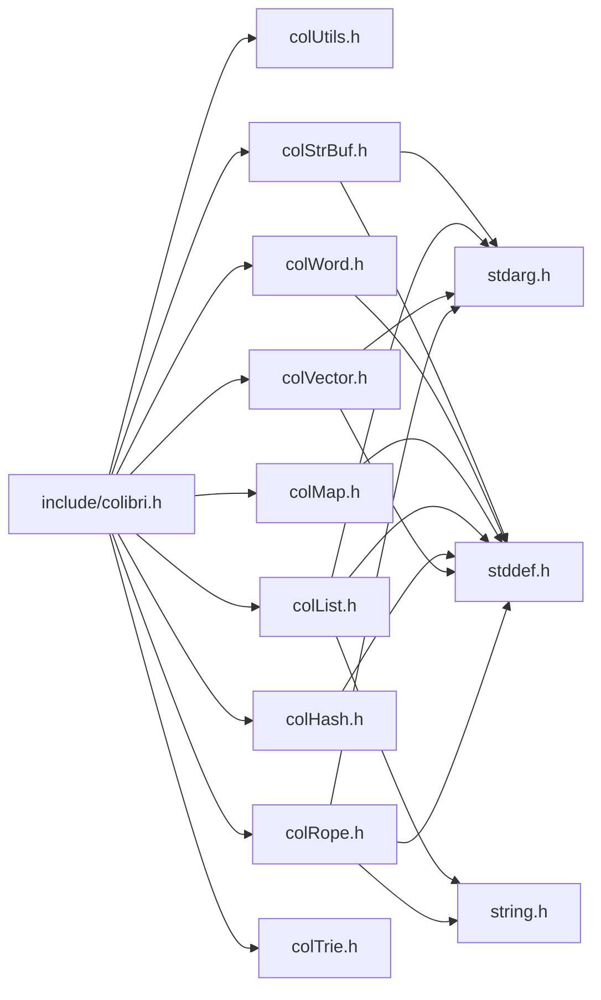
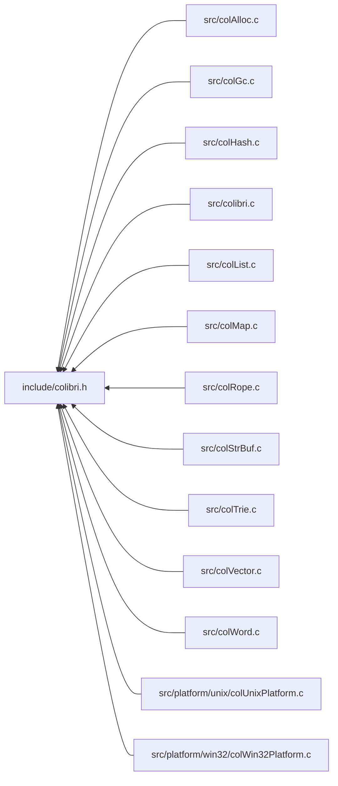

<a id="colibri_8h"></a>
# File colibri.h

![][C++]

**Location**: `include/colibri.h`

This header file defines the public API of the Colibri library.


## Includes

* [colUtils.h](col_utils_8h.md#col_utils_8h)
* [colWord.h](col_word_8h.md#col_word_8h)
* [colRope.h](col_rope_8h.md#col_rope_8h)
* [colStrBuf.h](col_str_buf_8h.md#col_str_buf_8h)
* [colVector.h](col_vector_8h.md#col_vector_8h)
* [colList.h](col_list_8h.md#col_list_8h)
* [colMap.h](col_map_8h.md#col_map_8h)
* [colHash.h](col_hash_8h.md#col_hash_8h)
* [colTrie.h](col_trie_8h.md#col_trie_8h)



## Included by

* [src/colAlloc.c](col_alloc_8c.md#col_alloc_8c)
* [src/colGc.c](col_gc_8c.md#col_gc_8c)
* [src/colHash.c](col_hash_8c.md#col_hash_8c)
* [src/colibri.c](colibri_8c.md#colibri_8c)
* [src/colList.c](col_list_8c.md#col_list_8c)
* [src/colMap.c](col_map_8c.md#col_map_8c)
* [src/colRope.c](col_rope_8c.md#col_rope_8c)
* [src/colStrBuf.c](col_str_buf_8c.md#col_str_buf_8c)
* [src/colTrie.c](col_trie_8c.md#col_trie_8c)
* [src/colVector.c](col_vector_8c.md#col_vector_8c)
* [src/colWord.c](col_word_8c.md#col_word_8c)
* [src/platform/unix/colUnixPlatform.c](col_unix_platform_8c.md#col_unix_platform_8c)
* [src/platform/win32/colWin32Platform.c](col_win32_platform_8c.md#col_win32_platform_8c)



## Basic String Types & Constants

<a id="group__strings_1ga7d5dc9bdb8de819c861ee5d4a3300ae1"></a>
### Macro COL\_CHAR\_INVALID

![][public]

```cpp
#define COL_CHAR_INVALID (([Col\_Char](colibri_8h.md#group__strings_1gab42ee0cd75b78280e412fa5bae5eb862)) -1)
```

Invalid Unicode character.

Used in error cases.


<a id="group__strings_1gae744cbeec6aaa53c56f5d30b035c2dde"></a>
### Macro COL\_CHAR\_MAX

![][public]

```cpp
#define COL_CHAR_MAX (([Col\_Char](colibri_8h.md#group__strings_1gab42ee0cd75b78280e412fa5bae5eb862)) 0x10FFFF)
```

Maximum Universal Character Set (UCS) codepoint.


<a id="group__strings_1gab5bcfc6f2e396458bfca5cc643248427"></a>
### Macro COL\_CHAR1\_MAX

![][public]

```cpp
#define COL_CHAR1_MAX 0xFF
```

Maximum UCS-1 codepoint.


<a id="group__strings_1ga20750ccf04ae493b5c1cf9a9c3406157"></a>
### Macro COL\_CHAR2\_MAX

![][public]

```cpp
#define COL_CHAR2_MAX 0xFFFF
```

Maximum UCS-2 codepoint.


<a id="group__strings_1ga20e78e7ab54a3612eb276410ae8fb541"></a>
### Macro COL\_CHAR4\_MAX

![][public]

```cpp
#define COL_CHAR4_MAX [COL\_CHAR\_MAX](colibri_8h.md#group__strings_1gae744cbeec6aaa53c56f5d30b035c2dde)
```

Maximum UCS-4 codepoint, same as [COL\_CHAR\_MAX](colibri_8h.md#group__strings_1gae744cbeec6aaa53c56f5d30b035c2dde).


<a id="group__strings_1ga31d95cca0dbddad6e0494c7f1ab11271"></a>
### Macro COL\_UTF8\_MAX\_WIDTH

![][public]

```cpp
#define COL_UTF8_MAX_WIDTH 4
```

Maximum width of character in UTF-8 code units.


<a id="group__strings_1gaf681f77d3737704a4283d1c6b20aaada"></a>
### Macro COL\_UTF8\_WIDTH

![][public]

```cpp
#define COL_UTF8_WIDTH     (  (c) <= 0x7F  ? 1 \
     : (c) <= 0x7FF ? 2 \
     : (c) <= 0xD7FF    ? 3 \
     : (c) <= 0xDFFF    ? 0 \
     : (c) <= 0xFFFF    ? 3 \
     : (c) <= 0x10FFFF  ? 4 \
     :            0 )( c )
```

Get width of character in UTF-8 code units.

**Parameters**:

* **c**: The character.


**Returns**:

Number of UTF-8 codepoints needed for the character (0 if invalid).


<a id="group__strings_1ga076f9d371bec86c5e4d2a9745bd8ff85"></a>
### Macro COL\_UTF16\_MAX\_WIDTH

![][public]

```cpp
#define COL_UTF16_MAX_WIDTH 2
```

Maximum width of character in UTF-16 code units.


<a id="group__strings_1gadfa1181197464d4368c9c70cd427586c"></a>
### Macro COL\_UTF16\_WIDTH

![][public]

```cpp
#define COL_UTF16_WIDTH     (  (c) <= 0xD7FF    ? 1 \
     : (c) <= 0xDFFF    ? 0 \
     : (c) <= 0xFFFF    ? 1 \
     : (c) <= 0x10FFFF  ? 2 \
     :            0 )( c )
```

Get width of character in UTF-16 code units.

**Parameters**:

* **c**: The character.


**Returns**:

Number of UTF-16 codepoints needed for the character (0 if invalid).


<a id="group__strings_1ga125054104f6260ea3902e6e46ebfdfa0"></a>
### Enumeration type Col\_StringFormat

![][public]

**Definition**: `include/colibri.h` (line 277)

```cpp
enum Col_StringFormat {
  COL_UCS1 =0x01,
  COL_UCS2 =0x02,
  COL_UCS4 =0x04,
  COL_UTF8 =0x11,
  COL_UTF16 =0x12
}
```

String formats.

!> **Attention** \
We assume that UTF-8/16 data is always well-formed. It is the caller responsibility to validate and ensure well-formedness of UTF-8/16 data, notably for security reasons.


?> Numeric values are chosen so that the lower 3 bits give the character width in the data chunk.


<a id="group__strings_1gga125054104f6260ea3902e6e46ebfdfa0a18ed97ba951a5d02c0a6e039445235b8"></a>
#### Enumerator COL\_UCS1

Fixed-width array of Col_Char1.


<a id="group__strings_1gga125054104f6260ea3902e6e46ebfdfa0ae43fbe04c500f0868e4b95a669a987e0"></a>
#### Enumerator COL\_UCS2

Fixed-width array of Col_Char2.


<a id="group__strings_1gga125054104f6260ea3902e6e46ebfdfa0af1d4922d36f7509d8936b0af29b0a9e4"></a>
#### Enumerator COL\_UCS4

Fixed-width array of Col_Char4.


<a id="group__strings_1gga125054104f6260ea3902e6e46ebfdfa0ac5f7c75663139add735ce90077cef306"></a>
#### Enumerator COL\_UTF8

UTF-8 variable width encoding.


<a id="group__strings_1gga125054104f6260ea3902e6e46ebfdfa0ad926084d627f96e4d65a353daef34854"></a>
#### Enumerator COL\_UTF16

UTF-16 variable width encoding.


<a id="group__strings_1gab42ee0cd75b78280e412fa5bae5eb862"></a>
### Typedef Col\_Char

![][public]

**Definition**: `include/colibri.h` (line 232)

```cpp
typedef uint32_t Col_Char
```

String characters use the 32-bit Unicode encoding.


**Return type**: uint32_t

<a id="group__strings_1ga961d5ffde8aa1fba42d4b669a6199e76"></a>
### Typedef Col\_Char1

![][public]

**Definition**: `include/colibri.h` (line 243)

```cpp
typedef uint8_t Col_Char1
```

1-byte UCS codepoint truncated to the lower 8 bits, i.e. Latin-1.


**Return type**: uint8_t

<a id="group__strings_1ga8fc4ecea7142d5fecd3adcbcc35fb920"></a>
### Typedef Col\_Char2

![][public]

**Definition**: `include/colibri.h` (line 245)

```cpp
typedef uint16_t Col_Char2
```

2-byte UCS-2 codepoint.


**Return type**: uint16_t

<a id="group__strings_1ga2eafc0c12affd9bdae281629460cfa73"></a>
### Typedef Col\_Char4

![][public]

**Definition**: `include/colibri.h` (line 247)

```cpp
typedef Col_Char Col_Char4
```

4-byte UCS-4/UTF-32 codepoint, same as [Col\_Char](colibri_8h.md#group__strings_1gab42ee0cd75b78280e412fa5bae5eb862).


**Return type**: [Col\_Char](colibri_8h.md#group__strings_1gab42ee0cd75b78280e412fa5bae5eb862)

## Character Data Chunk Access

<a id="group__strings_1ga9ac1e66190e6ee8fe700d14e0f47e45c"></a>
### Macro COL\_CHAR\_GET

![][public]

```cpp
#define COL_CHAR_GET     (  (format) == [COL\_UCS1](colibri_8h.md#group__strings_1gga125054104f6260ea3902e6e46ebfdfa0a18ed97ba951a5d02c0a6e039445235b8)  ?            *((const [Col\_Char1](colibri_8h.md#group__strings_1ga961d5ffde8aa1fba42d4b669a6199e76) *) (data)) \
     : (format) == [COL\_UCS2](colibri_8h.md#group__strings_1gga125054104f6260ea3902e6e46ebfdfa0ae43fbe04c500f0868e4b95a669a987e0)  ?            *((const [Col\_Char2](colibri_8h.md#group__strings_1ga8fc4ecea7142d5fecd3adcbcc35fb920) *) (data)) \
     : (format) == [COL\_UCS4](colibri_8h.md#group__strings_1gga125054104f6260ea3902e6e46ebfdfa0af1d4922d36f7509d8936b0af29b0a9e4)  ?            *((const [Col\_Char4](colibri_8h.md#group__strings_1ga2eafc0c12affd9bdae281629460cfa73) *) (data)) \
     : (format) == [COL\_UTF8](colibri_8h.md#group__strings_1gga125054104f6260ea3902e6e46ebfdfa0ac5f7c75663139add735ce90077cef306)  ? [Col\_Utf8Get](colibri_8h.md#group__strings_1ga4676e48a2cf0edaa609475081f9c33bd) ((const [Col\_Char1](colibri_8h.md#group__strings_1ga961d5ffde8aa1fba42d4b669a6199e76) *) (data)) \
     : (format) == [COL\_UTF16](colibri_8h.md#group__strings_1gga125054104f6260ea3902e6e46ebfdfa0ad926084d627f96e4d65a353daef34854) ? [Col\_Utf16Get](colibri_8h.md#group__strings_1ga4011f8814d933eb2aa977fbcfae64bcc)((const [Col\_Char2](colibri_8h.md#group__strings_1ga8fc4ecea7142d5fecd3adcbcc35fb920) *) (data)) \
     : [COL\_CHAR\_INVALID](colibri_8h.md#group__strings_1ga7d5dc9bdb8de819c861ee5d4a3300ae1))( format ,data )
```

Get current character in data chunk.

**Parameters**:

* **format**: Data format (see [Col\_StringFormat](colibri_8h.md#group__strings_1ga125054104f6260ea3902e6e46ebfdfa0)).
* **data**: Pointer to current character.


!> **Warning** \
Arguments are referenced several times by the macro. Make sure to avoid any side effect.


**Returns**:

Character codepoint.


<a id="group__strings_1gaf2cdba8d2bfb4a403ef3acc98da01b51"></a>
### Macro COL\_CHAR\_NEXT

![][public]

```cpp
#define COL_CHAR_NEXT     (data) = \
    (  (format) == [COL\_UCS1](colibri_8h.md#group__strings_1gga125054104f6260ea3902e6e46ebfdfa0a18ed97ba951a5d02c0a6e039445235b8)  ? (const char *) (data) + 1 \
     : (format) == [COL\_UCS2](colibri_8h.md#group__strings_1gga125054104f6260ea3902e6e46ebfdfa0ae43fbe04c500f0868e4b95a669a987e0)  ? (const char *) (data) + 2 \
     : (format) == [COL\_UCS4](colibri_8h.md#group__strings_1gga125054104f6260ea3902e6e46ebfdfa0af1d4922d36f7509d8936b0af29b0a9e4)  ? (const char *) (data) + 4 \
     : (format) == [COL\_UTF8](colibri_8h.md#group__strings_1gga125054104f6260ea3902e6e46ebfdfa0ac5f7c75663139add735ce90077cef306)  ? (const char *) [Col\_Utf8Next](colibri_8h.md#group__strings_1ga2fa6a9667e4b8e840c3a787f57754f87) ((const [Col\_Char1](colibri_8h.md#group__strings_1ga961d5ffde8aa1fba42d4b669a6199e76) *) (data)) \
     : (format) == [COL\_UTF16](colibri_8h.md#group__strings_1gga125054104f6260ea3902e6e46ebfdfa0ad926084d627f96e4d65a353daef34854) ? (const char *) [Col\_Utf16Next](colibri_8h.md#group__strings_1ga8996e8aad9616731b75cd6b66c9f57f7)((const [Col\_Char2](colibri_8h.md#group__strings_1ga8fc4ecea7142d5fecd3adcbcc35fb920) *) (data)) \
     : NULL)( format ,data )
```

Move to next character in data chunk.

**Parameters**:

* **format**: Data format (see [Col\_StringFormat](colibri_8h.md#group__strings_1ga125054104f6260ea3902e6e46ebfdfa0)).
* **data**: Pointer to current character.


**Side Effect**:

The data pointer is moved just past the current character


<a id="group__strings_1ga6ef225d4a90b1cc4e716bfc324f6a446"></a>
### Macro COL\_CHAR\_PREVIOUS

![][public]

```cpp
#define COL_CHAR_PREVIOUS     (data) =  \
    (  (format) == [COL\_UCS1](colibri_8h.md#group__strings_1gga125054104f6260ea3902e6e46ebfdfa0a18ed97ba951a5d02c0a6e039445235b8)  ? (const char *) (data) - 1 \
     : (format) == [COL\_UCS2](colibri_8h.md#group__strings_1gga125054104f6260ea3902e6e46ebfdfa0ae43fbe04c500f0868e4b95a669a987e0)  ? (const char *) (data) - 2 \
     : (format) == [COL\_UCS4](colibri_8h.md#group__strings_1gga125054104f6260ea3902e6e46ebfdfa0af1d4922d36f7509d8936b0af29b0a9e4)  ? (const char *) (data) - 4 \
     : (format) == [COL\_UTF8](colibri_8h.md#group__strings_1gga125054104f6260ea3902e6e46ebfdfa0ac5f7c75663139add735ce90077cef306)  ? (const char *) [Col\_Utf8Prev](colibri_8h.md#group__strings_1ga84eeec1507e04c1bce7743bde002b660) ((const [Col\_Char1](colibri_8h.md#group__strings_1ga961d5ffde8aa1fba42d4b669a6199e76) *) (data)) \
     : (format) == [COL\_UTF16](colibri_8h.md#group__strings_1gga125054104f6260ea3902e6e46ebfdfa0ad926084d627f96e4d65a353daef34854) ? (const char *) [Col\_Utf16Prev](colibri_8h.md#group__strings_1ga674a0094a0990b74f91717c8970903bd)((const [Col\_Char2](colibri_8h.md#group__strings_1ga8fc4ecea7142d5fecd3adcbcc35fb920) *) (data)) \
     : NULL)( format ,data )
```

Move to previous character in data chunk.

**Parameters**:

* **format**: Data format (see [Col\_StringFormat](colibri_8h.md#group__strings_1ga125054104f6260ea3902e6e46ebfdfa0)).
* **data**: Pointer to current character.


**Side Effect**:

The data pointer is moved to the previous character


<a id="group__strings_1ga7307a6191008261c48032847bd7795db"></a>
### Function Col\_Utf8Addr

![][public]

```cpp
const Col_Char1 * Col_Utf8Addr(const Col_Char1 *data, size_t index, size_t length, size_t byteLength)
```

Find the index-th char in a UTF-8 sequence.

Iterate over char boundaries from the beginning or end of the string, whichever is closest, until the char is reached.


!> **Attention** \
We assume that UTF-8 data is always well-formed. It is the caller responsibility to validate and ensure well-formedness of UTF-8 data, notably for security reasons.


**Returns**:

Pointer to the character.


**Parameters**:

* const [Col\_Char1](colibri_8h.md#group__strings_1ga961d5ffde8aa1fba42d4b669a6199e76) * **data**: UTF-8 code unit sequence.
* size_t **index**: Index of char to find.
* size_t **length**: Char length of sequence.
* size_t **byteLength**: Byte length of sequence.

**Return type**: EXTERN const [Col\_Char1](colibri_8h.md#group__strings_1ga961d5ffde8aa1fba42d4b669a6199e76) *

**References**:

* [Col\_Utf8Next](colibri_8h.md#group__strings_1ga2fa6a9667e4b8e840c3a787f57754f87)
* [Col\_Utf8Prev](colibri_8h.md#group__strings_1ga84eeec1507e04c1bce7743bde002b660)

**Referenced by**:

* [Col\_TraverseRopeChunks](col_rope_8h.md#group__rope__words_1ga1a0bffff5bb042717914fadb3e8501bb)
* [Col\_TraverseRopeChunksN](col_rope_8h.md#group__rope__words_1ga6cc41b66caa3cbce177085b49ec0139e)
* [ColRopeIterUpdateTraversalInfo](col_rope_8h.md#group__rope__words_1ga9c738d41b3d8577f7cdd0fa1880f9143)
* [GetChunk](col_rope_8c.md#group__rope__words_1gaf91ffc7dc85abe202e6c6946f27f3b06)

<a id="group__strings_1ga4676e48a2cf0edaa609475081f9c33bd"></a>
### Function Col\_Utf8Get

![][public]

```cpp
Col_Char Col_Utf8Get(const Col_Char1 *data)
```

Get the first character codepoint of a UTF-8 sequence.

**Returns**:

32-bit Unicode codepoint of the char.


**Parameters**:

* const [Col\_Char1](colibri_8h.md#group__strings_1ga961d5ffde8aa1fba42d4b669a6199e76) * **data**: UTF-8 code unit sequence.

**Return type**: EXTERN [Col\_Char](colibri_8h.md#group__strings_1gab42ee0cd75b78280e412fa5bae5eb862)

**References**:

* [COL\_CHAR\_INVALID](colibri_8h.md#group__strings_1ga7d5dc9bdb8de819c861ee5d4a3300ae1)

<a id="group__strings_1gafcfc9b9efa5d66494625e7575a175032"></a>
### Function Col\_Utf8Set

![][public]

```cpp
Col_Char1 * Col_Utf8Set(Col_Char1 *data, Col_Char c)
```

Append character in a UTF-8 sequence.

**Returns**:

Position just past the newly added character in sequence.


**Parameters**:

* [Col\_Char1](colibri_8h.md#group__strings_1ga961d5ffde8aa1fba42d4b669a6199e76) * **data**: UTF-8 code unit sequence.
* [Col\_Char](colibri_8h.md#group__strings_1gab42ee0cd75b78280e412fa5bae5eb862) **c**: Character to write.

**Return type**: EXTERN [Col\_Char1](colibri_8h.md#group__strings_1ga961d5ffde8aa1fba42d4b669a6199e76) *

**Referenced by**:

* [Utf8CopyDataProc](col_rope_8c.md#group__rope__words_1gabea358803d83ed946db99def78568831)

<a id="group__strings_1ga2fa6a9667e4b8e840c3a787f57754f87"></a>
### Function Col\_Utf8Next

![][public]

```cpp
const Col_Char1 * Col_Utf8Next(const Col_Char1 *data)
```

Get next character in a UTF-8 sequence.

**Returns**:

Position just past the first character in sequence.


**Parameters**:

* const [Col\_Char1](colibri_8h.md#group__strings_1ga961d5ffde8aa1fba42d4b669a6199e76) * **data**: UTF-8 code unit sequence.

**Return type**: EXTERN const [Col\_Char1](colibri_8h.md#group__strings_1ga961d5ffde8aa1fba42d4b669a6199e76) *

**Referenced by**:

* [Col\_NewRope](col_rope_8h.md#group__rope__words_1gadf89e360729ba5052887cd4897b0167f)
* [Col\_RopeIterForward](col_rope_8h.md#group__rope__words_1ga93ee7c122f7d88a9188503820870923b)
* [Col\_Utf8Addr](colibri_8h.md#group__strings_1ga7307a6191008261c48032847bd7795db)

<a id="group__strings_1ga84eeec1507e04c1bce7743bde002b660"></a>
### Function Col\_Utf8Prev

![][public]

```cpp
const Col_Char1 * Col_Utf8Prev(const Col_Char1 *data)
```

Get previous character in a UTF-8 sequence.

This is done by skipping all continuation code units.


**Returns**:

Position of the previous character in sequence.


**Parameters**:

* const [Col\_Char1](colibri_8h.md#group__strings_1ga961d5ffde8aa1fba42d4b669a6199e76) * **data**: UTF-8 code unit sequence.

**Return type**: EXTERN const [Col\_Char1](colibri_8h.md#group__strings_1ga961d5ffde8aa1fba42d4b669a6199e76) *

**Referenced by**:

* [Col\_NewRope](col_rope_8h.md#group__rope__words_1gadf89e360729ba5052887cd4897b0167f)
* [Col\_RopeIterBackward](col_rope_8h.md#group__rope__words_1ga9e142ef15460061aa676e800bcb9030b)
* [Col\_Utf8Addr](colibri_8h.md#group__strings_1ga7307a6191008261c48032847bd7795db)

<a id="group__strings_1ga54bd05a8b6bb3ee30245b51a8e3849f3"></a>
### Function Col\_Utf16Addr

![][public]

```cpp
const Col_Char2 * Col_Utf16Addr(const Col_Char2 *data, size_t index, size_t length, size_t byteLength)
```

Find the index-th char in a UTF-16 code unit sequence.

Iterate over char boundaries from the beginning or end of the string, whichever is closest, until the char is reached.


!> **Attention** \
We assume that UTF-16 data is always well-formed. It is the caller responsibility to validate and ensure well-formedness of UTF-16 data, notably for security reasons.


**Returns**:

Pointer to the character.


**Parameters**:

* const [Col\_Char2](colibri_8h.md#group__strings_1ga8fc4ecea7142d5fecd3adcbcc35fb920) * **data**: UTF-16 code unit sequence.
* size_t **index**: Index of char to find.
* size_t **length**: Char length of sequence.
* size_t **byteLength**: Byte length of sequence.

**Return type**: EXTERN const [Col\_Char2](colibri_8h.md#group__strings_1ga8fc4ecea7142d5fecd3adcbcc35fb920) *

**References**:

* [Col\_Utf16Next](colibri_8h.md#group__strings_1ga8996e8aad9616731b75cd6b66c9f57f7)
* [Col\_Utf16Prev](colibri_8h.md#group__strings_1ga674a0094a0990b74f91717c8970903bd)

**Referenced by**:

* [Col\_TraverseRopeChunks](col_rope_8h.md#group__rope__words_1ga1a0bffff5bb042717914fadb3e8501bb)
* [Col\_TraverseRopeChunksN](col_rope_8h.md#group__rope__words_1ga6cc41b66caa3cbce177085b49ec0139e)
* [ColRopeIterUpdateTraversalInfo](col_rope_8h.md#group__rope__words_1ga9c738d41b3d8577f7cdd0fa1880f9143)
* [GetChunk](col_rope_8c.md#group__rope__words_1gaf91ffc7dc85abe202e6c6946f27f3b06)

<a id="group__strings_1ga4011f8814d933eb2aa977fbcfae64bcc"></a>
### Function Col\_Utf16Get

![][public]

```cpp
Col_Char Col_Utf16Get(const Col_Char2 *data)
```

Get the first character codepoint of a UTF-16 sequence.

**Returns**:

Unicode codepoint of the char.


**Parameters**:

* const [Col\_Char2](colibri_8h.md#group__strings_1ga8fc4ecea7142d5fecd3adcbcc35fb920) * **data**: UTF-16 code unit sequence.

**Return type**: EXTERN [Col\_Char](colibri_8h.md#group__strings_1gab42ee0cd75b78280e412fa5bae5eb862)

<a id="group__strings_1ga89b26b7e1327b5b96c088c3ed4263abe"></a>
### Function Col\_Utf16Set

![][public]

```cpp
Col_Char2 * Col_Utf16Set(Col_Char2 *data, Col_Char c)
```

Append character in a UTF-16 sequence.

**Returns**:

Position just past the newly added character in sequence.


**Parameters**:

* [Col\_Char2](colibri_8h.md#group__strings_1ga8fc4ecea7142d5fecd3adcbcc35fb920) * **data**: UTF-16 code unit sequence.
* [Col\_Char](colibri_8h.md#group__strings_1gab42ee0cd75b78280e412fa5bae5eb862) **c**: Character to write.

**Return type**: EXTERN [Col\_Char2](colibri_8h.md#group__strings_1ga8fc4ecea7142d5fecd3adcbcc35fb920) *

**Referenced by**:

* [Utf16CopyDataProc](col_rope_8c.md#group__rope__words_1gaf089cd3a00689db3e9600b46c21f2867)

<a id="group__strings_1ga8996e8aad9616731b75cd6b66c9f57f7"></a>
### Function Col\_Utf16Next

![][public]

```cpp
const Col_Char2 * Col_Utf16Next(const Col_Char2 *data)
```

Get next character in a UTF-16 sequence.

**Returns**:

Position just past the first character in sequence.


**Parameters**:

* const [Col\_Char2](colibri_8h.md#group__strings_1ga8fc4ecea7142d5fecd3adcbcc35fb920) * **data**: UTF-16 code unit sequence.

**Return type**: EXTERN const [Col\_Char2](colibri_8h.md#group__strings_1ga8fc4ecea7142d5fecd3adcbcc35fb920) *

**Referenced by**:

* [Col\_NewRope](col_rope_8h.md#group__rope__words_1gadf89e360729ba5052887cd4897b0167f)
* [Col\_RopeIterForward](col_rope_8h.md#group__rope__words_1ga93ee7c122f7d88a9188503820870923b)
* [Col\_Utf16Addr](colibri_8h.md#group__strings_1ga54bd05a8b6bb3ee30245b51a8e3849f3)

<a id="group__strings_1ga674a0094a0990b74f91717c8970903bd"></a>
### Function Col\_Utf16Prev

![][public]

```cpp
const Col_Char2 * Col_Utf16Prev(const Col_Char2 *data)
```

Get previous character in a UTF-16 sequence.

This is done by skipping all low surrogate code units.


**Returns**:

Position of the previous character in sequence.


**Parameters**:

* const [Col\_Char2](colibri_8h.md#group__strings_1ga8fc4ecea7142d5fecd3adcbcc35fb920) * **data**: UTF-16 code unit sequence.

**Return type**: EXTERN const [Col\_Char2](colibri_8h.md#group__strings_1ga8fc4ecea7142d5fecd3adcbcc35fb920) *

**Referenced by**:

* [Col\_NewRope](col_rope_8h.md#group__rope__words_1gadf89e360729ba5052887cd4897b0167f)
* [Col\_RopeIterBackward](col_rope_8h.md#group__rope__words_1ga9e142ef15460061aa676e800bcb9030b)
* [Col\_Utf16Addr](colibri_8h.md#group__strings_1ga54bd05a8b6bb3ee30245b51a8e3849f3)

## Threading Model Constants

<a id="group__init_1threading_models"></a>
 Threading models chosen at initialization time.

<a id="group__init_1gaaecbd3c0ddf9f5684b97db76e7338731"></a>
### Macro COL\_SINGLE

![][public]

```cpp
#define COL_SINGLE 0
```

Strict appartment + stop-the-world model.

GC is done synchronously when client thread resumes GC.


**See also**: [Col\_Init](colibri_8h.md#group__init_1ga715049d7eb10ff0eeac38b457ef4fce1), [Col\_PauseGC](colibri_8h.md#group__gc_1gae703ee3215a4724ebed8e5a2824e7a7b), [Col\_ResumeGC](colibri_8h.md#group__gc_1gaf7d4f0dd1996dde366af3f29e9bcc517)


<a id="group__init_1ga74df35d99d8e8408a563ae5a23022b06"></a>
### Macro COL\_ASYNC

![][public]

```cpp
#define COL_ASYNC 1
```

Strict appartment model with asynchronous GC.

GC uses a dedicated thread for asynchronous processing, the client thread cannot pause a running GC and is blocked until completion.


**See also**: [Col\_Init](colibri_8h.md#group__init_1ga715049d7eb10ff0eeac38b457ef4fce1), [Col\_PauseGC](colibri_8h.md#group__gc_1gae703ee3215a4724ebed8e5a2824e7a7b), [Col\_ResumeGC](colibri_8h.md#group__gc_1gaf7d4f0dd1996dde366af3f29e9bcc517)


<a id="group__init_1ga9df51b794beca985147399feb68a8734"></a>
### Macro COL\_SHARED

![][public]

```cpp
#define COL_SHARED 2
```

Shared multithreaded model with GC-preference.

Data can be shared across client threads of the same group (COL_SHARED is the base index value). GC uses a dedicated thread for asynchronous processing.; GC process starts once all client threads get out of pause, no client thread can pause a scheduled GC.


**See also**: [Col\_Init](colibri_8h.md#group__init_1ga715049d7eb10ff0eeac38b457ef4fce1), [Col\_PauseGC](colibri_8h.md#group__gc_1gae703ee3215a4724ebed8e5a2824e7a7b), [Col\_ResumeGC](colibri_8h.md#group__gc_1gaf7d4f0dd1996dde366af3f29e9bcc517)


## Initialization/Cleanup Functions

<a id="group__init_1ga715049d7eb10ff0eeac38b457ef4fce1"></a>
### Function Col\_Init

![][public]

```cpp
void Col_Init(unsigned int model)
```

Initialize the library.

Must be called in every thread.


**Side Effect**:

Initialize the memory allocator & garbage collector.


**See also**: [Threading Model Constants](#group__init_1threading_models)


**Parameters**:

* unsigned int **model**: Threading model.

**Return type**: EXTERN void

**References**:

* [PlatEnter](col_platform_8h.md#group__arch_1gaa42fe97b4b462c9483110a715c1eb1d1)

<a id="group__init_1gaaa7addef72eaac5fb58f6edb449fda75"></a>
### Function Col\_Cleanup

![][public]

```cpp
void Col_Cleanup()
```

Cleanup the library.

Must be called in every thread.


**Side Effect**:

Cleanup the memory allocator & garbage collector.


**Parameters**:

* void

**Return type**: EXTERN void

**References**:

* [PlatLeave](col_platform_8h.md#group__arch_1gaf70aa9db460d666ff9a09610dda183ef)

## Generic Error Handling

<a id="group__error_1ga6dab009a0b8c4b4fa080cb9ba1859e9e"></a>
### Enumeration type Col\_ErrorLevel

![][public]

**Definition**: `include/colibri.h` (line 523)

```cpp
enum Col_ErrorLevel {
  COL_FATAL,
  COL_ERROR,
  COL_TYPECHECK,
  COL_VALUECHECK
}
```

Error levels.

**See also**: [Col\_Error](colibri_8h.md#group__error_1ga9a9a9c96b23c489cf8a19a6248fc77b8)


<a id="group__error_1gga6dab009a0b8c4b4fa080cb9ba1859e9ea47572f7e362007f7b266dbe79e778b27"></a>
#### Enumerator COL\_FATAL

Fatal error within Colibri, forces process termination.


<a id="group__error_1gga6dab009a0b8c4b4fa080cb9ba1859e9eae8345daddd8d5e83225f9f88d302f1a0"></a>
#### Enumerator COL\_ERROR

Error typically caused by the application (bad input...) with potential side effects, leaving the application in a potentially unstable state.

Typically when trying to allocate cells outside a GC-protected section. Default implementation forces process termination.

<a id="group__error_1gga6dab009a0b8c4b4fa080cb9ba1859e9ea603a58b9d5bb16fde0708eb0767e4904"></a>
#### Enumerator COL\_TYPECHECK

Idempotent (i.e. without side effect) type-related error.

Typically when passing words of a bad type in debug mode. Default implementation does not force process termination.

<a id="group__error_1gga6dab009a0b8c4b4fa080cb9ba1859e9ea65d5e7232c82ae6972ac56f386a32fc9"></a>
#### Enumerator COL\_VALUECHECK

Idempotent (i.e. without side effect) value-related error.

Typically when using lengths, indices or iterators outside of their validity range. Default implementation does not force process termination.

<a id="group__error_1gaf729acbb7ac74baf6d7a95bed1431abf"></a>
### Typedef Col\_ErrorDomain

![][public]

**Definition**: `include/colibri.h` (line 540)

```cpp
typedef const char* const* Col_ErrorDomain
```

Domain into which error codes are defined.

Domains are merely string tables indexed by error code. Each module (library, application...) can define its own domain with specific error codes and associated messages. The pointer to the message table serves as a unique identifier for various coexisting domains.


**See also**: [Col\_SetErrorProc](colibri_8h.md#group__error_1ga024ea9d85177427fc412c3e469cc1169), [Col\_ErrorLevel](colibri_8h.md#group__error_1ga6dab009a0b8c4b4fa080cb9ba1859e9e)


**Return type**: const char *const  *

<a id="group__error_1gac5151fd715c49a363324d700de68e176"></a>
### Typedef Col\_ErrorProc

![][public]

**Definition**: `include/colibri.h` (line 558)

```cpp
typedef int() Col_ErrorProc(Col_ErrorLevel level, Col_ErrorDomain domain, int code, va_list args)
```

Function signature of custom error handlers.

Colibri provides a default error handler, but applications can define their own.


**Parameters**:

* **domain**: Error domain.
* **level**: Error level.
* **code**: Error code.
* **args**: Remaining arguments passed to domain proc.


**Return values**:

* **0**: to stop further error processing.
* **<>0**: to continue error processing.


**See also**: [Col\_SetErrorProc](colibri_8h.md#group__error_1ga024ea9d85177427fc412c3e469cc1169), [Col\_ErrorLevel](colibri_8h.md#group__error_1ga6dab009a0b8c4b4fa080cb9ba1859e9e), [Col\_ErrorDomain](colibri_8h.md#group__error_1gaf729acbb7ac74baf6d7a95bed1431abf)


**Return type**: int()

<a id="group__error_1ga9a9a9c96b23c489cf8a19a6248fc77b8"></a>
### Function Col\_Error

![][public]

```cpp
void Col_Error(Col_ErrorLevel level, Col_ErrorDomain domain, int code, ...)
```

Signal an error condition.

!> **Attention** \
Default implementation exits the processus when level is [COL\_FATAL](colibri_8h.md#group__error_1gga6dab009a0b8c4b4fa080cb9ba1859e9ea47572f7e362007f7b266dbe79e778b27) or [COL\_ERROR](colibri_8h.md#group__error_1gga6dab009a0b8c4b4fa080cb9ba1859e9eae8345daddd8d5e83225f9f88d302f1a0).


**See also**: [Col\_SetErrorProc](colibri_8h.md#group__error_1ga024ea9d85177427fc412c3e469cc1169), [Col\_ErrorDomain](colibri_8h.md#group__error_1gaf729acbb7ac74baf6d7a95bed1431abf)


**Parameters**:

* [Col\_ErrorLevel](colibri_8h.md#group__error_1ga6dab009a0b8c4b4fa080cb9ba1859e9e) **level**: Error level.
* [Col\_ErrorDomain](colibri_8h.md#group__error_1gaf729acbb7ac74baf6d7a95bed1431abf) **domain**: Error domain.
* int **code**: Error code.
* ......: Remaining arguments passed to domain proc.

**Return type**: EXTERN void

**References**:

* [COL\_ERROR](colibri_8h.md#group__error_1gga6dab009a0b8c4b4fa080cb9ba1859e9eae8345daddd8d5e83225f9f88d302f1a0)
* [COL\_FATAL](colibri_8h.md#group__error_1gga6dab009a0b8c4b4fa080cb9ba1859e9ea47572f7e362007f7b266dbe79e778b27)
* [COL\_TYPECHECK](colibri_8h.md#group__error_1gga6dab009a0b8c4b4fa080cb9ba1859e9ea603a58b9d5bb16fde0708eb0767e4904)
* [COL\_VALUECHECK](colibri_8h.md#group__error_1gga6dab009a0b8c4b4fa080cb9ba1859e9ea65d5e7232c82ae6972ac56f386a32fc9)
* [ThreadData::errorProc](struct_thread_data.md#struct_thread_data_1ad815732e363271be15dce0015abfc8ae)
* [PlatGetThreadData](col_unix_platform_8h.md#group__arch__unix_1ga6964b3c4d4787a9defb7aae57825d92c)

**Referenced by**:

* [PoolAllocCells](col_alloc_8c.md#group__alloc_1gafd84f35bab195e5e45a3338903dbd837)
* [SysPageAlloc](col_alloc_8c.md#group__alloc_1ga9318fd94abe19ee6d962cacb9d08830f)
* [SysPageFree](col_alloc_8c.md#group__alloc_1gae87fa6ec29c10f180f511dfd1213fe5f)
* [SysPageProtect](col_alloc_8c.md#group__alloc_1ga35a37fb9d22a879405b65f3e90d09358)
* [SysPageTrim](col_alloc_8c.md#group__alloc_1ga16a9361484b90e5202862b29a03cb958)

<a id="group__error_1ga4decc218875475a0d74c0ed694060157"></a>
### Function Col\_GetErrorProc

![][public]

```cpp
Col_ErrorProc * Col_GetErrorProc()
```

Get the thread's custom error proc.

**Returns**:

The current error proc (may be NULL).


**See also**: [Col\_Error](colibri_8h.md#group__error_1ga9a9a9c96b23c489cf8a19a6248fc77b8), [Col\_SetErrorProc](colibri_8h.md#group__error_1ga024ea9d85177427fc412c3e469cc1169)


**Return type**: EXTERN [Col\_ErrorProc](colibri_8h.md#group__error_1gac5151fd715c49a363324d700de68e176) *

**References**:

* [PlatGetThreadData](col_unix_platform_8h.md#group__arch__unix_1ga6964b3c4d4787a9defb7aae57825d92c)

<a id="group__error_1ga024ea9d85177427fc412c3e469cc1169"></a>
### Function Col\_SetErrorProc

![][public]

```cpp
Col_ErrorProc * Col_SetErrorProc(Col_ErrorProc *proc)
```

Set or reset the thread's custom error proc.

**Returns**:

The old error proc (may be NULL).


**See also**: [Col\_Error](colibri_8h.md#group__error_1ga9a9a9c96b23c489cf8a19a6248fc77b8), [Col\_GetErrorProc](colibri_8h.md#group__error_1ga4decc218875475a0d74c0ed694060157)


**Parameters**:

* [Col\_ErrorProc](colibri_8h.md#group__error_1gac5151fd715c49a363324d700de68e176) * **proc**: The new error proc (may be NULL).

**Return type**: EXTERN [Col\_ErrorProc](colibri_8h.md#group__error_1gac5151fd715c49a363324d700de68e176) *

**References**:

* [ThreadData::errorProc](struct_thread_data.md#struct_thread_data_1ad815732e363271be15dce0015abfc8ae)
* [PlatGetThreadData](col_unix_platform_8h.md#group__arch__unix_1ga6964b3c4d4787a9defb7aae57825d92c)

## Colibri Error Domain

<a id="group__error_1ga729084542ed9eae62009a84d3379ef35"></a>
### Enumeration type Col\_ErrorCode

![][public]

**Definition**: `include/colibri.h` (line 582)

```cpp
enum Col_ErrorCode {
  COL_ERROR_GENERIC,
  COL_ERROR_ASSERTION,
  COL_ERROR_MEMORY,
  COL_ERROR_GCPROTECT,
  COL_ERROR_BOOL,
  COL_ERROR_INT,
  COL_ERROR_FLOAT,
  COL_ERROR_CUSTOMWORD,
  COL_ERROR_CHAR,
  COL_ERROR_STRING,
  COL_ERROR_ROPE,
  COL_ERROR_ROPEINDEX,
  COL_ERROR_ROPELENGTH_CONCAT,
  COL_ERROR_ROPELENGTH_REPEAT,
  COL_ERROR_ROPEITER,
  COL_ERROR_ROPEITER_END,
  COL_ERROR_VECTOR,
  COL_ERROR_MVECTOR,
  COL_ERROR_VECTORLENGTH,
  COL_ERROR_LIST,
  COL_ERROR_MLIST,
  COL_ERROR_LISTINDEX,
  COL_ERROR_LISTLENGTH_CONCAT,
  COL_ERROR_LISTLENGTH_REPEAT,
  COL_ERROR_LISTITER,
  COL_ERROR_LISTITER_END,
  COL_ERROR_MAP,
  COL_ERROR_WORDMAP,
  COL_ERROR_INTMAP,
  COL_ERROR_HASHMAP,
  COL_ERROR_WORDHASHMAP,
  COL_ERROR_INTHASHMAP,
  COL_ERROR_TRIEMAP,
  COL_ERROR_WORDTRIEMAP,
  COL_ERROR_INTTRIEMAP,
  COL_ERROR_MAPITER,
  COL_ERROR_MAPITER_END,
  COL_ERROR_STRBUF,
  COL_ERROR_STRBUF_FORMAT
}
```

Error codes defined in the Colibri domain.

**See also**: [Col\_GetErrorDomain](colibri_8h.md#group__error_1gac5f445b6764ff02059fb14b2fe3eec9c)


<a id="group__error_1gga729084542ed9eae62009a84d3379ef35a02ae949dee6fd3c78c849d7e7af414e4"></a>
#### Enumerator COL\_ERROR\_GENERIC

Generic error.


<a id="group__error_1gga729084542ed9eae62009a84d3379ef35aa1f5bae36323ffa3c0f77bb8de011468"></a>
#### Enumerator COL\_ERROR\_ASSERTION

Assertion failed.


<a id="group__error_1gga729084542ed9eae62009a84d3379ef35aaf4bfe66f629e9292b3de0089a891de3"></a>
#### Enumerator COL\_ERROR\_MEMORY

Memory error.


<a id="group__error_1gga729084542ed9eae62009a84d3379ef35a33f3b4f6762491c50375359e5ffa02f8"></a>
#### Enumerator COL\_ERROR\_GCPROTECT

Outside of a GC-protected section.


<a id="group__error_1gga729084542ed9eae62009a84d3379ef35aa004747a3d62aadf448c12577cf19c7f"></a>
#### Enumerator COL\_ERROR\_BOOL

Not a boolean word.


<a id="group__error_1gga729084542ed9eae62009a84d3379ef35a832354f2b8d5ee385ab0a6a89ce0b5d5"></a>
#### Enumerator COL\_ERROR\_INT

Not an integer word.


<a id="group__error_1gga729084542ed9eae62009a84d3379ef35a4388bca7643872d2e7343fee8ed2f616"></a>
#### Enumerator COL\_ERROR\_FLOAT

Not a floating point word.


<a id="group__error_1gga729084542ed9eae62009a84d3379ef35aeaf92bf356a97fb87088bd24e551411c"></a>
#### Enumerator COL\_ERROR\_CUSTOMWORD

Not a custom word.


<a id="group__error_1gga729084542ed9eae62009a84d3379ef35a336970cfb68532435a61ff5e30def4e9"></a>
#### Enumerator COL\_ERROR\_CHAR

Not a character word.


<a id="group__error_1gga729084542ed9eae62009a84d3379ef35a1b27b71d27f64cf37c74e6776d86166f"></a>
#### Enumerator COL\_ERROR\_STRING

Not a string word.


<a id="group__error_1gga729084542ed9eae62009a84d3379ef35aea3a7d079cdddc4cc3b6768a83ef47f4"></a>
#### Enumerator COL\_ERROR\_ROPE

Not a rope.


<a id="group__error_1gga729084542ed9eae62009a84d3379ef35a64cfaeb2d7abb247399c12567348159b"></a>
#### Enumerator COL\_ERROR\_ROPEINDEX

Rope index out of bounds.


<a id="group__error_1gga729084542ed9eae62009a84d3379ef35a37a3a6924ed998d6803770696cc7d1dc"></a>
#### Enumerator COL\_ERROR\_ROPELENGTH\_CONCAT

Concat rope too large.


<a id="group__error_1gga729084542ed9eae62009a84d3379ef35ab86369e9dd70d4605d05d494cc9aa3b9"></a>
#### Enumerator COL\_ERROR\_ROPELENGTH\_REPEAT

Repeat rope too large.


<a id="group__error_1gga729084542ed9eae62009a84d3379ef35a45d7cbebed5e870c86dbf2dd6c3a56b7"></a>
#### Enumerator COL\_ERROR\_ROPEITER

Invalid rope iterator.


<a id="group__error_1gga729084542ed9eae62009a84d3379ef35a6ce849d7cc09cc3484477f792c1d0886"></a>
#### Enumerator COL\_ERROR\_ROPEITER\_END

Rope iterator at end.


<a id="group__error_1gga729084542ed9eae62009a84d3379ef35a887698395dc0643aa2b4c0863ff6d8d4"></a>
#### Enumerator COL\_ERROR\_VECTOR

Not a vector.


<a id="group__error_1gga729084542ed9eae62009a84d3379ef35ade4eb60e2eb216ed151689929db31d1c"></a>
#### Enumerator COL\_ERROR\_MVECTOR

Not a mutable vector.


<a id="group__error_1gga729084542ed9eae62009a84d3379ef35af25a0023745659d92b3ebd65d7c43bf3"></a>
#### Enumerator COL\_ERROR\_VECTORLENGTH

Vector too large.


<a id="group__error_1gga729084542ed9eae62009a84d3379ef35a88271295a774232492c1ebbdc68d6958"></a>
#### Enumerator COL\_ERROR\_LIST

Not a list.


<a id="group__error_1gga729084542ed9eae62009a84d3379ef35a12b82359c99d46f81dda5313e88a5611"></a>
#### Enumerator COL\_ERROR\_MLIST

Not a mutable list.


<a id="group__error_1gga729084542ed9eae62009a84d3379ef35a53fb84bc77099761ccc326d067022e4b"></a>
#### Enumerator COL\_ERROR\_LISTINDEX

List index out of bounds.


<a id="group__error_1gga729084542ed9eae62009a84d3379ef35a837fcf987426e821513e2fdaffcdf55e"></a>
#### Enumerator COL\_ERROR\_LISTLENGTH\_CONCAT

Concat list too large.


<a id="group__error_1gga729084542ed9eae62009a84d3379ef35a40d3bab7c4bdb30d0f50e04735e7c7ef"></a>
#### Enumerator COL\_ERROR\_LISTLENGTH\_REPEAT

Repeat list too large.


<a id="group__error_1gga729084542ed9eae62009a84d3379ef35acd609f7a6870d0404ced98da497d3834"></a>
#### Enumerator COL\_ERROR\_LISTITER

Invalid list iterator.


<a id="group__error_1gga729084542ed9eae62009a84d3379ef35a192c0a7221d1094ac6ac886abb8982c9"></a>
#### Enumerator COL\_ERROR\_LISTITER\_END

List iterator at end.


<a id="group__error_1gga729084542ed9eae62009a84d3379ef35aa33916b02406dded5d355b3a24c6ec76"></a>
#### Enumerator COL\_ERROR\_MAP

Not a map.


<a id="group__error_1gga729084542ed9eae62009a84d3379ef35a892f5f9cfa9a2d2128b9a3035747a111"></a>
#### Enumerator COL\_ERROR\_WORDMAP

Not a string or word-keyed map.


<a id="group__error_1gga729084542ed9eae62009a84d3379ef35a4b21a1231316f5d1e72f1a4063cd64b4"></a>
#### Enumerator COL\_ERROR\_INTMAP

Not an integer-keyed map.


<a id="group__error_1gga729084542ed9eae62009a84d3379ef35aa2ae78a1c25af13ee9ba866d5cb501a1"></a>
#### Enumerator COL\_ERROR\_HASHMAP

Not a hash map.


<a id="group__error_1gga729084542ed9eae62009a84d3379ef35a5bc15b91b43b981992b031a43e8c3e8d"></a>
#### Enumerator COL\_ERROR\_WORDHASHMAP

Not a string or word-keyed hash map.


<a id="group__error_1gga729084542ed9eae62009a84d3379ef35a6adf7197e12916d0bdb78d890b43cf3d"></a>
#### Enumerator COL\_ERROR\_INTHASHMAP

Not an integer-keyed hash map.


<a id="group__error_1gga729084542ed9eae62009a84d3379ef35a0622eefca9ad7bfcd98ef21080611bb3"></a>
#### Enumerator COL\_ERROR\_TRIEMAP

Not a trie map.


<a id="group__error_1gga729084542ed9eae62009a84d3379ef35ac284ba5976b713b7a2db37bace5620fb"></a>
#### Enumerator COL\_ERROR\_WORDTRIEMAP

Not a string or word-keyed trie map.


<a id="group__error_1gga729084542ed9eae62009a84d3379ef35ad77018799a3606551c4a3a66f6285b49"></a>
#### Enumerator COL\_ERROR\_INTTRIEMAP

Not an integer-keyed trie map.


<a id="group__error_1gga729084542ed9eae62009a84d3379ef35aa66f57346b0a9eac571308e75fb1f8ec"></a>
#### Enumerator COL\_ERROR\_MAPITER

Invalid map iterator.


<a id="group__error_1gga729084542ed9eae62009a84d3379ef35a1a834ed5a623ccf3120ccec5d0d60653"></a>
#### Enumerator COL\_ERROR\_MAPITER\_END

Map iterator at end.


<a id="group__error_1gga729084542ed9eae62009a84d3379ef35a24606ae882ebe15eceb13230471fe356"></a>
#### Enumerator COL\_ERROR\_STRBUF

Not a string buffer.


<a id="group__error_1gga729084542ed9eae62009a84d3379ef35af19a91631001d2669a4a068b71162df3"></a>
#### Enumerator COL\_ERROR\_STRBUF\_FORMAT

String format not supported.


<a id="group__error_1gac5f445b6764ff02059fb14b2fe3eec9c"></a>
### Function Col\_GetErrorDomain

![][public]

```cpp
Col_ErrorDomain Col_GetErrorDomain()
```

Get the domain for Colibri error codes.

**Returns**:

The domain.


**See also**: [Col\_Error](colibri_8h.md#group__error_1ga9a9a9c96b23c489cf8a19a6248fc77b8)


**Return type**: EXTERN [Col\_ErrorDomain](colibri_8h.md#group__error_1gaf729acbb7ac74baf6d7a95bed1431abf)

**References**:

* [ColibriDomain](colibri_8c.md#group__error_1gadf9c5202f89dd2ecc2aeee560f04ee4d)

## GC-Protected Sections

<a id="group__gc_1gae703ee3215a4724ebed8e5a2824e7a7b"></a>
### Function Col\_PauseGC

![][public]

```cpp
void Col_PauseGC()
```

Pause the automatic garbage collection.

Calls can be nested. Code between the outermost pause and resume calls define a GC-protected section.


When the threading model isn't [COL\_SINGLE](colibri_8h.md#group__init_1gaaecbd3c0ddf9f5684b97db76e7338731), blocks as long as a GC is underway.


**See also**: [Col\_TryPauseGC](colibri_8h.md#group__gc_1ga54eefaa11ad5a79b8665fef5cc24c26f), [Col\_ResumeGC](colibri_8h.md#group__gc_1gaf7d4f0dd1996dde366af3f29e9bcc517)


**Parameters**:

* void

**Return type**: EXTERN void

**References**:

* [ThreadData::groupData](struct_thread_data.md#struct_thread_data_1aefbdf49c641476274db5326c60853022)
* [ThreadData::pauseGC](struct_thread_data.md#struct_thread_data_1a09349f3ddfda58e5a43c3c6962e88da7)
* [PlatGetThreadData](col_unix_platform_8h.md#group__arch__unix_1ga6964b3c4d4787a9defb7aae57825d92c)
* [SyncPauseGC](col_platform_8h.md#group__arch_1ga24722ffc116af10635061f365d59f877)

<a id="group__gc_1ga54eefaa11ad5a79b8665fef5cc24c26f"></a>
### Function Col\_TryPauseGC

![][public]

```cpp
int Col_TryPauseGC()
```

Try to pause the automatic garbage collection.

Calls can be nested.


**Return values**:

* **1**: if successful
* **0**: if a GC is underway (this implies the threading model isn't [COL\_SINGLE](colibri_8h.md#group__init_1gaaecbd3c0ddf9f5684b97db76e7338731)). In this case the caller must try again later or use the blocking version.


**See also**: [Col\_PauseGC](colibri_8h.md#group__gc_1gae703ee3215a4724ebed8e5a2824e7a7b), [Col\_ResumeGC](colibri_8h.md#group__gc_1gaf7d4f0dd1996dde366af3f29e9bcc517)


**Parameters**:

* void

**Return type**: EXTERN int

**References**:

* [ThreadData::groupData](struct_thread_data.md#struct_thread_data_1aefbdf49c641476274db5326c60853022)
* [ThreadData::pauseGC](struct_thread_data.md#struct_thread_data_1a09349f3ddfda58e5a43c3c6962e88da7)
* [PlatGetThreadData](col_unix_platform_8h.md#group__arch__unix_1ga6964b3c4d4787a9defb7aae57825d92c)
* [TrySyncPauseGC](col_platform_8h.md#group__arch_1gaaab49fa9044c9543c52236f55c750ce7)

<a id="group__gc_1gaf7d4f0dd1996dde366af3f29e9bcc517"></a>
### Function Col\_ResumeGC

![][public]

```cpp
void Col_ResumeGC()
```

Resume the automatic garbage collection.

Calls can be nested.


Leaving a GC-protected section potentially triggers a GC.


**pre**\
Must be called within a GC-protected section.


**Side Effect**:

May trigger the garbage collection.


**See also**: [Col\_PauseGC](colibri_8h.md#group__gc_1gae703ee3215a4724ebed8e5a2824e7a7b), [Col\_TryPauseGC](colibri_8h.md#group__gc_1ga54eefaa11ad5a79b8665fef5cc24c26f)

**Exceptions**:

* **[COL\_ERROR\_GCPROTECT](colibri_8h.md#group__error_1gga729084542ed9eae62009a84d3379ef35a33f3b4f6762491c50375359e5ffa02f8)**: [[E]](colibri_8h.md#group__error_1gga6dab009a0b8c4b4fa080cb9ba1859e9eae8345daddd8d5e83225f9f88d302f1a0) Outside of a GC-protected section.

**Parameters**:

* void

**Return type**: EXTERN void

**References**:

* [ASSERT](col_internal_8h.md#group__error_1gac22830a985e1daed0c9eadba8c6f606e)
* [ThreadData::eden](struct_thread_data.md#struct_thread_data_1ac4e14d59d12e49f808e8631fea374297)
* [GC\_GEN\_FACTOR](col_conf_8h.md#group__gc_1gaa629b54777cadaf944d1830310ae91f0)
* [GC\_THRESHOLD](col_conf_8h.md#group__gc_1ga9411731734c0e1de71bda0293f9ee0ce)
* [ThreadData::groupData](struct_thread_data.md#struct_thread_data_1aefbdf49c641476274db5326c60853022)
* [MemoryPool::nbAlloc](struct_memory_pool.md#struct_memory_pool_1a78090a0d29a65f47f1237fd99ee33316)
* [MemoryPool::nbPages](struct_memory_pool.md#struct_memory_pool_1ab4fba4fd762f5a04c124cfafd6577744)
* [ThreadData::pauseGC](struct_thread_data.md#struct_thread_data_1a09349f3ddfda58e5a43c3c6962e88da7)
* [PlatGetThreadData](col_unix_platform_8h.md#group__arch__unix_1ga6964b3c4d4787a9defb7aae57825d92c)
* [GroupData::pools](struct_group_data.md#struct_group_data_1a1db77277f7db550bc190771614fe2dbc)
* [PRECONDITION\_GCPROTECTED](col_gc_8c.md#group__gc_1ga1ce49cbb2ef788b5e3d501b57b903289)
* [SyncResumeGC](col_platform_8h.md#group__arch_1gaeda9d3a189fb79d5dc53d2638ca42b35)

## Typedefs

<a id="group__basic__types_1ga52e127a5c635bcb88f252efd210ca1a5"></a>
### Typedef Col\_ClientData

![][public]

**Definition**: `include/colibri.h` (line 216)

```cpp
typedef void* Col_ClientData
```

Opaque token used to hold private data.

Typically used with callbacks.


**Return type**: void *

## Source

```cpp
/**
 * @file colibri.h
 *
 * This header file defines the public API of the Colibri library.
 */

#ifndef _COLIBRI
#define _COLIBRI

/*
 * For C++ compilers, use extern "C"
 */

#ifdef __cplusplus
extern "C" {
#endif

/*! \cond IGNORE */

/*
 * The following definitions set up the proper options for Windows compilers.
 * We use this method because there is no autoconf equivalent.
 */

#ifndef __WIN32__
#   if defined(_WIN32) || defined(WIN32) || defined(__MINGW32__) || defined(__BORLANDC__) || (defined(__WATCOMC__) && defined(__WINDOWS_386__))
#   define __WIN32__
#   ifndef WIN32
#       define WIN32
#   endif
#   ifndef _WIN32
#       define _WIN32
#   endif
#   endif
#endif

/*
 * STRICT: See MSDN Article Q83456
 */

#ifdef __WIN32__
#   ifndef STRICT
#   define STRICT
#   endif
#endif /* __WIN32__ */

/*
 * Macros used to declare a function to be exported by a DLL. Used by Windows,
 * maps to no-op declarations on non-Windows systems. The default build on
 * windows is for a DLL, which causes the DLLIMPORT and DLLEXPORT macros to be
 * nonempty. To build a static library, the macro COL_STATIC_BUILD should be
 * defined.
 *
 * @note
 *      When building static but linking dynamically to MSVCRT we must still
 *      correctly decorate the C library imported function.  Use CRTIMPORT
 *      for this purpose.  _DLL is defined by the compiler when linking to
 *      MSVCRT.
 */

#if (defined(__WIN32__) && (defined(_MSC_VER) || (__BORLANDC__ >= 0x0550) || defined(__LCC__) || defined(__WATCOMC__) || (defined(__GNUC__) && defined(__declspec))))
#   define HAVE_DECLSPEC 1
#   ifdef COL_STATIC_BUILD
#       define DLLIMPORT
#       define DLLEXPORT
#       ifdef _DLL
#           define CRTIMPORT __declspec(dllimport)
#       else
#           define CRTIMPORT
#       endif
#   else
#       define DLLIMPORT __declspec(dllimport)
#       define DLLEXPORT __declspec(dllexport)
#       define CRTIMPORT __declspec(dllimport)
#   endif
#else
#   define DLLIMPORT
#   if defined(__GNUC__) && __GNUC__ > 3
#       define DLLEXPORT __attribute__ ((visibility("default")))
#   else
#       define DLLEXPORT
#   endif
#   define CRTIMPORT
#endif

/*
 * These macros are used to control whether functions are being declared for
 * import or export. If a function is being declared while it is being built
 * to be included in a shared library, then it should have the DLLEXPORT
 * storage class. If is being declared for use by a module that is going to
 * link against the shared library, then it should have the DLLIMPORT storage
 * class. If the symbol is beind declared for a static build or for use from a
 * stub library, then the storage class should be empty.
 *
 * The convention is that a macro called BUILD_xxxx, where xxxx is the name of
 * a library we are building, is set on the compile line for sources that are
 * to be placed in the library. When this macro is set, the storage class will
 * be set to DLLEXPORT. At the end of the header file, the storage class will
 * be reset to DLLIMPORT.
 */

#undef COL_STORAGE_CLASS
#ifdef COL_STATIC_BUILD
#   define COL_STORAGE_CLASS
#else
#   ifdef BUILD_colibri
#       define COL_STORAGE_CLASS DLLEXPORT
#   else
#       define COL_STORAGE_CLASS DLLIMPORT
#   endif
#endif

/*
 * Make sure EXTERN isn't defined elsewhere
 */

#ifdef EXTERN
#   undef EXTERN
#endif /* EXTERN */

#ifdef __cplusplus
#   define EXTERN extern "C" COL_STORAGE_CLASS
#else
#   define EXTERN extern COL_STORAGE_CLASS
#endif

/*
 * Integral types.
 */

#if defined(HAVE_STDINT_H) || (defined(_MSC_VER) && _MSC_VER >= 1600)
    /* C99 types.*/
#   include <stdint.h>
#elif defined(_MSC_VER)
    /* Microsoft specific extensions. */
#   define int8_t __int8
#   define uint8_t unsigned __int8
#   define int16_t __int16
#   define uint16_t unsigned __int16
#   define int32_t __int32
#   define uint32_t unsigned __int32
#   define int64_t __int64
#   define uint64_t unsigned __int64
#   define intmax_t __int64
#   define uintmax_t unsigned __int64
#   define INT8_MIN _I8_MIN
#   define INT8_MAX _I8_MAX
#   define UINT8_MAX _UI8_MAX
#   define INT16_MIN _I16_MIN
#   define INT16_MAX _I16_MAX
#   define UINT16_MAX _UI16_MAX
#   define INT32_MIN _I32_MIN
#   define INT32_MAX _I32_MAX
#   define UINT32_MAX _UI32_MAX
#   define INT64_MIN _I64_MIN
#   define INT64_MAX _I64_MAX
#   define UINT64_MAX _UI64_MAX
#   define INTMAX_MIN _IMAX_MIN
#   define INTMAX_MAX _IMAX_MAX
#   define UINTMAX_MAX _UIMAX_MAX
#   ifdef  _WIN64
#   define INTPTR_MIN _I64_MIN
#   define INTPTR_MAX _I64_MAX
#   define UINTPTR_MAX _UI64_MAX
#   else
#   define INTPTR_MIN _I32_MIN
#   define INTPTR_MAX _I32_MAX
#   define UINTPTR_MAX _UI32_MAX
#   endif
#else
    /* Sensible fallback. */
#   define int8_t char
#   define uint8_t unsigned char
#   define int16_t short
#   define uint16_t unsigned short
#   define int32_t int
#   define uint32_t unsigned int
#   define int64_t long long
#   define uint64_t unsigned long long
#   define intmax_t long long
#   define uintmax_t unsigned long long
#   define intptr_t int
#   define uintptr_t unsigned int
#   define INT8_MIN CHAR_MIN
#   define INT8_MAX CHAR_MAX
#   define UINT8_MAX UCHAR_MAX
#   define INT16_MIN SHRT_MIN
#   define INT16_MAX SHRT_MAX
#   define UINT16_MAX USHRT_MAX
#   define INT32_MIN INT_MIN
#   define INT32_MAX INT_MAX
#   define UINT32_MAX UINT_MAX
#   define INT64_MIN LLONG_MIN
#   define INT64_MAX LLONG_MAX
#   define UINT64_MAX ULLONG_MAX
#   define INTMAX_MIN LLONG_MIN
#   define INTMAX_MAX LLONG_MAX
#   define UINTMAX_MAX ULLONG_MAX
#   define INTPTR_MIN INT_MIN
#   define INTPTR_MAX INT_MAX
#   define UINTPTR_MAX UINT_MAX
#endif

#include <stddef.h> /* For size_t */

/*! \endcond *//* IGNORE */


/*
===========================================================================*//*!
\defgroup basic_types Basic Types
\{*//*==========================================================================
*/

/** Opaque token used to hold private data. Typically used with callbacks. */
typedef void * Col_ClientData;

/* End of Basic Types *//*!\}*/


/*
===========================================================================*//*!
\defgroup strings Strings
\{*//*==========================================================================
*/

/***************************************************************************//*!
 * \name Basic String Types & Constants
 ***************************************************************************\{*/

/** String characters use the 32-bit Unicode encoding. */
typedef uint32_t Col_Char;

/** Invalid Unicode character. Used in error cases. */
#define COL_CHAR_INVALID    ((Col_Char) -1)

/*---------------------------------------------------------------------------
 * Character Types
 *
 * Characters use the Universal Character Set (UCS) encoding.
 */
/*! 1-byte UCS codepoint truncated to the lower 8 bits, i.e.\ Latin-1. */
typedef uint8_t Col_Char1;
/*! 2-byte UCS-2 codepoint. */
typedef uint16_t Col_Char2;
/*! 4-byte UCS-4/UTF-32 codepoint, same as #Col_Char. */
typedef Col_Char Col_Char4;

/*---------------------------------------------------------------------------
 * Maximum character codepoints.
 *--------------------------------------------------------------------------*/

/** Maximum Universal Character Set (UCS) codepoint. */
#define COL_CHAR_MAX        ((Col_Char) 0x10FFFF)

/** Maximum UCS-1 codepoint. */
#define COL_CHAR1_MAX       0xFF

/** Maximum UCS-2 codepoint. */
#define COL_CHAR2_MAX       0xFFFF

/** Maximum UCS-4 codepoint, same as #COL_CHAR_MAX. */
#define COL_CHAR4_MAX       COL_CHAR_MAX

/**
 * String formats.
 *
 * @attention
 *      We assume that UTF-8/16 data is always well-formed. It is the caller
 *      responsibility to validate and ensure well-formedness of UTF-8/16 data,
 *      notably for security reasons.
 *
 * @note
 *      Numeric values are chosen so that the lower 3 bits give the character
 *      width in the data chunk.
 */
typedef enum Col_StringFormat {
    COL_UCS1=0x01,      /*!< Fixed-width array of Col_Char1 */
    COL_UCS2=0x02,      /*!< Fixed-width array of Col_Char2 */
    COL_UCS4=0x04,      /*!< Fixed-width array of Col_Char4 */
    COL_UTF8=0x11,      /*!< UTF-8 variable width encoding */
    COL_UTF16=0x12      /*!< UTF-16 variable width encoding */
} Col_StringFormat;

/** Maximum width of character in UTF-8 code units. */
#define COL_UTF8_MAX_WIDTH  4

/**
 * Get width of character in UTF-8 code units.
 *
 * @param c     The character.
 *
 * @return Number of UTF-8 codepoints needed for the character (0 if invalid).
 */
#define COL_UTF8_WIDTH(c) \
    (  (c) <= 0x7F  ? 1 \
     : (c) <= 0x7FF ? 2 \
     : (c) <= 0xD7FF    ? 3 \
     : (c) <= 0xDFFF    ? 0 \
     : (c) <= 0xFFFF    ? 3 \
     : (c) <= 0x10FFFF  ? 4 \
     :            0 )

/** Maximum width of character in UTF-16 code units. */
#define COL_UTF16_MAX_WIDTH 2

/**
 * Get width of character in UTF-16 code units.
 *
 * @param c     The character.
 *
 * @return Number of UTF-16 codepoints needed for the character (0 if invalid).
 */
#define COL_UTF16_WIDTH(c) \
    (  (c) <= 0xD7FF    ? 1 \
     : (c) <= 0xDFFF    ? 0 \
     : (c) <= 0xFFFF    ? 1 \
     : (c) <= 0x10FFFF  ? 2 \
     :            0 )

/* End of Basic String Types & Constants *//*!\}*/


/***************************************************************************//*!
 * \name Character Data Chunk Access
 ***************************************************************************\{*/

/**
 * Get current character in data chunk.
 *
 * @param format    Data format (see #Col_StringFormat).
 * @param data      Pointer to current character.
 *
 * @warning
 *      Arguments are referenced several times by the macro. Make sure to
 *      avoid any side effect.
 *
 * @return Character codepoint.
 */
#define COL_CHAR_GET(format, data) \
    (  (format) == COL_UCS1  ?            *((const Col_Char1 *) (data)) \
     : (format) == COL_UCS2  ?            *((const Col_Char2 *) (data)) \
     : (format) == COL_UCS4  ?            *((const Col_Char4 *) (data)) \
     : (format) == COL_UTF8  ? Col_Utf8Get ((const Col_Char1 *) (data)) \
     : (format) == COL_UTF16 ? Col_Utf16Get((const Col_Char2 *) (data)) \
     : COL_CHAR_INVALID)

/**
 * Move to next character in data chunk.
 *
 * @param format    Data format (see #Col_StringFormat).
 * @param data      Pointer to current character.
 *
 * @sideeffect
 *      The data pointer is moved just past the current character
 */
#define COL_CHAR_NEXT(format, data) \
    (data) = \
    (  (format) == COL_UCS1  ? (const char *) (data) + 1 \
     : (format) == COL_UCS2  ? (const char *) (data) + 2 \
     : (format) == COL_UCS4  ? (const char *) (data) + 4 \
     : (format) == COL_UTF8  ? (const char *) Col_Utf8Next ((const Col_Char1 *) (data)) \
     : (format) == COL_UTF16 ? (const char *) Col_Utf16Next((const Col_Char2 *) (data)) \
     : NULL)

/**
 * Move to previous character in data chunk.
 *
 * @param format    Data format (see #Col_StringFormat).
 * @param data      Pointer to current character.
 *
 * @sideeffect
 *      The data pointer is moved to the previous character
 */
#define COL_CHAR_PREVIOUS(format, data) \
    (data) =  \
    (  (format) == COL_UCS1  ? (const char *) (data) - 1 \
     : (format) == COL_UCS2  ? (const char *) (data) - 2 \
     : (format) == COL_UCS4  ? (const char *) (data) - 4 \
     : (format) == COL_UTF8  ? (const char *) Col_Utf8Prev ((const Col_Char1 *) (data)) \
     : (format) == COL_UTF16 ? (const char *) Col_Utf16Prev((const Col_Char2 *) (data)) \
     : NULL)

/*
 * Remaining declarations.
 */

EXTERN const Col_Char1 *    Col_Utf8Addr(const Col_Char1 * data, size_t index,
                                size_t length, size_t byteLength);
EXTERN Col_Char             Col_Utf8Get(const Col_Char1 * data);
EXTERN Col_Char1 *          Col_Utf8Set(Col_Char1 * data, Col_Char c);
EXTERN const Col_Char1 *    Col_Utf8Next(const Col_Char1 * data);
EXTERN const Col_Char1 *    Col_Utf8Prev(const Col_Char1 * data);
EXTERN const Col_Char2 *    Col_Utf16Addr(const Col_Char2 * data, size_t index,
                                size_t length, size_t byteLength);
EXTERN Col_Char             Col_Utf16Get(const Col_Char2 * data);
EXTERN Col_Char2 *          Col_Utf16Set(Col_Char2 * data, Col_Char c);
EXTERN const Col_Char2 *    Col_Utf16Next(const Col_Char2 * data);
EXTERN const Col_Char2 *    Col_Utf16Prev(const Col_Char2 * data);

/* End of Character Data Chunk Access *//*!\}*/

/* End of Strings *//*!\}*/


/*
 * Include other files.
 */

#include "colUtils.h"

#include "colWord.h"

#include "colRope.h"
#include "colStrBuf.h"

#include "colVector.h"
#include "colList.h"

#include "colMap.h"
#include "colHash.h"
#include "colTrie.h"


/*
===========================================================================*//*!
\defgroup init Initialization/Cleanup
\{*//*==========================================================================
*/

/***************************************************************************//*!
 * @anchor threading_models
 * \name Threading Model Constants
 *
 * Threading models chosen at initialization time.
 ***************************************************************************\{*/

/**
 * Strict appartment + stop-the-world model. GC is done synchronously when
 * client thread resumes GC.
 *
 * @see Col_Init
 * @see Col_PauseGC
 * @see Col_ResumeGC
 */
#define COL_SINGLE      0

#ifdef COL_USE_THREADS

/**
 * Strict appartment model with asynchronous GC. GC uses a dedicated thread
 * for asynchronous processing, the client thread cannot pause a running GC
 * and is blocked until completion.
 *
 * @see Col_Init
 * @see Col_PauseGC
 * @see Col_ResumeGC
 */
#define COL_ASYNC       1

/**
 * Shared multithreaded model with GC-preference. Data can be shared across
 * client threads of the same group (COL_SHARED is the base index value). GC
 * uses a dedicated thread for asynchronous processing.; GC process starts
 * once all client threads get out of pause, no client thread can pause a
 * scheduled GC.
 *
 * @see Col_Init
 * @see Col_PauseGC
 * @see Col_ResumeGC
 */
#define COL_SHARED      2

#endif /* COL_USE_THREADS */

/* End of Threading Model Constants *//*!\}*/


/***************************************************************************//*!
 * \name Initialization/Cleanup Functions
 ***************************************************************************\{*/

EXTERN void     Col_Init(unsigned int model);
EXTERN void     Col_Cleanup(void);

/* End of Initialization/Cleanup Functions *//*!\}*/

/* End of Initialization/Cleanup *//*!\}*/


/*
===========================================================================*//*!
\defgroup error Error Handling & Debugging
\{*//*==========================================================================
*/

/***************************************************************************//*!
 * \name Generic Error Handling
 ***************************************************************************\{*/

/**
 * @enum Col_ErrorLevel 
 *      Error levels.
 *
 * @see Col_Error
 *
 * @var COL_FATAL
 *      Fatal error within Colibri, forces process termination.
 * @var COL_ERROR
 *      Error typically caused by the application (bad input...) with potential
 *      side effects, leaving the application in a potentially unstable state.
 *      Typically when trying to allocate cells outside a GC-protected section.
 *      Default implementation forces process termination.
 * @var COL_TYPECHECK
 *      Idempotent (i.e.\ without side effect) type-related error. Typically
 *      when passing words of a bad type in debug mode. Default implementation
 *      does not force process termination.
 * @var COL_VALUECHECK
 *      Idempotent (i.e.\ without side effect) value-related error. Typically
 *      when using lengths, indices or iterators outside of their validity
 *      range. Default implementation does not force process termination.
 */
typedef enum Col_ErrorLevel {
    COL_FATAL,
    COL_ERROR,
    COL_TYPECHECK,
    COL_VALUECHECK,
} Col_ErrorLevel;

/**
 * Domain into which error codes are defined. Domains are merely string tables
 * indexed by error code. Each module (library, application...) can define its
 * own domain with specific error codes and associated messages. The
 * pointer to the message table serves as a unique identifier for various
 * coexisting domains.
 *
 * @see Col_SetErrorProc
 * @see Col_ErrorLevel
 */
typedef const char * const * Col_ErrorDomain;

/**
 * Function signature of custom error handlers. Colibri provides a default
 * error handler, but applications can define their own.
 *
 * @param domain    Error domain.
 * @param level     Error level.
 * @param code      Error code.
 * @param args      Remaining arguments passed to domain proc.
 *
 * @retval 0        to stop further error processing.
 * @retval <>0      to continue error processing.
 *
 * @see Col_SetErrorProc
 * @see Col_ErrorLevel
 * @see Col_ErrorDomain
 */
typedef int (Col_ErrorProc) (Col_ErrorLevel level, Col_ErrorDomain domain,
    int code, va_list args);

/*
 * Remaining declarations.
 */

EXTERN void             Col_Error(Col_ErrorLevel level, Col_ErrorDomain domain,
                            int code, ...);
EXTERN Col_ErrorProc *  Col_GetErrorProc();
EXTERN Col_ErrorProc *  Col_SetErrorProc(Col_ErrorProc *proc);

/* End of Generic Error Handling *//*!\}*/


/***************************************************************************//*!
 * \name Colibri Error Domain
 ***************************************************************************\{*/

/**
 * Error codes defined in the Colibri domain.
 *
 * @see Col_GetErrorDomain
 */
typedef enum Col_ErrorCode {
    COL_ERROR_GENERIC,              /*!< Generic error. */
    COL_ERROR_ASSERTION,            /*!< Assertion failed. */
    COL_ERROR_MEMORY,               /*!< Memory error. */
    COL_ERROR_GCPROTECT,            /*!< Outside of a GC-protected section. */
    COL_ERROR_BOOL,                 /*!< Not a boolean word. */
    COL_ERROR_INT,                  /*!< Not an integer word. */
    COL_ERROR_FLOAT,                /*!< Not a floating point word. */
    COL_ERROR_CUSTOMWORD,           /*!< Not a custom word. */
    COL_ERROR_CHAR,                 /*!< Not a character word. */
    COL_ERROR_STRING,               /*!< Not a string word. */
    COL_ERROR_ROPE,                 /*!< Not a rope. */
    COL_ERROR_ROPEINDEX,            /*!< Rope index out of bounds. */
    COL_ERROR_ROPELENGTH_CONCAT,    /*!< Concat rope too large. */
    COL_ERROR_ROPELENGTH_REPEAT,    /*!< Repeat rope too large. */
    COL_ERROR_ROPEITER,             /*!< Invalid rope iterator. */
    COL_ERROR_ROPEITER_END,         /*!< Rope iterator at end. */
    COL_ERROR_VECTOR,               /*!< Not a vector. */
    COL_ERROR_MVECTOR,              /*!< Not a mutable vector. */
    COL_ERROR_VECTORLENGTH,         /*!< Vector too large. */
    COL_ERROR_LIST,                 /*!< Not a list. */
    COL_ERROR_MLIST,                /*!< Not a mutable list. */
    COL_ERROR_LISTINDEX,            /*!< List index out of bounds. */
    COL_ERROR_LISTLENGTH_CONCAT,    /*!< Concat list too large. */
    COL_ERROR_LISTLENGTH_REPEAT,    /*!< Repeat list too large. */
    COL_ERROR_LISTITER,             /*!< Invalid list iterator. */
    COL_ERROR_LISTITER_END,         /*!< List iterator at end. */
    COL_ERROR_MAP,                  /*!< Not a map. */
    COL_ERROR_WORDMAP,              /*!< Not a string or word-keyed map. */
    COL_ERROR_INTMAP,               /*!< Not an integer-keyed map. */
    COL_ERROR_HASHMAP,              /*!< Not a hash map. */
    COL_ERROR_WORDHASHMAP,          /*!< Not a string or word-keyed hash map. */
    COL_ERROR_INTHASHMAP,           /*!< Not an integer-keyed hash map. */
    COL_ERROR_TRIEMAP,              /*!< Not a trie map. */
    COL_ERROR_WORDTRIEMAP,          /*!< Not a string or word-keyed trie map. */
    COL_ERROR_INTTRIEMAP,           /*!< Not an integer-keyed trie map. */
    COL_ERROR_MAPITER,              /*!< Invalid map iterator. */
    COL_ERROR_MAPITER_END,          /*!< Map iterator at end. */
    COL_ERROR_STRBUF,               /*!< Not a string buffer. */
    COL_ERROR_STRBUF_FORMAT,        /*!< String format not supported. */
} Col_ErrorCode;

/*
 * Remaining declarations.
 */

EXTERN Col_ErrorDomain  Col_GetErrorDomain();

/* End of Colibri Error Domain *//*!\}*/

/* End of Error Handling & Debugging *//*!\}*/


/*
===========================================================================*//*!
\defgroup gc Garbage Collection
\{*//*==========================================================================
*/

EXTERN void     Col_PauseGC(void);
EXTERN int      Col_TryPauseGC(void);
EXTERN void     Col_ResumeGC(void);


/* End of Garbage Collection *//*!\}*/

/*
 * end block for C++
 */

#ifdef __cplusplus
}
#endif

#endif /* _COLIBRI */
```

[public]: https://img.shields.io/badge/-public-brightgreen (public)
[C++]: https://img.shields.io/badge/language-C%2B%2B-blue (C++)
[private]: https://img.shields.io/badge/-private-red (private)