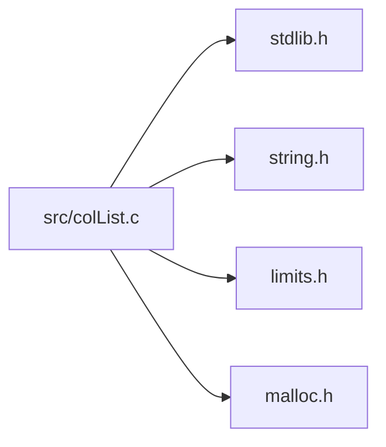

<a id="col_list_8c"></a>
# File colList.c

![][C++]

**Location**: `src/colList.c`

This file implements the list handling features of Colibri.

Lists are a linear collection datatype that allows for fast insertion, extraction and composition of other lists. Internally they use self-balanced binary trees, like ropes, except that they use vectors as basic containers instead of character arrays.


They come in both immutable and mutable forms.


?> The present code is largely adapted from the rope implementation.


**See also**: colList.h, colRope.c

## Includes

* [../include/colibri.h](colibri_8h.md#colibri_8h)
* [colInternal.h](col_internal_8h.md#col_internal_8h)
* [colWordInt.h](col_word_int_8h.md#col_word_int_8h)
* [colVectorInt.h](col_vector_int_8h.md#col_vector_int_8h)
* [colListInt.h](col_list_int_8h.md#col_list_int_8h)
* <stdlib.h>
* <string.h>
* <limits.h>
* <malloc.h>



## Immutable List Creation

<a id="group__list__words_1gafc53d9d08fb0368e412785b161194b7f"></a>
### Function Col\_EmptyList

![][public]

```cpp
Col_Word Col_EmptyList()
```

Return an empty list.

The returned word is immediate and constant, which means that it consumes no memory and its value can be safely compared and stored in static storage.


**Returns**:

The empty list.


**Return type**: EXTERN [Col\_Word](col_word_8h.md#group__words_1gadb626f9e195212e4fdfba7df154ad043)

<a id="group__list__words_1ga0dc0d4d58c4e694683753211151b0fc7"></a>
### Function Col\_NewList

![][public]

```cpp
Col_Word Col_NewList(size_t length, const Col_Word *elements)
```

Create a new list word.

Short lists are created as vectors. Larger lists are recursively split in half and assembled in a tree.


**Returns**:

A new list.


**Parameters**:

* size_t **length**: Length of below array.
* const [Col\_Word](col_word_8h.md#group__words_1gadb626f9e195212e4fdfba7df154ad043) * **elements**: Array of words to populate list with. If NULL, build a void list (i.e. whose elements are all nil).

**Return type**: EXTERN [Col\_Word](col_word_8h.md#group__words_1gadb626f9e195212e4fdfba7df154ad043)

## Immutable List Accessors

?> Works with mutable or immutable lists and vectors.

<a id="group__list__words_1ga5eb1c9ddea940171e18817b90301cc03"></a>
### Function Col\_ListLength

![][public]

```cpp
size_t Col_ListLength(Col_Word list)
```

Get the length of the list.

Also works with vectors. If the list is cyclic, only give the core length.


**Returns**:

The list length.

**Exceptions**:

* **[COL\_ERROR\_LIST](colibri_8h.md#group__error_1gga729084542ed9eae62009a84d3379ef35a88271295a774232492c1ebbdc68d6958)**: [[T]](colibri_8h.md#group__error_1gga6dab009a0b8c4b4fa080cb9ba1859e9ea603a58b9d5bb16fde0708eb0767e4904) **list**: Not a list.

**Parameters**:

* [Col\_Word](col_word_8h.md#group__words_1gadb626f9e195212e4fdfba7df154ad043) **list**: List to get length for.

**Return type**: EXTERN size_t

<a id="group__list__words_1gadf33dcf3fbbb192c17ae521920a14db6"></a>
### Function Col\_ListLoopLength

![][public]

```cpp
size_t Col_ListLoopLength(Col_Word list)
```

Get the loop length of the list.

**Return values**:

* **0**: for non-cyclic lists
* **<>0**: length of terminal loop for cyclic lists.

**Exceptions**:

* **[COL\_ERROR\_LIST](colibri_8h.md#group__error_1gga729084542ed9eae62009a84d3379ef35a88271295a774232492c1ebbdc68d6958)**: [[T]](colibri_8h.md#group__error_1gga6dab009a0b8c4b4fa080cb9ba1859e9ea603a58b9d5bb16fde0708eb0767e4904) **list**: Not a list.

**Parameters**:

* [Col\_Word](col_word_8h.md#group__words_1gadb626f9e195212e4fdfba7df154ad043) **list**: List to get loop length for.

**Return type**: EXTERN size_t

<a id="group__list__words_1ga825ecbc9aa5b7e650e45b347d8aab253"></a>
### Function Col\_ListDepth

![][public]

```cpp
unsigned char Col_ListDepth(Col_Word list)
```

Get the depth of the list.

**Returns**:

The list depth.

**Exceptions**:

* **[COL\_ERROR\_LIST](colibri_8h.md#group__error_1gga729084542ed9eae62009a84d3379ef35a88271295a774232492c1ebbdc68d6958)**: [[T]](colibri_8h.md#group__error_1gga6dab009a0b8c4b4fa080cb9ba1859e9ea603a58b9d5bb16fde0708eb0767e4904) **list**: Not a list.

**Parameters**:

* [Col\_Word](col_word_8h.md#group__words_1gadb626f9e195212e4fdfba7df154ad043) **list**: List to get depth for.

**Return type**: EXTERN unsigned char

<a id="group__list__words_1ga7550908ac1ceae597c8283afbaa7f813"></a>
### Function Col\_ListAt

![][public]

```cpp
Col_Word Col_ListAt(Col_Word list, size_t index)
```

Get the element of a list at a given position.

**Return values**:

* **nil**: if **index** past end of **list**.
* **element**: at given index otherwise.

**Exceptions**:

* **[COL\_ERROR\_LIST](colibri_8h.md#group__error_1gga729084542ed9eae62009a84d3379ef35a88271295a774232492c1ebbdc68d6958)**: [[T]](colibri_8h.md#group__error_1gga6dab009a0b8c4b4fa080cb9ba1859e9ea603a58b9d5bb16fde0708eb0767e4904) **list**: Not a list.

**Parameters**:

* [Col\_Word](col_word_8h.md#group__words_1gadb626f9e195212e4fdfba7df154ad043) **list**: List to get element from.
* size_t **index**: Element index.

**Return type**: EXTERN [Col\_Word](col_word_8h.md#group__words_1gadb626f9e195212e4fdfba7df154ad043)

## Immutable List Operations

!> **Warning** \
Works with mutable or immutable lists and vectors, however mutable words may be frozen in the process.

<a id="group__list__words_1gaa26702b61fabf55805c9ef1b2783e7f1"></a>
### Function Col\_Sublist

![][public]

```cpp
Col_Word Col_Sublist(Col_Word list, size_t first, size_t last)
```

Create a new list that is a sublist of another.

We try to minimize the overhead as much as possible, such as:
* identity.

* create vectors for small sublists.

* sublists of sublists point to original list.

* sublists of concats point to the deepest superset sublist.


**Returns**:

When first is past the end of the (acyclic) list, or **last** is before **first**, an empty list. Else, a list representing the sublist.

In any case the resulting sublist is never cyclic.

**Exceptions**:

* **[COL\_ERROR\_LIST](colibri_8h.md#group__error_1gga729084542ed9eae62009a84d3379ef35a88271295a774232492c1ebbdc68d6958)**: [[T]](colibri_8h.md#group__error_1gga6dab009a0b8c4b4fa080cb9ba1859e9ea603a58b9d5bb16fde0708eb0767e4904) **list**: Not a list.

**Parameters**:

* [Col\_Word](col_word_8h.md#group__words_1gadb626f9e195212e4fdfba7df154ad043) **list**: The list to extract the sublist from.
* size_t **first**: Index of first character in sublist.
* size_t **last**: Index of last character in sublist.

**Return type**: EXTERN [Col\_Word](col_word_8h.md#group__words_1gadb626f9e195212e4fdfba7df154ad043)

<a id="group__list__words_1ga73c0f71ee367af68bbad4a4738dfac3b"></a>
### Function Col\_ConcatLists

![][public]

```cpp
Col_Word Col_ConcatLists(Col_Word left, Col_Word right)
```

Concatenate lists.

Concatenation forms self-balanced binary trees. See [List Tree Balancing](#group__list__words_1list_tree_balancing) for more information.


**Returns**:

A list representing the concatenation of both lists.

**Exceptions**:

* **[COL\_ERROR\_LIST](colibri_8h.md#group__error_1gga729084542ed9eae62009a84d3379ef35a88271295a774232492c1ebbdc68d6958)**: [[T]](colibri_8h.md#group__error_1gga6dab009a0b8c4b4fa080cb9ba1859e9ea603a58b9d5bb16fde0708eb0767e4904) **left**: Not a list.
* **[COL\_ERROR\_LIST](colibri_8h.md#group__error_1gga729084542ed9eae62009a84d3379ef35a88271295a774232492c1ebbdc68d6958)**: [[T]](colibri_8h.md#group__error_1gga6dab009a0b8c4b4fa080cb9ba1859e9ea603a58b9d5bb16fde0708eb0767e4904) **right**: Not a list.
* **[COL\_ERROR\_LISTLENGTH\_CONCAT](colibri_8h.md#group__error_1gga729084542ed9eae62009a84d3379ef35a837fcf987426e821513e2fdaffcdf55e)**: [[V]](colibri_8h.md#group__error_1gga6dab009a0b8c4b4fa080cb9ba1859e9ea65d5e7232c82ae6972ac56f386a32fc9) **length(left+right)**: Concat list too large.

**Parameters**:

* [Col\_Word](col_word_8h.md#group__words_1gadb626f9e195212e4fdfba7df154ad043) **left**: Left part.
* [Col\_Word](col_word_8h.md#group__words_1gadb626f9e195212e4fdfba7df154ad043) **right**: Right part.

**Return type**: EXTERN [Col\_Word](col_word_8h.md#group__words_1gadb626f9e195212e4fdfba7df154ad043)

<a id="group__list__words_1ga964905c5c77b7ccb72a1fe3805cd70c7"></a>
### Function Col\_ConcatListsA

![][public]

```cpp
Col_Word Col_ConcatListsA(size_t number, const Col_Word *lists)
```

Concatenate several lists given in an array.

Concatenation is done recursively, by halving the array until it contains one or two elements, at this point we respectively return the element or use [Col\_ConcatLists()](col_list_8h.md#group__list__words_1ga73c0f71ee367af68bbad4a4738dfac3b).


**Returns**:

A list representing the concatenation of all lists.

**Exceptions**:

* **[COL\_ERROR\_GENERIC](colibri_8h.md#group__error_1gga729084542ed9eae62009a84d3379ef35a02ae949dee6fd3c78c849d7e7af414e4)**: [[V]](colibri_8h.md#group__error_1gga6dab009a0b8c4b4fa080cb9ba1859e9ea65d5e7232c82ae6972ac56f386a32fc9) **number == 0**: Generic error.

**Parameters**:

* size_t **number**: Size of **lists** array.
* listsconst [Col\_Word](col_word_8h.md#group__words_1gadb626f9e195212e4fdfba7df154ad043) * **words**: Array of lists to concatenate in order.

**Return type**: EXTERN [Col\_Word](col_word_8h.md#group__words_1gadb626f9e195212e4fdfba7df154ad043)

<a id="group__list__words_1ga291672360f258f14e6a92fe0a4232a19"></a>
### Function Col\_ConcatListsNV

![][public]

```cpp
Col_Word Col_ConcatListsNV(size_t number, ...)
```

Concatenate lists given as arguments.

The argument list is first copied into a stack-allocated array then passed to [Col\_ConcatListsA()](col_list_8h.md#group__list__words_1ga964905c5c77b7ccb72a1fe3805cd70c7).


**Returns**:

A list representing the concatenation of all lists.


**See also**: [Col\_ConcatListsA](col_list_8h.md#group__list__words_1ga964905c5c77b7ccb72a1fe3805cd70c7), [Col\_ConcatListsV](col_list_8h.md#group__list__words_1ga77aca8145dd519155802b77a89788576)

**Exceptions**:

* **[COL\_ERROR\_GENERIC](colibri_8h.md#group__error_1gga729084542ed9eae62009a84d3379ef35a02ae949dee6fd3c78c849d7e7af414e4)**: [[V]](colibri_8h.md#group__error_1gga6dab009a0b8c4b4fa080cb9ba1859e9ea65d5e7232c82ae6972ac56f386a32fc9) **number == 0**: Generic error.

**Parameters**:

* size_t **number**: Number of arguments following.
* ......: Lists to concatenate in order.

**Return type**: EXTERN [Col\_Word](col_word_8h.md#group__words_1gadb626f9e195212e4fdfba7df154ad043)

<a id="group__list__words_1ga8eaa742be1b1c2b87f7c850ad71a77bd"></a>
### Function Col\_RepeatList

![][public]

```cpp
Col_Word Col_RepeatList(Col_Word list, size_t count)
```

Create a list formed by the repetition of a source list.

This method is based on recursive concatenations of the list following the bit pattern of the count factor. Doubling a list simply consists of a concat with itself. In the end the resulting tree is very compact, and only a minimal number of extraneous cells are allocated during the balancing process (and will be eventually collected).


**Returns**:

A list representing the repetition of the source list. A list repeated zero times is empty. A cyclic list repeated more than once is identity.

**Exceptions**:

* **[COL\_ERROR\_LIST](colibri_8h.md#group__error_1gga729084542ed9eae62009a84d3379ef35a88271295a774232492c1ebbdc68d6958)**: [[T]](colibri_8h.md#group__error_1gga6dab009a0b8c4b4fa080cb9ba1859e9ea603a58b9d5bb16fde0708eb0767e4904) **list**: Not a list.
* **[COL\_ERROR\_LISTLENGTH\_REPEAT](colibri_8h.md#group__error_1gga729084542ed9eae62009a84d3379ef35a40d3bab7c4bdb30d0f50e04735e7c7ef)**: [[V]](colibri_8h.md#group__error_1gga6dab009a0b8c4b4fa080cb9ba1859e9ea65d5e7232c82ae6972ac56f386a32fc9) **length(list)*count**: Repeat list too large.

**Parameters**:

* [Col\_Word](col_word_8h.md#group__words_1gadb626f9e195212e4fdfba7df154ad043) **list**: The list to repeat.
* size_t **count**: Repetition factor.

**Return type**: EXTERN [Col\_Word](col_word_8h.md#group__words_1gadb626f9e195212e4fdfba7df154ad043)

<a id="group__list__words_1ga327fd0dc9444ab63bdc30d5f62eee4ea"></a>
### Function Col\_CircularList

![][public]

```cpp
Col_Word Col_CircularList(Col_Word core)
```

Create a circular list from a regular list.

**Returns**:

If the list is empty or cyclic, identity. Else a new circular list from the given core.

**Exceptions**:

* **[COL\_ERROR\_LIST](colibri_8h.md#group__error_1gga729084542ed9eae62009a84d3379ef35a88271295a774232492c1ebbdc68d6958)**: [[T]](colibri_8h.md#group__error_1gga6dab009a0b8c4b4fa080cb9ba1859e9ea603a58b9d5bb16fde0708eb0767e4904) **list**: Not a list.

**Parameters**:

* [Col\_Word](col_word_8h.md#group__words_1gadb626f9e195212e4fdfba7df154ad043) **core**: The core list.

**Return type**: EXTERN [Col\_Word](col_word_8h.md#group__words_1gadb626f9e195212e4fdfba7df154ad043)

<a id="group__list__words_1ga8ab7ea672c85e35028769758674e26f1"></a>
### Function Col\_ListInsert

![][public]

```cpp
Col_Word Col_ListInsert(Col_Word into, size_t index, Col_Word list)
```

Insert a list into another one, just before the given insertion point, taking cyclicity into account.

As target list is immutable, this results in a new list.


Insertion past the end of the list results in a concatenation.


?> Only perform minimal tests to prevent overflow, basic ops should perform further optimizations anyway.


**Returns**:

The resulting list.

**Exceptions**:

* **[COL\_ERROR\_LIST](colibri_8h.md#group__error_1gga729084542ed9eae62009a84d3379ef35a88271295a774232492c1ebbdc68d6958)**: [[T]](colibri_8h.md#group__error_1gga6dab009a0b8c4b4fa080cb9ba1859e9ea603a58b9d5bb16fde0708eb0767e4904) **into**: Not a list.
* **[COL\_ERROR\_LIST](colibri_8h.md#group__error_1gga729084542ed9eae62009a84d3379ef35a88271295a774232492c1ebbdc68d6958)**: [[T]](colibri_8h.md#group__error_1gga6dab009a0b8c4b4fa080cb9ba1859e9ea603a58b9d5bb16fde0708eb0767e4904) **list**: Not a list.

**Parameters**:

* [Col\_Word](col_word_8h.md#group__words_1gadb626f9e195212e4fdfba7df154ad043) **into**: Target list to insert into.
* size_t **index**: Index of insertion point.
* [Col\_Word](col_word_8h.md#group__words_1gadb626f9e195212e4fdfba7df154ad043) **list**: List to insert.

**Return type**: EXTERN [Col\_Word](col_word_8h.md#group__words_1gadb626f9e195212e4fdfba7df154ad043)

<a id="group__list__words_1gad3a369cfb544159866851398efcf50a8"></a>
### Function Col\_ListRemove

![][public]

```cpp
Col_Word Col_ListRemove(Col_Word list, size_t first, size_t last)
```

Remove a range of elements from a list, taking cyclicity into account.

As target list is immutable, this results in a new list.


?> Only perform minimal tests to prevent overflow, basic ops should perform further optimizations anyway.


**Returns**:

The resulting list.

**Exceptions**:

* **[COL\_ERROR\_LIST](colibri_8h.md#group__error_1gga729084542ed9eae62009a84d3379ef35a88271295a774232492c1ebbdc68d6958)**: [[T]](colibri_8h.md#group__error_1gga6dab009a0b8c4b4fa080cb9ba1859e9ea603a58b9d5bb16fde0708eb0767e4904) **list**: Not a list.

**Parameters**:

* [Col\_Word](col_word_8h.md#group__words_1gadb626f9e195212e4fdfba7df154ad043) **list**: List to remove sequence from.
* size_t **first**: Index of first character in range to remove.
* size_t **last**: Index of last character in range to remove.

**Return type**: EXTERN [Col\_Word](col_word_8h.md#group__words_1gadb626f9e195212e4fdfba7df154ad043)

<a id="group__list__words_1ga7286de8fbf801b507b4dd9ea422153c0"></a>
### Function Col\_ListReplace

![][public]

```cpp
Col_Word Col_ListReplace(Col_Word list, size_t first, size_t last, Col_Word with)
```

Replace a range of elements in a list with another, taking cyclicity into account.

As target list is immutable, this results in a new list.


Replacement is a combination of [Col\_ListRemove()](col_list_8h.md#group__list__words_1gad3a369cfb544159866851398efcf50a8) and [Col\_ListInsert()](col_list_8h.md#group__list__words_1ga8ab7ea672c85e35028769758674e26f1).


?> Only perform minimal tests to prevent overflow, basic ops should perform further optimizations anyway.


**Returns**:

The resulting list.


**See also**: [Col\_ListInsert](col_list_8h.md#group__list__words_1ga8ab7ea672c85e35028769758674e26f1), [Col\_ListRemove](col_list_8h.md#group__list__words_1gad3a369cfb544159866851398efcf50a8)

**Exceptions**:

* **[COL\_ERROR\_LIST](colibri_8h.md#group__error_1gga729084542ed9eae62009a84d3379ef35a88271295a774232492c1ebbdc68d6958)**: [[T]](colibri_8h.md#group__error_1gga6dab009a0b8c4b4fa080cb9ba1859e9ea603a58b9d5bb16fde0708eb0767e4904) **list**: Not a list.
* **[COL\_ERROR\_LIST](colibri_8h.md#group__error_1gga729084542ed9eae62009a84d3379ef35a88271295a774232492c1ebbdc68d6958)**: [[T]](colibri_8h.md#group__error_1gga6dab009a0b8c4b4fa080cb9ba1859e9ea603a58b9d5bb16fde0708eb0767e4904) **with**: Not a list.

**Parameters**:

* [Col\_Word](col_word_8h.md#group__words_1gadb626f9e195212e4fdfba7df154ad043) **list**: Original list.
* size_t **first**: Index of first element in range to remove.
* size_t **last**: Index of last element in range to replace.
* [Col\_Word](col_word_8h.md#group__words_1gadb626f9e195212e4fdfba7df154ad043) **with**: Replacement list.

**Return type**: EXTERN [Col\_Word](col_word_8h.md#group__words_1gadb626f9e195212e4fdfba7df154ad043)

## Immutable List Traversal

?> Works with mutable or immutable lists and vectors.

<a id="group__list__words_1ga4c20735036c60715f55cfd4e8d96825f"></a>
### Function Col\_TraverseListChunksN

![][public]

```cpp
int Col_TraverseListChunksN(size_t number, Col_Word *lists, size_t start, size_t max, Col_ListChunksTraverseProc *proc, Col_ClientData clientData, size_t *lengthPtr)
```

Iterate over the chunks of a number of lists.

For each traversed chunk, **proc** is called back with the opaque data as well as the position within the lists. If it returns a nonzero result then the iteration ends.


?> The algorithm is naturally recursive but this implementation avoids recursive calls thanks to a stack-allocated backtracking structure.


**Return values**:

* **-1**: if no traversal was performed.
* **int**: last returned value of **proc** otherwise.

**Exceptions**:

* **[COL\_ERROR\_LIST](colibri_8h.md#group__error_1gga729084542ed9eae62009a84d3379ef35a88271295a774232492c1ebbdc68d6958)**: [[T]](colibri_8h.md#group__error_1gga6dab009a0b8c4b4fa080cb9ba1859e9ea603a58b9d5bb16fde0708eb0767e4904) **lists[i]**: Not a list.
* **[COL\_ERROR\_GENERIC](colibri_8h.md#group__error_1gga729084542ed9eae62009a84d3379ef35a02ae949dee6fd3c78c849d7e7af414e4)**: [[V]](colibri_8h.md#group__error_1gga6dab009a0b8c4b4fa080cb9ba1859e9ea65d5e7232c82ae6972ac56f386a32fc9) **proc == NULL**: Generic error.

**Parameters**:

* size_t **number**: Number of lists to traverse.
* [Col\_Word](col_word_8h.md#group__words_1gadb626f9e195212e4fdfba7df154ad043) * **lists**: Array of lists to traverse.
* size_t **start**: Index of first character.
* size_t **max**: Max number of characters.
* [Col\_ListChunksTraverseProc](col_list_8h.md#group__list__words_1gae4fff149231b539311b16e990f1f53a0) * **proc**: Callback proc called on each chunk.
* [Col\_ClientData](colibri_8h.md#group__basic__types_1ga52e127a5c635bcb88f252efd210ca1a5) **clientData**: Opaque data passed as is to above **proc**.
* size_t * **lengthPtr**: [in,out] If non-NULL, incremented by the total number of characters traversed upon completion.

**Return type**: EXTERN int

<a id="group__list__words_1ga95d08cdde802b1411fbbb812412a8861"></a>
### Function Col\_TraverseListChunks

![][public]

```cpp
int Col_TraverseListChunks(Col_Word list, size_t start, size_t max, int reverse, Col_ListChunksTraverseProc *proc, Col_ClientData clientData, size_t *lengthPtr)
```

Iterate over the chunks of a list.

For each traversed chunk, **proc** is called back with the opaque data as well as the position within the list. If it returns a nonzero result then the iteration ends.


?> The algorithm is naturally recursive but this implementation avoids recursive calls thanks to a stack-allocated backtracking structure. This procedure is an optimized version of [Col\_TraverseListChunksN()](col_list_8h.md#group__list__words_1ga4c20735036c60715f55cfd4e8d96825f) that also supports reverse traversal.


**Return values**:

* **-1**: if no traversal was performed.
* **int**: last returned value of **proc** otherwise.

**Exceptions**:

* **[COL\_ERROR\_LIST](colibri_8h.md#group__error_1gga729084542ed9eae62009a84d3379ef35a88271295a774232492c1ebbdc68d6958)**: [[T]](colibri_8h.md#group__error_1gga6dab009a0b8c4b4fa080cb9ba1859e9ea603a58b9d5bb16fde0708eb0767e4904) **list**: Not a list.
* **[COL\_ERROR\_GENERIC](colibri_8h.md#group__error_1gga729084542ed9eae62009a84d3379ef35a02ae949dee6fd3c78c849d7e7af414e4)**: [[V]](colibri_8h.md#group__error_1gga6dab009a0b8c4b4fa080cb9ba1859e9ea65d5e7232c82ae6972ac56f386a32fc9) **proc == NULL**: Generic error.

**Parameters**:

* [Col\_Word](col_word_8h.md#group__words_1gadb626f9e195212e4fdfba7df154ad043) **list**: List to traverse.
* size_t **start**: Index of first character.
* size_t **max**: Max number of characters.
* int **reverse**: Whether to traverse in reverse order.
* [Col\_ListChunksTraverseProc](col_list_8h.md#group__list__words_1gae4fff149231b539311b16e990f1f53a0) * **proc**: Callback proc called on each chunk.
* [Col\_ClientData](colibri_8h.md#group__basic__types_1ga52e127a5c635bcb88f252efd210ca1a5) **clientData**: Opaque data passed as is to above **proc**.
* size_t * **lengthPtr**: [in,out] If non-NULL, incremented by the total number of characters traversed upon completion.

**Return type**: EXTERN int

## Immutable List Iteration

!> **Warning** \
Works with mutable or immutable lists and vectors, however modifying a mutable list during iteration results in undefined behavior.

<a id="group__list__words_1gab82314e6a85f5b68b646efe5c9fe0200"></a>
### Function Col\_ListIterBegin

![][public]

```cpp
int Col_ListIterBegin(Col_ListIterator it, Col_Word list, size_t index)
```

Initialize the list iterator so that it points to the **index**-th element within the list.

If **index** points past the end of the list, the iterator is initialized to the end iterator.


**Return values**:

* **<>0**: if the iterator looped over the cyclic list.
* **0**: in all other cases.

**Exceptions**:

* **[COL\_ERROR\_LIST](colibri_8h.md#group__error_1gga729084542ed9eae62009a84d3379ef35a88271295a774232492c1ebbdc68d6958)**: [[T]](colibri_8h.md#group__error_1gga6dab009a0b8c4b4fa080cb9ba1859e9ea603a58b9d5bb16fde0708eb0767e4904) **list**: Not a list.

**Parameters**:

* [Col\_ListIterator](col_list_8h.md#group__list__words_1ga2793b6b86a3ff97de81eb67f79b46eeb) **it**: Iterator to initialize.
* [Col\_Word](col_word_8h.md#group__words_1gadb626f9e195212e4fdfba7df154ad043) **list**: List to iterate over.
* size_t **index**: Index of first element to iterate.

**Return type**: EXTERN int

<a id="group__list__words_1ga0f1d7cb546b01d0a346e40a49671d0ec"></a>
### Function Col\_ListIterFirst

![][public]

```cpp
void Col_ListIterFirst(Col_ListIterator it, Col_Word list)
```

Initialize the list iterator so that it points to the first character within the list.

If list is empty, the iterator is initialized to the end iterator.

**Exceptions**:

* **[COL\_ERROR\_LIST](colibri_8h.md#group__error_1gga729084542ed9eae62009a84d3379ef35a88271295a774232492c1ebbdc68d6958)**: [[T]](colibri_8h.md#group__error_1gga6dab009a0b8c4b4fa080cb9ba1859e9ea603a58b9d5bb16fde0708eb0767e4904) **list**: Not a list.

**Parameters**:

* [Col\_ListIterator](col_list_8h.md#group__list__words_1ga2793b6b86a3ff97de81eb67f79b46eeb) **it**: Iterator to initialize.
* [Col\_Word](col_word_8h.md#group__words_1gadb626f9e195212e4fdfba7df154ad043) **list**: List to iterate over.

**Return type**: EXTERN void

<a id="group__list__words_1ga39ef512be590fc88aca2f6d9668c6ddb"></a>
### Function Col\_ListIterLast

![][public]

```cpp
void Col_ListIterLast(Col_ListIterator it, Col_Word list)
```

Initialize the list iterator so that it points to the last character within the list.

If list is empty, the iterator is initialized to the end iterator.


?> If the list is cyclic, will point to the last character of the core.

**Exceptions**:

* **[COL\_ERROR\_LIST](colibri_8h.md#group__error_1gga729084542ed9eae62009a84d3379ef35a88271295a774232492c1ebbdc68d6958)**: [[T]](colibri_8h.md#group__error_1gga6dab009a0b8c4b4fa080cb9ba1859e9ea603a58b9d5bb16fde0708eb0767e4904) **list**: Not a list.

**Parameters**:

* [Col\_ListIterator](col_list_8h.md#group__list__words_1ga2793b6b86a3ff97de81eb67f79b46eeb) **it**: Iterator to initialize.
* [Col\_Word](col_word_8h.md#group__words_1gadb626f9e195212e4fdfba7df154ad043) **list**: List to iterate over.

**Return type**: EXTERN void

<a id="group__list__words_1ga16e66915236c82fa9eb9695e6d899686"></a>
### Function Col\_ListIterArray

![][public]

```cpp
void Col_ListIterArray(Col_ListIterator it, size_t length, const Col_Word *elements)
```

Initialize the list iterator so that it points to the first element in an array.


**Parameters**:

* [Col\_ListIterator](col_list_8h.md#group__list__words_1ga2793b6b86a3ff97de81eb67f79b46eeb) **it**: Iterator to initialize.
* size_t **length**: Number of elements in array.
* const [Col\_Word](col_word_8h.md#group__words_1gadb626f9e195212e4fdfba7df154ad043) * **elements**: Array of elements.

**Return type**: EXTERN void

<a id="group__list__words_1gaa199f0b545340f4ee41512f5d9d1bcd0"></a>
### Function Col\_ListIterCompare

![][public]

```cpp
int Col_ListIterCompare(const Col_ListIterator it1, const Col_ListIterator it2)
```

Compare two iterators by their respective positions.


**Exceptions**:

* **[COL\_ERROR\_LISTITER](colibri_8h.md#group__error_1gga729084542ed9eae62009a84d3379ef35acd609f7a6870d0404ced98da497d3834)**: [[T]](colibri_8h.md#group__error_1gga6dab009a0b8c4b4fa080cb9ba1859e9ea603a58b9d5bb16fde0708eb0767e4904) **it1**: Invalid list iterator.
* **[COL\_ERROR\_LISTITER](colibri_8h.md#group__error_1gga729084542ed9eae62009a84d3379ef35acd609f7a6870d0404ced98da497d3834)**: [[T]](colibri_8h.md#group__error_1gga6dab009a0b8c4b4fa080cb9ba1859e9ea603a58b9d5bb16fde0708eb0767e4904) **it2**: Invalid list iterator.


**Return values**:

* **-1**: if **it1** before **it2**.
* **1**: if **it1** after **it2**.
* **0**: if **it1** and **it2** are equal.

**Parameters**:

* const [Col\_ListIterator](col_list_8h.md#group__list__words_1ga2793b6b86a3ff97de81eb67f79b46eeb) **it1**: First iterator.
* const [Col\_ListIterator](col_list_8h.md#group__list__words_1ga2793b6b86a3ff97de81eb67f79b46eeb) **it2**: Second iterator.

**Return type**: EXTERN int

<a id="group__list__words_1ga86a67cbc053b8ac15627484285aea972"></a>
### Function Col\_ListIterMoveTo

![][public]

```cpp
int Col_ListIterMoveTo(Col_ListIterator it, size_t index)
```

Move the iterator to the given absolute position.

**Return values**:

* **<>0**: if the iterator looped over the cyclic list.
* **0**: in all other cases.


**Parameters**:

* [Col\_ListIterator](col_list_8h.md#group__list__words_1ga2793b6b86a3ff97de81eb67f79b46eeb) **it**: The iterator to move.
* size_t **index**: Position to move to.

**Return type**: EXTERN int

<a id="group__list__words_1ga12a0d04173010d29d1bf59492b829e7f"></a>
### Function Col\_ListIterForward

![][public]

```cpp
int Col_ListIterForward(Col_ListIterator it, size_t nb)
```

Move the iterator to the **nb**-th next element.

**Return values**:

* **<>0**: if the iterator looped over the cyclic list.
* **0**: in all other cases.

**Exceptions**:

* **[COL\_ERROR\_LISTITER](colibri_8h.md#group__error_1gga729084542ed9eae62009a84d3379ef35acd609f7a6870d0404ced98da497d3834)**: [[T]](colibri_8h.md#group__error_1gga6dab009a0b8c4b4fa080cb9ba1859e9ea603a58b9d5bb16fde0708eb0767e4904) **it**: Invalid list iterator.
* **[COL\_ERROR\_LISTITER\_END](colibri_8h.md#group__error_1gga729084542ed9eae62009a84d3379ef35a192c0a7221d1094ac6ac886abb8982c9)**: [[V]](colibri_8h.md#group__error_1gga6dab009a0b8c4b4fa080cb9ba1859e9ea65d5e7232c82ae6972ac56f386a32fc9) **it**: List iterator at end. (only when **nb** != 0)

**Parameters**:

* [Col\_ListIterator](col_list_8h.md#group__list__words_1ga2793b6b86a3ff97de81eb67f79b46eeb) **it**: The iterator to move.
* size_t **nb**: Offset to move forward.

**Return type**: EXTERN int

<a id="group__list__words_1ga76affcec789dc4314c2f666779c59837"></a>
### Function Col\_ListIterBackward

![][public]

```cpp
void Col_ListIterBackward(Col_ListIterator it, size_t nb)
```

Move the iterator backward to the **nb**-th previous element.

?> If moved before the beginning of list, **it** is set at end. This means that backward iterators will loop forever if unchecked against [Col\_ListIterEnd()](col_list_8h.md#group__list__words_1ga0025ae0a8a58c10285c5c131acd1d9e9).

**Exceptions**:

* **[COL\_ERROR\_LISTITER](colibri_8h.md#group__error_1gga729084542ed9eae62009a84d3379ef35acd609f7a6870d0404ced98da497d3834)**: [[T]](colibri_8h.md#group__error_1gga6dab009a0b8c4b4fa080cb9ba1859e9ea603a58b9d5bb16fde0708eb0767e4904) **it**: Invalid list iterator.

**Parameters**:

* [Col\_ListIterator](col_list_8h.md#group__list__words_1ga2793b6b86a3ff97de81eb67f79b46eeb) **it**: The iterator to move.
* size_t **nb**: Offset to move backward.

**Return type**: EXTERN void

## Mutable List Creation

<a id="group__mlist__words_1ga3b048f22f88eb07685a0d6e12960ca91"></a>
### Function Col\_NewMList

![][public]

```cpp
Col_Word Col_NewMList()
```

Create a new mutable list word.

**Returns**:

The new word.


**Return type**: EXTERN [Col\_Word](col_word_8h.md#group__words_1gadb626f9e195212e4fdfba7df154ad043)

<a id="group__mlist__words_1gaff1c8024a9ca1e6a6f33de4fe7344e81"></a>
### Function Col\_CopyMList

![][public]

```cpp
Col_Word Col_CopyMList(Col_Word mlist)
```

Create an immutable list from a mutable list.

If an immutable list is given, it is simply returned. If a mutable list is given, its content is frozen and shared with the new one. If a non-empty mutable vector is given, it is frozen.


**Returns**:

Immutable copy of the mutable list.

**Exceptions**:

* **[COL\_ERROR\_LIST](colibri_8h.md#group__error_1gga729084542ed9eae62009a84d3379ef35a88271295a774232492c1ebbdc68d6958)**: [[T]](colibri_8h.md#group__error_1gga6dab009a0b8c4b4fa080cb9ba1859e9ea603a58b9d5bb16fde0708eb0767e4904) **mlist**: Not a list.


**Side Effect**:

Freeze mutable list content and turn mutable vectors immutable.

**Parameters**:

* [Col\_Word](col_word_8h.md#group__words_1gadb626f9e195212e4fdfba7df154ad043) **mlist**: Mutable list to copy.

**Return type**: EXTERN [Col\_Word](col_word_8h.md#group__words_1gadb626f9e195212e4fdfba7df154ad043)

## Mutable List Operations

<a id="group__mlist__words_1ga939319b0240b3bd7f0713b09b4dc08dc"></a>
### Function Col\_MListSetLength

![][public]

```cpp
void Col_MListSetLength(Col_Word mlist, size_t length)
```

Resize the mutable list.

Newly added elements are set to nil. Removed elements are simply discarded.

**Exceptions**:

* **[COL\_ERROR\_MLIST](colibri_8h.md#group__error_1gga729084542ed9eae62009a84d3379ef35a12b82359c99d46f81dda5313e88a5611)**: [[T]](colibri_8h.md#group__error_1gga6dab009a0b8c4b4fa080cb9ba1859e9ea603a58b9d5bb16fde0708eb0767e4904) **mlist**: Not a mutable list.

**Parameters**:

* [Col\_Word](col_word_8h.md#group__words_1gadb626f9e195212e4fdfba7df154ad043) **mlist**: Mutable list to resize.
* size_t **length**: New length.

**Return type**: EXTERN void

<a id="group__mlist__words_1ga717d5a5fa372406df49ae460436b923e"></a>
### Function Col\_MListLoop

![][public]

```cpp
void Col_MListLoop(Col_Word mlist)
```

Make a mutable list circular.

Do nothing if cyclic (not necessarily circular).

**Exceptions**:

* **[COL\_ERROR\_MLIST](colibri_8h.md#group__error_1gga729084542ed9eae62009a84d3379ef35a12b82359c99d46f81dda5313e88a5611)**: [[T]](colibri_8h.md#group__error_1gga6dab009a0b8c4b4fa080cb9ba1859e9ea603a58b9d5bb16fde0708eb0767e4904) **mlist**: Not a mutable list.

**Parameters**:

* [Col\_Word](col_word_8h.md#group__words_1gadb626f9e195212e4fdfba7df154ad043) **mlist**: Mutable list to make circular.

**Return type**: EXTERN void

<a id="group__mlist__words_1ga5dc6434e4a1ba966bba2c87a58f76cc5"></a>
### Function Col\_MListSetAt

![][public]

```cpp
void Col_MListSetAt(Col_Word mlist, size_t index, Col_Word element)
```

Set the element of a mutable list at a given position.


**Exceptions**:

* **[COL\_ERROR\_MLIST](colibri_8h.md#group__error_1gga729084542ed9eae62009a84d3379ef35a12b82359c99d46f81dda5313e88a5611)**: [[T]](colibri_8h.md#group__error_1gga6dab009a0b8c4b4fa080cb9ba1859e9ea603a58b9d5bb16fde0708eb0767e4904) **mlist**: Not a mutable list.
* **[COL\_ERROR\_LISTINDEX](colibri_8h.md#group__error_1gga729084542ed9eae62009a84d3379ef35a53fb84bc77099761ccc326d067022e4b)**: [[V]](colibri_8h.md#group__error_1gga6dab009a0b8c4b4fa080cb9ba1859e9ea65d5e7232c82ae6972ac56f386a32fc9) **index < [Col\_ListLength(mlist)](col_list_8h.md#group__list__words_1ga5eb1c9ddea940171e18817b90301cc03)**: List index out of bounds.

**Parameters**:

* [Col\_Word](col_word_8h.md#group__words_1gadb626f9e195212e4fdfba7df154ad043) **mlist**: Mutable list to modify.
* size_t **index**: Element index.
* [Col\_Word](col_word_8h.md#group__words_1gadb626f9e195212e4fdfba7df154ad043) **element**: New element.

**Return type**: EXTERN void

<a id="group__mlist__words_1ga453cc8131623ff7f2981ffe3cca75797"></a>
### Function Col\_MListInsert

![][public]

```cpp
void Col_MListInsert(Col_Word into, size_t index, Col_Word list)
```

Insert a list into a mutable list, just before the given insertion point, taking cyclicity into account.


**Exceptions**:

* **[COL\_ERROR\_MLIST](colibri_8h.md#group__error_1gga729084542ed9eae62009a84d3379ef35a12b82359c99d46f81dda5313e88a5611)**: [[T]](colibri_8h.md#group__error_1gga6dab009a0b8c4b4fa080cb9ba1859e9ea603a58b9d5bb16fde0708eb0767e4904) **into**: Not a mutable list.
* **[COL\_ERROR\_LIST](colibri_8h.md#group__error_1gga729084542ed9eae62009a84d3379ef35a88271295a774232492c1ebbdc68d6958)**: [[T]](colibri_8h.md#group__error_1gga6dab009a0b8c4b4fa080cb9ba1859e9ea603a58b9d5bb16fde0708eb0767e4904) **list**: Not a list.
* **[COL\_ERROR\_LISTLENGTH\_CONCAT](colibri_8h.md#group__error_1gga729084542ed9eae62009a84d3379ef35a837fcf987426e821513e2fdaffcdf55e)**: [[V]](colibri_8h.md#group__error_1gga6dab009a0b8c4b4fa080cb9ba1859e9ea65d5e7232c82ae6972ac56f386a32fc9) **length(into+list)**: Concat list too large.

**Parameters**:

* [Col\_Word](col_word_8h.md#group__words_1gadb626f9e195212e4fdfba7df154ad043) **into**: Target mutable list to insert into.
* size_t **index**: Index of insertion point.
* [Col\_Word](col_word_8h.md#group__words_1gadb626f9e195212e4fdfba7df154ad043) **list**: List to insert.

**Return type**: EXTERN void

<a id="group__mlist__words_1ga0ff728019a9d46b0a7c0096007203915"></a>
### Function Col\_MListRemove

![][public]

```cpp
void Col_MListRemove(Col_Word mlist, size_t first, size_t last)
```

Remove a range of elements from a mutable list.


**Exceptions**:

* **[COL\_ERROR\_MLIST](colibri_8h.md#group__error_1gga729084542ed9eae62009a84d3379ef35a12b82359c99d46f81dda5313e88a5611)**: [[T]](colibri_8h.md#group__error_1gga6dab009a0b8c4b4fa080cb9ba1859e9ea603a58b9d5bb16fde0708eb0767e4904) **mlist**: Not a mutable list.

**Parameters**:

* [Col\_Word](col_word_8h.md#group__words_1gadb626f9e195212e4fdfba7df154ad043) **mlist**: Mutable list to remove sequence from.
* size_t **first**: Index of first element in range to remove.
* size_t **last**: Index of last element in range to remove.

**Return type**: EXTERN void

<a id="group__mlist__words_1gaecb4269ea8b60e6f9bb4d0a5eb62fc2a"></a>
### Function Col\_MListReplace

![][public]

```cpp
void Col_MListReplace(Col_Word mlist, size_t first, size_t last, Col_Word with)
```

Replace a range of elements in a mutable list with another, taking cyclicity into account.

Replacement is a combination of [Col\_MListRemove()](col_list_8h.md#group__mlist__words_1ga0ff728019a9d46b0a7c0096007203915) and [Col\_MListInsert()](col_list_8h.md#group__mlist__words_1ga453cc8131623ff7f2981ffe3cca75797).


?> Only perform minimal tests to prevent overflow, basic ops should perform further optimizations anyway.


**See also**: [Col\_MListInsert](col_list_8h.md#group__mlist__words_1ga453cc8131623ff7f2981ffe3cca75797), [Col\_MListRemove](col_list_8h.md#group__mlist__words_1ga0ff728019a9d46b0a7c0096007203915)

**Exceptions**:

* **[COL\_ERROR\_MLIST](colibri_8h.md#group__error_1gga729084542ed9eae62009a84d3379ef35a12b82359c99d46f81dda5313e88a5611)**: [[T]](colibri_8h.md#group__error_1gga6dab009a0b8c4b4fa080cb9ba1859e9ea603a58b9d5bb16fde0708eb0767e4904) **mlist**: Not a mutable list.
* **[COL\_ERROR\_LIST](colibri_8h.md#group__error_1gga729084542ed9eae62009a84d3379ef35a88271295a774232492c1ebbdc68d6958)**: [[T]](colibri_8h.md#group__error_1gga6dab009a0b8c4b4fa080cb9ba1859e9ea603a58b9d5bb16fde0708eb0767e4904) **with**: Not a list.

**Parameters**:

* [Col\_Word](col_word_8h.md#group__words_1gadb626f9e195212e4fdfba7df154ad043) **mlist**: Mutable list to modify.
* size_t **first**: Index of first element in range to replace.
* size_t **last**: Index of last element in range to replace.
* [Col\_Word](col_word_8h.md#group__words_1gadb626f9e195212e4fdfba7df154ad043) **with**: Replacement list.

**Return type**: EXTERN void

## Source

```cpp
/**
 * @file colList.c
 *
 * This file implements the list handling features of Colibri.
 *
 * Lists are a linear collection datatype that allows for fast insertion,
 * extraction and composition of other lists. Internally they use
 * self-balanced binary trees, like ropes, except that they use vectors
 * as basic containers instead of character arrays.
 *
 * They come in both immutable and mutable forms.
 *
 * @note
 *      The present code is largely adapted from the rope implementation.
 *
 * @see colList.h
 * @see colRope.c
 */

#include "../include/colibri.h"
#include "colInternal.h"

#include "colWordInt.h"
#include "colVectorInt.h"
#include "colListInt.h"

#include <stdlib.h>
#include <string.h>
#include <limits.h>
#include <malloc.h> /* For alloca */

/*
 * Prototypes for functions used only in this file.
 */

/*! \cond IGNORE */
typedef struct ListChunkTraverseInfo *pListChunkTraverseInfo;
static Col_ListChunksTraverseProc MergeListChunksProc;
static unsigned char    GetDepth(Col_Word list);
static void             GetArms(Col_Word node, Col_Word * leftPtr,
                            Col_Word * rightPtr);
static void             FreezeMList(Col_Word mlist);
static void             MListSetAt(Col_Word * nodePtr, size_t index,
                            Col_Word element);
static Col_Word         NewMConcatList(Col_Word left, Col_Word right);
static void             ConvertToMutableAt(Col_Word *nodePtr, size_t index);
static void             SplitMutableAt(Col_Word *nodePtr, size_t index);
static void             ConvertToMConcatNode(Col_Word *nodePtr);
static void             UpdateMConcatNode(Col_Word node);
static void             MListInsert(Col_Word * nodePtr, size_t index,
                            Col_Word list);
static void             MListRemove(Col_Word * nodePtr, size_t first,
                            size_t last);
static void             GetChunk(struct ListChunkTraverseInfo *info,
                            const Col_Word **chunkPtr, int reverse);
static void             NextChunk(struct ListChunkTraverseInfo *info,
                            size_t nb, int reverse);
/*! \endcond *//* IGNORE */


/*
===========================================================================*//*!
\weakgroup list_words Immutable Lists

@anchor list_tree_balancing
### List Tree Balancing

Large lists are built by concatenating several sublists, forming a
balanced binary tree. A balanced tree is one where the depth of the
left and right arms do not differ by more than one level.

List trees are self-balanced by construction: when two lists are
concatenated, if their respective depths differ by more than 1, then
the tree is recursively rebalanced by splitting and merging subarms.
There are four major cases, two if we consider symmetry:

- Deepest subtree is an outer branch (i.e. the left resp. right child of
  the left resp. right arm). In this case the tree is rotated: the
  opposite child is moved and concatenated with the opposite arm.
  For example, with left being deepest:

  @dot
    digraph {
        fontname="Helvetica";
        node [fontname="Helvetica" fontsize=10 shape="box" style="rounded" height=0 width=0];
        edge [dir="back" arrowtail="odiamond"];

        subgraph cluster_before {
            label="Before rotation";

            concat_before               [label="concat(left,right)\n= (left1 + left2) + right"];
                left_before             [label="left\n= left1 + left2" style="rounded,filled" fillcolor="grey75"];
                    left1_before        [label="left1"];
                        left11_before   [label="?" style="solid,bold"];
                        left12_before   [label="?" style="solid,bold"];
                    left2_before        [label="left2" style="solid,bold"];
                right_before            [label="right" style="solid,bold"];

            concat_before -> left_before;
                left_before -> left1_before;
                    left1_before -> left11_before;
                    left1_before -> left12_before;
                left_before -> left2_before;
            concat_before -> right_before;

            subgraph {
                edge [dir="forward" arrowhead="open"];
                rank = same; left11_before; left12_before, left2_before; right_before;
                left11_before -> left12_before;
                left12_before -> left2_before;
                left2_before -> right_before;
            }
        }
        subgraph cluster_after {
            label="After rotation";

            concat_after                [label="concat(left,right)\n= left1 + (left2 + right)"];
                left1_after             [label="left1"];
                    left11_after        [label="?" style="solid,bold"];
                    left12_after        [label="?" style="solid,bold"];
                concat2_after           [label="left2 + right" style="rounded,filled" fillcolor="grey75"];
                    left2_after         [label="left2" style="solid,bold"];
                    right_after         [label="right" style="solid,bold"];

            concat_after -> left1_after;
                left1_after -> left11_after;
                left1_after -> left12_after;
            concat_after -> concat2_after;
                concat2_after -> left2_after;
                concat2_after -> right_after;

            subgraph {
                edge [dir="forward" arrowhead="open"];
                rank = same; left11_after; left12_after, left2_after; right_after;
                left11_after -> left12_after;
                left12_after -> left2_after;
                left2_after -> right_after;
            }
        }
    }
  @enddot

  @begindiagram
    Before rotation:
              concat = (left1 + left2) + right
             /      \
           left    right
          /    \
       left1  left2
      /     \
     ?       ?


    After rotation:
             concat = left1 + (left2 + right)
            /      \
       left1        concat
      /     \      /      \
     ?       ?   left2   right
  @enddiagram


- Deepest subtree is an inner branch (i.e. the right resp. left child of
  the left resp. right arm). In this case the subtree is split
  between both arms. For example, with left being deepest:

  @dot
    digraph {
        fontname="Helvetica";
        node [fontname="Helvetica" fontsize=10 shape="box" style="rounded" height=0 width=0];
        edge [dir="back" arrowtail="odiamond"];

        subgraph cluster_before {
            label="Before splitting";

            concat_before               [label="concat(left,right)\n= (left1 + (left21+left22)) + right"];
                left_before             [label="left\n= left1 + (left21+left22)" style="rounded,filled" fillcolor="grey75"];
                    left1_before        [label="left1" style="solid,bold"];
                    left2_before        [label="left2\n= left21+left22" style="rounded,filled" fillcolor="grey75"];
                        left21_before   [label="left21" style="solid,bold"];
                        left22_before   [label="left22" style="solid,bold"];
                right_before            [label="right" style="solid,bold"];

            concat_before -> left_before;
                left_before -> left1_before;
                left_before -> left2_before;
                    left2_before -> left21_before;
                    left2_before -> left22_before;
            concat_before -> right_before;

            subgraph {
                edge [dir="forward" arrowhead="open"];
                rank = same; left1_before; left21_before, left22_before; right_before;
                left1_before -> left21_before;
                left21_before -> left22_before;
                left22_before -> right_before;
            }
        }
        subgraph cluster_after {
            label="After splitting";

            concat_after                [label="concat(left,right)\n=  (left1 + left21) + (left22 + right)"];
                concat2_after           [label="left1 + left21" style="rounded,filled" fillcolor="grey75"];
                    left1_after         [label="left1" style="solid,bold"];
                    left21_after        [label="left21" style="solid,bold"];
                concat3_after           [label="left22 + right" style="rounded,filled" fillcolor="grey75"];
                    left22_after        [label="left22" style="solid,bold"];
                    right_after         [label="right" style="solid,bold"];

            concat_after -> concat2_after;
                concat2_after -> left1_after;
                concat2_after -> left21_after;
            concat_after -> concat3_after;
                concat3_after -> left22_after;
                concat3_after -> right_after;

            subgraph {
                edge [dir="forward" arrowhead="open"];
                rank = same; left1_after; left21_after, left22_after; right_after;
                left1_after -> left21_after;
                left21_after -> left22_after;
                left22_after -> right_after;
            }
        }
    }
  @enddot

  @begindiagram
    Before splitting:
            concat = (left1 + (left21+left22)) + right
           /      \
         left    right
        /    \
     left1  left2
           /     \
        left21  left22


    After splitting:
                concat = (left1 + left21) + (left22 + right)
               /      \
         concat        concat
        /      \      /      \
     left1  left21  left22  right
  @enddiagram

@see Col_ConcatLists
\{*//*==========================================================================
*/

/*******************************************************************************
 * Immutable List Creation
 ******************************************************************************/

/**
 * Return an empty list. The returned word is immediate and constant,
 * which means that it consumes no memory and its value can be safely
 * compared and stored in static storage.
 *
 * @return The empty list.
 */
Col_Word
Col_EmptyList()
{
    return WORD_LIST_EMPTY;
}

/**
 * Create a new list word.
 *
 * Short lists are created as vectors. Larger lists are recursively split
 * in half and assembled in a tree.
 *
 * @return A new list.
 */
Col_Word
Col_NewList(
    size_t length,              /*!< Length of below array. */
    const Col_Word * elements)  /*!< Array of words to populate list with. If
                                     NULL, build a void list (i.e. whose
                                     elements are all nil). */
{
    size_t half=0;              /* Index of the split point. */

    if (length == 0) {
        /*
         * Empty list.
         */

        return WORD_LIST_EMPTY;
    }

    if (!elements) {
        /*
         * Void list.
         */

        if (length <= VOIDLIST_MAX_LENGTH) {
            return WORD_VOIDLIST_NEW(length);
        }

        /*
         * Length is too long to fit within an immediate value. Split.
         */

        half = length/2;
        return Col_ConcatLists(Col_NewList(half, NULL), Col_NewList(length-half,
                NULL));
    }

    return Col_NewVector(length, elements);
}

/* End of Immutable List Creation */


/*******************************************************************************
 * Immutable List Accessors
 ******************************************************************************/

/**
 * Get the length of the list. Also works with vectors. If the list is
 * cyclic, only give the core length.
 *
 * @return The list length.
 */
size_t
Col_ListLength(
    Col_Word list)  /*!< List to get length for. */
{
    /*
     * Check preconditions.
     */

    /*! @typecheck{COL_ERROR_LIST,list} */
    TYPECHECK_LIST(list) return 0;

    WORD_UNWRAP(list);

    switch (WORD_TYPE(list)) {
    case WORD_TYPE_CIRCLIST:
        return Col_ListLength(WORD_CIRCLIST_CORE(list));

    case WORD_TYPE_VOIDLIST:
        return WORD_VOIDLIST_LENGTH(list);

    case WORD_TYPE_VECTOR:
    case WORD_TYPE_MVECTOR:
        return WORD_VECTOR_LENGTH(list);

    case WORD_TYPE_SUBLIST:
        /*
         * Sublist length is the range width.
         */

        return WORD_SUBLIST_LAST(list)-WORD_SUBLIST_FIRST(list)+1;

    case WORD_TYPE_CONCATLIST:
    case WORD_TYPE_MCONCATLIST:
        return WORD_CONCATLIST_LENGTH(list);

    case WORD_TYPE_CUSTOM:
        return ((Col_CustomListType *) WORD_TYPEINFO(list))->lengthProc(list);

    /* WORD_TYPE_UNKNOWN */

    default:
        /*CANTHAPPEN*/
        ASSERT(0);
        return 0;
    }
}

/**
 * Get the loop length of the list.
 *
 * @retval 0    for non-cyclic lists
 * @retval <>0  length of terminal loop for cyclic lists.
 */
size_t
Col_ListLoopLength(
    Col_Word list)  /*!< List to get loop length for. */
{
    /*
     * Check preconditions.
     */

    /*! @typecheck{COL_ERROR_LIST,list} */
    TYPECHECK_LIST(list) return 0;

    WORD_UNWRAP(list);

    switch (WORD_TYPE(list)) {
    case WORD_TYPE_VOIDLIST:
    case WORD_TYPE_VECTOR:
    case WORD_TYPE_MVECTOR:
    case WORD_TYPE_SUBLIST:
        return 0;

    case WORD_TYPE_CIRCLIST:
        return Col_ListLength(WORD_CIRCLIST_CORE(list));

    case WORD_TYPE_CONCATLIST:
    case WORD_TYPE_MCONCATLIST:
        if (WORD_TYPE(WORD_CONCATLIST_RIGHT(list)) == WORD_TYPE_CIRCLIST) {
            /*
             * Cyclic list length is given by right arm length.
             */

            return Col_ListLength(WORD_CONCATLIST_RIGHT(list));
        }
        return 0;

    /* WORD_TYPE_UNKNOWN */

    default:
        /*CANTHAPPEN*/
        ASSERT(0);
        return 0;
    }
}

/**
 * Get the depth of the list.
 *
 * @return The list depth.
 */
unsigned char
Col_ListDepth(
    Col_Word list)  /*!< List to get depth for. */
{
    /*
     * Check preconditions.
     */

    /*! @typecheck{COL_ERROR_LIST,list} */
    TYPECHECK_LIST(list) return 0;

    WORD_UNWRAP(list);
    return GetDepth(list);
}

/**
 * Get the element of a list at a given position.
 *
 * @retval nil      if **index** past end of **list**.
 * @retval element  at given index otherwise.
 */
Col_Word
Col_ListAt(
    Col_Word list,  /*!< List to get element from. */
    size_t index)   /*!< Element index. */
{
    Col_ListIterator it;

    /*
     * Check preconditions.
     */

    /*! @typecheck{COL_ERROR_LIST,list} */
    TYPECHECK_LIST(list) return WORD_NIL;

    Col_ListIterBegin(it, list, index);
    return Col_ListIterEnd(it) ? WORD_NIL : Col_ListIterAt(it);
}

/* End of Immutable List Accessors */


/*******************************************************************************
 * Immutable List Operations
 ******************************************************************************/

/** @beginprivate @cond PRIVATE */

/**
 * Maximum number of cells a short list can take. This constant controls
 * the creation of short leaves during sublist/concatenation. Lists built
 * this way normally use sublist and concat nodes, but to avoid
 * fragmentation, multiple short lists are flattened into a single vector.
 */
#define MAX_SHORT_LIST_SIZE     3

/**
 * Maximum number of elements a short list can take.
 *
 * @see MAX_SHORT_LIST_SIZE
 */
#define MAX_SHORT_LIST_LENGTH   VECTOR_MAX_LENGTH(MAX_SHORT_LIST_SIZE*CELL_SIZE)

/**
 * Maximum number of cells a short mutable vector can take. This constant
 * controls the creation of short mutable vectors during immutable list
 * conversions. When setting an element of a mutable list, if the leaf node
 * containing this element is immutable we convert it to a mutable node of
 * this size in case nearby elements get modified later. This amortizes the
 * conversion overhead over time.
 */
#define MAX_SHORT_MVECTOR_SIZE      10

/**
 * Maximum number of elements a short mutable vector can take.
 *
 * @see MAX_SHORT_MVECTOR_SIZE
 */
#define MAX_SHORT_MVECTOR_LENGTH    VECTOR_MAX_LENGTH(MAX_SHORT_MVECTOR_SIZE*CELL_SIZE)

/**
 * Structure used to collect data during the traversal of lists when merged
 * into one vector.
 *
 * @see MergeListChunksProc
 */
typedef struct MergeListChunksInfo {
    size_t length;      /*!< Length so far. */
    Col_Word vector;    /*!< Vector word to copy elements into. */
} MergeListChunksInfo;

/**
 * List traversal procedure used to concatenate all portions of lists into
 * one to fit wthin one vector word. Follows Col_ListChunksTraverseProc()
 * signature.
 *
 * @return Always zero, info returned through **clientData**.
 *
 * @see MergeListChunksInfo
 */
static int
MergeListChunksProc(
    size_t index,               /*!< List-relative index where chunks begin. */
    size_t length,              /*!< Length of chunks. */
    size_t number,              /*!< Number of chunks. Always 1. */
    const Col_Word **chunks,    /*!< Array of chunks. First element never
                                     NULL. */

    /*! [in,out] Points to #MergeListChunksInfo. */
    Col_ClientData clientData)
{
    MergeListChunksInfo *info = (MergeListChunksInfo *) clientData;

    ASSERT(number == 1);
    if (*chunks != COL_LISTCHUNK_VOID
            && WORD_TYPE(info->vector) == WORD_TYPE_VOIDLIST) {
        /*
         * Allocate vector and initialize existing elements to nil.
         */

        size_t vectorLength = WORD_VOIDLIST_LENGTH(info->vector);

        info->vector = (Col_Word) AllocCells(VECTOR_SIZE(vectorLength));
        WORD_VECTOR_INIT(info->vector, vectorLength);
        memset(WORD_VECTOR_ELEMENTS(info->vector), 0, sizeof(Col_Word)
                * vectorLength);
    }
    if (*chunks != COL_LISTCHUNK_VOID) {
        /*
         * Set elements.
         */

        memcpy(WORD_VECTOR_ELEMENTS(info->vector)+info->length, *chunks,
                length * sizeof(**chunks));
    } else if (WORD_TYPE(info->vector) != WORD_TYPE_VOIDLIST) {
        /*
         * Initialize elements to nil.
         */

        memset(WORD_VECTOR_ELEMENTS(info->vector)+info->length, 0,
                length * sizeof(**chunks));
    }
    info->length += length;
    ASSERT(info->length <= Col_ListLength(info->vector));

    return 0;
}

/**
 * Get the depth of the list.
 *
 * @return Depth of list.
 *
 * @see Col_ConcatLists
 */
static unsigned char
GetDepth(
    Col_Word list)  /*!< List node to get depth from. */
{
    for (;;) {
        switch (WORD_TYPE(list)) {
        case WORD_TYPE_CIRCLIST:
            list = WORD_CIRCLIST_CORE(list);
            break;

        case WORD_TYPE_SUBLIST:
            return WORD_SUBLIST_DEPTH(list);

        case WORD_TYPE_CONCATLIST:
        case WORD_TYPE_MCONCATLIST:
            return WORD_CONCATLIST_DEPTH(list);

        /* WORD_TYPE_UNKNOWN */

        default:
            return 0;
        }
    }
}

/**
 * Get the left and right arms of a list, i.e.\ a concat or one of its
 * sublists.
 *
 * @see Col_ConcatLists
 */
static void
GetArms(
    Col_Word node,          /*!< List node to extract arms from. Either a
                                 sublist or concat list. */

    /*! [out] Left arm. */
    Col_Word * leftPtr,

    /*! [out] Right arm. */
    Col_Word * rightPtr)
{
    if (WORD_TYPE(node) == WORD_TYPE_SUBLIST) {
        /* Create one sublist for each list node arm. */
        Col_Word source = WORD_SUBLIST_SOURCE(node);
        size_t leftLength;

        ASSERT(WORD_SUBLIST_DEPTH(node) >= 1);
        ASSERT(WORD_TYPE(source) == WORD_TYPE_CONCATLIST);
        ASSERT(WORD_CONCATLIST_DEPTH(source) == WORD_SUBLIST_DEPTH(node));

        leftLength = WORD_CONCATLIST_LEFT_LENGTH(source);
        if (leftLength == 0) {
            leftLength = Col_ListLength(WORD_CONCATLIST_LEFT(source));
        }
        *leftPtr = Col_Sublist(WORD_CONCATLIST_LEFT(source),
                WORD_SUBLIST_FIRST(node), leftLength-1);
        *rightPtr = Col_Sublist(WORD_CONCATLIST_RIGHT(source), 0,
                WORD_SUBLIST_LAST(node)-leftLength);
    } else {
        ASSERT(WORD_TYPE(node) == WORD_TYPE_CONCATLIST
                || WORD_TYPE(node) == WORD_TYPE_MCONCATLIST);
        ASSERT(WORD_CONCATLIST_DEPTH(node) >= 1);

        *leftPtr  = WORD_CONCATLIST_LEFT(node);
        *rightPtr = WORD_CONCATLIST_RIGHT(node);
    }
}

/** @endcond @endprivate */

/**
 * Create a new list that is a sublist of another.
 *
 * We try to minimize the overhead as much as possible, such as:
 * - identity.
 * - create vectors for small sublists.
 * - sublists of sublists point to original list.
 * - sublists of concats point to the deepest superset sublist.
 *
 * @return When first is past the end of the (acyclic) list, or **last** is
 *      before **first**, an empty list.
 *      Else, a list representing the sublist.
 *
 * In any case the resulting sublist is never cyclic.
 */
Col_Word
Col_Sublist(
    Col_Word list,              /*!< The list to extract the sublist from. */
    size_t first,               /*!< Index of first character in sublist. */
    size_t last)                /*!< Index of last character in sublist. */
{
    Col_Word sublist;           /* Resulting list node in the general case. */
    size_t listLength;          /* Length of source list. */
    size_t loop;                /* Loop length of source list. */
    unsigned char depth=0;      /* Depth of source list. */
    size_t length;              /* Length of resulting sublist. */

    /*
     * Check preconditions.
     */

    /*! @typecheck{COL_ERROR_LIST,list} */
    TYPECHECK_LIST(list) return WORD_NIL;

    WORD_UNWRAP(list);

    listLength = Col_ListLength(list);
    loop = Col_ListLoopLength(list);

    if (last < first) {
        /*
         * Invalid range.
         */

        return WORD_LIST_EMPTY;
    }

    if (loop && listLength == loop) {
        /*
         * List is circular.
         */

        size_t offset;

        ASSERT(WORD_TYPE(list) == WORD_TYPE_CIRCLIST);

        /*
         * Adjust indices.
         */

        offset = first % loop;
        last -= first - offset;
        first = offset;

        if (last < loop) {
            /*
             * Sublist of core loop.
             */

            return Col_Sublist(WORD_CIRCLIST_CORE(list), first, last);
        } else {
            /*
             * Sublist crosses core loop boundary.
             */

            size_t repeat = last/loop - 1;
            last -= (repeat + 1) * loop;
            return Col_ConcatListsV(
                Col_Sublist(WORD_CIRCLIST_CORE(list), first, loop - 1),
                Col_RepeatList(WORD_CIRCLIST_CORE(list), repeat),
                Col_Sublist(WORD_CIRCLIST_CORE(list), 0, last)
            );
        }
   } else if (loop) {
        /*
         * List is cyclic.
         */

        ASSERT(WORD_TYPE(list) == WORD_TYPE_CONCATLIST || WORD_TYPE(list) == WORD_TYPE_MCONCATLIST);
        ASSERT(WORD_TYPE(WORD_CONCATLIST_RIGHT(list)) == WORD_TYPE_CIRCLIST);

        if (last < listLength-loop) {
            /*
             * Sublist of head.
             */

            return Col_Sublist(WORD_CONCATLIST_LEFT(list), first, last);
        } else if (first >= listLength-loop) {
            /*
             * Sublist of tail.
             */

            first -= listLength-loop;
            last -= listLength-loop;
            return Col_Sublist(WORD_CONCATLIST_RIGHT(list), first, last);
        } else {
            /*
             * Concat end of head + beginning of tail.
             */

            return Col_ConcatLists(Col_Sublist(WORD_CONCATLIST_LEFT(list),
                    first, listLength-loop-1), Col_Sublist(
                    WORD_CONCATLIST_RIGHT(list), 0, last - (listLength-loop)));
        }
    }

    if (first >= listLength) {
        /*
         * Beginning is past the end of the list.
         */

        return WORD_LIST_EMPTY;
    }

    if (last >= listLength) {
        /*
         * Truncate overlong sublists. (Note: at this point listLength > 1)
         */

        last = listLength-1;
    }

    length = last-first+1;

    if (first == 0 && length == listLength) {
        /*
         * Identity.
         */

        FreezeMList(list);
        return list;
    }

    switch (WORD_TYPE(list)) {
    case WORD_TYPE_VOIDLIST:
        /*
         * Use immediate value.
         */

        ASSERT(length <= VOIDLIST_MAX_LENGTH);

        return WORD_VOIDLIST_NEW(length);

    case WORD_TYPE_SUBLIST:
        /*
         * Point to original source.
         */

        return Col_Sublist(WORD_SUBLIST_SOURCE(list),
                WORD_SUBLIST_FIRST(list)+first,
                WORD_SUBLIST_FIRST(list)+last);

    case WORD_TYPE_CONCATLIST:
    case WORD_TYPE_MCONCATLIST: {
        /*
         * Try to find the deepest superset of the sublist.
         */

        size_t leftLength = WORD_CONCATLIST_LEFT_LENGTH(list);
        if (leftLength == 0) {
            leftLength = Col_ListLength(WORD_CONCATLIST_LEFT(list));
        }
        if (last < leftLength) {
            /*
             * Left arm is a superset of sublist.
             */

            return Col_Sublist(WORD_CONCATLIST_LEFT(list), first, last);
        } else if (first >= leftLength) {
            /*
             * Right arm is a superset of sublist.
             */

            return Col_Sublist(WORD_CONCATLIST_RIGHT(list), first-leftLength,
                    last-leftLength);
        }
        depth = WORD_CONCATLIST_DEPTH(list);
        break;
        }

    case WORD_TYPE_CUSTOM: {
        Col_CustomListType *typeInfo
                = (Col_CustomListType *) WORD_TYPEINFO(list);
        ASSERT(typeInfo->type.type == COL_LIST);
        if (typeInfo->sublistProc) {
            if ((sublist = typeInfo->sublistProc(list, first, last))
                    != WORD_NIL) {
                return sublist;
            }
        }
        break;
        }

        /* WORD_TYPE_UNKNOWN */
    }

    if (length <= (WORD_TYPE(list) == WORD_TYPE_MVECTOR
            ? MAX_SHORT_MVECTOR_LENGTH : MAX_SHORT_LIST_LENGTH)) {
        /*
         * Build a vector for short lists or mutable vectors.
         */

        MergeListChunksInfo info;

        info.length = 0;
        info.vector = WORD_VOIDLIST_NEW(length);
        Col_TraverseListChunks(list, first, length, 0, MergeListChunksProc,
                &info, NULL);
        ASSERT(info.length == length);

        return info.vector;
    }

    /*
     * General case: build a sublist node.
     */

    FreezeMList(list);
    sublist = (Col_Word) AllocCells(1);
    WORD_SUBLIST_INIT(sublist, depth, list, first, last);

    return sublist;
}

/**
 * Concatenate lists.
 *
 * Concatenation forms self-balanced binary trees. See @ref list_tree_balancing
 * "List Tree Balancing" for more information.
 *
 * @return A list representing the concatenation of both lists.
 */
Col_Word
Col_ConcatLists(
    Col_Word left,              /*!< Left part. */
    Col_Word right)             /*!< Right part. */
{
    Col_Word concatNode;        /* Resulting list node in the general case. */
    unsigned char leftDepth, rightDepth;
                                /* Respective depths of left and right lists. */
    size_t leftLength, rightLength;
                                /* Respective lengths. */
    size_t rightLoop;           /* Loop length of right. */

    /*
     * Check preconditions.
     */

    /*! @typecheck{COL_ERROR_LIST,left} */
    TYPECHECK_LIST(left) return WORD_NIL;

    /*! @typecheck{COL_ERROR_LIST,right} */
    TYPECHECK_LIST(right) return WORD_NIL;

    /*! @valuecheck{COL_ERROR_LISTLENGTH_CONCAT,length(left+right)} */
    leftLength = Col_ListLength(left);
    rightLength = Col_ListLength(right);
    VALUECHECK_LISTLENGTH_CONCAT(leftLength, rightLength) return WORD_NIL;

    WORD_UNWRAP(left);
    WORD_UNWRAP(right);

    if (leftLength == 0) {
        /*
         * Concat is a no-op on right.
         */

        FreezeMList(right);
        return right;
    } else if (rightLength == 0) {
        /*
         * Concat is a no-op on left.
         */

        FreezeMList(left);
        return left;
    }

    if (Col_ListLoopLength(left)) {
        /*
         * Left is cyclic, discard right.
         */

        FreezeMList(left);
        return left;
    }

    rightLoop = Col_ListLoopLength(right);
    if (rightLoop) {
        /*
         * Right is cyclic.
         */

        Col_Word head, tail;

        if (rightLoop == rightLength) {
            /*
             * Right is circular, use as tail.
             */

            ASSERT(WORD_TYPE(right) == WORD_TYPE_CIRCLIST);

            head = left;
            tail = right;
        } else {
            /*
             * Concat left and right head to form head.
             */

            ASSERT(WORD_TYPE(right) == WORD_TYPE_CONCATLIST || WORD_TYPE(right) == WORD_TYPE_MCONCATLIST);
            ASSERT(WORD_TYPE(WORD_CONCATLIST_RIGHT(right)) == WORD_TYPE_CIRCLIST);
            head = Col_ConcatLists(left, WORD_CONCATLIST_LEFT(right));
            tail = WORD_CONCATLIST_RIGHT(right);
        }

        /*
         * Concat head and tail without rebalancing.
         */

        leftLength = Col_ListLength(head);
        leftDepth = GetDepth(head);
        rightLength = Col_ListLength(tail);
        rightDepth = GetDepth(tail);
        FreezeMList(head);
        FreezeMList(tail);
        concatNode = (Col_Word) AllocCells(1);
        WORD_CONCATLIST_INIT(concatNode,
                (leftDepth>rightDepth?leftDepth:rightDepth) + 1, leftLength
                + rightLength, leftLength, head, Col_CircularList(tail));
        return concatNode;
    }

    switch (WORD_TYPE(left)) {
    case WORD_TYPE_VOIDLIST:
        if (WORD_TYPE(right) == WORD_TYPE_VOIDLIST
                && leftLength + rightLength <= VOIDLIST_MAX_LENGTH) {
            /*
             * Merge void lists.
             */

            return WORD_VOIDLIST_NEW(leftLength + rightLength);
        }
        break;

    case WORD_TYPE_SUBLIST:
        if (WORD_TYPE(right) == WORD_TYPE_SUBLIST
                && WORD_SUBLIST_SOURCE(left) == WORD_SUBLIST_SOURCE(right)
                && WORD_SUBLIST_LAST(left)+1 == WORD_SUBLIST_FIRST(right)) {
            /*
             * Merge if left and right are adjacent sublists. This allows for
             * fast consecutive insertions/removals at a given index.
             */

            return Col_Sublist(WORD_SUBLIST_SOURCE(left),
                    WORD_SUBLIST_FIRST(left), WORD_SUBLIST_LAST(right));
        }
        break;

    case WORD_TYPE_CUSTOM: {
        Col_CustomListType *typeInfo
                = (Col_CustomListType *) WORD_TYPEINFO(left);
        ASSERT(typeInfo->type.type == COL_LIST);
        if (typeInfo->concatProc) {
            if ((concatNode = typeInfo->concatProc(left, right))
                    != WORD_NIL) {
                return concatNode;
            }
        }
        break;
        }

        /* WORD_TYPE_UNKNOWN */
    }
    switch (WORD_TYPE(right)) {
    case WORD_TYPE_CUSTOM: {
        Col_CustomListType *typeInfo
                = (Col_CustomListType *) WORD_TYPEINFO(right);
        ASSERT(typeInfo->type.type == COL_LIST);
        if (typeInfo->concatProc) {
            if ((concatNode = typeInfo->concatProc(left, right))
                    != WORD_NIL) {
                return concatNode;
            }
        }
        break;
        }

        /* WORD_TYPE_UNKNOWN */
    }

    if (leftLength + rightLength <= ((WORD_TYPE(left) == WORD_TYPE_MVECTOR
            || WORD_TYPE(right) == WORD_TYPE_MVECTOR)
            ? MAX_SHORT_MVECTOR_LENGTH : MAX_SHORT_LIST_LENGTH)) {
        /*
         * Build a vector for short lists or mutable vectors.
         */

        MergeListChunksInfo info;

        info.length = 0;
        info.vector = WORD_VOIDLIST_NEW(leftLength + rightLength);
        Col_TraverseListChunks(left, 0, leftLength, 0, MergeListChunksProc,
                &info, NULL);
        Col_TraverseListChunks(right, 0, rightLength, 0, MergeListChunksProc,
                &info, NULL);
        ASSERT(info.length == leftLength+rightLength);

        return info.vector;
    }

    /*
     * Assume the input lists are well balanced by construction. Build a list
     * that is balanced as well, i.e. where left and right depths don't differ
     * by more that 1 level.
     *
     * Note that a sublist with depth >= 1 always points to a concat node, as
     * by construction it cannot point to another sublist (see Col_Sublist).
     */

    leftDepth = GetDepth(left);
    rightDepth = GetDepth(right);
    if (leftDepth > rightDepth+1) {
        /*
         * Left is deeper by more than 1 level, rebalance.
         */

        Col_Word left1, left2;

        ASSERT(leftDepth >= 2);

        GetArms(left, &left1, &left2);
        if (GetDepth(left2) > GetDepth(left1)) {
            /*
             * Left2 is deeper, split it between both arms.
             */

            Col_Word left21, left22;
            GetArms(left2, &left21, &left22);
            return Col_ConcatLists(Col_ConcatLists(left1, left21),
                    Col_ConcatLists(left22, right));
        } else {
            /*
             * Left1 is deeper or at the same level, rotate to right.
             */

            return Col_ConcatLists(left1, Col_ConcatLists(left2, right));
        }
    } else if (leftDepth+1 < rightDepth) {
        /*
         * Right is deeper by more than 1 level, rebalance.
         */

        Col_Word right1, right2;

        ASSERT(rightDepth >= 2);

        GetArms(right, &right1, &right2);
        if (GetDepth(right1) > GetDepth(right2)) {
            /*
             * Right1 is deeper, split it between both arms.
             */

            Col_Word right11, right12;
            GetArms(right1, &right11, &right12);
            return Col_ConcatLists(Col_ConcatLists(left, right11),
                    Col_ConcatLists(right12, right2));
        } else {
            /*
             * Right2 is deeper or at the same level, rotate to left.
             */

            return Col_ConcatLists(Col_ConcatLists(left, right1), right2);
        }
    }

    /*
     * General case: build a concat node.
     */

    FreezeMList(left);
    FreezeMList(right);
    concatNode = (Col_Word) AllocCells(1);
    WORD_CONCATLIST_INIT(concatNode, (leftDepth>rightDepth?leftDepth:rightDepth)
            + 1, leftLength + rightLength, leftLength, left, right);

    return concatNode;
}

/**
 * Concatenate several lists given in an array. Concatenation is done
 * recursively, by halving the array until it contains one or two elements,
 * at this point we respectively return the element or use Col_ConcatLists().
 *
 * @return A list representing the concatenation of all lists.
 */
Col_Word
Col_ConcatListsA(
    size_t number,              /*!< Size of **lists** array. */
    const Col_Word * lists)     /*!< Array of lists to concatenate in order. */
{
    size_t half;
    Col_Word l1, l2;

    /*
     * Check preconditions.
     */

    /*! @valuecheck{COL_ERROR_GENERIC,number == 0} */
    VALUECHECK(number != 0, COL_ERROR_GENERIC) return WORD_NIL;

    /*
     * Quick cases.
     */

    if (number == 1) {return Col_CopyMList(lists[0]);}
    if (number == 2) {return Col_ConcatLists(lists[0], lists[1]);}

    /*
     * Split array and concatenate both halves. This should result in a well
     * balanced tree.
     */

    half = number/2;
    l1 = Col_ConcatListsA(half, lists);
    if (Col_ListLoopLength(l1)) {
        /*
         * First half is cyclic, skip second half.
         */

        return l1;
    }
    l2 = Col_ConcatListsA(number-half, lists+half);
    return Col_ConcatLists(l1, l2);
}


/**
 * Concatenate lists given as arguments. The argument list is first
 * copied into a stack-allocated array then passed to Col_ConcatListsA().
 *
 * @return A list representing the concatenation of all lists.
 *
 * @see Col_ConcatListsA
 * @see Col_ConcatListsV
 */
Col_Word
Col_ConcatListsNV(
    size_t number,  /*!< Number of arguments following. */
    ...)            /*!< Lists to concatenate in order. */
{
    size_t i;
    va_list args;
    Col_Word *lists;

    /*
     * Check preconditions.
     */

    /*! @valuecheck{COL_ERROR_GENERIC,number == 0} */
    VALUECHECK(number != 0, COL_ERROR_GENERIC) return WORD_NIL;

    /*
     * Convert vararg list to array. Use alloca since a vararg list is
     * typically small.
     */

    lists = (Col_Word *) alloca(number*sizeof(Col_Word));
    va_start(args, number);
    for (i=0; i < number; i++) {
        lists[i] = va_arg(args, Col_Word);
    }
    va_end(args);
    return Col_ConcatListsA(number, lists);
}

/**
 * Create a list formed by the repetition of a source list.
 *
 * This method is based on recursive concatenations of the list
 * following the bit pattern of the count factor. Doubling a list simply
 * consists of a concat with itself. In the end the resulting tree is
 * very compact, and only a minimal number of extraneous cells are
 * allocated during the balancing process (and will be eventually
 * collected).
 *
 * @return A list representing the repetition of the source list. A list
 *      repeated zero times is empty. A cyclic list repeated more than once is
 *      identity.
 */
Col_Word
Col_RepeatList(
    Col_Word list,      /*!< The list to repeat. */
    size_t count)       /*!< Repetition factor. */
{
    size_t length;

    /*
     * Check preconditions.
     */

    /*! @typecheck{COL_ERROR_LIST,list} */
    TYPECHECK_LIST(list) return WORD_NIL;

    if (Col_ListLoopLength(list) && count > 1) {
        /*
         * List is cyclic, won't repeat.
         */

        count = 1;
    }

    /*! @valuecheck{COL_ERROR_LISTLENGTH_REPEAT,length(list)*count} */
    length = Col_ListLength(list);
    VALUECHECK_LISTLENGTH_REPEAT(length, count) return WORD_NIL;

    /*
     * Quick cases.
     */

    if (count == 0) {return WORD_LIST_EMPTY;}
    if (count == 1) {return Col_CopyMList(list);}
    if (count == 2) {return Col_ConcatLists(list, list);}

    if (count & 1) {
        /* Odd.*/
        return Col_ConcatLists(list, Col_RepeatList(list, count-1));
    } else {
        /* Even. */
        return Col_RepeatList(Col_ConcatLists(list, list), count>>1);
    }
}

/**
 * Create a circular list from a regular list.
 *
 * @return If the list is empty or cyclic, identity. Else a new circular list
 *      from the given core.
 */
Col_Word
Col_CircularList(
    Col_Word core)  /*!< The core list. */
{
    /*
     * Check preconditions.
     */

    /*! @typecheck{COL_ERROR_LIST,list} */
    TYPECHECK_LIST(core) return WORD_NIL;

    if (Col_ListLength(core) == 0) {
        /*
         * No-op.
         */

        return WORD_LIST_EMPTY;
    }

    core = Col_CopyMList(core);

    if (Col_ListLoopLength(core)) {
        /*
         * List is cyclic, no-op.
         */

        return core;
    }

    return WORD_CIRCLIST_NEW(core);
}

/**
 * Insert a list into another one, just before the given insertion point,
 * taking cyclicity into account. As target list is immutable, this results
 * in a new list.
 *
 * Insertion past the end of the list results in a concatenation.
 *
 * @note
 *      Only perform minimal tests to prevent overflow, basic ops should
 *      perform further optimizations anyway.
 *
 * @return The resulting list.
 */
Col_Word
Col_ListInsert(
    Col_Word into,  /*!< Target list to insert into. */
    size_t index,   /*!< Index of insertion point. */
    Col_Word list)  /*!< List to insert. */
{
    size_t length, loop;

    /*
     * Check preconditions.
     */

    /*! @typecheck{COL_ERROR_LIST,into} */
    TYPECHECK_LIST(into) return WORD_NIL;

    /*! @typecheck{COL_ERROR_LIST,list} */                                       
    TYPECHECK_LIST(list) return WORD_NIL;

    if (Col_ListLength(list) == 0) {
        /*
         * No-op.
         */

        return Col_CopyMList(into);
    }

    if (index == 0) {
        /*
         * Insert at beginning.
         */

        return Col_ConcatLists(list, into);
    }

    length = Col_ListLength(into);
    loop = Col_ListLoopLength(into);
    if (length == loop) {
        /*
         * Destination is circular.
         */

        ASSERT(WORD_TYPE(into) == WORD_TYPE_CIRCLIST);
        index %= loop;
        if (index == 0) index = loop;
        return Col_CircularList(Col_ListInsert(WORD_CIRCLIST_CORE(into), index,
                list));
    } else if (loop) {
        /*
         * Destination is cyclic.
         */

        ASSERT(WORD_TYPE(into) == WORD_TYPE_CONCATLIST);
        ASSERT(WORD_TYPE(WORD_CONCATLIST_RIGHT(into)) == WORD_TYPE_CIRCLIST);
        if (index <= length-loop) {
            /*
             * Insert within head.
             */

            return Col_ConcatLists(Col_ListInsert(WORD_CONCATLIST_LEFT(into),
                    index, list), WORD_CONCATLIST_RIGHT(into));
        } else {
            /*
             * Insert within tail.
             */

            return Col_ConcatLists(WORD_CONCATLIST_LEFT(into), Col_ListInsert(
                    WORD_CONCATLIST_RIGHT(into), index - (length-loop), list));
        }
    }

    /*
     * Destination is acyclic.
     */

    if (index >= length) {
        /*
         * Insertion past the end of list is concatenation.
         */

        return Col_ConcatLists(into, list);
    }

    /*
     * General case.
     */

    return Col_ConcatLists(Col_ConcatLists(
                    Col_Sublist(into, 0, index-1), list),
            Col_Sublist(into, index, length-1));
}

/**
 * Remove a range of elements from a list, taking cyclicity into account.
 * As target list is immutable, this results in a new list.
 *
 * @note
 *      Only perform minimal tests to prevent overflow, basic ops should
 *      perform further optimizations anyway.
 *
 * @return The resulting list.
 */
Col_Word
Col_ListRemove(
    Col_Word list,  /*!< List to remove sequence from. */
    size_t first,   /*!< Index of first character in range to remove. */
    size_t last)    /*!< Index of last character in range to remove. */
{
    size_t length, loop;

    /*
     * Check preconditions.
     */

    /*! @typecheck{COL_ERROR_LIST,list} */
    TYPECHECK_LIST(list) return WORD_NIL;

    /*
     * Quick cases.
     */

    length = Col_ListLength(list);
    if (length == 0) return WORD_LIST_EMPTY;

    if (first > last) {
        /*
         * No-op.
         */

        return Col_CopyMList(list);
    }

    loop = Col_ListLoopLength(list);
    if (length == loop) {
        /*
         * List is circular.
         */

        Col_Word core;
        
        WORD_UNWRAP(list);
        ASSERT(WORD_TYPE(list) == WORD_TYPE_CIRCLIST);
        core = WORD_CIRCLIST_CORE(list);

        if (first == 0) {
            /*
             * Rotate loop.
             */

            last %= loop;
            return Col_CircularList(Col_ConcatLists(
                Col_Sublist(core, last+1, length-1),
                Col_Sublist(core, 0, last)));
        } else {
            /*
             * Remove middle of loop.
             */

            first %= loop;
            if (first == 0) first = loop;
            last %= loop;

            if (last < first) {
                /*
                 * Keep inner part of loop and use beginning as head.
                 */

                return Col_ConcatLists(
                    Col_Sublist(core, 0, last),
                    Col_CircularList(Col_Sublist(core, last+1, first-1)));
            } else {
                /*
                 * Remove inner part of loop.
                 */

                return Col_CircularList(Col_ListRemove(core, first, last));
            }
        }
    } else if (loop) {
        /*
         * List is cyclic.
         */

        WORD_UNWRAP(list);
        ASSERT(WORD_TYPE(list) == WORD_TYPE_CONCATLIST 
                || WORD_TYPE(list) == WORD_TYPE_MCONCATLIST);
        ASSERT(WORD_TYPE(WORD_CONCATLIST_RIGHT(list)) == WORD_TYPE_CIRCLIST);

        if (last < length-loop) {
            /*
             * Remove within head.
             */

            return Col_ConcatLists(Col_ListRemove(WORD_CONCATLIST_LEFT(list),
                    first, last), WORD_CONCATLIST_RIGHT(list));
        } else if (first >= length-loop) {
            /*
             * Remove within tail.
             */

            first -= length-loop;
            last -= length-loop;
            return Col_ConcatLists(WORD_CONCATLIST_LEFT(list), Col_ListRemove(
                    WORD_CONCATLIST_RIGHT(list), first, last));
        } else {
            /*
             * Remove end of head + beginning of tail.
             */

            return Col_ConcatLists(Col_ListRemove(WORD_CONCATLIST_LEFT(list),
                    first, length-loop-1), Col_ListRemove(
                    WORD_CONCATLIST_RIGHT(list), 0, last - (length-loop)));
        }
    }

    /*
     * Acyclic list.
     */

    if (first >= length) {
        /*
         * No-op.
         */

        return Col_CopyMList(list);
    } else if (first == 0) {
        /*
         * Trim begin.
         */

        return Col_Sublist(list, last+1, length-1);
    } else if (last >= length-1) {
        /*
         * Trim end.
         */

        return Col_Sublist(list, 0, first-1);
    }

    /*
     * General case.
     */

    return Col_ConcatLists(Col_Sublist(list, 0, first-1),
            Col_Sublist(list, last+1, length-1));
}

/**
 * Replace a range of elements in a list with another, taking cyclicity
 * into account. As target list is immutable, this results in a new list.
 *
 * Replacement is a combination of Col_ListRemove() and Col_ListInsert().
 *
 * @note
 *      Only perform minimal tests to prevent overflow, basic ops should
 *      perform further optimizations anyway.
 *
 * @return The resulting list.
 *
 * @see Col_ListInsert
 * @see Col_ListRemove
 */
Col_Word
Col_ListReplace(
    Col_Word list,  /*!< Original list. */
    size_t first,   /*!< Index of first element in range to remove. */
    size_t last,    /*!< Index of last element in range to replace. */
    Col_Word with)  /*!< Replacement list. */
{
    size_t length, loop;
    Col_Word result;

    /*
     * Check preconditions.
     */

    /*! @typecheck{COL_ERROR_LIST,list} */
    TYPECHECK_LIST(list) return WORD_NIL;

    /*! @typecheck{COL_ERROR_LIST,with} */
    TYPECHECK_LIST(with) return WORD_NIL;

    /*
     * Quick cases.
     */

    if (first > last) {
        /*
         * No-op.
         */

        return Col_CopyMList(list);
    }

    length = Col_ListLength(list);
    loop = Col_ListLoopLength(list);

    /*
     * First remove range to replace...
     */

    result = Col_ListRemove(list, first, last);

    if (loop && first > length) {
        /*
         * Insertion point may have moved. Normalize indices.
         */

        first = (first - (length-loop)) % loop + (length-loop);
        if (first == length-loop) {
            /*
             * Keep within loop.
             */

            first = length;
        }
    }

    /*
     * .. then insert list at beginning of range.
     */

    return Col_ListInsert(result, first, with);
}

/* End of Immutable List Operations */


/*******************************************************************************
 * Immutable List Traversal
 ******************************************************************************/

/** @beginprivate @cond PRIVATE */

/**
 * Structure used during recursive list chunk traversal. This avoids
 * recursive procedure calls thanks to a pre-allocated backtracking
 * structure: since the algorithms only recurse on concat nodes and since
 * we know their depth, we can allocate the needed space once for all.
 *
 * @see Col_TraverseListChunksN
 * @see Col_TraverseListChunks
 */
typedef struct ListChunkTraverseInfo {
    /*! Pre-allocated backtracking structure. */
    struct {
        int prevDepth;  /*!< Depth of next concat node for backtracking. */
        Col_Word list;  /*!< List. */
        size_t max;     /*!< Max number of elements traversed in **list**. */
    } *backtracks;

    Col_Word list;      /*!< Currently traversed list. */
    Col_Word e;         /*!<  Element used as buffer for single element list
                              (e.g. element-based custom lists) . */
    size_t start;       /*!< Index of first element traversed in list. */
    size_t max;         /*!< Max number of elements traversed in list. */
    int maxDepth;       /*!< Depth of toplevel concat node. */
    int prevDepth;      /*!< Depth of next concat node for backtracking. */
} ListChunkTraverseInfo;

/**
 * Get chunk from given traversal info.
 *
 * @see ListChunkTraverseInfo
 * @see Col_TraverseListChunksN
 * @see Col_TraverseListChunks
 */
static void
GetChunk(
    ListChunkTraverseInfo *info,    /*!< Traversal info. */
    const Col_Word **chunkPtr,      /*!< Chunk info for leaf. */
    int reverse)                    /*!< Whether to traverse in reverse order.*/
{
    int type;

    for (;;) {
        /*
         * Descend into structure until we find a suitable leaf.
         */

        type = WORD_TYPE(info->list);
        switch (type) {
        case WORD_TYPE_CIRCLIST:
            /*
             * Recurse on core.
             */

            info->list = WORD_CIRCLIST_CORE(info->list);
            continue;

        case WORD_TYPE_SUBLIST:
            /*
             * Sublist: recurse on source list.
             */

            info->start += WORD_SUBLIST_FIRST(info->list);
            info->list = WORD_SUBLIST_SOURCE(info->list);
            continue;

        case WORD_TYPE_CONCATLIST:
        case WORD_TYPE_MCONCATLIST: {
            /*
             * Concat: descend into covered arms.
             */

            int depth;
            size_t leftLength = WORD_CONCATLIST_LEFT_LENGTH(info->list);
            if (leftLength == 0) {
                leftLength = Col_ListLength(
                        WORD_CONCATLIST_LEFT(info->list));
            }
            if (info->start + (reverse ? 0 : info->max-1) < leftLength) {
                /*
                 * Recurse on left arm only.
                 */

                info->list = WORD_CONCATLIST_LEFT(info->list);
                continue;
            }
            if (info->start - (reverse ? info->max-1 : 0) >= leftLength) {
                /*
                 * Recurse on right arm only.
                 */

                info->start -= leftLength;
                info->list = WORD_CONCATLIST_RIGHT(info->list);
                continue;
            }

            /*
             * Push right (resp. left for reverse) onto stack and recurse on
             * left (resp. right).
             */

            ASSERT(info->backtracks);
            depth = WORD_CONCATLIST_DEPTH(info->list);
            ASSERT(depth <= info->maxDepth);
            info->backtracks[depth-1].prevDepth = info->prevDepth;
            info->prevDepth = depth;
            if (reverse) {
                ASSERT(info->start >= leftLength);
                info->backtracks[depth-1].list
                        = WORD_CONCATLIST_LEFT(info->list);
                info->backtracks[depth-1].max = info->max
                        - (info->start-leftLength+1);
                info->start -= leftLength;
                info->max = info->start+1;
                info->list = WORD_CONCATLIST_RIGHT(info->list);
            } else {
                ASSERT(info->start < leftLength);
                info->backtracks[depth-1].list
                        = WORD_CONCATLIST_RIGHT(info->list);
                info->backtracks[depth-1].max = info->max
                        - (leftLength-info->start);
                info->max = leftLength-info->start;
                info->list = WORD_CONCATLIST_LEFT(info->list);
            }
            continue;
            }

            /* WORD_TYPE_UNKNOWN */
        }
        break;
    }

    /*
     * Get leaf data.
     */

    ASSERT(info->start + (reverse ? info->max-1 : 0) >= 0);
    ASSERT(info->start + (reverse ? 0 : info->max-1) < Col_ListLength(info->list));
    switch (type) {
    case WORD_TYPE_VECTOR:
    case WORD_TYPE_MVECTOR:
        *chunkPtr = WORD_VECTOR_ELEMENTS(info->list) + info->start
                - (reverse ? info->max-1 : 0);
        break;

    case WORD_TYPE_VOIDLIST:
        *chunkPtr = COL_LISTCHUNK_VOID;
        break;

    case WORD_TYPE_CUSTOM: {
        Col_CustomListType *typeInfo
                = (Col_CustomListType *) WORD_TYPEINFO(info->list);
        ASSERT(typeInfo->type.type == COL_LIST);
        if (typeInfo->chunkAtProc) {
            /*
             * Get chunk at start index.
             */

            size_t first, last;
            typeInfo->chunkAtProc(info->list, info->start, chunkPtr, &first,
                    &last);

            /*
             * Restrict to traversed range.
             */

            if (reverse) {
                if (info->max > info->start-first+1) {
                    info->max = info->start-first+1;
                } else {
                    *chunkPtr += (info->start-first)-(info->max-1);
                }
            } else {
                if (info->max > last-info->start+1) {
                    info->max = last-info->start+1;
                }
                *chunkPtr += info->start-first;
            }
        } else {
            /*
             * Traverse elements individually.
             */

            info->max = 1;
            info->e = typeInfo->elementAtProc(info->list, info->start);
            *chunkPtr = &info->e;
        }
        break;
        }

    /* WORD_TYPE_UNKNOWN */

    default:
        /* CANTHAPPEN */
        ASSERT(0);
    }
}

/**
 * Get next chunk in traversal order.
 *
 * @see ListChunkTraverseInfo
 * @see Col_TraverseListChunksN
 * @see Col_TraverseListChunks
 */
static void
NextChunk(
    ListChunkTraverseInfo *info,    /*!< Traversal info. */
    size_t nb,                      /*!< Number of elements to skip. */
    int reverse)                    /*!< Whether to traverse in reverse order.*/
{
    ASSERT(info->max >= nb);
    info->max -= nb;
    if (info->max > 0) {
        /*
         * Still in leaf, advance.
         */

        if (reverse) {
            info->start -= nb;
        } else {
            info->start += nb;
        }
    } else if (info->prevDepth == INT_MAX) {
        /*
         * Already at toplevel => end of list.
         */

        info->list = WORD_NIL;
    } else {
        /*
         * Reached leaf bound, backtracks.
         */

        ASSERT(info->backtracks);
        info->list = info->backtracks[info->prevDepth-1].list;
        info->max = info->backtracks[info->prevDepth-1].max;
        info->start = (reverse ? Col_ListLength(info->list)-1 : 0);
        info->prevDepth = info->backtracks[info->prevDepth-1].prevDepth;
    }
}

/** @endcond @endprivate */

/**
 * Iterate over the chunks of a number of lists.
 *
 * For each traversed chunk, **proc** is called back with the opaque data as
 * well as the position within the lists. If it returns a nonzero result
 * then the iteration ends.
 *
 * @note
 *      The algorithm is naturally recursive but this implementation avoids
 *      recursive calls thanks to a stack-allocated backtracking structure.
 *
 * @retval -1   if no traversal was performed.
 * @retval int  last returned value of **proc** otherwise.
 */
int
Col_TraverseListChunksN(
    size_t number,                      /*!< Number of lists to traverse. */
    Col_Word *lists,                    /*!< Array of lists to traverse. */
    size_t start,                       /*!< Index of first character. */
    size_t max,                         /*!< Max number of characters. */
    Col_ListChunksTraverseProc *proc,   /*!< Callback proc called on each
                                             chunk. */
    Col_ClientData clientData,          /*!< Opaque data passed as is to above
                                             **proc**. */

    /*! [in,out] If non-NULL, incremented by the total number of characters
                 traversed upon completion. */
    size_t *lengthPtr)
{
    size_t i;
    ListChunkTraverseInfo *info;
    const Col_Word **elements;
    int result;
    size_t listLength;

    /*
     * Check preconditions.
     */

    for (i=0; i < number; i++) {
        /*! @typecheck{COL_ERROR_LIST,lists[i]} */
        TYPECHECK_LIST(lists[i]) return -1;
    }

    /*! @valuecheck{COL_ERROR_GENERIC,proc == NULL} */
    VALUECHECK(proc != NULL, COL_ERROR_GENERIC) return -1;

    info = (ListChunkTraverseInfo *) alloca(sizeof(*info) * number);
    elements = (const Col_Word **) alloca(sizeof(*elements) * number);

    for (i=0; i < number; i++) {
        info[i].list = lists[i];
        WORD_UNWRAP(info[i].list);
        listLength = Col_ListLength(info[i].list);
        if (start >= listLength) {
            /*
             * Start is past the end of the list.
             */

            info[i].list = WORD_NIL;
            info[i].max = 0;
        } else if (max > listLength-start) {
            /*
             * Adjust max to the remaining length.
             */

            info[i].max = listLength-start;
        } else {
            info[i].max = max;
        }
    }

    max = 0;
    for (i=0; i < number; i++) {
        if (max < info[i].max) {
            max = info[i].max;
        }
    }
    if (max == 0) {
        /*
         * Nothing to traverse.
         */

        return -1;
    }

    for (i=0; i < number; i++) {
        ASSERT(info[i].max <= max);
        info[i].start = start;
        info[i].maxDepth = info[i].list ? GetDepth(info[i].list) : 0;
        info[i].backtracks = (info[i].maxDepth ?
            alloca(sizeof(*info[i].backtracks) * info[i].maxDepth) : NULL);
        info[i].prevDepth = INT_MAX;
    }

    for (;;) {
        for (i=0; i < number; i++) {
            if (!info[i].list) {
                /*
                 * Past end of list.
                 */

                elements[i] = NULL;
                continue;
            }

            GetChunk(info+i, elements+i, 0);
        }

        /*
         * Limit chunk lengths to the shortest one.
         */

        max = SIZE_MAX;
        for (i=0; i < number; i++) {
            if (info[i].list && max > info[i].max) {
                max = info[i].max;
            }
        }

        /*
         * Call proc on leaves data.
         */

        if (lengthPtr) *lengthPtr += max;
        result = proc(start, max, number, elements, clientData);
        start += max;
        if (result != 0) {
            /*
             * Stop there.
             */

            return result;
        } else {
            /*
             * Continue iteration.
             */

            int next = 0;
            for (i=0; i < number; i++) {
                if (info[i].list) NextChunk(info+i, max, 0);
                if (info[i].list) next = 1;
            }
            if (!next) {
                /*
                 * Reached end of all lists, stop there.
                 */

                return 0;
            }
        }
    }
}

/**
 * Iterate over the chunks of a list.
 *
 * For each traversed chunk, **proc** is called back with the opaque data as
 * well as the position within the list. If it returns a nonzero result
 * then the iteration ends.
 *
 * @note
 *      The algorithm is naturally recursive but this implementation avoids
 *      recursive calls thanks to a stack-allocated backtracking structure.
 *      This procedure is an optimized version of Col_TraverseListChunksN()
 *      that also supports reverse traversal.
 *
 * @retval -1   if no traversal was performed.
 * @retval int  last returned value of **proc** otherwise.
 */
int
Col_TraverseListChunks(
    Col_Word list,                      /*!< List to traverse. */
    size_t start,                       /*!< Index of first character. */
    size_t max,                         /*!< Max number of characters. */
    int reverse,                        /*!< Whether to traverse in reverse
                                             order. */
    Col_ListChunksTraverseProc *proc,   /*!< Callback proc called on each
                                             chunk. */
    Col_ClientData clientData,          /*!< Opaque data passed as is to above
                                             **proc**. */

    /*! [in,out] If non-NULL, incremented by the total number of characters
                 traversed upon completion. */
    size_t *lengthPtr)
{
    ListChunkTraverseInfo info;
    const Col_Word *elements;
    int result;
    size_t listLength;

    /*
     * Check preconditions.
     */

    /*! @typecheck{COL_ERROR_LIST,list} */
    TYPECHECK_LIST(list) return -1;

    /*! @valuecheck{COL_ERROR_GENERIC,proc == NULL} */
    VALUECHECK(proc != NULL, COL_ERROR_GENERIC) return -1;

    WORD_UNWRAP(list);

    listLength = Col_ListLength(list);
    if (listLength == 0) {
        /*
         * Nothing to traverse.
         */

        return -1;
    }

    if (reverse) {
        if (start >= listLength) {
            /*
             * Start is past the end of the list.
             */

            start = listLength-1;
        }
        if (max > start+1) {
            /*
             * Adjust max to the remaining length.
             */

            max = start+1;
        }
    } else {
        if (start >= listLength) {
            /*
             * Start is past the end of the list.
             */

            return -1;
        }
        if (max > listLength-start) {
            /*
             * Adjust max to the remaining length.
             */

            max = listLength-start;
        }
    }

    if (max == 0) {
        /*
         * Nothing to traverse.
         */

        return -1;
    }

    info.list = list;
    info.start = start;
    info.max = max;
    info.maxDepth = GetDepth(list);
    info.backtracks = (info.maxDepth ?
            alloca(sizeof(*info.backtracks) * info.maxDepth) : NULL);
    info.prevDepth = INT_MAX;

    for (;;) {
        GetChunk(&info, &elements, reverse);
        max = info.max;

        /*
         * Call proc on leaf data.
         */

        if (lengthPtr) *lengthPtr += max;
        if (reverse) {
            result = proc(start-max+1, max, 1, &elements, clientData);
            start -= max;
        } else {
            result = proc(start, max, 1, &elements, clientData);
            start += max;
        }
        if (result != 0) {
            /*
             * Stop there.
             */

            return result;
        } else {
            /*
             * Continue iteration.
             */

            NextChunk(&info, max, reverse);
            if (!info.list) {
                /*
                 * Reached end of list, stop there.
                 */

                return 0;
            }
        }
    }
}

/* End of Immutable List Traversal */


/*******************************************************************************
 * Immutable List Iteration
 ******************************************************************************/

/** @beginprivate @cond PRIVATE */

/**
 * Get the chunk containing the element at the current iterator position.
 *
 * Traversal info is updated lazily, each time element data needs to
 * be retrieved. This means that a blind iteration over an arbitrarily
 * complex list is on average no more computationally intensive than over
 * a flat array (chunk retrieval is O(log n)).
 *
 * @return Current element.
 */
Col_Word
ColListIterUpdateTraversalInfo(
    ColListIterator *it)    /*!< The iterator to update. */
{
    Col_Word node;
    size_t first, last, offset;

    ASSERT(it->list);

    /*
     * Check preconditions.
     */

    /*! @valuecheck{COL_ERROR_LISTITER_END,it} */
    VALUECHECK_LISTITER(it) return WORD_NIL;

    ASSERT(it->length);

    /*
     * Search for leaf node at current index.
     */

    node = it->list;
    WORD_UNWRAP(node);
    first = 0;
    last = it->length-1;
    offset = 0;
    for (;;) {
        ASSERT(last-first < Col_ListLength(node));
        switch (WORD_TYPE(node)) {
        case WORD_TYPE_CIRCLIST:
            /*
             * Recurse into core.
             */

            node = WORD_CIRCLIST_CORE(node);
            break;

        case WORD_TYPE_VOIDLIST:
            /*
             * Update chunk interval. Set current element pointer to NULL,
             * Col_ListIterAt knows that it means the chunk is void and its
             * elements are nil.
             */

            it->chunk.first = first;
            it->chunk.last = last;
            it->chunk.accessProc = NULL;
            it->chunk.current.direct = NULL;
            return COL_NIL;

        case WORD_TYPE_VECTOR:
        case WORD_TYPE_MVECTOR:
            /*
             * Update chunk interval and get current element pointer.
             */

            it->chunk.first = first;
            it->chunk.last = last;
            it->chunk.accessProc = NULL;
            it->chunk.current.direct = WORD_VECTOR_ELEMENTS(node) + it->index
                    - offset;
            return *it->chunk.current.direct;

        case WORD_TYPE_SUBLIST:
            /*
            * Recurse into source.
            *
            * Note: offset may become negative (in 2's complement) but it
            * doesn't matter.
            */

            offset -= WORD_SUBLIST_FIRST(node);
            node = WORD_SUBLIST_SOURCE(node);
            break;

        case WORD_TYPE_CONCATLIST:
        case WORD_TYPE_MCONCATLIST: {
            size_t leftLength = WORD_CONCATLIST_LEFT_LENGTH(node);
            if (leftLength == 0) {
                leftLength = Col_ListLength(WORD_CONCATLIST_LEFT(node));
            }
            if (it->index - offset < leftLength) {
                /*
                 * Recurse into left arm.
                 */

                if (last - offset > leftLength-1) last = leftLength-1 + offset;
                node = WORD_CONCATLIST_LEFT(node);
            } else {
                /*
                 * Recurse into right arm.
                 */

                if (first - offset < leftLength) first = leftLength + offset;
                offset += leftLength;
                node = WORD_CONCATLIST_RIGHT(node);
            }
            break;
            }

        case WORD_TYPE_CUSTOM: {
            Col_CustomListType *typeInfo
                    = (Col_CustomListType *) WORD_TYPEINFO(node);
            ASSERT(typeInfo->type.type == COL_LIST);
            if (typeInfo->chunkAtProc) {
                /*
                 * Get chunk at current index.
                 */

                typeInfo->chunkAtProc(node, it->index - offset,
                        &it->chunk.current.direct, &it->chunk.first,
                        &it->chunk.last);
                it->chunk.first += offset;
                it->chunk.last += offset;
                it->chunk.accessProc = NULL;
                it->chunk.current.direct += it->index - it->chunk.first;
                return *it->chunk.current.direct;
            } else {
                /*
                 * Iterate over elements individually.
                 */

                ASSERT(typeInfo->elementAtProc);
                it->chunk.first = first;
                it->chunk.last = last;
                it->chunk.accessProc = typeInfo->elementAtProc;
                it->chunk.current.access.leaf = node;
                it->chunk.current.access.index = it->index - it->chunk.first;
                return it->chunk.accessProc(it->chunk.current.access.leaf,
                        it->chunk.current.access.index);
            }
            }

        /* WORD_TYPE_UNKNOWN */

        default:
            /* CANTHAPPEN */
            ASSERT(0);
            return COL_NIL;
        }
    }
}

/** @endcond @endprivate */

/**
 * Initialize the list iterator so that it points to the **index**-th
 * element within the list. If **index** points past the end of the list, the
 * iterator is initialized to the end iterator.
 *
 * @retval <>0  if the iterator looped over the cyclic list.
 * @retval 0    in all other cases.
 */
int
Col_ListIterBegin(
    Col_ListIterator it,    /*!< Iterator to initialize. */
    Col_Word list,          /*!< List to iterate over. */
    size_t index)           /*!< Index of first element to iterate. */
{
    int looped=0;

    /*
     * Check preconditions.
     */

    /*! @typecheck{COL_ERROR_LIST,list} */
    TYPECHECK_LIST(list) {
        Col_ListIterSetNull(it);
        return 0;
    }

    it->list = list;
    it->length = Col_ListLength(list);
    if (index >= it->length) {
        size_t loop = Col_ListLoopLength(list);
        if (!loop) {
            /*
             * End of list.
             */

            index = it->length;
        } else {
            /*
             * Cyclic list. Normalize index.
             */

            looped = 1;
            index = (index - (it->length-loop)) % loop + (it->length-loop);
        }
    }
    it->index = index;

    /*
     * Traversal info will be lazily computed.
     */

    it->chunk.first = SIZE_MAX;

    return looped;
}

/**
 * Initialize the list iterator so that it points to the first
 * character within the list. If list is empty, the iterator is initialized
 * to the end iterator.
 */
void
Col_ListIterFirst(
    Col_ListIterator it,    /*!< Iterator to initialize. */
    Col_Word list)          /*!< List to iterate over. */
{
    /*
     * Check preconditions.
     */

    /*! @typecheck{COL_ERROR_LIST,list} */
    TYPECHECK_LIST(list) {
        Col_ListIterSetNull(it);
        return;
    }

    it->list = list;
    it->length = Col_ListLength(list);
    it->index = 0;

    /*
     * Traversal info will be lazily computed.
     */

    it->chunk.first = SIZE_MAX;
}

/**
 * Initialize the list iterator so that it points to the last
 * character within the list. If list is empty, the iterator is initialized
 * to the end iterator.
 *
 * @note
 *      If the list is cyclic, will point to the last character of the core.
 */
void
Col_ListIterLast(
    Col_ListIterator it,    /*!< Iterator to initialize. */
    Col_Word list)          /*!< List to iterate over. */
{
    /*
     * Check preconditions.
     */

    /*! @typecheck{COL_ERROR_LIST,list} */
    TYPECHECK_LIST(list) {
        Col_ListIterSetNull(it);
        return;
    }

    it->list = list;
    it->length = Col_ListLength(list);
    if (it->length == 0) {
        /*
         * End of list.
         */

        it->index = 0;
    } else {
        it->index = it->length-1;
    }

    /*
     * Traversal info will be lazily computed.
     */

    it->chunk.first = SIZE_MAX;
}

/**
 * Initialize the list iterator so that it points to the first element
 * in an array.
 */
void
Col_ListIterArray(
    Col_ListIterator it,        /*!< Iterator to initialize. */
    size_t length,              /*!< Number of elements in array. */
    const Col_Word * elements)  /*!< Array of elements. */
{
    it->list = WORD_NIL;
    it->length = length;
    it->index = 0;

    it->chunk.first = 0;
    it->chunk.last = length-1;
    it->chunk.accessProc = NULL;
    it->chunk.current.direct = elements;
}

/**
 * Compare two iterators by their respective positions.
 */
int
Col_ListIterCompare(
    const Col_ListIterator it1, /*!< First iterator. */
    const Col_ListIterator it2) /*!< Second iterator. */
{
    /*
     * Check preconditions.
     */

    /*! @typecheck{COL_ERROR_LISTITER,it1} */
    TYPECHECK_LISTITER(it1) return 1;

    /*! @typecheck{COL_ERROR_LISTITER,it2} */
    TYPECHECK_LISTITER(it2) return -1;

    if (it1->index < it2->index) {
        /*! @retval -1 if **it1** before **it2**. */
        return -1;
    } else if (it1->index > it2->index) {
        /*! @retval 1 if **it1** after **it2**. */
        return 1;
    } else {
        /*! @retval 0 if **it1** and **it2** are equal. */
        return 0;
    }
}

/**
 * Move the iterator to the given absolute position.
 *
 * @retval <>0  if the iterator looped over the cyclic list.
 * @retval 0    in all other cases.
 */
int
Col_ListIterMoveTo(
    Col_ListIterator it,    /*!< The iterator to move. */
    size_t index)           /*!< Position to move to. */
{
    if (index > it->index) {
        return Col_ListIterForward(it, index - it->index);
    } else if (index < it->index) {
        Col_ListIterBackward(it, it->index - index);
        return 0;
    } else {
        return 0;
    }
}

/**
 * Move the iterator to the **nb**-th next element.
 *
 * @retval <>0  if the iterator looped over the cyclic list.
 * @retval 0    in all other cases.
 */
int
Col_ListIterForward(
    Col_ListIterator it,    /*!< The iterator to move. */
    size_t nb)              /*!< Offset to move forward. */
{
    int looped=0;

    /*
     * Check preconditions.
     */

    /*! @typecheck{COL_ERROR_LISTITER,it} */
    TYPECHECK_LISTITER(it) return 0;

    if (nb == 0) {
        /*
         * No-op.
         */

        return 0;
    }

    /*! @valuecheck{COL_ERROR_LISTITER_END,it} (only when **nb** != 0) */
    VALUECHECK_LISTITER(it) return 0;

    if (nb >= it->length - it->index) {
        size_t loop;
        if (!it->list || !(loop = Col_ListLoopLength(it->list))) {
            /*
             * End of list/array.
             */

            it->chunk.first = SIZE_MAX; /* Invalidate traversal info. */
            if (it->list == WORD_NIL) {
                /* 
                * Array iterator mode, save current index for backward interation
                * from end (see Col_ListIterBackward).
                */
                it->chunk.last = it->index;
            }
            it->index = it->length;
            return 0;
        }

        /*
         * Cyclic list.
         */

        looped = 1;
        if (it->index < it->length-loop) {
            /*
             * Currently before loop, forward into loop.
             */

            size_t nb1 = (it->length-loop) - it->index;
            ASSERT(nb >= nb1);
            nb = nb1 + (nb-nb1) % loop;
        } else {
            /*
             * Currently within loop.
             */

            nb %= loop;
            if (it->index >= it->length-nb) {
                /*
                 * Loop backward.
                 */

                Col_ListIterBackward(it, loop-nb);
                return looped;
            }
        }
    }

    it->index += nb;
    if (it->index >= it->chunk.first && it->index <= it->chunk.last) {
        /*
         * Update current chunk pointer.
         */

        if (it->chunk.accessProc) it->chunk.current.access.index += nb;
        else if (it->chunk.current.direct) it->chunk.current.direct += nb;
    }

    return looped;
}

/**
 * Move the iterator backward to the **nb**-th previous element.
 *
 * @note
 *      If moved before the beginning of list, **it** is set at end. This means
 *      that backward iterators will loop forever if unchecked against
 *      Col_ListIterEnd().
 */
void
Col_ListIterBackward(
    Col_ListIterator it,    /*!< The iterator to move. */
    size_t nb)              /*!< Offset to move backward. */
{
    /*
     * Check preconditions.
     */

    /*! @typecheck{COL_ERROR_LISTITER,it} */
    TYPECHECK_LISTITER(it) return;

    if (nb == 0) {
        /*
         * No-op.
         */

        return;
    }

    if (Col_ListIterEnd(it)) {
        /*
         * Allow iterators at end to go back.
         */

        if (nb > it->length) {
            /*
             * No-op.
             */

            return;
        }

        if (it->list == WORD_NIL) {
            /* 
             * Array iterator mode, restore previous position and move to the
             * new one (see Col_ListIterForward and below).
             */
            it->index = it->chunk.last;
            it->chunk.first = 0;
            it->chunk.last = it->length-1;
            Col_ListIterMoveTo(it, it->length-nb);
            return;
        }

        it->index = it->length-nb;
        return;
    } else if (it->index < nb) {
        /*
         * Beginning of list, set iterator at end.
         */

        it->chunk.first = SIZE_MAX; /* Invalidate traversal info. */
        if (it->list == WORD_NIL) {
            /* 
             * Array iterator mode, save current index for backward iteration
             * from end (see above).
             */
            it->chunk.last = it->index;
        }
        it->index = it->length;
        return;
    }

    it->index -= nb;
    if (it->index >= it->chunk.first && it->index <= it->chunk.last) {
        /*
         * Update current chunk pointer.
         */

        if (it->chunk.accessProc) it->chunk.current.access.index -= nb;
        else if (it->chunk.current.direct) it->chunk.current.direct -= nb;
    }
}

/* End of Immutable List Iteration */

/* End of Immutable Lists *//*!\}*/


/*
===========================================================================*//*!
\weakgroup mlist_words Mutable Lists
\{*//*==========================================================================
*/

/*******************************************************************************
 * Mutable List Creation
 ******************************************************************************/

/**
 * Create a new mutable list word.
 *
 * @return The new word.
 */
Col_Word
Col_NewMList()
{
    Col_Word mlist;

    mlist = (Col_Word) AllocCells(1);
    WORD_WRAP_INIT(mlist, WRAP_FLAG_MUTABLE, COL_MLIST | COL_LIST, WORD_LIST_EMPTY);

    return mlist;
}

/**
 * Create an immutable list from a mutable list. If an immutable list is
 * given, it is simply returned. If a mutable list is given, its content
 * is frozen and shared with the new one. If a non-empty mutable vector is 
 * given, it is frozen.
 *
 * @return Immutable copy of the mutable list.
 */
Col_Word
Col_CopyMList(
    Col_Word mlist) /*!< Mutable list to copy. */
{
    /*
     * Check preconditions.
     */

    /*! @typecheck{COL_ERROR_LIST,mlist} */
    TYPECHECK_LIST(mlist) return WORD_NIL;

    if (Col_ListLength(mlist) == 0) {
        /*
         * Handle empty lists here, this avoids freezing empty mutable vectors.
         */

        return WORD_LIST_EMPTY;
    }

    WORD_UNWRAP(mlist);

    /*!
     * @sideeffect
     * Freeze mutable list content and turn mutable vectors immutable.
     */

    FreezeMList(mlist);
    return mlist;
}

/** @beginprivate @cond PRIVATE */

/**
 * Freeze mutable list recursively. This changes mutable words to immutable
 * versions inplace.
 *
 * @see Col_CopyMList
 */
static void
FreezeMList(
    Col_Word mlist) /*!< Mutable list to freeze. */
{
    /*
     * Entry point for tail recursive calls.
     */

start:
    switch (WORD_TYPE(mlist)) {
    case WORD_TYPE_CIRCLIST:
        /*
         * Recursive on core.
         */

        mlist = WORD_CIRCLIST_CORE(mlist);
        goto start;

    case WORD_TYPE_MVECTOR: {
        /*!
         * @sideeffect
         * Turn mutable vectors immutable. This is done by simply changing the
         * type ID.
         */

        /*
         * Note: Don't mark extraneous cells, they will be collected during GC.
         */

        int pinned = WORD_PINNED(mlist);
        WORD_SET_TYPEID(mlist, WORD_TYPE_VECTOR);
        if (pinned) {
            WORD_SET_PINNED(mlist);
        }
        return;
    }

    case WORD_TYPE_MCONCATLIST: {
        /*!
         * @sideeffect
         * Freeze mutable concat list node. This is done by changing the type
         * ID and recursing on child nodes.
         */

        int pinned = WORD_PINNED(mlist);
        WORD_SET_TYPEID(mlist, WORD_TYPE_CONCATLIST);
        if (pinned) {
            WORD_SET_PINNED(mlist);
        }
        FreezeMList(WORD_CONCATLIST_LEFT(mlist));

        /*
         * Tail recurse on right node.
         */

        mlist = WORD_CONCATLIST_RIGHT(mlist);
        goto start;
        }

    default:
        /*
         * Already immutable, stop there.
         */

        return;
    }
}

/** @endcond @endprivate */

/* End of Mutable List Creation */


/*******************************************************************************
 * Mutable List Operations
 ******************************************************************************/

/**
 * Resize the mutable list. Newly added elements are set to nil. Removed
 * elements are simply discarded.
 */
void
Col_MListSetLength(
    Col_Word mlist, /*!< Mutable list to resize. */
    size_t length)  /*!< New length. */
{
    size_t listLength, listLoop;
    Col_Word root;

    /*
     * Check preconditions.
     */

    /*! @typecheck{COL_ERROR_MLIST,mlist} */
    TYPECHECK_MLIST(mlist) return;

    ASSERT(WORD_TYPE(mlist) == WORD_TYPE_WRAP);
    root = WORD_WRAP_SOURCE(mlist);

    if (length == 0) {
        /*
         * Empty list.
         */


        switch (WORD_TYPE(root)) {
        case WORD_TYPE_MVECTOR:
            /*
             * Shrink mutable vector so as to preserve its capacity should the
             * list length grow in the future.
             */

            Col_MVectorSetLength(root, 0);
            break;

        default:
            WORD_WRAP_SOURCE(mlist) = WORD_LIST_EMPTY;
        }
        return;
    }

    listLength = Col_ListLength(mlist);
    listLoop = Col_ListLoopLength(mlist);
    if (listLoop && listLoop == listLength) {
        /*
         * List is circular.
         */

        ASSERT(WORD_TYPE(root) == WORD_TYPE_CIRCLIST);
        if (length <= listLength) {
            /*
             * Shorten loop.
             */

            WORD_WRAP_SOURCE(mlist) = WORD_CIRCLIST_CORE(root);
            Col_MListSetLength(mlist, length);
        } else {
            /*
             * Sublist of circular list.
             */

            WORD_WRAP_SOURCE(mlist) = Col_Sublist(root, 0, length-1);
        }
        return;
    } else if (listLoop) {
        /*
         * List is cyclic.
         */

        ASSERT(WORD_TYPE(root) == WORD_TYPE_CONCATLIST || WORD_TYPE(root) == WORD_TYPE_MCONCATLIST);
        ASSERT(WORD_TYPE(WORD_CONCATLIST_RIGHT(root)) == WORD_TYPE_CIRCLIST);

        if (length <= listLength-listLoop) {
            /*
             * Keep head.
             */

            ASSERT(listLoop < listLength);
            WORD_WRAP_SOURCE(mlist) = WORD_CONCATLIST_LEFT(root);
            ASSERT(Col_ListLength(mlist) >= length);
            Col_MListSetLength(mlist, length);
        } else {
            /*
             * Shorten tail. Temporarily use tail as root before recursive call.
             */

            if (WORD_TYPE(root) != WORD_TYPE_MCONCATLIST) {
                ConvertToMConcatNode(&root);
            }
            ASSERT(WORD_TYPE(root) == WORD_TYPE_MCONCATLIST);
            WORD_WRAP_SOURCE(mlist) = WORD_CONCATLIST_RIGHT(root);
            Col_MListSetLength(mlist, length - (listLength-listLoop));
            WORD_CONCATLIST_RIGHT(root) = WORD_WRAP_SOURCE(mlist);
            UpdateMConcatNode(root);
            WORD_WRAP_SOURCE(mlist) = root;
        }
        return;
    }

    /*
     * Acyclic list.
     */

    if (listLength < length) {
        /*
         * Append void list.
         */

        Col_MListInsert(mlist, listLength, Col_NewList(length - listLength,
                NULL));
    } else if (listLength > length) {
        /*
         * Remove tail.
         */

        Col_MListRemove(mlist, length, listLength-1);
    }
}

/**
 * Make a mutable list circular. Do nothing if cyclic (not necessarily
 * circular).
 */
void
Col_MListLoop(
    Col_Word mlist) /*!< Mutable list to make circular. */

{
    /*
     * Check preconditions.
     */

    /*! @typecheck{COL_ERROR_MLIST,mlist} */
    TYPECHECK_MLIST(mlist) return;

    if (Col_ListLength(mlist) == 0) {
        /*
         * No-op.
         */

        return;
    }

    if (Col_ListLoopLength(mlist)) {
        /*
         * List is cyclic, no-op.
         */

        return;
    }

    /*
     * Make root cyclic.
     */

    ASSERT(WORD_TYPE(mlist) == WORD_TYPE_WRAP);
    WORD_WRAP_SOURCE(mlist) = WORD_CIRCLIST_NEW(WORD_WRAP_SOURCE(mlist));
}

/**
 * Set the element of a mutable list at a given position.
 */
void
Col_MListSetAt(
    Col_Word mlist,     /*!< Mutable list to modify. */
    size_t index,       /*!< Element index. */
    Col_Word element)   /*!< New element. */
{
    size_t length, loop;

    /*
     * Check preconditions.
     */

    /*! @typecheck{COL_ERROR_MLIST,mlist} */
    TYPECHECK_MLIST(mlist) return;

    /*! @valuecheck{COL_ERROR_LISTINDEX,index < [Col_ListLength(mlist)](@ref Col_ListLength)} */
    length = Col_ListLength(mlist);
    loop = Col_ListLoopLength(mlist);
    if (!loop) VALUECHECK_BOUNDS(index, length) return;

    if (loop && index >= length) {
        /*
         * Cyclic list. Normalize index.
         */

        index = (index - (length-loop)) % loop + (length-loop);
    }

    ASSERT(WORD_TYPE(mlist) == WORD_TYPE_WRAP);
    MListSetAt(&WORD_WRAP_SOURCE(mlist), index, element);
}

/** @beginprivate @cond PRIVATE */

/**
 * Set the element of a mutable list at a given position, converting nodes
 * to mutable forms in the process.
 *
 * @note
 *      Bounds checking is done upfront.
 */
static void
MListSetAt(
    Col_Word * nodePtr, /*!< [in,out] Mutable list node to modify. May be
                             overwritten if converted to mutable. */
    size_t index,       /*!< Element index. */
    Col_Word element)   /*!< New element. */
{
    /*
     * Entry point for tail recursive calls.
     */

start:
    switch (WORD_TYPE(*nodePtr)) {
    /*
     * First mutable types...
     */

    case WORD_TYPE_MCONCATLIST: {
        size_t leftLength = WORD_CONCATLIST_LEFT_LENGTH(*nodePtr);
        if (leftLength == 0) {
            leftLength = Col_ListLength(WORD_CONCATLIST_LEFT(*nodePtr));
        }
        if (index < leftLength) {
            /*
             * Recurse on left.
             */

            MListSetAt(&WORD_CONCATLIST_LEFT(*nodePtr), index, element);
        } else {
            /*
             * Recurse on right.
             */

            MListSetAt(&WORD_CONCATLIST_RIGHT(*nodePtr), index - leftLength,
                    element);
        }

        /*
         * Update & rebalance tree.
         */

        UpdateMConcatNode(*nodePtr);
        return;
        }

    case WORD_TYPE_CIRCLIST: {
        /*
         * Recurse on core.
         */

        Col_Word core = WORD_CIRCLIST_CORE(*nodePtr);
        MListSetAt(&core, index, element);
        *nodePtr = WORD_CIRCLIST_NEW(core);
        return;
        }

    case WORD_TYPE_MVECTOR:
        /*
         * Set element.
         */

        WORD_VECTOR_ELEMENTS(*nodePtr)[index] = element;
        return;

    /*
     * ... then immediate and immutable types.
     */

    case WORD_TYPE_CONCATLIST:
        /*
         * Convert to mutable concat then retry.
         */

        ConvertToMConcatNode(nodePtr);
        goto start;

    case WORD_TYPE_SUBLIST:
        if (WORD_SUBLIST_DEPTH(*nodePtr) >= 1) {
            /*
             * Source is concat. Convert to mutable then retry.
             */

            ConvertToMConcatNode(nodePtr);
            goto start;
        }
        /* continued. */
    default:
        /*
         * Convert to mutable around index then retry.
         */

        ConvertToMutableAt(nodePtr, index);
        goto start;
    }
}

/** @endcond @endprivate */

#if 0
/**
 * Sort a mutable list. Circular lists have their core list sorted.
 *
 * @todo
 *
 * @see Col_MVectorSort
 */
void
Col_MListSort(
    Col_Word mlist,             /*!< Mutable list to sort. */
    size_t first,               /*!< Index of first element to sort. */
    size_t last,                /*!< Index of last element to sort. */
    Col_WordCompareProc *proc,  /*!< Comparison proc for sorting. */
    Col_ClientData clientData)  /*!< Opaque data passed as is to **proc**. */
{
    Col_Word root;

    /*
     * Check preconditions.
     */

    /*! @typecheck{COL_ERROR_LIST,mlist} */
    TYPECHECK_MLIST(mlist) return;

    ASSERT(WORD_TYPE(mlist) == WORD_TYPE_WRAP);
    root = WORD_WRAP_SOURCE(mlist);

    switch (WORD_TYPE(root)) {
    case WORD_TYPE_CIRCLIST:
        //TODO
        return;

    case WORD_TYPE_VOIDLIST:
        /*
         * No-op: all elements are equal.
         */

        return;

    case WORD_TYPE_VECTOR:
        //TODO convert to mutable vector.

    case WORD_TYPE_MVECTOR:
        Col_MVectorSort(root, proc, first, last, clientData);
        return;

        /* WORD_TYPE_UNKNOWN */
    }

    /*
    quicksort sur mlist


- extraction root
- si root = void list => rien

- transformation totale en mutable

- si root = mvector => sort sur mvector
- si root = circular list => r�cursion sur core
- sinon => quicksort avec it�rators jusqu'� ce que le range soit contenu dans 1 seul mvector => sort sur mvector


pas d'optimisation particuli�re sur les void lists concat�n�es


transfo totale mutable:

- si node immutable (y compris void) : flatten jusqu'� limite longueur mvector
- si mconcat : r�curse + rebalance
*/
    //TODO

}
#endif

/** @beginprivate @cond PRIVATE */

/**
 * Create a new mutable concat list word.
 *
 * @return The new word.
 */
static Col_Word
NewMConcatList(
    Col_Word left,  /*!< Left part. */
    Col_Word right) /*!< Right part. */
{
    size_t leftDepth = GetDepth(left), rightDepth = GetDepth(right);
    size_t leftLength = Col_ListLength(left),
            rightLength = Col_ListLength(right);
    Col_Word mconcatNode = (Col_Word) AllocCells(1);
    WORD_MCONCATLIST_INIT(mconcatNode,
            (leftDepth>rightDepth?leftDepth:rightDepth) + 1,
            leftLength + rightLength, leftLength, left, right);
    return mconcatNode;
}

/**
 * Convert an immutable node (vector, void list or sublist) to mutable
 * around a given index.
 *
 * @note
 *      The original is not modified, a mutable copy is made.
 */
static void
ConvertToMutableAt(
    Col_Word *nodePtr,  /*!< [in,out] Mutable list node to convert. Gets
                             overwritten upon return. */
    size_t index)       /*!< Element index. */
{
    size_t length;
    MergeListChunksInfo info;

    length = Col_ListLength(*nodePtr);
    if (length <= MAX_SHORT_MVECTOR_LENGTH) {
        /*
         * Convert whole.
         */

        info.length = 0;
        info.vector = Col_NewMVector(0, length, NULL);
        Col_TraverseListChunks(*nodePtr, 0, length, 0, MergeListChunksProc,
                &info, NULL);
        ASSERT(info.length == length);

        *nodePtr = info.vector;
    } else if (index < MAX_SHORT_MVECTOR_LENGTH) {
        /*
         * Convert head.
         */

        info.length = 0;
        info.vector = Col_NewMVector(0, MAX_SHORT_MVECTOR_LENGTH, NULL);
        Col_TraverseListChunks(*nodePtr, 0, MAX_SHORT_MVECTOR_LENGTH, 0,
                MergeListChunksProc, &info, NULL);
        ASSERT(info.length == MAX_SHORT_MVECTOR_LENGTH);

        *nodePtr = NewMConcatList(info.vector, Col_Sublist(*nodePtr,
                MAX_SHORT_MVECTOR_LENGTH, length-1));
    } else if (index >= length - MAX_SHORT_MVECTOR_LENGTH) {
        /*
         * Convert tail.
         */

        size_t leftLength = length - MAX_SHORT_MVECTOR_LENGTH;
        ASSERT(leftLength >= 1);

        info.length = 0;
        info.vector = Col_NewMVector(0, MAX_SHORT_MVECTOR_LENGTH, NULL);
        Col_TraverseListChunks(*nodePtr, leftLength, MAX_SHORT_MVECTOR_LENGTH, 0,
                MergeListChunksProc, &info, NULL);
        ASSERT(info.length == MAX_SHORT_MVECTOR_LENGTH);

        *nodePtr = NewMConcatList(Col_Sublist(*nodePtr, 0, leftLength-1),
                info.vector);
    } else {
        /*
         * Convert central part starting at index.
         */

        info.length = 0;
        info.vector = Col_NewMVector(0, MAX_SHORT_MVECTOR_LENGTH, NULL);
        Col_TraverseListChunks(*nodePtr, index, MAX_SHORT_MVECTOR_LENGTH, 0,
                MergeListChunksProc, &info, NULL);
        ASSERT(info.length == MAX_SHORT_MVECTOR_LENGTH);

        *nodePtr = NewMConcatList(NewMConcatList(Col_Sublist(*nodePtr, 0,
                index-1), info.vector), Col_Sublist(*nodePtr, index
                + MAX_SHORT_MVECTOR_LENGTH, length-1));
    }
}

/**
 * Convert an immutable node (concat or sublist) to a mutable concat list.
 *
 * @note
 *      The original is not modified, a mutable copy is made.
 */
static void
ConvertToMConcatNode(
    Col_Word *nodePtr)  /*!< [in,out] Mutable list node to convert. Gets
                             overwritten upon return. */
{
    Col_Word converted;

    switch (WORD_TYPE(*nodePtr)) {
    case WORD_TYPE_SUBLIST: {
        /*
         * Split sublist into mutable concat node.
         */

        Col_Word left, right;

        ASSERT(WORD_SUBLIST_DEPTH(*nodePtr) >= 1);
        ASSERT(WORD_TYPE(WORD_SUBLIST_SOURCE(*nodePtr)) == WORD_TYPE_CONCATLIST);

        GetArms(*nodePtr, &left, &right);

        converted = NewMConcatList(left, right);
        break;
        }

    case WORD_TYPE_CONCATLIST: {
        /*
         * Convert to mutable concat node.
         */

        ASSERT(WORD_CONCATLIST_DEPTH(*nodePtr) >= 1);

        converted = NewMConcatList(WORD_CONCATLIST_LEFT(*nodePtr),
                WORD_CONCATLIST_RIGHT(*nodePtr));
        break;
        }

    default:
        /* CANTHAPPEN */
        ASSERT(0);
    }

    *nodePtr = converted;
}

/**
 * Update (depth, left length...) & rebalance mutable concat list node.
 *
 * @note
 *      Rebalancing of mutable lists works as for immutable lists (see
 *      Col_ConcatLists()) except that it is done in-place, whereas for the
 *      latter new concat nodes are created in the process. Consequently no
 *      extraneous word is created here.
 *
 * @see @ref list_tree_balancing "List Tree Balancing"
 */
static void
UpdateMConcatNode(
    Col_Word node)  /*!< Mutable concat list node. */
{
    Col_Word left, right;
    unsigned char leftDepth, rightDepth;
    size_t leftLength;
    int pinned;

    ASSERT(WORD_TYPE(node) == WORD_TYPE_MCONCATLIST);

    left = WORD_CONCATLIST_LEFT(node);
    leftDepth = GetDepth(left);
    right = WORD_CONCATLIST_RIGHT(node);
    rightDepth = GetDepth(right);

    if (WORD_TYPE(right) != WORD_TYPE_CIRCLIST) {
        /*
         * Balance tree.
         */

        for (;;) {
            if (leftDepth > rightDepth+1) {
                /*
                 * Left is deeper by more than 1 level, rebalance.
                 */

                unsigned char left1Depth, left2Depth;
                Col_Word left1, left2;

                ASSERT(leftDepth >= 2);
                if (WORD_TYPE(left) != WORD_TYPE_MCONCATLIST) {
                    ConvertToMConcatNode(&left);
                }
                ASSERT(WORD_TYPE(left) == WORD_TYPE_MCONCATLIST);

                left1 = WORD_CONCATLIST_LEFT(left);
                left1Depth = GetDepth(left1);
                left2 = WORD_CONCATLIST_RIGHT(left);
                left2Depth = GetDepth(left2);
                if (left1Depth < left2Depth) {
                    /*
                     * Left2 is deeper, split it between both arms.
                     */

                    Col_Word left21, left22;
                    unsigned char left21Depth, left22Depth;

                    if (WORD_TYPE(left2) != WORD_TYPE_MCONCATLIST) {
                        ConvertToMConcatNode(&left2);
                    }
                    ASSERT(WORD_TYPE(left2) == WORD_TYPE_MCONCATLIST);
                    ASSERT(WORD_CONCATLIST_DEPTH(left2) >= 1);

                    left21 = WORD_CONCATLIST_LEFT(left2);
                    left22 = WORD_CONCATLIST_RIGHT(left2);
                    left22Depth = GetDepth(left22);
                    left21Depth = GetDepth(left21);

                    /*
                     * Update left node.
                     */

                    leftLength = Col_ListLength(left1);
                    leftDepth = (left1Depth>left21Depth?left1Depth:left21Depth)
                            + 1;
                    WORD_MCONCATLIST_INIT(left, leftDepth,
                            leftLength+Col_ListLength(left21), leftLength,
                            left1, left21);

                    /*
                     * Turn left2 into right node.
                     */

                    leftLength = Col_ListLength(left22);
                    rightDepth = (left22Depth>rightDepth?left22Depth:rightDepth)
                            + 1;
                    WORD_MCONCATLIST_INIT(left2, rightDepth,
                        leftLength+Col_ListLength(right), leftLength, left22,
                        right);
                    right = left2;
                } else {
                    /*
                     * Left1 is deeper or at the same level, rotate to right.
                     */

                    unsigned char left2Depth;

                    ASSERT(left1Depth >= 1);

                    /*
                     * Turn left into right node.
                     */

                    leftLength = Col_ListLength(left2);
                    left2Depth = GetDepth(left2);
                    rightDepth = (left2Depth>rightDepth?left2Depth:rightDepth)
                            + 1;
                    WORD_MCONCATLIST_INIT(left, rightDepth,
                            leftLength+Col_ListLength(right), leftLength, left2,
                            right);
                    right = left;

                    /*
                     * Turn left1 into left node.
                     */

                    left = left1;
                    leftDepth = left1Depth;
                }
            } else if (leftDepth+1 < rightDepth) {
                /*
                 * Right is deeper by more than 1 level, rebalance.
                 */

                unsigned char right2Depth;
                Col_Word right1, right2;

                ASSERT(rightDepth >= 2);
                if (WORD_TYPE(right) != WORD_TYPE_MCONCATLIST) {
                    ConvertToMConcatNode(&right);
                }
                ASSERT(WORD_TYPE(right) == WORD_TYPE_MCONCATLIST);

                right1 = WORD_CONCATLIST_LEFT(right);
                right2 = WORD_CONCATLIST_RIGHT(right);
                right2Depth = GetDepth(right2);
                if (right2Depth < rightDepth-1) {
                    /*
                     * Right1 is deeper, split it between both arms.
                     */

                    Col_Word right11, right12;
                    unsigned char right11Depth, right12Depth;

                    if (WORD_TYPE(right1) != WORD_TYPE_MCONCATLIST) {
                        ConvertToMConcatNode(&right1);
                    }
                    ASSERT(WORD_TYPE(right1) == WORD_TYPE_MCONCATLIST);
                    ASSERT(WORD_CONCATLIST_DEPTH(right1) >= 1);

                    right11 = WORD_CONCATLIST_LEFT(right1);
                    right11Depth = GetDepth(right11);
                    right12 = WORD_CONCATLIST_RIGHT(right1);
                    right12Depth = GetDepth(right12);

                    /*
                     * Turn right1 into left node.
                     */

                    leftLength = Col_ListLength(left);
                    leftDepth = (leftDepth>right11Depth?leftDepth:right11Depth)
                            + 1;
                    WORD_MCONCATLIST_INIT(right1, leftDepth,
                            leftLength+Col_ListLength(right11), leftLength,
                            left, right11);
                    left = right1;

                    /*
                     * Update right node.
                     */

                    leftLength = Col_ListLength(right12);
                    rightDepth = (right12Depth>right2Depth?right12Depth:right2Depth)
                            + 1;
                    WORD_MCONCATLIST_INIT(right, rightDepth,
                            leftLength+Col_ListLength(right2), leftLength,
                            right12, right2);
                } else {
                    /*
                     * Right2 is deeper or at the same level, rotate to left.
                     */

                    unsigned char right1Depth;

                    ASSERT(right2Depth >= 1);

                    /*
                     * Turn right into left node.
                     */

                    leftLength = Col_ListLength(left);
                    right1Depth = GetDepth(right1);
                    leftDepth = (leftDepth>right1Depth?leftDepth:right1Depth)
                            + 1;
                    WORD_MCONCATLIST_INIT(right, rightDepth,
                            leftLength+Col_ListLength(right1), leftLength, left,
                            right1);
                    left = right;

                    /*
                     * Turn right2 into right node.
                     */

                    right = right2;
                    rightDepth = right2Depth;
                }
            } else {
                /*
                 * Tree is balanced, stop there.
                 */

                break;
            }

            /*
             * Update node.
             */

            leftLength = Col_ListLength(left);
            WORD_MCONCATLIST_INIT(node,
                    (leftDepth>rightDepth?leftDepth:rightDepth) + 1,
                    leftLength+Col_ListLength(right), leftLength, left, right);
        }
    }

    /*
     * Update node.
     */

    pinned = WORD_PINNED(node);
    leftLength = Col_ListLength(left);
    WORD_MCONCATLIST_INIT(node,
            (leftDepth>rightDepth?leftDepth:rightDepth) + 1,
            leftLength+Col_ListLength(right), leftLength, left, right);
    if (pinned) {
        WORD_SET_PINNED(node);
    }
}

/** @endcond @endprivate */

/**
 * Insert a list into a mutable list, just before the given insertion
 * point, taking cyclicity into account.
 */
void
Col_MListInsert(
    Col_Word into,  /*!< Target mutable list to insert into. */
    size_t index,   /*!< Index of insertion point. */
    Col_Word list)  /*!< List to insert. */
{
    size_t length, loop, listLength;

    /*
     * Check preconditions.
     */

    /*! @typecheck{COL_ERROR_MLIST,into} */
    TYPECHECK_MLIST(into) return;

    /*! @typecheck{COL_ERROR_LIST,list} */
    TYPECHECK_LIST(list) return;

    /*! @valuecheck{COL_ERROR_LISTLENGTH_CONCAT,length(into+list)} */
    length = Col_ListLength(into);
    listLength = Col_ListLength(list);
    VALUECHECK_LISTLENGTH_CONCAT(length, listLength) return;

    ASSERT(WORD_TYPE(into) == WORD_TYPE_WRAP);

    if (listLength == 0) {
        /*
         * No-op.
         */

        return;
    }

    if (length == 0) {
        /*
         * Target is empty, replace content with input.
         */

        WORD_WRAP_SOURCE(into) = Col_CopyMList(list);
        return;
    }

    loop = Col_ListLoopLength(into);

    if (Col_ListLoopLength(list)) {
        /*
         * Inserted list is cyclic. Shorten destination (making it acyclic)
         *  before insertion.
         */

        Col_Word node;

        if (loop) {
            /*
             * Destination is cyclic, adjust index.
             */

            if (index > length-loop) {
                index = (index - (length-loop)) % loop + (length-loop);
                if (index == length-loop) index = length;
            }
        } else {
            /*
             * Destination is acyclic.
             */

            if (index > length) index = length;
        }
        Col_MListSetLength(into, index);

        list = Col_CopyMList(list);
        if (WORD_TYPE(list) == WORD_TYPE_CONCATLIST) {
            /*
             * Inserted list is circular, append head to destination first.
             */

            Col_MListInsert(into, index, WORD_CONCATLIST_LEFT(list));
            list = WORD_CONCATLIST_RIGHT(list);
        }

        /*
         * Concat root and loop.
         */

        ASSERT(WORD_TYPE(list) == WORD_TYPE_CIRCLIST);
        node = NewMConcatList(WORD_WRAP_SOURCE(into), list);
        WORD_WRAP_SOURCE(into) = node;
        return;
    }

    /*
     * Inserted list is acyclic.
     */

    if (length == loop) {
        /*
         * Destination is circular.
         */

        Col_Word root = WORD_WRAP_SOURCE(into);
        ASSERT(WORD_TYPE(root) == WORD_TYPE_CIRCLIST);

        if (index == 0) {
            /*
             * Insert before loop: concat list and loop.
             */

            Col_Word node = NewMConcatList(Col_CopyMList(list), root);
            WORD_WRAP_SOURCE(into) = node;
        } else {
            /*
             * Insert into loop.
             */

            index %= loop;
            if (index == 0) index = loop;
            root = WORD_CIRCLIST_CORE(root);
            MListInsert(&root, index, list);
            WORD_WRAP_SOURCE(into) = WORD_CIRCLIST_NEW(root);
        }
        return;
    } else if (loop) {
        /*
         * Destination is cyclic.
         */

        Col_Word root = WORD_WRAP_SOURCE(into);
        if (WORD_TYPE(root) != WORD_TYPE_MCONCATLIST) {
            ConvertToMConcatNode(&root);
            WORD_WRAP_SOURCE(into) = root;
        }
        ASSERT(WORD_TYPE(root) == WORD_TYPE_MCONCATLIST);
        ASSERT(WORD_TYPE(WORD_CONCATLIST_RIGHT(root)) == WORD_TYPE_CIRCLIST);

        if (index <= length-loop) {
            /*
             * Insert within head.
             */

            MListInsert(&WORD_CONCATLIST_LEFT(root), index, list);
        } else {
            /*
             * Insert within tail. Temporarily use tail as root before recursive
             * call.
             */

            WORD_WRAP_SOURCE(into) = WORD_CONCATLIST_RIGHT(root);
            Col_MListInsert(into, index - (length-loop), list);
            WORD_CONCATLIST_RIGHT(root) = WORD_WRAP_SOURCE(into);
            ASSERT(WORD_TYPE(WORD_CONCATLIST_RIGHT(root)) == WORD_TYPE_CIRCLIST);
            WORD_WRAP_SOURCE(into) = root;
        }
        UpdateMConcatNode(root);
        return;
    }

    /*
     * Destination is acyclic.
     */

    if (index >= length) {
        /*
         * Insertion past the end of list is concatenation.
         */

        index = length;
    }

    /*
     * General case.
     */

    MListInsert(&WORD_WRAP_SOURCE(into), index, list);
}

/** @beginprivate @cond PRIVATE */

/**
 * Insert a list into a mutable list node, just before the given insertion
 * point. Recursively descends into containing node.
 *
 * @see Col_MListInsert
 */
static void
MListInsert(
    Col_Word * nodePtr, /*!< [in,out] Mutable list node to insert into. May be
                             overwritten in the process (e.g. if it gets
                             converted to mutable). */
    size_t index,       /*!< Index of insertion point. */
    Col_Word list)      /*!< List to insert. */
{
    size_t length = Col_ListLength(*nodePtr);
    size_t listLength = Col_ListLength(list);
    int type;

    ASSERT(index <= length);
    ASSERT(SIZE_MAX-length >= listLength);
    ASSERT(listLength > 0);

    if (length == 0) {
        /*
         * Replace content.
         */

        *nodePtr = Col_CopyMList(list);
        return;
    }

    /*
     * Entry point for tail recursive calls.
     */

start:

    /*
     * First try to alter mutable types if possible.
     */

    type = WORD_TYPE(*nodePtr);
    switch (type) {
    case WORD_TYPE_MCONCATLIST: {
        size_t leftLength = WORD_CONCATLIST_LEFT_LENGTH(*nodePtr);
        Col_Word left = WORD_CONCATLIST_LEFT(*nodePtr);
        if (leftLength == 0) {
            leftLength = Col_ListLength(left);
        }

        if (index == leftLength && WORD_CONCATLIST_DEPTH(*nodePtr) > 1) {
            /*
             * Insertion point is just between the two arms. Insert into
             * the shallowest one to balance tree.
             */

            if (GetDepth(left) < WORD_CONCATLIST_DEPTH(*nodePtr)-1) {
                /*
                 * Right is deeper, insert into left.
                 */

                MListInsert(&WORD_CONCATLIST_LEFT(*nodePtr), index,
                        list);
                UpdateMConcatNode(*nodePtr);
                return;
            }
        }

        if (index <= leftLength) {
            /*
             * Insert into left.
             */

            MListInsert(&WORD_CONCATLIST_LEFT(*nodePtr), index, list);
        } else {
            /*
             * Insert into right.
             */

            MListInsert(&WORD_CONCATLIST_RIGHT(*nodePtr),
                    index-leftLength, list);
        }
        UpdateMConcatNode(*nodePtr);
        return;
        }

    case WORD_TYPE_MVECTOR: {
        size_t maxLength = VECTOR_MAX_LENGTH(WORD_MVECTOR_SIZE(*nodePtr)
                * CELL_SIZE);
        Col_Word *elements = WORD_VECTOR_ELEMENTS(*nodePtr);
        if (listLength <= maxLength-length) {
            /*
             * Insert data directly into available space.
             */

            MergeListChunksInfo info;

            Col_MVectorSetLength(*nodePtr, length+listLength);

            /*
             * Move trailing elements.
             */

            memmove(elements+index+listLength, elements+index,
                    (length-index) * sizeof(*elements));

            /*
             * Copy elements from list.
             */

            info.length = index;
            info.vector = *nodePtr;
            Col_TraverseListChunks(list, 0, listLength, 0, MergeListChunksProc,
                    &info, NULL);
            ASSERT(info.length == index+listLength);
            return;
        }

        /*
         * Try other methods below.
         */

        break;
        }

    }

    if (length+listLength <= MAX_SHORT_MVECTOR_LENGTH) {
        /*
         * Merge all chunks into one mutable vector for short lists.
         * TODO: geometric growth?
         */

        MergeListChunksInfo info;

        Col_Word node = Col_NewMVector(0, length+listLength, NULL);

        info.length = 0;
        info.vector = node;
        Col_TraverseListChunks(*nodePtr, 0, index, 0, MergeListChunksProc,
                &info, NULL);
        Col_TraverseListChunks(list, 0, listLength, 0, MergeListChunksProc,
                &info, NULL);
        Col_TraverseListChunks(*nodePtr, index, length-index, 0,
                MergeListChunksProc, &info, NULL);
        ASSERT(info.length == length+listLength);

        *nodePtr = node;
        return;
    }

    /*
     * General case with immutable types and mutable with no available space.
     */

    switch (type) {
    case WORD_TYPE_CONCATLIST:
        /*
         * Convert to mutable concat then retry.
         */

        ConvertToMConcatNode(nodePtr);
        goto start;

    case WORD_TYPE_SUBLIST:
        if (WORD_SUBLIST_DEPTH(*nodePtr) >= 1) {
            /*
             * Source is concat. Convert to mutable concat then retry.
             */

            ConvertToMConcatNode(nodePtr);
            goto start;
        }
        /* continued. */
    default:
        if (index > 0 && index < length) {
            /*
             * Split at insertion point then retry.
             */

            SplitMutableAt(nodePtr, index);
            goto start;
        }

        /*
         * Build a mutable concat node with current node and list to insert.
         */

        list = Col_CopyMList(list);
        if (index == 0) {
            /*
             * Insert before.
             */

            *nodePtr = NewMConcatList(list, *nodePtr);
        } else {
            /*
             * Insert after.
             */

            ASSERT(index >= length);
            *nodePtr = NewMConcatList(*nodePtr, list);
        }
        UpdateMConcatNode(*nodePtr);
        return;
    }
}

/**
 * Split a mutable list node at a given index.
 */
static void
SplitMutableAt(
    Col_Word *nodePtr,  /*!< [in,out] Mutable list node to split. Gets
                             overwritten upon return. */
    size_t index)       /*!< Index of split point. */
{
    size_t length;
    Col_Word *elements;
    Col_Word right;
    int type;

    length = Col_ListLength(*nodePtr);
    ASSERT(index != 0 && index < length);
    type = WORD_TYPE(*nodePtr);
    switch (type) {
    case WORD_TYPE_VOIDLIST:
        /*
         * Build mutable concat node with two void lists.
         */

        *nodePtr = NewMConcatList(WORD_VOIDLIST_NEW(index),
                WORD_VOIDLIST_NEW(length-index));
        return;

    case WORD_TYPE_VECTOR:
    case WORD_TYPE_MVECTOR:
        /*
         * Get vector element array for use below.
         */

        elements = WORD_VECTOR_ELEMENTS(*nodePtr);
        break;

    case WORD_TYPE_SUBLIST: {
        Col_Word source = WORD_SUBLIST_SOURCE(*nodePtr);
        size_t first = WORD_SUBLIST_FIRST(*nodePtr);
        ASSERT(WORD_SUBLIST_DEPTH(*nodePtr) == 0);
        switch (WORD_TYPE(source)) {
        case WORD_TYPE_VECTOR:
            /*
             * Get source element array for use below.
             */

            elements = WORD_VECTOR_ELEMENTS(source) + first;
            break;

        case WORD_TYPE_CUSTOM:
            /*
             * Build mutable concat node with custom list sublists.
             */

            *nodePtr = NewMConcatList(Col_Sublist(source, first, first+index-1),
                    Col_Sublist(*nodePtr, first+index, first+length-1));
            break;

        /* WORD_TYPE_UNKNOWN */

        default:
            /* CANTHAPPEN */
            ASSERT(0);
        }
        break;
        }

    case WORD_TYPE_CUSTOM:
        /*
         * Build mutable concat node with custom list sublists.
         */

        *nodePtr = NewMConcatList(Col_Sublist(*nodePtr, 0, index-1),
                Col_Sublist(*nodePtr, index, length-1));
        return;

    /* WORD_TYPE_UNKNOWN */

    default:
        /* CANTHAPPEN */
        ASSERT(0);
    }

    /*
     * Build a mutable concat node from element array.
     *
     * First, build new mutable vector for right arm.
     */

    right = Col_NewMVector(0, length-index, elements+index);

    if (type == WORD_TYPE_MVECTOR) {
        /*
         * Shrink existing vector and use as left arm.
         */

        Col_MVectorSetLength(*nodePtr, index);
        *nodePtr = NewMConcatList(*nodePtr, right);
    } else {
        /*
         * Build new mutable vector for left arm.
         */

        *nodePtr = NewMConcatList(Col_NewMVector(0, index, elements), right);
    }
}

/** @endcond @endprivate */

/**
 * Remove a range of elements from a mutable list.
 */
void
Col_MListRemove(
    Col_Word mlist, /*!< Mutable list to remove sequence from. */
    size_t first,   /*!< Index of first element in range to remove. */
    size_t last)    /*!< Index of last element in range to remove. */
{
    size_t length, loop;
    Col_Word root;

    /*
     * Check preconditions.
     */

    /*! @typecheck{COL_ERROR_MLIST,mlist} */
    TYPECHECK_MLIST(mlist) return;

    if (first > last) {
        /*
         * No-op.
         */

        return;
    }

    ASSERT(WORD_TYPE(mlist) == WORD_TYPE_WRAP);
    root = WORD_WRAP_SOURCE(mlist);

    length = Col_ListLength(mlist);
    loop = Col_ListLoopLength(mlist);
    if (loop && length == loop) {
        /*
         * List is circular.
         */

        ASSERT(WORD_TYPE(root) == WORD_TYPE_CIRCLIST);

        if (first == 0) {
            /*
             * Rotate loop.
             */

            last %= loop;
            root = WORD_CIRCLIST_CORE(root);
            root = NewMConcatList(
                Col_Sublist(root, last+1, length-1),
                Col_Sublist(root, 0, last));
            WORD_WRAP_SOURCE(mlist) = WORD_CIRCLIST_NEW(root);
        } else {
            /*
             * Remove middle of loop.
             */

            first %= loop;
            if (first == 0) first = loop;
            last %= loop;

            if (last < first) {
                /*
                 * Keep inner part of loop and use beginning as head.
                 */

                Col_Word head, node;

                head = Col_Sublist(mlist, 0, last);
                root = WORD_CIRCLIST_CORE(root);
                if (first < length) {
                    MListRemove(&root, first, length-1);
                }
                MListRemove(&root, 0, last);

                node = NewMConcatList(head, WORD_CIRCLIST_NEW(root));
                WORD_WRAP_SOURCE(mlist) = node;
            } else {
                /*
                 * Remove inner part of loop.
                 */

                root = WORD_CIRCLIST_CORE(root);
                MListRemove(&root, first, last);
                WORD_WRAP_SOURCE(mlist) = WORD_CIRCLIST_NEW(root);
            }
        }
        return;
    } else if (loop) {
        /*
         * List is cyclic.
         */

        if (WORD_TYPE(root) != WORD_TYPE_MCONCATLIST) {
            ConvertToMConcatNode(&root);
            WORD_WRAP_SOURCE(mlist) = root;
        }
        ASSERT(WORD_TYPE(root) == WORD_TYPE_MCONCATLIST);
        ASSERT(WORD_TYPE(WORD_CONCATLIST_RIGHT(root)) == WORD_TYPE_CIRCLIST);

        if (first == 0 && last >= length-loop-1) {
            /*
             * Remove whole head and recurse on tail.
             */

            WORD_WRAP_SOURCE(mlist) = WORD_CONCATLIST_RIGHT(root);
            if (last >= length-loop) {
                Col_MListRemove(mlist, 0, last - (length-loop));
            }
            return;
        }

        if (last < length-loop) {
            /*
             * Remove within head.
             */

            MListRemove(&WORD_CONCATLIST_LEFT(root), first, last);
        } else {
            /*
             * Remove part of tail.
             */

            Col_Word tail;

            if (first >= length-loop) {
                first -= length-loop;
                last -= length-loop;
            } else {
                /*
                 * Remove end of head first.
                 */

                MListRemove(&WORD_CONCATLIST_LEFT(root), first, length-loop-1);
                first = 0;
                last -= length-loop;
            }

            /*
             *  Temporarily use tail as root before recursive call.
             */

            WORD_WRAP_SOURCE(mlist) = WORD_CONCATLIST_RIGHT(root);
            Col_MListRemove(mlist, first, last);
            tail = WORD_WRAP_SOURCE(mlist);
            if (WORD_TYPE(tail) != WORD_TYPE_CIRCLIST) {
                /*
                 * Circular list was made cyclic in the process. Move head to
                 * left.
                 */

                if (WORD_TYPE(tail) != WORD_TYPE_MCONCATLIST) {
                    ConvertToMConcatNode(&tail);
                }
                ASSERT(WORD_TYPE(tail) == WORD_TYPE_MCONCATLIST);
                WORD_CONCATLIST_RIGHT(root) = WORD_CONCATLIST_RIGHT(tail);
                WORD_CONCATLIST_RIGHT(tail) = WORD_CONCATLIST_LEFT(tail);
                WORD_CONCATLIST_LEFT(tail) = WORD_CONCATLIST_LEFT(root);
                WORD_CONCATLIST_LEFT(root) = tail;
                UpdateMConcatNode(tail);
            } else {
                WORD_CONCATLIST_RIGHT(root) = tail;
            }

            ASSERT(WORD_TYPE(root) == WORD_TYPE_MCONCATLIST);
            ASSERT(WORD_TYPE(WORD_CONCATLIST_RIGHT(root)) == WORD_TYPE_CIRCLIST);

            /*
             * Restore root.
             */

            WORD_WRAP_SOURCE(mlist) = root;
        }
        UpdateMConcatNode(root);
        return;
    }

    /*
     * Acyclic list.
     */

    if (length == 0 || first >= length) {
        /*
         * No-op.
         */

        return;
    }

    if (last >= length) {
        last = length-1;
    }

    /*
     * General case.
     */

    MListRemove(&WORD_WRAP_SOURCE(mlist), first, last);
}

/** @beginprivate @cond PRIVATE */

/**
 * Remove a range of elements from a mutable list. Recursively descends into
 * containing nodes.
 *
 * @see Col_MListRemove
 */
static void
MListRemove(
    Col_Word * nodePtr, /*!< [in,out] Mutable list node to modify. May be
                             overwritten in the process (e.g. if it gets
                             converted to mutable). */
    size_t first,       /*!< Index of first element in range to remove. */
    size_t last)        /*!< Index of last element in range to remove. */
{
    size_t length = Col_ListLength(*nodePtr);
    Col_Word node;
    int type;

    ASSERT(first <= last);
    ASSERT(last < length);

    if (first == 0 && last == length-1) {
        /*
         * Delete all content.
         */

        *nodePtr = WORD_LIST_EMPTY;
        return;
    }

    /*
     * Entry point for tail recursive calls.
     */

start:

    /*
     * First alter mutable types.
     */

    type = WORD_TYPE(*nodePtr);
    switch (type) {
    case WORD_TYPE_MCONCATLIST: {
        size_t leftLength = WORD_CONCATLIST_LEFT_LENGTH(*nodePtr);
        if (leftLength == 0) {
            leftLength = Col_ListLength(WORD_CONCATLIST_LEFT(*nodePtr));
        }

        if (last >= leftLength) {
            /*
             * Remove part on right arm.
             */

            MListRemove(&WORD_CONCATLIST_RIGHT(*nodePtr),
                    (first<leftLength?0:first-leftLength), last-leftLength);
        }
        if (first < leftLength) {
            /*
             * Remove part on left arm.
             */

            MListRemove(&WORD_CONCATLIST_LEFT(*nodePtr), first,
                    (last<leftLength?last:leftLength-1));
            leftLength = Col_ListLength(WORD_CONCATLIST_LEFT(*nodePtr));
        }

        if (leftLength == 0) {
            /*
             * Whole left arm removed, replace node by right.
             */

            *nodePtr = WORD_CONCATLIST_RIGHT(*nodePtr);
        } else if (Col_ListLength(WORD_CONCATLIST_RIGHT(*nodePtr))
                == 0) {
            /*
             * Whole right arm removed, replace node by left.
             */

            *nodePtr = WORD_CONCATLIST_LEFT(*nodePtr);
        } else {
            /*
             * Update & rebalance node.
             */

            UpdateMConcatNode(*nodePtr);
        }
        return;
        }

    case WORD_TYPE_MVECTOR:
        if (last < length-1) {
            /*
             * Move trailing elements.
             */

            Col_Word *elements = WORD_VECTOR_ELEMENTS(*nodePtr);
            memmove(elements+first, elements+last+1, (length-last-1)
                    * sizeof(*elements));
        }

        /*
         * Shorten mutable vector, keeping reserved size.
         */

        Col_MVectorSetLength(*nodePtr, length - (last-first+1));
        return;

    case WORD_TYPE_VOIDLIST:
        /*
         * Shorten void list.
         */

        *nodePtr = WORD_VOIDLIST_NEW(length - (last-first+1));
        return;
    }

    if (length - (last-first+1) <= MAX_SHORT_MVECTOR_LENGTH) {
        /*
         * Merge all chunks into one mutable vector for short lists.
         * TODO: geometric growth?
         */

        MergeListChunksInfo info;

        node = Col_NewMVector(0, length - (last-first+1), NULL);

        info.length = 0;
        info.vector = node;
        Col_TraverseListChunks(*nodePtr, 0, first, 0, MergeListChunksProc,
                &info, NULL);
        Col_TraverseListChunks(*nodePtr, last+1, length-last, 0,
                MergeListChunksProc, &info, NULL);
        ASSERT(info.length == length-(last-first+1));

        *nodePtr = node;
        return;
    }

    /*
     * General case with immutable types.
     */

    switch (type) {
    case WORD_TYPE_CONCATLIST:
        /*
         * Convert to mutable concat then retry.
         */

        ConvertToMConcatNode(nodePtr);
        goto start;

    case WORD_TYPE_SUBLIST:
        if (WORD_SUBLIST_DEPTH(*nodePtr) >= 1) {
            /*
             * Source is concat. Convert to mutable concat then retry.
             */

            ConvertToMConcatNode(nodePtr);
            goto start;
        }
        /* continued. */
    default:
        if (first == 0) {
            /*
             * Remove head: keep tail.
             */

            node = Col_Sublist(*nodePtr, last+1, length-1);
        } else if (last >= length-1) {
            /*
             * Remove tail: keep head.
             */

            node = Col_Sublist(*nodePtr, 0, first-1);
        } else {
            /*
             * Merge head & tail into a mutable concat.
             */

            node = NewMConcatList(Col_Sublist(*nodePtr, 0, first-1),
                    Col_Sublist(*nodePtr, last+1, length-1));
        }
        *nodePtr = node;
        return;
    }
}

/** @endcond @endprivate */

/**
 * Replace a range of elements in a mutable list with another, taking cyclicity
 * into account.
 *
 * Replacement is a combination of Col_MListRemove() and Col_MListInsert().
 *
 * @note
 *      Only perform minimal tests to prevent overflow, basic ops should
 *      perform further optimizations anyway.
 *
 * @see Col_MListInsert
 * @see Col_MListRemove
 */
void
Col_MListReplace(
    Col_Word mlist, /*!< Mutable list to modify. */
    size_t first,   /*!< Index of first element in range to replace. */
    size_t last,    /*!< Index of last element in range to replace. */
    Col_Word with)  /*!< Replacement list. */
{
    size_t length, loop;

    /*
     * Check preconditions.
     */

    /*! @typecheck{COL_ERROR_MLIST,mlist} */
    TYPECHECK_MLIST(mlist) return;

    /*! @typecheck{COL_ERROR_LIST,with} */
    TYPECHECK_LIST(with) return;

    if (first > last) {
        /*
         * No-op.
         */

        return;
    }

    length = Col_ListLength(mlist);
    loop = Col_ListLoopLength(mlist);

    /*
     * First remove range to replace...
     */

    Col_MListRemove(mlist, first, last);

    if (loop && first > length) {
        /*
         * Insertion point may have moved. Normalize indices.
         */

        first = (first - (length-loop)) % loop + (length-loop);
        if (first == length-loop) {
            /*
             * Keep within loop.
             */

            first = length;
        }
    }

    /*
     * .. then insert list at beginning of range.
     */

    Col_MListInsert(mlist, first, with);
}

/* End of Mutable List Operations */

/* End of Mutable Lists *//*!\}*/
```

[public]: https://img.shields.io/badge/-public-brightgreen (public)
[C++]: https://img.shields.io/badge/language-C%2B%2B-blue (C++)
[Markdown]: https://img.shields.io/badge/language-Markdown-blue (Markdown)
[private]: https://img.shields.io/badge/-private-red (private)
[static]: https://img.shields.io/badge/-static-lightgrey (static)