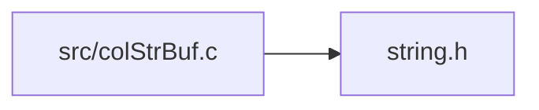

<a id="col_str_buf_8c"></a>
# File colStrBuf.c

![][C++]

**Location**: `src/colStrBuf.c`

This file implements the string buffer handling features of Colibri.

String buffers are used to build strings incrementally in an efficient manner, by appending individual characters or whole ropes. The current accumulated rope can be retrieved at any time.


**See also**: colStrBuf.h

## Includes

* [../include/colibri.h](colibri_8h.md#colibri_8h)
* [colInternal.h](col_internal_8h.md#col_internal_8h)
* [colWordInt.h](col_word_int_8h.md#col_word_int_8h)
* [colRopeInt.h](col_rope_int_8h.md#col_rope_int_8h)
* [colStrBufInt.h](col_str_buf_int_8h.md#col_str_buf_int_8h)
* <string.h>



## String Buffer Creation

<a id="group__strbuf__words_1ga44d7ab2d5a5ccb4a113497f56c297ef4"></a>
### Function Col\_MaxStringBufferLength

![][public]

```cpp
size_t Col_MaxStringBufferLength(Col_StringFormat format)
```

Get the maximum buffer length of string buffers.

**Returns**:

The max string buffer length.


**Parameters**:

* [Col\_StringFormat](colibri_8h.md#group__strings_1ga125054104f6260ea3902e6e46ebfdfa0) **format**: Format policy.

**Return type**: EXTERN size_t

<a id="group__strbuf__words_1ga8c3ba7df2adb643c5da323d7fd013cfb"></a>
### Function Col\_NewStringBuffer

![][public]

```cpp
Col_Word Col_NewStringBuffer(size_t capacity, Col_StringFormat format)
```

Create a new string buffer word.

?> The actual capacity will be rounded up to fit an even number of cells, and won't exceed the maximum value given by [Col\_MaxStringBufferLength(format)](col_str_buf_8h.md#group__strbuf__words_1ga44d7ab2d5a5ccb4a113497f56c297ef4).


**Returns**:

The new word.

**Exceptions**:

* **[COL\_ERROR\_STRBUF\_FORMAT](colibri_8h.md#group__error_1gga729084542ed9eae62009a84d3379ef35af19a91631001d2669a4a068b71162df3)**: [[V]](colibri_8h.md#group__error_1gga6dab009a0b8c4b4fa080cb9ba1859e9ea65d5e7232c82ae6972ac56f386a32fc9) **format**: String format not supported.

**Parameters**:

* size_t **capacity**: Maximum length of string buffer. If zero, use a default value.
* [Col\_StringFormat](colibri_8h.md#group__strings_1ga125054104f6260ea3902e6e46ebfdfa0) **format**: String format.

**Return type**: EXTERN [Col\_Word](col_word_8h.md#group__words_1gadb626f9e195212e4fdfba7df154ad043)

## String Buffer Accessors

<a id="group__strbuf__words_1gaee87791f6ba1919cec23d6aedaede4fa"></a>
### Function Col\_StringBufferFormat

![][public]

```cpp
Col_StringFormat Col_StringBufferFormat(Col_Word strbuf)
```

Get the character format used by the internal buffer.

**Returns**:

The string buffer format.


**See also**: [Col\_NewStringBuffer](col_str_buf_8h.md#group__strbuf__words_1ga8c3ba7df2adb643c5da323d7fd013cfb)

**Exceptions**:

* **[COL\_ERROR\_STRBUF](colibri_8h.md#group__error_1gga729084542ed9eae62009a84d3379ef35a24606ae882ebe15eceb13230471fe356)**: [[T]](colibri_8h.md#group__error_1gga6dab009a0b8c4b4fa080cb9ba1859e9ea603a58b9d5bb16fde0708eb0767e4904) **strbuf**: Not a string buffer.

**Parameters**:

* [Col\_Word](col_word_8h.md#group__words_1gadb626f9e195212e4fdfba7df154ad043) **strbuf**: String buffer to get length for.

**Return type**: EXTERN [Col\_StringFormat](colibri_8h.md#group__strings_1ga125054104f6260ea3902e6e46ebfdfa0)

<a id="group__strbuf__words_1ga14588604f194ea6b77f21e5550bed561"></a>
### Function Col\_StringBufferCapacity

![][public]

```cpp
size_t Col_StringBufferCapacity(Col_Word strbuf)
```

Get the capacity = maximum length of the string buffer.

**Returns**:

The string buffer capacity.


**See also**: [Col\_NewStringBuffer](col_str_buf_8h.md#group__strbuf__words_1ga8c3ba7df2adb643c5da323d7fd013cfb)

**Exceptions**:

* **[COL\_ERROR\_STRBUF](colibri_8h.md#group__error_1gga729084542ed9eae62009a84d3379ef35a24606ae882ebe15eceb13230471fe356)**: [[T]](colibri_8h.md#group__error_1gga6dab009a0b8c4b4fa080cb9ba1859e9ea603a58b9d5bb16fde0708eb0767e4904) **strbuf**: Not a string buffer.

**Parameters**:

* [Col\_Word](col_word_8h.md#group__words_1gadb626f9e195212e4fdfba7df154ad043) **strbuf**: String buffer to get capacity for.

**Return type**: EXTERN size_t

<a id="group__strbuf__words_1gaf5e822c1d9b6d2fc959a62600d3edadc"></a>
### Function Col\_StringBufferLength

![][public]

```cpp
size_t Col_StringBufferLength(Col_Word strbuf)
```

Get the current length of the string buffer.

**Returns**:

The string buffer length.

**Exceptions**:

* **[COL\_ERROR\_STRBUF](colibri_8h.md#group__error_1gga729084542ed9eae62009a84d3379ef35a24606ae882ebe15eceb13230471fe356)**: [[T]](colibri_8h.md#group__error_1gga6dab009a0b8c4b4fa080cb9ba1859e9ea603a58b9d5bb16fde0708eb0767e4904) **strbuf**: Not a string buffer.

**Parameters**:

* [Col\_Word](col_word_8h.md#group__words_1gadb626f9e195212e4fdfba7df154ad043) **strbuf**: String buffer to get length for.

**Return type**: EXTERN size_t

<a id="group__strbuf__words_1ga787a56365c2d75a98d67bce1f41b82e4"></a>
### Function Col\_StringBufferValue

![][public]

```cpp
Col_Word Col_StringBufferValue(Col_Word strbuf)
```

Get the current cumulated string.

**Returns**:

The string buffer string value.

**Exceptions**:

* **[COL\_ERROR\_STRBUF](colibri_8h.md#group__error_1gga729084542ed9eae62009a84d3379ef35a24606ae882ebe15eceb13230471fe356)**: [[T]](colibri_8h.md#group__error_1gga6dab009a0b8c4b4fa080cb9ba1859e9ea603a58b9d5bb16fde0708eb0767e4904) **strbuf**: Not a string buffer.


**Side Effect**:

Commit buffer into accumulated rope.

**Parameters**:

* [Col\_Word](col_word_8h.md#group__words_1gadb626f9e195212e4fdfba7df154ad043) **strbuf**: String buffer to get value for.

**Return type**: EXTERN [Col\_Word](col_word_8h.md#group__words_1gadb626f9e195212e4fdfba7df154ad043)

## String Buffer Operations

<a id="group__strbuf__words_1ga40425acea88a012954e2c9a3f1981585"></a>
### Function Col\_StringBufferAppendChar

![][public]

```cpp
int Col_StringBufferAppendChar(Col_Word strbuf, Col_Char c)
```

Append the given character to the string buffer.

**Return values**:

* **0**: if character was not appended (may occur when the character codepoint is unrepresentable in the target format).
* **<>0**: if character was appended.


**See also**: [Col\_StringBufferAppendRope](col_str_buf_8h.md#group__strbuf__words_1ga714dd6c258d3b715915d29d1b83d0cfa), [Col\_StringBufferAppendSequence](col_str_buf_8h.md#group__strbuf__words_1ga195c4aa02da672a1ccd60e99bf2f9927)

**Exceptions**:

* **[COL\_ERROR\_STRBUF](colibri_8h.md#group__error_1gga729084542ed9eae62009a84d3379ef35a24606ae882ebe15eceb13230471fe356)**: [[T]](colibri_8h.md#group__error_1gga6dab009a0b8c4b4fa080cb9ba1859e9ea603a58b9d5bb16fde0708eb0767e4904) **strbuf**: Not a string buffer.


**Side Effect**:

May commit buffer.

**Parameters**:

* [Col\_Word](col_word_8h.md#group__words_1gadb626f9e195212e4fdfba7df154ad043) **strbuf**: String buffer to append character to.
* [Col\_Char](colibri_8h.md#group__strings_1gab42ee0cd75b78280e412fa5bae5eb862) **c**: Character to append.

**Return type**: EXTERN int

<a id="group__strbuf__words_1ga714dd6c258d3b715915d29d1b83d0cfa"></a>
### Function Col\_StringBufferAppendRope

![][public]

```cpp
int Col_StringBufferAppendRope(Col_Word strbuf, Col_Word rope)
```

Append the given rope to the string buffer.

**Return values**:

* **0**: if not all characters were appended (may occur when some character codepoints are unrepresentable in the target format).
* **<>0**: if all characters were appended.


**See also**: [Col\_StringBufferAppendChar](col_str_buf_8h.md#group__strbuf__words_1ga40425acea88a012954e2c9a3f1981585), [Col\_StringBufferAppendSequence](col_str_buf_8h.md#group__strbuf__words_1ga195c4aa02da672a1ccd60e99bf2f9927)

**Exceptions**:

* **[COL\_ERROR\_STRBUF](colibri_8h.md#group__error_1gga729084542ed9eae62009a84d3379ef35a24606ae882ebe15eceb13230471fe356)**: [[T]](colibri_8h.md#group__error_1gga6dab009a0b8c4b4fa080cb9ba1859e9ea603a58b9d5bb16fde0708eb0767e4904) **strbuf**: Not a string buffer.


**Side Effect**:

May commit buffer.

**Parameters**:

* [Col\_Word](col_word_8h.md#group__words_1gadb626f9e195212e4fdfba7df154ad043) **strbuf**: String buffer to append rope to.
* [Col\_Word](col_word_8h.md#group__words_1gadb626f9e195212e4fdfba7df154ad043) **rope**: Rope to append.

**Return type**: EXTERN int

<a id="group__strbuf__words_1ga195c4aa02da672a1ccd60e99bf2f9927"></a>
### Function Col\_StringBufferAppendSequence

![][public]

```cpp
int Col_StringBufferAppendSequence(Col_Word strbuf, const Col_RopeIterator begin, const Col_RopeIterator end)
```

Append the given rope sequence to the string buffer.

**Return values**:

* **0**: if not all characters were appended (may occur when some character codepoints are unrepresentable in the target format).
* **<>0**: if all characters were appended.


**See also**: [Col\_StringBufferAppendChar](col_str_buf_8h.md#group__strbuf__words_1ga40425acea88a012954e2c9a3f1981585), [Col\_StringBufferAppendRope](col_str_buf_8h.md#group__strbuf__words_1ga714dd6c258d3b715915d29d1b83d0cfa)

**Exceptions**:

* **[COL\_ERROR\_STRBUF](colibri_8h.md#group__error_1gga729084542ed9eae62009a84d3379ef35a24606ae882ebe15eceb13230471fe356)**: [[T]](colibri_8h.md#group__error_1gga6dab009a0b8c4b4fa080cb9ba1859e9ea603a58b9d5bb16fde0708eb0767e4904) **strbuf**: Not a string buffer.

**Parameters**:

* [Col\_Word](col_word_8h.md#group__words_1gadb626f9e195212e4fdfba7df154ad043) **strbuf**: String buffer to append character sequence to.
* const [Col\_RopeIterator](col_rope_8h.md#group__rope__words_1ga1faf03f532034b5c89e1209d55c9f725) **begin**: First character in sequence.
* const [Col\_RopeIterator](col_rope_8h.md#group__rope__words_1ga1faf03f532034b5c89e1209d55c9f725) **end**: First character past sequence end.

**Return type**: EXTERN int

<a id="group__strbuf__words_1ga6a94ccd39253236811cdff44ebb5ccca"></a>
### Function Col\_StringBufferReserve

![][public]

```cpp
void * Col_StringBufferReserve(Col_Word strbuf, size_t length)
```

Reserve a number of characters for direct buffer access.

Characters can then be accessed as array elements using the format given at creation time.


**Return values**:

* **NULL**: if the buffer is too small to store the given number of characters.
* **pointer**: to the beginning of the reserved area.

**Exceptions**:

* **[COL\_ERROR\_STRBUF](colibri_8h.md#group__error_1gga729084542ed9eae62009a84d3379ef35a24606ae882ebe15eceb13230471fe356)**: [[T]](colibri_8h.md#group__error_1gga6dab009a0b8c4b4fa080cb9ba1859e9ea603a58b9d5bb16fde0708eb0767e4904) **strbuf**: Not a string buffer.


**Side Effect**:

May commit buffer.

**Parameters**:

* [Col\_Word](col_word_8h.md#group__words_1gadb626f9e195212e4fdfba7df154ad043) **strbuf**: String buffer to reserve into.
* size_t **length**: Number of characters to reserve. Must be <= [Col_StringBufferCapacity(strbuf)]([Col\_StringBufferCapacity](col_str_buf_8h.md#group__strbuf__words_1ga14588604f194ea6b77f21e5550bed561)).

**Return type**: EXTERN void *

<a id="group__strbuf__words_1gac0b7631165e900ef418d0431a424cb51"></a>
### Function Col\_StringBufferRelease

![][public]

```cpp
void Col_StringBufferRelease(Col_Word strbuf, size_t length)
```

Release previously reserved characters.


**Exceptions**:

* **[COL\_ERROR\_STRBUF](colibri_8h.md#group__error_1gga729084542ed9eae62009a84d3379ef35a24606ae882ebe15eceb13230471fe356)**: [[T]](colibri_8h.md#group__error_1gga6dab009a0b8c4b4fa080cb9ba1859e9ea603a58b9d5bb16fde0708eb0767e4904) **strbuf**: Not a string buffer.


**Side Effect**:

Decrease current length.

**Parameters**:

* [Col\_Word](col_word_8h.md#group__words_1gadb626f9e195212e4fdfba7df154ad043) **strbuf**: String buffer to release.
* size_t **length**: Number of characters to release.

**Return type**: EXTERN void

<a id="group__strbuf__words_1ga44bf90a157bbcdaddd00763e608a2a28"></a>
### Function Col\_StringBufferReset

![][public]

```cpp
void Col_StringBufferReset(Col_Word strbuf)
```

Empty the string buffer: reset buffer length & accumulated rope.


**Exceptions**:

* **[COL\_ERROR\_STRBUF](colibri_8h.md#group__error_1gga729084542ed9eae62009a84d3379ef35a24606ae882ebe15eceb13230471fe356)**: [[T]](colibri_8h.md#group__error_1gga6dab009a0b8c4b4fa080cb9ba1859e9ea603a58b9d5bb16fde0708eb0767e4904) **strbuf**: Not a string buffer.

**Parameters**:

* [Col\_Word](col_word_8h.md#group__words_1gadb626f9e195212e4fdfba7df154ad043) **strbuf**: String buffer to reset.

**Return type**: EXTERN void

<a id="group__strbuf__words_1gad40ef93666162a29b1913bec1b3a9715"></a>
### Function Col\_StringBufferFreeze

![][public]

```cpp
Col_Word Col_StringBufferFreeze(Col_Word strbuf)
```

Freeze the string buffer word, turning it into a rope.

**Returns**:

The accumulated rope so far.


**Side Effect**:

As the word may be transmuted into a rope, it can no longer be used as a string buffer.

**Exceptions**:

* **[COL\_ERROR\_STRBUF](colibri_8h.md#group__error_1gga729084542ed9eae62009a84d3379ef35a24606ae882ebe15eceb13230471fe356)**: [[T]](colibri_8h.md#group__error_1gga6dab009a0b8c4b4fa080cb9ba1859e9ea603a58b9d5bb16fde0708eb0767e4904) **strbuf**: Not a string buffer.

**Parameters**:

* [Col\_Word](col_word_8h.md#group__words_1gadb626f9e195212e4fdfba7df154ad043) **strbuf**: String buffer to freeze.

**Return type**: EXTERN [Col\_Word](col_word_8h.md#group__words_1gadb626f9e195212e4fdfba7df154ad043)

## Source

```cpp
/**
 * @file colStrBuf.c
 *
 * This file implements the string buffer handling features of Colibri.
 *
 * String buffers are used to build strings incrementally in an efficient
 * manner, by appending individual characters or whole ropes. The current
 * accumulated rope can be retrieved at any time.
 *
 * @see colStrBuf.h
 */

#include "../include/colibri.h"
#include "colInternal.h"

#include "colWordInt.h"
#include "colRopeInt.h"
#include "colStrBufInt.h"

#include <string.h>

/*
 * Prototypes for functions used only in this file.
 */

/*! \cond IGNORE */
static void             CommitBuffer(Col_Word strbuf);
/*! \endcond *//* IGNORE */


/*
===========================================================================*//*!
\weakgroup strbuf_words String Buffers
\{*//*==========================================================================
*/

/*******************************************************************************
 * String Buffer Creation
 ******************************************************************************/

/** @beginprivate @cond PRIVATE */

/**
 * Default size for string buffers.
 *
 * @see Col_NewStringBuffer
 */
#define STRBUF_DEFAULT_SIZE     5

/** @endcond @endprivate */

/**
 * Get the maximum buffer length of string buffers.
 *
 * @return The max string buffer length.
 */
size_t
Col_MaxStringBufferLength(
    Col_StringFormat format)    /*!< Format policy. */
{
    return STRBUF_MAX_LENGTH(STRBUF_MAX_SIZE * CELL_SIZE, format);
}

/**
 * Create a new string buffer word.
 *
 * @note
 *      The actual capacity will be rounded up to fit an even number of cells, 
 *      and won't exceed the maximum value given by
 *      [Col_MaxStringBufferLength(format)](@ref Col_MaxStringBufferLength).
 *
 * @return The new word.
 */
Col_Word
Col_NewStringBuffer(
    size_t capacity,            /*!< Maximum length of string buffer. If zero,
                                     use a default value. */
    Col_StringFormat format)    /*!< String format. */
{
    Col_Word strbuf;            /* Resulting word in the general case. */
    size_t size;                /* Number of allocated cells storing a minimum
                                 * of **capacity** elements. */

    /*
     * Check preconditions.
     */
    
    /*! @valuecheck{COL_ERROR_STRBUF_FORMAT,format} */
    VALUECHECK_STRBUF_FORMAT(format) return WORD_NIL;

    /*
     * Create a new string buffer word.
     */

    if (capacity == 0) {
        size = STRBUF_DEFAULT_SIZE;
    } else {
        size_t max = Col_MaxStringBufferLength(format);
        if (capacity > max) capacity = max;
        size = STRBUF_SIZE(capacity * CHAR_WIDTH(format));
        if (size > STRBUF_MAX_SIZE) size = STRBUF_MAX_SIZE;
    }
    strbuf = (Col_Word) AllocCells(size);
    WORD_STRBUF_INIT(strbuf, size, format);

    return strbuf;
}

/* End of String Buffer Creation */


/*******************************************************************************
 * String Buffer Accessors
 ******************************************************************************/

/**
 * Get the character format used by the internal buffer.
 *
 * @return The string buffer format.
 *
 * @see Col_NewStringBuffer
 */
Col_StringFormat
Col_StringBufferFormat(
    Col_Word strbuf)    /*!< String buffer to get length for. */
{
    /*
     * Check preconditions.
     */

    /*! @typecheck{COL_ERROR_STRBUF,strbuf} */
    TYPECHECK_STRBUF(strbuf) return 0;

    WORD_UNWRAP(strbuf);

    return (Col_StringFormat) WORD_STRBUF_FORMAT(strbuf);
}

/**
 * Get the capacity = maximum length of the string buffer.
 *
 * @return The string buffer capacity.
 *
 * @see Col_NewStringBuffer
 */
size_t
Col_StringBufferCapacity(
    Col_Word strbuf)    /*!< String buffer to get capacity for. */
{
    /*
     * Check preconditions.
     */

    /*! @typecheck{COL_ERROR_STRBUF,strbuf} */
    TYPECHECK_STRBUF(strbuf) return 0;

    WORD_UNWRAP(strbuf);

    return STRBUF_MAX_LENGTH(WORD_STRBUF_SIZE(strbuf) * CELL_SIZE,
            WORD_STRBUF_FORMAT(strbuf));
}

/**
 * Get the current length of the string buffer.
 *
 * @return The string buffer length.
 */
size_t
Col_StringBufferLength(
    Col_Word strbuf)    /*!< String buffer to get length for. */
{
    /*
     * Check preconditions.
     */

    /*! @typecheck{COL_ERROR_STRBUF,strbuf} */
    TYPECHECK_STRBUF(strbuf) return 0;

    WORD_UNWRAP(strbuf);

    /*
     * String buffer length is the cumulated string length plus the current
     * length of the character buffer.
     */

    return Col_RopeLength(WORD_STRBUF_ROPE(strbuf))
            + WORD_STRBUF_LENGTH(strbuf);
}

/**
 * Get the current cumulated string.
 *
 * @return The string buffer string value.
 */
Col_Word
Col_StringBufferValue(
    Col_Word strbuf)    /*!< String buffer to get value for. */
{
    /*
     * Check preconditions.
     */

    /*! @typecheck{COL_ERROR_STRBUF,strbuf} */
    TYPECHECK_STRBUF(strbuf) return WORD_NIL;

    WORD_UNWRAP(strbuf);

    /*!
     * @sideeffect
     * Commit buffer into accumulated rope.
     */
    CommitBuffer(strbuf);
    return WORD_STRBUF_ROPE(strbuf);
}

/* End of String Buffer Accessors */


/*******************************************************************************
 * String Buffer Operations
 ******************************************************************************/

/** @beginprivate @cond PRIVATE */

/**
 * Maximum length a rope must have to be appended character-wise into the
 * buffer, instead of being appended as a whole.
 */
#define MAX_SHORT_ROPE_LENGTH(format) \
        ((size_t)(3*CELL_SIZE*CHAR_WIDTH(format)))

/**
 * Commit buffered characters into accumulated rope and clear buffer.
 *
 * @see Col_StringBufferFormat
 * @see Col_StringBufferAppendChar
 * @see Col_StringBufferAppendRope
 * @see Col_StringBufferAppendSequence
 * @see Col_StringBufferReserve
 */
static void
CommitBuffer(
    Col_Word strbuf)    /*!< String buffer to commit. */
{
    Col_Word rope;
    size_t length;
    Col_StringFormat format;

    /*
     * Check preconditions.
     */

    ASSERT(Col_WordType(strbuf) & COL_STRBUF);
    ASSERT(WORD_TYPE(strbuf) != WORD_TYPE_WRAP);

    if ((length = WORD_STRBUF_LENGTH(strbuf)) == 0) {
        /*
         * Nothing to commit.
         */

        return;
    }

    /*
     * Create rope from buffer and append to accumulated rope.
     */

    format = (Col_StringFormat) WORD_STRBUF_FORMAT(strbuf);
    rope = Col_NewRope(format, WORD_STRBUF_BUFFER(strbuf),
            length * CHAR_WIDTH(format));
    WORD_STRBUF_ROPE(strbuf) = Col_ConcatRopes(WORD_STRBUF_ROPE(strbuf), rope);
    WORD_STRBUF_LENGTH(strbuf) = 0;
}

/** @endcond @endprivate */

/**
 * Append the given character to the string buffer.
 *
 * @retval 0    if character was not appended (may occur when the character
 *              codepoint is unrepresentable in the target format).
 * @retval <>0  if character was appended.
 *
 * @see Col_StringBufferAppendRope
 * @see Col_StringBufferAppendSequence
 */
int
Col_StringBufferAppendChar(
    Col_Word strbuf,    /*!< String buffer to append character to. */
    Col_Char c)         /*!< Character to append. */
{
    Col_StringFormat format;
    size_t maxLength;
    size_t width;

    /*
     * Check preconditions.
     */

    /*! @typecheck{COL_ERROR_STRBUF,strbuf} */
    TYPECHECK_STRBUF(strbuf) return 0;

    WORD_UNWRAP(strbuf);

    /*
     * Get character width.
     */

    format = (Col_StringFormat) WORD_STRBUF_FORMAT(strbuf);
    switch (format) {
    case COL_UCS1:
        width = (c <= COL_CHAR1_MAX) ? 1 : 0;
        break;

    case COL_UCS2:
        width = (c <= COL_CHAR2_MAX) ? 1 : 0;
        break;

    default:
        /* No-loss formats */
        width = 1;
    }
    if (width == 0) {
        /*
         * Lost character.
         */

        return 0;
    }

    maxLength = STRBUF_MAX_LENGTH(WORD_STRBUF_SIZE(strbuf) * CELL_SIZE, format);
    if (WORD_STRBUF_LENGTH(strbuf) + width > maxLength) {
        /*
         * Buffer is full, commit first.
         */

        /*!
         * @sideeffect
         * May commit buffer.
         */
        CommitBuffer(strbuf);
        ASSERT(WORD_STRBUF_LENGTH(strbuf) == 0);
    }

    /*
     * Append character into buffer.
     */

    switch (format) {
    case COL_UCS1:
        ((Col_Char1 *) WORD_STRBUF_BUFFER(strbuf))[WORD_STRBUF_LENGTH(strbuf)]
                = c;
        break;

    case COL_UCS2:
        ((Col_Char2 *) WORD_STRBUF_BUFFER(strbuf))[WORD_STRBUF_LENGTH(strbuf)]
                = c;
        break;

    default:
        ((Col_Char4 *) WORD_STRBUF_BUFFER(strbuf))[WORD_STRBUF_LENGTH(strbuf)]
                = c;
    }
    WORD_STRBUF_LENGTH(strbuf) += width;
    return 1;
}

/**
 * Append the given rope to the string buffer.
 *
 * @retval 0    if not all characters were appended (may occur when some
 *              character codepoints are unrepresentable in the target
 *              format).
 * @retval <>0  if all characters were appended.
 *
 * @see Col_StringBufferAppendChar
 * @see Col_StringBufferAppendSequence
 */
int
Col_StringBufferAppendRope(
    Col_Word strbuf,    /*!< String buffer to append rope to. */
    Col_Word rope)      /*!< Rope to append. */
{
    Col_StringFormat format;
    size_t length, ropeLength;
    Col_Word rope2;

    /*
     * Check preconditions.
     */

    /*! @typecheck{COL_ERROR_STRBUF,strbuf} */
    TYPECHECK_STRBUF(strbuf) return 0;

    if ((ropeLength = Col_RopeLength(rope)) == 0) {
        /*
         * Nothing to do.
         */

        return 1;
    }

    WORD_UNWRAP(strbuf);

    format = (Col_StringFormat) WORD_STRBUF_FORMAT(strbuf);
    if ((length = WORD_STRBUF_LENGTH(strbuf)) > 0) {
        /*
         * Buffer is not empty.
         */

        if (ropeLength < MAX_SHORT_ROPE_LENGTH(format)
                && ropeLength <= STRBUF_MAX_LENGTH(WORD_STRBUF_SIZE(strbuf)
                * CELL_SIZE, format) - length) {
            /*
             * Rope is short and fits into buffer, append character-wise.
             */

            Col_RopeIterator it;
            int noLoss = 1;
            for (Col_RopeIterFirst(it, rope); !Col_RopeIterEnd(it);
                    Col_RopeIterNext(it)) {
                noLoss &= Col_StringBufferAppendChar(strbuf,
                        Col_RopeIterAt(it));
            }
            return noLoss;
        }

        /*
         * Commit buffer before appending rope.
         */

        /*!
         * @sideeffect
         * May commit buffer.
         */
        CommitBuffer(strbuf);
    }

    /*
     * Normalize & append rope.
     */

    ASSERT(WORD_STRBUF_LENGTH(strbuf) == 0);
    rope2 = Col_NormalizeRope(rope, format, COL_CHAR_INVALID, 0);
    WORD_STRBUF_ROPE(strbuf) = Col_ConcatRopes(WORD_STRBUF_ROPE(strbuf), rope2);
    return (Col_RopeLength(rope2) == ropeLength);
}

/**
 * Append the given rope sequence to the string buffer.
 *
 * @retval 0    if not all characters were appended (may occur when some
 *              character codepoints are unrepresentable in the target
 *              format).
 * @retval <>0  if all characters were appended.
 *
 * @see Col_StringBufferAppendChar
 * @see Col_StringBufferAppendRope
 */
int
Col_StringBufferAppendSequence(
    Col_Word strbuf,                /*!< String buffer to append character
                                         sequence to. */
    const Col_RopeIterator begin,   /*!< First character in sequence. */
    const Col_RopeIterator end)     /*!< First character past sequence end. */
{
    Col_StringFormat format;
    Col_Word rope;

    /*
     * Check preconditions.
     */

    /*! @typecheck{COL_ERROR_STRBUF,strbuf} */
    TYPECHECK_STRBUF(strbuf) return 0;

    if (Col_RopeIterCompare(begin, end) >= 0) {
        /*
         * Nothing to do.
         */

        return 1;
    }

    WORD_UNWRAP(strbuf);

    rope = Col_RopeIterRope(begin);
    format = (Col_StringFormat) WORD_STRBUF_FORMAT(strbuf);
    if (!rope || (Col_RopeIterIndex(end) - Col_RopeIterIndex(begin))
            <= STRBUF_MAX_LENGTH(WORD_STRBUF_SIZE(strbuf)
            * CELL_SIZE, format) - WORD_STRBUF_LENGTH(strbuf)) {
        /*
         * Sequence is in string mode or fits into buffer, append
         * character-wise.
         */

        Col_RopeIterator it;
        int noLoss = 1;
        for (Col_RopeIterSet(it, begin); Col_RopeIterCompare(it, end) < 0;
                Col_RopeIterNext(it)) {
            noLoss &= Col_StringBufferAppendChar(strbuf, Col_RopeIterAt(it));
        }
        return noLoss;
    }

    /*
     * Append subrope.
     */

    return Col_StringBufferAppendRope(strbuf, Col_Subrope(rope,
            Col_RopeIterIndex(begin), Col_RopeIterIndex(end)-1));
}

/**
 * Reserve a number of characters for direct buffer access. Characters can
 * then be accessed as array elements using the format given at creation time.
 *
 *
 * @retval NULL     if the buffer is too small to store the given number of
 *                  characters.
 * @retval pointer  to the beginning of the reserved area.
 */
void *
Col_StringBufferReserve(
    Col_Word strbuf,    /*!< String buffer to reserve into. */
    size_t length)      /*!< Number of characters to reserve. Must be <=
                             [Col_StringBufferCapacity(strbuf)](@ref Col_StringBufferCapacity).
                         */
{
    Col_StringFormat format;
    size_t maxLength;
    const char *data;

    /*
     * Check preconditions.
     */

    /*! @typecheck{COL_ERROR_STRBUF,strbuf} */
    TYPECHECK_STRBUF(strbuf) return NULL;

    WORD_UNWRAP(strbuf);

    if (length == 0) {
        /*
        * No-op.
        */

        return NULL;
    }

    format = (Col_StringFormat) WORD_STRBUF_FORMAT(strbuf);
    maxLength = STRBUF_MAX_LENGTH(WORD_STRBUF_SIZE(strbuf) * CELL_SIZE,
            format);
    if (length > maxLength) {
        /*
         * Not enough room.
         */

        return NULL;
    }

    ASSERT(WORD_STRBUF_LENGTH(strbuf) <= maxLength);
    if (length > maxLength - WORD_STRBUF_LENGTH(strbuf)) {
        /*
         * Not enough remaining space, commit buffer first.
         */

        /*!
         * @sideeffect
         * May commit buffer.
         */
        CommitBuffer(strbuf);
        ASSERT(WORD_STRBUF_LENGTH(strbuf) == 0);
    }

    /*
     * Reserve area by shifting current length.
     */

    ASSERT(WORD_STRBUF_LENGTH(strbuf) + length <= maxLength);
    data = WORD_STRBUF_BUFFER(strbuf)
            + CHAR_WIDTH(format) * WORD_STRBUF_LENGTH(strbuf);
    WORD_STRBUF_LENGTH(strbuf) += length;
    return (void *) data;
}

/**
 * Release previously reserved characters.
 */
void
Col_StringBufferRelease(
    Col_Word strbuf,    /*!< String buffer to release. */
    size_t length)      /*!< Number of characters to release. */
{
    /*
     * Check preconditions.
     */

    /*! @typecheck{COL_ERROR_STRBUF,strbuf} */
    TYPECHECK_STRBUF(strbuf) return;

    WORD_UNWRAP(strbuf);

    if (WORD_STRBUF_LENGTH(strbuf) < length) {
        WORD_STRBUF_LENGTH(strbuf) = 0;
    } else {
        /*!
         * @sideeffect
         * Decrease current length.
         */
        WORD_STRBUF_LENGTH(strbuf) -= length;
    }
}

/**
 * Empty the string buffer: reset buffer length & accumulated rope.
 */
void
Col_StringBufferReset(
    Col_Word strbuf)    /*!< String buffer to reset. */
{
    /*
     * Check preconditions.
     */

    /*! @typecheck{COL_ERROR_STRBUF,strbuf} */
    TYPECHECK_STRBUF(strbuf) return;

    WORD_UNWRAP(strbuf);

    WORD_STRBUF_ROPE(strbuf) = WORD_SMALLSTR_EMPTY;
    WORD_STRBUF_LENGTH(strbuf) = 0;
}

/**
 * Freeze the string buffer word, turning it into a rope.
 *
 * @return The accumulated rope so far.
 *
 * @sideeffect
 *      As the word may be transmuted into a rope, it can no longer be used as a
 *      string buffer.
 */
Col_Word
Col_StringBufferFreeze(
    Col_Word strbuf)    /*!< String buffer to freeze. */
{
    Col_StringFormat format;
    size_t length;
    int pinned;

    /*
     * Check preconditions.
     */

    /*! @typecheck{COL_ERROR_STRBUF,strbuf} */
    TYPECHECK_STRBUF(strbuf) return WORD_NIL;

    WORD_UNWRAP(strbuf);

    length = WORD_STRBUF_LENGTH(strbuf);
    if (length == 0 || WORD_STRBUF_ROPE(strbuf) != WORD_SMALLSTR_EMPTY) {
        /*
         * Buffer is empty or accumulated rope is not, return value.
         */

        return Col_StringBufferValue(strbuf);
    }

    /*
     * Turn word into rope.
     */

    pinned = WORD_PINNED(strbuf);
    format = (Col_StringFormat) WORD_STRBUF_FORMAT(strbuf);
    switch (format) {
    case COL_UCS1:
    case COL_UCS2:
    case COL_UCS4:
        if (length > (format == COL_UCS1 ? SMALLSTR_MAX_LENGTH : 1)
                && length <= UCSSTR_MAX_LENGTH) {
            /*
             * Convert word in-place.
             */

            ASSERT(UCSSTR_HEADER_SIZE <= STRBUF_HEADER_SIZE);
            WORD_UCSSTR_INIT(strbuf, format, length);
            if (pinned) {
                WORD_SET_PINNED(strbuf);
            }
            memcpy((void *) WORD_UCSSTR_DATA(strbuf),
                    WORD_STRBUF_BUFFER(strbuf),
                    length * CHAR_WIDTH(format));
            return strbuf;
        }
        break;

    case COL_UCS:
        if (length <= UCSSTR_MAX_LENGTH) {
            /*
             * Compute format.
             */

            Col_Char4 *data = (Col_Char4 *) WORD_STRBUF_BUFFER(strbuf);
            size_t i;
            format = COL_UCS1;
            for (i=0; i < length; i++) {
                if (data[i] > COL_CHAR2_MAX) {
                    format = COL_UCS4;
                    break;
                } else if (data[i] > COL_CHAR1_MAX) {
                    format = COL_UCS2;
                }
            }

            if (length <= (format == COL_UCS1 ? SMALLSTR_MAX_LENGTH : 1)) {
                /*
                 * Fits immediate string.
                 */

                break;
            }

            /*
             * Convert word in-place.
             */

            ASSERT(UCSSTR_HEADER_SIZE <= STRBUF_HEADER_SIZE);
            WORD_UCSSTR_INIT(strbuf, format, length);
            if (pinned) {
                WORD_SET_PINNED(strbuf);
            }
            if (format == COL_UCS1) {
                Col_Char1 *data1 = (Col_Char1 *) WORD_UCSSTR_DATA(strbuf);
                for (i=0; i < length; i++) {
                    *data1++ = *data++;
                }
            } else if (format == COL_UCS2) {
                Col_Char2 *data2 = (Col_Char2 *) WORD_UCSSTR_DATA(strbuf);
                for (i=0; i < length; i++) {
                    *data2++ = *data++;
                }
            } else {
                ASSERT(format == COL_UCS4);
                memcpy((void *) WORD_UCSSTR_DATA(strbuf),
                        WORD_STRBUF_BUFFER(strbuf),
                        length * CHAR_WIDTH(format));
            }
            return strbuf;
        }
        break;
    }

    /*
     * Could not convert in-place (either too large or fits immediate word),
     * return value.
     */

    return Col_StringBufferValue(strbuf);
}

/* End of String Buffer Operations */

/* End of String Buffers *//*!\}*/
```

[public]: https://img.shields.io/badge/-public-brightgreen (public)
[C++]: https://img.shields.io/badge/language-C%2B%2B-blue (C++)
[Markdown]: https://img.shields.io/badge/language-Markdown-blue (Markdown)
[private]: https://img.shields.io/badge/-private-red (private)
[static]: https://img.shields.io/badge/-static-lightgrey (static)