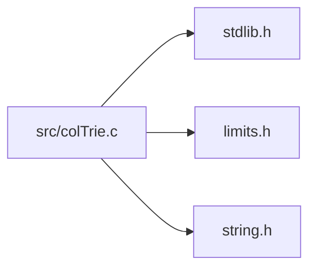

<a id="col_trie_8c"></a>
# File colTrie.c

![][C++]

**Location**: `src/colTrie.c`

This file implements the trie map handling features of Colibri.

Trie maps are an implementation of generic [Maps](group__map__words.md#group__map__words) that use crit-bit trees for string, integer and custom keys.


They are always mutable.


**See also**: colTrie.h, colMap.h

## Includes

* [../include/colibri.h](colibri_8h.md#colibri_8h)
* [colInternal.h](col_internal_8h.md#col_internal_8h)
* [colWordInt.h](col_word_int_8h.md#col_word_int_8h)
* [colMapInt.h](col_map_int_8h.md#col_map_int_8h)
* [colTrieInt.h](col_trie_int_8h.md#col_trie_int_8h)
* <stdlib.h>
* <limits.h>
* <string.h>



## Trie Map Creation

<a id="group__triemap__words_1ga41fcb3cc5b729930b9a9c405f4fabc25"></a>
### Function Col\_NewStringTrieMap

![][public]

```cpp
Col_Word Col_NewStringTrieMap()
```

Create a new string trie map word.

**Returns**:

The new word.


**Return type**: EXTERN [Col\_Word](col_word_8h.md#group__words_1gadb626f9e195212e4fdfba7df154ad043)

<a id="group__triemap__words_1ga774d1c17ace439ef92703934652ccec0"></a>
### Function Col\_NewIntTrieMap

![][public]

```cpp
Col_Word Col_NewIntTrieMap()
```

Create a new integer trie map word.

**Returns**:

The new word.


**Return type**: EXTERN [Col\_Word](col_word_8h.md#group__words_1gadb626f9e195212e4fdfba7df154ad043)

<a id="group__triemap__words_1ga34e494c0bafde72774a578643bb84a68"></a>
### Function Col\_CopyTrieMap

![][public]

```cpp
Col_Word Col_CopyTrieMap(Col_Word map)
```

Create a new trie map word from an existing one.

?> Only the trie map structure is copied, the contained words are not (i.e. this is not a deep copy).


**Returns**:

The new word.


**Side Effect**:

Source map content is frozen.

**Exceptions**:

* **[COL\_ERROR\_TRIEMAP](colibri_8h.md#group__error_1gga729084542ed9eae62009a84d3379ef35a0622eefca9ad7bfcd98ef21080611bb3)**: [[T]](colibri_8h.md#group__error_1gga6dab009a0b8c4b4fa080cb9ba1859e9ea603a58b9d5bb16fde0708eb0767e4904) **map**: Not a trie map.

**Parameters**:

* [Col\_Word](col_word_8h.md#group__words_1gadb626f9e195212e4fdfba7df154ad043) **map**: Trie map to copy.

**Return type**: EXTERN [Col\_Word](col_word_8h.md#group__words_1gadb626f9e195212e4fdfba7df154ad043)

## Trie Map Accessors

<a id="group__triemap__words_1ga60077ee297a2a45306a8d2e9107ddd4c"></a>
### Function Col\_TrieMapGet

![][public]

```cpp
int Col_TrieMapGet(Col_Word map, Col_Word key, Col_Word *valuePtr)
```

Get value mapped to the given key if present.

**Return values**:

* **0**: if the key wasn't found.
* **<>0**: if the key was found, in this case the value is returned through **valuePtr**.


**See also**: [Col\_MapGet](col_map_8h.md#group__map__words_1gabd075578f35ec7a706654e94aba281d9)

**Exceptions**:

* **[COL\_ERROR\_WORDTRIEMAP](colibri_8h.md#group__error_1gga729084542ed9eae62009a84d3379ef35ac284ba5976b713b7a2db37bace5620fb)**: [[T]](colibri_8h.md#group__error_1gga6dab009a0b8c4b4fa080cb9ba1859e9ea603a58b9d5bb16fde0708eb0767e4904) **map**: Not a string or word-keyed trie map.

**Parameters**:

* [Col\_Word](col_word_8h.md#group__words_1gadb626f9e195212e4fdfba7df154ad043) **map**: Trie map to get entry for.
* [Col\_Word](col_word_8h.md#group__words_1gadb626f9e195212e4fdfba7df154ad043) **key**: Entry key. Can be any word type, including string, however it must match the actual type used by the map.
* [Col\_Word](col_word_8h.md#group__words_1gadb626f9e195212e4fdfba7df154ad043) * **valuePtr**: [out] Returned entry value, if found.

**Return type**: EXTERN int

<a id="group__triemap__words_1gafb5c74dcca8204a0b83e6d1fa9325026"></a>
### Function Col\_IntTrieMapGet

![][public]

```cpp
int Col_IntTrieMapGet(Col_Word map, intptr_t key, Col_Word *valuePtr)
```

Get value mapped to the given integer key if present.

**Return values**:

* **0**: if the key wasn't found.
* **<>0**: if the key was found, in this case the value is returned through **valuePtr**.


**See also**: [Col\_IntMapGet](col_map_8h.md#group__map__words_1ga4f96f7436cc66537b05841c5b088eef2)

**Exceptions**:

* **[COL\_ERROR\_INTTRIEMAP](colibri_8h.md#group__error_1gga729084542ed9eae62009a84d3379ef35ad77018799a3606551c4a3a66f6285b49)**: [[T]](colibri_8h.md#group__error_1gga6dab009a0b8c4b4fa080cb9ba1859e9ea603a58b9d5bb16fde0708eb0767e4904) **map**: Not an integer-keyed trie map.

**Parameters**:

* [Col\_Word](col_word_8h.md#group__words_1gadb626f9e195212e4fdfba7df154ad043) **map**: Integer trie map to get entry for.
* intptr_t **key**: Integer entry key
* [Col\_Word](col_word_8h.md#group__words_1gadb626f9e195212e4fdfba7df154ad043) * **valuePtr**: [out] Returned entry value, if found.

**Return type**: EXTERN int

<a id="group__triemap__words_1ga05580df1648d9d53b333ac6da24de26d"></a>
### Function Col\_TrieMapSet

![][public]

```cpp
int Col_TrieMapSet(Col_Word map, Col_Word key, Col_Word value)
```

Map the value to the key, replacing any existing.

**Return values**:

* **0**: if an existing entry was updated with **value**.
* **<>0**: if a new entry was created with **key** and **value**.


**See also**: [Col\_MapSet](col_map_8h.md#group__map__words_1ga82b31e62df46ff382e18241bdcde49e3)

**Exceptions**:

* **[COL\_ERROR\_WORDTRIEMAP](colibri_8h.md#group__error_1gga729084542ed9eae62009a84d3379ef35ac284ba5976b713b7a2db37bace5620fb)**: [[T]](colibri_8h.md#group__error_1gga6dab009a0b8c4b4fa080cb9ba1859e9ea603a58b9d5bb16fde0708eb0767e4904) **map**: Not a string or word-keyed trie map.

**Parameters**:

* [Col\_Word](col_word_8h.md#group__words_1gadb626f9e195212e4fdfba7df154ad043) **map**: Trie map to insert entry into.
* [Col\_Word](col_word_8h.md#group__words_1gadb626f9e195212e4fdfba7df154ad043) **key**: Entry key. Can be any word type, including string, however it must match the actual type used by the map.
* [Col\_Word](col_word_8h.md#group__words_1gadb626f9e195212e4fdfba7df154ad043) **value**: Entry value.

**Return type**: EXTERN int

<a id="group__triemap__words_1ga93b4e0529f287e7116fc7e6ecd5a5859"></a>
### Function Col\_IntTrieMapSet

![][public]

```cpp
int Col_IntTrieMapSet(Col_Word map, intptr_t key, Col_Word value)
```

Map the value to the integer key, replacing any existing.

**Return values**:

* **0**: if an existing entry was updated with **value**.
* **<>0**: if a new entry was created with **key** and **value**.


**See also**: [Col\_IntMapSet](col_map_8h.md#group__map__words_1ga27a694b6de40e1a3af81379a7056754d)

**Exceptions**:

* **[COL\_ERROR\_INTTRIEMAP](colibri_8h.md#group__error_1gga729084542ed9eae62009a84d3379ef35ad77018799a3606551c4a3a66f6285b49)**: [[T]](colibri_8h.md#group__error_1gga6dab009a0b8c4b4fa080cb9ba1859e9ea603a58b9d5bb16fde0708eb0767e4904) **map**: Not an integer-keyed trie map.

**Parameters**:

* [Col\_Word](col_word_8h.md#group__words_1gadb626f9e195212e4fdfba7df154ad043) **map**: Integer trie map to insert entry into.
* intptr_t **key**: Integer entry key.
* [Col\_Word](col_word_8h.md#group__words_1gadb626f9e195212e4fdfba7df154ad043) **value**: Entry value.

**Return type**: EXTERN int

<a id="group__triemap__words_1gaab7c1e33efc9b0e1fb913951d4b61fc2"></a>
### Function Col\_TrieMapUnset

![][public]

```cpp
int Col_TrieMapUnset(Col_Word map, Col_Word key)
```

Remove any value mapped to the given key.

**Return values**:

* **0**: if no entry matching **key** was found.
* **<>0**: if the existing entry was removed.


**See also**: [Col\_MapUnset](col_map_8h.md#group__map__words_1ga1f48ed3390f9a53cde268533a763e638)

**Exceptions**:

* **[COL\_ERROR\_WORDTRIEMAP](colibri_8h.md#group__error_1gga729084542ed9eae62009a84d3379ef35ac284ba5976b713b7a2db37bace5620fb)**: [[T]](colibri_8h.md#group__error_1gga6dab009a0b8c4b4fa080cb9ba1859e9ea603a58b9d5bb16fde0708eb0767e4904) **map**: Not a string or word-keyed trie map.

**Parameters**:

* [Col\_Word](col_word_8h.md#group__words_1gadb626f9e195212e4fdfba7df154ad043) **map**: Trie map to remove entry from.
* [Col\_Word](col_word_8h.md#group__words_1gadb626f9e195212e4fdfba7df154ad043) **key**: Entry key. Can be any word type, including string, however it must match the actual type used by the map.

**Return type**: EXTERN int

<a id="group__triemap__words_1gae11e5dcae95319e4fa94aec1f278909d"></a>
### Function Col\_IntTrieMapUnset

![][public]

```cpp
int Col_IntTrieMapUnset(Col_Word map, intptr_t key)
```

Remove any value mapped to the given integer key.

**Return values**:

* **0**: if no entry matching **key** was found.
* **<>0**: if the existing entry was removed.


**See also**: [Col\_IntMapUnset](col_map_8h.md#group__map__words_1gac2ae366ebe1ec3a4495128cb1400d1cf)

**Exceptions**:

* **[COL\_ERROR\_INTTRIEMAP](colibri_8h.md#group__error_1gga729084542ed9eae62009a84d3379ef35ad77018799a3606551c4a3a66f6285b49)**: [[T]](colibri_8h.md#group__error_1gga6dab009a0b8c4b4fa080cb9ba1859e9ea603a58b9d5bb16fde0708eb0767e4904) **map**: Not an integer-keyed trie map.

**Parameters**:

* [Col\_Word](col_word_8h.md#group__words_1gadb626f9e195212e4fdfba7df154ad043) **map**: Integer trie map to remove entry from.
* intptr_t **key**: Integer entry key.

**Return type**: EXTERN int

## Trie Map Iteration

<a id="group__triemap__words_1ga85159bdeec81a97106171f745204fbdd"></a>
### Function Col\_TrieMapIterFirst

![][public]

```cpp
void Col_TrieMapIterFirst(Col_MapIterator it, Col_Word map)
```

Initialize the map iterator so that it points to the first entry within the trie map.

**See also**: [Col\_MapIterBegin](col_map_8h.md#group__map__words_1gab8f4a0de6b264bbe59c332b41a22866a)

**Exceptions**:

* **[COL\_ERROR\_TRIEMAP](colibri_8h.md#group__error_1gga729084542ed9eae62009a84d3379ef35a0622eefca9ad7bfcd98ef21080611bb3)**: [[T]](colibri_8h.md#group__error_1gga6dab009a0b8c4b4fa080cb9ba1859e9ea603a58b9d5bb16fde0708eb0767e4904) **map**: Not a trie map.

**Parameters**:

* [Col\_MapIterator](col_map_8h.md#group__map__words_1ga33d331116aff3f3d03a231ccbbce40c2) **it**: Iterator to initialize.
* [Col\_Word](col_word_8h.md#group__words_1gadb626f9e195212e4fdfba7df154ad043) **map**: Trie map to iterate over.

**Return type**: EXTERN void

<a id="group__triemap__words_1gadef108e47ee9b3abe7e0348c4e288df1"></a>
### Function Col\_TrieMapIterLast

![][public]

```cpp
void Col_TrieMapIterLast(Col_MapIterator it, Col_Word map)
```

Initialize the map iterator so that it points to the last entry within the trie map.


**Exceptions**:

* **[COL\_ERROR\_TRIEMAP](colibri_8h.md#group__error_1gga729084542ed9eae62009a84d3379ef35a0622eefca9ad7bfcd98ef21080611bb3)**: [[T]](colibri_8h.md#group__error_1gga6dab009a0b8c4b4fa080cb9ba1859e9ea603a58b9d5bb16fde0708eb0767e4904) **map**: Not a trie map.

**Parameters**:

* [Col\_MapIterator](col_map_8h.md#group__map__words_1ga33d331116aff3f3d03a231ccbbce40c2) **it**: Iterator to initialize.
* [Col\_Word](col_word_8h.md#group__words_1gadb626f9e195212e4fdfba7df154ad043) **map**: Trie map to iterate over.

**Return type**: EXTERN void

<a id="group__triemap__words_1gab594f8e0086ad33bb029be6bc219a766"></a>
### Function Col\_TrieMapIterFind

![][public]

```cpp
void Col_TrieMapIterFind(Col_MapIterator it, Col_Word map, Col_Word key, int *createPtr)
```

Initialize the map iterator so that it points to the entry with the given key within the trie map.

**See also**: [Col\_MapIterFind](col_map_8h.md#group__map__words_1gaa925d7d32221bc826e9717930c2602e1)

**Exceptions**:

* **[COL\_ERROR\_WORDTRIEMAP](colibri_8h.md#group__error_1gga729084542ed9eae62009a84d3379ef35ac284ba5976b713b7a2db37bace5620fb)**: [[T]](colibri_8h.md#group__error_1gga6dab009a0b8c4b4fa080cb9ba1859e9ea603a58b9d5bb16fde0708eb0767e4904) **map**: Not a string or word-keyed trie map.

**Parameters**:

* [Col\_MapIterator](col_map_8h.md#group__map__words_1ga33d331116aff3f3d03a231ccbbce40c2) **it**: Iterator to initialize.
* [Col\_Word](col_word_8h.md#group__words_1gadb626f9e195212e4fdfba7df154ad043) **map**: Trie map to iterate over.
* [Col\_Word](col_word_8h.md#group__words_1gadb626f9e195212e4fdfba7df154ad043) **key**: Entry key. Can be any word type, including string, however it must match the actual type used by the map.
* int * **createPtr**: [in,out] If non-NULL, whether to create entry if absent on input, and whether an entry was created on output.

**Return type**: EXTERN void

<a id="group__triemap__words_1gaae7f3d5178448023db25fbf6fd8c8f7a"></a>
### Function Col\_IntTrieMapIterFind

![][public]

```cpp
void Col_IntTrieMapIterFind(Col_MapIterator it, Col_Word map, intptr_t key, int *createPtr)
```

Initialize the map iterator so that it points to the entry with the given integer key within the integer trie map.

**See also**: [Col\_IntMapIterFind](col_map_8h.md#group__map__words_1ga8c332381607b0dc828b4aa96fa8f1a12)

**Exceptions**:

* **[COL\_ERROR\_INTTRIEMAP](colibri_8h.md#group__error_1gga729084542ed9eae62009a84d3379ef35ad77018799a3606551c4a3a66f6285b49)**: [[T]](colibri_8h.md#group__error_1gga6dab009a0b8c4b4fa080cb9ba1859e9ea603a58b9d5bb16fde0708eb0767e4904) **map**: Not an integer-keyed trie map.

**Parameters**:

* [Col\_MapIterator](col_map_8h.md#group__map__words_1ga33d331116aff3f3d03a231ccbbce40c2) **it**: Iterator to initialize.
* [Col\_Word](col_word_8h.md#group__words_1gadb626f9e195212e4fdfba7df154ad043) **map**: Integer trie map to iterate over.
* intptr_t **key**: Integer entry key.
* int * **createPtr**: [in,out] If non-NULL, whether to create entry if absent on input, and whether an entry was created on output.

**Return type**: EXTERN void

<a id="group__triemap__words_1gafc72ceec13f40a18b38fd1d3f639eb25"></a>
### Function Col\_TrieMapIterSetValue

![][public]

```cpp
void Col_TrieMapIterSetValue(Col_MapIterator it, Col_Word value)
```

Set value of trie map iterator.

**See also**: [Col\_MapIterSetValue](col_map_8h.md#group__map__words_1ga8c5d3a82b6cb5b7af6f16ebed863736f)

**Exceptions**:

* **[COL\_ERROR\_MAPITER](colibri_8h.md#group__error_1gga729084542ed9eae62009a84d3379ef35aa66f57346b0a9eac571308e75fb1f8ec)**: [[T]](colibri_8h.md#group__error_1gga6dab009a0b8c4b4fa080cb9ba1859e9ea603a58b9d5bb16fde0708eb0767e4904) **it**: Invalid map iterator.
* **[COL\_ERROR\_TRIEMAP](colibri_8h.md#group__error_1gga729084542ed9eae62009a84d3379ef35a0622eefca9ad7bfcd98ef21080611bb3)**: [[T]](colibri_8h.md#group__error_1gga6dab009a0b8c4b4fa080cb9ba1859e9ea603a58b9d5bb16fde0708eb0767e4904) **[Col\_MapIterMap(it)](col_map_8h.md#group__map__words_1gac6f818f3c753f4e2668367155fa42686)**: Not a trie map.
* **[COL\_ERROR\_MAPITER\_END](colibri_8h.md#group__error_1gga729084542ed9eae62009a84d3379ef35a1a834ed5a623ccf3120ccec5d0d60653)**: [[V]](colibri_8h.md#group__error_1gga6dab009a0b8c4b4fa080cb9ba1859e9ea65d5e7232c82ae6972ac56f386a32fc9) **it**: Map iterator at end.

**Parameters**:

* [Col\_MapIterator](col_map_8h.md#group__map__words_1ga33d331116aff3f3d03a231ccbbce40c2) **it**: Map iterator to set value for.
* [Col\_Word](col_word_8h.md#group__words_1gadb626f9e195212e4fdfba7df154ad043) **value**: Value to set.

**Return type**: EXTERN void

<a id="group__triemap__words_1ga32669199d42452d1c5ed4db4635097de"></a>
### Function Col\_TrieMapIterNext

![][public]

```cpp
void Col_TrieMapIterNext(Col_MapIterator it)
```

Move the iterator to the next element.

**See also**: [Col\_MapIterNext](col_map_8h.md#group__map__words_1ga961449849237659a09dbf4cae436e38c)

**Exceptions**:

* **[COL\_ERROR\_MAPITER](colibri_8h.md#group__error_1gga729084542ed9eae62009a84d3379ef35aa66f57346b0a9eac571308e75fb1f8ec)**: [[T]](colibri_8h.md#group__error_1gga6dab009a0b8c4b4fa080cb9ba1859e9ea603a58b9d5bb16fde0708eb0767e4904) **it**: Invalid map iterator.
* **[COL\_ERROR\_TRIEMAP](colibri_8h.md#group__error_1gga729084542ed9eae62009a84d3379ef35a0622eefca9ad7bfcd98ef21080611bb3)**: [[T]](colibri_8h.md#group__error_1gga6dab009a0b8c4b4fa080cb9ba1859e9ea603a58b9d5bb16fde0708eb0767e4904) **[Col\_MapIterMap(it)](col_map_8h.md#group__map__words_1gac6f818f3c753f4e2668367155fa42686)**: Not a trie map.
* **[COL\_ERROR\_MAPITER\_END](colibri_8h.md#group__error_1gga729084542ed9eae62009a84d3379ef35a1a834ed5a623ccf3120ccec5d0d60653)**: [[V]](colibri_8h.md#group__error_1gga6dab009a0b8c4b4fa080cb9ba1859e9ea65d5e7232c82ae6972ac56f386a32fc9) **it**: Map iterator at end.

**Parameters**:

* [Col\_MapIterator](col_map_8h.md#group__map__words_1ga33d331116aff3f3d03a231ccbbce40c2) **it**: The iterator to move.

**Return type**: EXTERN void

<a id="group__triemap__words_1ga1d9f5165be9291968e815c8cf2e4a757"></a>
### Function Col\_TrieMapIterPrevious

![][public]

```cpp
void Col_TrieMapIterPrevious(Col_MapIterator it)
```

Move the iterator to the previous element.


**Exceptions**:

* **[COL\_ERROR\_MAPITER](colibri_8h.md#group__error_1gga729084542ed9eae62009a84d3379ef35aa66f57346b0a9eac571308e75fb1f8ec)**: [[T]](colibri_8h.md#group__error_1gga6dab009a0b8c4b4fa080cb9ba1859e9ea603a58b9d5bb16fde0708eb0767e4904) **it**: Invalid map iterator.
* **[COL\_ERROR\_TRIEMAP](colibri_8h.md#group__error_1gga729084542ed9eae62009a84d3379ef35a0622eefca9ad7bfcd98ef21080611bb3)**: [[T]](colibri_8h.md#group__error_1gga6dab009a0b8c4b4fa080cb9ba1859e9ea603a58b9d5bb16fde0708eb0767e4904) **[Col\_MapIterMap(it)](col_map_8h.md#group__map__words_1gac6f818f3c753f4e2668367155fa42686)**: Not a trie map.

**Parameters**:

* [Col\_MapIterator](col_map_8h.md#group__map__words_1ga33d331116aff3f3d03a231ccbbce40c2) **it**: The iterator to move.

**Return type**: EXTERN void

## Custom Trie Map Creation

<a id="group__customtriemap__words_1ga18de761037e23e723d8d62aef7d6246c"></a>
### Function Col\_NewCustomTrieMap

![][public]

```cpp
Col_Word Col_NewCustomTrieMap(Col_CustomTrieMapType *type, size_t size, void **dataPtr)
```

Create a new custom trie map word.

**Returns**:

A new custom trie map word of the given size.


**Parameters**:

* [Col\_CustomTrieMapType](struct_col___custom_trie_map_type.md#struct_col___custom_trie_map_type) * **type**: The trie map word type.
* size_t **size**: Size of custom data.
* void ** **dataPtr**: [out] Points to the allocated custom data.

**Return type**: EXTERN [Col\_Word](col_word_8h.md#group__words_1gadb626f9e195212e4fdfba7df154ad043)

## Source

```cpp
/**
 * @file colTrie.c
 *
 * This file implements the trie map handling features of Colibri.
 *
 * Trie maps are an implementation of generic @ref map_words that use crit-bit
 * trees for string, integer and custom keys.
 *
 * They are always mutable.
 *
 * @see colTrie.h
 * @see colMap.h
 */

#include "../include/colibri.h"
#include "colInternal.h"

#include "colWordInt.h"
#include "colMapInt.h"
#include "colTrieInt.h"

#include <stdlib.h>
#include <limits.h>
#include <string.h>

/*
 * Prototypes for functions used only in this file.
 */

/*! \cond IGNORE */
static Col_Word         LeftmostLeaf(Col_Word node, Col_Word *rightPtr);
static Col_Word         RightmostLeaf(Col_Word node, Col_Word *leftPtr);
static Col_Word         TrieMapFindNode(Col_Word map, Col_Word key, int closest,
                            int *comparePtr, Col_Word *grandParentPtr,
                            Col_Word *parentPtr, Col_Word *leftPtr,
                            Col_Word *rightPtr, size_t *diffPtr,
                            size_t *bitPtr);
static Col_Word         StringTrieMapFindNode(Col_Word map, Col_Word key,
                            int closest, int *comparePtr,
                            Col_Word *grandParentPtr, Col_Word *parentPtr,
                            Col_Word *leftPtr, Col_Word *rightPtr,
                            size_t *diffPtr, Col_Char *maskPtr);
static Col_Word         IntTrieMapFindNode(Col_Word map, intptr_t key,
                            int closest, int *comparePtr,
                            Col_Word *grandParentPtr, Col_Word *parentPtr,
                            Col_Word *leftPtr, Col_Word *rightPtr,
                            intptr_t *maskPtr);
static Col_Word         TrieMapFindEntry(Col_Word map, Col_Word key,
                            int mutable, int *createPtr, Col_Word *leftPtr,
                            Col_Word *rightPtr);
static Col_Word         StringTrieMapFindEntry(Col_Word map, Col_Word key,
                            int mutable, int *createPtr, Col_Word *leftPtr,
                            Col_Word *rightPtr);
static Col_Word         IntTrieMapFindEntry(Col_Word map, intptr_t key,
                            int mutable, int *createPtr, Col_Word *leftPtr,
                            Col_Word *rightPtr);
static void             FreezeSubtrie(Col_Word node);
static Col_Word         ConvertNodeToMutable(Col_Word node, Col_Word map,
                                Col_Word prefix);
static Col_Word         ConvertStringNodeToMutable(Col_Word node, Col_Word map,
                                Col_Word prefix);
static Col_Word         ConvertIntNodeToMutable(Col_Word node, Col_Word map,
                                intptr_t prefix);
/*! \endcond *//* IGNORE */


/*
===========================================================================*//*!
\weakgroup triemap_words Trie Maps
\{*//*==========================================================================
*/

/*! @todo algorithms */

/***************************************************************************//*!
 * \name Nodes And Leaves
 ***************************************************************************\{*/

/** @beginprivate @cond PRIVATE */

/**
 * Get leftmost leaf in subtrie.
 *
 * @return The leftmost leaf of subtrie.
 */
static Col_Word
LeftmostLeaf(
    Col_Word node,  /*!< Root node of subtrie. */

    /*! [out] If non-NULL, adjacent right branch. */
    Col_Word *rightPtr)
{
    Col_Word right = WORD_NIL;

    for (;;) {
        switch (WORD_TYPE(node)) {
        case WORD_TYPE_TRIENODE:
        case WORD_TYPE_MTRIENODE:
        case WORD_TYPE_STRTRIENODE:
        case WORD_TYPE_MSTRTRIENODE:
        case WORD_TYPE_INTTRIENODE:
        case WORD_TYPE_MINTTRIENODE:
            right = WORD_TRIENODE_RIGHT(node);
            node = WORD_TRIENODE_LEFT(node);
            break;

        default:
            if (rightPtr) *rightPtr = right;
            return node;
        }
    }
}

/**
 * Get rightmost leaf in subtrie.
 *
 * @return The rightmost leaf of subtrie.
 */
static Col_Word
RightmostLeaf(
    Col_Word node,  /*!< Root node of subtrie. */

    /*! [out] If non-NULL, adjacent left branch. */
    Col_Word *leftPtr)
{
    Col_Word left = WORD_NIL;

    for (;;) {
        switch (WORD_TYPE(node)) {
        case WORD_TYPE_TRIENODE:
        case WORD_TYPE_MTRIENODE:
        case WORD_TYPE_STRTRIENODE:
        case WORD_TYPE_MSTRTRIENODE:
        case WORD_TYPE_INTTRIENODE:
        case WORD_TYPE_MINTTRIENODE:
            node = WORD_TRIENODE_RIGHT(node);
            break;

        default:
            if (leftPtr) *leftPtr = left;
            return node;
        }
    }
}

/**
 * Find node equal or closest to the given custom key.
 *
 * @retval nil      if map is empty
 * @retval leaf     matching entry if **key** is present
 * @retval node     with the longest common prefix if **key** is not present and
 *                  **closest** is true.
 *
 * @see Col_CustomTrieMapType
 */
static Col_Word
TrieMapFindNode(
    Col_Word map,   /*!< Custom trie map to find entry into. */
    Col_Word key,   /*!< Entry key. */
    int closest,    /*!< If true, find closest if key doesn't match. */

    /*! [out] If non-NULL, key comparison result: 0 if node matches **key**,
        1 if **key** is after node key, -1 if before. */
    int *comparePtr,

    /*! [out] If non-NULL, the node's grandparent word. May be nil, the map or
        another node. */
    Col_Word *grandParentPtr,

    /*! [out] If non-NULL, the node's parent word. May be the map or another
        node.*/
    Col_Word *parentPtr,

    /*! [out] If non-NULL, adjacent left branch. */
    Col_Word *leftPtr,

    /*! [out] If non-NULL, adjacent right branch. */
    Col_Word *rightPtr,

    /*! [out] If non-NULL, **key** is not present and **closest** is true, index
        of first differing key element. */
    size_t *diffPtr,

    /*! [out] If non-NULL, **key** is not present and **closest** is true,
        crit-bit position. */
    size_t *bitPtr)
{
    int compare;
    Col_Word node, grandParent, parent, left, right;
    Col_Word entryKey;
    size_t diff, bit;
    Col_CustomTrieMapType *typeInfo = (Col_CustomTrieMapType *) WORD_TYPEINFO(map);

    ASSERT(WORD_TYPE(map) == WORD_TYPE_CUSTOM);

    if (!WORD_TRIEMAP_ROOT(map)) {
        /*
         * Map is empty.
         */

        ASSERT(WORD_TRIEMAP_SIZE(map) == 0);
        return WORD_NIL;
    }

    /*
     * Search for matching entry.
     */

    node = WORD_TRIEMAP_ROOT(map);
    grandParent = WORD_NIL;
    parent = map;
    left = WORD_NIL;
    right = WORD_NIL;
    while (node) {
        switch (WORD_TYPE(node)) {
        case WORD_TYPE_TRIENODE:
        case WORD_TYPE_MTRIENODE:
            diff = WORD_TRIENODE_DIFF(node);
            bit = WORD_TRIENODE_BIT(node);

            /*
             * Descend.
             */

            grandParent = parent;
            parent = node;
            if (typeInfo->bitTestProc(map, key, diff, bit)) {
                left = WORD_TRIENODE_LEFT(node);
                node = WORD_TRIENODE_RIGHT(node);
            } else {
                right = WORD_TRIENODE_RIGHT(node);
                node = WORD_TRIENODE_LEFT(node);
            }
            continue;
        }

        /*
         * Leaf, exit loop.
         */

        break;
    }

    ASSERT(WORD_TYPE(node) == WORD_TYPE_TRIELEAF || WORD_TYPE(node) == WORD_TYPE_MTRIELEAF);
    entryKey = WORD_MAPENTRY_KEY(node);
    compare = typeInfo->keyDiffProc(map, key, entryKey, &diff, &bit);
    if (compare == 0 || !closest) {
        /*
         * Exact match found or required.
         */

        if (comparePtr) *comparePtr = compare;
        if (grandParentPtr) *grandParentPtr = grandParent;
        if (parentPtr) *parentPtr = parent;
        if (leftPtr) *leftPtr = left;
        if (rightPtr) *rightPtr = right;
        return (compare == 0 ? node : WORD_NIL);
    }

    /*
     * Find longest common prefix.
     */

    node = WORD_TRIEMAP_ROOT(map);
    grandParent = WORD_NIL;
    parent = map;
    left = WORD_NIL;
    right = WORD_NIL;
    while (node) {
        switch (WORD_TYPE(node)) {
        case WORD_TYPE_TRIENODE:
        case WORD_TYPE_MTRIENODE:
            if (diff < WORD_TRIENODE_DIFF(node)
                    || (diff == WORD_TRIENODE_DIFF(node)
                    && bit < WORD_TRIENODE_BIT(node))) {
                /*
                 * Prefixes diverge.
                 */

                break;
            }

            /*
             * Descend.
             */

            grandParent = parent;
            parent = node;
            if (typeInfo->bitTestProc(map, key, WORD_TRIENODE_DIFF(node),
                    WORD_TRIENODE_BIT(node))) {
                left = WORD_TRIENODE_LEFT(node);
                node = WORD_TRIENODE_RIGHT(node);
            } else {
                right = WORD_TRIENODE_RIGHT(node);
                node = WORD_TRIENODE_LEFT(node);
            }
            continue;
        }

        /*
         * Leaf or branch, exit loop.
         */

        break;
    }
    if (comparePtr) *comparePtr = (typeInfo->bitTestProc(map, key, diff, bit)
            ? 1 : -1);
    if (grandParentPtr) *grandParentPtr = grandParent;
    if (parentPtr) *parentPtr = parent;
    if (leftPtr) *leftPtr = left;
    if (rightPtr) *rightPtr = right;
    if (diffPtr) *diffPtr = diff;
    if (bitPtr) *bitPtr = bit;
    return node;
}

/**
 * Find node equal or closest to the given string key.
 *
 * @retval nil      if map is empty
 * @retval leaf     matching entry if **key** is present
 * @retval node     with the longest common prefix if **key** is not present and
 *                  **closest** is true.
 *
 * @see Col_CompareRopesL
 */
static Col_Word
StringTrieMapFindNode(
    Col_Word map,   /*!< String trie map to find entry into. */
    Col_Word key,   /*!< String entry key. */
    int closest,    /*!< If true, find closest if key doesn't match. */

    /*! [out] If non-NULL, key comparison result: 0 if node matches **key**,
        1 if **key** is after node key, -1 if before. */
    int *comparePtr,

    /*! [out] If non-NULL, the node's grandparent word. May be nil, the map or
        another node. */
    Col_Word *grandParentPtr,

    /*! [out] If non-NULL, the node's parent word. May be the map or another
        node.*/
    Col_Word *parentPtr,

    /*! [out] If non-NULL, adjacent left branch. */
    Col_Word *leftPtr,

    /*! [out] If non-NULL, adjacent right branch. */
    Col_Word *rightPtr,

    /*! [out] If non-NULL, **key** is not present and **closest** is true, index
        of first differing key element. */
    size_t *diffPtr,

    /*! [out] If non-NULL, **key** is not present and **closest** is true,
        crit-bit mask. */
    Col_Char *maskPtr)
{
    int compare;
    Col_Word node, grandParent, parent, left, right;
    Col_Word entryKey;
    Col_RopeIterator itKey = COL_ROPEITER_NULL;
    size_t diff;
    Col_Char mask, newMask;
    Col_Char cKey, cEntryKey;

    grandParent = WORD_NIL;
    parent = map;
    left = WORD_NIL;
    right = WORD_NIL;

    if (!WORD_TRIEMAP_ROOT(map)) {
        /*
         * Map is empty.
         */

        ASSERT(WORD_TRIEMAP_SIZE(map) == 0);
        if (grandParentPtr) *grandParentPtr = grandParent;
        if (parentPtr) *parentPtr = parent;
        if (leftPtr) *leftPtr = left;
        if (rightPtr) *rightPtr = right;
        return WORD_NIL;
    }

    /*
     * Search for matching entry.
     */

    node = WORD_TRIEMAP_ROOT(map);
    Col_RopeIterFirst(itKey, key);
    while (node) {
        switch (WORD_TYPE(node)) {
        case WORD_TYPE_STRTRIENODE:
        case WORD_TYPE_MSTRTRIENODE:
            mask = WORD_STRTRIENODE_MASK(node);
            cKey = COL_CHAR_INVALID;
            if (!Col_RopeIterEnd(itKey)) {
                Col_RopeIterMoveTo(itKey, WORD_STRTRIENODE_DIFF(node));
                if (!Col_RopeIterEnd(itKey)) {
                    cKey = Col_RopeIterAt(itKey);
                }
            }

            /*
             * Descend.
             */

            grandParent = parent;
            parent = node;
            if (cKey != COL_CHAR_INVALID && (!mask || (cKey & mask))) {
                left = WORD_TRIENODE_LEFT(node);
                node = WORD_TRIENODE_RIGHT(node);
            } else {
                right = WORD_TRIENODE_RIGHT(node);
                node = WORD_TRIENODE_LEFT(node);
            }
            continue;
        }

        /*
         * Leaf, exit loop.
         */

        break;
    }

    ASSERT(WORD_TYPE(node) == WORD_TYPE_TRIELEAF || WORD_TYPE(node) == WORD_TYPE_MTRIELEAF);
    entryKey = WORD_MAPENTRY_KEY(node);
    compare = Col_CompareRopesL(key, entryKey, 0, SIZE_MAX, &diff, &cKey,
            &cEntryKey);
    if (compare == 0 || !closest) {
        /*
         * Exact match found or required.
         */

        if (comparePtr) *comparePtr = compare;
        if (grandParentPtr) *grandParentPtr = grandParent;
        if (parentPtr) *parentPtr = parent;
        if (leftPtr) *leftPtr = left;
        if (rightPtr) *rightPtr = right;
        return (compare == 0 ? node : WORD_NIL);
    }

    /*
     * Get diff mask between inserted key and existing entry key, i.e. only keep
     * the highest bit set.
     * See: http://graphics.stanford.edu/~seander/bithacks.html#RoundUpPowerOf2
     *
     * @note when either char is COL_CHAR_INVALID, they differ on the highest
     * bit, so the penultimate step overflows and the mask is zero. This
     * happens when one of the keys is shorter. We use this property when
     * choosing the right arm to follow.
     */

    newMask = cKey ^ cEntryKey;
    newMask |= newMask >> 1;
    newMask |= newMask >> 2;
    newMask |= newMask >> 4;
    newMask |= newMask >> 8;
    newMask |= newMask >> 16;
    newMask++;
    newMask >>= 1;

    /*
     * Find longest common prefix.
     */

    node = WORD_TRIEMAP_ROOT(map);
    grandParent = WORD_NIL;
    parent = map;
    left = WORD_NIL;
    right = WORD_NIL;
    Col_RopeIterFirst(itKey, key);
    while (node) {
        switch (WORD_TYPE(node)) {
        case WORD_TYPE_STRTRIENODE:
        case WORD_TYPE_MSTRTRIENODE:
            mask = WORD_STRTRIENODE_MASK(node);
            if (diff < WORD_STRTRIENODE_DIFF(node)
                    || (diff == WORD_STRTRIENODE_DIFF(node)
                    && (mask && newMask > mask))) {
                /*
                 * Prefixes diverge.
                 */

                break;
            }
            cKey = COL_CHAR_INVALID;
            if (!Col_RopeIterEnd(itKey)) {
                Col_RopeIterMoveTo(itKey, WORD_STRTRIENODE_DIFF(node));
                if (!Col_RopeIterEnd(itKey)) {
                    cKey = Col_RopeIterAt(itKey);
                }
            }

            /*
             * Descend.
             */

            grandParent = parent;
            parent = node;
            if (cKey != COL_CHAR_INVALID && (!mask || (cKey & mask))) {
                left = WORD_TRIENODE_LEFT(node);
                node = WORD_TRIENODE_RIGHT(node);
            } else {
                right = WORD_TRIENODE_RIGHT(node);
                node = WORD_TRIENODE_LEFT(node);
            }
            continue;
        }

        /*
         * Leaf or branch, exit loop.
         */

        break;
    }
    if (comparePtr) {
        cKey = COL_CHAR_INVALID;
        if (!Col_RopeIterEnd(itKey)) {
            Col_RopeIterMoveTo(itKey, diff);
            if (!Col_RopeIterEnd(itKey)) {
                cKey = Col_RopeIterAt(itKey);
            }
        }
        *comparePtr = ((cKey != COL_CHAR_INVALID && (!newMask
                || (cKey & newMask))) ? 1 : -1);
    }
    if (grandParentPtr) *grandParentPtr = grandParent;
    if (parentPtr) *parentPtr = parent;
    if (leftPtr) *leftPtr = left;
    if (rightPtr) *rightPtr = right;
    if (diffPtr) *diffPtr = diff;
    if (maskPtr) *maskPtr = newMask;
    return node;
}

/**
 * Find node equal or closest to the given integer key.
 *
 * @retval nil      if map is empty
 * @retval leaf     matching entry if **key** is present
 * @retval node     with the longest common prefix if **key** is not present and
 *                  **closest** is true.
 */
static Col_Word
IntTrieMapFindNode(
    Col_Word map,   /*!< Integer trie map to find entry into. */
    intptr_t key,   /*!< Integer entry key. */
    int closest,    /*!< If true, find closest if key doesn't match. */

    /*! [out] If non-NULL, key comparison result: 0 if node matches **key**,
        1 if **key** is after node key, -1 if before. */
    int *comparePtr,

    /*! [out] If non-NULL, the node's grandparent word. May be nil, the map or
        another node. */
    Col_Word *grandParentPtr,

    /*! [out] If non-NULL, the node's parent word. May be the map or another
        node.*/
    Col_Word *parentPtr,

    /*! [out] If non-NULL, adjacent left branch. */
    Col_Word *leftPtr,

    /*! [out] If non-NULL, adjacent right branch. */
    Col_Word *rightPtr,

    /*! [out] If non-NULL, **key** is not present and **closest** is true,
        crit-bit mask. */
    intptr_t *maskPtr)
{
    int compare;
    Col_Word node, grandParent, parent, left, right;
    intptr_t entryKey;
    intptr_t mask, newMask;

    grandParent = WORD_NIL;
    parent = map;
    left = WORD_NIL;
    right = WORD_NIL;

    if (!WORD_TRIEMAP_ROOT(map)) {
        /*
         * Map is empty.
         */

        ASSERT(WORD_TRIEMAP_SIZE(map) == 0);
        if (grandParentPtr) *grandParentPtr = grandParent;
        if (parentPtr) *parentPtr = parent;
        if (leftPtr) *leftPtr = left;
        if (rightPtr) *rightPtr = right;
        return WORD_NIL;
    }

    /*
     * Search for matching entry.
     */

    node = WORD_TRIEMAP_ROOT(map);
    while (node) {
        switch (WORD_TYPE(node)) {
        case WORD_TYPE_INTTRIENODE:
        case WORD_TYPE_MINTTRIENODE:
            mask = WORD_INTTRIENODE_MASK(node);

            /*
             * Descend.
             */

            grandParent = parent;
            parent = node;
            if (mask ? (key & mask) : (key >= 0)) {
                left = WORD_TRIENODE_LEFT(node);
                node = WORD_TRIENODE_RIGHT(node);
            } else {
                right = WORD_TRIENODE_RIGHT(node);
                node = WORD_TRIENODE_LEFT(node);
            }
            continue;
        }

        /*
         * Leaf, exit loop.
         */

        break;
    }

    ASSERT(WORD_TYPE(node) == WORD_TYPE_INTTRIELEAF || WORD_TYPE(node) == WORD_TYPE_MINTTRIELEAF);
    entryKey = WORD_INTMAPENTRY_KEY(node);
    compare = (key == entryKey ? 0 : key > entryKey ? 1 : -1);
    if (compare == 0 || !closest) {
        /*
         * Exact match found or required.
         */

        if (comparePtr) *comparePtr = compare;
        if (grandParentPtr) *grandParentPtr = grandParent;
        if (parentPtr) *parentPtr = parent;
        if (leftPtr) *leftPtr = left;
        if (rightPtr) *rightPtr = right;
        return (compare == 0 ? node : WORD_NIL);
    }

    /*
     * Get diff mask between inserted key and existing entry key, i.e. only keep
     * the highest bit set.
     * See: http://graphics.stanford.edu/~seander/bithacks.html#RoundUpPowerOf2
     *
     * @note when keys are of opposite signs, they differ on the highest bit,
     * so the penultimate step overflows and the mask is zero. We use this
     * property when choosing the right arm to follow.
     */

    newMask = key ^ entryKey;
    ASSERT(newMask);
    newMask |= newMask >> 1;
    newMask |= newMask >> 2;
    newMask |= newMask >> 4;
    newMask |= newMask >> 8;
    newMask |= newMask >> 16;
    newMask++;
    newMask >>= 1;

    /*
     * Find longest common prefix.
     */

    node = WORD_TRIEMAP_ROOT(map);
    grandParent = WORD_NIL;
    parent = map;
    left = WORD_NIL;
    right = WORD_NIL;
    while (node) {
        switch (WORD_TYPE(node)) {
        case WORD_TYPE_INTTRIENODE:
        case WORD_TYPE_MINTTRIENODE:
            mask = WORD_INTTRIENODE_MASK(node);
            if (mask && newMask > mask) {
                /*
                 * Prefixes diverge.
                 */

                break;
            }

            /*
             * Descend.
             */

            grandParent = parent;
            parent = node;
            if (mask ? (key & mask) : (key >= 0)) {
                left = WORD_TRIENODE_LEFT(node);
                node = WORD_TRIENODE_RIGHT(node);
            } else {
                right = WORD_TRIENODE_RIGHT(node);
                node = WORD_TRIENODE_LEFT(node);
            }
            continue;
        }

        /*
         * Leaf or branch, exit loop.
         */

        break;
    }
    if (comparePtr) *comparePtr = ((newMask ? (key & newMask) : (key >= 0)) ? 1
            : -1);
    if (grandParentPtr) *grandParentPtr = grandParent;
    if (parentPtr) *parentPtr = parent;
    if (leftPtr) *leftPtr = left;
    if (rightPtr) *rightPtr = right;
    if (maskPtr) *maskPtr = newMask;
    return node;
}

/** @endcond @endprivate */

/* End of Nodes And Leaves *//*!\}*/


/***************************************************************************//*!
 * \name Entries
 ***************************************************************************\{*/

/** @beginprivate @cond PRIVATE */

/**
 * Find or create in custom trie map the entry mapped to the given key.
 *
 * @retval entry    if found or created, depending on the value returned through
 *                  **createPtr**.
 * @retval nil      otherwise.
 *
 * @see TrieMapFindNode
 */
static Col_Word
TrieMapFindEntry(
    Col_Word map,   /*!< Custom trie map to find or create entry into. */
    Col_Word key,   /*!< Entry key. */
    int mutable,    /*!< If true, ensure that entry is mutable. */
    int *createPtr, /*!< [in,out] If non-NULL, whether to create entry if absent
                         on input, and whether an entry was created on
                         output. */

    /*! [out] If non-NULL, adjacent left branch. */
    Col_Word *leftPtr,

    /*! [out] If non-NULL, adjacent right branch. */
    Col_Word *rightPtr)
{
    Col_Word node, entry, parent, *nodePtr;
    int compare;
    size_t diff, bit;

    node = TrieMapFindNode(map, key, (createPtr && *createPtr), &compare, NULL,
            &parent, leftPtr, rightPtr, &diff, &bit);
    if (node && compare == 0) {
        /*
         * Found!
         */

        if (createPtr) *createPtr = 0;

        if (mutable && WORD_TYPE(node) != WORD_TYPE_MTRIELEAF) {
            /*
             * Entry is immutable, convert to mutable.
             */

            ASSERT(WORD_TYPE(node) == WORD_TYPE_TRIELEAF);
            node = ConvertNodeToMutable(node, map, key);
        }
        return node;
    }

    /*
     * Not found, create new if asked for.
     */

    if (!createPtr || !*createPtr) {
        ASSERT(!node);
        return WORD_NIL;
    }
    *createPtr = 1;

    WORD_TRIEMAP_SIZE(map)++;

    entry = (Col_Word) AllocCells(1);
    WORD_MTRIELEAF_INIT(entry, key, WORD_NIL);

    if (!node) {
        /*
         * First entry.
         */

        ASSERT(!WORD_TRIEMAP_ROOT(map));
        ASSERT(WORD_TRIEMAP_SIZE(map) == 1);
        ASSERT(!leftPtr || !*leftPtr);
        ASSERT(!rightPtr || !*rightPtr);
        WORD_TRIEMAP_ROOT(map) = entry;

        return entry;
    }
    ASSERT(node);

    /*
     * Insert node here.
     */

    if (parent == map) {
        ASSERT(node == WORD_TRIEMAP_ROOT(map));
        ASSERT(!leftPtr || !*leftPtr);
        ASSERT(!rightPtr || !*rightPtr);
        nodePtr = &WORD_TRIEMAP_ROOT(map);
    } else {
        if (WORD_TYPE(parent) != WORD_TYPE_MTRIENODE) {
            /*
             * Parent is immutable, convert first.
             */

            ASSERT(WORD_TYPE(parent) == WORD_TYPE_TRIENODE);
            parent = ConvertStringNodeToMutable(parent, map, key);
        }
        ASSERT(WORD_TYPE(parent) == WORD_TYPE_MTRIENODE);
        if (node == WORD_TRIENODE_LEFT(parent)) {
            if (rightPtr) *rightPtr = WORD_TRIENODE_RIGHT(parent);
            nodePtr = &WORD_TRIENODE_LEFT(parent);
        } else {
            if (leftPtr) *leftPtr = WORD_TRIENODE_LEFT(parent);
            nodePtr = &WORD_TRIENODE_RIGHT(parent);
        }
    }

    node = (Col_Word) AllocCells(1);
    if (compare > 0) {
        /*
         * Entry is right.
         */

        if (leftPtr) *leftPtr = *nodePtr;
        WORD_MTRIENODE_INIT(node, diff, bit, *nodePtr, entry);
    } else {
        /*
         * Entry is left.
         */

        if (rightPtr) *rightPtr = *nodePtr;
        WORD_MTRIENODE_INIT(node, diff, bit, entry, *nodePtr);
    }
    *nodePtr = node;

    return entry;
}

/**
 * Find or create in string trie map the entry mapped to the given key.
 *
 * @retval entry    if found or created, depending on the value returned through
 *                  **createPtr**.
 * @retval nil      otherwise.
 *
 * @see StringTrieMapFindNode
 */
static Col_Word
StringTrieMapFindEntry(
    Col_Word map,   /*!< String trie map to find or create entry into. */
    Col_Word key,   /*!< String entry key. */
    int mutable,    /*!< If true, ensure that entry is mutable. */
    int *createPtr, /*!< [in,out] If non-NULL, whether to create entry if absent
                         on input, and whether an entry was created on
                         output. */

    /*! [out] If non-NULL, adjacent left branch. */
    Col_Word *leftPtr,

    /*! [out] If non-NULL, adjacent right branch. */
    Col_Word *rightPtr)
{
    Col_Word node, entry, parent, *nodePtr;
    int compare;
    size_t diff;
    Col_Char mask;

    node = StringTrieMapFindNode(map, key, (createPtr && *createPtr), &compare,
            NULL, &parent, leftPtr, rightPtr, &diff, &mask);
    if (node && compare == 0) {
        /*
         * Found!
         */

        if (createPtr) *createPtr = 0;

        if (mutable && WORD_TYPE(node) != WORD_TYPE_MTRIELEAF) {
            /*
             * Entry is immutable, convert to mutable.
             */

            ASSERT(WORD_TYPE(node) == WORD_TYPE_TRIELEAF);
            node = ConvertStringNodeToMutable(node, map, key);
        }
        return node;
    }

    /*
     * Not found, create new if asked for.
     */

    if (!createPtr || !*createPtr) {
        ASSERT(!node);
        return WORD_NIL;
    }
    *createPtr = 1;

    WORD_TRIEMAP_SIZE(map)++;

    entry = (Col_Word) AllocCells(1);
    WORD_MTRIELEAF_INIT(entry, key, WORD_NIL);

    if (!node) {
        /*
         * First entry.
         */

        ASSERT(!WORD_TRIEMAP_ROOT(map));
        ASSERT(WORD_TRIEMAP_SIZE(map) == 1);
        ASSERT(!leftPtr || !*leftPtr);
        ASSERT(!rightPtr || !*rightPtr);
        WORD_TRIEMAP_ROOT(map) = entry;

        return entry;
    }
    ASSERT(node);

    /*
     * Insert node here.
     */

    if (parent == map) {
        ASSERT(node == WORD_TRIEMAP_ROOT(map));
        ASSERT(!leftPtr || !*leftPtr);
        ASSERT(!rightPtr || !*rightPtr);
        nodePtr = &WORD_TRIEMAP_ROOT(map);
    } else {
        if (WORD_TYPE(parent) != WORD_TYPE_MSTRTRIENODE) {
            /*
             * Parent is immutable, convert first.
             */

            ASSERT(WORD_TYPE(parent) == WORD_TYPE_STRTRIENODE);
            parent = ConvertStringNodeToMutable(parent, map, key);
        }
        ASSERT(WORD_TYPE(parent) == WORD_TYPE_MSTRTRIENODE);
        if (node == WORD_TRIENODE_LEFT(parent)) {
            if (rightPtr) *rightPtr = WORD_TRIENODE_RIGHT(parent);
            nodePtr = &WORD_TRIENODE_LEFT(parent);
        } else {
            if (leftPtr) *leftPtr = WORD_TRIENODE_LEFT(parent);
            nodePtr = &WORD_TRIENODE_RIGHT(parent);
        }
    }

    node = (Col_Word) AllocCells(1);
    if (compare > 0) {
        /*
         * Entry is right.
         */

        if (leftPtr) *leftPtr = *nodePtr;
        WORD_MSTRTRIENODE_INIT(node, diff, mask, *nodePtr, entry);
    } else {
        /*
         * Entry is left.
         */

        if (rightPtr) *rightPtr = *nodePtr;
        WORD_MSTRTRIENODE_INIT(node, diff, mask, entry, *nodePtr);
    }
    *nodePtr = node;

    return entry;
}

/**
 * Find or create in integer trie map the entry mapped to the given key.
 *
 * @retval entry    if found or created, depending on the value returned through
 *                  **createPtr**.
 * @retval nil      otherwise.
 *
 * @see IntTrieMapFindNode
 */
static Col_Word
IntTrieMapFindEntry(
    Col_Word map,   /*!< Integer trie map to find or create entry into. */
    intptr_t key,   /*!< Integer entry key. */
    int mutable,    /*!< If true, ensure that entry is mutable. */
    int *createPtr, /*!< [in,out] If non-NULL, whether to create entry if absent
                         on input, and whether an entry was created on
                         output. */

    /*! [out] If non-NULL, adjacent left branch. */
    Col_Word *leftPtr,

    /*! [out] If non-NULL, adjacent right branch. */
    Col_Word *rightPtr)
{
    Col_Word node, entry, parent, *nodePtr;
    int compare;
    intptr_t mask;

    node = IntTrieMapFindNode(map, key, (createPtr && *createPtr), &compare,
            NULL, &parent, leftPtr, rightPtr, &mask);
    if (node && compare == 0) {
        /*
         * Found!
         */

        if (createPtr) *createPtr = 0;

        if (mutable && WORD_TYPE(node) != WORD_TYPE_MINTTRIELEAF) {
            /*
             * Entry is immutable, convert to mutable.
             */

            ASSERT(WORD_TYPE(node) == WORD_TYPE_INTTRIELEAF);
            node = ConvertIntNodeToMutable(node, map, key);
        }
        return node;
    }

    /*
     * Not found, create new if asked for.
     */

    if (!createPtr || !*createPtr) {
        ASSERT(!node);
        return WORD_NIL;
    }
    *createPtr = 1;

    WORD_TRIEMAP_SIZE(map)++;

    entry = (Col_Word) AllocCells(1);
    WORD_MINTTRIELEAF_INIT(entry, key, WORD_NIL);

    if (!node) {
        /*
         * First entry.
         */

        ASSERT(!WORD_TRIEMAP_ROOT(map));
        ASSERT(WORD_TRIEMAP_SIZE(map) == 1);
        ASSERT(!leftPtr || !*leftPtr);
        ASSERT(!rightPtr || !*rightPtr);
        WORD_TRIEMAP_ROOT(map) = entry;

        return entry;
    }

    /*
     * Insert node here.
     */

    if (parent == map) {
        ASSERT(node == WORD_TRIEMAP_ROOT(map));
        ASSERT(!leftPtr || !*leftPtr);
        ASSERT(!rightPtr || !*rightPtr);
        nodePtr = &WORD_TRIEMAP_ROOT(map);
    } else {
        if (WORD_TYPE(parent) != WORD_TYPE_MINTTRIENODE) {
            /*
             * Parent is immutable, convert first.
             */

            ASSERT(WORD_TYPE(parent) == WORD_TYPE_INTTRIENODE);
            parent = ConvertIntNodeToMutable(parent, map, key);
        }
        ASSERT(WORD_TYPE(parent) == WORD_TYPE_MINTTRIENODE);
        if (node == WORD_TRIENODE_LEFT(parent)) {
            if (rightPtr) *rightPtr = WORD_TRIENODE_RIGHT(parent);
            nodePtr = &WORD_TRIENODE_LEFT(parent);
        } else {
            if (leftPtr) *leftPtr = WORD_TRIENODE_LEFT(parent);
            nodePtr = &WORD_TRIENODE_RIGHT(parent);
        }
    }

    node = (Col_Word) AllocCells(1);
    if (compare > 0) {
        /*
         * Entry is right.
         */

        if (leftPtr) *leftPtr = *nodePtr;
        WORD_MINTTRIENODE_INIT(node, mask, *nodePtr, entry);
    } else {
        /*
         * Entry is left.
         */

        if (rightPtr) *rightPtr = *nodePtr;
        WORD_MINTTRIENODE_INIT(node, mask, entry, *nodePtr);
    }
    *nodePtr = node;

    return entry;
}

/** @endcond @endprivate */

/* End of Entries *//*!\}*/


/***************************************************************************//*!
 * \name Mutability
 *
 * \internal
 *
 * ### Mutable and Immutable Trie Entries
 *
 * From an external point of view, trie maps, like generic maps, are a
 * naturally mutable data type. However, internal structures like nodes or
 * leaves are usually mutable but can become immutable through shared copying
 * (see Col_CopyTrieMap()). This means that we have to turn immutable data
 * mutable using copy-on-write semantics.
 *
 * As nodes and leaves form binary trees, turning an immutable entry mutable
 * again implies that all its predecessors are turned mutable before. The
 * sibling nodes can remain immutable. This is the role of
 * ConvertNodeToMutable(), ConvertStringNodeToMutable() and
 * ConvertIntNodeToMutable().
 *
 * This ensures that modified data is always mutable and that unmodified
 * data remains shared as long as possible.
 ***************************************************************************\{*/

/** @beginprivate @cond PRIVATE */

/**
 * Convert mutable node and all all its descent to immutable.
 */
static void
FreezeSubtrie(
    Col_Word node)  /*!< Root node of subtrie. */
{
    /*
     * Entry point for tail recursive calls.
     */

start:
    switch (WORD_TYPE(node)) {
    case WORD_TYPE_MTRIENODE:
        /*
         * Freeze node: simply change type ID.
         */

        ASSERT(!WORD_PINNED(node));
        WORD_SET_TYPEID(node, WORD_TYPE_TRIENODE);

        /*
         * Recurse on left and tail recurse on right.
         */

        FreezeSubtrie(WORD_TRIENODE_LEFT(node));
        node = WORD_TRIENODE_RIGHT(node);
        goto start;

    case WORD_TYPE_MSTRTRIENODE:
        /*
         * Freeze node: simply change type ID.
         */

        ASSERT(!WORD_PINNED(node));
        WORD_SET_TYPEID(node, WORD_TYPE_STRTRIENODE);

        /*
         * Recurse on left and tail recurse on right.
         */

        FreezeSubtrie(WORD_TRIENODE_LEFT(node));
        node = WORD_TRIENODE_RIGHT(node);
        goto start;

    case WORD_TYPE_MINTTRIENODE:
        /*
         * Freeze node: simply change type ID.
         */

        ASSERT(!WORD_PINNED(node));
        WORD_SET_TYPEID(node, WORD_TYPE_INTTRIENODE);

        /*
         * Recurse on left and tail recurse on right.
         */

        FreezeSubtrie(WORD_TRIENODE_LEFT(node));
        node = WORD_TRIENODE_RIGHT(node);
        goto start;

    case WORD_TYPE_MTRIELEAF:
        /*
         * Freeze node: simply change type ID.
         */

        ASSERT(!WORD_PINNED(node));
        WORD_SET_TYPEID(node, WORD_TYPE_TRIELEAF);
        break;

    case WORD_TYPE_MINTTRIELEAF:
        /*
         * Freeze node: simply change type ID.
         */

        ASSERT(!WORD_PINNED(node));
        WORD_SET_TYPEID(node, WORD_TYPE_INTTRIELEAF);
        break;

    default:
        /*
         * Already immutable.
         */

        return;
    }
}

/**
 * Convert immutable custom node and all all its ancestors to mutable.
 *
 * @return The converted mutable node.
 */
static Col_Word
ConvertNodeToMutable(
    Col_Word node,      /*!< Custom node to convert. */
    Col_Word map,       /*!< Trie map the node belongs to. */
    Col_Word prefix)    /*!< Key prefix. */
{
    Col_Word *nodePtr, existing, converted;
    Col_CustomTrieMapType *typeInfo = (Col_CustomTrieMapType *) WORD_TYPEINFO(map);

    ASSERT(WORD_TYPE(map) == WORD_TYPE_CUSTOM);

    ASSERT(WORD_TYPE(node) == WORD_TYPE_TRIENODE || WORD_TYPE(node) == WORD_TYPE_TRIELEAF);
    nodePtr = &WORD_TRIEMAP_ROOT(map);
    for (;;) {
        existing = *nodePtr;
        switch (WORD_TYPE(existing)) {
        case WORD_TYPE_TRIENODE:
            /*
             * Convert to mutable.
             */

            converted = (Col_Word) AllocCells(1);
            memcpy((void *) converted, (void *) existing, sizeof(Cell));
            ASSERT(!WORD_PINNED(existing));
            WORD_SET_TYPEID(converted, WORD_TYPE_MTRIENODE);
            *nodePtr = converted;
            if (existing == node) {
                return converted;
            }
            existing = converted;
            /* continued */
        case WORD_TYPE_MTRIENODE:
            ASSERT(existing != node);

            /*
             * Descend.
             */

            if (typeInfo->bitTestProc(map, prefix, WORD_TRIENODE_DIFF(existing),
                    WORD_TRIENODE_BIT(existing))) {
                nodePtr = &WORD_TRIENODE_RIGHT(existing);
            } else {
                nodePtr = &WORD_TRIENODE_LEFT(existing);
            }
            continue;

        case WORD_TYPE_TRIELEAF:
            ASSERT(existing == node);
            /*
             * Convert to mutable.
             */

            converted = (Col_Word) AllocCells(1);
            memcpy((void *) converted, (void *) existing, sizeof(Cell));
            ASSERT(!WORD_PINNED(existing));
            WORD_SET_TYPEID(converted, WORD_TYPE_MTRIELEAF);
            *nodePtr = converted;
            return converted;
        }
    }
}

/**
 * Convert immutable string node and all all its ancestors to mutable.
 *
 * @return The converted mutable node.
 */
static Col_Word
ConvertStringNodeToMutable(
    Col_Word node,      /*!< String node to convert. */
    Col_Word map,       /*!< Trie map the node belongs to. */
    Col_Word prefix)    /*!< Key prefix. */
{
    Col_Word *nodePtr, existing, converted;
    Col_RopeIterator itKey = COL_ROPEITER_NULL;
    Col_Char mask;
    Col_Char cKey;

    ASSERT(WORD_TYPE(node) == WORD_TYPE_STRTRIENODE || WORD_TYPE(node) == WORD_TYPE_TRIELEAF);
    nodePtr = &WORD_TRIEMAP_ROOT(map);
    Col_RopeIterFirst(itKey, prefix);
    for (;;) {
        existing = *nodePtr;
        switch (WORD_TYPE(existing)) {
        case WORD_TYPE_STRTRIENODE:
            /*
             * Convert to mutable.
             */

            converted = (Col_Word) AllocCells(1);
            memcpy((void *) converted, (void *) existing, sizeof(Cell));
            ASSERT(!WORD_PINNED(existing));
            WORD_SET_TYPEID(converted, WORD_TYPE_MSTRTRIENODE);
            *nodePtr = converted;
            if (existing == node) {
                return converted;
            }
            existing = converted;
            /* continued */
        case WORD_TYPE_MSTRTRIENODE:
            ASSERT(existing != node);
            mask = WORD_STRTRIENODE_MASK(existing);
            cKey = COL_CHAR_INVALID;
            if (!Col_RopeIterEnd(itKey)) {
                Col_RopeIterMoveTo(itKey, WORD_STRTRIENODE_DIFF(existing));
                if (!Col_RopeIterEnd(itKey)) {
                    cKey = Col_RopeIterAt(itKey);
                }
            }

            /*
             * Descend.
             */

            if (cKey != COL_CHAR_INVALID && (!mask || (cKey & mask))) {
                nodePtr = &WORD_TRIENODE_RIGHT(existing);
            } else {
                nodePtr = &WORD_TRIENODE_LEFT(existing);
            }
            continue;

        case WORD_TYPE_TRIELEAF:
            ASSERT(existing == node);
            /*
             * Convert to mutable.
             */

            converted = (Col_Word) AllocCells(1);
            memcpy((void *) converted, (void *) existing, sizeof(Cell));
            ASSERT(!WORD_PINNED(existing));
            WORD_SET_TYPEID(converted, WORD_TYPE_MTRIELEAF);
            *nodePtr = converted;
            return converted;
        }
    }
}

/**
 * Convert immutable integer node and all all its ancestors to mutable.
 *
 * @return The converted mutable node.
 */
static Col_Word
ConvertIntNodeToMutable(
    Col_Word node,      /*!< Integer node to convert. */
    Col_Word map,       /*!< Trie map the node belongs to. */
    intptr_t prefix)    /*!< Key prefix. */
{
    Col_Word *nodePtr, existing, converted;
    intptr_t mask;

    ASSERT(WORD_TYPE(node) == WORD_TYPE_INTTRIENODE || WORD_TYPE(node) == WORD_TYPE_INTTRIELEAF);
    nodePtr = &WORD_TRIEMAP_ROOT(map);
    for (;;) {
        existing = *nodePtr;
        switch (WORD_TYPE(existing)) {
        case WORD_TYPE_INTTRIENODE:
            /*
             * Convert to mutable.
             */

            converted = (Col_Word) AllocCells(1);
            memcpy((void *) converted, (void *) existing, sizeof(Cell));
            ASSERT(!WORD_PINNED(existing));
            WORD_SET_TYPEID(converted, WORD_TYPE_MINTTRIENODE);
            *nodePtr = converted;
            if (existing == node) {
                return converted;
            }
            existing = converted;
            /* continued */
        case WORD_TYPE_MINTTRIENODE:
            ASSERT(existing != node);
            mask = WORD_INTTRIENODE_MASK(existing);

            /*
             * Descend.
             */

            if (mask ? (prefix & mask) : (prefix >= 0)) {
                nodePtr = &WORD_TRIENODE_RIGHT(existing);
            } else {
                nodePtr = &WORD_TRIENODE_LEFT(existing);
            }
            continue;

        case WORD_TYPE_INTTRIELEAF:
            ASSERT(existing == node);
            /*
             * Convert to mutable.
             */

            converted = (Col_Word) AllocCells(1);
            memcpy((void *) converted, (void *) existing, sizeof(Cell));
            ASSERT(!WORD_PINNED(existing));
            WORD_SET_TYPEID(converted, WORD_TYPE_MINTTRIELEAF);
            *nodePtr = converted;
            return converted;
        }
    }
}

/** @endcond @endprivate */

/* End of Mutability *//*!\}*/


/*******************************************************************************
 * Trie Map Creation
 ******************************************************************************/

/**
 * Create a new string trie map word.
 *
 * @return The new word.
 */
Col_Word
Col_NewStringTrieMap()
{
    Col_Word map;

    map = (Col_Word) AllocCells(1);
    WORD_STRTRIEMAP_INIT(map);

    return map;
}

/**
 * Create a new integer trie map word.
 *
 * @return The new word.
 */
Col_Word
Col_NewIntTrieMap()
{
    Col_Word map;

    map = (Col_Word) AllocCells(1);
    WORD_INTTRIEMAP_INIT(map);

    return map;
}

/**
 * Create a new trie map word from an existing one.
 *
 * @note
 *      Only the trie map structure is copied, the contained words are not
 *      (i.e. this is not a deep copy).
 *
 * @return The new word.
 *
 * @sideeffect
 *      Source map content is frozen.
 */
Col_Word
Col_CopyTrieMap(
    Col_Word map)   /*!< Trie map to copy. */
{
    Col_Word newMap;

    /*
     * Check preconditions.
     */

    /*! @typecheck{COL_ERROR_TRIEMAP,map} */
    TYPECHECK_TRIEMAP(map) return WORD_NIL;

    /*
     * Copy word first.
     */

    //TODO: provide custom data copy mechanism
    newMap = (Col_Word) AllocCells(1);
    memcpy((void *) newMap, (void *) map, sizeof(Cell));
    WORD_SYNONYM(newMap) = WORD_NIL;
    WORD_CLEAR_PINNED(newMap);

    /*
     * Freeze nodes recursively.
     */

    FreezeSubtrie(WORD_TRIEMAP_ROOT(map));

    /*
     * Both maps now share the same immutable structure.
     */

    return newMap;
}

/* End of Trie Map Creation */


/*******************************************************************************
 * Trie Map Accessors
 ******************************************************************************/

/**
 * Get value mapped to the given key if present.
 *
 * @retval 0    if the key wasn't found.
 * @retval <>0  if the key was found, in this case the value is returned
 *              through **valuePtr**.
 *
 * @see Col_MapGet
 */
int
Col_TrieMapGet(
    Col_Word map,       /*!< Trie map to get entry for. */
    Col_Word key,       /*!< Entry key. Can be any word type, including string,
                             however it must match the actual type used by the
                             map. */

    /*! [out] Returned entry value, if found. */
    Col_Word *valuePtr)
{
    Col_Word entry;

    /*
     * Check preconditions.
     */

    /*! @typecheck{COL_ERROR_WORDTRIEMAP,map} */
    TYPECHECK_WORDTRIEMAP(map) return 0;

    switch (WORD_TYPE(map)) {
    case WORD_TYPE_STRTRIEMAP:
        entry = StringTrieMapFindEntry(map, key, 0, NULL, NULL, NULL);
        break;

    case WORD_TYPE_CUSTOM:
        entry = TrieMapFindEntry(map, key, 0, NULL, NULL, NULL);
        break;

    /* WORD_TYPE_UNKNOWN */

    default:
        /* CANTHAPPEN */
        ASSERT(0);
    }

    if (entry) {
        ASSERT(WORD_TYPE(entry) == WORD_TYPE_TRIELEAF || WORD_TYPE(entry) == WORD_TYPE_MTRIELEAF);
        *valuePtr = WORD_MAPENTRY_VALUE(entry);
        return 1;
    } else {
        return 0;
    }
}

/**
 * Get value mapped to the given integer key if present.
 *
 * @retval 0    if the key wasn't found.
 * @retval <>0  if the key was found, in this case the value is returned
 *              through **valuePtr**.
 *
 * @see Col_IntMapGet
 */
int
Col_IntTrieMapGet(
    Col_Word map,       /*!< Integer trie map to get entry for. */
    intptr_t key,       /*!< Integer entry key */

    /*! [out] Returned entry value, if found. */
    Col_Word *valuePtr)
{
    Col_Word entry;

    /*
     * Check preconditions.
     */

    /*! @typecheck{COL_ERROR_INTTRIEMAP,map} */
    TYPECHECK_INTTRIEMAP(map) return 0;

    entry = IntTrieMapFindEntry(map, key, 0, NULL, NULL, NULL);
    if (entry) {
        ASSERT(WORD_TYPE(entry) == WORD_TYPE_INTTRIELEAF || WORD_TYPE(entry) == WORD_TYPE_MINTTRIELEAF);
        *valuePtr = WORD_MAPENTRY_VALUE(entry);
        return 1;
    } else {
        return 0;
    }
}

/**
 * Map the value to the key, replacing any existing.
 *
 * @retval 0    if an existing entry was updated with **value**.
 * @retval <>0  if a new entry was created with **key** and **value**.
 *
 * @see Col_MapSet
 */
int
Col_TrieMapSet(
    Col_Word map,   /*!< Trie map to insert entry into. */
    Col_Word key,   /*!< Entry key. Can be any word type, including string,
                         however it must match the actual type used by the
                         map. */
    Col_Word value) /*!< Entry value. */
{
    int create = 1;
    Col_Word entry;

    /*
     * Check preconditions.
     */

    /*! @typecheck{COL_ERROR_WORDTRIEMAP,map} */
    TYPECHECK_WORDTRIEMAP(map) return 0;

    switch (WORD_TYPE(map)) {
    case WORD_TYPE_STRTRIEMAP:
        entry = StringTrieMapFindEntry(map, key, 1, &create, NULL, NULL);
        break;

    case WORD_TYPE_CUSTOM:
        entry = TrieMapFindEntry(map, key, 1, &create, NULL, NULL);
        break;

    /* WORD_TYPE_UNKNOWN */

    default:
        /* CANTHAPPEN */
        ASSERT(0);
    }

    ASSERT(entry);
    ASSERT(WORD_TYPE(entry) == WORD_TYPE_MTRIELEAF);
    WORD_MAPENTRY_VALUE(entry) = value;
    return create;
}

/**
 * Map the value to the integer key, replacing any existing.
 *
 * @retval 0    if an existing entry was updated with **value**.
 * @retval <>0  if a new entry was created with **key** and **value**.
 *
 * @see Col_IntMapSet
 */
int
Col_IntTrieMapSet(
    Col_Word map,   /*!< Integer trie map to insert entry into. */
    intptr_t key,   /*!< Integer entry key. */
    Col_Word value) /*!< Entry value. */
{
    int create = 1;
    Col_Word entry;

    /*
     * Check preconditions.
     */

    /*! @typecheck{COL_ERROR_INTTRIEMAP,map} */
    TYPECHECK_INTTRIEMAP(map) return 0;

    entry = IntTrieMapFindEntry(map, key, 1, &create, NULL, NULL);
    ASSERT(entry);
    ASSERT(WORD_TYPE(entry) == WORD_TYPE_MINTTRIELEAF);
    WORD_MAPENTRY_VALUE(entry) = value;
    return create;
}

/**
 * Remove any value mapped to the given key.
 *
 * @retval 0    if no entry matching **key** was found.
 * @retval <>0  if the existing entry was removed.
 *
 * @see Col_MapUnset
 */
int
Col_TrieMapUnset(
    Col_Word map,   /*!< Trie map to remove entry from. */
    Col_Word key)   /*!< Entry key. Can be any word type, including string,
                         however it must match the actual type used by the
                         map. */
{
    Col_Word node, grandParent, parent, sibling;

    /*
     * Check preconditions.
     */

    /*! @typecheck{COL_ERROR_WORDTRIEMAP,map} */
    TYPECHECK_WORDTRIEMAP(map) return 0;

    switch (WORD_TYPE(map)) {
    case WORD_TYPE_STRTRIEMAP:
        node = StringTrieMapFindNode(map, key, 0, NULL, &grandParent, &parent,
                NULL, NULL, NULL, NULL);
        break;

    case WORD_TYPE_CUSTOM:
        node = TrieMapFindNode(map, key, 0, NULL, &grandParent, &parent, NULL,
                NULL, NULL, NULL);
        break;

    /* WORD_TYPE_UNKNOWN */

    default:
        /* CANTHAPPEN */
        ASSERT(0);
    }

    if (!node) {
        /*
         * Not found.
         */

        return 0;
    }

    WORD_TRIEMAP_SIZE(map)--;

    if (!grandParent) {
        /*
         * Last entry.
         */

        ASSERT(parent == map);
        ASSERT(WORD_TRIEMAP_ROOT(map) == node);
        ASSERT(WORD_TRIEMAP_SIZE(map) == 0);
        WORD_TRIEMAP_ROOT(map) = WORD_NIL;

        return 1;
    }

    /*
     * Replace parent by sibling.
     */

    ASSERT(WORD_TYPE(parent) == WORD_TYPE_STRTRIENODE || WORD_TYPE(parent) == WORD_TYPE_MSTRTRIENODE);
    if (node == WORD_TRIENODE_RIGHT(parent)) {
        sibling = WORD_TRIENODE_LEFT(parent);
    } else {
        sibling = WORD_TRIENODE_RIGHT(parent);
    }
    if (grandParent == map) {
        /*
         * Parent was root.
         */

        ASSERT(WORD_TRIEMAP_ROOT(map) == parent);
        WORD_TRIEMAP_ROOT(map) = sibling;
    } else {
        if (WORD_TYPE(grandParent) != WORD_TYPE_MSTRTRIENODE) {
            /*
             * Grandparent is immutable, convert first.
             */

            ASSERT(WORD_TYPE(grandParent) == WORD_TYPE_STRTRIENODE);
            grandParent = ConvertStringNodeToMutable(grandParent, map, key);
        }
        ASSERT(WORD_TYPE(grandParent) == WORD_TYPE_MSTRTRIENODE);
        if (WORD_TRIENODE_LEFT(grandParent) == parent) {
            WORD_TRIENODE_LEFT(grandParent) = sibling;
        } else {
            WORD_TRIENODE_RIGHT(grandParent) = sibling;
        }
    }

    return 1;
}

/**
 * Remove any value mapped to the given integer key.
 *
 * @retval 0    if no entry matching **key** was found.
 * @retval <>0  if the existing entry was removed.
 *
 * @see Col_IntMapUnset
 */
int
Col_IntTrieMapUnset(
    Col_Word map,   /*!< Integer trie map to remove entry from. */
    intptr_t key)   /*!< Integer entry key. */
{
    Col_Word node, grandParent, parent, sibling;

    /*
     * Check preconditions.
     */

    /*! @typecheck{COL_ERROR_INTTRIEMAP,map} */
    TYPECHECK_INTTRIEMAP(map) return 0;

    node = IntTrieMapFindNode(map, key, 0, NULL, &grandParent, &parent, NULL,
            NULL, NULL);
    if (!node) {
        /*
         * Not found.
         */

        return 0;
    }

    WORD_TRIEMAP_SIZE(map)--;

    if (!grandParent) {
        /*
         * Last entry.
         */

        ASSERT(parent == map);
        ASSERT(WORD_TRIEMAP_ROOT(map) == node);
        ASSERT(WORD_TRIEMAP_SIZE(map) == 0);
        WORD_TRIEMAP_ROOT(map) = WORD_NIL;

        return 1;
    }

    /*
     * Replace parent by sibling.
     */

    ASSERT(WORD_TYPE(parent) == WORD_TYPE_INTTRIENODE || WORD_TYPE(parent) == WORD_TYPE_MINTTRIENODE);
    if (node == WORD_TRIENODE_RIGHT(parent)) {
        sibling = WORD_TRIENODE_LEFT(parent);
    } else {
        sibling = WORD_TRIENODE_RIGHT(parent);
    }
    if (grandParent == map) {
        /*
         * Parent was root.
         */

        ASSERT(WORD_TRIEMAP_ROOT(map) == parent);
        WORD_TRIEMAP_ROOT(map) = sibling;
    } else {
        if (WORD_TYPE(grandParent) != WORD_TYPE_MINTTRIENODE) {
            /*
             * Grandparent is immutable, convert first.
             */

            ASSERT(WORD_TYPE(grandParent) == WORD_TYPE_INTTRIENODE);
            grandParent = ConvertIntNodeToMutable(grandParent, map, key);
        }
        ASSERT(WORD_TYPE(grandParent) == WORD_TYPE_MINTTRIENODE);
        if (WORD_TRIENODE_LEFT(grandParent) == parent) {
            WORD_TRIENODE_LEFT(grandParent) = sibling;
        } else {
            WORD_TRIENODE_RIGHT(grandParent) = sibling;
        }
    }

    return 1;
}

/* End of Trie Map Accessors */


/*******************************************************************************
 * Trie Map Iteration
 ******************************************************************************/

/**
 * Initialize the map iterator so that it points to the first entry within
 * the trie map.
 *
 * @see Col_MapIterBegin
 */
void
Col_TrieMapIterFirst(
    Col_MapIterator it, /*!< Iterator to initialize. */
    Col_Word map)       /*!< Trie map to iterate over. */
{
    /*
     * Check preconditions.
     */

    /*! @typecheck{COL_ERROR_TRIEMAP,map} */
    TYPECHECK_TRIEMAP(map) {
        Col_MapIterSetNull(it);
        return;
    }

    it->map = map;
    it->entry = LeftmostLeaf(WORD_TRIEMAP_ROOT(map), &it->traversal.trie.next);
    it->traversal.trie.prev = WORD_NIL;
}

/**
 * Initialize the map iterator so that it points to the last entry within
 * the trie map.
 */
void
Col_TrieMapIterLast(
    Col_MapIterator it, /*!< Iterator to initialize. */
    Col_Word map)       /*!< Trie map to iterate over. */
{
    /*
     * Check preconditions.
     */

    /*! @typecheck{COL_ERROR_TRIEMAP,map} */
    TYPECHECK_TRIEMAP(map) {
        Col_MapIterSetNull(it);
        return;
    }

    it->map = map;
    it->entry = RightmostLeaf(WORD_TRIEMAP_ROOT(map), &it->traversal.trie.prev);
    it->traversal.trie.next = WORD_NIL;
}

/**
 * Initialize the map iterator so that it points to the entry with the
 * given key within the trie map.
 *
 * @see Col_MapIterFind
 */
void
Col_TrieMapIterFind(
    Col_MapIterator it, /*!< Iterator to initialize. */
    Col_Word map,       /*!< Trie map to iterate over. */
    Col_Word key,       /*!< Entry key. Can be any word type, including string,
                             however it must match the actual type used by the
                             map. */
    int *createPtr)     /*!< [in,out] If non-NULL, whether to create entry if
                             absent on input, and whether an entry was created
                             on output. */
{
    /*
     * Check preconditions.
     */

    /*! @typecheck{COL_ERROR_WORDTRIEMAP,map} */
    TYPECHECK_WORDTRIEMAP(map) {
        Col_MapIterSetNull(it);
        return;
    }

    it->map = map;
    switch (WORD_TYPE(map)) {
    case WORD_TYPE_STRTRIEMAP:
        it->entry = StringTrieMapFindEntry(map, key, 0, createPtr,
                &it->traversal.trie.prev, &it->traversal.trie.next);
        break;

    case WORD_TYPE_CUSTOM:
        it->entry = TrieMapFindEntry(map, key, 0, createPtr,
                &it->traversal.trie.prev, &it->traversal.trie.next);
        break;

    /* WORD_TYPE_UNKNOWN */

    default:
        /* CANTHAPPEN */
        ASSERT(0);
    }

    ASSERT(!it->entry || WORD_TRIEMAP_ROOT(map));
    ASSERT(!it->entry || WORD_TYPE(it->entry) == WORD_TYPE_TRIELEAF || WORD_TYPE(it->entry) == WORD_TYPE_MTRIELEAF);
}

/**
 * Initialize the map iterator so that it points to the entry with the
 * given integer key within the integer trie map.
 *
 * @see Col_IntMapIterFind
 */
void
Col_IntTrieMapIterFind(
    Col_MapIterator it, /*!< Iterator to initialize. */
    Col_Word map,       /*!< Integer trie map to iterate over. */
    intptr_t key,       /*!< Integer entry key. */
    int *createPtr)     /*!< [in,out] If non-NULL, whether to create entry if
                             absent on input, and whether an entry was created
                             on output. */
{
    /*
     * Check preconditions.
     */

    /*! @typecheck{COL_ERROR_INTTRIEMAP,map} */
    TYPECHECK_INTTRIEMAP(map) {
        Col_MapIterSetNull(it);
        return;
    }

    it->map = map;
    it->entry = IntTrieMapFindEntry(map, key, 0, createPtr,
            &it->traversal.trie.prev, &it->traversal.trie.next);
    ASSERT(!it->entry || WORD_TRIEMAP_ROOT(map));
    ASSERT(!it->entry || WORD_TYPE(it->entry) == WORD_TYPE_INTTRIELEAF || WORD_TYPE(it->entry) == WORD_TYPE_MINTTRIELEAF);
}

/**
 * Set value of trie map iterator.
 *
 * @see Col_MapIterSetValue
 */
void
Col_TrieMapIterSetValue(
    Col_MapIterator it, /*!< Map iterator to set value for. */
    Col_Word value)     /*!< Value to set. */
{
    /*
     * Check preconditions.
     */

    /*! @typecheck{COL_ERROR_MAPITER,it} */
    TYPECHECK_MAPITER(it) return;

    /*! @typecheck{COL_ERROR_TRIEMAP,[Col_MapIterMap(it)](@ref Col_MapIterMap)} */
    TYPECHECK_TRIEMAP(it->map) return;

    /*! @valuecheck{COL_ERROR_MAPITER_END,it} */
    VALUECHECK_MAPITER(it) return;

    switch (WORD_TYPE(it->map)) {
    case WORD_TYPE_STRTRIEMAP:
        if (WORD_TYPE(it->entry) != WORD_TYPE_MTRIELEAF) {
            /*
             * Entry is immutable, convert to mutable.
             */

            ASSERT(WORD_TYPE(it->entry) == WORD_TYPE_TRIELEAF);
            it->entry = ConvertStringNodeToMutable(it->entry, it->map,
                    WORD_MAPENTRY_KEY(it->entry));
        }

        /*
         * Set entry value.
         */

        ASSERT(WORD_TYPE(it->entry) == WORD_TYPE_MTRIELEAF);
        WORD_MAPENTRY_VALUE(it->entry) = value;
        break;

    case WORD_TYPE_INTTRIEMAP:
        if (WORD_TYPE(it->entry) != WORD_TYPE_MINTTRIELEAF) {
            /*
             * Entry is immutable, convert to mutable.
             */

            ASSERT(WORD_TYPE(it->entry) == WORD_TYPE_INTTRIELEAF);
            it->entry = ConvertIntNodeToMutable(it->entry, it->map,
                    WORD_INTMAPENTRY_KEY(it->entry));
        }

        /*
         * Set entry value.
         */

        ASSERT(WORD_TYPE(it->entry) == WORD_TYPE_MINTTRIELEAF);
        WORD_MAPENTRY_VALUE(it->entry) = value;
        break;

    case WORD_TYPE_CUSTOM:
        if (WORD_TYPE(it->entry) != WORD_TYPE_MTRIELEAF) {
            /*
             * Entry is immutable, convert to mutable.
             */

            ASSERT(WORD_TYPE(it->entry) == WORD_TYPE_TRIELEAF);
            it->entry = ConvertNodeToMutable(it->entry, it->map,
                    WORD_MAPENTRY_KEY(it->entry));
        }

        /*
         * Set entry value.
         */

        ASSERT(WORD_TYPE(it->entry) == WORD_TYPE_MTRIELEAF);
        WORD_MAPENTRY_VALUE(it->entry) = value;
        break;

    /* WORD_TYPE_UNKNOWN */

    default:
        /* CANTHAPPEN */
        ASSERT(0);
    }
}

/**
 * Move the iterator to the next element.
 *
 * @see Col_MapIterNext
 */
void
Col_TrieMapIterNext(
    Col_MapIterator it) /*!< The iterator to move. */
{
    /*
     * Check preconditions.
     */

    /*! @typecheck{COL_ERROR_MAPITER,it} */
    TYPECHECK_MAPITER(it) return;

    /*! @typecheck{COL_ERROR_TRIEMAP,[Col_MapIterMap(it)](@ref Col_MapIterMap)} */
    TYPECHECK_TRIEMAP(it->map) return;
    
    /*! @valuecheck{COL_ERROR_MAPITER_END,it} */
    VALUECHECK_MAPITER(it) return;

    ASSERT(it->entry);

    if (!it->traversal.trie.next) {
        /*
         * Refresh shortcuts.
         */

        switch (WORD_TYPE(it->map)) {
        case WORD_TYPE_STRTRIEMAP:
            StringTrieMapFindNode(it->map, WORD_MAPENTRY_KEY(it->entry), 0,
                    NULL, NULL, NULL, NULL, &it->traversal.trie.next, NULL,
                    NULL);
            break;

        case WORD_TYPE_INTTRIEMAP:
            IntTrieMapFindNode(it->map, WORD_INTMAPENTRY_KEY(it->entry), 0,
                    NULL, NULL, NULL, NULL, &it->traversal.trie.next, NULL);
            break;

        case WORD_TYPE_CUSTOM:
            TrieMapFindNode(it->map, WORD_MAPENTRY_KEY(it->entry), 0, NULL,
                    NULL, NULL, NULL, &it->traversal.trie.next, NULL, NULL);
            break;

        /* WORD_TYPE_UNKNOWN */

        default:
            /* CANTHAPPEN */
            ASSERT(0);
        }
    }

    it->traversal.trie.prev = it->entry;
    it->entry = LeftmostLeaf(it->traversal.trie.next, &it->traversal.trie.next);
}

/**
 * Move the iterator to the previous element.
 */
void
Col_TrieMapIterPrevious(
    Col_MapIterator it) /*!< The iterator to move. */
{
    /*
     * Check preconditions.
     */

    /*! @typecheck{COL_ERROR_MAPITER,it} */
    TYPECHECK_MAPITER(it) return;

    /*! @typecheck{COL_ERROR_TRIEMAP,[Col_MapIterMap(it)](@ref Col_MapIterMap)} */
    TYPECHECK_TRIEMAP(it->map) return;

    if (Col_MapIterEnd(it)) {
        /*
         * Allow iterators at end to go back.
         */

        Col_TrieMapIterLast(it, it->map);
        return;
    }

    if (!it->traversal.trie.prev) {
        /*
         * Refresh shortcuts.
         */

        switch (WORD_TYPE(it->map)) {
        case WORD_TYPE_STRTRIEMAP:
            StringTrieMapFindNode(it->map, WORD_MAPENTRY_KEY(it->entry), 0,
                    NULL, NULL, NULL, &it->traversal.trie.prev, NULL, NULL,
                    NULL);
            break;

        case WORD_TYPE_INTTRIEMAP:
            IntTrieMapFindNode(it->map, WORD_INTMAPENTRY_KEY(it->entry), 0,
                    NULL, NULL, NULL, &it->traversal.trie.prev, NULL, NULL);
            break;

        case WORD_TYPE_CUSTOM:
            TrieMapFindNode(it->map, WORD_MAPENTRY_KEY(it->entry), 0, NULL,
                    NULL, NULL, &it->traversal.trie.prev, NULL, NULL, NULL);
            break;

        /* WORD_TYPE_UNKNOWN */

        default:
            /* CANTHAPPEN */
            ASSERT(0);
        }
    }

    it->traversal.trie.next  = it->entry;
    it->entry = RightmostLeaf(it->traversal.trie.prev,
            &it->traversal.trie.prev);
}

/* End of Trie Map Iteration */

/* End of Trie Maps *//*!\}*/


/*
===========================================================================*//*!
\weakgroup customtriemap_words Custom Trie Maps
\{*//*==========================================================================
*/

/*******************************************************************************
 * Custom Trie Map Creation
 ******************************************************************************/

/**
 * Create a new custom trie map word.
 *
 * @return A new custom trie map word of the given size.
 */
Col_Word
Col_NewCustomTrieMap(
    Col_CustomTrieMapType *type,    /*!< The trie map word type. */
    size_t size,                    /*!< Size of custom data. */

    /*! [out] Points to the allocated custom data.*/
    void **dataPtr)
{
    Col_Word map;

    ASSERT(type->type.type == COL_TRIEMAP);

    map = (Col_Word) AllocCells(WORD_CUSTOM_SIZE(&type->type,
            CUSTOMTRIEMAP_HEADER_SIZE, size));
    WORD_TRIEMAP_INIT(map, type);

    return map;
}

/* End of Custom Trie Map Creation */

/* End of Custom Trie Maps *//*!\}*/
```

[public]: https://img.shields.io/badge/-public-brightgreen (public)
[C++]: https://img.shields.io/badge/language-C%2B%2B-blue (C++)
[Markdown]: https://img.shields.io/badge/language-Markdown-blue (Markdown)
[private]: https://img.shields.io/badge/-private-red (private)
[static]: https://img.shields.io/badge/-static-lightgrey (static)