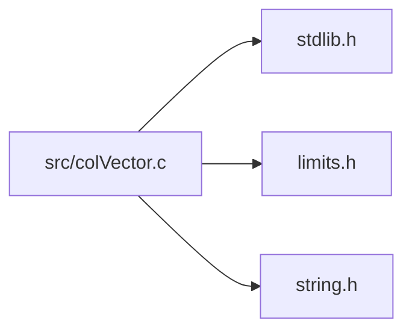

<a id="col_vector_8c"></a>
# File colVector.c

![][C++]

**Location**: `src/colVector.c`

This file implements the vector handling features of Colibri.

Vectors are arrays of words that are directly accessible through a pointer value.


They come in both immutable and mutable forms.


**See also**: colVector.h

## Includes

* [../include/colibri.h](colibri_8h.md#colibri_8h)
* [colInternal.h](col_internal_8h.md#col_internal_8h)
* [colWordInt.h](col_word_int_8h.md#col_word_int_8h)
* [colVectorInt.h](col_vector_int_8h.md#col_vector_int_8h)
* <stdlib.h>
* <limits.h>
* <string.h>



## Immutable Vector Creation

<a id="group__vector__words_1ga0f56e839c639b58511831658e6504ed7"></a>
### Function Col\_MaxVectorLength

![][public]

```cpp
size_t Col_MaxVectorLength()
```

Get the maximum length of a vector word.

**Returns**:

The max vector length.


**Parameters**:

* void

**Return type**: EXTERN size_t

<a id="group__vector__words_1ga6ef7d35d75fdc6a6781f0a32e9c7efc1"></a>
### Function Col\_NewVector

![][public]

```cpp
Col_Word Col_NewVector(size_t length, const Col_Word *elements)
```

Create a new vector word.

**Returns**:

The new word.

**Exceptions**:

* **[COL\_ERROR\_VECTORLENGTH](colibri_8h.md#group__error_1gga729084542ed9eae62009a84d3379ef35af25a0023745659d92b3ebd65d7c43bf3)**: [[V]](colibri_8h.md#group__error_1gga6dab009a0b8c4b4fa080cb9ba1859e9ea65d5e7232c82ae6972ac56f386a32fc9) **length < [Col\_MaxVectorLength()](col_vector_8h.md#group__vector__words_1ga0f56e839c639b58511831658e6504ed7)**: Vector too large.

**Parameters**:

* size_t **length**: Length of below array.
* const [Col\_Word](col_word_8h.md#group__words_1gadb626f9e195212e4fdfba7df154ad043) * **elements**: Array of words to populate vector with, or NULL. In the latter case, elements are initialized to nil.

**Return type**: EXTERN [Col\_Word](col_word_8h.md#group__words_1gadb626f9e195212e4fdfba7df154ad043)

<a id="group__vector__words_1gaa56f743590ca8867765f48e31e8a4df9"></a>
### Function Col\_NewVectorNV

![][public]

```cpp
Col_Word Col_NewVectorNV(size_t length, ...)
```

Create a new vector word from a list of arguments.

**Returns**:

The new word.

**Exceptions**:

* **[COL\_ERROR\_VECTORLENGTH](colibri_8h.md#group__error_1gga729084542ed9eae62009a84d3379ef35af25a0023745659d92b3ebd65d7c43bf3)**: [[V]](colibri_8h.md#group__error_1gga6dab009a0b8c4b4fa080cb9ba1859e9ea65d5e7232c82ae6972ac56f386a32fc9) **length < [Col\_MaxVectorLength()](col_vector_8h.md#group__vector__words_1ga0f56e839c639b58511831658e6504ed7)**: Vector too large.

**Parameters**:

* size_t **length**: Number of arguments following.
* ......: Words to add in order.

**Return type**: EXTERN [Col\_Word](col_word_8h.md#group__words_1gadb626f9e195212e4fdfba7df154ad043)

## Immutable Vector Accessors

<a id="group__vector__words_1gacd86c23d01fb36cd61e924e7c2f1ce3d"></a>
### Function Col\_VectorLength

![][public]

```cpp
size_t Col_VectorLength(Col_Word vector)
```

Get the length of the vector.

**Returns**:

The vector length.


**See also**: [Col\_NewVector](col_vector_8h.md#group__vector__words_1ga6ef7d35d75fdc6a6781f0a32e9c7efc1), [Col\_VectorElements](col_vector_8h.md#group__vector__words_1ga8067c81425c7b94800fd9f64a2fc2ec6)

**Exceptions**:

* **[COL\_ERROR\_VECTOR](colibri_8h.md#group__error_1gga729084542ed9eae62009a84d3379ef35a887698395dc0643aa2b4c0863ff6d8d4)**: [[T]](colibri_8h.md#group__error_1gga6dab009a0b8c4b4fa080cb9ba1859e9ea603a58b9d5bb16fde0708eb0767e4904) **vector**: Not a vector.

**Parameters**:

* [Col\_Word](col_word_8h.md#group__words_1gadb626f9e195212e4fdfba7df154ad043) **vector**: Vector to get length for.

**Return type**: EXTERN size_t

<a id="group__vector__words_1ga8067c81425c7b94800fd9f64a2fc2ec6"></a>
### Function Col\_VectorElements

![][public]

```cpp
const Col_Word * Col_VectorElements(Col_Word vector)
```

Get the vector element array.

**Returns**:

The vector element array.


**See also**: [Col\_NewVector](col_vector_8h.md#group__vector__words_1ga6ef7d35d75fdc6a6781f0a32e9c7efc1), [Col\_VectorLength](col_vector_8h.md#group__vector__words_1gacd86c23d01fb36cd61e924e7c2f1ce3d)

**Exceptions**:

* **[COL\_ERROR\_VECTOR](colibri_8h.md#group__error_1gga729084542ed9eae62009a84d3379ef35a887698395dc0643aa2b4c0863ff6d8d4)**: [[T]](colibri_8h.md#group__error_1gga6dab009a0b8c4b4fa080cb9ba1859e9ea603a58b9d5bb16fde0708eb0767e4904) **vector**: Not a vector.

**Parameters**:

* [Col\_Word](col_word_8h.md#group__words_1gadb626f9e195212e4fdfba7df154ad043) **vector**: Vector to get elements for.

**Return type**: EXTERN const [Col\_Word](col_word_8h.md#group__words_1gadb626f9e195212e4fdfba7df154ad043) *

## Mutable Vector Creation

<a id="group__mvector__words_1ga06679e6bd1bf66e8ed03a459c1bdf4fc"></a>
### Function Col\_MaxMVectorLength

![][public]

```cpp
size_t Col_MaxMVectorLength()
```

Get the maximum length of a mutable vector word.

**Returns**:

The max mutable vector length.


**Parameters**:

* void

**Return type**: EXTERN size_t

<a id="group__mvector__words_1ga5409a9871105f346b35ecd06d857e271"></a>
### Function Col\_NewMVector

![][public]

```cpp
Col_Word Col_NewMVector(size_t capacity, size_t length, const Col_Word *elements)
```

Create a new mutable vector word, and optionally populate with the given elements.

?> The actual capacity will be rounded up to fit allocated cells.


**Returns**:

The new word.

**Exceptions**:

* **[COL\_ERROR\_VECTORLENGTH](colibri_8h.md#group__error_1gga729084542ed9eae62009a84d3379ef35af25a0023745659d92b3ebd65d7c43bf3)**: [[V]](colibri_8h.md#group__error_1gga6dab009a0b8c4b4fa080cb9ba1859e9ea65d5e7232c82ae6972ac56f386a32fc9) **capacity < [Col\_MaxMVectorLength()](col_vector_8h.md#group__mvector__words_1ga06679e6bd1bf66e8ed03a459c1bdf4fc)**: Vector too large.

**Parameters**:

* size_t **capacity**: Maximum length of mutable vector.
* size_t **length**: Length of below array.
* const [Col\_Word](col_word_8h.md#group__words_1gadb626f9e195212e4fdfba7df154ad043) * **elements**: Array of words to populate vector with, or NULL. In the latter case, elements are initialized to nil.

**Return type**: EXTERN [Col\_Word](col_word_8h.md#group__words_1gadb626f9e195212e4fdfba7df154ad043)

## Mutable Vector Accessors

<a id="group__mvector__words_1ga326d17e21d65bda7559f5aa403a443a4"></a>
### Function Col\_MVectorCapacity

![][public]

```cpp
size_t Col_MVectorCapacity(Col_Word mvector)
```

Get the capacity = maximum length of the mutable vector.

**Returns**:

The mutable vector capacity.


**See also**: [Col\_NewMVector](col_vector_8h.md#group__mvector__words_1ga5409a9871105f346b35ecd06d857e271)

**Exceptions**:

* **[COL\_ERROR\_MVECTOR](colibri_8h.md#group__error_1gga729084542ed9eae62009a84d3379ef35ade4eb60e2eb216ed151689929db31d1c)**: [[T]](colibri_8h.md#group__error_1gga6dab009a0b8c4b4fa080cb9ba1859e9ea603a58b9d5bb16fde0708eb0767e4904) **mvector**: Not a mutable vector.

**Parameters**:

* [Col\_Word](col_word_8h.md#group__words_1gadb626f9e195212e4fdfba7df154ad043) **mvector**: Mutable vector to get capacity for.

**Return type**: EXTERN size_t

<a id="group__mvector__words_1gaf1cc0243830459f8ab39ba6d47c4074d"></a>
### Function Col\_MVectorElements

![][public]

```cpp
Col_Word * Col_MVectorElements(Col_Word mvector)
```

Get the mutable vector element array.

**Returns**:

The mutable vector element array.


**See also**: [Col\_VectorLength](col_vector_8h.md#group__vector__words_1gacd86c23d01fb36cd61e924e7c2f1ce3d)

**Exceptions**:

* **[COL\_ERROR\_MVECTOR](colibri_8h.md#group__error_1gga729084542ed9eae62009a84d3379ef35ade4eb60e2eb216ed151689929db31d1c)**: [[T]](colibri_8h.md#group__error_1gga6dab009a0b8c4b4fa080cb9ba1859e9ea603a58b9d5bb16fde0708eb0767e4904) **mvector**: Not a mutable vector.

**Parameters**:

* [Col\_Word](col_word_8h.md#group__words_1gadb626f9e195212e4fdfba7df154ad043) **mvector**: Mutable vector to get elements for.

**Return type**: EXTERN [Col\_Word](col_word_8h.md#group__words_1gadb626f9e195212e4fdfba7df154ad043) *

## Mutable Vector Operations

<a id="group__mvector__words_1ga549a713508a196e7ed9fb3cceb214e88"></a>
### Function Col\_MVectorSetLength

![][public]

```cpp
void Col_MVectorSetLength(Col_Word mvector, size_t length)
```

Resize the mutable vector.

Newly added elements are set to nil.

**Exceptions**:

* **[COL\_ERROR\_MVECTOR](colibri_8h.md#group__error_1gga729084542ed9eae62009a84d3379ef35ade4eb60e2eb216ed151689929db31d1c)**: [[T]](colibri_8h.md#group__error_1gga6dab009a0b8c4b4fa080cb9ba1859e9ea603a58b9d5bb16fde0708eb0767e4904) **mvector**: Not a mutable vector.
* **[COL\_ERROR\_VECTORLENGTH](colibri_8h.md#group__error_1gga729084542ed9eae62009a84d3379ef35af25a0023745659d92b3ebd65d7c43bf3)**: [[V]](colibri_8h.md#group__error_1gga6dab009a0b8c4b4fa080cb9ba1859e9ea65d5e7232c82ae6972ac56f386a32fc9) **length < [Col\_MVectorCapacity(mvector)](col_vector_8h.md#group__mvector__words_1ga326d17e21d65bda7559f5aa403a443a4).**: Vector too large.

**Parameters**:

* [Col\_Word](col_word_8h.md#group__words_1gadb626f9e195212e4fdfba7df154ad043) **mvector**: Mutable vector to resize.
* size_t **length**: New length. Must not exceed capacity set at creation time.

**Return type**: EXTERN void

<a id="group__mvector__words_1ga1d93d2437dc1066b87d82d49aec779f1"></a>
### Function Col\_MVectorFreeze

![][public]

```cpp
void Col_MVectorFreeze(Col_Word mvector)
```

Turn a mutable vector immutable.

Does nothing on immutable vectors.

**Exceptions**:

* **[COL\_ERROR\_VECTOR](colibri_8h.md#group__error_1gga729084542ed9eae62009a84d3379ef35a887698395dc0643aa2b4c0863ff6d8d4)**: [[T]](colibri_8h.md#group__error_1gga6dab009a0b8c4b4fa080cb9ba1859e9ea603a58b9d5bb16fde0708eb0767e4904) **mvector**: Not a vector.

**Parameters**:

* [Col\_Word](col_word_8h.md#group__words_1gadb626f9e195212e4fdfba7df154ad043) **mvector**: Mutable vector to freeze.

**Return type**: EXTERN void

## Source

```cpp
/**
 * @file colVector.c
 *
 * This file implements the vector handling features of Colibri.
 *
 * Vectors are arrays of words that are directly accessible through a
 * pointer value.
 *
 * They come in both immutable and mutable forms.
 *
 * @see colVector.h
 */

#include "../include/colibri.h"
#include "colInternal.h"

#include "colWordInt.h"
#include "colVectorInt.h"

#include <stdlib.h>
#include <limits.h>
#include <string.h>


/*
===========================================================================*//*!
\weakgroup vector_words Immutable Vectors
\{*//*==========================================================================
*/

/*******************************************************************************
 * Immutable Vector Creation
 ******************************************************************************/

/**
 * Get the maximum length of a vector word.
 *
 * @return The max vector length.
 */
size_t
Col_MaxVectorLength()
{
    return VECTOR_MAX_LENGTH(VECTOR_MAX_SIZE);
}

/**
 * Create a new vector word.
 *
 * @return The new word.
 */
Col_Word
Col_NewVector(
    size_t length,              /*!< Length of below array. */
    const Col_Word * elements)  /*!< Array of words to populate vector with, or
                                     NULL. In the latter case, elements are
                                     initialized to nil. */
{
    Col_Word vector;            /* Resulting word in the general case. */

    /*
     * Check preconditions.
     */

    /*! @valuecheck{COL_ERROR_VECTORLENGTH,length < Col_MaxVectorLength()} */
    VALUECHECK_VECTORLENGTH(length, VECTOR_MAX_LENGTH(VECTOR_MAX_SIZE))
            return WORD_NIL;

    if (length == 0) {
        /*
         * Use immediate value.
         */

        return WORD_LIST_EMPTY;
    }

    /*
     * Create a new vector word.
     */

    vector = (Col_Word) AllocCells(VECTOR_SIZE(length));
    WORD_VECTOR_INIT(vector, length);
    if (elements) {
        /*
         * Copy elements.
         */

        memcpy(WORD_VECTOR_ELEMENTS(vector), elements, length
                * sizeof(Col_Word));
    } else {
        /*
         * Initialize elements to nil.
         */

        memset(WORD_VECTOR_ELEMENTS(vector), 0, length
                * sizeof(Col_Word));
    }

    return vector;
}

/**
 * Create a new vector word from a list of arguments.
 *
 * @return The new word.
 */
Col_Word
Col_NewVectorNV(
    size_t length,  /*!< Number of arguments following. */
    ...)            /*!< Words to add in order. */
{
    size_t i;
    va_list args;
    Col_Word vector, *elements;

    /*
     * Check preconditions.
     */

    /*! @valuecheck{COL_ERROR_VECTORLENGTH,length < Col_MaxVectorLength()} */
    VALUECHECK_VECTORLENGTH(length, VECTOR_MAX_LENGTH(VECTOR_MAX_SIZE))
            return WORD_NIL;

    if (length == 0) {
        /*
         * Use immediate value.
         */

        return WORD_LIST_EMPTY;
    }

    /*
     * Create a new vector word.
     */

    vector = (Col_Word) AllocCells(VECTOR_SIZE(length));
    WORD_VECTOR_INIT(vector, length);
    elements = WORD_VECTOR_ELEMENTS(vector);
    va_start(args, length);
    for (i=0; i < length; i++) {
        elements[i] = va_arg(args, Col_Word);
    }
    va_end(args);

    return vector;
}

/* End of Immutable Vector Creation */


/*******************************************************************************
 * Immutable Vector Accessors
 ******************************************************************************/

/**
 * Get the length of the vector.
 *
 * @return The vector length.
 *
 * @see Col_NewVector
 * @see Col_VectorElements
 */
size_t
Col_VectorLength(
    Col_Word vector)    /*!< Vector to get length for. */
{
    /*
     * Check preconditions.
     */

    /*! @typecheck{COL_ERROR_VECTOR,vector} */
    TYPECHECK_VECTOR(vector) return 0;

    WORD_UNWRAP(vector);

    switch (WORD_TYPE(vector)) {
    case WORD_TYPE_VECTOR:
    case WORD_TYPE_MVECTOR:
        return WORD_VECTOR_LENGTH(vector);

    case WORD_TYPE_VOIDLIST:
        ASSERT(WORD_VOIDLIST_LENGTH(vector) == 0);
        return 0;

    /* WORD_TYPE_UNKNOWN */

    default:
        /*CANTHAPPEN*/
        ASSERT(0);
        return 0;
    }
}

/**
 * Get the vector element array.
 *
 * @return The vector element array.
 *
 * @see Col_NewVector
 * @see Col_VectorLength
 */
const Col_Word *
Col_VectorElements(
    Col_Word vector)    /*!< Vector to get elements for. */
{
    /*
     * Check preconditions.
     */

    /*! @typecheck{COL_ERROR_VECTOR,vector} */
    TYPECHECK_VECTOR(vector) return NULL;

    WORD_UNWRAP(vector);

    switch (WORD_TYPE(vector)) {
    case WORD_TYPE_VECTOR:
    case WORD_TYPE_MVECTOR:
        return WORD_VECTOR_ELEMENTS(vector);

    case WORD_TYPE_VOIDLIST:
        ASSERT(WORD_VOIDLIST_LENGTH(vector) == 0);
        return NULL;

    /* WORD_TYPE_UNKNOWN */

    default:
        /*CANTHAPPEN*/
        ASSERT(0);
        return 0;
    }
}

/* End of Immutable Vector Accessors */

/* End of Immutable Vectors *//*!\}*/


/*
===========================================================================*//*!
\weakgroup mvector_words Mutable Vectors
\{*//*==========================================================================
*/

/*******************************************************************************
 * Mutable Vector Creation
 ******************************************************************************/

/**
 * Get the maximum length of a mutable vector word.
 *
 * @return The max mutable vector length.
 */
size_t
Col_MaxMVectorLength()
{
    return VECTOR_MAX_LENGTH(MVECTOR_MAX_SIZE * CELL_SIZE);
}

/**
 * Create a new mutable vector word, and optionally populate with the
 * given elements.
 *
 * @note
 *      The actual capacity will be rounded up to fit allocated cells.
 *
 * @return The new word.
 */
Col_Word
Col_NewMVector(
    size_t capacity,            /*!< Maximum length of mutable vector. */
    size_t length,              /*!< Length of below array. */
    const Col_Word * elements)  /*!< Array of words to populate vector with, or
                                     NULL. In the latter case, elements are
                                     initialized to nil. */
{
    Col_Word mvector;           /* Resulting word in the general case. */
    size_t size;                /* Number of allocated cells storing a minimum
                                 * of **capacity** elements. */

    /*
     * Normalize capacity.
     */

    if (capacity < length) {
        capacity = length;
    }

    /*
     * Check preconditions.
     */

    /*! @valuecheck{COL_ERROR_VECTORLENGTH,capacity < Col_MaxMVectorLength()} */
    VALUECHECK_VECTORLENGTH(capacity,
            VECTOR_MAX_LENGTH(MVECTOR_MAX_SIZE * CELL_SIZE)) return WORD_NIL;

    /*
     * Create a new mutable vector word.
     */

    size = VECTOR_SIZE(capacity);
    mvector = (Col_Word) AllocCells(size);
    WORD_MVECTOR_INIT(mvector, size, length);
    if (length > 0) {
        if (elements) {
            /*
             * Copy elements.
             */

            memcpy(WORD_VECTOR_ELEMENTS(mvector), elements, length
                    * sizeof(Col_Word));
        } else {
            /*
             * Initialize elements to nil.
             */

            memset(WORD_VECTOR_ELEMENTS(mvector), 0, length
                    * sizeof(Col_Word));
        }
    }

    return mvector;
}

/* End of Mutable Vector Creation */


/*******************************************************************************
 * Mutable Vector Accessors
 ******************************************************************************/

/**
 * Get the capacity = maximum length of the mutable vector.
 *
 * @return The mutable vector capacity.
 *
 * @see Col_NewMVector
 */
size_t
Col_MVectorCapacity(
    Col_Word mvector)   /*!< Mutable vector to get capacity for. */
{
    /*
     * Check preconditions.
     */

    /*! @typecheck{COL_ERROR_MVECTOR,mvector} */
    TYPECHECK_MVECTOR(mvector) return 0;

    WORD_UNWRAP(mvector);

    return VECTOR_MAX_LENGTH(WORD_MVECTOR_SIZE(mvector) * CELL_SIZE);
}

/**
 * Get the mutable vector element array.
 *
 * @return The mutable vector element array.
 *
 * @see Col_VectorLength
 */
Col_Word *
Col_MVectorElements(
    Col_Word mvector)   /*!< Mutable vector to get elements for. */
{
    /*
     * Check preconditions.
     */

    /*! @typecheck{COL_ERROR_MVECTOR,mvector} */
    TYPECHECK_MVECTOR(mvector) return NULL;

    WORD_UNWRAP(mvector);

    return WORD_VECTOR_ELEMENTS(mvector);
}

/* End of Mutable Vector Accessors */


/*******************************************************************************
 * Mutable Vector Operations
 ******************************************************************************/

/**
 * Resize the mutable vector. Newly added elements are set to nil.
 */
void
Col_MVectorSetLength(
    Col_Word mvector,   /*!< Mutable vector to resize. */
    size_t length)      /*!< New length. Must not exceed capacity set at
                             creation time. */
{
    size_t capacity, oldLength;

    /*
     * Check preconditions.
     */

    /*! @typecheck{COL_ERROR_MVECTOR,mvector} */
    TYPECHECK_MVECTOR(mvector) return;

    WORD_UNWRAP(mvector);

    /*! @valuecheck{COL_ERROR_VECTORLENGTH,length < [Col_MVectorCapacity(mvector)](@ref Col_MVectorCapacity).} */
    capacity = VECTOR_MAX_LENGTH(WORD_MVECTOR_SIZE(mvector) * CELL_SIZE);
    VALUECHECK_VECTORLENGTH(length, capacity) return;

    oldLength = WORD_VECTOR_LENGTH(mvector);
    if (length > oldLength) {
        /*
         * Initialize elements to nil.
         */

        memset(WORD_VECTOR_ELEMENTS(mvector) + oldLength, 0, (length
                - oldLength)*sizeof(Col_Word));
    }
    WORD_VECTOR_LENGTH(mvector) = length;
}

/**
 * Turn a mutable vector immutable. Does nothing on immutable vectors.
 */
void
Col_MVectorFreeze(
    Col_Word mvector)   /*!< Mutable vector to freeze. */
{
    /*
     * Check preconditions.
     */

    /*! @typecheck{COL_ERROR_VECTOR,mvector} */
    TYPECHECK_VECTOR(mvector) return;

    for (;;) {
        switch (WORD_TYPE(mvector)) {
        case WORD_TYPE_WRAP:
            mvector = WORD_WRAP_SOURCE(mvector);
            continue;

        case WORD_TYPE_VOIDLIST:
        case WORD_TYPE_VECTOR:
            /*
             * No-op.
             */

            return;

        case WORD_TYPE_MVECTOR: {
            /*
             * Simply change type ID. Don't mark extraneous cells, they will
             * be collected during GC.
             */

            int pinned = WORD_PINNED(mvector);
            WORD_SET_TYPEID(mvector, WORD_TYPE_VECTOR);
            if (pinned) {
                WORD_SET_PINNED(mvector);
            }
            return;
        }

        /* WORD_TYPE_UNKNOWN */

        default:
            /* CANTHAPPEN */
            ASSERT(0);
        }
    }
}

/* End of Mutable Vector Operations */

/* End of Immutable Vectors *//*!\}*/
```

[public]: https://img.shields.io/badge/-public-brightgreen (public)
[C++]: https://img.shields.io/badge/language-C%2B%2B-blue (C++)
[Markdown]: https://img.shields.io/badge/language-Markdown-blue (Markdown)
[private]: https://img.shields.io/badge/-private-red (private)
[static]: https://img.shields.io/badge/-static-lightgrey (static)