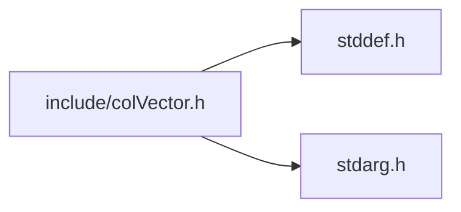

<a id="col_vector_8h"></a>
# File colVector.h

![][C++]

**Location**: `include/colVector.h`

This header file defines the vector handling features of Colibri.

Vectors are arrays of words that are directly accessible through a pointer value.


They come in both immutable and mutable forms.

## Includes

* <stddef.h>
* <stdarg.h>



## Included by

* [include/colibri.h](colibri_8h.md#colibri_8h)

## Immutable Vector Creation

<a id="group__vector__words_1ga35b8a2126b4cddb7f57ae71634fdc61c"></a>
### Macro Col\_NewVectorV

![][public]

```cpp
#define Col_NewVectorV( first ,... )
```

Variadic macro version of [Col\_NewVectorNV()](col_vector_8h.md#group__vector__words_1gaa56f743590ca8867765f48e31e8a4df9) that deduces its number of arguments automatically.

**Parameters**:

* **first**: First word to add.
* **...**: Next words to add.


**See also**: [COL\_ARGCOUNT](col_utils_8h.md#group__utils_1gabbb0e58841406f54d444d40625a2c4fe)


<a id="group__vector__words_1ga0f56e839c639b58511831658e6504ed7"></a>
### Function Col\_MaxVectorLength

![][public]

```cpp
size_t Col_MaxVectorLength()
```

Get the maximum length of a vector word.

**Returns**:

The max vector length.


**Parameters**:

* void

**Return type**: EXTERN size_t

<a id="group__vector__words_1ga6ef7d35d75fdc6a6781f0a32e9c7efc1"></a>
### Function Col\_NewVector

![][public]

```cpp
Col_Word Col_NewVector(size_t length, const Col_Word *elements)
```

Create a new vector word.

**Returns**:

The new word.

**Exceptions**:

* **[COL\_ERROR\_VECTORLENGTH](colibri_8h.md#group__error_1gga729084542ed9eae62009a84d3379ef35af25a0023745659d92b3ebd65d7c43bf3)**: [[V]](colibri_8h.md#group__error_1gga6dab009a0b8c4b4fa080cb9ba1859e9ea65d5e7232c82ae6972ac56f386a32fc9) **length < [Col\_MaxVectorLength()](col_vector_8h.md#group__vector__words_1ga0f56e839c639b58511831658e6504ed7)**: Vector too large.

**Parameters**:

* size_t **length**: Length of below array.
* const [Col\_Word](col_word_8h.md#group__words_1gadb626f9e195212e4fdfba7df154ad043) * **elements**: Array of words to populate vector with, or NULL. In the latter case, elements are initialized to nil.

**Return type**: EXTERN [Col\_Word](col_word_8h.md#group__words_1gadb626f9e195212e4fdfba7df154ad043)

<a id="group__vector__words_1gaa56f743590ca8867765f48e31e8a4df9"></a>
### Function Col\_NewVectorNV

![][public]

```cpp
Col_Word Col_NewVectorNV(size_t length, ...)
```

Create a new vector word from a list of arguments.

**Returns**:

The new word.

**Exceptions**:

* **[COL\_ERROR\_VECTORLENGTH](colibri_8h.md#group__error_1gga729084542ed9eae62009a84d3379ef35af25a0023745659d92b3ebd65d7c43bf3)**: [[V]](colibri_8h.md#group__error_1gga6dab009a0b8c4b4fa080cb9ba1859e9ea65d5e7232c82ae6972ac56f386a32fc9) **length < [Col\_MaxVectorLength()](col_vector_8h.md#group__vector__words_1ga0f56e839c639b58511831658e6504ed7)**: Vector too large.

**Parameters**:

* size_t **length**: Number of arguments following.
* ......: Words to add in order.

**Return type**: EXTERN [Col\_Word](col_word_8h.md#group__words_1gadb626f9e195212e4fdfba7df154ad043)

## Immutable Vector Accessors

<a id="group__vector__words_1gacd86c23d01fb36cd61e924e7c2f1ce3d"></a>
### Function Col\_VectorLength

![][public]

```cpp
size_t Col_VectorLength(Col_Word vector)
```

Get the length of the vector.

**Returns**:

The vector length.


**See also**: [Col\_NewVector](col_vector_8h.md#group__vector__words_1ga6ef7d35d75fdc6a6781f0a32e9c7efc1), [Col\_VectorElements](col_vector_8h.md#group__vector__words_1ga8067c81425c7b94800fd9f64a2fc2ec6)

**Exceptions**:

* **[COL\_ERROR\_VECTOR](colibri_8h.md#group__error_1gga729084542ed9eae62009a84d3379ef35a887698395dc0643aa2b4c0863ff6d8d4)**: [[T]](colibri_8h.md#group__error_1gga6dab009a0b8c4b4fa080cb9ba1859e9ea603a58b9d5bb16fde0708eb0767e4904) **vector**: Not a vector.

**Parameters**:

* [Col\_Word](col_word_8h.md#group__words_1gadb626f9e195212e4fdfba7df154ad043) **vector**: Vector to get length for.

**Return type**: EXTERN size_t

<a id="group__vector__words_1ga8067c81425c7b94800fd9f64a2fc2ec6"></a>
### Function Col\_VectorElements

![][public]

```cpp
const Col_Word * Col_VectorElements(Col_Word vector)
```

Get the vector element array.

**Returns**:

The vector element array.


**See also**: [Col\_NewVector](col_vector_8h.md#group__vector__words_1ga6ef7d35d75fdc6a6781f0a32e9c7efc1), [Col\_VectorLength](col_vector_8h.md#group__vector__words_1gacd86c23d01fb36cd61e924e7c2f1ce3d)

**Exceptions**:

* **[COL\_ERROR\_VECTOR](colibri_8h.md#group__error_1gga729084542ed9eae62009a84d3379ef35a887698395dc0643aa2b4c0863ff6d8d4)**: [[T]](colibri_8h.md#group__error_1gga6dab009a0b8c4b4fa080cb9ba1859e9ea603a58b9d5bb16fde0708eb0767e4904) **vector**: Not a vector.

**Parameters**:

* [Col\_Word](col_word_8h.md#group__words_1gadb626f9e195212e4fdfba7df154ad043) **vector**: Vector to get elements for.

**Return type**: EXTERN const [Col\_Word](col_word_8h.md#group__words_1gadb626f9e195212e4fdfba7df154ad043) *

## Mutable Vector Creation

<a id="group__mvector__words_1ga06679e6bd1bf66e8ed03a459c1bdf4fc"></a>
### Function Col\_MaxMVectorLength

![][public]

```cpp
size_t Col_MaxMVectorLength()
```

Get the maximum length of a mutable vector word.

**Returns**:

The max mutable vector length.


**Parameters**:

* void

**Return type**: EXTERN size_t

<a id="group__mvector__words_1ga5409a9871105f346b35ecd06d857e271"></a>
### Function Col\_NewMVector

![][public]

```cpp
Col_Word Col_NewMVector(size_t capacity, size_t length, const Col_Word *elements)
```

Create a new mutable vector word, and optionally populate with the given elements.

?> The actual capacity will be rounded up to fit allocated cells.


**Returns**:

The new word.

**Exceptions**:

* **[COL\_ERROR\_VECTORLENGTH](colibri_8h.md#group__error_1gga729084542ed9eae62009a84d3379ef35af25a0023745659d92b3ebd65d7c43bf3)**: [[V]](colibri_8h.md#group__error_1gga6dab009a0b8c4b4fa080cb9ba1859e9ea65d5e7232c82ae6972ac56f386a32fc9) **capacity < [Col\_MaxMVectorLength()](col_vector_8h.md#group__mvector__words_1ga06679e6bd1bf66e8ed03a459c1bdf4fc)**: Vector too large.

**Parameters**:

* size_t **capacity**: Maximum length of mutable vector.
* size_t **length**: Length of below array.
* const [Col\_Word](col_word_8h.md#group__words_1gadb626f9e195212e4fdfba7df154ad043) * **elements**: Array of words to populate vector with, or NULL. In the latter case, elements are initialized to nil.

**Return type**: EXTERN [Col\_Word](col_word_8h.md#group__words_1gadb626f9e195212e4fdfba7df154ad043)

## Mutable Vector Accessors

<a id="group__mvector__words_1ga326d17e21d65bda7559f5aa403a443a4"></a>
### Function Col\_MVectorCapacity

![][public]

```cpp
size_t Col_MVectorCapacity(Col_Word mvector)
```

Get the capacity = maximum length of the mutable vector.

**Returns**:

The mutable vector capacity.


**See also**: [Col\_NewMVector](col_vector_8h.md#group__mvector__words_1ga5409a9871105f346b35ecd06d857e271)

**Exceptions**:

* **[COL\_ERROR\_MVECTOR](colibri_8h.md#group__error_1gga729084542ed9eae62009a84d3379ef35ade4eb60e2eb216ed151689929db31d1c)**: [[T]](colibri_8h.md#group__error_1gga6dab009a0b8c4b4fa080cb9ba1859e9ea603a58b9d5bb16fde0708eb0767e4904) **mvector**: Not a mutable vector.

**Parameters**:

* [Col\_Word](col_word_8h.md#group__words_1gadb626f9e195212e4fdfba7df154ad043) **mvector**: Mutable vector to get capacity for.

**Return type**: EXTERN size_t

<a id="group__mvector__words_1gaf1cc0243830459f8ab39ba6d47c4074d"></a>
### Function Col\_MVectorElements

![][public]

```cpp
Col_Word * Col_MVectorElements(Col_Word mvector)
```

Get the mutable vector element array.

**Returns**:

The mutable vector element array.


**See also**: [Col\_VectorLength](col_vector_8h.md#group__vector__words_1gacd86c23d01fb36cd61e924e7c2f1ce3d)

**Exceptions**:

* **[COL\_ERROR\_MVECTOR](colibri_8h.md#group__error_1gga729084542ed9eae62009a84d3379ef35ade4eb60e2eb216ed151689929db31d1c)**: [[T]](colibri_8h.md#group__error_1gga6dab009a0b8c4b4fa080cb9ba1859e9ea603a58b9d5bb16fde0708eb0767e4904) **mvector**: Not a mutable vector.

**Parameters**:

* [Col\_Word](col_word_8h.md#group__words_1gadb626f9e195212e4fdfba7df154ad043) **mvector**: Mutable vector to get elements for.

**Return type**: EXTERN [Col\_Word](col_word_8h.md#group__words_1gadb626f9e195212e4fdfba7df154ad043) *

## Mutable Vector Operations

<a id="group__mvector__words_1ga549a713508a196e7ed9fb3cceb214e88"></a>
### Function Col\_MVectorSetLength

![][public]

```cpp
void Col_MVectorSetLength(Col_Word mvector, size_t length)
```

Resize the mutable vector.

Newly added elements are set to nil.

**Exceptions**:

* **[COL\_ERROR\_MVECTOR](colibri_8h.md#group__error_1gga729084542ed9eae62009a84d3379ef35ade4eb60e2eb216ed151689929db31d1c)**: [[T]](colibri_8h.md#group__error_1gga6dab009a0b8c4b4fa080cb9ba1859e9ea603a58b9d5bb16fde0708eb0767e4904) **mvector**: Not a mutable vector.
* **[COL\_ERROR\_VECTORLENGTH](colibri_8h.md#group__error_1gga729084542ed9eae62009a84d3379ef35af25a0023745659d92b3ebd65d7c43bf3)**: [[V]](colibri_8h.md#group__error_1gga6dab009a0b8c4b4fa080cb9ba1859e9ea65d5e7232c82ae6972ac56f386a32fc9) **length < [Col\_MVectorCapacity(mvector)](col_vector_8h.md#group__mvector__words_1ga326d17e21d65bda7559f5aa403a443a4).**: Vector too large.

**Parameters**:

* [Col\_Word](col_word_8h.md#group__words_1gadb626f9e195212e4fdfba7df154ad043) **mvector**: Mutable vector to resize.
* size_t **length**: New length. Must not exceed capacity set at creation time.

**Return type**: EXTERN void

<a id="group__mvector__words_1ga1d93d2437dc1066b87d82d49aec779f1"></a>
### Function Col\_MVectorFreeze

![][public]

```cpp
void Col_MVectorFreeze(Col_Word mvector)
```

Turn a mutable vector immutable.

Does nothing on immutable vectors.

**Exceptions**:

* **[COL\_ERROR\_VECTOR](colibri_8h.md#group__error_1gga729084542ed9eae62009a84d3379ef35a887698395dc0643aa2b4c0863ff6d8d4)**: [[T]](colibri_8h.md#group__error_1gga6dab009a0b8c4b4fa080cb9ba1859e9ea603a58b9d5bb16fde0708eb0767e4904) **mvector**: Not a vector.

**Parameters**:

* [Col\_Word](col_word_8h.md#group__words_1gadb626f9e195212e4fdfba7df154ad043) **mvector**: Mutable vector to freeze.

**Return type**: EXTERN void

## Source

```cpp
/**
 * @file colVector.h
 *
 * This header file defines the vector handling features of Colibri.
 *
 * Vectors are arrays of words that are directly accessible through a
 * pointer value.
 *
 * They come in both immutable and mutable forms.
 */

#ifndef _COLIBRI_VECTOR
#define _COLIBRI_VECTOR

#include <stddef.h> /* For size_t */
#include <stdarg.h> /* For variadic procs */


/*
===========================================================================*//*!
\defgroup vector_words Immutable Vectors
\ingroup words

Immutable vectors are constant, fixed-length arrays of words that are directly
accessible through a pointer value.
\{*//*==========================================================================
*/

/***************************************************************************//*!
 * \name Immutable Vector Creation
 ***************************************************************************\{*/

/**
 * Variadic macro version of Col_NewVectorNV() that deduces its number
 * of arguments automatically.
 *
 * @param first First word to add.
 * @param ...   Next words to add.
 * 
 * @see COL_ARGCOUNT
 */
#define Col_NewVectorV(first, ...) \
    _Col_NewVectorV(_, first, ##__VA_ARGS__)
/*! \cond IGNORE */
#define _Col_NewVectorV(_, ...) \
    Col_NewVectorNV(COL_ARGCOUNT(__VA_ARGS__),__VA_ARGS__)
/*! \endcond *//* IGNORE */

/*
 * Remaining declarations.
 */

EXTERN size_t           Col_MaxVectorLength(void);
EXTERN Col_Word         Col_NewVector(size_t length,
                            const Col_Word * elements);
EXTERN Col_Word         Col_NewVectorNV(size_t length, ...);

/* End of Immutable Vector Creation *//*!\}*/


/***************************************************************************//*!
 * \name Immutable Vector Accessors
 ***************************************************************************\{*/

EXTERN size_t           Col_VectorLength(Col_Word vector);
EXTERN const Col_Word * Col_VectorElements(Col_Word vector);

/* End of Immutable Vector Accessors *//*!\}*/

/* End of Immutable Vectors *//*!\}*/


/*
===========================================================================*//*!
\defgroup mvector_words Mutable Vectors
\ingroup words

Mutable vectors are arrays of words that are directly accessible and
modifiable through a pointer value, and whose length can vary up to a
given capacity set at creation time; they can be"frozen" and turned into
immutable vectors.
\{*//*==========================================================================
*/

/***************************************************************************//*!
 * \name Mutable Vector Creation
 ***************************************************************************\{*/

EXTERN size_t           Col_MaxMVectorLength(void);
EXTERN Col_Word         Col_NewMVector(size_t capacity, size_t length,
                            const Col_Word * elements);

/* End of Mutable Vector Creation *//*!\}*/


/***************************************************************************//*!
 * \name Mutable Vector Accessors
 ***************************************************************************\{*/

EXTERN size_t           Col_MVectorCapacity(Col_Word mvector);
EXTERN Col_Word *       Col_MVectorElements(Col_Word mvector);

/* End of Mutable Vector Accessors *//*!\}*/


/***************************************************************************//*!
 * \name Mutable Vector Operations
 ***************************************************************************\{*/

EXTERN void             Col_MVectorSetLength(Col_Word mvector, size_t length);
EXTERN void             Col_MVectorFreeze(Col_Word mvector);

/* End of Mutable Vector Operations *//*!\}*/

/* End of Mutable Vectors *//*!\}*/

#endif /* _COLIBRI_VECTOR */
```

[public]: https://img.shields.io/badge/-public-brightgreen (public)
[C++]: https://img.shields.io/badge/language-C%2B%2B-blue (C++)